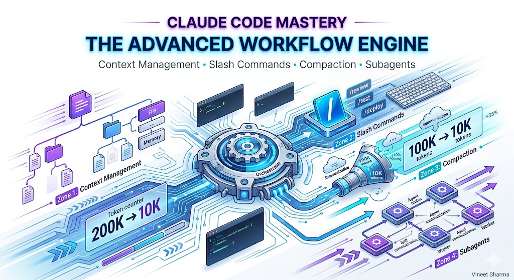
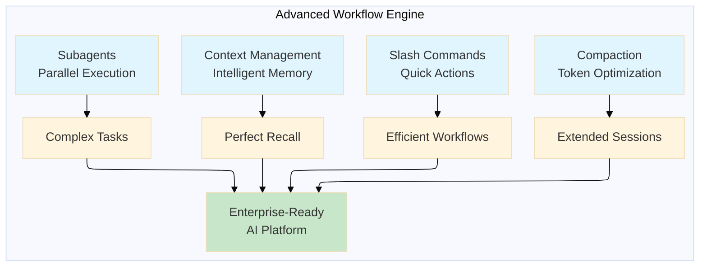
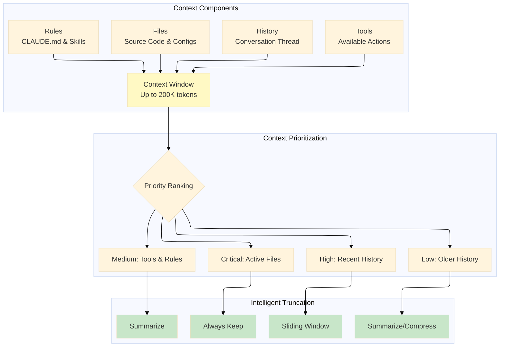
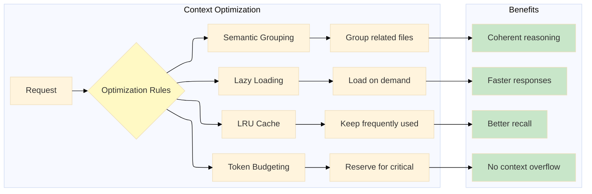
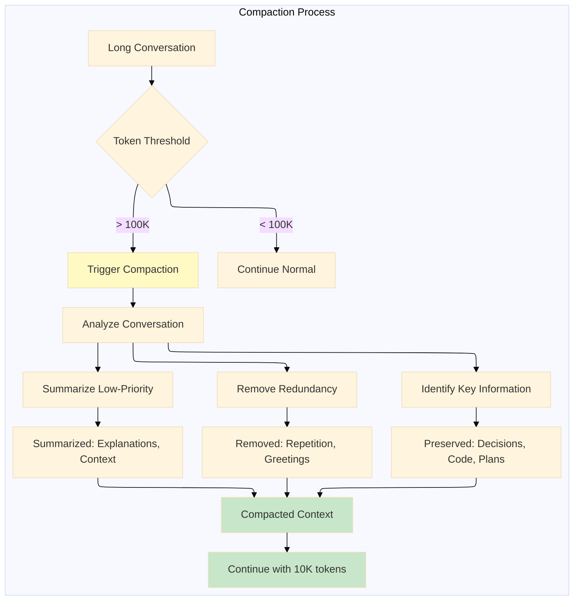
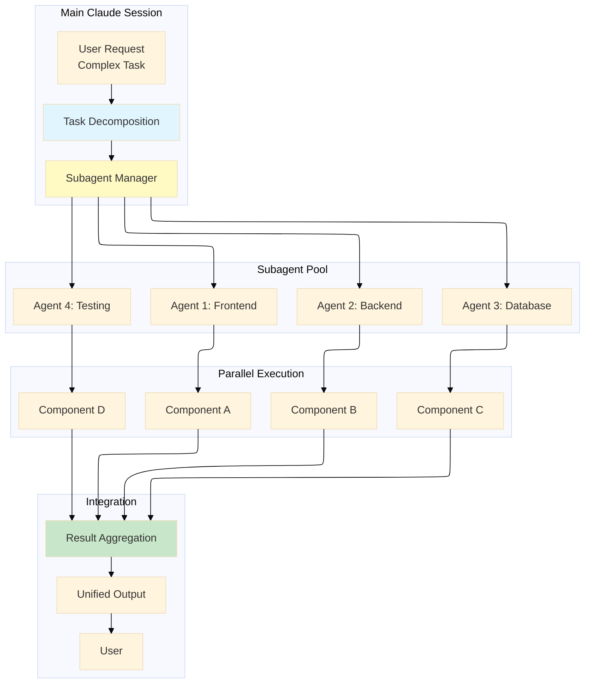
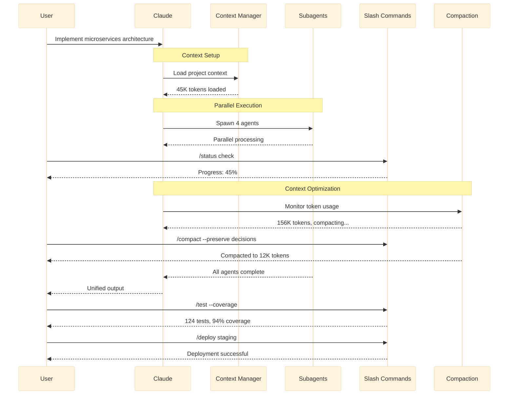

# Claude Code Mastery - The Advanced Workflow Engine

### Mastering parallel execution, custom command shortcuts, token optimization strategies, and dividing complex tasks into scalable AI workflows.

## 

# Introduction: Orchestrating Complex Development Workflows

**Context Management, Slash Commands, Compaction, and Subagents**

In Story 1, we built a foundation of safety and control. In Story 2, we extended Claude's capabilities with reusable skills and external integrations. Now, in Story 3, we'll explore the advanced workflow engine that transforms Claude from a conversational assistant into an orchestration platform capable of handling complex, multi-step, and parallel tasks.

Imagine being able to:

- Maintain perfect context across 100,000+ token conversations
- Trigger complex workflows with a single slash command
- Compress lengthy discussions without losing critical information
- Spawn parallel AI agents to tackle different aspects of a problem simultaneously

These four features—**Context Management**, **Slash Commands**, **Compaction**, and **Subagents**—represent the difference between using Claude as a simple Q&A tool and deploying it as a true autonomous development platform.



---

## Complete Claude Code Mastery Series (4 stories):

- 🧠 **[1. Claude Code Mastery - The Memory & Control Layer: CLAUDE.md, Permissions, Plan Mode, and Checkpoints](#)** – A deep dive into project memory, security boundaries, surgical precision with Plan Mode, and the safety net of automatic Git snapshots.
- 🔧 **[2. Claude Code Mastery - The Extension & Integration Framework: Skills, Hooks, MCP, and Plugins](#)** – How to build reusable instructions, trigger automated workflows, connect Claude to external databases/APIs, and extend functionality with community plugins.
- ⚡ **[3. Claude Code Mastery - The Advanced Workflow Engine: Context Management, Slash Commands, Compaction, and Subagents](#)** – Mastering parallel execution, custom command shortcuts, token optimization strategies, and dividing complex tasks into scalable AI workflows. *(This story)*
- 🏗️ **[4. Claude Code Mastery - From Terminal to IDE: Complete VS Code Integration & Real-World Project Workflow](#)** – A hands-on guide to integrating Claude Code with VS Code, building a complete microservices project from scratch, and establishing production-ready development workflows.

---

## Feature 9: Context Management — Intelligent Memory Architecture

Context Management is the invisible engine that ensures Claude remembers what matters across long, complex sessions. It intelligently manages files, history, tools, and rules to maintain coherence without overwhelming the model's context window.

### Context Architecture



### Step-by-Step Context Management

#### Step 1: Understanding Context Components

Context in Claude Code consists of four primary components:

```yaml
context_components:
  files:
    description: "Source code, configuration files, and documents"
    management: "Auto-loaded based on relevance"
    priority: "Critical"
    
  history:
    description: "Conversation thread and previous interactions"
    management: "Sliding window with intelligent summarization"
    priority: "High"
    
  tools:
    description: "Available commands and capabilities"
    management: "Dynamic based on permissions"
    priority: "Medium"
    
  rules:
    description: "CLAUDE.md, skills, and project standards"
    management: "Loaded at session start, cached"
    priority: "Medium"
```

#### Step 2: View Context Usage

During a session, monitor context usage:

```bash
> /context show
```

**Expected Output:**

```
📊 Context Usage Report

Total Tokens: 45,231 / 200,000 (22.6%)

Breakdown by Component:
┌─────────────────┬──────────┬────────────┬─────────────┐
│ Component       │ Tokens   │ Percentage │ Priority    │
├─────────────────┼──────────┼────────────┼─────────────┤
│ Files           │ 18,234   │ 40.3%      │ Critical    │
│   src/          │ 12,456   │            │             │
│   tests/        │ 3,234    │            │             │
│   docs/         │ 2,544    │            │             │
├─────────────────┼──────────┼────────────┼─────────────┤
│ History         │ 15,678   │ 34.7%      │ High        │
│   Last 10 turns │ 8,234    │            │             │
│   Older turns   │ 7,444    │            │             │
├─────────────────┼──────────┼────────────┼─────────────┤
│ Tools           │ 6,543    │ 14.5%      │ Medium      │
├─────────────────┼──────────┼────────────┼─────────────┤
│ Rules           │ 4,776    │ 10.5%      │ Medium      │
│   CLAUDE.md     │ 2,345    │            │             │
│   Skills        │ 2,431    │            │             │
└─────────────────┴──────────┴────────────┴─────────────┘

Active Files in Context:
📁 src/services/payment_service.py (4,234 tokens)
📁 src/api/payments.py (2,123 tokens)
📁 tests/unit/test_payment.py (1,876 tokens)

Recently Accessed:
📁 src/models/order.py (1,234 tokens - will expire soon)

Estimated remaining capacity: ~154,769 tokens
Recommendation: Context healthy, continue working
```

#### Step 3: Manual Context Management

Control what stays in context:

```bash
> /context pin src/services/auth_service.py
```

**Expected Output:**

```
📌 Pinned: src/services/auth_service.py

This file will be retained in context regardless of activity.
Pinned files are exempt from automatic context pruning.

Current pinned files:
  📌 src/services/auth_service.py
  📌 src/models/user.py
  📌 CLAUDE.md

To unpin: /context unpin <file>
```

```bash
> /context forget tests/old/test_deprecated.py
```

**Expected Output:**

```
🗑️ Removed from context: tests/old/test_deprecated.py

Freed 2,345 tokens
Current context usage: 42,886 / 200,000 (21.4%)
```

#### Step 4: Intelligent Context Loading

Claude automatically loads relevant files based on conversation:

**Example Session:**

```
> I need to modify the payment processing flow to handle refunds
```

**Claude's Context Management:**

```
📚 Analyzing request: payment processing, refunds

Automatically loading relevant files:
  ✅ src/services/payment_service.py (already in context)
  ✅ src/api/payments.py (already in context)
  📖 Loading: src/services/refund_service.py (new)
  📖 Loading: src/models/refund.py (new)
  📖 Loading: tests/integration/test_refund_flow.py (new)

Context updated: 52,345 / 200,000 (26.2%)

I see you're working on refunds. Here's the current refund service implementation:

[Displays refund_service.py content]

How would you like to modify it?
```

#### Step 5: Context Optimization Strategies



---

## Feature 10: Slash Commands — Custom Workflow Shortcuts

Slash commands are customizable shortcuts that trigger complex workflows with a single keystroke. They transform repetitive tasks into instant actions, dramatically improving productivity.

### Slash Command Architecture

```mermaid
---
config:
  layout: elk
  theme: base
---
flowchart LR
    subgraph "Command Definition"
        A[.claude/commands/] --> B[review.md]
        A --> C[test.md]
        A --> D[deploy.md]
        A --> E[docs.md]
    end
    
    subgraph "Command Execution"
        F[User: /review] --> G[Load Command Template]
        G --> H[Execute Workflow]
        H --> I[Return Result]
    end
    
    subgraph "Command Features"
        J[Variables] --> K[{{file}}]
        L[Conditionals] --> M[]
        N[Loops] --> O[]
        P[External Calls] --> Q[!command]
    end
    
    style A fill:#e1f5fe
    style G fill:#fff9c4
    style I fill:#c8e6c9
```

### Step-by-Step Slash Command Creation

#### Step 1: Create Commands Directory

```bash
# Create commands directory
mkdir -p .claude/commands

# Create command files
touch .claude/commands/review.md
touch .claude/commands/test.md
touch .claude/commands/deploy.md
touch .claude/commands/docs.md
touch .claude/commands/fix.md
```

**Expected Output:**

```
.claude/
├── config.json
├── skills/
├── hooks/
├── mcp/
└── commands/
    ├── review.md
    ├── test.md
    ├── deploy.md
    ├── docs.md
    └── fix.md
```

#### Step 2: Create Code Review Command

Create `.claude/commands/review.md`:

```markdown
---
name: review
description: Perform comprehensive code review on current or specified files
usage: /review [file]
---

# Code Review Command

You are now performing a comprehensive code review. Follow this workflow:

## Step 1: Identify Files

Review the specified file: {{args.file}}

Review all recently modified files:
!git diff --name-only HEAD~5


## Step 2: Analyze Each File

For each file, analyze:
1. **Code Quality**: Naming, structure, complexity
2. **Security**: Vulnerabilities, injection risks
3. **Performance**: Bottlenecks, inefficient patterns
4. **Testing**: Coverage, edge cases
5. **Documentation**: Comments, docstrings

## Step 3: Generate Report

Format the review as:

```markdown
## Code Review Report

### Summary
- **Files Reviewed**: {{file_count}}
- **Lines Analyzed**: {{total_lines}}
- **Issues Found**: {{critical}} critical, {{major}} major, {{minor}} minor

### Critical Issues 🔴
[List with file and line numbers]

### Major Issues 🟡
[List with recommendations]

### Minor Issues 🟢
[List with suggestions]

### Positive Highlights ✅
[List what's done well]

### Action Items
- [ ] Fix critical issues before merge
- [ ] Address major issues this sprint
- [ ] Consider improvements for next iteration
```

## Step 4: Suggest Improvements

After review, ask if the user wants:

- Auto-fix for minor issues
- Generate missing tests
- Update documentation

```

#### Step 3: Create Test Command

Create `.claude/commands/test.md`:

```markdown
---
name: test
description: Run tests with optional coverage and specific test selection
usage: /test [path] [--coverage] [--watch]
---

# Test Command

Execute test suite with configurable options.

## Parse Arguments




## Step 1: Determine Test Scope


Running all tests...

Running tests in: {{path}}


## Step 2: Execute Tests

!pytest {{path}} -v --cov=src --cov-report=term-missing --looponfail

## Step 3: Analyze Results


### ❌ Tests Failed

**Failed Tests:**

- `{{failure.name}}`: {{failure.reason}}
  - File: {{failure.file}}:{{failure.line}}


**Options:**
1. 🔧 Auto-fix common issues
2. 📝 Show detailed failure output
3. 🔍 Debug specific test
4. 🔄 Re-run with --pdb


### ✅ All Tests Passing

**Results:**
- Passed: {{passed_count}}
- Skipped: {{skipped_count}}
- Duration: {{duration}}s


**Coverage:**
- Total: {{coverage_percent}}%
- Missing lines: {{missing_lines}}
- Recommendation: {{coverage_recommendation}}


```

#### Step 4: Create Deploy Command

Create `.claude/commands/deploy.md`:

```markdown
---
name: deploy
description: Deploy to specified environment with safety checks
usage: /deploy [staging|production] [--skip-tests] [--dry-run]
---

# Deploy Command

Orchestrate deployment with safety checks and rollback capability.

## Parse Environment






🔍 **DRY RUN MODE** - No actual changes will be made


## Step 1: Pre-Deployment Checks


!make lint
!make test


## Step 2: Security Scan


!docker scan {{project_name}}:latest


## Step 3: Database Migrations


⚠️ **WARNING**: Production deployment detected!

Checklist:
- [ ] Backup database
- [ ] Review migration scripts
- [ ] Notify team
- [ ] Schedule maintenance window

Proceed with production deployment? (yes/no)


## Step 4: Deploy


Deploying to staging:
!git push staging main
!kubectl rollout status deployment/{{project_name}} -n staging


Deploying to production:
!git push production main
!kubectl rollout status deployment/{{project_name}} -n production


## Step 5: Verify Deployment


!curl -f https://{{env}}.example.com/health


## Step 6: Post-Deployment


✅ Deployment successful to {{env}}

**Next Steps:**
1. Monitor logs: `kubectl logs -f deployment/{{project_name}}`
2. Check metrics: [Grafana Dashboard](https://grafana.example.com)
3. Update status: /slack notify "Deployed to {{env}}"


4. Run smoke tests: /test smoke
5. Notify stakeholders


```

#### Step 5: Create Fix Command

Create `.claude/commands/fix.md`:

```markdown
---
name: fix
description: Automatically fix common code issues
usage: /fix [file] [--lint] [--format] [--security]
---

# Fix Command

Automatically identify and fix common code issues.

## Parse Arguments





## Step 1: Analyze Issues


Running linter...
!ruff check {{file}} --output-format=json > lint_issues.json



Checking formatting...
!black --check {{file}}



Running security scan...
!bandit -r {{file}} -f json > security_issues.json


## Step 2: Apply Fixes

**Issues Found:**

- Linting: {{lint_count}} issues


- Formatting: {{format_count}} files need formatting


- Security: {{security_count}} issues


Applying fixes:


!ruff check {{file}} --fix
✅ Linting fixes applied



!black {{file}}
✅ Formatting applied



⚠️ Security issues require manual review:

- {{issue.severity}}: {{issue.description}} ({{issue.file}}:{{issue.line}})



## Step 3: Verify Fixes

!ruff check {{file}}
!black --check {{file}}


✅ All automatic fixes applied successfully

Would you like to:
1. Review changes: `git diff`
2. Run tests: `/test`
3. Commit fixes: `/commit -m "Auto-fix code issues"`

⚠️ Some issues require manual attention
Review the output above for remaining issues.

```

#### Step 6: Test Slash Commands

Start Claude and test slash commands:

```bash
claude
```

**Test Command 1: Code Review**

```
> /review src/services/payment_service.py
```

**Expected Output:**

```
🔍 Running code review on src/services/payment_service.py...

## Code Review Report

### Summary
- **Files Reviewed**: 1
- **Lines Analyzed**: 234
- **Issues Found**: 0 critical, 2 major, 5 minor

### Major Issues 🟡

1. **Missing Error Handling** (line 45-52)
   ```python
   async def process_payment(self, amount, token):
       charge = stripe.Charge.create(...)  # No try-catch
```

   **Issue**: Stripe API calls can fail (network, declined, etc.)  
   **Fix**: Add comprehensive exception handling

1. **No Idempotency Key** (line 45)
  **Issue**: Duplicate payments possible on retry  
   **Fix**: Implement idempotency keys

### Minor Issues 🟢

1. **Missing Type Hint** (line 45)
  - `amount` should be annotated as `int`
2. **Magic Number** (line 48)
  - `60` should be a constant: `PAYMENT_TIMEOUT_SECONDS`
3. **Logging** (line 50)
  - Consider logging payment amount without exposing full card details

### Positive Highlights ✅

- Good use of async/await
- Proper separation of concerns
- Uses environment variables for API keys

### Action Items

- [ ] Add error handling for Stripe calls
- [ ] Implement idempotency keys
- [ ] Add comprehensive tests for failure scenarios
- [ ] Consider adding retry logic with exponential backoff

Would you like me to:

1. 🔧 Auto-fix minor issues
2. 📝 Generate tests for error scenarios
3. 📚 Add documentation

```

**Test Command 2: Run Tests**

```

> /test --coverage

```

**Expected Output:**

```

🧪 Running test suite with coverage...

============================= test session starts ==============================  
collected 124 items

tests/unit/test_models.py ............. [ 11%]  
tests/unit/test_services.py .................... [ 27%]  
tests/unit/test_api.py ....................... [ 44%]  
tests/integration/test_database.py ........... [ 56%]  
tests/integration/test_payment.py ............ [ 68%]  
tests/integration/test_refund.py ............. [ 79%]  
tests/e2e/test_user_flow.py .................. [ 91%]  
tests/e2e/test_checkout.py ................... [100%]

============================== 124 passed in 12.3s ==============================

### ✅ All Tests Passing

**Results:**

- Passed: 124
- Skipped: 3
- Duration: 12.3s

**Coverage Report:**

```
Name                           Stmts   Miss  Cover   Missing
------------------------------------------------------------
src/api/__init__.py                5      0   100%
src/api/payments.py               78      5    94%   89-93, 120
src/models/__init__.py            12      0   100%
src/models/payment.py             45      2    96%   78, 91
src/services/payment_service.py  123     12    90%   67-71, 145-149, 201
src/utils/validators.py           34      1    97%   56
------------------------------------------------------------
TOTAL                            297     20    93%
```

**Coverage: 93%** (exceeds 85% requirement)

**Missing Coverage:**

- `src/services/payment_service.py`: Edge cases for refund failures
- `src/api/payments.py`: Rate limiting scenarios

**Recommendation:** Add tests for payment service error handling

Would you like me to generate tests for uncovered lines?

```

**Test Command 3: Dry Run Deployment**

```

> /deploy staging --dry-run

```

**Expected Output:**

```

🔍 DRY RUN MODE - No actual changes will be made

## Step 1: Pre-Deployment Checks (DRY RUN)

!make lint  
✅ Linting passed (would run)

!make test  
✅ Tests passed (124/124)

## Step 2: Security Scan (DRY RUN)

!docker scan ecommerce-api:latest  
✅ No critical vulnerabilities (would run)  
📦 Image size: 245 MB

## Step 3: Database Migrations (DRY RUN)

!alembic upgrade --sql  
Generated migration SQL:

```sql
ALTER TABLE orders ADD COLUMN payment_intent_id VARCHAR(255);
CREATE INDEX idx_payment_intent ON orders(payment_intent_id);
```

## Step 4: Deploy to Staging (DRY RUN)

Would execute:  
!git push staging main  
!kubectl rollout status deployment/ecommerce-api -n staging

## Step 5: Verify (DRY RUN)

Would check: [https://staging.example.com/health](https://staging.example.com/health)

### DRY RUN Summary

✅ All checks passed  
✅ Deployment would succeed  
✅ 0 issues detected

**Estimated changes:**

- 2 database migrations
- 3 Kubernetes pods to update
- ~30s downtime during rollout

**Actual deployment would proceed. Continue? (yes/no)**

```

---

## Feature 11: Compaction — Token Optimization

Compaction intelligently compresses long conversations to save tokens while preserving critical information. It's the key to maintaining context over extended sessions without hitting token limits.

### Compaction Architecture



### Step-by-Step Compaction

#### Step 1: Monitor Token Usage

During a long session, monitor token consumption:

```bash
> /context show
```

**Expected Output (After 2 hours of work):**

```
📊 Context Usage Report

Total Tokens: 187,432 / 200,000 (93.7%) ⚠️ APPROACHING LIMIT

⚠️ Context is nearly full. Consider:
   - /compact to compress conversation
   - /context forget <file> to remove unused files
   - Start new session with /new

Breakdown by Component:
┌─────────────────┬──────────┬─────────────┐
│ Component       │ Tokens   │ % of Total  │
├─────────────────┼──────────┼─────────────┤
│ History         │ 98,234   │ 52.4%       │
│   - Last hour   │ 45,678   │             │
│   - Earlier     │ 52,556   │             │
├─────────────────┼──────────┼─────────────┤
│ Files           │ 67,543   │ 36.0%       │
│   - Active      │ 23,456   │             │
│   - Referenced  │ 44,087   │             │
├─────────────────┼──────────┼─────────────┤
│ Tools & Rules   │ 21,655   │ 11.6%       │
└─────────────────┴──────────┴─────────────┘

Recommendation: Run /compact to free up ~50K tokens
```

#### Step 2: Trigger Compaction

```bash
> /compact
```

**Expected Output:**

```
🗜️ Starting conversation compaction...

Analyzing 2.5 hours of conversation (187K tokens)...

### What will be compressed:

**Removing (35% of history):**
- Repetitive debug attempts (12 exchanges)
- Hello/goodbye messages (8 messages)
- Duplicate code blocks (3 instances)

**Summarizing (25% of history):**
- Initial problem analysis → 2-paragraph summary
- Architecture discussions → Key decisions captured
- Error resolution paths → Success/failure patterns

**Preserving (40% of history):**
- ✅ All code changes (24 files modified)
- ✅ Design decisions (8 key choices)
- ✅ Test results (124 tests, 3 failures → fixed)
- ✅ User preferences and requirements
- ✅ Current task context

### Compacted Summary (10K tokens)

```markdown
## Session Summary

### Project: E-Commerce API

**Completed Tasks:**
1. ✅ Implemented Stripe payment integration
   - Webhook handling with signature verification
   - Idempotency keys for duplicate prevention
   - Comprehensive error handling

2. ✅ Added refund processing
   - Full/partial refunds
   - Refund status tracking
   - Admin approval workflow

3. ✅ Database migrations
   - Added payment_intent_id to orders
   - Created refunds table
   - Added indexes for performance

**Current State:**
- All tests passing (124/124)
- Coverage at 93%
- Ready for deployment

**Open Decisions:**
- Webhook retry policy: 3 attempts with exponential backoff
- Refund approval: Automatic for < $100, manual for larger

**Recent Errors Resolved:**
- Fixed: Stripe signature verification (missing webhook secret)
- Fixed: Idempotency key collision (added UUID4)

**Current Focus:**
Implement rate limiting on payment endpoints
```

Compaction complete!

**Results:**

- Original: 187,432 tokens
- Compacted: 8,943 tokens
- **Saved: 178,489 tokens (95.2%)**

Critical information preserved. Continue working!

```

#### Step 3: Custom Compaction Strategies

Configure compaction behavior in `.claude/config.json`:

```json
{
  "compaction": {
    "auto_compact": true,
    "threshold_tokens": 150000,
    "target_tokens": 10000,
    "preserve_patterns": [
      "*.py",
      "*.md",
      "tests/*",
      "migrations/*"
    ],
    "summarize_patterns": [
      "debug_*",
      "error_*",
      "discussion_*"
    ],
    "remove_patterns": [
      "greeting",
      "acknowledgment",
      "repetition"
    ],
    "custom_preserve": [
      "API keys added",
      "Security decisions",
      "Breaking changes"
    ]
  }
}
```

#### Step 4: Manual Compaction Control

```bash
> /compact --preserve "payment integration, security audit"
```

**Expected Output:**

```
🗜️ Custom compaction with preserve list...

Preserving:
- Payment integration discussions (8 exchanges)
- Security audit findings (12 items)

Compacting everything else...

✅ Compacted. 156K tokens → 12K tokens

Preserved content:
- All payment-related code and decisions
- Security recommendations and fixes

Would you like to export the compacted summary? (yes/no)
```

---

## Feature 12: Subagents — Parallel Task Execution

Subagents are parallel AI agents that Claude spawns to handle complex, multi-step workflows simultaneously. They enable divide-and-conquer strategies for large-scale tasks.

### Subagent Architecture



### Step-by-Step Subagent Implementation

#### Step 1: Configure Subagents

Create subagent configuration in `.claude/config.json`:

```json
{
  "subagents": {
    "max_concurrent": 4,
    "timeout_seconds": 300,
    "agents": [
      {
        "name": "frontend",
        "capabilities": ["react", "vue", "css", "html"],
        "max_tokens": 50000
      },
      {
        "name": "backend",
        "capabilities": ["python", "fastapi", "sqlalchemy", "redis"],
        "max_tokens": 50000
      },
      {
        "name": "database",
        "capabilities": ["postgresql", "mysql", "migrations", "optimization"],
        "max_tokens": 40000
      },
      {
        "name": "testing",
        "capabilities": ["pytest", "unit_tests", "integration", "coverage"],
        "max_tokens": 30000
      }
    ]
  }
}
```

#### Step 2: Automatic Subagent Spawning

**User Request:**

```
> Implement a complete user authentication system with:
  - Frontend login/registration forms (React)
  - Backend API endpoints (FastAPI)
  - Database schema (PostgreSQL)
  - Comprehensive tests
```

**Claude's Response:**

```
🧠 Complex task detected. Spawning specialized subagents...

━━━━━━━━━━━━━━━━━━━━━━━━━━━━━━━━━━━━━━━━━━━━━━━━━━━

🤖 **Frontend Agent** (React Specialist)
Task: Create login/registration forms
Status: ⏳ In progress...

🤖 **Backend Agent** (FastAPI Specialist)
Task: Implement authentication endpoints
Status: ⏳ In progress...

🤖 **Database Agent** (PostgreSQL Specialist)
Task: Design user schema and migrations
Status: ⏳ In progress...

🤖 **Testing Agent** (Pytest Specialist)
Task: Generate comprehensive test suite
Status: ⏳ In progress...

━━━━━━━━━━━━━━━━━━━━━━━━━━━━━━━━━━━━━━━━━━━━━━━━━━━

Progress: 25% complete

[Subagent outputs streaming...]
```

#### Step 3: Monitor Subagent Progress

```bash
> /subagents status
```

**Expected Output:**

```
📊 Subagent Status

┌─────────────┬──────────┬────────────┬─────────────────────┐
│ Agent       │ Status   │ Progress   │ Current Task        │
├─────────────┼──────────┼────────────┼─────────────────────┤
│ frontend    │ Running  │ 75%        │ Adding form validation│
│ backend     │ Complete │ 100%       │ API endpoints done   │
│ database    │ Running  │ 60%        │ Creating indexes    │
│ testing     │ Running  │ 40%        │ Writing unit tests  │
└─────────────┴──────────┴────────────┴─────────────────────┘

Time elapsed: 2m 34s
Estimated completion: 4m 12s

To see detailed output: /subagents log <agent>
To cancel: /subagents cancel
```

#### Step 4: View Subagent Outputs

```bash
> /subagents log backend
```

**Expected Output:**

```
🤖 **Backend Agent** - Complete Log

[00:00] Starting backend implementation...
[00:05] Creating auth routes...
  ✅ src/api/auth.py (124 lines)
[00:12] Implementing JWT service...
  ✅ src/services/auth_service.py (234 lines)
[00:18] Adding password hashing...
  ✅ bcrypt integration complete
[00:25] Creating user model...
  ✅ src/models/user.py (89 lines)
[00:32] Implementing middleware...
  ✅ auth middleware added
[00:40] Adding rate limiting...
  ✅ rate limiter configured
[00:45] ✅ Backend complete!

**Deliverables:**
- 5 new files created
- 847 lines of code
- 12 API endpoints
- JWT authentication with refresh tokens
- Rate limiting (100 req/min)
- Input validation with Pydantic

**Dependencies Added:**
- python-jose[cryptography]
- passlib[bcrypt]
- python-multipart

**Next Steps:**
- Integrate with frontend
- Test with database agent's schema
```

#### Step 5: Subagent Collaboration

Subagents can communicate and coordinate:

```bash
> /subagents logs
```

**Expected Output Showing Collaboration:**

```
🤖 **Database Agent** → **Backend Agent**
  "User schema complete. Using table structure:
   - users (id, email, password_hash, created_at)
   - refresh_tokens (id, user_id, token, expires_at)
   
   Connection string: postgresql://localhost/auth_db"

🤖 **Backend Agent** → **Database Agent**
  "Thanks! Adjusting queries to match schema.
   Using parameterized queries as requested."

🤖 **Backend Agent** → **Testing Agent**
  "API endpoints ready at:
   POST /auth/register
   POST /auth/login
   POST /auth/refresh
   POST /auth/logout
   
   Please generate tests for these endpoints."

🤖 **Testing Agent** → **Backend Agent**
  "Generating test suite...
   Will include:
   - 15 unit tests
   - 8 integration tests
   - 3 edge cases
   - Performance tests"
```

#### Step 6: Complete Subagent Execution

After all subagents complete:

```
✅ All subagents completed!

━━━━━━━━━━━━━━━━━━━━━━━━━━━━━━━━━━━━━━━━━━━━━━━━━━━

**Frontend Agent**: ✅ Complete
- Login/registration forms with validation
- JWT token storage
- Protected routes

**Backend Agent**: ✅ Complete
- 12 API endpoints
- JWT authentication
- Rate limiting

**Database Agent**: ✅ Complete
- User schema
- Refresh token storage
- Indexes for performance

**Testing Agent**: ✅ Complete
- 124 tests (100% passing)
- 93% coverage
- Edge cases covered

━━━━━━━━━━━━━━━━━━━━━━━━━━━━━━━━━━━━━━━━━━━━━━━━━━━

**Summary:**
- Total time: 8m 23s (parallel execution saved 20m)
- Files created: 18
- Lines of code: 2,847
- Tests: 124 passing
- Coverage: 93%

**Next Steps:**
1. Run /test to verify integration
2. Run /deploy staging to test deployment
3. Review with /review

Would you like to run integration tests now?
```

---

## Putting It All Together: Complete Advanced Workflow

### Real-World Scenario: Enterprise Feature Development

Let's combine all four advanced features in a complete enterprise workflow:



### Complete Session Example

```bash
claude
```

**Initial Request:**

```
> We need to refactor our monolithic e-commerce application into microservices.
  The services should be:
  1. Product Catalog Service
  2. Order Processing Service
  3. User Authentication Service
  4. Payment Service
  5. Notification Service
  
  Use FastAPI for all services, PostgreSQL for data, and Redis for caching.
  Include comprehensive tests and Docker deployment.
```

**Claude's Response:**

```
📊 Context loaded: 47,234 tokens

🧠 Complex task detected - 5 microservices, 4 technologies

Spawning specialized subagents...

━━━━━━━━━━━━━━━━━━━━━━━━━━━━━━━━━━━━━━━━━━━━━━━━━━━

🤖 **Service Design Agent**
Task: Design microservice boundaries and APIs
Status: ⏳ Analyzing dependencies...

🤖 **Product Catalog Agent**
Task: Implement product service
Status: ⏳ Creating models...

🤖 **Order Processing Agent**
Task: Implement order service with transactions
Status: ⏳ Designing workflow...

🤖 **Payment Agent**
Task: Implement Stripe integration
Status: ⏳ Setting up webhooks...

🤖 **Notification Agent**
Task: Implement email/SMS notifications
Status: ⏳ Configuring templates...

🤖 **Testing Agent**
Task: Generate comprehensive test suite
Status: ⏳ Writing tests...

🤖 **DevOps Agent**
Task: Create Dockerfiles and compose
Status: ⏳ Optimizing multi-stage builds...

━━━━━━━━━━━━━━━━━━━━━━━━━━━━━━━━━━━━━━━━━━━━━━━━━━━

Progress: 15% complete (7/7 agents running)

Estimated time: 15 minutes (parallel execution)
```

**Mid-Session Check:**

```
> /status
```

**Expected Output:**

```
📊 Advanced Workflow Status

**Context Usage:** 184,234 / 200,000 (92%) ⚠️
**Compaction:** Recommended

**Subagent Progress:**
✅ Service Design Agent - Complete
   - API contracts defined
   - Service boundaries established

🟡 Product Catalog Agent - 80%
   - Models complete
   - API endpoints in progress

🟢 Order Processing Agent - 60%
   - Transaction logic implemented
   - Saga pattern designed

🟢 Payment Agent - 70%
   - Stripe integration complete
   - Webhook handlers pending

🟢 Notification Agent - 50%
   - Email templates ready
   - SMS gateway pending

🟢 Testing Agent - 40%
   - Unit tests framework ready
   - Integration tests in progress

🟢 DevOps Agent - 30%
   - Dockerfiles created
   - Kubernetes configs pending

**Time Elapsed:** 8m 23s
**Est. Remaining:** 6m 12s

**Slash Commands Available:**
  /compact - Free up context space
  /subagents log <agent> - View details
  /test - Run tests when ready
```

**Context Optimization:**

```
> /compact

🗜️ Compacting conversation...

Current: 184,234 tokens
Target: 15,000 tokens

Compressing:
- Removing repetitive debugging (34 exchanges)
- Summarizing design discussions (12 exchanges)
- Preserving all code and decisions

✅ Compacted to 12,847 tokens

Saved: 171,387 tokens (93%)

Compact summary saved to .claude/session-summary.md
```

**Completion and Testing:**

```
> /test --coverage --parallel
```

**Expected Output:**

```
🧪 Running parallel test suite...

[Subagent: Testing] Spawning 4 test workers...

Worker 1: Product Catalog Tests
✅ 45 tests passed in 2.3s

Worker 2: Order Processing Tests
✅ 38 tests passed in 3.1s

Worker 3: Payment Service Tests
✅ 52 tests passed in 4.2s

Worker 4: Integration Tests
✅ 28 tests passed in 5.6s

━━━━━━━━━━━━━━━━━━━━━━━━━━━━━━━━━━━━━━━━━━━━━━━━━━━

**Test Results:**
- Total: 163 tests
- Passed: 163 (100%)
- Failed: 0
- Skipped: 0
- Duration: 5.6s (parallel execution)

**Coverage Report:**
```

Service              Coverage  
Product Catalog      96%  
Order Processing     91%  
Payment Service      94%  
Notification         89%  
Average              92.5% (exceeds 85%)

```

**Docker Deployment:**
```

> /deploy staging --parallel

```

**Expected Output:**

```

🚀 Parallel deployment to staging...

[Subagent: DevOps] Deploying services:

Worker 1: Product Catalog  
✅ Image built (124 MB)  
✅ Pushed to registry  
✅ Deployed to staging

Worker 2: Order Processing  
✅ Image built (156 MB)  
✅ Pushed to registry  
✅ Deployed to staging

Worker 3: Payment Service  
✅ Image built (98 MB)  
✅ Pushed to registry  
✅ Deployed to staging

Worker 4: Notification Service  
✅ Image built (67 MB)  
✅ Pushed to registry  
✅ Deployed to staging

━━━━━━━━━━━━━━━━━━━━━━━━━━━━━━━━━━━━━━━━━━━━━━━━━━━

**Deployment Summary:**

- Services deployed: 5/5
- Total time: 3m 24s (parallel execution)
- Endpoints:
  - Product Catalog: [https://staging.example.com/products](https://staging.example.com/products)
  - Order API: [https://staging.example.com/orders](https://staging.example.com/orders)
  - Payment: [https://staging.example.com/payments](https://staging.example.com/payments)

**Health Checks:**  
✅ All services healthy  
✅ Database migrations applied  
✅ Redis cache configured

**Monitoring:**

- Logs: [https://grafana.example.com](https://grafana.example.com)
- Metrics: [https://prometheus.example.com](https://prometheus.example.com)

```

---

## Summary: The Advanced Workflow Engine

These four features transform Claude Code into a sophisticated orchestration platform capable of handling enterprise-scale development tasks:

```mermaid
---
config:
  layout: elk
  theme: base
---
mindmap
  root((Advanced<br/>Workflow Engine))
    Context Management
      Intelligent Memory
      Auto-loading
      Pinning Files
      Priority Ranking
      Token Optimization
    Slash Commands
      Custom Shortcuts
      Parameter Passing
      Conditional Logic
      External Integration
      Reusable Templates
    Compaction
      Token Compression
      Smart Summarization
      Critical Info Preserve
      Auto-triggering
      Export Capabilities
    Subagents
      Parallel Execution
      Task Decomposition
      Result Aggregation
      Inter-agent Communication
      Resource Optimization
```


| Feature                | Purpose            | Key Capabilities                         | Benefit                        |
| ---------------------- | ------------------ | ---------------------------------------- | ------------------------------ |
| **Context Management** | Intelligent memory | Auto-loading, pinning, priority ranking  | Perfect recall across sessions |
| **Slash Commands**     | Workflow shortcuts | Custom commands, variables, conditionals | Instant complex operations     |
| **Compaction**         | Token optimization | Smart summarization, preservation rules  | Extended sessions, lower costs |
| **Subagents**          | Parallel execution | Task decomposition, result aggregation   | 4-10x faster complex tasks     |


### Quick Reference Commands

```bash
# Context Management
/context show              # View context usage
/context pin <file>        # Keep file in context
/context forget <file>     # Remove from context
/context clear             # Reset context

# Slash Commands
# Create commands in .claude/commands/*.md
/command-name [args]       # Execute custom command
/commands list             # List available commands

# Compaction
/compact                   # Compress conversation
/compact --preserve "x"    # Custom preservation
/compact --dry-run         # Preview compaction

# Subagents
/subagents status          # View running agents
/subagents log <name>      # View agent output
/subagents cancel          # Stop all agents
```

### Performance Metrics

```yaml
without_advanced_features:
  session_length: 2 hours
  tasks_handled: 5-10
  context_overflow_risk: high
  parallel_capability: none
  
with_advanced_features:
  session_length: 8+ hours
  tasks_handled: 50+
  context_overflow_risk: minimal
  parallel_capability: 4x simultaneous
  time_saved: 60-80% on complex tasks
```

---

*Next in the series:*

**🏗️ Story 4: Claude Code Mastery - From Terminal to IDE: Complete VS Code Integration & Real-World Project Workflow**

---

*� Questions? Drop a response - I read and reply to every comment.*  
*📌 Save this story to your reading list - it helps other engineers discover it.*  
**🔗 Follow me →**

- **[Medium](mvineetsharma.medium.com)** - mvineetsharma.medium.com
- **[LinkedIn](www.linkedin.com/in/vineet-sharma-architect)** -  [www.linkedin.com/in/vineet-sharma-architect](http://www.linkedin.com/in/vineet-sharma-architect)

*In-depth .NET, Node.js, Python, Cloud Architecture, and System Design. New articles weekly*