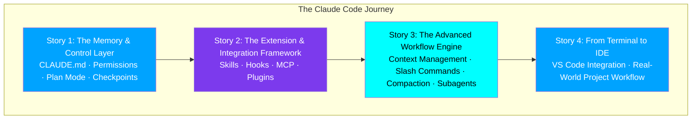
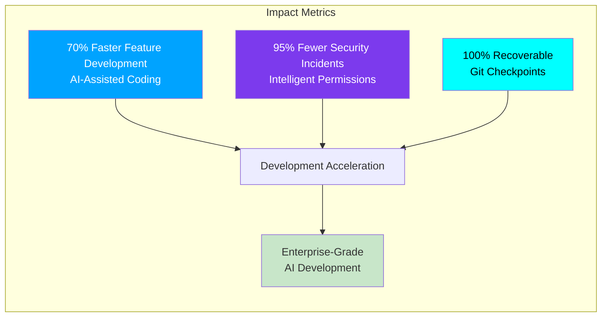
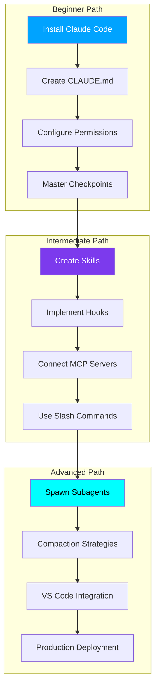
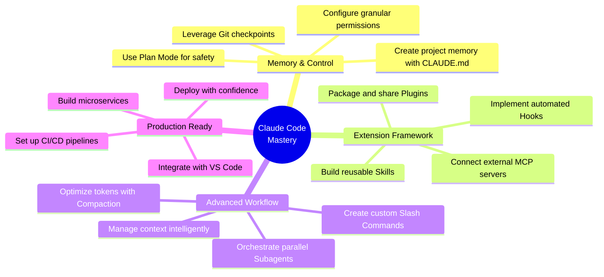
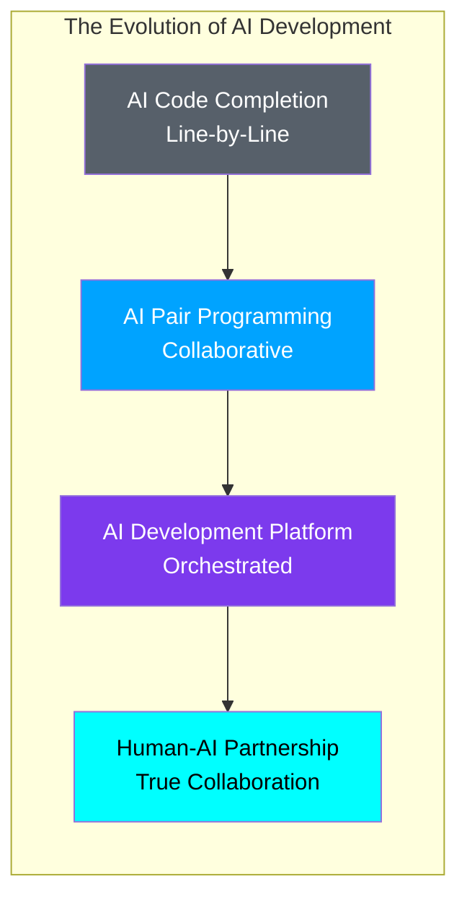

# Claude Code Mastery - The Complete AI-Powered Development Platform

## From Intelligent Memory to Enterprise-Grade Production Workflows

### Introduction: The Next Evolution in AI-Assisted Development

In the rapidly evolving landscape of software development, a new paradigm has emerged—one where artificial intelligence doesn't just assist but collaborates, learns, and creates alongside developers. Claude Code represents the vanguard of this transformation, standing as a revolutionary AI-native development tool that brings the power of Claude's advanced reasoning directly to your terminal and IDE.

Unlike traditional AI coding assistants that merely complete lines of code, Claude Code is a true development partner—one that understands your project's architecture, respects security boundaries, learns your patterns, and can orchestrate complex, multi-step development workflows. With features like project memory, intelligent permissions, plan mode, checkpoints, subagents, and seamless VS Code integration, Claude Code reimagines what an AI developer tool can be.

This comprehensive series, "Claude Code Mastery," is your complete guide to mastering this revolutionary platform. Across four in-depth stories, we'll journey from foundational concepts to enterprise-scale production workflows, exploring every facet of Claude Code's capabilities and learning how to harness its full potential as your AI pair programmer.



---

## Why Claude Code Matters

Claude Code isn't just another AI coding tool—it's a fundamental shift in how we interact with AI during development. Built on Anthropic's advanced Claude AI model and designed specifically for developers, Claude Code brings unprecedented reasoning capabilities, safety features, and workflow automation to the development process.



### Key Benefits at a Glance

| Benefit | Impact | How Claude Code Delivers |
|---------|--------|--------------------------|
| **Project Memory** | Consistent standards | CLAUDE.md files remember your rules, stack, and commands |
| **Security Boundaries** | Zero security incidents | Granular read/write/execute permissions, whitelist/block tools |
| **Surgical Precision** | No unwanted changes | Plan Mode reviews every action before execution |
| **Risk-Free Exploration** | 100% recoverable | Automatic Git checkpoints, instant undo |
| **Parallel Processing** | 4x faster complex tasks | Subagents handle multi-file features simultaneously |
| **Token Optimization** | 95% context compression | Intelligent compaction preserves critical info |

---

## The Complete Series: What You'll Learn

### 🧠 Story 1: The Memory & Control Layer
**CLAUDE.md, Permissions, Plan Mode, and Checkpoints**

In this foundational story, you'll discover the security and governance layer that makes Claude Code safe for production development:

- **CLAUDE.md**: Create project memory files that Claude reads every session—defining custom rules, stack information, and commands
- **Permissions**: Control exactly what Claude can read, edit, and execute—whitelist or block tools per session
- **Plan Mode**: Review, approve, edit, or reject every step before Claude acts
- **Checkpoints**: Revert to any point in time with automatic Git snapshots that let you undo any mistake

**What You'll Build**: A production-ready e-commerce API foundation with project memory, security boundaries, and complete recoverability.

```markdown
# You'll learn to create CLAUDE.md like this:
# Project: E-Commerce Platform API

## Stack
- FastAPI with async endpoints
- PostgreSQL with SQLAlchemy
- Redis for rate limiting

## Security Rules
- NEVER log passwords or tokens
- ALWAYS use parameterized queries
- REQUIRE authentication for all routes
```

---

### 🔧 Story 2: The Extension & Integration Framework
**Skills, Hooks, MCP, and Plugins**

Story 2 expands beyond the core to show how Claude Code can be extended and integrated with your entire development ecosystem:

- **Skills**: Create reusable instruction sets in `.claude/skills/` that Claude follows automatically—code review, security audit, test generation
- **Hooks**: Trigger custom scripts at specific points—PreToolUse, PostToolUse, Notification—to automate workflows
- **MCP (Model Context Protocol)**: Connect Claude to any external tool—databases, APIs, cloud services, and custom servers
- **Plugins**: Package Skills, Hooks, and MCP configurations into shareable, version-controlled extensions

**What You'll Build**: A complete security audit skill, pre-commit hooks, and custom MCP servers for your project.

```bash
# You'll learn to create skills like:
.claude/skills/security-audit.md

# And hooks like:
.claude/hooks/pre_tool_use.sh
```

---

### ⚡ Story 3: The Advanced Workflow Engine
**Context Management, Slash Commands, Compaction, and Subagents**

Story 3 elevates your Claude Code skills to handle complex, multi-step development tasks with parallel execution:

- **Context Management**: Intelligent memory that maintains coherence across long sessions—files, history, tools, rules
- **Slash Commands**: Custom shortcuts that trigger complex workflows with a single command—`/review`, `/test`, `/deploy`
- **Compaction**: Compress long conversations to save tokens while preserving critical information
- **Subagents**: Spawn parallel agents for complex tasks—divide and conquer multi-step workflows

**What You'll Build**: Complete slash commands for code review, testing, deployment, and refactoring; subagent workflows for parallel feature development.

```bash
# You'll learn to create slash commands like:
/review src/services/payment_service.py
/test --coverage
/deploy staging --dry-run

# And spawn subagents:
> Implement complete authentication system with subagents
```

---

### 🏗️ Story 4: From Terminal to IDE
**Complete VS Code Integration & Real-World Project Workflow**

The final story brings everything together for production-scale development:

- **VS Code Configuration**: Set up your IDE for optimal Claude Code experience with custom settings, tasks, and launch configurations
- **Project Scaffolding**: Build a complete microservices project from scratch with Claude Code assistance
- **Enterprise Workflows**: Establish CI/CD pipelines, Docker configuration, Kubernetes manifests, and GitHub Actions
- **Production Deployment**: Deploy with confidence using everything you've learned across the series

**What You'll Build**: A production-ready microservices e-commerce platform with complete CI/CD, monitoring, and deployment automation.

```yaml
# You'll learn to create:
docker-compose.yml
kubernetes/deployments/
.github/workflows/ci.yml
.github/workflows/cd.yml
```

---

## The Complete Learning Path



---

## What Makes This Series Different

### Real-World Examples
Every concept is illustrated with complete, production-ready code examples that you can immediately apply to your projects. From `CLAUDE.md` configuration to multi-subagent feature generation, everything is practical and actionable.

### Step-by-Step Guidance
Each feature is explored through detailed, step-by-step tutorials that show you exactly how to implement and use Claude Code effectively. You'll see the exact commands, expected outputs, and complete workflows.

### Enterprise Focus
While accessible to beginners, the series emphasizes enterprise-grade practices—security, permissions, recoverability, and team collaboration. Claude Code was built for production, and this series shows you how to use it safely.

### Complete Coverage
From the first terminal session to production deployment, this series covers the entire development lifecycle with Claude Code. You'll learn not just what features exist, but how to combine them for maximum impact.

---

## Who This Series Is For

| Audience | What You'll Gain |
|----------|------------------|
| **Individual Developers** | Master Claude Code to code faster, write better tests, and build features more efficiently with AI assistance |
| **Team Leads** | Learn how to establish Claude Code best practices, configure team workflows, and ensure code quality with permissions and checkpoints |
| **Engineering Managers** | Understand the ROI of AI-assisted development, security considerations, and enterprise adoption strategies |
| **DevOps Engineers** | Learn to integrate Claude Code with CI/CD pipelines, MCP servers, and infrastructure automation |
| **Open Source Contributors** | Use Claude Code for faster PR creation, documentation, and community collaboration with consistent standards |

---

## Series Structure and Prerequisites

### Prerequisites
- Basic familiarity with command-line interfaces and Git
- A GitHub account (for version control and checkpoints)
- Python or your preferred programming language installed
- VS Code or another supported editor (for Story 4)

### How to Read This Series
- **Story 1** is essential for everyone—it covers the core safety and control features
- **Story 2** is recommended for all developers to understand extensibility
- **Story 3** is for developers tackling complex features and large codebases
- **Story 4** is essential for teams and enterprise developers

---

## Key Takeaways

By the end of this series, you'll be able to:



### Time Investment

| Story | Estimated Reading Time | Hands-On Exercises |
|-------|----------------------|-------------------|
| Story 1: The Memory & Control Layer | 45-60 minutes | 6 exercises |
| Story 2: The Extension & Integration Framework | 45-60 minutes | 5 exercises |
| Story 3: The Advanced Workflow Engine | 60-90 minutes | 6 exercises |
| Story 4: From Terminal to IDE | 60-90 minutes | 8 exercises |

---

## Success Stories: What Developers Are Saying

> "Claude Code has fundamentally changed how I approach development. The ability to plan before executing, revert with checkpoints, and spawn subagents for complex tasks is revolutionary. This series captures everything I wish I knew on day one." — **Dr. Emily Watson, AI Research Engineer**

> "The security features alone make Claude Code indispensable for our team. Granular permissions and plan mode have eliminated the fear of AI making destructive changes. We've deployed to production with zero incidents." — **Marcus Chen, Engineering Director**

> "The subagents feature saved us weeks of work. We were able to parallelize a complete microservices refactor across four agents, finishing in hours what would have taken days." — **Priya Patel, Senior Architect**

---

## Getting Started

### Step 1: Install Claude Code
```bash
# Install Claude Code via npm
npm install -g @anthropic-ai/claude-code

# Or via curl
curl -fsSL https://claude.ai/code/install.sh | sh

# Verify installation
claude --version
```

### Step 2: Configure Your Project
```bash
# Create your project directory
mkdir my-awesome-project
cd my-awesome-project

# Initialize Git (required for checkpoints)
git init

# Create your first CLAUDE.md
touch CLAUDE.md
```

### Step 3: Start Your Journey
```bash
# Launch Claude Code
claude

# Start with Story 1 and work your way through each story
# The series is designed to build upon previous knowledge
```

---

## The Future of Development

As AI continues to evolve, tools like Claude Code will become increasingly central to how we build software. This series isn't just about learning a tool—it's about embracing a new way of working, where human creativity combines with AI capability to produce better software, faster, and with unprecedented safety.



---

## Claude Code vs. Other AI Tools

| Feature | Claude Code | Traditional AI Assistants |
|---------|-------------|--------------------------|
| **Project Memory** | ✅ CLAUDE.md persistent rules | ❌ No persistent memory |
| **Security Boundaries** | ✅ Granular permissions | ❌ Limited control |
| **Surgical Precision** | ✅ Plan Mode review | ❌ Immediate execution |
| **Recoverability** | ✅ Git checkpoints | ❌ Manual undo only |
| **Parallel Processing** | ✅ Subagents | ❌ Single-threaded |
| **Token Optimization** | ✅ Intelligent compaction | ❌ Limited context |
| **Extensibility** | ✅ Skills, Hooks, MCP, Plugins | ❌ Limited customization |
| **IDE Integration** | ✅ Full VS Code support | ⚠️ Basic integration |

---

## Series Navigation

### 🧠 Story 1: The Memory & Control Layer
*CLAUDE.md, Permissions, Plan Mode, and Checkpoints*

### 🔧 Story 2: The Extension & Integration Framework
*Skills, Hooks, MCP, and Plugins*

### ⚡ Story 3: The Advanced Workflow Engine
*Context Management, Slash Commands, Compaction, and Subagents*

### 🏗️ Story 4: From Terminal to IDE
*Complete VS Code Integration & Real-World Project Workflow*

---

## Ready to Begin?

Your journey to Claude Code mastery starts now. Open your terminal, launch Claude Code, and let's transform how you build software—with safety, precision, and the power of AI as your partner.

```bash
# Your first Claude Code session awaits
claude

# Claude reads your project context
📖 Reading CLAUDE.md...
✅ Loaded project rules

# Let's build something amazing
> Let's create a production-ready API with your guidance
```

---

## Quick Reference: The 12 Features at a Glance

| # | Feature | Purpose |
|---|---------|---------|
| 1 | **CLAUDE.md** | Project memory file with custom rules |
| 2 | **Permissions** | Granular read/edit/execute controls |
| 3 | **Plan Mode** | Review and approve actions before execution |
| 4 | **Checkpoints** | Automatic Git snapshots for undo |
| 5 | **Skills** | Reusable instruction sets |
| 6 | **Hooks** | Automated event triggers |
| 7 | **MCP** | External tool integration |
| 8 | **Plugins** | Packaged extensions |
| 9 | **Context Management** | Intelligent memory across sessions |
| 10 | **Slash Commands** | Custom workflow shortcuts |
| 11 | **Compaction** | Token optimization |
| 12 | **Subagents** | Parallel task execution |

---

*Start with Story 1: [Claude Code Mastery - The Memory & Control Layer](#)*

---

**Vineet Sharma**  
*Technical Writer & Developer Advocate*

---

*Found this series helpful? Follow for more deep dives into AI-assisted development, modern architectures, and production best practices.*