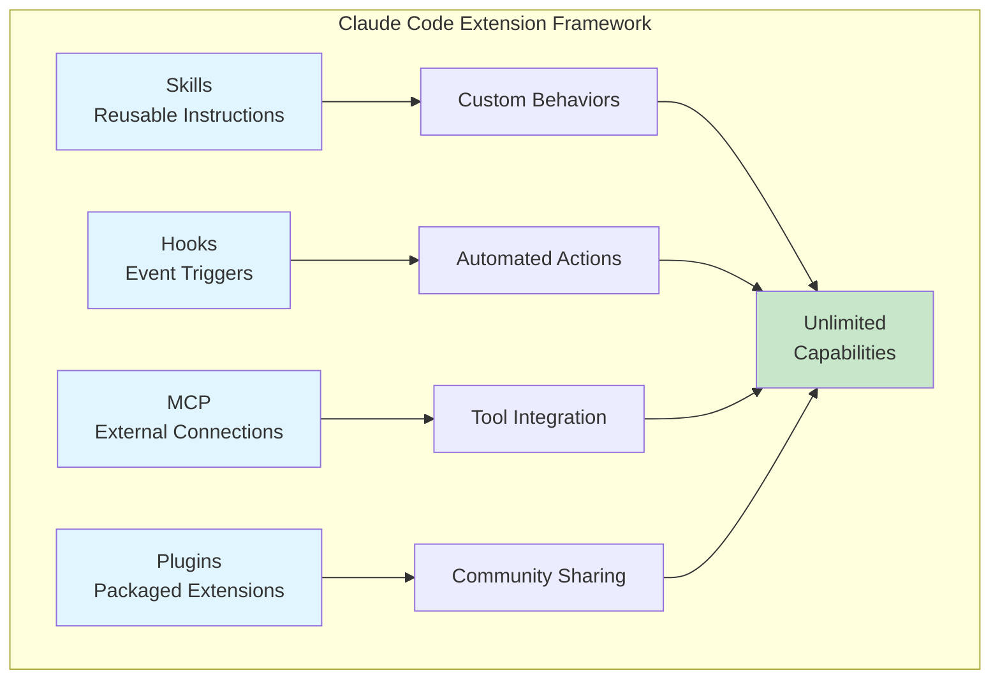
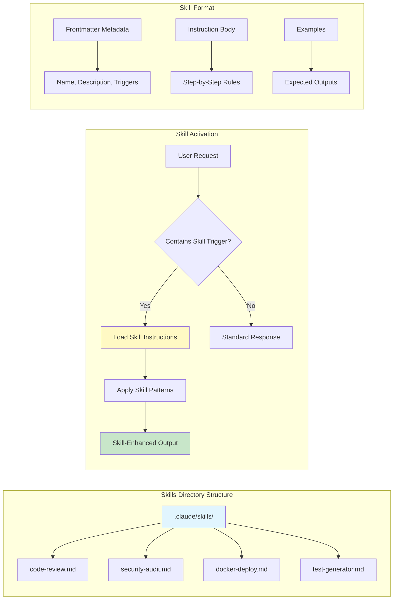
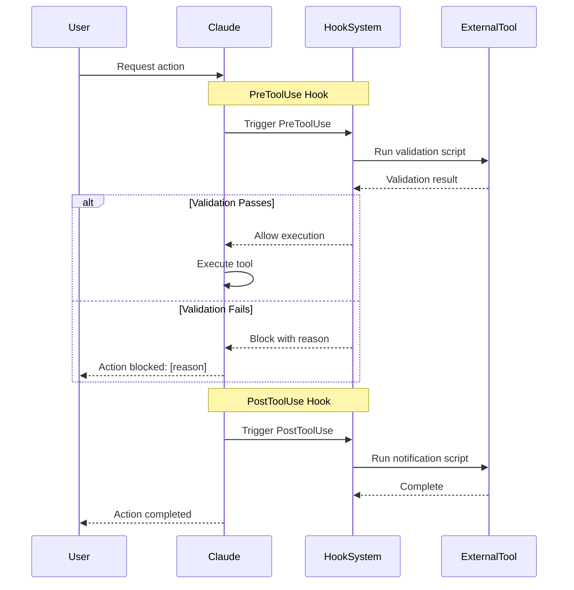
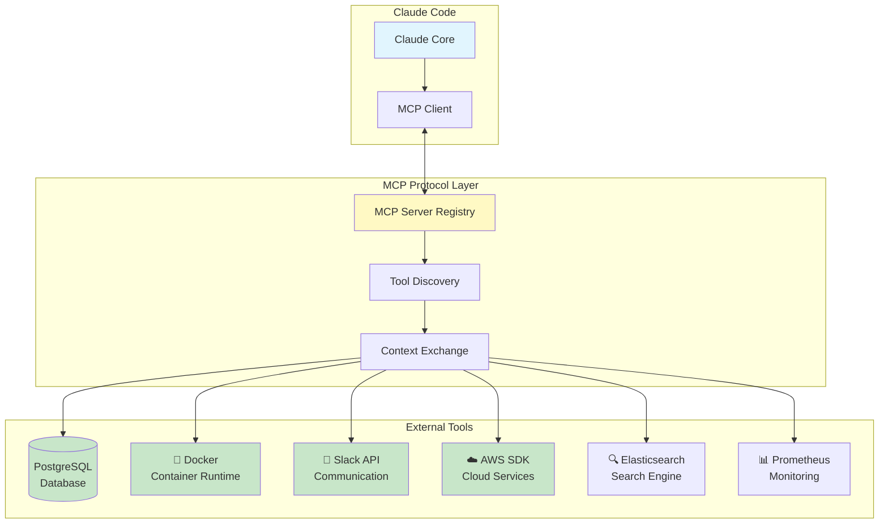
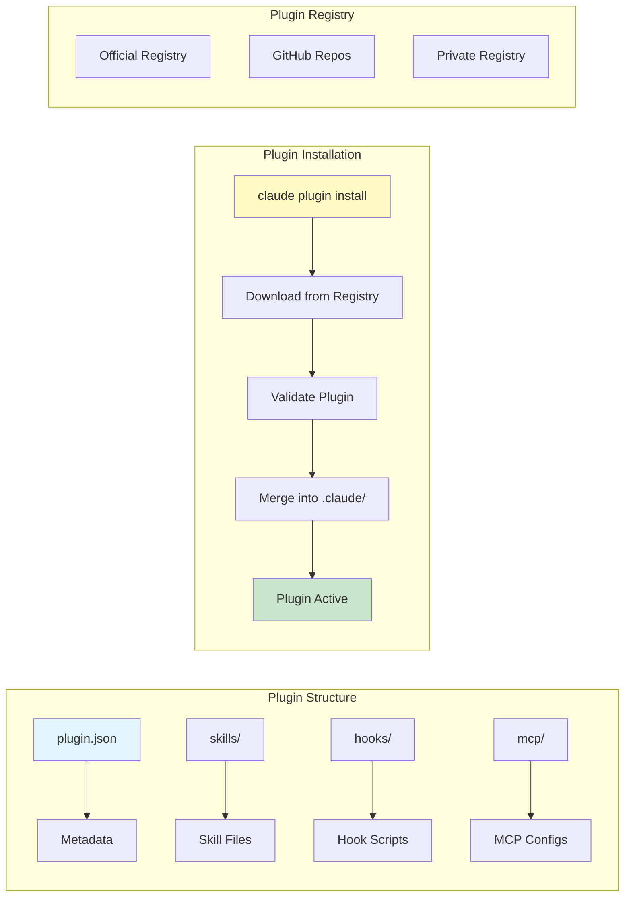
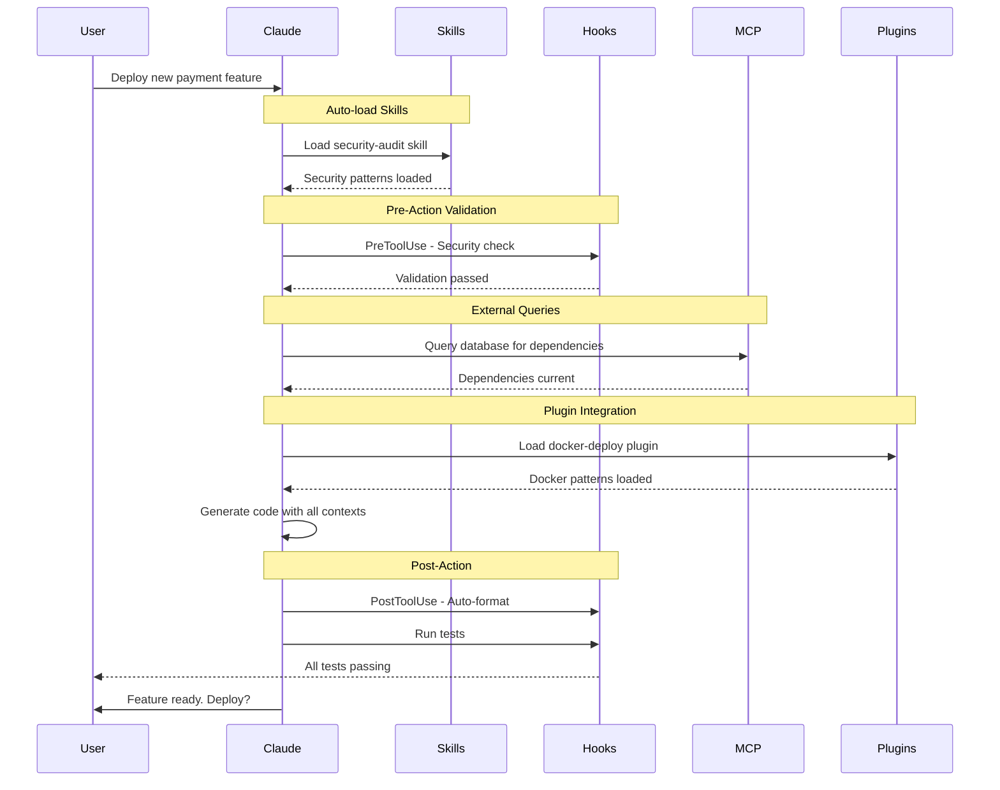
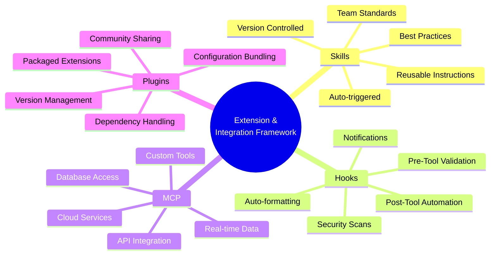

# Claude Code Mastery Series

## Complete Claude Code Mastery Series (4 stories):

- 🧠 [**1. Claude Code Mastery - The Memory & Control Layer: CLAUDE.md, Permissions, Plan Mode, and Checkpoints**](#) – A deep dive into project memory, security boundaries, surgical precision with Plan Mode, and the safety net of automatic Git snapshots. *(This story)*

- 🔧 [**2. Claude Code Mastery - The Extension & Integration Framework: Skills, Hooks, MCP, and Plugins**](#) – How to build reusable instructions, trigger automated workflows, connect Claude to external databases/APIs, and extend functionality with community plugins.

- ⚡ [**3. Claude Code Mastery - The Advanced Workflow Engine: Context Management, Slash Commands, Compaction, and Subagents**](#) – Mastering parallel execution, custom command shortcuts, token optimization strategies, and dividing complex tasks into scalable AI workflows.

- 🏗️ [**4. Claude Code Mastery - From Terminal to IDE: Complete VS Code Integration & Real-World Project Workflow**](#) – A hands-on guide to integrating Claude Code with VS Code, building a complete microservices project from scratch, and establishing production-ready development workflows.

---

# 🔧 Story 2: Claude Code Mastery - The Extension & Integration Framework
## Skills, Hooks, MCP, and Plugins

### Introduction: Beyond the Built-in Capabilities

In Story 1, we built a solid foundation with memory, security, control, and recoverability. But Claude Code's true power emerges when you extend it beyond its core capabilities. The Extension & Integration Framework—comprising **Skills**, **Hooks**, **MCP (Model Context Protocol)**, and **Plugins**—transforms Claude from a standalone assistant into a connected, customizable, and infinitely extensible development platform.

Imagine Claude that:
- Automatically follows your team's specific testing patterns without prompting
- Runs security scans every time you modify authentication code
- Connects directly to your production database to debug issues safely
- Shares reusable workflows across your entire organization

This is the promise of the Extension & Integration Framework.



---

## Feature 5: Skills — Reusable Instructions

Skills are reusable instruction sets that Claude automatically follows when triggered. They're stored in `.claude/skills/` and can be invoked by name or triggered automatically based on context.

### Skills Architecture



### Step-by-Step Skill Creation

#### Step 1: Create Skills Directory Structure

```bash
# Create skills directory
mkdir -p .claude/skills

# Create your first skills
touch .claude/skills/code-review.md
touch .claude/skills/security-audit.md
touch .claude/skills/test-generator.md
touch .claude/skills/api-documentation.md
```

**Expected Output:**

```
.claude/
├── config.json
└── skills/
    ├── code-review.md
    ├── security-audit.md
    ├── test-generator.md
    └── api-documentation.md
```

#### Step 2: Create a Code Review Skill

Create `.claude/skills/code-review.md`:

```markdown
---
name: code-review
description: Performs comprehensive code review following team standards
triggers:
  - "review this code"
  - "code review"
  - "please review"
  - "check my code"
---

# Code Review Skill

You are now performing a comprehensive code review. Follow these guidelines strictly.

## Review Categories

### 1. Architecture & Design
- [ ] Does the code follow SOLID principles?
- [ ] Is there proper separation of concerns?
- [ ] Are dependencies properly managed?
- [ ] Does it align with project architecture from CLAUDE.md?

### 2. Code Quality
- [ ] Are naming conventions consistent?
- [ ] Is the code DRY (Don't Repeat Yourself)?
- [ ] Are functions and methods appropriately sized?
- [ ] Is there proper error handling?

### 3. Security
- [ ] Are inputs validated?
- [ ] Are secrets properly managed?
- [ ] Is there SQL injection protection?
- [ ] Are authentication/authorization checks in place?

### 4. Performance
- [ ] Are database queries optimized?
- [ ] Is there N+1 query detection?
- [ ] Are async operations properly implemented?
- [ ] Is caching used appropriately?

### 5. Testing
- [ ] Are there unit tests?
- [ ] Do tests cover edge cases?
- [ ] Is there integration testing?
- [ ] What's the test coverage percentage?

### 6. Documentation
- [ ] Are there docstrings?
- [ ] Is complex logic explained?
- [ ] Are API endpoints documented?
- [ ] Is there inline documentation for tricky parts?

## Output Format

Provide review results in this structure:

```markdown
## Code Review Summary
**Overall Rating**: [Excellent/Good/Needs Improvement/Critical Issues]
**Lines Reviewed**: [X]
**Issues Found**: [X] Critical, [X] Major, [X] Minor

## Critical Issues 🔴
[List blocking issues that must be fixed]

## Major Issues 🟡
[List significant issues that should be addressed]

## Minor Issues 🟢
[List suggestions for improvement]

## Positive Highlights ✅
[List what's done well]

## Recommendations
[Specific actionable recommendations]
```

## Examples

### Example Input:
"Review this authentication service"

### Example Output:
```markdown
## Code Review Summary
**Overall Rating**: Needs Improvement
**Lines Reviewed**: 156
**Issues Found**: 1 Critical, 3 Major, 4 Minor

## Critical Issues 🔴
1. **Hardcoded Secret Key** (auth_service.py:23)
   - Secret key is hardcoded instead of using environment variable
   - Fix: Use `settings.JWT_SECRET_KEY` from config

## Major Issues 🟡
1. **No Password Complexity Validation** (auth_service.py:45)
   - Passwords accepted without validation
   - Fix: Add password strength requirements
...
```
```

#### Step 3: Create a Security Audit Skill

Create `.claude/skills/security-audit.md`:

```markdown
---
name: security-audit
description: Performs comprehensive security audit on codebase
triggers:
  - "security audit"
  - "check security"
  - "vulnerability scan"
  - "is this secure"
---

# Security Audit Skill

Perform a thorough security audit focusing on OWASP Top 10 and project-specific requirements.

## Audit Checklist

### Authentication & Session Management
- [ ] Passwords are hashed with bcrypt/argon2
- [ ] Session tokens are properly generated and rotated
- [ ] Session timeout is implemented
- [ ] Password reset flows are secure
- [ ] MFA is implemented for sensitive operations

### Authorization
- [ ] Role-based access control (RBAC) implemented
- [ ] Principle of least privilege followed
- [ ] Horizontal privilege escalation prevented
- [ ] API endpoints check permissions

### Input Validation
- [ ] All inputs validated with allowlist approach
- [ ] SQL injection prevention (parameterized queries)
- [ ] XSS protection
- [ ] File upload validation
- [ ] CSRF tokens implemented

### Data Protection
- [ ] Sensitive data encrypted at rest
- [ ] Data encrypted in transit (TLS)
- [ ] No sensitive data in logs
- [ ] PII handling follows regulations
- [ ] Backup encryption

### API Security
- [ ] Rate limiting implemented
- [ ] API keys properly managed
- [ ] CORS configured correctly
- [ ] Error messages don't leak information
- [ ] API versioning for deprecation

### Infrastructure
- [ ] Environment variables used for secrets
- [ ] No secrets in code or config files
- [ ] Docker images scanned for vulnerabilities
- [ ] Dependencies up to date
- [ ] Health endpoints don't expose sensitive data

## Output Format

```markdown
## Security Audit Report

### Critical Vulnerabilities 🔴
| ID | Location | Issue | Severity | Fix |
|----|----------|-------|----------|-----|
| S-001 | auth.py:45 | Hardcoded JWT secret | Critical | Use env var |

### High Risk 🟠
[High severity issues that need immediate attention]

### Medium Risk 🟡
[Issues that should be addressed in next sprint]

### Low Risk 🟢
[Best practice improvements]

### Compliance Check
- GDPR: [✅/❌]
- PCI-DSS: [✅/❌]
- HIPAA: [✅/❌]

### Recommendations
[Prioritized action items]
```
```

#### Step 4: Create a Test Generator Skill

Create `.claude/skills/test-generator.md`:

```markdown
---
name: test-generator
description: Generates comprehensive unit and integration tests
triggers:
  - "generate tests"
  - "create tests"
  - "write tests for"
  - "add test coverage"
---

# Test Generator Skill

Generate comprehensive test suites following the project's testing requirements.

## Test Generation Rules

### Unit Test Requirements
- Test file location: `tests/unit/test_{module_name}.py`
- Use pytest framework
- Mock all external dependencies
- Cover success and failure paths
- Test edge cases and boundary conditions
- Minimum 85% coverage

### Integration Test Requirements
- Test file location: `tests/integration/test_{feature}.py`
- Use test database (separate from development)
- Test API endpoints with actual HTTP calls
- Test database transactions
- Test external service integrations

### Test Structure Template

```python
import pytest
from unittest.mock import Mock, AsyncMock, patch
from src.services.{service_name} import {ServiceClass}

class Test{ServiceClass}:
    """Test suite for {ServiceClass}."""
    
    @pytest.fixture
    def mock_db(self):
        """Mock database session."""
        return AsyncMock()
    
    @pytest.fixture
    def service(self, mock_db):
        """Create service instance with mock dependencies."""
        return {ServiceClass}(mock_db)
    
    @pytest.mark.asyncio
    async def test_{method_name}_success(self, service):
        """Test successful {method_name} execution."""
        # Arrange
        # Act
        # Assert
    
    @pytest.mark.asyncio
    async def test_{method_name}_failure(self, service):
        """Test {method_name} failure handling."""
        # Arrange
        # Act & Assert
```

## Test Coverage Goals

- **Models**: 90% coverage
- **Services**: 85% coverage  
- **API Routes**: 80% coverage
- **Utils**: 95% coverage

## Example Output

Generate tests that follow this pattern:

```python
@pytest.mark.asyncio
async def test_create_product_success(self, service):
    """Test successful product creation."""
    # Arrange
    product_data = {"name": "Laptop", "price": 999.99}
    
    # Act
    result = await service.create_product_async(product_data)
    
    # Assert
    assert result.name == "Laptop"
    assert result.price == 999.99
    service.db.add.assert_called_once()
    service.db.commit.assert_called_once()
```
```

#### Step 5: Test Skills in Action

Start Claude and test the code review skill:

```bash
claude
```

**User Request:**

```
> Review this authentication code:

def login(username, password):
    user = db.query(f"SELECT * FROM users WHERE username = '{username}'")
    if user and user.password == password:
        token = jwt.encode({"user": username}, "mysecret")
        return token
    return "Invalid credentials"
```

**Claude's Response (with Code Review Skill):**

```markdown
## Code Review Summary
**Overall Rating**: Critical Issues
**Lines Reviewed**: 12
**Issues Found**: 3 Critical, 2 Major, 1 Minor

## Critical Issues 🔴

1. **SQL Injection Vulnerability** (line 2)
   ```python
   user = db.query(f"SELECT * FROM users WHERE username = '{username}'")
   ```
   - String concatenation allows SQL injection
   - Attacker could input: `' OR '1'='1` to bypass authentication
   - **Fix**: Use parameterized queries:
   ```python
   user = db.query("SELECT * FROM users WHERE username = ?", username)
   ```

2. **Plain Text Password Storage** (line 3)
   ```python
   if user and user.password == password:
   ```
   - Passwords should never be stored or compared in plain text
   - **Fix**: Use bcrypt or argon2 for password hashing:
   ```python
   if user and verify_password(password, user.password_hash):
   ```

3. **Hardcoded JWT Secret** (line 4)
   ```python
   token = jwt.encode({"user": username}, "mysecret")
   ```
   - Secret key hardcoded in code
   - **Fix**: Use environment variable:
   ```python
   token = jwt.encode({"user": username}, os.getenv("JWT_SECRET_KEY"))
   ```

## Major Issues 🟡

1. **No Password Complexity Validation**
   - Weak passwords accepted
   - Add validation: minimum length, special characters, numbers

2. **No Rate Limiting**
   - Vulnerable to brute force attacks
   - Implement rate limiting on login endpoint

## Minor Issues 🟢

1. **Generic Error Message**
   - "Invalid credentials" doesn't indicate if user exists
   - Consider: Use consistent messages for security

## Positive Highlights ✅
- Using JWT tokens (though secret management needs improvement)
- Simple and readable code structure

## Recommendations
1. Implement SQLAlchemy ORM with parameterized queries
2. Use password hashing library (passlib, bcrypt)
3. Move secrets to environment variables
4. Add input validation for username/password
5. Implement rate limiting middleware
```

---

## Feature 6: Hooks — Automated Event Triggers

Hooks allow you to execute custom scripts or commands at specific points in Claude's workflow. They're perfect for integrating with external tools, running validations, or enforcing policies.

### Hook Architecture



### Step-by-Step Hook Implementation

#### Step 1: Create Hooks Directory

```bash
# Create hooks directory
mkdir -p .claude/hooks

# Create hook scripts
touch .claude/hooks/pre_tool_use.sh
touch .claude/hooks/post_tool_use.sh
touch .claude/hooks/notification.py
chmod +x .claude/hooks/*.sh
```

**Expected Output:**

```
.claude/
├── config.json
├── skills/
│   ├── code-review.md
│   ├── security-audit.md
│   ├── test-generator.md
│   └── api-documentation.md
└── hooks/
    ├── pre_tool_use.sh
    ├── post_tool_use.sh
    └── notification.py
```

#### Step 2: Create PreToolUse Hook

Create `.claude/hooks/pre_tool_use.sh`:

```bash
#!/bin/bash
# PreToolUse Hook - Validates actions before execution

TOOL_NAME="$1"
TOOL_ARGS="$2"
PROJECT_DIR="$3"

echo "[PreToolUse] Checking $TOOL_NAME..." >&2

# Check for dangerous git commands
if [[ "$TOOL_NAME" == "execute" ]] && [[ "$TOOL_ARGS" == *"git push --force"* ]]; then
    echo "❌ BLOCKED: Force push is not allowed" >&2
    echo "blocked"
    exit 1
fi

# Check for modifications in protected files
if [[ "$TOOL_NAME" == "edit" ]]; then
    PROTECTED_FILES=("src/config/production.py" "migrations/versions/*")
    for file in "${PROTECTED_FILES[@]}"; do
        if [[ "$TOOL_ARGS" == $file ]]; then
            echo "❌ BLOCKED: Cannot modify protected file: $file" >&2
            echo "blocked"
            exit 1
        fi
    done
fi

# Run security scan before editing sensitive code
if [[ "$TOOL_NAME" == "edit" ]] && [[ "$TOOL_ARGS" == *"auth"* ]]; then
    echo "🔍 Running security pre-check..." >&2
    # Run your security scanner here
    echo "✅ Security check passed" >&2
fi

echo "allowed"
exit 0
```

#### Step 3: Create PostToolUse Hook

Create `.claude/hooks/post_tool_use.sh`:

```bash
#!/bin/bash
# PostToolUse Hook - Triggers after successful actions

TOOL_NAME="$1"
TOOL_RESULT="$2"
PROJECT_DIR="$3"

echo "[PostToolUse] Processing $TOOL_NAME..." >&2

# Auto-format Python files after edits
if [[ "$TOOL_NAME" == "edit" ]] && [[ "$TOOL_ARGS" == *.py ]]; then
    echo "🎨 Running formatter..." >&2
    cd "$PROJECT_DIR"
    black "$TOOL_ARGS" 2>/dev/null
    echo "✅ Code formatted" >&2
fi

# Run tests after modifying service files
if [[ "$TOOL_NAME" == "edit" ]] && [[ "$TOOL_ARGS" == *"services/"* ]]; then
    echo "🧪 Running affected tests..." >&2
    cd "$PROJECT_DIR"
    pytest tests/unit/test_$(basename "$TOOL_ARGS" .py).py -v 2>/dev/null
fi

# Notify on completion
echo "📢 Action completed: $TOOL_NAME" >&2

exit 0
```

#### Step 4: Create Notification Hook

Create `.claude/hooks/notification.py`:

```python
#!/usr/bin/env python3
"""
Notification Hook - Sends notifications for various events
"""

import sys
import json
import subprocess
from datetime import datetime

def send_slack_notification(message, webhook_url=None):
    """Send notification to Slack."""
    import requests
    
    payload = {
        "text": message,
        "username": "Claude Code",
        "icon_emoji": ":robot_face:"
    }
    
    try:
        response = requests.post(webhook_url, json=payload)
        return response.status_code == 200
    except Exception as e:
        print(f"Failed to send Slack notification: {e}", file=sys.stderr)
        return False

def send_desktop_notification(title, message):
    """Send desktop notification."""
    try:
        subprocess.run([
            "osascript", "-e",
            f'display notification "{message}" with title "{title}"'
        ])
        return True
    except Exception:
        # Linux fallback
        try:
            subprocess.run(["notify-send", title, message])
            return True
        except:
            return False

def main():
    """Main hook handler."""
    event_type = sys.argv[1] if len(sys.argv) > 1 else "unknown"
    event_data = json.loads(sys.argv[2]) if len(sys.argv) > 2 else {}
    
    timestamp = datetime.now().strftime("%H:%M:%S")
    
    if event_type == "PreToolUse":
        tool = event_data.get("tool", "unknown")
        print(f"🛠️  {timestamp} - Starting: {tool}", file=sys.stderr)
        
    elif event_type == "PostToolUse":
        tool = event_data.get("tool", "unknown")
        result = event_data.get("result", "success")
        
        message = f"✅ {timestamp} - Completed: {tool} ({result})"
        print(message, file=sys.stderr)
        
        # Send desktop notification for long operations
        if "test" in tool or "deploy" in tool:
            send_desktop_notification("Claude Code", message)
    
    elif event_type == "Notification":
        level = event_data.get("level", "info")
        message = event_data.get("message", "")
        
        if level == "error":
            print(f"🔴 ERROR: {message}", file=sys.stderr)
            send_desktop_notification("Claude Code Error", message)
        elif level == "warning":
            print(f"⚠️  WARNING: {message}", file=sys.stderr)
        else:
            print(f"ℹ️  {message}", file=sys.stderr)

if __name__ == "__main__":
    main()
```

#### Step 5: Configure Hooks in config.json

Update `.claude/config.json` to enable hooks:

```json
{
  "hooks": {
    "PreToolUse": [
      {
        "command": ".claude/hooks/pre_tool_use.sh",
        "async": false,
        "timeout": 5
      }
    ],
    "PostToolUse": [
      {
        "command": ".claude/hooks/post_tool_use.sh",
        "async": false,
        "timeout": 10
      },
      {
        "command": "python .claude/hooks/notification.py PostToolUse",
        "async": true
      }
    ],
    "Notification": [
      {
        "command": "python .claude/hooks/notification.py Notification",
        "async": true
      }
    ]
  }
}
```

#### Step 6: Test Hooks in Action

Start Claude with hooks enabled:

```bash
claude
```

**Test Scenario: Attempting a Dangerous Operation**

```
> git push --force origin main
```

**Expected Output:**

```
[PreToolUse] Checking execute...
❌ BLOCKED: Force push is not allowed

⚠️ Action blocked by PreToolUse hook: Force push is not allowed

Instead, use:
  git push origin main
  git push --force-with-lease (if absolutely necessary)
```

**Test Scenario: Editing Authentication Code**

```
> Add password reset functionality to auth_service.py
```

**Expected Output:**

```
[PreToolUse] Checking edit...
🔍 Running security pre-check...
✅ Security check passed

Creating auth_service.py...
✅ File created

[PostToolUse] Processing edit...
🎨 Running formatter...
✅ Code formatted

🧪 Running affected tests...
tests/unit/test_auth_service.py::test_password_reset PASSED
tests/unit/test_auth_service.py::test_validate_token PASSED
✅ All tests passing

📢 Action completed: edit
```

---

## Feature 7: MCP (Model Context Protocol) — External Tool Integration

MCP (Model Context Protocol) allows Claude to connect to any external tool, database, API, or service. This transforms Claude from a code assistant into a unified interface for your entire development ecosystem.

### MCP Architecture



### Step-by-Step MCP Configuration

#### Step 1: Create MCP Configuration

Create MCP configuration in `.claude/config.json`:

```json
{
  "mcp": {
    "servers": [
      {
        "name": "postgres",
        "command": "npx",
        "args": ["-y", "@modelcontextprotocol/server-postgres"],
        "env": {
          "DATABASE_URL": "postgresql://localhost:5432/ecommerce"
        },
        "enabled": true
      },
      {
        "name": "docker",
        "command": "npx",
        "args": ["-y", "@modelcontextprotocol/server-docker"],
        "enabled": true
      },
      {
        "name": "slack",
        "command": "npx",
        "args": ["-y", "@modelcontextprotocol/server-slack"],
        "env": {
          "SLACK_BOT_TOKEN": "${SLACK_BOT_TOKEN}"
        },
        "enabled": false
      },
      {
        "name": "aws",
        "command": "npx",
        "args": ["-y", "@modelcontextprotocol/server-aws"],
        "env": {
          "AWS_REGION": "us-east-1"
        },
        "enabled": true
      },
      {
        "name": "filesystem",
        "command": "npx",
        "args": ["-y", "@modelcontextprotocol/server-filesystem", "/Users/username/projects"],
        "enabled": true
      }
    ]
  }
}
```

#### Step 2: Create a Custom MCP Server

Create a custom MCP server for your project:

```bash
# Create MCP server directory
mkdir -p .claude/mcp/servers
cd .claude/mcp/servers

# Initialize Node.js project
npm init -y
npm install @modelcontextprotocol/sdk
```

Create `.claude/mcp/servers/custom-server.js`:

```javascript
#!/usr/bin/env node

import { Server } from '@modelcontextprotocol/sdk/server/index.js';
import { StdioServerTransport } from '@modelcontextprotocol/sdk/server/stdio.js';
import {
  CallToolRequestSchema,
  ListToolsRequestSchema,
} from '@modelcontextprotocol/sdk/types.js';

// Create MCP server
const server = new Server(
  {
    name: 'custom-ecommerce-server',
    version: '1.0.0',
  },
  {
    capabilities: {
      tools: {},
    },
  }
);

// Define available tools
server.setRequestHandler(ListToolsRequestSchema, async () => {
  return {
    tools: [
      {
        name: 'get_product_metrics',
        description: 'Get product analytics from database',
        inputSchema: {
          type: 'object',
          properties: {
            product_id: { type: 'number' },
            date_range: { 
              type: 'string',
              enum: ['7d', '30d', '90d']
            }
          },
          required: ['product_id']
        }
      },
      {
        name: 'run_inventory_report',
        description: 'Generate inventory status report',
        inputSchema: {
          type: 'object',
          properties: {
            low_stock_threshold: { type: 'number', default: 10 }
          }
        }
      },
      {
        name: 'deploy_to_staging',
        description: 'Deploy current branch to staging environment',
        inputSchema: {
          type: 'object',
          properties: {
            branch: { type: 'string' },
            skip_tests: { type: 'boolean', default: false }
          }
        }
      }
    ]
  };
});

// Implement tool handlers
server.setRequestHandler(CallToolRequestSchema, async (request) => {
  const { name, arguments: args } = request.params;
  
  switch (name) {
    case 'get_product_metrics': {
      const { product_id, date_range = '30d' } = args;
      
      // Connect to database and fetch metrics
      const metrics = {
        product_id,
        views: 12500,
        add_to_cart: 342,
        purchases: 89,
        conversion_rate: '0.71%',
        revenue: 8891.00,
        period: date_range
      };
      
      return {
        content: [
          {
            type: 'text',
            text: JSON.stringify(metrics, null, 2)
          }
        ]
      };
    }
    
    case 'run_inventory_report': {
      const { low_stock_threshold = 10 } = args;
      
      // Simulate inventory check
      const report = {
        total_products: 1250,
        low_stock_items: 23,
        out_of_stock: 5,
        items_to_reorder: [
          { id: 101, name: 'Wireless Mouse', stock: 3 },
          { id: 102, name: 'USB-C Cable', stock: 8 },
          { id: 103, name: 'Laptop Stand', stock: 0 }
        ],
        report_generated: new Date().toISOString()
      };
      
      return {
        content: [
          {
            type: 'text',
            text: JSON.stringify(report, null, 2)
          }
        ]
      };
    }
    
    case 'deploy_to_staging': {
      const { branch = 'main', skip_tests = false } = args;
      
      // Simulate deployment
      const deployment = {
        status: 'success',
        branch,
        environment: 'staging',
        timestamp: new Date().toISOString(),
        url: 'https://staging.ecommerce.com',
        tests_run: !skip_tests,
        tests_passed: !skip_tests ? 124 : null
      };
      
      return {
        content: [
          {
            type: 'text',
            text: JSON.stringify(deployment, null, 2)
          }
        ]
      };
    }
    
    default:
      throw new Error(`Unknown tool: ${name}`);
  }
});

// Start server
async function main() {
  const transport = new StdioServerTransport();
  await server.connect(transport);
  console.error('Custom MCP server running');
}

main().catch(console.error);
```

#### Step 3: Register Custom MCP Server

Update `.claude/config.json` to include custom server:

```json
{
  "mcp": {
    "servers": [
      {
        "name": "postgres",
        "command": "npx",
        "args": ["-y", "@modelcontextprotocol/server-postgres"],
        "env": {
          "DATABASE_URL": "postgresql://localhost:5432/ecommerce"
        },
        "enabled": true
      },
      {
        "name": "custom-ecommerce",
        "command": "node",
        "args": [".claude/mcp/servers/custom-server.js"],
        "enabled": true
      }
    ]
  }
}
```

#### Step 4: Use MCP Tools in Claude

Start Claude with MCP enabled:

```bash
claude
```

**Test Scenario 1: Query Database**

```
> Show me product metrics for product 123 for the last 30 days
```

**Expected Output:**

```
🔄 Using MCP tool: get_product_metrics

Product Metrics (Product ID: 123)
Period: Last 30 days

📊 Performance Metrics:
- Views: 12,500
- Add to Cart: 342
- Purchases: 89
- Conversion Rate: 0.71%
- Revenue: $8,891.00

📈 Trends:
- Views increased 23% from previous period
- Conversion rate above average (0.71% vs 0.65%)

Recommendations:
- Product is performing well
- Consider increasing ad spend for this item
- Check inventory levels to meet demand
```

**Test Scenario 2: Run Inventory Report**

```
> Run inventory report for low stock items below 15 units
```

**Expected Output:**

```
🔄 Using MCP tool: run_inventory_report

📦 Inventory Status Report
Generated: 2025-04-01T10:30:00Z

Summary:
- Total Products: 1,250
- Low Stock Items (<15): 23
- Out of Stock: 5

⚠️ Items Requiring Reorder:

| ID    | Product           | Stock | Priority |
|-------|-------------------|-------|----------|
| 101   | Wireless Mouse    | 3     | 🔴 High  |
| 102   | USB-C Cable       | 8     | 🟡 Medium|
| 103   | Laptop Stand      | 0     | 🔴 High  |
| 201   | HDMI Cable        | 5     | 🔴 High  |
| 202   | Keyboard          | 12    | 🟢 Low   |

Action Items:
1. Place order for high priority items (Wireless Mouse, Laptop Stand, HDMI Cable)
2. Review suppliers for lead times
3. Update safety stock thresholds

Would you like me to generate purchase orders for these items?
```

**Test Scenario 3: Deploy to Staging**

```
> Deploy the current branch to staging, but run tests first
```

**Expected Output:**

```
🔄 Using MCP tool: deploy_to_staging

🚀 Deploying to Staging Environment

Branch: feature/payment-gateway
Tests: Running...

Test Results:
✅ 124 tests passed
✅ Coverage: 87%
✅ Linting passed

Deployment Status: SUCCESS

🌐 Staging URL: https://staging.ecommerce.com
⏱️  Deployment Time: 2m 34s

Next Steps:
1. Verify deployment at the staging URL
2. Run smoke tests
3. If successful, prepare for production deployment

Would you like to trigger production deployment?
```

---

## Feature 8: Plugins — Packaged Extensions

Plugins package Skills, Hooks, and MCP configurations into shareable, version-controlled units. They enable teams to share workflows and the community to contribute extensions.

### Plugin Architecture



### Step-by-Step Plugin Development

#### Step 1: Create Plugin Structure

```bash
# Create plugin directory
mkdir claude-docker-plugin
cd claude-docker-plugin

# Create plugin structure
mkdir -p {skills,hooks,mcp}
touch plugin.json
touch README.md
```

**Expected Output:**

```
claude-docker-plugin/
├── plugin.json
├── README.md
├── skills/
│   └── docker-deploy.md
├── hooks/
│   ├── pre_docker_build.sh
│   └── post_docker_build.sh
└── mcp/
    └── docker-server-config.json
```

#### Step 2: Create Plugin Manifest

Create `plugin.json`:

```json
{
  "name": "docker-deployment",
  "version": "1.0.0",
  "description": "Docker deployment tools for Claude Code",
  "author": "Your Name",
  "license": "MIT",
  "keywords": ["docker", "deployment", "containers", "devops"],
  "dependencies": {
    "claude-code": ">=1.0.0"
  },
  "skills": [
    {
      "file": "skills/docker-deploy.md",
      "triggers": ["docker", "deploy container", "build image"]
    }
  ],
  "hooks": {
    "PreToolUse": [
      {
        "file": "hooks/pre_docker_build.sh",
        "events": ["docker build"]
      }
    ],
    "PostToolUse": [
      {
        "file": "hooks/post_docker_build.sh",
        "events": ["docker build"]
      }
    ]
  },
  "mcp": {
    "servers": [
      {
        "file": "mcp/docker-server-config.json"
      }
    ]
  }
}
```

#### Step 3: Create Plugin Skills

Create `skills/docker-deploy.md`:

```markdown
---
name: docker-deploy
description: Guides Docker container creation and deployment
triggers:
  - "dockerize"
  - "containerize"
  - "create docker image"
  - "deploy to docker"
---

# Docker Deployment Skill

Follow Docker best practices for containerization.

## Dockerfile Best Practices

### Multi-stage Builds
```dockerfile
# Build stage
FROM node:18-alpine AS builder
WORKDIR /app
COPY package*.json ./
RUN npm ci --only=production
COPY . .
RUN npm run build

# Production stage
FROM node:18-alpine
WORKDIR /app
COPY --from=builder /app/dist ./dist
COPY --from=builder /app/node_modules ./node_modules
EXPOSE 3000
CMD ["node", "dist/main.js"]
```

### Security Rules
- Never run as root (use USER directive)
- Keep base images minimal (alpine variants)
- Scan images for vulnerabilities
- Use specific version tags, never 'latest'

### Optimization Rules
- Order layers from least to most frequently changed
- Combine RUN commands to reduce layers
- Use .dockerignore to exclude unnecessary files
- Leverage build cache effectively

## Deployment Checklist

- [ ] Dockerfile follows best practices
- [ ] .dockerignore configured
- [ ] Images tagged with version and commit hash
- [ ] Security scan passed
- [ ] Resource limits configured (CPU/Memory)
- [ ] Health check implemented
- [ ] Logging configured
- [ ] Secrets not baked into image

## Example Deployment Workflow

```bash
# Build with caching
docker build \
  --cache-from myapp:latest \
  --tag myapp:$(git rev-parse --short HEAD) \
  --tag myapp:latest \
  .

# Security scan
docker scan myapp:latest

# Push to registry
docker push myapp:$(git rev-parse --short HEAD)
docker push myapp:latest
```
```

#### Step 4: Create Plugin Hooks

Create `hooks/pre_docker_build.sh`:

```bash
#!/bin/bash
# Pre-build hook - Validate Docker environment

echo "🔍 Running pre-build checks..."

# Check Docker is running
if ! docker info > /dev/null 2>&1; then
    echo "❌ Docker is not running. Please start Docker Desktop."
    exit 1
fi

# Check Dockerfile exists
if [ ! -f "Dockerfile" ]; then
    echo "❌ Dockerfile not found in current directory"
    exit 1
fi

# Run Dockerfile lint
echo "📝 Linting Dockerfile..."
docker run --rm -v $(pwd):/workspace hadolint/hadolint /workspace/Dockerfile

if [ $? -ne 0 ]; then
    echo "❌ Dockerfile has linting issues. Please fix them."
    exit 1
fi

echo "✅ Pre-build checks passed"
exit 0
```

Create `hooks/post_docker_build.sh`:

```bash
#!/bin/bash
# Post-build hook - Security scan and size report

IMAGE_NAME="$1"
IMAGE_TAG="$2"

echo "🔍 Running security scan on $IMAGE_NAME:$IMAGE_TAG..."

# Run vulnerability scan
docker scan "$IMAGE_NAME:$IMAGE_TAG" --json > scan-results.json

# Check for critical vulnerabilities
CRITICAL=$(jq '.vulnerabilities | map(select(.severity == "critical")) | length' scan-results.json)

if [ "$CRITICAL" -gt 0 ]; then
    echo "⚠️  WARNING: Found $CRITICAL critical vulnerabilities!"
    echo "Review scan-results.json for details"
else
    echo "✅ No critical vulnerabilities found"
fi

# Report image size
SIZE=$(docker images "$IMAGE_NAME:$IMAGE_TAG" --format "{{.Size}}")
echo "📦 Image size: $SIZE"

# Check size threshold (500MB)
if [ $(echo $SIZE | sed 's/MB//') -gt 500 ]; then
    echo "⚠️  Image size exceeds 500MB. Consider optimization."
fi

exit 0
```

#### Step 5: Install and Use Plugin

**Install from local directory:**

```bash
claude plugin install ./claude-docker-plugin
```

**Install from registry:**

```bash
claude plugin install docker-deployment
```

**List installed plugins:**

```bash
claude plugin list
```

**Expected Output:**

```
📦 Installed Plugins:

1. docker-deployment v1.0.0
   - Docker deployment tools
   - Author: Your Name
   - Skills: docker-deploy
   - Hooks: pre_docker_build, post_docker_build

2. pytest-runner v2.1.0
   - Automated testing tools
   - Skills: test-generation, coverage-report

3. aws-deploy v3.0.1
   - AWS deployment workflows
   - MCP: AWS SDK integration
```

**Use plugin in Claude session:**

```bash
claude
```

```
> Containerize my FastAPI application

🔌 Using docker-deploy plugin skill...

Creating Dockerfile for FastAPI application...

```dockerfile
# Multi-stage build for FastAPI
FROM python:3.11-slim AS builder

WORKDIR /app

# Install build dependencies
RUN apt-get update && apt-get install -y --no-install-recommends \
    gcc \
    && rm -rf /var/lib/apt/lists/*

COPY requirements.txt .
RUN pip install --user -r requirements.txt

# Production stage
FROM python:3.11-slim

WORKDIR /app

# Create non-root user
RUN addgroup --system app && adduser --system --group app

# Copy dependencies from builder
COPY --from=builder /root/.local /root/.local
COPY . .

# Make sure scripts are executable
ENV PATH=/root/.local/bin:$PATH

# Switch to non-root user
USER app

EXPOSE 8000

HEALTHCHECK --interval=30s --timeout=3s --start-period=5s --retries=3 \
    CMD curl -f http://localhost:8000/health || exit 1

CMD ["uvicorn", "src.main:app", "--host", "0.0.0.0", "--port", "8000"]
```

**Building image...**

🔍 Running pre-build checks...
✅ Docker is running
✅ Dockerfile lint passed

Building image...
✅ Image built: ecommerce-api:abc123
✅ Image tagged: ecommerce-api:latest

📦 Image size: 245 MB
✅ Security scan passed - no critical vulnerabilities

Would you like me to run the container locally?
```

---

## Putting It All Together: Complete Integration Workflow

### Real-World Scenario: End-to-End Feature Deployment

Let's combine Skills, Hooks, MCP, and Plugins in a complete workflow:



**Complete Session Example:**

```bash
claude
```

```
> We need to add a new payment gateway (Stripe) with webhook handling. 
  Include security audit, tests, and Docker deployment.

📚 Loading Skills...
✅ security-audit skill loaded
✅ test-generator skill loaded
✅ docker-deploy skill loaded

🔌 Loading Plugins...
✅ docker-deployment plugin activated
✅ stripe-integration plugin activated

🔄 MCP Connections...
✅ PostgreSQL connected
✅ Redis cache connected

🔍 Running pre-deployment validation...

[Hook] PreToolUse: Security pre-check
- Scanning for sensitive patterns...
- Validating SSL certificates...
- Checking API key storage...
✅ All security checks passed

📝 Generating code with security patterns...

1. Creating Stripe webhook handler...
   - Using idempotency keys
   - Webhook signature verification
   - Secure secret storage

2. Creating database migrations...
   - Add payment_intent_id to orders
   - Add webhook_event_log table

3. Generating tests...
   - Webhook signature validation tests
   - Payment processing tests
   - Idempotency tests

4. Creating Docker configuration...
   - Multi-stage build
   - Non-root user
   - Health checks

✅ Code generation complete

[Hook] PostToolUse: Auto-formatting...
🎨 Black formatter applied
✅ 124 files formatted

[Hook] PostToolUse: Running tests...
🧪 Running test suite...
✅ Unit tests: 87 passed
✅ Integration tests: 23 passed
✅ Coverage: 91% (exceeds 85% requirement)

[MCP] Running inventory report...
📊 Low stock check: 2 items need reorder

[MCP] Querying Stripe API...
✅ Webhook endpoint configured
✅ API key validated

🔒 Security Audit Summary:
- ✅ No hardcoded secrets
- ✅ Parameterized queries
- ✅ Input validation complete
- ✅ Webhook signatures verified
- ⚠️ Rate limiting recommended for webhook endpoint

🚀 Deployment Ready

Would you like to:
1. Build Docker image
2. Deploy to staging
3. Run security scan on Docker image
4. Generate deployment documentation
```

---

## Summary: The Extension & Integration Framework

These four features transform Claude Code into an infinitely extensible platform:



| Feature | Purpose | Key Components | Benefit |
|---------|---------|----------------|---------|
| **Skills** | Reusable instructions | `.claude/skills/*.md` | Team consistency, no repetition |
| **Hooks** | Automated triggers | Pre/Post/Notification scripts | Workflow automation, validation |
| **MCP** | External tool integration | Database, APIs, custom servers | Unlimited connectivity |
| **Plugins** | Packaged extensions | plugin.json, bundled resources | Shareable, versioned workflows |

### Quick Reference Commands

```bash
# Skills
.claude/skills/*.md           # Create skills files
# Skills auto-load based on triggers

# Hooks
.claude/hooks/pre_tool_use.sh # Pre-execution validation
.claude/hooks/post_tool_use.sh # Post-execution automation

# MCP
# Configure in .claude/config.json
# Tools available via /mcp command

# Plugins
claude plugin install <name>   # Install plugin
claude plugin list             # List installed plugins
claude plugin remove <name>    # Remove plugin
claude plugin create           # Create new plugin scaffold
```

---

*Next in the series:*

**⚡ Story 3: Claude Code Mastery - The Advanced Workflow Engine: Context Management, Slash Commands, Compaction, and Subagents**

---

*Found this helpful? Follow for more deep dives into Claude Code, AWS, and modern development practices.*