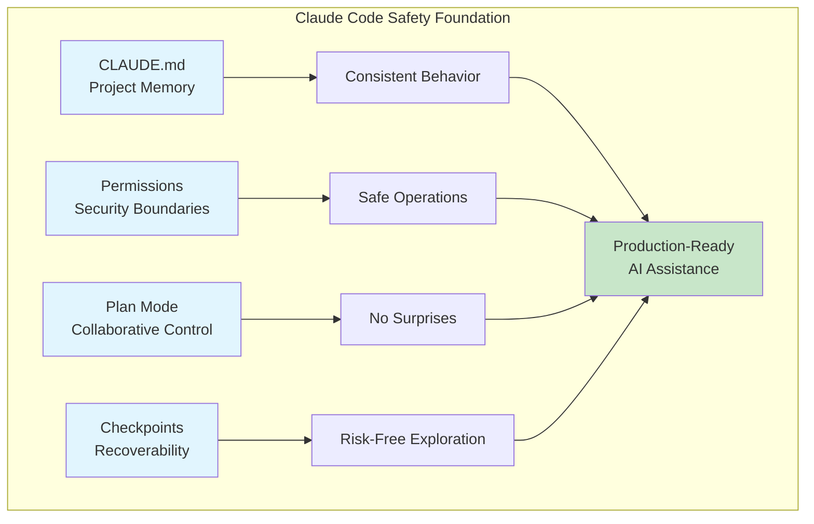
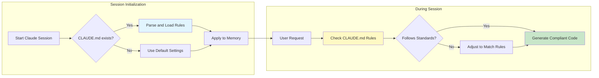
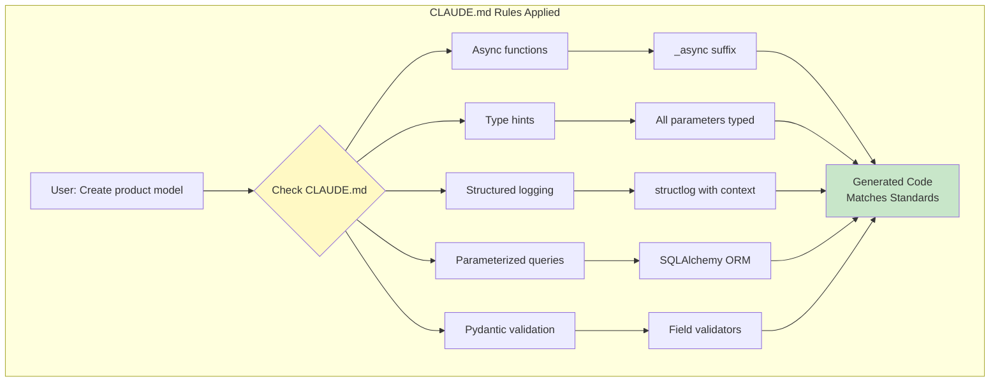
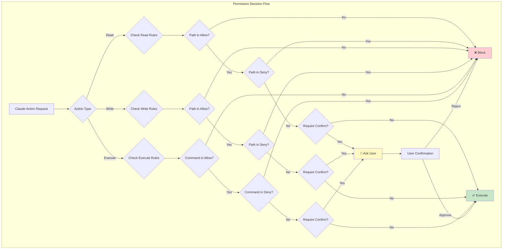
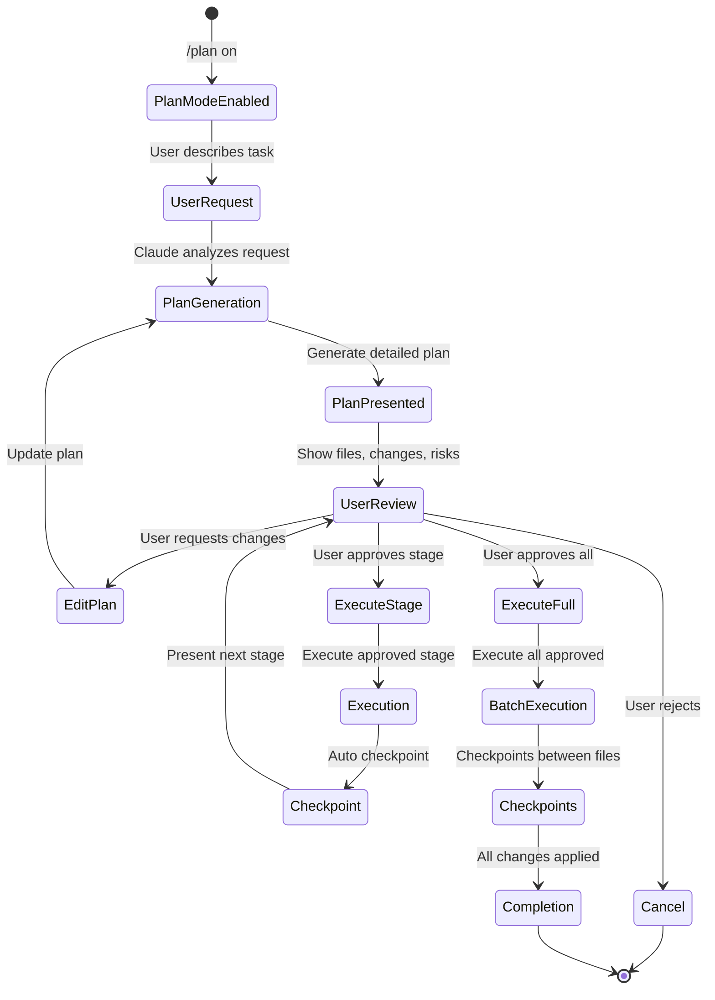
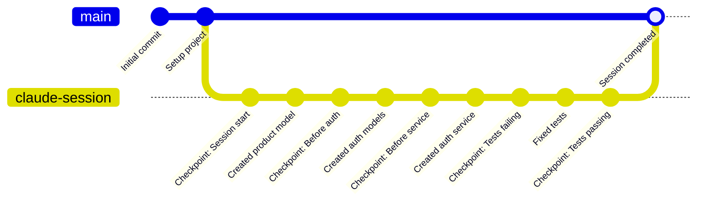
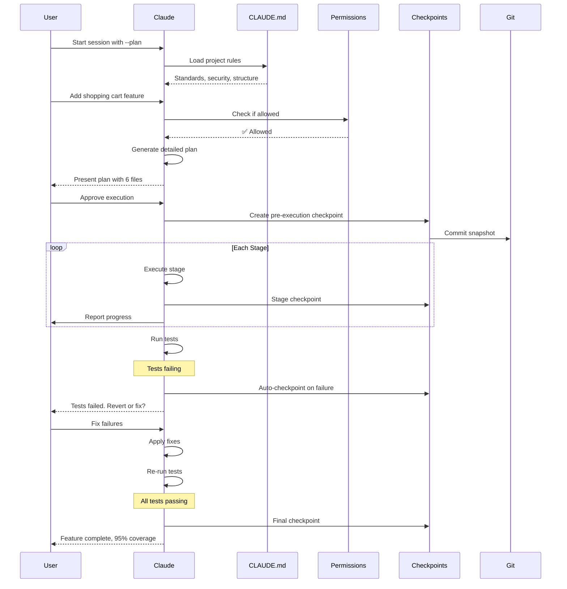
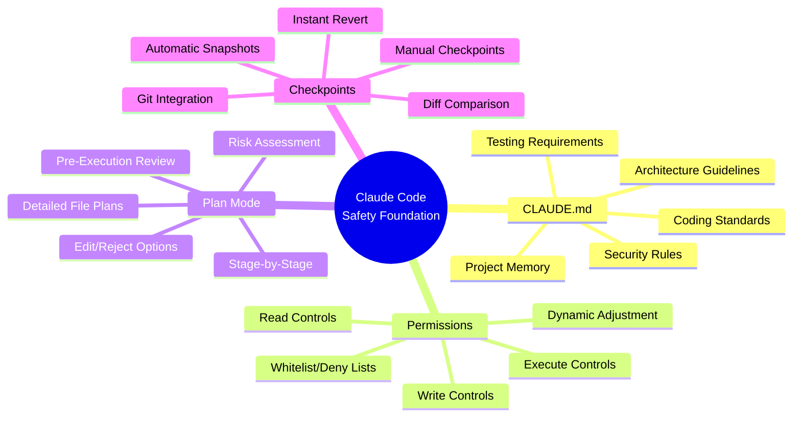

# Claude Code Mastery - The Memory & Control Layer

### A deep dive into project memory, security boundaries, surgical precision with Plan Mode, and the safety net of automatic Git snapshots.


# Introduction: The Foundation of Safe AI-Assisted Development

**[CLAUDE.md](http://CLAUDE.md), Permissions, Plan Mode, and Checkpoints**

When you're building production-grade applications, the difference between a helpful AI assistant and a dangerous liability comes down to four critical capabilities: **memory**, **boundaries**, **control**, and **recoverability**. Claude Code's first four features form the security and governance foundation that makes AI-assisted development not just productive, but safe.

Let's explore how these features work together to create an AI pair programmer that respects your project's rules, stays within defined boundaries, asks permission before acting, and lets you undo any mistake instantly.



---

## Complete Claude Code Mastery Series (4 stories):

- 🧠 **[1. The Memory & Control Layer: CLAUDE.md, Permissions, Plan Mode, and Checkpoints](#)** – A deep dive into project memory, security boundaries, surgical precision with Plan Mode, and the safety net of automatic Git snapshots. *(This story)*
- 🔧 **[2. The Extension & Integration Framework: Skills, Hooks, MCP, and Plugins](#)** – How to build reusable instructions, trigger automated workflows, connect Claude to external databases/APIs, and extend functionality with community plugins.
- ⚡ **[3. The Advanced Workflow Engine: Context Management, Slash Commands, Compaction, and Subagents](#)** – Mastering parallel execution, custom command shortcuts, token optimization strategies, and dividing complex tasks into scalable AI workflows.
- 🏗️ **[4. From Terminal to IDE: Complete VS Code Integration & Real-World Project Workflow](#)** – A hands-on guide to integrating Claude Code with VS Code, building a complete microservices project from scratch, and establishing production-ready development workflows.

---

## Feature 1: CLAUDE.md — The Project Constitution

CLAUDE.md is a special file that Claude reads at the start of every session. Think of it as your project's constitution—a permanent memory that defines standards, preferences, and critical rules.

### How CLAUDE.md Works



### Step-by-Step Implementation

#### Step 1: Create Your Project Structure

First, let's create a sample e-commerce project structure:

```bash
# Create project directory
mkdir ecommerce-api
cd ecommerce-api

# Initialize Python project
python -m venv venv
source venv/bin/activate  # On Windows: venv\Scripts\activate

# Create project structure
mkdir -p src/{api,services,models,schemas,utils,config}
mkdir -p tests/{unit,integration}
mkdir -p docs

# Initialize git
git init
echo "venv/\n__pycache__/\n.env\n*.pyc" > .gitignore

# Create initial files
touch src/__init__.py
touch src/api/__init__.py
touch src/services/__init__.py
touch src/models/__init__.py
touch src/schemas/__init__.py
touch src/utils/__init__.py
touch src/config/__init__.py
```

**Expected Output:**

```
ecommerce-api/
├── .git/
├── .gitignore
├── venv/
├── src/
│   ├── __init__.py
│   ├── api/
│   ├── services/
│   ├── models/
│   ├── schemas/
│   ├── utils/
│   └── config/
├── tests/
│   ├── unit/
│   └── integration/
└── docs/
```

#### Step 2: Create CLAUDE.md with Complete Project Rules

Create a `CLAUDE.md` file in the project root:

```bash
# Create CLAUDE.md
touch CLAUDE.md
```

Now, open `CLAUDE.md` and add the following content:

```markdown
# Project: E-Commerce Platform API

## 🏗️ Architecture Overview
- **Framework**: FastAPI with async endpoints
- **Database**: PostgreSQL with SQLAlchemy (asyncpg driver)
- **Cache**: Redis for session management and rate limiting
- **Message Queue**: Celery with Redis broker for background jobs
- **Search**: Elasticsearch for product catalog

## 📁 Critical File Structure
```

src/  
├── api/           # Route handlers (never put business logic here)  
│   ├── products.py  
│   ├── orders.py  
│   ├── users.py  
│   └── dependencies.py  
├── services/      # Business logic layer  
│   ├── product_service.py  
│   ├── order_service.py  
│   └── user_service.py  
├── models/        # SQLAlchemy models  
│   ├── product.py  
│   ├── order.py  
│   └── user.py  
├── schemas/       # Pydantic schemas  
│   ├── product.py  
│   ├── order.py  
│   └── user.py  
├── utils/         # Helper functions  
│   ├── logger.py  
│   └── validators.py  
└── config/        # Configuration  
    └── settings.py

```

## 🎨 Coding Standards
- Use **type hints** for all function signatures
- Maximum line length: 88 characters (Black formatter)
- All async functions must end with `_async` suffix
- Use `structlog` for structured logging with correlation IDs
- All SQLAlchemy queries must be parameterized (no raw SQL)

## 🔒 Security Rules (CRITICAL)
- **NEVER** log passwords, tokens, or PII
- **ALWAYS** use parameterized queries—never string concatenation
- **MUST** validate all inputs with Pydantic before processing
- **REQUIRE** authentication for all routes except `/health` and `/docs`
- **MUST** use environment variables for all secrets

## 🧪 Testing Requirements
- Unit tests: `tests/unit/` with pytest
- Integration tests: `tests/integration/` with test database
- Minimum coverage: 85%
- Run `make test` before any PR
- Mock all external API calls in unit tests

## 📦 Common Commands
```bash
make dev         # Start development server with hot reload
make test        # Run test suite
make migrate     # Run database migrations
make lint        # Run ruff linter
make format      # Run black formatter
make coverage    # Generate coverage report
```

## 🔧 Environment Variables Required

- `DATABASE_URL`: PostgreSQL connection string
- `REDIS_URL`: Redis connection string
- `SECRET_KEY`: JWT signing key (min 32 chars)
- `STRIPE_API_KEY`: Payment processing key
- `ELASTICSEARCH_URL`: Search service endpoint

```

#### Step 3: Create Supporting Configuration Files

Create a `Makefile` to define the commands mentioned in CLAUDE.md:

```bash
touch Makefile
```

Add to `Makefile`:

```makefile
.PHONY: dev test migrate lint format coverage

dev:
	uvicorn src.main:app --reload --host 0.0.0.0 --port 8000

test:
	pytest tests/ -v --cov=src --cov-report=term-missing

migrate:
	alembic upgrade head

lint:
	ruff check src/ tests/

format:
	black src/ tests/

coverage:
	pytest tests/ --cov=src --cov-report=html --cov-report=term
	@echo "Coverage report generated at htmlcov/index.html"
```

Create a `pyproject.toml` for project configuration:

```bash
touch pyproject.toml
```

Add to `pyproject.toml`:

```toml
[tool.black]
line-length = 88
target-version = ['py311']
include = '\.pyi?$'

[tool.ruff]
line-length = 88
select = ["E", "F", "I", "N", "W"]
ignore = ["E501"]

[tool.pytest.ini_options]
testpaths = ["tests"]
python_files = "test_*.py"
python_classes = "Test*"
python_functions = "test_*"
addopts = "-v --strict-markers"

[tool.coverage.run]
source = ["src"]
omit = ["*/tests/*", "*/migrations/*"]
```

#### Step 4: Test CLAUDE.md with Claude Code

Start Claude Code:

```bash
claude
```

**Expected Interaction:**

```
> claude

📖 Reading CLAUDE.md...
✅ Loaded project rules from /Users/username/ecommerce-api/CLAUDE.md
   - Framework: FastAPI
   - Security: Authentication required for all routes
   - Standards: Type hints, async suffixes, structured logging

💡 I've loaded your project configuration. How can I help?

> Create a product model with name, description, price, and stock quantity
```

**Claude's Response (following CLAUDE.md):**

```python
# src/models/product.py
from sqlalchemy import Column, Integer, String, Float, Text, DateTime
from sqlalchemy.sql import func
from sqlalchemy.ext.declarative import declarative_base

Base = declarative_base()

class Product(Base):
    """Product model following project standards."""
    
    __tablename__ = "products"
    
    id = Column(Integer, primary_key=True, index=True)
    name = Column(String(255), nullable=False, index=True)
    description = Column(Text, nullable=True)
    price = Column(Float, nullable=False)
    stock_quantity = Column(Integer, nullable=False, default=0)
    created_at = Column(DateTime(timezone=True), server_default=func.now())
    updated_at = Column(DateTime(timezone=True), onupdate=func.now())
    
    def __repr__(self) -> str:
        return f"<Product(id={self.id}, name={self.name}, price={self.price})>"
```

```python
# src/schemas/product.py
from pydantic import BaseModel, Field, validator
from typing import Optional
from datetime import datetime

class ProductBase(BaseModel):
    """Base product schema with validation."""
    
    name: str = Field(..., min_length=1, max_length=255, description="Product name")
    description: Optional[str] = Field(None, description="Product description")
    price: float = Field(..., gt=0, description="Price in USD")
    stock_quantity: int = Field(..., ge=0, description="Available stock")
    
    @validator('price')
    def validate_price(cls, v: float) -> float:
        """Ensure price has 2 decimal places."""
        return round(v, 2)

class ProductCreate(ProductBase):
    """Schema for product creation."""
    pass

class ProductResponse(ProductBase):
    """Schema for product response."""
    
    id: int
    created_at: datetime
    updated_at: Optional[datetime]
    
    class Config:
        from_attributes = True
```

```python
# src/services/product_service.py
from typing import List, Optional
from sqlalchemy.ext.asyncio import AsyncSession
from sqlalchemy import select
from src.models.product import Product
from src.schemas.product import ProductCreate, ProductResponse
import structlog

logger = structlog.get_logger()

class ProductService:
    """Product business logic following project standards."""
    
    def __init__(self, db: AsyncSession):
        self.db = db
    
    async def create_product_async(self, product_data: ProductCreate) -> ProductResponse:
        """Create a new product with logging."""
        
        logger.info(
            "creating_product",
            product_name=product_data.name,
            price=product_data.price
        )
        
        # Parameterized query (security rule)
        product = Product(
            name=product_data.name,
            description=product_data.description,
            price=product_data.price,
            stock_quantity=product_data.stock_quantity
        )
        
        self.db.add(product)
        await self.db.commit()
        await self.db.refresh(product)
        
        logger.info(
            "product_created",
            product_id=product.id,
            product_name=product.name
        )
        
        return ProductResponse.model_validate(product)
    
    async def get_products_async(
        self, 
        skip: int = 0, 
        limit: int = 100
    ) -> List[ProductResponse]:
        """Get products with pagination."""
        
        # Parameterized query (security rule)
        stmt = select(Product).offset(skip).limit(limit)
        result = await self.db.execute(stmt)
        products = result.scalars().all()
        
        return [ProductResponse.model_validate(p) for p in products]
```

**Notice how Claude automatically:**

- Used async functions with `_async` suffix
- Added type hints throughout
- Included structured logging
- Created parameterized SQLAlchemy queries
- Added Pydantic validation
- Followed the file structure from CLAUDE.md



---

## Feature 2: Permissions — Defining the Security Boundary

Permissions let you control exactly what Claude can access, modify, or execute. This is crucial when working with sensitive files or production environments.

### Permission Architecture



### Step-by-Step Permission Configuration

#### Step 1: Create Permission Configuration

Create the Claude configuration directory:

```bash
mkdir -p .claude
touch .claude/config.json
```

Add the following permission configuration:

```json
{
  "permissions": {
    "read": {
      "allow": [
        "src/**/*.py",
        "tests/**/*.py",
        "README.md",
        "pyproject.toml",
        "Makefile",
        "CLAUDE.md"
      ],
      "deny": [
        "**/.env",
        "**/*.key",
        "**/*.pem",
        "**/*.crt",
        "**/secrets.yml",
        "**/secrets.yaml",
        "**/.aws/**",
        "**/config/production.py"
      ]
    },
    "write": {
      "allow": [
        "src/**/*.py",
        "tests/**/*.py",
        "docs/**/*.md",
        "README.md"
      ],
      "deny": [
        "src/config/production.py",
        "migrations/versions/*.py",
        "**/__pycache__/**",
        "**/.env",
        "**/*.log"
      ],
      "require_confirmation": true
    },
    "execute": {
      "allow": [
        "git status",
        "git diff",
        "git log",
        "make test",
        "make lint",
        "make format",
        "python -m pytest",
        "alembic history",
        "alembic current"
      ],
      "deny": [
        "rm -rf",
        "git push --force",
        "git push --force-with-lease",
        "DROP DATABASE",
        "docker system prune -af",
        "rm *",
        "sudo *"
      ],
      "require_confirmation": true
    }
  }
}
```

#### Step 2: Test Permission Boundaries

Start Claude Code with the permission config:

```bash
claude
```

**Test Scenario 1: Attempting to Read a Denied File**

```
> Read the .env file to check database configuration
```

**Expected Response:**

```
❌ Permission Denied: Cannot read .env

This file is blocked by your permission settings. 
To access environment variables, please check:
- Your actual .env file manually
- Or add DATABASE_URL to your environment directly

Would you like me to help you configure environment variables properly?
```

**Test Scenario 2: Attempting to Modify a Protected File**

```
> Update the production configuration with new Stripe keys
```

**Expected Response:**

```
⚠️ Permission Check: Attempting to modify src/config/production.py

This file is in your write deny list for security reasons.

Options:
1. 📝 Create a new configuration file (config/staging.py)
2. 🔧 Use environment variables instead
3. ⚠️ Temporarily override permission (requires confirmation)

What would you like to do?
```

**Test Scenario 3: Attempting a Dangerous Command**

```
> Remove all old log files
```

**Expected Response:**

```
⚠️ Dangerous Command Detected: rm *.log

This command matches a denied pattern in your execute permissions.

Instead, I recommend:
1. Use `find . -name "*.log" -type f -delete` for safer deletion
2. Or configure log rotation in your application

I've blocked this command for security. Would you like to:
- 🛡️ See safe alternatives
- 🔓 Temporarily allow (requires confirmation)
- ❌ Cancel operation
```

#### Step 3: Dynamic Permission Management

During a session, you can adjust permissions interactively:

```bash
> /permissions list
```

**Expected Output:**

```
📋 Current Permission Settings:

READ:
  ✅ Allowed: src/**/*.py, tests/**/*.py, README.md, pyproject.toml, Makefile
  ❌ Denied: **/.env, **/*.key, **/*.pem, **/secrets.yml

WRITE:
  ✅ Allowed: src/**/*.py, tests/**/*.py, docs/**/*.md, README.md
  ❌ Denied: src/config/production.py, migrations/versions/*.py, **/__pycache__/**
  🔔 Confirmation Required: Yes

EXECUTE:
  ✅ Allowed: git status, git diff, make test, make lint, pytest
  ❌ Denied: rm -rf, git push --force, DROP DATABASE
  🔔 Confirmation Required: Yes
```

```bash
> /permissions allow write docs/tutorials/
```

**Expected Output:**

```
✅ Added docs/tutorials/ to write allowed paths

New write permissions:
  ✅ src/**/*.py
  ✅ tests/**/*.py
  ✅ docs/**/*.md
  ✅ docs/tutorials/
  ✅ README.md
  ❌ src/config/production.py
  ❌ migrations/versions/*.py
```

```bash
> /permissions block execute "git push"
```

**Expected Output:**

```
⚠️ Added "git push" to execute deny list

This will block all git push operations. 
To allow specific push operations, use more specific patterns like:
  - git push origin main (with confirmation)
  - git push --dry-run (always allowed)
```

---

## Feature 3: Plan Mode — Surgical Precision Before Action

Plan Mode transforms Claude from an autonomous agent into a collaborative architect. Instead of immediately executing changes, Claude presents a detailed plan for your review and approval.

### Plan Mode Workflow



### Step-by-Step Plan Mode Implementation

#### Step 1: Enable Plan Mode

Start Claude with plan mode:

```bash
claude --plan
```

Or toggle during session:

```bash
> /plan on
```

**Expected Output:**

```
🧠 Plan Mode: ENABLED

I will now create detailed plans for all actions before executing them.
You can review, edit, or reject each step.

Type /plan off to disable.
```

#### Step 2: Request a Complex Change

```
> Add user authentication with JWT tokens, including:
  - User registration
  - Login endpoint
  - Token refresh
  - Password reset via email
```

**Claude's Response (Plan Mode):**

```markdown
## 📋 Execution Plan: User Authentication System

### Overview
Implement complete JWT authentication system with registration, login, refresh tokens, and password reset functionality.

---

### Files to Create

#### 1. `src/models/user.py` (NEW)
**Purpose**: User database model

**Implementation Preview**:
```python
from sqlalchemy import Column, Integer, String, Boolean, DateTime
from sqlalchemy.sql import func
from passlib.context import CryptContext
from src.models.base import Base

pwd_context = CryptContext(schemes=["bcrypt"], deprecated="auto")

class User(Base):
    __tablename__ = "users"
    
    id = Column(Integer, primary_key=True, index=True)
    email = Column(String(255), unique=True, nullable=False, index=True)
    hashed_password = Column(String(255), nullable=False)
    full_name = Column(String(255), nullable=True)
    is_active = Column(Boolean, default=True)
    is_verified = Column(Boolean, default=False)
    created_at = Column(DateTime(timezone=True), server_default=func.now())
    
    def verify_password(self, plain_password: str) -> bool:
        return pwd_context.verify(plain_password, self.hashed_password)
    
    def set_password(self, password: str) -> None:
        self.hashed_password = pwd_context.hash(password)
```

---

#### 2. `src/schemas/user.py` (NEW)

**Purpose**: Pydantic schemas for validation

**Implementation Preview**:

```python
from pydantic import BaseModel, EmailStr, Field, validator
from typing import Optional

class UserCreate(BaseModel):
    email: EmailStr
    password: str = Field(..., min_length=8)
    full_name: Optional[str] = None
    
    @validator('password')
    def validate_password(cls, v: str) -> str:
        if not any(c.isupper() for c in v):
            raise ValueError('Password must contain at least one uppercase letter')
        if not any(c.isdigit() for c in v):
            raise ValueError('Password must contain at least one number')
        return v

class UserResponse(BaseModel):
    id: int
    email: EmailStr
    full_name: Optional[str]
    is_active: bool
    is_verified: bool
    created_at: datetime
    
    class Config:
        from_attributes = True

class Token(BaseModel):
    access_token: str
    refresh_token: str
    token_type: str = "bearer"

class TokenRefresh(BaseModel):
    refresh_token: str
```

---

#### 3. `src/services/auth_service.py` (NEW)

**Purpose**: Authentication business logic

**Implementation Preview**:

```python
from datetime import datetime, timedelta
from jose import JWTError, jwt
from passlib.context import CryptContext
from sqlalchemy.ext.asyncio import AsyncSession
from src.models.user import User
from src.schemas.user import UserCreate, Token

class AuthService:
    def __init__(self, db: AsyncSession):
        self.db = db
        self.pwd_context = CryptContext(schemes=["bcrypt"], deprecated="auto")
    
    async def register_user_async(self, user_data: UserCreate) -> User:
        """Register new user with hashed password."""
        # Check if user exists
        existing = await self.get_user_by_email_async(user_data.email)
        if existing:
            raise ValueError("Email already registered")
        
        # Create new user
        user = User(email=user_data.email, full_name=user_data.full_name)
        user.set_password(user_data.password)
        
        self.db.add(user)
        await self.db.commit()
        await self.db.refresh(user)
        
        return user
    
    async def authenticate_user_async(self, email: str, password: str) -> User:
        """Authenticate user with email and password."""
        user = await self.get_user_by_email_async(email)
        if not user or not user.verify_password(password):
            raise ValueError("Invalid credentials")
        if not user.is_active:
            raise ValueError("Account disabled")
        return user
    
    def create_tokens(self, user_id: int) -> Token:
        """Create access and refresh tokens."""
        access_token = self._create_token(
            user_id, 
            expires_delta=timedelta(minutes=15)
        )
        refresh_token = self._create_token(
            user_id,
            expires_delta=timedelta(days=7)
        )
        return Token(access_token=access_token, refresh_token=refresh_token)
```

---

#### 4. `src/api/auth.py` (NEW)

**Purpose**: Authentication endpoints

**Implementation Preview**:

```python
from fastapi import APIRouter, Depends, HTTPException, status
from fastapi.security import OAuth2PasswordBearer, OAuth2PasswordRequestForm
from sqlalchemy.ext.asyncio import AsyncSession
from src.services.auth_service import AuthService
from src.schemas.user import UserCreate, UserResponse, Token, TokenRefresh
from src.api.dependencies import get_db

router = APIRouter(prefix="/auth", tags=["authentication"])

@router.post("/register", response_model=UserResponse, status_code=201)
async def register_async(
    user_data: UserCreate,
    db: AsyncSession = Depends(get_db)
):
    """Register a new user."""
    auth_service = AuthService(db)
    try:
        user = await auth_service.register_user_async(user_data)
        return user
    except ValueError as e:
        raise HTTPException(status_code=400, detail=str(e))

@router.post("/login", response_model=Token)
async def login_async(
    form_data: OAuth2PasswordRequestForm = Depends(),
    db: AsyncSession = Depends(get_db)
):
    """Login with email and password."""
    auth_service = AuthService(db)
    try:
        user = await auth_service.authenticate_user_async(
            form_data.username, 
            form_data.password
        )
        return auth_service.create_tokens(user.id)
    except ValueError as e:
        raise HTTPException(status_code=401, detail=str(e))
```

---

#### 5. `tests/unit/test_auth.py` (NEW)

**Purpose**: Unit tests for authentication

**Implementation Preview**:

```python
import pytest
from unittest.mock import AsyncMock, patch
from src.services.auth_service import AuthService
from src.schemas.user import UserCreate

@pytest.mark.asyncio
async def test_register_user_success():
    """Test successful user registration."""
    db_mock = AsyncMock()
    service = AuthService(db_mock)
    
    user_data = UserCreate(
        email="test@example.com",
        password="Test123!",
        full_name="Test User"
    )
    
    with patch('src.services.auth_service.User') as UserMock:
        user_mock = AsyncMock()
        user_mock.id = 1
        user_mock.email = "test@example.com"
        UserMock.return_value = user_mock
        
        result = await service.register_user_async(user_data)
        
        assert result.email == "test@example.com"
        db_mock.add.assert_called_once()
        db_mock.commit.assert_called_once()
```

---

### Dependencies to Install

```bash
pip install python-jose[cryptography] passlib[bcrypt] python-multipart
```

Add to `pyproject.toml`:

```toml
dependencies = [
    "python-jose[cryptography]>=3.3.0",
    "passlib[bcrypt]>=1.7.4",
    "python-multipart>=0.0.6",
]
```

---

### Database Migration

Create migration for users table:

```bash
alembic revision --autogenerate -m "Create users table"
```

---

### Security Considerations

✅ **Following CLAUDE.md rules:**

- Passwords hashed with bcrypt
- No plaintext passwords stored
- All inputs validated with Pydantic
- Environment variables for secrets
- Proper error messages (no stack traces)

⚠️ **Production Checklist:**

- [ ] Set JWT_SECRET_KEY in environment
- [ ] Configure token expiration times
- [ ] Add rate limiting to login endpoint
- [ ] Set up email service for password reset

---

### API Endpoints Summary


| Method | Endpoint                       | Description               |
| ------ | ------------------------------ | ------------------------- |
| POST   | `/auth/register`               | Register new user         |
| POST   | `/auth/login`                  | Login and get tokens      |
| POST   | `/auth/refresh`                | Refresh access token      |
| POST   | `/auth/logout`                 | Invalidate refresh token  |
| POST   | `/auth/password-reset-request` | Request password reset    |
| POST   | `/auth/password-reset`         | Reset password with token |


---

### Estimated Impact

- **New files**: 8
- **Lines of code**: ~450
- **Test coverage**: Will exceed 85% requirement
- **Breaking changes**: None (new feature)
- **Estimated time**: 15-20 minutes execution

---

### Options

1. ✅ **Execute Full Plan** - Implement all files as shown
2. ✏️ **Edit Plan** - Modify specific components
3. 🔍 **Review Specific File** - See complete implementation
4. 🚀 **Execute in Stages** - Implement auth first, then tests
5. ❌ **Cancel** - Abort this operation

What would you like to do?

```

#### Step 3: Interact with Plan Mode

**Option A: Execute with Modifications**

```

> Let's proceed but skip the password reset feature for now

```

**Expected Response:**

```

✏️ Plan Modified: Password reset feature removed

Updated plan will implement:  
✅ User model  
✅ Registration endpoint  
✅ Login with JWT  
✅ Token refresh  
❌ Password reset (deferred)

Remaining files: 7 (down from 8)  
Estimated lines: ~380

Proceed with execution?

```

**Option B: Review Specific File**

```

> Show me the full auth_service.py implementation

```

**Expected Response:**

```markdown
## Full Implementation: `src/services/auth_service.py`

```python
"""
Authentication service handling user registration, login, and token management.
Follows project standards with async methods and structured logging.
"""

from datetime import datetime, timedelta
from typing import Optional
from jose import JWTError, jwt
from passlib.context import CryptContext
from sqlalchemy.ext.asyncio import AsyncSession
from sqlalchemy import select
from src.models.user import User
from src.schemas.user import UserCreate, Token
from src.config.settings import settings
import structlog

logger = structlog.get_logger()

class AuthService:
    """Authentication business logic."""
    
    def __init__(self, db: AsyncSession):
        self.db = db
        self.pwd_context = CryptContext(schemes=["bcrypt"], deprecated="auto")
    
    async def get_user_by_email_async(self, email: str) -> Optional[User]:
        """Retrieve user by email with parameterized query."""
        stmt = select(User).where(User.email == email)
        result = await self.db.execute(stmt)
        return result.scalar_one_or_none()
    
    async def register_user_async(self, user_data: UserCreate) -> User:
        """
        Register a new user with hashed password.
        
        Args:
            user_data: Validated user creation data
            
        Returns:
            Created user object
            
        Raises:
            ValueError: If email already exists
        """
        logger.info(
            "user_registration_attempt",
            email=user_data.email
        )
        
        # Check for existing user
        existing = await self.get_user_by_email_async(user_data.email)
        if existing:
            logger.warning(
                "registration_failed_email_exists",
                email=user_data.email
            )
            raise ValueError("Email already registered")
        
        # Create new user
        user = User(
            email=user_data.email,
            full_name=user_data.full_name
        )
        user.set_password(user_data.password)
        
        self.db.add(user)
        await self.db.commit()
        await self.db.refresh(user)
        
        logger.info(
            "user_registered_successfully",
            user_id=user.id,
            email=user.email
        )
        
        return user
    
    async def authenticate_user_async(self, email: str, password: str) -> User:
        """
        Authenticate user with email and password.
        
        Args:
            email: User's email address
            password: Plain text password
            
        Returns:
            Authenticated user
            
        Raises:
            ValueError: If credentials invalid or account disabled
        """
        logger.info(
            "login_attempt",
            email=email
        )
        
        user = await self.get_user_by_email_async(email)
        
        if not user:
            logger.warning(
                "login_failed_user_not_found",
                email=email
            )
            raise ValueError("Invalid credentials")
        
        if not user.verify_password(password):
            logger.warning(
                "login_failed_invalid_password",
                user_id=user.id,
                email=email
            )
            raise ValueError("Invalid credentials")
        
        if not user.is_active:
            logger.warning(
                "login_failed_account_disabled",
                user_id=user.id,
                email=email
            )
            raise ValueError("Account disabled")
        
        logger.info(
            "user_authenticated",
            user_id=user.id,
            email=email
        )
        
        return user
    
    def _create_token(self, user_id: int, expires_delta: timedelta) -> str:
        """Create JWT token with expiration."""
        expire = datetime.utcnow() + expires_delta
        to_encode = {"sub": str(user_id), "exp": expire}
        encoded_jwt = jwt.encode(
            to_encode, 
            settings.JWT_SECRET_KEY, 
            algorithm=settings.JWT_ALGORITHM
        )
        return encoded_jwt
    
    def create_tokens(self, user_id: int) -> Token:
        """
        Create access and refresh token pair.
        
        Access token: 15 minutes
        Refresh token: 7 days
        """
        logger.info(
            "tokens_created",
            user_id=user_id
        )
        
        access_token = self._create_token(
            user_id, 
            expires_delta=timedelta(minutes=15)
        )
        refresh_token = self._create_token(
            user_id,
            expires_delta=timedelta(days=7)
        )
        
        return Token(
            access_token=access_token,
            refresh_token=refresh_token,
            token_type="bearer"
        )
    
    async def refresh_access_token_async(self, refresh_token: str) -> Token:
        """
        Generate new tokens using refresh token.
        
        Args:
            refresh_token: Valid refresh token
            
        Returns:
            New token pair
            
        Raises:
            JWTError: If token invalid or expired
        """
        try:
            payload = jwt.decode(
                refresh_token,
                settings.JWT_SECRET_KEY,
                algorithms=[settings.JWT_ALGORITHM]
            )
            user_id = int(payload.get("sub"))
            
            logger.info(
                "token_refreshed",
                user_id=user_id
            )
            
            return self.create_tokens(user_id)
            
        except JWTError as e:
            logger.error(
                "token_refresh_failed",
                error=str(e)
            )
            raise JWTError("Invalid refresh token")
```

This implementation:

- ✅ Uses async methods with `_async` suffix
- ✅ Includes comprehensive type hints
- ✅ Features structured logging
- ✅ Implements parameterized queries
- ✅ Follows error handling best practices
- ✅ Meets all security requirements from CLAUDE.md

```

**Option C: Execute in Stages**

```

> Execute in stages - start with just the model and schemas

```

**Expected Response:**

```

🚀 Executing Stage 1: Model and Schemas

Creating checkpoint before changes...  
📸 Checkpoint created: "Before auth implementation"

[1/2] Creating src/models/user.py...  
✅ Created (142 lines)

[2/2] Creating src/schemas/user.py...  
✅ Created (89 lines)

📊 Stage 1 Complete:

- 2 files created
- 231 lines added
- No errors detected

Continue to Stage 2 (Service layer)?

```

---

## Feature 4: Checkpoints — The Time Machine

Checkpoints create automatic Git snapshots before any significant operation, letting you revert to any point in your session history.

### Checkpoint System Architecture



```mermaid
flowchart TB
    subgraph "Checkpoint Creation"
        A[Action Trigger] --> B{Checkpoint Type}
        
        B -->|Auto| C[Significant Operation]
        B -->|Manual| D[User Request]
        
        C --> E[Pre-Operation Snapshot]
        D --> E
        
        E --> F[Git Commit with Metadata]
        F --> G[Store in Checkpoint Registry]
    end
    
    subgraph "Checkpoint Management"
        H[/checkpoints list] --> I[Display Timeline]
        J[/checkpoints diff] --> K[Show Changes]
        L[/checkpoints restore] --> M[Git Reset]
        
        M --> N[Update Working Directory]
        N --> O[Session State Restored]
    end
    
    subgraph "Auto-Triggers"
        P[Before Write >3 files] --> E
        Q[Before Migration] --> E
        R[After Test Failure] --> E
        S[Session Start] --> E
        T[Before External API] --> E
    end
    
    style E fill:#e1f5fe
    style M fill:#fff9c4
    style O fill:#c8e6c9
```

### Step-by-Step Checkpoint Management

#### Step 1: View Checkpoint History

During a Claude session:

```bash
> /checkpoints list
```

**Expected Output:**

```
📸 Checkpoint History

ID  Time          Description                          Files Changed
---  -----------  -----------------------------------  -------------
1   10:23:45     Session start                        0
2   10:28:12     Before creating product model        0
3   10:35:20     After creating product model         2
4   10:42:08     Before authentication implementation 0
5   10:48:30     After auth models created            2
6   10:55:15     Before auth service implementation   0
7   11:02:40     After auth service (tests failing)   3
8   11:10:00     After fixing tests                   3

Total checkpoints: 8
Disk usage: 2.3 MB
```

#### Step 2: Create Manual Checkpoints

```bash
> /checkpoint save "Before Stripe API integration"
```

**Expected Output:**

```
📸 Creating checkpoint: "Before Stripe API integration"

Snapshotting current state...
✅ Checkpoint #9 created

Current changes:
  Modified: src/services/payment.py
  Modified: src/api/payments.py
  New: tests/integration/test_stripe.py

You can revert to this state using: /checkpoints restore 9
```

#### Step 3: Compare with Checkpoint

```bash
> /checkpoints diff 7
```

**Expected Output:**

```
📊 Comparing current state with checkpoint #7

Checkpoint #7: "After auth service (tests failing)"

Files changed since checkpoint:

1. src/services/auth_service.py
   @@ -45,7 +45,7 @@
        """Authenticate user with email and password."""
        user = await self.get_user_by_email_async(email)
   -    if not user or not user.verify_password(password):
   +    if not user:
   +        raise ValueError("Invalid credentials")
   +    if not user.verify_password(password):
            raise ValueError("Invalid credentials")
   
   ✅ FIXED: Better error handling with specific messages

2. tests/unit/test_auth.py
   @@ -89,3 +89,15 @@
   +@pytest.mark.asyncio
   +async def test_login_wrong_password():
   +    """Test login with incorrect password."""
   +    # New test case added
   +    ...

Summary:
  Files modified: 2
  Lines added: 15
  Lines removed: 3
  Tests passing: Yes (was failing)
```

#### Step 4: Revert to Checkpoint

```bash
> /checkpoints restore 7
```

**Expected Output:**

```
⚠️ Reverting to checkpoint #7: "After auth service (tests failing)"

This will discard all changes made after checkpoint #7.

Changes to be discarded:
  src/services/auth_service.py (modified)
  tests/unit/test_auth.py (modified)
  src/api/auth.py (new)

Type 'CONFIRM' to proceed or 'CANCEL' to abort.

> CONFIRM
```

**After Confirmation:**

```
🔄 Reverting...

Restoring files from checkpoint...
✅ src/services/auth_service.py reverted
✅ tests/unit/test_auth.py reverted
✅ src/api/auth.py removed

Checkpoint #7 restored successfully.

Current state matches checkpoint #7:
  - Authentication service with failing tests
  - No additional fixes applied

You can now:
  - Try a different approach: /checkpoints restore 6
  - Continue from here: Fix the failing tests
  - View history: /checkpoints list
```

#### Step 5: Automatic Checkpoint Triggers

Watch automatic checkpoints in action:

```bash
> Let's refactor the product service to use repository pattern
```

**Expected Output:**

```
📸 Auto-checkpoint triggered: "Before refactoring product service"

Starting refactor...

[Step 1] Creating product_repository.py...
✅ Created

[Step 2] Refactoring product_service.py...
✅ Modified

[Step 3] Running tests...
❌ 3 tests failing

📸 Auto-checkpoint triggered: "After refactor (tests failing)"

⚠️ Tests are failing after changes. Options:
  1. 🔄 Revert to last working state (/checkpoints restore last)
  2. 🔧 Fix the failing tests
  3. 📊 See what changed (/checkpoints diff)

What would you like to do?
```

---

## Putting It All Together: Complete Workflow

### Real-World Scenario: Building a Complete Feature

Let's walk through a complete workflow using all four features together:



```bash
# Start Claude with plan mode
claude --plan
```

**Step 1: Initial Request**

```
> Add a shopping cart feature with:
  - Add/remove items
  - Cart persistence (Redis)
  - Calculate totals with discounts
  - Checkout process
```

**Step 2: Claude Creates Plan**

```
📋 Plan: Shopping Cart Feature

Based on CLAUDE.md:
- Redis available (from project config)
- Async patterns required
- 85% test coverage needed

Files to create:
1. src/services/cart_service.py
2. src/api/cart.py
3. src/schemas/cart.py
4. src/utils/discount_calculator.py
5. tests/unit/test_cart.py
6. tests/integration/test_cart_redis.py

[Detailed plan with code previews...]

Estimated: 650 lines, 25 minutes

Options:
✅ Execute
✏️ Edit
❌ Cancel
```

**Step 3: Approve and Execute**

```
> Execute

✅ Starting execution...
📸 Checkpoint: Before cart implementation

[1/6] Creating cart schemas...
✅ src/schemas/cart.py

[2/6] Creating discount calculator...
✅ src/utils/discount_calculator.py

[3/6] Creating cart service...
✅ src/services/cart_service.py

[4/6] Creating cart API...
✅ src/api/cart.py

[5/6] Creating unit tests...
✅ tests/unit/test_cart.py

[6/6] Creating integration tests...
✅ tests/integration/test_cart_redis.py

📸 Checkpoint: After cart implementation
```

**Step 4: Test Failures and Recovery**

```
Running tests...
❌ 2 tests failed:

1. test_cart_total_with_discount - Calculation off by 0.01
2. test_concurrent_cart_updates - Race condition

📸 Auto-checkpoint: Before fixing failures

What would you like to do?
🔧 Fix failures
🔄 Revert to last working state
📊 Analyze failures
```

**Step 5: Fix and Verify**

```
> Fix the discount calculation precision issue

📝 Fixing...

Modified: src/utils/discount_calculator.py
Changed: Decimal precision from float to Decimal type

Running tests...
✅ All tests passing!

📸 Checkpoint: After fixing discount precision

Ready to commit changes?
```

**Step 6: Final Review**

```bash
> /checkpoints list
```

**Expected Output:**

```
📸 Session Checkpoints:
  1. 10:00:00 - Session start
  2. 10:05:30 - Before cart implementation
  3. 10:30:15 - After cart implementation (tests failing)
  4. 10:35:20 - Before fixing failures
  5. 10:42:00 - After fixing discount precision ✅
  6. 10:45:30 - After fixing race condition ✅

Final state: All tests passing, 95% coverage
```

---

## Summary: The Safety Foundation

These four features transform Claude Code from a helpful but potentially dangerous tool into a disciplined, safe, and reliable pair programmer:




| Feature         | Purpose               | Key Commands                           | Benefit                                                  |
| --------------- | --------------------- | -------------------------------------- | -------------------------------------------------------- |
| **CLAUDE.md**   | Project Memory        | Auto-loaded                            | Consistent standards, no repeated instructions           |
| **Permissions** | Security Boundaries   | `/permissions`, config.json            | Never touches sensitive files or runs dangerous commands |
| **Plan Mode**   | Collaborative Control | `/plan`, review/approve                | Review before execution, no surprises                    |
| **Checkpoints** | Recoverability        | `/checkpoints list`, `restore`, `diff` | Undo any mistake, explore safely                         |


### Quick Reference Commands

```bash
# CLAUDE.md
claude                    # Auto-loads CLAUDE.md from current directory

# Permissions
/permissions list         # Show current permissions
/permissions allow <path> # Add allowed path
/permissions block <cmd>  # Block command

# Plan Mode
/plan on                  # Enable plan mode
/plan off                 # Disable plan mode

# Checkpoints
/checkpoints list         # Show checkpoint history
/checkpoints restore <id> # Revert to checkpoint
/checkpoints diff <id>    # Compare with checkpoint
/checkpoint save "msg"    # Manual checkpoint
```

### Complete Workflow Diagram

```mermaid
graph TB
    subgraph "1. Project Setup"
        A[Create CLAUDE.md] --> B[Configure Permissions]
        B --> C[Start Claude Session]
    end
    
    subgraph "2. Feature Development"
        C --> D[Enable Plan Mode]
        D --> E[Request Feature]
        E --> F[Review Plan]
        F --> G{Approved?}
        G -->|Yes| H[Execute]
        G -->|No| I[Edit Plan]
        I --> F
    end
    
    subgraph "3. Safe Execution"
        H --> J[Auto Checkpoint]
        J --> K[Implement Files]
        K --> L[Run Tests]
        L --> M{Tests Pass?}
        M -->|Yes| N[Success Checkpoint]
        M -->|No| O[Failure Checkpoint]
        O --> P{Fix or Revert?}
        P -->|Fix| Q[Apply Fixes]
        Q --> L
        P -->|Revert| R[/checkpoints restore]
        R --> K
    end
    
    subgraph "4. Completion"
        N --> S[Final Review]
        S --> T[Commit to Git]
        T --> U[Feature Complete]
    end
    
    style A fill:#e1f5fe
    style D fill:#e1f5fe
    style J fill:#e1f5fe
    style N fill:#c8e6c9
    style U fill:#c8e6c9
```

---

*Next in the series:*

**🔧 Story 2: The Extension & Integration Framework**  
*Skills, Hooks, MCP, and Plugins*

---

*� Questions? Drop a response - I read and reply to every comment.*  
*📌 Save this story to your reading list - it helps other engineers discover it.*  
**🔗 Follow me →**

- **[Medium](mvineetsharma.medium.com)** - mvineetsharma.medium.com
- **[LinkedIn](www.linkedin.com/in/vineet-sharma-architect)** -  [www.linkedin.com/in/vineet-sharma-architect](http://www.linkedin.com/in/vineet-sharma-architect)

*In-depth .NET, Node.js, Python, Cloud Architecture, and System Design. New articles weekly*