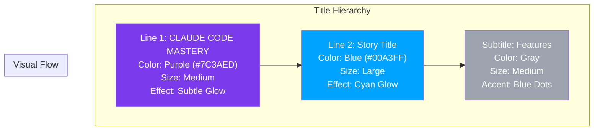

# 🎨 Gemini Image Prompts for Claude Code Mastery Series

## Complete Visual Identity Guide

**Style Guidelines:**
- **Background**: Light, bright, techno-open-source aesthetic with subtle blue gradients
- **Color Palette**: White backgrounds with vibrant accents, neon highlights
- **Elements**: Circuit patterns, flowchart connectors, technology logos, abstract code visualizations
- **Typography**: Bold titles with stacked dual-color layout, clean sans-serif subtitles
- **Placement**: "Vineet Sharma" in subtle but readable font at bottom right corner
- **Mood**: Modern, innovative, collaborative, AI-powered development

---

## Story 1: The Memory & Control Layer

### Image Prompt

```
Create a futuristic, bright, open-source technology illustration with a clean white background and subtle blue circuit patterns. 

**TITLE LAYOUT** (Stacked, no dash):
- Line 1: "CLAUDE CODE MASTERY" in smaller, elegant text with vibrant purple (#7C3AED) and subtle glow
- Line 2: "THE MEMORY & CONTROL LAYER" in larger, bold text with electric blue (#00A3FF) and cyan glow
- Both lines centered at the top, with clear hierarchy

**SUBTITLE**: "CLAUDE.md · Permissions · Plan Mode · Checkpoints" in clean, modern sans-serif font, light gray with blue accent dots between words.

**MAIN VISUAL ELEMENTS**: 
- A central glowing blue neural network node representing "AI Memory"
- Four interconnected pillars or shields around it representing the four features:
  - Left: Document icon with code brackets (CLAUDE.md) - purple glow
  - Top: Lock/shield icon with key (Permissions) - blue accent
  - Right: Blueprint/planning board with checkmarks (Plan Mode) - cyan glow
  - Bottom: Time machine/rewind icon with snapshots (Checkpoints) - purple accent
- Flowing blue connector lines forming a secure perimeter around all elements
- Abstract binary code flowing through transparent tubes in background
- Small Python, FastAPI, PostgreSQL logos integrated as subtle elements

**TECHNOLOGY VISUALS**:
- Git branch visualization as glowing purple branches
- Code blocks floating in space with syntax highlighting
- Shield patterns with checkmarks
- Clock/timeline visualization

**COMPOSITION**: Balanced, symmetrical, with clear visual hierarchy. Title stacked with purple top line and blue bottom line, central visualization, Vineet Sharma in small but readable font at bottom right corner, white background with soft blue glow effects.
```

---

## Story 2: The Extension & Integration Framework

### Image Prompt

```
Create a vibrant, open-source ecosystem illustration with bright white background and flowing blue connection lines. 

**TITLE LAYOUT** (Stacked, no dash):
- Line 1: "CLAUDE CODE MASTERY" in smaller, elegant text with vibrant purple (#7C3AED) and subtle glow
- Line 2: "THE EXTENSION & INTEGRATION FRAMEWORK" in larger, bold text with electric blue (#00A3FF) and cyan glow
- Both lines centered at the top, with clear hierarchy

**SUBTITLE**: "Skills · Hooks · MCP · Plugins" in clean modern font, light gray with blue accent dots between words.

**MAIN VISUAL ELEMENTS**: 
- A central modular "Core" cube glowing with blue energy
- Four extension arms radiating outward like a star, each with distinct iconography:
  - Top-left: Document with gear (Skills) - SKILL.md file icon, purple glow
  - Top-right: Hook/circular arrow icon (Hooks) - Pre/PostToolUse visualization, blue accent
  - Bottom-left: Universal plug/connector icon (MCP) - External service connections, cyan glow
  - Bottom-right: Puzzle piece with plus sign (Plugins) - Docker + pytest logos, purple accent
- Blue flowing data streams connecting all extensions back to the core
- Abstract network of APIs, databases, cloud services as floating icons
- Open-source logos (Python, FastAPI, Redis, PostgreSQL) integrated into the network

**TECHNOLOGY VISUALS**:
- API gateway symbols with connection points
- Database cylinder icons with data flow lines
- Cloud service icons (AWS, Docker)
- Webhook/trigger symbols with notification indicators
- Plugin marketplace icons with download symbols

**COMPOSITION**: Radial/spokes design with core at center. Title stacked with purple top line and blue bottom line, extension arms creating star pattern, Vineet Sharma at bottom right corner, bright white background with blue gradient glow effects at edges.
```

---

## Story 3: The Advanced Workflow Engine

### Image Prompt

```
Create a dynamic, high-tech workflow orchestration illustration with bright white background and complex blue circuit patterns. 

**TITLE LAYOUT** (Stacked, no dash):
- Line 1: "CLAUDE CODE MASTERY" in smaller, elegant text with vibrant purple (#7C3AED) and subtle glow
- Line 2: "THE ADVANCED WORKFLOW ENGINE" in larger, bold text with electric blue (#00A3FF) and cyan glow
- Both lines centered at the top, with clear hierarchy

**SUBTITLE**: "Context Management · Slash Commands · Compaction · Subagents" in clean modern font, light gray with blue accent dots between words.

**MAIN VISUAL ELEMENTS**: 
- A central "Orchestrator" engine hub with spinning gear visualization
- Four workflow zones arranged in parallel lanes:
  - Zone 1 (Left): Context tree with expanding branches (Context Management)
    - Tokens counter visualization: 200K → 10K
    - File icons and memory blocks, purple accents
  - Zone 2 (Upper-right): Command palette with slash symbol (Slash Commands)
    - /review, /test, /deploy floating commands, blue accents
    - Keyboard shortcut visualization
  - Zone 3 (Center-right): Compression funnel (Compaction)
    - 100K tokens → 10K tokens visualization, cyan accents
    - Summarization clouds
  - Zone 4 (Lower-right): Multiple parallel agents (Subagents)
    - 4 connected worker nodes running simultaneously, purple accents
    - Split tasks visualization

**TECHNOLOGY VISUALS**:
- Parallel processing arrows showing simultaneous execution
- Token compression visualization with percentage savings
- Terminal command line interface elements
- Agent communication lines between subagents
- Progress bars and completion indicators

**COMPOSITION**: Dynamic, flowing from left to right, showing workflow progression. Title stacked with purple top line and blue bottom line, engine hub central, Vineet Sharma at bottom right corner, bright white background with electric blue glow and motion lines.
```

---

## Story 4: From Terminal to IDE

### Image Prompt

```
Create a comprehensive, futuristic development environment illustration with bright white background and blue technological landscape. 

**TITLE LAYOUT** (Stacked, no dash):
- Line 1: "CLAUDE CODE MASTERY" in smaller, elegant text with vibrant purple (#7C3AED) and subtle glow
- Line 2: "FROM TERMINAL TO IDE" in larger, bold text with electric blue (#00A3FF) and cyan glow
- Both lines centered at the top, with clear hierarchy

**SUBTITLE**: "Complete VS Code Integration & Real-World Project Workflow" in clean modern font, light gray with blue accent.

**MAIN VISUAL ELEMENTS**: 
- Left side: Terminal window with Claude Code interface
  - CLI prompt with "claude>" text
  - Code snippets flowing out
  - Glowing purple command execution

- Center: Bridge/connector visualization
  - Flowing data streams connecting terminal to IDE
  - Syncing arrows with checkmarks
  - Integration badges with blue accents

- Right side: VS Code IDE interface
  - Recognizable VS Code layout with sidebar, editor, terminal
  - Claude extension panel visible
  - Code with syntax highlighting (blue and purple syntax)
  - Task runner integration visible

- Bottom: Complete microservices architecture visualization
  - 4 interconnected service cubes: Product, Order, User, Gateway
  - Docker containers with whale icons
  - Kubernetes pods with orchestration lines
  - CI/CD pipeline flow (GitHub Actions logo, test → build → deploy arrows)
  - Monitoring dashboard with metrics (success rate, latency)

**TECHNOLOGY VISUALS**:
- VS Code logo integration
- Docker whale logo
- Kubernetes logo
- GitHub Actions logo
- FastAPI, Python, PostgreSQL, Redis logos
- Prometheus/Grafana monitoring icons
- Cloud infrastructure icons
- Git branch visualization
- Container orchestration lines

**COMPOSITION**: Panoramic, three-part structure (Terminal → Bridge → IDE) with infrastructure foundation. Title stacked with purple top line and blue bottom line, Vineet Sharma at bottom right corner, bright white background with blue technological elements, subtle grid lines representing development workspace.
```

---

## Bonus: Series Cover Image

### Image Prompt

```
Create a grand, comprehensive cover illustration for a 4-part technology series with bright, energetic open-source aesthetic.

**TITLE LAYOUT** (Stacked):
- Line 1: "CLAUDE CODE MASTERY" in elegant, medium-sized text with vibrant purple (#7C3AED) and subtle glow
- Line 2: "Complete 12-Feature Deep Dive Series" in larger, bold text with electric blue (#00A3FF) and cyan glow
- Both lines centered, with clear hierarchy and premium feel

**MAIN VISUAL**: 
- Central glowing "Claude Code" core radiating blue and purple energy
- 12 feature icons arranged in a circular orbit around the core, alternating blue and purple accents:
  1. Document with code (CLAUDE.md) - purple
  2. Shield with lock (Permissions) - blue
  3. Planning board (Plan Mode) - cyan
  4. Time machine (Checkpoints) - purple
  5. Document with gear (Skills) - blue
  6. Hook/circular arrow (Hooks) - purple
  7. Universal plug (MCP) - blue
  8. Puzzle piece (Plugins) - cyan
  9. Context tree (Context) - purple
  10. Command palette (Slash Commands) - blue
  11. Compression funnel (Compaction) - purple
  12. Parallel agents (Subagents) - blue

- Background: Abstract blue and purple circuit board pattern with flow lines
- Technology logos integrated: Python, FastAPI, PostgreSQL, Redis, Docker, Kubernetes, VS Code, GitHub Actions, using blue and purple color scheme
- Flowing data streams connecting all elements in dual colors

**BOTTOM**: "A 4-Part Technical Series" in light gray text with blue accent, with series badges: 
"Story 1 · Story 2 · Story 3 · Story 4" in alternating blue and purple

**PLACEMENT**: "Vineet Sharma" at bottom right corner in elegant but subtle typography

**STYLE**: Clean, modern, open-source technology aesthetic. Bright white background with blue and purple gradient glow effects. Premium, professional, educational content feel.
```

---

## Color Reference Guide

```yaml
color_scheme:
  # Title Colors
  mastery_purple:
    hex: "#7C3AED"
    name: "Vibrant Purple"
    usage: "CLAUDE CODE MASTERY line (smaller, elegant)"
    size: "Medium (smaller than main title)"
    effect: "Subtle glow"
    
  story_blue:
    hex: "#00A3FF"
    name: "Electric Blue"
    usage: "Story title line (larger, bold)"
    size: "Large (primary emphasis)"
    effect: "Cyan glow"
    
  # Accent Colors
  accent_cyan:
    hex: "#00FFFF"
    name: "Cyan Glow"
    usage: "Glow effects, highlights, connectors"
    
  accent_gray:
    hex: "#9CA3AF"
    name: "Cool Gray"
    usage: "Subtitle text, supporting elements"
    
  background:
    hex: "#FFFFFF"
    name: "Pure White"
    usage: "Main background"
    
  glow:
    purple_glow: "rgba(124, 58, 237, 0.3)"
    blue_glow: "rgba(0, 163, 255, 0.3)"
    cyan_glow: "rgba(0, 255, 255, 0.2)"
```

---

## Typography Hierarchy

```yaml
typography:
  title_layout:
    stacked: true
    separator: "none (no dash)"
    
    line_one:
      text: "CLAUDE CODE MASTERY"
      color: "Vibrant Purple (#7C3AED)"
      size: "Medium (48-56pt)"
      weight: "Semi-bold"
      effect: "Subtle purple glow"
      
    line_two:
      text: "Story Specific Title"
      color: "Electric Blue (#00A3FF)"
      size: "Large (64-72pt)"
      weight: "Extra Bold"
      effect: "Cyan glow"
      
  subtitle:
    text: "Feature list or description"
    color: "Cool Gray (#9CA3AF)"
    accent: "Blue dots (·) between items"
    
  credits:
    text: "Vineet Sharma"
    color: "Light Gray (#D1D5DB) with subtle opacity"
    position: "Bottom right corner"
```

---

## Story Titles with Stacked Layout

| Story | Line 1 (Purple, Smaller) | Line 2 (Blue, Larger) |
|-------|--------------------------|----------------------|
| Story 1 | **CLAUDE CODE MASTERY** | **THE MEMORY & CONTROL LAYER** |
| Story 2 | **CLAUDE CODE MASTERY** | **THE EXTENSION & INTEGRATION FRAMEWORK** |
| Story 3 | **CLAUDE CODE MASTERY** | **THE ADVANCED WORKFLOW ENGINE** |
| Story 4 | **CLAUDE CODE MASTERY** | **FROM TERMINAL TO IDE** |
| Cover | **CLAUDE CODE MASTERY** (Purple, smaller) | **Complete 12-Feature Deep Dive Series** (Blue, larger) |

---

## Usage Instructions for Gemini

When generating these images in Gemini, use this prompt template:

```
Generate a 16:9 high-resolution image with the following specifications:

[Insert story-specific prompt above]

Additional requirements:
- Bright white background with subtle blue and purple gradient glow at edges
- Clean, modern, open-source technology aesthetic
- Title layout: Stacked vertically, no dash or separator
  - First line "CLAUDE CODE MASTERY" in vibrant purple (#7C3AED), medium size, subtle glow
  - Second line [story title] in electric blue (#00A3FF), larger and bold, cyan glow
- Use cyan (#00FFFF) for accent glow effects and highlights
- Include "Vineet Sharma" text at bottom right corner in subtle light gray
- Ensure all text is clearly readable with proper contrast
- Use modern sans-serif fonts (similar to Inter, SF Pro, or Roboto)
- Incorporate circuit patterns and flow connectors between elements using blue and purple gradient
- Include relevant technology logos with matching color accents
- Create a professional, educational content feel suitable for a technical series
- Subtitles should use light gray with blue accent dots between items
- Dual-color glow effects on title for premium feel
- Ensure proper visual hierarchy with purple line slightly smaller than blue line
```

---

## Visual Hierarchy Summary



---

This completes the visual identity package with stacked title layout, no dash separator, and clear color hierarchy. Each image maintains consistent branding with purple "CLAUDE CODE MASTERY" line and larger blue story title line, creating a cohesive and visually dynamic series.