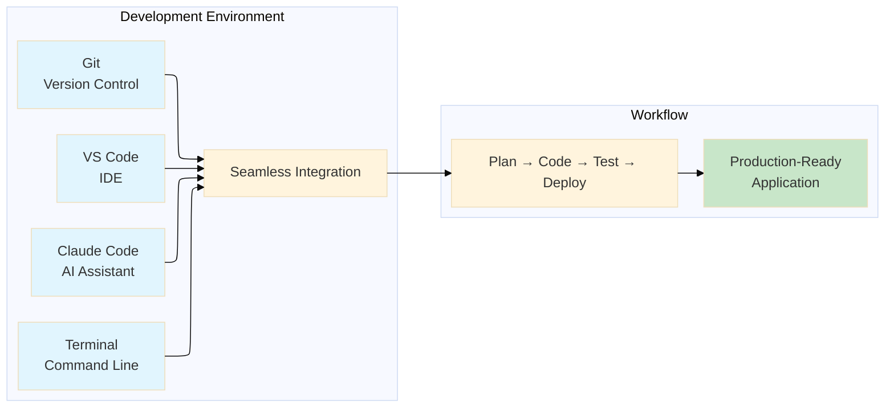

# - Deploy to production with confidence using every

```mermaid
---
config:
  layout: elk
  theme: base
---
graph LR
    subgraph "Development Environment"
        A[VS Code<br/>IDE] --> E[Seamless Integration]
        B[Claude Code<br/>AI Assistant] --> E
        C[Terminal<br/>Command Line] --> E
        D[Git<br/>Version Control] --> E
    end
    
    subgraph "Workflow"
        E --> F[Plan → Code → Test → Deploy]
        F --> G[Production-Ready<br/>Application]
    end
    
    style A fill:#e1f5fe
    style B fill:#e1f5fe
    style C fill:#e1f5fe
    style D fill:#e1f5fe
    style G fill:#c8e6c9
```
