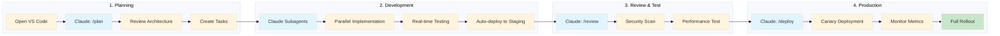

# Now let's see how everything comes together in a c

```mermaid
---
config:
  layout: elk
  theme: base
---
graph LR
    subgraph "1. Planning"
        A[Open VS Code] --> B[Claude: /plan]
        B --> C[Review Architecture]
        C --> D[Create Tasks]
    end
    
    subgraph "2. Development"
        D --> E[Claude Subagents]
        E --> F[Parallel Implementation]
        F --> G[Real-time Testing]
        G --> H[Auto-deploy to Staging]
    end
    
    subgraph "3. Review & Test"
        H --> I[Claude: /review]
        I --> J[Security Scan]
        J --> K[Performance Test]
    end
    
    subgraph "4. Production"
        K --> L[Claude: /deploy]
        L --> M[Canary Deployment]
        M --> N[Monitor Metrics]
        N --> O[Full Rollout]
    end
    
    style B fill:#e1f5fe
    style E fill:#e1f5fe
    style I fill:#e1f5fe
    style L fill:#e1f5fe
    style O fill:#c8e6c9
```
