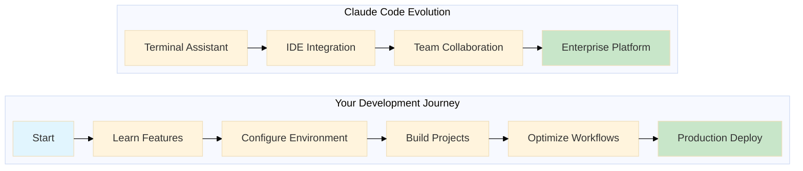

# The result is an AI-powered development platform t

```mermaid
---
config:
  layout: elk
  theme: base
---
graph LR
    subgraph "Your Development Journey"
        A[Start] --> B[Learn Features]
        B --> C[Configure Environment]
        C --> D[Build Projects]
        D --> E[Optimize Workflows]
        E --> F[Production Deploy]
    end
    
    subgraph "Claude Code Evolution"
        G[Terminal Assistant] --> H[IDE Integration]
        H --> I[Team Collaboration]
        I --> J[Enterprise Platform]
    end
    
    style A fill:#e1f5fe
    style F fill:#c8e6c9
    style J fill:#c8e6c9
```
