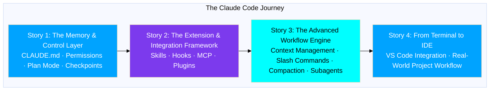

# This comprehensive series, "Claude Code Mastery," 

```mermaid
---
config:
  layout: elk
  theme: base
---
flowchart LR
 subgraph subGraph0["The Claude Code Journey"]
        A["Story 1: The Memory &amp; Control Layer<br>CLAUDE.md · Permissions · Plan Mode · Checkpoints"]
        B["Story 2: The Extension &amp; Integration Framework<br>Skills · Hooks · MCP · Plugins"]
        C["Story 3: The Advanced Workflow Engine<br>Context Management · Slash Commands · Compaction · Subagents"]
        D["Story 4: From Terminal to IDE<br>VS Code Integration · Real-World Project Workflow"]
  end
    A --> B
    B --> C
    C --> D

    style A fill:#00A3FF,color:#fff
    style B fill:#7C3AED,color:#fff
    style C fill:#00FFFF,color:#000
    style D fill:#00A3FF,color:#fff
```
