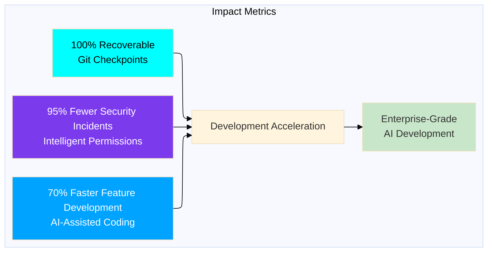

# Claude Code isn't just another AI coding tool—it's

```mermaid
---
config:
  layout: elk
  theme: base
---
graph LR
    subgraph "Impact Metrics"
        A[70% Faster Feature Development<br/>AI-Assisted Coding] --> D[Development Acceleration]
        B[95% Fewer Security Incidents<br/>Intelligent Permissions] --> D
        C[100% Recoverable<br/>Git Checkpoints] --> D
        D --> E[Enterprise-Grade<br/>AI Development]
    end
    
    style A fill:#00A3FF,color:#fff
    style B fill:#7C3AED,color:#fff
    style C fill:#00FFFF,color:#000
    style E fill:#c8e6c9
```
