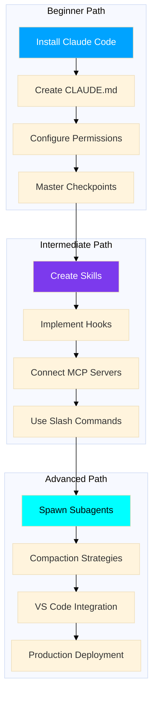

# ## The Complete Learning Path

```mermaid
---
config:
  layout: elk
  theme: base
---
graph TB
    subgraph "Beginner Path"
        A1[Install Claude Code] --> A2[Create CLAUDE.md]
        A2 --> A3[Configure Permissions]
        A3 --> A4[Master Checkpoints]
    end
    
    subgraph "Intermediate Path"
        B1[Create Skills] --> B2[Implement Hooks]
        B2 --> B3[Connect MCP Servers]
        B3 --> B4[Use Slash Commands]
    end
    
    subgraph "Advanced Path"
        C1[Spawn Subagents] --> C2[Compaction Strategies]
        C2 --> C3[VS Code Integration]
        C3 --> C4[Production Deployment]
    end
    
    A4 --> B1
    B4 --> C1
    
    style A1 fill:#00A3FF,color:#fff
    style B1 fill:#7C3AED,color:#fff
    style C1 fill:#00FFFF,color:#000
```
