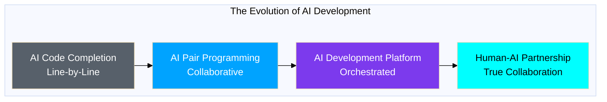

# As AI continues to evolve, tools like Claude Code 

```mermaid
---
config:
  layout: elk
  theme: base
---
graph LR
    subgraph "The Evolution of AI Development"
        A[AI Code Completion<br/>Line-by-Line] --> B[AI Pair Programming<br/>Collaborative]
        B --> C[AI Development Platform<br/>Orchestrated]
        C --> D[Human-AI Partnership<br/>True Collaboration]
    end
    
    style A fill:#57606A,color:#fff
    style B fill:#00A3FF,color:#fff
    style C fill:#7C3AED,color:#fff
    style D fill:#00FFFF,color:#000
```
