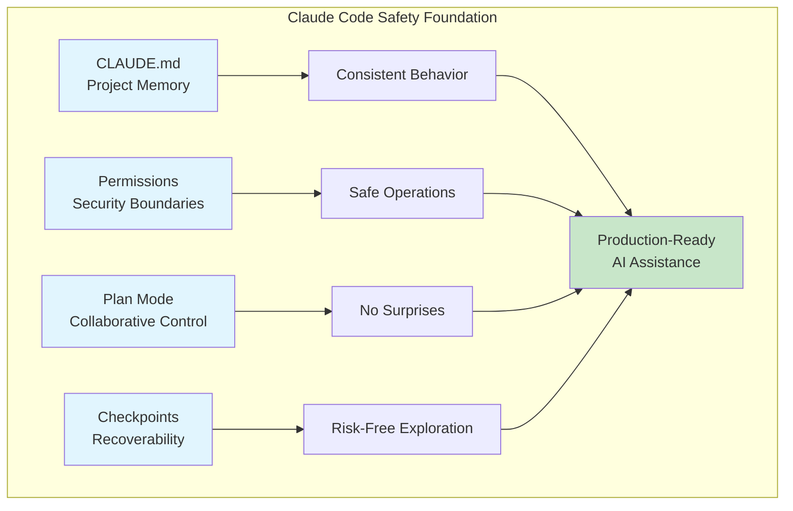

# Let's explore how these features work together to 

```mermaid
graph TB
    subgraph "Claude Code Safety Foundation"
        A[CLAUDE.md<br/>Project Memory] --> E[Consistent Behavior]
        B[Permissions<br/>Security Boundaries] --> F[Safe Operations]
        C[Plan Mode<br/>Collaborative Control] --> G[No Surprises]
        D[Checkpoints<br/>Recoverability] --> H[Risk-Free Exploration]
        
        E --> I[Production-Ready<br/>AI Assistance]
        F --> I
        G --> I
        H --> I
    end
    
    style A fill:#e1f5fe
    style B fill:#e1f5fe
    style C fill:#e1f5fe
    style D fill:#e1f5fe
    style I fill:#c8e6c9
```
