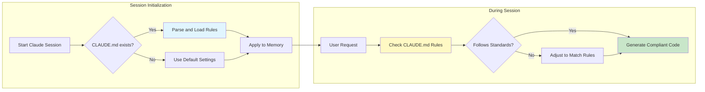

# ### How CLAUDE.md Works

```mermaid
flowchart LR
    subgraph "Session Initialization"
        A[Start Claude Session] --> B{CLAUDE.md exists?}
        B -->|Yes| C[Parse and Load Rules]
        B -->|No| D[Use Default Settings]
        C --> E[Apply to Memory]
        D --> E
    end
    
    subgraph "During Session"
        E --> F[User Request]
        F --> G[Check CLAUDE.md Rules]
        G --> H{Follows Standards?}
        H -->|Yes| I[Generate Compliant Code]
        H -->|No| J[Adjust to Match Rules]
        J --> I
    end
    
    style C fill:#e1f5fe
    style G fill:#fff9c4
    style I fill:#c8e6c9
```
