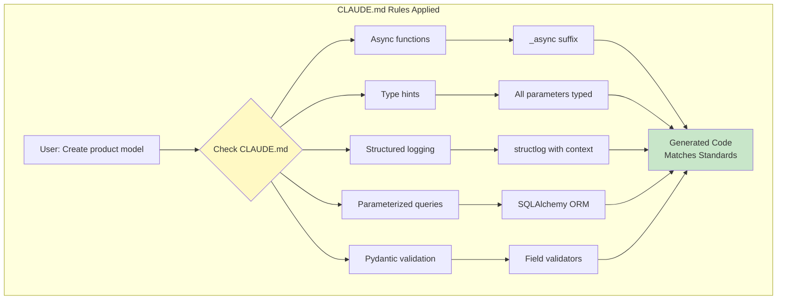

# - Followed the file structure from CLAUDE.md

```mermaid
graph TD
    subgraph "CLAUDE.md Rules Applied"
        A[User: Create product model] --> B{Check CLAUDE.md}
        
        B --> C1[Async functions]
        B --> C2[Type hints]
        B --> C3[Structured logging]
        B --> C4[Parameterized queries]
        B --> C5[Pydantic validation]
        
        C1 --> D1[_async suffix]
        C2 --> D2[All parameters typed]
        C3 --> D3[structlog with context]
        C4 --> D4[SQLAlchemy ORM]
        C5 --> D5[Field validators]
        
        D1 --> E[Generated Code<br/>Matches Standards]
        D2 --> E
        D3 --> E
        D4 --> E
        D5 --> E
    end
    
    style B fill:#fff9c4
    style E fill:#c8e6c9
```
