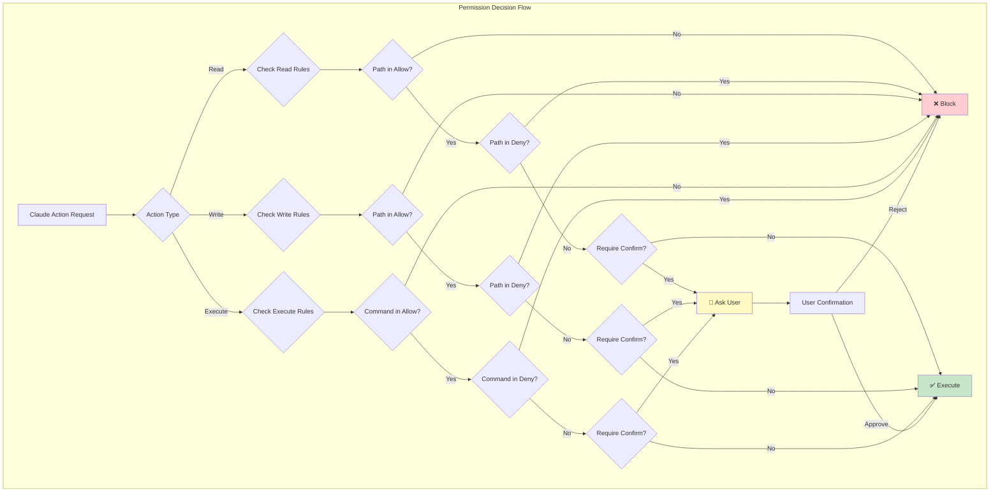

# ### Permission Architecture

```mermaid
graph TB
    subgraph "Permission Decision Flow"
        A[Claude Action Request] --> B{Action Type}
        
        B -->|Read| C{Check Read Rules}
        B -->|Write| D{Check Write Rules}
        B -->|Execute| E{Check Execute Rules}
        
        C --> F{Path in Allow?}
        F -->|Yes| G{Path in Deny?}
        F -->|No| H[❌ Block]
        
        G -->|Yes| H
        G -->|No| I{Require Confirm?}
        
        D --> J{Path in Allow?}
        J -->|Yes| K{Path in Deny?}
        J -->|No| H
        
        K -->|Yes| H
        K -->|No| L{Require Confirm?}
        
        E --> M{Command in Allow?}
        M -->|Yes| N{Command in Deny?}
        M -->|No| H
        
        N -->|Yes| H
        N -->|No| O{Require Confirm?}
        
        I -->|Yes| P[🔔 Ask User]
        I -->|No| Q[✅ Execute]
        
        L -->|Yes| P
        L -->|No| Q
        
        O -->|Yes| P
        O -->|No| Q
        
        P --> R[User Confirmation]
        R -->|Approve| Q
        R -->|Reject| H
    end
    
    style H fill:#ffcdd2
    style Q fill:#c8e6c9
    style P fill:#fff9c4
```
