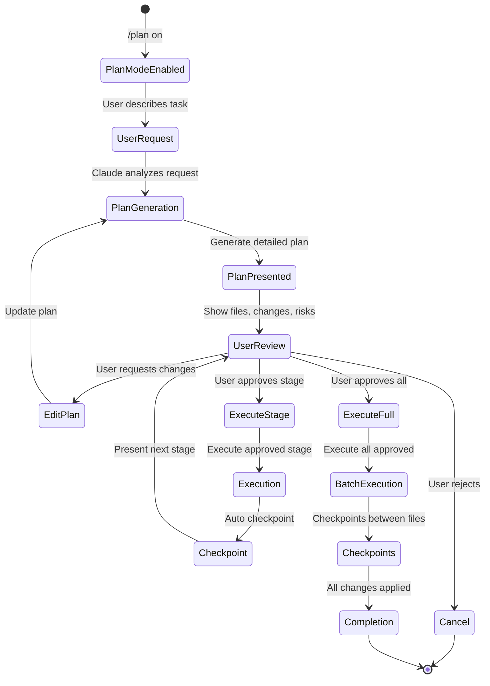

# ### Plan Mode Workflow

```mermaid
stateDiagram-v2
    [*] --> PlanModeEnabled: /plan on
    
    PlanModeEnabled --> UserRequest: User describes task
    UserRequest --> PlanGeneration: Claude analyzes request
    
    PlanGeneration --> PlanPresented: Generate detailed plan
    
    PlanPresented --> UserReview: Show files, changes, risks
    
    UserReview --> EditPlan: User requests changes
    EditPlan --> PlanGeneration: Update plan
    
    UserReview --> ExecuteStage: User approves stage
    UserReview --> ExecuteFull: User approves all
    
    ExecuteStage --> Execution: Execute approved stage
    Execution --> Checkpoint: Auto checkpoint
    Checkpoint --> UserReview: Present next stage
    
    ExecuteFull --> BatchExecution: Execute all approved
    BatchExecution --> Checkpoints: Checkpoints between files
    Checkpoints --> Completion: All changes applied
    
    UserReview --> Cancel: User rejects
    Cancel --> [*]
    
    Completion --> [*]
```
