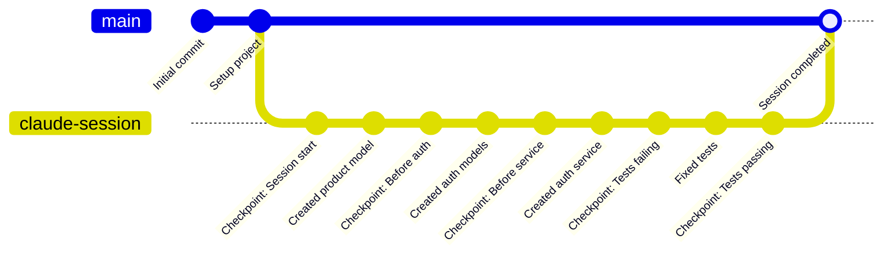

# ### Checkpoint System Architecture

```mermaid
gitGraph
    commit id: "Initial commit"
    commit id: "Setup project"
    
    branch claude-session
    
    commit id: "Checkpoint: Session start"
    commit id: "Created product model"
    commit id: "Checkpoint: Before auth"
    commit id: "Created auth models"
    commit id: "Checkpoint: Before service"
    commit id: "Created auth service"
    commit id: "Checkpoint: Tests failing"
    commit id: "Fixed tests"
    commit id: "Checkpoint: Tests passing"
    
    checkout main
    merge claude-session id: "Session completed"
```
