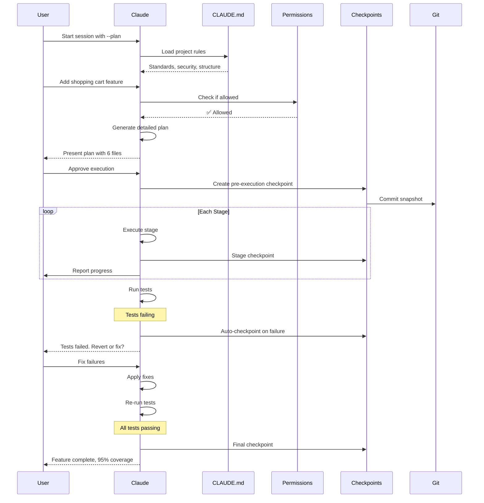

# Let's walk through a complete workflow using all f

```mermaid
sequenceDiagram
    participant User
    participant Claude
    participant CLAUDE_md as CLAUDE.md
    participant Permissions
    participant Checkpoints
    participant Git
    
    User->>Claude: Start session with --plan
    Claude->>CLAUDE_md: Load project rules
    CLAUDE_md-->>Claude: Standards, security, structure
    
    User->>Claude: Add shopping cart feature
    
    Claude->>Permissions: Check if allowed
    Permissions-->>Claude: ✅ Allowed
    
    Claude->>Claude: Generate detailed plan
    Claude-->>User: Present plan with 6 files
    
    User->>Claude: Approve execution
    
    Claude->>Checkpoints: Create pre-execution checkpoint
    Checkpoints->>Git: Commit snapshot
    
    loop Each Stage
        Claude->>Claude: Execute stage
        Claude->>Checkpoints: Stage checkpoint
        Claude->>User: Report progress
    end
    
    Claude->>Claude: Run tests
    Note over Claude: Tests failing
    Claude->>Checkpoints: Auto-checkpoint on failure
    Claude-->>User: Tests failed. Revert or fix?
    
    User->>Claude: Fix failures
    
    Claude->>Claude: Apply fixes
    Claude->>Claude: Re-run tests
    Note over Claude: All tests passing
    
    Claude->>Checkpoints: Final checkpoint
    Claude-->>User: Feature complete, 95% coverage
```
