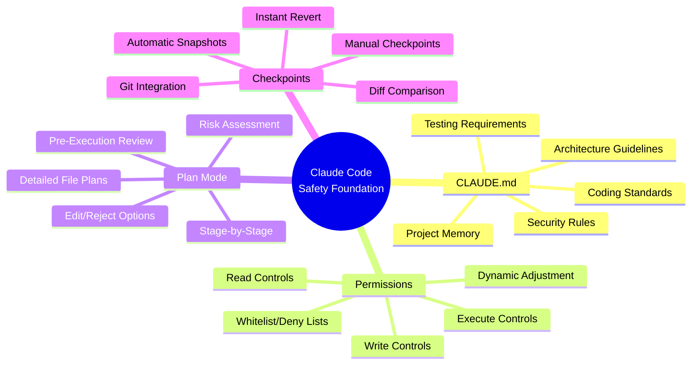

# These four features transform Claude Code from a h

```mermaid
mindmap
  root((Claude Code<br/>Safety Foundation))
    CLAUDE.md
      Project Memory
      Coding Standards
      Security Rules
      Testing Requirements
      Architecture Guidelines
    Permissions
      Read Controls
      Write Controls
      Execute Controls
      Dynamic Adjustment
      Whitelist/Deny Lists
    Plan Mode
      Pre-Execution Review
      Detailed File Plans
      Risk Assessment
      Stage-by-Stage
      Edit/Reject Options
    Checkpoints
      Automatic Snapshots
      Manual Checkpoints
      Git Integration
      Diff Comparison
      Instant Revert
```
