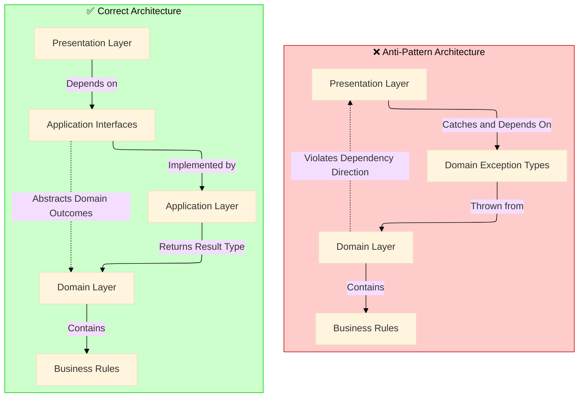
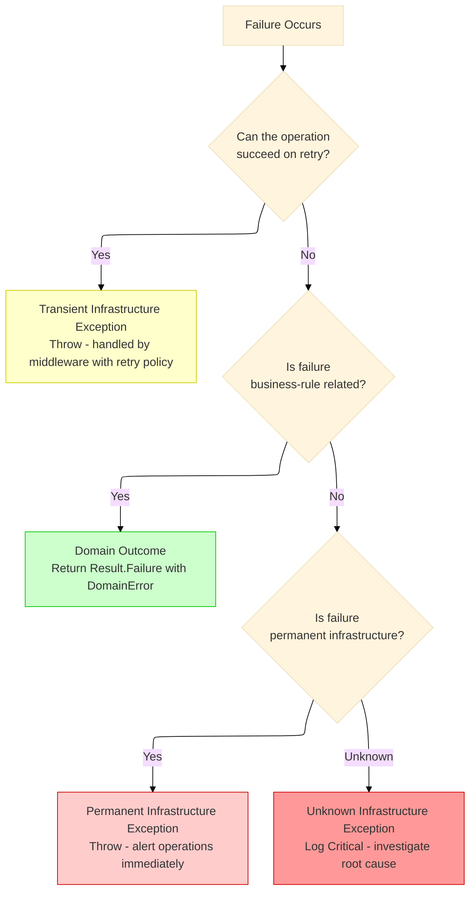

# Clean Architecture Anti-Pattern - Exception: A .NET Developer's Guide - Part 1
## Foundational principles, architectural violation, domain-infrastructure distinction, Result pattern, and decision framework.
## Introduction: The Exception Anti-Pattern in Context

This series explores how the improper use of exceptions undermines architectural boundaries, creates hidden coupling between layers, and leads to systems that are difficult to test, debug, and maintain. This master story introduces the fundamental concepts, decision frameworks, and implementation patterns that are detailed throughout the series.

The **Clean Architecture Anti-Pattern - Exception** series addresses one of the most pervasive violations of Clean Architecture in modern .NET applications: the misuse of exceptions to control business logic flow. When domain outcomes are expressed through exceptions, the architecture inverts—presentation layers become coupled to domain implementation details, infrastructure concerns bleed into business logic, and the system becomes increasingly brittle.

This master story establishes the foundational principles that each subsequent story builds upon. It provides the architectural context, the core distinction between infrastructure and domain concerns, and the decision framework that guides the entire series.

---

### Complete Series Overview

The **Clean Architecture Anti-Pattern - Exception** series consists of eight comprehensive stories:

---

**1. 🏛️ Clean Architecture Anti-Pattern - Exception: A .NET Developer's Guide - Part 1** *(This Story)* – Comprehensive coverage of the architectural violation, the domain-infrastructure distinction, the Result pattern implementation, infrastructure exception handling, and the decision framework. Establishes the foundational principles for the entire series.

---

**2. 🎭 Clean Architecture Anti-Pattern - Exception: Domain Logic in Disguise - Part 2** – Deep dive into the performance implications of exception-based domain logic. Covers stack trace overhead, GC pressure analysis, the hidden complexity of exception propagation, and why expected business outcomes should never be expressed through exceptions. Includes benchmark comparisons between exception-based and Result pattern approaches in .NET 10.

---

**3. 🔍 Clean Architecture Anti-Pattern - Exception: Defining the Boundary - Part 3** – Comprehensive taxonomy distinguishing infrastructure exceptions from domain outcomes. Provides decision matrices for classifying failures, real-world classification patterns, and a detailed breakdown of exception types across database, HTTP, cache, messaging, and file system layers. Establishes clear guidelines for what constitutes infrastructure versus domain concerns.

---

**4. ⚙️ Clean Architecture Anti-Pattern - Exception: Building the Result Pattern - Part 4** – Complete implementation of Result<T> and DomainError with functional extensions. Covers source generation for domain errors, integration with .NET 10 features including required members, primary constructors, and enhanced pattern matching. Includes the full type hierarchy, extension methods for LINQ-style composition, and best practices for API design.

---

**5. 🏢 Clean Architecture Anti-Pattern - Exception: Across Real-World Domains - Part 5** – Four complete case studies demonstrating the pattern across distinct business domains. Covers Payment Processing, Inventory Management, Healthcare Scheduling, and Logistics Tracking. Each case study includes domain models, service implementations, and infrastructure integration patterns.

---

**6. 🛡️ Clean Architecture Anti-Pattern - Exception: Infrastructure Resilience - Part 6** – Global exception handling middleware, Polly v8 retry policies, circuit breakers, and transient vs non-transient failure classification. Covers health check integration, service discovery patterns, and custom infrastructure exception types. Includes complete middleware pipeline configuration for .NET 10.

---

**7. 🧪 Clean Architecture Anti-Pattern - Exception: Testing & Observability - Part 7** – Unit testing domain logic without exception assertions, integration testing infrastructure failures, and structured logging with OpenTelemetry. Covers metrics collection with .NET Meters, production monitoring dashboards, and alerts that distinguish domain errors from infrastructure failures.

---

**8. 🚀 Clean Architecture Anti-Pattern - Exception: The Road Ahead - Part 8** – Implementation checklist for adopting the Result pattern in existing codebases, migration strategies for legacy systems, and architectural evolution patterns. Covers .NET 10 feature roadmap, Native AOT compatibility, and long-term maintenance benefits.

---

## The Architectural Violation

*This section introduces concepts explored in depth in **2. 🎭 Clean Architecture Anti-Pattern - Exception: Domain Logic in Disguise - Part 2**.*

Clean Architecture mandates that dependencies point inward. The domain layer must remain agnostic of infrastructure concerns, and the application layer must not depend on presentation concerns. When domain logic expresses business outcomes through exceptions, this architectural principle is violated.

### The Problem Statement

Consider the following pattern observed across countless .NET codebases where domain exceptions propagate to the presentation layer:

```csharp
// Anti-pattern: Domain exceptions at presentation boundary
private static async Task<IResult> CreateOrder(
    CreateOrderRequest req,
    IOrderService service,
    CancellationToken ct)
{
    try
    {
        var order = await service.CreateAsync(req, ct);
        return Results.Created($"/orders/{order.Id}", order);
    }
    catch (OrderConflictException ex)      // Domain exception
    {
        return Results.Conflict(ex.Message);
    }
    catch (CustomerMissingException ex)    // Domain exception
    {
        return Results.NotFound(ex.Message);
    }
    catch (InvalidOrderStateException ex)  // Domain exception
    {
        return Results.BadRequest(ex.Message);
    }
}
```

**Architectural Violation:** The presentation layer now knows about `OrderConflictException`, `CustomerMissingException`, and `InvalidOrderStateException`—domain concepts that should remain internal to the domain layer. This creates a direct coupling that undermines the isolation between layers.

**SOLID Principle Violation - Dependency Inversion:** High-level modules (domain) should not depend on low-level modules (presentation). Both should depend on abstractions. Here, the presentation layer depends on domain implementation details through exception types.

### The Layered Impact

The following diagram illustrates how exception-based control flow violates Clean Architecture layering:



### The Performance Consideration

Exceptions in .NET 10, despite runtime optimizations, remain expensive operations. The Common Language Runtime (CLR) performs the following work for each exception:

- Stack trace collection and unwinding
- Exception object allocation on the heap
- Security permission checks
- `finally` block execution coordination
- Debugger notification
- Thread abort coordination in multithreaded scenarios

For expected business outcomes—such as "customer not found" or "insufficient funds"—using exceptions introduces measurable GC pressure. A system processing 10,000 requests per second with a 5% expected failure rate would throw 500 exceptions per second unnecessarily.

**.NET 10 Note:** While .NET 10 has improved exception handling performance with better stack trace collection and reduced allocation overhead for certain patterns, exceptions remain fundamentally unsuited for expected control flow. The runtime is optimized for exceptional circumstances, not routine business logic branching.

For a comprehensive analysis of performance implications, including benchmark comparisons and GC pressure analysis, refer to **2. 🎭 Clean Architecture Anti-Pattern - Exception: Domain Logic in Disguise - Part 2**.

---

## The Critical Distinction

*This section introduces concepts explored in depth in **3. 🔍 Clean Architecture Anti-Pattern - Exception: Defining the Boundary - Part 3**.*

The foundation of architectural resilience rests on distinguishing between two fundamentally different categories of failures: infrastructure exceptions and domain outcomes.

### Infrastructure Exceptions

Infrastructure exceptions originate from technical implementation details. They are characterized by:

| Characteristic | Description |
|----------------|-------------|
| **Transience** | Many infrastructure failures resolve with automatic retry |
| **Technical Nature** | Describe technical failures, not business rules |
| **External Dependencies** | Originate from databases, networks, file systems, external services |
| **Non-Deterministic** | Occur based on system load, network conditions, hardware failures |
| **Cross-Cutting** | Can occur in any layer that touches external resources |

**Examples in .NET 10:**

```csharp
// Database infrastructure exceptions
SqlException when ex.Number == 1205      // Deadlock - retryable
SqlException when ex.Number == -2        // Timeout - may be retryable
SqlException when ex.Number == 53        // Network connectivity - transient

// HTTP infrastructure exceptions
HttpRequestException when ex.StatusCode == HttpStatusCode.ServiceUnavailable
HttpRequestException when ex.StatusCode == HttpStatusCode.GatewayTimeout
TimeoutException

// Cache infrastructure exceptions
RedisConnectionException
RedisTimeoutException

// Messaging infrastructure exceptions
BrokerUnavailableException
QueueQuotaExceededException

// File system infrastructure exceptions
IOException when ex.Message.Contains("disk full")
IOException when ex.Message.Contains("network path not found")
```

### Domain Outcomes

Domain outcomes represent expected results of business rule evaluation. These are not exceptional—they are possible system states that must be handled explicitly.

| Characteristic | Description |
|----------------|-------------|
| **Expected** | Represent valid states of business processes |
| **Deterministic** | Predictable given inputs and system state |
| **Business-Relevant** | Carry business meaning, not technical details |
| **User-Facing** | Translate directly to user messages |
| **Domain Language** | Use terminology from the ubiquitous language |

**Examples:**

```csharp
// Domain outcomes (NOT exceptions)
Customer not found
Insufficient credit
Product out of stock
Duplicate order
Payment declined by issuer
Invalid order state transition
User not authorized for operation
Resource already exists
Business rule validation failure
```

### The Decision Framework

The following diagram provides a decision framework for classifying failures as they occur:



For a comprehensive taxonomy including decision matrices, real-world classification patterns, and detailed exception type breakdowns across all infrastructure layers, refer to **3. 🔍 Clean Architecture Anti-Pattern - Exception: Defining the Boundary - Part 3**.

---

## Building the Result Pattern

*This section introduces concepts explored in depth in **4. ⚙️ Clean Architecture Anti-Pattern - Exception: Building the Result Pattern - Part 4**.*

The Result pattern provides a functional approach to handling domain outcomes while preserving infrastructure exceptions for their intended purpose.

### Core Type Definitions

```csharp
// Domain/Common/Result.cs
// .NET 10: Using required members and primary constructors for immutable types
public class Result<T>
{
    public bool IsSuccess { get; }
    public bool IsFailure => !IsSuccess;
    
    private readonly T _value;
    private readonly DomainError _error;
    
    private Result(T value)
    {
        IsSuccess = true;
        _value = value;
        _error = default!;
    }
    
    private Result(DomainError error)
    {
        IsSuccess = false;
        _error = error;
        _value = default!;
    }
    
    public static Result<T> Success(T value) => new(value);
    public static Result<T> Failure(DomainError error) => new(error);
    
    public TResult Match<TResult>(
        Func<T, TResult> onSuccess,
        Func<DomainError, TResult> onFailure) =>
        IsSuccess ? onSuccess(_value) : onFailure(_error);
    
    public T Value => IsSuccess 
        ? _value 
        : throw new InvalidOperationException("Cannot access Value of failed result");
        
    public DomainError Error => IsFailure 
        ? _error 
        : throw new InvalidOperationException("Cannot access Error of successful result");
}

// Domain/Common/DomainError.cs
public record DomainError
{
    public required string Code { get; init; }
    public required string Message { get; init; }
    public required DomainErrorType Type { get; init; }
    public Dictionary<string, object> Metadata { get; init; } = new();
    
    public static DomainError NotFound(string resourceType, object identifier) => new()
    {
        Code = $"{resourceType.ToLower()}.not_found",
        Message = $"{resourceType} with identifier '{identifier}' was not found",
        Type = DomainErrorType.NotFound,
        Metadata = new() { ["resourceType"] = resourceType, ["identifier"] = identifier }
    };
    
    public static DomainError Conflict(string message, object? details = null) => new()
    {
        Code = "resource.conflict",
        Message = message,
        Type = DomainErrorType.Conflict,
        Metadata = details is not null ? new() { ["details"] = details } : new()
    };
    
    public static DomainError InsufficientFunds(decimal available, decimal required) => new()
    {
        Code = "payment.insufficient_funds",
        Message = $"Insufficient funds. Available: {available:C}, Required: {required:C}",
        Type = DomainErrorType.BusinessRule,
        Metadata = new() { ["available"] = available, ["required"] = required }
    };
}

public enum DomainErrorType
{
    Conflict,      // 409 - Duplicate, state conflict
    NotFound,      // 404 - Resource missing
    Validation,    // 400 - Invalid input
    Unauthorized,  // 401 - Authentication required
    Forbidden,     // 403 - Authorization denied
    BusinessRule,  // 422 - Business rule violation
}
```

**Design Pattern Note:** The Result type implements the **Monad Pattern**, providing functional composition through `Map` and `Tap` methods. This enables LINQ-style composition of operations without imperative null checking or exception handling.

### Domain Service Implementation

```csharp
public class OrderService : IOrderService
{
    public async Task<Result<Order>> CreateAsync(CreateOrderRequest request, CancellationToken ct)
    {
        // Domain outcome: Validate customer exists
        var customerResult = await _customerRepository.GetByIdAsync(request.CustomerId, ct);
        if (customerResult.IsFailure)
        {
            return Result<Order>.Failure(customerResult.Error);
        }
        
        // Domain outcome: Check credit limit
        var totalValue = request.Items.Sum(i => i.Quantity * i.UnitPrice);
        if (!customer.HasSufficientCredit(totalValue))
        {
            return Result<Order>.Failure(
                DomainError.InsufficientFunds(customer.AvailableCredit, totalValue));
        }
        
        // Create domain aggregate
        var order = Order.Create(request.CustomerId, request.Items, request.ShippingAddress);
        
        try
        {
            // Infrastructure operation - may throw
            await _orderRepository.AddAsync(order, ct);
            await _unitOfWork.SaveChangesAsync(ct);
            
            return Result<Order>.Success(order);
        }
        catch (SqlException ex) when (ex.Number == 1205) // Deadlock
        {
            throw new TransientInfrastructureException("Database deadlock occurred", "DB_DEADLOCK", ex);
        }
        catch (SqlException ex) when (ex.Number == -2) // Timeout
        {
            throw new TransientInfrastructureException("Database operation timed out", "DB_TIMEOUT", ex);
        }
    }
}
```

**Design Pattern Note:** This implementation follows the **Strategy Pattern** through the `IOrderService` abstraction and adheres to the **Single Responsibility Principle** by separating domain outcome handling from infrastructure exception management.

For complete implementation details including source generation for domain errors, functional extensions, and best practices for API design, refer to **4. ⚙️ Clean Architecture Anti-Pattern - Exception: Building the Result Pattern - Part 4**.

---

## Across Real-World Domains

*This section introduces concepts explored in depth in **5. 🏢 Clean Architecture Anti-Pattern - Exception: Across Real-World Domains - Part 5**.*

The Result pattern and infrastructure-exception distinction have been applied across diverse business domains:

| Domain | Domain Outcomes (Result) | Infrastructure Exceptions |
|--------|-------------------------|--------------------------|
| **Payment Processing** | Insufficient funds, card declined, fraud detection | Gateway timeout, network failure, service unavailable |
| **Inventory Management** | Out of stock, minimum order quantity, discontinued product | Database deadlock, cache failure, warehouse service unavailable |
| **Healthcare Scheduling** | Double-booking, provider leave, patient eligibility | EMR integration failure, insurance verification timeout |
| **Logistics Tracking** | Delivery window violation, invalid location, signature required | GPS device offline, carrier API unavailable, geocoding service failure |

For complete case studies with full code implementations, domain models, and integration patterns, refer to **5. 🏢 Clean Architecture Anti-Pattern - Exception: Across Real-World Domains - Part 5**.

---

## Infrastructure Resilience

*This section introduces concepts explored in depth in **6. 🛡️ Clean Architecture Anti-Pattern - Exception: Infrastructure Resilience - Part 6**.*

### Infrastructure Exception Types

```csharp
public abstract class InfrastructureException : Exception
{
    public string ErrorCode { get; }
    public string ReferenceCode { get; } = Guid.NewGuid().ToString();
    public bool IsTransient { get; }
    
    protected InfrastructureException(string message, string? errorCode = null, 
        bool isTransient = true, Exception? innerException = null) 
        : base(message, innerException)
    {
        ErrorCode = errorCode ?? "INFRA_ERR";
        IsTransient = isTransient;
    }
}

public class TransientInfrastructureException : InfrastructureException
{
    public TransientInfrastructureException(string message, string? errorCode = null, 
        Exception? innerException = null) 
        : base(message, errorCode, true, innerException)
    {
    }
    
    public TimeSpan? RetryAfter { get; init; }
}

public class NonTransientInfrastructureException : InfrastructureException
{
    public NonTransientInfrastructureException(string message, string? errorCode = null, 
        Exception? innerException = null) 
        : base(message, errorCode, false, innerException)
    {
    }
}
```

### Global Middleware

```csharp
public class InfrastructureExceptionMiddleware
{
    public async Task InvokeAsync(HttpContext context)
    {
        try
        {
            await _next(context);
        }
        catch (TransientInfrastructureException ex)
        {
            context.Response.StatusCode = StatusCodes.Status503ServiceUnavailable;
            context.Response.Headers.RetryAfter = ex.RetryAfter?.Seconds.ToString() ?? "30";
            
            await context.Response.WriteAsJsonAsync(new ProblemDetails
            {
                Title = "Service Temporarily Unavailable",
                Status = StatusCodes.Status503ServiceUnavailable,
                Detail = "A temporary infrastructure issue occurred. Please retry.",
                Extensions = { ["errorCode"] = ex.ErrorCode, ["isTransient"] = true }
            });
        }
        catch (NonTransientInfrastructureException ex)
        {
            context.Response.StatusCode = StatusCodes.Status500InternalServerError;
            
            await context.Response.WriteAsJsonAsync(new ProblemDetails
            {
                Title = "Infrastructure Error",
                Status = StatusCodes.Status500InternalServerError,
                Detail = "A permanent infrastructure issue occurred. Support has been notified.",
                Extensions = { ["errorCode"] = ex.ErrorCode, ["isTransient"] = false }
            });
        }
    }
}
```

**Design Pattern Note:** The middleware implements the **Chain of Responsibility Pattern**, allowing each exception type to be handled by the appropriate handler.

For complete middleware pipeline configuration, Polly retry policies, and health check integration, refer to **6. 🛡️ Clean Architecture Anti-Pattern - Exception: Infrastructure Resilience - Part 6**.

---

## Testing & Observability

*This section introduces concepts explored in depth in **7. 🧪 Clean Architecture Anti-Pattern - Exception: Testing & Observability - Part 7**.*

### Unit Testing Domain Outcomes

```csharp
[Fact]
public async Task CreateOrder_WhenCustomerNotFound_ReturnsNotFoundFailure()
{
    // Arrange
    var request = new CreateOrderRequest { CustomerId = Guid.NewGuid() };
    
    _customerRepositoryMock
        .Setup(x => x.GetByIdAsync(request.CustomerId, It.IsAny<CancellationToken>()))
        .ReturnsAsync(Result<Customer>.Failure(DomainError.NotFound("Customer", request.CustomerId)));
    
    // Act
    var result = await _service.CreateAsync(request, CancellationToken.None);
    
    // Assert - no exception, just result inspection
    Assert.False(result.IsSuccess);
    Assert.Equal(DomainErrorType.NotFound, result.Error.Type);
}
```

### Infrastructure Exception Testing

```csharp
[Fact]
public async Task CreateOrder_WhenDatabaseDeadlockOccurs_ThrowsTransientInfrastructureException()
{
    var exception = await Assert.ThrowsAsync<TransientInfrastructureException>(
        () => _service.CreateAsync(request, CancellationToken.None));
        
    Assert.Contains("deadlock", exception.Message.ToLower());
    Assert.True(exception.IsTransient);
}
```

For comprehensive testing strategies, structured logging with OpenTelemetry, metrics collection with .NET Meters, and production monitoring dashboards, refer to **7. 🧪 Clean Architecture Anti-Pattern - Exception: Testing & Observability - Part 7**.

---

## The Road Ahead

*This section introduces concepts explored in depth in **8. 🚀 Clean Architecture Anti-Pattern - Exception: The Road Ahead - Part 8**.*

| Focus Area | Coverage |
|------------|----------|
| **Implementation Checklist** | Step-by-step guide for introducing the pattern in new and existing codebases |
| **Migration Strategies** | Techniques for incrementally refactoring legacy exception-based code |
| **Team Adoption** | Best practices for establishing architectural guidelines and code review standards |
| **.NET 10 Features** | Leveraging required members, source generators, and Native AOT compatibility |
| **Long-Term Maintenance** | Measuring success through metrics, observability, and reduced incident rates |

For the complete implementation checklist, migration strategies, and future considerations, refer to **8. 🚀 Clean Architecture Anti-Pattern - Exception: The Road Ahead - Part 8**.

---

## What We Learned in This Master Story

| Concept | Key Takeaway |
|---------|--------------|
| **The Anti-Pattern** | Using exceptions for expected business outcomes violates Clean Architecture layering |
| **The Distinction** | Infrastructure exceptions are technical; domain outcomes are expected business results |
| **The Solution** | The Result pattern makes domain contracts explicit and enables deterministic testing |
| **The Implementation** | Result<T> and DomainError types with functional extensions; global middleware for infrastructure exceptions |
| **.NET 10 Advancements** | Required members, primary constructors, enhanced pattern matching, and ProblemDetails support |
| **Design Patterns** | Monad Pattern, Strategy Pattern, Chain of Responsibility, Single Responsibility Principle |

---

## Continue the Series

---

**1. 🏛️ Clean Architecture Anti-Pattern - Exception: A .NET Developer's Guide - Part 1** *(This Story)* – Foundational principles, architectural violation, domain-infrastructure distinction, Result pattern, and decision framework.

---

**2. 🎭 Clean Architecture Anti-Pattern - Exception: Domain Logic in Disguise - Part 2** – Performance implications of exception-based domain logic. Stack trace overhead, GC pressure analysis, and why expected outcomes should never throw exceptions.

---

**3. 🔍 Clean Architecture Anti-Pattern - Exception: Defining the Boundary - Part 3** – Comprehensive taxonomy distinguishing infrastructure exceptions from domain outcomes. Decision matrices and classification patterns across all infrastructure layers.

---

**4. ⚙️ Clean Architecture Anti-Pattern - Exception: Building the Result Pattern - Part 4** – Complete implementation of Result<T> and DomainError with functional extensions. Source generation, .NET 10 features, and API design best practices.

---

**5. 🏢 Clean Architecture Anti-Pattern - Exception: Across Real-World Domains - Part 5** – Four complete case studies: Payment Processing, Inventory Management, Healthcare Scheduling, and Logistics Tracking.

---

**6. 🛡️ Clean Architecture Anti-Pattern - Exception: Infrastructure Resilience - Part 6** – Global exception handling middleware, Polly retry policies, circuit breakers, and health check integration for .NET 10.

---

**7. 🧪 Clean Architecture Anti-Pattern - Exception: Testing & Observability - Part 7** – Unit testing domain logic without exceptions, infrastructure failure testing, OpenTelemetry, metrics with .NET Meters, and production dashboards.

---

**8. 🚀 Clean Architecture Anti-Pattern - Exception: The Road Ahead - Part 8** – Implementation checklist, migration strategies for legacy codebases, .NET 10 roadmap, and Native AOT compatibility.

---

---
*� Questions? Drop a response - I read and reply to every comment.*
*📌 Save this story to your reading list - it helps other engineers discover it.*
**🔗 Follow me →**
- [**Medium**](mvineetsharma.medium.com) - mvineetsharma.medium.com
- [**LinkedIn**](www.linkedin.com/in/vineet-sharma-architect) -  www.linkedin.com/in/vineet-sharma-architect

*In-depth .NET, Node.js, Python, Cloud Architecture, and System Design. New articles weekly*