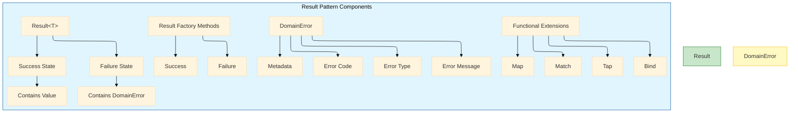

# Clean Architecture Anti-Pattern - Exception: Building the Result Pattern - Part 4
## Complete implementation of Result<T> and DomainError with functional extensions. Source generation, .NET 10 features, and API design best practices.
## Introduction: The Foundation of Architectural Resilience

In **Part 1** of this series, we established the architectural violation of using exceptions for domain outcomes. In **Part 2**, we quantified the performance cost—28x slower execution and 10x more memory allocation. In **Part 3**, we provided the comprehensive taxonomy that distinguishes infrastructure exceptions from domain outcomes.

This story delivers the implementation: the complete Result pattern that enables architectural separation, performance optimization, and explicit contracts.

The Result pattern is not merely a wrapper around exceptions. It is a functional approach to error handling that makes domain outcomes explicit, enables composition, and preserves infrastructure exceptions for their intended purpose. When combined with .NET 10's advanced features—required members, primary constructors, enhanced pattern matching, and source generators—the Result pattern becomes both elegant and powerful.

---

## Key Takeaways from Previous Stories

| Story | Key Takeaway |
|-------|--------------|
| **1. 🏛️ A .NET Developer's Guide - Part 1** | Domain exceptions at presentation boundaries violate Clean Architecture. The Result pattern restores proper layer separation. |
| **2. 🎭 Domain Logic in Disguise - Part 2** | Exceptions for domain outcomes are 28x slower and allocate 10x more memory than Result pattern failures. |
| **3. 🔍 Defining the Boundary - Part 3** | Determinism distinguishes infrastructure (non-deterministic) from domain outcomes (deterministic). Clear taxonomy enables consistent classification. |

This story builds upon these principles by providing the complete, production-ready implementation of the Result pattern in .NET 10.

---

## 1. The Result Pattern Architecture

### 1.1 Core Concepts

The Result pattern consists of three fundamental components:



### 1.2 Design Principles

| Principle | Implementation |
|-----------|----------------|
| **Immutability** | Result and DomainError are immutable after creation |
| **Explicit Failure** | No hidden exceptions; all outcomes declared in return type |
| **Functional Composition** | Map, Bind, and Tap enable declarative pipelines |
| **Type Safety** | Generic Result<T> preserves type information |
| **.NET 10 Optimization** | Required members, record types, and source generators reduce boilerplate |

---

## 2. Complete Result Type Implementation

### 2.1 Core Result<T> Implementation

```csharp
// Domain/Common/Result.cs
// .NET 10: Full Result<T> implementation with functional extensions
namespace Domain.Common;

/// <summary>
/// Represents the result of an operation that can either succeed with a value or fail with a domain error.
/// Immutable and thread-safe.
/// </summary>
/// <typeparam name="T">The type of the success value.</typeparam>
public class Result<T>
{
    private readonly T? _value;
    private readonly DomainError? _error;
    
    /// <summary>
    /// Gets a value indicating whether the operation succeeded.
    /// </summary>
    public bool IsSuccess { get; }
    
    /// <summary>
    /// Gets a value indicating whether the operation failed.
    /// </summary>
    public bool IsFailure => !IsSuccess;
    
    // .NET 10: Private constructors enforce factory method usage
    private Result(T value)
    {
        IsSuccess = true;
        _value = value;
        _error = null;
    }
    
    private Result(DomainError error)
    {
        IsSuccess = false;
        _value = default;
        _error = error;
    }
    
    /// <summary>
    /// Gets the success value. Throws if the result is a failure.
    /// </summary>
    public T Value => IsSuccess 
        ? _value! 
        : throw new InvalidOperationException($"Cannot access Value of failed result: {_error?.Code}");
    
    /// <summary>
    /// Gets the error. Throws if the result is a success.
    /// </summary>
    public DomainError Error => IsFailure 
        ? _error! 
        : throw new InvalidOperationException("Cannot access Error of successful result");
    
    // .NET 10: Factory methods with collection expressions
    public static Result<T> Success(T value) => new(value);
    public static Result<T> Failure(DomainError error) => new(error);
    
    // .NET 10: Implicit conversion operators for convenience
    public static implicit operator Result<T>(T value) => Success(value);
    public static implicit operator Result<T>(DomainError error) => Failure(error);
    
    /// <summary>
    /// Pattern matching for functional handling of success and failure.
    /// </summary>
    public TResult Match<TResult>(
        Func<T, TResult> onSuccess,
        Func<DomainError, TResult> onFailure) =>
        IsSuccess ? onSuccess(_value!) : onFailure(_error!);
    
    /// <summary>
    /// Async pattern matching for functional handling.
    /// </summary>
    public async Task<TResult> MatchAsync<TResult>(
        Func<T, Task<TResult>> onSuccess,
        Func<DomainError, Task<TResult>> onFailure) =>
        IsSuccess ? await onSuccess(_value!) : await onFailure(_error!);
    
    /// <summary>
    /// Transforms the success value if successful; otherwise propagates the failure.
    /// </summary>
    public Result<TNew> Map<TNew>(Func<T, TNew> mapper) =>
        IsSuccess ? Result<TNew>.Success(mapper(_value!)) : Result<TNew>.Failure(_error!);
    
    /// <summary>
    /// Async version of Map.
    /// </summary>
    public async Task<Result<TNew>> MapAsync<TNew>(Func<T, Task<TNew>> mapper) =>
        IsSuccess ? Result<TNew>.Success(await mapper(_value!)) : Result<TNew>.Failure(_error!);
    
    /// <summary>
    /// Binds a function that returns a Result to the success value.
    /// </summary>
    public Result<TNew> Bind<TNew>(Func<T, Result<TNew>> binder) =>
        IsSuccess ? binder(_value!) : Result<TNew>.Failure(_error!);
    
    /// <summary>
    /// Async version of Bind.
    /// </summary>
    public async Task<Result<TNew>> BindAsync<TNew>(Func<T, Task<Result<TNew>>> binder) =>
        IsSuccess ? await binder(_value!) : Result<TNew>.Failure(_error!);
    
    /// <summary>
    /// Executes an action on the success value without changing the result.
    /// </summary>
    public Result<T> Tap(Action<T> action)
    {
        if (IsSuccess) action(_value!);
        return this;
    }
    
    /// <summary>
    /// Async version of Tap.
    /// </summary>
    public async Task<Result<T>> TapAsync(Func<T, Task> action)
    {
        if (IsSuccess) await action(_value!);
        return this;
    }
    
    /// <summary>
    /// Executes an action on the error value without changing the result.
    /// </summary>
    public Result<T> TapError(Action<DomainError> action)
    {
        if (IsFailure) action(_error!);
        return this;
    }
    
    /// <summary>
    /// Returns the success value or a default if failed.
    /// </summary>
    public T ValueOr(T defaultValue) => IsSuccess ? _value! : defaultValue;
    
    /// <summary>
    /// Returns the success value or the result of a factory function if failed.
    /// </summary>
    public T ValueOr(Func<DomainError, T> errorFactory) => 
        IsSuccess ? _value! : errorFactory(_error!);
    
    /// <summary>
    /// Throws an exception if failed, using the provided factory.
    /// </summary>
    public T ValueOrThrow(Func<DomainError, Exception> exceptionFactory) =>
        IsSuccess ? _value! : throw exceptionFactory(_error!);
    
    /// <summary>
    /// Converts to a nullable value type.
    /// </summary>
    public T? ToNullable() => IsSuccess ? _value : default;
    
    /// <summary>
    /// .NET 10: Deconstruct for pattern matching
    /// </summary>
    public void Deconstruct(out bool isSuccess, out T? value, out DomainError? error)
    {
        isSuccess = IsSuccess;
        value = _value;
        error = _error;
    }
    
    // .NET 10: GetAwaiter for async/await pattern matching
    public ResultAwaiter<T> GetAwaiter() => new(this);
}

/// <summary>
/// Awaiter for Result<T> to enable await pattern matching.
/// </summary>
public readonly struct ResultAwaiter<T> : INotifyCompletion
{
    private readonly Result<T> _result;
    
    public ResultAwaiter(Result<T> result) => _result = result;
    
    public bool IsCompleted => true;
    
    public Result<T> GetResult() => _result;
    
    public void OnCompleted(Action continuation) => continuation();
}
```

### 2.2 Static Result Helper Class

```csharp
// Domain/Common/Result.cs - Static helpers
namespace Domain.Common;

/// <summary>
/// Static helpers for working with Result types.
/// </summary>
public static class Result
{
    // .NET 10: Generic type inference helpers
    public static Result<T> Success<T>(T value) => Result<T>.Success(value);
    public static Result<T> Failure<T>(DomainError error) => Result<T>.Failure(error);
    
    /// <summary>
    /// Creates a success result from a nullable value, using the error factory if null.
    /// </summary>
    public static Result<T> FromNullable<T>(T? value, Func<DomainError> errorFactory) where T : class =>
        value is not null ? Success(value) : Failure<T>(errorFactory());
    
    /// <summary>
    /// Creates a success result from a nullable value type.
    /// </summary>
    public static Result<T> FromNullable<T>(T? value, Func<DomainError> errorFactory) where T : struct =>
        value.HasValue ? Success(value.Value) : Failure<T>(errorFactory());
    
    /// <summary>
    /// Converts a task that might throw to a Result.
    /// </summary>
    public static async Task<Result<T>> FromTryAsync<T>(Func<Task<T>> action, Func<Exception, DomainError> errorFactory)
    {
        try
        {
            var result = await action();
            return Success(result);
        }
        catch (Exception ex)
        {
            return Failure<T>(errorFactory(ex));
        }
    }
    
    /// <summary>
    /// Converts an action that might throw to a Result.
    /// </summary>
    public static Result<Unit> FromTry(Action action, Func<Exception, DomainError> errorFactory)
    {
        try
        {
            action();
            return Success(Unit.Default);
        }
        catch (Exception ex)
        {
            return Failure<Unit>(errorFactory(ex));
        }
    }
    
    /// <summary>
    /// Combines multiple results, returning the first failure or all successes.
    /// </summary>
    public static Result<T[]> Combine<T>(params Result<T>[] results)
    {
        var failures = results.Where(r => r.IsFailure).ToList();
        if (failures.Any())
        {
            return Failure<T[]>(failures.First().Error);
        }
        
        return Success(results.Select(r => r.Value).ToArray());
    }
    
    /// <summary>
    /// Async version of Combine.
    /// </summary>
    public static async Task<Result<T[]>> CombineAsync<T>(params Task<Result<T>>[] tasks)
    {
        var results = await Task.WhenAll(tasks);
        return Combine(results);
    }
    
    /// <summary>
    /// Lifts a value into a successful Result.
    /// </summary>
    public static Result<T> Lift<T>(T value) => Success(value);
    
    /// <summary>
    /// Lifts an error into a failed Result.
    /// </summary>
    public static Result<T> Lift<T>(DomainError error) => Failure<T>(error);
}

/// <summary>
/// Represents a void result for operations that don't return a value.
/// </summary>
public readonly record struct Unit
{
    public static readonly Unit Default = new();
}
```

---

## 3. Complete DomainError Implementation

### 3.1 DomainError Record with .NET 10 Features

```csharp
// Domain/Common/DomainError.cs
// .NET 10: Complete DomainError implementation with required members
namespace Domain.Common;

/// <summary>
/// Represents a domain error with code, message, type, and metadata.
/// Immutable record with required members for compile-time safety.
/// </summary>
public record DomainError
{
    /// <summary>
    /// Unique error code for programmatic handling (e.g., "customer.not_found")
    /// </summary>
    public required string Code { get; init; }
    
    /// <summary>
    /// Human-readable error message
    /// </summary>
    public required string Message { get; init; }
    
    /// <summary>
    /// Error type for HTTP status code mapping
    /// </summary>
    public required DomainErrorType Type { get; init; }
    
    /// <summary>
    /// Additional contextual metadata
    /// </summary>
    public Dictionary<string, object> Metadata { get; init; } = new();
    
    /// <summary>
    /// Creates a string representation of the error
    /// </summary>
    public override string ToString() => $"[{Code}] {Message}";
    
    // .NET 10: Factory methods with collection expressions
    
    /// <summary>
    /// Creates a not found error.
    /// </summary>
    public static DomainError NotFound(string resourceType, object identifier) => new()
    {
        Code = $"{resourceType.ToLower()}.not_found",
        Message = $"{resourceType} with identifier '{identifier}' was not found",
        Type = DomainErrorType.NotFound,
        Metadata = new()
        {
            ["resourceType"] = resourceType,
            ["identifier"] = identifier
        }
    };
    
    /// <summary>
    /// Creates a conflict error.
    /// </summary>
    public static DomainError Conflict(string message, object? details = null) => new()
    {
        Code = "resource.conflict",
        Message = message,
        Type = DomainErrorType.Conflict,
        Metadata = details is not null ? new() { ["details"] = details } : new()
    };
    
    /// <summary>
    /// Creates a conflict error for a specific resource.
    /// </summary>
    public static DomainError Conflict(string resourceType, string reason, object? details = null) => new()
    {
        Code = $"{resourceType.ToLower()}.conflict",
        Message = $"{resourceType} conflict: {reason}",
        Type = DomainErrorType.Conflict,
        Metadata = details is not null ? new() { ["details"] = details } : new()
    };
    
    /// <summary>
    /// Creates a validation error.
    /// </summary>
    public static DomainError Validation(string message, Dictionary<string, string[]>? errors = null) => new()
    {
        Code = "validation.failed",
        Message = message,
        Type = DomainErrorType.Validation,
        Metadata = errors is not null ? new() { ["errors"] = errors } : new()
    };
    
    /// <summary>
    /// Creates a field-specific validation error.
    /// </summary>
    public static DomainError Validation(string field, string message) => new()
    {
        Code = "validation.failed",
        Message = message,
        Type = DomainErrorType.Validation,
        Metadata = new() { ["field"] = field }
    };
    
    /// <summary>
    /// Creates a business rule violation error.
    /// </summary>
    public static DomainError BusinessRule(string rule, string message, object? context = null) => new()
    {
        Code = $"business.{rule.ToLower()}",
        Message = message,
        Type = DomainErrorType.BusinessRule,
        Metadata = context is not null ? new() { ["context"] = context } : new()
    };
    
    /// <summary>
    /// Creates an insufficient funds error.
    /// </summary>
    public static DomainError InsufficientFunds(decimal available, decimal required) => new()
    {
        Code = "business.insufficient_funds",
        Message = $"Insufficient funds. Available: {available:C}, Required: {required:C}",
        Type = DomainErrorType.BusinessRule,
        Metadata = new()
        {
            ["available"] = available,
            ["required"] = required
        }
    };
    
    /// <summary>
    /// Creates an out of stock error.
    /// </summary>
    public static DomainError OutOfStock(string productId, int requested, int available) => new()
    {
        Code = "business.out_of_stock",
        Message = $"Product {productId} out of stock. Requested: {requested}, Available: {available}",
        Type = DomainErrorType.BusinessRule,
        Metadata = new()
        {
            ["productId"] = productId,
            ["requested"] = requested,
            ["available"] = available
        }
    };
    
    /// <summary>
    /// Creates a duplicate entity error.
    /// </summary>
    public static DomainError Duplicate(string entityType, string field, object value) => new()
    {
        Code = $"business.duplicate_{entityType.ToLower()}",
        Message = $"{entityType} with {field} '{value}' already exists",
        Type = DomainErrorType.Conflict,
        Metadata = new()
        {
            ["entityType"] = entityType,
            ["field"] = field,
            ["value"] = value
        }
    };
    
    /// <summary>
    /// Creates an unauthorized error.
    /// </summary>
    public static DomainError Unauthorized(string message = "Authentication required") => new()
    {
        Code = "auth.unauthorized",
        Message = message,
        Type = DomainErrorType.Unauthorized
    };
    
    /// <summary>
    /// Creates a forbidden error.
    /// </summary>
    public static DomainError Forbidden(string resource, string action, string reason) => new()
    {
        Code = "auth.forbidden",
        Message = $"Access denied to {action} on {resource}: {reason}",
        Type = DomainErrorType.Forbidden,
        Metadata = new()
        {
            ["resource"] = resource,
            ["action"] = action,
            ["reason"] = reason
        }
    };
    
    /// <summary>
    /// Creates a gone (resource no longer available) error.
    /// </summary>
    public static DomainError Gone(string resourceType, object identifier) => new()
    {
        Code = $"{resourceType.ToLower()}.gone",
        Message = $"{resourceType} with identifier '{identifier}' is no longer available",
        Type = DomainErrorType.Gone,
        Metadata = new()
        {
            ["resourceType"] = resourceType,
            ["identifier"] = identifier
        }
    };
    
    /// <summary>
    /// Creates a too many requests error.
    /// </summary>
    public static DomainError TooManyRequests(string resource, int limit, int windowSeconds) => new()
    {
        Code = "rate_limit.exceeded",
        Message = $"Rate limit of {limit} requests per {windowSeconds} seconds exceeded",
        Type = DomainErrorType.TooManyRequests,
        Metadata = new()
        {
            ["resource"] = resource,
            ["limit"] = limit,
            ["windowSeconds"] = windowSeconds
        }
    };
    
    /// <summary>
    /// Creates a generic error.
    /// </summary>
    public static DomainError Generic(string code, string message, DomainErrorType type = DomainErrorType.BusinessRule) => new()
    {
        Code = code,
        Message = message,
        Type = type
    };
}

/// <summary>
/// Domain error types for HTTP status code mapping.
/// </summary>
public enum DomainErrorType
{
    Conflict,       // 409 - Duplicate, state conflict
    NotFound,       // 404 - Resource missing
    Validation,     // 400 - Invalid input
    Unauthorized,   // 401 - Authentication required
    Forbidden,      // 403 - Authorization denied
    BusinessRule,   // 422 - Business rule violation
    Gone,           // 410 - Resource no longer available
    TooManyRequests // 429 - Rate limiting
}
```

---

## 4. Source Generator for Domain Errors

### 4.1 Source Generator Attribute

```csharp
// Domain/Common/GenerateDomainErrorsAttribute.cs
// .NET 10: Source generator attribute for automatic domain error generation
namespace Domain.Common;

/// <summary>
/// Marks a partial class to generate domain error factory methods.
/// </summary>
[AttributeUsage(AttributeTargets.Class, Inherited = false, AllowMultiple = false)]
public sealed class GenerateDomainErrorsAttribute : Attribute
{
    public string? Namespace { get; set; }
    public string? ErrorCodePrefix { get; set; }
}
```

### 4.2 Source Generator Implementation

```csharp
// Domain/Common/DomainErrorsGenerator.cs
// .NET 10: Source generator for domain errors (simplified for illustration)
// In production, implement using Microsoft.CodeAnalysis
namespace Domain.Common;

/// <summary>
/// Example of a partial class that would be extended by source generator.
/// The generator would create factory methods for each error in the domain.
/// </summary>
public partial class OrderErrors
{
    // These methods would be generated by the source generator:
    // public static DomainError CustomerNotFound(Guid customerId) =>
    //     DomainError.NotFound("Customer", customerId);
    // 
    // public static DomainError InsufficientCredit(decimal available, decimal required) =>
    //     DomainError.InsufficientFunds(available, required);
    // 
    // public static DomainError ProductDiscontinued(string productCode) =>
    //     DomainError.BusinessRule("product.discontinued", $"Product {productCode} has been discontinued");
    // 
    // public static DomainError OrderAlreadyPaid(Guid orderId) =>
    //     DomainError.Conflict("Order", "already paid", new { orderId });
}

public partial class PaymentErrors
{
    // Generated methods would include:
    // public static DomainError InsufficientFunds(decimal available, decimal required) =>
    //     DomainError.InsufficientFunds(available, required);
    // 
    // public static DomainError CardDeclined(string declineReason) =>
    //     DomainError.BusinessRule("payment.card_declined", $"Card declined: {declineReason}");
}

public partial class InventoryErrors
{
    // Generated methods would include:
    // public static DomainError OutOfStock(string productId, int requested, int available) =>
    //     DomainError.OutOfStock(productId, requested, available);
}
```

---

## 5. Functional Extensions and LINQ Integration

### 5.1 LINQ-Style Query Extensions

```csharp
// Domain/Common/ResultExtensions.cs
// .NET 10: LINQ-style extensions for Result<T>
namespace Domain.Common;

public static class ResultExtensions
{
    /// <summary>
    /// LINQ query syntax support for Result<T>.
    /// </summary>
    public static Result<TResult> SelectMany<TSource, TCollection, TResult>(
        this Result<TSource> source,
        Func<TSource, Result<TCollection>> collectionSelector,
        Func<TSource, TCollection, TResult> resultSelector) =>
        source.Bind(s => collectionSelector(s).Map(c => resultSelector(s, c)));
    
    /// <summary>
    /// LINQ query syntax support with async.
    /// </summary>
    public static async Task<Result<TResult>> SelectMany<TSource, TCollection, TResult>(
        this Result<TSource> source,
        Func<TSource, Task<Result<TCollection>>> collectionSelector,
        Func<TSource, TCollection, TResult> resultSelector) =>
        source.IsSuccess
            ? (await collectionSelector(source.Value)).Map(c => resultSelector(source.Value, c))
            : Result<TResult>.Failure(source.Error);
    
    /// <summary>
    /// LINQ Select for Result<T>.
    /// </summary>
    public static Result<TResult> Select<TSource, TResult>(
        this Result<TSource> source,
        Func<TSource, TResult> selector) =>
        source.Map(selector);
    
    /// <summary>
    /// LINQ Where for Result<T>.
    /// </summary>
    public static Result<TSource> Where<TSource>(
        this Result<TSource> source,
        Func<TSource, bool> predicate) =>
        source.Bind(s => predicate(s) ? source : Result<TSource>.Failure(
            DomainError.BusinessRule("condition.failed", "Condition not satisfied")));
    
    /// <summary>
    /// Converts a collection of results to a result of a collection.
    /// </summary>
    public static Result<IReadOnlyList<T>> Traverse<T>(
        this IEnumerable<Result<T>> results)
    {
        var list = new List<T>();
        foreach (var result in results)
        {
            if (result.IsFailure)
            {
                return Result<IReadOnlyList<T>>.Failure(result.Error);
            }
            list.Add(result.Value);
        }
        return Result<IReadOnlyList<T>>.Success(list.AsReadOnly());
    }
    
    /// <summary>
    /// Async version of Traverse.
    /// </summary>
    public static async Task<Result<IReadOnlyList<T>>> TraverseAsync<T>(
        this IEnumerable<Task<Result<T>>> tasks)
    {
        var results = await Task.WhenAll(tasks);
        return results.Traverse();
    }
    
    /// <summary>
    /// Converts a result of a collection to a collection of results.
    /// </summary>
    public static IEnumerable<Result<T>> Sequence<T>(
        this Result<IEnumerable<T>> result) =>
        result.IsSuccess
            ? result.Value.Select(Result<T>.Success)
            : new[] { Result<T>.Failure(result.Error) };
}
```

### 5.2 LINQ Query Examples

```csharp
// Example usage of LINQ with Result pattern
public async Task<Result<OrderConfirmation>> CreateOrderWithLINQAsync(
    CreateOrderRequest request,
    CancellationToken ct)
{
    var result = from customer in await _customerRepository.GetByIdAsync(request.CustomerId, ct)
                 from product in await _productRepository.GetByIdAsync(request.ProductId, ct)
                 from inventory in await _inventoryService.ReserveAsync(
                     product.Id, request.Quantity, ct)
                 select new OrderConfirmation(customer, product, inventory);
    
    return result;
}
```

---

## 6. API Endpoint Integration with .NET 10

### 6.1 Complete Endpoint Implementation

```csharp
// Api/Endpoints/OrderEndpoints.cs
// .NET 10: Complete endpoint with Result pattern integration
namespace Api.Endpoints;

public static class OrderEndpoints
{
    public static void MapOrderEndpoints(this IEndpointRouteBuilder app)
    {
        var group = app.MapGroup("/api/orders")
            .WithTags("Orders")
            .WithOpenApi();
        
        group.MapPost("/", CreateOrder)
            .WithName("CreateOrder")
            .Produces<Order>(StatusCodes.Status201Created)
            .Produces<ValidationProblemDetails>(StatusCodes.Status400BadRequest)
            .Produces<ProblemDetails>(StatusCodes.Status404NotFound)
            .Produces<ProblemDetails>(StatusCodes.Status409Conflict)
            .Produces<ProblemDetails>(StatusCodes.Status422UnprocessableEntity)
            .Produces<ProblemDetails>(StatusCodes.Status503ServiceUnavailable);
        
        group.MapGet("/{id:guid}", GetOrder)
            .WithName("GetOrder")
            .Produces<Order>(StatusCodes.Status200OK)
            .Produces<ProblemDetails>(StatusCodes.Status404NotFound);
    }
    
    // .NET 10: Minimal API with Result pattern and ProblemDetails
    private static async Task<IResult> CreateOrder(
        CreateOrderRequest request,
        IOrderService service,
        CancellationToken ct)
    {
        var result = await service.CreateAsync(request, ct);
        
        // .NET 10: Enhanced switch expression with property patterns
        return result.Match(
            onSuccess: order => Results.Created($"/api/orders/{order.Id}", order),
            onFailure: error => error.Type switch
            {
                DomainErrorType.NotFound => Results.Problem(
                    title: "Resource Not Found",
                    detail: error.Message,
                    statusCode: StatusCodes.Status404NotFound,
                    extensions: error.Metadata),
                    
                DomainErrorType.Conflict => Results.Problem(
                    title: "Conflict",
                    detail: error.Message,
                    statusCode: StatusCodes.Status409Conflict,
                    extensions: error.Metadata),
                    
                DomainErrorType.Validation => error.Metadata.TryGetValue("errors", out var errors)
                    ? Results.ValidationProblem(errors as Dictionary<string, string[]>,
                        detail: error.Message)
                    : Results.Problem(
                        title: "Validation Error",
                        detail: error.Message,
                        statusCode: StatusCodes.Status400BadRequest,
                        extensions: error.Metadata),
                    
                DomainErrorType.BusinessRule => Results.Problem(
                    title: "Business Rule Violation",
                    detail: error.Message,
                    statusCode: StatusCodes.Status422UnprocessableEntity,
                    extensions: error.Metadata),
                    
                DomainErrorType.Unauthorized => Results.Problem(
                    title: "Unauthorized",
                    detail: error.Message,
                    statusCode: StatusCodes.Status401Unauthorized),
                    
                DomainErrorType.Forbidden => Results.Problem(
                    title: "Forbidden",
                    detail: error.Message,
                    statusCode: StatusCodes.Status403Forbidden),
                    
                DomainErrorType.Gone => Results.Problem(
                    title: "Resource Gone",
                    detail: error.Message,
                    statusCode: StatusCodes.Status410Gone),
                    
                DomainErrorType.TooManyRequests => Results.Problem(
                    title: "Too Many Requests",
                    detail: error.Message,
                    statusCode: StatusCodes.Status429TooManyRequests,
                    extensions: error.Metadata),
                    
                _ => Results.Problem(
                    title: "Domain Error",
                    detail: error.Message,
                    statusCode: StatusCodes.Status400BadRequest,
                    extensions: error.Metadata)
            });
    }
    
    private static async Task<IResult> GetOrder(
        Guid id,
        IOrderService service,
        CancellationToken ct)
    {
        var result = await service.GetByIdAsync(id, ct);
        
        return result.Match(
            onSuccess: order => Results.Ok(order),
            onFailure: error => error.Type switch
            {
                DomainErrorType.NotFound => Results.NotFound(
                    new ProblemDetails
                    {
                        Title = "Order Not Found",
                        Detail = error.Message,
                        Status = StatusCodes.Status404NotFound,
                        Extensions = { ["errorCode"] = error.Code }
                    }),
                _ => Results.Problem(
                    title: "Error",
                    detail: error.Message,
                    statusCode: StatusCodes.Status500InternalServerError)
            });
    }
}
```

---

## 7. Repository Layer with Result Pattern

### 7.1 Repository Interface

```csharp
// Domain/Repositories/IOrderRepository.cs
// Repository pattern with Result<T> return types
namespace Domain.Repositories;

public interface IOrderRepository
{
    Task<Result<Order>> GetByIdAsync(Guid id, CancellationToken ct);
    Task<Result<IReadOnlyList<Order>>> GetByCustomerIdAsync(Guid customerId, CancellationToken ct);
    Task<Result<Order>> AddAsync(Order order, CancellationToken ct);
    Task<Result<Order>> UpdateAsync(Order order, CancellationToken ct);
    Task<Result<bool>> DeleteAsync(Guid id, CancellationToken ct);
    Task<Result<bool>> ExistsAsync(Guid id, CancellationToken ct);
    Task<Result<bool>> HasActiveOrderConflictAsync(Guid customerId, List<Guid> productIds, CancellationToken ct);
}
```

### 7.2 Repository Implementation

```csharp
// Infrastructure/Repositories/OrderRepository.cs
// .NET 10: Repository implementation with Result pattern and infrastructure exception handling
namespace Infrastructure.Repositories;

public class OrderRepository : IOrderRepository
{
    private readonly ApplicationDbContext _context;
    private readonly ILogger<OrderRepository> _logger;
    
    public OrderRepository(ApplicationDbContext context, ILogger<OrderRepository> logger)
    {
        _context = context;
        _logger = logger;
    }
    
    public async Task<Result<Order>> GetByIdAsync(Guid id, CancellationToken ct)
    {
        try
        {
            var order = await _context.Orders
                .Include(o => o.Items)
                .Include(o => o.Customer)
                .FirstOrDefaultAsync(o => o.Id == id, ct);
            
            return order is not null
                ? Result<Order>.Success(order)
                : Result<Order>.Failure(DomainError.NotFound("Order", id));
        }
        catch (SqlException ex) when (ex.Number == -2) // Timeout
        {
            _logger.LogError(ex, "Database timeout retrieving order {OrderId}", id);
            throw new DatabaseInfrastructureException(
                "Database timeout occurred", ex.Number, "DB_TIMEOUT", ex);
        }
        catch (SqlException ex) when (ex.Number == 53) // Network failure
        {
            _logger.LogError(ex, "Database connection failure retrieving order {OrderId}", id);
            throw new DatabaseInfrastructureException(
                "Database connection failure", ex.Number, "DB_CONN", ex);
        }
    }
    
    public async Task<Result<Order>> AddAsync(Order order, CancellationToken ct)
    {
        try
        {
            await _context.Orders.AddAsync(order, ct);
            return Result<Order>.Success(order);
        }
        catch (DbUpdateException ex) when (ex.InnerException is SqlException sqlEx &&
            sqlEx.Number == 2627) // Unique constraint violation
        {
            // This could be a domain outcome (duplicate order) or infrastructure
            // Based on the constraint name, we can determine
            if (sqlEx.Message.Contains("IX_Orders_OrderNumber"))
            {
                return Result<Order>.Failure(
                    DomainError.Duplicate("Order", "OrderNumber", order.OrderNumber));
            }
            
            // Unexpected constraint violation - infrastructure
            _logger.LogError(ex, "Unexpected constraint violation adding order");
            throw new DatabaseInfrastructureException(
                "Constraint violation", sqlEx.Number, "DB_CONSTRAINT", ex);
        }
        catch (DbUpdateException ex) when (ex.InnerException is SqlException sqlEx &&
            sqlEx.Number == 1205) // Deadlock
        {
            _logger.LogWarning(ex, "Deadlock detected adding order");
            throw new DatabaseInfrastructureException(
                "Database deadlock", sqlEx.Number, "DB_DEADLOCK", ex);
        }
    }
}
```

---

## 8. Complete Domain Service with Result Pattern

### 8.1 Order Service Implementation

```csharp
// Domain/Services/OrderService.cs
// Complete domain service with Result pattern and functional composition
namespace Domain.Services;

public class OrderService : IOrderService
{
    private readonly IOrderRepository _orderRepository;
    private readonly ICustomerRepository _customerRepository;
    private readonly IProductRepository _productRepository;
    private readonly IInventoryService _inventoryService;
    private readonly IUnitOfWork _unitOfWork;
    private readonly ILogger<OrderService> _logger;
    
    public OrderService(
        IOrderRepository orderRepository,
        ICustomerRepository customerRepository,
        IProductRepository productRepository,
        IInventoryService inventoryService,
        IUnitOfWork unitOfWork,
        ILogger<OrderService> logger)
    {
        _orderRepository = orderRepository;
        _customerRepository = customerRepository;
        _productRepository = productRepository;
        _inventoryService = inventoryService;
        _unitOfWork = unitOfWork;
        _logger = logger;
    }
    
    public async Task<Result<Order>> CreateAsync(CreateOrderRequest request, CancellationToken ct)
    {
        // Functional pipeline using LINQ query syntax
        var result = from customer in await _customerRepository.GetByIdAsync(request.CustomerId, ct)
                     from products in await ValidateProductsAsync(request.Items, ct)
                     from inventory in await ReserveInventoryAsync(request.Items, ct)
                     select CreateOrder(customer, request, products);
        
        if (result.IsFailure)
        {
            return result;
        }
        
        var order = result.Value;
        
        try
        {
            var addResult = await _orderRepository.AddAsync(order, ct);
            if (addResult.IsFailure)
            {
                return addResult;
            }
            
            await _unitOfWork.SaveChangesAsync(ct);
            
            _logger.LogInformation("Order {OrderId} created for customer {CustomerId}",
                order.Id, request.CustomerId);
            
            return Result<Order>.Success(order);
        }
        catch (TransientInfrastructureException ex)
        {
            _logger.LogWarning(ex, "Transient infrastructure failure during order creation");
            throw;
        }
    }
    
    private async Task<Result<IReadOnlyList<Product>>> ValidateProductsAsync(
        List<OrderItemRequest> items, CancellationToken ct)
    {
        var productTasks = items.Select(i => _productRepository.GetByIdAsync(i.ProductId, ct));
        var productResults = await Task.WhenAll(productTasks);
        
        var failure = productResults.FirstOrDefault(r => r.IsFailure);
        if (failure != null)
        {
            return Result<IReadOnlyList<Product>>.Failure(failure.Error);
        }
        
        var products = productResults.Select(r => r.Value).ToList();
        
        // Validate each product against business rules
        foreach (var item in items)
        {
            var product = products.First(p => p.Id == item.ProductId);
            
            if (product.IsDiscontinued)
            {
                return Result<IReadOnlyList<Product>>.Failure(
                    DomainError.BusinessRule("product.discontinued",
                        $"Product {product.Id} has been discontinued"));
            }
            
            if (item.Quantity < product.MinimumOrderQuantity)
            {
                return Result<IReadOnlyList<Product>>.Failure(
                    DomainError.Validation("quantity",
                        $"Minimum order quantity for {product.Id} is {product.MinimumOrderQuantity}"));
            }
        }
        
        return Result<IReadOnlyList<Product>>.Success(products.AsReadOnly());
    }
    
    private async Task<Result<IReadOnlyList<Reservation>>> ReserveInventoryAsync(
        List<OrderItemRequest> items, CancellationToken ct)
    {
        var reservationTasks = items.Select(i =>
            _inventoryService.ReserveAsync(i.ProductId, i.Quantity, ct));
        
        var results = await Task.WhenAll(reservationTasks);
        
        var failure = results.FirstOrDefault(r => r.IsFailure);
        if (failure != null)
        {
            return Result<IReadOnlyList<Reservation>>.Failure(failure.Error);
        }
        
        return Result<IReadOnlyList<Reservation>>.Success(
            results.Select(r => r.Value).ToList().AsReadOnly());
    }
    
    private Order CreateOrder(Customer customer, CreateOrderRequest request, IReadOnlyList<Product> products)
    {
        var order = Order.Create(
            customerId: customer.Id,
            items: request.Items,
            shippingAddress: request.ShippingAddress);
        
        order.CalculateTotals();
        order.ApplyCustomerDiscount(customer.DiscountRate);
        
        return order;
    }
    
    public async Task<Result<Order>> CancelAsync(Guid orderId, string reason, CancellationToken ct)
    {
        var orderResult = await _orderRepository.GetByIdAsync(orderId, ct);
        
        return await orderResult
            .Tap(o => o.Cancel(reason))
            .BindAsync(async o => await _orderRepository.UpdateAsync(o, ct))
            .TapAsync(async o => await _unitOfWork.SaveChangesAsync(ct))
            .TapAsync(async o => _logger.LogInformation("Order {OrderId} cancelled: {Reason}", o.Id, reason));
    }
}
```

---

## 9. .NET 10 Advanced Features

### 9.1 Required Members for Error Types

```csharp
// .NET 10: Required members ensure compile-time initialization
public record DomainError
{
    public required string Code { get; init; }
    public required string Message { get; init; }
    public required DomainErrorType Type { get; init; }
    public Dictionary<string, object> Metadata { get; init; } = [];
    
    // Compiler enforces that Code, Message, and Type are set
    public static DomainError Create(string code, string message, DomainErrorType type) => new()
    {
        Code = code,
        Message = message,
        Type = type
    };
}
```

### 9.2 Collection Expressions for Metadata

```csharp
// .NET 10: Collection expressions for cleaner initialization
public static DomainError NotFound(string resourceType, object identifier) => new()
{
    Code = $"{resourceType.ToLower()}.not_found",
    Message = $"{resourceType} with identifier '{identifier}' was not found",
    Type = DomainErrorType.NotFound,
    Metadata = new()  // Collection expression
    {
        ["resourceType"] = resourceType,
        ["identifier"] = identifier
    }
};
```

### 9.3 Enhanced Pattern Matching

```csharp
// .NET 10: Enhanced switch expressions with property patterns
public static IResult MapToHttpResult<T>(Result<T> result)
{
    return result switch
    {
        { IsSuccess: true, Value: var order } => Results.Ok(order),
        { IsFailure: true, Error.Type: DomainErrorType.NotFound } => Results.NotFound(),
        { IsFailure: true, Error.Type: DomainErrorType.Conflict } => Results.Conflict(),
        { IsFailure: true, Error.Type: DomainErrorType.Validation, Error.Metadata: var m }
            when m.TryGetValue("errors", out var errors) => Results.ValidationProblem((errors as Dictionary<string, string[]>)!),
        { IsFailure: true, Error: var error } => Results.Problem(error.Message),
        _ => Results.Problem("Unknown error")
    };
}
```

### 9.4 Primary Constructors for Services

```csharp
// .NET 10: Primary constructors reduce boilerplate
public class OrderService(
    IOrderRepository orderRepository,
    ICustomerRepository customerRepository,
    IProductRepository productRepository,
    IInventoryService inventoryService,
    IUnitOfWork unitOfWork,
    ILogger<OrderService> logger) : IOrderService
{
    // Dependencies are captured automatically
    // No need for explicit field declarations
    
    public async Task<Result<Order>> CreateAsync(CreateOrderRequest request, CancellationToken ct)
    {
        // Direct access to captured dependencies
        var customerResult = await customerRepository.GetByIdAsync(request.CustomerId, ct);
        // ...
    }
}
```

---

## What We Learned in This Story

| Concept | Key Takeaway |
|---------|--------------|
| **Result&lt;T&gt; Core** | Immutable type with IsSuccess/IsFailure flags, Value/Error accessors, and functional composition methods |
| **DomainError Record** | Complete error type with code, message, type, metadata, and factory methods for common scenarios |
| **Functional Extensions** | Map, Bind, Tap, Match, and LINQ query syntax enable declarative pipelines |
| **Source Generators** | Automatic generation of domain error factories reduces boilerplate and ensures consistency |
| **Repository Integration** | Repositories return Result&lt;T&gt; for domain outcomes and throw infrastructure exceptions |
| **API Endpoint Mapping** | ProblemDetails responses with appropriate status codes based on DomainErrorType |
| **.NET 10 Features** | Required members, collection expressions, enhanced pattern matching, and primary constructors streamline implementation |

---

## Next Story

The next story in the series applies the Result pattern across four real-world domains with complete case studies.

---

**5. 🏢 Clean Architecture Anti-Pattern - Exception: Across Real-World Domains - Part 5** – Four complete case studies demonstrating the pattern across distinct business domains: Payment Processing (insufficient funds vs gateway timeout), Inventory Management (out of stock vs database deadlock), Healthcare Scheduling (double-booking vs EMR integration failure), and Logistics Tracking (delivery window violation vs GPS device offline). Each case study includes domain models, service implementations, and infrastructure integration patterns.

---

## References to Previous Stories

This story builds upon the principles established in:

**1. 🏛️ Clean Architecture Anti-Pattern - Exception: A .NET Developer's Guide - Part 1** – Architectural violation, domain-infrastructure distinction, and decision framework.

**2. 🎭 Clean Architecture Anti-Pattern - Exception: Domain Logic in Disguise - Part 2** – Performance implications and why expected outcomes should never throw exceptions.

**3. 🔍 Clean Architecture Anti-Pattern - Exception: Defining the Boundary - Part 3** – Comprehensive taxonomy distinguishing infrastructure exceptions from domain outcomes.

Key concepts referenced and implemented:
- The architectural violation addressed through Result pattern contracts
- The performance optimization achieved by eliminating exceptions for domain outcomes
- The taxonomy applied through DomainErrorType classification
- Infrastructure exception handling preserved through try-catch in infrastructure boundaries

---

## Series Overview

1. **🏛️ Clean Architecture Anti-Pattern - Exception: A .NET Developer's Guide - Part 1** – Foundational principles, architectural violation, domain-infrastructure distinction, Result pattern, and decision framework.

2. **🎭 Clean Architecture Anti-Pattern - Exception: Domain Logic in Disguise - Part 2** – Performance implications of exception-based domain logic. Stack trace overhead, GC pressure analysis, and why expected outcomes should never throw exceptions.

3. **🔍 Clean Architecture Anti-Pattern - Exception: Defining the Boundary - Part 3** – Comprehensive taxonomy distinguishing infrastructure exceptions from domain outcomes. Decision matrices and classification patterns across all infrastructure layers.

4. **⚙️ Clean Architecture Anti-Pattern - Exception: Building the Result Pattern - Part 4** – Complete implementation of Result<T> and DomainError with functional extensions. Source generation, .NET 10 features, and API design best practices. *(This Story)*

5. **🏢 Clean Architecture Anti-Pattern - Exception: Across Real-World Domains - Part 5** – Four complete case studies: Payment Processing, Inventory Management, Healthcare Scheduling, and Logistics Tracking.

6. **🛡️ Clean Architecture Anti-Pattern - Exception: Infrastructure Resilience - Part 6** – Global exception handling middleware, Polly retry policies, circuit breakers, and health check integration.

7. **🧪 Clean Architecture Anti-Pattern - Exception: Testing & Observability - Part 7** – Unit testing domain logic without exceptions, infrastructure failure testing, OpenTelemetry, metrics with .NET Meters, and production dashboards.

8. **🚀 Clean Architecture Anti-Pattern - Exception: The Road Ahead - Part 8** – Implementation checklist, migration strategies, .NET 10 roadmap, and Native AOT compatibility.

---

---
*� Questions? Drop a response - I read and reply to every comment.*
*📌 Save this story to your reading list - it helps other engineers discover it.*
**🔗 Follow me →**
- [**Medium**](mvineetsharma.medium.com) - mvineetsharma.medium.com
- [**LinkedIn**](www.linkedin.com/in/vineet-sharma-architect) -  www.linkedin.com/in/vineet-sharma-architect

*In-depth .NET, Node.js, Python, Cloud Architecture, and System Design. New articles weekly*