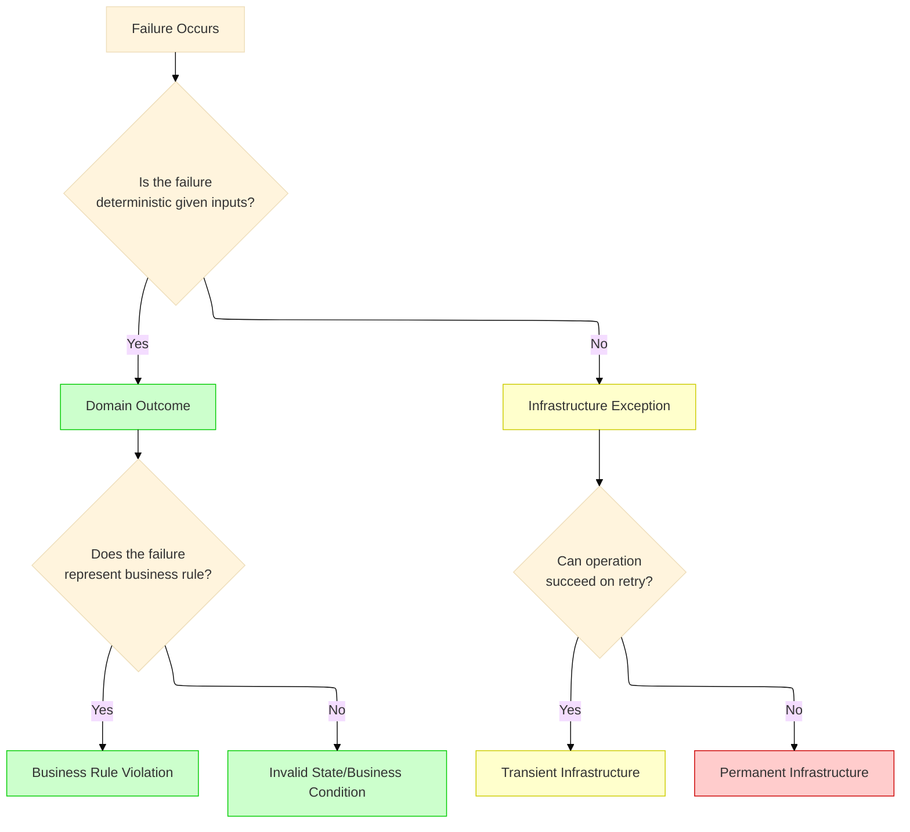
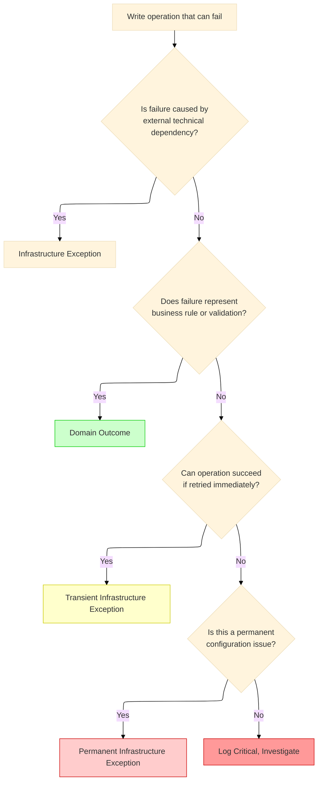

# Clean Architecture Anti-Pattern - Exception: Defining the Boundary - Part 3
## Comprehensive taxonomy distinguishing infrastructure exceptions from domain outcomes. Decision matrices and classification patterns across all infrastructure layers.

## Introduction: The Boundary That Defines Architecture

In **Part 1** of this series, we established the architectural violation that occurs when domain outcomes are expressed through exceptions. In **Part 2**, we quantified the performance cost of this anti-pattern—28x slower execution and 10x more memory allocation for expected business failures.

This story addresses the foundational question that enables both architectural correctness and performance optimization: **How do we definitively distinguish between infrastructure exceptions and domain outcomes?**

The boundary between these two categories is not merely academic. It determines:

- Whether a failure should be handled by retry policies or returned to the user
- Whether an error should trigger operations alerts or be part of normal business flow
- Whether code belongs in domain logic or infrastructure middleware
- Whether testing requires exception assertions or simple result inspection

Without a clear taxonomy, development teams default to throwing exceptions for everything, creating the cascading problems documented in Parts 1 and 2.

---

## Key Takeaways from Previous Stories

| Story | Key Takeaway |
|-------|--------------|
| **1. 🏛️ A .NET Developer's Guide - Part 1** | Domain exceptions at presentation boundaries violate Clean Architecture layering and Dependency Inversion. The Result pattern restores proper separation. |
| **2. 🎭 Domain Logic in Disguise - Part 2** | Exceptions for domain outcomes are 28x slower and allocate 10x more memory than Result pattern failures, creating significant GC pressure in high-throughput systems. |

This story builds upon these principles by providing the classification framework that enables consistent application of the Result pattern.

---

## 1. The Fundamental Distinction

The distinction between infrastructure exceptions and domain outcomes rests on four fundamental questions:



### 1.1 Determinism as the Primary Discriminator

| Criterion | Infrastructure Exception | Domain Outcome |
|-----------|-------------------------|----------------|
| **Deterministic** | No – outcome varies with external conditions | Yes – same inputs yield same outcome |
| **Predictable** | No – depends on network, load, hardware | Yes – follows business rules |
| **Retryable** | Often yes – transient failures may succeed | No – business rule violation persists |
| **User-Facing** | Usually no – technical in nature | Usually yes – communicates business result |
| **Documented in Domain** | No – belongs in infrastructure | Yes – part of ubiquitous language |

### 1.2 Examples Across Categories

| Category | Infrastructure Exception | Domain Outcome |
|----------|-------------------------|----------------|
| **Customer** | Database timeout retrieving customer | Customer not found |
| **Payment** | Gateway connection failure | Insufficient funds |
| **Inventory** | Redis cache unavailable | Product out of stock |
| **Order** | Deadlock during transaction | Duplicate order |
| **Shipping** | Carrier API returns 503 | Address not serviceable |

---

## 2. Comprehensive Infrastructure Exception Taxonomy

Infrastructure exceptions originate from the technical implementation layers. They are characterized by their source and recovery characteristics.

### 2.1 Database Infrastructure Exceptions

```csharp
// Database infrastructure exceptions - .NET 10
public static class DatabaseExceptionClassifier
{
    public static bool IsTransientInfrastructure(this SqlException ex)
    {
        return ex.Number switch
        {
            1205 => true,   // Deadlock - retryable
            -2 => true,     // Timeout - may be retryable
            53 => true,     // Network connectivity - transient
            17 => true,     // SQL Server does not exist - transient if failover
            64 => true,     // TCP connection failure - transient
            10054 => true,  // Connection reset by peer - transient
            10060 => true,  // Network timeout - transient
            _ => false
        };
    }
    
    public static bool IsNonTransientInfrastructure(this SqlException ex)
    {
        return ex.Number switch
        {
            208 => true,    // Invalid object name - configuration issue
            229 => true,    // Permission denied - security configuration
            4060 => true,   // Cannot open database - configuration
            18456 => true,  // Login failed - credential issue
            _ => false
        };
    }
    
    public static bool IsDomainOutcome(this SqlException ex)
    {
        // Database constraint violations MAY represent domain rules
        // But they require careful classification
        if (ex.Message.Contains("unique constraint") && 
            ex.Message.Contains("IX_Customers_Email"))
        {
            // This is a domain rule: duplicate email
            return true;
        }
        
        // Foreign key violations may represent domain relationships
        if (ex.Message.Contains("foreign key constraint") &&
            ex.Message.Contains("FK_Orders_Customers"))
        {
            // Domain: order references non-existent customer
            return true;
        }
        
        return false;
    }
}
```

**Database Exception Classification Matrix:**

| Exception Type | SQL Error Number | Category | Retryable | Domain Relevance |
|----------------|------------------|----------|-----------|------------------|
| Deadlock | 1205 | Transient | Yes | No |
| Timeout | -2 | Transient | Yes | No |
| Connection Failure | 53, 64, 10054 | Transient | Yes | No |
| Login Failed | 18456 | Permanent | No | No |
| Permission Denied | 229 | Permanent | No | No |
| Unique Constraint | 2627 | Domain Outcome | No | Yes (if business rule) |
| Foreign Key Violation | 547 | Domain Outcome | No | Yes (if business rule) |
| Invalid Object | 208 | Permanent | No | No |

### 2.2 HTTP and External Service Infrastructure Exceptions

```csharp
// HTTP infrastructure exceptions - .NET 10
public static class HttpExceptionClassifier
{
    public static bool IsTransientInfrastructure(this HttpRequestException ex)
    {
        return ex.StatusCode switch
        {
            HttpStatusCode.ServiceUnavailable => true,  // 503 - service down
            HttpStatusCode.GatewayTimeout => true,      // 504 - gateway timeout
            HttpStatusCode.BadGateway => true,          // 502 - bad gateway
            HttpStatusCode.RequestTimeout => true,      // 408 - request timeout
            HttpStatusCode.TooManyRequests => true,     // 429 - rate limiting
            null => ex.Message.Contains("timeout") ||   // Network timeout
                    ex.Message.Contains("connection"),
            _ => false
        };
    }
    
    public static bool IsNonTransientInfrastructure(this HttpRequestException ex)
    {
        return ex.StatusCode switch
        {
            HttpStatusCode.NotFound => false,           // 404 - may be domain outcome
            HttpStatusCode.Forbidden => true,            // 403 - auth/permission
            HttpStatusCode.Unauthorized => true,         // 401 - auth issue
            HttpStatusCode.InternalServerError => true,  // 500 - service bug
            _ => false
        };
    }
    
    public static bool IsDomainOutcome(this HttpRequestException ex)
    {
        // 404 from a resource lookup API is domain outcome
        if (ex.StatusCode == HttpStatusCode.NotFound)
        {
            return true;
        }
        
        // 400 with validation errors is domain outcome
        if (ex.StatusCode == HttpStatusCode.BadRequest)
        {
            return true;
        }
        
        return false;
    }
}
```

**HTTP Exception Classification Matrix:**

| Status Code | Category | Retryable | Domain Relevance |
|-------------|----------|-----------|------------------|
| 503 Service Unavailable | Transient | Yes | No |
| 504 Gateway Timeout | Transient | Yes | No |
| 502 Bad Gateway | Transient | Yes | No |
| 408 Request Timeout | Transient | Yes | No |
| 429 Too Many Requests | Transient | Yes | Yes (rate limit is business policy) |
| 404 Not Found | Domain Outcome | No | Yes |
| 400 Bad Request | Domain Outcome | No | Yes |
| 403 Forbidden | Permanent | No | Yes (authorization is domain) |
| 401 Unauthorized | Permanent | No | Yes (authentication is domain) |
| 500 Internal Server Error | Permanent | No | No |

### 2.3 Cache Infrastructure Exceptions

```csharp
// Cache infrastructure exceptions - .NET 10
public static class CacheExceptionClassifier
{
    public static bool IsTransientInfrastructure(this RedisConnectionException ex)
    {
        // Connection failures to Redis are transient
        return ex.Message.Contains("It was not possible to connect") ||
               ex.Message.Contains("SocketFailure") ||
               ex.Message.Contains("Connection refused");
    }
    
    public static bool IsTransientInfrastructure(this RedisTimeoutException ex)
    {
        // Timeouts are transient
        return true;
    }
    
    public static bool ShouldFallbackToDatabase(this Exception ex)
    {
        // Cache failures should not fail the operation
        // Fallback to database and log warning
        return ex is RedisConnectionException ||
               ex is RedisTimeoutException ||
               ex is RedisException;
    }
}
```

**Cache Exception Classification Matrix:**

| Exception Type | Category | Retryable | Fallback Strategy |
|----------------|----------|-----------|-------------------|
| RedisConnectionException | Transient | Yes | Fallback to database |
| RedisTimeoutException | Transient | Yes | Fallback to database |
| RedisException | Varies | Check inner | Fallback to database |
| SerializationException | Permanent | No | Log error, proceed with default |

### 2.4 Messaging Infrastructure Exceptions

```csharp
// Messaging infrastructure exceptions - .NET 10
public static class MessagingExceptionClassifier
{
    public static bool IsTransientInfrastructure(this BrokerUnavailableException ex)
    {
        // Broker connection failures are transient
        return true;
    }
    
    public static bool IsNonTransientInfrastructure(this QuotaExceededException ex)
    {
        // Queue quota exceeded requires manual intervention
        return true;
    }
    
    public static bool ShouldRequeue(this Exception ex)
    {
        // Some exceptions should trigger requeue with delay
        return ex is BrokerUnavailableException ||
               ex is TimeoutException;
    }
    
    public static bool ShouldDeadLetter(this Exception ex)
    {
        // Some exceptions should go to dead letter queue
        return ex is SerializationException ||
               ex is InvalidOperationException ||
               ex is NonTransientInfrastructureException;
    }
}
```

**Messaging Exception Classification Matrix:**

| Exception Type | Category | Retryable | Queue Action |
|----------------|----------|-----------|--------------|
| BrokerUnavailableException | Transient | Yes | Requeue with delay |
| TimeoutException | Transient | Yes | Requeue with delay |
| QuotaExceededException | Permanent | No | Alert operations |
| SerializationException | Permanent | No | Dead letter queue |
| InvalidOperationException | Domain Outcome | No | Dead letter queue |

### 2.5 File System Infrastructure Exceptions

```csharp
// File system infrastructure exceptions - .NET 10
public static class FileSystemExceptionClassifier
{
    public static bool IsTransientInfrastructure(this IOException ex)
    {
        return ex.Message.Contains("disk full") == false &&  // Disk full is permanent
               ex.Message.Contains("access denied") == false && // Permission is permanent
               (ex.Message.Contains("network path") ||        // Network path - transient
                ex.Message.Contains("being used") ||          // Lock contention - retryable
                ex.Message.Contains("timeout"));              // Timeout - transient
    }
    
    public static bool IsNonTransientInfrastructure(this IOException ex)
    {
        return ex.Message.Contains("disk full") ||
               ex.Message.Contains("access denied") ||
               ex.Message.Contains("not enough space");
    }
}
```

**File System Exception Classification Matrix:**

| Exception Condition | Category | Retryable | Recovery Action |
|---------------------|----------|-----------|-----------------|
| Disk full | Permanent | No | Alert operations |
| Access denied | Permanent | No | Check permissions |
| File locked | Transient | Yes | Retry with backoff |
| Network path unavailable | Transient | Yes | Retry, check connectivity |
| Timeout | Transient | Yes | Increase timeout, retry |

---

## 3. Comprehensive Domain Outcome Taxonomy

Domain outcomes represent expected results of business rule evaluation. They are expressed through the Result pattern, not exceptions.

### 3.1 Domain Error Type Classification

```csharp
// Domain/Common/DomainErrorType.cs
public enum DomainErrorType
{
    // Resource state outcomes
    NotFound,      // Resource does not exist
    Conflict,      // Resource state conflicts with operation
    Gone,          // Resource existed but is no longer available
    
    // Validation outcomes
    Validation,    // Input validation failed
    BusinessRule,  // Business rule violation
    
    // Authorization outcomes
    Unauthorized,  // Authentication required
    Forbidden,     // Authenticated but not authorized
    
    // Capacity outcomes
    TooManyRequests, // Rate limit exceeded
    QuotaExceeded    // Account quota exceeded
}
```

### 3.2 Domain Error Factory Methods

```csharp
// Domain/Common/DomainError.cs
public partial record DomainError
{
    // Resource state errors
    public static DomainError NotFound(string resourceType, object identifier) => new()
    {
        Code = $"{resourceType.ToLower()}.not_found",
        Message = $"{resourceType} with identifier '{identifier}' was not found",
        Type = DomainErrorType.NotFound,
        Metadata = new()
        {
            ["resourceType"] = resourceType,
            ["identifier"] = identifier
        }
    };
    
    public static DomainError Conflict(string resourceType, string reason, object? details = null) => new()
    {
        Code = $"{resourceType.ToLower()}.conflict",
        Message = $"{resourceType} conflict: {reason}",
        Type = DomainErrorType.Conflict,
        Metadata = details is not null ? new() { ["details"] = details } : new()
    };
    
    // Validation errors
    public static DomainError Validation(string field, string message) => new()
    {
        Code = "validation.failed",
        Message = message,
        Type = DomainErrorType.Validation,
        Metadata = new() { ["field"] = field }
    };
    
    public static DomainError Validation(Dictionary<string, string[]> errors) => new()
    {
        Code = "validation.failed",
        Message = "One or more validation errors occurred",
        Type = DomainErrorType.Validation,
        Metadata = new() { ["errors"] = errors }
    };
    
    // Business rule errors
    public static DomainError BusinessRule(string rule, string message, object? context = null) => new()
    {
        Code = $"business.{rule.ToLower()}",
        Message = message,
        Type = DomainErrorType.BusinessRule,
        Metadata = context is not null ? new() { ["context"] = context } : new()
    };
    
    public static DomainError InsufficientFunds(decimal available, decimal required) => new()
    {
        Code = "business.insufficient_funds",
        Message = $"Insufficient funds. Available: {available:C}, Required: {required:C}",
        Type = DomainErrorType.BusinessRule,
        Metadata = new()
        {
            ["available"] = available,
            ["required"] = required
        }
    };
    
    public static DomainError OutOfStock(string productId, int requested, int available) => new()
    {
        Code = "business.out_of_stock",
        Message = $"Product {productId} out of stock. Requested: {requested}, Available: {available}",
        Type = DomainErrorType.BusinessRule,
        Metadata = new()
        {
            ["productId"] = productId,
            ["requested"] = requested,
            ["available"] = available
        }
    };
    
    public static DomainError Duplicate(string entityType, string field, object value) => new()
    {
        Code = $"business.duplicate_{entityType.ToLower()}",
        Message = $"{entityType} with {field} '{value}' already exists",
        Type = DomainErrorType.Conflict,
        Metadata = new()
        {
            ["entityType"] = entityType,
            ["field"] = field,
            ["value"] = value
        }
    };
    
    // Authorization errors
    public static DomainError Unauthorized(string message = "Authentication required") => new()
    {
        Code = "auth.unauthorized",
        Message = message,
        Type = DomainErrorType.Unauthorized
    };
    
    public static DomainError Forbidden(string resource, string action, string reason) => new()
    {
        Code = "auth.forbidden",
        Message = $"Access denied to {action} on {resource}: {reason}",
        Type = DomainErrorType.Forbidden,
        Metadata = new()
        {
            ["resource"] = resource,
            ["action"] = action,
            ["reason"] = reason
        }
    };
    
    // Capacity errors
    public static DomainError TooManyRequests(string resource, int limit, int windowSeconds) => new()
    {
        Code = "rate_limit.exceeded",
        Message = $"Rate limit of {limit} requests per {windowSeconds} seconds exceeded",
        Type = DomainErrorType.TooManyRequests,
        Metadata = new()
        {
            ["resource"] = resource,
            ["limit"] = limit,
            ["windowSeconds"] = windowSeconds
        }
    };
}
```

### 3.3 Domain Outcome Classification by Business Domain

| Business Domain | Domain Outcome | DomainError Type | Factory Method |
|-----------------|----------------|------------------|----------------|
| **Customer** | Customer not found | NotFound | `DomainError.NotFound("Customer", id)` |
| **Customer** | Duplicate email | Conflict | `DomainError.Duplicate("Customer", "email", email)` |
| **Customer** | Account locked | Forbidden | `DomainError.Forbidden("Customer", "login", "account locked")` |
| **Payment** | Insufficient funds | BusinessRule | `DomainError.InsufficientFunds(available, required)` |
| **Payment** | Card declined | BusinessRule | `DomainError.BusinessRule("card_declined", message)` |
| **Payment** | Invalid CVV | Validation | `DomainError.Validation("cvv", "Invalid CVV code")` |
| **Inventory** | Out of stock | BusinessRule | `DomainError.OutOfStock(productId, requested, available)` |
| **Inventory** | Minimum order quantity | Validation | `DomainError.Validation("quantity", "Minimum order is 10")` |
| **Order** | Duplicate order | Conflict | `DomainError.Conflict("Order", "duplicate detected")` |
| **Order** | Invalid state transition | BusinessRule | `DomainError.BusinessRule("invalid_state", message)` |
| **Shipping** | Unserviceable address | BusinessRule | `DomainError.BusinessRule("unserviceable", message)` |
| **Shipping** | Invalid postal code | Validation | `DomainError.Validation("postalCode", "Invalid format")` |

---

## 4. The Decision Matrix: Infrastructure vs Domain

### 4.1 Primary Classification Matrix

| Characteristic | Infrastructure Exception | Domain Outcome |
|----------------|-------------------------|----------------|
| **Origin** | Database, network, cache, file system | Business rules, validation, state |
| **Predictability** | Non-deterministic | Deterministic |
| **Retry Success** | Possible | Impossible (state unchanged) |
| **User Message** | Technical, generic | Business, specific |
| **Log Level** | Warning (transient) / Error (permanent) | Info |
| **Alert** | Yes for permanent failures | No |
| **SLA Impact** | Counts as downtime | Normal business flow |
| **Testing** | Requires infrastructure simulation | Simple unit test |

### 4.2 Decision Flow for New Code



### 4.3 Classification Examples

| Scenario | Classification | Justification |
|----------|----------------|---------------|
| Database connection timeout | Transient Infrastructure | Network issue, retry may succeed |
| Customer ID not found | Domain Outcome | Expected business state, deterministic |
| Payment gateway returns 503 | Transient Infrastructure | Service unavailable, retryable |
| Payment gateway returns 400 (invalid card) | Domain Outcome | Validation failure, business rule |
| Redis cache unavailable | Transient Infrastructure | Fallback to database, retryable |
| Duplicate email in registration | Domain Outcome | Business rule, deterministic |
| Disk full writing log file | Permanent Infrastructure | Requires ops intervention |
| User not authorized for action | Domain Outcome | Authorization is business concern |
| Message queue quota exceeded | Permanent Infrastructure | Requires ops intervention |
| Product out of stock | Domain Outcome | Expected business state |

---

## 5. Infrastructure Exception Hierarchy

### 5.1 Complete Exception Hierarchy

```csharp
// Infrastructure/Exceptions/InfrastructureException.cs
// .NET 10: Complete infrastructure exception hierarchy
namespace Infrastructure.Exceptions
{
    // Base infrastructure exception
    public abstract class InfrastructureException : Exception
    {
        public string ErrorCode { get; }
        public string ReferenceCode { get; } = Guid.NewGuid().ToString();
        public bool IsTransient { get; }
        
        protected InfrastructureException(
            string message,
            string? errorCode = null,
            bool isTransient = true,
            Exception? innerException = null)
            : base(message, innerException)
        {
            ErrorCode = errorCode ?? "INFRA_001";
            IsTransient = isTransient;
        }
    }
    
    // Transient infrastructure exceptions
    public class TransientInfrastructureException : InfrastructureException
    {
        public TransientInfrastructureException(
            string message,
            string? errorCode = null,
            Exception? innerException = null)
            : base(message, errorCode, true, innerException)
        {
        }
        
        public TimeSpan? RetryAfter { get; init; }
        public int RecommendedRetryCount { get; init; } = 3;
    }
    
    // Non-transient infrastructure exceptions
    public class NonTransientInfrastructureException : InfrastructureException
    {
        public NonTransientInfrastructureException(
            string message,
            string? errorCode = null,
            Exception? innerException = null)
            : base(message, errorCode, false, innerException)
        {
        }
        
        public string? ResolutionInstructions { get; init; }
        public bool RequiresManualIntervention { get; init; } = true;
    }
    
    // Database-specific exceptions
    public class DatabaseInfrastructureException : TransientInfrastructureException
    {
        public int SqlErrorNumber { get; }
        
        public DatabaseInfrastructureException(
            string message,
            int sqlErrorNumber,
            string? errorCode = null,
            Exception? innerException = null)
            : base(message, errorCode ?? $"DB_{sqlErrorNumber}", innerException)
        {
            SqlErrorNumber = sqlErrorNumber;
        }
    }
    
    // HTTP/Service-specific exceptions
    public class ExternalServiceInfrastructureException : InfrastructureException
    {
        public string ServiceName { get; }
        public HttpStatusCode? StatusCode { get; }
        
        public ExternalServiceInfrastructureException(
            string serviceName,
            string message,
            HttpStatusCode? statusCode = null,
            bool isTransient = true,
            string? errorCode = null,
            Exception? innerException = null)
            : base(message, errorCode ?? $"EXT_{serviceName.ToUpper()}_001", isTransient, innerException)
        {
            ServiceName = serviceName;
            StatusCode = statusCode;
        }
    }
    
    // Cache-specific exceptions
    public class CacheInfrastructureException : TransientInfrastructureException
    {
        public string CacheKey { get; }
        public bool ShouldFallbackToPrimary { get; init; } = true;
        
        public CacheInfrastructureException(
            string cacheKey,
            string message,
            string? errorCode = null,
            Exception? innerException = null)
            : base(message, errorCode ?? "CACHE_001", innerException)
        {
            CacheKey = cacheKey;
        }
    }
    
    // Messaging-specific exceptions
    public class MessagingInfrastructureException : InfrastructureException
    {
        public string QueueName { get; }
        public string MessageId { get; }
        
        public MessagingInfrastructureException(
            string queueName,
            string messageId,
            string message,
            bool isTransient = true,
            string? errorCode = null,
            Exception? innerException = null)
            : base(message, errorCode ?? "MSG_001", isTransient, innerException)
        {
            QueueName = queueName;
            MessageId = messageId;
        }
    }
}
```

---

## 6. Classification in Practice: Complete Example

### 6.1 Payment Processing with Clear Boundaries

```csharp
// Domain/Services/PaymentService.cs
public class PaymentService : IPaymentService
{
    private readonly IPaymentGateway _gateway;
    private readonly IPaymentRepository _repository;
    private readonly ILogger<PaymentService> _logger;
    
    public async Task<Result<PaymentTransaction>> ProcessPaymentAsync(
        PaymentRequest request,
        CancellationToken ct)
    {
        // DOMAIN OUTCOMES - Expected business results
        // These are deterministic and user-facing
        
        if (request.Amount <= 0)
        {
            return Result<PaymentTransaction>.Failure(
                DomainError.Validation("amount", "Amount must be positive"));
        }
        
        if (request.Amount > 10000)
        {
            return Result<PaymentTransaction>.Failure(
                DomainError.BusinessRule("payment.limit_exceeded",
                    "Payments exceeding $10,000 require approval"));
        }
        
        // Check for duplicate (idempotency) - domain outcome
        var existingResult = await _repository.GetByIdempotencyKeyAsync(
            request.IdempotencyKey, ct);
            
        if (existingResult.IsSuccess && existingResult.Value != null)
        {
            _logger.LogInformation("Duplicate payment prevented for key {Key}",
                request.IdempotencyKey);
            return Result<PaymentTransaction>.Success(existingResult.Value);
        }
        
        try
        {
            // INFRASTRUCTURE CALL - May throw infrastructure exceptions
            var gatewayResponse = await _gateway.ChargeAsync(
                new GatewayChargeRequest
                {
                    Amount = request.Amount,
                    PaymentMethod = request.PaymentMethod,
                    IdempotencyKey = request.IdempotencyKey
                }, ct);
            
            // DOMAIN OUTCOMES - Gateway business responses
            return gatewayResponse.Status switch
            {
                GatewayPaymentStatus.Success => 
                    Result<PaymentTransaction>.Success(
                        new PaymentTransaction(gatewayResponse.TransactionId)),
                    
                GatewayPaymentStatus.InsufficientFunds =>
                    Result<PaymentTransaction>.Failure(
                        DomainError.InsufficientFunds(
                            gatewayResponse.AvailableBalance, request.Amount)),
                    
                GatewayPaymentStatus.CardDeclined =>
                    Result<PaymentTransaction>.Failure(
                        DomainError.BusinessRule("payment.card_declined",
                            $"Card declined: {gatewayResponse.DeclineReason}")),
                    
                GatewayPaymentStatus.InvalidCvv =>
                    Result<PaymentTransaction>.Failure(
                        DomainError.Validation("cvv", "Invalid CVV code")),
                    
                GatewayPaymentStatus.FraudSuspected =>
                    Result<PaymentTransaction>.Failure(
                        DomainError.BusinessRule("payment.fraud_suspected",
                            "Transaction flagged for fraud review")),
                    
                _ => Result<PaymentTransaction>.Failure(
                    DomainError.BusinessRule("payment.unknown",
                        $"Unknown gateway status: {gatewayResponse.Status}"))
            };
        }
        catch (HttpRequestException ex) when (ex.StatusCode == HttpStatusCode.ServiceUnavailable)
        {
            // INFRASTRUCTURE EXCEPTION - Transient
            _logger.LogWarning(ex, "Payment gateway unavailable");
            throw new ExternalServiceInfrastructureException(
                "PaymentGateway",
                "Payment gateway temporarily unavailable",
                HttpStatusCode.ServiceUnavailable,
                isTransient: true,
                errorCode: "PAY_GW_503",
                innerException: ex)
            {
                RetryAfter = TimeSpan.FromSeconds(30)
            };
        }
        catch (HttpRequestException ex) when (ex.StatusCode == HttpStatusCode.GatewayTimeout)
        {
            // INFRASTRUCTURE EXCEPTION - Transient
            _logger.LogWarning(ex, "Payment gateway timeout");
            throw new ExternalServiceInfrastructureException(
                "PaymentGateway",
                "Payment gateway did not respond in time",
                HttpStatusCode.GatewayTimeout,
                isTransient: true,
                errorCode: "PAY_GW_TIMEOUT",
                innerException: ex);
        }
        catch (HttpRequestException ex) when (ex.StatusCode == HttpStatusCode.Forbidden)
        {
            // INFRASTRUCTURE EXCEPTION - Permanent (configuration issue)
            _logger.LogError(ex, "Payment gateway authentication failed");
            throw new ExternalServiceInfrastructureException(
                "PaymentGateway",
                "Payment gateway authentication failed. Check credentials.",
                HttpStatusCode.Forbidden,
                isTransient: false,
                errorCode: "PAY_GW_AUTH",
                innerException: ex)
            {
                ResolutionInstructions = "Verify API keys and merchant account configuration",
                RequiresManualIntervention = true
            };
        }
        catch (TimeoutException ex)
        {
            // INFRASTRUCTURE EXCEPTION - Transient
            _logger.LogWarning(ex, "Payment gateway timeout");
            throw new ExternalServiceInfrastructureException(
                "PaymentGateway",
                "Payment gateway timeout",
                isTransient: true,
                errorCode: "PAY_GW_TIMEOUT",
                innerException: ex);
        }
    }
}
```

---

## 7. Cross-Layer Classification Reference

### 7.1 Complete Classification Reference Table

| Layer | Exception/Outcome | Category | Handler | Log Level |
|-------|-------------------|----------|---------|-----------|
| **Presentation** | HTTP 404 | Domain Outcome | API returns 404 | Info |
| **Presentation** | HTTP 400 | Domain Outcome | API returns validation errors | Info |
| **Presentation** | HTTP 422 | Domain Outcome | API returns business rule violation | Info |
| **Application** | Customer not found | Domain Outcome | Return Result.Failure | Info |
| **Application** | Insufficient funds | Domain Outcome | Return Result.Failure | Info |
| **Application** | Out of stock | Domain Outcome | Return Result.Failure | Info |
| **Domain** | Business rule violation | Domain Outcome | Return Result.Failure | Info |
| **Infrastructure** | SQL Deadlock | Transient Exception | Retry policy | Warning |
| **Infrastructure** | SQL Timeout | Transient Exception | Retry policy | Warning |
| **Infrastructure** | Connection failure | Transient Exception | Retry policy | Warning |
| **Infrastructure** | HTTP 503 | Transient Exception | Retry policy | Warning |
| **Infrastructure** | HTTP 504 | Transient Exception | Retry policy | Warning |
| **Infrastructure** | Redis unavailable | Transient Exception | Fallback to DB | Warning |
| **Infrastructure** | Disk full | Permanent Exception | Alert operations | Critical |
| **Infrastructure** | Auth failure | Permanent Exception | Alert ops, check config | Error |
| **Infrastructure** | Invalid configuration | Permanent Exception | Alert ops, fix config | Error |

---

## What We Learned in This Story

| Concept | Key Takeaway |
|---------|--------------|
| **Primary Discriminator** | Determinism is the key: domain outcomes are deterministic given inputs; infrastructure exceptions are non-deterministic |
| **Database Classification** | Deadlocks (1205) and timeouts (-2) are transient infrastructure; unique constraint violations may be domain outcomes |
| **HTTP Classification** | 503/504 are transient infrastructure; 404/400 are typically domain outcomes |
| **Cache Classification** | Cache failures are transient infrastructure with fallback to primary data sources |
| **Domain Error Taxonomy** | Domain errors are categorized by type: NotFound, Conflict, Validation, BusinessRule, Unauthorized, Forbidden |
| **Exception Hierarchy** | Infrastructure exceptions inherit from base types with IsTransient flag and structured error codes |
| **Decision Matrix** | Clear classification criteria enable consistent handling across the entire application |

---

## Next Story

The next story in the series provides the complete implementation of the Result pattern, building upon the taxonomy established in this story.

---

**4. ⚙️ Clean Architecture Anti-Pattern - Exception: Building the Result Pattern - Part 4** – Complete implementation of Result<T> and DomainError with functional extensions. Source generation for domain errors, integration with .NET 10 features including required members, primary constructors, and enhanced pattern matching. Full type hierarchy, extension methods for LINQ-style composition, and API design best practices.

---

## References to Previous Stories

This story builds upon the principles established in:

**1. 🏛️ Clean Architecture Anti-Pattern - Exception: A .NET Developer's Guide - Part 1** – Architectural violation, domain-infrastructure distinction, Result pattern implementation, and decision framework.

**2. 🎭 Clean Architecture Anti-Pattern - Exception: Domain Logic in Disguise - Part 2** – Performance implications, GC pressure analysis, and why expected outcomes should never throw exceptions.

Key concepts referenced:
- The architectural violation of domain exceptions at presentation boundaries
- The performance cost of exception-based domain logic
- The Result pattern as the solution for domain outcome handling
- Infrastructure exception handling middleware

---

## Series Overview

1. **🏛️ Clean Architecture Anti-Pattern - Exception: A .NET Developer's Guide - Part 1** – Foundational principles, architectural violation, domain-infrastructure distinction, Result pattern, and decision framework.

2. **🎭 Clean Architecture Anti-Pattern - Exception: Domain Logic in Disguise - Part 2** – Performance implications of exception-based domain logic. Stack trace overhead, GC pressure analysis, and why expected outcomes should never throw exceptions.

3. **🔍 Clean Architecture Anti-Pattern - Exception: Defining the Boundary - Part 3** – Comprehensive taxonomy distinguishing infrastructure exceptions from domain outcomes. Decision matrices and classification patterns across all infrastructure layers. *(This Story)*

4. **⚙️ Clean Architecture Anti-Pattern - Exception: Building the Result Pattern - Part 4** – Complete implementation of Result<T> and DomainError with functional extensions. Source generation, .NET 10 features, and API design best practices.

5. **🏢 Clean Architecture Anti-Pattern - Exception: Across Real-World Domains - Part 5** – Four complete case studies: Payment Processing, Inventory Management, Healthcare Scheduling, and Logistics Tracking.

6. **🛡️ Clean Architecture Anti-Pattern - Exception: Infrastructure Resilience - Part 6** – Global exception handling middleware, Polly retry policies, circuit breakers, and health check integration.

7. **🧪 Clean Architecture Anti-Pattern - Exception: Testing & Observability - Part 7** – Unit testing domain logic without exceptions, infrastructure failure testing, OpenTelemetry, metrics with .NET Meters, and production dashboards.

8. **🚀 Clean Architecture Anti-Pattern - Exception: The Road Ahead - Part 8** – Implementation checklist, migration strategies, .NET 10 roadmap, and Native AOT compatibility.

---

---
*� Questions? Drop a response - I read and reply to every comment.*
*📌 Save this story to your reading list - it helps other engineers discover it.*
**🔗 Follow me →**
- [**Medium**](mvineetsharma.medium.com) - mvineetsharma.medium.com
- [**LinkedIn**](www.linkedin.com/in/vineet-sharma-architect) -  www.linkedin.com/in/vineet-sharma-architect

*In-depth .NET, Node.js, Python, Cloud Architecture, and System Design. New articles weekly*