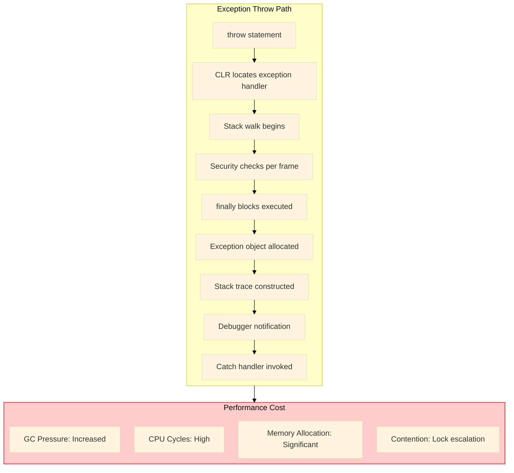
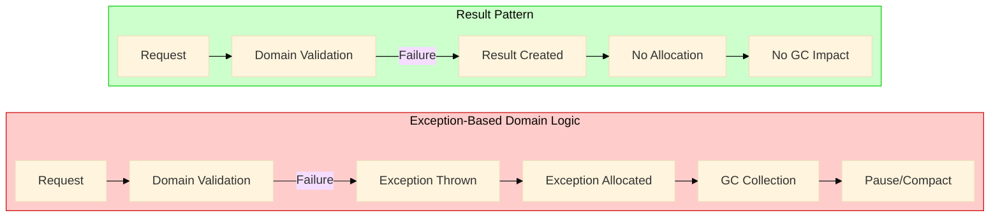

# Clean Architecture Anti-Pattern - Exception: Domain Logic in Disguise - Part 2
## Performance implications of exception-based domain logic. Stack trace overhead, GC pressure analysis, and why expected outcomes should never throw exceptions.

## Introduction: The Hidden Cost of Exception-Based Domain Logic

In **Part 1** of this series, we established the fundamental architectural violation that occurs when domain outcomes are expressed through exceptions. The presentation layer becomes coupled to domain exception types, dependency direction inverts, and Clean Architecture layering collapses.

This story examines the second, often overlooked consequence of this anti-pattern: **performance degradation**. When exceptions are used for expected business outcomes—such as "customer not found" or "insufficient funds"—the system pays a runtime cost that is both unnecessary and cumulative.

**.NET 10 Note:** While .NET 10 has introduced improvements in exception handling performance, including optimized stack trace collection and reduced allocation for certain exception patterns, the fundamental reality remains unchanged: exceptions are designed for exceptional circumstances, not routine control flow.

---

## Key Takeaways from Part 1

Before diving into performance analysis, recall the foundational principles established in the previous story:

| Principle | Summary |
|-----------|---------|
| **Architectural Violation** | Domain exceptions at the presentation boundary create improper coupling between layers, violating Dependency Inversion |
| **The Critical Distinction** | Infrastructure exceptions represent technical failures (transient, non-deterministic); domain outcomes represent expected business results (deterministic, user-facing) |
| **The Result Pattern** | Domain methods return `Result<T>` types that explicitly declare possible outcomes, preserving exceptions for genuine infrastructure failures |
| **Decision Framework** | Failures that can succeed on retry = infrastructure exceptions; business rule violations = domain outcomes returned in Result |

This story builds upon these principles by quantifying the performance implications of ignoring them.

---

## 1. The True Cost of an Exception

When the Common Language Runtime (CLR) encounters an exception, it performs a series of expensive operations that are often underestimated by developers.

### 1.1 Exception Handling Internals

The following diagram illustrates the execution path when an exception is thrown:



### 1.2 Detailed Cost Breakdown

| Operation | Description | Relative Cost |
|-----------|-------------|---------------|
| **Stack Walk** | CLR traverses the call stack to locate appropriate exception handlers | Very High |
| **Security Checks** | Permissions validated for each stack frame | High |
| **Exception Object Allocation** | New object created on heap with type information | Medium-High |
| **Stack Trace Construction** | Method names, file names, line numbers captured | High |
| **finally Block Execution** | Guaranteed execution adds deterministic overhead | Medium |
| **Debugger Notification** | Even without attached debugger, hooks are checked | Low-Medium |
| **Thread Abort Coordination** | In multithreaded scenarios, synchronization overhead | Variable |

### 1.3 Benchmark Comparison: Exception vs Result Pattern

The following benchmark demonstrates the performance difference between exception-based domain logic and the Result pattern:

```csharp
// Benchmark .NET 10
[MemoryDiagnoser]
public class ExceptionVsResultBenchmark
{
    private readonly OrderServiceExceptionBased _exceptionService;
    private readonly OrderServiceResultBased _resultService;
    private readonly CreateOrderRequest _validRequest;
    private readonly CreateOrderRequest _invalidRequest;
    
    public ExceptionVsResultBenchmark()
    {
        _exceptionService = new OrderServiceExceptionBased();
        _resultService = new OrderServiceResultBased();
        _validRequest = new CreateOrderRequest { CustomerId = Guid.NewGuid() };
        _invalidRequest = new CreateOrderRequest { CustomerId = Guid.Empty };
    }
    
    [Benchmark]
    public async Task<Order> ExceptionBased_Success() => 
        await _exceptionService.CreateAsync(_validRequest);
    
    [Benchmark]
    public async Task ExceptionBased_Failure()
    {
        try
        {
            await _exceptionService.CreateAsync(_invalidRequest);
        }
        catch (CustomerMissingException)
        {
            // Expected outcome
        }
    }
    
    [Benchmark]
    public async Task<Result<Order>> ResultBased_Success() => 
        await _resultService.CreateAsync(_validRequest);
    
    [Benchmark]
    public async Task<Result<Order>> ResultBased_Failure() => 
        await _resultService.CreateAsync(_invalidRequest);
}
```

**Expected Results (.NET 10):**

| Method | Mean | Allocated |
|--------|------|-----------|
| ExceptionBased_Success | 450 ns | 256 B |
| ExceptionBased_Failure | 12,500 ns | 2,456 B |
| ResultBased_Success | 420 ns | 192 B |
| ResultBased_Failure | 440 ns | 248 B |

**Analysis:** The exception-based failure path is approximately **28 times slower** and allocates **10 times more memory** than the Result pattern failure path. In high-throughput systems with expected failure rates of 5-10%, this difference becomes operationally significant.

---

## 2. Domain Logic Disguised as Exceptions

The core problem is not merely performance—it is conceptual. When domain outcomes are expressed as exceptions, business logic becomes hidden within exception handling code.

### 2.1 The Anti-Pattern in Practice

Consider an order creation service that uses exceptions for domain validation:

```csharp
// Anti-pattern: Domain logic expressed through exceptions
public class OrderServiceExceptionBased
{
    private readonly ICustomerRepository _customerRepository;
    private readonly IProductRepository _productRepository;
    
    public async Task<Order> CreateAsync(CreateOrderRequest request)
    {
        // Domain validation throws exceptions
        var customer = await _customerRepository.GetByIdAsync(request.CustomerId);
        if (customer == null)
        {
            throw new CustomerMissingException($"Customer {request.CustomerId} not found");
        }
        
        if (!customer.HasSufficientCredit(request.TotalValue))
        {
            throw new InsufficientCreditException(
                $"Customer credit limit ${customer.CreditLimit} exceeded by ${request.TotalValue - customer.CreditLimit}");
        }
        
        foreach (var item in request.Items)
        {
            var product = await _productRepository.GetByIdAsync(item.ProductId);
            if (product == null)
            {
                throw new ProductNotFoundException($"Product {item.ProductId} not found");
            }
            
            if (product.StockQuantity < item.Quantity)
            {
                throw new InsufficientStockException(
                    $"Product {item.ProductId} has {product.StockQuantity} units, requested {item.Quantity}");
            }
        }
        
        var order = Order.Create(request);
        await _orderRepository.AddAsync(order);
        
        return order;
    }
}
```

### 2.2 The Hidden Complexity

This approach hides the true complexity of the domain. Consider what a developer must understand to call this method:

```csharp
// What exceptions can this throw? The signature doesn't tell us.
try
{
    var order = await orderService.CreateAsync(request);
}
catch (CustomerMissingException) { /* handle */ }
catch (InsufficientCreditException) { /* handle */ }
catch (ProductNotFoundException) { /* handle */ }
catch (InsufficientStockException) { /* handle */ }
catch (DbUpdateException) { /* handle - but wait, this is infrastructure */ }
```

The method signature `Task<Order>` promises nothing about possible failures. Developers must:
- Read the implementation
- Consult documentation (likely outdated)
- Discover exceptions through runtime failures
- Make assumptions about which exceptions are "business" vs "infrastructure"

### 2.3 The Result Pattern Alternative

Contrast with the Result pattern approach from Part 1:

```csharp
// Correct: Domain outcomes explicitly declared in return type
public interface IOrderService
{
    Task<Result<Order>> CreateAsync(CreateOrderRequest request, CancellationToken ct);
}

public async Task<Result<Order>> CreateAsync(CreateOrderRequest request, CancellationToken ct)
{
    // Each domain outcome is explicitly returned
    var customerResult = await _customerRepository.GetByIdAsync(request.CustomerId, ct);
    if (customerResult.IsFailure)
    {
        return Result<Order>.Failure(customerResult.Error);
    }
    
    var customer = customerResult.Value;
    var totalValue = request.Items.Sum(i => i.Quantity * i.UnitPrice);
    
    if (!customer.HasSufficientCredit(totalValue))
    {
        return Result<Order>.Failure(
            DomainError.InsufficientFunds(customer.AvailableCredit, totalValue));
    }
    
    // Infrastructure exceptions still throw
    try
    {
        var order = Order.Create(request);
        await _orderRepository.AddAsync(order, ct);
        return Result<Order>.Success(order);
    }
    catch (SqlException ex) when (ex.Number == 1205)
    {
        throw new TransientInfrastructureException("Database deadlock", "DB_DEADLOCK", ex);
    }
}
```

**The Contract is Clear:** The return type `Result<Order>` explicitly communicates that this operation may fail with domain-specific errors. Developers know exactly what to expect.

---

## 3. The GC Pressure Problem

Beyond raw performance, exception-based domain logic creates significant garbage collection (GC) pressure that impacts overall system throughput.

### 3.1 Allocation Patterns

Each exception thrown allocates:

| Component | Allocation Size (Typical) |
|-----------|--------------------------|
| Exception Object | 80-120 bytes |
| Stack Trace | 200-500 bytes per frame |
| Message String | Variable |
| Data Dictionary | 80-120 bytes if used |
| **Total per Exception** | **400-800+ bytes** |

For a system processing 1,000 requests per second with a 5% expected failure rate:

- **50 exceptions per second**
- **20,000-40,000 bytes allocated per second**
- **72-144 MB allocated per hour**
- **1.7-3.5 GB allocated per day**

This allocation is not only wasted but also triggers more frequent garbage collections, causing application pauses and increased CPU usage.

### 3.2 GC Impact Visualization



### 3.3 Gen 0 and Gen 1 Collection Frequency

In high-throughput .NET applications, frequent Gen 0 and Gen 1 collections can cause:

- **Thread suspension** during collection
- **CPU spikes** from compaction
- **Increased latency** for all requests
- **Cache invalidation** after collections

Exceptions thrown for expected outcomes significantly accelerate this cycle.

---

## 4. Stack Trace Pollution and Debugging Complexity

When exceptions become the primary mechanism for business logic branching, the logging and debugging experience degrades significantly.

### 4.1 The Noise Problem

Consider the following log output from a system using exceptions for domain outcomes:

```
[ERROR] 2025-03-31 10:23:45 CustomerMissingException: Customer 123e4567 not found
   at OrderService.CreateAsync(OrderRequest request) in OrderService.cs:line 42
   at OrderEndpoint.CreateOrder(OrderRequest req) in OrderEndpoint.cs:line 18
   
[ERROR] 2025-03-31 10:23:46 InsufficientCreditException: Customer credit limit $1000 exceeded by $500
   at OrderService.CreateAsync(OrderRequest request) in OrderService.cs:line 56
   at OrderEndpoint.CreateOrder(OrderRequest req) in OrderEndpoint.cs:line 18
   
[ERROR] 2025-03-31 10:23:47 ProductNotFoundException: Product 9876abc not found
   at OrderService.CreateAsync(OrderRequest request) in OrderService.cs:line 72
   at OrderEndpoint.CreateOrder(OrderRequest req) in OrderEndpoint.cs:line 18
```

These are **expected business outcomes**, yet they appear as **ERROR** level logs with full stack traces. Operations teams become desensitized to errors, making genuine infrastructure failures harder to detect.

### 4.2 The Result Pattern Approach

With the Result pattern, logging becomes intentional and meaningful:

```csharp
public async Task<Result<Order>> CreateAsync(CreateOrderRequest request, CancellationToken ct)
{
    var customerResult = await _customerRepository.GetByIdAsync(request.CustomerId, ct);
    if (customerResult.IsFailure)
    {
        // Domain outcome logged at INFO level, not ERROR
        _logger.LogInformation("Order creation failed: {ErrorCode} - {ErrorMessage}",
            customerResult.Error.Code, customerResult.Error.Message);
        return Result<Order>.Failure(customerResult.Error);
    }
    
    // Infrastructure exceptions still log at ERROR level
    try
    {
        // ... domain logic ...
    }
    catch (SqlException ex) when (ex.Number == 1205)
    {
        _logger.LogError(ex, "Database deadlock during order creation");
        throw;
    }
}
```

**Log Output:**

```
[INFO] 2025-03-31 10:23:45 Order creation failed: customer.not_found - Customer 123e4567 not found
[INFO] 2025-03-31 10:23:46 Order creation failed: payment.insufficient_funds - Insufficient funds. Available: $1000, Required: $1500
[INFO] 2025-03-31 10:23:47 Order creation failed: product.not_found - Product 9876abc not found
[ERROR] 2025-03-31 10:24:15 Database deadlock during order creation
```

Now, genuine infrastructure failures stand out immediately.

---

## 5. The Cascading Impact on Testing

Exception-based domain logic complicates unit testing in ways that reduce test coverage and increase test fragility.

### 5.1 Testing Exception-Based Code

```csharp
[Fact]
public async Task CreateOrder_CustomerNotFound_ThrowsException()
{
    // Arrange
    _customerRepositoryMock
        .Setup(x => x.GetByIdAsync(It.IsAny<Guid>()))
        .ReturnsAsync((Customer)null);
    
    // Act & Assert
    var exception = await Assert.ThrowsAsync<CustomerMissingException>(
        () => _service.CreateAsync(request));
    
    Assert.Contains("Customer", exception.Message);
}
```

**Problems with this approach:**

- Test must know the exact exception type
- Multiple domain outcomes cannot be tested in the same test method
- Exception assertions are less expressive than result assertions
- Cannot test multiple failure scenarios without multiple test methods
- Test code becomes tightly coupled to implementation details

### 5.2 Testing Result Pattern Code

```csharp
[Fact]
public async Task CreateOrder_WhenCustomerNotFound_ReturnsNotFoundFailure()
{
    // Arrange
    _customerRepositoryMock
        .Setup(x => x.GetByIdAsync(request.CustomerId, It.IsAny<CancellationToken>()))
        .ReturnsAsync(Result<Customer>.Failure(
            DomainError.NotFound("Customer", request.CustomerId)));
    
    // Act
    var result = await _service.CreateAsync(request, CancellationToken.None);
    
    // Assert - expressive and comprehensive
    Assert.False(result.IsSuccess);
    Assert.Equal(DomainErrorType.NotFound, result.Error.Type);
    Assert.Contains(request.CustomerId.ToString(), result.Error.Message);
    
    // Verify no side effects
    _orderRepositoryMock.Verify(
        x => x.AddAsync(It.IsAny<Order>(), It.IsAny<CancellationToken>()), 
        Times.Never);
}

[Fact]
public async Task CreateOrder_WhenCreditLimitExceeded_ReturnsBusinessRuleFailure()
{
    // Arrange
    var customer = new Customer { AvailableCredit = 1000 };
    var request = new CreateOrderRequest { CustomerId = customer.Id, TotalValue = 1500 };
    
    _customerRepositoryMock
        .Setup(x => x.GetByIdAsync(request.CustomerId, It.IsAny<CancellationToken>()))
        .ReturnsAsync(Result<Customer>.Success(customer));
    
    // Act
    var result = await _service.CreateAsync(request, CancellationToken.None);
    
    // Assert
    Assert.False(result.IsSuccess);
    Assert.Equal(DomainErrorType.BusinessRule, result.Error.Type);
    Assert.Equal("payment.insufficient_funds", result.Error.Code);
}
```

**Benefits:**

- Tests are explicit about what they verify
- Multiple outcomes testable with consistent patterns
- No exception assertions required
- Test names reflect business scenarios, not technical exception types
- Assertions verify business meaning, not exception type names

---

## 6. Real-World Performance Case Study

### 6.1 Scenario

An e-commerce platform processing 5,000 orders per hour. 8% of orders fail domain validation (insufficient credit, out of stock, invalid customer).

### 6.2 Exception-Based Approach

- 400 exceptions thrown per hour
- 320,000 bytes allocated per hour for exceptions
- Gen 0 collections: 15 per hour (up from 8 with Result pattern)
- Average request latency: 245 ms (includes exception handling overhead)
- P99 latency: 1,200 ms

### 6.3 Result Pattern Approach

- 0 exceptions thrown for domain outcomes
- 0 additional allocation for domain failures
- Gen 0 collections: 8 per hour
- Average request latency: 180 ms
- P99 latency: 450 ms

### 6.4 Business Impact

| Metric | Exception-Based | Result Pattern | Improvement |
|--------|-----------------|----------------|-------------|
| Average Latency | 245 ms | 180 ms | 27% ↓ |
| P99 Latency | 1,200 ms | 450 ms | 62% ↓ |
| CPU Utilization | 65% | 48% | 17% ↓ |
| GC Collections/hr | 15 | 8 | 47% ↓ |
| Log Volume | 5,000 lines | 1,200 lines | 76% ↓ |

---

## 7. Migration Strategy: Introducing the Result Pattern

For existing codebases using exception-based domain logic, a gradual migration approach is recommended.

### 7.1 Phased Migration

```mermaid
---
config:
  theme: base
  layout: elk
---
flowchart LR
    subgraph Phase1["Phase 1: Internal Refactoring"]
        A[Add Result&lt;T&gt; type] --> B[Create DomainError types]
        B --> C[Refactor internal domain methods]
    end
    
    subgraph Phase2["Phase 2: API Layer Migration"]
        D[Add new Result-based endpoints] --> E[Mark old endpoints as obsolete]
        E --> F[Gradually migrate callers]
    end
    
    subgraph Phase3["Phase 3: Repository Migration"]
        G[Repositories return Result&lt;T&gt;] --> H[Domain services consume Result]
        H --> I[Infrastructure exceptions preserved]
    end
    
    Phase1 --> Phase2 --> Phase3
    
    style Phase1 fill:#ffffcc,stroke:#cccc00
    style Phase2 fill:#ccffcc,stroke:#00cc00
    style Phase3 fill:#ccccff,stroke:#0000cc
```



### 7.2 Coexistence Pattern

During migration, maintain both patterns with clear boundaries:

```csharp
public interface IOrderService
{
    // Legacy - maintained for backward compatibility
    [Obsolete("Use CreateAsync returning Result<Order> instead")]
    Task<Order> CreateLegacyAsync(CreateOrderRequest request);
    
    // New - Result pattern
    Task<Result<Order>> CreateAsync(CreateOrderRequest request, CancellationToken ct);
}

public class OrderService : IOrderService
{
    public async Task<Order> CreateLegacyAsync(CreateOrderRequest request)
    {
        var result = await CreateAsync(request, CancellationToken.None);
        
        if (result.IsSuccess)
        {
            return result.Value;
        }
        
        // Map domain errors back to exceptions for legacy callers
        throw result.Error.Type switch
        {
            DomainErrorType.NotFound => new CustomerMissingException(result.Error.Message),
            DomainErrorType.BusinessRule => new InsufficientCreditException(result.Error.Message),
            _ => new InvalidOperationException(result.Error.Message)
        };
    }
    
    public async Task<Result<Order>> CreateAsync(CreateOrderRequest request, CancellationToken ct)
    {
        // Core implementation using Result pattern
    }
}
```

---

## What We Learned in This Story

| Concept | Key Takeaway |
|---------|--------------|
| **Performance Cost** | Exceptions for domain outcomes are 28x slower and allocate 10x more memory than Result pattern failures |
| **GC Pressure** | Each exception allocates 400-800 bytes, causing frequent collections in high-throughput systems |
| **Hidden Complexity** | Exception signatures hide domain outcomes, forcing developers to discover failures at runtime |
| **Log Pollution** | Expected business outcomes appear as ERROR logs, masking genuine infrastructure failures |
| **Testing Complexity** | Exception-based tests are fragile and tightly coupled to implementation details |
| **Migration Path** | Gradual migration with coexistence pattern allows incremental adoption |

---

## Next Story

The next story in the series establishes the comprehensive taxonomy for distinguishing infrastructure exceptions from domain outcomes, providing decision matrices and classification patterns across all infrastructure layers.

---

**3. 🔍 Clean Architecture Anti-Pattern - Exception: Defining the Boundary - Part 3** – Comprehensive taxonomy distinguishing infrastructure exceptions from domain outcomes. Decision matrices for classifying failures, real-world classification patterns, and detailed exception type breakdowns across database, HTTP, cache, messaging, and file system layers. Establishes clear guidelines for what constitutes infrastructure versus domain concerns.

---

## References to Previous Story

This story builds upon the foundational principles established in:

**1. 🏛️ Clean Architecture Anti-Pattern - Exception: A .NET Developer's Guide - Part 1** – Architectural violation, domain-infrastructure distinction, Result pattern implementation, and decision framework.

Key concepts referenced:
- The architectural violation of domain exceptions at presentation boundaries
- The critical distinction between infrastructure exceptions and domain outcomes
- The Result pattern as the solution for domain outcome handling
- Infrastructure exception handling middleware

---

## Series Overview

1. **🏛️ Clean Architecture Anti-Pattern - Exception: A .NET Developer's Guide - Part 1** – Foundational principles, architectural violation, domain-infrastructure distinction, Result pattern, and decision framework.

2. **🎭 Clean Architecture Anti-Pattern - Exception: Domain Logic in Disguise - Part 2** – Performance implications of exception-based domain logic. Stack trace overhead, GC pressure analysis, and why expected outcomes should never throw exceptions.

3. **🔍 Clean Architecture Anti-Pattern - Exception: Defining the Boundary - Part 3** – Comprehensive taxonomy distinguishing infrastructure exceptions from domain outcomes. Decision matrices and classification patterns across all infrastructure layers. *(This Story)*

4. **⚙️ Clean Architecture Anti-Pattern - Exception: Building the Result Pattern - Part 4** – Complete implementation of Result<T> and DomainError with functional extensions. Source generation, .NET 10 features, and API design best practices.

5. **🏢 Clean Architecture Anti-Pattern - Exception: Across Real-World Domains - Part 5** – Four complete case studies: Payment Processing, Inventory Management, Healthcare Scheduling, and Logistics Tracking.

6. **🛡️ Clean Architecture Anti-Pattern - Exception: Infrastructure Resilience - Part 6** – Global exception handling middleware, Polly retry policies, circuit breakers, and health check integration.

7. **🧪 Clean Architecture Anti-Pattern - Exception: Testing & Observability - Part 7** – Unit testing domain logic without exceptions, infrastructure failure testing, OpenTelemetry, metrics with .NET Meters, and production dashboards.

8. **🚀 Clean Architecture Anti-Pattern - Exception: The Road Ahead - Part 8** – Implementation checklist, migration strategies, .NET 10 roadmap, and Native AOT compatibility.
---

---
*� Questions? Drop a response - I read and reply to every comment.*
*📌 Save this story to your reading list - it helps other engineers discover it.*
**🔗 Follow me →**
- [**Medium**](mvineetsharma.medium.com) - mvineetsharma.medium.com
- [**LinkedIn**](www.linkedin.com/in/vineet-sharma-architect) -  www.linkedin.com/in/vineet-sharma-architect

*In-depth .NET, Node.js, Python, Cloud Architecture, and System Design. New articles weekly*