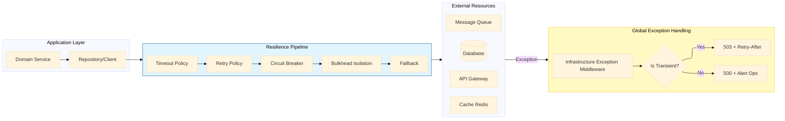

# Clean Architecture Anti-Pattern - Exception: Infrastructure Resilience - Part 6

## Introduction: The Infrastructure Boundary

In **Part 1** of this series, we established the architectural violation of using exceptions for domain outcomes. In **Part 2**, we quantified the performance cost. In **Part 3**, we provided the comprehensive taxonomy distinguishing infrastructure from domain concerns. In **Part 4**, we delivered the complete Result pattern implementation. In **Part 5**, we applied these principles across four real-world domains.

This story addresses the infrastructure layer—the boundary where infrastructure exceptions must be handled with resilience patterns, retry policies, and circuit breakers. The infrastructure layer is where transient failures are managed, permanent failures are escalated, and the domain remains pure and testable.

---

## Key Takeaways from Previous Stories

| Story | Key Takeaway |
|-------|--------------|
| **1. 🏛️ A .NET Developer's Guide - Part 1** | Domain exceptions at presentation boundaries violate Clean Architecture. The Result pattern restores proper layer separation. |
| **2. 🎭 Domain Logic in Disguise - Part 2** | Exceptions for domain outcomes are 28x slower and allocate 10x more memory than Result pattern failures. |
| **3. 🔍 Defining the Boundary - Part 3** | Determinism distinguishes infrastructure (non-deterministic) from domain outcomes (deterministic). |
| **4. ⚙️ Building the Result Pattern - Part 4** | Complete Result<T> and DomainError implementation with functional extensions. |
| **5. 🏢 Across Real-World Domains - Part 5** | Four case studies applying the pattern across payment, inventory, healthcare, and logistics. |

This story builds upon these principles by providing the infrastructure resilience patterns that protect the system from transient failures while maintaining domain purity.

---

## 1. Infrastructure Resilience Architecture

### 1.1 The Resilience Pipeline

The following diagram illustrates the complete infrastructure resilience pipeline:



### 1.2 Design Patterns in Infrastructure Resilience

| Pattern | Application | SOLID Principle |
|---------|-------------|-----------------|
| **Circuit Breaker** | Prevents cascading failures by temporarily blocking calls to failing services | Open/Closed – behavior changes without modifying consumer |
| **Retry Pattern** | Automatically retries transient failures with exponential backoff | Single Responsibility – retry logic separated from business logic |
| **Bulkhead Pattern** | Isolates failures to prevent resource exhaustion | Interface Segregation – isolated resource pools |
| **Timeout Pattern** | Prevents indefinite waiting on external calls | Dependency Inversion – timeouts abstract external dependencies |
| **Fallback Pattern** | Provides graceful degradation when services fail | Liskov Substitution – fallback substitutes failing component |

---

## 2. Infrastructure Exception Types

### 2.1 Complete Exception Hierarchy

```csharp
// Infrastructure/Exceptions/InfrastructureException.cs
// .NET 10: Complete infrastructure exception hierarchy with transient detection
namespace Infrastructure.Exceptions;

/// <summary>
/// Base class for all infrastructure exceptions.
/// Enables centralized handling and classification.
/// </summary>
public abstract class InfrastructureException : Exception
{
    public string ErrorCode { get; }
    public string ReferenceCode { get; } = Guid.NewGuid().ToString();
    public bool IsTransient { get; }
    public string? ServiceName { get; }
    public string? ResourceName { get; }
    
    protected InfrastructureException(
        string message,
        string? errorCode = null,
        bool isTransient = true,
        string? serviceName = null,
        string? resourceName = null,
        Exception? innerException = null)
        : base(message, innerException)
    {
        ErrorCode = errorCode ?? "INFRA_001";
        IsTransient = isTransient;
        ServiceName = serviceName;
        ResourceName = resourceName;
    }
}

/// <summary>
/// Transient infrastructure exceptions that may succeed on retry.
/// </summary>
public class TransientInfrastructureException : InfrastructureException
{
    public TransientInfrastructureException(
        string message,
        string? errorCode = null,
        string? serviceName = null,
        string? resourceName = null,
        Exception? innerException = null)
        : base(message, errorCode, true, serviceName, resourceName, innerException)
    {
    }
    
    public TimeSpan? RetryAfter { get; init; }
    public int RecommendedRetryCount { get; init; } = 3;
    public RetryBackoffType BackoffType { get; init; } = RetryBackoffType.Exponential;
}

/// <summary>
/// Non-transient infrastructure exceptions that require manual intervention.
/// </summary>
public class NonTransientInfrastructureException : InfrastructureException
{
    public NonTransientInfrastructureException(
        string message,
        string? errorCode = null,
        string? serviceName = null,
        string? resourceName = null,
        Exception? innerException = null)
        : base(message, errorCode, false, serviceName, resourceName, innerException)
    {
    }
    
    public string? ResolutionInstructions { get; init; }
    public bool RequiresManualIntervention { get; init; } = true;
    public SeverityLevel Severity { get; init; } = SeverityLevel.Critical;
}

/// <summary>
/// Database-specific infrastructure exceptions.
/// </summary>
public class DatabaseInfrastructureException : TransientInfrastructureException
{
    public int SqlErrorNumber { get; }
    public string? SqlState { get; }
    
    public DatabaseInfrastructureException(
        string message,
        int sqlErrorNumber,
        string? errorCode = null,
        string? sqlState = null,
        Exception? innerException = null)
        : base(message, errorCode ?? $"DB_{sqlErrorNumber}", "Database", null, innerException)
    {
        SqlErrorNumber = sqlErrorNumber;
        SqlState = sqlState;
    }
}

/// <summary>
/// HTTP/External service infrastructure exceptions.
/// </summary>
public class ExternalServiceInfrastructureException : InfrastructureException
{
    public HttpStatusCode? StatusCode { get; }
    
    public ExternalServiceInfrastructureException(
        string serviceName,
        string message,
        HttpStatusCode? statusCode = null,
        bool isTransient = true,
        string? errorCode = null,
        Exception? innerException = null)
        : base(message, errorCode ?? $"EXT_{serviceName.ToUpper()}_001", isTransient, serviceName, null, innerException)
    {
        StatusCode = statusCode;
    }
}

/// <summary>
/// Cache infrastructure exceptions.
/// </summary>
public class CacheInfrastructureException : TransientInfrastructureException
{
    public string? CacheKey { get; }
    public bool ShouldFallbackToPrimary { get; init; } = true;
    
    public CacheInfrastructureException(
        string message,
        string? cacheKey = null,
        string? errorCode = null,
        Exception? innerException = null)
        : base(message, errorCode ?? "CACHE_001", "Redis", cacheKey, innerException)
    {
        CacheKey = cacheKey;
    }
}

/// <summary>
/// Messaging infrastructure exceptions.
/// </summary>
public class MessagingInfrastructureException : InfrastructureException
{
    public string? QueueName { get; }
    public string? MessageId { get; }
    
    public MessagingInfrastructureException(
        string message,
        string? queueName = null,
        string? messageId = null,
        bool isTransient = true,
        string? errorCode = null,
        Exception? innerException = null)
        : base(message, errorCode ?? "MSG_001", isTransient, "MessageBus", queueName, innerException)
    {
        QueueName = queueName;
        MessageId = messageId;
    }
}

public enum RetryBackoffType
{
    Linear,
    Exponential,
    Constant
}

public enum SeverityLevel
{
    Info,
    Warning,
    Error,
    Critical
}
```

---

## 3. Resilience Policies with Polly v8

### 3.1 Complete Resilience Policy Configuration

```csharp
// Infrastructure/Resilience/ResiliencePolicies.cs
// .NET 10: Polly v8 resilience policies with advanced strategies
using Polly;
using Polly.CircuitBreaker;
using Polly.Retry;
using Polly.Timeout;
using Polly.Bulkhead;

namespace Infrastructure.Resilience;

/// <summary>
/// Factory for creating resilience policies.
/// Implements the Factory Pattern for policy creation.
/// </summary>
public static class ResiliencePolicies
{
    private static readonly Random Jitter = new();
    
    /// <summary>
    /// Creates a retry policy with exponential backoff and jitter.
    /// Prevents thundering herd problem on retry.
    /// </summary>
    public static AsyncRetryPolicy<HttpResponseMessage> CreateExponentialRetryPolicy(
        ILogger logger,
        string serviceName,
        int retryCount = 3,
        int baseDelaySeconds = 1)
    {
        // Design Pattern: Retry Pattern with Exponential Backoff
        // SOLID: Open/Closed – policy can be configured without modifying behavior
        
        return Policy<HttpResponseMessage>
            .Handle<HttpRequestException>(ex => IsTransientHttpException(ex))
            .Or<TimeoutException>()
            .Or<TransientInfrastructureException>()
            .WaitAndRetryAsync(
                retryCount,
                retryAttempt => TimeSpan.FromSeconds(
                    Math.Pow(2, retryAttempt) * baseDelaySeconds + Jitter.Next(0, 1000) / 1000.0),
                onRetry: (outcome, timespan, retryCount, context) =>
                {
                    logger.LogWarning(
                        "Retry {RetryCount}/{MaxRetries} for {Service} after {Delay:F1}s. Error: {Error}",
                        retryCount, retryCount, serviceName, timespan.TotalSeconds,
                        outcome.Exception?.Message ?? "Unknown error");
                });
    }
    
    /// <summary>
    /// Creates a circuit breaker policy to prevent cascading failures.
    /// </summary>
    public static AsyncCircuitBreakerPolicy<HttpResponseMessage> CreateCircuitBreakerPolicy(
        ILogger logger,
        string serviceName,
        int exceptionsAllowedBeforeBreaking = 5,
        int durationOfBreakSeconds = 30)
    {
        // Design Pattern: Circuit Breaker Pattern
        // SOLID: Single Responsibility – circuit breaker isolates failure handling
        
        return Policy<HttpResponseMessage>
            .Handle<HttpRequestException>(ex => IsTransientHttpException(ex))
            .Or<TimeoutException>()
            .Or<TransientInfrastructureException>()
            .CircuitBreakerAsync(
                exceptionsAllowedBeforeBreaking: exceptionsAllowedBeforeBreaking,
                durationOfBreak: TimeSpan.FromSeconds(durationOfBreakSeconds),
                onBreak: (ex, timespan) =>
                {
                    logger.LogCritical(ex,
                        "Circuit BREAKER OPEN for {Service} for {Duration}s. {ExceptionsAllowed} failures occurred.",
                        serviceName, timespan.TotalSeconds, exceptionsAllowedBeforeBreaking);
                },
                onReset: () =>
                {
                    logger.LogInformation("Circuit BREAKER RESET for {Service}. Service is operational.", serviceName);
                },
                onHalfOpen: () =>
                {
                    logger.LogInformation("Circuit BREAKER HALF-OPEN for {Service}. Testing recovery.", serviceName);
                });
    }
    
    /// <summary>
    /// Creates a timeout policy for external calls.
    /// </summary>
    public static AsyncTimeoutPolicy CreateTimeoutPolicy(
        ILogger logger,
        string serviceName,
        TimeSpan timeout)
    {
        // Design Pattern: Timeout Pattern
        // SOLID: Dependency Inversion – timeout abstracts external dependency behavior
        
        return Policy.TimeoutAsync(
            timeout,
            TimeoutStrategy.Pessimistic,
            onTimeoutAsync: (context, timespan, task) =>
            {
                logger.LogWarning("Timeout after {Timeout}s for {Service}", timespan.TotalSeconds, serviceName);
                return Task.CompletedTask;
            });
    }
    
    /// <summary>
    /// Creates a bulkhead isolation policy to limit resource consumption.
    /// </summary>
    public static AsyncBulkheadPolicy CreateBulkheadPolicy(
        ILogger logger,
        string serviceName,
        int maxParallelization = 10,
        int maxQueuingActions = 50)
    {
        // Design Pattern: Bulkhead Pattern
        // SOLID: Interface Segregation – isolates resource pools per service
        
        return Policy.BulkheadAsync(
            maxParallelization,
            maxQueuingActions,
            onBulkheadRejectedAsync: (context) =>
            {
                logger.LogWarning(
                    "Bulkhead rejected for {Service}. Max parallel: {MaxParallel}, Queue: {MaxQueue}",
                    serviceName, maxParallelization, maxQueuingActions);
                return Task.CompletedTask;
            });
    }
    
    /// <summary>
    /// Creates a fallback policy for graceful degradation.
    /// </summary>
    public static AsyncFallbackPolicy<HttpResponseMessage> CreateFallbackPolicy(
        ILogger logger,
        string serviceName,
        HttpResponseMessage fallbackResponse)
    {
        // Design Pattern: Fallback Pattern
        // SOLID: Liskov Substitution – fallback substitutes failing component
        
        return Policy<HttpResponseMessage>
            .Handle<Exception>()
            .FallbackAsync(
                fallbackAction: (cancellationToken) => Task.FromResult(fallbackResponse),
                onFallbackAsync: (exception, context) =>
                {
                    logger.LogWarning(exception, "Fallback triggered for {Service}", serviceName);
                    return Task.CompletedTask;
                });
    }
    
    /// <summary>
    /// Creates a complete resilience pipeline combining all policies.
    /// </summary>
    public static IAsyncPolicy<HttpResponseMessage> CreateResiliencePipeline(
        ILogger logger,
        string serviceName,
        ResilienceConfiguration config)
    {
        // Design Pattern: Composite Pattern – combines multiple policies
        // SOLID: Dependency Inversion – abstracts complex policy composition
        
        var policies = new List<IAsyncPolicy<HttpResponseMessage>>();
        
        // Order matters: timeout first, then retry, then circuit breaker
        if (config.EnableTimeout)
        {
            policies.Add(Policy.TimeoutAsync<HttpResponseMessage>(config.Timeout));
        }
        
        if (config.EnableRetry)
        {
            policies.Add(CreateExponentialRetryPolicy(logger, serviceName,
                config.RetryCount, config.RetryBaseDelaySeconds));
        }
        
        if (config.EnableCircuitBreaker)
        {
            policies.Add(CreateCircuitBreakerPolicy(logger, serviceName,
                config.CircuitBreakerFailureThreshold, config.CircuitBreakerDurationSeconds));
        }
        
        if (config.EnableBulkhead)
        {
            policies.Add(Policy.BulkheadAsync<HttpResponseMessage>(
                config.BulkheadMaxParallelization, config.BulkheadMaxQueuing));
        }
        
        if (config.EnableFallback && config.FallbackResponse != null)
        {
            policies.Add(CreateFallbackPolicy(logger, serviceName, config.FallbackResponse));
        }
        
        // Wrap policies in correct order (innermost executes first)
        return policies.Count > 0
            ? Policy.WrapAsync(policies.ToArray())
            : Policy.NoOpAsync<HttpResponseMessage>();
    }
    
    private static bool IsTransientHttpException(HttpRequestException ex)
    {
        return ex.StatusCode switch
        {
            HttpStatusCode.ServiceUnavailable => true,
            HttpStatusCode.GatewayTimeout => true,
            HttpStatusCode.BadGateway => true,
            HttpStatusCode.RequestTimeout => true,
            HttpStatusCode.TooManyRequests => true,
            _ => false
        };
    }
}

/// <summary>
/// Configuration for resilience policies.
/// </summary>
public record ResilienceConfiguration
{
    public bool EnableTimeout { get; init; } = true;
    public TimeSpan Timeout { get; init; } = TimeSpan.FromSeconds(30);
    
    public bool EnableRetry { get; init; } = true;
    public int RetryCount { get; init; } = 3;
    public int RetryBaseDelaySeconds { get; init; } = 1;
    
    public bool EnableCircuitBreaker { get; init; } = true;
    public int CircuitBreakerFailureThreshold { get; init; } = 5;
    public int CircuitBreakerDurationSeconds { get; init; } = 30;
    
    public bool EnableBulkhead { get; init; } = false;
    public int BulkheadMaxParallelization { get; init; } = 10;
    public int BulkheadMaxQueuing { get; init; } = 50;
    
    public bool EnableFallback { get; init; } = false;
    public HttpResponseMessage? FallbackResponse { get; init; }
}
```

---

## 4. Global Infrastructure Exception Middleware

### 4.1 Complete Middleware Implementation

```csharp
// Api/Middleware/InfrastructureExceptionMiddleware.cs
// .NET 10: Global middleware for handling infrastructure exceptions
namespace Api.Middleware;

/// <summary>
/// Middleware that catches infrastructure exceptions and returns appropriate HTTP responses.
/// Implements Chain of Responsibility pattern for exception handling.
/// </summary>
public class InfrastructureExceptionMiddleware
{
    private readonly RequestDelegate _next;
    private readonly ILogger<InfrastructureExceptionMiddleware> _logger;
    private readonly IHostEnvironment _environment;
    
    public InfrastructureExceptionMiddleware(
        RequestDelegate next,
        ILogger<InfrastructureExceptionMiddleware> logger,
        IHostEnvironment environment)
    {
        _next = next;
        _logger = logger;
        _environment = environment;
    }
    
    public async Task InvokeAsync(HttpContext context)
    {
        try
        {
            await _next(context);
        }
        catch (TransientInfrastructureException ex)
        {
            await HandleTransientExceptionAsync(context, ex);
        }
        catch (NonTransientInfrastructureException ex)
        {
            await HandleNonTransientExceptionAsync(context, ex);
        }
        catch (DatabaseInfrastructureException ex)
        {
            await HandleDatabaseExceptionAsync(context, ex);
        }
        catch (ExternalServiceInfrastructureException ex)
        {
            await HandleExternalServiceExceptionAsync(context, ex);
        }
        catch (CacheInfrastructureException ex)
        {
            await HandleCacheExceptionAsync(context, ex);
        }
        catch (TimeoutException ex)
        {
            await HandleTimeoutExceptionAsync(context, ex);
        }
        catch (HttpRequestException ex)
        {
            await HandleHttpRequestExceptionAsync(context, ex);
        }
        catch (SqlException ex)
        {
            await HandleSqlExceptionAsync(context, ex);
        }
        catch (Exception ex)
        {
            await HandleUnknownExceptionAsync(context, ex);
        }
    }
    
    private async Task HandleTransientExceptionAsync(HttpContext context, TransientInfrastructureException ex)
    {
        _logger.LogWarning(ex,
            "Transient infrastructure failure - Service: {Service}, Resource: {Resource}, ErrorCode: {ErrorCode}, Reference: {Reference}",
            ex.ServiceName, ex.ResourceName, ex.ErrorCode, ex.ReferenceCode);
        
        context.Response.StatusCode = StatusCodes.Status503ServiceUnavailable;
        context.Response.Headers.RetryAfter = ex.RetryAfter?.Seconds.ToString() ?? "30";
        
        var problemDetails = new ProblemDetails
        {
            Type = "https://docs.example.com/errors/infrastructure-transient",
            Title = "Service Temporarily Unavailable",
            Status = StatusCodes.Status503ServiceUnavailable,
            Detail = _environment.IsDevelopment() ? ex.Message : "A temporary infrastructure issue occurred. Please retry.",
            Instance = context.Request.Path,
            Extensions =
            {
                ["errorCode"] = ex.ErrorCode,
                ["referenceCode"] = ex.ReferenceCode,
                ["isTransient"] = true,
                ["retryAfterSeconds"] = ex.RetryAfter?.Seconds ?? 30,
                ["service"] = ex.ServiceName,
                ["resource"] = ex.ResourceName
            }
        };
        
        await context.Response.WriteAsJsonAsync(problemDetails);
    }
    
    private async Task HandleNonTransientExceptionAsync(HttpContext context, NonTransientInfrastructureException ex)
    {
        _logger.LogError(ex,
            "Non-transient infrastructure failure - Service: {Service}, Resource: {Resource}, ErrorCode: {ErrorCode}, Reference: {Reference}, Severity: {Severity}",
            ex.ServiceName, ex.ResourceName, ex.ErrorCode, ex.ReferenceCode, ex.Severity);
        
        context.Response.StatusCode = StatusCodes.Status500InternalServerError;
        
        var problemDetails = new ProblemDetails
        {
            Type = "https://docs.example.com/errors/infrastructure-permanent",
            Title = "Infrastructure Error",
            Status = StatusCodes.Status500InternalServerError,
            Detail = _environment.IsDevelopment() ? ex.Message : "A permanent infrastructure issue occurred. Support has been notified.",
            Instance = context.Request.Path,
            Extensions =
            {
                ["errorCode"] = ex.ErrorCode,
                ["referenceCode"] = ex.ReferenceCode,
                ["isTransient"] = false,
                ["requiresManualIntervention"] = ex.RequiresManualIntervention,
                ["service"] = ex.ServiceName
            }
        };
        
        await context.Response.WriteAsJsonAsync(problemDetails);
    }
    
    private async Task HandleDatabaseExceptionAsync(HttpContext context, DatabaseInfrastructureException ex)
    {
        // Determine if this is a transient database error
        var isTransient = ex.SqlErrorNumber switch
        {
            1205 => true,   // Deadlock
            -2 => true,     // Timeout
            53 => true,     // Network connectivity
            64 => true,     // TCP connection failure
            10054 => true,  // Connection reset
            _ => false
        };
        
        if (isTransient)
        {
            _logger.LogWarning(ex,
                "Transient database failure - ErrorNumber: {ErrorNumber}, Reference: {Reference}",
                ex.SqlErrorNumber, ex.ReferenceCode);
            
            context.Response.StatusCode = StatusCodes.Status503ServiceUnavailable;
            context.Response.Headers.RetryAfter = "5";
            
            await context.Response.WriteAsJsonAsync(new ProblemDetails
            {
                Type = "https://docs.example.com/errors/database-transient",
                Title = "Database Temporarily Unavailable",
                Status = StatusCodes.Status503ServiceUnavailable,
                Detail = "A temporary database issue occurred. Please retry.",
                Instance = context.Request.Path,
                Extensions =
                {
                    ["errorCode"] = ex.ErrorCode,
                    ["referenceCode"] = ex.ReferenceCode,
                    ["sqlErrorNumber"] = ex.SqlErrorNumber,
                    ["retryAfterSeconds"] = 5
                }
            });
        }
        else
        {
            _logger.LogError(ex,
                "Non-transient database failure - ErrorNumber: {ErrorNumber}, Reference: {Reference}",
                ex.SqlErrorNumber, ex.ReferenceCode);
            
            context.Response.StatusCode = StatusCodes.Status500InternalServerError;
            
            await context.Response.WriteAsJsonAsync(new ProblemDetails
            {
                Type = "https://docs.example.com/errors/database-permanent",
                Title = "Database Error",
                Status = StatusCodes.Status500InternalServerError,
                Detail = "A database error occurred. Support has been notified.",
                Instance = context.Request.Path,
                Extensions =
                {
                    ["errorCode"] = ex.ErrorCode,
                    ["referenceCode"] = ex.ReferenceCode,
                    ["sqlErrorNumber"] = ex.SqlErrorNumber
                }
            });
        }
    }
    
    private async Task HandleExternalServiceExceptionAsync(HttpContext context, ExternalServiceInfrastructureException ex)
    {
        var statusCode = ex.StatusCode switch
        {
            HttpStatusCode.ServiceUnavailable => StatusCodes.Status503ServiceUnavailable,
            HttpStatusCode.GatewayTimeout => StatusCodes.Status504GatewayTimeout,
            HttpStatusCode.BadGateway => StatusCodes.Status502BadGateway,
            HttpStatusCode.TooManyRequests => StatusCodes.Status429TooManyRequests,
            _ => StatusCodes.Status500InternalServerError
        };
        
        _logger.LogWarning(ex,
            "External service failure - Service: {Service}, StatusCode: {StatusCode}, IsTransient: {IsTransient}, Reference: {Reference}",
            ex.ServiceName, ex.StatusCode, ex.IsTransient, ex.ReferenceCode);
        
        context.Response.StatusCode = statusCode;
        
        if (ex.IsTransient)
        {
            context.Response.Headers.RetryAfter = "30";
        }
        
        await context.Response.WriteAsJsonAsync(new ProblemDetails
        {
            Type = $"https://docs.example.com/errors/external-{ex.ServiceName?.ToLower()}",
            Title = $"External Service Error: {ex.ServiceName}",
            Status = statusCode,
            Detail = _environment.IsDevelopment() ? ex.Message : $"{ex.ServiceName} service is temporarily unavailable.",
            Instance = context.Request.Path,
            Extensions =
            {
                ["service"] = ex.ServiceName,
                ["statusCode"] = (int?)ex.StatusCode,
                ["errorCode"] = ex.ErrorCode,
                ["referenceCode"] = ex.ReferenceCode,
                ["isTransient"] = ex.IsTransient
            }
        });
    }
    
    private async Task HandleCacheExceptionAsync(HttpContext context, CacheInfrastructureException ex)
    {
        _logger.LogWarning(ex,
            "Cache failure - Key: {CacheKey}, Reference: {Reference}, Fallback: {Fallback}",
            ex.CacheKey, ex.ReferenceCode, ex.ShouldFallbackToPrimary);
        
        // Cache failures should not fail the request if fallback is available
        if (ex.ShouldFallbackToPrimary)
        {
            // Log but continue - caller will fallback to primary data source
            // We don't set a response status code here because we're letting the request continue
            _logger.LogInformation("Falling back to primary data source due to cache failure");
            throw; // Re-throw to be handled by caller's fallback logic
        }
        
        context.Response.StatusCode = StatusCodes.Status503ServiceUnavailable;
        
        await context.Response.WriteAsJsonAsync(new ProblemDetails
        {
            Type = "https://docs.example.com/errors/cache-unavailable",
            Title = "Cache Service Unavailable",
            Status = StatusCodes.Status503ServiceUnavailable,
            Detail = "The cache service is temporarily unavailable. Some features may be degraded.",
            Instance = context.Request.Path,
            Extensions =
            {
                ["errorCode"] = ex.ErrorCode,
                ["referenceCode"] = ex.ReferenceCode,
                ["cacheKey"] = ex.CacheKey
            }
        });
    }
    
    private async Task HandleTimeoutExceptionAsync(HttpContext context, TimeoutException ex)
    {
        _logger.LogWarning(ex, "Operation timeout - Reference: {Reference}", Guid.NewGuid());
        
        context.Response.StatusCode = StatusCodes.Status504GatewayTimeout;
        
        await context.Response.WriteAsJsonAsync(new ProblemDetails
        {
            Type = "https://docs.example.com/errors/operation-timeout",
            Title = "Operation Timeout",
            Status = StatusCodes.Status504GatewayTimeout,
            Detail = "The operation did not complete within the allotted time.",
            Instance = context.Request.Path,
            Extensions =
            {
                ["referenceCode"] = Guid.NewGuid().ToString()
            }
        });
    }
    
    private async Task HandleHttpRequestExceptionAsync(HttpContext context, HttpRequestException ex)
    {
        var statusCode = ex.StatusCode switch
        {
            HttpStatusCode.ServiceUnavailable => StatusCodes.Status503ServiceUnavailable,
            HttpStatusCode.GatewayTimeout => StatusCodes.Status504GatewayTimeout,
            HttpStatusCode.BadGateway => StatusCodes.Status502BadGateway,
            HttpStatusCode.NotFound => StatusCodes.Status404NotFound,
            _ => StatusCodes.Status500InternalServerError
        };
        
        _logger.LogError(ex, "HTTP request failure - StatusCode: {StatusCode}", ex.StatusCode);
        
        context.Response.StatusCode = statusCode;
        
        await context.Response.WriteAsJsonAsync(new ProblemDetails
        {
            Type = "https://docs.example.com/errors/http-request-failure",
            Title = "External Service Request Failed",
            Status = statusCode,
            Detail = _environment.IsDevelopment() ? ex.Message : "A request to an external service failed.",
            Instance = context.Request.Path,
            Extensions =
            {
                ["statusCode"] = (int?)ex.StatusCode
            }
        });
    }
    
    private async Task HandleSqlExceptionAsync(HttpContext context, SqlException ex)
    {
        var isDeadlock = ex.Number == 1205;
        var isTimeout = ex.Number == -2;
        var isConnection = ex.Number is 53 or 64 or 10054;
        
        if (isDeadlock || isTimeout || isConnection)
        {
            _logger.LogWarning(ex, "Transient SQL error - Number: {ErrorNumber}, State: {State}",
                ex.Number, ex.State);
            
            context.Response.StatusCode = StatusCodes.Status503ServiceUnavailable;
            context.Response.Headers.RetryAfter = isDeadlock ? "5" : "30";
            
            await context.Response.WriteAsJsonAsync(new ProblemDetails
            {
                Type = "https://docs.example.com/errors/database-transient",
                Title = "Database Temporarily Unavailable",
                Status = StatusCodes.Status503ServiceUnavailable,
                Detail = "A temporary database issue occurred. Please retry.",
                Instance = context.Request.Path,
                Extensions =
                {
                    ["sqlErrorNumber"] = ex.Number,
                    ["isDeadlock"] = isDeadlock,
                    ["retryAfterSeconds"] = isDeadlock ? 5 : 30
                }
            });
        }
        else
        {
            _logger.LogError(ex, "Non-transient SQL error - Number: {ErrorNumber}, State: {State}",
                ex.Number, ex.State);
            
            context.Response.StatusCode = StatusCodes.Status500InternalServerError;
            
            await context.Response.WriteAsJsonAsync(new ProblemDetails
            {
                Type = "https://docs.example.com/errors/database-permanent",
                Title = "Database Error",
                Status = StatusCodes.Status500InternalServerError,
                Detail = "A database error occurred. Support has been notified.",
                Instance = context.Request.Path,
                Extensions =
                {
                    ["sqlErrorNumber"] = ex.Number
                }
            });
        }
    }
    
    private async Task HandleUnknownExceptionAsync(HttpContext context, Exception ex)
    {
        _logger.LogCritical(ex, "Unhandled infrastructure exception - Type: {ExceptionType}, Reference: {Reference}",
            ex.GetType().Name, Guid.NewGuid());
        
        context.Response.StatusCode = StatusCodes.Status500InternalServerError;
        
        await context.Response.WriteAsJsonAsync(new ProblemDetails
        {
            Type = "https://docs.example.com/errors/unhandled-exception",
            Title = "Internal Server Error",
            Status = StatusCodes.Status500InternalServerError,
            Detail = _environment.IsDevelopment() ? ex.ToString() : "An unexpected error occurred.",
            Instance = context.Request.Path,
            Extensions =
            {
                ["referenceCode"] = Guid.NewGuid().ToString(),
                ["exceptionType"] = ex.GetType().Name
            }
        });
    }
}
```

---

## 5. Health Checks and Readiness Probes

### 5.1 Custom Health Checks

```csharp
// Infrastructure/Health/InfrastructureHealthChecks.cs
// .NET 10: Custom health checks for infrastructure dependencies
namespace Infrastructure.Health;

/// <summary>
/// Health check for database connectivity.
/// Implements health check pattern for readiness probes.
/// </summary>
public class DatabaseHealthCheck : IHealthCheck
{
    private readonly ApplicationDbContext _context;
    private readonly ILogger<DatabaseHealthCheck> _logger;
    
    public DatabaseHealthCheck(ApplicationDbContext context, ILogger<DatabaseHealthCheck> logger)
    {
        _context = context;
        _logger = logger;
    }
    
    public async Task<HealthCheckResult> CheckHealthAsync(
        HealthCheckContext context,
        CancellationToken cancellationToken = default)
    {
        try
        {
            // Simple query to test connectivity
            var canConnect = await _context.Database.CanConnectAsync(cancellationToken);
            
            if (canConnect)
            {
                // Check if we can execute a simple query
                await _context.Database.ExecuteSqlRawAsync("SELECT 1", cancellationToken);
                
                return HealthCheckResult.Healthy("Database connection is healthy");
            }
            
            return HealthCheckResult.Unhealthy("Cannot connect to database");
        }
        catch (SqlException ex) when (ex.Number == 1205)
        {
            _logger.LogWarning(ex, "Database deadlock during health check");
            return HealthCheckResult.Degraded("Database is experiencing deadlocks", ex);
        }
        catch (SqlException ex) when (ex.Number == -2)
        {
            _logger.LogWarning(ex, "Database timeout during health check");
            return HealthCheckResult.Degraded("Database timeout", ex);
        }
        catch (Exception ex)
        {
            _logger.LogError(ex, "Database health check failed");
            return HealthCheckResult.Unhealthy("Database health check failed", ex);
        }
    }
}

/// <summary>
/// Health check for Redis cache.
/// </summary>
public class RedisHealthCheck : IHealthCheck
{
    private readonly IConnectionMultiplexer _redis;
    private readonly ILogger<RedisHealthCheck> _logger;
    
    public RedisHealthCheck(IConnectionMultiplexer redis, ILogger<RedisHealthCheck> logger)
    {
        _redis = redis;
        _logger = logger;
    }
    
    public async Task<HealthCheckResult> CheckHealthAsync(
        HealthCheckContext context,
        CancellationToken cancellationToken = default)
    {
        try
        {
            var database = _redis.GetDatabase();
            var pingResult = await database.PingAsync();
            
            if (pingResult.TotalMilliseconds < 100)
            {
                return HealthCheckResult.Healthy($"Redis connected, latency: {pingResult.TotalMilliseconds}ms");
            }
            
            return HealthCheckResult.Degraded($"Redis high latency: {pingResult.TotalMilliseconds}ms");
        }
        catch (RedisConnectionException ex)
        {
            _logger.LogWarning(ex, "Redis connection failed");
            return HealthCheckResult.Unhealthy("Redis connection failed", ex);
        }
        catch (Exception ex)
        {
            _logger.LogError(ex, "Redis health check failed");
            return HealthCheckResult.Unhealthy("Redis health check failed", ex);
        }
    }
}

/// <summary>
/// Health check for external services with circuit breaker state.
/// </summary>
public class ExternalServiceHealthCheck : IHealthCheck
{
    private readonly IHttpClientFactory _httpClientFactory;
    private readonly ILogger<ExternalServiceHealthCheck> _logger;
    private readonly string _serviceName;
    private readonly string _healthEndpoint;
    
    public ExternalServiceHealthCheck(
        IHttpClientFactory httpClientFactory,
        ILogger<ExternalServiceHealthCheck> logger,
        string serviceName,
        string healthEndpoint)
    {
        _httpClientFactory = httpClientFactory;
        _logger = logger;
        _serviceName = serviceName;
        _healthEndpoint = healthEndpoint;
    }
    
    public async Task<HealthCheckResult> CheckHealthAsync(
        HealthCheckContext context,
        CancellationToken cancellationToken = default)
    {
        try
        {
            var client = _httpClientFactory.CreateClient(_serviceName);
            client.Timeout = TimeSpan.FromSeconds(5);
            
            var response = await client.GetAsync(_healthEndpoint, cancellationToken);
            
            if (response.IsSuccessStatusCode)
            {
                return HealthCheckResult.Healthy($"{_serviceName} is healthy");
            }
            
            return HealthCheckResult.Degraded($"{_serviceName} returned {response.StatusCode}");
        }
        catch (HttpRequestException ex) when (ex.StatusCode == HttpStatusCode.ServiceUnavailable)
        {
            _logger.LogWarning(ex, "{Service} is unavailable", _serviceName);
            return HealthCheckResult.Unhealthy($"{_serviceName} is unavailable", ex);
        }
        catch (TimeoutException ex)
        {
            _logger.LogWarning(ex, "{Service} timeout", _serviceName);
            return HealthCheckResult.Degraded($"{_serviceName} timeout", ex);
        }
        catch (Exception ex)
        {
            _logger.LogError(ex, "{Service} health check failed", _serviceName);
            return HealthCheckResult.Unhealthy($"{_serviceName} health check failed", ex);
        }
    }
}
```

### 5.2 Health Check Registration

```csharp
// Api/Program.cs - Health Check Registration
// .NET 10: Health check configuration for infrastructure monitoring

var builder = WebApplication.CreateBuilder(args);

// Add health checks with detailed reporting
builder.Services.AddHealthChecks()
    .AddCheck<DatabaseHealthCheck>(
        "database",
        failureStatus: HealthStatus.Unhealthy,
        tags: new[] { "ready", "live", "database" })
    .AddCheck<RedisHealthCheck>(
        "redis",
        failureStatus: HealthStatus.Degraded,
        tags: new[] { "ready", "cache" })
    .AddCheck(
        "payment-gateway",
        new ExternalServiceHealthCheck(
            builder.Services.BuildServiceProvider().GetRequiredService<IHttpClientFactory>(),
            builder.Services.BuildServiceProvider().GetRequiredService<ILogger<ExternalServiceHealthCheck>>(),
            "PaymentGateway",
            "/health"),
        failureStatus: HealthStatus.Degraded,
        tags: new[] { "ready", "external" });

// Add health check UI for monitoring
builder.Services.AddHealthChecksUI()
    .AddInMemoryStorage();

var app = builder.Build();

// Map health check endpoints
app.MapHealthChecks("/health/ready", new HealthCheckOptions
{
    Predicate = check => check.Tags.Contains("ready"),
    ResponseWriter = WriteHealthCheckResponse
});

app.MapHealthChecks("/health/live", new HealthCheckOptions
{
    Predicate = _ => true, // All checks for liveness
    ResponseWriter = WriteHealthCheckResponse
});

app.MapHealthChecksUI();

static Task WriteHealthCheckResponse(HttpContext context, HealthReport report)
{
    context.Response.ContentType = "application/json";
    
    var response = new
    {
        status = report.Status.ToString(),
        totalDuration = report.TotalDuration.TotalMilliseconds,
        checks = report.Entries.Select(e => new
        {
            name = e.Key,
            status = e.Value.Status.ToString(),
            duration = e.Value.Duration.TotalMilliseconds,
            description = e.Value.Description,
            data = e.Value.Data
        }),
        timestamp = DateTime.UtcNow
    };
    
    return context.Response.WriteAsJsonAsync(response);
}
```

---

## 6. HttpClient Factory with Resilience

### 6.1 Configured HttpClient with Policies

```csharp
// Api/Program.cs - HttpClient Configuration
// .NET 10: Configured HttpClient with resilience policies

var builder = WebApplication.CreateBuilder(args);

// Configure HttpClient with resilience pipeline
builder.Services.AddHttpClient("PaymentGateway", client =>
{
    client.BaseAddress = new Uri(builder.Configuration["PaymentGateway:BaseUrl"]);
    client.Timeout = TimeSpan.FromSeconds(30);
    client.DefaultRequestHeaders.Add("User-Agent", "CleanArchitecture-App");
})
.AddPolicyHandler((services, request) =>
{
    var logger = services.GetRequiredService<ILogger<PaymentGatewayClient>>();
    var config = new ResilienceConfiguration
    {
        EnableTimeout = true,
        Timeout = TimeSpan.FromSeconds(30),
        EnableRetry = true,
        RetryCount = 3,
        RetryBaseDelaySeconds = 1,
        EnableCircuitBreaker = true,
        CircuitBreakerFailureThreshold = 5,
        CircuitBreakerDurationSeconds = 30
    };
    
    return ResiliencePolicies.CreateResiliencePipeline<HttpResponseMessage>(
        logger, "PaymentGateway", config);
})
.AddPolicyHandler((services, request) =>
{
    // Add retry with jitter for transient failures
    var logger = services.GetRequiredService<ILogger<PaymentGatewayClient>>();
    return ResiliencePolicies.CreateExponentialRetryPolicy(logger, "PaymentGateway");
});

// Configure HttpClient for carrier service with fallback
builder.Services.AddHttpClient("CarrierService", client =>
{
    client.BaseAddress = new Uri(builder.Configuration["CarrierService:BaseUrl"]);
    client.Timeout = TimeSpan.FromSeconds(45);
})
.AddPolicyHandler((services, request) =>
{
    var logger = services.GetRequiredService<ILogger<CarrierServiceClient>>();
    var fallbackResponse = new HttpResponseMessage(HttpStatusCode.ServiceUnavailable)
    {
        Content = new StringContent("{\"error\":\"Carrier service unavailable, fallback mode active\"}")
    };
    
    var config = new ResilienceConfiguration
    {
        EnableTimeout = true,
        Timeout = TimeSpan.FromSeconds(45),
        EnableRetry = true,
        RetryCount = 2,
        RetryBaseDelaySeconds = 2,
        EnableCircuitBreaker = true,
        CircuitBreakerFailureThreshold = 3,
        CircuitBreakerDurationSeconds = 60,
        EnableFallback = true,
        FallbackResponse = fallbackResponse
    };
    
    return ResiliencePolicies.CreateResiliencePipeline<HttpResponseMessage>(
        logger, "CarrierService", config);
});
```

---

## 7. Database Resilience with EF Core

### 7.1 Execution Strategy for Retries

```csharp
// Infrastructure/Persistence/DbContextConfiguration.cs
// .NET 10: EF Core execution strategy for database resilience

public static class DbContextConfiguration
{
    public static void ConfigureResilience(this DbContextOptionsBuilder options, IConfiguration configuration)
    {
        var connectionString = configuration.GetConnectionString("DefaultConnection");
        
        options.UseSqlServer(connectionString, sqlOptions =>
        {
            // Configure retry strategy for transient SQL failures
            sqlOptions.EnableRetryOnFailure(
                maxRetryCount: 5,
                maxRetryDelay: TimeSpan.FromSeconds(30),
                errorNumbersToAdd: new[]
                {
                    1205,   // Deadlock
                    -2,     // Timeout
                    53,     // Network connection lost
                    64,     // TCP connection failure
                    10054   // Connection reset
                });
            
            // Command timeout
            sqlOptions.CommandTimeout(30);
            
            // Enable connection resiliency
            sqlOptions.EnableRetryOnFailure();
        });
        
        // Enable sensitive data logging only in development
        if (Environment.GetEnvironmentVariable("ASPNETCORE_ENVIRONMENT") == "Development")
        {
            options.EnableSensitiveDataLogging();
            options.EnableDetailedErrors();
        }
    }
}
```

---

## 8. Circuit Breaker Dashboard

### 8.1 Circuit Breaker State Monitoring

```csharp
// Infrastructure/Resilience/CircuitBreakerMonitor.cs
// .NET 10: Circuit breaker state monitoring for operations dashboards

namespace Infrastructure.Resilience;

public interface ICircuitBreakerMonitor
{
    CircuitBreakerState GetState(string serviceName);
    IReadOnlyDictionary<string, CircuitBreakerState> GetAllStates();
    void RecordSuccess(string serviceName);
    void RecordFailure(string serviceName, Exception exception);
}

public class CircuitBreakerMonitor : ICircuitBreakerMonitor
{
    private readonly ConcurrentDictionary<string, CircuitBreakerMetrics> _metrics = new();
    private readonly ILogger<CircuitBreakerMonitor> _logger;
    
    public CircuitBreakerMonitor(ILogger<CircuitBreakerMonitor> logger)
    {
        _logger = logger;
    }
    
    public CircuitBreakerState GetState(string serviceName)
    {
        return _metrics.TryGetValue(serviceName, out var metrics)
            ? metrics.CurrentState
            : CircuitBreakerState.Closed;
    }
    
    public IReadOnlyDictionary<string, CircuitBreakerState> GetAllStates()
    {
        return _metrics.ToDictionary(kvp => kvp.Key, kvp => kvp.Value.CurrentState);
    }
    
    public void RecordSuccess(string serviceName)
    {
        var metrics = _metrics.GetOrAdd(serviceName, _ => new CircuitBreakerMetrics());
        metrics.RecordSuccess();
        
        if (metrics.CurrentState == CircuitBreakerState.HalfOpen && metrics.ConsecutiveSuccessCount >= 3)
        {
            metrics.TransitionTo(CircuitBreakerState.Closed);
            _logger.LogInformation("Circuit breaker for {Service} closed after {SuccessCount} consecutive successes",
                serviceName, metrics.ConsecutiveSuccessCount);
        }
    }
    
    public void RecordFailure(string serviceName, Exception exception)
    {
        var metrics = _metrics.GetOrAdd(serviceName, _ => new CircuitBreakerMetrics());
        metrics.RecordFailure(exception);
        
        if (metrics.FailureCount >= 5 && metrics.CurrentState == CircuitBreakerState.Closed)
        {
            metrics.TransitionTo(CircuitBreakerState.Open);
            metrics.OpenTime = DateTime.UtcNow;
            _logger.LogCritical(exception, "Circuit breaker for {Service} opened after {FailureCount} failures",
                serviceName, metrics.FailureCount);
        }
        
        if (metrics.CurrentState == CircuitBreakerState.Open &&
            DateTime.UtcNow - metrics.OpenTime > TimeSpan.FromSeconds(30))
        {
            metrics.TransitionTo(CircuitBreakerState.HalfOpen);
            _logger.LogInformation("Circuit breaker for {Service} transitioned to half-open", serviceName);
        }
    }
}

public enum CircuitBreakerState
{
    Closed,
    Open,
    HalfOpen
}

public class CircuitBreakerMetrics
{
    public int FailureCount { get; private set; }
    public int ConsecutiveSuccessCount { get; private set; }
    public CircuitBreakerState CurrentState { get; private set; } = CircuitBreakerState.Closed;
    public DateTime? OpenTime { get; set; }
    public List<Exception> RecentFailures { get; } = new();
    
    public void RecordSuccess()
    {
        ConsecutiveSuccessCount++;
        FailureCount = 0;
    }
    
    public void RecordFailure(Exception exception)
    {
        FailureCount++;
        ConsecutiveSuccessCount = 0;
        RecentFailures.Add(exception);
        
        // Keep only last 10 failures
        while (RecentFailures.Count > 10)
        {
            RecentFailures.RemoveAt(0);
        }
    }
    
    public void TransitionTo(CircuitBreakerState newState)
    {
        CurrentState = newState;
        
        if (newState == CircuitBreakerState.Closed)
        {
            FailureCount = 0;
            ConsecutiveSuccessCount = 0;
            RecentFailures.Clear();
        }
    }
}
```

---

## What We Learned in This Story

| Concept | Key Takeaway |
|---------|--------------|
| **Infrastructure Exception Hierarchy** | Base InfrastructureException with IsTransient flag enables centralized handling. Specific types for database, HTTP, cache, messaging. |
| **Resilience Patterns** | Retry (exponential backoff with jitter), Circuit Breaker (prevents cascading failures), Bulkhead (isolates resource pools), Timeout, Fallback. |
| **Global Middleware** | Chain of Responsibility pattern handles each exception type with appropriate HTTP responses and logging. |
| **Health Checks** | Liveness and readiness probes for Kubernetes/Docker; database, cache, and external service health. |
| **HttpClient Resilience** | Polly policies integrated via AddHttpClient with custom configurations per service. |
| **Database Resilience** | EF Core execution strategies with retry for transient SQL errors (deadlocks, timeouts). |
| **Circuit Breaker Monitoring** | State tracking dashboard for operations visibility. |

---

## Design Patterns & SOLID Principles Summary

| Pattern | Application | SOLID Principle |
|---------|-------------|-----------------|
| **Chain of Responsibility** | Infrastructure exception middleware handles each exception type | Single Responsibility – each handler handles one exception type |
| **Factory Pattern** | ResiliencePolicies creates configured policies | Open/Closed – new policies added without modifying factory |
| **Composite Pattern** | Policy wrapping combines multiple resilience strategies | Liskov Substitution – policies interchangeable |
| **Strategy Pattern** | Different backoff strategies for retry | Interface Segregation – policies implement focused interfaces |
| **Health Check Pattern** | Standardized health reporting for dependencies | Dependency Inversion – health checks abstract infrastructure |

---

## Next Story

The next story in the series covers testing strategies and observability for the Result pattern.

---

**7. 🧪 Clean Architecture Anti-Pattern - Exception: Testing & Observability - Part 7** – Unit testing domain logic without exceptions, integration testing infrastructure failures, structured logging with OpenTelemetry, metrics collection with .NET Meters, and production monitoring dashboards that distinguish domain errors from infrastructure failures.

---

## References to Previous Stories

This story builds upon the principles established in:

**1. 🏛️ Clean Architecture Anti-Pattern - Exception: A .NET Developer's Guide - Part 1** – Architectural violation and decision framework.

**2. 🎭 Clean Architecture Anti-Pattern - Exception: Domain Logic in Disguise - Part 2** – Performance optimization by eliminating exceptions for domain outcomes.

**3. 🔍 Clean Architecture Anti-Pattern - Exception: Defining the Boundary - Part 3** – Taxonomy applied to infrastructure exception classification.

**4. ⚙️ Clean Architecture Anti-Pattern - Exception: Building the Result Pattern - Part 4** – Result<T> implementation used in repositories.

**5. 🏢 Clean Architecture Anti-Pattern - Exception: Across Real-World Domains - Part 5** – Case studies showing infrastructure resilience in action.

---

## Series Overview

1. **🏛️ Clean Architecture Anti-Pattern - Exception: A .NET Developer's Guide - Part 1** – Foundational principles, architectural violation, domain-infrastructure distinction, Result pattern, and decision framework.

2. **🎭 Clean Architecture Anti-Pattern - Exception: Domain Logic in Disguise - Part 2** – Performance implications of exception-based domain logic. Stack trace overhead, GC pressure analysis, and why expected outcomes should never throw exceptions.

3. **🔍 Clean Architecture Anti-Pattern - Exception: Defining the Boundary - Part 3** – Comprehensive taxonomy distinguishing infrastructure exceptions from domain outcomes. Decision matrices and classification patterns across all infrastructure layers.

4. **⚙️ Clean Architecture Anti-Pattern - Exception: Building the Result Pattern - Part 4** – Complete implementation of Result<T> and DomainError with functional extensions. Source generation, .NET 10 features, and API design best practices.

5. **🏢 Clean Architecture Anti-Pattern - Exception: Across Real-World Domains - Part 5** – Four complete case studies: Payment Processing, Inventory Management, Healthcare Scheduling, and Logistics Tracking.

6. **🛡️ Clean Architecture Anti-Pattern - Exception: Infrastructure Resilience - Part 6** – Global exception handling middleware, Polly retry policies, circuit breakers, and health check integration. *(This Story)*

7. **🧪 Clean Architecture Anti-Pattern - Exception: Testing & Observability - Part 7** – Unit testing domain logic without exceptions, infrastructure failure testing, OpenTelemetry, metrics with .NET Meters, and production dashboards.

8. **🚀 Clean Architecture Anti-Pattern - Exception: The Road Ahead - Part 8** – Implementation checklist, migration strategies, .NET 10 roadmap, and Native AOT compatibility.


---
*� Questions? Drop a response - I read and reply to every comment.*
*📌 Save this story to your reading list - it helps other engineers discover it.*
**🔗 Follow me →**
- [**Medium**](mvineetsharma.medium.com) - mvineetsharma.medium.com
- [**LinkedIn**](www.linkedin.com/in/vineet-sharma-architect) -  www.linkedin.com/in/vineet-sharma-architect

*In-depth .NET, Node.js, Python, Cloud Architecture, and System Design. New articles weekly*