# Clean Architecture Anti-Pattern - Exception: Testing & Observability - Part 7
## Unit testing domain logic without exceptions, infrastructure failure testing, OpenTelemetry, metrics with .NET Meters, and production dashboards. *(This Story)*

## Introduction: Trust Through Verification

In **Part 1** of this series, we established the architectural violation of using exceptions for domain outcomes. In **Part 2**, we quantified the performance cost. In **Part 3**, we provided the comprehensive taxonomy. In **Part 4**, we delivered the complete Result pattern implementation. In **Part 5**, we applied these principles across four real-world domains. In **Part 6**, we built infrastructure resilience with Polly and middleware.

This story addresses the final pillars of architectural confidence: **testing** and **observability**. The Result pattern fundamentally changes how we test domain logic—eliminating exception assertions and enabling deterministic, expressive test cases. It also transforms how we observe production systems—distinguishing domain errors (business outcomes) from infrastructure failures (technical issues) with structured logging and metrics.

---

## Key Takeaways from Previous Stories

| Story | Key Takeaway |
|-------|--------------|
| **1. 🏛️ A .NET Developer's Guide - Part 1** | Domain exceptions at presentation boundaries violate Clean Architecture. The Result pattern restores proper layer separation. |
| **2. 🎭 Domain Logic in Disguise - Part 2** | Exceptions for domain outcomes are 28x slower and allocate 10x more memory than Result pattern failures. |
| **3. 🔍 Defining the Boundary - Part 3** | Determinism distinguishes infrastructure (non-deterministic) from domain outcomes (deterministic). |
| **4. ⚙️ Building the Result Pattern - Part 4** | Complete Result<T> and DomainError implementation with functional extensions. |
| **5. 🏢 Across Real-World Domains - Part 5** | Four case studies applying the pattern across payment, inventory, healthcare, and logistics. |
| **6. 🛡️ Infrastructure Resilience - Part 6** | Global middleware, Polly policies, circuit breakers, and health checks. |

This story builds upon these principles by providing the testing strategies and observability patterns that enable teams to trust their implementation.

---

## 1. Testing Architecture with Result Pattern

### 1.1 Test Pyramid for Result Pattern

The following diagram illustrates the testing architecture for applications using the Result pattern:

```mermaid
flowchart TD
    subgraph TestPyramid["Test Pyramid with Result Pattern"]
        direction TB
        E2E[End-to-End Tests<br/>Few, Slow, High Confidence]
        Integration[Integration Tests<br/>Infrastructure + Result Pattern]
        Unit[Unit Tests<br/>Many, Fast, Domain Logic]
    end
    
    subgraph UnitTestFocus["Unit Test Focus"]
        U1[Domain Models] --> U2[State Transitions]
        U2 --> U3[Business Rules]
        U3 --> U4[Result&lt;T&gt; Assertions]
    end
    
    subgraph IntegrationTestFocus["Integration Test Focus"]
        I1[Repositories] --> I2[Infrastructure Exceptions]
        I2 --> I3[Retry Policies]
        I3 --> I4[Circuit Breakers]
        I4 --> I5[Database Constraints]
    end
    
    subgraph Observability["Observability Layer"]
        O1[Structured Logging] --> O2[Domain Errors = Info]
        O2 --> O3[Infrastructure = Warning/Error]
        O3 --> O4[Metrics: Success/Failure Rates]
        O4 --> O5[Alerts: Only Infrastructure]
    end
    
    Unit --> UnitTestFocus
    Integration --> IntegrationTestFocus
    E2E --> Observability
    
    style Unit fill:#c8e6c9,stroke:#2e7d32
    style Integration fill:#fff9c4,stroke:#fbc02d
    style E2E fill:#ffccbc,stroke:#bf360c
```



### 1.2 Design Patterns in Testing

| Pattern | Application | SOLID Principle |
|---------|-------------|-----------------|
| **Test Double Pattern** | Mock repositories to isolate domain logic | Dependency Inversion – test doubles substitute real dependencies |
| **Builder Pattern** | Create complex test data with fluent builders | Single Responsibility – builders separate test data construction |
| **Arrange-Act-Assert** | AAA pattern for test structure | Separation of Concerns – each phase has distinct purpose |
| **Fixture Pattern** | Shared test context for related tests | Open/Closed – fixtures extendable without modification |

---

## 2. Unit Testing Domain Logic

### 2.1 Testing Domain Models with Result Pattern

```csharp
// Tests/Domain/Payment/PaymentTransactionTests.cs
// Unit tests for domain model with Result pattern
namespace Domain.Tests.Payment;

public class PaymentTransactionTests
{
    [Fact]
    public void Create_WithValidParameters_CreatesPaymentWithPendingStatus()
    {
        // Arrange
        var customerId = Guid.NewGuid();
        var amount = 100.00m;
        var currency = "USD";
        var paymentMethod = PaymentMethod.CreditCard;
        var idempotencyKey = "key-123";
        
        // Act
        var payment = PaymentTransaction.Create(
            customerId, amount, currency, paymentMethod, idempotencyKey);
        
        // Assert
        Assert.NotEqual(Guid.Empty, payment.Id);
        Assert.Equal(customerId, payment.CustomerId);
        Assert.Equal(amount, payment.Amount);
        Assert.Equal(currency, payment.Currency);
        Assert.Equal(PaymentStatus.Pending, payment.Status);
        Assert.Equal(idempotencyKey, payment.IdempotencyKey);
        Assert.True(payment.CreatedAt <= DateTime.UtcNow);
    }
    
    [Fact]
    public void MarkAsSuccessful_WhenPending_ReturnsSuccessAndUpdatesStatus()
    {
        // Arrange
        var payment = CreatePendingPayment();
        var gatewayTransactionId = "txn-123";
        
        // Act
        var result = payment.MarkAsSuccessful(gatewayTransactionId);
        
        // Assert - Result pattern assertions (no exceptions!)
        Assert.True(result.IsSuccess);
        Assert.Equal(PaymentStatus.Successful, payment.Status);
        Assert.Equal(gatewayTransactionId, payment.GatewayTransactionId);
        Assert.NotNull(payment.ProcessedAt);
    }
    
    [Fact]
    public void MarkAsSuccessful_WhenAlreadySuccessful_ReturnsBusinessRuleFailure()
    {
        // Arrange
        var payment = CreatePendingPayment();
        payment.MarkAsSuccessful("txn-123");
        
        // Act
        var result = payment.MarkAsSuccessful("txn-456");
        
        // Assert - Domain outcome expressed in Result
        Assert.True(result.IsFailure);
        Assert.Equal(DomainErrorType.BusinessRule, result.Error.Type);
        Assert.Contains("invalid_state", result.Error.Code);
        Assert.Contains("already successful", result.Error.Message);
    }
    
    [Fact]
    public void MarkAsDeclined_WhenPending_ReturnsSuccessAndUpdatesStatus()
    {
        // Arrange
        var payment = CreatePendingPayment();
        var declineReason = "Insufficient funds";
        
        // Act
        var result = payment.MarkAsDeclined(declineReason);
        
        // Assert
        Assert.True(result.IsSuccess);
        Assert.Equal(PaymentStatus.Declined, payment.Status);
        Assert.Equal(declineReason, payment.DeclineReason);
    }
    
    [Fact]
    public void MarkAsFraudSuspected_WithHighRiskScore_UpdatesStatus()
    {
        // Arrange
        var payment = CreatePendingPayment();
        var riskScore = 0.95m;
        
        // Act
        var result = payment.MarkAsFraudSuspected(riskScore);
        
        // Assert
        Assert.True(result.IsSuccess);
        Assert.Equal(PaymentStatus.FraudReview, payment.Status);
        Assert.Equal(riskScore, payment.RiskScore);
    }
    
    private static PaymentTransaction CreatePendingPayment()
    {
        return PaymentTransaction.Create(
            Guid.NewGuid(),
            100.00m,
            "USD",
            PaymentMethod.CreditCard,
            "idempotent-key");
    }
}
```

### 2.2 Testing Domain Services with Result Pattern

```csharp
// Tests/Domain/Services/OrderServiceTests.cs
// Unit tests for domain service with mocked repositories
namespace Domain.Tests.Services;

public class OrderServiceTests
{
    private readonly Mock<IOrderRepository> _orderRepositoryMock;
    private readonly Mock<ICustomerRepository> _customerRepositoryMock;
    private readonly Mock<IProductRepository> _productRepositoryMock;
    private readonly Mock<IInventoryService> _inventoryServiceMock;
    private readonly Mock<IUnitOfWork> _unitOfWorkMock;
    private readonly OrderService _service;
    
    public OrderServiceTests()
    {
        _orderRepositoryMock = new Mock<IOrderRepository>();
        _customerRepositoryMock = new Mock<ICustomerRepository>();
        _productRepositoryMock = new Mock<IProductRepository>();
        _inventoryServiceMock = new Mock<IInventoryService>();
        _unitOfWorkMock = new Mock<IUnitOfWork>();
        
        _service = new OrderService(
            _orderRepositoryMock.Object,
            _customerRepositoryMock.Object,
            _productRepositoryMock.Object,
            _inventoryServiceMock.Object,
            _unitOfWorkMock.Object,
            Mock.Of<ILogger<OrderService>>());
    }
    
    [Fact]
    public async Task CreateAsync_WhenCustomerNotFound_ReturnsNotFoundFailure()
    {
        // Arrange
        var request = new CreateOrderRequest
        {
            CustomerId = Guid.NewGuid(),
            Items = new List<OrderItemRequest>
            {
                new() { ProductId = Guid.NewGuid(), Quantity = 1, UnitPrice = 10.00m }
            }
        };
        
        _customerRepositoryMock
            .Setup(x => x.GetByIdAsync(request.CustomerId, It.IsAny<CancellationToken>()))
            .ReturnsAsync(Result<Customer>.Failure(
                DomainError.NotFound("Customer", request.CustomerId)));
        
        // Act
        var result = await _service.CreateAsync(request, CancellationToken.None);
        
        // Assert - No exception, just result inspection
        Assert.True(result.IsFailure);
        Assert.Equal(DomainErrorType.NotFound, result.Error.Type);
        Assert.Contains(request.CustomerId.ToString(), result.Error.Message);
        
        // Verify no side effects
        _orderRepositoryMock.Verify(
            x => x.AddAsync(It.IsAny<Order>(), It.IsAny<CancellationToken>()),
            Times.Never);
        _unitOfWorkMock.Verify(
            x => x.SaveChangesAsync(It.IsAny<CancellationToken>()),
            Times.Never);
    }
    
    [Fact]
    public async Task CreateAsync_WhenInsufficientCredit_ReturnsBusinessRuleFailure()
    {
        // Arrange
        var customerId = Guid.NewGuid();
        var request = new CreateOrderRequest
        {
            CustomerId = customerId,
            Items = new List<OrderItemRequest>
            {
                new() { ProductId = Guid.NewGuid(), Quantity = 10, UnitPrice = 100.00m } // $1000 total
            }
        };
        
        var customer = new Customer
        {
            Id = customerId,
            AvailableCredit = 500.00m
        };
        
        _customerRepositoryMock
            .Setup(x => x.GetByIdAsync(customerId, It.IsAny<CancellationToken>()))
            .ReturnsAsync(Result<Customer>.Success(customer));
        
        // Act
        var result = await _service.CreateAsync(request, CancellationToken.None);
        
        // Assert
        Assert.True(result.IsFailure);
        Assert.Equal(DomainErrorType.BusinessRule, result.Error.Type);
        Assert.Equal("payment.insufficient_funds", result.Error.Code);
        Assert.Contains("$500.00", result.Error.Message);
        Assert.Contains("$1,000.00", result.Error.Message);
    }
    
    [Fact]
    public async Task CreateAsync_WhenProductOutOfStock_ReturnsConflictFailure()
    {
        // Arrange
        var customerId = Guid.NewGuid();
        var productId = Guid.NewGuid();
        var request = new CreateOrderRequest
        {
            CustomerId = customerId,
            Items = new List<OrderItemRequest>
            {
                new() { ProductId = productId, Quantity = 5, UnitPrice = 10.00m }
            }
        };
        
        var customer = new Customer { Id = customerId, AvailableCredit = 1000.00m };
        var product = new Product { Id = productId, IsDiscontinued = false };
        
        _customerRepositoryMock
            .Setup(x => x.GetByIdAsync(customerId, It.IsAny<CancellationToken>()))
            .ReturnsAsync(Result<Customer>.Success(customer));
        
        _productRepositoryMock
            .Setup(x => x.GetByIdAsync(productId, It.IsAny<CancellationToken>()))
            .ReturnsAsync(Result<Product>.Success(product));
        
        _inventoryServiceMock
            .Setup(x => x.CheckAvailabilityAsync(productId, 5, It.IsAny<CancellationToken>()))
            .ReturnsAsync(Result<AvailabilityResult>.Success(new AvailabilityResult
            {
                IsAvailable = false,
                AvailableQuantity = 2,
                Reason = "Insufficient stock"
            }));
        
        // Act
        var result = await _service.CreateAsync(request, CancellationToken.None);
        
        // Assert
        Assert.True(result.IsFailure);
        Assert.Equal(DomainErrorType.BusinessRule, result.Error.Type);
        Assert.Equal("business.out_of_stock", result.Error.Code);
        Assert.Contains("out of stock", result.Error.Message.ToLower());
        
        // Verify metadata
        Assert.True(result.Error.Metadata.ContainsKey("productId"));
        Assert.True(result.Error.Metadata.ContainsKey("requested"));
        Assert.True(result.Error.Metadata.ContainsKey("available"));
    }
    
    [Fact]
    public async Task CreateAsync_WhenAllValid_ReturnsSuccessWithOrder()
    {
        // Arrange
        var customerId = Guid.NewGuid();
        var productId = Guid.NewGuid();
        var request = new CreateOrderRequest
        {
            CustomerId = customerId,
            Items = new List<OrderItemRequest>
            {
                new() { ProductId = productId, Quantity = 2, UnitPrice = 10.00m }
            },
            ShippingAddress = new Address("123 Main St", "City", "State", "12345")
        };
        
        var customer = new Customer { Id = customerId, AvailableCredit = 1000.00m };
        var product = new Product { Id = productId, IsDiscontinued = false };
        var expectedOrder = new Order { Id = Guid.NewGuid(), CustomerId = customerId };
        
        _customerRepositoryMock
            .Setup(x => x.GetByIdAsync(customerId, It.IsAny<CancellationToken>()))
            .ReturnsAsync(Result<Customer>.Success(customer));
        
        _productRepositoryMock
            .Setup(x => x.GetByIdAsync(productId, It.IsAny<CancellationToken>()))
            .ReturnsAsync(Result<Product>.Success(product));
        
        _inventoryServiceMock
            .Setup(x => x.CheckAvailabilityAsync(productId, 2, It.IsAny<CancellationToken>()))
            .ReturnsAsync(Result<AvailabilityResult>.Success(new AvailabilityResult
            {
                IsAvailable = true,
                AvailableQuantity = 10
            }));
        
        _orderRepositoryMock
            .Setup(x => x.AddAsync(It.IsAny<Order>(), It.IsAny<CancellationToken>()))
            .ReturnsAsync(Result<Order>.Success(expectedOrder));
        
        _inventoryServiceMock
            .Setup(x => x.ReserveAsync(productId, 2, It.IsAny<Guid>(), It.IsAny<CancellationToken>()))
            .ReturnsAsync(Result<Reservation>.Success(new Reservation(
                Guid.NewGuid(), productId, 2, DateTime.UtcNow.AddHours(1))));
        
        _unitOfWorkMock
            .Setup(x => x.SaveChangesAsync(It.IsAny<CancellationToken>()))
            .ReturnsAsync(Result<int>.Success(1));
        
        // Act
        var result = await _service.CreateAsync(request, CancellationToken.None);
        
        // Assert
        Assert.True(result.IsSuccess);
        Assert.Equal(expectedOrder.Id, result.Value.Id);
        
        // Verify all interactions
        _orderRepositoryMock.Verify(x => x.AddAsync(It.IsAny<Order>(), It.IsAny<CancellationToken>()), Times.Once);
        _unitOfWorkMock.Verify(x => x.SaveChangesAsync(It.IsAny<CancellationToken>()), Times.Once);
    }
    
    [Fact]
    public async Task CreateAsync_WithLINQComposition_ProducesCleanTest()
    {
        // This test demonstrates the expressiveness of LINQ query syntax
        // Arrange
        var request = CreateValidRequest();
        SetupSuccessfulDependencies(request);
        
        // Act
        var result = await _service.CreateWithLINQAsync(request, CancellationToken.None);
        
        // Assert - Functional composition yields clear assertions
        result.Match(
            onSuccess: order => Assert.NotNull(order),
            onFailure: error => Assert.Fail($"Unexpected failure: {error.Message}"));
    }
}
```

### 2.3 Testing Result Composition

```csharp
// Tests/Domain/Common/ResultTests.cs
// Unit tests for Result<T> functional composition
namespace Domain.Tests.Common;

public class ResultTests
{
    [Fact]
    public void Map_OnSuccess_TransformsValue()
    {
        // Arrange
        var result = Result<int>.Success(5);
        
        // Act
        var mapped = result.Map(x => x * 2);
        
        // Assert
        Assert.True(mapped.IsSuccess);
        Assert.Equal(10, mapped.Value);
    }
    
    [Fact]
    public void Map_OnFailure_PropagatesError()
    {
        // Arrange
        var error = DomainError.BusinessRule("test.error", "Test error");
        var result = Result<int>.Failure(error);
        
        // Act
        var mapped = result.Map(x => x * 2);
        
        // Assert
        Assert.True(mapped.IsFailure);
        Assert.Equal(error, mapped.Error);
    }
    
    [Fact]
    public void Bind_WithSuccess_ChainsOperations()
    {
        // Arrange
        var result = Result<int>.Success(5);
        
        // Act
        var bound = result.Bind(x => Result<int>.Success(x * 2))
                          .Bind(x => Result<int>.Success(x + 3));
        
        // Assert
        Assert.True(bound.IsSuccess);
        Assert.Equal(13, bound.Value);
    }
    
    [Fact]
    public void Bind_WithFailure_ShortCircuits()
    {
        // Arrange
        var error = DomainError.BusinessRule("test.error", "Test error");
        var result = Result<int>.Success(5);
        
        // Act
        var bound = result.Bind(x => Result<int>.Failure(error))
                          .Bind(x => Result<int>.Success(x * 2));
        
        // Assert
        Assert.True(bound.IsFailure);
        Assert.Equal(error, bound.Error);
    }
    
    [Fact]
    public async Task MatchAsync_ExecutesCorrectBranch()
    {
        // Arrange
        var successResult = Result<int>.Success(10);
        var failureResult = Result<int>.Failure(DomainError.NotFound("Resource", "id"));
        
        // Act
        var successMessage = await successResult.MatchAsync(
            onSuccess: async v => $"Success: {v}",
            onFailure: async e => $"Failure: {e.Code}");
        
        var failureMessage = await failureResult.MatchAsync(
            onSuccess: async v => $"Success: {v}",
            onFailure: async e => $"Failure: {e.Code}");
        
        // Assert
        Assert.Equal("Success: 10", successMessage);
        Assert.Equal("Failure: resource.not_found", failureMessage);
    }
    
    [Fact]
    public void Combine_WithAllSuccess_ReturnsSuccess()
    {
        // Arrange
        var results = new[]
        {
            Result<int>.Success(1),
            Result<int>.Success(2),
            Result<int>.Success(3)
        };
        
        // Act
        var combined = Result.Combine(results);
        
        // Assert
        Assert.True(combined.IsSuccess);
        Assert.Equal(new[] { 1, 2, 3 }, combined.Value);
    }
    
    [Fact]
    public void Combine_WithAnyFailure_ReturnsFirstFailure()
    {
        // Arrange
        var error = DomainError.NotFound("Resource", "id");
        var results = new[]
        {
            Result<int>.Success(1),
            Result<int>.Failure(error),
            Result<int>.Success(3)
        };
        
        // Act
        var combined = Result.Combine(results);
        
        // Assert
        Assert.True(combined.IsFailure);
        Assert.Equal(error, combined.Error);
    }
}
```

---

## 3. Integration Testing Infrastructure

### 3.1 Testing Infrastructure Exceptions

```csharp
// Tests/Integration/Repositories/OrderRepositoryTests.cs
// Integration tests for repository with infrastructure exceptions
namespace Integration.Tests.Repositories;

public class OrderRepositoryTests : IClassFixture<DatabaseFixture>
{
    private readonly DatabaseFixture _fixture;
    private readonly OrderRepository _repository;
    
    public OrderRepositoryTests(DatabaseFixture fixture)
    {
        _fixture = fixture;
        _repository = new OrderRepository(
            _fixture.CreateContext(),
            Mock.Of<ILogger<OrderRepository>>());
    }
    
    [Fact]
    public async Task GetByIdAsync_WhenOrderExists_ReturnsSuccess()
    {
        // Arrange
        var order = await CreateTestOrder();
        
        // Act
        var result = await _repository.GetByIdAsync(order.Id, CancellationToken.None);
        
        // Assert
        Assert.True(result.IsSuccess);
        Assert.Equal(order.Id, result.Value.Id);
    }
    
    [Fact]
    public async Task GetByIdAsync_WhenOrderDoesNotExist_ReturnsNotFoundFailure()
    {
        // Arrange
        var nonExistentId = Guid.NewGuid();
        
        // Act
        var result = await _repository.GetByIdAsync(nonExistentId, CancellationToken.None);
        
        // Assert - Domain outcome from repository
        Assert.True(result.IsFailure);
        Assert.Equal(DomainErrorType.NotFound, result.Error.Type);
        Assert.Contains(nonExistentId.ToString(), result.Error.Message);
    }
    
    [Fact]
    public async Task AddAsync_WithDuplicateOrderNumber_ReturnsConflictFailure()
    {
        // Arrange
        var existingOrder = await CreateTestOrder();
        var duplicateOrder = new Order
        {
            Id = Guid.NewGuid(),
            OrderNumber = existingOrder.OrderNumber, // Duplicate order number
            CustomerId = Guid.NewGuid()
        };
        
        // Act
        var result = await _repository.AddAsync(duplicateOrder, CancellationToken.None);
        
        // Assert - Domain outcome (unique constraint violation mapped to domain)
        Assert.True(result.IsFailure);
        Assert.Equal(DomainErrorType.Conflict, result.Error.Type);
        Assert.Equal("business.duplicate_order", result.Error.Code);
    }
    
    [Fact]
    public async Task AddAsync_WhenDatabaseDeadlockOccurs_ThrowsTransientInfrastructureException()
    {
        // This test requires a simulated deadlock scenario
        // In production, use TestContainers with controlled conditions
        
        // Arrange
        var order = new Order { Id = Guid.NewGuid(), OrderNumber = "TEST-001" };
        
        // Simulate deadlock by running concurrent operations
        // that cause a known deadlock pattern
        
        // Act & Assert
        var exception = await Assert.ThrowsAsync<DatabaseInfrastructureException>(
            async () =>
            {
                // Execute operations that cause deadlock
                await Task.WhenAll(
                    _repository.AddAsync(order, CancellationToken.None),
                    _repository.AddAsync(order, CancellationToken.None));
            });
        
        Assert.Contains("deadlock", exception.Message.ToLower());
        Assert.Equal(1205, exception.SqlErrorNumber);
    }
    
    [Fact]
    public async Task AddAsync_WhenDatabaseTimeoutOccurs_ThrowsTransientInfrastructureException()
    {
        // Arrange
        var order = new Order { Id = Guid.NewGuid(), OrderNumber = "TEST-002" };
        
        // Set a very short command timeout to force timeout
        // This would be configured in the test context
        
        // Act & Assert
        var exception = await Assert.ThrowsAsync<DatabaseInfrastructureException>(
            () => _repository.AddAsync(order, CancellationToken.None));
        
        Assert.Contains("timeout", exception.Message.ToLower());
        Assert.Equal(-2, exception.SqlErrorNumber);
    }
}
```

### 3.2 Testing Resilience Policies

```csharp
// Tests/Integration/Resilience/ResiliencePoliciesTests.cs
// Integration tests for Polly policies
namespace Integration.Tests.Resilience;

public class ResiliencePoliciesTests
{
    private readonly Mock<ILogger> _loggerMock;
    private int _attemptCount;
    
    public ResiliencePoliciesTests()
    {
        _loggerMock = new Mock<ILogger>();
        _attemptCount = 0;
    }
    
    [Fact]
    public async Task RetryPolicy_WithTransientFailure_RetriesAndSucceeds()
    {
        // Arrange
        var policy = ResiliencePolicies.CreateExponentialRetryPolicy<HttpResponseMessage>(
            _loggerMock.Object, "TestService");
        
        var failingCall = new Func<Task<HttpResponseMessage>>(async () =>
        {
            _attemptCount++;
            
            if (_attemptCount < 3)
            {
                throw new HttpRequestException("Service unavailable", null, HttpStatusCode.ServiceUnavailable);
            }
            
            return new HttpResponseMessage(HttpStatusCode.OK);
        });
        
        // Act
        var result = await policy.ExecuteAsync(async () => await failingCall());
        
        // Assert
        Assert.Equal(HttpStatusCode.OK, result.StatusCode);
        Assert.Equal(3, _attemptCount);
        
        // Verify retry logging
        _loggerMock.Verify(
            x => x.Log(
                LogLevel.Warning,
                It.IsAny<EventId>(),
                It.Is<It.IsAnyType>((v, t) => v.ToString().Contains("Retry")),
                It.IsAny<Exception>(),
                It.IsAny<Func<It.IsAnyType, Exception, string>>()),
            Times.Exactly(2));
    }
    
    [Fact]
    public async Task CircuitBreakerPolicy_WithMultipleFailures_OpensCircuit()
    {
        // Arrange
        var policy = ResiliencePolicies.CreateCircuitBreakerPolicy<HttpResponseMessage>(
            _loggerMock.Object, "TestService", exceptionsAllowedBeforeBreaking: 3, durationOfBreakSeconds: 10);
        
        // Act & Assert - First 3 failures
        for (int i = 0; i < 3; i++)
        {
            await Assert.ThrowsAsync<HttpRequestException>(() =>
                policy.ExecuteAsync(() => throw new HttpRequestException("Service unavailable", null, HttpStatusCode.ServiceUnavailable)));
        }
        
        // Fourth call should throw circuit breaker exception
        var exception = await Assert.ThrowsAsync<BrokenCircuitException>(() =>
            policy.ExecuteAsync(() => Task.FromResult(new HttpResponseMessage(HttpStatusCode.OK))));
        
        Assert.Contains("circuit", exception.Message.ToLower());
        
        // Verify circuit breaker logging
        _loggerMock.Verify(
            x => x.Log(
                LogLevel.Critical,
                It.IsAny<EventId>(),
                It.Is<It.IsAnyType>((v, t) => v.ToString().Contains("BREAKER OPEN")),
                It.IsAny<Exception>(),
                It.IsAny<Func<It.IsAnyType, Exception, string>>()),
            Times.Once);
    }
    
    [Fact]
    public async Task FallbackPolicy_WhenServiceFails_ReturnsFallbackResponse()
    {
        // Arrange
        var fallbackResponse = new HttpResponseMessage(HttpStatusCode.ServiceUnavailable)
        {
            Content = new StringContent("{\"error\":\"Fallback response\"}")
        };
        
        var policy = ResiliencePolicies.CreateFallbackPolicy(
            _loggerMock.Object, "TestService", fallbackResponse);
        
        // Act
        var result = await policy.ExecuteAsync(() =>
            throw new HttpRequestException("Service unavailable", null, HttpStatusCode.ServiceUnavailable));
        
        // Assert
        Assert.Equal(HttpStatusCode.ServiceUnavailable, result.StatusCode);
        var content = await result.Content.ReadAsStringAsync();
        Assert.Contains("Fallback response", content);
        
        // Verify fallback logging
        _loggerMock.Verify(
            x => x.Log(
                LogLevel.Warning,
                It.IsAny<EventId>(),
                It.Is<It.IsAnyType>((v, t) => v.ToString().Contains("Fallback")),
                It.IsAny<Exception>(),
                It.IsAny<Func<It.IsAnyType, Exception, string>>()),
            Times.Once);
    }
}
```

---

## 4. Observability with Structured Logging

### 4.1 Domain vs Infrastructure Logging

```csharp
// Infrastructure/Logging/ResultLoggingExtensions.cs
// Structured logging for domain outcomes vs infrastructure exceptions
namespace Infrastructure.Logging;

public static class ResultLoggingExtensions
{
    // Domain outcome logging (INFO level)
    public static Result<T> LogDomainFailure<T>(
        this Result<T> result,
        ILogger logger,
        string operation,
        object? context = null)
    {
        if (result.IsFailure)
        {
            using (logger.BeginScope(new Dictionary<string, object>
            {
                ["OperationType"] = "Domain",
                ["Operation"] = operation,
                ["ErrorCode"] = result.Error.Code,
                ["ErrorType"] = result.Error.Type.ToString(),
                ["CorrelationId"] = Activity.Current?.Id ?? Guid.NewGuid().ToString(),
                ["Context"] = context ?? new { }
            }))
            {
                logger.LogInformation(
                    "Domain operation '{Operation}' failed: {ErrorCode} - {ErrorMessage}",
                    operation, result.Error.Code, result.Error.Message);
            }
        }
        
        return result;
    }
    
    public static async Task<Result<T>> LogDomainFailureAsync<T>(
        this Task<Result<T>> task,
        ILogger logger,
        string operation,
        object? context = null)
    {
        var result = await task;
        return result.LogDomainFailure(logger, operation, context);
    }
    
    // Domain success logging (INFO level)
    public static Result<T> LogDomainSuccess<T>(
        this Result<T> result,
        ILogger logger,
        string operation,
        object? context = null)
    {
        if (result.IsSuccess)
        {
            using (logger.BeginScope(new Dictionary<string, object>
            {
                ["OperationType"] = "Domain",
                ["Operation"] = operation,
                ["CorrelationId"] = Activity.Current?.Id ?? Guid.NewGuid().ToString(),
                ["Context"] = context ?? new { }
            }))
            {
                logger.LogInformation(
                    "Domain operation '{Operation}' completed successfully",
                    operation);
            }
        }
        
        return result;
    }
    
    // Infrastructure exception logging (WARNING/ERROR level)
    public static void LogInfrastructureException(
        this ILogger logger,
        InfrastructureException ex,
        string operation,
        object? context = null)
    {
        var level = ex.IsTransient ? LogLevel.Warning : LogLevel.Error;
        
        using (logger.BeginScope(new Dictionary<string, object>
        {
            ["OperationType"] = "Infrastructure",
            ["Operation"] = operation,
            ["ErrorCode"] = ex.ErrorCode,
            ["ReferenceCode"] = ex.ReferenceCode,
            ["IsTransient"] = ex.IsTransient,
            ["ServiceName"] = ex.ServiceName,
            ["ResourceName"] = ex.ResourceName,
            ["CorrelationId"] = Activity.Current?.Id ?? Guid.NewGuid().ToString(),
            ["Context"] = context ?? new { }
        }))
        {
            logger.Log(
                level,
                ex,
                "Infrastructure operation '{Operation}' failed: {ErrorCode} - {Message}",
                operation, ex.ErrorCode, ex.Message);
        }
    }
    
    // Batch logging for multiple results
    public static void LogDomainResults<T>(
        this IEnumerable<Result<T>> results,
        ILogger logger,
        string operation)
    {
        var failures = results.Where(r => r.IsFailure).ToList();
        
        if (failures.Any())
        {
            logger.LogWarning(
                "Domain operation '{Operation}' completed with {FailureCount} failures out of {TotalCount}",
                operation, failures.Count, results.Count());
            
            foreach (var failure in failures)
            {
                logger.LogInformation(
                    "  Failure: {ErrorCode} - {ErrorMessage}",
                    failure.Error.Code, failure.Error.Message);
            }
        }
        else
        {
            logger.LogInformation(
                "Domain operation '{Operation}' completed successfully for all {TotalCount} items",
                operation, results.Count());
        }
    }
}
```

### 4.2 OpenTelemetry Integration

```csharp
// Infrastructure/Observability/TelemetryConfiguration.cs
// .NET 10: OpenTelemetry configuration for distributed tracing
namespace Infrastructure.Observability;

public static class TelemetryConfiguration
{
    public static IServiceCollection AddObservability(
        this IServiceCollection services,
        IConfiguration configuration)
    {
        var serviceName = configuration["ServiceName"] ?? "CleanArchitecture";
        var serviceVersion = typeof(Program).Assembly.GetName().Version?.ToString() ?? "1.0.0";
        
        services.AddOpenTelemetry()
            .WithMetrics(metrics => metrics
                .AddAspNetCoreInstrumentation()
                .AddHttpClientInstrumentation()
                .AddRuntimeInstrumentation()
                .AddMeter("Domain.*")
                .AddMeter("Infrastructure.*")
                .AddView("http.server.duration", new ExplicitBucketHistogramConfiguration
                {
                    Boundaries = new[] { 0, 0.005, 0.01, 0.025, 0.05, 0.075, 0.1, 0.25, 0.5, 0.75, 1, 2.5, 5, 10 }
                }))
            .WithTracing(tracing => tracing
                .AddAspNetCoreInstrumentation(options =>
                {
                    options.RecordException = true;
                    options.Filter = httpContext =>
                    {
                        // Filter out health checks
                        return !httpContext.Request.Path.StartsWithSegments("/health");
                    };
                })
                .AddHttpClientInstrumentation()
                .AddSqlClientInstrumentation(options =>
                {
                    options.SetDbStatementForText = true;
                    options.RecordException = true;
                })
                .AddSource("Domain.*")
                .AddSource("Infrastructure.*")
                .AddConsoleExporter()
                .AddOtlpExporter(options =>
                {
                    options.Endpoint = new Uri(configuration["Otlp:Endpoint"] ?? "http://localhost:4317");
                }));
        
        return services;
    }
}

// Activity source for domain operations
public static class DomainActivitySource
{
    public static readonly ActivitySource Source = new(
        "Domain.ECommerce",
        "1.0.0");
}

// Activity helper for domain operations
public static class DomainActivity
{
    public static IDisposable StartDomainOperation(string operation, object? context = null)
    {
        var activity = DomainActivitySource.Source.StartActivity(operation, ActivityKind.Internal);
        
        if (activity != null && context != null)
        {
            foreach (var prop in context.GetType().GetProperties())
            {
                activity.SetTag($"context.{prop.Name}", prop.GetValue(context)?.ToString());
            }
        }
        
        return activity;
    }
    
    public static void SetDomainOutcome(this Activity? activity, Result result)
    {
        if (activity == null) return;
        
        activity.SetTag("domain.success", result.IsSuccess);
        
        if (result.IsFailure)
        {
            activity.SetTag("domain.error.code", result.Error.Code);
            activity.SetTag("domain.error.type", result.Error.Type.ToString());
            activity.SetTag("domain.error.message", result.Error.Message);
        }
    }
}
```

---

## 5. Metrics Collection with .NET Meters

### 5.1 Domain Metrics

```csharp
// Infrastructure/Metrics/DomainMetrics.cs
// .NET 10: Metrics collection for domain operations
namespace Infrastructure.Metrics;

public class DomainMetrics
{
    private readonly Counter<int> _domainOperationsCounter;
    private readonly Counter<int> _domainErrorsCounter;
    private readonly Histogram<double> _domainOperationDuration;
    private readonly UpDownCounter<int> _activeDomainOperations;
    
    public DomainMetrics(IMeterFactory meterFactory)
    {
        var meter = meterFactory.Create("Domain.ECommerce", "1.0.0");
        
        _domainOperationsCounter = meter.CreateCounter<int>(
            name: "domain.operations.total",
            unit: "{operation}",
            description: "Total number of domain operations executed");
        
        _domainErrorsCounter = meter.CreateCounter<int>(
            name: "domain.errors.total",
            unit: "{error}",
            description: "Total number of domain errors by type");
        
        _domainOperationDuration = meter.CreateHistogram<double>(
            name: "domain.operation.duration",
            unit: "ms",
            description: "Duration of domain operations in milliseconds");
        
        _activeDomainOperations = meter.CreateUpDownCounter<int>(
            name: "domain.operations.active",
            unit: "{operation}",
            description: "Number of active domain operations");
    }
    
    public void RecordDomainOperation(
        string operation,
        bool success,
        TimeSpan duration,
        string? errorCode = null)
    {
        _domainOperationsCounter.Add(1,
            new KeyValuePair<string, object?>("operation", operation),
            new KeyValuePair<string, object?>("success", success));
        
        _domainOperationDuration.Record(
            duration.TotalMilliseconds,
            new KeyValuePair<string, object?>("operation", operation),
            new KeyValuePair<string, object?>("success", success));
        
        if (!success && errorCode != null)
        {
            _domainErrorsCounter.Add(1,
                new KeyValuePair<string, object?>("operation", operation),
                new KeyValuePair<string, object?>("errorCode", errorCode));
        }
    }
    
    public IDisposable TrackActiveOperation(string operation)
    {
        _activeDomainOperations.Add(1,
            new KeyValuePair<string, object?>("operation", operation));
        
        return new DelegateDisposable(() =>
        {
            _activeDomainOperations.Add(-1,
                new KeyValuePair<string, object?>("operation", operation));
        });
    }
}

// Infrastructure metrics
public class InfrastructureMetrics
{
    private readonly Counter<int> _infrastructureCallsCounter;
    private readonly Counter<int> _infrastructureErrorsCounter;
    private readonly Histogram<double> _infrastructureCallDuration;
    private readonly UpDownCounter<int> _circuitBreakerState;
    
    public InfrastructureMetrics(IMeterFactory meterFactory)
    {
        var meter = meterFactory.Create("Infrastructure.ECommerce", "1.0.0");
        
        _infrastructureCallsCounter = meter.CreateCounter<int>(
            name: "infrastructure.calls.total",
            unit: "{call}",
            description: "Total number of infrastructure calls");
        
        _infrastructureErrorsCounter = meter.CreateCounter<int>(
            name: "infrastructure.errors.total",
            unit: "{error}",
            description: "Total number of infrastructure errors by type");
        
        _infrastructureCallDuration = meter.CreateHistogram<double>(
            name: "infrastructure.call.duration",
            unit: "ms",
            description: "Duration of infrastructure calls in milliseconds");
        
        _circuitBreakerState = meter.CreateUpDownCounter<int>(
            name: "infrastructure.circuitbreaker.state",
            unit: "{state}",
            description: "Circuit breaker state (0=Closed, 1=Open, 2=HalfOpen)");
    }
    
    public void RecordInfrastructureCall(
        string service,
        string operation,
        bool success,
        TimeSpan duration,
        bool isTransient = false,
        string? errorCode = null)
    {
        _infrastructureCallsCounter.Add(1,
            new KeyValuePair<string, object?>("service", service),
            new KeyValuePair<string, object?>("operation", operation),
            new KeyValuePair<string, object?>("success", success));
        
        _infrastructureCallDuration.Record(
            duration.TotalMilliseconds,
            new KeyValuePair<string, object?>("service", service),
            new KeyValuePair<string, object?>("operation", operation),
            new KeyValuePair<string, object?>("success", success));
        
        if (!success)
        {
            _infrastructureErrorsCounter.Add(1,
                new KeyValuePair<string, object?>("service", service),
                new KeyValuePair<string, object?>("operation", operation),
                new KeyValuePair<string, object?>("errorCode", errorCode ?? "unknown"),
                new KeyValuePair<string, object?>("isTransient", isTransient));
        }
    }
    
    public void RecordCircuitBreakerState(string service, CircuitBreakerState state)
    {
        var stateValue = state switch
        {
            CircuitBreakerState.Closed => 0,
            CircuitBreakerState.Open => 1,
            CircuitBreakerState.HalfOpen => 2,
            _ => -1
        };
        
        _circuitBreakerState.Add(stateValue,
            new KeyValuePair<string, object?>("service", service));
    }
}

internal class DelegateDisposable : IDisposable
{
    private readonly Action _onDispose;
    
    public DelegateDisposable(Action onDispose)
    {
        _onDispose = onDispose;
    }
    
    public void Dispose() => _onDispose();
}
```

### 5.2 Metric-Aware Domain Service

```csharp
// Domain/Services/OrderServiceWithMetrics.cs
// Domain service with integrated metrics
namespace Domain.Services;

public class OrderServiceWithMetrics : IOrderService
{
    private readonly IOrderService _inner;
    private readonly DomainMetrics _metrics;
    private readonly ILogger<OrderServiceWithMetrics> _logger;
    
    public OrderServiceWithMetrics(
        IOrderService inner,
        DomainMetrics metrics,
        ILogger<OrderServiceWithMetrics> logger)
    {
        _inner = inner;
        _metrics = metrics;
        _logger = logger;
    }
    
    public async Task<Result<Order>> CreateAsync(CreateOrderRequest request, CancellationToken ct)
    {
        using var activity = DomainActivity.StartDomainOperation("Order.Create", new { request.CustomerId });
        using var tracking = _metrics.TrackActiveOperation("Order.Create");
        
        var stopwatch = Stopwatch.StartNew();
        
        var result = await _inner.CreateAsync(request, ct);
        
        stopwatch.Stop();
        
        activity?.SetDomainOutcome(result);
        
        _metrics.RecordDomainOperation(
            operation: "Order.Create",
            success: result.IsSuccess,
            duration: stopwatch.Elapsed,
            errorCode: result.IsFailure ? result.Error.Code : null);
        
        result.LogDomainFailure(_logger, "Order.Create", new { request.CustomerId });
        
        return result;
    }
}
```

---

## 6. Alerting and Dashboard Configuration

### 6.1 Alert Rules

```yaml
# prometheus/alerts.yml
# Alerting rules for domain vs infrastructure

groups:
  - name: domain_alerts
    interval: 5m
    rules:
      # Domain error rate monitoring (no alert - business as usual)
      - record: domain:error_rate:5m
        expr: |
          sum(rate(domain_errors_total[5m])) 
          / 
          sum(rate(domain_operations_total[5m]))
      
      # No alert for domain errors - they are expected business outcomes
      # Business metrics are tracked in dashboards, not paged

  - name: infrastructure_alerts
    interval: 1m
    rules:
      # Infrastructure error rate - page if high
      - alert: HighInfrastructureErrorRate
        expr: |
          sum(rate(infrastructure_errors_total[5m]))
          >
          0.1
        for: 2m
        labels:
          severity: critical
        annotations:
          summary: "High infrastructure error rate"
          description: "Infrastructure error rate is {{ $value }} errors per second"
      
      # Circuit breaker open - page immediately
      - alert: CircuitBreakerOpen
        expr: |
          infrastructure_circuitbreaker_state == 1
        for: 0s
        labels:
          severity: critical
        annotations:
          summary: "Circuit breaker open for {{ $labels.service }}"
          description: "Circuit breaker for {{ $labels.service }} has opened"
      
      # Database deadlocks - page if frequent
      - alert: FrequentDatabaseDeadlocks
        expr: |
          increase(database_deadlock_total[5m]) > 5
        labels:
          severity: warning
        annotations:
          summary: "Frequent database deadlocks detected"
          description: "{{ $value }} deadlocks in last 5 minutes"
      
      # Service unavailable - page immediately
      - alert: ExternalServiceUnavailable
        expr: |
          infrastructure_errors_total{
            errorCode=~"EXT_.*_503|EXT_.*_TIMEOUT"
          } > 0
        for: 1m
        labels:
          severity: critical
        annotations:
          summary: "External service {{ $labels.service }} unavailable"
          description: "Service {{ $labels.service }} is returning errors"
```

### 6.2 Grafana Dashboard Configuration

```json
{
  "dashboard": {
    "title": "Clean Architecture - Domain vs Infrastructure",
    "panels": [
      {
        "title": "Domain Operations",
        "type": "graph",
        "targets": [
          {
            "expr": "sum(rate(domain_operations_total[5m])) by (operation)",
            "legendFormat": "{{ operation }}"
          }
        ]
      },
      {
        "title": "Domain Error Rate (Info - No Alert)",
        "type": "graph",
        "targets": [
          {
            "expr": "sum(rate(domain_errors_total[5m])) by (errorCode)",
            "legendFormat": "{{ errorCode }}"
          }
        ]
      },
      {
        "title": "Infrastructure Calls",
        "type": "graph",
        "targets": [
          {
            "expr": "sum(rate(infrastructure_calls_total[5m])) by (service)",
            "legendFormat": "{{ service }}"
          }
        ]
      },
      {
        "title": "Infrastructure Error Rate (Alert)",
        "type": "graph",
        "targets": [
          {
            "expr": "sum(rate(infrastructure_errors_total[5m])) by (service)",
            "legendFormat": "{{ service }}"
          }
        ],
        "alert": {
          "conditions": [
            {
              "type": "query",
              "query": {
                "params": ["A", "5m", "now"]
              },
              "evaluator": {
                "type": "gt",
                "params": [0.1]
              }
            }
          ]
        }
      },
      {
        "title": "Circuit Breaker States",
        "type": "stat",
        "targets": [
          {
            "expr": "infrastructure_circuitbreaker_state",
            "legendFormat": "{{ service }}"
          }
        ]
      },
      {
        "title": "Domain Operation Duration (p95)",
        "type": "heatmap",
        "targets": [
          {
            "expr": "histogram_quantile(0.95, sum(rate(domain_operation_duration_bucket[5m])) by (le, operation))"
          }
        ]
      }
    ]
  }
}
```

---

## 7. Complete Test Automation Pattern

### 7.1 Test Builder Pattern for Domain Models

```csharp
// Tests/Builders/OrderBuilder.cs
// Builder pattern for creating test data
namespace Tests.Builders;

public class OrderBuilder
{
    private Guid _id = Guid.NewGuid();
    private Guid _customerId = Guid.NewGuid();
    private List<OrderItem> _items = new();
    private Address _shippingAddress = new("123 Main St", "City", "State", "12345");
    private OrderStatus _status = OrderStatus.Pending;
    
    public OrderBuilder WithId(Guid id)
    {
        _id = id;
        return this;
    }
    
    public OrderBuilder WithCustomerId(Guid customerId)
    {
        _customerId = customerId;
        return this;
    }
    
    public OrderBuilder WithItem(Guid productId, int quantity, decimal unitPrice)
    {
        _items.Add(new OrderItem(productId, quantity, unitPrice));
        return this;
    }
    
    public OrderBuilder WithStatus(OrderStatus status)
    {
        _status = status;
        return this;
    }
    
    public Order Build()
    {
        var order = Order.Create(_customerId, _items, _shippingAddress);
        
        // Use reflection to set private fields if needed for specific test scenarios
        // Or expose internal constructors for testing (InternalsVisibleTo)
        
        return order;
    }
    
    public static implicit operator Order(OrderBuilder builder) => builder.Build();
}
```

### 7.2 Test Data Fixture

```csharp
// Tests/Fixtures/DomainFixture.cs
// Fixture pattern for shared test data
namespace Tests.Fixtures;

public class DomainFixture : IDisposable
{
    public DomainFixture()
    {
        // Initialize test data
        ValidCustomer = new CustomerBuilder()
            .WithId(Guid.NewGuid())
            .WithCreditLimit(1000m)
            .WithDiscountRate(0.10m)
            .Build();
        
        ValidProduct = new ProductBuilder()
            .WithId(Guid.NewGuid())
            .WithName("Test Product")
            .WithPrice(10.00m)
            .WithStock(100)
            .Build();
        
        ValidOrderRequest = new CreateOrderRequest
        {
            CustomerId = ValidCustomer.Id,
            Items = new List<OrderItemRequest>
            {
                new() { ProductId = ValidProduct.Id, Quantity = 2, UnitPrice = 10.00m }
            },
            ShippingAddress = new Address("123 Main St", "City", "State", "12345")
        };
    }
    
    public Customer ValidCustomer { get; }
    public Product ValidProduct { get; }
    public CreateOrderRequest ValidOrderRequest { get; }
    
    public void Dispose()
    {
        // Cleanup if needed
    }
}

// Usage in tests
public class OrderServiceTests : IClassFixture<DomainFixture>
{
    private readonly DomainFixture _fixture;
    
    public OrderServiceTests(DomainFixture fixture)
    {
        _fixture = fixture;
    }
    
    [Fact]
    public async Task CreateAsync_WithValidRequest_ReturnsSuccess()
    {
        // Use fixture data
        var result = await _service.CreateAsync(_fixture.ValidOrderRequest);
        
        Assert.True(result.IsSuccess);
    }
}
```

---

## What We Learned in This Story

| Concept | Key Takeaway |
|---------|--------------|
| **Unit Testing Domain Models** | Result pattern eliminates exception assertions; test outcomes directly with `Assert.True(result.IsFailure)` |
| **Testing Domain Services** | Mock repositories return `Result<T>`; test both success and failure paths without try-catch |
| **Testing Result Composition** | Map, Bind, Match, and Combine enable functional testing of composed operations |
| **Integration Testing** | Infrastructure exceptions thrown; domain outcomes returned; test both with expected assertions |
| **Structured Logging** | Domain errors logged at INFO level; infrastructure exceptions at WARNING/ERROR |
| **OpenTelemetry** | Distributed tracing with activity tags for domain outcomes and error codes |
| **Metrics Collection** | Separate metrics for domain (business) and infrastructure (technical) with appropriate alerting |
| **Alerting Strategy** | No alerts for domain errors (expected business outcomes); page only for infrastructure failures |
| **Test Patterns** | Builder pattern, fixture pattern, and AAA pattern for clean, maintainable tests |

---

## Design Patterns & SOLID Principles Summary

| Pattern | Application | SOLID Principle |
|---------|-------------|-----------------|
| **Test Double Pattern** | Mock repositories isolate domain logic | Dependency Inversion – test doubles substitute real dependencies |
| **Builder Pattern** | OrderBuilder constructs complex test data | Single Responsibility – builders separate test data construction |
| **Fixture Pattern** | DomainFixture provides shared test context | Open/Closed – fixtures extensible without modification |
| **AAA Pattern** | Arrange-Act-Assert for test structure | Separation of Concerns – each phase has distinct purpose |
| **Decorator Pattern** | Metrics decorator wraps domain services | Open/Closed – metrics added without modifying domain logic |

---

## Next Story

The final story in the series provides the implementation roadmap and future considerations.

---

**8. 🚀 Clean Architecture Anti-Pattern - Exception: The Road Ahead - Part 8** – Implementation checklist for adopting the Result pattern in existing codebases, migration strategies for legacy systems, architectural evolution patterns, .NET 10 feature roadmap, Native AOT compatibility considerations, and long-term maintenance benefits.

---

## References to Previous Stories

This story builds upon the principles established in:

**1. 🏛️ Clean Architecture Anti-Pattern - Exception: A .NET Developer's Guide - Part 1** – Architectural violation and decision framework.

**2. 🎭 Clean Architecture Anti-Pattern - Exception: Domain Logic in Disguise - Part 2** – Performance optimization by eliminating exceptions.

**3. 🔍 Clean Architecture Anti-Pattern - Exception: Defining the Boundary - Part 3** – Taxonomy applied to test classification.

**4. ⚙️ Clean Architecture Anti-Pattern - Exception: Building the Result Pattern - Part 4** – Result<T> implementation used in tests.

**5. 🏢 Clean Architecture Anti-Pattern - Exception: Across Real-World Domains - Part 5** – Case studies providing test scenarios.

**6. 🛡️ Clean Architecture Anti-Pattern - Exception: Infrastructure Resilience - Part 6** – Infrastructure testing patterns.

---

## Series Overview

1. **🏛️ Clean Architecture Anti-Pattern - Exception: A .NET Developer's Guide - Part 1** – Foundational principles, architectural violation, domain-infrastructure distinction, Result pattern, and decision framework.

2. **🎭 Clean Architecture Anti-Pattern - Exception: Domain Logic in Disguise - Part 2** – Performance implications of exception-based domain logic. Stack trace overhead, GC pressure analysis, and why expected outcomes should never throw exceptions.

3. **🔍 Clean Architecture Anti-Pattern - Exception: Defining the Boundary - Part 3** – Comprehensive taxonomy distinguishing infrastructure exceptions from domain outcomes. Decision matrices and classification patterns across all infrastructure layers.

4. **⚙️ Clean Architecture Anti-Pattern - Exception: Building the Result Pattern - Part 4** – Complete implementation of Result<T> and DomainError with functional extensions. Source generation, .NET 10 features, and API design best practices.

5. **🏢 Clean Architecture Anti-Pattern - Exception: Across Real-World Domains - Part 5** – Four complete case studies: Payment Processing, Inventory Management, Healthcare Scheduling, and Logistics Tracking.

6. **🛡️ Clean Architecture Anti-Pattern - Exception: Infrastructure Resilience - Part 6** – Global exception handling middleware, Polly retry policies, circuit breakers, and health check integration.

7. **🧪 Clean Architecture Anti-Pattern - Exception: Testing & Observability - Part 7** – Unit testing domain logic without exceptions, infrastructure failure testing, OpenTelemetry, metrics with .NET Meters, and production dashboards. *(This Story)*

8. **🚀 Clean Architecture Anti-Pattern - Exception: The Road Ahead - Part 8** – Implementation checklist, migration strategies, .NET 10 roadmap, and Native AOT compatibility.

---
*� Questions? Drop a response - I read and reply to every comment.*
*📌 Save this story to your reading list - it helps other engineers discover it.*
**🔗 Follow me →**
- [**Medium**](mvineetsharma.medium.com) - mvineetsharma.medium.com
- [**LinkedIn**](www.linkedin.com/in/vineet-sharma-architect) -  www.linkedin.com/in/vineet-sharma-architect

*In-depth .NET, Node.js, Python, Cloud Architecture, and System Design. New articles weekly*
