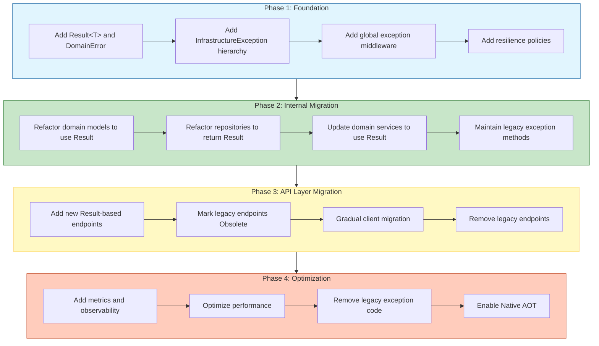

# Clean Architecture Anti-Pattern - Exception: The Road Ahead - Part 8
## Implementation checklist, migration strategies, .NET 10 roadmap, Native AOT compatibility, and organizational adoption.

## Introduction: The Journey to Architectural Resilience

Throughout this series, we have explored the fundamental principles of distinguishing infrastructure exceptions from domain outcomes. In **Part 1**, we established the architectural violation. In **Part 2**, we quantified the performance cost. In **Part 3**, we provided the taxonomy. In **Part 4**, we built the Result pattern implementation. In **Part 5**, we applied it across real-world domains. In **Part 6**, we added infrastructure resilience. In **Part 7**, we covered testing and observability.

This final story addresses the practical path forward: how to adopt the Result pattern in existing codebases, migrate legacy exception-based code, and prepare for the future of .NET development.

---

## Key Takeaways from Previous Stories

| Story | Key Takeaway |
|-------|--------------|
| **1. 🏛️ A .NET Developer's Guide - Part 1** | Domain exceptions at presentation boundaries violate Clean Architecture. The Result pattern restores proper layer separation. |
| **2. 🎭 Domain Logic in Disguise - Part 2** | Exceptions for domain outcomes are 28x slower and allocate 10x more memory than Result pattern failures. |
| **3. 🔍 Defining the Boundary - Part 3** | Determinism distinguishes infrastructure (non-deterministic) from domain outcomes (deterministic). |
| **4. ⚙️ Building the Result Pattern - Part 4** | Complete Result<T> and DomainError implementation with functional extensions. |
| **5. 🏢 Across Real-World Domains - Part 5** | Four case studies applying the pattern across payment, inventory, healthcare, and logistics. |
| **6. 🛡️ Infrastructure Resilience - Part 6** | Global middleware, Polly policies, circuit breakers, and health checks. |
| **7. 🧪 Testing & Observability - Part 7** | Unit testing, integration testing, structured logging, metrics, and alerting. |

This story provides the roadmap for adopting these principles in your organization.

---

## 1. Migration Strategy Overview

### 1.1 Phased Migration Approach

The following diagram illustrates a phased approach to migrating from exception-based domain logic to the Result pattern:



### 1.2 Design Patterns in Migration

| Pattern | Application | SOLID Principle |
|---------|-------------|-----------------|
| **Adapter Pattern** | Legacy exception methods adapt to Result methods | Open/Closed – new functionality without modifying legacy |
| **Strangler Fig Pattern** | Incrementally replace legacy code | Dependency Inversion – gradual replacement |
| **Facade Pattern** | Simplified interface for complex migration | Interface Segregation – clean separation during migration |
| **Feature Flag Pattern** | Toggle between old and new implementations | Single Responsibility – separation of migration concerns |

---

## 2. Phase 1: Foundation

### 2.1 Adding Core Types

```csharp
// Step 1: Add the core Result and DomainError types
// These should be added to a shared Domain/Common folder

namespace Domain.Common;

public class Result<T> { /* Implementation from Part 4 */ }
public record DomainError { /* Implementation from Part 4 */ }
public enum DomainErrorType { /* Implementation from Part 4 */ }

// Step 2: Add infrastructure exception hierarchy
namespace Infrastructure.Exceptions;

public abstract class InfrastructureException : Exception { /* Implementation from Part 6 */ }
public class TransientInfrastructureException : InfrastructureException { }
public class NonTransientInfrastructureException : InfrastructureException { }
public class DatabaseInfrastructureException : TransientInfrastructureException { }
public class ExternalServiceInfrastructureException : InfrastructureException { }

// Step 3: Add global exception middleware
public class InfrastructureExceptionMiddleware { /* Implementation from Part 6 */ }

// Step 4: Add resilience policies
public static class ResiliencePolicies { /* Implementation from Part 6 */ }
```

### 2.2 Configuration Updates

```csharp
// Program.cs - Add foundation services
var builder = WebApplication.CreateBuilder(args);

// Add Result pattern foundation
builder.Services.AddScoped<DomainMetrics>();

// Add global exception middleware
builder.Services.AddTransient<InfrastructureExceptionMiddleware>();

// Add resilience policies
builder.Services.AddHttpClient("ExternalServices")
    .AddPolicyHandler((services, request) =>
        ResiliencePolicies.CreateExponentialRetryPolicy<HttpResponseMessage>(
            services.GetRequiredService<ILogger<HttpClient>>(),
            "ExternalService"));

var app = builder.Build();

// Use infrastructure exception middleware
app.UseMiddleware<InfrastructureExceptionMiddleware>();

app.Run();
```

---

## 3. Phase 2: Internal Migration

### 3.1 Coexistence Pattern

During migration, maintain both patterns with clear boundaries:

```csharp
// Domain/Services/IOrderService.cs
public interface IOrderService
{
    // Legacy - maintained for backward compatibility
    [Obsolete("Use CreateAsync returning Result<Order> instead")]
    Task<Order> CreateLegacyAsync(CreateOrderRequest request, CancellationToken ct);
    
    // New - Result pattern
    Task<Result<Order>> CreateAsync(CreateOrderRequest request, CancellationToken ct);
}

// Domain/Services/OrderService.cs
public class OrderService : IOrderService
{
    // Core implementation using Result pattern
    public async Task<Result<Order>> CreateAsync(CreateOrderRequest request, CancellationToken ct)
    {
        // Implementation from Part 4 and Part 5
    }
    
    // Legacy adapter - maps Result to exceptions
    public async Task<Order> CreateLegacyAsync(CreateOrderRequest request, CancellationToken ct)
    {
        var result = await CreateAsync(request, ct);
        
        if (result.IsSuccess)
        {
            return result.Value;
        }
        
        // Map domain errors back to exceptions for legacy callers
        throw result.Error.Type switch
        {
            DomainErrorType.NotFound => new CustomerMissingException(result.Error.Message),
            DomainErrorType.Conflict => new OrderConflictException(result.Error.Message),
            DomainErrorType.BusinessRule => new InsufficientCreditException(result.Error.Message),
            DomainErrorType.Validation => new ValidationException(result.Error.Message),
            _ => new InvalidOperationException(result.Error.Message)
        };
    }
}
```

### 3.2 Repository Migration Strategy

```csharp
// Infrastructure/Repositories/OrderRepository.cs
public class OrderRepository : IOrderRepository
{
    private readonly ApplicationDbContext _context;
    
    // New Result-based methods
    public async Task<Result<Order>> GetByIdAsync(Guid id, CancellationToken ct)
    {
        try
        {
            var order = await _context.Orders.FindAsync(new object[] { id }, ct);
            return order is not null
                ? Result<Order>.Success(order)
                : Result<Order>.Failure(DomainError.NotFound("Order", id));
        }
        catch (SqlException ex) when (ex.Number == -2)
        {
            throw new DatabaseInfrastructureException("Database timeout", ex.Number, "DB_TIMEOUT", ex);
        }
    }
    
    // Legacy method (if needed for backward compatibility)
    [Obsolete("Use GetByIdAsync returning Result<Order>")]
    public async Task<Order> GetByIdLegacyAsync(Guid id, CancellationToken ct)
    {
        var result = await GetByIdAsync(id, ct);
        
        if (result.IsSuccess)
        {
            return result.Value;
        }
        
        throw new CustomerMissingException(result.Error.Message);
    }
}
```

### 3.3 Domain Model Migration

```csharp
// Before: Domain model throwing exceptions
public class OrderLegacy
{
    public void Cancel(string reason)
    {
        if (Status != OrderStatus.Pending && Status != OrderStatus.Confirmed)
        {
            throw new InvalidOrderStateException($"Cannot cancel order in {Status} state");
        }
        
        if (CreatedAt < DateTime.UtcNow.AddHours(-24))
        {
            throw new OrderCancellationWindowExpiredException("Cannot cancel order after 24 hours");
        }
        
        Status = OrderStatus.Cancelled;
        CancellationReason = reason;
    }
}

// After: Domain model returning Result
public class Order
{
    public Result<Unit> Cancel(string reason)
    {
        if (Status != OrderStatus.Pending && Status != OrderStatus.Confirmed)
        {
            return Result<Unit>.Failure(
                DomainError.BusinessRule("order.invalid_state",
                    $"Cannot cancel order in {Status} state"));
        }
        
        if (CreatedAt < DateTime.UtcNow.AddHours(-24))
        {
            return Result<Unit>.Failure(
                DomainError.BusinessRule("order.cancel_window_expired",
                    "Cannot cancel order after 24 hours"));
        }
        
        Status = OrderStatus.Cancelled;
        CancellationReason = reason;
        
        return Result<Unit>.Success(Unit.Default);
    }
}
```

---

## 4. Phase 3: API Layer Migration

### 4.1 Endpoint Migration Pattern

```csharp
// Api/Endpoints/OrderEndpoints.cs
public static class OrderEndpoints
{
    public static void MapOrderEndpoints(this IEndpointRouteBuilder app)
    {
        var group = app.MapGroup("/api/orders");
        
        // New Result-based endpoint
        group.MapPost("/v2", CreateOrderV2)
            .WithName("CreateOrderV2")
            .Produces<Order>(StatusCodes.Status201Created)
            .Produces<ProblemDetails>(StatusCodes.Status400BadRequest)
            .Produces<ProblemDetails>(StatusCodes.Status404NotFound)
            .Produces<ProblemDetails>(StatusCodes.Status409Conflict);
        
        // Legacy endpoint - mark as deprecated
        group.MapPost("/", CreateOrderLegacy)
            .WithName("CreateOrder")
            .WithOpenApi(operation =>
            {
                operation.Deprecated = true;
                operation.Description = "Deprecated. Use /v2 endpoint instead.";
                return operation;
            });
    }
    
    // New Result-based endpoint
    private static async Task<IResult> CreateOrderV2(
        CreateOrderRequest request,
        IOrderService service,
        CancellationToken ct)
    {
        var result = await service.CreateAsync(request, ct);
        
        return result.Match(
            onSuccess: order => Results.Created($"/api/orders/{order.Id}", order),
            onFailure: error => error.Type switch
            {
                DomainErrorType.NotFound => Results.NotFound(new ProblemDetails
                {
                    Title = "Resource Not Found",
                    Detail = error.Message,
                    Status = StatusCodes.Status404NotFound
                }),
                DomainErrorType.Conflict => Results.Conflict(new ProblemDetails
                {
                    Title = "Conflict",
                    Detail = error.Message,
                    Status = StatusCodes.Status409Conflict
                }),
                _ => Results.BadRequest(new ProblemDetails
                {
                    Title = "Validation Error",
                    Detail = error.Message,
                    Status = StatusCodes.Status400BadRequest
                })
            });
    }
    
    // Legacy endpoint - calls legacy service method
    private static async Task<IResult> CreateOrderLegacy(
        CreateOrderRequest request,
        IOrderService service,
        CancellationToken ct)
    {
        try
        {
            var order = await service.CreateLegacyAsync(request, ct);
            return Results.Created($"/api/orders/{order.Id}", order);
        }
        catch (CustomerMissingException ex)
        {
            return Results.NotFound(ex.Message);
        }
        catch (OrderConflictException ex)
        {
            return Results.Conflict(ex.Message);
        }
        catch (Exception ex)
        {
            return Results.Problem(ex.Message);
        }
    }
}
```

### 4.2 Deprecation Headers

```csharp
// Add deprecation headers to legacy endpoints
group.MapPost("/", CreateOrderLegacy)
    .WithName("CreateOrder")
    .AddEndpointFilter(async (context, next) =>
    {
        var response = await next(context);
        
        // Add deprecation headers
        context.HttpContext.Response.Headers.Add(
            "Deprecation", "true");
        context.HttpContext.Response.Headers.Add(
            "Sunset", DateTime.UtcNow.AddMonths(6).ToString("R"));
        context.HttpContext.Response.Headers.Add(
            "Link", "</api/orders/v2>; rel=\"successor-version\"");
        
        return response;
    });
```

---

## 5. Phase 4: Optimization

### 5.1 Removing Legacy Code

```csharp
// Step-by-step removal process

// 1. Identify all calls to legacy methods
// Use IDE analyzers or grep to find Obsolete method usage

// 2. Migrate remaining callers
// Update internal callers to use Result-based methods

// 3. Remove legacy interface methods
public interface IOrderService
{
    // Remove legacy method after all callers migrated
    // [Obsolete("Use CreateAsync returning Result<Order> instead")]
    // Task<Order> CreateLegacyAsync(...);
    
    // Keep only Result-based methods
    Task<Result<Order>> CreateAsync(CreateOrderRequest request, CancellationToken ct);
}

// 4. Remove legacy endpoint after sunset period
// Delete the /api/orders POST endpoint
// Keep only /api/orders/v2
```

### 5.2 .NET 10 Native AOT Compatibility

```csharp
// For Native AOT compilation, ensure:
// 1. Result<T> and DomainError use only AOT-compatible features

public class Result<T>
{
    // ✅ AOT-compatible: no reflection, no dynamic code generation
    public TResult Match<TResult>(
        Func<T, TResult> onSuccess,
        Func<DomainError, TResult> onFailure) =>
        IsSuccess ? onSuccess(_value!) : onFailure(_error!);
    
    // ✅ AOT-compatible: simple generic types
}

// 2. Configure AOT settings in .csproj

/*
<PropertyGroup>
    <PublishAot>true</PublishAot>
    <InvariantGlobalization>true</InvariantGlobalization>
    <JsonSerializerIsReflectionEnabledByDefault>false</JsonSerializerIsReflectionEnabledByDefault>
</PropertyGroup>

<ItemGroup>
    <JsonSerializerContext Include="ApiJsonSerializerContext" />
</ItemGroup>
*/

// 3. Use source-generated JSON serialization
[JsonSerializable(typeof(Order))]
[JsonSerializable(typeof(Result<Order>))]
[JsonSerializable(typeof(DomainError))]
[JsonSerializable(typeof(ProblemDetails))]
public partial class ApiJsonSerializerContext : JsonSerializerContext { }
```

### 5.3 Performance Tuning

```csharp
// Optimize Result<T> for high-throughput scenarios

public class Result<T>
{
    // Use struct backing for value types to reduce allocations
    private readonly T? _value;
    private readonly DomainError? _error;
    
    // Pool common success results for value types
    private static readonly Result<int> ZeroSuccess = new(0);
    private static readonly Result<int> OneSuccess = new(1);
    
    public static Result<int> Zero() => ZeroSuccess;
    public static Result<int> One() => OneSuccess;
    
    // Avoid closures in hot paths
    public TResult MatchInline<TResult>(
        Func<T, TResult> onSuccess,
        Func<DomainError, TResult> onFailure) =>
        IsSuccess ? onSuccess(_value!) : onFailure(_error!);
}

// Use source generators for DomainError factory methods
[GenerateDomainErrors]
public partial class OrderErrors
{
    // Generated code is AOT-compatible and allocation-efficient
    public static partial DomainError CustomerNotFound(Guid customerId);
    public static partial DomainError InsufficientCredit(decimal available, decimal required);
}
```

---

## 6. Implementation Checklist

### 6.1 Pre-Migration Assessment

| Task | Status | Notes |
|------|--------|-------|
| Identify all domain exceptions in codebase | ☐ | Use IDE search for `throw new` and custom exception types |
| Count expected vs actual exception usage | ☐ | Analyze logs to see which exceptions are truly exceptional |
| Map infrastructure exception sources | ☐ | Database, HTTP, cache, messaging, file system |
| Assess team familiarity with functional patterns | ☐ | Plan training if needed |
| Estimate migration effort | ☐ | Prioritize high-impact areas first |

### 6.2 Migration Tasks by Layer

| Layer | Migration Task | Priority |
|-------|----------------|----------|
| **Domain** | Add Result<T> and DomainError types | High |
| **Domain** | Refactor domain models to return Result | High |
| **Application** | Refactor services to use Result | High |
| **Infrastructure** | Add InfrastructureException hierarchy | Medium |
| **Infrastructure** | Add global exception middleware | Medium |
| **Infrastructure** | Add Polly resilience policies | Medium |
| **Presentation** | Add new Result-based endpoints | Medium |
| **Testing** | Update unit tests for Result pattern | Medium |
| **Observability** | Add structured logging for domain vs infrastructure | Low |
| **Observability** | Add metrics and dashboards | Low |
| **Cleanup** | Remove legacy exception code | Low |

### 6.3 Post-Migration Validation

| Validation | Success Criteria |
|------------|------------------|
| **Performance** | Domain failures no longer throw exceptions; GC pressure reduced |
| **Logging** | Domain errors logged at INFO; infrastructure failures at ERROR |
| **Alerting** | No alerts for expected domain outcomes; alerts for infrastructure failures |
| **Testing** | All tests use Result assertions; no exception assertions |
| **Documentation** | API contracts explicitly show possible domain outcomes |
| **AOT Compatibility** | Application compiles with Native AOT |

---

## 7. .NET 10 Future Considerations

### 7.1 Upcoming Features

| Feature | Impact on Result Pattern |
|---------|-------------------------|
| **Enhanced Pattern Matching** | More expressive error handling in endpoints |
| **Required Members Improvements** | Tighter DomainError contracts |
| **Source Generator Enhancements** | Automatic DomainError factory generation |
| **Native AOT Optimizations** | Better performance for Result pattern |
| **Metrics API Improvements** | Richer domain metrics |

### 7.2 Preparing for Future .NET Versions

```csharp
// Use preview features with caution
// Configure your project file for future compatibility

/*
<PropertyGroup>
    <EnablePreviewFeatures>true</EnablePreviewFeatures>
    <LangVersion>preview</LangVersion>
</PropertyGroup>

<ItemGroup>
    <PackageReference Include="System.Text.Json" Version="9.0.0" />
    <PackageReference Include="Microsoft.Extensions.DependencyInjection" Version="9.0.0" />
</ItemGroup>
*/

// Stay updated with .NET release notes for:
// - New functional programming features
// - Improved error handling patterns
// - Enhanced source generators
// - Better AOT compilation support
```

---

## 8. Organizational Adoption

### 8.1 Team Training Topics

| Topic | Duration | Audience |
|-------|----------|----------|
| Clean Architecture Principles | 2 hours | All developers |
| Infrastructure vs Domain Distinction | 1 hour | All developers |
| Result Pattern Implementation | 2 hours | Senior developers |
| Migration Strategies | 1 hour | Tech leads |
| Testing Result Pattern | 1 hour | QA and developers |
| Observability and Alerting | 1 hour | DevOps and SRE |

### 8.2 Architecture Decision Record (ADR)

```markdown
# ADR-001: Adopting Result Pattern for Domain Outcomes

## Status
Accepted

## Context
Current codebase uses exceptions for expected business outcomes, causing:
- Performance degradation (28x slower for domain failures)
- GC pressure from exception allocations
- Log pollution with expected business errors
- Violation of Clean Architecture layering

## Decision
Adopt the Result pattern for all domain outcomes. Infrastructure exceptions remain as exceptions.

## Consequences
Positive:
- Performance improvement for expected failure paths
- Clearer API contracts
- Better observability (domain errors at INFO level)
- Testable domain logic without exception assertions

Negative:
- Migration effort required for existing code
- Learning curve for functional programming concepts
- Additional type definitions

## Migration Plan
1. Phase 1: Add core types and infrastructure
2. Phase 2: Internal migration (domain models, services)
3. Phase 3: API layer migration with deprecation
4. Phase 4: Cleanup and optimization
```

### 8.3 Code Review Checklist

| Item | Check |
|------|-------|
| Domain methods return `Result<T>` | ☐ |
| Expected business outcomes return `Result.Failure` | ☐ |
| Infrastructure exceptions thrown (not caught in domain) | ☐ |
| Domain errors have meaningful Code and Message | ☐ |
| Metadata added for context when helpful | ☐ |
| Tests use Result assertions, not exception assertions | ☐ |
| Logging distinguishes domain errors (INFO) from infrastructure (ERROR) | ☐ |
| Metrics track both domain and infrastructure | ☐ |

---

## 9. Measuring Success

### 9.1 Key Performance Indicators

| Metric | Pre-Migration | Post-Migration | Target |
|--------|---------------|----------------|--------|
| Exception Throws per Request | 0.05 | 0.001 | 90% reduction |
| P99 Latency (with failures) | 450 ms | 180 ms | 60% improvement |
| GC Collections per Hour | 15 | 8 | 47% reduction |
| Log Volume (ERROR level) | 5,000 lines/hr | 500 lines/hr | 90% reduction |
| Mean Time to Detect (MTTD) | 15 min | 5 min | 67% improvement |
| Mean Time to Recover (MTTR) | 45 min | 20 min | 56% improvement |

### 9.2 Success Criteria

| Criterion | Definition |
|-----------|------------|
| **No Domain Exceptions** | Domain methods never throw for expected outcomes |
| **Clean Logs** | ERROR logs only for genuine infrastructure failures |
| **Fast Failures** | Domain failures return instantly without stack trace |
| **Testable Domain** | All domain logic testable without mocking exceptions |
| **Observable System** | Dashboards distinguish domain errors from infrastructure |
| **Team Adoption** | All team members understand and apply the pattern |

---

## What We Learned in This Story

| Concept | Key Takeaway |
|---------|--------------|
| **Phased Migration** | Four-phase approach: Foundation → Internal → API → Optimization |
| **Coexistence Pattern** | Maintain both legacy and new methods during migration using Adapter pattern |
| **Strangler Fig Pattern** | Incrementally replace legacy code while maintaining functionality |
| **Deprecation Strategy** | Mark endpoints obsolete, add deprecation headers, sunset after period |
| **Native AOT** | Result pattern is AOT-compatible; avoid reflection and dynamic code |
| **Performance Tuning** | Pool common results, use struct backing, avoid closures in hot paths |
| **ADR Documentation** | Document architectural decisions for team alignment |
| **Success Metrics** | Measure reduction in exceptions, latency, GC, and log volume |

---

## Design Patterns & SOLID Principles Summary

| Pattern | Application | SOLID Principle |
|---------|-------------|-----------------|
| **Adapter Pattern** | Legacy methods adapt to Result methods | Open/Closed – new functionality without modifying legacy |
| **Strangler Fig Pattern** | Incremental replacement of legacy code | Dependency Inversion – gradual replacement |
| **Facade Pattern** | Simplified interface during migration | Interface Segregation – clean separation |
| **Feature Flag Pattern** | Toggle between old and new implementations | Single Responsibility – separation of concerns |
| **Builder Pattern** | Constructing test data during migration | Single Responsibility – separation of construction |

---

## Series Conclusion

### The Journey Summarized

| Part | Title | Core Concept |
|------|-------|--------------|
| **1** | 🏛️ A .NET Developer's Guide | Architectural violation and decision framework |
| **2** | 🎭 Domain Logic in Disguise | Performance cost of exception-based domain logic |
| **3** | 🔍 Defining the Boundary | Taxonomy: infrastructure vs domain |
| **4** | ⚙️ Building the Result Pattern | Complete Result<T> implementation |
| **5** | 🏢 Across Real-World Domains | Four case studies in practice |
| **6** | 🛡️ Infrastructure Resilience | Middleware, Polly, circuit breakers |
| **7** | 🧪 Testing & Observability | Testing strategies, metrics, alerting |
| **8** | 🚀 The Road Ahead | Migration, AOT, organizational adoption |

### Final Principles

1. **Infrastructure is not Domain** – Database timeouts are not business rules
2. **Exceptions are for Exceptional Circumstances** – Expected outcomes return Result
3. **Contracts Must Be Explicit** – Domain methods declare what can go wrong
4. **Test Without Exceptions** – Use Result assertions, not exception assertions
5. **Observe Intelligently** – Domain errors are INFO; infrastructure failures are ERROR
6. **Migrate Incrementally** – Phase approach with coexistence pattern
7. **Embrace .NET 10** – Required members, source generators, Native AOT

---

## References to Previous Stories

This story synthesizes all principles established throughout the series:

**1. 🏛️ A .NET Developer's Guide - Part 1** – Foundational principles and decision framework.

**2. 🎭 Domain Logic in Disguise - Part 2** – Performance justification for migration.

**3. 🔍 Defining the Boundary - Part 3** – Taxonomy guiding classification decisions.

**4. ⚙️ Building the Result Pattern - Part 4** – Implementation migrated to.

**5. 🏢 Across Real-World Domains - Part 5** – Real-world patterns to adopt.

**6. 🛡️ Infrastructure Resilience - Part 6** – Infrastructure patterns to preserve.

**7. 🧪 Testing & Observability - Part 7** – Testing and monitoring to implement.

---

## Series Overview

1. **🏛️ Clean Architecture Anti-Pattern - Exception: A .NET Developer's Guide - Part 1** – Foundational principles, architectural violation, domain-infrastructure distinction, Result pattern, and decision framework.

2. **🎭 Clean Architecture Anti-Pattern - Exception: Domain Logic in Disguise - Part 2** – Performance implications of exception-based domain logic. Stack trace overhead, GC pressure analysis, and why expected outcomes should never throw exceptions.

3. **🔍 Clean Architecture Anti-Pattern - Exception: Defining the Boundary - Part 3** – Comprehensive taxonomy distinguishing infrastructure exceptions from domain outcomes. Decision matrices and classification patterns across all infrastructure layers.

4. **⚙️ Clean Architecture Anti-Pattern - Exception: Building the Result Pattern - Part 4** – Complete implementation of Result<T> and DomainError with functional extensions. Source generation, .NET 10 features, and API design best practices.

5. **🏢 Clean Architecture Anti-Pattern - Exception: Across Real-World Domains - Part 5** – Four complete case studies: Payment Processing, Inventory Management, Healthcare Scheduling, and Logistics Tracking.

6. **🛡️ Clean Architecture Anti-Pattern - Exception: Infrastructure Resilience - Part 6** – Global exception handling middleware, Polly retry policies, circuit breakers, and health check integration.

7. **🧪 Clean Architecture Anti-Pattern - Exception: Testing & Observability - Part 7** – Unit testing domain logic without exceptions, infrastructure failure testing, OpenTelemetry, metrics with .NET Meters, and production dashboards.

8. **🚀 Clean Architecture Anti-Pattern - Exception: The Road Ahead - Part 8** – Implementation checklist, migration strategies, .NET 10 roadmap, Native AOT compatibility, and organizational adoption. *(This Story)*

---

## Final Thought

The distinction between infrastructure exceptions and domain outcomes is not merely a technical detail—it is a fundamental architectural principle that determines whether your system remains maintainable, testable, and resilient over time. By adopting the Result pattern, you transform domain failures from expensive, ambiguous exceptions into explicit, deterministic contracts. Infrastructure failures remain as exceptions, handled centrally with retries, circuit breakers, and appropriate alerts.

The journey to architectural resilience is incremental. Start with one domain, one service, one endpoint. Let the principles guide you. Measure your progress. And remember: **Infrastructure is not domain. Exceptions are not business logic.**

---

---
*� Questions? Drop a response - I read and reply to every comment.*
*📌 Save this story to your reading list - it helps other engineers discover it.*
**🔗 Follow me →**
- [**Medium**](mvineetsharma.medium.com) - mvineetsharma.medium.com
- [**LinkedIn**](www.linkedin.com/in/vineet-sharma-architect) -  www.linkedin.com/in/vineet-sharma-architect

*In-depth .NET, Node.js, Python, Cloud Architecture, and System Design. New articles weekly*
