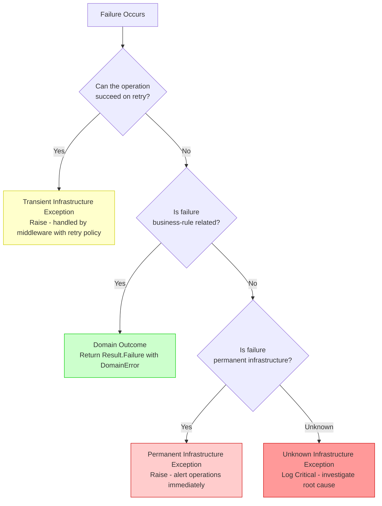

# Clean Architecture Anti-Pattern in Python - A Developer's Guide to Resilience - Part 1
## Foundational principles, architectural violation, domain-infrastructure distinction, Result pattern, and decision framework for Python. Establishes the foundational principles for the entire series with Python-specific implementations.

## Introduction: The Exception Anti-Pattern in Python

In Python development, the "EAFP" (Easier to Ask for Forgiveness than Permission) philosophy has long encouraged developers to "just try" operations and catch exceptions when they fail. While this pattern works well for handling missing dictionary keys, file access issues, or network timeouts, applying it to domain logic creates the same architectural violations we've explored throughout this series.

When domain outcomes are expressed through exceptions, the architecture inverts—presentation layers become coupled to domain implementation details, infrastructure concerns bleed into business logic, and the system becomes increasingly brittle. Python's dynamic nature makes these violations even more subtle and harder to detect than in statically typed languages.

This series adapts the principles to Python 3.12+, demonstrating how to distinguish infrastructure exceptions from domain outcomes, implement the Result pattern with Python's type system, and build resilient applications with Clean Architecture.

---

### Complete Series Overview

The **Clean Architecture Anti-Pattern in Python** series consists of eight comprehensive stories:

---

**1. 🏛️ Clean Architecture Anti-Pattern in Python - A Developer's Guide to Resilience - Part 1** *(This Story)* – Foundational principles, architectural violation, domain-infrastructure distinction, Result pattern, and decision framework for Python. Establishes the foundational principles for the entire series with Python-specific implementations.

---

**2. 🎭 Clean Architecture Anti-Pattern in Python - Domain Logic in Disguise - Part 2** – Performance implications of exception-based domain logic in Python. Stack trace overhead, memory profiling, and why expected outcomes should never raise exceptions. Includes benchmark comparisons between exception-based and Result pattern approaches in Python 3.12.

---

**3. 🔍 Clean Architecture Anti-Pattern in Python - Defining the Boundary - Part 3** – Comprehensive taxonomy distinguishing infrastructure exceptions from domain outcomes in Python. Decision matrices and classification patterns across database (psycopg, asyncpg), HTTP (httpx, aiohttp), cache (redis-py), messaging, and file system layers.

---

**4. ⚙️ Clean Architecture Anti-Pattern in Python - Building the Result Pattern - Part 4** – Complete implementation of `Result[T]` and `DomainError` with functional extensions using Python's `Generic`, `dataclass`, and `Enum`. Covers `match` statement integration, context managers, and `async`/`await` patterns.

---

**5. 🏢 Clean Architecture Anti-Pattern in Python - Across Real-World Domains - Part 5** – Four complete case studies: Payment Processing (insufficient funds vs gateway timeout), Inventory Management (out of stock vs database deadlock), Healthcare Scheduling (double-booking vs EMR integration failure), and Logistics Tracking (delivery window violation vs GPS device offline).

---

**6. 🛡️ Clean Architecture Anti-Pattern in Python - Infrastructure Resilience - Part 6** – Global exception handling middleware for FastAPI/Starlette, tenacity retry policies, circuit breakers, and transient vs non-transient failure classification. Complete middleware pipeline configuration for Python async applications.

---

**7. 🧪 Clean Architecture Anti-Pattern in Python - Testing & Observability - Part 7** – Unit testing domain logic without exception assertions (pytest), integration testing infrastructure failures, structured logging with structlog, and metrics collection with Prometheus client.

---

**8. 🚀 Clean Architecture Anti-Pattern in Python - The Road Ahead - Part 8** – Implementation checklist for adopting the Result pattern in existing Python codebases, migration strategies for legacy systems, Python 3.12+ feature roadmap, and long-term maintenance benefits.

---

## The Architectural Violation

*This section introduces concepts explored in depth in **2. 🎭 Clean Architecture Anti-Pattern in Python - Domain Logic in Disguise - Part 2**.*

Clean Architecture mandates that dependencies point inward. The domain layer must remain agnostic of infrastructure concerns, and the application layer must not depend on presentation concerns. When domain logic expresses business outcomes through exceptions, this architectural principle is violated.

### The Problem Statement in Python

Consider the following pattern observed across countless Python codebases where domain exceptions propagate to the presentation layer:

```python
# Anti-pattern: Domain exceptions at presentation boundary
from fastapi import FastAPI, HTTPException
from order_service import OrderService, OrderConflictError, CustomerNotFoundError, InvalidOrderStateError

app = FastAPI()

@app.post("/orders")
async def create_order(request: CreateOrderRequest):
    service = OrderService()
    
    try:
        order = await service.create_async(request)
        return {"id": order.id, "status": "created"}
    
    except OrderConflictError as e:
        raise HTTPException(status_code=409, detail=str(e))
    
    except CustomerNotFoundError as e:
        raise HTTPException(status_code=404, detail=str(e))
    
    except InvalidOrderStateError as e:
        raise HTTPException(status_code=400, detail=str(e))
```

**Architectural Violation:** The presentation layer (FastAPI route) now knows about `OrderConflictError`, `CustomerNotFoundError`, and `InvalidOrderStateError`—domain concepts that should remain internal to the domain layer. This creates a direct coupling that undermines the isolation between layers.

**SOLID Principle Violation - Dependency Inversion:** High-level modules (domain) should not depend on low-level modules (presentation). Both should depend on abstractions. Here, the presentation layer depends on domain implementation details through exception types.

### The Layered Impact

The following diagram illustrates how exception-based control flow violates Clean Architecture layering:

```mermaid
flowchart TD
    subgraph AntiPattern["❌ Anti-Pattern Architecture"]
        P1[Presentation Layer\nFastAPI Routes] -->|Catches and Depends On| DE[Domain Exception Types]
        DE -->|Raised from| D1[Domain Layer\nBusiness Logic]
        D1 -->|Contains| B1[Business Rules]
        D1 -.->|Violates Dependency Direction| P1
    end
    
    subgraph Correct["✅ Correct Architecture"]
        P2[Presentation Layer] -->|Depends on| I2[Application Interfaces\nService Protocols]
        I2 -->|Implemented by| A2[Application Layer]
        A2 -->|Returns Result Type| D2[Domain Layer]
        D2 -->|Contains| B2[Business Rules]
        I2 -.->|Abstracts Domain Outcomes| D2
    end
    
    style AntiPattern fill:#ffcccc,stroke:#cc0000
    style Correct fill:#ccffcc,stroke:#00cc00
```



### The Performance Consideration in Python

Exceptions in Python, despite optimizations in recent versions, remain expensive operations. The Python interpreter performs significant work when an exception is raised:

- **Stack trace construction** with frame objects and line numbers
- **Exception object allocation** on the heap
- **`__cause__` and `__context__` chain resolution**
- **`finally` block execution coordination**
- **`sys.exc_info()` overhead** for exception context
- **Frame object retention** for traceback until garbage collected

For expected business outcomes—such as "customer not found" or "insufficient funds"—using exceptions introduces measurable overhead. A system processing 10,000 requests per second with a 5% expected failure rate would raise 500 exceptions per second unnecessarily.

**Python 3.12 Note:** While Python 3.12 has improved exception handling performance with better frame object reuse and reduced overhead for certain patterns, exceptions remain fundamentally unsuited for expected control flow. The interpreter is optimized for exceptional circumstances, not routine business logic branching.

For a comprehensive analysis of performance implications, including benchmark comparisons and memory profiling, refer to **2. 🎭 Clean Architecture Anti-Pattern in Python - Domain Logic in Disguise - Part 2**.

---

## The Critical Distinction

*This section introduces concepts explored in depth in **3. 🔍 Clean Architecture Anti-Pattern in Python - Defining the Boundary - Part 3**.*

The foundation of architectural resilience rests on distinguishing between two fundamentally different categories of failures: infrastructure exceptions and domain outcomes.

### Infrastructure Exceptions

Infrastructure exceptions originate from technical implementation details. They are characterized by:

| Characteristic | Description |
|----------------|-------------|
| **Transience** | Many infrastructure failures resolve with automatic retry |
| **Technical Nature** | Describe technical failures, not business rules |
| **External Dependencies** | Originate from databases, networks, file systems, external services |
| **Non-Deterministic** | Occur based on system load, network conditions, hardware failures |
| **Cross-Cutting** | Can occur in any layer that touches external resources |

**Examples in Python:**

```python
# Database infrastructure exceptions (asyncpg, psycopg)
asyncpg.exceptions.DeadlockDetectedError      # Deadlock - retryable
asyncpg.exceptions.QueryCanceledError         # Timeout - may be retryable
ConnectionError                                # Network connectivity - transient

# HTTP infrastructure exceptions (httpx, aiohttp)
httpx.HTTPStatusError when response.status_code == 503  # Service unavailable
httpx.TimeoutException                         # Request timeout
aiohttp.ClientConnectionError                  # Connection failure

# Cache infrastructure exceptions (redis-py)
redis.exceptions.ConnectionError
redis.exceptions.TimeoutError

# Messaging infrastructure exceptions
pika.exceptions.AMQPConnectionError
kombu.exceptions.OperationalError

# File system infrastructure exceptions
OSError when errno == ENOSPC   # Disk full
OSError when errno == EACCES   # Permission denied
OSError when errno == ENETUNREACH  # Network drive unavailable
```

### Domain Outcomes

Domain outcomes represent expected results of business rule evaluation. These are not exceptional—they are possible system states that must be handled explicitly.

| Characteristic | Description |
|----------------|-------------|
| **Expected** | Represent valid states of business processes |
| **Deterministic** | Predictable given inputs and system state |
| **Business-Relevant** | Carry business meaning, not technical details |
| **User-Facing** | Translate directly to user messages |
| **Domain Language** | Use terminology from the ubiquitous language |

**Examples:**

```python
# Domain outcomes (NOT exceptions)
CustomerNotFound(customer_id)      # Customer does not exist
InsufficientCredit(available, required)  # Credit limit exceeded
ProductOutOfStock(product_id, requested, available)  # Inventory issue
DuplicateOrder(order_number)       # Order already exists
PaymentDeclined(decline_reason)    # Card declined by issuer
InvalidOrderState(current_state, allowed_states)  # State transition invalid
```

### The Decision Framework

The following diagram provides a decision framework for classifying failures as they occur:



For a comprehensive taxonomy including decision matrices, real-world classification patterns, and detailed exception type breakdowns across all infrastructure layers, refer to **3. 🔍 Clean Architecture Anti-Pattern in Python - Defining the Boundary - Part 3**.

---

## Building the Result Pattern

*This section introduces concepts explored in depth in **4. ⚙️ Clean Architecture Anti-Pattern in Python - Building the Result Pattern - Part 4**.*

The Result pattern provides a functional approach to handling domain outcomes while preserving infrastructure exceptions for their intended purpose.

### Core Type Definitions

```python
# domain/common/result.py
# Python 3.12+: Using dataclasses, generics, and match statements
from dataclasses import dataclass, field
from typing import Generic, TypeVar, Optional, Callable, Awaitable, Union
from enum import Enum
import asyncio

T = TypeVar('T')
TResult = TypeVar('TResult')


class DomainErrorType(Enum):
    """Domain error types for HTTP status code mapping."""
    CONFLICT = "conflict"           # 409 - Duplicate, state conflict
    NOT_FOUND = "not_found"         # 404 - Resource missing
    VALIDATION = "validation"       # 400 - Invalid input
    UNAUTHORIZED = "unauthorized"   # 401 - Authentication required
    FORBIDDEN = "forbidden"         # 403 - Authorization denied
    BUSINESS_RULE = "business_rule" # 422 - Business rule violation
    GONE = "gone"                   # 410 - Resource no longer available
    TOO_MANY_REQUESTS = "too_many_requests"  # 429 - Rate limiting


@dataclass
class DomainError:
    """Represents a domain error with code, message, type, and metadata."""
    code: str
    message: str
    type: DomainErrorType
    metadata: dict[str, object] = field(default_factory=dict)
    
    def __str__(self) -> str:
        return f"[{self.code}] {self.message}"
    
    @classmethod
    def not_found(cls, resource_type: str, identifier: object) -> 'DomainError':
        """Creates a not found error."""
        return cls(
            code=f"{resource_type.lower()}.not_found",
            message=f"{resource_type} with identifier '{identifier}' was not found",
            type=DomainErrorType.NOT_FOUND,
            metadata={"resource_type": resource_type, "identifier": identifier}
        )
    
    @classmethod
    def conflict(cls, message: str, details: object = None) -> 'DomainError':
        """Creates a conflict error."""
        return cls(
            code="resource.conflict",
            message=message,
            type=DomainErrorType.CONFLICT,
            metadata={"details": details} if details else {}
        )
    
    @classmethod
    def validation(cls, field: str, message: str) -> 'DomainError':
        """Creates a field-specific validation error."""
        return cls(
            code="validation.failed",
            message=message,
            type=DomainErrorType.VALIDATION,
            metadata={"field": field}
        )
    
    @classmethod
    def business_rule(cls, rule: str, message: str, context: object = None) -> 'DomainError':
        """Creates a business rule violation error."""
        return cls(
            code=f"business.{rule.lower()}",
            message=message,
            type=DomainErrorType.BUSINESS_RULE,
            metadata={"context": context} if context else {}
        )
    
    @classmethod
    def insufficient_funds(cls, available: float, required: float) -> 'DomainError':
        """Creates an insufficient funds error."""
        return cls(
            code="business.insufficient_funds",
            message=f"Insufficient funds. Available: ${available:.2f}, Required: ${required:.2f}",
            type=DomainErrorType.BUSINESS_RULE,
            metadata={"available": available, "required": required}
        )
    
    @classmethod
    def out_of_stock(cls, product_id: str, requested: int, available: int) -> 'DomainError':
        """Creates an out of stock error."""
        return cls(
            code="business.out_of_stock",
            message=f"Product {product_id} out of stock. Requested: {requested}, Available: {available}",
            type=DomainErrorType.BUSINESS_RULE,
            metadata={"product_id": product_id, "requested": requested, "available": available}
        )


class Result(Generic[T]):
    """
    Represents the result of an operation that can either succeed with a value 
    or fail with a domain error. Immutable and thread-safe.
    """
    
    def __init__(self, is_success: bool, value: Optional[T] = None, error: Optional[DomainError] = None):
        self._is_success = is_success
        self._value = value
        self._error = error
    
    @classmethod
    def success(cls, value: T) -> 'Result[T]':
        """Creates a successful result."""
        return cls(True, value=value, error=None)
    
    @classmethod
    def failure(cls, error: DomainError) -> 'Result[T]':
        """Creates a failed result."""
        return cls(False, value=None, error=error)
    
    @property
    def is_success(self) -> bool:
        """Returns True if the operation succeeded."""
        return self._is_success
    
    @property
    def is_failure(self) -> bool:
        """Returns True if the operation failed."""
        return not self._is_success
    
    @property
    def value(self) -> T:
        """Gets the success value. Raises if the result is a failure."""
        if not self._is_success:
            raise ValueError(f"Cannot access value of failed result: {self._error}")
        return self._value
    
    @property
    def error(self) -> DomainError:
        """Gets the error. Raises if the result is a success."""
        if self._is_success:
            raise ValueError("Cannot access error of successful result")
        return self._error
    
    def match(self, on_success: Callable[[T], TResult], on_failure: Callable[[DomainError], TResult]) -> TResult:
        """
        Pattern matching for functional handling of success and failure.
        Python 3.10+ match statement compatible.
        """
        if self._is_success:
            return on_success(self._value)
        return on_failure(self._error)
    
    async def match_async(
        self, 
        on_success: Callable[[T], Awaitable[TResult]], 
        on_failure: Callable[[DomainError], Awaitable[TResult]]
    ) -> TResult:
        """Async pattern matching for functional handling."""
        if self._is_success:
            return await on_success(self._value)
        return await on_failure(self._error)
    
    def map(self, mapper: Callable[[T], TResult]) -> 'Result[TResult]':
        """Transforms the success value if successful; otherwise propagates the failure."""
        if self._is_success:
            return Result.success(mapper(self._value))
        return Result.failure(self._error)
    
    async def map_async(self, mapper: Callable[[T], Awaitable[TResult]]) -> 'Result[TResult]':
        """Async version of map."""
        if self._is_success:
            return Result.success(await mapper(self._value))
        return Result.failure(self._error)
    
    def bind(self, binder: Callable[[T], 'Result[TResult]']) -> 'Result[TResult]':
        """Binds a function that returns a Result to the success value."""
        if self._is_success:
            return binder(self._value)
        return Result.failure(self._error)
    
    async def bind_async(self, binder: Callable[[T], Awaitable['Result[TResult]']]) -> 'Result[TResult]':
        """Async version of bind."""
        if self._is_success:
            return await binder(self._value)
        return Result.failure(self._error)
    
    def tap(self, action: Callable[[T], None]) -> 'Result[T]':
        """Executes an action on the success value without changing the result."""
        if self._is_success:
            action(self._value)
        return self
    
    async def tap_async(self, action: Callable[[T], Awaitable[None]]) -> 'Result[T]':
        """Async version of tap."""
        if self._is_success:
            await action(self._value)
        return self
    
    def tap_error(self, action: Callable[[DomainError], None]) -> 'Result[T]':
        """Executes an action on the error value without changing the result."""
        if not self._is_success:
            action(self._error)
        return self
    
    def value_or(self, default: T) -> T:
        """Returns the success value or a default if failed."""
        return self._value if self._is_success else default
    
    def value_or_raise(self, exception_factory: Optional[Callable[[DomainError], Exception]] = None) -> T:
        """Returns the success value or raises an exception if failed."""
        if self._is_success:
            return self._value
        if exception_factory:
            raise exception_factory(self._error)
        raise ValueError(f"Result failed: {self._error}")
    
    def __bool__(self) -> bool:
        """Returns True if the result is a success."""
        return self._is_success
    
    def __repr__(self) -> str:
        if self._is_success:
            return f"Result.success({self._value})"
        return f"Result.failure({self._error})"
```

### Domain Service Implementation

```python
# domain/services/order_service.py
# Domain service with Result pattern
from typing import Optional, List
import logging
from datetime import datetime

logger = logging.getLogger(__name__)


class OrderService:
    """Domain service for order management using Result pattern."""
    
    def __init__(self, customer_repository, product_repository, order_repository, inventory_service):
        self._customer_repository = customer_repository
        self._product_repository = product_repository
        self._order_repository = order_repository
        self._inventory_service = inventory_service
    
    async def create_order(self, request: 'CreateOrderRequest') -> Result['Order']:
        """
        Creates a new order.
        Returns Result[Order] - success with order or failure with domain error.
        """
        # Domain outcome: Validate customer exists
        customer_result = await self._customer_repository.get_by_id(request.customer_id)
        if customer_result.is_failure:
            return Result.failure(customer_result.error)
        
        customer = customer_result.value
        
        # Domain outcome: Check credit limit
        total_value = sum(item.quantity * item.unit_price for item in request.items)
        if not customer.has_sufficient_credit(total_value):
            return Result.failure(
                DomainError.insufficient_funds(
                    customer.available_credit, 
                    total_value
                )
            )
        
        # Domain outcome: Check inventory availability
        for item in request.items:
            availability_result = await self._inventory_service.check_availability(
                item.product_id, 
                item.quantity
            )
            
            if availability_result.is_failure:
                return Result.failure(availability_result.error)
            
            if not availability_result.value.is_available:
                return Result.failure(
                    DomainError.out_of_stock(
                        str(item.product_id),
                        item.quantity,
                        availability_result.value.available_quantity
                    )
                )
        
        # Domain outcome: Check for conflicting orders
        has_conflict = await self._order_repository.has_active_order_conflict(
            request.customer_id,
            [item.product_id for item in request.items]
        )
        
        if has_conflict:
            return Result.failure(
                DomainError.conflict(
                    "Customer already has an active order containing these products"
                )
            )
        
        # Create order aggregate
        order = Order.create(
            customer_id=request.customer_id,
            items=request.items,
            shipping_address=request.shipping_address
        )
        
        try:
            # Infrastructure operation - may raise exceptions
            await self._order_repository.add(order)
            
            # Reserve inventory
            for item in request.items:
                reserve_result = await self._inventory_service.reserve(
                    item.product_id,
                    item.quantity,
                    order.id
                )
                
                if reserve_result.is_failure:
                    # Domain outcome from inventory service
                    # In production, would need compensation logic
                    return Result.failure(reserve_result.error)
                
                order.add_inventory_reservation(
                    item.product_id, 
                    reserve_result.value.reservation_id
                )
            
            await self._order_repository.save_changes()
            
            logger.info(f"Order {order.id} created for customer {request.customer_id}")
            
            return Result.success(order)
            
        except asyncio.TimeoutError as ex:
            # Infrastructure exception - timeout
            logger.error(f"Database timeout creating order for customer {request.customer_id}")
            raise TransientInfrastructureException(
                "Database operation timed out",
                error_code="DB_TIMEOUT",
                inner_exception=ex
            )
            
        except asyncpg.exceptions.DeadlockDetectedError as ex:
            # Infrastructure exception - deadlock
            logger.warning(f"Deadlock detected creating order for customer {request.customer_id}")
            raise TransientInfrastructureException(
                "Database deadlock occurred",
                error_code="DB_DEADLOCK",
                inner_exception=ex
            )
```

### API Endpoint Implementation

```python
# api/routes/orders.py
# FastAPI endpoint with Result pattern
from fastapi import APIRouter, HTTPException, status
from fastapi.responses import JSONResponse
from pydantic import BaseModel

router = APIRouter(prefix="/api/orders", tags=["orders"])


@router.post(
    "/",
    response_model=OrderResponse,
    status_code=status.HTTP_201_CREATED,
    responses={
        400: {"model": ErrorResponse},
        404: {"model": ErrorResponse},
        409: {"model": ErrorResponse},
        422: {"model": ErrorResponse},
        503: {"model": ErrorResponse}
    }
)
async def create_order(request: CreateOrderRequest, service: OrderService = Depends()):
    """
    Creates a new order.
    
    Returns 201 with order if successful.
    Returns appropriate error response based on domain error type.
    """
    result = await service.create_order(request)
    
    # Python 3.10+ match statement for pattern matching
    match result:
        case Result(is_success=True, value=order):
            return JSONResponse(
                status_code=status.HTTP_201_CREATED,
                content={"id": str(order.id), "status": order.status.value}
            )
        
        case Result(is_success=False, error=error):
            return _handle_domain_error(error)


def _handle_domain_error(error: DomainError) -> JSONResponse:
    """Maps domain error to HTTP response."""
    
    # Python 3.10+ match statement on error type
    match error.type:
        case DomainErrorType.NOT_FOUND:
            return JSONResponse(
                status_code=status.HTTP_404_NOT_FOUND,
                content={
                    "error": error.code,
                    "message": error.message,
                    "type": "resource-not-found",
                    "metadata": error.metadata
                }
            )
        
        case DomainErrorType.CONFLICT:
            return JSONResponse(
                status_code=status.HTTP_409_CONFLICT,
                content={
                    "error": error.code,
                    "message": error.message,
                    "type": "business-conflict",
                    "metadata": error.metadata
                }
            )
        
        case DomainErrorType.VALIDATION:
            return JSONResponse(
                status_code=status.HTTP_400_BAD_REQUEST,
                content={
                    "error": error.code,
                    "message": error.message,
                    "type": "validation-error",
                    "field": error.metadata.get("field"),
                    "metadata": error.metadata
                }
            )
        
        case DomainErrorType.BUSINESS_RULE:
            return JSONResponse(
                status_code=status.HTTP_422_UNPROCESSABLE_ENTITY,
                content={
                    "error": error.code,
                    "message": error.message,
                    "type": "business-rule-violation",
                    "metadata": error.metadata
                }
            )
        
        case DomainErrorType.UNAUTHORIZED:
            return JSONResponse(
                status_code=status.HTTP_401_UNAUTHORIZED,
                content={
                    "error": error.code,
                    "message": error.message,
                    "type": "unauthorized"
                }
            )
        
        case DomainErrorType.FORBIDDEN:
            return JSONResponse(
                status_code=status.HTTP_403_FORBIDDEN,
                content={
                    "error": error.code,
                    "message": error.message,
                    "type": "forbidden",
                    "metadata": error.metadata
                }
            )
        
        case _:
            return JSONResponse(
                status_code=status.HTTP_500_INTERNAL_SERVER_ERROR,
                content={
                    "error": error.code,
                    "message": error.message,
                    "type": "internal-error"
                }
            )
```

---

## Infrastructure Exception Handling

*This section introduces concepts explored in depth in **6. 🛡️ Clean Architecture Anti-Pattern in Python - Infrastructure Resilience - Part 6**.*

Infrastructure exceptions are handled at the boundary, not within domain logic. This separation ensures that domain code remains pure and infrastructure concerns are managed centrally.

### Custom Infrastructure Exception Types

```python
# infrastructure/exceptions.py
# Python infrastructure exception hierarchy

class InfrastructureException(Exception):
    """Base class for all infrastructure exceptions."""
    
    def __init__(self, message: str, error_code: str = None, inner_exception: Exception = None):
        super().__init__(message)
        self.error_code = error_code or "INFRA_001"
        self.reference_code = str(uuid.uuid4())
        self.inner_exception = inner_exception


class TransientInfrastructureException(InfrastructureException):
    """Transient infrastructure exceptions that may succeed on retry."""
    
    def __init__(
        self, 
        message: str, 
        error_code: str = None, 
        retry_after: int = 30,
        inner_exception: Exception = None
    ):
        super().__init__(message, error_code, inner_exception)
        self.retry_after = retry_after


class NonTransientInfrastructureException(InfrastructureException):
    """Non-transient infrastructure exceptions that require manual intervention."""
    
    def __init__(
        self, 
        message: str, 
        error_code: str = None,
        resolution_instructions: str = None,
        inner_exception: Exception = None
    ):
        super().__init__(message, error_code, inner_exception)
        self.resolution_instructions = resolution_instructions


class DatabaseInfrastructureException(TransientInfrastructureException):
    """Database-specific infrastructure exceptions."""
    
    def __init__(self, message: str, sql_error_number: int, error_code: str = None, inner_exception: Exception = None):
        super().__init__(message, error_code or f"DB_{sql_error_number}", inner_exception=inner_exception)
        self.sql_error_number = sql_error_number


class ExternalServiceInfrastructureException(InfrastructureException):
    """External service infrastructure exceptions."""
    
    def __init__(
        self, 
        service_name: str,
        message: str, 
        status_code: int = None,
        is_transient: bool = True,
        error_code: str = None,
        inner_exception: Exception = None
    ):
        super().__init__(message, error_code or f"EXT_{service_name.upper()}_001", inner_exception)
        self.service_name = service_name
        self.status_code = status_code
        self.is_transient = is_transient
```

### Global Exception Middleware for FastAPI

```python
# api/middleware/infrastructure.py
# FastAPI middleware for infrastructure exceptions

from fastapi import Request, status
from fastapi.responses import JSONResponse
from starlette.middleware.base import BaseHTTPMiddleware
import logging

logger = logging.getLogger(__name__)


class InfrastructureExceptionMiddleware(BaseHTTPMiddleware):
    """Global middleware that catches infrastructure exceptions and returns appropriate HTTP responses."""
    
    async def dispatch(self, request: Request, call_next):
        try:
            return await call_next(request)
            
        except TransientInfrastructureException as ex:
            logger.warning(
                f"Transient infrastructure failure: {ex.error_code} - {ex.reference_code}",
                exc_info=ex
            )
            
            return JSONResponse(
                status_code=status.HTTP_503_SERVICE_UNAVAILABLE,
                headers={"Retry-After": str(ex.retry_after)},
                content={
                    "type": "https://docs.example.com/errors/infrastructure-temporary",
                    "title": "Service Temporarily Unavailable",
                    "status": status.HTTP_503_SERVICE_UNAVAILABLE,
                    "detail": "A temporary infrastructure issue occurred. Please retry.",
                    "error_code": ex.error_code,
                    "reference_code": ex.reference_code,
                    "is_transient": True,
                    "retry_after": ex.retry_after
                }
            )
            
        except NonTransientInfrastructureException as ex:
            logger.error(
                f"Non-transient infrastructure failure: {ex.error_code} - {ex.reference_code}",
                exc_info=ex
            )
            
            return JSONResponse(
                status_code=status.HTTP_500_INTERNAL_SERVER_ERROR,
                content={
                    "type": "https://docs.example.com/errors/infrastructure-permanent",
                    "title": "Infrastructure Error",
                    "status": status.HTTP_500_INTERNAL_SERVER_ERROR,
                    "detail": "A permanent infrastructure issue occurred. Support has been notified.",
                    "error_code": ex.error_code,
                    "reference_code": ex.reference_code,
                    "is_transient": False
                }
            )
            
        except asyncpg.exceptions.DeadlockDetectedError as ex:
            logger.warning(f"Database deadlock detected", exc_info=ex)
            
            return JSONResponse(
                status_code=status.HTTP_503_SERVICE_UNAVAILABLE,
                headers={"Retry-After": "5"},
                content={
                    "type": "https://docs.example.com/errors/database-deadlock",
                    "title": "Database Deadlock",
                    "status": status.HTTP_503_SERVICE_UNAVAILABLE,
                    "detail": "A database deadlock occurred. Please retry.",
                    "retry_after": 5
                }
            )
            
        except asyncio.TimeoutError as ex:
            logger.error(f"Database timeout exceeded", exc_info=ex)
            
            return JSONResponse(
                status_code=status.HTTP_504_GATEWAY_TIMEOUT,
                content={
                    "type": "https://docs.example.com/errors/database-timeout",
                    "title": "Database Timeout",
                    "status": status.HTTP_504_GATEWAY_TIMEOUT,
                    "detail": "The database operation timed out. This may be due to high load."
                }
            )
```

---

## What We Learned in This Story

| Concept | Key Takeaway |
|---------|--------------|
| **The Anti-Pattern** | Using exceptions for expected business outcomes violates Clean Architecture layering and inverts dependency direction in Python applications |
| **The Distinction** | Infrastructure exceptions represent technical failures (transient, non-deterministic); domain outcomes represent expected business results (deterministic, user-facing) |
| **The Solution** | The Result pattern makes domain contracts explicit, preserves infrastructure exceptions for their intended purpose, and enables deterministic testing |
| **The Implementation** | `Result[T]` and `DomainError` types provide functional error handling with Python 3.12+ features; global middleware handles infrastructure exceptions uniformly |
| **Python 3.12+ Features** | Match statements, dataclasses, generics, and async/await streamline implementation |
| **Design Patterns** | Monad Pattern (Result), Strategy Pattern (error handling), Chain of Responsibility (middleware), and Single Responsibility Principle underpin the architecture |

---

## Next Story

The next story in the series examines the performance implications of exception-based domain logic in Python.

---

**2. 🎭 Clean Architecture Anti-Pattern in Python - Domain Logic in Disguise - Part 2** – Deep dive into the performance implications of exception-based domain logic in Python. Stack trace overhead, memory profiling with `sys.getsizeof`, GC pressure analysis, and why expected outcomes should never raise exceptions. Includes benchmark comparisons between exception-based and Result pattern approaches in Python 3.12.

---

## References to Previous Stories

This story establishes the foundational principles for the entire Python series. It introduces concepts that will be explored in depth throughout the remaining stories.

---

## Series Overview

1. **🏛️ Clean Architecture Anti-Pattern in Python - A Developer's Guide to Resilience - Part 1** – Foundational principles, architectural violation, domain-infrastructure distinction, Result pattern, and decision framework. *(This Story)*

2. **🎭 Clean Architecture Anti-Pattern in Python - Domain Logic in Disguise - Part 2** – Performance implications of exception-based domain logic. Stack trace overhead, GC pressure analysis, and why expected outcomes should never raise exceptions.

3. **🔍 Clean Architecture Anti-Pattern in Python - Defining the Boundary - Part 3** – Comprehensive taxonomy distinguishing infrastructure exceptions from domain outcomes. Decision matrices and classification patterns across all infrastructure layers.

4. **⚙️ Clean Architecture Anti-Pattern in Python - Building the Result Pattern - Part 4** – Complete implementation of Result<T> and DomainError with functional extensions. Python 3.12+ features, match statements, and async patterns.

5. **🏢 Clean Architecture Anti-Pattern in Python - Across Real-World Domains - Part 5** – Four complete case studies: Payment Processing, Inventory Management, Healthcare Scheduling, and Logistics Tracking.

6. **🛡️ Clean Architecture Anti-Pattern in Python - Infrastructure Resilience - Part 6** – Global exception handling middleware, tenacity retry policies, circuit breakers, and health check integration.

7. **🧪 Clean Architecture Anti-Pattern in Python - Testing & Observability - Part 7** – Unit testing domain logic without exceptions (pytest), infrastructure failure testing, structured logging with structlog, and metrics with Prometheus.

8. **🚀 Clean Architecture Anti-Pattern in Python - The Road Ahead - Part 8** – Implementation checklist, migration strategies, Python 3.12+ roadmap, and long-term maintenance benefits.

---