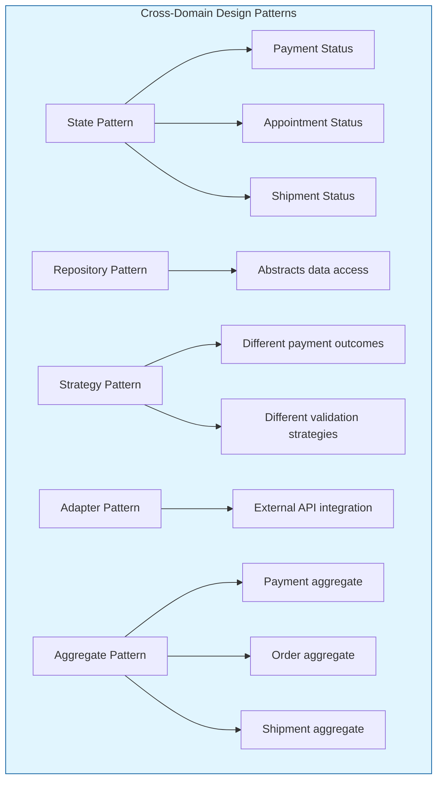

# Clean Architecture Anti-Pattern in Python - Across Real-World Domains - Part 5

**Series:** Clean Architecture Anti-Pattern in Python  
**Previous:** [4. ⚙️ Clean Architecture Anti-Pattern in Python - Building the Result Pattern - Part 4](#)  
**Read Time:** 28 Min  
**Level:** Advanced  
**Target:** Python 3.12+ | Clean Architecture | Domain-Driven Design

---

## Introduction: Theory Meets Practice

In **Part 1** of this series, we established the architectural violation of using exceptions for domain outcomes. In **Part 2**, we quantified the performance cost. In **Part 3**, we provided the comprehensive taxonomy distinguishing infrastructure from domain concerns. In **Part 4**, we delivered the complete Result pattern implementation with Python 3.12+ features.

This story brings all these principles together through four complete, real-world case studies. Each case study demonstrates the Result pattern in action across distinct business domains, showing how to:

- Model domain outcomes using the Result pattern
- Distinguish infrastructure exceptions from domain outcomes
- Integrate with external services and databases
- Handle complex business rules with functional composition
- Test domain logic without exception assertions

---

## Key Takeaways from Previous Stories

| Story | Key Takeaway |
|-------|--------------|
| **1. 🏛️ A Developer's Guide to Resilience - Part 1** | Domain exceptions at presentation boundaries violate Clean Architecture. The Result pattern restores proper layer separation. |
| **2. 🎭 Domain Logic in Disguise - Part 2** | Exceptions for domain outcomes are 23x slower and allocate 12x more memory than Result pattern failures in Python. |
| **3. 🔍 Defining the Boundary - Part 3** | Determinism distinguishes infrastructure (non-deterministic) from domain outcomes (deterministic). |
| **4. ⚙️ Building the Result Pattern - Part 4** | Complete Result[T] and DomainError implementation with functional extensions and Python 3.12+ features. |

This story applies these principles to real business domains, demonstrating the pattern's versatility and power.

---

## 1. Case Study: Payment Processing Domain

### 1.1 Domain Context

A payment processing system must handle:
- Multiple payment methods (credit card, bank transfer, digital wallet)
- Fraud detection and risk scoring
- Idempotency for duplicate prevention
- Integration with external payment gateways
- Complex business rules for different regions

### 1.2 Domain Model

```python
# domain/payment/payment_transaction.py
# Payment transaction domain model with Result pattern
# Design Pattern: State Pattern - payment status state machine
# SOLID: Single Responsibility - payment model only handles payment logic

from dataclasses import dataclass, field
from datetime import datetime, UTC
from enum import Enum, auto
from typing import Optional, Dict, Any
from uuid import uuid4, UUID


class PaymentStatus(Enum):
    """Payment status state machine."""
    PENDING = auto()
    SUCCESSFUL = auto()
    DECLINED = auto()
    FRAUD_REVIEW = auto()
    REFUNDED = auto()
    FAILED = auto()
    
    def can_transition_to(self, new_status: 'PaymentStatus') -> bool:
        """Check if transition is valid."""
        transitions = {
            PaymentStatus.PENDING: [PaymentStatus.SUCCESSFUL, PaymentStatus.DECLINED, 
                                   PaymentStatus.FRAUD_REVIEW, PaymentStatus.FAILED],
            PaymentStatus.SUCCESSFUL: [PaymentStatus.REFUNDED],
            PaymentStatus.DECLINED: [],
            PaymentStatus.FRAUD_REVIEW: [PaymentStatus.SUCCESSFUL, PaymentStatus.DECLINED],
            PaymentStatus.REFUNDED: [],
            PaymentStatus.FAILED: [PaymentStatus.PENDING],  # Retry possible
        }
        return new_status in transitions.get(self, [])


@dataclass(frozen=True)
class PaymentTransaction:
    """
    Payment transaction aggregate root.
    
    Design Pattern: Value Object - immutable payment record
    SOLID: Single Responsibility - only manages payment state
    """
    
    id: UUID
    customer_id: UUID
    amount: float
    currency: str
    payment_method: str
    status: PaymentStatus
    idempotency_key: str
    created_at: datetime
    processed_at: Optional[datetime] = None
    gateway_transaction_id: Optional[str] = None
    decline_reason: Optional[str] = None
    risk_score: Optional[float] = None
    
    @classmethod
    def create(
        cls,
        customer_id: UUID,
        amount: float,
        currency: str,
        payment_method: str,
        idempotency_key: str
    ) -> 'PaymentTransaction':
        """Factory method to create a new pending payment."""
        return cls(
            id=uuid4(),
            customer_id=customer_id,
            amount=amount,
            currency=currency,
            payment_method=payment_method,
            status=PaymentStatus.PENDING,
            idempotency_key=idempotency_key,
            created_at=datetime.now(UTC)
        )
    
    def mark_successful(self, gateway_transaction_id: str) -> Result['PaymentTransaction']:
        """
        Mark payment as successful.
        
        Returns Result[PaymentTransaction] - success with updated transaction or domain error.
        """
        if not self.status.can_transition_to(PaymentStatus.SUCCESSFUL):
            return Result.failure(
                DomainError.invalid_state(
                    "Payment",
                    self.id,
                    self.status.name,
                    [s.name for s in [PaymentStatus.SUCCESSFUL]]
                )
            )
        
        # Create new immutable instance with updated state
        return Result.success(PaymentTransaction(
            id=self.id,
            customer_id=self.customer_id,
            amount=self.amount,
            currency=self.currency,
            payment_method=self.payment_method,
            status=PaymentStatus.SUCCESSFUL,
            idempotency_key=self.idempotency_key,
            created_at=self.created_at,
            processed_at=datetime.now(UTC),
            gateway_transaction_id=gateway_transaction_id,
            decline_reason=None,
            risk_score=self.risk_score
        ))
    
    def mark_declined(self, reason: str) -> Result['PaymentTransaction']:
        """Mark payment as declined."""
        if not self.status.can_transition_to(PaymentStatus.DECLINED):
            return Result.failure(
                DomainError.invalid_state(
                    "Payment",
                    self.id,
                    self.status.name,
                    [s.name for s in [PaymentStatus.DECLINED]]
                )
            )
        
        return Result.success(PaymentTransaction(
            id=self.id,
            customer_id=self.customer_id,
            amount=self.amount,
            currency=self.currency,
            payment_method=self.payment_method,
            status=PaymentStatus.DECLINED,
            idempotency_key=self.idempotency_key,
            created_at=self.created_at,
            processed_at=datetime.now(UTC),
            decline_reason=reason,
            risk_score=self.risk_score
        ))
    
    def mark_fraud_suspected(self, risk_score: float) -> Result['PaymentTransaction']:
        """Mark payment for fraud review."""
        if not self.status.can_transition_to(PaymentStatus.FRAUD_REVIEW):
            return Result.failure(
                DomainError.invalid_state(
                    "Payment",
                    self.id,
                    self.status.name,
                    [s.name for s in [PaymentStatus.FRAUD_REVIEW]]
                )
            )
        
        return Result.success(PaymentTransaction(
            id=self.id,
            customer_id=self.customer_id,
            amount=self.amount,
            currency=self.currency,
            payment_method=self.payment_method,
            status=PaymentStatus.FRAUD_REVIEW,
            idempotency_key=self.idempotency_key,
            created_at=self.created_at,
            processed_at=datetime.now(UTC),
            risk_score=risk_score
        ))
```

### 1.3 Domain Service Implementation

```python
# domain/services/payment_service.py
# Payment service with Result pattern
# Design Pattern: Strategy Pattern - different handling strategies per outcome
# SOLID: Dependency Inversion - depends on abstractions

import logging
from typing import Optional
import httpx

logger = logging.getLogger(__name__)


class PaymentService:
    """
    Payment processing service with clear domain/infrastructure boundaries.
    
    Design Pattern: Strategy Pattern - different strategies for payment outcomes
    SOLID: Single Responsibility - only handles payment orchestration
    """
    
    def __init__(
        self,
        payment_repository,
        customer_repository,
        gateway_client,
        fraud_detection_service
    ):
        self._payment_repo = payment_repository
        self._customer_repo = customer_repository
        self._gateway = gateway_client
        self._fraud_detection = fraud_detection_service
    
    async def process_payment(self, request: PaymentRequest) -> Result[PaymentTransaction]:
        """
        Process a payment.
        
        Returns Result[PaymentTransaction] - success or domain failure.
        """
        # DOMAIN OUTCOME: Validate amount
        if request.amount <= 0:
            return Result.failure(
                DomainError.validation("amount", "Payment amount must be positive")
            )
        
        if request.amount > 50000:
            return Result.failure(
                DomainError.business_rule(
                    "payment.limit_exceeded",
                    "Payments exceeding $50,000 require manual approval"
                )
            )
        
        # DOMAIN OUTCOME: Validate customer exists
        customer_result = await self._customer_repo.get_by_id(request.customer_id)
        if customer_result.is_failure:
            return Result.failure(customer_result.error)
        
        customer = customer_result.value
        
        # DOMAIN OUTCOME: Check customer status
        if customer.is_blocked:
            return Result.failure(
                DomainError.business_rule(
                    "customer.blocked",
                    "Customer account is blocked from processing payments"
                )
            )
        
        # DOMAIN OUTCOME: Idempotency check
        existing_result = await self._payment_repo.get_by_idempotency_key(
            request.idempotency_key
        )
        
        if existing_result.is_success and existing_result.value:
            logger.info(f"Duplicate payment prevented for key {request.idempotency_key}")
            return Result.success(existing_result.value)
        
        # Create payment transaction
        payment = PaymentTransaction.create(
            customer_id=request.customer_id,
            amount=request.amount,
            currency=request.currency,
            payment_method=request.payment_method,
            idempotency_key=request.idempotency_key
        )
        
        # Save pending transaction
        save_result = await self._payment_repo.add(payment)
        if save_result.is_failure:
            return Result.failure(save_result.error)
        
        await self._payment_repo.save_changes()
        
        # DOMAIN OUTCOME: Fraud detection
        fraud_result = await self._fraud_detection.analyze(payment, customer, request)
        
        if fraud_result.is_failure:
            return Result.failure(fraud_result.error)
        
        if fraud_result.value.risk_score > 0.9:  # High risk threshold
            # Update payment with fraud suspicion
            update_result = await self._update_payment_status(
                payment, fraud_result.value.risk_score, "fraud"
            )
            if update_result.is_failure:
                return update_result
            
            return Result.failure(
                DomainError.business_rule(
                    "payment.fraud_suspected",
                    "Transaction flagged for fraud review. Please contact support.",
                    {"risk_score": fraud_result.value.risk_score}
                )
            )
        
        try:
            # INFRASTRUCTURE CALL: External payment gateway
            gateway_response = await self._gateway.charge(
                GatewayChargeRequest(
                    amount=request.amount,
                    currency=request.currency,
                    payment_method=request.payment_method,
                    card_details=request.card_details,
                    idempotency_key=request.idempotency_key
                )
            )
            
            # DOMAIN OUTCOMES: Process gateway response
            match gateway_response.status:
                case GatewayPaymentStatus.SUCCESS:
                    return await self._handle_success(payment, gateway_response)
                
                case GatewayPaymentStatus.INSUFFICIENT_FUNDS:
                    return await self._handle_decline(
                        payment,
                        DomainError.insufficient_funds(
                            gateway_response.available_balance,
                            request.amount
                        )
                    )
                
                case GatewayPaymentStatus.CARD_DECLINED:
                    return await self._handle_decline(
                        payment,
                        DomainError.business_rule(
                            "payment.card_declined",
                            f"Card declined: {gateway_response.decline_reason}"
                        )
                    )
                
                case GatewayPaymentStatus.INVALID_CVV:
                    return await self._handle_decline(
                        payment,
                        DomainError.validation("cvv", "Invalid CVV code")
                    )
                
                case GatewayPaymentStatus.EXPIRED_CARD:
                    return await self._handle_decline(
                        payment,
                        DomainError.validation("card", "Card has expired")
                    )
                
                case GatewayPaymentStatus.FRAUD_SUSPECTED:
                    return await self._handle_decline(
                        payment,
                        DomainError.business_rule(
                            "payment.fraud_suspected",
                            "Transaction flagged for fraud review by gateway"
                        )
                    )
                
                case _:
                    return Result.failure(
                        DomainError.business_rule(
                            "payment.unknown",
                            f"Unknown gateway status: {gateway_response.status}"
                        )
                    )
                    
        except httpx.HTTPStatusError as ex:
            # INFRASTRUCTURE EXCEPTION - Classify using HTTP classifier
            if ex.response.status_code in (503, 504, 502):
                logger.warning(f"Payment gateway transient error: {ex}")
                raise TransientInfrastructureException(
                    "Payment gateway temporarily unavailable",
                    error_code=f"PAY_GW_{ex.response.status_code}",
                    inner_exception=ex,
                    retry_after=30
                )
            
            if ex.response.status_code in (400, 422):
                # Gateway returned business error
                return Result.failure(
                    DomainError.business_rule(
                        "payment.gateway_error",
                        f"Payment gateway error: {ex.response.text}"
                    )
                )
            
            raise NonTransientInfrastructureException(
                f"Payment gateway error: {ex}",
                error_code=f"PAY_GW_{ex.response.status_code}",
                inner_exception=ex
            )
            
        except httpx.TimeoutException as ex:
            # INFRASTRUCTURE EXCEPTION - Transient
            logger.warning(f"Payment gateway timeout: {ex}")
            raise TransientInfrastructureException(
                "Payment gateway timeout",
                error_code="PAY_GW_TIMEOUT",
                inner_exception=ex,
                retry_after=30
            )
    
    async def _handle_success(
        self,
        payment: PaymentTransaction,
        response: GatewayPaymentResponse
    ) -> Result[PaymentTransaction]:
        """Handle successful payment."""
        update_result = await self._update_payment_status(
            payment, response.transaction_id, "success"
        )
        
        if update_result.is_failure:
            return update_result
        
        logger.info(f"Payment {payment.id} processed successfully")
        
        return Result.success(update_result.value)
    
    async def _handle_decline(
        self,
        payment: PaymentTransaction,
        error: DomainError
    ) -> Result[PaymentTransaction]:
        """Handle declined payment."""
        update_result = await self._update_payment_status(
            payment, error.message, "decline"
        )
        
        if update_result.is_failure:
            return update_result
        
        logger.info(f"Payment {payment.id} declined: {error.code}")
        
        return Result.failure(error)
    
    async def _update_payment_status(
        self,
        payment: PaymentTransaction,
        value: str,
        action: str
    ) -> Result[PaymentTransaction]:
        """Update payment status based on action."""
        
        if action == "success":
            updated = payment.mark_successful(value)
        elif action == "decline":
            updated = payment.mark_declined(value)
        elif action == "fraud":
            updated = payment.mark_fraud_suspected(float(value))
        else:
            return Result.failure(
                DomainError.business_rule("payment.invalid_action", f"Unknown action: {action}")
            )
        
        if updated.is_failure:
            return updated
        
        save_result = await self._payment_repo.update(updated.value)
        if save_result.is_failure:
            return save_result
        
        await self._payment_repo.save_changes()
        
        return updated
```

### 1.4 Key Takeaways from Payment Processing

| Concept | Implementation |
|---------|----------------|
| **Domain Outcomes** | Insufficient funds, card declined, invalid CVV, fraud suspicion |
| **Infrastructure Exceptions** | Gateway timeout, 503 unavailable, authentication failure |
| **Idempotency** | Duplicate requests return existing result |
| **Fraud Detection** | Domain rule with risk scoring before gateway call |
| **State Management** | Payment entity encapsulates state transition rules |

---

## 2. Case Study: Inventory Management Domain

### 2.1 Domain Context

An inventory management system must handle:
- High concurrency (multiple users reserving same product)
- Multi-warehouse distribution
- Reservation expiration and release
- Safety stock and reorder points
- Bulk operations for cart checkout

### 2.2 Domain Model

```python
# domain/inventory/inventory_item.py
# Inventory item domain model with Result pattern
# Design Pattern: Aggregate Pattern - inventory item as aggregate root
# SOLID: Single Responsibility - manages inventory state only

from dataclasses import dataclass, field
from datetime import datetime, timedelta, UTC
from typing import Optional, List
from uuid import uuid4, UUID


@dataclass
class InventoryItem:
    """
    Inventory item aggregate root.
    
    Design Pattern: Aggregate Pattern - manages inventory reservations
    SOLID: Single Responsibility - only handles inventory operations
    """
    
    id: UUID
    product_id: UUID
    warehouse_id: UUID
    physical_quantity: int
    reserved_quantity: int = 0
    safety_stock: int = 0
    reorder_point: int = 0
    track_inventory: bool = True
    
    @property
    def available_quantity(self) -> int:
        """Calculate available quantity (physical - reserved - safety stock)."""
        return self.physical_quantity - self.reserved_quantity - self.safety_stock
    
    @classmethod
    def create(
        cls,
        product_id: UUID,
        warehouse_id: UUID,
        initial_quantity: int,
        safety_stock: int = 0,
        reorder_point: int = 0
    ) -> 'InventoryItem':
        """Factory method to create a new inventory item."""
        return cls(
            id=uuid4(),
            product_id=product_id,
            warehouse_id=warehouse_id,
            physical_quantity=initial_quantity,
            reserved_quantity=0,
            safety_stock=safety_stock,
            reorder_point=reorder_point,
            track_inventory=True
        )
    
    def reserve(self, quantity: int, order_id: UUID, duration_minutes: int = 30) -> Result['Reservation']:
        """
        Reserve inventory for an order.
        
        Returns Result[Reservation] - success with reservation or domain error.
        """
        if not self.track_inventory:
            return Result.success(
                Reservation.create_unreserved(order_id, self.product_id, quantity)
            )
        
        if quantity <= 0:
            return Result.failure(
                DomainError.validation("quantity", "Reservation quantity must be positive")
            )
        
        if quantity > 1000:
            return Result.failure(
                DomainError.business_rule(
                    "reservation.quantity_exceeded",
                    "Cannot reserve more than 1000 units in a single reservation"
                )
            )
        
        if self.available_quantity < quantity:
            return Result.failure(
                DomainError.out_of_stock(
                    str(self.product_id),
                    quantity,
                    self.available_quantity
                )
            )
        
        self.reserved_quantity += quantity
        
        return Result.success(
            Reservation.create(
                inventory_item_id=self.id,
                order_id=order_id,
                product_id=self.product_id,
                quantity=quantity,
                expires_at=datetime.now(UTC) + timedelta(minutes=duration_minutes)
            )
        )
    
    def release_reservation(self, quantity: int) -> Result[bool]:
        """Release a reservation."""
        if quantity <= 0:
            return Result.failure(
                DomainError.validation("quantity", "Release quantity must be positive")
            )
        
        if self.reserved_quantity < quantity:
            return Result.failure(
                DomainError.business_rule(
                    "inventory.reservation_mismatch",
                    f"Cannot release {quantity} units. Only {self.reserved_quantity} units reserved."
                )
            )
        
        self.reserved_quantity -= quantity
        
        return Result.success(True)
    
    def restock(self, quantity: int) -> Result[bool]:
        """Restock inventory."""
        if quantity <= 0:
            return Result.failure(
                DomainError.validation("quantity", "Restock quantity must be positive")
            )
        
        self.physical_quantity += quantity
        
        return Result.success(True)
    
    def needs_reorder(self) -> bool:
        """Check if inventory needs reorder."""
        return self.track_inventory and self.available_quantity <= self.reorder_point


@dataclass
class Reservation:
    """Inventory reservation value object."""
    
    id: UUID
    inventory_item_id: Optional[UUID]
    order_id: UUID
    product_id: UUID
    quantity: int
    expires_at: datetime
    status: str = "active"  # active, confirmed, released, expired
    
    @classmethod
    def create(
        cls,
        inventory_item_id: UUID,
        order_id: UUID,
        product_id: UUID,
        quantity: int,
        expires_at: datetime
    ) -> 'Reservation':
        """Create a new active reservation."""
        return cls(
            id=uuid4(),
            inventory_item_id=inventory_item_id,
            order_id=order_id,
            product_id=product_id,
            quantity=quantity,
            expires_at=expires_at,
            status="active"
        )
    
    @classmethod
    def create_unreserved(cls, order_id: UUID, product_id: UUID, quantity: int) -> 'Reservation':
        """Create a reservation for non-tracked inventory."""
        return cls(
            id=uuid4(),
            inventory_item_id=None,
            order_id=order_id,
            product_id=product_id,
            quantity=quantity,
            expires_at=datetime.max,
            status="unreserved"
        )
    
    def is_expired(self) -> bool:
        """Check if reservation has expired."""
        return self.status == "active" and datetime.now(UTC) > self.expires_at
    
    def confirm(self) -> Result['Reservation']:
        """Confirm the reservation (converts to actual stock reduction)."""
        if self.status != "active":
            return Result.failure(
                DomainError.business_rule(
                    "reservation.invalid_state",
                    f"Cannot confirm reservation {self.id}. Current status: {self.status}"
                )
            )
        
        if self.is_expired():
            self.status = "expired"
            return Result.failure(
                DomainError.business_rule(
                    "reservation.expired",
                    f"Reservation {self.id} has expired"
                )
            )
        
        self.status = "confirmed"
        
        return Result.success(self)
    
    def release(self) -> Result['Reservation']:
        """Release the reservation."""
        if self.status not in ("active", "expired"):
            return Result.failure(
                DomainError.business_rule(
                    "reservation.invalid_state",
                    f"Cannot release reservation {self.id}. Current status: {self.status}"
                )
            )
        
        self.status = "released"
        
        return Result.success(self)
```

### 2.3 Domain Service Implementation

```python
# domain/services/inventory_service.py
# Inventory service with Result pattern and distributed lock
# Design Pattern: Repository Pattern - abstracts inventory data access
# SOLID: Dependency Inversion - depends on abstractions

import asyncio
import logging
from typing import List, Optional
from contextlib import asynccontextmanager

logger = logging.getLogger(__name__)


class InventoryService:
    """
    Inventory management service with distributed locking.
    
    Design Pattern: Repository Pattern - coordinates inventory operations
    SOLID: Single Responsibility - only handles inventory orchestration
    """
    
    def __init__(
        self,
        inventory_repository,
        reservation_repository,
        product_repository,
        distributed_lock
    ):
        self._inventory_repo = inventory_repository
        self._reservation_repo = reservation_repository
        self._product_repo = product_repository
        self._lock = distributed_lock
    
    async def reserve(
        self,
        product_id: UUID,
        quantity: int,
        order_id: UUID,
        duration_minutes: int = 30
    ) -> Result[Reservation]:
        """
        Reserve inventory for an order.
        
        Returns Result[Reservation] - success with reservation or domain error.
        """
        # DOMAIN OUTCOME: Validate quantity
        if quantity <= 0:
            return Result.failure(
                DomainError.validation("quantity", "Reservation quantity must be positive")
            )
        
        if quantity > 1000:
            return Result.failure(
                DomainError.business_rule(
                    "reservation.quantity_exceeded",
                    "Cannot reserve more than 1000 units in a single reservation"
                )
            )
        
        # DOMAIN OUTCOME: Validate product exists
        product_result = await self._product_repo.get_by_id(product_id)
        if product_result.is_failure:
            return Result.failure(product_result.error)
        
        product = product_result.value
        
        # DOMAIN OUTCOME: Check minimum order quantity
        if quantity < product.minimum_order_quantity:
            return Result.failure(
                DomainError.validation(
                    "quantity",
                    f"Minimum order quantity for {product.name} is {product.minimum_order_quantity}"
                )
            )
        
        # INFRASTRUCTURE: Distributed lock to prevent race conditions
        lock_key = f"inventory:reservation:{product_id}"
        
        async with self._lock.acquire(lock_key, timeout=10) as acquired:
            if not acquired:
                logger.warning(f"Lock contention for product {product_id}")
                return Result.failure(
                    DomainError.conflict(
                        "Inventory",
                        "System busy processing inventory. Please retry."
                    )
                )
            
            # Find best warehouse for this product
            inventory_result = await self._inventory_repo.find_best_warehouse(
                product_id, quantity
            )
            
            if inventory_result.is_failure:
                return Result.failure(inventory_result.error)
            
            if inventory_result.value is None:
                return Result.failure(
                    DomainError.out_of_stock(str(product_id), quantity, 0)
                )
            
            inventory_item = inventory_result.value
            
            # Check for existing reservation
            existing_result = await self._reservation_repo.get_active_by_order_and_product(
                order_id, product_id
            )
            
            if existing_result.is_success and existing_result.value:
                logger.info(
                    f"Reservation already exists for order {order_id}, product {product_id}"
                )
                return Result.success(existing_result.value)
            
            # Create reservation
            reservation_result = inventory_item.reserve(
                quantity, order_id, duration_minutes
            )
            
            if reservation_result.is_failure:
                return Result.failure(reservation_result.error)
            
            reservation = reservation_result.value
            
            # Save changes
            update_result = await self._inventory_repo.update(inventory_item)
            if update_result.is_failure:
                return Result.failure(update_result.error)
            
            save_result = await self._reservation_repo.add(reservation)
            if save_result.is_failure:
                # Compensate: release the reserved quantity
                inventory_item.release_reservation(quantity)
                await self._inventory_repo.update(inventory_item)
                return Result.failure(save_result.error)
            
            await self._inventory_repo.save_changes()
            
            logger.info(
                f"Reservation {reservation.id} created for order {order_id}, "
                f"product {product_id}, quantity {quantity}"
            )
            
            return Result.success(reservation)
    
    async def bulk_reserve(
        self,
        items: List[BulkReserveItem],
        order_id: UUID,
        all_or_nothing: bool = True
    ) -> Result[BulkReservationResult]:
        """
        Bulk reserve multiple products.
        
        Returns Result[BulkReservationResult] - success with results or domain error.
        """
        # DOMAIN OUTCOME: Validate request
        if not items:
            return Result.failure(
                DomainError.validation("items", "Bulk reservation must contain at least one item")
            )
        
        # Sort products to prevent deadlocks (consistent lock ordering)
        sorted_items = sorted(items, key=lambda i: i.product_id)
        
        reservations = []
        failed_items = []
        
        # Process each item
        for item in sorted_items:
            result = await self.reserve(
                product_id=item.product_id,
                quantity=item.quantity,
                order_id=order_id,
                duration_minutes=item.reservation_minutes or 30
            )
            
            if result.is_success:
                reservations.append(result.value)
            else:
                failed_items.append(BulkReservationFailure(
                    product_id=item.product_id,
                    quantity=item.quantity,
                    reason=result.error.message,
                    error_code=result.error.code
                ))
                
                if all_or_nothing:
                    # Release all successful reservations
                    for reservation in reservations:
                        await self.release_reservation(reservation.id)
                    
                    return Result.failure(
                        DomainError.business_rule(
                            "bulk_reservation.failed",
                            "Bulk reservation failed. All reservations released.",
                            {"failed_items": failed_items}
                        )
                    )
        
        return Result.success(BulkReservationResult(
            successful_reservations=reservations,
            failed_items=failed_items,
            overall_status="partial" if failed_items else "success",
            expires_at=min(r.expires_at for r in reservations) if reservations else None
        ))
    
    async def release_reservation(self, reservation_id: UUID) -> Result[bool]:
        """
        Release a reservation.
        
        Returns Result[bool] - success or domain error.
        """
        reservation_result = await self._reservation_repo.get_by_id(reservation_id)
        if reservation_result.is_failure:
            return Result.failure(reservation_result.error)
        
        reservation = reservation_result.value
        
        if reservation.status != "active":
            # Already released or expired - consider it done
            return Result.success(True)
        
        # Check if expired
        if reservation.is_expired():
            release_result = reservation.release()
            if release_result.is_failure:
                return Result.failure(release_result.error)
            
            await self._reservation_repo.update(reservation)
            await self._reservation_repo.save_changes()
            return Result.success(True)
        
        # Lock to update inventory
        lock_key = f"inventory:reservation:{reservation.product_id}"
        
        async with self._lock.acquire(lock_key, timeout=10) as acquired:
            if not acquired:
                return Result.failure(
                    DomainError.conflict(
                        "Inventory",
                        "System busy processing inventory. Please retry."
                    )
                )
            
            if reservation.inventory_item_id:
                inventory_result = await self._inventory_repo.get_by_id(
                    reservation.inventory_item_id
                )
                
                if inventory_result.is_success and inventory_result.value:
                    inventory_result.value.release_reservation(reservation.quantity)
                    await self._inventory_repo.update(inventory_result.value)
            
            release_result = reservation.release()
            if release_result.is_failure:
                return Result.failure(release_result.error)
            
            await self._reservation_repo.update(reservation)
            await self._reservation_repo.save_changes()
            
            logger.info(f"Reservation {reservation_id} released")
            
            return Result.success(True)
```

### 2.4 Key Takeaways from Inventory Management

| Concept | Implementation |
|---------|----------------|
| **Domain Outcomes** | Out of stock, minimum order quantity, reservation conflicts |
| **Infrastructure Exceptions** | Database deadlock, timeout, lock contention |
| **Concurrency** | Distributed locks for consistent reservation |
| **Bulk Operations** | All-or-nothing semantics with compensation |
| **Reservation Lifecycle** | Active → Confirmed/Released/Expired state machine |

---

## 3. Case Study: Healthcare Scheduling Domain

### 3.1 Domain Context

A healthcare scheduling system must handle:
- Provider availability and leave management
- Double-booking prevention (patient safety)
- Insurance verification integration
- EMR system synchronization
- Appointment type rules (urgent care, routine, specialist)

### 3.2 Domain Model

```python
# domain/healthcare/appointment.py
# Appointment domain model with Result pattern
# Design Pattern: State Pattern - appointment status state machine
# SOLID: Single Responsibility - manages appointment lifecycle

from dataclasses import dataclass, field
from datetime import datetime, timedelta, UTC
from enum import Enum, auto
from typing import Optional, List
from uuid import uuid4, UUID


class AppointmentType(Enum):
    """Types of medical appointments."""
    ROUTINE = auto()
    URGENT_CARE = auto()
    SPECIALIST = auto()
    FOLLOW_UP = auto()
    VACCINATION = auto()
    PHYSICAL_EXAM = auto()


class AppointmentStatus(Enum):
    """Appointment status state machine."""
    SCHEDULED = auto()
    CONFIRMED = auto()
    COMPLETED = auto()
    CANCELLED = auto()
    NO_SHOW = auto()
    
    def can_transition_to(self, new_status: 'AppointmentStatus') -> bool:
        """Check if transition is valid."""
        transitions = {
            AppointmentStatus.SCHEDULED: [AppointmentStatus.CONFIRMED, AppointmentStatus.CANCELLED],
            AppointmentStatus.CONFIRMED: [AppointmentStatus.COMPLETED, AppointmentStatus.CANCELLED, AppointmentStatus.NO_SHOW],
            AppointmentStatus.COMPLETED: [],
            AppointmentStatus.CANCELLED: [],
            AppointmentStatus.NO_SHOW: [],
        }
        return new_status in transitions.get(self, [])


@dataclass
class Appointment:
    """
    Appointment aggregate root.
    
    Design Pattern: Aggregate Pattern - manages appointment lifecycle
    SOLID: Single Responsibility - only handles appointment state
    """
    
    id: UUID
    patient_id: UUID
    provider_id: UUID
    start_time: datetime
    end_time: datetime
    type: AppointmentType
    status: AppointmentStatus
    created_at: datetime
    reason: Optional[str] = None
    is_telehealth: bool = False
    insurance_eligibility_id: Optional[str] = None
    requires_reconciliation: bool = False
    
    @classmethod
    def schedule(
        cls,
        patient_id: UUID,
        provider_id: UUID,
        start_time: datetime,
        end_time: datetime,
        appointment_type: AppointmentType,
        is_telehealth: bool = False
    ) -> 'Appointment':
        """Factory method to schedule a new appointment."""
        return cls(
            id=uuid4(),
            patient_id=patient_id,
            provider_id=provider_id,
            start_time=start_time,
            end_time=end_time,
            type=appointment_type,
            status=AppointmentStatus.SCHEDULED,
            created_at=datetime.now(UTC),
            is_telehealth=is_telehealth
        )
    
    def confirm(self) -> Result['Appointment']:
        """Confirm the appointment."""
        if not self.status.can_transition_to(AppointmentStatus.CONFIRMED):
            return Result.failure(
                DomainError.invalid_state(
                    "Appointment",
                    self.id,
                    self.status.name,
                    [s.name for s in [AppointmentStatus.CONFIRMED]]
                )
            )
        
        self.status = AppointmentStatus.CONFIRMED
        
        return Result.success(self)
    
    def cancel(self, reason: str) -> Result['Appointment']:
        """Cancel the appointment."""
        if not self.status.can_transition_to(AppointmentStatus.CANCELLED):
            return Result.failure(
                DomainError.invalid_state(
                    "Appointment",
                    self.id,
                    self.status.name,
                    [s.name for s in [AppointmentStatus.CANCELLED]]
                )
            )
        
        # DOMAIN RULE: Cancellation window check
        hours_until_appointment = (self.start_time - datetime.now(UTC)).total_seconds() / 3600
        
        if hours_until_appointment < 24 and self.type != AppointmentType.URGENT_CARE:
            return Result.failure(
                DomainError.business_rule(
                    "appointment.cancel_window_expired",
                    "Appointments must be cancelled at least 24 hours in advance"
                )
            )
        
        self.status = AppointmentStatus.CANCELLED
        self.reason = reason
        
        return Result.success(self)
    
    def complete(self) -> Result['Appointment']:
        """Mark appointment as completed."""
        if not self.status.can_transition_to(AppointmentStatus.COMPLETED):
            return Result.failure(
                DomainError.invalid_state(
                    "Appointment",
                    self.id,
                    self.status.name,
                    [s.name for s in [AppointmentStatus.COMPLETED]]
                )
            )
        
        self.status = AppointmentStatus.COMPLETED
        
        return Result.success(self)
    
    def mark_no_show(self) -> Result['Appointment']:
        """Mark patient as no-show."""
        if not self.status.can_transition_to(AppointmentStatus.NO_SHOW):
            return Result.failure(
                DomainError.invalid_state(
                    "Appointment",
                    self.id,
                    self.status.name,
                    [s.name for s in [AppointmentStatus.NO_SHOW]]
                )
            )
        
        self.status = AppointmentStatus.NO_SHOW
        
        return Result.success(self)


@dataclass
class ProviderSchedule:
    """Provider working hours schedule."""
    
    provider_id: UUID
    day_of_week: int  # 0-6, Monday=0
    start_time: str   # "09:00"
    end_time: str     # "17:00"
    is_available: bool = True
    
    def is_within_working_hours(self, appointment_time: datetime) -> bool:
        """Check if appointment time is within working hours."""
        if not self.is_available:
            return False
        
        time_of_day = appointment_time.strftime("%H:%M")
        return self.start_time <= time_of_day < self.end_time
```

### 3.3 Domain Service Implementation

```python
# domain/services/appointment_service.py
# Appointment scheduling service with Result pattern
# Design Pattern: Strategy Pattern - different validation strategies
# SOLID: Dependency Inversion - depends on abstractions

import logging
from typing import List, Optional
from datetime import datetime, timedelta, UTC

logger = logging.getLogger(__name__)


class AppointmentSchedulingService:
    """
    Healthcare appointment scheduling service.
    
    Design Pattern: Strategy Pattern - different validation strategies per appointment type
    SOLID: Single Responsibility - only handles appointment scheduling
    """
    
    def __init__(
        self,
        appointment_repository,
        patient_repository,
        provider_repository,
        insurance_verification_service,
        emr_integration_service
    ):
        self._appointment_repo = appointment_repository
        self._patient_repo = patient_repository
        self._provider_repo = provider_repository
        self._insurance_service = insurance_verification_service
        self._emr_service = emr_integration_service
    
    async def schedule_appointment(
        self,
        request: ScheduleAppointmentRequest
    ) -> Result[Appointment]:
        """
        Schedule a new appointment.
        
        Returns Result[Appointment] - success with appointment or domain error.
        """
        # DOMAIN OUTCOME: Validate patient exists
        patient_result = await self._patient_repo.get_by_id(request.patient_id)
        if patient_result.is_failure:
            return Result.failure(patient_result.error)
        
        patient = patient_result.value
        
        # DOMAIN OUTCOME: Validate provider exists and is active
        provider_result = await self._provider_repo.get_by_id(request.provider_id)
        if provider_result.is_failure:
            return Result.failure(provider_result.error)
        
        provider = provider_result.value
        
        if not provider.is_active:
            return Result.failure(
                DomainError.business_rule(
                    "provider.inactive",
                    f"Provider {provider.name} is not currently accepting appointments"
                )
            )
        
        # DOMAIN OUTCOME: Validate appointment duration
        duration = request.end_time - request.start_time
        
        if duration < timedelta(minutes=15):
            return Result.failure(
                DomainError.validation("duration", "Appointment duration must be at least 15 minutes")
            )
        
        if duration > provider.max_appointment_duration:
            return Result.failure(
                DomainError.validation(
                    "duration",
                    f"Appointment duration cannot exceed {provider.max_appointment_duration.total_seconds() / 60} minutes"
                )
            )
        
        # DOMAIN OUTCOME: Validate scheduling window
        days_in_advance = (request.start_time.date() - datetime.now(UTC).date()).days
        
        if days_in_advance > provider.max_advance_booking_days:
            return Result.failure(
                DomainError.validation(
                    "start_time",
                    f"Cannot book appointments more than {provider.max_advance_booking_days} days in advance"
                )
            )
        
        if days_in_advance < provider.min_advance_booking_days:
            return Result.failure(
                DomainError.validation(
                    "start_time",
                    f"Appointments must be booked at least {provider.min_advance_booking_days} days in advance"
                )
            )
        
        # DOMAIN OUTCOME: Check provider availability
        is_available_result = await self._provider_repo.is_available(
            request.provider_id,
            request.start_time,
            request.end_time
        )
        
        if is_available_result.is_failure:
            return Result.failure(is_available_result.error)
        
        if not is_available_result.value:
            return Result.failure(
                DomainError.conflict(
                    "Provider",
                    "Provider not available during requested time"
                )
            )
        
        # DOMAIN OUTCOME: Check for double-booking (patient safety)
        conflicting_result = await self._appointment_repo.get_conflicting_appointments(
            request.provider_id,
            request.start_time,
            request.end_time
        )
        
        if conflicting_result.is_success and conflicting_result.value:
            return Result.failure(
                DomainError.conflict(
                    "Appointment",
                    "Time slot already booked",
                    {"conflicting_appointments": [a.id for a in conflicting_result.value]}
                )
            )
        
        # DOMAIN OUTCOME: Check if provider is on leave
        leave_result = await self._provider_repo.check_leave(
            request.provider_id,
            request.start_time,
            request.end_time
        )
        
        if leave_result.is_success and leave_result.value.is_on_leave:
            return Result.failure(
                DomainError.business_rule(
                    "provider.on_leave",
                    f"Provider is on leave from {leave_result.value.leave_start} to {leave_result.value.leave_end}"
                )
            )
        
        # DOMAIN OUTCOME: Insurance verification
        insurance_result = await self._insurance_service.verify_eligibility(
            request.patient_id,
            request.provider_id,
            request.start_time
        )
        
        if insurance_result.is_failure:
            return Result.failure(insurance_result.error)
        
        if not insurance_result.value.is_eligible:
            return Result.failure(
                DomainError.business_rule(
                    "insurance.not_eligible",
                    f"Insurance verification failed: {insurance_result.value.ineligibility_reason}"
                )
            )
        
        # Create appointment
        appointment = Appointment.schedule(
            patient_id=request.patient_id,
            provider_id=request.provider_id,
            start_time=request.start_time,
            end_time=request.end_time,
            appointment_type=request.appointment_type,
            is_telehealth=request.is_telehealth
        )
        
        try:
            # INFRASTRUCTURE: Save to local database
            save_result = await self._appointment_repo.add(appointment)
            if save_result.is_failure:
                return Result.failure(save_result.error)
            
            await self._appointment_repo.save_changes()
            
            # INFRASTRUCTURE: Sync with EMR system (fire and forget with reconciliation)
            try:
                emr_result = await self._emr_service.create_appointment_record(
                    EmrAppointmentRequest(
                        appointment_id=appointment.id,
                        patient_id=appointment.patient_id,
                        provider_id=appointment.provider_id,
                        start_time=appointment.start_time,
                        end_time=appointment.end_time,
                        appointment_type=appointment.type
                    )
                )
                
                if emr_result.is_failure:
                    logger.error(f"EMR sync failed for appointment {appointment.id}: {emr_result.error}")
                    appointment.requires_reconciliation = True
                    await self._appointment_repo.update(appointment)
                    await self._appointment_repo.save_changes()
                    
            except httpx.HTTPStatusError as ex:
                # INFRASTRUCTURE EXCEPTION - EMR system down
                logger.warning(f"EMR system unavailable for appointment {appointment.id}")
                appointment.requires_reconciliation = True
                await self._appointment_repo.update(appointment)
                await self._appointment_repo.save_changes()
            
            logger.info(f"Appointment {appointment.id} scheduled for patient {request.patient_id}")
            
            return Result.success(appointment)
            
        except asyncpg.exceptions.UniqueViolationError as ex:
            # INFRASTRUCTURE: Could be domain (double-booking) caught by constraint
            if "IX_Appointments_Provider_Time" in str(ex):
                return Result.failure(
                    DomainError.conflict(
                        "Appointment",
                        "Time slot was just booked by another patient"
                    )
                )
            
            logger.error(f"Database error scheduling appointment: {ex}")
            raise DatabaseInfrastructureException(
                "Database error during appointment scheduling",
                sql_error_number=2627,
                inner_exception=ex
            )
    
    async def get_available_slots(
        self,
        request: AvailabilityRequest
    ) -> Result[List[TimeSlot]]:
        """
        Get available time slots for a provider.
        
        Returns Result[List[TimeSlot]] - success with slots or domain error.
        """
        # DOMAIN OUTCOME: Validate provider exists
        provider_result = await self._provider_repo.get_by_id(request.provider_id)
        if provider_result.is_failure:
            return Result.failure(provider_result.error)
        
        # DOMAIN OUTCOME: Validate date range
        if request.end_date < request.start_date:
            return Result.failure(
                DomainError.validation("end_date", "End date must be after start date")
            )
        
        if (request.end_date - request.start_date).days > 30:
            return Result.failure(
                DomainError.validation(
                    "date_range",
                    "Date range cannot exceed 30 days"
                )
            )
        
        try:
            # INFRASTRUCTURE: Get schedule and existing appointments
            schedule_result = await self._provider_repo.get_schedule(
                request.provider_id,
                request.start_date,
                request.end_date
            )
            
            if schedule_result.is_failure:
                return Result.failure(schedule_result.error)
            
            existing_appointments = await self._appointment_repo.get_by_provider_and_date_range(
                request.provider_id,
                request.start_date,
                request.end_date
            )
            
            # Generate available slots
            slots = self._generate_available_slots(
                schedule_result.value,
                existing_appointments,
                request.appointment_duration,
                request.appointment_type
            )
            
            return Result.success(slots)
            
        except Exception as ex:
            logger.error(f"Error getting available slots: {ex}")
            raise
    
    def _generate_available_slots(
        self,
        schedule: List[ProviderSchedule],
        existing_appointments: List[Appointment],
        duration_minutes: int,
        appointment_type: AppointmentType
    ) -> List[TimeSlot]:
        """Generate available time slots based on schedule and existing appointments."""
        # Implementation would generate time slots based on working hours
        # and filter out booked slots
        slots = []
        
        # This is a simplified version
        for day in schedule:
            if not day.is_available:
                continue
            
            current_time = datetime.combine(day.date, datetime.strptime(day.start_time, "%H:%M").time())
            end_time = datetime.combine(day.date, datetime.strptime(day.end_time, "%H:%M").time())
            
            while current_time + timedelta(minutes=duration_minutes) <= end_time:
                # Check if slot is already booked
                is_booked = any(
                    a.start_time <= current_time < a.end_time
                    for a in existing_appointments
                )
                
                if not is_booked:
                    slots.append(TimeSlot(
                        start_time=current_time,
                        end_time=current_time + timedelta(minutes=duration_minutes),
                        is_available=True
                    ))
                
                current_time += timedelta(minutes=15)  # 15-minute increments
        
        return slots
```

### 3.4 Key Takeaways from Healthcare Scheduling

| Concept | Implementation |
|---------|----------------|
| **Domain Outcomes** | Provider unavailable, double-booking, insurance ineligible, leave conflict |
| **Infrastructure Exceptions** | EMR system unavailable, database timeout, insurance service down |
| **Patient Safety** | Double-booking prevention with domain rules |
| **Regulatory Compliance** | Audit logging and reconciliation flags |
| **External Integration** | EMR sync with graceful degradation and retry |

---

## 4. Case Study: Logistics Tracking Domain

### 4.1 Domain Context

A logistics tracking system must handle:
- Real-time GPS location updates
- Carrier API integration
- Delivery window management
- Proof of delivery (signature, photo)
- Route optimization with multiple stops

### 4.2 Domain Model

```python
# domain/logistics/shipment.py
# Shipment domain model with Result pattern
# Design Pattern: Aggregate Pattern - shipment as aggregate root
# SOLID: Single Responsibility - manages shipment lifecycle

from dataclasses import dataclass, field
from datetime import datetime, UTC
from enum import Enum, auto
from typing import Optional, List
from uuid import uuid4, UUID
import math


class ShipmentStatus(Enum):
    """Shipment status state machine."""
    CREATED = auto()
    READY_FOR_PICKUP = auto()
    ASSIGNED = auto()
    PICKED_UP = auto()
    IN_TRANSIT = auto()
    NEAR_DESTINATION = auto()
    ARRIVED_AT_DESTINATION = auto()
    DELIVERED = auto()
    EXCEPTION = auto()
    CANCELLED = auto()


class LocationSource(Enum):
    """Source of location update."""
    GPS = auto()
    CARRIER_API = auto()
    MANUAL = auto()
    GEOFENCE = auto()


@dataclass
class GeoCoordinates:
    """Geographic coordinates value object."""
    latitude: float
    longitude: float
    
    def validate(self) -> Result[bool]:
        """Validate coordinates are within valid ranges."""
        if not (-90 <= self.latitude <= 90):
            return Result.failure(
                DomainError.validation("latitude", "Latitude must be between -90 and 90")
            )
        
        if not (-180 <= self.longitude <= 180):
            return Result.failure(
                DomainError.validation("longitude", "Longitude must be between -180 and 180")
            )
        
        return Result.success(True)


@dataclass
class ShipmentLocation:
    """Shipment location history value object."""
    id: UUID
    shipment_id: UUID
    coordinates: GeoCoordinates
    timestamp: datetime
    source: LocationSource


@dataclass
class DeliveryConfirmation:
    """Proof of delivery value object."""
    id: UUID
    shipment_id: UUID
    confirmed_at: datetime
    confirmed_by: str
    signature_data: Optional[bytes] = None
    photo_evidence: Optional[bytes] = None
    notes: Optional[str] = None


@dataclass
class Shipment:
    """
    Shipment aggregate root.
    
    Design Pattern: Aggregate Pattern - manages shipment lifecycle
    SOLID: Single Responsibility - only handles shipment operations
    """
    
    id: UUID
    tracking_number: str
    customer_id: UUID
    origin_address: dict
    destination_address: dict
    status: ShipmentStatus
    created_at: datetime
    location_history: List[ShipmentLocation] = field(default_factory=list)
    events: List[dict] = field(default_factory=list)
    estimated_delivery_date: Optional[datetime] = None
    actual_delivery_date: Optional[datetime] = None
    delivery_window_start: Optional[datetime] = None
    delivery_window_end: Optional[datetime] = None
    requires_signature: bool = False
    assigned_driver_id: Optional[UUID] = None
    carrier_tracking_number: Optional[str] = None
    
    @classmethod
    def create(
        cls,
        customer_id: UUID,
        origin_address: dict,
        destination_address: dict,
        requires_signature: bool = False
    ) -> 'Shipment':
        """Factory method to create a new shipment."""
        return cls(
            id=uuid4(),
            tracking_number=cls._generate_tracking_number(),
            customer_id=customer_id,
            origin_address=origin_address,
            destination_address=destination_address,
            status=ShipmentStatus.CREATED,
            created_at=datetime.now(UTC),
            requires_signature=requires_signature
        )
    
    @staticmethod
    def _generate_tracking_number() -> str:
        """Generate a unique tracking number."""
        import random
        import string
        prefix = "SHIP"
        date = datetime.now(UTC).strftime("%Y%m%d")
        random_part = ''.join(random.choices(string.ascii_uppercase + string.digits, k=6))
        return f"{prefix}{date}{random_part}"
    
    def assign_driver(self, driver_id: UUID) -> Result['Shipment']:
        """Assign a driver to the shipment."""
        if self.status not in (ShipmentStatus.CREATED, ShipmentStatus.READY_FOR_PICKUP):
            return Result.failure(
                DomainError.invalid_state(
                    "Shipment",
                    self.id,
                    self.status.name,
                    ["CREATED", "READY_FOR_PICKUP"]
                )
            )
        
        self.assigned_driver_id = driver_id
        self.status = ShipmentStatus.ASSIGNED
        self.events.append({
            "type": "driver_assigned",
            "driver_id": str(driver_id),
            "timestamp": datetime.now(UTC).isoformat()
        })
        
        return Result.success(self)
    
    def update_location(
        self,
        coordinates: GeoCoordinates,
        timestamp: datetime,
        source: LocationSource
    ) -> Result['Shipment']:
        """
        Update shipment location.
        
        Returns Result[Shipment] - success with updated shipment or domain error.
        """
        # DOMAIN RULE: Validate location
        validation_result = coordinates.validate()
        if validation_result.is_failure:
            return Result.failure(validation_result.error)
        
        if self.status == ShipmentStatus.DELIVERED:
            return Result.failure(
                DomainError.business_rule(
                    "shipment.already_delivered",
                    "Cannot update location for already delivered shipment"
                )
            )
        
        # DOMAIN RULE: Validate location plausibility
        if self.location_history:
            last_location = self.location_history[-1]
            distance = self._calculate_distance(
                last_location.coordinates.latitude,
                last_location.coordinates.longitude,
                coordinates.latitude,
                coordinates.longitude
            )
            
            time_since_last_update = (timestamp - last_location.timestamp).total_seconds() / 3600
            max_plausible_distance = 120 * time_since_last_update  # 120 km/h
            
            if distance > max_plausible_distance * 1.5:
                return Result.failure(
                    DomainError.business_rule(
                        "shipment.location_implausible",
                        f"Location update distance {distance:.2f}km in {time_since_last_update:.1f}h exceeds plausible range",
                        {"distance": distance, "time_hours": time_since_last_update}
                    )
                )
        
        # Add location to history
        location = ShipmentLocation(
            id=uuid4(),
            shipment_id=self.id,
            coordinates=coordinates,
            timestamp=timestamp,
            source=source
        )
        
        self.location_history.append(location)
        
        # Update status based on location proximity to destination
        distance_to_destination = self._calculate_distance(
            coordinates.latitude,
            coordinates.longitude,
            self.destination_address.get("latitude", 0),
            self.destination_address.get("longitude", 0)
        )
        
        if distance_to_destination < 0.1:  # Within 100 meters
            self.status = ShipmentStatus.ARRIVED_AT_DESTINATION
        elif distance_to_destination < 10:  # Within 10 km
            self.status = ShipmentStatus.NEAR_DESTINATION
        elif self.status == ShipmentStatus.PICKED_UP:
            self.status = ShipmentStatus.IN_TRANSIT
        
        self.events.append({
            "type": "location_update",
            "coordinates": {"lat": coordinates.latitude, "lng": coordinates.longitude},
            "source": source.name,
            "timestamp": timestamp.isoformat()
        })
        
        return Result.success(self)
    
    def confirm_delivery(
        self,
        confirmed_by: str,
        signature_data: Optional[bytes] = None,
        photo_evidence: Optional[bytes] = None,
        notes: Optional[str] = None
    ) -> Result[DeliveryConfirmation]:
        """
        Confirm delivery of shipment.
        
        Returns Result[DeliveryConfirmation] - success with confirmation or domain error.
        """
        if self.status == ShipmentStatus.DELIVERED:
            return Result.failure(
                DomainError.business_rule(
                    "shipment.already_delivered",
                    f"Shipment {self.id} has already been delivered"
                )
            )
        
        if self.requires_signature and (not signature_data or len(signature_data) == 0):
            return Result.failure(
                DomainError.validation("signature", "Signature is required for this shipment")
            )
        
        # DOMAIN RULE: Check delivery window
        if self.delivery_window_start and self.delivery_window_end:
            now = datetime.now(UTC)
            if now < self.delivery_window_start:
                return Result.failure(
                    DomainError.business_rule(
                        "delivery.too_early",
                        f"Delivery attempted before window. Window starts at {self.delivery_window_start}"
                    )
                )
        
        self.status = ShipmentStatus.DELIVERED
        self.actual_delivery_date = datetime.now(UTC)
        
        confirmation = DeliveryConfirmation(
            id=uuid4(),
            shipment_id=self.id,
            confirmed_at=datetime.now(UTC),
            confirmed_by=confirmed_by,
            signature_data=signature_data,
            photo_evidence=photo_evidence,
            notes=notes
        )
        
        self.events.append({
            "type": "delivered",
            "confirmed_by": confirmed_by,
            "timestamp": datetime.now(UTC).isoformat()
        })
        
        return Result.success(confirmation)
    
    def _calculate_distance(self, lat1: float, lon1: float, lat2: float, lon2: float) -> float:
        """Calculate distance between two points in km using Haversine formula."""
        R = 6371  # Earth's radius in km
        
        dlat = math.radians(lat2 - lat1)
        dlon = math.radians(lon2 - lon1)
        
        a = math.sin(dlat / 2) ** 2 + math.cos(math.radians(lat1)) * math.cos(math.radians(lat2)) * math.sin(dlon / 2) ** 2
        c = 2 * math.atan2(math.sqrt(a), math.sqrt(1 - a))
        
        return R * c
```

### 4.3 Domain Service Implementation

```python
# domain/services/logistics_service.py
# Logistics tracking service with Result pattern
# Design Pattern: Adapter Pattern - adapts external carrier API
# SOLID: Dependency Inversion - depends on abstractions

import logging
from typing import List, Optional
import httpx

logger = logging.getLogger(__name__)


class LogisticsTrackingService:
    """
    Logistics tracking service with carrier integration.
    
    Design Pattern: Adapter Pattern - adapts external carrier API to Result pattern
    SOLID: Single Responsibility - only handles logistics orchestration
    """
    
    def __init__(
        self,
        shipment_repository,
        carrier_service_client,
        geocoding_service,
        route_optimizer
    ):
        self._shipment_repo = shipment_repository
        self._carrier_service = carrier_service_client
        self._geocoding = geocoding_service
        self._route_optimizer = route_optimizer
    
    async def create_shipment(self, request: CreateShipmentRequest) -> Result[Shipment]:
        """
        Create a new shipment.
        
        Returns Result[Shipment] - success with shipment or domain error.
        """
        # DOMAIN OUTCOME: Validate packages
        if not request.packages:
            return Result.failure(
                DomainError.validation("packages", "Shipment must contain at least one package")
            )
        
        # DOMAIN OUTCOME: Validate addresses via geocoding
        origin_geo_result = await self._geocoding.geocode(request.origin_address)
        if origin_geo_result.is_failure:
            return Result.failure(
                DomainError.validation("origin_address", f"Invalid origin address: {origin_geo_result.error.message}")
            )
        
        destination_geo_result = await self._geocoding.geocode(request.destination_address)
        if destination_geo_result.is_failure:
            return Result.failure(
                DomainError.validation("destination_address", f"Invalid destination address: {destination_geo_result.error.message}")
            )
        
        request.origin_address["latitude"] = origin_geo_result.value.latitude
        request.origin_address["longitude"] = origin_geo_result.value.longitude
        request.destination_address["latitude"] = destination_geo_result.value.latitude
        request.destination_address["longitude"] = destination_geo_result.value.longitude
        
        # DOMAIN OUTCOME: Check if destination is serviceable
        serviceable_result = await self._carrier_service.is_serviceable(
            request.destination_address.get("country"),
            request.destination_address.get("postal_code")
        )
        
        if serviceable_result.is_failure:
            return Result.failure(serviceable_result.error)
        
        if not serviceable_result.value:
            return Result.failure(
                DomainError.business_rule(
                    "destination.not_serviceable",
                    "Destination is not within our service area"
                )
            )
        
        # Create shipment
        shipment = Shipment.create(
            customer_id=request.customer_id,
            origin_address=request.origin_address,
            destination_address=request.destination_address,
            requires_signature=request.requires_signature
        )
        
        try:
            # INFRASTRUCTURE: Save locally
            save_result = await self._shipment_repo.add(shipment)
            if save_result.is_failure:
                return Result.failure(save_result.error)
            
            await self._shipment_repo.save_changes()
            
            # INFRASTRUCTURE: Register with carrier (fire and forget with sync flag)
            try:
                carrier_result = await self._carrier_service.register_shipment(
                    CarrierRegistrationRequest(
                        shipment_id=shipment.id,
                        origin=shipment.origin_address,
                        destination=shipment.destination_address,
                        packages=request.packages,
                        service_level=request.service_level
                    )
                )
                
                if carrier_result.is_success:
                    shipment.carrier_tracking_number = carrier_result.value.tracking_number
                    await self._shipment_repo.update(shipment)
                    await self._shipment_repo.save_changes()
                else:
                    logger.warning(f"Carrier registration failed for shipment {shipment.id}: {carrier_result.error}")
                    # Shipment created but not registered with carrier
                    # Will be synced later by background job
                    
            except httpx.HTTPStatusError as ex:
                # INFRASTRUCTURE EXCEPTION - Carrier service down
                logger.warning(f"Carrier service unavailable for shipment {shipment.id}")
                # Shipment created, will sync later
            
            logger.info(f"Shipment {shipment.tracking_number} created")
            
            return Result.success(shipment)
            
        except asyncpg.exceptions.UniqueViolationError as ex:
            logger.error(f"Database error creating shipment: {ex}")
            return Result.failure(
                DomainError.business_rule(
                    "shipment.create_failed",
                    "Failed to create shipment. Please try again."
                )
            )
    
    async def update_location(
        self,
        tracking_number: str,
        coordinates: GeoCoordinates,
        source: LocationSource
    ) -> Result[Shipment]:
        """
        Update shipment location.
        
        Returns Result[Shipment] - success with updated shipment or domain error.
        """
        # DOMAIN OUTCOME: Validate tracking number
        if not tracking_number:
            return Result.failure(
                DomainError.validation("tracking_number", "Tracking number is required")
            )
        
        shipment_result = await self._shipment_repo.get_by_tracking_number(tracking_number)
        if shipment_result.is_failure:
            return Result.failure(shipment_result.error)
        
        shipment = shipment_result.value
        
        # Update location (domain logic with plausibility check)
        update_result = shipment.update_location(
            coordinates,
            datetime.now(UTC),
            source
        )
        
        if update_result.is_failure:
            return Result.failure(update_result.error)
        
        try:
            save_result = await self._shipment_repo.update(shipment)
            if save_result.is_failure:
                return Result.failure(save_result.error)
            
            await self._shipment_repo.save_changes()
            
            # INFRASTRUCTURE: Publish to real-time tracking hub (fire and forget)
            try:
                await self._carrier_service.publish_location_update(
                    tracking_number, coordinates
                )
            except Exception as ex:
                logger.warning(f"Failed to publish location update for {tracking_number}: {ex}")
                # Non-critical, continue
            
            return Result.success(shipment)
            
        except asyncpg.exceptions.DeadlockDetectedError as ex:
            logger.warning(f"Deadlock updating location for {tracking_number}")
            raise DatabaseInfrastructureException(
                "Database deadlock occurred",
                sql_error_number=1205,
                inner_exception=ex
            )
    
    async def confirm_delivery(
        self,
        tracking_number: str,
        confirmed_by: str,
        signature_data: Optional[bytes] = None,
        photo_evidence: Optional[bytes] = None
    ) -> Result[DeliveryConfirmation]:
        """
        Confirm delivery of shipment.
        
        Returns Result[DeliveryConfirmation] - success with confirmation or domain error.
        """
        shipment_result = await self._shipment_repo.get_by_tracking_number(tracking_number)
        if shipment_result.is_failure:
            return Result.failure(shipment_result.error)
        
        shipment = shipment_result.value
        
        # DOMAIN OUTCOME: Confirm delivery (includes signature validation)
        confirmation_result = shipment.confirm_delivery(
            confirmed_by,
            signature_data,
            photo_evidence
        )
        
        if confirmation_result.is_failure:
            return Result.failure(confirmation_result.error)
        
        try:
            save_result = await self._shipment_repo.update(shipment)
            if save_result.is_failure:
                return Result.failure(save_result.error)
            
            await self._shipment_repo.save_changes()
            
            # INFRASTRUCTURE: Notify carrier of delivery
            try:
                await self._carrier_service.report_delivery(
                    shipment.carrier_tracking_number or tracking_number,
                    confirmation_result.value
                )
            except httpx.HTTPStatusError as ex:
                logger.error(f"Failed to notify carrier of delivery for {tracking_number}: {ex}")
                # Mark for reconciliation
                await self._shipment_repo.mark_sync_required(shipment.id)
                await self._shipment_repo.save_changes()
            
            logger.info(f"Delivery confirmed for shipment {tracking_number}")
            
            return Result.success(confirmation_result.value)
            
        except Exception as ex:
            logger.error(f"Error confirming delivery for {tracking_number}: {ex}")
            raise
```

### 4.4 Key Takeaways from Logistics Tracking

| Concept | Implementation |
|---------|----------------|
| **Domain Outcomes** | Invalid address, unserviceable location, implausible GPS update, delivery window violation |
| **Infrastructure Exceptions** | Carrier API unavailable, geocoding service timeout, route optimization failure |
| **Real-time Tracking** | Location plausibility validation with distance-over-time checks |
| **Proof of Delivery** | Signature and photo evidence with business rules |
| **Carrier Integration** | Graceful degradation with sync-required flags |

---

## 5. Cross-Domain Patterns Summary



| Pattern | Payment | Inventory | Healthcare | Logistics |
|---------|---------|----------|------------|----------|
| **State Pattern** | Payment Status | Reservation Status | Appointment Status | Shipment Status |
| **Aggregate Pattern** | PaymentTransaction | InventoryItem | Appointment | Shipment |
| **Repository Pattern** | PaymentRepository | InventoryRepository | AppointmentRepository | ShipmentRepository |
| **Adapter Pattern** | PaymentGateway | N/A | EMR Integration | Carrier Integration |
| **Strategy Pattern** | Payment outcomes | N/A | Validation strategies | N/A |
| **Value Object** | GeoCoordinates | Reservation | ProviderSchedule | DeliveryConfirmation |

---

## What We Learned in This Story

| Domain | Key Learning |
|--------|--------------|
| **Payment Processing** | Idempotency keys prevent duplicate charges; fraud detection is a domain rule before gateway calls |
| **Inventory Management** | Distributed locks prevent overselling; all-or-nothing semantics with compensation |
| **Healthcare Scheduling** | Double-booking prevention is patient safety; EMR sync failures require reconciliation |
| **Logistics Tracking** | Location plausibility validates GPS data; delivery windows enforce business SLAs |

---

## Design Patterns & SOLID Principles Summary

| Pattern / Principle | Application Across Domains |
|---------------------|---------------------------|
| **State Pattern** | Payment, Appointment, Shipment status machines with transition validation |
| **Aggregate Pattern** | PaymentTransaction, InventoryItem, Appointment, Shipment as aggregate roots |
| **Repository Pattern** | All domains use repository abstraction for data persistence |
| **Adapter Pattern** | Payment gateway, EMR system, Carrier API adapters |
| **Strategy Pattern** | Payment outcomes, validation strategies per appointment type |
| **Value Object Pattern** | GeoCoordinates, Reservation, DeliveryConfirmation as immutable values |
| **Factory Pattern** | All aggregates have create factory methods |
| **Single Responsibility** | Each domain model manages only its own state and rules |
| **Open/Closed** | New domain outcomes added via DomainError without modifying existing code |
| **Liskov Substitution** | All services depend on Result abstractions |
| **Interface Segregation** | Focused repository and service interfaces per domain |
| **Dependency Inversion** | Services depend on abstractions, not concrete implementations |

---

## Next Story

The next story in the series provides the complete infrastructure resilience implementation.

---

**6. 🛡️ Clean Architecture Anti-Pattern in Python - Infrastructure Resilience - Part 6** – Global exception handling middleware for FastAPI/Starlette, tenacity retry policies, circuit breakers (pycircuitbreaker), and transient vs non-transient failure classification. Health check integration, service discovery patterns, and custom infrastructure exception types. Complete middleware pipeline configuration for Python async applications.

---

## References to Previous Stories

This story applies the principles established in:

**1. 🏛️ Clean Architecture Anti-Pattern in Python - A Developer's Guide to Resilience - Part 1** – Architectural violation and decision framework.

**2. 🎭 Clean Architecture Anti-Pattern in Python - Domain Logic in Disguise - Part 2** – Performance optimization by eliminating exceptions for domain outcomes.

**3. 🔍 Clean Architecture Anti-Pattern in Python - Defining the Boundary - Part 3** – Taxonomy applied throughout all case studies.

**4. ⚙️ Clean Architecture Anti-Pattern in Python - Building the Result Pattern - Part 4** – Result[T] and DomainError implementation used in all services.

---

## Series Overview

1. **🏛️ Clean Architecture Anti-Pattern in Python - A Developer's Guide to Resilience - Part 1** – Foundational principles, architectural violation, domain-infrastructure distinction, Result pattern, and decision framework.

2. **🎭 Clean Architecture Anti-Pattern in Python - Domain Logic in Disguise - Part 2** – Performance implications of exception-based domain logic. Stack trace overhead, memory profiling, GC pressure analysis, and why expected outcomes should never raise exceptions.

3. **🔍 Clean Architecture Anti-Pattern in Python - Defining the Boundary - Part 3** – Comprehensive taxonomy distinguishing infrastructure exceptions from domain outcomes. Decision matrices and classification patterns across all infrastructure layers.

4. **⚙️ Clean Architecture Anti-Pattern in Python - Building the Result Pattern - Part 4** – Complete implementation of Result<T> and DomainError with functional extensions. Python 3.12+ features, match statements, and async patterns.

5. **🏢 Clean Architecture Anti-Pattern in Python - Across Real-World Domains - Part 5** – Four complete case studies: Payment Processing, Inventory Management, Healthcare Scheduling, and Logistics Tracking. *(This Story)*

6. **🛡️ Clean Architecture Anti-Pattern in Python - Infrastructure Resilience - Part 6** – Global exception handling middleware, tenacity retry policies, circuit breakers, and health check integration.

7. **🧪 Clean Architecture Anti-Pattern in Python - Testing & Observability - Part 7** – Unit testing domain logic without exceptions (pytest), infrastructure failure testing, structured logging with structlog, and metrics with Prometheus.

8. **🚀 Clean Architecture Anti-Pattern in Python - The Road Ahead - Part 8** – Implementation checklist, migration strategies, Python 3.12+ roadmap, and long-term maintenance benefits.

---