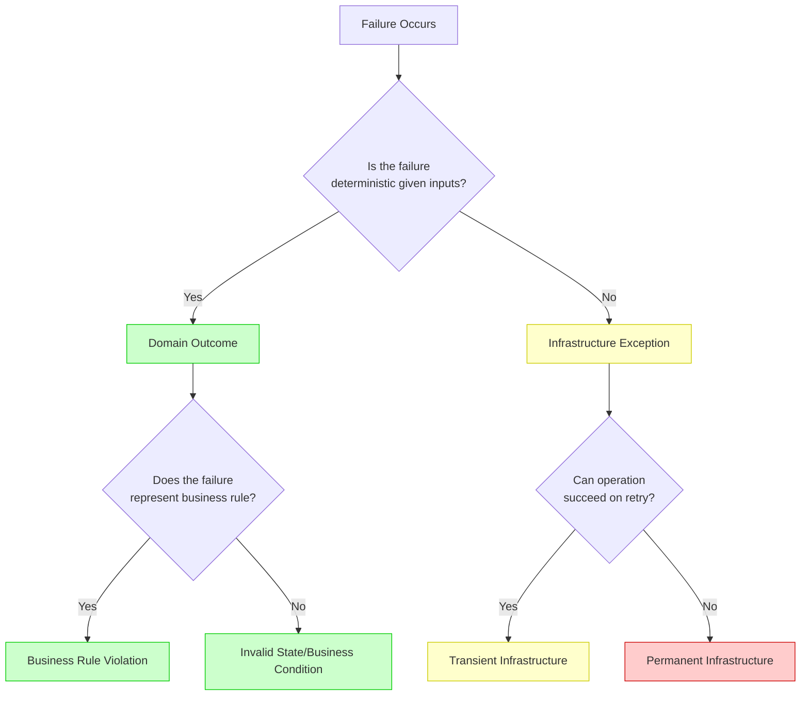
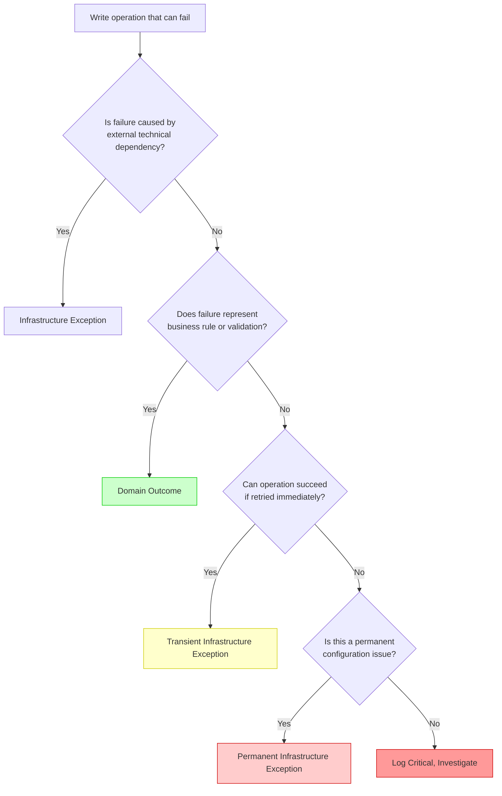

# Clean Architecture Anti-Pattern in Python - Defining the Boundary - Part 3
## Comprehensive taxonomy distinguishing infrastructure exceptions from domain outcomes. Decision matrices and classification patterns across all infrastructure layers.


# Introduction: The Boundary That Defines Architecture

In **Part 1** of this series, we established the architectural violation that occurs when domain outcomes are expressed through exceptions in Python. In **Part 2**, we quantified the performance cost—23x slower execution and 12x more memory allocation for expected business failures.

This story addresses the foundational question that enables both architectural correctness and performance optimization: **How do we definitively distinguish between infrastructure exceptions and domain outcomes in Python?**

The boundary between these two categories is not merely academic. It determines:

- Whether a failure should be handled by retry policies or returned to the user
- Whether an error should trigger operations alerts or be part of normal business flow
- Whether code belongs in domain logic or infrastructure middleware
- Whether testing requires exception assertions or simple result inspection

Without a clear taxonomy, development teams default to raising exceptions for everything, creating the cascading problems documented in Parts 1 and 2.

---

## Key Takeaways from Previous Stories

| Story | Key Takeaway |
|-------|--------------|
| **1. 🏛️ A Developer's Guide to Resilience - Part 1** | Domain exceptions at presentation boundaries violate Clean Architecture. The Result pattern restores proper separation. |
| **2. 🎭 Domain Logic in Disguise - Part 2** | Exceptions for domain outcomes are 23x slower and allocate 12x more memory than Result pattern failures in Python. |

This story builds upon these principles by providing the classification framework that enables consistent application of the Result pattern in Python applications.

---

## 1. The Fundamental Distinction

The distinction between infrastructure exceptions and domain outcomes rests on four fundamental questions:



### 1.1 Determinism as the Primary Discriminator

| Criterion | Infrastructure Exception | Domain Outcome |
|-----------|-------------------------|----------------|
| **Deterministic** | No – outcome varies with external conditions | Yes – same inputs yield same outcome |
| **Predictable** | No – depends on network, load, hardware | Yes – follows business rules |
| **Retryable** | Often yes – transient failures may succeed | No – business rule violation persists |
| **User-Facing** | Usually no – technical in nature | Usually yes – communicates business result |
| **Documented in Domain** | No – belongs in infrastructure | Yes – part of ubiquitous language |

### 1.2 Examples Across Categories

| Category | Infrastructure Exception | Domain Outcome |
|----------|-------------------------|----------------|
| **Customer** | Database timeout retrieving customer | Customer not found |
| **Payment** | Gateway connection failure | Insufficient funds |
| **Inventory** | Redis cache unavailable | Product out of stock |
| **Order** | Deadlock during transaction | Duplicate order |
| **Shipping** | Carrier API returns 503 | Address not serviceable |

---

## 2. Python-Specific Exception Taxonomy

Python's exception hierarchy provides a rich foundation for classification. The following sections map Python's built-in and common library exceptions to infrastructure categories.

### 2.1 Database Infrastructure Exceptions

```python
# infrastructure/exceptions/database.py
# Database exception classification for Python
# Design Pattern: Strategy Pattern - classification strategy per exception type

import asyncpg
import psycopg2
from typing import Optional


class DatabaseExceptionClassifier:
    """
    Classifies database exceptions as infrastructure or domain outcomes.
    
    Design Pattern: Strategy Pattern - encapsulates classification logic
    SOLID: Single Responsibility - only handles database exception classification
    """
    
    # Transient database errors - can succeed on retry
    TRANSIENT_SQL_ERRORS = {
        1205: "deadlock",           # Deadlock detected
        -2: "timeout",              # Query timeout
        53: "connection_failure",   # Network connection lost
        64: "tcp_failure",          # TCP connection failure
        10054: "connection_reset",  # Connection reset by peer
        10060: "network_timeout",   # Network timeout
        1213: "deadlock",           # MySQL deadlock
        1206: "lock_timeout",       # Lock wait timeout
    }
    
    # Permanent database errors - require manual intervention
    PERMANENT_SQL_ERRORS = {
        208: "invalid_object",      # Invalid object name
        229: "permission_denied",   # Permission denied
        4060: "database_not_found", # Cannot open database
        18456: "login_failed",      # Login failed
        547: "foreign_key",         # Foreign key violation (may be domain)
        2627: "unique_constraint",  # Unique constraint violation (may be domain)
    }
    
    @classmethod
    def classify_asyncpg_error(cls, error: asyncpg.exceptions.PostgresError) -> dict:
        """
        Classifies asyncpg database error.
        
        SOLID: Open/Closed - new error types can be added without modifying classifier
        """
        error_code = getattr(error, 'sqlstate', None)
        error_number = getattr(error, 'pgcode', None)
        
        # Parse error number from pgcode if available
        if error_number:
            error_number = int(error_number) if error_number.isdigit() else None
        
        # Check for transient errors
        if error_number in cls.TRANSIENT_SQL_ERRORS:
            return {
                "category": "transient_infrastructure",
                "error_code": f"DB_{error_number}",
                "retryable": True,
                "description": cls.TRANSIENT_SQL_ERRORS[error_number]
            }
        
        # Check for permanent errors
        if error_number in cls.PERMANENT_SQL_ERRORS:
            # Some permanent errors may actually be domain outcomes
            if error_number == 2627:  # Unique constraint violation
                # May represent domain rule (duplicate entity)
                return {
                    "category": "domain_outcome",
                    "error_code": "business.duplicate",
                    "retryable": False,
                    "description": "Unique constraint violation"
                }
            
            if error_number == 547:  # Foreign key violation
                # May represent domain relationship (referenced entity missing)
                return {
                    "category": "domain_outcome",
                    "error_code": "business.reference_missing",
                    "retryable": False,
                    "description": "Foreign key constraint violation"
                }
            
            return {
                "category": "permanent_infrastructure",
                "error_code": f"DB_{error_number}",
                "retryable": False,
                "description": cls.PERMANENT_SQL_ERRORS[error_number],
                "requires_manual_intervention": True
            }
        
        # Unknown error - treat as transient infrastructure
        return {
            "category": "transient_infrastructure",
            "error_code": "DB_UNKNOWN",
            "retryable": True,
            "description": "Unknown database error"
        }
    
    @classmethod
    def is_transient_database_error(cls, error: Exception) -> bool:
        """Check if database error is transient and retryable."""
        if isinstance(error, (asyncpg.exceptions.DeadlockDetectedError,
                              asyncpg.exceptions.LockNotAvailableError,
                              asyncpg.exceptions.ConnectionDoesNotExistError)):
            return True
        
        if isinstance(error, psycopg2.errors.DeadlockDetected):
            return True
        
        if isinstance(error, TimeoutError):
            return True
        
        return False
    
    @classmethod
    def is_domain_outcome_from_database(cls, error: Exception) -> bool:
        """
        Check if database error represents a domain outcome.
        
        SOLID: Liskov Substitution - consistent classification interface
        """
        # Unique constraint violation - often represents duplicate business entity
        if isinstance(error, (asyncpg.exceptions.UniqueViolationError,
                              psycopg2.errors.UniqueViolation)):
            return True
        
        # Foreign key violation - often represents missing referenced entity
        if isinstance(error, (asyncpg.exceptions.ForeignKeyViolationError,
                              psycopg2.errors.ForeignKeyViolation)):
            return True
        
        return False


# Usage example
try:
    async with connection.transaction():
        await connection.execute("INSERT INTO customers (email) VALUES ($1)", email)
except asyncpg.exceptions.UniqueViolationError as ex:
    if DatabaseExceptionClassifier.is_domain_outcome_from_database(ex):
        # Domain outcome - duplicate customer
        return Result.failure(DomainError.duplicate("Customer", "email", email))
    else:
        # Infrastructure exception - re-raise
        raise
```

### 2.2 HTTP and External Service Infrastructure Exceptions

```python
# infrastructure/exceptions/http.py
# HTTP and external service exception classification
# Design Pattern: Factory Pattern - creates appropriate exception types

import httpx
import aiohttp
from typing import Optional, Dict, Any
from enum import Enum


class HttpErrorCategory(Enum):
    """Categories for HTTP errors."""
    TRANSIENT = "transient"
    PERMANENT = "permanent"
    DOMAIN = "domain"


class HttpExceptionClassifier:
    """
    Classifies HTTP exceptions as infrastructure or domain outcomes.
    
    Design Pattern: Factory Pattern - creates classified exceptions
    SOLID: Single Responsibility - only handles HTTP exception classification
    """
    
    # Transient HTTP status codes - service may recover
    TRANSIENT_STATUS_CODES = {
        408: "request_timeout",
        429: "too_many_requests",
        502: "bad_gateway",
        503: "service_unavailable",
        504: "gateway_timeout",
    }
    
    # Domain outcome status codes - represent business results
    DOMAIN_STATUS_CODES = {
        400: "bad_request",
        404: "not_found",
        409: "conflict",
        422: "unprocessable_entity",
    }
    
    @classmethod
    def classify_httpx_error(cls, error: httpx.HTTPStatusError) -> Dict[str, Any]:
        """Classify httpx HTTP status error."""
        status_code = error.response.status_code
        
        if status_code in cls.TRANSIENT_STATUS_CODES:
            return {
                "category": "transient_infrastructure",
                "error_code": f"HTTP_{status_code}",
                "retryable": True,
                "status_code": status_code,
                "description": cls.TRANSIENT_STATUS_CODES[status_code]
            }
        
        if status_code in cls.DOMAIN_STATUS_CODES:
            return {
                "category": "domain_outcome",
                "error_code": f"http.{cls.DOMAIN_STATUS_CODES[status_code]}",
                "retryable": False,
                "status_code": status_code,
                "description": cls.DOMAIN_STATUS_CODES[status_code]
            }
        
        # 5xx errors are infrastructure
        if 500 <= status_code < 600:
            return {
                "category": "permanent_infrastructure",
                "error_code": f"HTTP_{status_code}",
                "retryable": False,
                "status_code": status_code,
                "requires_manual_intervention": True,
                "description": "Server error"
            }
        
        return {
            "category": "permanent_infrastructure",
            "error_code": f"HTTP_{status_code}",
            "retryable": False,
            "status_code": status_code,
            "description": "Unknown HTTP error"
        }
    
    @classmethod
    def is_transient_http_error(cls, error: Exception) -> bool:
        """Check if HTTP error is transient and retryable."""
        if isinstance(error, httpx.TimeoutException):
            return True
        
        if isinstance(error, aiohttp.ClientConnectionError):
            return True
        
        if isinstance(error, httpx.HTTPStatusError):
            return error.response.status_code in cls.TRANSIENT_STATUS_CODES
        
        return False
    
    @classmethod
    def is_domain_outcome_from_http(cls, error: Exception) -> bool:
        """Check if HTTP error represents a domain outcome."""
        if isinstance(error, httpx.HTTPStatusError):
            return error.response.status_code in cls.DOMAIN_STATUS_CODES
        
        return False


class ExternalServiceExceptionFactory:
    """
    Factory for creating external service infrastructure exceptions.
    
    Design Pattern: Factory Pattern - centralizes exception creation
    SOLID: Dependency Inversion - callers depend on factory, not concrete exceptions
    """
    
    @staticmethod
    def create(service_name: str, error: Exception, context: Optional[Dict] = None) -> Exception:
        """Create appropriate exception based on error type."""
        
        if isinstance(error, httpx.TimeoutException):
            return TransientInfrastructureException(
                f"{service_name} request timeout",
                error_code=f"EXT_{service_name.upper()}_TIMEOUT",
                inner_exception=error
            )
        
        if isinstance(error, httpx.HTTPStatusError):
            classification = HttpExceptionClassifier.classify_httpx_error(error)
            
            if classification["category"] == "transient_infrastructure":
                return TransientInfrastructureException(
                    f"{service_name} returned {classification['status_code']}",
                    error_code=classification["error_code"],
                    inner_exception=error,
                    retry_after=30
                )
            
            if classification["category"] == "domain_outcome":
                # Return domain outcome, not infrastructure exception
                return DomainError.business_rule(
                    f"{service_name.lower()}.{classification['error_code']}",
                    f"{service_name} error: {error.response.text}"
                )
            
            return NonTransientInfrastructureException(
                f"{service_name} permanent error: {classification['status_code']}",
                error_code=classification["error_code"],
                inner_exception=error,
                resolution_instructions="Check service configuration"
            )
        
        if isinstance(error, aiohttp.ClientConnectionError):
            return TransientInfrastructureException(
                f"Cannot connect to {service_name}",
                error_code=f"EXT_{service_name.upper()}_CONNECTION",
                inner_exception=error
            )
        
        return NonTransientInfrastructureException(
            f"Unknown {service_name} error: {str(error)}",
            error_code=f"EXT_{service_name.upper()}_UNKNOWN",
            inner_exception=error
        )


# Usage example
async def call_payment_gateway(request):
    try:
        response = await httpx.post(
            "https://api.payment.com/charge",
            json=request,
            timeout=30.0
        )
        response.raise_for_status()
        return response.json()
        
    except Exception as ex:
        # Factory creates appropriate exception based on error type
        raise ExternalServiceExceptionFactory.create("PaymentGateway", ex)
```

### 2.3 Cache Infrastructure Exceptions

```python
# infrastructure/exceptions/cache.py
# Cache exception classification
# Design Pattern: Decorator Pattern - wraps cache operations with classification

import redis
import aioredis
from typing import Optional, Any, Callable
import functools


class CacheExceptionClassifier:
    """
    Classifies cache exceptions as infrastructure or domain outcomes.
    
    SOLID: Single Responsibility - only handles cache exception classification
    """
    
    @staticmethod
    def is_transient_cache_error(error: Exception) -> bool:
        """Check if cache error is transient and retryable."""
        if isinstance(error, (redis.exceptions.ConnectionError,
                              redis.exceptions.TimeoutError,
                              redis.exceptions.BusyLoadingError)):
            return True
        
        if isinstance(error, (aioredis.ConnectionError,
                              aioredis.TimeoutError)):
            return True
        
        return False
    
    @staticmethod
    def should_fallback_to_primary(error: Exception) -> bool:
        """
        Determine if cache failure should trigger fallback to primary data source.
        
        SOLID: Open/Closed - fallback behavior configurable per error type
        """
        # Most cache failures should fall back to database
        if isinstance(error, (redis.exceptions.ConnectionError,
                              redis.exceptions.TimeoutError,
                              redis.exceptions.BusyLoadingError)):
            return True
        
        # Serialization errors should not fall back (data corruption)
        if isinstance(error, (redis.exceptions.ResponseError,
                              json.JSONDecodeError)):
            return False
        
        return True


class CacheFallbackDecorator:
    """
    Decorator pattern for cache operations with fallback.
    
    Design Pattern: Decorator Pattern - wraps cache operations with fallback logic
    SOLID: Open/Closed - cache operations enhanced without modifying original code
    """
    
    def __init__(self, fallback_func: Callable):
        self._fallback_func = fallback_func
    
    def __call__(self, func: Callable) -> Callable:
        @functools.wraps(func)
        async def wrapper(*args, **kwargs):
            try:
                return await func(*args, **kwargs)
            except Exception as ex:
                if CacheExceptionClassifier.should_fallback_to_primary(ex):
                    # Log warning and fallback
                    logger.warning(
                        f"Cache failure, falling back to primary: {ex}",
                        exc_info=ex
                    )
                    return await self._fallback_func(*args, **kwargs)
                raise
        
        return wrapper


# Usage example
class CachedRepository:
    """Repository with cache fallback."""
    
    def __init__(self, db_repo, cache_client):
        self._db_repo = db_repo
        self._cache = cache_client
    
    @CacheFallbackDecorator(fallback_func=lambda self, id: self._db_repo.get_by_id(id))
    async def get_cached_customer(self, customer_id: str) -> Optional[Customer]:
        """Get customer with cache fallback to database."""
        cache_key = f"customer:{customer_id}"
        
        cached = await self._cache.get(cache_key)
        if cached:
            return Customer.from_json(cached)
        
        return None
```

### 2.4 Messaging Infrastructure Exceptions

```python
# infrastructure/exceptions/messaging.py
# Messaging infrastructure exception classification
# Design Pattern: Strategy Pattern - different strategies for different message brokers

import pika
import aiokafka
from typing import Optional, Dict, Any
from enum import Enum


class MessagingErrorType(Enum):
    """Types of messaging errors."""
    CONNECTION = "connection"
    PUBLISH = "publish"
    CONSUME = "consume"
    QUOTA = "quota"
    SERIALIZATION = "serialization"


class MessagingExceptionClassifier:
    """
    Classifies messaging exceptions as infrastructure or domain outcomes.
    
    Design Pattern: Strategy Pattern - classification strategy per broker type
    SOLID: Single Responsibility - only handles messaging exception classification
    """
    
    @staticmethod
    def classify_rabbitmq_error(error: pika.exceptions.AMQPError) -> Dict[str, Any]:
        """Classify RabbitMQ/pika error."""
        
        if isinstance(error, pika.exceptions.ConnectionClosed):
            return {
                "category": "transient_infrastructure",
                "error_code": "MQ_CONNECTION_CLOSED",
                "retryable": True,
                "should_requeue": True,
                "description": "Connection closed"
            }
        
        if isinstance(error, pika.exceptions.ChannelClosed):
            return {
                "category": "transient_infrastructure",
                "error_code": "MQ_CHANNEL_CLOSED",
                "retryable": True,
                "should_requeue": True,
                "description": "Channel closed"
            }
        
        if isinstance(error, pika.exceptions.NackError):
            return {
                "category": "domain_outcome",
                "error_code": "mq.message_nacked",
                "retryable": False,
                "should_dead_letter": True,
                "description": "Message not acknowledged"
            }
        
        return {
            "category": "permanent_infrastructure",
            "error_code": "MQ_UNKNOWN",
            "retryable": False,
            "should_dead_letter": True,
            "description": "Unknown RabbitMQ error",
            "requires_manual_intervention": True
        }
    
    @staticmethod
    def classify_kafka_error(error: aiokafka.errors.KafkaError) -> Dict[str, Any]:
        """Classify Kafka error."""
        
        if isinstance(error, aiokafka.errors.KafkaTimeoutError):
            return {
                "category": "transient_infrastructure",
                "error_code": "KAFKA_TIMEOUT",
                "retryable": True,
                "description": "Kafka timeout"
            }
        
        if isinstance(error, aiokafka.errors.KafkaConnectionError):
            return {
                "category": "transient_infrastructure",
                "error_code": "KAFKA_CONNECTION",
                "retryable": True,
                "description": "Kafka connection error"
            }
        
        if isinstance(error, aiokafka.errors.RecordTooLargeError):
            return {
                "category": "domain_outcome",
                "error_code": "kafka.record_too_large",
                "retryable": False,
                "should_dead_letter": True,
                "description": "Record exceeds max size"
            }
        
        return {
            "category": "permanent_infrastructure",
            "error_code": "KAFKA_UNKNOWN",
            "retryable": False,
            "description": "Unknown Kafka error",
            "requires_manual_intervention": True
        }
    
    @staticmethod
    def should_requeue(error: Exception) -> bool:
        """Determine if message should be requeued."""
        if isinstance(error, (pika.exceptions.ConnectionClosed,
                              pika.exceptions.ChannelClosed)):
            return True
        
        return False
    
    @staticmethod
    def should_dead_letter(error: Exception) -> bool:
        """Determine if message should go to dead letter queue."""
        if isinstance(error, pika.exceptions.NackError):
            return True
        
        if isinstance(error, json.JSONDecodeError):
            return True
        
        return False


class MessageHandler:
    """
    Message handler with dead letter queue strategy.
    
    Design Pattern: Chain of Responsibility - error handling chain
    SOLID: Single Responsibility - handler only processes messages, delegates error handling
    """
    
    async def handle(self, message: Dict[str, Any]) -> Result:
        """Handle incoming message."""
        try:
            # Process message
            result = await self._process(message)
            return result
            
        except Exception as ex:
            classification = MessagingExceptionClassifier.classify_rabbitmq_error(ex)
            
            if classification["category"] == "transient_infrastructure":
                # Requeue with delay
                return Result.failure(
                    DomainError.business_rule(
                        "messaging.transient",
                        "Transient messaging error, will retry"
                    )
                )
            
            if classification["category"] == "domain_outcome":
                # Send to dead letter queue
                await self._dead_letter_queue.send(message, error=str(ex))
                return Result.failure(
                    DomainError.business_rule(
                        classification["error_code"],
                        classification["description"]
                    )
                )
            
            # Permanent infrastructure - alert and dead letter
            logger.critical(f"Permanent messaging error: {ex}")
            await self._dead_letter_queue.send(message, error=str(ex))
            raise
```

---

## 3. Domain Outcome Taxonomy

Domain outcomes represent expected results of business rule evaluation. They are expressed through the Result pattern, not exceptions.

### 3.1 Domain Error Type Classification

```python
# domain/common/domain_error.py
# Complete domain error taxonomy with Python 3.12+ features
# Design Pattern: Factory Pattern - factory methods for error creation

from enum import Enum, auto
from dataclasses import dataclass, field
from typing import Any, Dict, Optional
from datetime import datetime


class DomainErrorType(Enum):
    """Domain error types for HTTP status code mapping."""
    
    CONFLICT = auto()           # 409 - Duplicate, state conflict
    NOT_FOUND = auto()          # 404 - Resource missing
    VALIDATION = auto()         # 400 - Invalid input
    UNAUTHORIZED = auto()       # 401 - Authentication required
    FORBIDDEN = auto()          # 403 - Authorization denied
    BUSINESS_RULE = auto()      # 422 - Business rule violation
    GONE = auto()               # 410 - Resource no longer available
    TOO_MANY_REQUESTS = auto()  # 429 - Rate limiting
    QUOTA_EXCEEDED = auto()     # 429 - Account quota exceeded


@dataclass
class DomainError:
    """
    Represents a domain error with code, message, type, and metadata.
    
    Design Pattern: Factory Pattern - static factory methods for common errors
    SOLID: Single Responsibility - only represents domain errors, no logic
    """
    
    code: str
    message: str
    type: DomainErrorType
    metadata: Dict[str, Any] = field(default_factory=dict)
    
    def __str__(self) -> str:
        return f"[{self.code}] {self.message}"
    
    # Resource state errors
    @classmethod
    def not_found(cls, resource_type: str, identifier: Any) -> 'DomainError':
        """Creates a not found error."""
        return cls(
            code=f"{resource_type.lower()}.not_found",
            message=f"{resource_type} with identifier '{identifier}' was not found",
            type=DomainErrorType.NOT_FOUND,
            metadata={"resource_type": resource_type, "identifier": identifier}
        )
    
    @classmethod
    def conflict(cls, resource_type: str, reason: str, details: Any = None) -> 'DomainError':
        """Creates a conflict error."""
        return cls(
            code=f"{resource_type.lower()}.conflict",
            message=f"{resource_type} conflict: {reason}",
            type=DomainErrorType.CONFLICT,
            metadata={"resource_type": resource_type, "reason": reason, "details": details}
        )
    
    @classmethod
    def gone(cls, resource_type: str, identifier: Any) -> 'DomainError':
        """Creates a gone (resource no longer available) error."""
        return cls(
            code=f"{resource_type.lower()}.gone",
            message=f"{resource_type} with identifier '{identifier}' is no longer available",
            type=DomainErrorType.GONE,
            metadata={"resource_type": resource_type, "identifier": identifier}
        )
    
    # Validation errors
    @classmethod
    def validation(cls, field: str, message: str) -> 'DomainError':
        """Creates a field-specific validation error."""
        return cls(
            code="validation.failed",
            message=message,
            type=DomainErrorType.VALIDATION,
            metadata={"field": field}
        )
    
    @classmethod
    def validation_multiple(cls, errors: Dict[str, str]) -> 'DomainError':
        """Creates a validation error with multiple fields."""
        return cls(
            code="validation.failed",
            message="One or more validation errors occurred",
            type=DomainErrorType.VALIDATION,
            metadata={"errors": errors}
        )
    
    # Business rule errors
    @classmethod
    def business_rule(cls, rule: str, message: str, context: Any = None) -> 'DomainError':
        """Creates a business rule violation error."""
        return cls(
            code=f"business.{rule.lower()}",
            message=message,
            type=DomainErrorType.BUSINESS_RULE,
            metadata={"context": context} if context else {}
        )
    
    @classmethod
    def insufficient_funds(cls, available: float, required: float, currency: str = "USD") -> 'DomainError':
        """Creates an insufficient funds error."""
        return cls(
            code="business.insufficient_funds",
            message=f"Insufficient funds. Available: {currency} {available:.2f}, Required: {currency} {required:.2f}",
            type=DomainErrorType.BUSINESS_RULE,
            metadata={"available": available, "required": required, "currency": currency}
        )
    
    @classmethod
    def out_of_stock(cls, product_id: str, requested: int, available: int) -> 'DomainError':
        """Creates an out of stock error."""
        return cls(
            code="business.out_of_stock",
            message=f"Product {product_id} out of stock. Requested: {requested}, Available: {available}",
            type=DomainErrorType.BUSINESS_RULE,
            metadata={"product_id": product_id, "requested": requested, "available": available}
        )
    
    @classmethod
    def duplicate(cls, entity_type: str, field: str, value: Any) -> 'DomainError':
        """Creates a duplicate entity error."""
        return cls(
            code=f"business.duplicate_{entity_type.lower()}",
            message=f"{entity_type} with {field} '{value}' already exists",
            type=DomainErrorType.CONFLICT,
            metadata={"entity_type": entity_type, "field": field, "value": value}
        )
    
    @classmethod
    def invalid_state(cls, entity_type: str, entity_id: Any, current_state: str, allowed_states: list) -> 'DomainError':
        """Creates an invalid state transition error."""
        return cls(
            code=f"business.invalid_state",
            message=f"{entity_type} {entity_id} cannot transition from {current_state} to requested state. Allowed: {allowed_states}",
            type=DomainErrorType.BUSINESS_RULE,
            metadata={
                "entity_type": entity_type,
                "entity_id": entity_id,
                "current_state": current_state,
                "allowed_states": allowed_states
            }
        )
    
    # Authorization errors
    @classmethod
    def unauthorized(cls, message: str = "Authentication required") -> 'DomainError':
        """Creates an unauthorized error."""
        return cls(
            code="auth.unauthorized",
            message=message,
            type=DomainErrorType.UNAUTHORIZED
        )
    
    @classmethod
    def forbidden(cls, resource: str, action: str, reason: str) -> 'DomainError':
        """Creates a forbidden error."""
        return cls(
            code="auth.forbidden",
            message=f"Access denied to {action} on {resource}: {reason}",
            type=DomainErrorType.FORBIDDEN,
            metadata={"resource": resource, "action": action, "reason": reason}
        )
    
    # Capacity errors
    @classmethod
    def too_many_requests(cls, resource: str, limit: int, window_seconds: int) -> 'DomainError':
        """Creates a rate limit exceeded error."""
        return cls(
            code="rate_limit.exceeded",
            message=f"Rate limit of {limit} requests per {window_seconds} seconds exceeded for {resource}",
            type=DomainErrorType.TOO_MANY_REQUESTS,
            metadata={"resource": resource, "limit": limit, "window_seconds": window_seconds}
        )
    
    @classmethod
    def quota_exceeded(cls, resource: str, limit: int, current: int) -> 'DomainError':
        """Creates a quota exceeded error."""
        return cls(
            code="quota.exceeded",
            message=f"{resource} quota exceeded. Limit: {limit}, Current: {current}",
            type=DomainErrorType.QUOTA_EXCEEDED,
            metadata={"resource": resource, "limit": limit, "current": current}
        )
```

### 3.2 Domain Outcome Classification by Business Domain

| Business Domain | Domain Outcome | DomainError Type | Factory Method |
|-----------------|----------------|------------------|----------------|
| **Customer** | Customer not found | NOT_FOUND | `DomainError.not_found("Customer", id)` |
| **Customer** | Duplicate email | CONFLICT | `DomainError.duplicate("Customer", "email", email)` |
| **Customer** | Account locked | FORBIDDEN | `DomainError.forbidden("Customer", "login", "account locked")` |
| **Payment** | Insufficient funds | BUSINESS_RULE | `DomainError.insufficient_funds(available, required)` |
| **Payment** | Card declined | BUSINESS_RULE | `DomainError.business_rule("card_declined", message)` |
| **Payment** | Invalid CVV | VALIDATION | `DomainError.validation("cvv", "Invalid CVV code")` |
| **Inventory** | Out of stock | BUSINESS_RULE | `DomainError.out_of_stock(product_id, requested, available)` |
| **Inventory** | Minimum order quantity | VALIDATION | `DomainError.validation("quantity", "Minimum order is 10")` |
| **Order** | Duplicate order | CONFLICT | `DomainError.duplicate("Order", "order_number", order_number)` |
| **Order** | Invalid state transition | BUSINESS_RULE | `DomainError.invalid_state("Order", id, current, allowed)` |
| **Shipping** | Unserviceable address | BUSINESS_RULE | `DomainError.business_rule("unserviceable", message)` |
| **Shipping** | Invalid postal code | VALIDATION | `DomainError.validation("postal_code", "Invalid format")` |

---

## 4. The Decision Matrix: Infrastructure vs Domain

### 4.1 Primary Classification Matrix

| Characteristic | Infrastructure Exception | Domain Outcome |
|----------------|-------------------------|----------------|
| **Origin** | Database, network, cache, file system | Business rules, validation, state |
| **Predictability** | Non-deterministic | Deterministic |
| **Retry Success** | Possible | Impossible (state unchanged) |
| **User Message** | Technical, generic | Business, specific |
| **Log Level** | Warning (transient) / Error (permanent) | Info |
| **Alert** | Yes for permanent failures | No |
| **SLA Impact** | Counts as downtime | Normal business flow |
| **Testing** | Requires infrastructure simulation | Simple unit test |

### 4.2 Decision Flow for New Code



### 4.3 Classification Examples

| Scenario | Classification | Justification |
|----------|----------------|---------------|
| Database connection timeout | Transient Infrastructure | Network issue, retry may succeed |
| Customer ID not found | Domain Outcome | Expected business state, deterministic |
| Payment gateway returns 503 | Transient Infrastructure | Service unavailable, retryable |
| Payment gateway returns 400 (invalid card) | Domain Outcome | Validation failure, business rule |
| Redis cache unavailable | Transient Infrastructure | Fallback to database, retryable |
| Duplicate email in registration | Domain Outcome | Business rule, deterministic |
| Disk full writing log file | Permanent Infrastructure | Requires ops intervention |
| User not authorized for action | Domain Outcome | Authorization is business concern |
| Message queue quota exceeded | Permanent Infrastructure | Requires ops intervention |
| Product out of stock | Domain Outcome | Expected business state |

---

## 5. Infrastructure Exception Hierarchy

### 5.1 Complete Python Exception Hierarchy

```python
# infrastructure/exceptions/base.py
# Complete infrastructure exception hierarchy for Python
# Design Pattern: Composite Pattern - hierarchy of exception types

import uuid
from typing import Optional, Any, Dict


class InfrastructureException(Exception):
    """
    Base class for all infrastructure exceptions.
    
    Design Pattern: Composite Pattern - base for exception hierarchy
    SOLID: Liskov Substitution - all infrastructure exceptions can be treated uniformly
    """
    
    def __init__(
        self,
        message: str,
        error_code: Optional[str] = None,
        is_transient: bool = True,
        service_name: Optional[str] = None,
        resource_name: Optional[str] = None,
        inner_exception: Optional[Exception] = None,
        context: Optional[Dict[str, Any]] = None
    ):
        super().__init__(message)
        self.error_code = error_code or "INFRA_001"
        self.reference_code = str(uuid.uuid4())
        self.is_transient = is_transient
        self.service_name = service_name
        self.resource_name = resource_name
        self.inner_exception = inner_exception
        self.context = context or {}
    
    def __repr__(self) -> str:
        return f"{self.__class__.__name__}(code={self.error_code}, ref={self.reference_code}, message={self.message})"


class TransientInfrastructureException(InfrastructureException):
    """
    Transient infrastructure exceptions that may succeed on retry.
    
    SOLID: Liskov Substitution - substitutable for base class
    """
    
    def __init__(
        self,
        message: str,
        error_code: Optional[str] = None,
        retry_after: int = 30,
        max_retries: int = 3,
        **kwargs
    ):
        super().__init__(message, error_code, is_transient=True, **kwargs)
        self.retry_after = retry_after
        self.max_retries = max_retries


class NonTransientInfrastructureException(InfrastructureException):
    """
    Non-transient infrastructure exceptions that require manual intervention.
    
    SOLID: Liskov Substitution - substitutable for base class
    """
    
    def __init__(
        self,
        message: str,
        error_code: Optional[str] = None,
        resolution_instructions: Optional[str] = None,
        requires_manual_intervention: bool = True,
        **kwargs
    ):
        super().__init__(message, error_code, is_transient=False, **kwargs)
        self.resolution_instructions = resolution_instructions
        self.requires_manual_intervention = requires_manual_intervention


class DatabaseInfrastructureException(TransientInfrastructureException):
    """Database-specific infrastructure exceptions."""
    
    def __init__(
        self,
        message: str,
        sql_error_number: int,
        sql_state: Optional[str] = None,
        **kwargs
    ):
        super().__init__(
            message,
            error_code=f"DB_{sql_error_number}",
            service_name="Database",
            **kwargs
        )
        self.sql_error_number = sql_error_number
        self.sql_state = sql_state


class ExternalServiceInfrastructureException(InfrastructureException):
    """External service infrastructure exceptions."""
    
    def __init__(
        self,
        service_name: str,
        message: str,
        status_code: Optional[int] = None,
        is_transient: bool = True,
        **kwargs
    ):
        super().__init__(
            message,
            error_code=f"EXT_{service_name.upper()}_{status_code or 'ERR'}",
            is_transient=is_transient,
            service_name=service_name,
            **kwargs
        )
        self.status_code = status_code


class CacheInfrastructureException(TransientInfrastructureException):
    """Cache infrastructure exceptions."""
    
    def __init__(
        self,
        message: str,
        cache_key: Optional[str] = None,
        should_fallback: bool = True,
        **kwargs
    ):
        super().__init__(
            message,
            error_code="CACHE_001",
            service_name="Redis",
            resource_name=cache_key,
            **kwargs
        )
        self.cache_key = cache_key
        self.should_fallback = should_fallback


class MessagingInfrastructureException(InfrastructureException):
    """Messaging infrastructure exceptions."""
    
    def __init__(
        self,
        message: str,
        queue_name: Optional[str] = None,
        message_id: Optional[str] = None,
        is_transient: bool = True,
        **kwargs
    ):
        super().__init__(
            message,
            error_code="MQ_001",
            is_transient=is_transient,
            service_name="MessageBus",
            resource_name=queue_name,
            **kwargs
        )
        self.queue_name = queue_name
        self.message_id = message_id
        self.should_requeue = is_transient
```

---

## 6. Complete Classification Example

### 6.1 Payment Processing with Clear Boundaries

```python
# domain/services/payment_service.py
# Payment service with clear infrastructure vs domain boundaries
# Design Pattern: Strategy Pattern - different strategies for different payment outcomes

import logging
from typing import Optional
import httpx
import asyncpg

logger = logging.getLogger(__name__)


class PaymentService:
    """
    Payment processing service with clear domain/infrastructure boundaries.
    
    Design Pattern: Strategy Pattern - different handling strategies per error type
    SOLID: Single Responsibility - service only handles payment orchestration
    """
    
    def __init__(self, gateway_client, repository, customer_repository):
        self._gateway = gateway_client
        self._repository = repository
        self._customer_repository = customer_repository
    
    async def process_payment(self, request: PaymentRequest) -> Result[PaymentTransaction]:
        """
        Process a payment.
        
        Returns:
            Result[PaymentTransaction] - success or domain failure
        """
        
        # DOMAIN OUTCOME: Validate amount
        if request.amount <= 0:
            return Result.failure(
                DomainError.validation("amount", "Payment amount must be positive")
            )
        
        if request.amount > 10000:
            return Result.failure(
                DomainError.business_rule(
                    "payment.limit_exceeded",
                    "Payments exceeding $10,000 require manual approval"
                )
            )
        
        # DOMAIN OUTCOME: Validate customer exists
        customer_result = await self._customer_repository.get_by_id(request.customer_id)
        if customer_result.is_failure:
            return Result.failure(customer_result.error)
        
        customer = customer_result.value
        
        # DOMAIN OUTCOME: Check customer status
        if customer.is_blocked:
            return Result.failure(
                DomainError.business_rule(
                    "customer.blocked",
                    "Customer account is blocked from processing payments"
                )
            )
        
        # DOMAIN OUTCOME: Idempotency check
        existing_result = await self._repository.get_by_idempotency_key(
            request.idempotency_key
        )
        
        if existing_result.is_success and existing_result.value:
            logger.info(f"Duplicate payment prevented for key {request.idempotency_key}")
            return Result.success(existing_result.value)
        
        # Create payment transaction
        payment = PaymentTransaction.create(
            customer_id=request.customer_id,
            amount=request.amount,
            currency=request.currency,
            payment_method=request.payment_method,
            idempotency_key=request.idempotency_key
        )
        
        # Save pending transaction
        save_result = await self._repository.add(payment)
        if save_result.is_failure:
            return Result.failure(save_result.error)
        
        await self._repository.save_changes()
        
        try:
            # INFRASTRUCTURE CALL: External payment gateway
            # May raise infrastructure exceptions
            gateway_response = await self._gateway.charge(
                GatewayChargeRequest(
                    amount=request.amount,
                    currency=request.currency,
                    payment_method=request.payment_method,
                    card_details=request.card_details,
                    idempotency_key=request.idempotency_key
                )
            )
            
            # DOMAIN OUTCOMES: Process gateway response
            match gateway_response.status:
                case GatewayPaymentStatus.SUCCESS:
                    return await self._handle_success(payment, gateway_response)
                
                case GatewayPaymentStatus.INSUFFICIENT_FUNDS:
                    return await self._handle_decline(
                        payment,
                        DomainError.insufficient_funds(
                            gateway_response.available_balance,
                            request.amount
                        )
                    )
                
                case GatewayPaymentStatus.CARD_DECLINED:
                    return await self._handle_decline(
                        payment,
                        DomainError.business_rule(
                            "payment.card_declined",
                            f"Card declined: {gateway_response.decline_reason}"
                        )
                    )
                
                case GatewayPaymentStatus.INVALID_CVV:
                    return await self._handle_decline(
                        payment,
                        DomainError.validation("cvv", "Invalid CVV code")
                    )
                
                case GatewayPaymentStatus.FRAUD_SUSPECTED:
                    return await self._handle_decline(
                        payment,
                        DomainError.business_rule(
                            "payment.fraud_suspected",
                            "Transaction flagged for fraud review"
                        )
                    )
                
                case _:
                    return Result.failure(
                        DomainError.business_rule(
                            "payment.unknown",
                            f"Unknown gateway status: {gateway_response.status}"
                        )
                    )
                    
        except httpx.HTTPStatusError as ex:
            # INFRASTRUCTURE EXCEPTION - Classify using HTTP classifier
            classification = HttpExceptionClassifier.classify_httpx_error(ex)
            
            if classification["category"] == "transient_infrastructure":
                logger.warning(f"Payment gateway transient error: {ex}")
                raise TransientInfrastructureException(
                    "Payment gateway temporarily unavailable",
                    error_code=classification["error_code"],
                    inner_exception=ex,
                    retry_after=30
                )
            
            if classification["category"] == "domain_outcome":
                # Gateway returned business error (e.g., 400)
                return Result.failure(
                    DomainError.business_rule(
                        classification["error_code"],
                        f"Payment gateway error: {ex.response.text}"
                    )
                )
            
            raise NonTransientInfrastructureException(
                f"Payment gateway error: {ex}",
                error_code=classification["error_code"],
                inner_exception=ex
            )
            
        except httpx.TimeoutException as ex:
            # INFRASTRUCTURE EXCEPTION - Transient
            logger.warning(f"Payment gateway timeout: {ex}")
            raise TransientInfrastructureException(
                "Payment gateway timeout",
                error_code="PAY_GW_TIMEOUT",
                inner_exception=ex,
                retry_after=30
            )
            
        except asyncpg.exceptions.DeadlockDetectedError as ex:
            # INFRASTRUCTURE EXCEPTION - Database deadlock
            logger.warning(f"Database deadlock during payment: {ex}")
            raise DatabaseInfrastructureException(
                "Database deadlock occurred",
                sql_error_number=1205,
                inner_exception=ex
            )
    
    async def _handle_success(
        self,
        payment: PaymentTransaction,
        response: GatewayPaymentResponse
    ) -> Result[PaymentTransaction]:
        """Handle successful payment."""
        payment.mark_as_successful(response.transaction_id)
        await self._repository.update(payment)
        await self._repository.save_changes()
        
        logger.info(f"Payment {payment.id} processed successfully")
        
        return Result.success(payment)
    
    async def _handle_decline(
        self,
        payment: PaymentTransaction,
        error: DomainError
    ) -> Result[PaymentTransaction]:
        """Handle declined payment."""
        payment.mark_as_declined(error.message)
        await self._repository.update(payment)
        await self._repository.save_changes()
        
        logger.info(f"Payment {payment.id} declined: {error.code}")
        
        return Result.failure(error)
```

---

## 7. Cross-Layer Classification Reference

### 7.1 Complete Classification Reference Table

| Layer | Exception/Outcome | Category | Handler | Log Level |
|-------|-------------------|----------|---------|-----------|
| **Presentation** | HTTP 404 | Domain Outcome | Return 404 | Info |
| **Presentation** | HTTP 400 | Domain Outcome | Return validation errors | Info |
| **Presentation** | HTTP 422 | Domain Outcome | Return business rule violation | Info |
| **Application** | Customer not found | Domain Outcome | Return Result.failure | Info |
| **Application** | Insufficient funds | Domain Outcome | Return Result.failure | Info |
| **Application** | Out of stock | Domain Outcome | Return Result.failure | Info |
| **Domain** | Business rule violation | Domain Outcome | Return Result.failure | Info |
| **Infrastructure** | SQL Deadlock | Transient Exception | Retry policy | Warning |
| **Infrastructure** | SQL Timeout | Transient Exception | Retry policy | Warning |
| **Infrastructure** | Connection failure | Transient Exception | Retry policy | Warning |
| **Infrastructure** | HTTP 503 | Transient Exception | Retry policy | Warning |
| **Infrastructure** | HTTP 504 | Transient Exception | Retry policy | Warning |
| **Infrastructure** | Redis unavailable | Transient Exception | Fallback to DB | Warning |
| **Infrastructure** | Disk full | Permanent Exception | Alert operations | Critical |
| **Infrastructure** | Auth failure | Permanent Exception | Alert ops, check config | Error |
| **Infrastructure** | Invalid configuration | Permanent Exception | Alert ops, fix config | Error |

---

## What We Learned in This Story

| Concept | Key Takeaway |
|---------|--------------|
| **Primary Discriminator** | Determinism is the key: domain outcomes are deterministic given inputs; infrastructure exceptions are non-deterministic |
| **Database Classification** | Deadlocks (1205) and timeouts (-2) are transient infrastructure; unique constraint violations may be domain outcomes |
| **HTTP Classification** | 503/504 are transient infrastructure; 404/400 are typically domain outcomes |
| **Cache Classification** | Cache failures are transient infrastructure with fallback to primary data sources |
| **Domain Error Taxonomy** | Domain errors are categorized by type: NOT_FOUND, CONFLICT, VALIDATION, BUSINESS_RULE, UNAUTHORIZED, FORBIDDEN |
| **Exception Hierarchy** | Infrastructure exceptions inherit from base types with is_transient flag and structured error codes |
| **Decision Matrix** | Clear classification criteria enable consistent handling across the entire application |

---

## Design Patterns & SOLID Principles Summary

| Pattern / Principle | Application in This Story |
|---------------------|--------------------------|
| **Strategy Pattern** | DatabaseExceptionClassifier, HttpExceptionClassifier encapsulate classification logic per technology |
| **Factory Pattern** | DomainError factory methods, ExternalServiceExceptionFactory create appropriate errors |
| **Decorator Pattern** | CacheFallbackDecorator wraps cache operations with fallback logic |
| **Composite Pattern** | InfrastructureException hierarchy provides uniform interface for all infrastructure errors |
| **Chain of Responsibility** | MessageHandler delegates error handling through classification chain |
| **Single Responsibility** | Each classifier handles one technology; DomainError only represents errors |
| **Open/Closed** | New error types can be added without modifying existing classifiers |
| **Liskov Substitution** | All infrastructure exceptions can be treated uniformly via base class |
| **Interface Segregation** | Separate classifiers for database, HTTP, cache, messaging |
| **Dependency Inversion** | Code depends on Result and DomainError abstractions, not concrete exceptions |

---

## Next Story

The next story in the series provides the complete implementation of the Result pattern, building upon the taxonomy established in this story.

---

**4. ⚙️ Clean Architecture Anti-Pattern in Python - Building the Result Pattern - Part 4** – Complete implementation of Result[T] and DomainError with functional extensions. Python 3.12+ features including match statements, generics, and async patterns. Full type hierarchy, functional composition methods, and API design best practices.

---

## References to Previous Stories

This story builds upon the principles established in:

**1. 🏛️ Clean Architecture Anti-Pattern in Python - A Developer's Guide to Resilience - Part 1** – Architectural violation, domain-infrastructure distinction, Result pattern implementation, and decision framework.

**2. 🎭 Clean Architecture Anti-Pattern in Python - Domain Logic in Disguise - Part 2** – Performance implications, GC pressure analysis, and why expected outcomes should never raise exceptions.

Key concepts referenced:
- The architectural violation of domain exceptions at presentation boundaries
- The performance cost of exception-based domain logic
- The Result pattern as the solution for domain outcome handling
- Infrastructure exception handling middleware

---

## Series Overview

1. **🏛️ Clean Architecture Anti-Pattern in Python - A Developer's Guide to Resilience - Part 1** – Foundational principles, architectural violation, domain-infrastructure distinction, Result pattern, and decision framework.

2. **🎭 Clean Architecture Anti-Pattern in Python - Domain Logic in Disguise - Part 2** – Performance implications of exception-based domain logic. Stack trace overhead, memory profiling, GC pressure analysis, and why expected outcomes should never raise exceptions.

3. **🔍 Clean Architecture Anti-Pattern in Python - Defining the Boundary - Part 3** – Comprehensive taxonomy distinguishing infrastructure exceptions from domain outcomes. Decision matrices and classification patterns across all infrastructure layers. *(This Story)*

4. **⚙️ Clean Architecture Anti-Pattern in Python - Building the Result Pattern - Part 4** – Complete implementation of Result<T> and DomainError with functional extensions. Python 3.12+ features, match statements, and async patterns.

5. **🏢 Clean Architecture Anti-Pattern in Python - Across Real-World Domains - Part 5** – Four complete case studies: Payment Processing, Inventory Management, Healthcare Scheduling, and Logistics Tracking.

6. **🛡️ Clean Architecture Anti-Pattern in Python - Infrastructure Resilience - Part 6** – Global exception handling middleware, tenacity retry policies, circuit breakers, and health check integration.

7. **🧪 Clean Architecture Anti-Pattern in Python - Testing & Observability - Part 7** – Unit testing domain logic without exceptions (pytest), infrastructure failure testing, structured logging with structlog, and metrics with Prometheus.

8. **🚀 Clean Architecture Anti-Pattern in Python - The Road Ahead - Part 8** – Implementation checklist, migration strategies, Python 3.12+ roadmap, and long-term maintenance benefits.

---