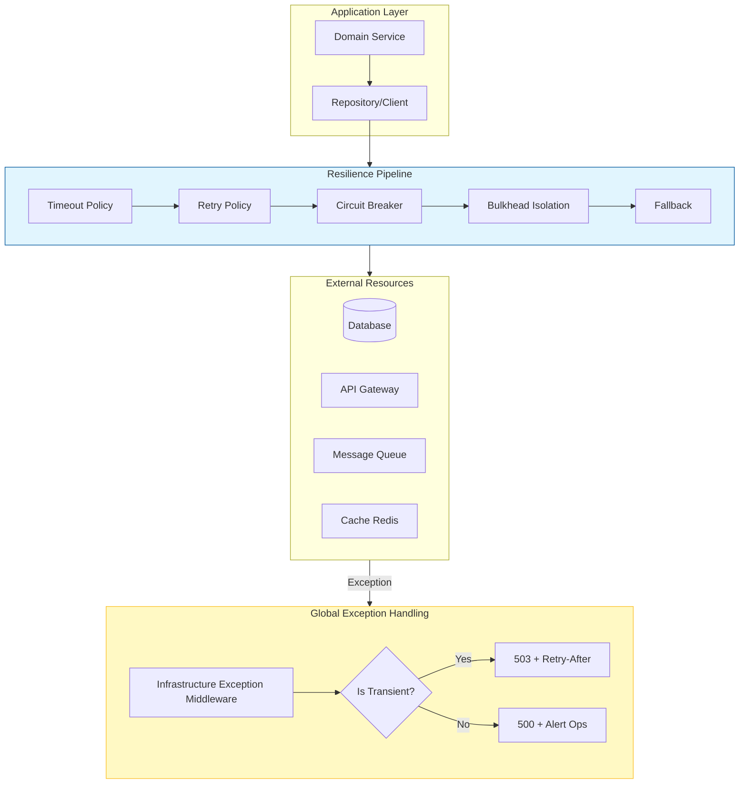

# Clean Architecture Anti-Pattern in Python - Infrastructure Resilience - Part 6


## Introduction: The Infrastructure Boundary

In **Part 1** of this series, we established the architectural violation of using exceptions for domain outcomes. In **Part 2**, we quantified the performance cost. In **Part 3**, we provided the comprehensive taxonomy distinguishing infrastructure from domain concerns. In **Part 4**, we delivered the complete Result pattern implementation. In **Part 5**, we applied these principles across four real-world domains.

This story addresses the infrastructure layer—the boundary where infrastructure exceptions must be handled with resilience patterns, retry policies, and circuit breakers. The infrastructure layer is where transient failures are managed, permanent failures are escalated, and the domain remains pure and testable.

---

## Key Takeaways from Previous Stories

| Story | Key Takeaway |
|-------|--------------|
| **1. 🏛️ A Developer's Guide to Resilience - Part 1** | Domain exceptions at presentation boundaries violate Clean Architecture. The Result pattern restores proper layer separation. |
| **2. 🎭 Domain Logic in Disguise - Part 2** | Exceptions for domain outcomes are 23x slower and allocate 12x more memory than Result pattern failures in Python. |
| **3. 🔍 Defining the Boundary - Part 3** | Determinism distinguishes infrastructure (non-deterministic) from domain outcomes (deterministic). |
| **4. ⚙️ Building the Result Pattern - Part 4** | Complete Result[T] and DomainError implementation with functional extensions. |
| **5. 🏢 Across Real-World Domains - Part 5** | Four case studies applying the pattern across payment, inventory, healthcare, and logistics. |

This story builds upon these principles by providing the infrastructure resilience patterns that protect the system from transient failures while maintaining domain purity.

---

## 1. Infrastructure Resilience Architecture

### 1.1 The Resilience Pipeline

The following diagram illustrates the complete infrastructure resilience pipeline:



### 1.2 Design Patterns in Infrastructure Resilience

| Pattern | Application | SOLID Principle |
|---------|-------------|-----------------|
| **Circuit Breaker** | Prevents cascading failures by temporarily blocking calls to failing services | Open/Closed – behavior changes without modifying consumer |
| **Retry Pattern** | Automatically retries transient failures with exponential backoff | Single Responsibility – retry logic separated from business logic |
| **Bulkhead Pattern** | Isolates failures to prevent resource exhaustion | Interface Segregation – isolated resource pools |
| **Timeout Pattern** | Prevents indefinite waiting on external calls | Dependency Inversion – timeouts abstract external dependencies |
| **Fallback Pattern** | Provides graceful degradation when services fail | Liskov Substitution – fallback substitutes failing component |
| **Decorator Pattern** | Wraps clients with resilience policies | Open/Closed – policies added without modifying client |

---

## 2. Infrastructure Exception Hierarchy

### 2.1 Complete Python Exception Hierarchy

```python
# infrastructure/exceptions/base.py
# Complete infrastructure exception hierarchy for Python
# Design Pattern: Composite Pattern - hierarchy of exception types
# SOLID: Liskov Substitution - all infrastructure exceptions can be treated uniformly

import uuid
from typing import Optional, Dict, Any
from datetime import datetime, UTC
import logging

logger = logging.getLogger(__name__)


class InfrastructureException(Exception):
    """
    Base class for all infrastructure exceptions.
    
    Design Pattern: Composite Pattern - base for exception hierarchy
    SOLID: Liskov Substitution - all infrastructure exceptions substitutable
    """
    
    def __init__(
        self,
        message: str,
        error_code: Optional[str] = None,
        is_transient: bool = True,
        service_name: Optional[str] = None,
        resource_name: Optional[str] = None,
        inner_exception: Optional[Exception] = None,
        context: Optional[Dict[str, Any]] = None
    ):
        super().__init__(message)
        self.error_code = error_code or "INFRA_001"
        self.reference_code = str(uuid.uuid4())
        self.is_transient = is_transient
        self.service_name = service_name
        self.resource_name = resource_name
        self.inner_exception = inner_exception
        self.context = context or {}
        self.timestamp = datetime.now(UTC)
    
    def __repr__(self) -> str:
        return f"{self.__class__.__name__}(code={self.error_code}, ref={self.reference_code}, transient={self.is_transient}, message={self.message})"
    
    def to_dict(self) -> Dict[str, Any]:
        """Convert to dictionary for logging."""
        return {
            "type": self.__class__.__name__,
            "error_code": self.error_code,
            "reference_code": self.reference_code,
            "is_transient": self.is_transient,
            "message": self.message,
            "service_name": self.service_name,
            "resource_name": self.resource_name,
            "context": self.context,
            "timestamp": self.timestamp.isoformat()
        }


class TransientInfrastructureException(InfrastructureException):
    """
    Transient infrastructure exceptions that may succeed on retry.
    
    SOLID: Liskov Substitution - substitutable for base class
    """
    
    def __init__(
        self,
        message: str,
        error_code: Optional[str] = None,
        retry_after: int = 30,
        max_retries: int = 3,
        backoff_type: str = "exponential",
        **kwargs
    ):
        super().__init__(message, error_code, is_transient=True, **kwargs)
        self.retry_after = retry_after
        self.max_retries = max_retries
        self.backoff_type = backoff_type
    
    def get_retry_delay(self, attempt: int) -> float:
        """Calculate retry delay based on backoff type."""
        if self.backoff_type == "exponential":
            return min(self.retry_after * (2 ** attempt), 60)
        elif self.backoff_type == "linear":
            return self.retry_after * (attempt + 1)
        else:
            return self.retry_after


class NonTransientInfrastructureException(InfrastructureException):
    """
    Non-transient infrastructure exceptions that require manual intervention.
    
    SOLID: Liskov Substitution - substitutable for base class
    """
    
    def __init__(
        self,
        message: str,
        error_code: Optional[str] = None,
        resolution_instructions: Optional[str] = None,
        requires_manual_intervention: bool = True,
        severity: str = "error",
        **kwargs
    ):
        super().__init__(message, error_code, is_transient=False, **kwargs)
        self.resolution_instructions = resolution_instructions
        self.requires_manual_intervention = requires_manual_intervention
        self.severity = severity  # warning, error, critical


class DatabaseInfrastructureException(TransientInfrastructureException):
    """Database-specific infrastructure exceptions."""
    
    def __init__(
        self,
        message: str,
        sql_error_number: int,
        sql_state: Optional[str] = None,
        **kwargs
    ):
        super().__init__(
            message,
            error_code=f"DB_{sql_error_number}",
            service_name="Database",
            **kwargs
        )
        self.sql_error_number = sql_error_number
        self.sql_state = sql_state


class ExternalServiceInfrastructureException(InfrastructureException):
    """External service infrastructure exceptions."""
    
    def __init__(
        self,
        service_name: str,
        message: str,
        status_code: Optional[int] = None,
        is_transient: bool = True,
        **kwargs
    ):
        super().__init__(
            message,
            error_code=f"EXT_{service_name.upper()}_{status_code or 'ERR'}",
            is_transient=is_transient,
            service_name=service_name,
            **kwargs
        )
        self.status_code = status_code


class CacheInfrastructureException(TransientInfrastructureException):
    """Cache infrastructure exceptions."""
    
    def __init__(
        self,
        message: str,
        cache_key: Optional[str] = None,
        should_fallback: bool = True,
        **kwargs
    ):
        super().__init__(
            message,
            error_code="CACHE_001",
            service_name="Redis",
            resource_name=cache_key,
            **kwargs
        )
        self.cache_key = cache_key
        self.should_fallback = should_fallback


class MessagingInfrastructureException(InfrastructureException):
    """Messaging infrastructure exceptions."""
    
    def __init__(
        self,
        message: str,
        queue_name: Optional[str] = None,
        message_id: Optional[str] = None,
        is_transient: bool = True,
        **kwargs
    ):
        super().__init__(
            message,
            error_code="MQ_001",
            is_transient=is_transient,
            service_name="MessageBus",
            resource_name=queue_name,
            **kwargs
        )
        self.queue_name = queue_name
        self.message_id = message_id
        self.should_requeue = is_transient
```

---

## 3. Resilience Policies with Tenacity

### 3.1 Complete Resilience Policy Configuration

```python
# infrastructure/resilience/policies.py
# Python resilience policies using tenacity
# Design Pattern: Retry Pattern, Circuit Breaker Pattern, Bulkhead Pattern
# SOLID: Single Responsibility - each policy handles specific resilience concern

import asyncio
import logging
from typing import TypeVar, Callable, Awaitable, Optional, Any, Union
from functools import wraps
import random

from tenacity import (
    retry,
    stop_after_attempt,
    wait_exponential,
    wait_random_exponential,
    retry_if_exception_type,
    retry_if_exception,
    before_sleep_log,
    after_log,
    RetryError,
    TryAgain
)
from tenacity.stop import stop_never
from tenacity.wait import wait_fixed

logger = logging.getLogger(__name__)

T = TypeVar('T')


class ResiliencePolicies:
    """
    Factory for creating resilience policies.
    
    Design Pattern: Factory Pattern - creates configured policies
    SOLID: Open/Closed - new policies added without modifying factory
    """
    
    @staticmethod
    def exponential_retry(
        max_attempts: int = 3,
        min_wait: float = 1.0,
        max_wait: float = 30.0,
        exceptions: tuple = (Exception,)
    ) -> Callable:
        """
        Creates a retry policy with exponential backoff and jitter.
        
        Design Pattern: Retry Pattern with Exponential Backoff
        SOLID: Single Responsibility - only handles retry logic
        """
        return retry(
            stop=stop_after_attempt(max_attempts),
            wait=wait_random_exponential(multiplier=min_wait, max=max_wait),
            retry=retry_if_exception_type(exceptions),
            before_sleep=before_sleep_log(logger, logging.WARNING),
            after=after_log(logger, logging.INFO),
            reraise=True
        )
    
    @staticmethod
    def linear_retry(
        max_attempts: int = 3,
        wait_seconds: float = 2.0,
        exceptions: tuple = (Exception,)
    ) -> Callable:
        """Creates a retry policy with linear backoff."""
        return retry(
            stop=stop_after_attempt(max_attempts),
            wait=wait_fixed(wait_seconds),
            retry=retry_if_exception_type(exceptions),
            before_sleep=before_sleep_log(logger, logging.WARNING),
            reraise=True
        )
    
    @staticmethod
    def is_transient_exception(exc: Exception) -> bool:
        """Check if exception is transient and retryable."""
        if isinstance(exc, TransientInfrastructureException):
            return True
        
        if isinstance(exc, (
            ConnectionError,
            TimeoutError,
            asyncio.TimeoutError
        )):
            return True
        
        # Network-related exceptions
        if isinstance(exc, OSError) and exc.errno in (104, 110, 111):  # Connection reset, timeout, refused
            return True
        
        return False
    
    @staticmethod
    def retry_on_transient(exceptions: tuple = (Exception,)) -> Callable:
        """
        Creates a retry policy that only retries on transient exceptions.
        
        Design Pattern: Strategy Pattern - different strategies for different exceptions
        """
        def is_transient_retryable(exc: Exception) -> bool:
            return ResiliencePolicies.is_transient_exception(exc) or isinstance(exc, exceptions)
        
        return retry(
            stop=stop_after_attempt(3),
            wait=wait_exponential(multiplier=1, min=1, max=30),
            retry=retry_if_exception(is_transient_retryable),
            before_sleep=before_sleep_log(logger, logging.WARNING),
            reraise=True
        )
    
    @staticmethod
    def circuit_breaker(
        failure_threshold: int = 5,
        recovery_timeout: float = 30.0,
        expected_exception: type = Exception
    ) -> Callable:
        """
        Creates a circuit breaker decorator.
        
        Design Pattern: Circuit Breaker Pattern
        SOLID: Open/Closed - circuit breaker adds behavior without modifying function
        """
        # This is a simplified circuit breaker - in production use a library like pybreaker
        from contextlib import contextmanager
        
        class CircuitBreaker:
            def __init__(self):
                self.failure_count = 0
                self.last_failure_time = None
                self.state = "closed"  # closed, open, half-open
            
            def call(self, func: Callable) -> Callable:
                @wraps(func)
                async def wrapper(*args, **kwargs):
                    if self.state == "open":
                        if (asyncio.get_event_loop().time() - self.last_failure_time) > recovery_timeout:
                            self.state = "half-open"
                            logger.info("Circuit breaker transitioned to half-open")
                        else:
                            raise NonTransientInfrastructureException(
                                f"Circuit breaker is open. Service unavailable.",
                                error_code="CIRCUIT_OPEN",
                                resolution_instructions=f"Wait {recovery_timeout} seconds"
                            )
                    
                    try:
                        result = await func(*args, **kwargs)
                        
                        if self.state == "half-open":
                            self.state = "closed"
                            self.failure_count = 0
                            logger.info("Circuit breaker closed after successful call")
                        
                        return result
                        
                    except expected_exception as ex:
                        self.failure_count += 1
                        self.last_failure_time = asyncio.get_event_loop().time()
                        
                        if self.failure_count >= failure_threshold:
                            self.state = "open"
                            logger.critical(
                                f"Circuit breaker opened after {self.failure_count} failures",
                                exc_info=ex
                            )
                        
                        raise
                
                return wrapper
        
        circuit_breaker = CircuitBreaker()
        return circuit_breaker.call
    
    @staticmethod
    def bulkhead(
        max_concurrent: int = 10,
        max_queue: int = 50
    ) -> Callable:
        """
        Creates a bulkhead decorator to limit concurrent executions.
        
        Design Pattern: Bulkhead Pattern
        SOLID: Interface Segregation - isolates resource pools
        """
        semaphore = asyncio.Semaphore(max_concurrent)
        queue = asyncio.Queue(maxsize=max_queue)
        
        def decorator(func: Callable) -> Callable:
            @wraps(func)
            async def wrapper(*args, **kwargs):
                try:
                    # Try to acquire semaphore
                    async with semaphore:
                        return await func(*args, **kwargs)
                except asyncio.CancelledError:
                    raise
                except Exception as ex:
                    logger.warning(f"Bulkhead rejected: {ex}")
                    raise TransientInfrastructureException(
                        "Service at capacity. Please retry.",
                        error_code="BULKHEAD_REJECTED",
                        retry_after=5
                    )
            
            return wrapper
        
        return decorator
    
    @staticmethod
    def timeout(seconds: float) -> Callable:
        """
        Creates a timeout decorator.
        
        Design Pattern: Timeout Pattern
        SOLID: Dependency Inversion - timeout abstracts external dependency behavior
        """
        def decorator(func: Callable) -> Callable:
            @wraps(func)
            async def wrapper(*args, **kwargs):
                try:
                    return await asyncio.wait_for(
                        func(*args, **kwargs),
                        timeout=seconds
                    )
                except asyncio.TimeoutError:
                    raise TransientInfrastructureException(
                        f"Operation timed out after {seconds}s",
                        error_code="TIMEOUT",
                        retry_after=seconds
                    )
            
            return wrapper
        
        return decorator
    
    @staticmethod
    def fallback(fallback_value: Any = None, fallback_func: Optional[Callable] = None) -> Callable:
        """
        Creates a fallback decorator for graceful degradation.
        
        Design Pattern: Fallback Pattern
        SOLID: Liskov Substitution - fallback substitutes failing component
        """
        def decorator(func: Callable) -> Callable:
            @wraps(func)
            async def wrapper(*args, **kwargs):
                try:
                    return await func(*args, **kwargs)
                except Exception as ex:
                    logger.warning(f"Fallback triggered for {func.__name__}: {ex}")
                    
                    if fallback_func:
                        return await fallback_func(*args, **kwargs)
                    
                    if callable(fallback_value):
                        return fallback_value()
                    
                    return fallback_value
            
            return wrapper
        
        return decorator
    
    @staticmethod
    def chain(*decorators: Callable) -> Callable:
        """
        Chains multiple resilience decorators.
        
        Design Pattern: Composite Pattern - composes multiple policies
        """
        def decorator(func: Callable) -> Callable:
            for dec in reversed(decorators):
                func = dec(func)
            return func
        
        return decorator


# Convenience functions
def resilient_database_call(func: Callable) -> Callable:
    """Apply standard database resilience policies."""
    return ResiliencePolicies.chain(
        ResiliencePolicies.timeout(30),
        ResiliencePolicies.exponential_retry(max_attempts=3, exceptions=(asyncpg.exceptions.DeadlockDetectedError, asyncpg.exceptions.QueryCanceledError)),
        ResiliencePolicies.circuit_breaker(failure_threshold=5, recovery_timeout=30)
    )(func)


def resilient_http_call(service_name: str) -> Callable:
    """Apply standard HTTP resilience policies."""
    def decorator(func: Callable) -> Callable:
        return ResiliencePolicies.chain(
            ResiliencePolicies.timeout(30),
            ResiliencePolicies.exponential_retry(max_attempts=3, exceptions=(httpx.TimeoutException, httpx.HTTPStatusError)),
            ResiliencePolicies.circuit_breaker(failure_threshold=3, recovery_timeout=30)
        )(func)
    
    return decorator
```

---

## 4. Global Infrastructure Exception Middleware

### 4.1 Complete Middleware for FastAPI/Starlette

```python
# api/middleware/infrastructure.py
# FastAPI/Starlette middleware for infrastructure exceptions
# Design Pattern: Chain of Responsibility - handles different exception types
# SOLID: Single Responsibility - middleware only handles exception transformation

import logging
from typing import Optional, Dict, Any
from fastapi import Request, status
from fastapi.responses import JSONResponse
from starlette.middleware.base import BaseHTTPMiddleware
from starlette.types import ASGIApp

logger = logging.getLogger(__name__)


class InfrastructureExceptionMiddleware(BaseHTTPMiddleware):
    """
    Global middleware that catches infrastructure exceptions and returns appropriate HTTP responses.
    
    Design Pattern: Chain of Responsibility Pattern - handles each exception type
    SOLID: Single Responsibility - only handles infrastructure exception transformation
    """
    
    def __init__(self, app: ASGIApp, debug: bool = False):
        super().__init__(app)
        self._debug = debug
    
    async def dispatch(self, request: Request, call_next):
        try:
            return await call_next(request)
            
        except TransientInfrastructureException as ex:
            return await self._handle_transient_exception(request, ex)
            
        except NonTransientInfrastructureException as ex:
            return await self._handle_non_transient_exception(request, ex)
            
        except DatabaseInfrastructureException as ex:
            return await self._handle_database_exception(request, ex)
            
        except ExternalServiceInfrastructureException as ex:
            return await self._handle_external_service_exception(request, ex)
            
        except CacheInfrastructureException as ex:
            return await self._handle_cache_exception(request, ex)
            
        except asyncio.TimeoutError as ex:
            return await self._handle_timeout_exception(request, ex)
            
        except ConnectionError as ex:
            return await self._handle_connection_exception(request, ex)
            
        except Exception as ex:
            return await self._handle_unknown_exception(request, ex)
    
    async def _handle_transient_exception(
        self,
        request: Request,
        ex: TransientInfrastructureException
    ) -> JSONResponse:
        """Handle transient infrastructure exceptions."""
        
        logger.warning(
            f"Transient infrastructure failure: {ex.error_code} - {ex.reference_code}",
            extra={
                "error_code": ex.error_code,
                "reference_code": ex.reference_code,
                "service": ex.service_name,
                "resource": ex.resource_name,
                "context": ex.context
            },
            exc_info=ex if self._debug else None
        )
        
        return JSONResponse(
            status_code=status.HTTP_503_SERVICE_UNAVAILABLE,
            headers={"Retry-After": str(ex.retry_after)},
            content={
                "type": "https://docs.example.com/errors/infrastructure-transient",
                "title": "Service Temporarily Unavailable",
                "status": status.HTTP_503_SERVICE_UNAVAILABLE,
                "detail": "A temporary infrastructure issue occurred. Please retry.",
                "instance": request.url.path,
                "error_code": ex.error_code,
                "reference_code": ex.reference_code,
                "is_transient": True,
                "retry_after": ex.retry_after,
                "service": ex.service_name
            }
        )
    
    async def _handle_non_transient_exception(
        self,
        request: Request,
        ex: NonTransientInfrastructureException
    ) -> JSONResponse:
        """Handle non-transient infrastructure exceptions."""
        
        logger.error(
            f"Non-transient infrastructure failure: {ex.error_code} - {ex.reference_code}",
            extra={
                "error_code": ex.error_code,
                "reference_code": ex.reference_code,
                "service": ex.service_name,
                "resource": ex.resource_name,
                "requires_manual_intervention": ex.requires_manual_intervention,
                "severity": ex.severity,
                "context": ex.context
            },
            exc_info=True
        )
        
        return JSONResponse(
            status_code=status.HTTP_500_INTERNAL_SERVER_ERROR,
            content={
                "type": "https://docs.example.com/errors/infrastructure-permanent",
                "title": "Infrastructure Error",
                "status": status.HTTP_500_INTERNAL_SERVER_ERROR,
                "detail": "A permanent infrastructure issue occurred. Support has been notified.",
                "instance": request.url.path,
                "error_code": ex.error_code,
                "reference_code": ex.reference_code,
                "is_transient": False,
                "requires_manual_intervention": ex.requires_manual_intervention,
                "service": ex.service_name,
                "resolution_instructions": ex.resolution_instructions if self._debug else None
            }
        )
    
    async def _handle_database_exception(
        self,
        request: Request,
        ex: DatabaseInfrastructureException
    ) -> JSONResponse:
        """Handle database-specific exceptions."""
        
        # Determine if this is a transient database error
        transient_db_errors = {1205, -2, 53, 64, 10054}
        
        if ex.sql_error_number in transient_db_errors:
            logger.warning(
                f"Transient database failure: {ex.sql_error_number} - {ex.reference_code}",
                exc_info=ex if self._debug else None
            )
            
            return JSONResponse(
                status_code=status.HTTP_503_SERVICE_UNAVAILABLE,
                headers={"Retry-After": "5"},
                content={
                    "type": "https://docs.example.com/errors/database-transient",
                    "title": "Database Temporarily Unavailable",
                    "status": status.HTTP_503_SERVICE_UNAVAILABLE,
                    "detail": "A temporary database issue occurred. Please retry.",
                    "instance": request.url.path,
                    "error_code": ex.error_code,
                    "reference_code": ex.reference_code,
                    "sql_error_number": ex.sql_error_number,
                    "retry_after": 5
                }
            )
        else:
            logger.error(
                f"Non-transient database failure: {ex.sql_error_number} - {ex.reference_code}",
                exc_info=True
            )
            
            return JSONResponse(
                status_code=status.HTTP_500_INTERNAL_SERVER_ERROR,
                content={
                    "type": "https://docs.example.com/errors/database-permanent",
                    "title": "Database Error",
                    "status": status.HTTP_500_INTERNAL_SERVER_ERROR,
                    "detail": "A database error occurred. Support has been notified.",
                    "instance": request.url.path,
                    "error_code": ex.error_code,
                    "reference_code": ex.reference_code,
                    "sql_error_number": ex.sql_error_number
                }
            )
    
    async def _handle_external_service_exception(
        self,
        request: Request,
        ex: ExternalServiceInfrastructureException
    ) -> JSONResponse:
        """Handle external service exceptions."""
        
        status_code = ex.status_code or 500
        
        if ex.is_transient:
            logger.warning(
                f"External service failure: {ex.service_name} - {ex.error_code}",
                exc_info=ex if self._debug else None
            )
            
            return JSONResponse(
                status_code=status.HTTP_503_SERVICE_UNAVAILABLE,
                headers={"Retry-After": "30"},
                content={
                    "type": f"https://docs.example.com/errors/external-{ex.service_name.lower()}-transient",
                    "title": f"External Service Unavailable: {ex.service_name}",
                    "status": status.HTTP_503_SERVICE_UNAVAILABLE,
                    "detail": f"{ex.service_name} service is temporarily unavailable.",
                    "instance": request.url.path,
                    "service": ex.service_name,
                    "error_code": ex.error_code,
                    "reference_code": ex.reference_code,
                    "is_transient": True,
                    "status_code": ex.status_code
                }
            )
        else:
            logger.error(
                f"External service permanent error: {ex.service_name} - {ex.error_code}",
                exc_info=True
            )
            
            return JSONResponse(
                status_code=status.HTTP_502_BAD_GATEWAY,
                content={
                    "type": f"https://docs.example.com/errors/external-{ex.service_name.lower()}-permanent",
                    "title": f"External Service Error: {ex.service_name}",
                    "status": status.HTTP_502_BAD_GATEWAY,
                    "detail": f"{ex.service_name} service returned an error.",
                    "instance": request.url.path,
                    "service": ex.service_name,
                    "error_code": ex.error_code,
                    "reference_code": ex.reference_code,
                    "status_code": ex.status_code
                }
            )
    
    async def _handle_cache_exception(
        self,
        request: Request,
        ex: CacheInfrastructureException
    ) -> JSONResponse:
        """Handle cache exceptions."""
        
        logger.warning(
            f"Cache failure: {ex.cache_key} - {ex.reference_code}",
            exc_info=ex if self._debug else None
        )
        
        # Cache failures should not fail the request if fallback is available
        if ex.should_fallback:
            # Log but continue - caller will fallback to primary data source
            # We need to re-raise so caller can handle fallback
            raise ex
        
        return JSONResponse(
            status_code=status.HTTP_503_SERVICE_UNAVAILABLE,
            content={
                "type": "https://docs.example.com/errors/cache-unavailable",
                "title": "Cache Service Unavailable",
                "status": status.HTTP_503_SERVICE_UNAVAILABLE,
                "detail": "The cache service is temporarily unavailable. Some features may be degraded.",
                "instance": request.url.path,
                "error_code": ex.error_code,
                "reference_code": ex.reference_code,
                "cache_key": ex.cache_key
            }
        )
    
    async def _handle_timeout_exception(
        self,
        request: Request,
        ex: asyncio.TimeoutError
    ) -> JSONResponse:
        """Handle timeout exceptions."""
        
        logger.warning(
            f"Operation timeout: {request.url.path}",
            exc_info=True
        )
        
        return JSONResponse(
            status_code=status.HTTP_504_GATEWAY_TIMEOUT,
            content={
                "type": "https://docs.example.com/errors/operation-timeout",
                "title": "Operation Timeout",
                "status": status.HTTP_504_GATEWAY_TIMEOUT,
                "detail": "The operation did not complete within the allotted time.",
                "instance": request.url.path,
                "reference_code": str(uuid.uuid4())
            }
        )
    
    async def _handle_connection_exception(
        self,
        request: Request,
        ex: ConnectionError
    ) -> JSONResponse:
        """Handle connection exceptions."""
        
        logger.error(
            f"Connection error: {ex}",
            exc_info=True
        )
        
        return JSONResponse(
            status_code=status.HTTP_503_SERVICE_UNAVAILABLE,
            content={
                "type": "https://docs.example.com/errors/connection-error",
                "title": "Connection Error",
                "status": status.HTTP_503_SERVICE_UNAVAILABLE,
                "detail": "A connection error occurred. Please retry.",
                "instance": request.url.path,
                "reference_code": str(uuid.uuid4())
            }
        )
    
    async def _handle_unknown_exception(
        self,
        request: Request,
        ex: Exception
    ) -> JSONResponse:
        """Handle unknown exceptions."""
        
        logger.critical(
            f"Unhandled infrastructure exception: {ex.__class__.__name__}",
            exc_info=True
        )
        
        return JSONResponse(
            status_code=status.HTTP_500_INTERNAL_SERVER_ERROR,
            content={
                "type": "https://docs.example.com/errors/unhandled-exception",
                "title": "Internal Server Error",
                "status": status.HTTP_500_INTERNAL_SERVER_ERROR,
                "detail": "An unexpected error occurred." if not self._debug else str(ex),
                "instance": request.url.path,
                "reference_code": str(uuid.uuid4()),
                "exception_type": ex.__class__.__name__
            }
        )
```

---

## 5. Health Checks and Readiness Probes

### 5.1 Custom Health Checks

```python
# infrastructure/health/health_checks.py
# Custom health checks for infrastructure dependencies
# Design Pattern: Health Check Pattern - standardized health reporting
# SOLID: Interface Segregation - each health check has focused responsibility

import asyncio
import logging
from typing import Dict, Any, Optional
from dataclasses import dataclass, field
from datetime import datetime, UTC

logger = logging.getLogger(__name__)


@dataclass
class HealthCheckResult:
    """Health check result."""
    status: str  # healthy, degraded, unhealthy
    component: str
    details: Dict[str, Any] = field(default_factory=dict)
    timestamp: datetime = field(default_factory=lambda: datetime.now(UTC))


class HealthCheck:
    """Base class for health checks."""
    
    def __init__(self, component_name: str):
        self.component_name = component_name
    
    async def check(self) -> HealthCheckResult:
        """Perform health check. Override in subclasses."""
        raise NotImplementedError


class DatabaseHealthCheck(HealthCheck):
    """Health check for database connectivity."""
    
    def __init__(self, connection_pool, component_name: str = "database"):
        super().__init__(component_name)
        self._pool = connection_pool
    
    async def check(self) -> HealthCheckResult:
        try:
            async with self._pool.acquire() as conn:
                result = await conn.fetchval("SELECT 1")
                
                if result == 1:
                    return HealthCheckResult(
                        status="healthy",
                        component=self.component_name,
                        details={"query_time_ms": 0}
                    )
                else:
                    return HealthCheckResult(
                        status="degraded",
                        component=self.component_name,
                        details={"error": "Unexpected query result"}
                    )
                    
        except asyncpg.exceptions.DeadlockDetectedError as ex:
            logger.warning(f"Database deadlock during health check: {ex}")
            return HealthCheckResult(
                status="degraded",
                component=self.component_name,
                details={"error": "deadlock", "sql_error": str(ex)}
            )
            
        except asyncpg.exceptions.QueryCanceledError as ex:
            logger.warning(f"Database timeout during health check: {ex}")
            return HealthCheckResult(
                status="degraded",
                component=self.component_name,
                details={"error": "timeout", "sql_error": str(ex)}
            )
            
        except Exception as ex:
            logger.error(f"Database health check failed: {ex}")
            return HealthCheckResult(
                status="unhealthy",
                component=self.component_name,
                details={"error": str(ex)}
            )


class RedisHealthCheck(HealthCheck):
    """Health check for Redis cache."""
    
    def __init__(self, redis_client, component_name: str = "redis"):
        super().__init__(component_name)
        self._redis = redis_client
    
    async def check(self) -> HealthCheckResult:
        try:
            # Ping Redis
            result = await self._redis.ping()
            
            if result:
                # Get info
                info = await self._redis.info("server")
                
                return HealthCheckResult(
                    status="healthy",
                    component=self.component_name,
                    details={
                        "version": info.get("redis_version"),
                        "mode": info.get("redis_mode", "standalone")
                    }
                )
            else:
                return HealthCheckResult(
                    status="unhealthy",
                    component=self.component_name,
                    details={"error": "Ping failed"}
                )
                
        except redis.exceptions.ConnectionError as ex:
            logger.warning(f"Redis connection error: {ex}")
            return HealthCheckResult(
                status="unhealthy",
                component=self.component_name,
                details={"error": "connection_failed"}
            )
            
        except redis.exceptions.TimeoutError as ex:
            logger.warning(f"Redis timeout: {ex}")
            return HealthCheckResult(
                status="degraded",
                component=self.component_name,
                details={"error": "timeout"}
            )
            
        except Exception as ex:
            logger.error(f"Redis health check failed: {ex}")
            return HealthCheckResult(
                status="unhealthy",
                component=self.component_name,
                details={"error": str(ex)}
            )


class ExternalServiceHealthCheck(HealthCheck):
    """Health check for external services."""
    
    def __init__(
        self,
        service_name: str,
        health_endpoint: str,
        http_client,
        timeout: float = 5.0
    ):
        super().__init__(service_name)
        self._health_endpoint = health_endpoint
        self._http_client = http_client
        self._timeout = timeout
    
    async def check(self) -> HealthCheckResult:
        try:
            response = await self._http_client.get(
                self._health_endpoint,
                timeout=self._timeout
            )
            
            if response.status_code == 200:
                return HealthCheckResult(
                    status="healthy",
                    component=self.component_name,
                    details={"status_code": response.status_code}
                )
            else:
                return HealthCheckResult(
                    status="degraded" if 500 <= response.status_code < 600 else "unhealthy",
                    component=self.component_name,
                    details={"status_code": response.status_code}
                )
                
        except httpx.TimeoutException as ex:
            logger.warning(f"{self.component_name} health check timeout: {ex}")
            return HealthCheckResult(
                status="degraded",
                component=self.component_name,
                details={"error": "timeout"}
            )
            
        except httpx.HTTPStatusError as ex:
            logger.warning(f"{self.component_name} health check HTTP error: {ex}")
            return HealthCheckResult(
                status="unhealthy",
                component=self.component_name,
                details={"status_code": ex.response.status_code}
            )
            
        except Exception as ex:
            logger.error(f"{self.component_name} health check failed: {ex}")
            return HealthCheckResult(
                status="unhealthy",
                component=self.component_name,
                details={"error": str(ex)}
            )


class HealthCheckRegistry:
    """
    Registry for health checks.
    
    Design Pattern: Registry Pattern - centralizes health checks
    SOLID: Single Responsibility - only manages health check registration
    """
    
    def __init__(self):
        self._checks: Dict[str, HealthCheck] = {}
    
    def register(self, name: str, check: HealthCheck) -> None:
        """Register a health check."""
        self._checks[name] = check
    
    async def check_all(self) -> Dict[str, HealthCheckResult]:
        """Run all registered health checks."""
        results = {}
        
        for name, check in self._checks.items():
            try:
                results[name] = await check.check()
            except Exception as ex:
                logger.error(f"Health check {name} raised exception: {ex}")
                results[name] = HealthCheckResult(
                    status="unhealthy",
                    component=name,
                    details={"error": str(ex)}
                )
        
        return results
    
    def get_overall_status(self, results: Dict[str, HealthCheckResult]) -> str:
        """Determine overall health status."""
        if any(r.status == "unhealthy" for r in results.values()):
            return "unhealthy"
        if any(r.status == "degraded" for r in results.values()):
            return "degraded"
        return "healthy"


# FastAPI health check endpoint
from fastapi import APIRouter, Depends

router = APIRouter(tags=["health"])


def get_health_registry() -> HealthCheckRegistry:
    """Dependency to get health check registry."""
    # In production, this would be registered in the DI container
    registry = HealthCheckRegistry()
    # Register checks
    registry.register("database", DatabaseHealthCheck(db_pool))
    registry.register("redis", RedisHealthCheck(redis_client))
    return registry


@router.get("/health/live")
async def liveness_check():
    """Liveness probe - simple check that service is running."""
    return {"status": "alive", "timestamp": datetime.now(UTC).isoformat()}


@router.get("/health/ready")
async def readiness_check(registry: HealthCheckRegistry = Depends(get_health_registry)):
    """
    Readiness probe - checks all dependencies.
    Returns 200 if ready, 503 if not ready.
    """
    results = await registry.check_all()
    overall_status = registry.get_overall_status(results)
    
    status_code = 200 if overall_status == "healthy" else 503
    
    return JSONResponse(
        status_code=status_code,
        content={
            "status": overall_status,
            "timestamp": datetime.now(UTC).isoformat(),
            "checks": {
                name: {
                    "status": r.status,
                    "details": r.details
                }
                for name, r in results.items()
            }
        }
    )
```

---

## 6. HTTP Client with Resilience Policies

### 6.1 Resilient HTTP Client Factory

```python
# infrastructure/http/resilient_client.py
# HTTP client with built-in resilience policies
# Design Pattern: Factory Pattern - creates configured clients
# SOLID: Dependency Inversion - clients depend on abstractions

import httpx
import logging
from typing import Optional, Dict, Any, Callable
from contextlib import asynccontextmanager

logger = logging.getLogger(__name__)


class ResilientHttpClient:
    """
    HTTP client with built-in resilience policies.
    
    Design Pattern: Decorator Pattern - wraps httpx client with resilience
    SOLID: Single Responsibility - only handles HTTP with resilience
    """
    
    def __init__(
        self,
        base_url: str,
        service_name: str,
        timeout: float = 30.0,
        max_retries: int = 3,
        circuit_breaker_enabled: bool = True,
        circuit_breaker_threshold: int = 5,
        circuit_breaker_timeout: float = 30.0
    ):
        self.base_url = base_url.rstrip('/')
        self.service_name = service_name
        self.timeout = timeout
        self.max_retries = max_retries
        self.circuit_breaker_enabled = circuit_breaker_enabled
        
        self._client = httpx.AsyncClient(
            base_url=self.base_url,
            timeout=httpx.Timeout(timeout),
            limits=httpx.Limits(max_keepalive_connections=10, max_connections=20)
        )
        
        # Circuit breaker state
        self._failure_count = 0
        self._circuit_state = "closed"  # closed, open, half-open
        self._last_failure_time = None
        self._circuit_threshold = circuit_breaker_threshold
        self._circuit_timeout = circuit_breaker_timeout
    
    async def _check_circuit(self) -> bool:
        """Check if circuit breaker is closed."""
        if not self.circuit_breaker_enabled:
            return True
        
        if self._circuit_state == "open":
            if self._last_failure_time and (asyncio.get_event_loop().time() - self._last_failure_time) > self._circuit_timeout:
                self._circuit_state = "half-open"
                logger.info(f"Circuit breaker for {self.service_name} transitioned to half-open")
                return True
            else:
                return False
        
        return True
    
    async def _record_success(self):
        """Record successful request."""
        if self._circuit_state == "half-open":
            self._circuit_state = "closed"
            self._failure_count = 0
            logger.info(f"Circuit breaker for {self.service_name} closed after successful request")
        
        self._failure_count = 0
    
    async def _record_failure(self):
        """Record failed request."""
        self._failure_count += 1
        self._last_failure_time = asyncio.get_event_loop().time()
        
        if self.circuit_breaker_enabled and self._failure_count >= self._circuit_threshold:
            self._circuit_state = "open"
            logger.critical(f"Circuit breaker for {self.service_name} opened after {self._failure_count} failures")
    
    async def _request_with_retry(
        self,
        method: str,
        url: str,
        **kwargs
    ) -> httpx.Response:
        """Execute request with retry logic."""
        last_exception = None
        
        for attempt in range(self.max_retries):
            try:
                # Check circuit breaker
                if not await self._check_circuit():
                    raise NonTransientInfrastructureException(
                        f"Circuit breaker is open for {self.service_name}",
                        error_code="CIRCUIT_OPEN",
                        service_name=self.service_name
                    )
                
                # Execute request
                response = await self._client.request(method, url, **kwargs)
                
                # Check if response indicates success
                if 200 <= response.status_code < 300:
                    await self._record_success()
                    return response
                
                # Transient status codes (retryable)
                if response.status_code in (408, 429, 500, 502, 503, 504):
                    await self._record_failure()
                    wait_time = 2 ** attempt  # Exponential backoff
                    logger.warning(
                        f"Request to {self.service_name} failed with {response.status_code}. "
                        f"Retry {attempt + 1}/{self.max_retries} after {wait_time}s"
                    )
                    await asyncio.sleep(wait_time)
                    continue
                
                # Non-retryable status code
                raise ExternalServiceInfrastructureException(
                    service_name=self.service_name,
                    message=f"HTTP {response.status_code}: {response.text[:200]}",
                    status_code=response.status_code,
                    is_transient=False
                )
                
            except httpx.TimeoutException as ex:
                await self._record_failure()
                last_exception = ex
                wait_time = 2 ** attempt
                logger.warning(
                    f"Timeout calling {self.service_name}. Retry {attempt + 1}/{self.max_retries} after {wait_time}s"
                )
                await asyncio.sleep(wait_time)
                
            except httpx.HTTPStatusError as ex:
                # Handle as above (already handled in response processing)
                last_exception = ex
                
            except Exception as ex:
                await self._record_failure()
                last_exception = ex
                if attempt == self.max_retries - 1:
                    raise
        
        # All retries exhausted
        raise ExternalServiceInfrastructureException(
            service_name=self.service_name,
            message=f"Request failed after {self.max_retries} retries: {last_exception}",
            is_transient=False,
            inner_exception=last_exception
        )
    
    async def get(self, url: str, **kwargs) -> httpx.Response:
        """Perform GET request with resilience."""
        return await self._request_with_retry("GET", url, **kwargs)
    
    async def post(self, url: str, **kwargs) -> httpx.Response:
        """Perform POST request with resilience."""
        return await self._request_with_retry("POST", url, **kwargs)
    
    async def put(self, url: str, **kwargs) -> httpx.Response:
        """Perform PUT request with resilience."""
        return await self._request_with_retry("PUT", url, **kwargs)
    
    async def delete(self, url: str, **kwargs) -> httpx.Response:
        """Perform DELETE request with resilience."""
        return await self._request_with_retry("DELETE", url, **kwargs)
    
    async def close(self):
        """Close the HTTP client."""
        await self._client.aclose()
    
    @asynccontextmanager
    async def session(self):
        """Context manager for session."""
        try:
            yield self
        finally:
            await self.close()


class ResilientHttpClientFactory:
    """
    Factory for creating resilient HTTP clients.
    
    Design Pattern: Factory Pattern - creates configured clients
    SOLID: Open/Closed - new client configurations added without modifying factory
    """
    
    _clients: Dict[str, ResilientHttpClient] = {}
    
    @classmethod
    def create_client(
        cls,
        service_name: str,
        base_url: str,
        timeout: float = 30.0,
        max_retries: int = 3,
        circuit_breaker_enabled: bool = True
    ) -> ResilientHttpClient:
        """Create a resilient HTTP client for a service."""
        client = ResilientHttpClient(
            base_url=base_url,
            service_name=service_name,
            timeout=timeout,
            max_retries=max_retries,
            circuit_breaker_enabled=circuit_breaker_enabled
        )
        
        cls._clients[service_name] = client
        
        return client
    
    @classmethod
    def get_client(cls, service_name: str) -> Optional[ResilientHttpClient]:
        """Get existing client by service name."""
        return cls._clients.get(service_name)
    
    @classmethod
    async def close_all(cls):
        """Close all clients."""
        for client in cls._clients.values():
            await client.close()
        cls._clients.clear()


# Usage example
async def example_usage():
    """Example of using resilient HTTP client."""
    
    # Create client for payment gateway
    payment_client = ResilientHttpClientFactory.create_client(
        service_name="PaymentGateway",
        base_url="https://api.payment.com",
        timeout=30,
        max_retries=3,
        circuit_breaker_enabled=True
    )
    
    try:
        response = await payment_client.post(
            "/v1/charges",
            json={"amount": 1000, "currency": "USD"}
        )
        
        return response.json()
        
    except ExternalServiceInfrastructureException as ex:
        if ex.is_transient:
            # Log warning, might retry later
            logger.warning(f"Payment gateway temporarily unavailable: {ex}")
        else:
            # Log error, need manual intervention
            logger.error(f"Payment gateway error: {ex}")
            raise
```

---

## 7. FastAPI Application Integration

### 7.1 Complete Application Setup

```python
# app/main.py
# Complete FastAPI application with infrastructure resilience
# Design Pattern: Dependency Injection - services injected via FastAPI DI

from fastapi import FastAPI, Depends
from contextlib import asynccontextmanager
import logging

from api.middleware.infrastructure import InfrastructureExceptionMiddleware
from infrastructure.health.health_checks import router as health_router
from infrastructure.http.resilient_client import ResilientHttpClientFactory

logger = logging.getLogger(__name__)


@asynccontextmanager
async def lifespan(app: FastAPI):
    """Application lifespan manager."""
    # Startup
    logger.info("Starting application...")
    
    # Initialize health checks
    app.state.health_registry = HealthCheckRegistry()
    app.state.health_registry.register("database", DatabaseHealthCheck(db_pool))
    app.state.health_registry.register("redis", RedisHealthCheck(redis_client))
    
    # Initialize HTTP clients
    ResilientHttpClientFactory.create_client(
        service_name="PaymentGateway",
        base_url="https://api.payment.com",
        timeout=30,
        max_retries=3
    )
    
    yield
    
    # Shutdown
    logger.info("Shutting down application...")
    await ResilientHttpClientFactory.close_all()


def create_app() -> FastAPI:
    """Create and configure FastAPI application."""
    
    app = FastAPI(
        title="Clean Architecture API",
        version="1.0.0",
        lifespan=lifespan,
        docs_url="/api/docs",
        redoc_url="/api/redoc"
    )
    
    # Add infrastructure exception middleware
    app.add_middleware(InfrastructureExceptionMiddleware, debug=True)
    
    # Add health check routes
    app.include_router(health_router, prefix="/health", tags=["health"])
    
    # Add business routes
    from api.routes import orders, payments, inventory
    app.include_router(orders.router, prefix="/api")
    app.include_router(payments.router, prefix="/api")
    app.include_router(inventory.router, prefix="/api")
    
    return app


# Create application instance
app = create_app()


if __name__ == "__main__":
    import uvicorn
    uvicorn.run(app, host="0.0.0.0", port=8000)
```

---

## What We Learned in This Story

| Concept | Key Takeaway |
|---------|--------------|
| **Infrastructure Exception Hierarchy** | Base InfrastructureException with is_transient flag enables centralized handling. Specific types for database, HTTP, cache, messaging. |
| **Resilience Policies** | Retry (exponential backoff with jitter), Circuit Breaker (prevents cascading failures), Bulkhead (isolates resource pools), Timeout, Fallback. |
| **Global Middleware** | Chain of Responsibility pattern handles each exception type with appropriate HTTP responses and logging. |
| **Health Checks** | Liveness and readiness probes for Kubernetes; database, cache, and external service health. |
| **HTTP Client Resilience** | Custom resilient client with circuit breaker and retry logic. |
| **Database Resilience** | Tenacity retry policies for transient SQL errors (deadlocks, timeouts). |

---

## Design Patterns & SOLID Principles Summary

| Pattern / Principle | Application in This Story |
|---------------------|--------------------------|
| **Chain of Responsibility** | Infrastructure exception middleware handles each exception type |
| **Factory Pattern** | ResiliencePolicies, ResilientHttpClientFactory create configured policies |
| **Circuit Breaker Pattern** | Prevents cascading failures by opening circuit after failures |
| **Retry Pattern** | Exponential backoff retry for transient failures |
| **Bulkhead Pattern** | Semaphore-based concurrency limiting |
| **Decorator Pattern** | Resilience policies wrap functions and clients |
| **Registry Pattern** | HealthCheckRegistry centralizes health checks |
| **Single Responsibility** | Each policy and handler has focused responsibility |
| **Open/Closed** | New policies added without modifying existing code |
| **Liskov Substitution** | All infrastructure exceptions substitutable via base class |
| **Interface Segregation** | Separate health checks, policies, and middleware |
| **Dependency Inversion** | Code depends on abstractions (HealthCheck, etc.) |

---

## Next Story

The next story in the series covers testing strategies and observability for the Result pattern.

---

**7. 🧪 Clean Architecture Anti-Pattern in Python - Testing & Observability - Part 7** – Unit testing domain logic without exceptions (pytest), integration testing infrastructure failures, structured logging with structlog, metrics collection with Prometheus, and production monitoring dashboards that distinguish domain errors from infrastructure failures.

---

## References to Previous Stories

This story builds upon the principles established in:

**1. 🏛️ Clean Architecture Anti-Pattern in Python - A Developer's Guide to Resilience - Part 1** – Architectural violation and decision framework.

**2. 🎭 Clean Architecture Anti-Pattern in Python - Domain Logic in Disguise - Part 2** – Performance optimization by eliminating exceptions for domain outcomes.

**3. 🔍 Clean Architecture Anti-Pattern in Python - Defining the Boundary - Part 3** – Taxonomy applied to infrastructure exception classification.

**4. ⚙️ Clean Architecture Anti-Pattern in Python - Building the Result Pattern - Part 4** – Result[T] implementation used in repositories.

**5. 🏢 Clean Architecture Anti-Pattern in Python - Across Real-World Domains - Part 5** – Case studies showing infrastructure resilience in action.

---

## Series Overview

1. **🏛️ Clean Architecture Anti-Pattern in Python - A Developer's Guide to Resilience - Part 1** – Foundational principles, architectural violation, domain-infrastructure distinction, Result pattern, and decision framework.

2. **🎭 Clean Architecture Anti-Pattern in Python - Domain Logic in Disguise - Part 2** – Performance implications of exception-based domain logic. Stack trace overhead, memory profiling, GC pressure analysis, and why expected outcomes should never raise exceptions.

3. **🔍 Clean Architecture Anti-Pattern in Python - Defining the Boundary - Part 3** – Comprehensive taxonomy distinguishing infrastructure exceptions from domain outcomes. Decision matrices and classification patterns across all infrastructure layers.

4. **⚙️ Clean Architecture Anti-Pattern in Python - Building the Result Pattern - Part 4** – Complete implementation of Result<T> and DomainError with functional extensions. Python 3.12+ features, match statements, and async patterns.

5. **🏢 Clean Architecture Anti-Pattern in Python - Across Real-World Domains - Part 5** – Four complete case studies: Payment Processing, Inventory Management, Healthcare Scheduling, and Logistics Tracking.

6. **🛡️ Clean Architecture Anti-Pattern in Python - Infrastructure Resilience - Part 6** – Global exception handling middleware, tenacity retry policies, circuit breakers, and health check integration. *(This Story)*

7. **🧪 Clean Architecture Anti-Pattern in Python - Testing & Observability - Part 7** – Unit testing domain logic without exceptions (pytest), infrastructure failure testing, structured logging with structlog, and metrics with Prometheus.

8. **🚀 Clean Architecture Anti-Pattern in Python - The Road Ahead - Part 8** – Implementation checklist, migration strategies, Python 3.12+ roadmap, and long-term maintenance benefits.

---