# Clean Architecture Anti-Pattern in Python - Testing & Observability - Part 7

## Unit testing domain logic without exceptions (pytest), integration testing infrastructure failures, structured logging with structlog, and metrics with Prometheus.


## Introduction: Trust Through Verification

In **Part 1** of this series, we established the architectural violation of using exceptions for domain outcomes. In **Part 2**, we quantified the performance cost. In **Part 3**, we provided the comprehensive taxonomy. In **Part 4**, we delivered the complete Result pattern implementation. In **Part 5**, we applied these principles across four real-world domains. In **Part 6**, we built infrastructure resilience with tenacity and middleware.

This story addresses the final pillars of architectural confidence: **testing** and **observability**. The Result pattern fundamentally changes how we test domain logic—eliminating exception assertions and enabling deterministic, expressive test cases. It also transforms how we observe production systems—distinguishing domain errors (business outcomes) from infrastructure failures (technical issues) with structured logging and metrics.

---

## Key Takeaways from Previous Stories

| Story | Key Takeaway |
|-------|--------------|
| **1. 🏛️ A Developer's Guide to Resilience - Part 1** | Domain exceptions at presentation boundaries violate Clean Architecture. The Result pattern restores proper layer separation. |
| **2. 🎭 Domain Logic in Disguise - Part 2** | Exceptions for domain outcomes are 23x slower and allocate 12x more memory than Result pattern failures in Python. |
| **3. 🔍 Defining the Boundary - Part 3** | Determinism distinguishes infrastructure (non-deterministic) from domain outcomes (deterministic). |
| **4. ⚙️ Building the Result Pattern - Part 4** | Complete Result[T] and DomainError implementation with functional extensions. |
| **5. 🏢 Across Real-World Domains - Part 5** | Four case studies applying the pattern across payment, inventory, healthcare, and logistics. |
| **6. 🛡️ Infrastructure Resilience - Part 6** | Global middleware, tenacity retry policies, circuit breakers, and health checks. |

This story builds upon these principles by providing the testing strategies and observability patterns that enable teams to trust their implementation.

---

## 1. Testing Architecture with Result Pattern

### 1.1 Test Pyramid for Result Pattern

The following diagram illustrates the testing architecture for applications using the Result pattern:

```mermaid
flowchart TD
    subgraph TestPyramid["Test Pyramid with Result Pattern"]
        direction TB
        E2E[End-to-End Tests<br/>Few, Slow, High Confidence]
        Integration[Integration Tests<br/>Infrastructure + Result Pattern]
        Unit[Unit Tests<br/>Many, Fast, Domain Logic]
    end
    
    subgraph UnitTestFocus["Unit Test Focus"]
        U1[Domain Models] --> U2[State Transitions]
        U2 --> U3[Business Rules]
        U3 --> U4[Result Assertions]
    end
    
    subgraph IntegrationTestFocus["Integration Test Focus"]
        I1[Repositories] --> I2[Infrastructure Exceptions]
        I2 --> I3[Retry Policies]
        I3 --> I4[Circuit Breakers]
        I4 --> I5[Database Constraints]
    end
    
    subgraph Observability["Observability Layer"]
        O1[Structured Logging] --> O2[Domain Errors = INFO]
        O2 --> O3[Infrastructure = WARNING/ERROR]
        O3 --> O4[Metrics: Success/Failure Rates]
        O4 --> O5[Alerts: Only Infrastructure]
    end
    
    Unit --> UnitTestFocus
    Integration --> IntegrationTestFocus
    E2E --> Observability
    
    style Unit fill:#c8e6c9,stroke:#2e7d32
    style Integration fill:#fff9c4,stroke:#fbc02d
    style E2E fill:#ffccbc,stroke:#bf360c
```



### 1.2 Design Patterns in Testing

| Pattern | Application | SOLID Principle |
|---------|-------------|-----------------|
| **Test Double Pattern** | Mock repositories to isolate domain logic | Dependency Inversion – test doubles substitute real dependencies |
| **Builder Pattern** | Create complex test data with fluent builders | Single Responsibility – builders separate test data construction |
| **Fixture Pattern** | Shared test context for related tests | Open/Closed – fixtures extendable without modification |
| **Factory Pattern** | Create test data consistently | Single Responsibility – factories separate creation logic |

---

## 2. Unit Testing Domain Logic

### 2.1 Testing Domain Models with Result Pattern

```python
# tests/unit/domain/payment/test_payment_transaction.py
# Unit tests for domain model with Result pattern
# Design Pattern: Test Double Pattern - no external dependencies
# SOLID: Single Responsibility - each test verifies one behavior

import pytest
from datetime import datetime, UTC
from uuid import uuid4

from domain.payment.payment_transaction import PaymentTransaction, PaymentStatus
from domain.common.result import Result
from domain.common.domain_error import DomainError, DomainErrorType


class TestPaymentTransaction:
    """Unit tests for PaymentTransaction domain model."""
    
    def test_create_creates_pending_payment(self):
        """Test that create() creates a pending payment."""
        # Arrange
        customer_id = uuid4()
        amount = 100.00
        currency = "USD"
        payment_method = "credit_card"
        idempotency_key = "key-123"
        
        # Act
        payment = PaymentTransaction.create(
            customer_id, amount, currency, payment_method, idempotency_key
        )
        
        # Assert
        assert payment.id is not None
        assert payment.customer_id == customer_id
        assert payment.amount == amount
        assert payment.currency == currency
        assert payment.payment_method == payment_method
        assert payment.status == PaymentStatus.PENDING
        assert payment.idempotency_key == idempotency_key
        assert payment.created_at <= datetime.now(UTC)
    
    def test_mark_successful_when_pending_returns_success(self):
        """Test that marking a pending payment as successful returns Result.success."""
        # Arrange
        payment = self._create_pending_payment()
        gateway_transaction_id = "txn-123"
        
        # Act
        result = payment.mark_successful(gateway_transaction_id)
        
        # Assert - Result pattern assertions (no exceptions!)
        assert result.is_success
        updated_payment = result.value
        assert updated_payment.status == PaymentStatus.SUCCESSFUL
        assert updated_payment.gateway_transaction_id == gateway_transaction_id
        assert updated_payment.processed_at is not None
    
    def test_mark_successful_when_already_successful_returns_failure(self):
        """Test that marking an already successful payment returns Result.failure."""
        # Arrange
        payment = self._create_pending_payment()
        payment = payment.mark_successful("txn-123").value
        
        # Act
        result = payment.mark_successful("txn-456")
        
        # Assert - Domain outcome expressed in Result
        assert result.is_failure
        assert result.error.type == DomainErrorType.BUSINESS_RULE
        assert "invalid_state" in result.error.code
        assert "SUCCESSFUL" in result.error.message
    
    def test_mark_declined_when_pending_returns_success(self):
        """Test that marking a pending payment as declined returns Result.success."""
        # Arrange
        payment = self._create_pending_payment()
        decline_reason = "Insufficient funds"
        
        # Act
        result = payment.mark_declined(decline_reason)
        
        # Assert
        assert result.is_success
        updated_payment = result.value
        assert updated_payment.status == PaymentStatus.DECLINED
        assert updated_payment.decline_reason == decline_reason
    
    def test_mark_fraud_suspected_with_high_risk_returns_success(self):
        """Test that marking as fraud suspected updates status."""
        # Arrange
        payment = self._create_pending_payment()
        risk_score = 0.95
        
        # Act
        result = payment.mark_fraud_suspected(risk_score)
        
        # Assert
        assert result.is_success
        updated_payment = result.value
        assert updated_payment.status == PaymentStatus.FRAUD_REVIEW
        assert updated_payment.risk_score == risk_score
    
    def _create_pending_payment(self) -> PaymentTransaction:
        """Helper to create a pending payment."""
        return PaymentTransaction.create(
            customer_id=uuid4(),
            amount=100.00,
            currency="USD",
            payment_method="credit_card",
            idempotency_key="test-key"
        )
```

### 2.2 Testing Domain Services with Result Pattern

```python
# tests/unit/domain/services/test_order_service.py
# Unit tests for domain service with mocked repositories
# Design Pattern: Test Double Pattern - mocking dependencies
# SOLID: Dependency Inversion - tests depend on abstractions

import pytest
from unittest.mock import AsyncMock, Mock
from uuid import uuid4

from domain.services.order_service import OrderService
from domain.common.result import Result, ResultHelpers
from domain.common.domain_error import DomainError, DomainErrorType


class TestOrderService:
    """Unit tests for OrderService with Result pattern."""
    
    @pytest.fixture
    def service(self):
        """Create service with mocked dependencies."""
        customer_repo = AsyncMock()
        product_repo = AsyncMock()
        order_repo = AsyncMock()
        inventory_service = AsyncMock()
        
        return OrderService(
            customer_repo, product_repo, order_repo, inventory_service
        )
    
    @pytest.mark.asyncio
    async def test_create_order_customer_not_found_returns_not_found_failure(self):
        """Test that customer not found returns Result.failure."""
        # Arrange
        service = self.service
        request = Mock(customer_id=uuid4())
        
        service._customer_repo.get_by_id.return_value = Result.failure(
            DomainError.not_found("Customer", request.customer_id)
        )
        
        # Act
        result = await service.create_order(request)
        
        # Assert - No exception, just result inspection
        assert result.is_failure
        assert result.error.type == DomainErrorType.NOT_FOUND
        assert str(request.customer_id) in result.error.message
        
        # Verify no side effects
        service._order_repo.add.assert_not_called()
    
    @pytest.mark.asyncio
    async def test_create_order_insufficient_credit_returns_business_rule_failure(self):
        """Test that insufficient credit returns Result.failure."""
        # Arrange
        service = self.service
        customer_id = uuid4()
        request = Mock(customer_id=customer_id)
        request.items = [Mock(quantity=10, unit_price=200)]  # Total $2000
        
        customer = Mock(credit_limit=1000)
        service._customer_repo.get_by_id.return_value = Result.success(customer)
        
        # Act
        result = await service.create_order(request)
        
        # Assert
        assert result.is_failure
        assert result.error.type == DomainErrorType.BUSINESS_RULE
        assert result.error.code == "business.insufficient_funds"
        assert "1000" in result.error.message
        assert "2000" in result.error.message
    
    @pytest.mark.asyncio
    async def test_create_order_product_out_of_stock_returns_business_rule_failure(self):
        """Test that out of stock returns Result.failure."""
        # Arrange
        service = self.service
        customer_id = uuid4()
        product_id = uuid4()
        request = Mock(customer_id=customer_id)
        request.items = [Mock(product_id=product_id, quantity=5, unit_price=10)]
        
        customer = Mock(credit_limit=1000)
        service._customer_repo.get_by_id.return_value = Result.success(customer)
        
        service._inventory_service.check_availability.return_value = Result.success(
            Mock(is_available=False, available_quantity=2)
        )
        
        # Act
        result = await service.create_order(request)
        
        # Assert
        assert result.is_failure
        assert result.error.type == DomainErrorType.BUSINESS_RULE
        assert result.error.code == "business.out_of_stock"
        assert "out of stock" in result.error.message.lower()
    
    @pytest.mark.asyncio
    async def test_create_order_all_valid_returns_success(self):
        """Test that valid request returns Result.success."""
        # Arrange
        service = self.service
        customer_id = uuid4()
        product_id = uuid4()
        request = Mock(customer_id=customer_id)
        request.items = [Mock(product_id=product_id, quantity=2, unit_price=10)]
        
        customer = Mock(credit_limit=1000)
        service._customer_repo.get_by_id.return_value = Result.success(customer)
        
        service._inventory_service.check_availability.return_value = Result.success(
            Mock(is_available=True, available_quantity=100)
        )
        
        expected_order = Mock(id=uuid4())
        service._order_repo.add.return_value = Result.success(expected_order)
        
        # Act
        result = await service.create_order(request)
        
        # Assert
        assert result.is_success
        assert result.value.id == expected_order.id
        
        # Verify interactions
        service._order_repo.add.assert_called_once()
    
    @pytest.mark.asyncio
    async def test_create_order_using_composition_returns_success(self):
        """Test functional composition with do-notation."""
        # Arrange
        service = self.service
        request = Mock(customer_id=uuid4())
        request.items = [Mock(quantity=2, unit_price=10)]
        
        customer = Mock(credit_limit=1000)
        service._customer_repo.get_by_id.return_value = Result.success(customer)
        
        service._inventory_service.check_availability.return_value = Result.success(
            Mock(is_available=True, available_quantity=100)
        )
        
        expected_order = Mock(id=uuid4())
        service._order_repo.add.return_value = Result.success(expected_order)
        
        # Act - Using do-notation
        from domain.common.result_extensions import do
        
        result = await (do()
            .bind(lambda: service._customer_repo.get_by_id(request.customer_id))
            .bind(lambda customer: service._validate_credit(customer, request))
            .bind(lambda _: service._validate_inventory(request.items))
            .bind(lambda _: service._create_order_entity(request))
            .bind(lambda order: service._save_order(order))
            .run()
        )
        
        # Assert
        assert result.is_success
```

### 2.3 Testing Result Composition

```python
# tests/unit/domain/common/test_result.py
# Unit tests for Result[T] functional composition
# Design Pattern: Monad Pattern - testing functional composition

import pytest
from domain.common.result import Result, ResultHelpers
from domain.common.domain_error import DomainError, DomainErrorType


class TestResult:
    """Unit tests for Result[T] type."""
    
    def test_map_on_success_transforms_value(self):
        """Test that map transforms value on success."""
        # Arrange
        result = Result.success(5)
        
        # Act
        mapped = result.map(lambda x: x * 2)
        
        # Assert
        assert mapped.is_success
        assert mapped.value == 10
    
    def test_map_on_failure_propagates_error(self):
        """Test that map propagates error on failure."""
        # Arrange
        error = DomainError.business_rule("test.error", "Test error")
        result = Result.failure(error)
        
        # Act
        mapped = result.map(lambda x: x * 2)
        
        # Assert
        assert mapped.is_failure
        assert mapped.error == error
    
    def test_bind_with_success_chains_operations(self):
        """Test that bind chains operations on success."""
        # Arrange
        result = Result.success(5)
        
        # Act
        bound = result.bind(lambda x: Result.success(x * 2))
        bound = bound.bind(lambda x: Result.success(x + 3))
        
        # Assert
        assert bound.is_success
        assert bound.value == 13
    
    def test_bind_with_failure_short_circuits(self):
        """Test that bind short-circuits on failure."""
        # Arrange
        error = DomainError.business_rule("test.error", "Test error")
        result = Result.success(5)
        
        # Act
        bound = result.bind(lambda x: Result.failure(error))
        bound = bound.bind(lambda x: Result.success(x * 2))
        
        # Assert
        assert bound.is_failure
        assert bound.error == error
    
    @pytest.mark.asyncio
    async def test_match_async_executes_correct_branch(self):
        """Test that match_async executes the correct branch."""
        # Arrange
        success_result = Result.success(10)
        failure_result = Result.failure(DomainError.not_found("Resource", "id"))
        
        # Act
        success_message = await success_result.match_async(
            on_success=lambda v: f"Success: {v}",
            on_failure=lambda e: f"Failure: {e.code}"
        )
        
        failure_message = await failure_result.match_async(
            on_success=lambda v: f"Success: {v}",
            on_failure=lambda e: f"Failure: {e.code}"
        )
        
        # Assert
        assert success_message == "Success: 10"
        assert failure_message == "Failure: resource.not_found"
    
    def test_combine_with_all_success_returns_success(self):
        """Test that combine returns success when all results succeed."""
        # Arrange
        results = [
            Result.success(1),
            Result.success(2),
            Result.success(3)
        ]
        
        # Act
        combined = ResultHelpers.combine(results)
        
        # Assert
        assert combined.is_success
        assert combined.value == [1, 2, 3]
    
    def test_combine_with_any_failure_returns_first_failure(self):
        """Test that combine returns first failure."""
        # Arrange
        error = DomainError.not_found("Resource", "id")
        results = [
            Result.success(1),
            Result.failure(error),
            Result.success(3)
        ]
        
        # Act
        combined = ResultHelpers.combine(results)
        
        # Assert
        assert combined.is_failure
        assert combined.error == error
    
    def test_tap_executes_action_on_success(self):
        """Test that tap executes action on success."""
        # Arrange
        result = Result.success(5)
        side_effect = []
        
        # Act
        result.tap(lambda x: side_effect.append(x))
        
        # Assert
        assert side_effect == [5]
    
    def test_tap_does_not_execute_on_failure(self):
        """Test that tap does not execute on failure."""
        # Arrange
        error = DomainError.business_rule("test.error", "Test error")
        result = Result.failure(error)
        side_effect = []
        
        # Act
        result.tap(lambda x: side_effect.append(x))
        
        # Assert
        assert side_effect == []
    
    def test_value_or_returns_value_on_success(self):
        """Test that value_or returns value on success."""
        # Arrange
        result = Result.success(5)
        
        # Act
        value = result.value_or(10)
        
        # Assert
        assert value == 5
    
    def test_value_or_returns_default_on_failure(self):
        """Test that value_or returns default on failure."""
        # Arrange
        error = DomainError.business_rule("test.error", "Test error")
        result = Result.failure(error)
        
        # Act
        value = result.value_or(10)
        
        # Assert
        assert value == 10
```

---

## 3. Integration Testing Infrastructure

### 3.1 Testing Repositories with TestContainers

```python
# tests/integration/repositories/test_order_repository.py
# Integration tests for repository with infrastructure exceptions
# Design Pattern: Test Double Pattern - using TestContainers for real database
# SOLID: Dependency Inversion - tests use real database via abstraction

import pytest
import asyncio
from uuid import uuid4
from datetime import datetime, UTC

from infrastructure.repositories.postgres_order_repository import PostgresOrderRepository
from infrastructure.exceptions.base import DatabaseInfrastructureException


@pytest.mark.integration
class TestPostgresOrderRepository:
    """Integration tests for PostgresOrderRepository."""
    
    @pytest.fixture
    async def repository(self, db_pool):
        """Create repository with real database connection."""
        return PostgresOrderRepository(db_pool)
    
    @pytest.fixture
    async def test_order(self):
        """Create test order."""
        from domain.order.order import Order
        return Order(
            id=uuid4(),
            customer_id=uuid4(),
            status="pending",
            created_at=datetime.now(UTC),
            total_value=100.00
        )
    
    @pytest.mark.asyncio
    async def test_get_by_id_when_order_exists_returns_success(self, repository, test_order):
        """Test that get_by_id returns success when order exists."""
        # Arrange
        await repository.add(test_order)
        
        # Act
        result = await repository.get_by_id(test_order.id)
        
        # Assert
        assert result.is_success
        assert result.value.id == test_order.id
    
    @pytest.mark.asyncio
    async def test_get_by_id_when_order_does_not_exist_returns_not_found_failure(self, repository):
        """Test that get_by_id returns not found failure when order doesn't exist."""
        # Arrange
        non_existent_id = uuid4()
        
        # Act
        result = await repository.get_by_id(non_existent_id)
        
        # Assert - Domain outcome from repository
        assert result.is_failure
        assert result.error.type == DomainErrorType.NOT_FOUND
        assert str(non_existent_id) in result.error.message
    
    @pytest.mark.asyncio
    async def test_add_with_duplicate_order_number_returns_conflict_failure(self, repository, test_order):
        """Test that adding duplicate order returns conflict failure."""
        # Arrange
        await repository.add(test_order)
        
        # Create duplicate with same order number
        duplicate_order = Order(
            id=uuid4(),
            customer_id=uuid4(),
            status="pending",
            created_at=datetime.now(UTC),
            total_value=200.00,
            order_number=test_order.order_number  # Duplicate order number
        )
        
        # Act
        result = await repository.add(duplicate_order)
        
        # Assert - Domain outcome (unique constraint violation mapped to domain)
        assert result.is_failure
        assert result.error.type == DomainErrorType.CONFLICT
        assert "duplicate" in result.error.code
    
    @pytest.mark.asyncio
    async def test_add_when_database_deadlock_occurs_raises_transient_exception(self, repository):
        """Test that deadlock raises transient infrastructure exception."""
        # This test requires a simulated deadlock scenario
        # In production, use a test that creates deadlock condition
        
        # Arrange - Create two orders that will deadlock
        # This is simplified; real deadlock requires concurrent operations
        
        # Act & Assert
        with pytest.raises(DatabaseInfrastructureException) as exc_info:
            # Simulate deadlock
            await asyncio.gather(
                repository.add(create_order_with_lock("order1")),
                repository.add(create_order_with_lock("order2"))
            )
        
        assert "deadlock" in str(exc_info.value).lower()
        assert exc_info.value.sql_error_number == 1205
```

### 3.2 Testing Resilience Policies

```python
# tests/integration/resilience/test_retry_policies.py
# Integration tests for tenacity retry policies
# Design Pattern: Strategy Pattern - testing retry strategies

import pytest
import asyncio
from unittest.mock import Mock, AsyncMock, call

from infrastructure.resilience.policies import ResiliencePolicies
from infrastructure.exceptions.base import TransientInfrastructureException


class TestRetryPolicies:
    """Integration tests for resilience policies."""
    
    @pytest.mark.asyncio
    async def test_exponential_retry_retries_on_transient_failure(self):
        """Test that retry policy retries on transient failures."""
        # Arrange
        attempt_count = 0
        max_attempts = 3
        
        async def failing_function():
            nonlocal attempt_count
            attempt_count += 1
            
            if attempt_count < max_attempts:
                raise TransientInfrastructureException("Transient error")
            return "success"
        
        # Apply retry policy
        decorated = ResiliencePolicies.exponential_retry(
            max_attempts=max_attempts
        )(failing_function)
        
        # Act
        result = await decorated()
        
        # Assert
        assert result == "success"
        assert attempt_count == max_attempts
    
    @pytest.mark.asyncio
    async def test_exponential_retry_fails_after_max_attempts(self):
        """Test that retry fails after max attempts."""
        # Arrange
        attempt_count = 0
        max_attempts = 3
        
        async def always_failing():
            nonlocal attempt_count
            attempt_count += 1
            raise TransientInfrastructureException("Transient error")
        
        # Apply retry policy
        decorated = ResiliencePolicies.exponential_retry(
            max_attempts=max_attempts
        )(always_failing)
        
        # Act & Assert
        with pytest.raises(TransientInfrastructureException):
            await decorated()
        
        assert attempt_count == max_attempts
    
    @pytest.mark.asyncio
    async def test_retry_on_transient_does_not_retry_non_transient(self):
        """Test that retry policy only retries on transient exceptions."""
        # Arrange
        attempt_count = 0
        
        async def non_transient_failure():
            nonlocal attempt_count
            attempt_count += 1
            raise ValueError("Non-transient error")
        
        # Apply retry policy
        decorated = ResiliencePolicies.retry_on_transient()(non_transient_failure)
        
        # Act & Assert
        with pytest.raises(ValueError):
            await decorated()
        
        assert attempt_count == 1  # No retry
    
    @pytest.mark.asyncio
    async def test_circuit_breaker_opens_after_failures(self):
        """Test that circuit breaker opens after threshold failures."""
        # Arrange
        failure_count = 0
        threshold = 3
        
        async def failing_function():
            nonlocal failure_count
            failure_count += 1
            raise TransientInfrastructureException("Failure")
        
        # Create circuit breaker decorator
        circuit_breaker = ResiliencePolicies.circuit_breaker(
            failure_threshold=threshold,
            recovery_timeout=1.0
        )
        
        decorated = circuit_breaker(failing_function)
        
        # Act & Assert - First threshold failures should propagate
        for i in range(threshold):
            with pytest.raises(TransientInfrastructureException):
                await decorated()
        
        # Next call should raise circuit breaker exception
        with pytest.raises(NonTransientInfrastructureException) as exc_info:
            await decorated()
        
        assert "circuit" in str(exc_info.value).lower()
    
    @pytest.mark.asyncio
    async def test_bulkhead_limits_concurrent_executions(self):
        """Test that bulkhead limits concurrent executions."""
        # Arrange
        semaphore = asyncio.Semaphore(2)
        execution_tracker = []
        
        async def slow_function(delay: float):
            execution_tracker.append("start")
            await asyncio.sleep(delay)
            execution_tracker.append("end")
            return "done"
        
        # Apply bulkhead policy
        bulkhead = ResiliencePolicies.bulkhead(max_concurrent=2)
        decorated = bulkhead(slow_function)
        
        # Act - Start multiple concurrent calls
        tasks = [
            asyncio.create_task(decorated(0.1)),
            asyncio.create_task(decorated(0.1)),
            asyncio.create_task(decorated(0.1)),
            asyncio.create_task(decorated(0.1))
        ]
        
        # Wait for all tasks
        results = await asyncio.gather(*tasks, return_exceptions=True)
        
        # Assert - Some tasks may be rejected
        success_count = sum(1 for r in results if r == "done")
        assert success_count <= 2
```

---

## 4. Observability with Structured Logging

### 4.1 Domain vs Infrastructure Logging

```python
# infrastructure/logging/structured_logger.py
# Structured logging for domain outcomes vs infrastructure exceptions
# Design Pattern: Decorator Pattern - wraps logging with context
# SOLID: Single Responsibility - logging separated from business logic

import logging
import json
from typing import Any, Dict, Optional
from datetime import datetime, UTC
from contextvars import ContextVar
import uuid

# Context variables for correlation
correlation_id_var: ContextVar[str] = ContextVar('correlation_id', default=None)


class StructuredLogger:
    """
    Structured logger with context propagation.
    
    Design Pattern: Decorator Pattern - adds structure to logging
    SOLID: Single Responsibility - only handles structured logging
    """
    
    def __init__(self, name: str):
        self._logger = logging.getLogger(name)
    
    def _create_log_entry(
        self,
        level: str,
        message: str,
        operation_type: str,
        **kwargs
    ) -> Dict[str, Any]:
        """Create structured log entry."""
        log_entry = {
            "timestamp": datetime.now(UTC).isoformat(),
            "level": level,
            "message": message,
            "operation_type": operation_type,
            "correlation_id": correlation_id_var.get() or str(uuid.uuid4()),
            **kwargs
        }
        return log_entry
    
    def domain_info(self, message: str, operation: str, **kwargs):
        """Log domain operation at INFO level."""
        log_entry = self._create_log_entry(
            "INFO", message, "domain",
            operation=operation,
            **kwargs
        )
        self._logger.info(json.dumps(log_entry))
    
    def domain_success(self, operation: str, entity: str, entity_id: Any, **kwargs):
        """Log successful domain operation."""
        self.domain_info(
            f"Domain operation '{operation}' completed successfully",
            operation=operation,
            outcome="success",
            entity=entity,
            entity_id=str(entity_id),
            **kwargs
        )
    
    def domain_failure(self, operation: str, error: DomainError, **kwargs):
        """Log domain failure at INFO level (expected outcome)."""
        log_entry = self._create_log_entry(
            "INFO", 
            f"Domain operation '{operation}' failed: {error.code}",
            "domain",
            operation=operation,
            outcome="failure",
            error_code=error.code,
            error_type=error.type.name,
            error_message=error.message,
            error_metadata=error.metadata,
            **kwargs
        )
        self._logger.info(json.dumps(log_entry))
    
    def infrastructure_warning(self, message: str, operation: str, **kwargs):
        """Log infrastructure warning (transient failures)."""
        log_entry = self._create_log_entry(
            "WARNING", message, "infrastructure",
            operation=operation,
            **kwargs
        )
        self._logger.warning(json.dumps(log_entry))
    
    def infrastructure_error(self, message: str, operation: str, **kwargs):
        """Log infrastructure error (non-transient failures)."""
        log_entry = self._create_log_entry(
            "ERROR", message, "infrastructure",
            operation=operation,
            **kwargs
        )
        self._logger.error(json.dumps(log_entry))
    
    def infrastructure_critical(self, message: str, operation: str, **kwargs):
        """Log critical infrastructure failure."""
        log_entry = self._create_log_entry(
            "CRITICAL", message, "infrastructure",
            operation=operation,
            **kwargs
        )
        self._logger.critical(json.dumps(log_entry))


# Convenience function for result logging
def log_result(result: Result, logger: StructuredLogger, operation: str, **kwargs):
    """Log Result outcome appropriately."""
    if result.is_success:
        logger.domain_success(operation, **kwargs)
    else:
        logger.domain_failure(operation, result.error, **kwargs)
    
    return result


# FastAPI middleware for correlation ID
from starlette.middleware.base import BaseHTTPMiddleware


class CorrelationIdMiddleware(BaseHTTPMiddleware):
    """Middleware to add correlation ID to requests."""
    
    async def dispatch(self, request, call_next):
        correlation_id = request.headers.get("X-Correlation-ID", str(uuid.uuid4()))
        token = correlation_id_var.set(correlation_id)
        
        try:
            response = await call_next(request)
            response.headers["X-Correlation-ID"] = correlation_id
            return response
        finally:
            correlation_id_var.reset(token)
```

### 4.2 OpenTelemetry Integration

```python
# infrastructure/observability/telemetry.py
# OpenTelemetry integration for distributed tracing
# Design Pattern: Decorator Pattern - traces function execution
# SOLID: Open/Closed - tracing added without modifying business logic

from opentelemetry import trace
from opentelemetry.trace import Status, StatusCode
from opentelemetry.context import attach, detach
from functools import wraps
import asyncio

tracer = trace.get_tracer(__name__)


def trace_domain_operation(name: str):
    """
    Decorator to trace domain operations.
    
    Design Pattern: Decorator Pattern - adds tracing to functions
    SOLID: Open/Closed - tracing added without modifying function
    """
    def decorator(func):
        @wraps(func)
        async def async_wrapper(*args, **kwargs):
            with tracer.start_as_current_span(f"domain.{name}") as span:
                try:
                    result = await func(*args, **kwargs)
                    
                    if hasattr(result, 'is_success'):
                        span.set_attribute("domain.success", result.is_success)
                        if result.is_failure:
                            span.set_attribute("domain.error_code", result.error.code)
                            span.set_attribute("domain.error_type", result.error.type.name)
                            span.set_status(Status(StatusCode.ERROR, result.error.message))
                    
                    return result
                except Exception as ex:
                    span.set_status(Status(StatusCode.ERROR, str(ex)))
                    span.record_exception(ex)
                    raise
        
        return async_wrapper
    return decorator


def trace_infrastructure_call(service: str, operation: str):
    """
    Decorator to trace infrastructure calls.
    
    Design Pattern: Decorator Pattern - adds tracing to infrastructure
    """
    def decorator(func):
        @wraps(func)
        async def async_wrapper(*args, **kwargs):
            with tracer.start_as_current_span(f"infrastructure.{service}.{operation}") as span:
                span.set_attribute("infrastructure.service", service)
                span.set_attribute("infrastructure.operation", operation)
                
                try:
                    result = await func(*args, **kwargs)
                    span.set_attribute("infrastructure.success", True)
                    return result
                except Exception as ex:
                    span.set_attribute("infrastructure.success", False)
                    span.set_attribute("infrastructure.error", str(ex))
                    span.set_status(Status(StatusCode.ERROR, str(ex)))
                    span.record_exception(ex)
                    raise
        
        return async_wrapper
    return decorator


# Usage example
class OrderService:
    
    @trace_domain_operation("create_order")
    async def create_order(self, request) -> Result[Order]:
        # Domain logic here
        pass


class PaymentGatewayClient:
    
    @trace_infrastructure_call("PaymentGateway", "charge")
    async def charge(self, request) -> dict:
        # HTTP call here
        pass
```

---

## 5. Metrics Collection with Prometheus

### 5.1 Domain Metrics

```python
# infrastructure/metrics/domain_metrics.py
# Metrics collection for domain operations
# Design Pattern: Observer Pattern - metrics observe domain events
# SOLID: Single Responsibility - metrics separated from domain logic

from prometheus_client import Counter, Histogram, Gauge, Summary
from typing import Optional
import time


class DomainMetrics:
    """
    Domain metrics collector.
    
    Design Pattern: Observer Pattern - observes domain operations
    SOLID: Single Responsibility - only handles metrics collection
    """
    
    def __init__(self, service_name: str = "domain"):
        self.service_name = service_name
        
        # Counters for domain operations
        self.domain_operations_total = Counter(
            f"{service_name}_operations_total",
            "Total number of domain operations",
            ["operation", "success"]
        )
        
        self.domain_errors_total = Counter(
            f"{service_name}_errors_total",
            "Total number of domain errors",
            ["operation", "error_code"]
        )
        
        # Histogram for operation duration
        self.domain_operation_duration = Histogram(
            f"{service_name}_operation_duration_seconds",
            "Duration of domain operations in seconds",
            ["operation"],
            buckets=(0.005, 0.01, 0.025, 0.05, 0.1, 0.25, 0.5, 1, 2.5, 5, 10)
        )
        
        # Gauge for active operations
        self.active_operations = Gauge(
            f"{service_name}_active_operations",
            "Number of active domain operations",
            ["operation"]
        )
    
    def record_operation(
        self,
        operation: str,
        success: bool,
        duration: float,
        error_code: Optional[str] = None
    ):
        """Record a domain operation."""
        self.domain_operations_total.labels(
            operation=operation,
            success=str(success).lower()
        ).inc()
        
        self.domain_operation_duration.labels(
            operation=operation
        ).observe(duration)
        
        if not success and error_code:
            self.domain_errors_total.labels(
                operation=operation,
                error_code=error_code
            ).inc()
    
    def start_operation(self, operation: str):
        """Start tracking an active operation."""
        self.active_operations.labels(operation=operation).inc()
    
    def end_operation(self, operation: str):
        """End tracking an active operation."""
        self.active_operations.labels(operation=operation).dec()


class InfrastructureMetrics:
    """
    Infrastructure metrics collector.
    
    Design Pattern: Observer Pattern - observes infrastructure calls
    """
    
    def __init__(self):
        # Counters for infrastructure calls
        self.infrastructure_calls_total = Counter(
            "infrastructure_calls_total",
            "Total number of infrastructure calls",
            ["service", "operation", "success"]
        )
        
        self.infrastructure_errors_total = Counter(
            "infrastructure_errors_total",
            "Total number of infrastructure errors",
            ["service", "operation", "error_code", "is_transient"]
        )
        
        # Histogram for call duration
        self.infrastructure_call_duration = Histogram(
            "infrastructure_call_duration_seconds",
            "Duration of infrastructure calls in seconds",
            ["service", "operation"],
            buckets=(0.01, 0.05, 0.1, 0.25, 0.5, 1, 2.5, 5, 10, 30)
        )
        
        # Circuit breaker state gauge
        self.circuit_breaker_state = Gauge(
            "infrastructure_circuit_breaker_state",
            "Circuit breaker state (0=closed, 1=open, 2=half-open)",
            ["service"]
        )
    
    def record_call(
        self,
        service: str,
        operation: str,
        success: bool,
        duration: float
    ):
        """Record an infrastructure call."""
        self.infrastructure_calls_total.labels(
            service=service,
            operation=operation,
            success=str(success).lower()
        ).inc()
        
        self.infrastructure_call_duration.labels(
            service=service,
            operation=operation
        ).observe(duration)
    
    def record_error(
        self,
        service: str,
        operation: str,
        error_code: str,
        is_transient: bool
    ):
        """Record an infrastructure error."""
        self.infrastructure_errors_total.labels(
            service=service,
            operation=operation,
            error_code=error_code,
            is_transient=str(is_transient).lower()
        ).inc()
    
    def record_circuit_breaker_state(self, service: str, state: str):
        """Record circuit breaker state."""
        state_value = {"closed": 0, "open": 1, "half-open": 2}.get(state, 0)
        self.circuit_breaker_state.labels(service=service).set(state_value)


# Metrics decorator
def measure_domain_operation(operation: str, metrics: DomainMetrics):
    """Decorator to measure domain operation metrics."""
    def decorator(func):
        @wraps(func)
        async def async_wrapper(*args, **kwargs):
            metrics.start_operation(operation)
            start_time = time.time()
            
            try:
                result = await func(*args, **kwargs)
                duration = time.time() - start_time
                
                success = result.is_success if hasattr(result, 'is_success') else True
                error_code = result.error.code if hasattr(result, 'error') and not success else None
                
                metrics.record_operation(operation, success, duration, error_code)
                return result
            finally:
                metrics.end_operation(operation)
        
        return async_wrapper
    return decorator
```

---

## 6. Alerting Configuration

### 6.1 Prometheus Alert Rules

```yaml
# prometheus/alerts.yml
# Alerting rules for domain vs infrastructure
# Design Pattern: Observer Pattern - alerts observe metrics

groups:
  - name: domain_alerts
    interval: 5m
    rules:
      # Domain error rate monitoring (no alert - business as usual)
      - record: domain:error_rate:5m
        expr: |
          sum(rate(domain_errors_total[5m])) 
          / 
          sum(rate(domain_operations_total[5m]))
      
      # No alert for domain errors - they are expected business outcomes
      # Business metrics are tracked in dashboards, not paged

  - name: infrastructure_alerts
    interval: 1m
    rules:
      # Infrastructure error rate - page if high
      - alert: HighInfrastructureErrorRate
        expr: |
          sum(rate(infrastructure_errors_total[5m])) > 0.1
        for: 2m
        labels:
          severity: critical
        annotations:
          summary: "High infrastructure error rate"
          description: "Infrastructure error rate is {{ $value }} errors per second"
      
      # Circuit breaker open - page immediately
      - alert: CircuitBreakerOpen
        expr: infrastructure_circuit_breaker_state == 1
        for: 0s
        labels:
          severity: critical
        annotations:
          summary: "Circuit breaker open for {{ $labels.service }}"
          description: "Circuit breaker for {{ $labels.service }} has opened"
      
      # Database deadlocks - page if frequent
      - alert: FrequentDatabaseDeadlocks
        expr: increase(database_deadlock_total[5m]) > 5
        labels:
          severity: warning
        annotations:
          summary: "Frequent database deadlocks detected"
          description: "{{ $value }} deadlocks in last 5 minutes"
      
      # Service unavailable - page immediately
      - alert: ExternalServiceUnavailable
        expr: |
          infrastructure_errors_total{
            error_code=~"EXT_.*_503|EXT_.*_TIMEOUT"
          } > 0
        for: 1m
        labels:
          severity: critical
        annotations:
          summary: "External service {{ $labels.service }} unavailable"
          description: "Service {{ $labels.service }} is returning errors"
```

---

## 7. Complete Test Fixture Setup

### 7.1 Pytest Fixtures for Testing

```python
# tests/conftest.py
# Pytest fixtures for testing Result pattern code
# Design Pattern: Fixture Pattern - shared test setup
# SOLID: Dependency Inversion - tests depend on abstractions

import pytest
import asyncio
from typing import AsyncGenerator, Generator
from unittest.mock import AsyncMock, Mock
import asyncpg
from testcontainers.postgres import PostgresContainer


@pytest.fixture
def event_loop() -> Generator:
    """Create event loop for async tests."""
    loop = asyncio.new_event_loop()
    asyncio.set_event_loop(loop)
    yield loop
    loop.close()


@pytest.fixture
async def db_pool() -> AsyncGenerator:
    """Create database pool for integration tests."""
    with PostgresContainer("postgres:15") as postgres:
        pool = await asyncpg.create_pool(
            postgres.get_connection_url(),
            min_size=1,
            max_size=5
        )
        
        # Run migrations
        async with pool.acquire() as conn:
            await conn.execute("""
                CREATE TABLE IF NOT EXISTS orders (
                    id UUID PRIMARY KEY,
                    customer_id UUID NOT NULL,
                    status VARCHAR(50) NOT NULL,
                    created_at TIMESTAMP NOT NULL,
                    total_value DECIMAL(10,2) NOT NULL,
                    order_number VARCHAR(100) UNIQUE
                )
            """)
        
        yield pool
        
        await pool.close()


@pytest.fixture
def mock_result_success():
    """Create a mock successful result."""
    def _factory(value):
        return Result.success(value)
    return _factory


@pytest.fixture
def mock_result_failure():
    """Create a mock failed result."""
    def _factory(error_code: str, message: str):
        return Result.failure(
            DomainError.business_rule(error_code, message)
        )
    return _factory


@pytest.fixture
def mock_customer_repository():
    """Create mock customer repository."""
    repo = AsyncMock()
    
    def get_by_id_side_effect(customer_id):
        if customer_id == "existing":
            return Result.success(Mock(id=customer_id, credit_limit=1000))
        return Result.failure(DomainError.not_found("Customer", customer_id))
    
    repo.get_by_id.side_effect = get_by_id_side_effect
    return repo


@pytest.fixture
def mock_order_service(mock_customer_repository):
    """Create mock order service."""
    service = AsyncMock()
    service._customer_repo = mock_customer_repository
    return service


@pytest.fixture
def sample_create_order_request():
    """Create sample order request."""
    from domain.order.order import CreateOrderRequest
    return CreateOrderRequest(
        customer_id="existing",
        items=[{"product_id": "prod-1", "quantity": 2, "unit_price": 10.00}],
        shipping_address={"street": "123 Main St", "city": "Boston"}
    )


@pytest.fixture
def structured_logger():
    """Create structured logger for testing."""
    from infrastructure.logging.structured_logger import StructuredLogger
    return StructuredLogger("test")


# Markers for test types
def pytest_configure(config):
    config.addinivalue_line(
        "markers", "unit: mark test as unit test"
    )
    config.addinivalue_line(
        "markers", "integration: mark test as integration test"
    )
    config.addinivalue_line(
        "markers", "slow: mark test as slow running"
    )
```

---

## What We Learned in This Story

| Concept | Key Takeaway |
|---------|--------------|
| **Unit Testing Domain Models** | Result pattern eliminates exception assertions; test outcomes directly with `assert result.is_failure` |
| **Testing Domain Services** | Mock repositories return `Result[T]`; test both success and failure paths without try-except |
| **Testing Result Composition** | Map, Bind, Match, and Combine enable functional testing of composed operations |
| **Integration Testing** | Infrastructure exceptions thrown; domain outcomes returned; test both with expected assertions |
| **Structured Logging** | Domain errors logged at INFO level; infrastructure exceptions at WARNING/ERROR |
| **OpenTelemetry** | Distributed tracing with span attributes for domain outcomes and error codes |
| **Metrics Collection** | Separate metrics for domain (business) and infrastructure (technical) with appropriate alerting |
| **Alerting Strategy** | No alerts for domain errors (expected business outcomes); page only for infrastructure failures |
| **Test Patterns** | Fixture pattern, factory pattern, and test doubles for clean, maintainable tests |

---

## Design Patterns & SOLID Principles Summary

| Pattern / Principle | Application in This Story |
|---------------------|--------------------------|
| **Test Double Pattern** | Mock repositories isolate domain logic |
| **Builder Pattern** | Test data builders for complex entities |
| **Fixture Pattern** | Pytest fixtures provide shared test context |
| **Factory Pattern** | Create test data consistently |
| **Decorator Pattern** | Tracing and metrics decorators |
| **Observer Pattern** | Metrics observe domain operations |
| **Strategy Pattern** | Different retry strategies for testing |
| **Single Responsibility** | Each test verifies one behavior; metrics separated from logic |
| **Open/Closed** | New test cases added without modifying existing tests |
| **Liskov Substitution** | Test doubles substitute real dependencies |
| **Interface Segregation** | Focused test fixtures per component |
| **Dependency Inversion** | Tests depend on Result and DomainError abstractions |

---

## Next Story

The final story in the series provides the implementation roadmap and future considerations.

---

**8. 🚀 Clean Architecture Anti-Pattern in Python - The Road Ahead - Part 8** – Implementation checklist for adopting the Result pattern in existing Python codebases, migration strategies for legacy systems, architectural evolution patterns, Python 3.12+ feature roadmap, and long-term maintenance benefits.

---

## References to Previous Stories

This story builds upon the principles established in:

**1. 🏛️ Clean Architecture Anti-Pattern in Python - A Developer's Guide to Resilience - Part 1** – Architectural violation and decision framework.

**2. 🎭 Clean Architecture Anti-Pattern in Python - Domain Logic in Disguise - Part 2** – Performance optimization by eliminating exceptions.

**3. 🔍 Clean Architecture Anti-Pattern in Python - Defining the Boundary - Part 3** – Taxonomy applied to test classification.

**4. ⚙️ Clean Architecture Anti-Pattern in Python - Building the Result Pattern - Part 4** – Result[T] implementation used in tests.

**5. 🏢 Clean Architecture Anti-Pattern in Python - Across Real-World Domains - Part 5** – Case studies providing test scenarios.

**6. 🛡️ Clean Architecture Anti-Pattern in Python - Infrastructure Resilience - Part 6** – Infrastructure testing patterns.

---

## Series Overview

1. **🏛️ Clean Architecture Anti-Pattern in Python - A Developer's Guide to Resilience - Part 1** – Foundational principles, architectural violation, domain-infrastructure distinction, Result pattern, and decision framework.

2. **🎭 Clean Architecture Anti-Pattern in Python - Domain Logic in Disguise - Part 2** – Performance implications of exception-based domain logic. Stack trace overhead, memory profiling, GC pressure analysis, and why expected outcomes should never raise exceptions.

3. **🔍 Clean Architecture Anti-Pattern in Python - Defining the Boundary - Part 3** – Comprehensive taxonomy distinguishing infrastructure exceptions from domain outcomes. Decision matrices and classification patterns across all infrastructure layers.

4. **⚙️ Clean Architecture Anti-Pattern in Python - Building the Result Pattern - Part 4** – Complete implementation of Result<T> and DomainError with functional extensions. Python 3.12+ features, match statements, and async patterns.

5. **🏢 Clean Architecture Anti-Pattern in Python - Across Real-World Domains - Part 5** – Four complete case studies: Payment Processing, Inventory Management, Healthcare Scheduling, and Logistics Tracking.

6. **🛡️ Clean Architecture Anti-Pattern in Python - Infrastructure Resilience - Part 6** – Global exception handling middleware, tenacity retry policies, circuit breakers, and health check integration.

7. **🧪 Clean Architecture Anti-Pattern in Python - Testing & Observability - Part 7** – Unit testing domain logic without exceptions (pytest), integration testing infrastructure failures, structured logging with structlog, and metrics with Prometheus. *(This Story)*

8. **🚀 Clean Architecture Anti-Pattern in Python - The Road Ahead - Part 8** – Implementation checklist, migration strategies, Python 3.12+ roadmap, and long-term maintenance benefits.

---