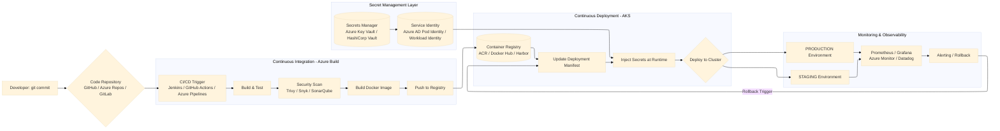

# Code to Cluster: Building a Bulletproof Kubernetes Deployment Pipeline on Azure


In my previous story, we built a comprehensive Kubernetes deployment pipeline on AWS—exploring ECR, EKS, CodeBuild, GitHub Actions, AWS Secrets Manager, and the entire ecosystem of tools that make cloud-native development possible on Amazon's platform. We walked through every stage: from `git push` to build, security scanning, secret management, deployment, and monitoring.

Today, we're taking that exact blueprint and migrating it to **Microsoft Azure**. The architecture remains identical; only the building blocks change. If you read the AWS version, you'll feel right at home—just with different CLI commands and service names.

Let's build the same bulletproof pipeline, now on Azure.

---

## The Architecture at a Glance

Before we dive into the weeds of YAML files and `kubectl` commands, let's look at the high-level flow on Azure. Notice how the structure mirrors our AWS diagram perfectly.



---

## Phase 1: The Code Commit (The Spark)

Every pipeline is a reaction to change. It starts with a developer committing code to a repository.

**The Azure Context:**
While GitHub is the ubiquitous choice (and now owned by Microsoft!), Azure offers **Azure Repos** as part of Azure DevOps—a fully-managed source control service that integrates deeply with the Azure ecosystem.

**Alternatives & Flexibility:**
- **GitHub**: The industry standard, with native integration via GitHub Actions and excellent Azure support
- **GitLab**: Offers built-in CI/CD with GitLab Runners
- **BitBucket**: Popular with Atlassian-centric teams
- **Azure Repos**: Part of Azure DevOps, unlimited private repos, integrated with AD authentication

**The Script (The Trigger):**
There isn't a "script" for a commit, but there is a webhook configuration. In your GitHub repo settings, you point to your CI server or Azure Pipelines.

```bash
# Conceptual Webhook Payload (Sent on git push)
# This tells Azure Pipelines or GitHub Actions: "Something changed in the main branch, start the job!"
{
  "ref": "refs/heads/main",
  "repository": {"name": "my-app", "url": "https://github.com/user/my-app"},
  "commits": [{"id": "abc123...", "message": "Update feature X"}]
}
```

---

## Phase 2: The CI Pipeline (The Build)

This is where code transforms into an artifact. In the Kubernetes world, the artifact is a **Docker Image**.

### Component: CI/CD Orchestrator

On Azure, you have multiple choices:

| Tool | Type | Pros | Cons |
|------|------|------|------|
| **Jenkins** | Self-hosted (Azure VMs/AKS) | Highly customizable, huge plugin ecosystem | Maintenance overhead, requires infrastructure management |
| **GitHub Actions** | SaaS + Self-hosted runners | Native Git integration, free for public repos, matrix builds | Limited customization for complex pipelines |
| **Azure Pipelines** | Fully managed Azure DevOps | Deep Azure integration, unlimited minutes for open source, YAML or GUI | Learning curve, can get expensive for private projects |
| **GitLab CI** | SaaS or Self-hosted | Single application for SCM and CI/CD | Requires GitLab for full experience |
| **CircleCI** | SaaS | Fast, easy to configure, good Docker support | Can get expensive at scale |

Let's look at multiple examples of the same pipeline on Azure:

**Example 1: Azure Pipelines (`azure-pipelines.yml`)**
```yaml
# azure-pipelines.yml
trigger:
  branches:
    include:
    - main

pool:
  vmImage: 'ubuntu-latest'

variables:
  azureSubscription: 'my-azure-service-connection'
  containerRegistry: 'myacr.azurecr.io'
  imageRepository: 'my-app'
  tag: '$(Build.BuildId)'
  dockerfilePath: '$(Build.SourcesDirectory)/Dockerfile'

stages:
- stage: Build
  displayName: Build and push stage
  jobs:
  - job: Build
    displayName: Build
    steps:
    - task: Docker@2
      displayName: Login to ACR
      inputs:
        command: login
        containerRegistry: $(azureSubscription)
    
    - task: CmdLine@2
      displayName: Run Unit Tests
      inputs:
        script: |
          npm ci
          npm test
    
    - task: CmdLine@2
      displayName: Security Scan (Trivy)
      inputs:
        script: |
          docker run --rm -v /var/run/docker.sock:/var/run/docker.sock \
            aquasec/trivy image --severity HIGH,CRITICAL \
            $(containerRegistry)/$(imageRepository):$(tag) || true
    
    - task: Docker@2
      displayName: Build and Push
      inputs:
        command: buildAndPush
        repository: $(imageRepository)
        dockerfile: $(dockerfilePath)
        containerRegistry: $(azureSubscription)
        tags: |
          $(tag)
          latest
```

**Example 2: GitHub Actions (`.github/workflows/ci-azure.yml`)**
```yaml
name: CI Pipeline to Azure ACR

on:
  push:
    branches: [ main ]

env:
  AZURE_CONTAINER_REGISTRY: myacr.azurecr.io
  AZURE_RESOURCE_GROUP: my-rg
  CONTAINER_NAME: my-app

jobs:
  build-and-push:
    runs-on: ubuntu-latest
    
    steps:
      - name: Checkout code
        uses: actions/checkout@v3
      
      - name: Azure Login
        uses: azure/login@v1
        with:
          creds: ${{ secrets.AZURE_CREDENTIALS }}
      
      - name: Run Tests
        run: npm ci && npm test
      
      - name: Security Scan
        uses: aquasecurity/trivy-action@master
        with:
          scan-type: 'fs'
          scan-ref: '.'
          severity: 'HIGH,CRITICAL'
          exit-code: '1'
      
      - name: Build and push Docker image to ACR
        run: |
          az acr build --registry myacr \
            --image ${{ env.CONTAINER_NAME }}:${{ github.sha }} \
            --image ${{ env.CONTAINER_NAME }}:latest .
```

**Example 3: Jenkins Pipeline (`Jenkinsfile` for Azure)**
```groovy
pipeline {
    agent any
    
    environment {
        ACR_NAME = 'myacr'
        ACR_LOGIN_SERVER = 'myacr.azurecr.io'
        IMAGE_REPO = 'my-app'
        IMAGE_TAG = "${GIT_COMMIT}"
    }
    
    stages {
        stage('Checkout') {
            steps { checkout scm }
        }
        
        stage('Test') {
            steps {
                sh 'npm ci && npm test'
            }
        }
        
        stage('Security Scan') {
            steps {
                sh 'trivy fs --severity HIGH,CRITICAL --exit-code 1 .'
            }
        }
        
        stage('Login to ACR') {
            steps {
                withAzureServicePrincipal('my-sp') {
                    sh 'az acr login --name ${ACR_NAME}'
                }
            }
        }
        
        stage('Build and Push') {
            steps {
                sh """
                    docker build -t ${ACR_LOGIN_SERVER}/${IMAGE_REPO}:${IMAGE_TAG} .
                    docker tag ${ACR_LOGIN_SERVER}/${IMAGE_REPO}:${IMAGE_TAG} ${ACR_LOGIN_SERVER}/${IMAGE_REPO}:latest
                    docker push ${ACR_LOGIN_SERVER}/${IMAGE_REPO}:${IMAGE_TAG}
                    docker push ${ACR_LOGIN_SERVER}/${IMAGE_REPO}:latest
                """
            }
        }
    }
}
```

### Component: Container Registry Options

After building the image, we need a place to store it securely:

| Registry | Best For | Key Features |
|----------|----------|--------------|
| **Azure Container Registry (ACR)** | Azure-native workloads | ACR Tasks, geo-replication, Helm chart support, AD authentication |
| **Docker Hub** | Public images, open source | Largest image repository, automated builds |
| **Harbor** | Enterprise self-hosted | Vulnerability scanning, identity integration, replication |
| **Amazon ECR** | AWS users, multi-cloud | IAM integration, image scanning |
| **Google Container Registry** | GCP users | Fast pulls from GKE |
| **Quay.io** | Security-focused teams | Clair security scanner, robot accounts |

**The CLI commands** (Azure ACR vs others):

```bash
# Azure Container Registry (ACR)
az acr login --name myacr
docker build -t my-app .
docker tag my-app:latest myacr.azurecr.io/my-app:latest
docker push myacr.azurecr.io/my-app:latest

# ACR Tasks - build directly in ACR (no local Docker needed!)
az acr build --registry myacr --image my-app:latest .

# Docker Hub
docker login -u yourusername
docker build -t yourusername/my-app:latest .
docker push yourusername/my-app:latest

# Harbor (self-hosted)
docker login harbor.yourcompany.com
docker build -t harbor.yourcompany.com/library/my-app:latest .
docker push harbor.yourcompany.com/library/my-app:latest
```

### Component: Security Scanning Tools

Security isn't optional—it's baked into every stage:

| Tool | Scope | Integration |
|------|-------|-------------|
| **Trivy** | Filesystem, image, Git repo | CLI, GitHub Action, Jenkins plugin |
| **Snyk** | Code, dependencies, containers | IDE plugins, CI integration, GitHub app |
| **SonarQube** | Code quality, security hotspots | Self-hosted, cloud option, extensive rules |
| **Microsoft Defender for Cloud** | Container registry scanning | Native ACR integration, actionable recommendations |
| **Aqua Security** | Container security | Comprehensive security platform |
| **Docker Scout** | Docker images | Docker CLI, Docker Hub integration |

---

## Phase 3: Secret Management (The Critical Layer)

Just as in our AWS version, secret management is critical on Azure. Hardcoding secrets in Docker images or Kubernetes manifests is a security disaster.

### Why Secret Management Matters

In our pipeline, we have several secrets to protect:
- **Database credentials** (passwords, connection strings)
- **API keys** for third-party services (Stripe, Twilio, etc.)
- **TLS certificates** for Ingress
- **Service-to-service authentication** tokens
- **Cloud provider credentials** for the application itself

### Secret Management Options on Azure

| Service | Best For | Key Features |
|---------|----------|--------------|
| **Azure Key Vault** | Azure-native apps | Automatic rotation, fine-grained access policies, HSM support |
| **HashiCorp Vault** | Multi-cloud, dynamic secrets | Unified secrets, encryption as a service, leasing |
| **Kubernetes Secrets + SOPS** | GitOps workflows | Encrypted secrets in Git, decrypted at deploy time |
| **External Secrets Operator** | Bridge between Azure and K8s | Syncs Azure Key Vault to K8s Secrets |
| **Sealed Secrets** | GitOps with encryption | Encrypt secrets for safe storage in Git |
| **Azure App Configuration** | Feature flags + config | Centralized configuration management |

### Integrating Secret Management into the Pipeline

#### Option 1: Azure Key Vault + Azure AD Pod Identity

This is the Azure-native approach: applications in AKS assume an Azure AD identity that grants access to specific secrets in Key Vault.

**Step 1: Create the secret in Azure Key Vault**

```bash
# Create a resource group
az group create --name my-rg --location eastus

# Create a Key Vault
az keyvault create --name mykeyvault --resource-group my-rg --location eastus

# Store database credentials
az keyvault secret set --vault-name mykeyvault --name "database-username" --value "dbuser"
az keyvault secret set --vault-name mykeyvault --name "database-password" --value "SuperSecure123!"
az keyvault secret set --vault-name mykeyvault --name "database-host" --value "mydb.database.windows.net"

# Store API key
az keyvault secret set --vault-name mykeyvault --name "stripe-key" --value "sk_live_123456789abcdef"
```

**Step 2: Set up Azure AD Pod Identity (pre-Workload Identity)**

```bash
# Install aad-pod-identity Helm chart
helm repo add aad-pod-identity https://raw.githubusercontent.com/Azure/aad-pod-identity/master/charts
helm install aad-pod-identity aad-pod-identity/aad-pod-identity

# Create Azure Identity
az identity create --name my-app-identity --resource-group my-rg

# Get identity client ID and resource ID
IDENTITY_CLIENT_ID=$(az identity show --name my-app-identity --resource-group my-rg --query clientId -o tsv)
IDENTITY_RESOURCE_ID=$(az identity show --name my-app-identity --resource-group my-rg --query id -o tsv)

# Assign permissions to access Key Vault
az keyvault set-policy --name mykeyvault \
  --object-id $(az identity show --name my-app-identity --resource-group my-rg --query principalId -o tsv) \
  --secret-permissions get list
```

**Step 3: Create AzureIdentity and AzureIdentityBinding in AKS**

```yaml
# aadpodidentity.yaml
apiVersion: aadpodidentity.k8s.io/v1
kind: AzureIdentity
metadata:
  name: my-app-identity
  namespace: production
spec:
  type: 0  # User-assigned MSI
  resourceID: /subscriptions/xxx/resourcegroups/my-rg/providers/Microsoft.ManagedIdentity/userAssignedIdentities/my-app-identity
  clientID: <IDENTITY_CLIENT_ID>
---
apiVersion: aadpodidentity.k8s.io/v1
kind: AzureIdentityBinding
metadata:
  name: my-app-identity-binding
  namespace: production
spec:
  azureIdentity: my-app-identity
  selector: my-app-selector
```

**Step 4: Application code accesses secrets directly**

```python
# app.py - Python example using Azure SDK
from azure.identity import DefaultAzureCredential
from azure.keyvault.secrets import SecretClient
import json

def get_secret(secret_name):
    key_vault_url = "https://mykeyvault.vault.azure.net"
    
    # DefaultAzureCredential will use the pod identity
    credential = DefaultAzureCredential()
    secret_client = SecretClient(vault_url=key_vault_url, credential=credential)
    
    secret = secret_client.get_secret(secret_name)
    return secret.value

# Get database credentials at runtime
db_username = get_secret("database-username")
db_password = get_secret("database-password")
db_host = get_secret("database-host")

db_connection = create_db_connection(
    username=db_username,
    password=db_password,
    host=db_host
)
```

#### Option 2: Azure Workload Identity (Modern Replacement for Pod Identity)

Workload Identity is the newer, recommended approach that integrates with OIDC federation.

**Step 1: Enable OIDC issuer on AKS**

```bash
# Update AKS cluster to enable OIDC issuer
az aks update --name my-aks-cluster --resource-group my-rg --enable-oidc-issuer

# Get the OIDC issuer URL
OIDC_URL=$(az aks show --name my-aks-cluster --resource-group my-rg --query oidcIssuerProfile.issuerUrl -o tsv)
```

**Step 2: Create a managed identity and federated credential**

```bash
# Create a managed identity
az identity create --name my-app-workload-identity --resource-group my-rg

# Get identity client ID
IDENTITY_CLIENT_ID=$(az identity show --name my-app-workload-identity --resource-group my-rg --query clientId -o tsv)

# Create federated credential
cat <<EOF > params.json
{
  "name": "my-app-federated-credential",
  "issuer": "${OIDC_URL}",
  "subject": "system:serviceaccount:production:my-app-sa",
  "audiences": ["api://AzureADTokenExchange"]
}
EOF

az identity federated-credential create \
  --name my-app-federated-credential \
  --identity-name my-app-workload-identity \
  --resource-group my-rg \
  --issuer ${OIDC_URL} \
  --subject system:serviceaccount:production:my-app-sa \
  --audiences api://AzureADTokenExchange
```

**Step 3: Grant Key Vault access**

```bash
# Get the principal ID of the managed identity
PRINCIPAL_ID=$(az identity show --name my-app-workload-identity --resource-group my-rg --query principalId -o tsv)

# Grant permissions
az keyvault set-policy --name mykeyvault \
  --object-id $PRINCIPAL_ID \
  --secret-permissions get list
```

**Step 4: Create service account in Kubernetes**

```yaml
# service-account.yaml
apiVersion: v1
kind: ServiceAccount
metadata:
  name: my-app-sa
  namespace: production
  annotations:
    azure.workload.identity/client-id: <IDENTITY_CLIENT_ID>
```

**Step 5: Deploy application with workload identity**

```yaml
# deployment.yaml
apiVersion: apps/v1
kind: Deployment
metadata:
  name: my-app
  namespace: production
spec:
  template:
    metadata:
      labels:
        azure.workload.identity/use: "true"
    spec:
      serviceAccountName: my-app-sa
      containers:
      - name: my-app
        image: myacr.azurecr.io/my-app:latest
        env:
        - name: AZURE_CLIENT_ID
          value: <IDENTITY_CLIENT_ID>
        - name: KEY_VAULT_URL
          value: https://mykeyvault.vault.azure.net
```

#### Option 3: External Secrets Operator (Sync Azure Key Vault to Kubernetes)

This approach keeps the Kubernetes-native workflow but syncs secrets from Azure Key Vault.

**Step 1: Install External Secrets Operator**

```bash
# Install with Helm
helm repo add external-secrets https://charts.external-secrets.io
helm install external-secrets external-secrets/external-secrets \
    --namespace external-secrets \
    --create-namespace
```

**Step 2: Create a SecretStore (connection to Azure Key Vault)**

```yaml
# secretstore.yaml
apiVersion: external-secrets.io/v1beta1
kind: SecretStore
metadata:
  name: azure-keyvault
  namespace: production
spec:
  provider:
    azurekv:
      vaultUrl: "https://mykeyvault.vault.azure.net"
      tenantId: <AZURE_TENANT_ID>
      authType: WorkloadIdentity  # or ManagedIdentity
      serviceAccountRef:
        name: external-secrets-sa  # Service account with workload identity
```

**Step 3: Create ExternalSecret resources**

```yaml
# externalsecret.yaml
apiVersion: external-secrets.io/v1beta1
kind: ExternalSecret
metadata:
  name: myapp-database-secret
  namespace: production
spec:
  refreshInterval: 1h
  secretStoreRef:
    name: azure-keyvault
    kind: SecretStore
  target:
    name: myapp-database-secret  # Name of the K8s secret to create
    creationPolicy: Owner
  data:
  - secretKey: username
    remoteRef:
      key: database-username
  - secretKey: password
    remoteRef:
      key: database-password
  - secretKey: host
    remoteRef:
      key: database-host
```

**Step 4: Reference the secret in your deployment**

```yaml
# deployment.yaml
apiVersion: apps/v1
kind: Deployment
metadata:
  name: my-app
  namespace: production
spec:
  template:
    spec:
      containers:
      - name: my-app
        image: myacr.azurecr.io/my-app:latest
        env:
        - name: DATABASE_USERNAME
          valueFrom:
            secretKeyRef:
              name: myapp-database-secret
              key: username
        - name: DATABASE_PASSWORD
          valueFrom:
            secretKeyRef:
              name: myapp-database-secret
              key: password
        - name: DATABASE_HOST
          valueFrom:
            secretKeyRef:
              name: myapp-database-secret
              key: host
```

#### Option 4: HashiCorp Vault on Azure

For organizations running across multiple clouds, Vault provides a unified interface.

**Step 1: Deploy Vault on AKS**

```bash
# Add Vault Helm repo
helm repo add hashicorp https://helm.releases.hashicorp.com

# Install Vault with Helm
helm install vault hashicorp/vault \
    --namespace vault \
    --create-namespace \
    --set server.dev.enabled=false \
    --set server.dataStorage.size=10Gi
```

**Step 2: Initialize and unseal Vault**

```bash
# Initialize Vault (first time only)
kubectl exec -it vault-0 -n vault -- vault operator init

# Save the unseal keys and root token securely!
# Unseal Vault (need 3 keys for threshold)
kubectl exec -it vault-0 -n vault -- vault operator unseal <key1>
kubectl exec -it vault-0 -n vault -- vault operator unseal <key2>
kubectl exec -it vault-0 -n vault -- vault operator unseal <key3>
```

**Step 3: Enable Kubernetes authentication**

```bash
# Enable Kubernetes auth
kubectl exec -it vault-0 -n vault -- vault auth enable kubernetes

# Configure Kubernetes auth
kubectl exec -it vault-0 -n vault -- vault write auth/kubernetes/config \
    kubernetes_host="https://$KUBERNETES_SERVICE_HOST:$KUBERNETES_SERVICE_PORT"
```

**Step 4: Store secrets in Vault**

```bash
# Store database credentials
kubectl exec -it vault-0 -n vault -- vault kv put secret/myapp/production/database \
    username=dbuser \
    password=SuperSecure123! \
    host=mydb.database.windows.net

# Store API keys
kubectl exec -it vault-0 -n vault -- vault kv put secret/myapp/production/stripe \
    api_key=sk_live_123456789
```

**Step 5: Create Vault policy and role**

```bash
# Create policy
cat > myapp-policy.hcl << EOF
path "secret/data/myapp/production/*" {
  capabilities = ["read"]
}
EOF

kubectl cp myapp-policy.hcl vault-0:/tmp/ -n vault
kubectl exec -it vault-0 -n vault -- vault policy write myapp-production /tmp/myapp-policy.hcl

# Create role for Kubernetes service account
kubectl exec -it vault-0 -n vault -- vault write auth/kubernetes/role/myapp \
    bound_service_account_names=my-app-sa \
    bound_service_account_namespaces=production \
    policies=myapp-production \
    ttl=1h
```

#### Option 5: Sealed Secrets (GitOps-Friendly)

For teams practicing GitOps, Sealed Secrets allows encrypting secrets so they can be safely stored in Git. This works identically on Azure.

**Step 1: Install Sealed Secrets controller**

```bash
# Install with kubectl
kubectl apply -f https://github.com/bitnami-labs/sealed-secrets/releases/download/v0.20.0/controller.yaml

# Or with Helm
helm repo add sealed-secrets https://bitnami-labs.github.io/sealed-secrets
helm install sealed-secrets sealed-secrets/sealed-secrets
```

**Step 2: Install kubeseal CLI**

```bash
# Download kubeseal
wget https://github.com/bitnami-labs/sealed-secrets/releases/download/v0.20.0/kubeseal-0.20.0-linux-amd64.tar.gz
tar xzf kubeseal-0.20.0-linux-amd64.tar.gz
sudo install -m 755 kubeseal /usr/local/bin/
```

**Step 3: Create and seal a secret**

```bash
# Create a local secret file (plaintext - NEVER commit this!)
cat > database-secret.yaml << EOF
apiVersion: v1
kind: Secret
metadata:
  name: myapp-database
  namespace: production
type: Opaque
data:
  username: $(echo -n "dbuser" | base64)
  password: $(echo -n "SuperSecure123!" | base64)
  host: $(echo -n "mydb.database.windows.net" | base64)
EOF

# Seal the secret (encrypt it)
kubeseal -f database-secret.yaml -w sealed-database-secret.yaml
```

**Step 4: Commit sealed secret to Git**

```yaml
# sealed-database-secret.yaml (safe to commit to Git!)
apiVersion: bitnami.com/v1alpha1
kind: SealedSecret
metadata:
  name: myapp-database
  namespace: production
spec:
  encryptedData:
    username: AgBy3i4OJSWK+... (encrypted content)
    password: AgBy3i4OJSWK+... (encrypted content)
    host: AgBy3i4OJSWK+... (encrypted content)
```

**Step 5: Apply in the pipeline**

```bash
# In your CD pipeline, just apply the sealed secret
kubectl apply -f sealed-database-secret.yaml

# The controller decrypts it automatically using its private key
# A regular Kubernetes secret is created
```

---

## Phase 4: Deploy to Kubernetes (The CD)

The image is now safely stored in ACR, and secrets are securely managed in Azure Key Vault. Now we need to deploy it to Kubernetes. On Azure, the managed Kubernetes service is **Azure Kubernetes Service (AKS)** .

### Kubernetes Platform Options

| Platform | Description | Use Case |
|----------|-------------|----------|
| **Azure Kubernetes Service (AKS)** | Azure managed Kubernetes | Azure-centric organizations, integrated with AD, monitoring |
| **Self-managed K8s on Azure VMs** | You manage control plane | Complete control, specialized requirements |
| **AKS on Azure Stack HCI** | On-premises Kubernetes | Hybrid deployments, edge computing |
| **k3s/k3d** | Lightweight K8s | Development, edge computing |
| **Minikube** | Local single-node cluster | Local development, testing |

### Deployment Tools

Just like on AWS, modern teams use:

| Tool | Purpose | Key Feature |
|------|---------|-------------|
| **Helm** | Package management | Charts, templating, releases |
| **Kustomize** | Configuration management | Overlays, no templates, native kubectl |
| **ArgoCD** | GitOps continuous delivery | Auto-sync, multi-cluster, UI |
| **Flux** | GitOps operator | Automated reconciliation, multi-tenancy |
| **Skaffold** | Development workflow | Continuous development, file sync |

### The Manifests (Comparing Approaches)

**Option 1: Raw YAML (`deployment.yaml`)**
```yaml
apiVersion: apps/v1
kind: Deployment
metadata:
  name: my-app-deployment
  namespace: production
spec:
  replicas: 3
  selector:
    matchLabels:
      app: my-app
  template:
    metadata:
      labels:
        app: my-app
    spec:
      containers:
      - name: my-app-container
        image: myacr.azurecr.io/my-app:latest
        ports:
        - containerPort: 8080
```

**Option 2: Helm Chart (templating)**
```yaml
# values.yaml
replicaCount: 3
image:
  repository: myacr.azurecr.io/my-app
  tag: latest
  pullPolicy: Always
service:
  type: ClusterIP
  port: 80
ingress:
  enabled: true
  host: myapp.example.com
```

```yaml
# templates/deployment.yaml (simplified)
apiVersion: apps/v1
kind: Deployment
metadata:
  name: {{ .Values.appName }}
spec:
  replicas: {{ .Values.replicaCount }}
  template:
    spec:
      containers:
      - name: {{ .Chart.Name }}
        image: "{{ .Values.image.repository }}:{{ .Values.image.tag }}"
```

### The Deployment Script (Multiple Approaches)

**Approach 1: kubectl with sed (Simple)**
```bash
#!/bin/bash
# Get AKS credentials
az aks get-credentials --resource-group my-rg --name my-aks-cluster

# Update image in YAML and apply
sed -i.bak "s|image:.*|image: myacr.azurecr.io/my-app:${IMAGE_TAG}|" kubernetes/deployment.yaml
kubectl apply -f kubernetes/
kubectl rollout status deployment/my-app -n production
```

**Approach 2: Helm Upgrade (Package Management)**
```bash
#!/bin/bash
az aks get-credentials --resource-group my-rg --name my-aks-cluster

# Package and deploy with Helm
helm upgrade --install my-app ./helm-chart \
  --namespace production \
  --set image.tag=${IMAGE_TAG} \
  --set replicaCount=3 \
  --wait \
  --timeout 5m
```

**Approach 3: ArgoCD (GitOps)**
```bash
# With ArgoCD, you don't run commands to deploy!
# You just update Git, and ArgoCD syncs automatically

# Update the manifest in Git
git checkout -b release/new-version
sed -i "s|tag:.*|tag: ${IMAGE_TAG}|" kubernetes/production/kustomization.yaml
git add . && git commit -m "Update to version ${IMAGE_TAG}"
git push origin release/new-version

# Create PR, merge to main
# ArgoCD detects the change in main and auto-syncs!
```

---

## Phase 5: The Environments (Staging vs. Production)

In a mature setup, the pipeline doesn't deploy to production immediately. Here's how different tools handle environments on Azure:

### Environment Strategy with Different Tools

**Azure Pipelines Environments:**
```yaml
# azure-pipelines.yml (continued)
stages:
- stage: DeployStaging
  displayName: Deploy to Staging
  dependsOn: Build
  condition: succeeded()
  jobs:
  - deployment: Deploy
    displayName: Deploy to AKS Staging
    environment: staging
    strategy:
      runOnce:
        deploy:
          steps:
          - task: KubernetesManifest@0
            inputs:
              action: deploy
              kubernetesServiceConnection: 'aks-staging-connection'
              namespace: staging
              manifests: |
                $(System.DefaultWorkingDirectory)/manifests/deployment.yaml
                $(System.DefaultWorkingDirectory)/manifests/service.yaml
              containers: |
                myacr.azurecr.io/my-app:$(Build.BuildId)

- stage: DeployProduction
  displayName: Deploy to Production
  dependsOn: DeployStaging
  condition: succeeded()
  jobs:
  - deployment: Deploy
    displayName: Deploy to AKS Production
    environment: production
    strategy:
      runOnce:
        deploy:
          steps:
          - task: KubernetesManifest@0
            inputs:
              action: deploy
              kubernetesServiceConnection: 'aks-production-connection'
              namespace: production
              manifests: |
                $(System.DefaultWorkingDirectory)/manifests/deployment.yaml
                $(System.DefaultWorkingDirectory)/manifests/service.yaml
              containers: |
                myacr.azurecr.io/my-app:$(Build.BuildId)
```

**GitHub Actions Environments:**
```yaml
name: Deploy to AKS

on:
  workflow_run:
    workflows: ["CI Pipeline to Azure ACR"]
    branches: [main]
    types: [completed]

jobs:
  deploy-staging:
    runs-on: ubuntu-latest
    environment: staging
    steps:
      - name: Azure Login
        uses: azure/login@v1
        with:
          creds: ${{ secrets.AZURE_CREDENTIALS }}
      
      - name: Get AKS credentials
        run: az aks get-credentials --resource-group my-rg --name my-aks-staging
      
      - name: Deploy to Staging
        run: |
          sed -i "s|image:.*|image: myacr.azurecr.io/my-app:${{ github.sha }}|" k8s/deployment.yaml
          kubectl apply -f k8s/ -n staging
          kubectl rollout status deployment/my-app -n staging
  
  deploy-production:
    needs: deploy-staging
    runs-on: ubuntu-latest
    environment: 
      name: production
      url: https://app.example.com
    steps:
      - name: Azure Login
        uses: azure/login@v1
        with:
          creds: ${{ secrets.AZURE_CREDENTIALS }}
      
      - name: Get AKS credentials
        run: az aks get-credentials --resource-group my-rg --name my-aks-production
      
      - name: Deploy to Production
        run: |
          sed -i "s|image:.*|image: myacr.azurecr.io/my-app:${{ github.sha }}|" k8s/deployment.yaml
          kubectl apply -f k8s/ -n production
          kubectl rollout status deployment/my-app -n production
```

**Jenkins with Pipeline:**
```groovy
stage('Deploy to Staging') {
    when { branch 'main' }
    steps {
        sh 'az aks get-credentials --resource-group my-rg --name my-aks-staging'
        sh 'kubectl apply -f k8s/staging/'
        input message: 'Approve deployment to production?', ok: 'Deploy'
    }
}

stage('Deploy to Production') {
    when { branch 'main' }
    steps {
        sh 'az aks get-credentials --resource-group my-rg --name my-aks-production'
        sh 'kubectl apply -f k8s/production/'
    }
}
```

---

## Phase 6: Monitoring & Rollback (The Safety Net)

Once deployed, we need to ensure the application stays healthy.

### Monitoring Stack Options

| Category | Azure-Native | Open Source | Commercial |
|----------|--------------|--------------|------------|
| **Metrics** | Azure Monitor | Prometheus | Datadog |
| **Visualization** | Azure Dashboards | Grafana | New Relic |
| **Logs** | Azure Log Analytics | ELK Stack | Splunk |
| **Tracing** | Azure Application Insights | Jaeger | Dynatrace |
| **Alerting** | Azure Alerts | Alertmanager | PagerDuty |

### Setting Up Monitoring

**Option 1: Azure Monitor for Containers (Native)**

```bash
# Enable Azure Monitor for Containers on AKS
az aks enable-addons \
  --addons monitoring \
  --name my-aks-cluster \
  --resource-group my-rg

# Or configure an existing cluster
az aks enable-addons \
  --addons monitoring \
  --name my-aks-cluster \
  --resource-group my-rg \
  --workspace-resource-id <workspace-id>
```

**Option 2: Prometheus + Grafana on AKS (Open Source)**

```bash
# Add repos and install
helm repo add prometheus-community https://prometheus-community.github.io/helm-charts
helm repo add grafana https://grafana.github.io/helm-charts

# Install Prometheus
helm install prometheus prometheus-community/prometheus \
  --namespace monitoring \
  --create-namespace

# Install Grafana
helm install grafana grafana/grafana \
  --namespace monitoring \
  --set persistence.enabled=true \
  --set adminPassword='admin' \
  --set datasources."datasources\.yaml".apiVersion=1 \
  --set datasources."datasources\.yaml".datasources[0].name=Prometheus \
  --set datasources."datasources\.yaml".datasources[0].type=prometheus \
  --set datasources."datasources\.yaml".datasources[0].url=http://prometheus-server.monitoring.svc.cluster.local \
  --set datasources."datasources\.yaml".datasources[0].access=proxy \
  --set datasources."datasources\.yaml".datasources[0].isDefault=true
```

**Option 3: Azure Managed Grafana**

```bash
# Create Azure Managed Grafana instance
az grafana create \
  --name my-grafana \
  --resource-group my-rg \
  --location eastus

# Get the Grafana URL
GRAFANA_URL=$(az grafana show --name my-grafana --resource-group my-rg --query properties.endpoint -o tsv)

# Add Azure Monitor data source
az grafana data-source create \
  --name my-grafana \
  --resource-group my-rg \
  --definition '{
    "name": "Azure Monitor",
    "type": "grafana-azure-monitor-datasource",
    "access": "proxy",
    "jsonData": {
      "azureAuthType": "msi"
    }
  }'
```

### Implementing Rollback Strategies

**Manual Rollback:**
```bash
# Rollback to previous deployment
kubectl rollout undo deployment/my-app -n production

# Rollback to specific revision
kubectl rollout history deployment/my-app -n production
kubectl rollout undo deployment/my-app -n production --to-revision=3

# Using Helm rollback
helm rollback my-app 1 -n production
```

**Automated Rollback with Azure Monitor Alerts:**

```bash
# Create an alert rule based on metrics
az monitor metrics alert create \
  --name "High Error Rate" \
  --resource-group my-rg \
  --scopes /subscriptions/xxx/resourceGroups/my-rg/providers/Microsoft.ContainerService/managedClusters/my-aks-cluster \
  --condition "count 'kube_pod_container_status_restarts_total' > 5" \
  --description "Alert when pods are restarting frequently" \
  --evaluation-frequency 5m \
  --window-size 15m \
  --action-group /subscriptions/xxx/resourceGroups/my-rg/providers/microsoft.insights/actionGroups/my-ag
```

**GitOps Rollback (ArgoCD):**
```bash
# With GitOps, rollback is just reverting Git!
git revert HEAD
git push origin main
# ArgoCD automatically syncs back to the previous state
```

---

## Putting It All Together: Complete Pipeline with Secret Management

Here's the complete Azure Pipelines workflow with all phases integrated:

```yaml
# azure-pipelines-full.yml
trigger:
  branches:
    include:
    - main

variables:
  azureSubscription: 'my-azure-service-connection'
  resourceGroup: 'my-rg'
  aksCluster: 'my-aks-cluster'
  acrName: 'myacr'
  imageRepository: 'my-app'
  tag: '$(Build.BuildId)'
  dockerfilePath: '$(Build.SourcesDirectory)/Dockerfile'

stages:
- stage: CI
  displayName: Continuous Integration
  jobs:
  - job: BuildAndPush
    displayName: Build, Test, Scan, and Push
    pool:
      vmImage: 'ubuntu-latest'
    
    steps:
    - checkout: self
    
    - task: NodeTool@0
      inputs:
        versionSpec: '18.x'
      displayName: 'Install Node.js'
    
    - script: |
        npm ci
        npm run lint
        npm test -- --coverage
      displayName: 'Run tests and linting'
    
    - task: CmdLine@2
      displayName: 'Security Scan (Trivy filesystem)'
      inputs:
        script: |
          docker run --rm -v $(pwd):/workspace aquasec/trivy:latest \
            fs --severity HIGH,CRITICAL --exit-code 1 /workspace
    
    - task: Docker@2
      displayName: 'Login to ACR'
      inputs:
        command: login
        containerRegistry: $(azureSubscription)
    
    - task: Docker@2
      displayName: 'Build and push Docker image'
      inputs:
        command: buildAndPush
        repository: $(imageRepository)
        dockerfile: $(dockerfilePath)
        containerRegistry: $(azureSubscription)
        tags: |
          $(tag)
          latest
    
    - task: CmdLine@2
      displayName: 'Scan Docker image'
      inputs:
        script: |
          docker run --rm -v /var/run/docker.sock:/var/run/docker.sock \
            aquasec/trivy:latest image \
            --severity HIGH,CRITICAL \
            $(acrName).azurecr.io/$(imageRepository):$(tag)
    
    - task: PublishBuildArtifacts@1
      inputs:
        pathToPublish: 'kubernetes'
        artifactName: 'manifests'

- stage: DeployStaging
  displayName: Deploy to Staging
  dependsOn: CI
  condition: succeeded()
  jobs:
  - deployment: Deploy
    displayName: Deploy to AKS Staging
    environment: staging
    strategy:
      runOnce:
        deploy:
          steps:
          - checkout: self
          
          - task: AzureCLI@2
            displayName: 'Get AKS credentials'
            inputs:
              azureSubscription: $(azureSubscription)
              scriptType: bash
              scriptLocation: inlineScript
              inlineScript: |
                az aks get-credentials --resource-group $(resourceGroup) --name $(aksCluster)-staging
          
          - task: KubernetesManifest@0
            displayName: 'Deploy to AKS'
            inputs:
              action: deploy
              kubernetesServiceConnection: 'aks-staging-connection'
              namespace: staging
              manifests: |
                $(Pipeline.Workspace)/manifests/deployment.yaml
                $(Pipeline.Workspace)/manifests/service.yaml
              containers: |
                $(acrName).azurecr.io/$(imageRepository):$(tag)
          
          - task: CmdLine@2
            displayName: 'Run smoke tests'
            inputs:
              script: |
                kubectl wait --for=condition=ready pod -l app=my-app -n staging --timeout=60s
                STAGING_IP=$(kubectl get svc -n staging my-app -o jsonpath='{.status.loadBalancer.ingress[0].ip}')
                curl -f http://$STAGING_IP/health

- stage: DeployProduction
  displayName: Deploy to Production
  dependsOn: DeployStaging
  condition: succeeded()
  jobs:
  - deployment: Deploy
    displayName: Deploy to AKS Production
    environment: production
    strategy:
      runOnce:
        deploy:
          steps:
          - checkout: self
          
          - task: AzureCLI@2
            displayName: 'Get AKS credentials'
            inputs:
              azureSubscription: $(azureSubscription)
              scriptType: bash
              scriptLocation: inlineScript
              inlineScript: |
                az aks get-credentials --resource-group $(resourceGroup) --name $(aksCluster)-production
          
          - task: KubernetesManifest@0
            displayName: 'Deploy to AKS'
            inputs:
              action: deploy
              kubernetesServiceConnection: 'aks-production-connection'
              namespace: production
              manifests: |
                $(Pipeline.Workspace)/manifests/deployment.yaml
                $(Pipeline.Workspace)/manifests/service.yaml
                $(Pipeline.Workspace)/manifests/ingress.yaml
              containers: |
                $(acrName).azurecr.io/$(imageRepository):$(tag)
          
          - task: CmdLine@2
            displayName: 'Verify deployment'
            inputs:
              script: |
                kubectl rollout status deployment/my-app -n production --timeout=2m
```

### GitHub Actions Complete Pipeline for Azure

```yaml
# .github/workflows/full-azure-pipeline.yml
name: Complete CI/CD Pipeline to Azure

on:
  push:
    branches: [ main ]

env:
  AZURE_RESOURCE_GROUP: my-rg
  AZURE_CONTAINER_REGISTRY: myacr.azurecr.io
  AKS_CLUSTER_STAGING: my-aks-staging
  AKS_CLUSTER_PRODUCTION: my-aks-production
  CONTAINER_NAME: my-app

jobs:
  ci:
    name: Continuous Integration
    runs-on: ubuntu-latest
    
    steps:
    - uses: actions/checkout@v3
    
    - name: Setup Node.js
      uses: actions/setup-node@v3
      with:
        node-version: '18'
        cache: 'npm'
    
    - name: Install dependencies
      run: npm ci
    
    - name: Run linter
      run: npm run lint
    
    - name: Run unit tests
      run: npm test -- --coverage
    
    - name: SonarCloud Scan
      uses: SonarSource/sonarcloud-github-action@master
      env:
        GITHUB_TOKEN: ${{ secrets.GITHUB_TOKEN }}
        SONAR_TOKEN: ${{ secrets.SONAR_TOKEN }}
    
    - name: Azure Login
      uses: azure/login@v1
      with:
        creds: ${{ secrets.AZURE_CREDENTIALS }}
    
    - name: Security scan filesystem
      uses: aquasecurity/trivy-action@master
      with:
        scan-type: 'fs'
        scan-ref: '.'
        severity: 'HIGH,CRITICAL'
        exit-code: '1'
    
    - name: Scan for hardcoded secrets
      uses: trufflesecurity/trufflehog@main
      with:
        path: ./
        base: ${{ github.event.repository.default_branch }}
    
    - name: Build and push Docker image to ACR
      run: |
        az acr build --registry myacr \
          --image ${{ env.CONTAINER_NAME }}:${{ github.sha }} \
          --image ${{ env.CONTAINER_NAME }}:latest .
    
    - name: Upload Kubernetes manifests
      uses: actions/upload-artifact@v3
      with:
        name: manifests
        path: kubernetes/

  cd-staging:
    name: Deploy to Staging
    needs: ci
    runs-on: ubuntu-latest
    environment: staging
    
    steps:
    - uses: actions/checkout@v3
    
    - name: Download manifests
      uses: actions/download-artifact@v3
      with:
        name: manifests
        path: kubernetes/
    
    - name: Azure Login
      uses: azure/login@v1
      with:
        creds: ${{ secrets.AZURE_CREDENTIALS }}
    
    - name: Get AKS credentials
      run: |
        az aks get-credentials --resource-group ${{ env.AZURE_RESOURCE_GROUP }} --name ${{ env.AKS_CLUSTER_STAGING }}
    
    - name: Apply SecretStore (External Secrets)
      run: |
        kubectl apply -f kubernetes/secretstore.yaml
    
    - name: Create ExternalSecret for database
      env:
        IMAGE_TAG: ${{ github.sha }}
      run: |
        envsubst < kubernetes/externalsecret.yaml | kubectl apply -f -
    
    - name: Deploy to Staging
      run: |
        sed -i "s|image:.*|image: ${{ env.AZURE_CONTAINER_REGISTRY }}/${{ env.CONTAINER_NAME }}:${{ github.sha }}|" kubernetes/deployment.yaml
        kubectl apply -f kubernetes/ -n staging
        kubectl rollout status deployment/my-app -n staging --timeout=3m
    
    - name: Run smoke tests
      run: |
        kubectl wait --for=condition=ready pod -l app=my-app -n staging --timeout=60s
        STAGING_IP=$(kubectl get svc -n staging my-app -o jsonpath='{.status.loadBalancer.ingress[0].ip}')
        curl -f http://$STAGING_IP/health || exit 1

  cd-production:
    name: Deploy to Production
    needs: cd-staging
    runs-on: ubuntu-latest
    environment: 
      name: production
      url: https://app.example.com
    if: github.ref == 'refs/heads/main'
    
    steps:
    - uses: actions/checkout@v3
    
    - name: Download manifests
      uses: actions/download-artifact@v3
      with:
        name: manifests
        path: kubernetes/
    
    - name: Azure Login
      uses: azure/login@v1
      with:
        creds: ${{ secrets.AZURE_CREDENTIALS }}
    
    - name: Get AKS credentials
      run: |
        az aks get-credentials --resource-group ${{ env.AZURE_RESOURCE_GROUP }} --name ${{ env.AKS_CLUSTER_PRODUCTION }}
    
    - name: Deploy to Production
      run: |
        sed -i "s|image:.*|image: ${{ env.AZURE_CONTAINER_REGISTRY }}/${{ env.CONTAINER_NAME }}:${{ github.sha }}|" kubernetes/deployment.yaml
        kubectl apply -f kubernetes/ -n production
        kubectl rollout status deployment/my-app -n production --timeout=5m
    
    - name: Verify deployment
      run: |
        kubectl get pods -n production
        kubectl get ingress -n production
    
    - name: Notify Slack
      uses: 8398a7/action-slack@v3
      with:
        status: ${{ job.status }}
        fields: repo,message,commit,author,action,eventName,workflow
      env:
        SLACK_WEBHOOK_URL: ${{ secrets.SLACK_WEBHOOK }}
```

---

## Best Practices for Secret Management on Azure

### 1. **Never hardcode secrets**
```bash
# ❌ BAD: Hardcoded in Dockerfile
ENV DB_PASSWORD=SuperSecure123!

# ❌ BAD: Hardcoded in code
const dbPassword = "SuperSecure123!";

# ✅ GOOD: Environment variable from Azure Key Vault
ENV DB_PASSWORD=${DB_PASSWORD}
```

### 2. **Rotate secrets regularly**
```bash
# Azure Key Vault automatic rotation (requires custom solution)
# You can use Azure Event Grid + Azure Functions

# Or set expiration dates
az keyvault secret set-attributes \
  --vault-name mykeyvault \
  --name database-password \
  --expires $(date -d '+90 days' +%Y-%m-%d)
```

### 3. **Audit secret access**
```bash
# Enable Key Vault logging
az monitor diagnostic-settings create \
  --resource /subscriptions/xxx/resourceGroups/my-rg/providers/Microsoft.KeyVault/vaults/mykeyvault \
  --name keyvault-logs \
  --workspace <workspace-id> \
  --logs '[
    {
      "category": "AuditEvent",
      "enabled": true,
      "retentionPolicy": {
        "days": 365,
        "enabled": true
      }
    }
  ]'

# Query logs in Log Analytics
# AzureDiagnostics
# | where ResourceProvider == "MICROSOFT.KEYVAULT"
# | where OperationName == "SecretGet"
# | summarize count() by UserPrincipalName, bin(TimeGenerated, 1h)
```

### 4. **Use least privilege principle**
```bash
# Grant access only to specific secrets
az keyvault set-policy --name mykeyvault \
  --object-id <principal-id> \
  --secret-permissions get list \
  --key-permissions get \
  --certificate-permissions get

# Use Azure RBAC for Key Vault (preview)
az role assignment create \
  --role "Key Vault Secrets User" \
  --assignee <principal-id> \
  --scope /subscriptions/xxx/resourceGroups/my-rg/providers/Microsoft.KeyVault/vaults/mykeyvault
```

### Secret Management Comparison Table (Azure Focus)

| Feature | Azure Key Vault | Parameter Store (App Config) | Vault | Sealed Secrets | External Secrets |
|---------|-----------------|------------------------------|--------|----------------|------------------|
| **Secret rotation** | ⚠️ Manual/API | ❌ Manual | ✅ Dynamic | ❌ Manual | ❌ Manual |
| **Audit logging** | ✅ Log Analytics | ✅ Log Analytics | ✅ Detailed | ❌ | ✅ Log Analytics |
| **Azure AD integration** | ✅ Native | ✅ Native | ⚠️ Via auth | ❌ | ✅ Via AAD |
| **Multi-cloud** | ❌ Azure only | ❌ Azure only | ✅ Yes | ✅ Yes | ⚠️ Azure supported |
| **GitOps friendly** | ❌ | ❌ | ❌ | ✅ | ⚠️ Needs controller |
| **Cost** | 💰 Free tier available | 💰 Free tier | 💰 Self-managed | 🆓 Free | 🆓 Free |
| **Complexity** | Low | Low | High | Medium | Medium |

---

## Conclusion: The Azure Journey

We have successfully mapped the abstract "Kubernetes Deployment Pipeline" diagram to concrete implementations on Microsoft Azure, mirroring our previous AWS deep-dive.

**Remember the AWS version?** We explored ECR, EKS, CodeBuild, GitHub Actions, and AWS Secrets Manager. Today, we swapped every building block:

| Layer | AWS Version | Azure Version |
|-------|-------------|---------------|
| **Container Registry** | Amazon ECR | Azure Container Registry (ACR) |
| **Kubernetes** | Amazon EKS | Azure Kubernetes Service (AKS) |
| **CI/CD** | CodeBuild/CodePipeline | Azure Pipelines / GitHub Actions |
| **Secret Management** | AWS Secrets Manager | Azure Key Vault |
| **Service Identity** | IRSA | Azure AD Workload Identity |
| **Monitoring** | CloudWatch/Prometheus | Azure Monitor / Prometheus |

**Key Takeaways (Same as AWS, just different commands):**
- **Choose tools that fit your team**, not just the cloud provider
- **Security scanning is non-negotiable** - integrate it early
- **Secrets require their own lifecycle** - separate from application code
- **Environments need parity** - staging should mirror production
- **GitOps is the future** - Git as the single source of truth
- **Monitoring completes the loop** - you can't improve what you don't measure

**What's Next?**
Now that we've covered both AWS and Azure in depth, the journey continues. Future stories might explore:

- **Multi-cloud deployments** - Running the same pipeline across both clouds
- **On-premises Kubernetes** - Bringing these patterns to your data center
- **Service mesh integration** - Adding Istio or Linkerd for advanced traffic management
- **Platform Engineering** - Building Internal Developer Platforms on top of these pipelines

The fundamental principles remain constant: **build, scan, secure secrets, deploy, monitor**. Only the tools change.

---

*Did you find this guide helpful? Did you read the AWS version? Let me know in the comments how your cloud journey is going and which platform you prefer!*

cloud-native content, and let me know in the comments which tools you're using in your pipelines!*

*Questions? Feedback? Comment? leave a response below. If you're implementing something similar and want to discuss architectural tradeoffs, I'm always happy to connect with fellow engineers tackling these challenges.*