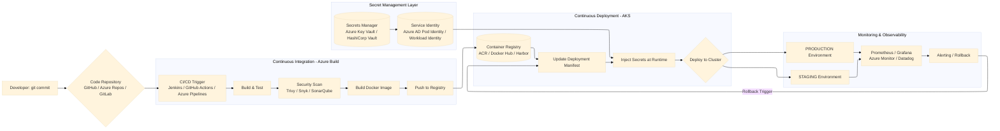

# Before we dive into the weeds of YAML files and `k

```mermaid
---
config:
  theme: base
  layout: elk
---
flowchart LR
 subgraph s1["Continuous Integration - Azure Build"]
    direction LR
        D["Build & Test"]
        C["CI/CD Trigger<br>Jenkins / GitHub Actions / Azure Pipelines"]
        E["Security Scan<br>Trivy / Snyk / SonarQube"]
        F["Build Docker Image"]
        G["Push to Registry"]
  end
 subgraph s2["Secret Management Layer"]
        I[("Secrets Manager<br>Azure Key Vault / HashiCorp Vault")]
        J[("Service Identity<br>Azure AD Pod Identity / Workload Identity")]
  end
 subgraph s3["Continuous Deployment - AKS"]
        K["Update Deployment Manifest"]
        H[("Container Registry<br>ACR / Docker Hub / Harbor")]
        L["Inject Secrets at Runtime"]
        M{"Deploy to Cluster"}
  end
 subgraph Observability["Monitoring & Observability"]
        P["Prometheus / Grafana<br>Azure Monitor / Datadog"]
        N["STAGING Environment"]
        O["PRODUCTION Environment"]
        Q["Alerting / Rollback"]
  end
    A["Developer: git commit"] --> B{"Code Repository<br>GitHub / Azure Repos / GitLab"}
    B --> C
    C --> D
    D --> E
    E --> F
    F --> G
    G --> H
    I --> J
    H --> K
    J --> L
    K --> L
    L --> M
    M --> N & O
    N --> P
    O --> P
    P --> Q
    Q -- Rollback Trigger --> K
```
