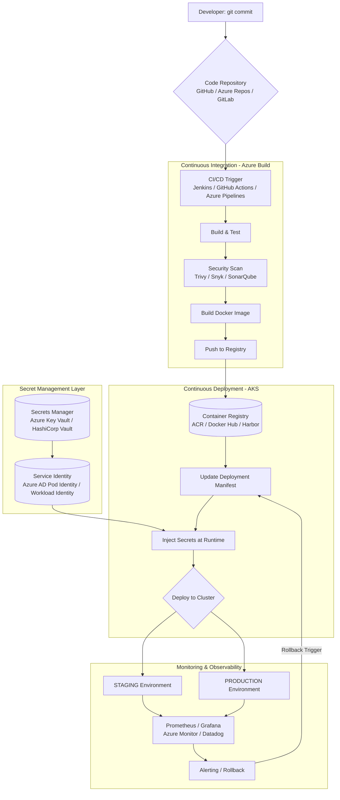

# Code to Cluster: Building a Bulletproof Kubernetes Deployment Pipeline on AWS

In the modern cloud-native era, getting your code from a developer's laptop into a live, scalable environment is half the battle. We often talk about "shifting left" and "DevOps culture," but the tangible artifact of that culture is the **CI/CD Pipeline**.

Recently, I visualized a standard, robust pipeline in a simple flowchart. Today, we are going to dissect that flowchart. We will move from a theoretical "Kubernetes Deployment Pipeline" diagram to a practical, hands-on guide for implementing it specifically on **Amazon Web Services (AWS)** .

We will walk through every stage: from the `git push` that triggers the pipeline, to the build and security scans, the deployment onto Amazon EKS (Elastic Kubernetes Service), secret management, and finally, how we keep it alive with monitoring.

**And this is just the beginning.** The structure we build today is cloud-agnostic in philosophy. In my next story, we will take this exact blueprint and migrate it to **Microsoft Azure** (using AKS, Azure Container Registry, and Azure DevOps), highlighting the syntactic differences but architectural similarities.

Let's build it.

---

## The Architecture at a Glance

Before we dive into the weeds of YAML files and `kubectl` commands, let's look at the high-level flow on AWS.



---

## Phase 1: The Code Commit (The Spark)

Every pipeline is a reaction to change. It starts with a developer committing code to a repository.

**The AWS Context:**
While GitHub is the ubiquitous choice, AWS offers **AWS CodeCommit** as a fully-managed source control service. It allows you to keep your repositories inside your AWS account for compliance reasons.

**Alternatives & Flexibility:**
- **GitHub**: The industry standard, with native integration via GitHub Actions.
- **GitLab**: Offers built-in CI/CD with GitLab Runners.
- **BitBucket**: Popular with Atlassian-centric teams, integrates with Pipelines.
- **AWS CodeCommit**: Fully managed, no scaling limits, integrates natively with other AWS services.

**The Script (The Trigger):**
There isn't a "script" for a commit, but there is a webhook configuration. In your GitHub repo settings, you point to your CI server.

```bash
# Conceptual Webhook Payload (Sent on git push)
# This tells Jenkins or GitHub Actions: "Something changed in the main branch, start the job!"
{
  "ref": "refs/heads/main",
  "repository": {"name": "my-app", "url": "https://github.com/user/my-app"},
  "commits": [{"id": "abc123...", "message": "Update feature X"}]
}
```

---

## Phase 2: The CI Pipeline (The Build)

This is where code transforms into an artifact. In the Kubernetes world, the artifact is a **Docker Image**.

### Component: CI/CD Orchestrator

On AWS, you have multiple choices:

| Tool | Type | Pros | Cons |
|------|------|------|------|
| **Jenkins** | Self-hosted (EC2/EKS) | Highly customizable, huge plugin ecosystem | Maintenance overhead, requires infrastructure management |
| **GitHub Actions** | SaaS + Self-hosted runners | Native Git integration, free for public repos, matrix builds | Limited customization for complex pipelines |
| **AWS CodePipeline + CodeBuild** | Fully managed AWS | Deep AWS integration, no servers to manage | AWS-specific, learning curve for non-AWS users |
| **GitLab CI** | SaaS or Self-hosted | Single application for SCM and CI/CD | Requires GitLab for full experience |
| **CircleCI** | SaaS | Fast, easy to configure, good Docker support | Can get expensive at scale |

Let's look at multiple examples of the same pipeline:

**Example 1: AWS CodeBuild (`buildspec.yml`)**
```yaml
# buildspec.yml
version: 0.2

phases:
  install:
    runtime-versions:
      docker: 19
  pre_build:
    commands:
      - echo Logging in to Amazon ECR...
      - aws ecr get-login-password --region $AWS_DEFAULT_REGION | docker login --username AWS --password-stdin $AWS_ACCOUNT_ID.dkr.ecr.$AWS_DEFAULT_REGION.amazonaws.com
      - COMMIT_HASH=$(echo $CODEBUILD_RESOLVED_SOURCE_VERSION | cut -c 1-7)
      - IMAGE_TAG=${COMMIT_HASH:=latest}
  build:
    commands:
      - echo Build started on `date`
      - echo Running Unit Tests...
      - npm run test
      - echo Building the Docker image...
      - docker build -t $IMAGE_REPO_NAME:$IMAGE_TAG .
      - docker tag $IMAGE_REPO_NAME:$IMAGE_TAG $AWS_ACCOUNT_ID.dkr.ecr.$AWS_DEFAULT_REGION.amazonaws.com/$IMAGE_REPO_NAME:$IMAGE_TAG
  post_build:
    commands:
      - echo Running Security Scan...
      - docker run --rm -v /var/run/docker.sock:/var/run/docker.sock aquasec/trivy image --severity HIGH,CRITICAL $IMAGE_REPO_NAME:$IMAGE_TAG
      - docker push $AWS_ACCOUNT_ID.dkr.ecr.$AWS_DEFAULT_REGION.amazonaws.com/$IMAGE_REPO_NAME:$IMAGE_TAG
      - echo Writing Image Definition file for ECS/EKS...
      - printf '[{"name":"%s","imageUri":"%s"}]' $CONTAINER_NAME $AWS_ACCOUNT_ID.dkr.ecr.$AWS_DEFAULT_REGION.amazonaws.com/$IMAGE_REPO_NAME:$IMAGE_TAG > imagedefinitions.json
artifacts:
  files:
    - imagedefinitions.json
    - kubernetes/deployment.yaml
    - kubernetes/service.yaml
```

**Example 2: GitHub Actions (`.github/workflows/ci.yml`)**
```yaml
name: CI Pipeline

on:
  push:
    branches: [ main ]

jobs:
  build-and-push:
    runs-on: ubuntu-latest
    permissions:
      contents: read
      id-token: write  # For OIDC authentication with AWS
    
    steps:
      - name: Checkout code
        uses: actions/checkout@v3
      
      - name: Configure AWS credentials
        uses: aws-actions/configure-aws-credentials@v2
        with:
          role-to-assume: arn:aws:iam::123456789012:role/github-actions-role
          aws-region: us-east-1
      
      - name: Login to Amazon ECR
        id: login-ecr
        uses: aws-actions/amazon-ecr-login@v1
      
      - name: Run Tests
        run: npm ci && npm test
      
      - name: Security Scan
        uses: aquasecurity/trivy-action@master
        with:
          scan-type: 'fs'
          scan-ref: '.'
          severity: 'HIGH,CRITICAL'
          exit-code: '1'
      
      - name: Build and tag Docker image
        env:
          ECR_REGISTRY: ${{ steps.login-ecr.outputs.registry }}
          ECR_REPOSITORY: my-app
          IMAGE_TAG: ${{ github.sha }}
        run: |
          docker build -t $ECR_REGISTRY/$ECR_REPOSITORY:$IMAGE_TAG .
          docker tag $ECR_REGISTRY/$ECR_REPOSITORY:$IMAGE_TAG $ECR_REGISTRY/$ECR_REPOSITORY:latest
      
      - name: Scan Docker image
        uses: aquasecurity/trivy-action@master
        with:
          scan-type: 'image'
          image-ref: ${{ steps.login-ecr.outputs.registry }}/my-app:${{ github.sha }}
          severity: 'HIGH,CRITICAL'
          exit-code: '1'
      
      - name: Push to ECR
        env:
          ECR_REGISTRY: ${{ steps.login-ecr.outputs.registry }}
          ECR_REPOSITORY: my-app
          IMAGE_TAG: ${{ github.sha }}
        run: |
          docker push $ECR_REGISTRY/$ECR_REPOSITORY:$IMAGE_TAG
          docker push $ECR_REGISTRY/$ECR_REPOSITORY:latest
```

**Example 3: Jenkins Pipeline (`Jenkinsfile`)**
```groovy
pipeline {
    agent any
    
    environment {
        AWS_ACCOUNT_ID = '123456789012'
        AWS_DEFAULT_REGION = 'us-east-1'
        IMAGE_REPO_NAME = 'my-app'
        IMAGE_TAG = "${GIT_COMMIT}"
        ECR_URL = "${AWS_ACCOUNT_ID}.dkr.ecr.${AWS_DEFAULT_REGION}.amazonaws.com"
    }
    
    stages {
        stage('Checkout') {
            steps { checkout scm }
        }
        
        stage('Test') {
            steps {
                sh 'npm ci && npm test'
            }
        }
        
        stage('Security Scan') {
            steps {
                sh 'trivy fs --severity HIGH,CRITICAL --exit-code 1 .'
            }
        }
        
        stage('Build Docker Image') {
            steps {
                sh "docker build -t ${IMAGE_REPO_NAME}:${IMAGE_TAG} ."
                sh "docker tag ${IMAGE_REPO_NAME}:${IMAGE_TAG} ${ECR_URL}/${IMAGE_REPO_NAME}:${IMAGE_TAG}"
            }
        }
        
        stage('Login to ECR') {
            steps {
                sh "aws ecr get-login-password --region ${AWS_DEFAULT_REGION} | docker login --username AWS --password-stdin ${ECR_URL}"
            }
        }
        
        stage('Push to ECR') {
            steps {
                sh "docker push ${ECR_URL}/${IMAGE_REPO_NAME}:${IMAGE_TAG}"
            }
        }
    }
}
```

### Component: Container Registry Options

After building the image, we need a place to store it securely:

| Registry | Best For | Key Features |
|----------|----------|--------------|
| **Amazon ECR** | AWS-native workloads | IAM integration, image scanning, cross-region replication |
| **Docker Hub** | Public images, open source | Largest image repository, automated builds |
| **Harbor** | Enterprise self-hosted | Vulnerability scanning, identity integration, replication |
| **Google Container Registry** | GCP users, multi-cloud | Fast pulls from GKE, IAM integration |
| **Azure Container Registry** | Azure users, Windows containers | ACR Tasks, geo-replication, Helm chart support |
| **Quay.io** | Security-focused teams | Clair security scanner, robot accounts, build triggers |

**The CLI commands** (comparing ECR vs Docker Hub):

```bash
# Amazon ECR
aws ecr get-login-password --region us-east-1 | docker login --username AWS --password-stdin 123456789012.dkr.ecr.us-east-1.amazonaws.com
docker build -t my-app .
docker tag my-app:latest 123456789012.dkr.ecr.us-east-1.amazonaws.com/my-app:latest
docker push 123456789012.dkr.ecr.us-east-1.amazonaws.com/my-app:latest

# Docker Hub
docker login -u yourusername
docker build -t yourusername/my-app:latest .
docker push yourusername/my-app:latest

# Harbor (self-hosted)
docker login harbor.yourcompany.com
docker build -t harbor.yourcompany.com/library/my-app:latest .
docker push harbor.yourcompany.com/library/my-app:latest
```

### Component: Security Scanning Tools

Security isn't optional—it's baked into every stage:

| Tool | Scope | Integration |
|------|-------|-------------|
| **Trivy** | Filesystem, image, Git repo | CLI, GitHub Action, Jenkins plugin |
| **Snyk** | Code, dependencies, containers | IDE plugins, CI integration, GitHub app |
| **SonarQube** | Code quality, security hotspots | Self-hosted, cloud option, extensive rules |
| **Clair** | Container vulnerabilities | CoreOS, integrates with Quay and Harbor |
| **Amazon ECR Scanning** | Basic CVE scanning | Native ECR, Basic/Enhanced modes |
| **Docker Scout** | Docker images | Docker CLI, Docker Hub integration |

---

## Phase 3: Secret Management (The Critical Layer)

In the original diagram and flow, we have a critical gap: **where do we store database passwords, API keys, TLS certificates, and cloud credentials?**

Hardcoding secrets in Docker images or Kubernetes manifests is a security disaster waiting to happen. Let's fix that.

### Why Secret Management Matters

In our pipeline, we have several secrets to protect:
- **Database credentials** (passwords, connection strings)
- **API keys** for third-party services (Stripe, Twilio, etc.)
- **TLS certificates** for Ingress
- **Service-to-service authentication** tokens
- **Cloud provider credentials** for the application itself

### Secret Management Options on AWS

| Service | Best For | Key Features |
|---------|----------|--------------|
| **AWS Secrets Manager** | AWS-native apps | Automatic rotation, fine-grained IAM, cross-region replication |
| **AWS Systems Manager Parameter Store** | Simple config | Hierarchical storage, free tier, plaintext or encrypted |
| **HashiCorp Vault** | Multi-cloud, dynamic secrets | Unified secrets, encryption as a service, leasing |
| **Kubernetes Secrets + SOPS** | GitOps workflows | Encrypted secrets in Git, decrypted at deploy time |
| **External Secrets Operator** | Bridge between AWS and K8s | Syncs AWS Secrets Manager/Parameter Store to K8s Secrets |
| **Sealed Secrets** | GitOps with encryption | Encrypt secrets for safe storage in Git |

### Integrating Secret Management into the Pipeline

#### Option 1: AWS Secrets Manager + IRSA (IAM Roles for Service Accounts)

This is the AWS-native approach: applications in EKS assume an IAM role that grants access to specific secrets.

**Step 1: Create the secret in AWS Secrets Manager**

```bash
# Create a database secret
aws secretsmanager create-secret \
    --name production/myapp/database \
    --secret-string '{"username":"dbuser","password":"SuperSecure123!","host":"mydb.cluster-xxx.us-east-1.rds.amazonaws.com"}'

# Create an API key secret
aws secretsmanager create-secret \
    --name production/myapp/stripe-key \
    --secret-string 'sk_live_123456789abcdef'
```

**Step 2: Create IAM role for the service account (IRSA)**

```bash
# Create IAM policy for secret access
cat > secret-policy.json << EOF
{
    "Version": "2012-10-17",
    "Statement": [
        {
            "Effect": "Allow",
            "Action": [
                "secretsmanager:GetSecretValue",
                "secretsmanager:DescribeSecret"
            ],
            "Resource": [
                "arn:aws:secretsmanager:us-east-1:123456789012:secret:production/myapp/*"
            ]
        }
    ]
}
EOF

aws iam create-policy --policy-name MyAppSecretAccess --policy-document file://secret-policy.json

# Create IAM role with trust relationship for the service account
eksctl create iamserviceaccount \
    --name my-app-sa \
    --namespace production \
    --cluster production-eks \
    --attach-policy-arn arn:aws:iam::123456789012:policy/MyAppSecretAccess \
    --approve
```

**Step 3: Application code accesses secrets directly**

```python
# app.py - Python example using boto3
import boto3
import json
from botocore.exceptions import ClientError

def get_secret(secret_name):
    session = boto3.session.Session()
    client = session.client(
        service_name='secretsmanager',
        region_name='us-east-1'
    )
    
    try:
        response = client.get_secret_value(SecretId=secret_name)
        return json.loads(response['SecretString'])
    except ClientError as e:
        print(f"Error getting secret: {e}")
        raise

# Get database credentials at runtime
db_secret = get_secret('production/myapp/database')
db_connection = create_db_connection(
    username=db_secret['username'],
    password=db_secret['password'],
    host=db_secret['host']
)
```

#### Option 2: External Secrets Operator (Sync AWS to Kubernetes)

This approach keeps the Kubernetes-native workflow but syncs secrets from AWS.

**Step 1: Install External Secrets Operator**

```bash
# Install with Helm
helm repo add external-secrets https://charts.external-secrets.io
helm install external-secrets external-secrets/external-secrets \
    --namespace external-secrets \
    --create-namespace
```

**Step 2: Create a SecretStore (connection to AWS)**

```yaml
# secretstore.yaml
apiVersion: external-secrets.io/v1beta1
kind: SecretStore
metadata:
  name: aws-secretsmanager
  namespace: production
spec:
  provider:
    aws:
      service: SecretsManager
      region: us-east-1
      auth:
        jwt:
          serviceAccountRef:
            name: external-secrets-sa  # Service account with IAM role
```

**Step 3: Create ExternalSecret resources**

```yaml
# externalsecret.yaml
apiVersion: external-secrets.io/v1beta1
kind: ExternalSecret
metadata:
  name: myapp-database-secret
  namespace: production
spec:
  refreshInterval: 1h
  secretStoreRef:
    name: aws-secretsmanager
    kind: SecretStore
  target:
    name: myapp-database-secret  # Name of the K8s secret to create
    creationPolicy: Owner
  data:
  - secretKey: database.json
    remoteRef:
      key: production/myapp/database
```

**Step 4: Reference the secret in your deployment**

```yaml
# deployment.yaml
apiVersion: apps/v1
kind: Deployment
metadata:
  name: my-app
  namespace: production
spec:
  template:
    spec:
      containers:
      - name: my-app
        image: myapp:latest
        env:
        - name: DATABASE_SECRET
          valueFrom:
            secretKeyRef:
              name: myapp-database-secret
              key: database.json
        volumeMounts:
        - name: secrets
          mountPath: /etc/secrets
          readOnly: true
      volumes:
      - name: secrets
        secret:
          secretName: myapp-database-secret
```

#### Option 3: HashiCorp Vault (Multi-Cloud Secret Management)

For organizations running across multiple clouds, Vault provides a unified interface.

**Step 1: Deploy Vault on EKS**

```bash
# Add Vault Helm repo
helm repo add hashicorp https://helm.releases.hashicorp.com

# Install Vault with Helm
helm install vault hashicorp/vault \
    --namespace vault \
    --create-namespace \
    --set server.dev.enabled=false \
    --set server.dataStorage.size=10Gi
```

**Step 2: Initialize and unseal Vault**

```bash
# Initialize Vault (first time only)
kubectl exec -it vault-0 -n vault -- vault operator init

# Save the unseal keys and root token securely!
# Unseal Vault (need 3 keys for threshold)
kubectl exec -it vault-0 -n vault -- vault operator unseal <key1>
kubectl exec -it vault-0 -n vault -- vault operator unseal <key2>
kubectl exec -it vault-0 -n vault -- vault operator unseal <key3>
```

**Step 3: Enable Kubernetes authentication**

```bash
# Enable Kubernetes auth
kubectl exec -it vault-0 -n vault -- vault auth enable kubernetes

# Configure Kubernetes auth
kubectl exec -it vault-0 -n vault -- vault write auth/kubernetes/config \
    kubernetes_host="https://$KUBERNETES_SERVICE_HOST:$KUBERNETES_SERVICE_PORT"
```

**Step 4: Store secrets in Vault**

```bash
# Store database credentials
kubectl exec -it vault-0 -n vault -- vault kv put secret/myapp/production/database \
    username=dbuser \
    password=SuperSecure123! \
    host=mydb.rds.amazonaws.com

# Store API keys
kubectl exec -it vault-0 -n vault -- vault kv put secret/myapp/production/stripe \
    api_key=sk_live_123456789
```

**Step 5: Create Vault policy and role**

```bash
# Create policy
cat > myapp-policy.hcl << EOF
path "secret/data/myapp/production/*" {
  capabilities = ["read"]
}
EOF

kubectl cp myapp-policy.hcl vault-0:/tmp/ -n vault
kubectl exec -it vault-0 -n vault -- vault policy write myapp-production /tmp/myapp-policy.hcl

# Create role for Kubernetes service account
kubectl exec -it vault-0 -n vault -- vault write auth/kubernetes/role/myapp \
    bound_service_account_names=my-app-sa \
    bound_service_account_namespaces=production \
    policies=myapp-production \
    ttl=1h
```

**Step 6: Application integration with Vault agent**

```yaml
# deployment-with-vault.yaml
apiVersion: apps/v1
kind: Deployment
metadata:
  name: my-app
  namespace: production
spec:
  template:
    metadata:
      annotations:
        vault.hashicorp.com/agent-inject: "true"
        vault.hashicorp.com/role: "myapp"
        vault.hashicorp.com/agent-inject-secret-database.txt: "secret/data/myapp/production/database"
    spec:
      serviceAccountName: my-app-sa
      containers:
      - name: my-app
        image: myapp:latest
        command: ["/bin/sh", "-c"]
        args:
          - source /vault/secrets/database.txt && ./start-app.sh
```

#### Option 4: Sealed Secrets (GitOps-Friendly)

For teams practicing GitOps, Sealed Secrets allows encrypting secrets so they can be safely stored in Git.

**Step 1: Install Sealed Secrets controller**

```bash
# Install with kubectl
kubectl apply -f https://github.com/bitnami-labs/sealed-secrets/releases/download/v0.20.0/controller.yaml

# Or with Helm
helm repo add sealed-secrets https://bitnami-labs.github.io/sealed-secrets
helm install sealed-secrets sealed-secrets/sealed-secrets
```

**Step 2: Install kubeseal CLI**

```bash
# Download kubeseal
wget https://github.com/bitnami-labs/sealed-secrets/releases/download/v0.20.0/kubeseal-0.20.0-linux-amd64.tar.gz
tar xzf kubeseal-0.20.0-linux-amd64.tar.gz
sudo install -m 755 kubeseal /usr/local/bin/
```

**Step 3: Create and seal a secret**

```bash
# Create a local secret file (plaintext - NEVER commit this!)
cat > database-secret.yaml << EOF
apiVersion: v1
kind: Secret
metadata:
  name: myapp-database
  namespace: production
type: Opaque
data:
  username: $(echo -n "dbuser" | base64)
  password: $(echo -n "SuperSecure123!" | base64)
EOF

# Seal the secret (encrypt it)
kubeseal -f database-secret.yaml -w sealed-database-secret.yaml
```

**Step 4: Commit sealed secret to Git**

```yaml
# sealed-database-secret.yaml (safe to commit to Git!)
apiVersion: bitnami.com/v1alpha1
kind: SealedSecret
metadata:
  name: myapp-database
  namespace: production
spec:
  encryptedData:
    username: AgBy3i4OJSWK+... (encrypted content)
    password: AgBy3i4OJSWK+... (encrypted content)
```

**Step 5: Apply in the pipeline**

```bash
# In your CD pipeline, just apply the sealed secret
kubectl apply -f sealed-database-secret.yaml

# The controller decrypts it automatically using its private key
# A regular Kubernetes secret is created
```

---

## Phase 4: Deploy to Kubernetes (The CD)

The image is now safely stored in a registry, and secrets are securely managed. Now we need to deploy it to Kubernetes. On AWS, the managed Kubernetes service is **Amazon EKS (Elastic Kubernetes Service)** , but alternatives exist.

### Kubernetes Platform Options

| Platform | Description | Use Case |
|----------|-------------|----------|
| **Amazon EKS** | AWS managed Kubernetes | AWS-centric organizations, needs IAM integration |
| **Self-managed K8s on EC2** | You manage control plane | Complete control, specialized requirements |
| **k3s/k3d** | Lightweight K8s | Development, edge computing, CI environments |
| **Minikube** | Local single-node cluster | Local development, testing |
| **Kind** | K8s in Docker | CI testing, local clusters |

### Deployment Tools

You don't just `kubectl apply` raw YAML anymore. Modern teams use:

| Tool | Purpose | Key Feature |
|------|---------|-------------|
| **Helm** | Package management | Charts, templating, releases |
| **Kustomize** | Configuration management | Overlays, no templates, native kubectl |
| **ArgoCD** | GitOps continuous delivery | Auto-sync, multi-cluster, UI |
| **Flux** | GitOps operator | Automated reconciliation, multi-tenancy |
| **Skaffold** | Development workflow | Continuous development, file sync |

### The Manifests (Comparing Approaches)

**Option 1: Raw YAML (`deployment.yaml`)**
```yaml
apiVersion: apps/v1
kind: Deployment
metadata:
  name: my-app-deployment
  namespace: production
spec:
  replicas: 3
  selector:
    matchLabels:
      app: my-app
  template:
    metadata:
      labels:
        app: my-app
    spec:
      containers:
      - name: my-app-container
        image: 123456789012.dkr.ecr.us-east-1.amazonaws.com/my-app:latest
        ports:
        - containerPort: 8080
```

**Option 2: Helm Chart (templating)**
```yaml
# values.yaml
replicaCount: 3
image:
  repository: 123456789012.dkr.ecr.us-east-1.amazonaws.com/my-app
  tag: latest
  pullPolicy: Always
service:
  type: ClusterIP
  port: 80
ingress:
  enabled: true
  host: myapp.example.com
```

```yaml
# templates/deployment.yaml (simplified)
apiVersion: apps/v1
kind: Deployment
metadata:
  name: {{ .Values.appName }}
spec:
  replicas: {{ .Values.replicaCount }}
  template:
    spec:
      containers:
      - name: {{ .Chart.Name }}
        image: "{{ .Values.image.repository }}:{{ .Values.image.tag }}"
```

### The Deployment Script (Multiple Approaches)

**Approach 1: kubectl with sed (Simple)**
```bash
#!/bin/bash
# Update kubeconfig
aws eks update-kubeconfig --region us-east-1 --name my-production-cluster

# Update image in YAML and apply
sed -i.bak "s|image:.*|image: 123456789012.dkr.ecr.us-east-1.amazonaws.com/my-app:${IMAGE_TAG}|" kubernetes/deployment.yaml
kubectl apply -f kubernetes/
kubectl rollout status deployment/my-app -n production
```

**Approach 2: Helm Upgrade (Package Management)**
```bash
#!/bin/bash
aws eks update-kubeconfig --region us-east-1 --name my-production-cluster

# Package and deploy with Helm
helm upgrade --install my-app ./helm-chart \
  --namespace production \
  --set image.tag=${IMAGE_TAG} \
  --set replicaCount=3 \
  --wait \
  --timeout 5m
```

**Approach 3: ArgoCD (GitOps)**
```bash
# With ArgoCD, you don't run commands to deploy!
# You just update Git, and ArgoCD syncs automatically

# Update the manifest in Git
git checkout -b release/new-version
sed -i "s|tag:.*|tag: ${IMAGE_TAG}|" kubernetes/production/kustomization.yaml
git add . && git commit -m "Update to version ${IMAGE_TAG}"
git push origin release/new-version

# Create PR, merge to main
# ArgoCD detects the change in main and auto-syncs!
```

---

## Phase 5: The Environments (Staging vs. Production)

In a mature setup, the pipeline doesn't deploy to production immediately. Here's how different tools handle environments:

### Environment Strategy with Different Tools

**GitHub Actions Environments:**
```yaml
name: Deploy

on:
  workflow_run:
    workflows: ["CI Pipeline"]
    branches: [main]
    types: [completed]

jobs:
  deploy-staging:
    runs-on: ubuntu-latest
    environment: staging  # Protection rules, secrets, etc.
    steps:
      - name: Deploy to Staging
        run: ./deploy.sh staging
  
  deploy-production:
    needs: deploy-staging
    runs-on: ubuntu-latest
    environment: 
      name: production
      url: https://app.example.com
    # Manual approval required (configured in GitHub)
    steps:
      - name: Deploy to Production
        run: ./deploy.sh production
```

**Jenkins with Pipeline:**
```groovy
stage('Deploy to Staging') {
    when { branch 'main' }
    steps {
    sh 'kubectl apply -f k8s/staging/'
    input message: 'Approve deployment to production?', ok: 'Deploy'
    }
}

stage('Deploy to Production') {
    when { branch 'main' }
    steps {
    sh 'kubectl apply -f k8s/production/'
    }
}
```

---

## Phase 6: Monitoring & Rollback (The Safety Net)

Once deployed, we need to ensure the application stays healthy.

### Monitoring Stack Options

| Category | AWS-Native | Open Source | Commercial |
|----------|------------|--------------|------------|
| **Metrics** | CloudWatch | Prometheus | Datadog |
| **Visualization** | Managed Grafana | Grafana OSS | New Relic |
| **Logs** | CloudWatch Logs | ELK Stack | Splunk |
| **Tracing** | X-Ray | Jaeger | Dynatrace |
| **Alerting** | CloudWatch Alarms | Alertmanager | PagerDuty |

### Setting Up Monitoring

**Option 1: Prometheus + Grafana on EKS (Open Source)**
```bash
# Add repos and install
helm repo add prometheus-community https://prometheus-community.github.io/helm-charts
helm repo add grafana https://grafana.github.io/helm-charts

# Install Prometheus
helm install prometheus prometheus-community/prometheus \
  --namespace monitoring \
  --create-namespace

# Install Grafana
helm install grafana grafana/grafana \
  --namespace monitoring \
  --set persistence.enabled=true \
  --set adminPassword='admin'
```

**Option 2: AWS Managed Services**
```bash
# Create Amazon Managed Service for Prometheus workspace
aws amp create-workspace --alias my-app-monitoring

# Create Amazon Managed Grafana workspace
aws grafana create-workspace \
  --account-access-type CURRENT_ACCOUNT \
  --authentication-providers AWS_SSO \
  --permission-type SERVICE_MANAGED \
  --workspace-name my-app-grafana
```

### Implementing Rollback Strategies

**Manual Rollback:**
```bash
# Rollback to previous deployment
kubectl rollout undo deployment/my-app -n production

# Rollback to specific revision
kubectl rollout history deployment/my-app -n production
kubectl rollout undo deployment/my-app -n production --to-revision=3

# Using Helm rollback
helm rollback my-app 1 -n production
```

**Automated Rollback with Prometheus Alerts:**
```yaml
# prometheus-alert.yaml
apiVersion: monitoring.coreos.com/v1
kind: PrometheusRule
metadata:
  name: deployment-failed
spec:
  groups:
  - name: deployment
    rules:
    - alert: DeploymentFailed
      expr: |
        (rate(http_requests_total{status=~"5.."}[5m]) / 
         rate(http_requests_total[5m])) > 0.1
      for: 2m
      annotations:
        summary: "High error rate after deployment"
        runbook: "https://runbooks.myorg/rollback-procedure"
```

**GitOps Rollback (ArgoCD):**
```bash
# With GitOps, rollback is just reverting Git!
git revert HEAD
git push origin main
# ArgoCD automatically syncs back to the previous state
```

---

## Putting It All Together: Complete Pipeline with Secret Management

Here's the complete GitHub Actions pipeline with all phases integrated:

```yaml
# .github/workflows/full-pipeline-with-secrets.yml
name: Complete CI/CD Pipeline with Secret Management

on:
  push:
    branches: [ main ]
  pull_request:
    branches: [ main ]

env:
  AWS_REGION: us-east-1
  ECR_REPOSITORY: my-app
  EKS_CLUSTER: production-eks

jobs:
  ci:
    name: Continuous Integration
    runs-on: ubuntu-latest
    permissions:
      contents: read
      id-token: write
    
    steps:
    - uses: actions/checkout@v3
    
    - name: Setup Node.js
      uses: actions/setup-node@v3
      with:
        node-version: '18'
        cache: 'npm'
    
    - name: Install dependencies
      run: npm ci
    
    - name: Run linter
      run: npm run lint
    
    - name: Run unit tests
      run: npm test -- --coverage
    
    - name: SonarCloud Scan
      uses: SonarSource/sonarcloud-github-action@master
      env:
        GITHUB_TOKEN: ${{ secrets.GITHUB_TOKEN }}
        SONAR_TOKEN: ${{ secrets.SONAR_TOKEN }}
    
    - name: Configure AWS credentials
      uses: aws-actions/configure-aws-credentials@v2
      with:
        role-to-assume: arn:aws:iam::${{ secrets.AWS_ACCOUNT_ID }}:role/github-actions-role
        aws-region: ${{ env.AWS_REGION }}
    
    - name: Login to Amazon ECR
      id: login-ecr
      uses: aws-actions/amazon-ecr-login@v1
    
    - name: Security scan filesystem
      uses: aquasecurity/trivy-action@master
      with:
        scan-type: 'fs'
        scan-ref: '.'
        severity: 'HIGH,CRITICAL'
        exit-code: '1'
    
    - name: Scan for hardcoded secrets
      uses: trufflesecurity/trufflehog@main
      with:
        path: ./
        base: ${{ github.event.repository.default_branch }}
    
    - name: Build Docker image
      env:
        ECR_REGISTRY: ${{ steps.login-ecr.outputs.registry }}
        IMAGE_TAG: ${{ github.sha }}
      run: |
        docker build -t $ECR_REGISTRY/$ECR_REPOSITORY:$IMAGE_TAG .
        docker tag $ECR_REGISTRY/$ECR_REPOSITORY:$IMAGE_TAG $ECR_REGISTRY/$ECR_REPOSITORY:latest
    
    - name: Scan Docker image
      uses: aquasecurity/trivy-action@master
      with:
        scan-type: 'image'
        image-ref: ${{ steps.login-ecr.outputs.registry }}/${{ env.ECR_REPOSITORY }}:${{ github.sha }}
        severity: 'HIGH,CRITICAL'
        exit-code: '1'
    
    - name: Push to ECR
      env:
        ECR_REGISTRY: ${{ steps.login-ecr.outputs.registry }}
        IMAGE_TAG: ${{ github.sha }}
      run: |
        docker push $ECR_REGISTRY/$ECR_REPOSITORY:$IMAGE_TAG
        docker push $ECR_REGISTRY/$ECR_REPOSITORY:latest

  cd-staging:
    name: Deploy to Staging
    needs: ci
    runs-on: ubuntu-latest
    environment: staging
    
    steps:
    - uses: actions/checkout@v3
    
    - name: Configure AWS credentials
      uses: aws-actions/configure-aws-credentials@v2
      with:
        role-to-assume: arn:aws:iam::${{ secrets.AWS_ACCOUNT_ID }}:role/github-actions-role
        aws-region: ${{ env.AWS_REGION }}
    
    - name: Update kubeconfig for EKS
      run: |
        aws eks update-kubeconfig --region ${{ env.AWS_REGION }} --name staging-eks
    
    - name: Apply SecretStore (External Secrets)
      run: |
        kubectl apply -f k8s/secretstore.yaml
    
    - name: Create ExternalSecret for database
      env:
        IMAGE_TAG: ${{ github.sha }}
      run: |
        envsubst < k8s/externalsecret.yaml | kubectl apply -f -
    
    - name: Deploy with Helm
      env:
        IMAGE_TAG: ${{ github.sha }}
      run: |
        helm upgrade --install my-app ./helm-chart \
          --namespace staging \
          --create-namespace \
          --set image.tag=${{ github.sha }} \
          --set environment=staging \
          --set secrets.useExternal=true \
          --wait \
          --timeout 5m
    
    - name: Run smoke tests
      run: |
        kubectl wait --for=condition=ready pod -l app=my-app -n staging --timeout=60s
        STAGING_URL=$(kubectl get ingress -n staging -o jsonpath='{.items[0].status.loadBalancer.ingress[0].hostname}')
        curl -f http://$STAGING_URL/health || exit 1

  cd-production:
    name: Deploy to Production
    needs: cd-staging
    runs-on: ubuntu-latest
    environment: 
      name: production
      url: https://app.example.com
    if: github.ref == 'refs/heads/main'
    
    steps:
    - uses: actions/checkout@v3
    
    - name: Configure AWS credentials
      uses: aws-actions/configure-aws-credentials@v2
      with:
        role-to-assume: arn:aws:iam::${{ secrets.AWS_ACCOUNT_ID }}:role/github-actions-role
        aws-region: ${{ env.AWS_REGION }}
    
    - name: Update kubeconfig for EKS
      run: |
        aws eks update-kubeconfig --region ${{ env.AWS_REGION }} --name production-eks
    
    - name: Deploy with Helm
      env:
        IMAGE_TAG: ${{ github.sha }}
      run: |
        helm upgrade --install my-app ./helm-chart \
          --namespace production \
          --create-namespace \
          --set image.tag=${{ github.sha }} \
          --set environment=production \
          --set replicaCount=5 \
          --set secrets.useExternal=true \
          --set secrets.vault.enabled=true \
          --wait \
          --timeout 10m
    
    - name: Verify deployment
      run: |
        kubectl rollout status deployment/my-app -n production --timeout=2m
    
    - name: Notify Slack
      uses: 8398a7/action-slack@v3
      with:
        status: ${{ job.status }}
        fields: repo,message,commit,author,action,eventName,workflow
      env:
        SLACK_WEBHOOK_URL: ${{ secrets.SLACK_WEBHOOK }}
```

---

## Best Practices for Secret Management

### 1. **Never hardcode secrets**
```bash
# ❌ BAD: Hardcoded in Dockerfile
ENV DB_PASSWORD=SuperSecure123!

# ❌ BAD: Hardcoded in code
const dbPassword = "SuperSecure123!";

# ✅ GOOD: Environment variable from secret
ENV DB_PASSWORD=${DB_PASSWORD}
```

### 2. **Rotate secrets regularly**
```bash
# AWS Secrets Manager automatic rotation
aws secretsmanager rotate-secret \
    --secret-id production/myapp/database \
    --rotation-rules AutomaticallyAfterDays=30

# Vault dynamic database credentials
vault write database/roles/myapp-db \
    db_name=mysql \
    creation_statements="CREATE USER '{{name}}'@'%' IDENTIFIED BY '{{password}}'; GRANT SELECT ON myapp.* TO '{{name}}'@'%';" \
    default_ttl="1h" \
    max_ttl="24h"
```

### 3. **Audit secret access**
```bash
# CloudTrail for AWS Secrets Manager
aws cloudtrail lookup-events \
    --lookup-attributes AttributeKey=EventName,AttributeValue=GetSecretValue \
    --start-time $(date -d '24 hours ago' +%s)
# Vault audit logs
vault audit enable file file_path=/vault/logs/audit.log
```

### 4. **Use least privilege principle**
```yaml
# IAM policy for specific secrets only
{
    "Version": "2012-10-17",
    "Statement": [
        {
            "Effect": "Allow",
            "Action": "secretsmanager:GetSecretValue",
            "Resource": "arn:aws:secretsmanager:us-east-1:123456789012:secret:production/myapp/*",
            "Condition": {
                "StringEquals": {
                    "secretsmanager:ResourceTag/Environment": "production"
                }
            }
        }
    ]
}
```

### Secret Management Comparison Table

| Feature | AWS Secrets Manager | Parameter Store | Vault | Sealed Secrets | External Secrets |
|---------|--------------------|-----------------|--------|----------------|------------------|
| **Secret rotation** | ✅ Automatic | ❌ Manual | ✅ Dynamic | ❌ Manual | ❌ Manual |
| **Audit logging** | ✅ CloudTrail | ✅ CloudTrail | ✅ Detailed | ❌ | ✅ CloudTrail |
| **IAM integration** | ✅ Native | ✅ Native | ⚠️ Via auth | ❌ | ✅ Native |
| **Multi-cloud** | ❌ AWS only | ❌ AWS only | ✅ Yes | ✅ Yes | ⚠️ AWS focused |
| **GitOps friendly** | ❌ | ❌ | ❌ | ✅ | ⚠️ Needs controller |
| **Cost** | 💰 $0.40/secret/month | 🆓 Free | 💰 Self-managed | 🆓 Free | 🆓 Free |
| **Complexity** | Low | Low | High | Medium | Medium |

---

## Conclusion: The Road to Azure

We have successfully mapped the abstract "Kubernetes Deployment Pipeline" diagram to concrete implementations on AWS, exploring the rich ecosystem of alternatives at every layer.

We saw how a `git commit` triggers a build, how we scan images with Trivy or Snyk, how we push to ECR, Docker Hub, or Harbor, and how we deploy using raw kubectl, Helm, or GitOps with ArgoCD. We also integrated **critical secret management** using AWS Secrets Manager, Vault, External Secrets Operator, and Sealed Secrets.

**Key Takeaways:**
- **Choose tools that fit your team**, not just the cloud provider
- **Security scanning is non-negotiable** - integrate it early
- **Secrets require their own lifecycle** - separate from application code
- **Environments need parity** - staging should mirror production
- **GitOps is the future** - Git as the single source of truth
- **Monitoring completes the loop** - you can't improve what you don't measure

**What's Next?**
In the follow-up story, we will take this exact mental model and rebuild it on Microsoft Azure. We will swap out the building blocks:

| Layer | AWS Option | Azure Option |
|-------|------------|--------------|
| **Container Registry** | Amazon ECR | Azure Container Registry (ACR) |
| **Kubernetes** | Amazon EKS | Azure Kubernetes Service (AKS) |
| **CI/CD** | CodePipeline/GitHub Actions | Azure DevOps Pipelines |
| **Secret Management** | AWS Secrets Manager | Azure Key Vault |
| **Service Identity** | IRSA | Azure AD Pod Identity / Workload Identity |
| **Monitoring** | Prometheus/CloudWatch | Azure Monitor |
| **GitOps** | ArgoCD on EKS | ArgoCD on AKS/Flux v2 |

The commands will change (`az acr build` instead of `aws ecr`), the YAML structure will differ, but the **fundamental principles**—build, scan, secure secrets, deploy, monitor—will remain identical.

**Stay tuned for "From Code to Cluster: The Azure Edition"** where we'll dive deep into AKS, ACR, Azure Key Vault, Azure DevOps, and how to implement the same robust pipeline in the Microsoft cloud ecosystem.

---

*Did you find this guide helpful? Follow me for more cloud-native content, and let me know in the comments which tools you're using in your pipelines!*

*Questions? Feedback? Comment? leave a response below. If you're implementing something similar and want to discuss architectural tradeoffs, I'm always happy to connect with fellow engineers tackling these challenges.*