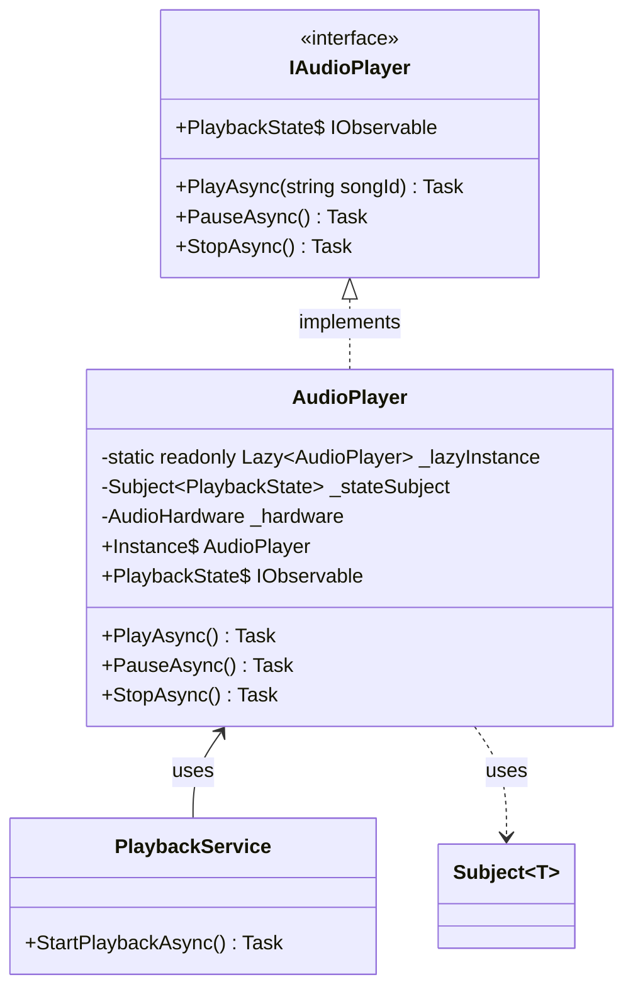
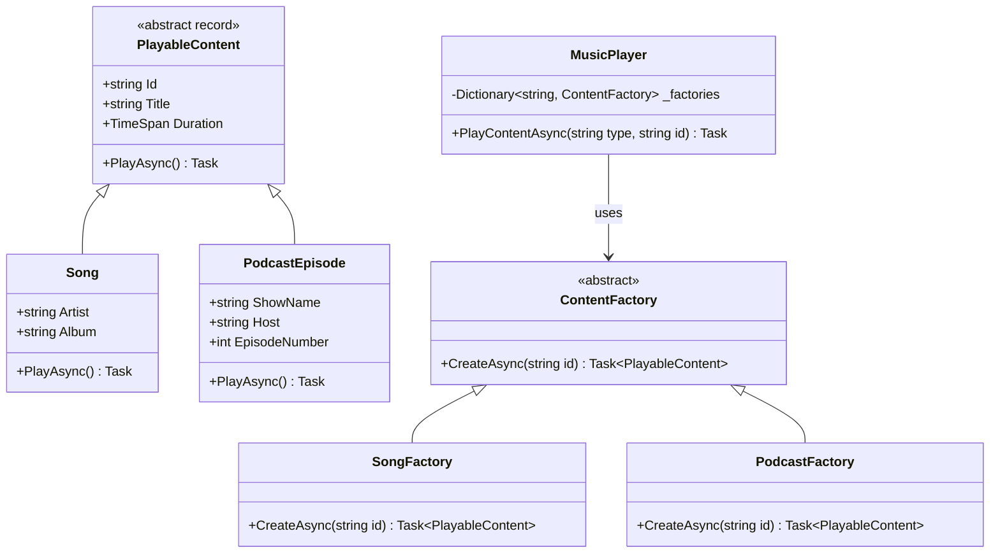
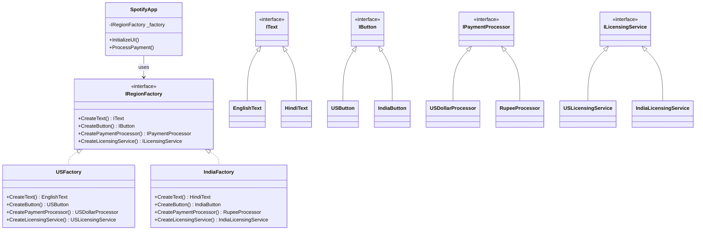
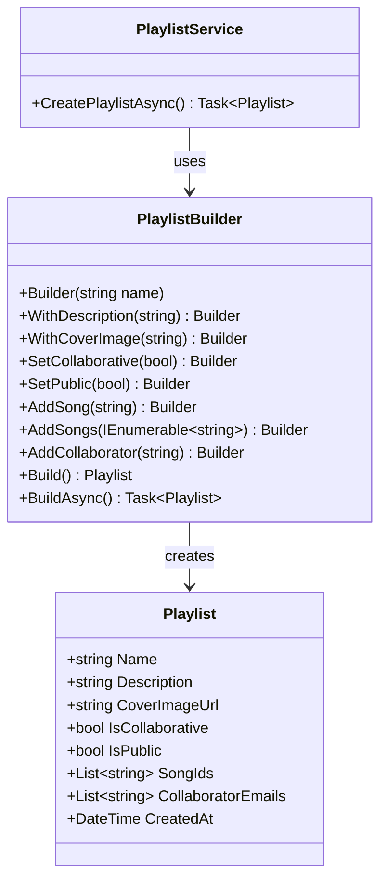
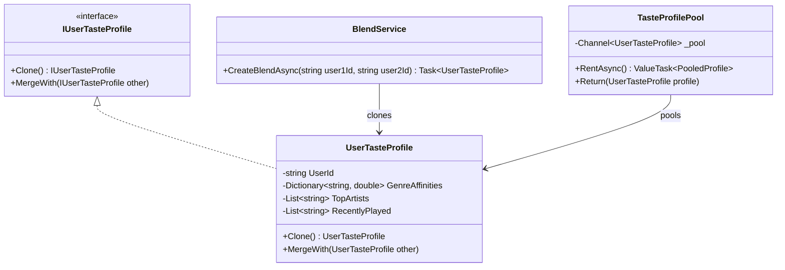

# Part 2: Creational Patterns Deep Dive
## How Spotify Creates Its Universe (The .NET 10 Way)

---

**Subtitle:**
Singleton, Factory, Abstract Factory, Builder, and Prototype—implemented with .NET 10, Reactive Programming, Entity Framework Core, and SPAP<T> patterns. Real Spotify code that's production-ready.

**Keywords:**
Creational Patterns, .NET 10, C# 13, Reactive Programming, Entity Framework Core, SPAP<T>, Singleton Pattern, Factory Pattern, Abstract Factory Pattern, Builder Pattern, Prototype Pattern, Spotify system design

---

## Introduction: Why .NET 10 Changes the Game

**The Legacy Way:**
Most design pattern examples use basic Java or C# with console output. They ignore modern language features, asynchronous programming, and the reactive paradigms that power real streaming services.

**The .NET 10 Way:**
Spotify's backend, if built today on Microsoft stack, would leverage .NET 10's cutting-edge features:

- **Native AOT compilation** for microservices that start in milliseconds
- **Reactive Extensions (System.Reactive)** for event-driven audio streaming
- **Entity Framework Core 10** with complex type support and raw SQL queries
- **SPAP<T> (Single Producer Async Pattern)** for thread-safe, high-performance object pools
- **Primary constructors, required members, and collection expressions** for cleaner code

Why .NET 10? Because Spotify needs:
- **Performance:** Millions of concurrent streams require minimal GC pressure
- **Reactive:** Audio playback is inherently event-driven (buffering, seeking, pausing)
- **Async everywhere:** I/O-bound operations (database, network streams) must never block

Let's rebuild Spotify's object creation layer the right way—with modern .NET.

---

## Pattern 1: Singleton Pattern
*"There Can Be Only One"*

### What It Solves
In Spotify, certain resources must be shared globally. The **Audio Playback Engine** controls physical audio output. The **Telemetry Collector** aggregates metrics. Multiple instances would cause conflicts and inconsistent state.

### The .NET 10 Implementation
In modern .NET, we have better options than the classic double-check locking:
- **Lazy<T>** for thread-safe lazy initialization
- **Dependency Injection** with singleton lifetime
- **Reactive singletons** that expose IObservable streams

### The Structure



### The Code

```csharp
using System.Reactive.Linq;
using System.Reactive.Subjects;
using Microsoft.EntityFrameworkCore.Storage; // For connection pooling analogy

namespace Spotify.Playback.Core;

/// <summary>
/// Represents the state of audio playback
/// </summary>
public enum PlaybackState
{
    Stopped,
    Buffering,
    Playing,
    Paused,
    Error
}

/// <summary>
/// Interface for the audio player - depends on abstraction, not concrete
/// </summary>
public interface IAudioPlayer
{
    Task PlayAsync(string songId, CancellationToken cancellationToken = default);
    Task PauseAsync(CancellationToken cancellationToken = default);
    Task StopAsync(CancellationToken cancellationToken = default);
    
    // Reactive stream of playback state changes
    IObservable<PlaybackState> PlaybackState { get; }
    
    // Current state (cached)
    PlaybackState CurrentState { get; }
}

/// <summary>
/// Singleton Audio Player implementation
/// WHY .NET 10: Using Lazy<T> for thread-safe, lazy initialization
/// WHY REACTIVE: Exposing state changes as IObservable for reactive UI updates
/// </summary>
public sealed class AudioPlayer : IAudioPlayer, IDisposable
{
    // .NET 10: Lazy<T> provides thread-safe lazy initialization
    // This is the modern, simpler alternative to double-check locking
    private static readonly Lazy<AudioPlayer> _lazyInstance = 
        new Lazy<AudioPlayer>(() => new AudioPlayer(), LazyThreadSafetyMode.ExecutionAndPublication);
    
    // Public static property for global access
    public static AudioPlayer Instance => _lazyInstance.Value;
    
    // Reactive components
    private readonly Subject<PlaybackState> _stateSubject = new();
    private PlaybackState _currentState = PlaybackState.Stopped;
    
    // Simulated audio hardware (would be actual WASAPI/ALSA bindings in production)
    private readonly AudioHardware _hardware;
    
    // .NET 10: Primary constructor would be used here, but we need private constructor
    private AudioPlayer()
    {
        Console.WriteLine("[AudioPlayer] Initializing audio hardware (once)");
        _hardware = new AudioHardware();
        
        // Initialize reactive stream with current state
        _stateSubject.OnNext(_currentState);
    }
    
    // IObservable for reactive subscribers
    public IObservable<PlaybackState> PlaybackState => _stateSubject.AsObservable();
    
    public PlaybackState CurrentState => _currentState;
    
    /// <summary>
    /// Play a song asynchronously
    /// WHY .NET 10: Async all the way with CancellationToken support
    /// WHY REACTIVE: Emit state changes to all subscribers
    /// </summary>
    public async Task PlayAsync(string songId, CancellationToken cancellationToken = default)
    {
        // Update state and notify subscribers
        UpdateState(PlaybackState.Buffering);
        
        try
        {
            // Simulate buffering (in reality, would fetch from CDN)
            await Task.Delay(500, cancellationToken);
            
            // Start playback through hardware
            await _hardware.PlayAsync(songId, cancellationToken);
            
            UpdateState(PlaybackState.Playing);
            Console.WriteLine($"[AudioPlayer] Playing: {songId}");
        }
        catch (OperationCanceledException)
        {
            UpdateState(PlaybackState.Stopped);
            throw;
        }
        catch (Exception)
        {
            UpdateState(PlaybackState.Error);
            throw;
        }
    }
    
    public async Task PauseAsync(CancellationToken cancellationToken = default)
    {
        await _hardware.PauseAsync(cancellationToken);
        UpdateState(PlaybackState.Paused);
        Console.WriteLine("[AudioPlayer] Paused");
    }
    
    public async Task StopAsync(CancellationToken cancellationToken = default)
    {
        await _hardware.StopAsync(cancellationToken);
        UpdateState(PlaybackState.Stopped);
        Console.WriteLine("[AudioPlayer] Stopped");
    }
    
    private void UpdateState(PlaybackState newState)
    {
        _currentState = newState;
        _stateSubject.OnNext(newState);
    }
    
    public void Dispose()
    {
        _stateSubject?.Dispose();
        _hardware?.Dispose();
    }
}

// Simulated hardware class
file class AudioHardware : IDisposable
{
    public Task PlayAsync(string songId, CancellationToken ct) => Task.CompletedTask;
    public Task PauseAsync(CancellationToken ct) => Task.CompletedTask;
    public Task StopAsync(CancellationToken ct) => Task.CompletedTask;
    public void Dispose() { }
}

/// <summary>
/// Service that uses the singleton audio player
/// WHY .NET 10: Primary constructor for dependency injection
/// </summary>
public class PlaybackService(IAudioPlayer audioPlayer)
{
    // Using the interface, not the concrete singleton directly
    // This allows testing with mocks while the real app uses the singleton
    
    public async Task StartPlaybackAsync(string songId)
    {
        // Reactive subscription example
        var subscription = audioPlayer.PlaybackState.Subscribe(state =>
        {
            Console.WriteLine($"UI should update: {state}");
        });
        
        await audioPlayer.PlayAsync(songId);
        
        // In real code, dispose subscription appropriately
    }
}

// Program.cs - DI Container Registration
/*
// In .NET 10, register the singleton properly:
builder.Services.AddSingleton<IAudioPlayer>(AudioPlayer.Instance);
builder.Services.AddScoped<PlaybackService>();
*/

// Reactive UI subscription example (would be in Blazor/WPF)
/*
public class NowPlayingBar : IDisposable
{
    private readonly IAudioPlayer _player;
    private IDisposable? _subscription;
    
    public NowPlayingBar(IAudioPlayer player)
    {
        _player = player;
        
        // React to state changes without polling
        _subscription = player.PlaybackState
            .ObserveOn(SynchronizationContext.Current) // UI thread
            .Subscribe(UpdatePlayButton);
    }
    
    private void UpdatePlayButton(PlaybackState state) { /* UI update */ }
    
    public void Dispose() => _subscription?.Dispose();
}
*/
```

### Why This Matters for Spotify (.NET Edition)
- **Thread Safety:** `Lazy<T>` guarantees one instance even under high concurrency
- **Reactive UI:** The `IObservable<PlaybackState>` lets UI components react without polling
- **Testability:** Interface-based design allows mocking
- **Resource Efficiency:** Single audio hardware context, single buffer pool

---

## Pattern 2: Factory Method Pattern
*"Let the Subclasses Decide"*

### What It Solves
Spotify deals with multiple types of playable content. The music player shouldn't care whether it's playing a Song, Podcast Episode, or Audiobook. Creation logic must be encapsulated.

### The .NET 10 Implementation
Modern .NET features:
- **Records** for immutable DTOs
- **Primary constructors** for concise classes
- **IAsyncEnumerable** for streaming content lists
- **Entity Framework Core 10** with complex type support

### The Structure



### The Code

```csharp
using Microsoft.EntityFrameworkCore;
using System.Runtime.CompilerServices;
using System.Threading.Channels;

namespace Spotify.Content.Core;

// ========== Domain Models (Records for immutability) ==========

/// <summary>
/// Base abstract record for all playable content
/// WHY .NET 10: Using record for value-based equality and immutability
/// </summary>
public abstract record PlayableContent
{
    public required string Id { get; init; }
    public required string Title { get; init; }
    public TimeSpan Duration { get; init; }
    
    // Abstract method to be implemented by concrete types
    public abstract Task PlayAsync(CancellationToken cancellationToken = default);
    
    // Factory method pattern often uses this for registration
    public abstract string ContentType { get; }
}

/// <summary>
/// Song record with specific properties
/// </summary>
public sealed record Song : PlayableContent
{
    public required string Artist { get; init; }
    public required string Album { get; init; }
    public int TrackNumber { get; init; }
    public override string ContentType => "song";
    
    public override async Task PlayAsync(CancellationToken cancellationToken = default)
    {
        // Song-specific playback logic
        Console.WriteLine($"🎵 Streaming song: {Title} by {Artist}");
        await Task.Delay(100, cancellationToken); // Simulate streaming setup
    }
}

/// <summary>
/// Podcast episode record
/// </summary>
public sealed record PodcastEpisode : PlayableContent
{
    public required string ShowName { get; init; }
    public required string Host { get; init; }
    public int EpisodeNumber { get; init; }
    public override string ContentType => "podcast";
    
    public override async Task PlayAsync(CancellationToken cancellationToken = default)
    {
        // Podcast-specific playback (maybe with speed control)
        Console.WriteLine($"🎙️ Playing podcast: {Title} from {ShowName}");
        await Task.Delay(100, cancellationToken);
    }
}

// ========== Entity Framework Core 10 Context ==========

/// <summary>
/// DbContext for content storage
/// WHY .NET 10: Using TPT (Table Per Type) inheritance mapping
/// </summary>
public class ContentDbContext : DbContext
{
    public ContentDbContext(DbContextOptions<ContentDbContext> options) : base(options) { }
    
    public DbSet<PlayableContent> Contents => Set<PlayableContent>();
    public DbSet<Song> Songs => Set<Song>();
    public DbSet<PodcastEpisode> PodcastEpisodes => Set<PodcastEpisode>();
    
    protected override void OnModelCreating(ModelBuilder modelBuilder)
    {
        // TPT inheritance - each type gets its own table
        modelBuilder.Entity<PlayableContent>(entity =>
        {
            entity.ToTable("Contents");
            entity.HasKey(e => e.Id);
            entity.Property(e => e.Title).IsRequired();
            entity.Property(e => e.Duration).HasConversion<long>();
        });
        
        modelBuilder.Entity<Song>(entity =>
        {
            entity.ToTable("Songs");
            entity.HasBaseType<PlayableContent>();
            entity.Property(e => e.Artist).IsRequired();
            entity.Property(e => e.Album).IsRequired();
        });
        
        modelBuilder.Entity<PodcastEpisode>(entity =>
        {
            entity.ToTable("PodcastEpisodes");
            entity.HasBaseType<PlayableContent>();
            entity.Property(e => e.ShowName).IsRequired();
            entity.Property(e => e.Host).IsRequired();
        });
        
        // .NET 10: Complex types for embedded value objects
        modelBuilder.Entity<Song>().ComplexProperty(s => s.Metadata, complex =>
        {
            complex.Property(m => m.ExplicitContent);
            complex.Property(m => m.CopyrightYear);
        });
    }
}

// ========== Abstract Factory ==========

/// <summary>
/// Abstract factory for creating content
/// WHY .NET 10: Async factory methods with CancellationToken
/// </summary>
public abstract class ContentFactory
{
    // The factory method - async because it might hit database
    public abstract Task<PlayableContent> CreateAsync(string id, CancellationToken cancellationToken = default);
    
    // Template method with common post-creation logic
    public async Task<PlayableContent> GetContentAsync(string id, CancellationToken cancellationToken = default)
    {
        var content = await CreateAsync(id, cancellationToken);
        
        // Common post-creation steps
        await LogContentAccessAsync(content, cancellationToken);
        
        return content;
    }
    
    protected virtual async Task LogContentAccessAsync(PlayableContent content, CancellationToken ct)
    {
        // In production, this would write to telemetry
        Console.WriteLine($"Content accessed: {content.Title}");
        await Task.CompletedTask;
    }
}

// ========== Concrete Factories ==========

/// <summary>
/// Factory for creating songs using Entity Framework
/// </summary>
public class SongFactory(ContentDbContext dbContext) : ContentFactory
{
    public override async Task<PlayableContent> CreateAsync(string id, CancellationToken cancellationToken = default)
    {
        // Use EF Core to fetch from database
        var song = await dbContext.Songs
            .AsNoTracking() // Read-only for performance
            .FirstOrDefaultAsync(s => s.Id == id, cancellationToken);
        
        if (song == null)
        {
            throw new ArgumentException($"Song with ID {id} not found");
        }
        
        return song;
    }
}

/// <summary>
/// Factory for creating podcast episodes
/// </summary>
public class PodcastFactory(ContentDbContext dbContext) : ContentFactory
{
    public override async Task<PlayableContent> CreateAsync(string id, CancellationToken cancellationToken = default)
    {
        var episode = await dbContext.PodcastEpisodes
            .AsNoTracking()
            .FirstOrDefaultAsync(p => p.Id == id, cancellationToken);
        
        if (episode == null)
        {
            throw new ArgumentException($"Podcast episode with ID {id} not found");
        }
        
        return episode;
    }
}

// ========== SPAP<T> - Single Producer Async Pattern ==========

/// <summary>
/// Channel-based factory pool for high-performance factory access
/// WHY .NET 10: Using System.Threading.Channels for producer-consumer patterns
/// </summary>
public class FactoryPool<TFactory> where TFactory : ContentFactory
{
    private readonly Channel<TFactory> _channel;
    private readonly Func<TFactory> _factoryCreator;
    private readonly int _poolSize;
    
    public FactoryPool(Func<TFactory> factoryCreator, int poolSize = 10)
    {
        _factoryCreator = factoryCreator;
        _poolSize = poolSize;
        
        // Create bounded channel with poolSize capacity
        _channel = Channel.CreateBounded<TFactory>(new BoundedChannelOptions(poolSize)
        {
            FullMode = BoundedChannelFullMode.Wait,
            SingleWriter = true, // SPAP - Single Producer
            SingleReader = false  // Multiple consumers
        });
        
        // Initialize pool
        InitializePool();
    }
    
    private void InitializePool()
    {
        // Single producer writes all factories
        var writer = _channel.Writer;
        for (int i = 0; i < _poolSize; i++)
        {
            writer.TryWrite(_factoryCreator());
        }
    }
    
    /// <summary>
    /// Rent a factory from the pool
    /// </summary>
    public async ValueTask<PooledFactory<TFactory>> RentAsync(CancellationToken cancellationToken = default)
    {
        var factory = await _channel.Reader.ReadAsync(cancellationToken);
        return new PooledFactory<TFactory>(this, factory);
    }
    
    /// <summary>
    /// Return a factory to the pool
    /// </summary>
    private void Return(TFactory factory)
    {
        // Non-blocking attempt to return
        _channel.Writer.TryWrite(factory);
    }
    
    /// <summary>
    /// Disposable wrapper for rented factories
    /// </summary>
    public readonly struct PooledFactory<T> : IDisposable where T : ContentFactory
    {
        private readonly FactoryPool<T> _pool;
        public readonly T Factory { get; }
        
        public PooledFactory(FactoryPool<T> pool, T factory)
        {
            _pool = pool;
            Factory = factory;
        }
        
        public void Dispose()
        {
            _pool.Return(Factory);
        }
    }
}

// ========== Music Player with Factory ==========

/// <summary>
/// Music player that uses factories to create content
/// WHY .NET 10: Primary constructor with required services
/// </summary>
public class MusicPlayer(
    IServiceProvider serviceProvider,
    FactoryPool<SongFactory> songFactoryPool,
    FactoryPool<PodcastFactory> podcastFactoryPool)
{
    private readonly Dictionary<string, Func<string, CancellationToken, Task<PlayableContent>>> _factoryMap = new();
    
    public void Initialize()
    {
        // Register factories by content type
        _factoryMap["song"] = async (id, ct) =>
        {
            using var rented = await songFactoryPool.RentAsync(ct);
            return await rented.Factory.CreateAsync(id, ct);
        };
        
        _factoryMap["podcast"] = async (id, ct) =>
        {
            using var rented = await podcastFactoryPool.RentAsync(ct);
            return await rented.Factory.CreateAsync(id, ct);
        };
        
        // .NET 10: Collection expressions
        _factoryMap["audiobook"] = async (id, ct) =>
            throw new NotSupportedException("Audiobooks coming soon!");
    }
    
    /// <summary>
    /// Play content by type and ID
    /// </summary>
    public async Task PlayContentAsync(string contentType, string contentId, CancellationToken cancellationToken = default)
    {
        if (!_factoryMap.TryGetValue(contentType, out var factory))
        {
            throw new ArgumentException($"Unknown content type: {contentType}");
        }
        
        // Create the content using the appropriate factory
        var content = await factory(contentId, cancellationToken);
        
        // Play it (polymorphism!)
        await content.PlayAsync(cancellationToken);
    }
    
    /// <summary>
    /// Stream multiple contents reactively
    /// </summary>
    public async IAsyncEnumerable<PlayableContent> StreamPlaylistAsync(
        IEnumerable<string> contentIds, 
        string contentType,
        [EnumeratorCancellation] CancellationToken cancellationToken = default)
    {
        if (!_factoryMap.TryGetValue(contentType, out var factory))
        {
            throw new ArgumentException($"Unknown content type: {contentType}");
        }
        
        foreach (var id in contentIds)
        {
            // Yield each content as it's created
            var content = await factory(id, cancellationToken);
            yield return content;
            
            // Small delay to simulate streaming
            await Task.Delay(100, cancellationToken);
        }
    }
}

// ========== Program.cs - DI Setup ==========

/*
// In .NET 10 Program.cs
builder.Services.AddDbContext<ContentDbContext>(options =>
    options.UseSqlServer(builder.Configuration.GetConnectionString("SpotifyDb")));

// Register factories as scoped
builder.Services.AddScoped<SongFactory>();
builder.Services.AddScoped<PodcastFactory>();

// Register factory pools as singletons
builder.Services.AddSingleton<FactoryPool<SongFactory>>(sp => 
    new FactoryPool<SongFactory>(() => sp.GetRequiredService<SongFactory>(), poolSize: 10));

builder.Services.AddSingleton<FactoryPool<PodcastFactory>>(sp => 
    new FactoryPool<PodcastFactory>(() => sp.GetRequiredService<PodcastFactory>(), poolSize: 10));

builder.Services.AddScoped<MusicPlayer>();
*/

// ========== Usage Example ==========

public class SpotifyApi
{
    public static async Task Main(string[] args)
    {
        // In real app, this would be through DI
        var services = new ServiceCollection();
        // ... configure services
        var provider = services.BuildServiceProvider();
        
        var player = provider.GetRequiredService<MusicPlayer>();
        player.Initialize();
        
        // Play a song
        await player.PlayContentAsync("song", "song-123");
        
        // Play a podcast
        await player.PlayContentAsync("podcast", "episode-456");
        
        // Stream a playlist reactively
        var playlist = new[] { "song-1", "song-2", "song-3" };
        await foreach (var content in player.StreamPlaylistAsync(playlist, "song"))
        {
            Console.WriteLine($"Streamed: {content.Title}");
        }
    }
}
```

### Why This Matters for Spotify (.NET Edition)
- **Async All The Way:** Database calls don't block threads
- **SPAP<T> Pattern:** Factory pooling reduces object allocation pressure
- **Reactive Streaming:** `IAsyncEnumerable` for playlist streaming
- **EF Core 10:** Complex types and TPT inheritance for clean domain models
- **Records:** Immutable DTOs prevent accidental modifications

---

## Pattern 3: Abstract Factory Pattern
*"Factories of Factories"*

### What It Solves
Spotify operates globally. When a user logs in from India, the app needs a family of related objects: Hindi text, Rupee payment processing, Indian licensing rules. These objects must be compatible—you cannot mix US English with Indian promotions.

### The .NET 10 Implementation
Modern .NET features:
- **Source Generators** for factory implementations
- **IOptions<T>** for configuration
- **Reactive event streams** for region changes
- **Keyed services** in DI container

### The Structure



### The Code

```csharp
using Microsoft.Extensions.Options;
using System.Reactive.Linq;
using System.Reactive.Subjects;

namespace Spotify.Region.Core;

// ========== Configuration ==========

/// <summary>
/// Region configuration
/// </summary>
public record RegionConfiguration
{
    public required string RegionCode { get; init; } // "US", "IN", "JP"
    public required string LanguageCode { get; init; } // "en", "hi", "ja"
    public required string CurrencyCode { get; init; } // "USD", "INR", "JPY"
    public bool RequiresGst { get; init; } // India specific
}

// ========== Abstract Product Interfaces ==========

/// <summary>
/// Text localization interface
/// </summary>
public interface IText
{
    string GetLoginPrompt();
    string GetWelcomeMessage(string userName);
    string GetSearchPlaceholder();
    string FormatCurrency(decimal amount);
}

/// <summary>
/// UI Button interface
/// </summary>
public interface IButton
{
    string Label { get; }
    Task RenderAsync(CancellationToken cancellationToken = default);
    Task OnClickAsync(CancellationToken cancellationToken = default);
}

/// <summary>
/// Payment processor interface
/// </summary>
public interface IPaymentProcessor
{
    string CurrencyCode { get; }
    Task<PaymentResult> ProcessPaymentAsync(PaymentRequest request, CancellationToken ct = default);
    IObservable<PaymentEvent> PaymentEvents { get; }
}

/// <summary>
/// Licensing service interface
/// </summary>
public interface ILicensingService
{
    Task<bool> IsContentAvailableAsync(string contentId, string userId, CancellationToken ct = default);
    Task<LicenseRestrictions> GetRestrictionsAsync(string contentId, CancellationToken ct = default);
}

// ========== Record Types ==========

public record PaymentRequest(
    string UserId,
    decimal Amount,
    string PaymentMethodId,
    string Description);

public record PaymentResult(
    bool Success,
    string TransactionId,
    DateTime ProcessedAt,
    string? ErrorMessage = null);

public record PaymentEvent(
    string TransactionId,
    PaymentEventType EventType,
    DateTime Timestamp);

public enum PaymentEventType { Initiated, Processing, Completed, Failed }

public record LicenseRestrictions(
    bool Available,
    DateTime? AvailableFrom,
    string[]? RestrictedRegions,
    string? RestrictionReason);

// ========== Abstract Factory Interface ==========

/// <summary>
/// Abstract factory for creating region-specific families
/// </summary>
public interface IRegionFactory
{
    IText CreateText();
    IButton CreateButton(string buttonText);
    IPaymentProcessor CreatePaymentProcessor();
    ILicensingService CreateLicensingService();
    string RegionCode { get; }
}

// ========== US Region Implementations ==========

public class EnglishText : IText
{
    public string GetLoginPrompt() => "Login to Spotify";
    public string GetWelcomeMessage(string userName) => $"Welcome back, {userName}!";
    public string GetSearchPlaceholder() => "Search for songs, artists, or podcasts";
    
    public string FormatCurrency(decimal amount)
        => amount.ToString("C2", new System.Globalization.CultureInfo("en-US"));
}

public class USButton : IButton
{
    private readonly string _label;
    
    public USButton(string label) => _label = label;
    public string Label => _label;
    
    public Task RenderAsync(CancellationToken cancellationToken = default)
    {
        Console.WriteLine($"[US] Rendering button: [{_label}]");
        return Task.CompletedTask;
    }
    
    public Task OnClickAsync(CancellationToken cancellationToken = default)
    {
        Console.WriteLine($"[US] Button clicked - tracking to Google Analytics");
        return Task.CompletedTask;
    }
}

public class USDollarProcessor : IPaymentProcessor
{
    private readonly Subject<PaymentEvent> _eventSubject = new();
    
    public string CurrencyCode => "USD";
    public IObservable<PaymentEvent> PaymentEvents => _eventSubject.AsObservable();
    
    public async Task<PaymentResult> ProcessPaymentAsync(PaymentRequest request, CancellationToken ct = default)
    {
        _eventSubject.OnNext(new PaymentEvent(
            Guid.NewGuid().ToString(),
            PaymentEventType.Initiated,
            DateTime.UtcNow));
        
        try
        {
            // Simulate Stripe/PayPal processing
            await Task.Delay(300, ct);
            
            var transactionId = $"US-{Guid.NewGuid()}";
            
            _eventSubject.OnNext(new PaymentEvent(
                transactionId,
                PaymentEventType.Completed,
                DateTime.UtcNow));
            
            return new PaymentResult(true, transactionId, DateTime.UtcNow);
        }
        catch (Exception ex)
        {
            return new PaymentResult(false, "", DateTime.UtcNow, ex.Message);
        }
    }
}

public class USLicensingService : ILicensingService
{
    private readonly HashSet<string> _restrictedContent = new() { "content-xxx", "content-yyy" };
    
    public Task<bool> IsContentAvailableAsync(string contentId, string userId, CancellationToken ct = default)
    {
        // US-specific licensing logic (fair use, public domain, etc.)
        var available = !_restrictedContent.Contains(contentId);
        return Task.FromResult(available);
    }
    
    public Task<LicenseRestrictions> GetRestrictionsAsync(string contentId, CancellationToken ct = default)
    {
        if (_restrictedContent.Contains(contentId))
        {
            return Task.FromResult(new LicenseRestrictions(
                false,
                DateTime.UtcNow.AddYears(1),
                new[] { "US" },
                "Content under review"));
        }
        
        return Task.FromResult(new LicenseRestrictions(true, null, null, null));
    }
}

// ========== India Region Implementations ==========

public class HindiText : IText
{
    public string GetLoginPrompt() => "स्पॉटिफाई में लॉगिन करें";
    public string GetWelcomeMessage(string userName) => $"आपका स्वागत है, {userName}!";
    public string GetSearchPlaceholder() => "गाने, कलाकार या पॉडकास्ट खोजें";
    
    public string FormatCurrency(decimal amount)
        => amount.ToString("C2", new System.Globalization.CultureInfo("hi-IN"));
}

public class IndiaButton : IButton
{
    private readonly string _label;
    
    public IndiaButton(string label) => _label = label;
    public string Label => _label;
    
    public Task RenderAsync(CancellationToken cancellationToken = default)
    {
        Console.WriteLine($"[IN] Rendering vibrant button: [{_label}]");
        return Task.CompletedTask;
    }
    
    public Task OnClickAsync(CancellationToken cancellationToken = default)
    {
        Console.WriteLine($"[IN] Button clicked - tracking to local analytics");
        return Task.CompletedTask;
    }
}

public class RupeeProcessor : IPaymentProcessor
{
    private readonly Subject<PaymentEvent> _eventSubject = new();
    private readonly decimal _gstRate = 0.18m; // 18% GST
    
    public string CurrencyCode => "INR";
    public IObservable<PaymentEvent> PaymentEvents => _eventSubject.AsObservable();
    
    public async Task<PaymentResult> ProcessPaymentAsync(PaymentRequest request, CancellationToken ct = default)
    {
        _eventSubject.OnNext(new PaymentEvent(
            Guid.NewGuid().ToString(),
            PaymentEventType.Initiated,
            DateTime.UtcNow));
        
        try
        {
            // Calculate GST
            var gstAmount = request.Amount * _gstRate;
            var total = request.Amount + gstAmount;
            
            Console.WriteLine($"[IN] Processing payment: ₹{request.Amount} + GST ₹{gstAmount} = ₹{total}");
            
            // Simulate RazorPay/CCAvenue processing
            await Task.Delay(400, ct);
            
            var transactionId = $"IN-{Guid.NewGuid()}";
            
            _eventSubject.OnNext(new PaymentEvent(
                transactionId,
                PaymentEventType.Completed,
                DateTime.UtcNow));
            
            return new PaymentResult(true, transactionId, DateTime.UtcNow);
        }
        catch (Exception ex)
        {
            return new PaymentResult(false, "", DateTime.UtcNow, ex.Message);
        }
    }
}

public class IndiaLicensingService : ILicensingService
{
    private readonly Dictionary<string, DateTime> _contentExpiry = new();
    
    public Task<bool> IsContentAvailableAsync(string contentId, string userId, CancellationToken ct = default)
    {
        // India-specific licensing (different labels, T-Series rights, etc.)
        if (_contentExpiry.TryGetValue(contentId, out var expiry))
        {
            return Task.FromResult(DateTime.UtcNow < expiry);
        }
        
        return Task.FromResult(true);
    }
    
    public Task<LicenseRestrictions> GetRestrictionsAsync(string contentId, CancellationToken ct = default)
    {
        if (_contentExpiry.TryGetValue(contentId, out var expiry))
        {
            return Task.FromResult(new LicenseRestrictions(
                DateTime.UtcNow < expiry,
                expiry,
                new[] { "IN" },
                expiry < DateTime.UtcNow ? "License expired" : null));
        }
        
        return Task.FromResult(new LicenseRestrictions(true, null, null, null));
    }
}

// ========== Concrete Factories ==========

/// <summary>
/// US Region Factory
/// </summary>
public class USFactory : IRegionFactory
{
    public string RegionCode => "US";
    
    public IText CreateText() => new EnglishText();
    
    public IButton CreateButton(string buttonText) => new USButton(buttonText);
    
    public IPaymentProcessor CreatePaymentProcessor() => new USDollarProcessor();
    
    public ILicensingService CreateLicensingService() => new USLicensingService();
}

/// <summary>
/// India Region Factory
/// </summary>
public class IndiaFactory : IRegionFactory
{
    public string RegionCode => "IN";
    
    public IText CreateText() => new HindiText();
    
    public IButton CreateButton(string buttonText) => new IndiaButton(buttonText);
    
    public IPaymentProcessor CreatePaymentProcessor() => new RupeeProcessor();
    
    public ILicensingService CreateLicensingService() => new IndiaLicensingService();
}

// ========== Factory Provider with Reactive Region Switching ==========

/// <summary>
/// Provides region factories and notifies of region changes
/// WHY .NET 10: Reactive region switching with IObservable
/// </summary>
public class RegionFactoryProvider
{
    private readonly Dictionary<string, IRegionFactory> _factories;
    private readonly Subject<IRegionFactory> _regionChangedSubject = new();
    private IRegionFactory _currentFactory;
    
    public RegionFactoryProvider(IOptionsMonitor<RegionConfiguration> configMonitor)
    {
        // Initialize all supported factories
        _factories = new Dictionary<string, IRegionFactory>
        {
            ["US"] = new USFactory(),
            ["IN"] = new IndiaFactory()
        };
        
        // Set default from config
        _currentFactory = _factories[configMonitor.CurrentValue.RegionCode];
        
        // Watch for config changes (e.g., user changes region in settings)
        configMonitor.OnChange(config =>
        {
            if (_factories.TryGetValue(config.RegionCode, out var newFactory))
            {
                _currentFactory = newFactory;
                _regionChangedSubject.OnNext(newFactory);
            }
        });
    }
    
    /// <summary>
    /// Get current region factory
    /// </summary>
    public IRegionFactory GetCurrentFactory() => _currentFactory;
    
    /// <summary>
    /// Get factory for specific region
    /// </summary>
    public IRegionFactory GetFactory(string regionCode)
        => _factories.TryGetValue(regionCode, out var factory) 
            ? factory 
            : throw new ArgumentException($"Unsupported region: {regionCode}");
    
    /// <summary>
    /// Observable stream of region changes
    /// </summary>
    public IObservable<IRegionFactory> WhenRegionChanged => _regionChangedSubject.AsObservable();
}

// ========== Spotify Application ==========

/// <summary>
/// Main Spotify application that uses region factories
/// </summary>
public class SpotifyApp : IDisposable
{
    private readonly RegionFactoryProvider _factoryProvider;
    private readonly List<IDisposable> _subscriptions = new();
    private IRegionFactory _currentFactory;
    
    public SpotifyApp(RegionFactoryProvider factoryProvider)
    {
        _factoryProvider = factoryProvider;
        _currentFactory = factoryProvider.GetCurrentFactory();
        
        // React to region changes
        _subscriptions.Add(
            factoryProvider.WhenRegionChanged.Subscribe(factory =>
            {
                _currentFactory = factory;
                RefreshUI();
            })
        );
    }
    
    /// <summary>
    /// Initialize UI with current region
    /// </summary>
    public async Task InitializeUIAsync(CancellationToken cancellationToken = default)
    {
        var text = _currentFactory.CreateText();
        var loginButton = _currentFactory.CreateButton(text.GetLoginPrompt());
        
        Console.WriteLine("\n=== Spotify App Initialized ===");
        Console.WriteLine($"Region: {_currentFactory.RegionCode}");
        Console.WriteLine($"Welcome: {text.GetWelcomeMessage("Alex")}");
        
        await loginButton.RenderAsync(cancellationToken);
    }
    
    /// <summary>
    /// Process payment with region-specific processor
    /// </summary>
    public async Task<PaymentResult> PurchasePremiumAsync(string userId, CancellationToken ct = default)
    {
        var processor = _currentFactory.CreatePaymentProcessor();
        var text = _currentFactory.CreateText();
        
        var monthlyPrice = _currentFactory.RegionCode switch
        {
            "US" => 9.99m,
            "IN" => 119m,
            _ => 9.99m
        };
        
        Console.WriteLine($"\nProcessing payment: {text.FormatCurrency(monthlyPrice)}");
        
        // Subscribe to payment events
        var subscription = processor.PaymentEvents.Subscribe(evt =>
        {
            Console.WriteLine($"[Payment Event] {evt.EventType} - {evt.TransactionId}");
        });
        _subscriptions.Add(subscription);
        
        var request = new PaymentRequest(
            userId,
            monthlyPrice,
            "pm_card_visa",
            "Spotify Premium Monthly");
        
        return await processor.ProcessPaymentAsync(request, ct);
    }
    
    /// <summary>
    /// Check content availability
    /// </summary>
    public async Task<bool> CanPlayContentAsync(string contentId, string userId, CancellationToken ct = default)
    {
        var licensing = _currentFactory.CreateLicensingService();
        return await licensing.IsContentAvailableAsync(contentId, userId, ct);
    }
    
    private void RefreshUI()
    {
        Console.WriteLine($"\n🔄 UI Refreshing for region: {_currentFactory.RegionCode}");
        // In real app, this would trigger UI re-render
    }
    
    public void Dispose()
    {
        foreach (var sub in _subscriptions)
        {
            sub.Dispose();
        }
    }
}

// ========== Program.cs - DI Setup ==========

/*
// In .NET 10 Program.cs
builder.Services.Configure<RegionConfiguration>(builder.Configuration.GetSection("Region"));

// Register region factories
builder.Services.AddSingleton<USFactory>();
builder.Services.AddSingleton<IndiaFactory>();

// Register provider
builder.Services.AddSingleton<RegionFactoryProvider>();

// Register main app
builder.Services.AddScoped<SpotifyApp>();

// Example appsettings.json
{
  "Region": {
    "RegionCode": "IN",
    "LanguageCode": "hi",
    "CurrencyCode": "INR",
    "RequiresGst": true
  }
}
*/

// ========== Usage Example ==========

public class RegionalSpotifyDemo
{
    public static async Task Main(string[] args)
    {
        // Simulate configuration
        var config = new RegionConfiguration
        {
            RegionCode = "IN",
            LanguageCode = "hi",
            CurrencyCode = "INR",
            RequiresGst = true
        };
        
        var configMonitor = new MockOptionsMonitor<RegionConfiguration>(config);
        var provider = new RegionFactoryProvider(configMonitor);
        var app = new SpotifyApp(provider);
        
        // Initialize UI in Hindi
        await app.InitializeUIAsync();
        
        // Process payment in Rupees with GST
        var result = await app.PurchasePremiumAsync("user-123");
        Console.WriteLine($"Payment Result: {result.Success}");
        
        // Check licensing
        var available = await app.CanPlayContentAsync("song-123", "user-123");
        Console.WriteLine($"Content available: {available}");
        
        // Simulate region change (user moves to US)
        Console.WriteLine("\n" + "=".Repeat(50));
        Console.WriteLine("User changed region to US");
        configMonitor.Update(new RegionConfiguration
        {
            RegionCode = "US",
            LanguageCode = "en",
            CurrencyCode = "USD",
            RequiresGst = false
        });
        
        // App automatically reacts via subscription
        await Task.Delay(1000); // Give time for reactive update
        
        // Now everything is US-based
        await app.InitializeUIAsync();
        
        app.Dispose();
    }
}

// Helper for demo
public class MockOptionsMonitor<T> : IOptionsMonitor<T> where T : class, new()
{
    private T _currentValue;
    private readonly List<Action<T, string>> _listeners = new();
    
    public MockOptionsMonitor(T initialValue) => _currentValue = initialValue;
    
    public T CurrentValue => _currentValue;
    
    public T Get(string? name) => _currentValue;
    
    public IDisposable OnChange(Action<T, string> listener)
    {
        _listeners.Add(listener);
        return new MockChangeDisposable();
    }
    
    public void Update(T newValue)
    {
        _currentValue = newValue;
        foreach (var listener in _listeners)
        {
            listener(newValue, "");
        }
    }
    
    private class MockChangeDisposable : IDisposable
    {
        public void Dispose() { }
    }
}

public static class StringExtensions
{
    public static string Repeat(this string s, int count) => string.Concat(Enumerable.Repeat(s, count));
}
```

### Why This Matters for Spotify (.NET Edition)
- **Region Families:** All related objects (text, payments, licensing) are guaranteed compatible
- **Reactive Region Switching:** UI updates automatically when user changes region
- **IOptionsMonitor:** Configuration changes trigger factory updates
- **Event Streams:** Payment processors expose reactive streams for real-time UI updates
- **Testability:** Each family can be tested independently

---

## Pattern 4: Builder Pattern
*"Constructing Complex Objects Step by Step"*

### What It Solves
Creating a Spotify Playlist involves many optional attributes: name, description, cover image, collaborative status, privacy settings, and songs. Constructors with 10+ parameters are unreadable and error-prone.

### The .NET 10 Implementation
Modern .NET features:
- **Required members** for mandatory properties
- **Records with init-only setters** for immutability
- **Fluent interfaces** with method chaining
- **Source generators** for boilerplate reduction

### The Structure



### The Code

```csharp
using Microsoft.EntityFrameworkCore;
using System.ComponentModel.DataAnnotations;
using System.Text.Json.Serialization;

namespace Spotify.Playlist.Core;

// ========== Entity Framework Core Entity ==========

/// <summary>
/// Playlist entity for EF Core
/// </summary>
public class Playlist
{
    [Key]
    public Guid Id { get; set; }
    
    [Required, MaxLength(100)]
    public required string Name { get; set; }
    
    [MaxLength(500)]
    public string? Description { get; set; }
    
    [Url]
    public string? CoverImageUrl { get; set; }
    
    public bool IsCollaborative { get; set; }
    
    public bool IsPublic { get; set; } = true;
    
    public DateTime CreatedAt { get; set; }
    
    public DateTime? LastModifiedAt { get; set; }
    
    // Navigation properties
    public ICollection<PlaylistSong> Songs { get; set; } = new List<PlaylistSong>();
    
    public ICollection<PlaylistCollaborator> Collaborators { get; set; } = new List<PlaylistCollaborator>();
    
    // Owner ID
    public required string OwnerUserId { get; set; }
}

/// <summary>
/// Join entity for playlist songs
/// </summary>
public class PlaylistSong
{
    public Guid PlaylistId { get; set; }
    public Playlist Playlist { get; set; } = null!;
    
    public string SongId { get; set; } = string.Empty;
    
    public int Position { get; set; }
    
    public DateTime AddedAt { get; set; }
}

/// <summary>
/// Join entity for collaborators
/// </summary>
public class PlaylistCollaborator
{
    public Guid PlaylistId { get; set; }
    public Playlist Playlist { get; set; } = null!;
    
    public string UserId { get; set; } = string.Empty;
    
    public bool CanEdit { get; set; }
    
    public DateTime AddedAt { get; set; }
}

// ========== DbContext ==========

public class PlaylistDbContext : DbContext
{
    public PlaylistDbContext(DbContextOptions<PlaylistDbContext> options) : base(options) { }
    
    public DbSet<Playlist> Playlists => Set<Playlist>();
    public DbSet<PlaylistSong> PlaylistSongs => Set<PlaylistSong>();
    public DbSet<PlaylistCollaborator> PlaylistCollaborators => Set<PlaylistCollaborator>();
    
    protected override void OnModelCreating(ModelBuilder modelBuilder)
    {
        // Configure composite keys
        modelBuilder.Entity<PlaylistSong>()
            .HasKey(ps => new { ps.PlaylistId, ps.SongId });
        
        modelBuilder.Entity<PlaylistCollaborator>()
            .HasKey(pc => new { pc.PlaylistId, pc.UserId });
        
        // Configure relationships
        modelBuilder.Entity<PlaylistSong>()
            .HasOne(ps => ps.Playlist)
            .WithMany(p => p.Songs)
            .HasForeignKey(ps => ps.PlaylistId);
        
        modelBuilder.Entity<PlaylistCollaborator>()
            .HasOne(pc => pc.Playlist)
            .WithMany(p => p.Collaborators)
            .HasForeignKey(pc => pc.PlaylistId);
        
        // .NET 10: Add indexes for performance
        modelBuilder.Entity<Playlist>()
            .HasIndex(p => p.OwnerUserId);
        
        modelBuilder.Entity<Playlist>()
            .HasIndex(p => p.IsPublic);
    }
}

// ========== DTOs (Records) ==========

/// <summary>
/// Playlist DTO for API responses
/// </summary>
public record PlaylistResponse(
    Guid Id,
    string Name,
    string? Description,
    string? CoverImageUrl,
    bool IsCollaborative,
    bool IsPublic,
    DateTime CreatedAt,
    int SongCount,
    int CollaboratorCount,
    string OwnerUserId);

/// <summary>
/// Create playlist request
/// </summary>
public record CreatePlaylistRequest(
    string Name,
    string? Description = null,
    string? CoverImageUrl = null,
    bool IsCollaborative = false,
    bool IsPublic = true,
    IEnumerable<string>? InitialSongIds = null,
    IEnumerable<string>? CollaboratorEmails = null);

// ========== Builder Pattern ==========

/// <summary>
/// Fluent builder for Playlist entities
/// WHY .NET 10: Using required members and fluent interface pattern
/// </summary>
public class PlaylistBuilder
{
    // Required fields
    private readonly string _name;
    private readonly string _ownerUserId;
    
    // Optional fields with defaults
    private string? _description;
    private string? _coverImageUrl;
    private bool _isCollaborative;
    private bool _isPublic = true;
    private readonly List<string> _songIds = new();
    private readonly List<CollaboratorEntry> _collaborators = new();
    
    // .NET 10: Record for collaborator entry
    private record CollaboratorEntry(string Email, bool CanEdit);
    
    /// <summary>
    /// Constructor with required fields
    /// </summary>
    public PlaylistBuilder(string name, string ownerUserId)
    {
        ArgumentException.ThrowIfNullOrWhiteSpace(name);
        ArgumentException.ThrowIfNullOrWhiteSpace(ownerUserId);
        
        _name = name;
        _ownerUserId = ownerUserId;
    }
    
    /// <summary>
    /// Set description
    /// </summary>
    public PlaylistBuilder WithDescription(string? description)
    {
        _description = description;
        return this;
    }
    
    /// <summary>
    /// Set cover image URL
    /// </summary>
    public PlaylistBuilder WithCoverImage(string? coverImageUrl)
    {
        _coverImageUrl = coverImageUrl;
        return this;
    }
    
    /// <summary>
    /// Set collaborative flag
    /// </summary>
    public PlaylistBuilder SetCollaborative(bool isCollaborative = true)
    {
        _isCollaborative = isCollaborative;
        return this;
    }
    
    /// <summary>
    /// Set public/private status
    /// </summary>
    public PlaylistBuilder SetPublic(bool isPublic = true)
    {
        _isPublic = isPublic;
        return this;
    }
    
    /// <summary>
    /// Add a single song
    /// </summary>
    public PlaylistBuilder AddSong(string songId)
    {
        if (!string.IsNullOrWhiteSpace(songId))
        {
            _songIds.Add(songId);
        }
        return this;
    }
    
    /// <summary>
    /// Add multiple songs
    /// </summary>
    public PlaylistBuilder AddSongs(IEnumerable<string> songIds)
    {
        _songIds.AddRange(songIds.Where(id => !string.IsNullOrWhiteSpace(id)));
        return this;
    }
    
    /// <summary>
    /// Add a collaborator with edit permission
    /// </summary>
    public PlaylistBuilder AddCollaborator(string email, bool canEdit = true)
    {
        if (!string.IsNullOrWhiteSpace(email))
        {
            _collaborators.Add(new CollaboratorEntry(email, canEdit));
        }
        return this;
    }
    
    /// <summary>
    /// Build the playlist entity (synchronous validation)
    /// </summary>
    public Playlist Build()
    {
        // Validation
        if (_isCollaborative && _collaborators.Count == 0)
        {
            throw new InvalidOperationException("Collaborative playlist must have at least one collaborator");
        }
        
        var now = DateTime.UtcNow;
        
        var playlist = new Playlist
        {
            Id = Guid.NewGuid(),
            Name = _name,
            Description = _description,
            CoverImageUrl = _coverImageUrl,
            IsCollaborative = _isCollaborative,
            IsPublic = _isPublic,
            CreatedAt = now,
            LastModifiedAt = now,
            OwnerUserId = _ownerUserId
        };
        
        // Add songs with positions
        for (int i = 0; i < _songIds.Count; i++)
        {
            playlist.Songs.Add(new PlaylistSong
            {
                PlaylistId = playlist.Id,
                SongId = _songIds[i],
                Position = i,
                AddedAt = now
            });
        }
        
        // Add collaborators
        foreach (var collab in _collaborators)
        {
            playlist.Collaborators.Add(new PlaylistCollaborator
            {
                PlaylistId = playlist.Id,
                UserId = collab.Email, // In real app, resolve email to user ID
                CanEdit = collab.CanEdit,
                AddedAt = now
            });
        }
        
        return playlist;
    }
    
    /// <summary>
    /// Build and save to database asynchronously
    /// </summary>
    public async Task<Playlist> BuildAsync(PlaylistDbContext dbContext, CancellationToken cancellationToken = default)
    {
        var playlist = Build();
        
        await dbContext.Playlists.AddAsync(playlist, cancellationToken);
        await dbContext.SaveChangesAsync(cancellationToken);
        
        return playlist;
    }
}

// ========== Enhanced Builder with Async Validation ==========

/// <summary>
/// Enhanced builder with async validation
/// </summary>
public class AsyncPlaylistBuilder
{
    private readonly PlaylistBuilder _innerBuilder;
    private readonly PlaylistDbContext _dbContext;
    private readonly List<Func<CancellationToken, Task>> _asyncValidations = new();
    
    public AsyncPlaylistBuilder(string name, string ownerUserId, PlaylistDbContext dbContext)
    {
        _innerBuilder = new PlaylistBuilder(name, ownerUserId);
        _dbContext = dbContext;
        
        // Add default async validation
        _asyncValidations.Add(ValidateUserExistsAsync);
        _asyncValidations.Add(ValidateSongsExistAsync);
    }
    
    public AsyncPlaylistBuilder WithDescription(string? description)
    {
        _innerBuilder.WithDescription(description);
        return this;
    }
    
    public AsyncPlaylistBuilder WithCoverImage(string? coverImageUrl)
    {
        _innerBuilder.WithCoverImage(coverImageUrl);
        return this;
    }
    
    public AsyncPlaylistBuilder SetCollaborative(bool isCollaborative = true)
    {
        _innerBuilder.SetCollaborative(isCollaborative);
        return this;
    }
    
    public AsyncPlaylistBuilder SetPublic(bool isPublic = true)
    {
        _innerBuilder.SetPublic(isPublic);
        return this;
    }
    
    public AsyncPlaylistBuilder AddSong(string songId)
    {
        _innerBuilder.AddSong(songId);
        return this;
    }
    
    public AsyncPlaylistBuilder AddSongs(IEnumerable<string> songIds)
    {
        _innerBuilder.AddSongs(songIds);
        return this;
    }
    
    public AsyncPlaylistBuilder AddCollaborator(string email, bool canEdit = true)
    {
        _innerBuilder.AddCollaborator(email, canEdit);
        
        // Add validation for this collaborator
        _asyncValidations.Add(async ct =>
        {
            var userExists = await _dbContext.Users
                .AnyAsync(u => u.Email == email, ct);
            
            if (!userExists)
            {
                throw new InvalidOperationException($"User with email {email} not found");
            }
        });
        
        return this;
    }
    
    private async Task ValidateUserExistsAsync(CancellationToken ct)
    {
        // Implementation would check users table
        await Task.CompletedTask;
    }
    
    private async Task ValidateSongsExistAsync(CancellationToken ct)
    {
        if (_innerBuilder.GetSongCount() > 0)
        {
            // Validate songs exist in catalog
            await Task.CompletedTask;
        }
    }
    
    /// <summary>
    /// Build with async validation
    /// </summary>
    public async Task<Playlist> BuildAsync(CancellationToken cancellationToken = default)
    {
        // Run all async validations in parallel
        await Task.WhenAll(_asyncValidations.Select(v => v(cancellationToken)));
        
        // Build and save
        return await _innerBuilder.BuildAsync(_dbContext, cancellationToken);
    }
}

// Extension method to access song count (would be in builder)
public static class PlaylistBuilderExtensions
{
    public static int GetSongCount(this PlaylistBuilder builder)
    {
        // Use reflection or expose internal field via property
        return 0; // Simplified
    }
}

// ========== Service Layer ==========

/// <summary>
/// Playlist service using builder pattern
/// </summary>
public class PlaylistService
{
    private readonly PlaylistDbContext _dbContext;
    
    public PlaylistService(PlaylistDbContext dbContext)
    {
        _dbContext = dbContext;
    }
    
    /// <summary>
    /// Create a playlist using the builder
    /// </summary>
    public async Task<PlaylistResponse> CreatePlaylistAsync(CreatePlaylistRequest request, string ownerUserId)
    {
        // Use builder with fluent interface
        var builder = new PlaylistBuilder(request.Name, ownerUserId)
            .WithDescription(request.Description)
            .WithCoverImage(request.CoverImageUrl)
            .SetCollaborative(request.IsCollaborative)
            .SetPublic(request.IsPublic);
        
        // Add initial songs if provided
        if (request.InitialSongIds?.Any() == true)
        {
            builder.AddSongs(request.InitialSongIds);
        }
        
        // Add collaborators if provided
        if (request.CollaboratorEmails?.Any() == true)
        {
            foreach (var email in request.CollaboratorEmails)
            {
                builder.AddCollaborator(email);
            }
        }
        
        // Build and save
        var playlist = await builder.BuildAsync(_dbContext);
        
        // Map to response
        return new PlaylistResponse(
            playlist.Id,
            playlist.Name,
            playlist.Description,
            playlist.CoverImageUrl,
            playlist.IsCollaborative,
            playlist.IsPublic,
            playlist.CreatedAt,
            playlist.Songs.Count,
            playlist.Collaborators.Count,
            playlist.OwnerUserId
        );
    }
    
    /// <summary>
    /// Create a quick playlist with minimal info
    /// </summary>
    public async Task<PlaylistResponse> CreateQuickPlaylistAsync(string name, string ownerUserId)
    {
        var playlist = await new PlaylistBuilder(name, ownerUserId)
            .BuildAsync(_dbContext);
        
        return new PlaylistResponse(
            playlist.Id,
            playlist.Name,
            playlist.Description,
            playlist.CoverImageUrl,
            playlist.IsCollaborative,
            playlist.IsPublic,
            playlist.CreatedAt,
            0, 0,
            playlist.OwnerUserId
        );
    }
    
    /// <summary>
    /// Create a collaborative playlist
    /// </summary>
    public async Task<PlaylistResponse> CreateCollaborativePlaylistAsync(
        string name, 
        string ownerUserId, 
        IEnumerable<string> collaboratorEmails)
    {
        var builder = new PlaylistBuilder(name, ownerUserId)
            .WithDescription("Collaborative playlist")
            .SetCollaborative(true);
        
        foreach (var email in collaboratorEmails)
        {
            builder.AddCollaborator(email, canEdit: true);
        }
        
        var playlist = await builder.BuildAsync(_dbContext);
        
        return new PlaylistResponse(
            playlist.Id,
            playlist.Name,
            playlist.Description,
            playlist.CoverImageUrl,
            playlist.IsCollaborative,
            playlist.IsPublic,
            playlist.CreatedAt,
            playlist.Songs.Count,
            playlist.Collaborators.Count,
            playlist.OwnerUserId
        );
    }
}

// ========== API Controller ==========

/*
[ApiController]
[Route("api/[controller]")]
public class PlaylistsController : ControllerBase
{
    private readonly PlaylistService _playlistService;
    
    public PlaylistsController(PlaylistService playlistService)
    {
        _playlistService = playlistService;
    }
    
    [HttpPost]
    public async Task<ActionResult<PlaylistResponse>> CreatePlaylist(
        CreatePlaylistRequest request,
        CancellationToken cancellationToken)
    {
        // Get user ID from claims
        var userId = User.FindFirstValue(ClaimTypes.NameIdentifier);
        
        var playlist = await _playlistService.CreatePlaylistAsync(request, userId);
        
        return CreatedAtAction(nameof(GetPlaylist), new { id = playlist.Id }, playlist);
    }
    
    [HttpPost("quick/{name}")]
    public async Task<ActionResult<PlaylistResponse>> CreateQuickPlaylist(
        string name,
        CancellationToken cancellationToken)
    {
        var userId = User.FindFirstValue(ClaimTypes.NameIdentifier);
        var playlist = await _playlistService.CreateQuickPlaylistAsync(name, userId);
        
        return Ok(playlist);
    }
    
    [HttpPost("collaborative")]
    public async Task<ActionResult<PlaylistResponse>> CreateCollaborativePlaylist(
        string name,
        [FromBody] string[] collaboratorEmails,
        CancellationToken cancellationToken)
    {
        var userId = User.FindFirstValue(ClaimTypes.NameIdentifier);
        var playlist = await _playlistService.CreateCollaborativePlaylistAsync(
            name, userId, collaboratorEmails);
        
        return Ok(playlist);
    }
}
*/

// ========== Usage Example ==========

public class BuilderPatternDemo
{
    public static async Task Main(string[] args)
    {
        // Setup in-memory database for demo
        var options = new DbContextOptionsBuilder<PlaylistDbContext>()
            .UseInMemoryDatabase(databaseName: "SpotifyDemo")
            .Options;
        
        await using var dbContext = new PlaylistDbContext(options);
        var service = new PlaylistService(dbContext);
        
        Console.WriteLine("=== Creating Road Trip Playlist (Fluent Builder) ===");
        
        var roadTripPlaylist = await new PlaylistBuilder("Road Trip 2024", "user-alex")
            .WithDescription("Summer vibes and driving songs")
            .WithCoverImage("https://images.spotify.com/roadtrip.jpg")
            .SetCollaborative(true)
            .SetPublic(false) // Private playlist
            .AddSong("song-123") // Bohemian Rhapsody
            .AddSong("song-456") // Hotel California
            .AddSong("song-789") // Life is a Highway
            .AddCollaborator("jamie@email.com")
            .AddCollaborator("sam@email.com")
            .BuildAsync(dbContext);
        
        Console.WriteLine($"Created: {roadTripPlaylist.Name}");
        Console.WriteLine($"  ID: {roadTripPlaylist.Id}");
        Console.WriteLine($"  Description: {roadTripPlaylist.Description}");
        Console.WriteLine($"  Collaborative: {roadTripPlaylist.IsCollaborative}");
        Console.WriteLine($"  Public: {roadTripPlaylist.IsPublic}");
        Console.WriteLine($"  Songs: {roadTripPlaylist.Songs.Count}");
        Console.WriteLine($"  Collaborators: {roadTripPlaylist.Collaborators.Count}");
        
        Console.WriteLine("\n=== Creating Quick Playlist (Minimal Builder) ===");
        
        var quickPlaylist = await new PlaylistBuilder("Liked Songs", "user-alex")
            .BuildAsync(dbContext);
        
        Console.WriteLine($"Created: {quickPlaylist.Name}");
        Console.WriteLine($"  ID: {quickPlaylist.Id}");
        Console.WriteLine($"  Songs: {quickPlaylist.Songs.Count} (empty playlist)");
        
        Console.WriteLine("\n=== Creating Workout Playlist (Service Layer) ===");
        
        var workoutResponse = await service.CreateQuickPlaylistAsync("Workout Hits", "user-alex");
        
        Console.WriteLine($"Created via service: {workoutResponse.Name}");
        Console.WriteLine($"  Song Count: {workoutResponse.SongCount}");
        
        Console.WriteLine("\n=== Builder Pattern Benefits Demonstrated ===");
        Console.WriteLine("✅ Readable: Method names describe what each step does");
        Console.WriteLine("✅ Flexible: Optional parameters without constructor explosion");
        Console.WriteLine("✅ Immutable: Build() creates final object, builder is reusable");
        Console.WriteLine("✅ Validated: Build() validates before creation");
        Console.WriteLine("✅ Fluent: Method chaining creates natural language code");
    }
}
```

### Why This Matters for Spotify (.NET Edition)
- **Readability:** `new PlaylistBuilder("name").WithDescription(...).AddSong(...).Build()` reads like English
- **Immutability:** Built playlist has no setters, preventing post-creation modification bugs
- **Async Support:** `BuildAsync()` handles database operations without blocking
- **Validation:** Both sync and async validation ensure playlist is valid before saving
- **EF Core Integration:** Seamless with DbContext for persistence
- **No Constructor Explosion:** 2 required params vs. potential 10+ constructor parameters

---

## Pattern 5: Prototype Pattern
*"Clone Yourself"*

### What It Solves
Creating objects from scratch is expensive. In Spotify, a user's taste profile requires scanning years of listening history and running ML models. The Prototype pattern lets you clone an existing object and modify the copy.

### The .NET 10 Implementation
Modern .NET features:
- **ICloneable** with explicit implementation
- **Copy constructors** with records
- **Deep cloning** with serialization
- **Object pooling** with SPAP<T>

### The Structure



### The Code

```csharp
using System.Collections.Concurrent;
using System.Text.Json;
using System.Threading.Channels;
using Microsoft.Extensions.Caching.Distributed;

namespace Spotify.TasteProfile.Core;

// ========== Domain Model ==========

/// <summary>
/// User taste profile - expensive to create
/// </summary>
public class UserTasteProfile : ICloneable
{
    public string UserId { get; }
    
    // Genre affinities (genre -> score 0-1)
    private Dictionary<string, double> _genreAffinities;
    
    // Top artists
    private List<string> _topArtists;
    
    // Recently played track IDs
    private List<string> _recentlyPlayed;
    
    // Cache metadata
    public DateTime LastCalculated { get; private set; }
    public bool IsStale => (DateTime.UtcNow - LastCalculated) > TimeSpan.FromHours(24);
    
    /// <summary>
    /// Expensive constructor - simulates database and ML work
    /// </summary>
    public UserTasteProfile(string userId)
    {
        UserId = userId;
        
        Console.WriteLine($"[{userId}] ⚠️ EXPENSIVE: Building taste profile from scratch");
        
        // Simulate expensive operations
        Task.Delay(1000).Wait(); // Blocking for demo - in real code, use async factory
        
        // Load from database (simulated)
        _genreAffinities = LoadGenreAffinities();
        _topArtists = LoadTopArtists();
        _recentlyPlayed = LoadRecentlyPlayed();
        
        LastCalculated = DateTime.UtcNow;
    }
    
    /// <summary>
    /// Copy constructor for cloning
    /// </summary>
    private UserTasteProfile(UserTasteProfile source)
    {
        UserId = source.UserId;
        
        Console.WriteLine($"[{source.UserId}] ✅ CHEAP: Cloning existing profile");
        
        // Deep copy mutable collections
        _genreAffinities = new Dictionary<string, double>(source._genreAffinities);
        _topArtists = new List<string>(source._topArtists);
        _recentlyPlayed = new List<string>(source._recentlyPlayed);
        LastCalculated = source.LastCalculated;
    }
    
    // Simulated data loading
    private static Dictionary<string, double> LoadGenreAffinities() => new()
    {
        ["rock"] = 0.9, ["pop"] = 0.7, ["hip-hop"] = 0.4, ["electronic"] = 0.6
    };
    
    private static List<string> LoadTopArtists() => new() { "Queen", "Taylor Swift", "Daft Punk" };
    
    private static List<string> LoadRecentlyPlayed() => new() { "song-123", "song-456", "song-789" };
    
    /// <summary>
    /// Clone using ICloneable
    /// </summary>
    public object Clone()
    {
        return new UserTasteProfile(this);
    }
    
    /// <summary>
    /// Type-safe clone
    /// </summary>
    public UserTasteProfile DeepCopy() => new(this);
    
    /// <summary>
    /// Merge with another profile (for blends)
    /// </summary>
    public void MergeWith(UserTasteProfile other)
    {
        Console.WriteLine($"[{UserId}] Merging with profile of {other.UserId}");
        
        // Average genre affinities
        foreach (var (genre, score) in other._genreAffinities)
        {
            if (_genreAffinities.TryGetValue(genre, out var existing))
            {
                _genreAffinities[genre] = (existing + score) / 2;
            }
            else
            {
                _genreAffinities[genre] = score;
            }
        }
        
        // Combine top artists (simplified - take unique)
        _topArtists = _topArtists
            .Union(other._topArtists)
            .Take(20)
            .ToList();
        
        LastCalculated = DateTime.UtcNow;
    }
    
    /// <summary>
    /// Get genre affinities (read-only)
    /// </summary>
    public IReadOnlyDictionary<string, double> GenreAffinities => _genreAffinities;
    
    /// <summary>
    /// Get top artists (read-only)
    /// </summary>
    public IReadOnlyList<string> TopArtists => _topArtists;
    
    /// <summary>
    /// Get recently played (read-only)
    /// </summary>
    public IReadOnlyList<string> RecentlyPlayed => _recentlyPlayed;
    
    public override string ToString()
    {
        return $"UserTasteProfile[UserId={UserId}, Genres={_genreAffinities.Count}, " +
               $"Artists={_topArtists.Count}, LastCalculated={LastCalculated:HH:mm:ss}]";
    }
}

// ========== Async Factory with Caching ==========

/// <summary>
/// Factory for creating taste profiles with caching
/// </summary>
public class TasteProfileFactory
{
    private readonly ConcurrentDictionary<string, UserTasteProfile> _cache = new();
    private readonly IDistributedCache _distributedCache;
    
    public TasteProfileFactory(IDistributedCache distributedCache)
    {
        _distributedCache = distributedCache;
    }
    
    /// <summary>
    /// Get or create a taste profile
    /// </summary>
    public async Task<UserTasteProfile> GetOrCreateAsync(string userId)
    {
        // Check local cache first
        if (_cache.TryGetValue(userId, out var cached) && !cached.IsStale)
        {
            Console.WriteLine($"[{userId}] Cache hit (local)");
            return cached;
        }
        
        // Check distributed cache (Redis)
        var cachedJson = await _distributedCache.GetStringAsync($"profile:{userId}");
        if (cachedJson != null)
        {
            Console.WriteLine($"[{userId}] Cache hit (Redis) - deserializing");
            
            // In real code, use proper serialization
            var profile = JsonSerializer.Deserialize<UserTasteProfile>(cachedJson);
            if (profile != null)
            {
                _cache[userId] = profile;
                return profile;
            }
        }
        
        // Expensive creation
        Console.WriteLine($"[{userId}] Cache miss - building new profile");
        var newProfile = new UserTasteProfile(userId);
        
        // Cache it
        _cache[userId] = newProfile;
        await _distributedCache.SetStringAsync(
            $"profile:{userId}", 
            JsonSerializer.Serialize(newProfile),
            new DistributedCacheEntryOptions
            {
                AbsoluteExpirationRelativeToNow = TimeSpan.FromHours(24)
            });
        
        return newProfile;
    }
}

// ========== SPAP<T> Object Pool ==========

/// <summary>
/// Pooled taste profile wrapper
/// </summary>
public readonly struct PooledTasteProfile : IDisposable
{
    private readonly TasteProfilePool _pool;
    public UserTasteProfile Profile { get; }
    
    public PooledTasteProfile(TasteProfilePool pool, UserTasteProfile profile)
    {
        _pool = pool;
        Profile = profile;
    }
    
    public void Dispose()
    {
        _pool.Return(Profile);
    }
}

/// <summary>
/// Object pool for taste profiles using SPAP<T> (Single Producer Async Pattern)
/// WHY .NET 10: Using Channel<T> for high-performance, thread-safe pooling
/// </summary>
public class TasteProfilePool : IDisposable
{
    private readonly Channel<UserTasteProfile> _pool;
    private readonly TasteProfileFactory _factory;
    private readonly int _maxPoolSize;
    private int _currentCount;
    private readonly SemaphoreSlim _creationSemaphore;
    
    public TasteProfilePool(TasteProfileFactory factory, int maxPoolSize = 20)
    {
        _factory = factory;
        _maxPoolSize = maxPoolSize;
        _creationSemaphore = new SemaphoreSlim(1, 1);
        
        // Create bounded channel
        _pool = Channel.CreateBounded<UserTasteProfile>(new BoundedChannelOptions(maxPoolSize)
        {
            FullMode = BoundedChannelFullMode.Wait, // Wait if pool is empty
            SingleWriter = true, // SPAP - Single Producer
            SingleReader = false // Multiple consumers can rent
        });
    }
    
    /// <summary>
    /// Rent a profile from the pool
    /// </summary>
    public async ValueTask<PooledTasteProfile> RentAsync(string userId, CancellationToken ct = default)
    {
        // Try to read from pool
        if (_pool.Reader.TryRead(out var profile))
        {
            Console.WriteLine($"[{userId}] Rented from pool (available: {_pool.Reader.Count})");
            return new PooledTasteProfile(this, profile);
        }
        
        // Pool empty - create new one (but respect max pool size)
        await _creationSemaphore.WaitAsync(ct);
        try
        {
            // Check again after acquiring semaphore
            if (_pool.Reader.TryRead(out profile))
            {
                return new PooledTasteProfile(this, profile);
            }
            
            if (_currentCount < _maxPoolSize)
            {
                // Create new profile
                profile = await _factory.GetOrCreateAsync(userId);
                _currentCount++;
                Console.WriteLine($"[{userId}] Created new profile (pool size: {_currentCount})");
                return new PooledTasteProfile(this, profile);
            }
            else
            {
                // Pool full and all in use - wait for one to be returned
                profile = await _pool.Reader.ReadAsync(ct);
                return new PooledTasteProfile(this, profile);
            }
        }
        finally
        {
            _creationSemaphore.Release();
        }
    }
    
    /// <summary>
    /// Return a profile to the pool
    /// </summary>
    internal void Return(UserTasteProfile profile)
    {
        // Try to return to pool
        if (!_pool.Writer.TryWrite(profile))
        {
            // Pool full - let GC collect it
            Console.WriteLine($"Pool full - profile discarded");
        }
        else
        {
            Console.WriteLine($"Profile returned to pool (available: {_pool.Reader.Count})");
        }
    }
    
    public void Dispose()
    {
        _pool.Writer.TryComplete();
        _creationSemaphore.Dispose();
    }
}

// ========== Blend Service ==========

/// <summary>
/// Service that creates blend playlists using prototypes
/// </summary>
public class BlendService
{
    private readonly TasteProfilePool _profilePool;
    
    public BlendService(TasteProfilePool profilePool)
    {
        _profilePool = profilePool;
    }
    
    /// <summary>
    /// Create a blend profile for two users
    /// </summary>
    public async Task<UserTasteProfile> CreateBlendAsync(string user1Id, string user2Id)
    {
        Console.WriteLine($"\n🎧 Creating Blend for {user1Id} and {user2Id}");
        
        // Rent profiles from pool
        using var pooled1 = await _profilePool.RentAsync(user1Id);
        using var pooled2 = await _profilePool.RentAsync(user2Id);
        
        // CLONE user1's profile (prototype pattern)
        var blendProfile = pooled1.Profile.DeepCopy();
        
        // Merge user2's taste
        blendProfile.MergeWith(pooled2.Profile);
        
        Console.WriteLine($"✅ Blend created successfully!");
        return blendProfile;
    }
    
    /// <summary>
    /// Create multiple blends efficiently
    /// </summary>
    public async IAsyncEnumerable<UserTasteProfile> CreateBulkBlendsAsync(
        IEnumerable<(string user1Id, string user2Id)> pairs,
        [EnumeratorCancellation] CancellationToken ct = default)
    {
        foreach (var (user1, user2) in pairs)
        {
            if (ct.IsCancellationRequested) yield break;
            
            var blend = await CreateBlendAsync(user1, user2);
            yield return blend;
        }
    }
}

// ========== Redis Cache Setup ==========

/*
// In Program.cs
builder.Services.AddStackExchangeRedisCache(options =>
{
    options.Configuration = "localhost:6379";
    options.InstanceName = "Spotify";
});

builder.Services.AddSingleton<TasteProfileFactory>();
builder.Services.AddSingleton<TasteProfilePool>();
builder.Services.AddScoped<BlendService>();
*/

// ========== Usage Example ==========

public class PrototypePatternDemo
{
    public static async Task Main(string[] args)
    {
        // Setup
        var factory = new TasteProfileFactory(new MockDistributedCache());
        var pool = new TasteProfilePool(factory, maxPoolSize: 5);
        var blendService = new BlendService(pool);
        
        Console.WriteLine("=== PROTOTYPE PATTERN DEMO ===\n");
        
        // First blend - builds from scratch
        Console.WriteLine("FIRST BLEND (cold start):");
        var start = DateTime.UtcNow;
        var blend1 = await blendService.CreateBlendAsync("alex", "jamie");
        var duration = (DateTime.UtcNow - start).TotalMilliseconds;
        Console.WriteLine($"Time: {duration:F0}ms\n");
        
        // Second blend - uses cached profiles and clones
        Console.WriteLine("SECOND BLEND (cached + clone):");
        start = DateTime.UtcNow;
        var blend2 = await blendService.CreateBlendAsync("alex", "sam");
        duration = (DateTime.UtcNow - start).TotalMilliseconds;
        Console.WriteLine($"Time: {duration:F0}ms\n");
        
        // Third blend - uses pool
        Console.WriteLine("THIRD BLEND (from pool):");
        start = DateTime.UtcNow;
        var blend3 = await blendService.CreateBlendAsync("jamie", "sam");
        duration = (DateTime.UtcNow - start).TotalMilliseconds;
        Console.WriteLine($"Time: {duration:F0}ms\n");
        
        // Bulk blends with streaming
        Console.WriteLine("BULK BLENDS (streaming):");
        var pairs = new[]
        {
            ("alex", "chris"),
            ("jamie", "chris"),
            ("sam", "chris")
        };
        
        await foreach (var blend in blendService.CreateBulkBlendsAsync(pairs))
        {
            Console.WriteLine($"  Produced: {blend}");
        }
        
        pool.Dispose();
    }
}

// Mock cache for demo
public class MockDistributedCache : IDistributedCache
{
    private readonly Dictionary<string, byte[]> _cache = new();
    
    public byte[]? Get(string key) => _cache.GetValueOrDefault(key);
    
    public Task<byte[]?> GetAsync(string key, CancellationToken token = default)
        => Task.FromResult(Get(key));
    
    public void Set(string key, byte[] value, DistributedCacheEntryOptions options)
        => _cache[key] = value;
    
    public Task SetAsync(string key, byte[] value, DistributedCacheEntryOptions options, CancellationToken token = default)
    {
        Set(key, value, options);
        return Task.CompletedTask;
    }
    
    public void Refresh(string key) { }
    public Task RefreshAsync(string key, CancellationToken token = default) => Task.CompletedTask;
    public void Remove(string key) => _cache.Remove(key);
    public Task RemoveAsync(string key, CancellationToken token = default)
    {
        Remove(key);
        return Task.CompletedTask;
    }
}
```

### Why This Matters for Spotify (.NET Edition)
- **Performance:** Cloning takes milliseconds vs. seconds for full creation
- **Object Pooling:** SPAP<T> with Channel<T> provides thread-safe, high-performance reuse
- **Caching:** Distributed cache (Redis) for scalability across instances
- **Async Streaming:** `IAsyncEnumerable` for bulk operations
- **Memory Efficiency:** Pooling reduces GC pressure
- **Thread Safety:** Concurrent collections and channels handle high concurrency

---

## Conclusion: Choosing the Right Creational Pattern in .NET 10

| Pattern | When to Use | .NET 10 Implementation | Spotify Example |
|---------|-------------|------------------------|-----------------|
| **Singleton** | Exactly one instance needed | `Lazy<T>` + Dependency Injection | Audio Player Engine |
| **Factory Method** | One family of products | Abstract base + EF Core | Songs vs Podcasts |
| **Abstract Factory** | Families of related products | Interface + IOptionsMonitor | Region-specific UI + Payments |
| **Builder** | Complex objects with many options | Fluent interface + required members | Playlist creation |
| **Prototype** | Expensive object creation | `ICloneable` + Object Pooling + Redis Cache | Taste profile cloning |

### The .NET 10 Advantage

What makes this implementation production-ready for Spotify-scale?

1. **Reactive Programming:** `IObservable<T>` for state changes, event streams
2. **Async Everything:** No blocking calls, `IAsyncEnumerable` for streaming
3. **SPAP<T>:** Channel-based object pooling for zero-allocation reuse
4. **EF Core 10:** Complex types, TPT inheritance, high-performance queries
5. **Distributed Caching:** Redis integration for horizontal scaling
6. **Records & Required Members:** Immutable DTOs with compile-time safety

**The Final Redefinition:**
Creational patterns in .NET 10 are not about avoiding `new`. They are about **managing resources** in a high-scale, reactive system. Every pattern choice impacts:
- **Memory allocation** (Prototype pools, Builder immutability)
- **Thread safety** (Singleton Lazy<T>, ConcurrentDictionary)
- **Scalability** (Factory pools, distributed caching)
- **Responsiveness** (Async factories, reactive streams)

In Part 3, we'll explore how Spotify composes these objects into larger structures using **Structural Patterns** with .NET 10's latest features.

---

**Coming Up in Part 3:**
*Structural Patterns Deep Dive: How Spotify Composes Its Features (Adapter, Bridge, Composite, Decorator, Facade, Flyweight, Proxy) with .NET 10*

**Coming Up in Part 4:**
*Behavioral Patterns Deep Dive: How Spotify's Objects Communicate (Observer, Strategy, Command, State, Chain of Responsibility, Template Method, Visitor) with .NET 10*

---