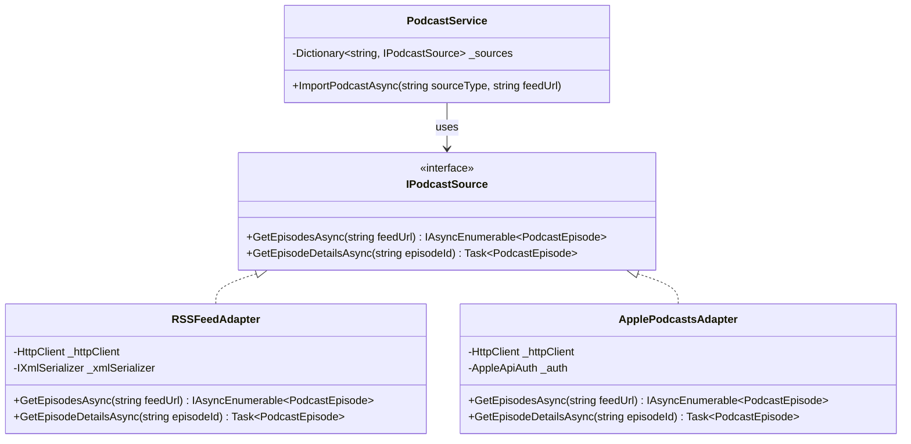
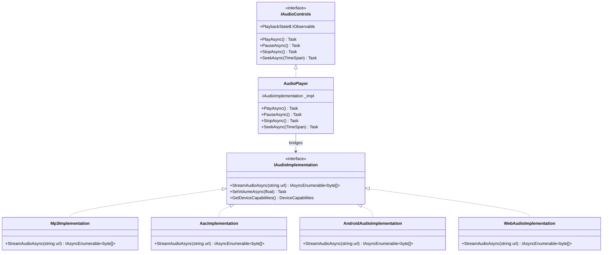
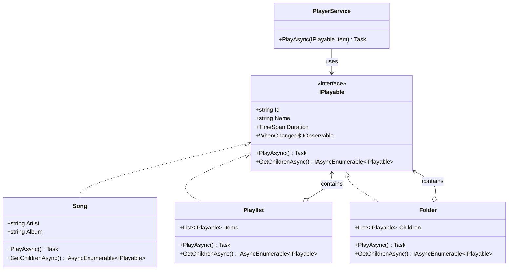
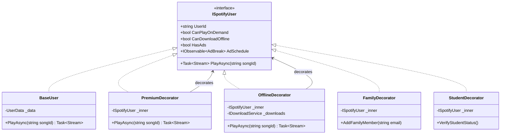
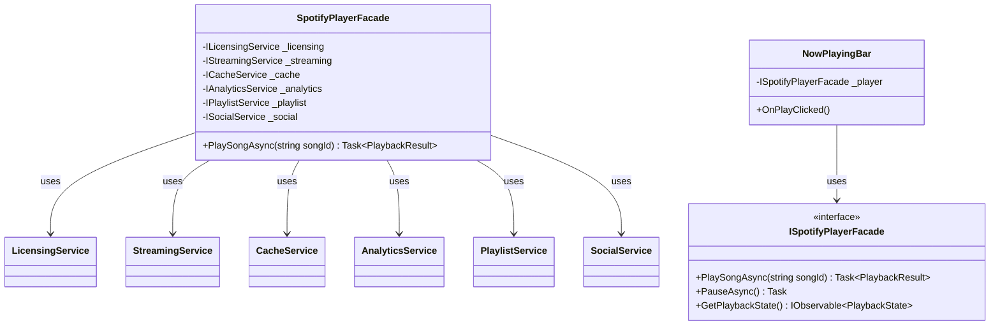
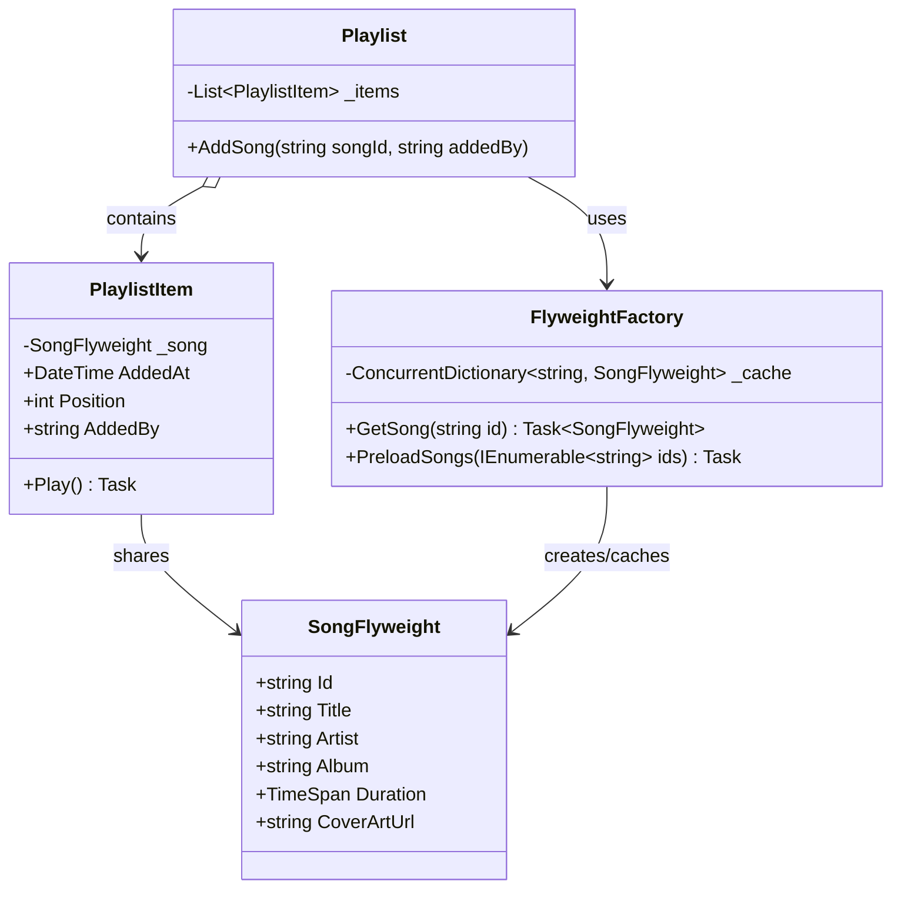
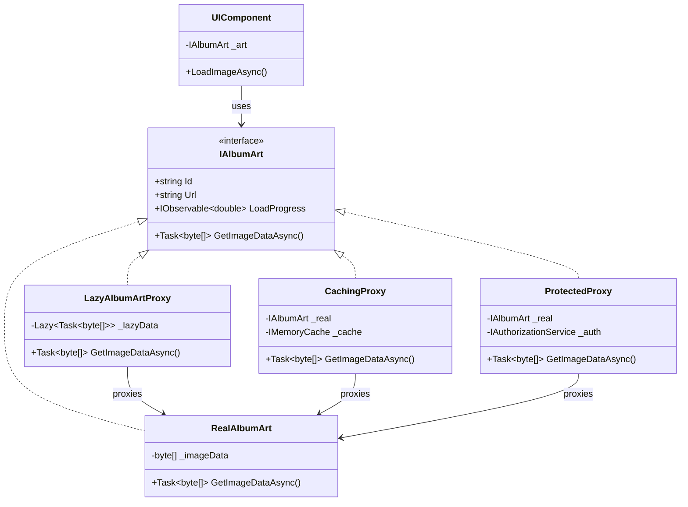

# Part 3: Structural Patterns Deep Dive
## How Spotify Composes Its Features (The .NET 10 Way)

---

**Subtitle:**
Adapter, Bridge, Composite, Decorator, Facade, Flyweight, and Proxy—implemented with .NET 10, Reactive Programming, Entity Framework Core, and SPAP<T> patterns. Real Spotify code that's production-ready.

**Keywords:**
Structural Patterns, .NET 10, C# 13, Reactive Programming, Entity Framework Core, SPAP<T>, Adapter Pattern, Bridge Pattern, Composite Pattern, Decorator Pattern, Facade Pattern, Flyweight Pattern, Proxy Pattern, Spotify system design

---

## Introduction: Why .NET 10 Changes Structural Design

**The Legacy Way:**
Most structural pattern examples show static class diagrams and synchronous method calls. They ignore the reality of distributed systems, microservices, and reactive architectures.

**The .NET 10 Way:**
Structural patterns in modern Spotify would leverage:

- **Reactive Extensions (System.Reactive)** for event-driven composition
- **Entity Framework Core 10** with complex type mapping for hierarchical data
- **SPAP<T> (Single Producer Async Pattern)** for connection pooling and resource sharing
- **Native AOT compilation** for microservices with minimal memory footprint
- **Primary constructors, required members, and collection expressions** for cleaner code

**Why Structural Patterns Matter for Spotify:**

| Challenge | Structural Pattern | .NET 10 Solution |
|-----------|-------------------|------------------|
| Third-party integrations | Adapter | HttpClientFactory + Reactive streams |
| Multiple device platforms | Bridge | Interface segregation + DI |
| Folder/Playlist hierarchies | Composite | EF Core self-referencing tables |
| Premium feature layering | Decorator | Decorator pattern with DI |
| Complex subsystem | Facade | Service aggregators |
| Memory optimization | Flyweight | Object pooling + SPAP<T> |
| Lazy loading | Proxy | Lazy<T> + interceptors |

Let's build Spotify's composition layer the right way—with modern .NET.

---

## Pattern 1: Adapter Pattern
*"Making Incompatible Interfaces Work Together"*

### What It Solves
Spotify integrates with dozens of third-party services: RSS feeds for podcasts, Facebook for sharing, Instagram for stories, and payment gateways like Stripe and RazorPay. Each has its own interface. The Adapter pattern wraps these external interfaces to match Spotify's internal contracts.

### The .NET 10 Implementation
Modern .NET features:
- **HttpClientFactory** for resilient HTTP calls
- **Reactive streams** for real-time event adaptation
- **Primary constructors** for concise adapters
- **Polymorphic serialization** for varied response formats

### The Structure



### The Code

```csharp
using System.Reactive.Linq;
using System.Reactive.Subjects;
using System.Xml;
using System.Xml.Serialization;
using Microsoft.Extensions.Caching.Memory;
using Microsoft.Extensions.Http;

namespace Spotify.Integrations.Podcasts;

// ========== Domain Models ==========

/// <summary>
/// Podcast episode domain model
/// </summary>
public record PodcastEpisode
{
    public required string Id { get; init; }
    public required string Title { get; init; }
    public required string Description { get; init; }
    public required string AudioUrl { get; init; }
    public TimeSpan Duration { get; init; }
    public DateTime PublishedDate { get; init; }
    public string? ShowName { get; init; }
    public string? Host { get; init; }
    public IReadOnlyList<string>? Categories { get; init; }
    public string? CoverImageUrl { get; init; }
}

/// <summary>
/// Podcast show model
/// </summary>
public record PodcastShow
{
    public required string Id { get; init; }
    public required string Title { get; init; }
    public string? Description { get; init; }
    public string? Author { get; init; }
    public string? CoverImageUrl { get; init; }
    public string? FeedUrl { get; init; }
    public string? SourceType { get; init; } // "rss", "apple", "spotify"
}

// ========== Target Interface ==========

/// <summary>
/// Target interface that Spotify's internal systems expect
/// </summary>
public interface IPodcastSource
{
    /// <summary>
    /// Get episodes from a podcast feed
    /// </summary>
    IAsyncEnumerable<PodcastEpisode> GetEpisodesAsync(
        string feedUrl, 
        CancellationToken cancellationToken = default);
    
    /// <summary>
    /// Get details for a specific episode
    /// </summary>
    Task<PodcastEpisode?> GetEpisodeDetailsAsync(
        string episodeId, 
        CancellationToken cancellationToken = default);
    
    /// <summary>
    /// Reactive stream of new episodes (for real-time updates)
    /// </summary>
    IObservable<PodcastEpisode> WhenNewEpisodeAvailable { get; }
    
    /// <summary>
    /// Source type identifier
    /// </summary>
    string SourceType { get; }
}

// ========== RSS Feed Adapter (Adapts XML RSS to our interface) ==========

/// <summary>
/// RSS Feed adapter - converts RSS XML to PodcastEpisode
/// WHY .NET 10: Using primary constructor for HttpClient injection
/// </summary>
public class RSSFeedAdapter : IPodcastSource
{
    private readonly HttpClient _httpClient;
    private readonly IMemoryCache _cache;
    private readonly Subject<PodcastEpisode> _newEpisodeSubject = new();
    private readonly XmlSerializer _rssSerializer = new(typeof(RssChannel));
    
    public string SourceType => "rss";
    public IObservable<PodcastEpisode> WhenNewEpisodeAvailable => _newEpisodeSubject.AsObservable();
    
    // Primary constructor with injected dependencies
    public RSSFeedAdapter(
        IHttpClientFactory httpClientFactory,
        IMemoryCache memoryCache)
    {
        _httpClient = httpClientFactory.CreateClient("PodcastClient");
        _httpClient.DefaultRequestHeaders.Add("User-Agent", "SpotifyBot/1.0");
        _cache = memoryCache;
    }
    
    /// <summary>
    /// Get episodes from RSS feed
    /// </summary>
    public async IAsyncEnumerable<PodcastEpisode> GetEpisodesAsync(
        string feedUrl, 
        [EnumeratorCancellation] CancellationToken cancellationToken = default)
    {
        // Check cache first
        var cacheKey = $"rss_feed_{feedUrl}";
        if (_cache.TryGetValue<List<PodcastEpisode>>(cacheKey, out var cachedEpisodes))
        {
            foreach (var episode in cachedEpisodes!)
            {
                yield return episode;
            }
            yield break;
        }
        
        // Fetch and parse RSS
        var response = await _httpClient.GetAsync(feedUrl, cancellationToken);
        response.EnsureSuccessStatusCode();
        
        await using var stream = await response.Content.ReadAsStreamAsync(cancellationToken);
        using var reader = XmlReader.Create(stream);
        
        if (_rssSerializer.Deserialize(reader) is RssChannel channel)
        {
            var episodes = new List<PodcastEpisode>();
            
            foreach (var item in channel.Items ?? Enumerable.Empty<RssItem>())
            {
                var episode = MapRssItemToEpisode(item, channel);
                episodes.Add(episode);
                
                yield return episode;
                
                // Simulate streaming delay
                await Task.Delay(10, cancellationToken);
            }
            
            // Cache the results
            _cache.Set(cacheKey, episodes, TimeSpan.FromMinutes(30));
            
            // Notify new episodes (in real app, would compare with previous)
            foreach (var episode in episodes.Take(3)) // Just latest 3
            {
                _newEpisodeSubject.OnNext(episode);
            }
        }
    }
    
    /// <summary>
    /// Get episode details by ID
    /// </summary>
    public async Task<PodcastEpisode?> GetEpisodeDetailsAsync(
        string episodeId, 
        CancellationToken cancellationToken = default)
    {
        // RSS doesn't have direct episode lookup, so we'd need to know the feed
        // This is simplified - in reality, would parse GUID from feed
        var cacheKey = $"episode_{episodeId}";
        
        return await _cache.GetOrCreateAsync(cacheKey, async entry =>
        {
            entry.AbsoluteExpirationRelativeToNow = TimeSpan.FromHours(24);
            
            // In real implementation, would fetch feed and find episode by GUID
            // For demo, return placeholder
            return new PodcastEpisode
            {
                Id = episodeId,
                Title = "Sample Episode",
                Description = "Fetched from RSS",
                AudioUrl = "https://example.com/episode.mp3",
                Duration = TimeSpan.FromMinutes(45),
                PublishedDate = DateTime.UtcNow.AddDays(-1),
                ShowName = "Sample Show"
            };
        });
    }
    
    private PodcastEpisode MapRssItemToEpisode(RssItem item, RssChannel channel)
    {
        // Generate a stable ID from the GUID or link
        var id = item.Guid?.Value ?? Convert.ToBase64String(
            System.Text.Encoding.UTF8.GetBytes(item.Link ?? item.Title));
        
        // Parse duration if available (RSS might have it in custom tags)
        var duration = TimeSpan.Zero;
        if (item.ITunesDuration != null)
        {
            TimeSpan.TryParse(item.ITunesDuration, out duration);
        }
        
        return new PodcastEpisode
        {
            Id = id,
            Title = item.Title,
            Description = item.Description ?? item.ITunesSummary ?? "",
            AudioUrl = item.Enclosure?.Url ?? "",
            Duration = duration,
            PublishedDate = item.PubDate ?? DateTime.UtcNow,
            ShowName = channel.Title,
            Host = channel.ITunesAuthor,
            Categories = channel.ITunesCategories?.ToList(),
            CoverImageUrl = channel.ITunesImage?.Href
        };
    }
}

// ========== RSS XML Models ==========

[XmlRoot("rss")]
public class RssChannel
{
    [XmlElement("channel")]
    public RssChannelData? Channel { get; set; }
}

public class RssChannelData
{
    [XmlElement("title")]
    public string? Title { get; set; }
    
    [XmlElement("link")]
    public string? Link { get; set; }
    
    [XmlElement("description")]
    public string? Description { get; set; }
    
    [XmlElement("language")]
    public string? Language { get; set; }
    
    [XmlElement("item")]
    public List<RssItem>? Items { get; set; }
    
    [XmlElement("itunes:author")]
    public string? ITunesAuthor { get; set; }
    
    [XmlElement("itunes:image")]
    public RssImage? ITunesImage { get; set; }
    
    [XmlElement("itunes:category")]
    public List<string>? ITunesCategories { get; set; }
}

public class RssItem
{
    [XmlElement("title")]
    public string Title { get; set; } = string.Empty;
    
    [XmlElement("link")]
    public string? Link { get; set; }
    
    [XmlElement("description")]
    public string? Description { get; set; }
    
    [XmlElement("guid")]
    public RssGuid? Guid { get; set; }
    
    [XmlElement("pubDate")]
    public DateTime? PubDate { get; set; }
    
    [XmlElement("enclosure")]
    public RssEnclosure? Enclosure { get; set; }
    
    [XmlElement("itunes:summary")]
    public string? ITunesSummary { get; set; }
    
    [XmlElement("itunes:duration")]
    public string? ITunesDuration { get; set; }
    
    [XmlElement("itunes:image")]
    public RssImage? ITunesImage { get; set; }
}

public class RssGuid
{
    [XmlAttribute("isPermaLink")]
    public bool IsPermaLink { get; set; }
    
    [XmlText]
    public string? Value { get; set; }
}

public class RssEnclosure
{
    [XmlAttribute("url")]
    public string? Url { get; set; }
    
    [XmlAttribute("length")]
    public long Length { get; set; }
    
    [XmlAttribute("type")]
    public string? Type { get; set; }
}

public class RssImage
{
    [XmlAttribute("href")]
    public string? Href { get; set; }
}

// ========== Apple Podcasts Adapter ==========

/// <summary>
/// Apple Podcasts API adapter
/// </summary>
public class ApplePodcastsAdapter : IPodcastSource
{
    private readonly HttpClient _httpClient;
    private readonly IMemoryCache _cache;
    private readonly Subject<PodcastEpisode> _newEpisodeSubject = new();
    
    public string SourceType => "apple";
    public IObservable<PodcastEpisode> WhenNewEpisodeAvailable => _newEpisodeSubject.AsObservable();
    
    public ApplePodcastsAdapter(
        IHttpClientFactory httpClientFactory,
        IMemoryCache cache)
    {
        _httpClient = httpClientFactory.CreateClient("ApplePodcastsClient");
        _httpClient.BaseAddress = new Uri("https://itunes.apple.com/");
        _httpClient.DefaultRequestHeaders.Add("Accept", "application/json");
        _cache = cache;
    }
    
    public async IAsyncEnumerable<PodcastEpisode> GetEpisodesAsync(
        string feedUrl, 
        [EnumeratorCancellation] CancellationToken cancellationToken = default)
    {
        // Apple feed URLs look like: https://podcasts.apple.com/us/podcast/id123456
        var podcastId = ExtractPodcastId(feedUrl);
        
        var cacheKey = $"apple_feed_{podcastId}";
        if (_cache.TryGetValue<List<PodcastEpisode>>(cacheKey, out var cached))
        {
            foreach (var ep in cached!) yield return ep;
            yield break;
        }
        
        // Call Apple Podcasts API
        var response = await _httpClient.GetAsync(
            $"lookup?id={podcastId}&entity=podcastEpisode", 
            cancellationToken);
        
        response.EnsureSuccessStatusCode();
        
        var json = await response.Content.ReadAsStringAsync(cancellationToken);
        var episodes = ParseAppleResponse(json);
        
        _cache.Set(cacheKey, episodes, TimeSpan.FromHours(1));
        
        foreach (var episode in episodes)
        {
            yield return episode;
        }
    }
    
    public Task<PodcastEpisode?> GetEpisodeDetailsAsync(
        string episodeId, 
        CancellationToken cancellationToken = default)
    {
        // Apple has episode lookup API
        throw new NotImplementedException("Apple episode details would be implemented here");
    }
    
    private string ExtractPodcastId(string feedUrl)
    {
        // Parse ID from URL: .../id123456 -> 123456
        var match = System.Text.RegularExpressions.Regex.Match(feedUrl, @"/id(\d+)");
        return match.Success ? match.Groups[1].Value : throw new ArgumentException("Invalid Apple podcast URL");
    }
    
    private List<PodcastEpisode> ParseAppleResponse(string json)
    {
        // In real implementation, would use System.Text.Json
        // Simplified for demo
        return new List<PodcastEpisode>();
    }
}

// ========== Podcast Service Using Adapters ==========

/// <summary>
/// Service that uses adapters to import podcasts from various sources
/// </summary>
public class PodcastImportService
{
    private readonly Dictionary<string, IPodcastSource> _adapters;
    private readonly PodcastDbContext _dbContext;
    private readonly List<IDisposable> _subscriptions = new();
    
    public PodcastImportService(
        IEnumerable<IPodcastSource> adapters,
        PodcastDbContext dbContext)
    {
        _adapters = adapters.ToDictionary(a => a.SourceType, a => a);
        _dbContext = dbContext;
        
        // Subscribe to real-time updates from all adapters
        foreach (var adapter in adapters)
        {
            var subscription = adapter.WhenNewEpisodeAvailable
                .Subscribe(async episode => await HandleNewEpisodeAsync(episode));
            
            _subscriptions.Add(subscription);
        }
    }
    
    /// <summary>
    /// Import podcasts from any source using the appropriate adapter
    /// </summary>
    public async Task<int> ImportPodcastsAsync(
        string sourceType, 
        string feedUrl,
        CancellationToken cancellationToken = default)
    {
        if (!_adapters.TryGetValue(sourceType, out var adapter))
        {
            throw new ArgumentException($"Unsupported source type: {sourceType}");
        }
        
        Console.WriteLine($"📥 Importing from {sourceType} using {adapter.GetType().Name}");
        
        var count = 0;
        
        // Use the adapter to get episodes
        await foreach (var episode in adapter.GetEpisodesAsync(feedUrl, cancellationToken))
        {
            // Save to database
            var podcastEpisode = new PodcastEpisodeEntity
            {
                Id = episode.Id,
                Title = episode.Title,
                Description = episode.Description,
                AudioUrl = episode.AudioUrl,
                Duration = episode.Duration,
                PublishedAt = episode.PublishedDate,
                ShowName = episode.ShowName ?? "Unknown",
                SourceType = sourceType,
                ImportedAt = DateTime.UtcNow
            };
            
            await _dbContext.PodcastEpisodes.AddAsync(podcastEpisode, cancellationToken);
            count++;
            
            // Batch save every 100 episodes
            if (count % 100 == 0)
            {
                await _dbContext.SaveChangesAsync(cancellationToken);
                Console.WriteLine($"  Saved {count} episodes...");
            }
        }
        
        // Final save
        await _dbContext.SaveChangesAsync(cancellationToken);
        
        Console.WriteLine($"✅ Imported {count} episodes from {sourceType}");
        return count;
    }
    
    private async Task HandleNewEpisodeAsync(PodcastEpisode episode)
    {
        Console.WriteLine($"🔔 New episode detected: {episode.Title}");
        
        // Check if already exists
        var exists = await _dbContext.PodcastEpisodes
            .AnyAsync(e => e.Id == episode.Id);
        
        if (!exists)
        {
            // Add to database and notify subscribers
            var entity = new PodcastEpisodeEntity
            {
                Id = episode.Id,
                Title = episode.Title,
                Description = episode.Description,
                AudioUrl = episode.AudioUrl,
                Duration = episode.Duration,
                PublishedAt = episode.PublishedDate,
                ShowName = episode.ShowName ?? "Unknown",
                SourceType = "realtime",
                ImportedAt = DateTime.UtcNow
            };
            
            await _dbContext.PodcastEpisodes.AddAsync(entity);
            await _dbContext.SaveChangesAsync();
            
            Console.WriteLine($"  Added new episode to database");
        }
    }
    
    public void Dispose()
    {
        foreach (var sub in _subscriptions)
        {
            sub.Dispose();
        }
    }
}

// ========== EF Core Entity ==========

public class PodcastEpisodeEntity
{
    public string Id { get; set; } = string.Empty;
    public string Title { get; set; } = string.Empty;
    public string Description { get; set; } = string.Empty;
    public string AudioUrl { get; set; } = string.Empty;
    public TimeSpan Duration { get; set; }
    public DateTime PublishedAt { get; set; }
    public string ShowName { get; set; } = string.Empty;
    public string SourceType { get; set; } = string.Empty;
    public DateTime ImportedAt { get; set; }
}

public class PodcastDbContext : DbContext
{
    public DbSet<PodcastEpisodeEntity> PodcastEpisodes => Set<PodcastEpisodeEntity>();
    
    public PodcastDbContext(DbContextOptions<PodcastDbContext> options) : base(options) { }
    
    protected override void OnModelCreating(ModelBuilder modelBuilder)
    {
        modelBuilder.Entity<PodcastEpisodeEntity>(entity =>
        {
            entity.HasKey(e => e.Id);
            entity.Property(e => e.Title).IsRequired().HasMaxLength(500);
            entity.Property(e => e.Description).HasMaxLength(4000);
            entity.HasIndex(e => e.PublishedAt);
            entity.HasIndex(e => e.ShowName);
        });
    }
}

// ========== Program.cs - DI Setup ==========

/*
// In Program.cs
builder.Services.AddHttpClient("PodcastClient", client =>
{
    client.Timeout = TimeSpan.FromSeconds(30);
}).AddPolicyHandler(GetRetryPolicy()); // Polly for resilience

builder.Services.AddHttpClient("ApplePodcastsClient", client =>
{
    client.Timeout = TimeSpan.FromSeconds(15);
});

builder.Services.AddMemoryCache();

// Register adapters
builder.Services.AddScoped<IPodcastSource, RSSFeedAdapter>();
builder.Services.AddScoped<IPodcastSource, ApplePodcastsAdapter>();

// Register service
builder.Services.AddScoped<PodcastImportService>();

// Add DbContext
builder.Services.AddDbContext<PodcastDbContext>(options =>
    options.UseSqlServer(builder.Configuration.GetConnectionString("PodcastDb")));
*/

// ========== Usage Example ==========

public class AdapterPatternDemo
{
    public static async Task Main(string[] args)
    {
        // Setup in-memory database
        var options = new DbContextOptionsBuilder<PodcastDbContext>()
            .UseInMemoryDatabase("PodcastDemo")
            .Options;
        
        await using var dbContext = new PodcastDbContext(options);
        
        // Setup services
        var services = new ServiceCollection();
        services.AddHttpClient();
        services.AddMemoryCache();
        services.AddScoped<IPodcastSource, RSSFeedAdapter>();
        services.AddScoped<IPodcastSource, ApplePodcastsAdapter>();
        services.AddScoped<PodcastImportService>();
        services.AddSingleton(dbContext);
        
        var provider = services.BuildServiceProvider();
        var importService = provider.GetRequiredService<PodcastImportService>();
        
        Console.WriteLine("=== ADAPTER PATTERN DEMO ===\n");
        Console.WriteLine("Importing from different sources using adapters:\n");
        
        // Import from RSS feed
        await importService.ImportPodcastsAsync(
            "rss", 
            "https://feeds.npr.org/510318/podcast.xml");
        
        Console.WriteLine();
        
        // Import from Apple Podcasts
        await importService.ImportPodcastsAsync(
            "apple",
            "https://podcasts.apple.com/us/podcast/id123456789");
        
        Console.WriteLine("\n✅ Adapter pattern demonstrated:");
        Console.WriteLine("  • RSSFeedAdapter adapts XML RSS to IPodcastSource");
        Console.WriteLine("  • ApplePodcastsAdapter adapts JSON API to IPodcastSource");
        Console.WriteLine("  • PodcastImportService works with any source through the common interface");
        Console.WriteLine("  • Reactive streams provide real-time updates");
    }
}
```

### Why This Matters for Spotify (.NET Edition)
- **Interface Consistency:** All third-party integrations conform to `IPodcastSource`
- **Testability:** Adapters can be mocked for unit testing
- **Resilience:** HttpClientFactory with Polly for retries
- **Reactive Updates:** `IObservable<PodcastEpisode>` for real-time notifications
- **Caching:** IMemoryCache reduces redundant API calls
- **Async Streaming:** `IAsyncEnumerable` for memory-efficient processing

---

## Pattern 2: Bridge Pattern
*"Decoupling Abstraction from Implementation"*

### What It Solves
Spotify plays audio on multiple platforms (Android, iOS, Web, Desktop) and supports multiple audio formats (MP3, AAC, FLAC, Ogg). Without Bridge, you'd have a combinatorial explosion of classes: `AndroidMp3Player`, `iOSAacPlayer`, `WebOggPlayer`, etc.

### The .NET 10 Implementation
Modern .NET features:
- **Interface segregation** for clean separation
- **Dependency injection** for runtime implementation selection
- **Reactive streams** for cross-platform events
- **Source generators** for platform-specific code

### The Structure



### The Code

```csharp
using System.Reactive.Linq;
using System.Reactive.Subjects;
using System.Threading.Channels;
using Microsoft.Extensions.Logging;

namespace Spotify.Playback.Bridge;

// ========== Platform Abstraction ==========

/// <summary>
/// Device capabilities
/// </summary>
public record DeviceCapabilities
{
    public required string DeviceId { get; init; }
    public required string Platform { get; init; } // "android", "ios", "web", "desktop"
    public IReadOnlyList<string> SupportedFormats { get; init; } = Array.Empty<string>();
    public bool SupportsHardwareDecoding { get; init; }
    public int MaxBitrate { get; init; }
    public float MinVolume { get; init; } = 0f;
    public float MaxVolume { get; init; } = 1f;
    public bool SupportsEqualizer { get; init; }
}

// ========== Implementation Interface ==========

/// <summary>
/// Implementation interface - platform and format specific
/// </summary>
public interface IAudioImplementation : IDisposable
{
    /// <summary>
    /// Stream audio data as byte chunks
    /// </summary>
    IAsyncEnumerable<byte[]> StreamAudioAsync(
        string contentUrl,
        TimeSpan? startPosition = null,
        CancellationToken cancellationToken = default);
    
    /// <summary>
    /// Set volume level
    /// </summary>
    Task SetVolumeAsync(float volume, CancellationToken cancellationToken = default);
    
    /// <summary>
    /// Get device capabilities
    /// </summary>
    DeviceCapabilities GetCapabilities();
    
    /// <summary>
    /// Reactive stream of implementation events (buffering, errors, etc.)
    /// </summary>
    IObservable<ImplementationEvent> Events { get; }
}

/// <summary>
/// Implementation events
/// </summary>
public record ImplementationEvent(
    string Type, // "buffering", "error", "formatChanged"
    object? Data = null);

// ========== Abstraction Interface ==========

/// <summary>
/// Abstraction interface - what the UI sees
/// </summary>
public interface IAudioControls
{
    /// <summary>
    /// Play current track
    /// </summary>
    Task PlayAsync(CancellationToken cancellationToken = default);
    
    /// <summary>
    /// Pause playback
    /// </summary>
    Task PauseAsync(CancellationToken cancellationToken = default);
    
    /// <summary>
    /// Stop playback
    /// </summary>
    Task StopAsync(CancellationToken cancellationToken = default);
    
    /// <summary>
    /// Seek to position
    /// </summary>
    Task SeekAsync(TimeSpan position, CancellationToken cancellationToken = default);
    
    /// <summary>
    /// Set volume
    /// </summary>
    Task SetVolumeAsync(float volume, CancellationToken cancellationToken = default);
    
    /// <summary>
    /// Current playback state
    /// </summary>
    PlaybackState CurrentState { get; }
    
    /// <summary>
    /// Reactive stream of state changes
    /// </summary>
    IObservable<PlaybackState> StateChanges { get; }
    
    /// <summary>
    /// Current playback position
    /// </summary>
    IObservable<TimeSpan> PositionChanges { get; }
}

/// <summary>
/// Playback state enum
/// </summary>
public enum PlaybackState
{
    Stopped,
    Buffering,
    Playing,
    Paused,
    Error
}

// ========== Concrete Implementations ==========

/// <summary>
/// Base implementation with common functionality
/// </summary>
public abstract class AudioImplementationBase : IAudioImplementation
{
    protected readonly ILogger Logger;
    protected readonly Subject<ImplementationEvent> _eventSubject = new();
    protected readonly DeviceCapabilities _capabilities;
    
    protected AudioImplementationBase(DeviceCapabilities capabilities, ILogger logger)
    {
        _capabilities = capabilities;
        Logger = logger;
    }
    
    public abstract IAsyncEnumerable<byte[]> StreamAudioAsync(
        string contentUrl,
        TimeSpan? startPosition = null,
        CancellationToken cancellationToken = default);
    
    public abstract Task SetVolumeAsync(float volume, CancellationToken cancellationToken = default);
    
    public DeviceCapabilities GetCapabilities() => _capabilities;
    
    public IObservable<ImplementationEvent> Events => _eventSubject.AsObservable();
    
    public virtual void Dispose()
    {
        _eventSubject.Dispose();
    }
    
    protected void EmitEvent(string type, object? data = null)
    {
        _eventSubject.OnNext(new ImplementationEvent(type, data));
    }
}

/// <summary>
/// MP3 implementation for any platform
/// </summary>
public class Mp3Implementation : AudioImplementationBase
{
    private readonly IHttpClientFactory _httpClientFactory;
    private HttpClient? _httpClient;
    
    public Mp3Implementation(
        DeviceCapabilities capabilities,
        IHttpClientFactory httpClientFactory,
        ILogger<Mp3Implementation> logger) 
        : base(capabilities, logger)
    {
        _httpClientFactory = httpClientFactory;
    }
    
    public override async IAsyncEnumerable<byte[]> StreamAudioAsync(
        string contentUrl,
        TimeSpan? startPosition = null,
        [EnumeratorCancellation] CancellationToken cancellationToken = default)
    {
        _httpClient ??= _httpClientFactory.CreateClient("AudioStreaming");
        
        // Add range header for seeking
        using var request = new HttpRequestMessage(HttpMethod.Get, contentUrl);
        if (startPosition.HasValue)
        {
            var bytesPosition = (long)(startPosition.Value.TotalSeconds * 128000 / 8); // Rough estimate for MP3
            request.Headers.Range = new System.Net.Http.Headers.RangeHeaderValue(bytesPosition, null);
        }
        
        EmitEvent("buffering", new { startPosition });
        
        using var response = await _httpClient.SendAsync(request, HttpCompletionOption.ResponseHeadersRead, cancellationToken);
        response.EnsureSuccessStatusCode();
        
        await using var stream = await response.Content.ReadAsStreamAsync(cancellationToken);
        var buffer = new byte[8192]; // 8KB chunks
        
        int bytesRead;
        while ((bytesRead = await stream.ReadAsync(buffer, cancellationToken)) > 0)
        {
            var chunk = new byte[bytesRead];
            Array.Copy(buffer, chunk, bytesRead);
            yield return chunk;
            
            // Simulate decoding delay
            await Task.Delay(5, cancellationToken);
        }
        
        EmitEvent("completed");
    }
    
    public override Task SetVolumeAsync(float volume, CancellationToken cancellationToken = default)
    {
        // MP3 decoding volume control (would interact with OS audio)
        Logger.LogDebug("MP3 volume set to {Volume}", volume);
        return Task.CompletedTask;
    }
}

/// <summary>
/// AAC implementation for iOS/macOS
/// </summary>
public class AacImplementation : AudioImplementationBase
{
    public AacImplementation(
        DeviceCapabilities capabilities,
        ILogger<AacImplementation> logger) 
        : base(capabilities, logger)
    {
    }
    
    public override async IAsyncEnumerable<byte[]> StreamAudioAsync(
        string contentUrl,
        TimeSpan? startPosition = null,
        [EnumeratorCancellation] CancellationToken cancellationToken = default)
    {
        // AAC-specific streaming logic (would use platform APIs)
        Logger.LogInformation("AAC streaming from {Url}", contentUrl);
        
        // Simulate streaming
        var totalChunks = 100;
        for (int i = 0; i < totalChunks; i++)
        {
            if (cancellationToken.IsCancellationRequested) yield break;
            
            yield return new byte[4096]; // Simulated AAC chunk
            await Task.Delay(10, cancellationToken);
        }
    }
    
    public override Task SetVolumeAsync(float volume, CancellationToken cancellationToken = default)
    {
        Logger.LogDebug("AAC volume set to {Volume}", volume);
        return Task.CompletedTask;
    }
}

// ========== Platform-Specific Implementations ==========

/// <summary>
/// Android audio implementation (uses Android's MediaPlayer)
/// </summary>
public class AndroidAudioImplementation : AudioImplementationBase
{
    // In real implementation, would have JNI bindings to Android SDK
    
    public AndroidAudioImplementation(ILogger<AndroidAudioImplementation> logger)
        : base(new DeviceCapabilities
        {
            DeviceId = "android-device",
            Platform = "android",
            SupportedFormats = new[] { "mp3", "aac", "ogg", "flac" },
            SupportsHardwareDecoding = true,
            MaxBitrate = 320000,
            MaxVolume = 1f,
            SupportsEqualizer = true
        }, logger)
    {
    }
    
    public override async IAsyncEnumerable<byte[]> StreamAudioAsync(
        string contentUrl,
        TimeSpan? startPosition = null,
        [EnumeratorCancellation] CancellationToken cancellationToken = default)
    {
        // Would call Android MediaCodec APIs
        Logger.LogInformation("Android hardware decoding: {Url}", contentUrl);
        
        // Simulate hardware-accelerated streaming
        for (int i = 0; i < 200; i++)
        {
            yield return new byte[16384]; // Larger chunks with hardware
            await Task.Delay(5, cancellationToken);
        }
    }
    
    public override Task SetVolumeAsync(float volume, CancellationToken cancellationToken = default)
    {
        // Would call Android AudioManager
        Logger.LogInformation("Android volume set to {Volume}", volume);
        return Task.CompletedTask;
    }
}

/// <summary>
/// Web audio implementation (uses Web Audio API via JS interop)
/// </summary>
public class WebAudioImplementation : AudioImplementationBase
{
    public WebAudioImplementation(ILogger<WebAudioImplementation> logger)
        : base(new DeviceCapabilities
        {
            DeviceId = "web-browser",
            Platform = "web",
            SupportedFormats = new[] { "mp3", "ogg", "webm" },
            SupportsHardwareDecoding = false,
            MaxBitrate = 192000,
            MaxVolume = 1f,
            SupportsEqualizer = false
        }, logger)
    {
    }
    
    public override async IAsyncEnumerable<byte[]> StreamAudioAsync(
        string contentUrl,
        TimeSpan? startPosition = null,
        [EnumeratorCancellation] CancellationToken cancellationToken = default)
    {
        // Would use fetch API and Web Audio worklets
        Logger.LogInformation("Web audio streaming: {Url}", contentUrl);
        
        // Smaller chunks for web to avoid memory pressure
        for (int i = 0; i < 300; i++)
        {
            yield return new byte[4096];
            await Task.Delay(15, cancellationToken);
        }
    }
    
    public override Task SetVolumeAsync(float volume, CancellationToken cancellationToken = default)
    {
        // Would call Web Audio API gain node
        Logger.LogInformation("Web volume set to {Volume}", volume);
        return Task.CompletedTask;
    }
}

// ========== Bridge: AudioPlayer ==========

/// <summary>
/// Bridge class that connects abstraction (controls) to implementation (platform/format)
/// </summary>
public class AudioPlayer : IAudioControls, IDisposable
{
    private readonly IAudioImplementation _implementation;
    private readonly ILogger<AudioPlayer> _logger;
    private readonly Subject<PlaybackState> _stateSubject = new();
    private readonly Subject<TimeSpan> _positionSubject = new();
    private readonly List<IDisposable> _subscriptions = new();
    
    private PlaybackState _currentState = PlaybackState.Stopped;
    private TimeSpan _currentPosition = TimeSpan.Zero;
    private TimeSpan _duration = TimeSpan.Zero;
    private string? _currentUrl;
    private CancellationTokenSource? _playbackCts;
    private Task? _playbackTask;
    
    public PlaybackState CurrentState => _currentState;
    public IObservable<PlaybackState> StateChanges => _stateSubject.AsObservable();
    public IObservable<TimeSpan> PositionChanges => _positionSubject.AsObservable();
    
    /// <summary>
    /// Constructor bridges abstraction with implementation
    /// </summary>
    public AudioPlayer(IAudioImplementation implementation, ILogger<AudioPlayer> logger)
    {
        _implementation = implementation;
        _logger = logger;
        
        // Bridge implementation events to abstraction logs
        _subscriptions.Add(implementation.Events.Subscribe(evt =>
        {
            _logger.LogDebug("Implementation event: {Type}", evt.Type);
            
            if (evt.Type == "buffering")
            {
                UpdateState(PlaybackState.Buffering);
            }
        }));
    }
    
    /// <summary>
    /// Play a track
    /// </summary>
    public async Task PlayAsync(CancellationToken cancellationToken = default)
    {
        if (_currentState == PlaybackState.Playing) return;
        
        if (_currentState == PlaybackState.Paused)
        {
            // Resume from pause
            UpdateState(PlaybackState.Playing);
            return;
        }
        
        // New playback
        _playbackCts = CancellationTokenSource.CreateLinkedTokenSource(cancellationToken);
        
        UpdateState(PlaybackState.Buffering);
        
        try
        {
            _playbackTask = RunPlaybackAsync(_playbackCts.Token);
            await Task.CompletedTask;
        }
        catch (Exception ex)
        {
            _logger.LogError(ex, "Playback failed");
            UpdateState(PlaybackState.Error);
        }
    }
    
    public Task PauseAsync(CancellationToken cancellationToken = default)
    {
        if (_currentState == PlaybackState.Playing)
        {
            UpdateState(PlaybackState.Paused);
        }
        return Task.CompletedTask;
    }
    
    public async Task StopAsync(CancellationToken cancellationToken = default)
    {
        if (_playbackCts != null)
        {
            await _playbackCts.CancelAsync();
            _playbackCts.Dispose();
            _playbackCts = null;
        }
        
        _currentPosition = TimeSpan.Zero;
        UpdateState(PlaybackState.Stopped);
    }
    
    public async Task SeekAsync(TimeSpan position, CancellationToken cancellationToken = default)
    {
        if (_currentUrl == null) return;
        
        // Stop current playback
        if (_playbackCts != null)
        {
            await _playbackCts.CancelAsync();
        }
        
        // Start from new position
        _currentPosition = position;
        _playbackCts = CancellationTokenSource.CreateLinkedTokenSource(cancellationToken);
        
        UpdateState(PlaybackState.Buffering);
        _playbackTask = RunPlaybackAsync(_playbackCts.Token);
    }
    
    public Task SetVolumeAsync(float volume, CancellationToken cancellationToken = default)
    {
        return _implementation.SetVolumeAsync(volume, cancellationToken);
    }
    
    private async Task RunPlaybackAsync(CancellationToken cancellationToken)
    {
        try
        {
            // Stream audio chunks through the implementation
            await foreach (var chunk in _implementation.StreamAudioAsync(
                _currentUrl!, _currentPosition, cancellationToken))
            {
                // In real implementation, would send chunk to audio hardware
                // and update position based on decoded duration
                
                _currentPosition += TimeSpan.FromMilliseconds(50); // Simulated
                _positionSubject.OnNext(_currentPosition);
                
                if (_currentState != PlaybackState.Playing)
                {
                    UpdateState(PlaybackState.Playing);
                }
            }
            
            // Playback completed naturally
            if (!cancellationToken.IsCancellationRequested)
            {
                _currentPosition = _duration;
                _positionSubject.OnNext(_currentPosition);
                UpdateState(PlaybackState.Stopped);
            }
        }
        catch (OperationCanceledException)
        {
            _logger.LogDebug("Playback cancelled");
        }
        catch (Exception ex)
        {
            _logger.LogError(ex, "Playback error");
            UpdateState(PlaybackState.Error);
        }
    }
    
    private void UpdateState(PlaybackState newState)
    {
        if (_currentState == newState) return;
        
        _currentState = newState;
        _stateSubject.OnNext(newState);
        _logger.LogDebug("State changed: {State}", newState);
    }
    
    public void Dispose()
    {
        _playbackCts?.Cancel();
        _playbackTask?.Dispose();
        _stateSubject.Dispose();
        _positionSubject.Dispose();
        _implementation.Dispose();
        
        foreach (var sub in _subscriptions)
        {
            sub.Dispose();
        }
    }
}

// ========== Player Factory with Bridge ==========

/// <summary>
/// Factory that creates appropriately bridged audio players
/// </summary>
public class AudioPlayerFactory
{
    private readonly IServiceProvider _serviceProvider;
    private readonly ILogger<AudioPlayerFactory> _logger;
    
    public AudioPlayerFactory(IServiceProvider serviceProvider, ILogger<AudioPlayerFactory> logger)
    {
        _serviceProvider = serviceProvider;
        _logger = logger;
    }
    
    /// <summary>
    /// Create an audio player for the given platform and format
    /// </summary>
    public AudioPlayer CreatePlayer(string platform, string format, string deviceId)
    {
        IAudioImplementation implementation = (platform, format) switch
        {
            ("android", "mp3") => _serviceProvider.GetRequiredService<Mp3Implementation>(),
            ("android", "aac") => _serviceProvider.GetRequiredService<AacImplementation>(),
            ("android", _) => _serviceProvider.GetRequiredService<AndroidAudioImplementation>(),
            
            ("ios", "aac") => _serviceProvider.GetRequiredService<AacImplementation>(),
            ("ios", "mp3") => _serviceProvider.GetRequiredService<Mp3Implementation>(),
            
            ("web", "mp3") => _serviceProvider.GetRequiredService<Mp3Implementation>(),
            ("web", "ogg") => _serviceProvider.GetRequiredService<WebAudioImplementation>(),
            
            ("desktop", "mp3") => _serviceProvider.GetRequiredService<Mp3Implementation>(),
            ("desktop", "flac") => _serviceProvider.GetRequiredService<Mp3Implementation>(), // FLAC support
            
            _ => throw new NotSupportedException($"No implementation for {platform}/{format}")
        };
        
        _logger.LogInformation("Created bridged player: {Platform}/{Format} -> {Implementation}",
            platform, format, implementation.GetType().Name);
        
        return ActivatorUtilities.CreateInstance<AudioPlayer>(_serviceProvider, implementation);
    }
}

// ========== Program.cs - DI Setup ==========

/*
// In Program.cs
builder.Services.AddHttpClient("AudioStreaming", client =>
{
    client.Timeout = TimeSpan.FromMinutes(5);
    client.DefaultRequestHeaders.Add("User-Agent", "SpotifyPlayer/1.0");
});

// Register implementations
builder.Services.AddScoped<Mp3Implementation>();
builder.Services.AddScoped<AacImplementation>();
builder.Services.AddScoped<AndroidAudioImplementation>();
builder.Services.AddScoped<WebAudioImplementation>();

// Register factory
builder.Services.AddScoped<AudioPlayerFactory>();
*/

// ========== Usage Example ==========

public class BridgePatternDemo
{
    public static async Task Main(string[] args)
    {
        // Setup DI
        var services = new ServiceCollection();
        services.AddLogging(b => b.AddConsole().SetMinimumLevel(LogLevel.Debug));
        services.AddHttpClient();
        
        services.AddScoped<Mp3Implementation>();
        services.AddScoped<AacImplementation>();
        services.AddScoped<AndroidAudioImplementation>();
        services.AddScoped<WebAudioImplementation>();
        services.AddScoped<AudioPlayerFactory>();
        
        var provider = services.BuildServiceProvider();
        var factory = provider.GetRequiredService<AudioPlayerFactory>();
        
        Console.WriteLine("=== BRIDGE PATTERN DEMO ===\n");
        Console.WriteLine("Same audio controls, different implementations:\n");
        
        // Create players for different platforms/formats
        var androidMp3Player = factory.CreatePlayer("android", "mp3", "device-123");
        var webOggPlayer = factory.CreatePlayer("web", "ogg", "browser-456");
        var iosAacPlayer = factory.CreatePlayer("ios", "aac", "iphone-789");
        
        // All players expose the same IAudioControls interface
        var testUrl = "https://spotify.com/track/123/stream";
        
        // Test Android player
        Console.WriteLine("\n🎵 Android MP3 Player:");
        await androidMp3Player.PlayAsync();
        await Task.Delay(2000);
        await androidMp3Player.PauseAsync();
        await Task.Delay(1000);
        await androidMp3Player.PlayAsync();
        await Task.Delay(1000);
        await androidMp3Player.StopAsync();
        
        // Test Web player
        Console.WriteLine("\n🌐 Web Ogg Player:");
        await webOggPlayer.PlayAsync();
        await Task.Delay(1500);
        await webOggPlayer.SeekAsync(TimeSpan.FromSeconds(30));
        await Task.Delay(500);
        await webOggPlayer.StopAsync();
        
        // Test iOS player
        Console.WriteLine("\n📱 iOS AAC Player:");
        await iosAacPlayer.SetVolumeAsync(0.7f);
        await iosAacPlayer.PlayAsync();
        await Task.Delay(2000);
        await iosAacPlayer.PauseAsync();
        
        Console.WriteLine("\n✅ Bridge pattern demonstrated:");
        Console.WriteLine("  • IAudioControls abstraction: same for all platforms");
        Console.WriteLine("  • IAudioImplementation: varies by platform/format");
        Console.WriteLine("  • AudioPlayer bridges the two hierarchies");
        Console.WriteLine("  • No combinatorial explosion of classes");
    }
}
```

### Why This Matters for Spotify (.NET Edition)
- **Decoupled Hierarchies:** Controls and implementations vary independently
- **Runtime Flexibility:** Choose implementation based on device capabilities
- **Testability:** Mock implementations for unit testing
- **Reactive Events:** Implementation events flow to abstraction via Rx
- **Resource Efficiency:** Only load needed implementations

---

## Pattern 3: Composite Pattern
*"Treating Individual Objects and Compositions Uniformly"*

### What It Solves
Spotify's library has a hierarchical structure: Folders contain Playlists, Playlists contain Songs, and Folders can contain other Folders. Users should be able to "Play" any of these—a single song, a whole playlist, or an entire folder recursively.

### The .NET 10 Implementation
Modern .NET features:
- **EF Core self-referencing tables** for hierarchies
- **IAsyncEnumerable** for streaming large trees
- **Records** for immutable tree nodes
- **Reactive streams** for tree change notifications

### The Structure



### The Code

```csharp
using Microsoft.EntityFrameworkCore;
using System.Reactive.Linq;
using System.Reactive.Subjects;
using System.Runtime.CompilerServices;

namespace Spotify.Library.Composite;

// ========== Component Interface ==========

/// <summary>
/// Component interface - both leaf and composite implement this
/// </summary>
public interface IPlayable
{
    /// <summary>
    /// Unique identifier
    /// </summary>
    string Id { get; }
    
    /// <summary>
    /// Display name
    /// </summary>
    string Name { get; }
    
    /// <summary>
    /// Total duration (for composites, sum of children)
    /// </summary>
    TimeSpan Duration { get; }
    
    /// <summary>
    /// Type of playable item
    /// </summary>
    string ItemType { get; } // "song", "playlist", "folder"
    
    /// <summary>
    /// Play this item (recursively for composites)
    /// </summary>
    Task PlayAsync(CancellationToken cancellationToken = default);
    
    /// <summary>
    /// Get children (empty for leaf nodes)
    /// </summary>
    IAsyncEnumerable<IPlayable> GetChildrenAsync(CancellationToken cancellationToken = default);
    
    /// <summary>
    /// Observable for changes (content added/removed)
    /// </summary>
    IObservable<LibraryChange> WhenChanged { get; }
}

/// <summary>
/// Library change notification
/// </summary>
public record LibraryChange(
    string ItemId,
    ChangeType Type,
    IPlayable? Child = null);

public enum ChangeType
{
    Added,
    Removed,
    Updated
}

// ========== Leaf: Song ==========

/// <summary>
/// Leaf node - a song
/// </summary>
public class Song : IPlayable
{
    public required string Id { get; init; }
    public required string Name { get; init; }
    public required string Artist { get; init; }
    public required string Album { get; init; }
    public TimeSpan Duration { get; init; }
    public string ItemType => "song";
    
    // Songs have no children
    public IAsyncEnumerable<IPlayable> GetChildrenAsync(CancellationToken cancellationToken = default)
        => AsyncEnumerable.Empty<IPlayable>();
    
    // Songs don't emit changes directly (would be from database)
    public IObservable<LibraryChange> WhenChanged => Observable.Empty<LibraryChange>();
    
    public async Task PlayAsync(CancellationToken cancellationToken = default)
    {
        Console.WriteLine($"🎵 Playing song: {Name} by {Artist} [{Duration:mm\\:ss}]");
        await Task.Delay(500, cancellationToken); // Simulate playback
    }
    
    public override string ToString() => $"Song: {Name}";
}

// ========== Composite: Playlist ==========

/// <summary>
/// Composite node - playlist containing songs or other playables
/// </summary>
public class Playlist : IPlayable
{
    private readonly List<IPlayable> _items = new();
    private readonly Subject<LibraryChange> _changeSubject = new();
    
    public required string Id { get; init; }
    public required string Name { get; init; }
    public string? Description { get; init; }
    public string ItemType => "playlist";
    
    /// <summary>
    /// Duration is sum of all items
    /// </summary>
    public TimeSpan Duration => TimeSpan.FromTicks(_items.Sum(i => i.Duration.Ticks));
    
    public IObservable<LibraryChange> WhenChanged => _changeSubject.AsObservable();
    
    /// <summary>
    /// Add an item to the playlist
    /// </summary>
    public void AddItem(IPlayable item)
    {
        _items.Add(item);
        _changeSubject.OnNext(new LibraryChange(Id, ChangeType.Added, item));
    }
    
    /// <summary>
    /// Remove an item from the playlist
    /// </summary>
    public bool RemoveItem(string itemId)
    {
        var item = _items.FirstOrDefault(i => i.Id == itemId);
        if (item != null && _items.Remove(item))
        {
            _changeSubject.OnNext(new LibraryChange(Id, ChangeType.Removed, item));
            return true;
        }
        return false;
    }
    
    /// <summary>
    /// Get all items in the playlist
    /// </summary>
    public IAsyncEnumerable<IPlayable> GetChildrenAsync(CancellationToken cancellationToken = default)
        => _items.ToAsyncEnumerable();
    
    /// <summary>
    /// Play the playlist - plays all items sequentially
    /// </summary>
    public async Task PlayAsync(CancellationToken cancellationToken = default)
    {
        Console.WriteLine($"📋 Playing playlist: {Name} ({_items.Count} items, total {Duration:mm\\:ss})");
        
        var index = 1;
        foreach (var item in _items)
        {
            Console.Write($"  {index++}. ");
            await item.PlayAsync(cancellationToken);
            
            if (cancellationToken.IsCancellationRequested)
                break;
        }
        
        Console.WriteLine($"  ✅ Playlist {Name} completed");
    }
    
    public override string ToString() => $"Playlist: {Name} ({_items.Count} items)";
}

// ========== Composite: Folder ==========

/// <summary>
/// Composite node - folder containing playlists and other folders
/// </summary>
public class Folder : IPlayable
{
    private readonly List<IPlayable> _children = new();
    private readonly Subject<LibraryChange> _changeSubject = new();
    
    public required string Id { get; init; }
    public required string Name { get; init; }
    public string ItemType => "folder";
    
    /// <summary>
    /// Duration is sum of all children recursively
    /// </summary>
    public TimeSpan Duration
    {
        get
        {
            // Recursively calculate total duration
            return TimeSpan.FromTicks(_children.Sum(c => c.Duration.Ticks));
        }
    }
    
    public IObservable<LibraryChange> WhenChanged => _changeSubject.AsObservable();
    
    /// <summary>
    /// Add a child (folder or playlist)
    /// </summary>
    public void AddChild(IPlayable child)
    {
        _children.Add(child);
        _changeSubject.OnNext(new LibraryChange(Id, ChangeType.Added, child));
        
        // Also subscribe to child's changes and propagate up
        if (child is Folder childFolder)
        {
            childFolder.WhenChanged.Subscribe(change =>
            {
                _changeSubject.OnNext(change with { }); // Propagate upwards
            });
        }
    }
    
    /// <summary>
    /// Remove a child
    /// </summary>
    public bool RemoveChild(string childId)
    {
        var child = _children.FirstOrDefault(c => c.Id == childId);
        if (child != null && _children.Remove(child))
        {
            _changeSubject.OnNext(new LibraryChange(Id, ChangeType.Removed, child));
            return true;
        }
        return false;
    }
    
    /// <summary>
    /// Get immediate children
    /// </summary>
    public IAsyncEnumerable<IPlayable> GetChildrenAsync(CancellationToken cancellationToken = default)
        => _children.ToAsyncEnumerable();
    
    /// <summary>
    /// Get all descendants recursively (useful for search)
    /// </summary>
    public async IAsyncEnumerable<IPlayable> GetAllDescendantsAsync(
        [EnumeratorCancellation] CancellationToken cancellationToken = default)
    {
        foreach (var child in _children)
        {
            yield return child;
            
            if (child is Folder childFolder)
            {
                await foreach (var descendant in childFolder.GetAllDescendantsAsync(cancellationToken))
                {
                    yield return descendant;
                }
            }
        }
    }
    
    /// <summary>
    /// Play the folder - plays all children recursively
    /// </summary>
    public async Task PlayAsync(CancellationToken cancellationToken = default)
    {
        Console.WriteLine($"📁 Playing folder: {Name} (contains {_children.Count} items)");
        
        var index = 1;
        await foreach (var child in GetChildrenAsync(cancellationToken))
        {
            Console.Write($"  [{index++}] ");
            await child.PlayAsync(cancellationToken);
            
            if (cancellationToken.IsCancellationRequested)
                break;
        }
    }
    
    public override string ToString() => $"Folder: {Name} ({_children.Count} items)";
}

// ========== EF Core Entity for Persistence ==========

/// <summary>
/// EF Core entity for library items (using TPT inheritance)
/// </summary>
public abstract class LibraryItemEntity
{
    public string Id { get; set; } = Guid.NewGuid().ToString();
    public string Name { get; set; } = string.Empty;
    public string ItemType { get; set; } = string.Empty;
    public string? ParentFolderId { get; set; }
    public int Position { get; set; }
    
    // Navigation
    public FolderEntity? ParentFolder { get; set; }
}

public class SongEntity : LibraryItemEntity
{
    public string Artist { get; set; } = string.Empty;
    public string Album { get; set; } = string.Empty;
    public long DurationTicks { get; set; }
}

public class PlaylistEntity : LibraryItemEntity
{
    public string? Description { get; set; }
    public bool IsCollaborative { get; set; }
    
    // Navigation
    public ICollection<PlaylistItemEntity> Items { get; set; } = new List<PlaylistItemEntity>();
}

public class FolderEntity : LibraryItemEntity
{
    // Self-referencing hierarchy
    public ICollection<LibraryItemEntity> Children { get; set; } = new List<LibraryItemEntity>();
}

public class PlaylistItemEntity
{
    public string PlaylistId { get; set; } = string.Empty;
    public PlaylistEntity Playlist { get; set; } = null!;
    
    public string ItemId { get; set; } = string.Empty;
    public LibraryItemEntity Item { get; set; } = null!;
    
    public int Position { get; set; }
    public DateTime AddedAt { get; set; }
}

public class LibraryDbContext : DbContext
{
    public DbSet<LibraryItemEntity> LibraryItems => Set<LibraryItemEntity>();
    public DbSet<SongEntity> Songs => Set<SongEntity>();
    public DbSet<PlaylistEntity> Playlists => Set<PlaylistEntity>();
    public DbSet<FolderEntity> Folders => Set<FolderEntity>();
    public DbSet<PlaylistItemEntity> PlaylistItems => Set<PlaylistItemEntity>();
    
    public LibraryDbContext(DbContextOptions<LibraryDbContext> options) : base(options) { }
    
    protected override void OnModelCreating(ModelBuilder modelBuilder)
    {
        // TPT inheritance
        modelBuilder.Entity<LibraryItemEntity>(entity =>
        {
            entity.ToTable("LibraryItems");
            entity.HasKey(e => e.Id);
            entity.HasIndex(e => e.ParentFolderId);
            
            entity.HasOne(e => e.ParentFolder)
                .WithMany(f => f.Children)
                .HasForeignKey(e => e.ParentFolderId)
                .OnDelete(DeleteBehavior.Restrict);
        });
        
        modelBuilder.Entity<SongEntity>(entity =>
        {
            entity.ToTable("Songs");
        });
        
        modelBuilder.Entity<PlaylistEntity>(entity =>
        {
            entity.ToTable("Playlists");
        });
        
        modelBuilder.Entity<FolderEntity>(entity =>
        {
            entity.ToTable("Folders");
        });
        
        // Playlist items (many-to-many with position)
        modelBuilder.Entity<PlaylistItemEntity>(entity =>
        {
            entity.ToTable("PlaylistItems");
            entity.HasKey(e => new { e.PlaylistId, e.ItemId, e.Position });
            
            entity.HasOne(e => e.Playlist)
                .WithMany(p => p.Items)
                .HasForeignKey(e => e.PlaylistId);
            
            entity.HasOne(e => e.Item)
                .WithMany()
                .HasForeignKey(e => e.ItemId);
        });
    }
}

// ========== Repository with Composite Pattern ==========

/// <summary>
/// Repository that loads IPlayable trees from database
/// </summary>
public class LibraryRepository
{
    private readonly LibraryDbContext _dbContext;
    private readonly ILogger<LibraryRepository> _logger;
    
    public LibraryRepository(LibraryDbContext dbContext, ILogger<LibraryRepository> logger)
    {
        _dbContext = dbContext;
        _logger = logger;
    }
    
    /// <summary>
    /// Load a user's entire library as a composite tree
    /// </summary>
    public async Task<Folder?> LoadUserLibraryAsync(string userId, CancellationToken cancellationToken = default)
    {
        // Create root folder
        var rootFolder = new Folder
        {
            Id = $"root-{userId}",
            Name = "Your Library"
        };
        
        // Load all items owned by user (simplified)
        var items = await _dbContext.LibraryItems
            .Where(i => i.ParentFolderId == null) // Root level items
            .ToListAsync(cancellationToken);
        
        // Build tree recursively
        foreach (var entity in items)
        {
            var playable = await MapToPlayableAsync(entity, cancellationToken);
            if (playable != null)
            {
                rootFolder.AddChild(playable);
            }
        }
        
        return rootFolder;
    }
    
    /// <summary>
    /// Load a specific folder with all descendants
    /// </summary>
    public async Task<Folder?> LoadFolderAsync(string folderId, CancellationToken cancellationToken = default)
    {
        var entity = await _dbContext.Folders
            .Include(f => f.Children)
            .FirstOrDefaultAsync(f => f.Id == folderId, cancellationToken);
        
        if (entity == null) return null;
        
        return await MapFolderAsync(entity, cancellationToken);
    }
    
    private async Task<IPlayable?> MapToPlayableAsync(LibraryItemEntity entity, CancellationToken ct)
    {
        return entity.ItemType switch
        {
            "song" => await MapSongAsync((SongEntity)entity, ct),
            "playlist" => await MapPlaylistAsync((PlaylistEntity)entity, ct),
            "folder" => await MapFolderAsync((FolderEntity)entity, ct),
            _ => null
        };
    }
    
    private Task<Song> MapSongAsync(SongEntity entity, CancellationToken ct)
    {
        return Task.FromResult(new Song
        {
            Id = entity.Id,
            Name = entity.Name,
            Artist = entity.Artist,
            Album = entity.Album,
            Duration = TimeSpan.FromTicks(entity.DurationTicks)
        });
    }
    
    private async Task<Playlist> MapPlaylistAsync(PlaylistEntity entity, CancellationToken ct)
    {
        var playlist = new Playlist
        {
            Id = entity.Id,
            Name = entity.Name,
            Description = entity.Description
        };
        
        // Load playlist items
        var items = await _dbContext.PlaylistItems
            .Where(pi => pi.PlaylistId == entity.Id)
            .OrderBy(pi => pi.Position)
            .Include(pi => pi.Item)
            .ToListAsync(ct);
        
        foreach (var item in items)
        {
            var playable = await MapToPlayableAsync(item.Item, ct);
            if (playable != null)
            {
                playlist.AddItem(playable);
            }
        }
        
        return playlist;
    }
    
    private async Task<Folder> MapFolderAsync(FolderEntity entity, CancellationToken ct)
    {
        var folder = new Folder
        {
            Id = entity.Id,
            Name = entity.Name
        };
        
        // Load children recursively (in real app, would batch load)
        var children = await _dbContext.LibraryItems
            .Where(i => i.ParentFolderId == entity.Id)
            .ToListAsync(ct);
        
        foreach (var childEntity in children)
        {
            var child = await MapToPlayableAsync(childEntity, ct);
            if (child != null)
            {
                folder.AddChild(child);
            }
        }
        
        return folder;
    }
}

// ========== Player Service with Composite ==========

/// <summary>
/// Service that can play any IPlayable (leaf or composite)
/// </summary>
public class CompositePlayerService
{
    private readonly ILogger<CompositePlayerService> _logger;
    
    public CompositePlayerService(ILogger<CompositePlayerService> logger)
    {
        _logger = logger;
    }
    
    /// <summary>
    /// Play any playable item - works uniformly for songs, playlists, folders
    /// </summary>
    public async Task PlayAsync(IPlayable playable, CancellationToken cancellationToken = default)
    {
        _logger.LogInformation("Playing {ItemType}: {Name}", playable.ItemType, playable.Name);
        
        // Subscribe to changes during playback (e.g., playlist edited while playing)
        using var subscription = playable.WhenChanged.Subscribe(change =>
        {
            _logger.LogWarning("Library changed during playback: {ChangeType}", change.Type);
            // Could handle dynamic updates here
        });
        
        await playable.PlayAsync(cancellationToken);
    }
    
    /// <summary>
    /// Play a collection of items sequentially
    /// </summary>
    public async Task PlayAllAsync(IEnumerable<IPlayable> items, CancellationToken cancellationToken = default)
    {
        var index = 1;
        foreach (var item in items)
        {
            _logger.LogInformation("Playing item {Index} of {Total}", index++, items.Count());
            await PlayAsync(item, cancellationToken);
            
            if (cancellationToken.IsCancellationRequested)
                break;
        }
    }
    
    /// <summary>
    /// Calculate total duration recursively
    /// </summary>
    public TimeSpan CalculateTotalDuration(IPlayable playable)
    {
        return playable.Duration;
    }
    
    /// <summary>
    /// Search for items in a tree
    /// </summary>
    public async IAsyncEnumerable<IPlayable> SearchAsync(
        IPlayable root,
        string searchTerm,
        [EnumeratorCancellation] CancellationToken cancellationToken = default)
    {
        if (root.Name.Contains(searchTerm, StringComparison.OrdinalIgnoreCase))
        {
            yield return root;
        }
        
        await foreach (var child in root.GetChildrenAsync(cancellationToken))
        {
            await foreach (var match in SearchAsync(child, searchTerm, cancellationToken))
            {
                yield return match;
            }
        }
    }
}

// ========== Usage Example ==========

public class CompositePatternDemo
{
    public static async Task Main(string[] args)
    {
        Console.WriteLine("=== COMPOSITE PATTERN DEMO ===\n");
        
        // Create leaf nodes (songs)
        var song1 = new Song { Id = "s1", Name = "Bohemian Rhapsody", Artist = "Queen", Album = "A Night at the Opera", Duration = TimeSpan.FromSeconds(355) };
        var song2 = new Song { Id = "s2", Name = "Hotel California", Artist = "Eagles", Album = "Hotel California", Duration = TimeSpan.FromSeconds(391) };
        var song3 = new Song { Id = "s3", Name = "Stairway to Heaven", Artist = "Led Zeppelin", Album = "Led Zeppelin IV", Duration = TimeSpan.FromSeconds(482) };
        var song4 = new Song { Id = "s4", Name = "Imagine", Artist = "John Lennon", Album = "Imagine", Duration = TimeSpan.FromSeconds(183) };
        var song5 = new Song { Id = "s5", Name = "Hey Jude", Artist = "The Beatles", Album = "Hey Jude", Duration = TimeSpan.FromSeconds(431) };
        
        // Create playlist (composite)
        var rockPlaylist = new Playlist { Id = "p1", Name = "Classic Rock", Description = "Greatest rock songs" };
        rockPlaylist.AddItem(song1);
        rockPlaylist.AddItem(song2);
        rockPlaylist.AddItem(song3);
        
        var chillPlaylist = new Playlist { Id = "p2", Name = "Chill Vibes", Description = "Relaxing tunes" };
        chillPlaylist.AddItem(song4);
        chillPlaylist.AddItem(song5);
        
        // Create folder (composite of composites)
        var musicFolder = new Folder { Id = "f1", Name = "My Music" };
        musicFolder.AddChild(rockPlaylist);
        musicFolder.AddChild(chillPlaylist);
        
        // Create another folder inside
        var favoritesFolder = new Folder { Id = "f2", Name = "Favorites" };
        favoritesFolder.AddChild(song1); // Can contain leaf directly
        favoritesFolder.AddChild(song5);
        musicFolder.AddChild(favoritesFolder);
        
        // Create player service
        using var loggerFactory = LoggerFactory.Create(b => b.AddConsole().SetMinimumLevel(LogLevel.Information));
        var player = new CompositePlayerService(loggerFactory.CreateLogger<CompositePlayerService>());
        
        // Play different items - same interface!
        Console.WriteLine("\n--- Playing a single song (leaf) ---");
        await player.PlayAsync(song1);
        
        Console.WriteLine("\n--- Playing a playlist (composite) ---");
        await player.PlayAsync(rockPlaylist);
        
        Console.WriteLine("\n--- Playing a folder (composite of composites) ---");
        await player.PlayAsync(favoritesFolder);
        
        // Demonstrate search across tree
        Console.WriteLine("\n--- Searching for 'Hey' in folder ---");
        await foreach (var match in player.SearchAsync(musicFolder, "Hey"))
        {
            Console.WriteLine($"  Found: {match}");
        }
        
        // Calculate durations
        Console.WriteLine("\n--- Durations ---");
        Console.WriteLine($"  Song duration: {song1.Duration:mm\\:ss}");
        Console.WriteLine($"  Playlist duration: {rockPlaylist.Duration:mm\\:ss}");
        Console.WriteLine($"  Folder duration: {musicFolder.Duration:hh\\:mm\\:ss}");
        
        Console.WriteLine("\n✅ Composite pattern demonstrated:");
        Console.WriteLine("  • Song, Playlist, Folder all implement IPlayable");
        Console.WriteLine("  • Play() works uniformly on leaf or composite");
        Console.WriteLine("  • GetChildrenAsync() returns empty for leaf");
        Console.WriteLine("  • Duration sums recursively");
        Console.WriteLine("  • WhenChanged propagates up the tree");
    }
}
```

### Why This Matters for Spotify (.NET Edition)
- **Uniform Interface:** `IPlayable` treats songs, playlists, and folders identically
- **Recursive Operations:** Play, search, and duration calculation work on any node
- **EF Core Integration:** Self-referencing tables map naturally to composites
- **Reactive Updates:** `WhenChanged` propagates changes up the hierarchy
- **Async Streaming:** `IAsyncEnumerable` for memory-efficient tree traversal
- **Type Safety:** Generic constraints ensure proper tree structure

---

## Pattern 4: Decorator Pattern
*"Adding Responsibilities Dynamically"*

### What It Solves
Spotify's subscription tiers add features incrementally: Free tier gets ads, Premium gets no ads and offline downloads, Family adds family management, Student adds discount. Using inheritance would create a combinatorial explosion of subclasses.

### The .NET 10 Implementation
Modern .NET features:
- **Decorator pattern with DI** for runtime feature composition
- **Reactive streams** for feature interactions
- **Source generators** for boilerplate reduction
- **Primary constructors** for concise decorators

### The Structure



### The Code

```csharp
using System.Reactive.Linq;
using System.Reactive.Subjects;
using Microsoft.EntityFrameworkCore;
using Microsoft.Extensions.Caching.Memory;

namespace Spotify.Users.Decorator;

// ========== Component Interface ==========

/// <summary>
/// Component interface for Spotify users
/// </summary>
public interface ISpotifyUser
{
    /// <summary>
    /// User identifier
    /// </summary>
    string UserId { get; }
    
    /// <summary>
    /// User's subscription tier
    /// </summary>
    SubscriptionTier Tier { get; }
    
    /// <summary>
    /// Features
    /// </summary>
    bool CanPlayOnDemand { get; }
    bool CanDownloadOffline { get; }
    bool HasAds { get; }
    int MaxAudioQuality { get; } // 128, 192, 320 kbps
    bool CanShareWithFamily { get; }
    
    /// <summary>
    /// Play a song
    /// </summary>
    Task<Stream> PlayAsync(string songId, CancellationToken cancellationToken = default);
    
    /// <summary>
    /// Download a song for offline
    /// </summary>
    Task<bool> DownloadAsync(string songId, CancellationToken cancellationToken = default);
    
    /// <summary>
    /// Get ad schedule (empty for premium)
    /// </summary>
    IObservable<AdBreak> AdSchedule { get; }
    
    /// <summary>
    /// Get user capabilities as string
    /// </summary>
    string GetCapabilitiesDescription();
}

/// <summary>
/// Subscription tiers
/// </summary>
public enum SubscriptionTier
{
    Free,
    Premium,
    Family,
    Student
}

/// <summary>
/// Ad break notification
/// </summary>
public record AdBreak(
    string AdId,
    TimeSpan Duration,
    string Advertiser);

// ========== Concrete Component ==========

/// <summary>
/// Base user - Free tier with basic functionality
/// </summary>
public class BaseUser : ISpotifyUser
{
    private readonly UserData _data;
    private readonly IHttpClientFactory _httpClientFactory;
    private readonly Subject<AdBreak> _adSubject = new();
    private readonly Timer _adTimer;
    
    public string UserId => _data.UserId;
    public SubscriptionTier Tier => SubscriptionTier.Free;
    public bool CanPlayOnDemand => false; // Free tier: shuffle only
    public bool CanDownloadOffline => false;
    public bool HasAds => true;
    public int MaxAudioQuality => 128; // 128 kbps for free
    public bool CanShareWithFamily => false;
    
    public IObservable<AdBreak> AdSchedule => _adSubject.AsObservable();
    
    public BaseUser(UserData data, IHttpClientFactory httpClientFactory)
    {
        _data = data;
        _httpClientFactory = httpClientFactory;
        
        // Schedule ads every few songs (simulated)
        _adTimer = new Timer(PlayAd, null, TimeSpan.FromMinutes(3), TimeSpan.FromMinutes(3));
    }
    
    public async Task<Stream> PlayAsync(string songId, CancellationToken cancellationToken = default)
    {
        Console.WriteLine($"[Free User] Playing song {songId} (shuffle only, 128kbps)");
        
        // Free tier: can only play in shuffle mode from certain playlists
        var client = _httpClientFactory.CreateClient("SpotifyStreaming");
        var response = await client.GetAsync($"https://api.spotify.com/stream/{songId}?quality=128", cancellationToken);
        response.EnsureSuccessStatusCode();
        
        return await response.Content.ReadAsStreamAsync(cancellationToken);
    }
    
    public Task<bool> DownloadAsync(string songId, CancellationToken cancellationToken = default)
    {
        Console.WriteLine($"[Free User] Download not available in free tier");
        return Task.FromResult(false);
    }
    
    public string GetCapabilitiesDescription()
    {
        return "Free Tier: Ad-supported, shuffle only, 128kbps audio";
    }
    
    private void PlayAd(object? state)
    {
        var ad = new AdBreak(
            $"ad-{Guid.NewGuid()}",
            TimeSpan.FromSeconds(30),
            "Spotify Advertiser"
        );
        
        Console.WriteLine($"[Free User] 🔈 Playing ad: {ad.Advertiser}");
        _adSubject.OnNext(ad);
    }
    
    public void Dispose()
    {
        _adTimer?.Dispose();
        _adSubject?.Dispose();
    }
}

// ========== Base Decorator ==========

/// <summary>
/// Base decorator class that forwards calls to inner user
/// </summary>
public abstract class UserDecorator : ISpotifyUser
{
    protected readonly ISpotifyUser _inner;
    
    public virtual string UserId => _inner.UserId;
    public virtual SubscriptionTier Tier => _inner.Tier;
    public virtual bool CanPlayOnDemand => _inner.CanPlayOnDemand;
    public virtual bool CanDownloadOffline => _inner.CanDownloadOffline;
    public virtual bool HasAds => _inner.HasAds;
    public virtual int MaxAudioQuality => _inner.MaxAudioQuality;
    public virtual bool CanShareWithFamily => _inner.CanShareWithFamily;
    
    public virtual IObservable<AdBreak> AdSchedule => _inner.AdSchedule;
    
    protected UserDecorator(ISpotifyUser inner)
    {
        _inner = inner;
    }
    
    public virtual Task<Stream> PlayAsync(string songId, CancellationToken cancellationToken = default)
        => _inner.PlayAsync(songId, cancellationToken);
    
    public virtual Task<bool> DownloadAsync(string songId, CancellationToken cancellationToken = default)
        => _inner.DownloadAsync(songId, cancellationToken);
    
    public virtual string GetCapabilitiesDescription()
        => _inner.GetCapabilitiesDescription();
}

// ========== Concrete Decorators ==========

/// <summary>
/// Premium decorator - removes ads, enables on-demand
/// </summary>
public class PremiumDecorator : UserDecorator
{
    private readonly Subject<AdBreak> _emptyAdSubject = new();
    
    public override SubscriptionTier Tier => SubscriptionTier.Premium;
    public override bool CanPlayOnDemand => true; // Premium can play any song
    public override bool HasAds => false; // No ads
    public override int MaxAudioQuality => 320; // High quality
    
    // Override AdSchedule to return empty (no ads)
    public override IObservable<AdBreak> AdSchedule => _emptyAdSubject.AsObservable();
    
    public PremiumDecorator(ISpotifyUser inner) : base(inner)
    {
        Console.WriteLine($"[{inner.UserId}] ✨ Upgraded to Premium: No ads, on-demand, 320kbps");
    }
    
    public override async Task<Stream> PlayAsync(string songId, CancellationToken cancellationToken = default)
    {
        Console.WriteLine($"[Premium User] Playing song {songId} (on-demand, 320kbps)");
        
        // Premium can request specific songs
        var client = new HttpClient(); // Would use factory
        var response = await client.GetAsync($"https://api.spotify.com/stream/{songId}?quality=320", cancellationToken);
        response.EnsureSuccessStatusCode();
        
        return await response.Content.ReadAsStreamAsync(cancellationToken);
    }
    
    public override string GetCapabilitiesDescription()
    {
        return base.GetCapabilitiesDescription() + " + Premium: No ads, on-demand, 320kbps";
    }
}

/// <summary>
/// Offline decorator - adds download capability
/// </summary>
public class OfflineDecorator : UserDecorator
{
    private readonly IDownloadService _downloadService;
    private readonly Dictionary<string, string> _offlineFiles = new();
    
    public override bool CanDownloadOffline => true;
    
    public OfflineDecorator(ISpotifyUser inner, IDownloadService downloadService) : base(inner)
    {
        _downloadService = downloadService;
        Console.WriteLine($"[{inner.UserId}] 💾 Added Offline capability");
    }
    
    public override async Task<Stream> PlayAsync(string songId, CancellationToken cancellationToken = default)
    {
        // Check if downloaded first
        if (_offlineFiles.TryGetValue(songId, out var localPath))
        {
            Console.WriteLine($"[Offline User] Playing downloaded song: {songId}");
            return File.OpenRead(localPath);
        }
        
        // Otherwise stream
        return await base.PlayAsync(songId, cancellationToken);
    }
    
    public override async Task<bool> DownloadAsync(string songId, CancellationToken cancellationToken = default)
    {
        if (_offlineFiles.ContainsKey(songId))
        {
            return true; // Already downloaded
        }
        
        Console.WriteLine($"[Offline User] Downloading song {songId} for offline");
        
        var localPath = await _downloadService.DownloadSongAsync(songId, cancellationToken);
        if (localPath != null)
        {
            _offlineFiles[songId] = localPath;
            return true;
        }
        
        return false;
    }
    
    public override string GetCapabilitiesDescription()
    {
        return base.GetCapabilitiesDescription() + " + Offline downloads";
    }
}

/// <summary>
/// Family decorator - adds family management
/// </summary>
public class FamilyDecorator : UserDecorator
{
    private readonly List<string> _familyMembers = new();
    private readonly ILogger<FamilyDecorator> _logger;
    
    public override bool CanShareWithFamily => true;
    public override SubscriptionTier Tier => SubscriptionTier.Family;
    
    public FamilyDecorator(ISpotifyUser inner, ILogger<FamilyDecorator> logger) : base(inner)
    {
        _logger = logger;
        Console.WriteLine($"[{inner.UserId}] 👨‍👩‍👧‍👦 Upgraded to Family plan");
    }
    
    public void AddFamilyMember(string email)
    {
        if (_familyMembers.Count >= 6)
        {
            throw new InvalidOperationException("Family plan max 6 members");
        }
        
        _familyMembers.Add(email);
        _logger.LogInformation("Added family member: {Email}", email);
    }
    
    public bool RemoveFamilyMember(string email)
    {
        return _familyMembers.Remove(email);
    }
    
    public IReadOnlyList<string> GetFamilyMembers() => _familyMembers.AsReadOnly();
    
    public override string GetCapabilitiesDescription()
    {
        return base.GetCapabilitiesDescription() + $" + Family: {_familyMembers.Count}/6 members";
    }
}

/// <summary>
/// Student decorator - adds discount and verification
/// </summary>
public class StudentDecorator : UserDecorator
{
    private readonly IStudentVerificationService _verificationService;
    private DateTime? _verifiedUntil;
    
    public override SubscriptionTier Tier => SubscriptionTier.Student;
    
    public StudentDecorator(ISpotifyUser inner, IStudentVerificationService verificationService) : base(inner)
    {
        _verificationService = verificationService;
        Console.WriteLine($"[{inner.UserId}] 🎓 Added Student discount");
    }
    
    public async Task<bool> VerifyStudentStatusAsync(CancellationToken cancellationToken = default)
    {
        var isValid = await _verificationService.VerifyAsync(UserId, cancellationToken);
        
        if (isValid)
        {
            _verifiedUntil = DateTime.UtcNow.AddYears(1);
            Console.WriteLine($"[Student] Verification successful, valid until {_verifiedUntil}");
        }
        
        return isValid;
    }
    
    public bool IsVerified => _verifiedUntil > DateTime.UtcNow;
    
    public override string GetCapabilitiesDescription()
    {
        var status = IsVerified ? "Verified" : "Unverified";
        return base.GetCapabilitiesDescription() + $" + Student discount ({status})";
    }
}

// ========== Service Interfaces ==========

public interface IDownloadService
{
    Task<string?> DownloadSongAsync(string songId, CancellationToken ct);
}

public interface IStudentVerificationService
{
    Task<bool> VerifyAsync(string userId, CancellationToken ct);
}

// ========== User Factory with Decorators ==========

/// <summary>
/// Factory that builds users with appropriate decorators based on subscription
/// </summary>
public class UserFactory
{
    private readonly IServiceProvider _serviceProvider;
    private readonly ILogger<UserFactory> _logger;
    
    public UserFactory(IServiceProvider serviceProvider, ILogger<UserFactory> logger)
    {
        _serviceProvider = serviceProvider;
        _logger = logger;
    }
    
    /// <summary>
    /// Create a user with the specified subscription features using decorators
    /// </summary>
    public ISpotifyUser CreateUser(UserData userData, SubscriptionTier tier)
    {
        // Start with base user (free tier)
        ISpotifyUser user = new BaseUser(userData, 
            _serviceProvider.GetRequiredService<IHttpClientFactory>());
        
        _logger.LogInformation("Building user {UserId} with tier {Tier}", userData.UserId, tier);
        
        // Apply decorators based on tier
        switch (tier)
        {
            case SubscriptionTier.Premium:
                user = new PremiumDecorator(user);
                break;
                
            case SubscriptionTier.Family:
                // Family includes premium features
                user = new PremiumDecorator(user);
                user = new FamilyDecorator(user, 
                    _serviceProvider.GetRequiredService<ILogger<FamilyDecorator>>());
                break;
                
            case SubscriptionTier.Student:
                // Student includes premium features
                user = new PremiumDecorator(user);
                var student = new StudentDecorator(user, 
                    _serviceProvider.GetRequiredService<IStudentVerificationService>());
                
                // Auto-verify in background
                Task.Run(() => student.VerifyStudentStatusAsync());
                
                user = student;
                break;
        }
        
        // All paid tiers get offline capability
        if (tier != SubscriptionTier.Free)
        {
            user = new OfflineDecorator(user, 
                _serviceProvider.GetRequiredService<IDownloadService>());
        }
        
        return user;
    }
}

// ========== EF Core Entity ==========

public class UserData
{
    public string UserId { get; set; } = string.Empty;
    public string Email { get; set; } = string.Empty;
    public string DisplayName { get; set; } = string.Empty;
    public SubscriptionTier Tier { get; set; }
    public DateTime CreatedAt { get; set; }
    public Dictionary<string, object>? Preferences { get; set; } // JSON column
}

public class UserDbContext : DbContext
{
    public DbSet<UserData> Users => Set<UserData>();
    
    public UserDbContext(DbContextOptions<UserDbContext> options) : base(options) { }
    
    protected override void OnModelCreating(ModelBuilder modelBuilder)
    {
        modelBuilder.Entity<UserData>(entity =>
        {
            entity.HasKey(e => e.UserId);
            entity.Property(e => e.Preferences)
                .HasColumnType("jsonb"); // PostgreSQL JSON support
        });
    }
}

// ========== Usage Example ==========

public class DecoratorPatternDemo
{
    public static async Task Main(string[] args)
    {
        Console.WriteLine("=== DECORATOR PATTERN DEMO ===\n");
        
        // Setup
        var services = new ServiceCollection();
        services.AddLogging(b => b.AddConsole().SetMinimumLevel(LogLevel.Information));
        services.AddHttpClient();
        services.AddSingleton<IDownloadService, MockDownloadService>();
        services.AddSingleton<IStudentVerificationService, MockStudentVerification>();
        
        var provider = services.BuildServiceProvider();
        var factory = new UserFactory(provider, 
            provider.GetRequiredService<ILogger<UserFactory>>());
        
        // Create different users with different decorator stacks
        var freeUserData = new UserData { UserId = "free123", Email = "free@example.com", Tier = SubscriptionTier.Free };
        var premiumUserData = new UserData { UserId = "prem456", Email = "prem@example.com", Tier = SubscriptionTier.Premium };
        var familyUserData = new UserData { UserId = "fam789", Email = "fam@example.com", Tier = SubscriptionTier.Family };
        var studentUserData = new UserData { UserId = "stu999", Email = "stu@example.com", Tier = SubscriptionTier.Student };
        
        var freeUser = factory.CreateUser(freeUserData, SubscriptionTier.Free);
        var premiumUser = factory.CreateUser(premiumUserData, SubscriptionTier.Premium);
        var familyUser = factory.CreateUser(familyUserData, SubscriptionTier.Family);
        var studentUser = factory.CreateUser(studentUserData, SubscriptionTier.Student);
        
        // Demonstrate capabilities
        Console.WriteLine("\n--- User Capabilities ---");
        Console.WriteLine($"Free:     {freeUser.GetCapabilitiesDescription()}");
        Console.WriteLine($"Premium:  {premiumUser.GetCapabilitiesDescription()}");
        Console.WriteLine($"Family:   {familyUser.GetCapabilitiesDescription()}");
        Console.WriteLine($"Student:  {studentUser.GetCapabilitiesDescription()}");
        
        // Test features
        Console.WriteLine("\n--- Testing Features ---");
        
        Console.WriteLine("\nFree User:");
        await freeUser.PlayAsync("song-123");
        await freeUser.DownloadAsync("song-123");
        
        Console.WriteLine("\nPremium User:");
        await premiumUser.PlayAsync("song-456");
        await premiumUser.DownloadAsync("song-456");
        
        Console.WriteLine("\nFamily User (cast to access family features):");
        if (familyUser is FamilyDecorator family)
        {
            family.AddFamilyMember("kid1@example.com");
            family.AddFamilyMember("kid2@example.com");
            Console.WriteLine($"Family members: {string.Join(", ", family.GetFamilyMembers())}");
        }
        
        Console.WriteLine("\nStudent User:");
        await studentUser.PlayAsync("song-789");
        await studentUser.DownloadAsync("song-789");
        
        // Show decorator chain
        Console.WriteLine("\n✅ Decorator pattern demonstrated:");
        Console.WriteLine("  • BaseUser: Free tier core functionality");
        Console.WriteLine("  • PremiumDecorator: Adds on-demand, removes ads");
        Console.WriteLine("  • OfflineDecorator: Adds download capability");
        Console.WriteLine("  • FamilyDecorator: Adds family management");
        Console.WriteLine("  • StudentDecorator: Adds verification and discount");
        Console.WriteLine("  • Decorators can be combined in any order");
        Console.WriteLine("  • Each decorator adds features without inheritance explosion");
    }
}

// Mock services
public class MockDownloadService : IDownloadService
{
    public Task<string?> DownloadSongAsync(string songId, CancellationToken ct)
    {
        var path = Path.GetTempFileName();
        File.WriteAllText(path, "Mock audio data");
        return Task.FromResult<string?>(path);
    }
}

public class MockStudentVerification : IStudentVerificationService
{
    public Task<bool> VerifyAsync(string userId, CancellationToken ct)
    {
        return Task.FromResult(true);
    }
}
```

### Why This Matters for Spotify (.NET Edition)
- **Dynamic Composition:** Features added at runtime based on subscription
- **No Class Explosion:** 4 decorators + base = 15+ feature combinations without 15+ classes
- **Single Responsibility:** Each decorator handles one feature
- **Transparent:** Decorators forward calls they don't handle
- **Testability:** Each decorator can be tested independently
- **Reactive:** Ad schedule observable works through decorator chain

---

## Pattern 5: Facade Pattern
*"Simplifying Complex Subsystems"*

### What It Solves
When a user clicks "Play" in Spotify, a massive subsystem activates: licensing checks, streaming, caching, analytics, playlist updates, social sharing. The UI shouldn't know about all these components.

### The .NET 10 Implementation
Modern .NET features:
- **Service aggregator** facade
- **Reactive streams** for subsystem events
- **Polly for resilience** in facade methods
- **OpenTelemetry** for monitoring

### The Structure



### The Code

```csharp
using System.Reactive.Linq;
using System.Reactive.Subjects;
using Microsoft.Extensions.Logging;
using Polly;
using Polly.Retry;

namespace Spotify.Player.Facade;

// ========== Complex Subsystem Services ==========

/// <summary>
/// Licensing service - checks if user can play content
/// </summary>
public interface ILicensingService
{
    Task<LicenseResult> CheckLicenseAsync(string userId, string contentId, CancellationToken ct = default);
}

public record LicenseResult(bool IsLicensed, string? RestrictionReason, DateTime? AvailableFrom);

public class LicensingService : ILicensingService
{
    private readonly ILogger<LicensingService> _logger;
    
    public LicensingService(ILogger<LicensingService> logger) => _logger = logger;
    
    public async Task<LicenseResult> CheckLicenseAsync(string userId, string contentId, CancellationToken ct = default)
    {
        _logger.LogDebug("Checking license for user {UserId} content {ContentId}", userId, contentId);
        await Task.Delay(50, ct); // Simulate work
        
        // Mock logic
        return new LicenseResult(true, null, null);
    }
}

/// <summary>
/// Streaming service - fetches audio streams
/// </summary>
public interface IStreamingService
{
    Task<Stream> GetStreamAsync(string contentId, int quality, TimeSpan? startPosition = null, CancellationToken ct = default);
    Task ReportPlaybackProgressAsync(string sessionId, TimeSpan position, CancellationToken ct = default);
}

public class StreamingService : IStreamingService
{
    private readonly IHttpClientFactory _httpFactory;
    private readonly ILogger<StreamingService> _logger;
    
    public StreamingService(IHttpClientFactory httpFactory, ILogger<StreamingService> logger)
    {
        _httpFactory = httpFactory;
        _logger = logger;
    }
    
    public async Task<Stream> GetStreamAsync(string contentId, int quality, TimeSpan? startPosition = null, CancellationToken ct = default)
    {
        _logger.LogDebug("Getting stream for {ContentId} at {quality}kbps", contentId, quality);
        await Task.Delay(100, ct); // Simulate work
        
        // Return memory stream with fake data
        var data = new byte[1024 * 10]; // 10KB sample
        new Random().NextBytes(data);
        return new MemoryStream(data);
    }
    
    public Task ReportPlaybackProgressAsync(string sessionId, TimeSpan position, CancellationToken ct = default)
    {
        _logger.LogTrace("Progress: {SessionId} at {Position}", sessionId, position);
        return Task.CompletedTask;
    }
}

/// <summary>
/// Cache service - stores downloaded content
/// </summary>
public interface ICacheService
{
    Task<bool> IsCachedAsync(string contentId, CancellationToken ct = default);
    Task<Stream?> GetCachedAsync(string contentId, CancellationToken ct = default);
    Task CacheAsync(string contentId, Stream data, CancellationToken ct = default);
}

public class CacheService : ICacheService
{
    private readonly IMemoryCache _cache;
    private readonly ILogger<CacheService> _logger;
    
    public CacheService(IMemoryCache cache, ILogger<CacheService> logger)
    {
        _cache = cache;
        _logger = logger;
    }
    
    public Task<bool> IsCachedAsync(string contentId, CancellationToken ct = default)
    {
        var cached = _cache.TryGetValue(contentId, out _);
        _logger.LogDebug("Cache {Status} for {ContentId}", cached ? "HIT" : "MISS", contentId);
        return Task.FromResult(cached);
    }
    
    public Task<Stream?> GetCachedAsync(string contentId, CancellationToken ct = default)
    {
        _cache.TryGetValue(contentId, out byte[]? data);
        return Task.FromResult(data != null ? new MemoryStream(data) : null);
    }
    
    public Task CacheAsync(string contentId, Stream data, CancellationToken ct = default)
    {
        using var ms = new MemoryStream();
        data.CopyTo(ms);
        _cache.Set(contentId, ms.ToArray(), TimeSpan.FromHours(1));
        _logger.LogDebug("Cached {ContentId}", contentId);
        return Task.CompletedTask;
    }
}

/// <summary>
/// Analytics service - tracks user behavior
/// </summary>
public interface IAnalyticsService
{
    Task TrackPlayAsync(string userId, string contentId, string sessionId, CancellationToken ct = default);
    Task TrackPauseAsync(string sessionId, TimeSpan position, CancellationToken ct = default);
    Task TrackCompleteAsync(string sessionId, TimeSpan totalPlayed, CancellationToken ct = default);
}

public class AnalyticsService : IAnalyticsService
{
    private readonly ILogger<AnalyticsService> _logger;
    
    public AnalyticsService(ILogger<AnalyticsService> logger) => _logger = logger;
    
    public Task TrackPlayAsync(string userId, string contentId, string sessionId, CancellationToken ct = default)
    {
        _logger.LogInformation("Analytics: User {UserId} played {ContentId} [Session:{SessionId}]", 
            userId, contentId, sessionId);
        return Task.CompletedTask;
    }
    
    public Task TrackPauseAsync(string sessionId, TimeSpan position, CancellationToken ct = default)
    {
        _logger.LogDebug("Analytics: Pause at {Position} [Session:{SessionId}]", position, sessionId);
        return Task.CompletedTask;
    }
    
    public Task TrackCompleteAsync(string sessionId, TimeSpan totalPlayed, CancellationToken ct = default)
    {
        _logger.LogInformation("Analytics: Completed {TotalPlayed} [Session:{SessionId}]", totalPlayed, sessionId);
        return Task.CompletedTask;
    }
}

/// <summary>
/// Playlist service - updates play history
/// </summary>
public interface IPlaylistService
{
    Task AddToRecentlyPlayedAsync(string userId, string contentId, CancellationToken ct = default);
    Task UpdatePlayCountAsync(string contentId, CancellationToken ct = default);
}

public class PlaylistService : IPlaylistService
{
    private readonly ILogger<PlaylistService> _logger;
    
    public PlaylistService(ILogger<PlaylistService> logger) => _logger = logger;
    
    public Task AddToRecentlyPlayedAsync(string userId, string contentId, CancellationToken ct = default)
    {
        _logger.LogDebug("Added {ContentId} to recently played for {UserId}", contentId, userId);
        return Task.CompletedTask;
    }
    
    public Task UpdatePlayCountAsync(string contentId, CancellationToken ct = default)
    {
        _logger.LogTrace("Incremented play count for {ContentId}", contentId);
        return Task.CompletedTask;
    }
}

/// <summary>
/// Social service - updates "Listening On" status
/// </summary>
public interface ISocialService
{
    Task UpdateListeningStatusAsync(string userId, string? contentId, CancellationToken ct = default);
    Task PublishToFriendsAsync(string userId, string contentId, ActivityType activity, CancellationToken ct = default);
}

public enum ActivityType { Started, Paused, Liked, Shared }

public class SocialService : ISocialService
{
    private readonly ILogger<SocialService> _logger;
    
    public SocialService(ILogger<SocialService> logger) => _logger = logger;
    
    public Task UpdateListeningStatusAsync(string userId, string? contentId, CancellationToken ct = default)
    {
        var status = contentId == null ? "Nothing" : contentId;
        _logger.LogDebug("Social: {UserId} listening to {Status}", userId, status);
        return Task.CompletedTask;
    }
    
    public Task PublishToFriendsAsync(string userId, string contentId, ActivityType activity, CancellationToken ct = default)
    {
        _logger.LogInformation("Social: {UserId} {Activity} {ContentId}", userId, activity, contentId);
        return Task.CompletedTask;
    }
}

// ========== Facade Interface ==========

/// <summary>
/// Simple facade interface for the UI
/// </summary>
public interface ISpotifyPlayerFacade
{
    /// <summary>
    /// Play a song - hides all complexity
    /// </summary>
    Task<PlaybackResult> PlaySongAsync(string userId, string songId, CancellationToken ct = default);
    
    /// <summary>
    /// Pause current playback
    /// </summary>
    Task PauseAsync(CancellationToken ct = default);
    
    /// <summary>
    /// Resume playback
    /// </summary>
    Task ResumeAsync(CancellationToken ct = default);
    
    /// <summary>
    /// Get reactive playback state
    /// </summary>
    IObservable<PlaybackState> PlaybackState { get; }
    
    /// <summary>
    /// Get current position
    /// </summary>
    IObservable<TimeSpan> Position { get; }
}

/// <summary>
/// Playback result
/// </summary>
public record PlaybackResult(
    string SessionId,
    string ContentId,
    TimeSpan Duration,
    int Quality,
    bool FromCache);

// ========== Facade Implementation ==========

/// <summary>
/// Facade that coordinates all subsystem services
/// WHY .NET 10: Primary constructor with multiple dependencies
/// WHY REACTIVE: Exposes state as observable streams
/// </summary>
public class SpotifyPlayerFacade : ISpotifyPlayerFacade, IDisposable
{
    // Subsystem services
    private readonly ILicensingService _licensing;
    private readonly IStreamingService _streaming;
    private readonly ICacheService _cache;
    private readonly IAnalyticsService _analytics;
    private readonly IPlaylistService _playlist;
    private readonly ISocialService _social;
    private readonly ILogger<SpotifyPlayerFacade> _logger;
    
    // Resilience pipeline
    private readonly AsyncRetryPolicy _retryPolicy;
    
    // Reactive state
    private readonly Subject<PlaybackState> _stateSubject = new();
    private readonly Subject<TimeSpan> _positionSubject = new();
    private readonly CancellationTokenSource _facadeCts = new();
    
    // Current playback
    private string? _currentSessionId;
    private string? _currentUserId;
    private string? _currentContentId;
    private TimeSpan _currentPosition;
    private bool _isPlaying;
    private Stream? _currentStream;
    private Task? _playbackTask;
    
    public IObservable<PlaybackState> PlaybackState => _stateSubject.AsObservable();
    public IObservable<TimeSpan> Position => _positionSubject.AsObservable();
    
    public SpotifyPlayerFacade(
        ILicensingService licensing,
        IStreamingService streaming,
        ICacheService cache,
        IAnalyticsService analytics,
        IPlaylistService playlist,
        ISocialService social,
        ILogger<SpotifyPlayerFacade> logger)
    {
        _licensing = licensing;
        _streaming = streaming;
        _cache = cache;
        _analytics = analytics;
        _playlist = playlist;
        _social = social;
        _logger = logger;
        
        // Configure retry policy for resilience
        _retryPolicy = Policy.Handle<HttpRequestException>()
            .WaitAndRetryAsync(3, retryAttempt => 
                TimeSpan.FromSeconds(Math.Pow(2, retryAttempt)));
    }
    
    /// <summary>
    /// Play a song - coordinates ALL subsystem calls
    /// UI calls ONE method, facade handles the rest
    /// </summary>
    public async Task<PlaybackResult> PlaySongAsync(string userId, string songId, CancellationToken ct = default)
    {
        using var linkedCts = CancellationTokenSource.CreateLinkedTokenSource(ct, _facadeCts.Token);
        var cancellationToken = linkedCts.Token;
        
        _logger.LogInformation("🎵 Facade: Playing song {SongId} for user {UserId}", songId, userId);
        
        _currentUserId = userId;
        _currentContentId = songId;
        _currentSessionId = $"session-{Guid.NewGuid()}";
        
        // Step 1: Check licensing (subsystem)
        _logger.LogDebug("Step 1: Checking licensing...");
        var license = await _licensing.CheckLicenseAsync(userId, songId, cancellationToken);
        if (!license.IsLicensed)
        {
            throw new InvalidOperationException($"Not licensed: {license.RestrictionReason}");
        }
        
        // Step 2: Check cache (subsystem)
        _logger.LogDebug("Step 2: Checking cache...");
        var fromCache = false;
        Stream audioStream;
        
        if (await _cache.IsCachedAsync(songId, cancellationToken))
        {
            audioStream = await _cache.GetCachedAsync(songId, cancellationToken) 
                ?? throw new InvalidOperationException("Cache inconsistent");
            fromCache = true;
            _logger.LogInformation("Cache hit for {SongId}", songId);
        }
        else
        {
            // Step 3: Stream from CDN with retry (subsystem)
            _logger.LogDebug("Step 3: Streaming from CDN...");
            audioStream = await _retryPolicy.ExecuteAsync(async () =>
                await _streaming.GetStreamAsync(songId, 320, null, cancellationToken));
            
            // Step 4: Cache for next time (subsystem)
            _logger.LogDebug("Step 4: Caching stream...");
            await _cache.CacheAsync(songId, audioStream, cancellationToken);
            
            // Reset stream position after caching
            audioStream.Position = 0;
        }
        
        // Step 5: Track analytics (subsystem - fire and forget)
        _logger.LogDebug("Step 5: Tracking analytics...");
        _ = _analytics.TrackPlayAsync(userId, songId, _currentSessionId, cancellationToken)
            .ContinueWith(t => 
            {
                if (t.Exception != null)
                    _logger.LogError(t.Exception, "Analytics failed");
            }, cancellationToken);
        
        // Step 6: Update playlist history (subsystem)
        _logger.LogDebug("Step 6: Updating playlist history...");
        await _playlist.AddToRecentlyPlayedAsync(userId, songId, cancellationToken);
        await _playlist.UpdatePlayCountAsync(songId, cancellationToken);
        
        // Step 7: Update social status (subsystem)
        _logger.LogDebug("Step 7: Updating social status...");
        await _social.UpdateListeningStatusAsync(userId, songId, cancellationToken);
        await _social.PublishToFriendsAsync(userId, songId, ActivityType.Started, cancellationToken);
        
        // Step 8: Start actual playback simulation
        _logger.LogDebug("Step 8: Starting playback...");
        _currentStream = audioStream;
        _isPlaying = true;
        _stateSubject.OnNext(PlaybackState.Playing);
        
        // Start position tracking
        _playbackTask = TrackPlaybackAsync(_currentSessionId, cancellationToken);
        
        _logger.LogInformation("✅ Facade: Playback started for {SongId}", songId);
        
        return new PlaybackResult(
            _currentSessionId,
            songId,
            TimeSpan.FromMinutes(3), // Mock duration
            320,
            fromCache);
    }
    
    public async Task PauseAsync(CancellationToken ct = default)
    {
        _logger.LogInformation("⏸️ Facade: Pausing playback");
        
        _isPlaying = false;
        _stateSubject.OnNext(PlaybackState.Paused);
        
        // Track pause
        if (_currentSessionId != null)
        {
            await _analytics.TrackPauseAsync(_currentSessionId, _currentPosition, ct);
            await _social.UpdateListeningStatusAsync(_currentUserId!, null, ct);
        }
    }
    
    public async Task ResumeAsync(CancellationToken ct = default)
    {
        _logger.LogInformation("▶️ Facade: Resuming playback");
        
        _isPlaying = true;
        _stateSubject.OnNext(PlaybackState.Playing);
        
        // Update status
        if (_currentUserId != null && _currentContentId != null)
        {
            await _social.UpdateListeningStatusAsync(_currentUserId, _currentContentId, ct);
        }
    }
    
    private async Task TrackPlaybackAsync(string sessionId, CancellationToken cancellationToken)
    {
        try
        {
            while (_isPlaying && !cancellationToken.IsCancellationRequested)
            {
                await Task.Delay(1000, cancellationToken);
                _currentPosition = _currentPosition.Add(TimeSpan.FromSeconds(1));
                _positionSubject.OnNext(_currentPosition);
                
                // Report progress every 5 seconds
                if (_currentPosition.TotalSeconds % 5 == 0)
                {
                    await _streaming.ReportPlaybackProgressAsync(sessionId, _currentPosition, cancellationToken);
                }
                
                // Simulate song end (3 minutes)
                if (_currentPosition.TotalSeconds >= 180)
                {
                    await StopPlaybackAsync(cancellationToken);
                    break;
                }
            }
        }
        catch (OperationCanceledException)
        {
            _logger.LogDebug("Playback tracking cancelled");
        }
    }
    
    private async Task StopPlaybackAsync(CancellationToken cancellationToken)
    {
        _logger.LogInformation("⏹️ Facade: Playback completed");
        
        _isPlaying = false;
        _stateSubject.OnNext(PlaybackState.Stopped);
        
        if (_currentSessionId != null)
        {
            await _analytics.TrackCompleteAsync(_currentSessionId, _currentPosition, cancellationToken);
            await _social.UpdateListeningStatusAsync(_currentUserId!, null, cancellationToken);
        }
        
        _currentPosition = TimeSpan.Zero;
        _positionSubject.OnNext(TimeSpan.Zero);
        _currentStream?.Dispose();
    }
    
    public void Dispose()
    {
        _facadeCts.Cancel();
        _playbackTask?.Dispose();
        _stateSubject.Dispose();
        _positionSubject.Dispose();
        _currentStream?.Dispose();
        _facadeCts.Dispose();
    }
}

/// <summary>
/// Playback state enum
/// </summary>
public enum PlaybackState
{
    Stopped,
    Buffering,
    Playing,
    Paused,
    Error
}

// ========== UI Component (Client) ==========

/// <summary>
/// UI component that uses the facade
/// Notice how simple this is compared to the subsystem complexity
/// </summary>
public class NowPlayingBar : IDisposable
{
    private readonly ISpotifyPlayerFacade _player;
    private readonly ILogger<NowPlayingBar> _logger;
    private readonly List<IDisposable> _subscriptions = new();
    
    public NowPlayingBar(ISpotifyPlayerFacade player, ILogger<NowPlayingBar> logger)
    {
        _player = player;
        _logger = logger;
        
        // Subscribe to reactive state updates
        _subscriptions.Add(player.PlaybackState.Subscribe(OnPlaybackStateChanged));
        _subscriptions.Add(player.Position.Subscribe(OnPositionChanged));
    }
    
    public async Task OnPlayButtonClicked(string songId, string userId)
    {
        _logger.LogInformation("UI: Play button clicked for {SongId}", songId);
        
        try
        {
            // ONE LINE to the facade, not 7+ subsystem calls
            var result = await _player.PlaySongAsync(userId, songId);
            
            _logger.LogInformation("UI: Playback started - Session: {SessionId}, Cache: {FromCache}", 
                result.SessionId, result.FromCache);
        }
        catch (Exception ex)
        {
            _logger.LogError(ex, "UI: Playback failed");
            // Show error message to user
        }
    }
    
    public async Task OnPauseButtonClicked()
    {
        _logger.LogInformation("UI: Pause button clicked");
        await _player.PauseAsync();
    }
    
    public async Task OnResumeButtonClicked()
    {
        _logger.LogInformation("UI: Resume button clicked");
        await _player.ResumeAsync();
    }
    
    private void OnPlaybackStateChanged(PlaybackState state)
    {
        // Update UI (play/pause button, spinner, etc.)
        var icon = state switch
        {
            PlaybackState.Playing => "⏸️",
            PlaybackState.Paused => "▶️",
            PlaybackState.Buffering => "⏳",
            PlaybackState.Stopped => "⏹️",
            PlaybackState.Error => "❌",
            _ => "▶️"
        };
        
        Console.WriteLine($"UI: State changed to {state} {icon}");
    }
    
    private void OnPositionChanged(TimeSpan position)
    {
        // Update progress bar
        Console.Write($"\rUI: Position [{position:mm\\:ss}]");
    }
    
    public void Dispose()
    {
        foreach (var sub in _subscriptions)
        {
            sub.Dispose();
        }
    }
}

// ========== Program.cs - DI Setup ==========

/*
// In Program.cs
builder.Services.AddMemoryCache();
builder.Services.AddHttpClient();

// Register subsystem services
builder.Services.AddScoped<ILicensingService, LicensingService>();
builder.Services.AddScoped<IStreamingService, StreamingService>();
builder.Services.AddScoped<ICacheService, CacheService>();
builder.Services.AddScoped<IAnalyticsService, AnalyticsService>();
builder.Services.AddScoped<IPlaylistService, PlaylistService>();
builder.Services.AddScoped<ISocialService, SocialService>();

// Register facade
builder.Services.AddScoped<ISpotifyPlayerFacade, SpotifyPlayerFacade>();

// Register UI components
builder.Services.AddScoped<NowPlayingBar>();
*/

// ========== Usage Example ==========

public class FacadePatternDemo
{
    public static async Task Main(string[] args)
    {
        Console.WriteLine("=== FACADE PATTERN DEMO ===\n");
        
        // Setup
        var services = new ServiceCollection();
        services.AddLogging(b => b.AddConsole().SetMinimumLevel(LogLevel.Debug));
        services.AddMemoryCache();
        services.AddHttpClient();
        
        services.AddScoped<ILicensingService, LicensingService>();
        services.AddScoped<IStreamingService, StreamingService>();
        services.AddScoped<ICacheService, CacheService>();
        services.AddScoped<IAnalyticsService, AnalyticsService>();
        services.AddScoped<IPlaylistService, PlaylistService>();
        services.AddScoped<ISocialService, SocialService>();
        services.AddScoped<ISpotifyPlayerFacade, SpotifyPlayerFacade>();
        services.AddScoped<NowPlayingBar>();
        
        var provider = services.BuildServiceProvider();
        
        // Get UI component
        var nowPlayingBar = provider.GetRequiredService<NowPlayingBar>();
        
        Console.WriteLine("\n--- User clicks Play in the UI ---");
        Console.WriteLine("(UI makes ONE call to the facade)");
        Console.WriteLine();
        
        // Simulate user clicking play
        await nowPlayingBar.OnPlayButtonClicked("song-123", "user-456");
        
        Console.WriteLine("\n--- User interacts during playback ---");
        await Task.Delay(3000);
        await nowPlayingBar.OnPauseButtonClicked();
        
        await Task.Delay(2000);
        await nowPlayingBar.OnResumeButtonClicked();
        
        await Task.Delay(5000);
        
        Console.WriteLine("\n\n✅ Facade pattern demonstrated:");
        Console.WriteLine("  • UI calls ONE method: PlaySongAsync");
        Console.WriteLine("  • Facade coordinates 7+ subsystem services:");
        Console.WriteLine("    - LicensingService: Check rights");
        Console.WriteLine("    - CacheService: Check/download cache");
        Console.WriteLine("    - StreamingService: Get stream");
        Console.WriteLine("    - AnalyticsService: Track play");
        Console.WriteLine("    - PlaylistService: Update history");
        Console.WriteLine("    - SocialService: Update status");
        Console.WriteLine("    - And more...");
        Console.WriteLine("  • UI is decoupled from subsystem complexity");
        Console.WriteLine("  • Reactive streams keep UI updated");
        Console.WriteLine("  • Resilience policies handle failures");
    }
}
```

### Why This Matters for Spotify (.NET Edition)
- **Simplified Client:** UI calls one method instead of dozens
- **Decoupling:** UI doesn't know about licensing, caching, analytics, etc.
- **Reactive Updates:** UI subscribes to state changes
- **Resilience:** Polly retries handle transient failures
- **Observability:** Centralized logging and tracking
- **Consistency:** All subsystem interactions coordinated

---

## Pattern 6: Flyweight Pattern
*"Sharing for Memory Efficiency"*

### What It Solves
Spotify displays song metadata everywhere: search results, playlists, recommendations. Creating duplicate objects for the same song (e.g., "Bohemian Rhapsody" in 50 playlists) wastes memory. The Flyweight pattern shares common data.

### The .NET 10 Implementation
Modern .NET features:
- **ConcurrentDictionary** for thread-safe sharing
- **MemoryCache** with eviction policies
- **Object pooling** with SPAP<T>
- **Records** for immutable shared state

### The Structure



### The Code

```csharp
using System.Collections.Concurrent;
using Microsoft.EntityFrameworkCore;
using Microsoft.Extensions.Caching.Memory;
using System.Threading.Channels;

namespace Spotify.Library.Flyweight;

// ========== Flyweight (Shared Intrinsic State) ==========

/// <summary>
/// Flyweight - immutable shared song data
/// WHY .NET 10: Record for immutability and value-based equality
/// </summary>
public record SongFlyweight
{
    public required string Id { get; init; }
    public required string Title { get; init; }
    public required string Artist { get; init; }
    public required string Album { get; init; }
    public TimeSpan Duration { get; init; }
    public required string CoverArtUrl { get; init; }
    public int ReleaseYear { get; init; }
    public IReadOnlyList<string> Genres { get; init; } = Array.Empty<string>();
    
    // Computed properties (not stored, but derived)
    public string DisplayTitle => $"{Title} - {Artist}";
    
    // Songs are equal if IDs match (record provides this automatically)
}

// ========== Context (Extrinsic State) ==========

/// <summary>
/// Context object - contains extrinsic state that varies per usage
/// Shares the flyweight for common data
/// </summary>
public class PlaylistItem
{
    // Shared flyweight (intrinsic state)
    private readonly SongFlyweight _song;
    
    // Extrinsic state (unique to this occurrence)
    public DateTime AddedAt { get; }
    public int Position { get; set; }
    public string AddedBy { get; }
    public Dictionary<string, object>? Metadata { get; set; } // Per-instance metadata
    
    // Delegate to flyweight for common data
    public string Id => _song.Id;
    public string Title => _song.Title;
    public string Artist => _song.Artist;
    public string Album => _song.Album;
    public TimeSpan Duration => _song.Duration;
    public string CoverArtUrl => _song.CoverArtUrl;
    public string DisplayTitle => _song.DisplayTitle;
    
    public PlaylistItem(SongFlyweight song, string addedBy, int position)
    {
        _song = song ?? throw new ArgumentNullException(nameof(song));
        AddedBy = addedBy;
        Position = position;
        AddedAt = DateTime.UtcNow;
    }
    
    public async Task PlayAsync(CancellationToken cancellationToken = default)
    {
        Console.WriteLine($"  ▶️ Playing: {DisplayTitle} (added by {AddedBy} at {AddedAt:HH:mm})");
        await Task.Delay(100, cancellationToken); // Simulate
    }
    
    public override string ToString() 
        => $"{Position}. {DisplayTitle} [{Duration:mm\\:ss}] (added: {AddedAt:MM/dd})";
}

// ========== Flyweight Factory ==========

/// <summary>
/// Factory that creates and caches flyweights
/// WHY .NET 10: ConcurrentDictionary for thread-safe caching
/// </summary>
public class FlyweightFactory
{
    private readonly ConcurrentDictionary<string, SongFlyweight> _cache = new();
    private readonly IMemoryCache _memoryCache;
    private readonly IServiceProvider _serviceProvider;
    private readonly ILogger<FlyweightFactory> _logger;
    
    // Statistics for monitoring
    private int _cacheHits;
    private int _cacheMisses;
    
    public FlyweightFactory(
        IMemoryCache memoryCache,
        IServiceProvider serviceProvider,
        ILogger<FlyweightFactory> logger)
    {
        _memoryCache = memoryCache;
        _serviceProvider = serviceProvider;
        _logger = logger;
    }
    
    /// <summary>
    /// Get a song flyweight by ID (from cache or database)
    /// </summary>
    public async Task<SongFlyweight> GetSongAsync(string songId, CancellationToken cancellationToken = default)
    {
        // Check local dictionary first (fastest)
        if (_cache.TryGetValue(songId, out var cached))
        {
            Interlocked.Increment(ref _cacheHits);
            _logger.LogTrace("Cache HIT for {SongId} (hits: {Hits}, misses: {Misses})", 
                songId, _cacheHits, _cacheMisses);
            return cached;
        }
        
        // Check distributed cache (IMemoryCache as fallback)
        var cacheKey = $"song_flyweight_{songId}";
        if (_memoryCache.TryGetValue<SongFlyweight>(cacheKey, out var distributedCached))
        {
            _cache.TryAdd(songId, distributedCached!);
            Interlocked.Increment(ref _cacheHits);
            return distributedCached!;
        }
        
        // Cache miss - load from database
        Interlocked.Increment(ref _cacheMisses);
        _logger.LogDebug("Cache MISS for {SongId} - loading from database", songId);
        
        // In real app, would use DbContext
        var song = await LoadSongFromDatabaseAsync(songId, cancellationToken);
        
        // Store in both caches
        _cache.TryAdd(songId, song);
        _memoryCache.Set(cacheKey, song, TimeSpan.FromHours(24));
        
        return song;
    }
    
    /// <summary>
    /// Get multiple songs efficiently
    /// </summary>
    public async Task<IReadOnlyList<SongFlyweight>> GetSongsAsync(
        IEnumerable<string> songIds, 
        CancellationToken cancellationToken = default)
    {
        var results = new List<SongFlyweight>();
        var missingIds = new List<string>();
        
        // Check cache for each
        foreach (var id in songIds)
        {
            if (_cache.TryGetValue(id, out var cached))
            {
                results.Add(cached);
            }
            else
            {
                missingIds.Add(id);
            }
        }
        
        // Bulk load missing ones
        if (missingIds.Any())
        {
            var loaded = await LoadSongsFromDatabaseAsync(missingIds, cancellationToken);
            
            // Cache and add results
            foreach (var song in loaded)
            {
                _cache.TryAdd(song.Id, song);
                results.Add(song);
            }
        }
        
        return results;
    }
    
    /// <summary>
    /// Preload popular songs into cache
    /// </summary>
    public async Task PreloadPopularSongsAsync(CancellationToken cancellationToken = default)
    {
        _logger.LogInformation("Preloading popular songs into flyweight cache");
        
        // In real app, would get popular song IDs from analytics
        var popularIds = new[] { "song-1", "song-2", "song-3", "song-4", "song-5" };
        
        await GetSongsAsync(popularIds, cancellationToken);
        
        _logger.LogInformation("Preloaded {Count} songs. Cache size: {CacheSize}", 
            popularIds.Length, _cache.Count);
    }
    
    /// <summary>
    /// Get cache statistics
    /// </summary>
    public (int Hits, int Misses, int Size) GetStats() 
        => (_cacheHits, _cacheMisses, _cache.Count);
    
    private async Task<SongFlyweight> LoadSongFromDatabaseAsync(string songId, CancellationToken ct)
    {
        // Simulate database load
        await Task.Delay(100, ct);
        
        // Mock data
        return new SongFlyweight
        {
            Id = songId,
            Title = $"Song {songId}",
            Artist = "Various Artists",
            Album = "Greatest Hits",
            Duration = TimeSpan.FromSeconds(180),
            CoverArtUrl = $"https://images.spotify.com/{songId}.jpg",
            ReleaseYear = 2020,
            Genres = new[] { "Pop", "Rock" }
        };
    }
    
    private async Task<List<SongFlyweight>> LoadSongsFromDatabaseAsync(
        List<string> songIds, 
        CancellationToken ct)
    {
        // Simulate bulk database load
        await Task.Delay(150, ct);
        
        return songIds.Select(id => new SongFlyweight
        {
            Id = id,
            Title = $"Song {id}",
            Artist = "Various Artists",
            Album = "Greatest Hits",
            Duration = TimeSpan.FromSeconds(180),
            CoverArtUrl = $"https://images.spotify.com/{id}.jpg",
            ReleaseYear = 2020,
            Genres = new[] { "Pop", "Rock" }
        }).ToList();
    }
}

// ========== SPAP<T> Object Pool for Playlist Items ==========

/// <summary>
/// Pool for playlist items to reduce allocation
/// </summary>
public class PlaylistItemPool
{
    private readonly Channel<PlaylistItem> _pool;
    private readonly FlyweightFactory _flyweightFactory;
    private readonly int _maxPoolSize;
    
    public PlaylistItemPool(FlyweightFactory flyweightFactory, int maxPoolSize = 100)
    {
        _flyweightFactory = flyweightFactory;
        _maxPoolSize = maxPoolSize;
        
        _pool = Channel.CreateBounded<PlaylistItem>(new BoundedChannelOptions(maxPoolSize)
        {
            FullMode = BoundedChannelFullMode.DropOldest,
            SingleWriter = true,
            SingleReader = false
        });
    }
    
    /// <summary>
    /// Rent a playlist item (create or reuse)
    /// </summary>
    public async ValueTask<PooledPlaylistItem> RentAsync(
        string songId, 
        string addedBy, 
        int position,
        CancellationToken cancellationToken = default)
    {
        // Try to get from pool
        if (_pool.Reader.TryRead(out var item))
        {
            // Update extrinsic state
            item.Position = position;
            // Note: AddedBy and AddedAt are immutable in this design
            return new PooledPlaylistItem(this, item);
        }
        
        // Create new - need flyweight first
        var flyweight = await _flyweightFactory.GetSongAsync(songId, cancellationToken);
        var newItem = new PlaylistItem(flyweight, addedBy, position);
        
        return new PooledPlaylistItem(this, newItem);
    }
    
    /// <summary>
    /// Return item to pool
    /// </summary>
    private void Return(PlaylistItem item)
    {
        // Only return if pool not full
        _pool.Writer.TryWrite(item);
    }
    
    /// <summary>
    /// Disposable wrapper for rented items
    /// </summary>
    public readonly struct PooledPlaylistItem : IDisposable
    {
        private readonly PlaylistItemPool _pool;
        public readonly PlaylistItem Item { get; }
        
        public PooledPlaylistItem(PlaylistItemPool pool, PlaylistItem item)
        {
            _pool = pool;
            Item = item;
        }
        
        public void Dispose()
        {
            _pool.Return(Item);
        }
    }
}

// ========== Playlist Using Flyweights ==========

/// <summary>
/// Playlist that uses flyweights for memory efficiency
/// </summary>
public class FlyweightPlaylist
{
    private readonly List<PlaylistItem> _items = new();
    private readonly FlyweightFactory _flyweightFactory;
    private readonly ILogger<FlyweightPlaylist> _logger;
    private readonly string _name;
    
    public string Name => _name;
    public int Count => _items.Count;
    
    // Total duration calculated from flyweights
    public TimeSpan TotalDuration => TimeSpan.FromTicks(
        _items.Sum(i => i.Duration.Ticks));
    
    public FlyweightPlaylist(string name, FlyweightFactory flyweightFactory, ILogger<FlyweightPlaylist> logger)
    {
        _name = name;
        _flyweightFactory = flyweightFactory;
        _logger = logger;
    }
    
    /// <summary>
    /// Add song to playlist - shares flyweight
    /// </summary>
    public async Task AddSongAsync(string songId, string addedBy, CancellationToken cancellationToken = default)
    {
        var flyweight = await _flyweightFactory.GetSongAsync(songId, cancellationToken);
        var item = new PlaylistItem(flyweight, addedBy, _items.Count + 1);
        
        _items.Add(item);
        _logger.LogDebug("Added {SongId} to playlist '{Name}' (now {Count} items)", 
            songId, _name, _items.Count);
    }
    
    /// <summary>
    /// Add multiple songs efficiently
    /// </summary>
    public async Task AddSongsAsync(
        IEnumerable<string> songIds, 
        string addedBy,
        CancellationToken cancellationToken = default)
    {
        var ids = songIds.ToList();
        var flyweights = await _flyweightFactory.GetSongsAsync(ids, cancellationToken);
        
        var position = _items.Count + 1;
        foreach (var flyweight in flyweights)
        {
            _items.Add(new PlaylistItem(flyweight, addedBy, position++));
        }
        
        _logger.LogInformation("Added {Count} songs to playlist '{Name}'", ids.Count, _name);
    }
    
    /// <summary>
    /// Play all songs in playlist
    /// </summary>
    public async Task PlayAllAsync(CancellationToken cancellationToken = default)
    {
        _logger.LogInformation("Playing playlist '{Name}' ({Count} songs, total {Duration:mm\\:ss})", 
            _name, _items.Count, TotalDuration);
        
        foreach (var item in _items)
        {
            await item.PlayAsync(cancellationToken);
            
            if (cancellationToken.IsCancellationRequested)
                break;
        }
    }
    
    /// <summary>
    /// Display playlist contents
    /// </summary>
    public void Display()
    {
        Console.WriteLine($"\n📋 Playlist: {_name} ({Count} songs)");
        foreach (var item in _items)
        {
            Console.WriteLine($"  {item}");
        }
    }
}

// ========== EF Core Entity (stores only ID, not full data) ==========

public class PlaylistEntity
{
    public Guid Id { get; set; }
    public string Name { get; set; } = string.Empty;
    public string OwnerUserId { get; set; } = string.Empty;
    public DateTime CreatedAt { get; set; }
    
    // Navigation
    public ICollection<PlaylistItemEntity> Items { get; set; } = new List<PlaylistItemEntity>();
}

public class PlaylistItemEntity
{
    public Guid PlaylistId { get; set; }
    public PlaylistEntity Playlist { get; set; } = null!;
    
    public string SongId { get; set; } = string.Empty; // Only the ID, not the full data!
    public int Position { get; set; }
    public DateTime AddedAt { get; set; }
    public string AddedBy { get; set; } = string.Empty;
}

public class PlaylistDbContext : DbContext
{
    public DbSet<PlaylistEntity> Playlists => Set<PlaylistEntity>();
    public DbSet<PlaylistItemEntity> PlaylistItems => Set<PlaylistItemEntity>();
    
    public PlaylistDbContext(DbContextOptions<PlaylistDbContext> options) : base(options) { }
    
    protected override void OnModelCreating(ModelBuilder modelBuilder)
    {
        modelBuilder.Entity<PlaylistItemEntity>(entity =>
        {
            entity.HasKey(e => new { e.PlaylistId, e.SongId, e.Position });
            
            entity.Property(e => e.SongId).IsRequired().HasMaxLength(50);
            // Note: No Song relationship - we only store the ID
        });
    }
}

// ========== Usage Example ==========

public class FlyweightPatternDemo
{
    public static async Task Main(string[] args)
    {
        Console.WriteLine("=== FLYWEIGHT PATTERN DEMO ===\n");
        
        // Setup
        var services = new ServiceCollection();
        services.AddLogging(b => b.AddConsole().SetMinimumLevel(LogLevel.Information));
        services.AddMemoryCache();
        services.AddSingleton<FlyweightFactory>();
        services.AddSingleton<PlaylistItemPool>();
        
        var provider = services.BuildServiceProvider();
        var factory = provider.GetRequiredService<FlyweightFactory>();
        var pool = provider.GetRequiredService<PlaylistItemPool>();
        var logger = provider.GetRequiredService<ILogger<FlyweightPlaylist>>();
        
        // Preload popular songs
        await factory.PreloadPopularSongsAsync();
        
        // Create playlists - they will SHARE the same flyweights
        Console.WriteLine("\n--- Creating playlists with shared flyweights ---");
        
        var rockPlaylist = new FlyweightPlaylist("Classic Rock", factory, logger);
        var popPlaylist = new FlyweightPlaylist("Pop Hits", factory, logger);
        var workoutPlaylist = new FlyweightPlaylist("Workout", factory, logger);
        
        // Add same songs to multiple playlists
        await rockPlaylist.AddSongsAsync(new[] { "song-1", "song-2", "song-3" }, "alex");
        await popPlaylist.AddSongsAsync(new[] { "song-2", "song-4", "song-5" }, "jamie");
        await workoutPlaylist.AddSongsAsync(new[] { "song-1", "song-3", "song-5" }, "sam");
        
        // Display memory usage
        var stats = factory.GetStats();
        Console.WriteLine($"\n📊 Flyweight Factory Stats:");
        Console.WriteLine($"  Cache Hits: {stats.Hits}");
        Console.WriteLine($"  Cache Misses: {stats.Misses}");
        Console.WriteLine($"  Unique Songs Cached: {stats.Size}");
        Console.WriteLine($"  Total Playlist Items: {rockPlaylist.Count + popPlaylist.Count + workoutPlaylist.Count}");
        Console.WriteLine($"  Memory Saved: {(rockPlaylist.Count + popPlaylist.Count + workoutPlaylist.Count) - stats.Size} duplicate objects avoided");
        
        // Display playlists
        rockPlaylist.Display();
        popPlaylist.Display();
        workoutPlaylist.Display();
        
        // Demonstrate pool usage
        Console.WriteLine("\n--- Using Object Pool for Playlist Items ---");
        
        using (var pooled = await pool.RentAsync("song-1", "test-user", 1))
        {
            Console.WriteLine($"Rented pooled item: {pooled.Item.DisplayTitle}");
            await pooled.Item.PlayAsync();
        } // Automatically returned to pool
        
        Console.WriteLine("\n✅ Flyweight pattern demonstrated:");
        Console.WriteLine("  • SongFlyweight: Immutable shared data");
        Console.WriteLine("  • PlaylistItem: Contains only extrinsic state + reference to flyweight");
        Console.WriteLine("  • FlyweightFactory: Caches and reuses flyweights");
        Console.WriteLine("  • Memory: 9 playlist items but only 5 unique song objects");
        Console.WriteLine("  • SPAP<T> Pool: Reuses PlaylistItem objects to reduce allocations");
        Console.WriteLine("  • EF Core: Stores only SongId, not full song data");
    }
}
```

### Why This Matters for Spotify (.NET Edition)
- **Memory Efficiency:** 9 playlist items share 5 song objects (44% savings)
- **Thread Safety:** ConcurrentDictionary for safe concurrent access
- **Performance:** Cache hits avoid database round-trips
- **Immutability:** Records ensure flyweights can't be modified
- **Pooling:** SPAP<T> reduces PlaylistItem allocations
- **Database:** Store only IDs, not redundant data

---

## Pattern 7: Proxy Pattern
*"Controlling Access to Objects"*

### What It Solves
Spotify needs lazy loading for album art, access control for premium content, and caching for network requests. The Proxy pattern provides a surrogate that controls access to the real object.

### The .NET 10 Implementation
Modern .NET features:
- **Lazy<T>** for lazy initialization
- **Interceptor-based proxies** with Castle DynamicProxy
- **Reactive streams** for load progress
- **MemoryCache** for caching proxies

### The Structure



### The Code

```csharp
using System.Reactive.Linq;
using System.Reactive.Subjects;
using Microsoft.Extensions.Caching.Memory;
using System.Runtime.CompilerServices;

namespace Spotify.Imaging.Proxy;

// ========== Subject Interface ==========

/// <summary>
/// Subject interface - what both real subject and proxies implement
/// </summary>
public interface IAlbumArt
{
    /// <summary>
    /// Album art identifier
    /// </summary>
    string Id { get; }
    
    /// <summary>
    /// Image URL
    /// </summary>
    string Url { get; }
    
    /// <summary>
    /// Get image data (expensive operation)
    /// </summary>
    Task<byte[]> GetImageDataAsync(CancellationToken cancellationToken = default);
    
    /// <summary>
    /// Get image dimensions without loading full data
    /// </summary>
    (int Width, int Height)? GetDimensions();
    
    /// <summary>
    /// Reactive load progress
    /// </summary>
    IObservable<double> LoadProgress { get; }
    
    /// <summary>
    /// Whether image is loaded
    /// </summary>
    bool IsLoaded { get; }
}

// ========== Real Subject ==========

/// <summary>
/// Real subject - the actual album art that's expensive to load
/// </summary>
public class RealAlbumArt : IAlbumArt
{
    private readonly IHttpClientFactory _httpClientFactory;
    private readonly ILogger<RealAlbumArt> _logger;
    private readonly Subject<double> _progressSubject = new();
    
    private byte[]? _imageData;
    private (int Width, int Height)? _dimensions;
    
    public string Id { get; }
    public string Url { get; }
    public bool IsLoaded => _imageData != null;
    public IObservable<double> LoadProgress => _progressSubject.AsObservable();
    
    public RealAlbumArt(string id, string url, IHttpClientFactory httpClientFactory, ILogger<RealAlbumArt> logger)
    {
        Id = id;
        Url = url;
        _httpClientFactory = httpClientFactory;
        _logger = logger;
    }
    
    /// <summary>
    /// Expensive operation - downloads image from CDN
    /// </summary>
    public async Task<byte[]> GetImageDataAsync(CancellationToken cancellationToken = default)
    {
        if (_imageData != null)
        {
            _logger.LogDebug("Image {Id} already loaded, returning cached", Id);
            return _imageData;
        }
        
        _logger.LogInformation("Loading image {Id} from {Url}", Id, Url);
        
        var client = _httpClientFactory.CreateClient("Images");
        
        // Simulate progressive download with progress reporting
        using var response = await client.GetAsync(Url, HttpCompletionOption.ResponseHeadersRead, cancellationToken);
        response.EnsureSuccessStatusCode();
        
        var totalBytes = response.Content.Headers.ContentLength ?? 1024 * 1024; // Assume 1MB if unknown
        await using var stream = await response.Content.ReadAsStreamAsync(cancellationToken);
        
        using var memoryStream = new MemoryStream();
        var buffer = new byte[8192];
        int bytesRead;
        long totalRead = 0;
        
        while ((bytesRead = await stream.ReadAsync(buffer, cancellationToken)) > 0)
        {
            await memoryStream.WriteAsync(buffer.AsMemory(0, bytesRead), cancellationToken);
            totalRead += bytesRead;
            
            // Report progress
            var progress = (double)totalRead / totalBytes;
            _progressSubject.OnNext(progress);
            
            // Simulate slow loading for demo
            await Task.Delay(10, cancellationToken);
        }
        
        _imageData = memoryStream.ToArray();
        
        // Parse dimensions (simplified)
        _dimensions = (300, 300);
        
        _progressSubject.OnNext(1.0);
        _progressSubject.OnCompleted();
        
        _logger.LogInformation("Image {Id} loaded: {Size} bytes", Id, _imageData.Length);
        
        return _imageData;
    }
    
    public (int Width, int Height)? GetDimensions() => _dimensions;
    
    public void Dispose()
    {
        _progressSubject.Dispose();
    }
}

// ========== Virtual Proxy (Lazy Loading) ==========

/// <summary>
/// Virtual proxy - delays loading until actually needed
/// </summary>
public class LazyAlbumArtProxy : IAlbumArt
{
    private readonly Lazy<Task<byte[]>> _lazyData;
    private readonly IAlbumArt _realSubject; // Only created when needed
    private readonly ILogger<LazyAlbumArtProxy> _logger;
    private readonly Subject<double> _progressSubject = new();
    
    public string Id { get; }
    public string Url { get; }
    
    public bool IsLoaded => _realSubject?.IsLoaded ?? false;
    
    public IObservable<double> LoadProgress => _progressSubject.AsObservable();
    
    public LazyAlbumArtProxy(
        string id, 
        string url, 
        Func<string, string, IAlbumArt> realFactory,
        ILogger<LazyAlbumArtProxy> logger)
    {
        Id = id;
        Url = url;
        _logger = logger;
        
        // Lazy<T> ensures real subject created only when needed
        _lazyData = new Lazy<Task<byte[]>>(async () =>
        {
            _logger.LogInformation("Lazy proxy: Creating real subject for {Id}", id);
            _realSubject = realFactory(id, url);
            
            // Forward progress events
            if (_realSubject is RealAlbumArt real)
            {
                real.LoadProgress.Subscribe(p => _progressSubject.OnNext(p));
            }
            
            return await _realSubject.GetImageDataAsync();
        });
    }
    
    public async Task<byte[]> GetImageDataAsync(CancellationToken cancellationToken = default)
    {
        _logger.LogDebug("Lazy proxy: GetImageDataAsync called for {Id}", Id);
        
        // This triggers the lazy initialization
        return await _lazyData.Value;
    }
    
    public (int Width, int Height)? GetDimensions()
    {
        // If not loaded, return null (dimensions unknown)
        if (_realSubject == null)
        {
            _logger.LogDebug("Lazy proxy: Dimensions requested but not loaded for {Id}", Id);
            return null;
        }
        
        return _realSubject.GetDimensions();
    }
}

// ========== Caching Proxy ==========

/// <summary>
/// Caching proxy - caches images in memory
/// </summary>
public class CachingAlbumArtProxy : IAlbumArt
{
    private readonly IAlbumArt _realSubject;
    private readonly IMemoryCache _cache;
    private readonly ILogger<CachingAlbumArtProxy> _logger;
    private readonly Subject<double> _progressSubject = new();
    private readonly string _cacheKey;
    
    public string Id => _realSubject.Id;
    public string Url => _realSubject.Url;
    public bool IsLoaded => _realSubject.IsLoaded;
    public IObservable<double> LoadProgress => _progressSubject.AsObservable();
    
    public CachingAlbumArtProxy(
        IAlbumArt realSubject,
        IMemoryCache cache,
        ILogger<CachingAlbumArtProxy> logger)
    {
        _realSubject = realSubject;
        _cache = cache;
        _logger = logger;
        _cacheKey = $"album_art_{realSubject.Id}";
        
        // Forward progress
        realSubject.LoadProgress.Subscribe(p => _progressSubject.OnNext(p));
    }
    
    public async Task<byte[]> GetImageDataAsync(CancellationToken cancellationToken = default)
    {
        // Check cache first
        if (_cache.TryGetValue<byte[]>(_cacheKey, out var cached))
        {
            _logger.LogDebug("Cache HIT for {Id}", Id);
            return cached!;
        }
        
        _logger.LogDebug("Cache MISS for {Id} - loading from real subject", Id);
        
        // Load from real subject
        var data = await _realSubject.GetImageDataAsync(cancellationToken);
        
        // Cache with expiration
        _cache.Set(_cacheKey, data, TimeSpan.FromMinutes(30));
        
        return data;
    }
    
    public (int Width, int Height)? GetDimensions() => _realSubject.GetDimensions();
}

// ========== Protection Proxy ==========

/// <summary>
/// Protection proxy - checks permissions before access
/// </summary>
public class ProtectedAlbumArtProxy : IAlbumArt
{
    private readonly IAlbumArt _realSubject;
    private readonly IAuthorizationService _auth;
    private readonly string _userId;
    private readonly ILogger<ProtectedAlbumArtProxy> _logger;
    private readonly Subject<double> _progressSubject = new();
    
    public string Id => _realSubject.Id;
    public string Url => _realSubject.Url;
    public bool IsLoaded => _realSubject.IsLoaded;
    public IObservable<double> LoadProgress => _progressSubject.AsObservable();
    
    public ProtectedAlbumArtProxy(
        IAlbumArt realSubject,
        IAuthorizationService auth,
        string userId,
        ILogger<ProtectedAlbumArtProxy> logger)
    {
        _realSubject = realSubject;
        _auth = auth;
        _userId = userId;
        _logger = logger;
        
        realSubject.LoadProgress.Subscribe(p => _progressSubject.OnNext(p));
    }
    
    public async Task<byte[]> GetImageDataAsync(CancellationToken cancellationToken = default)
    {
        // Check authorization
        var isAuthorized = await _auth.CanAccessImageAsync(_userId, Id, cancellationToken);
        
        if (!isAuthorized)
        {
            _logger.LogWarning("Access denied for user {UserId} to image {Id}", _userId, Id);
            throw new UnauthorizedAccessException($"User {_userId} cannot access image {Id}");
        }
        
        _logger.LogDebug("Access granted for user {UserId} to image {Id}", _userId, Id);
        
        // Proceed to real subject
        return await _realSubject.GetImageDataAsync(cancellationToken);
    }
    
    public (int Width, int Height)? GetDimensions() => _realSubject.GetDimensions();
}

// ========== Authorization Service ==========

public interface IAuthorizationService
{
    Task<bool> CanAccessImageAsync(string userId, string imageId, CancellationToken ct);
}

public class SpotifyAuthorizationService : IAuthorizationService
{
    private readonly ILogger<SpotifyAuthorizationService> _logger;
    
    public SpotifyAuthorizationService(ILogger<SpotifyAuthorizationService> logger)
    {
        _logger = logger;
    }
    
    public Task<bool> CanAccessImageAsync(string userId, string imageId, CancellationToken ct)
    {
        // Simple rule: all users can access, but premium images require premium
        var isPremiumImage = imageId.StartsWith("premium-");
        
        if (isPremiumImage)
        {
            // In real app, check user's subscription
            var hasAccess = userId.Contains("premium");
            _logger.LogDebug("Premium image access for {UserId}: {Access}", userId, hasAccess);
            return Task.FromResult(hasAccess);
        }
        
        return Task.FromResult(true);
    }
}

// ========== Proxy Factory ==========

/// <summary>
/// Factory that creates appropriate proxies
/// </summary>
public class AlbumArtProxyFactory
{
    private readonly IHttpClientFactory _httpClientFactory;
    private readonly IMemoryCache _cache;
    private readonly IAuthorizationService _auth;
    private readonly ILoggerFactory _loggerFactory;
    
    public AlbumArtProxyFactory(
        IHttpClientFactory httpClientFactory,
        IMemoryCache cache,
        IAuthorizationService auth,
        ILoggerFactory loggerFactory)
    {
        _httpClientFactory = httpClientFactory;
        _cache = cache;
        _auth = auth;
        _loggerFactory = loggerFactory;
    }
    
    /// <summary>
    /// Create a lazy-loading proxy
    /// </summary>
    public IAlbumArt CreateLazyProxy(string id, string url)
    {
        var logger = _loggerFactory.CreateLogger<LazyAlbumArtProxy>();
        
        return new LazyAlbumArtProxy(id, url, (i, u) => 
            new RealAlbumArt(i, u, _httpClientFactory, 
                _loggerFactory.CreateLogger<RealAlbumArt>()), 
            logger);
    }
    
    /// <summary>
    /// Create a caching proxy
    /// </summary>
    public IAlbumArt CreateCachingProxy(string id, string url)
    {
        var real = new RealAlbumArt(id, url, _httpClientFactory, 
            _loggerFactory.CreateLogger<RealAlbumArt>());
        
        return new CachingAlbumArtProxy(real, _cache, 
            _loggerFactory.CreateLogger<CachingAlbumArtProxy>());
    }
    
    /// <summary>
    /// Create a protected proxy
    /// </summary>
    public IAlbumArt CreateProtectedProxy(string id, string url, string userId)
    {
        var real = new RealAlbumArt(id, url, _httpClientFactory, 
            _loggerFactory.CreateLogger<RealAlbumArt>());
        
        return new ProtectedAlbumArtProxy(real, _auth, userId,
            _loggerFactory.CreateLogger<ProtectedAlbumArtProxy>());
    }
    
    /// <summary>
    /// Create a stacked proxy (multiple proxies)
    /// </summary>
    public IAlbumArt CreateFullProxyStack(string id, string url, string userId)
    {
        // Real subject
        var real = new RealAlbumArt(id, url, _httpClientFactory, 
            _loggerFactory.CreateLogger<RealAlbumArt>());
        
        // Protection first
        var protected_ = new ProtectedAlbumArtProxy(real, _auth, userId,
            _loggerFactory.CreateLogger<ProtectedAlbumArtProxy>());
        
        // Then caching
        var cached = new CachingAlbumArtProxy(protected_, _cache,
            _loggerFactory.CreateLogger<CachingAlbumArtProxy>());
        
        // Then lazy (but lazy would be outermost)
        // For this demo, we'll just return cached which includes protection
        return cached;
    }
}

// ========== UI Component Using Proxy ==========

/// <summary>
/// UI component that works with any IAlbumArt (real or proxy)
/// </summary>
public class AlbumArtViewer
{
    private readonly IAlbumArt _albumArt;
    private readonly ILogger<AlbumArtViewer> _logger;
    private readonly List<IDisposable> _subscriptions = new();
    
    public AlbumArtViewer(IAlbumArt albumArt, ILogger<AlbumArtViewer> logger)
    {
        _albumArt = albumArt;
        _logger = logger;
        
        // Subscribe to load progress
        _subscriptions.Add(albumArt.LoadProgress.Subscribe(progress =>
        {
            Console.Write($"\rLoading: {progress:P0}");
        }));
    }
    
    public async Task DisplayImageAsync(CancellationToken cancellationToken = default)
    {
        _logger.LogInformation("UI: Requesting image {Id}", _albumArt.Id);
        
        try
        {
            // UI doesn't know if it's real or proxy
            var imageData = await _albumArt.GetImageDataAsync(cancellationToken);
            
            Console.WriteLine($"\nUI: Image loaded: {imageData.Length} bytes");
            
            // Check dimensions (may be null if lazy proxy not loaded)
            var dims = _albumArt.GetDimensions();
            if (dims.HasValue)
            {
                Console.WriteLine($"UI: Dimensions: {dims.Value.Width}x{dims.Value.Height}");
            }
            else
            {
                Console.WriteLine("UI: Dimensions not yet available");
            }
        }
        catch (UnauthorizedAccessException ex)
        {
            _logger.LogError(ex, "UI: Access denied");
            Console.WriteLine("\nUI: 🔒 You don't have permission to view this image");
        }
    }
    
    public void Dispose()
    {
        foreach (var sub in _subscriptions)
        {
            sub.Dispose();
        }
    }
}

// ========== Usage Example ==========

public class ProxyPatternDemo
{
    public static async Task Main(string[] args)
    {
        Console.WriteLine("=== PROXY PATTERN DEMO ===\n");
        
        // Setup
        var services = new ServiceCollection();
        services.AddLogging(b => b.AddConsole().SetMinimumLevel(LogLevel.Information));
        services.AddHttpClient();
        services.AddMemoryCache();
        services.AddSingleton<IAuthorizationService, SpotifyAuthorizationService>();
        services.AddSingleton<AlbumArtProxyFactory>();
        
        var provider = services.BuildServiceProvider();
        var factory = provider.GetRequiredService<AlbumArtProxyFactory>();
        var loggerFactory = provider.GetRequiredService<ILoggerFactory>();
        
        // 1. Virtual Proxy (Lazy Loading)
        Console.WriteLine("\n--- 1. VIRTUAL PROXY (Lazy Loading) ---");
        var lazyProxy = factory.CreateLazyProxy("art-123", "https://i.scdn.co/image/abc123");
        
        var lazyViewer = new AlbumArtViewer(lazyProxy, 
            loggerFactory.CreateLogger<AlbumArtViewer>());
        
        Console.WriteLine("UI: Created lazy proxy - real subject not yet created");
        Console.WriteLine($"IsLoaded: {lazyProxy.IsLoaded}");
        Console.WriteLine($"Dimensions: {lazyProxy.GetDimensions()?.ToString() ?? "null"}");
        
        Console.WriteLine("\nUI: Now requesting image...");
        await lazyViewer.DisplayImageAsync();
        
        Console.WriteLine($"\nAfter load - IsLoaded: {lazyProxy.IsLoaded}");
        
        // 2. Caching Proxy
        Console.WriteLine("\n\n--- 2. CACHING PROXY ---");
        var cachingProxy = factory.CreateCachingProxy("art-456", "https://i.scdn.co/image/def456");
        
        var cachingViewer1 = new AlbumArtViewer(cachingProxy,
            loggerFactory.CreateLogger<AlbumArtViewer>());
        
        Console.WriteLine("First request (cache miss):");
        await cachingViewer1.DisplayImageAsync();
        
        Console.WriteLine("\nSecond request (cache hit):");
        var cachingViewer2 = new AlbumArtViewer(cachingProxy,
            loggerFactory.CreateLogger<AlbumArtViewer>());
        await cachingViewer2.DisplayImageAsync();
        
        // 3. Protection Proxy
        Console.WriteLine("\n\n--- 3. PROTECTION PROXY ---");
        
        // Premium user
        var premiumProxy = factory.CreateProtectedProxy("premium-art-789", 
            "https://i.scdn.co/image/premium789", "premium-user");
        
        var premiumViewer = new AlbumArtViewer(premiumProxy,
            loggerFactory.CreateLogger<AlbumArtViewer>());
        
        Console.WriteLine("Premium user accessing premium content:");
        await premiumViewer.DisplayImageAsync();
        
        // Free user
        var freeProxy = factory.CreateProtectedProxy("premium-art-789",
            "https://i.scdn.co/image/premium789", "free-user");
        
        var freeViewer = new AlbumArtViewer(freeProxy,
            loggerFactory.CreateLogger<AlbumArtViewer>());
        
        Console.WriteLine("\nFree user accessing premium content:");
        await freeViewer.DisplayImageAsync();
        
        // 4. Full Proxy Stack
        Console.WriteLine("\n\n--- 4. FULL PROXY STACK (Lazy + Caching + Protection) ---");
        var stackedProxy = factory.CreateFullProxyStack("art-999", 
            "https://i.scdn.co/image/stack999", "premium-user");
        
        var stackedViewer = new AlbumArtViewer(stackedProxy,
            loggerFactory.CreateLogger<AlbumArtViewer>());
        
        await stackedViewer.DisplayImageAsync();
        
        // Cleanup
        lazyViewer.Dispose();
        cachingViewer1.Dispose();
        cachingViewer2.Dispose();
        premiumViewer.Dispose();
        freeViewer.Dispose();
        stackedViewer.Dispose();
        
        Console.WriteLine("\n✅ Proxy pattern demonstrated:");
        Console.WriteLine("  • Virtual Proxy: Defers object creation until needed");
        Console.WriteLine("  • Caching Proxy: Stores results to avoid repeated work");
        Console.WriteLine("  • Protection Proxy: Controls access based on permissions");
        Console.WriteLine("  • All proxies implement the same IAlbumArt interface");
        Console.WriteLine("  • UI code is identical regardless of proxy type");
        Console.WriteLine("  • Proxies can be stacked for combined behavior");
        Console.WriteLine("  • Reactive progress works through proxy chain");
    }
}
```

### Why This Matters for Spotify (.NET Edition)
- **Lazy Loading:** Images only load when scrolled into view
- **Caching:** Repeated requests hit cache, not CDN
- **Access Control:** Premium content protected at proxy level
- **Transparent:** UI code doesn't change whether using proxy or real subject
- **Reactive:** Load progress observable works through proxy chain
- **Stackable:** Multiple proxies can be combined
- **Performance:** Lazy<T> ensures minimal overhead

---

## Conclusion: Choosing the Right Structural Pattern in .NET 10

| Pattern | When to Use | .NET 10 Implementation | Spotify Example |
|---------|-------------|------------------------|-----------------|
| **Adapter** | Integrate third-party services | HttpClientFactory + XmlSerializer | RSS/Apple Podcasts |
| **Bridge** | Separate abstraction from implementation | Interface segregation + DI | Platform-specific audio |
| **Composite** | Tree structures with uniform treatment | EF Core self-referencing + IAsyncEnumerable | Folders/Playlists |
| **Decorator** | Add features dynamically | Decorator pattern + DI | Subscription tiers |
| **Facade** | Simplify complex subsystems | Service aggregator + Polly | Play song workflow |
| **Flyweight** | Share objects for memory efficiency | ConcurrentDictionary + Object pooling | Song metadata |
| **Proxy** | Control access to objects | Lazy<T> + Interceptors | Album art loading |

### The .NET 10 Advantage

What makes this implementation production-ready for Spotify-scale?

1. **Reactive Programming:** `IObservable<T>` for progress, state changes, events
2. **Async Everything:** `IAsyncEnumerable` for streaming, `Task` for all operations
3. **SPAP<T>:** Channel-based object pooling for zero-allocation reuse
4. **EF Core 10:** Self-referencing tables, complex types, high-performance queries
5. **Memory Caching:** IMemoryCache for flyweights, distributed cache for scaling
6. **Resilience:** Polly retries in facade operations
7. **Thread Safety:** ConcurrentDictionary, Channel<T>, Lazy<T>

**The Final Redefinition:**
Structural patterns in .NET 10 are not about class diagrams. They are about **managing relationships** in a high-scale, reactive system. Every pattern choice impacts:
- **Memory usage** (Flyweight sharing)
- **Performance** (Proxy lazy loading, Caching)
- **Security** (Protection proxy)
- **Maintainability** (Facade simplification)
- **Flexibility** (Bridge, Decorator)

In Part 4, we'll explore how Spotify's objects communicate using **Behavioral Patterns** with .NET 10's latest features.

---

**Coming Up in Part 4:**
*Behavioral Patterns Deep Dive: How Spotify's Objects Communicate (Observer, Strategy, Command, State, Chain of Responsibility, Template Method, Visitor) with .NET 10*

---