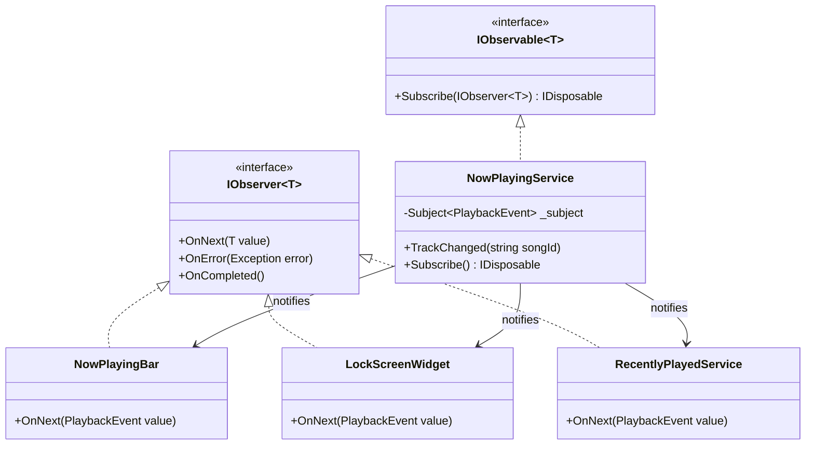
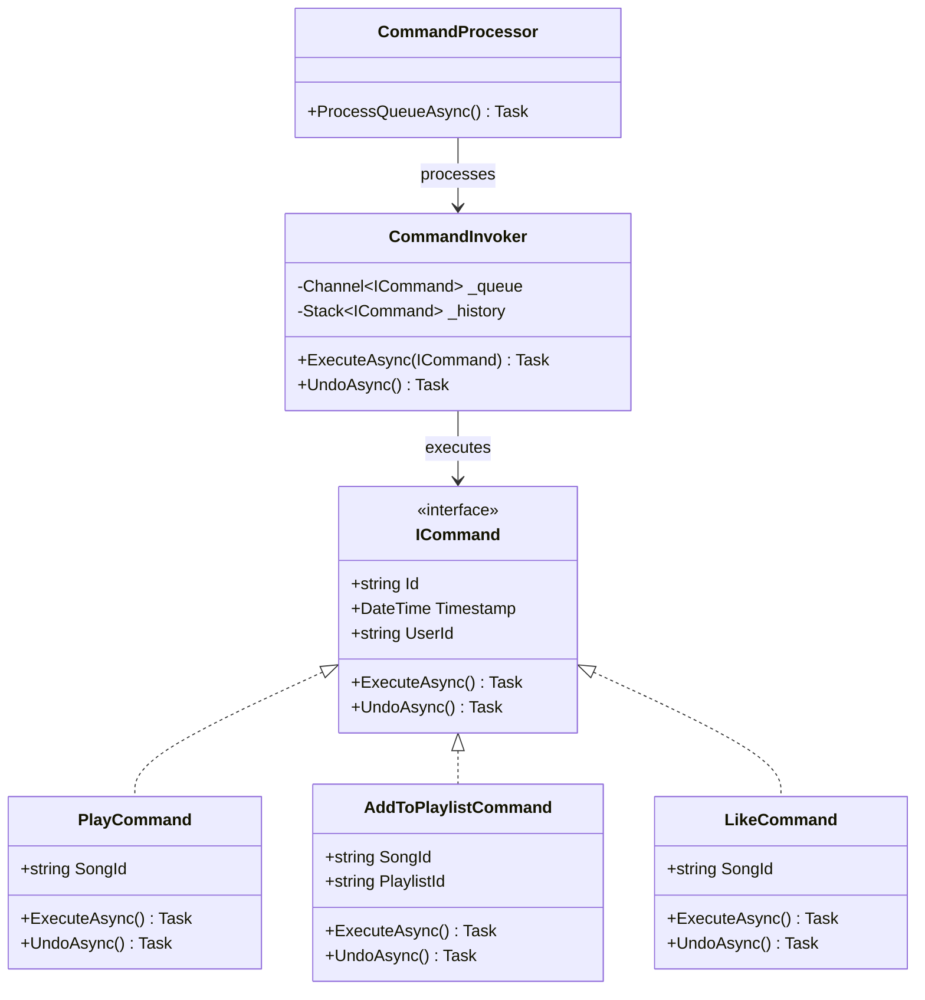
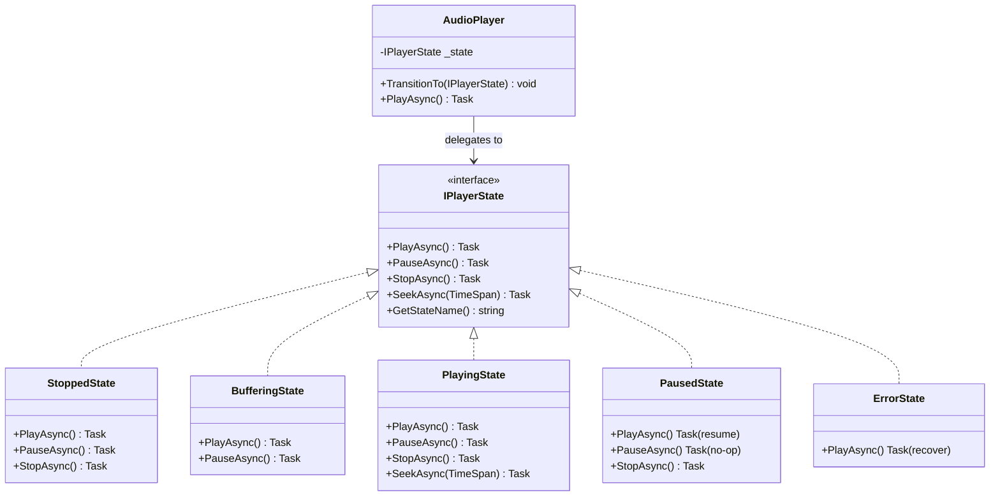
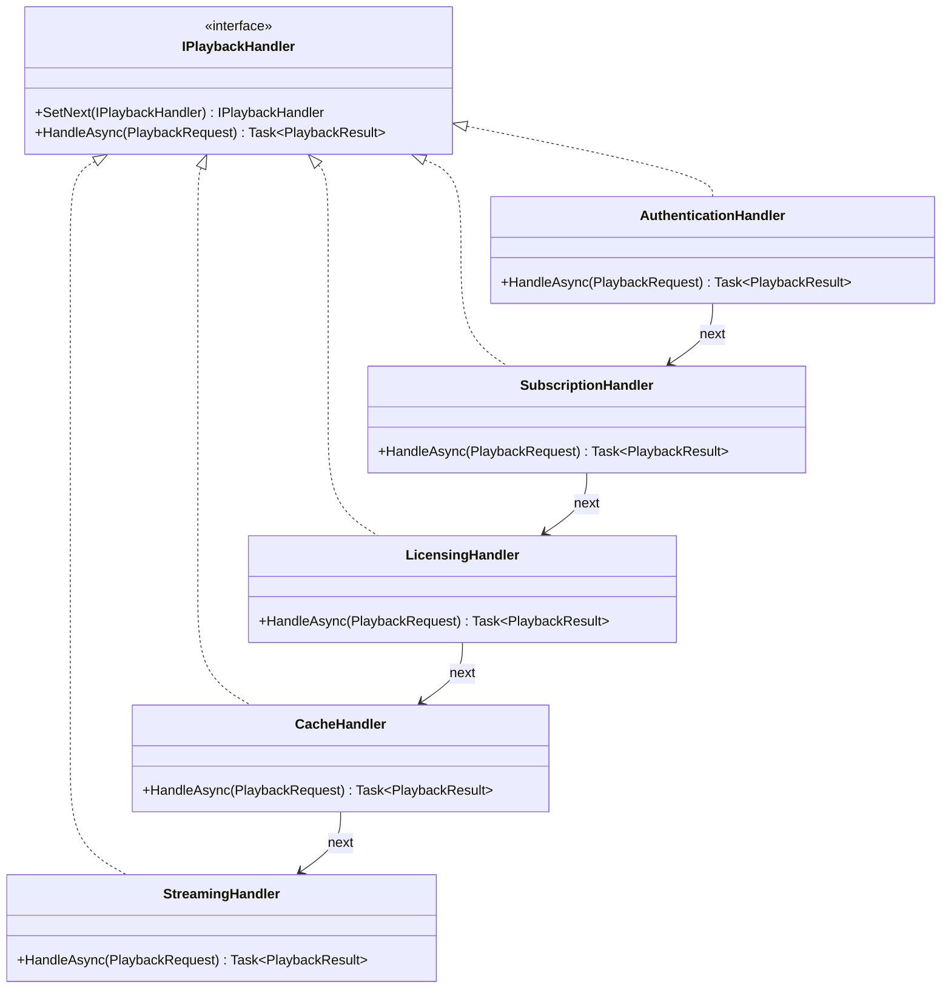
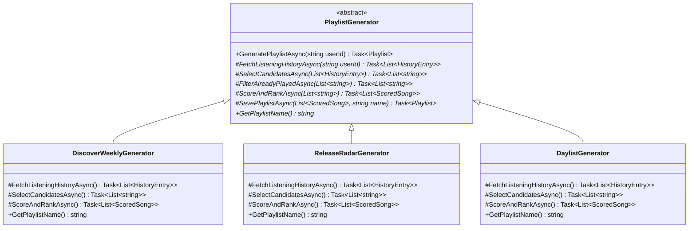
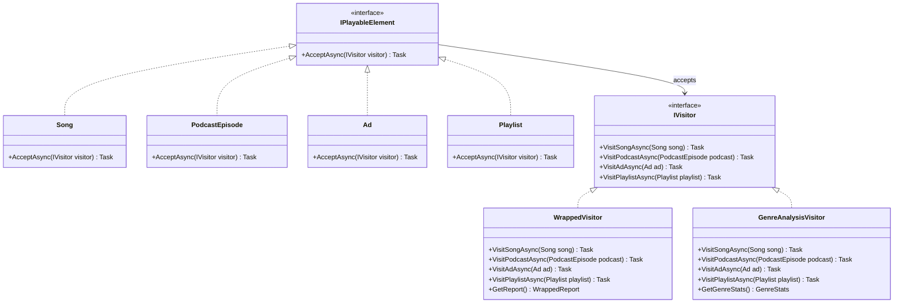

# Design Patterns: Part 4 - Behavioral Patterns Deep Dive
## How Spotify's Objects Communicate (The .NET 10 Way)

---

**Subtitle:**
Observer, Strategy, Command, State, Chain of Responsibility, Template Method, and Visitor—implemented with .NET 10, Reactive Programming, Entity Framework Core, and SPAP<T> patterns. Real Spotify code that's production-ready.

**Keywords:**
Behavioral Patterns, .NET 10, C# 13, Reactive Programming, Entity Framework Core, SPAP<T>, Observer Pattern, Strategy Pattern, Command Pattern, State Pattern, Chain of Responsibility, Template Method, Visitor Pattern, Spotify system design

---

## Introduction: Why .NET 10 Transforms Behavioral Design

**The Legacy Way:**
Traditional behavioral pattern examples show synchronous method calls and tight coupling. They ignore event-driven architectures, reactive streams, and the need for loose coupling in microservices.

**The .NET 10 Way:**
Behavioral patterns in modern Spotify would leverage:

- **Reactive Extensions (System.Reactive)** for event-based communication
- **IAsyncEnumerable** for streaming sequences
- **Channel<T>** for producer-consumer patterns
- **MediatR** for command/query separation
- **Source Generators** for reducing boilerplate
- **Entity Framework Core 10** with change tracking for state management

**Why Behavioral Patterns Matter for Spotify:**

| Challenge | Behavioral Pattern | .NET 10 Solution |
|-----------|-------------------|------------------|
| UI updates on state change | Observer | IObservable<T> + Subjects |
| Recommendation algorithms | Strategy | Strategy pattern + DI |
| User actions (play, pause) | Command | MediatR + Command objects |
| Playback behavior by state | State | State pattern + State machine |
| Request processing pipeline | Chain of Responsibility | Middleware pipeline |
| Playlist generation algorithm | Template Method | Abstract base classes |
| Analytics on object structure | Visitor | Visitor pattern + double dispatch |

Let's build Spotify's communication layer the right way—with modern .NET.

---

## Pattern 1: Observer Pattern
*"Notifying Dependents of State Changes"*

### What It Solves
When the currently playing song changes in Spotify, multiple components need to update: the Now Playing bar, the Lock Screen widget, the Recently Played list, and social media status. The Observer pattern lets the audio engine notify all dependents without knowing about them.

### The .NET 10 Implementation
Modern .NET features:
- **System.Reactive** for IObservable<T>/IObserver<T>
- **Subject<T>** for multicasting
- **SynchronizationContext** for UI thread marshaling
- **WeakReference** to prevent memory leaks

### The Structure



### The Code

```csharp
using System.Reactive.Linq;
using System.Reactive.Subjects;
using System.Reactive.Concurrency;
using Microsoft.EntityFrameworkCore;

namespace Spotify.Playback.Observer;

// ========== Event Types ==========

/// <summary>
/// Playback events that observers receive
/// </summary>
public record PlaybackEvent
{
    public required string EventId { get; init; } = Guid.NewGuid().ToString();
    public required EventType Type { get; init; }
    public required string UserId { get; init; }
    public string? SongId { get; init; }
    public string? PlaylistId { get; init; }
    public TimeSpan? Position { get; init; }
    public DateTime Timestamp { get; init; } = DateTime.UtcNow;
    public Dictionary<string, object>? Metadata { get; init; }
}

/// <summary>
/// Types of playback events
/// </summary>
public enum EventType
{
    SongStarted,
    SongPaused,
    SongResumed,
    SongSkipped,
    SongCompleted,
    PlaylistChanged,
    VolumeChanged,
    ShuffleModeChanged,
    RepeatModeChanged
}

// ========== Observable Subject ==========

/// <summary>
/// Service that emits playback events - the OBSERVABLE
/// WHY .NET 10: Using Subject<T> for multicasting to multiple observers
/// WHY REACTIVE: Built on IObservable pattern
/// </summary>
public class NowPlayingService : IObservable<PlaybackEvent>, IDisposable
{
    private readonly Subject<PlaybackEvent> _subject = new();
    private readonly ILogger<NowPlayingService> _logger;
    private readonly List<IDisposable> _subscriptions = new();
    
    // Expose as IObservable to prevent external OnNext calls
    public IObservable<PlaybackEvent> PlaybackEvents => _subject.AsObservable();
    
    public NowPlayingService(ILogger<NowPlayingService> logger)
    {
        _logger = logger;
    }
    
    /// <summary>
    /// Track when a song starts playing
    /// </summary>
    public void TrackSongStarted(string userId, string songId, string? playlistId = null)
    {
        var evt = new PlaybackEvent
        {
            Type = EventType.SongStarted,
            UserId = userId,
            SongId = songId,
            PlaylistId = playlistId,
            Position = TimeSpan.Zero,
            Metadata = new Dictionary<string, object> { ["source"] = playlistId != null ? "playlist" : "direct" }
        };
        
        _logger.LogInformation("Emitting SongStarted: {SongId} for {UserId}", songId, userId);
        _subject.OnNext(evt);
    }
    
    /// <summary>
    /// Track playback position updates
    /// </summary>
    public void TrackPosition(string userId, string songId, TimeSpan position)
    {
        // Not all observers care about position, so we could filter
        var evt = new PlaybackEvent
        {
            Type = EventType.SongStarted, // Reusing type, but could be dedicated
            UserId = userId,
            SongId = songId,
            Position = position
        };
        
        _subject.OnNext(evt);
    }
    
    /// <summary>
    /// Track when song is paused
    /// </summary>
    public void TrackPaused(string userId, string songId, TimeSpan position)
    {
        var evt = new PlaybackEvent
        {
            Type = EventType.SongPaused,
            UserId = userId,
            SongId = songId,
            Position = position
        };
        
        _subject.OnNext(evt);
    }
    
    /// <summary>
    /// Subscribe an observer - part of IObservable interface
    /// </summary>
    public IDisposable Subscribe(IObserver<PlaybackEvent> observer)
    {
        var subscription = _subject.Subscribe(observer);
        _subscriptions.Add(subscription);
        return subscription;
    }
    
    public void Dispose()
    {
        foreach (var sub in _subscriptions)
        {
            sub.Dispose();
        }
        _subject.Dispose();
    }
}

// ========== Observer: Now Playing Bar ==========

/// <summary>
/// Now Playing Bar UI component - an OBSERVER
/// </summary>
public class NowPlayingBar : IObserver<PlaybackEvent>, IDisposable
{
    private readonly string _componentName = "NowPlayingBar";
    private readonly IDisposable _subscription;
    private readonly ILogger<NowPlayingBar> _logger;
    
    // UI state
    private string? _currentSongId;
    private bool _isPlaying;
    private TimeSpan _currentPosition;
    
    public NowPlayingBar(NowPlayingService nowPlayingService, ILogger<NowPlayingBar> logger)
    {
        _logger = logger;
        
        // Subscribe to the observable
        _subscription = nowPlayingService.PlaybackEvents
            .ObserveOn(SynchronizationContext.Current!) // Ensure on UI thread
            .Subscribe(this);
        
        _logger.LogInformation("{Component} subscribed to playback events", _componentName);
    }
    
    /// <summary>
    /// Called when a new event arrives
    /// </summary>
    public void OnNext(PlaybackEvent value)
    {
        // Update UI based on event
        switch (value.Type)
        {
            case EventType.SongStarted:
                _currentSongId = value.SongId;
                _isPlaying = true;
                _currentPosition = value.Position ?? TimeSpan.Zero;
                _logger.LogInformation("{Component}: Now playing {SongId}", _componentName, value.SongId);
                UpdateDisplay();
                break;
                
            case EventType.SongPaused:
                _isPlaying = false;
                _currentPosition = value.Position ?? _currentPosition;
                _logger.LogInformation("{Component}: Paused at {Position}", _componentName, _currentPosition);
                UpdateDisplay();
                break;
                
            case EventType.SongResumed:
                _isPlaying = true;
                _logger.LogInformation("{Component}: Resumed", _componentName);
                UpdateDisplay();
                break;
                
            case EventType.SongCompleted:
                _currentSongId = null;
                _isPlaying = false;
                _currentPosition = TimeSpan.Zero;
                _logger.LogInformation("{Component}: Playback completed", _componentName);
                UpdateDisplay();
                break;
        }
    }
    
    public void OnError(Exception error)
    {
        _logger.LogError(error, "{Component} received error", _componentName);
    }
    
    public void OnCompleted()
    {
        _logger.LogInformation("{Component} stream completed", _componentName);
    }
    
    private void UpdateDisplay()
    {
        var status = _isPlaying ? "▶️" : "⏸️";
        var song = _currentSongId ?? "Nothing playing";
        Console.WriteLine($"[UI:{_componentName}] {status} {song} [{_currentPosition:mm\\:ss}]");
    }
    
    public void Dispose()
    {
        _subscription.Dispose();
        _logger.LogInformation("{Component} unsubscribed", _componentName);
    }
}

// ========== Observer: Lock Screen Widget ==========

/// <summary>
/// Lock Screen widget - another OBSERVER
/// </summary>
public class LockScreenWidget : IObserver<PlaybackEvent>, IDisposable
{
    private readonly string _componentName = "LockScreen";
    private readonly IDisposable _subscription;
    private readonly ILogger<LockScreenWidget> _logger;
    
    private string? _currentSongId;
    private bool _isPlaying;
    
    public LockScreenWidget(NowPlayingService nowPlayingService, ILogger<LockScreenWidget> logger)
    {
        _logger = logger;
        
        // Subscribe but filter to only relevant events
        _subscription = nowPlayingService.PlaybackEvents
            .Where(e => e.Type == EventType.SongStarted || 
                        e.Type == EventType.SongPaused ||
                        e.Type == EventType.SongCompleted)
            .ObserveOn(TaskPoolScheduler.Default) // Background thread for lock screen
            .Subscribe(this);
    }
    
    public void OnNext(PlaybackEvent value)
    {
        switch (value.Type)
        {
            case EventType.SongStarted:
                _currentSongId = value.SongId;
                _isPlaying = true;
                UpdateLockScreen();
                break;
                
            case EventType.SongPaused:
                _isPlaying = false;
                UpdateLockScreen();
                break;
                
            case EventType.SongCompleted:
                _currentSongId = null;
                _isPlaying = false;
                UpdateLockScreen();
                break;
        }
    }
    
    private void UpdateLockScreen()
    {
        // In real app, would update platform-specific lock screen
        _logger.LogInformation("[LockScreen] Updated: {Song} {Status}", 
            _currentSongId ?? "None", 
            _isPlaying ? "Playing" : "Paused");
    }
    
    public void OnError(Exception error) { }
    public void OnCompleted() { }
    
    public void Dispose() => _subscription.Dispose();
}

// ========== Observer: Recently Played Service ==========

/// <summary>
/// Service that updates recently played list - another OBSERVER
/// Uses EF Core to persist events
/// </summary>
public class RecentlyPlayedService : IObserver<PlaybackEvent>, IDisposable
{
    private readonly string _componentName = "RecentlyPlayed";
    private readonly IDisposable _subscription;
    private readonly PlaybackDbContext _dbContext;
    private readonly ILogger<RecentlyPlayedService> _logger;
    
    public RecentlyPlayedService(
        NowPlayingService nowPlayingService,
        PlaybackDbContext dbContext,
        ILogger<RecentlyPlayedService> logger)
    {
        _dbContext = dbContext;
        _logger = logger;
        
        // Only care about song completions and starts
        _subscription = nowPlayingService.PlaybackEvents
            .Where(e => e.Type == EventType.SongCompleted || e.Type == EventType.SongStarted)
            .Subscribe(this);
    }
    
    public async void OnNext(PlaybackEvent value)
    {
        try
        {
            // For SongStarted, we add to recently played with short delay
            // to avoid duplicates if user skips quickly
            if (value.Type == EventType.SongStarted && value.SongId != null)
            {
                // In real app, would add with debounce logic
                var historyEntry = new PlaybackHistory
                {
                    Id = Guid.NewGuid(),
                    UserId = value.UserId,
                    SongId = value.SongId,
                    PlayedAt = value.Timestamp,
                    PlaylistId = value.PlaylistId,
                    Duration = TimeSpan.Zero // Would update on complete
                };
                
                await _dbContext.PlaybackHistory.AddAsync(historyEntry);
                await _dbContext.SaveChangesAsync();
                
                _logger.LogInformation("[{Component}] Added {SongId} to history", _componentName, value.SongId);
            }
            
            // For SongCompleted, we update the duration
            if (value.Type == EventType.SongCompleted && value.SongId != null)
            {
                var lastEntry = await _dbContext.PlaybackHistory
                    .Where(h => h.UserId == value.UserId && h.SongId == value.SongId)
                    .OrderByDescending(h => h.PlayedAt)
                    .FirstOrDefaultAsync();
                
                if (lastEntry != null && value.Position.HasValue)
                {
                    lastEntry.Duration = value.Position.Value;
                    await _dbContext.SaveChangesAsync();
                    
                    _logger.LogInformation("[{Component}] Updated duration for {SongId}", _componentName, value.SongId);
                }
            }
        }
        catch (Exception ex)
        {
            _logger.LogError(ex, "Error handling playback event");
        }
    }
    
    public void OnError(Exception error) { }
    public void OnCompleted() { }
    
    public void Dispose() => _subscription.Dispose();
}

// ========== EF Core Entities ==========

public class PlaybackHistory
{
    public Guid Id { get; set; }
    public string UserId { get; set; } = string.Empty;
    public string SongId { get; set; } = string.Empty;
    public DateTime PlayedAt { get; set; }
    public TimeSpan Duration { get; set; }
    public string? PlaylistId { get; set; }
}

public class PlaybackDbContext : DbContext
{
    public DbSet<PlaybackHistory> PlaybackHistory => Set<PlaybackHistory>();
    
    public PlaybackDbContext(DbContextOptions<PlaybackDbContext> options) : base(options) { }
    
    protected override void OnModelCreating(ModelBuilder modelBuilder)
    {
        modelBuilder.Entity<PlaybackHistory>(entity =>
        {
            entity.HasKey(e => e.Id);
            entity.HasIndex(e => new { e.UserId, e.PlayedAt });
            entity.Property(e => e.Duration).HasConversion<long>();
        });
    }
}

// ========== Custom Observer with Debounce ==========

/// <summary>
/// Observer that debounces rapid events (e.g., skipping through songs)
/// </summary>
public class DebouncingObserver<T> : IObserver<T>
{
    private readonly IObserver<T> _inner;
    private readonly TimeSpan _threshold;
    private readonly IScheduler _scheduler;
    private T? _lastValue;
    private IDisposable? _timer;
    
    public DebouncingObserver(IObserver<T> inner, TimeSpan threshold, IScheduler scheduler)
    {
        _inner = inner;
        _threshold = threshold;
        _scheduler = scheduler;
    }
    
    public void OnNext(T value)
    {
        _lastValue = value;
        _timer?.Dispose();
        
        // Wait for threshold, then emit the last value
        _timer = _scheduler.Schedule(_threshold, () =>
        {
            if (_lastValue != null)
            {
                _inner.OnNext(_lastValue);
                _lastValue = default;
            }
        });
    }
    
    public void OnError(Exception error) => _inner.OnError(error);
    public void OnCompleted() => _inner.OnCompleted();
}

// ========== Extension Methods ==========

public static class ObservableExtensions
{
    /// <summary>
    /// Debounce operator - only emits after quiet period
    /// </summary>
    public static IObservable<T> Debounce<T>(this IObservable<T> source, TimeSpan threshold)
    {
        return Observable.Create<T>(observer =>
        {
            var debouncer = new DebouncingObserver<T>(observer, threshold, DefaultScheduler.Instance);
            return source.Subscribe(debouncer);
        });
    }
}

// ========== Usage Example ==========

public class ObserverPatternDemo
{
    public static async Task Main(string[] args)
    {
        Console.WriteLine("=== OBSERVER PATTERN DEMO ===\n");
        
        // Setup
        var services = new ServiceCollection();
        services.AddLogging(b => b.AddConsole().SetMinimumLevel(LogLevel.Information));
        
        var options = new DbContextOptionsBuilder<PlaybackDbContext>()
            .UseInMemoryDatabase("PlaybackDemo")
            .Options;
        services.AddSingleton(new PlaybackDbContext(options));
        
        services.AddSingleton<NowPlayingService>();
        services.AddSingleton<NowPlayingBar>();
        services.AddSingleton<LockScreenWidget>();
        services.AddSingleton<RecentlyPlayedService>();
        
        var provider = services.BuildServiceProvider();
        
        // Get services (this will trigger constructor subscriptions)
        var nowPlayingService = provider.GetRequiredService<NowPlayingService>();
        var nowPlayingBar = provider.GetRequiredService<NowPlayingBar>();
        var lockScreen = provider.GetRequiredService<LockScreenWidget>();
        var recentlyPlayed = provider.GetRequiredService<RecentlyPlayedService>();
        
        Console.WriteLine("\n--- Simulating playback events ---\n");
        
        // Simulate user playing songs
        nowPlayingService.TrackSongStarted("user-123", "song-1", "playlist-456");
        await Task.Delay(2000);
        
        nowPlayingService.TrackPaused("user-123", "song-1", TimeSpan.FromSeconds(45));
        await Task.Delay(1000);
        
        // Simulate SongStarted again (resume)
        nowPlayingService.TrackSongStarted("user-123", "song-1", "playlist-456");
        await Task.Delay(3000);
        
        // Complete the song
        nowPlayingService.TrackPaused("user-123", "song-1", TimeSpan.FromSeconds(180));
        // In real app, would emit SongCompleted
        
        // Play another song
        nowPlayingService.TrackSongStarted("user-123", "song-2");
        await Task.Delay(1000);
        
        // Demonstrate debouncing
        Console.WriteLine("\n--- Demonstrating Debounce Operator ---");
        var debounced = nowPlayingService.PlaybackEvents
            .Where(e => e.Type == EventType.SongStarted)
            .Debounce(TimeSpan.FromMilliseconds(500))
            .Subscribe(e => Console.WriteLine($"[Debounced] Finally processed: {e.SongId}"));
        
        // Rapid events (simulating skipping)
        nowPlayingService.TrackSongStarted("user-123", "song-3");
        await Task.Delay(100);
        nowPlayingService.TrackSongStarted("user-123", "song-4");
        await Task.Delay(100);
        nowPlayingService.TrackSongStarted("user-123", "song-5");
        await Task.Delay(600); // Wait for debounce
        
        Console.WriteLine("\n✅ Observer pattern demonstrated:");
        Console.WriteLine("  • NowPlayingService: Observable emitting events");
        Console.WriteLine("  • NowPlayingBar: Observer updating UI");
        Console.WriteLine("  • LockScreenWidget: Observer updating lock screen");
        Console.WriteLine("  • RecentlyPlayedService: Observer persisting to EF Core");
        Console.WriteLine("  • All observers receive events without coupling");
        Console.WriteLine("  • Rx operators (Where, Debounce) filter events");
        Console.WriteLine("  • Proper disposal prevents memory leaks");
        
        // Cleanup
        debounced.Dispose();
        nowPlayingBar.Dispose();
        lockScreen.Dispose();
        recentlyPlayed.Dispose();
        nowPlayingService.Dispose();
    }
}
```

### Why This Matters for Spotify (.NET Edition)
- **Loose Coupling:** Audio engine doesn't know about UI components
- **Reactive:** Built on IObservable<T> for composable event streams
- **Thread Safety:** ObserveOn ensures UI updates on correct thread
- **Memory Safety:** IDisposable pattern prevents leaks
- **Filtering:** Rx operators (Where, Debounce) reduce noise
- **Persistence:** EF Core integration for history tracking

---

## Pattern 2: Strategy Pattern
*"Interchangeable Algorithms"*

### What It Solves
Spotify's recommendation engine uses different algorithms based on context: new users get popularity-based recommendations, established users get collaborative filtering, and Discover Weekly uses neural networks. The Strategy pattern lets these algorithms be interchangeable.

### The .NET 10 Implementation
Modern .NET features:
- **Dependency Injection** for strategy selection
- **IAsyncEnumerable** for streaming recommendations
- **Options pattern** for algorithm configuration
- **Source Generators** for strategy registration

### The Structure

```mermaid
classDiagram
    class IRecommendationStrategy {
        <<interface>>
        +GetRecommendationsAsync(string userId, int count) IAsyncEnumerable~string~
        +StrategyName {get;}
    }
    class PopularityStrategy {
        +GetRecommendationsAsync() IAsyncEnumerable~string~
    }
    class CollaborativeFilteringStrategy {
        +GetRecommendationsAsync() IAsyncEnumerable~string~
    }
    class NeuralNetworkStrategy {
        +GetRecommendationsAsync() IAsyncEnumerable~string~
    }
    class RecommendationContext {
        -IRecommendationStrategy _strategy
        +SetStrategy(IRecommendationStrategy strategy)
        +GetRecommendationsAsync() IAsyncEnumerable~string~
    }
    class RecommendationEngine {
        -RecommendationContext _context
        -IStrategyFactory _factory
        +RecommendForUserAsync(string userId)
    }
    
    IRecommendationStrategy <|.. PopularityStrategy
    IRecommendationStrategy <|.. CollaborativeFilteringStrategy
    IRecommendationStrategy <|.. NeuralNetworkStrategy
    RecommendationContext --> IRecommendationStrategy : uses
    RecommendationEngine --> RecommendationContext : delegates
```

### The Code

```csharp
using System.Runtime.CompilerServices;
using Microsoft.EntityFrameworkCore;
using Microsoft.Extensions.Options;
using System.Threading.Channels;

namespace Spotify.Recommendations.Strategy;

// ========== Strategy Interface ==========

/// <summary>
/// Strategy interface for recommendation algorithms
/// </summary>
public interface IRecommendationStrategy
{
    /// <summary>
    /// Name of the strategy
    /// </summary>
    string StrategyName { get; }
    
    /// <summary>
    /// Get song recommendations for a user
    /// </summary>
    IAsyncEnumerable<string> GetRecommendationsAsync(
        string userId, 
        int count,
        CancellationToken cancellationToken = default);
    
    /// <summary>
    /// Whether this strategy applies to the user
    /// </summary>
    bool AppliesToUser(string userId, UserProfile profile);
}

// ========== User Profile ==========

/// <summary>
/// User profile for recommendation targeting
/// </summary>
public record UserProfile
{
    public required string UserId { get; init; }
    public int TotalPlays { get; init; }
    public int DaysSinceJoined { get; init; }
    public IReadOnlyList<string> RecentlyPlayed { get; init; } = Array.Empty<string>();
    public IReadOnlyDictionary<string, double> GenreAffinities { get; init; } = new Dictionary<string, double>();
    public bool IsNewUser => DaysSinceJoined < 7 || TotalPlays < 50;
}

// ========== Concrete Strategies ==========

/// <summary>
/// Strategy 1: Popularity-based (for new users)
/// </summary>
public class PopularityStrategy : IRecommendationStrategy
{
    private readonly ILogger<PopularityStrategy> _logger;
    private readonly IHttpClientFactory _httpClientFactory;
    
    public string StrategyName => "Popularity-Based";
    
    public PopularityStrategy(ILogger<PopularityStrategy> logger, IHttpClientFactory httpClientFactory)
    {
        _logger = logger;
        _httpClientFactory = httpClientFactory;
    }
    
    public bool AppliesToUser(string userId, UserProfile profile)
    {
        // New users or users with little history
        return profile.IsNewUser;
    }
    
    public async IAsyncEnumerable<string> GetRecommendationsAsync(
        string userId, 
        int count,
        [EnumeratorCancellation] CancellationToken cancellationToken = default)
    {
        _logger.LogInformation("[{Strategy}] Getting recommendations for user {UserId}", StrategyName, userId);
        
        // Simulate API call to get popular songs
        var client = _httpClientFactory.CreateClient("Recommendations");
        
        // In real app, would call a service
        var popularSongs = new[] { "song-1", "song-2", "song-3", "song-4", "song-5" };
        
        var returned = 0;
        foreach (var song in popularSongs.Take(count))
        {
            if (cancellationToken.IsCancellationRequested) yield break;
            
            yield return song;
            returned++;
            
            // Simulate streaming delay
            await Task.Delay(50, cancellationToken);
        }
        
        _logger.LogDebug("[{Strategy}] Returned {Count} recommendations", StrategyName, returned);
    }
}

/// <summary>
/// Strategy 2: Collaborative Filtering (users with history)
/// </summary>
public class CollaborativeFilteringStrategy : IRecommendationStrategy
{
    private readonly ILogger<CollaborativeFilteringStrategy> _logger;
    private readonly RecommendationDbContext _dbContext;
    
    public string StrategyName => "Collaborative Filtering";
    
    public CollaborativeFilteringStrategy(
        ILogger<CollaborativeFilteringStrategy> logger,
        RecommendationDbContext dbContext)
    {
        _logger = logger;
        _dbContext = dbContext;
    }
    
    public bool AppliesToUser(string userId, UserProfile profile)
    {
        // Users with moderate history
        return !profile.IsNewUser && profile.TotalPlays < 1000;
    }
    
    public async IAsyncEnumerable<string> GetRecommendationsAsync(
        string userId, 
        int count,
        [EnumeratorCancellation] CancellationToken cancellationToken = default)
    {
        _logger.LogInformation("[{Strategy}] Getting recommendations for user {UserId}", StrategyName, userId);
        
        // In real app, would run collaborative filtering SQL
        // SELECT song_id FROM user_similarity WHERE similar_user IN (...)
        
        var recommendations = new[] { "song-6", "song-7", "song-8", "song-9", "song-10" };
        
        foreach (var song in recommendations.Take(count))
        {
            if (cancellationToken.IsCancellationRequested) yield break;
            
            yield return song;
            await Task.Delay(30, cancellationToken);
        }
    }
}

/// <summary>
/// Strategy 3: Neural Network (for power users)
/// </summary>
public class NeuralNetworkStrategy : IRecommendationStrategy
{
    private readonly ILogger<NeuralNetworkStrategy> _logger;
    private readonly IOptions<NeuralNetworkOptions> _options;
    
    public string StrategyName => "Neural Network";
    
    public NeuralNetworkStrategy(
        ILogger<NeuralNetworkStrategy> logger,
        IOptions<NeuralNetworkOptions> options)
    {
        _logger = logger;
        _options = options;
    }
    
    public bool AppliesToUser(string userId, UserProfile profile)
    {
        // Heavy users get the advanced model
        return profile.TotalPlays >= 1000;
    }
    
    public async IAsyncEnumerable<string> GetRecommendationsAsync(
        string userId, 
        int count,
        [EnumeratorCancellation] CancellationToken cancellationToken = default)
    {
        _logger.LogInformation("[{Strategy}] Getting recommendations for user {UserId} (model: {Model})", 
            StrategyName, userId, _options.Value.ModelVersion);
        
        // Simulate ML model inference
        await Task.Delay(200, cancellationToken); // Model loading
        
        var recommendations = new[] { "song-11", "song-12", "song-13", "song-14", "song-15" };
        
        foreach (var song in recommendations.Take(count))
        {
            if (cancellationToken.IsCancellationRequested) yield break;
            
            yield return song;
            await Task.Delay(20, cancellationToken);
        }
    }
}

/// <summary>
/// Options for neural network strategy
/// </summary>
public class NeuralNetworkOptions
{
    public string ModelVersion { get; set; } = "v2.3";
    public int BatchSize { get; set; } = 32;
    public bool UseGpu { get; set; } = true;
}

// ========== Strategy Context ==========

/// <summary>
/// Context that uses the selected strategy
/// </summary>
public class RecommendationContext
{
    private IRecommendationStrategy? _currentStrategy;
    private readonly ILogger<RecommendationContext> _logger;
    
    public IRecommendationStrategy? CurrentStrategy => _currentStrategy;
    
    public RecommendationContext(ILogger<RecommendationContext> logger)
    {
        _logger = logger;
    }
    
    /// <summary>
    /// Set the strategy at runtime
    /// </summary>
    public void SetStrategy(IRecommendationStrategy strategy)
    {
        _currentStrategy = strategy;
        _logger.LogDebug("Strategy set to: {Strategy}", strategy.StrategyName);
    }
    
    /// <summary>
    /// Execute the current strategy
    /// </summary>
    public IAsyncEnumerable<string> GetRecommendationsAsync(
        string userId, 
        int count,
        CancellationToken cancellationToken = default)
    {
        if (_currentStrategy == null)
        {
            throw new InvalidOperationException("No strategy set");
        }
        
        return _currentStrategy.GetRecommendationsAsync(userId, count, cancellationToken);
    }
}

// ========== Strategy Factory with SPAP<T> ==========

/// <summary>
/// Factory that creates and selects appropriate strategies
/// </summary>
public class StrategyFactory
{
    private readonly IEnumerable<IRecommendationStrategy> _strategies;
    private readonly ILogger<StrategyFactory> _logger;
    private readonly Channel<IRecommendationStrategy> _strategyPool;
    
    public StrategyFactory(
        IEnumerable<IRecommendationStrategy> strategies,
        ILogger<StrategyFactory> logger)
    {
        _strategies = strategies;
        _logger = logger;
        
        // Create pool for strategy reuse
        _strategyPool = Channel.CreateBounded<IRecommendationStrategy>(
            new BoundedChannelOptions(10)
            {
                FullMode = BoundedChannelFullMode.Wait
            });
    }
    
    /// <summary>
    /// Select the best strategy for a user
    /// </summary>
    public IRecommendationStrategy SelectStrategyForUser(string userId, UserProfile profile)
    {
        var strategy = _strategies.FirstOrDefault(s => s.AppliesToUser(userId, profile));
        
        if (strategy == null)
        {
            _logger.LogWarning("No strategy applies to user {UserId}, using default", userId);
            strategy = _strategies.First(); // Default to first
        }
        
        _logger.LogInformation("Selected {Strategy} for user {UserId}", strategy.StrategyName, userId);
        return strategy;
    }
    
    /// <summary>
    /// Rent a strategy from the pool (SPAP)
    /// </summary>
    public async ValueTask<PooledStrategy> RentStrategyAsync(
        string userId, 
        UserProfile profile,
        CancellationToken cancellationToken = default)
    {
        var strategy = SelectStrategyForUser(userId, profile);
        
        // In real app, would pool strategy instances
        return new PooledStrategy(this, strategy);
    }
    
    /// <summary>
    /// Return strategy to pool
    /// </summary>
    private void ReturnStrategy(IRecommendationStrategy strategy)
    {
        // Non-blocking return
        _strategyPool.Writer.TryWrite(strategy);
    }
    
    /// <summary>
    /// Disposable pooled strategy wrapper
    /// </summary>
    public readonly struct PooledStrategy : IDisposable
    {
        private readonly StrategyFactory _factory;
        public readonly IRecommendationStrategy Strategy;
        
        public PooledStrategy(StrategyFactory factory, IRecommendationStrategy strategy)
        {
            _factory = factory;
            Strategy = strategy;
        }
        
        public void Dispose()
        {
            _factory.ReturnStrategy(Strategy);
        }
    }
}

// ========== Recommendation Engine ==========

/// <summary>
/// Engine that uses strategies to recommend songs
/// </summary>
public class RecommendationEngine
{
    private readonly RecommendationContext _context;
    private readonly StrategyFactory _factory;
    private readonly IUserProfileRepository _profileRepository;
    private readonly ILogger<RecommendationEngine> _logger;
    
    public RecommendationEngine(
        RecommendationContext context,
        StrategyFactory factory,
        IUserProfileRepository profileRepository,
        ILogger<RecommendationEngine> logger)
    {
        _context = context;
        _factory = factory;
        _profileRepository = profileRepository;
        _logger = logger;
    }
    
    /// <summary>
    /// Get recommendations for a user (selects strategy automatically)
    /// </summary>
    public async IAsyncEnumerable<string> RecommendForUserAsync(
        string userId,
        int count = 10,
        [EnumeratorCancellation] CancellationToken cancellationToken = default)
    {
        // Get user profile
        var profile = await _profileRepository.GetUserProfileAsync(userId, cancellationToken);
        
        // Select and set strategy
        using var pooled = await _factory.RentStrategyAsync(userId, profile, cancellationToken);
        _context.SetStrategy(pooled.Strategy);
        
        _logger.LogInformation("Engine using {Strategy} for user {UserId}", 
            pooled.Strategy.StrategyName, userId);
        
        // Get recommendations using the strategy
        await foreach (var song in _context.GetRecommendationsAsync(userId, count, cancellationToken))
        {
            yield return song;
        }
    }
    
    /// <summary>
    /// Get recommendations with explicit strategy override
    /// </summary>
    public async IAsyncEnumerable<string> RecommendWithStrategyAsync(
        string userId,
        string strategyName,
        int count = 10,
        [EnumeratorCancellation] CancellationToken cancellationToken = default)
    {
        var strategy = _factory.SelectStrategyForUser(userId, await _profileRepository.GetUserProfileAsync(userId, cancellationToken));
        
        // In real app, would find by name
        _context.SetStrategy(strategy);
        
        await foreach (var song in _context.GetRecommendationsAsync(userId, count, cancellationToken))
        {
            yield return song;
        }
    }
}

// ========== EF Core Entities ==========

public class UserListeningHistory
{
    public int Id { get; set; }
    public string UserId { get; set; } = string.Empty;
    public string SongId { get; set; } = string.Empty;
    public DateTime PlayedAt { get; set; }
    public int PlayCount { get; set; }
}

public class SongSimilarity
{
    public int Id { get; set; }
    public string SongId1 { get; set; } = string.Empty;
    public string SongId2 { get; set; } = string.Empty;
    public double SimilarityScore { get; set; }
}

public class RecommendationDbContext : DbContext
{
    public DbSet<UserListeningHistory> ListeningHistory => Set<UserListeningHistory>();
    public DbSet<SongSimilarity> SongSimilarities => Set<SongSimilarity>();
    
    public RecommendationDbContext(DbContextOptions<RecommendationDbContext> options) : base(options) { }
    
    protected override void OnModelCreating(ModelBuilder modelBuilder)
    {
        modelBuilder.Entity<SongSimilarity>(entity =>
        {
            entity.HasKey(e => e.Id);
            entity.HasIndex(e => new { e.SongId1, e.SongId2 });
        });
    }
}

// ========== Repository ==========

public interface IUserProfileRepository
{
    Task<UserProfile> GetUserProfileAsync(string userId, CancellationToken ct);
}

public class UserProfileRepository : IUserProfileRepository
{
    private readonly RecommendationDbContext _dbContext;
    
    public UserProfileRepository(RecommendationDbContext dbContext)
    {
        _dbContext = dbContext;
    }
    
    public async Task<UserProfile> GetUserProfileAsync(string userId, CancellationToken ct)
    {
        // Get listening history
        var history = await _dbContext.ListeningHistory
            .Where(h => h.UserId == userId)
            .ToListAsync(ct);
        
        var totalPlays = history.Sum(h => h.PlayCount);
        var firstPlay = history.MinBy(h => h.PlayedAt);
        var daysSinceJoined = firstPlay != null 
            ? (DateTime.UtcNow - firstPlay.PlayedAt).Days 
            : 0;
        
        // Simple genre affinities (would be more complex in reality)
        var genreAffinities = new Dictionary<string, double>
        {
            ["rock"] = 0.8,
            ["pop"] = 0.6,
            ["hip-hop"] = 0.3
        };
        
        return new UserProfile
        {
            UserId = userId,
            TotalPlays = totalPlays,
            DaysSinceJoined = daysSinceJoined,
            RecentlyPlayed = history.OrderByDescending(h => h.PlayedAt)
                .Take(10)
                .Select(h => h.SongId)
                .ToList(),
            GenreAffinities = genreAffinities
        };
    }
}

// ========== Usage Example ==========

public class StrategyPatternDemo
{
    public static async Task Main(string[] args)
    {
        Console.WriteLine("=== STRATEGY PATTERN DEMO ===\n");
        
        // Setup
        var services = new ServiceCollection();
        services.AddLogging(b => b.AddConsole().SetMinimumLevel(LogLevel.Information));
        services.AddHttpClient();
        
        // Configure options
        services.Configure<NeuralNetworkOptions>(options =>
        {
            options.ModelVersion = "v2.5";
            options.UseGpu = true;
        });
        
        // DbContext
        var options = new DbContextOptionsBuilder<RecommendationDbContext>()
            .UseInMemoryDatabase("RecDemo")
            .Options;
        services.AddSingleton(new RecommendationDbContext(options));
        
        // Register strategies
        services.AddSingleton<IRecommendationStrategy, PopularityStrategy>();
        services.AddSingleton<IRecommendationStrategy, CollaborativeFilteringStrategy>();
        services.AddSingleton<IRecommendationStrategy, NeuralNetworkStrategy>();
        
        // Register other services
        services.AddSingleton<StrategyFactory>();
        services.AddSingleton<RecommendationContext>();
        services.AddSingleton<IUserProfileRepository, UserProfileRepository>();
        services.AddSingleton<RecommendationEngine>();
        
        var provider = services.BuildServiceProvider();
        
        // Seed some data
        var dbContext = provider.GetRequiredService<RecommendationDbContext>();
        dbContext.ListeningHistory.AddRange(
            new UserListeningHistory { UserId = "new-user", SongId = "song-1", PlayedAt = DateTime.UtcNow.AddDays(-1), PlayCount = 5 },
            new UserListeningHistory { UserId = "active-user", SongId = "song-2", PlayedAt = DateTime.UtcNow.AddDays(-30), PlayCount = 500 },
            new UserListeningHistory { UserId = "power-user", SongId = "song-3", PlayedAt = DateTime.UtcNow.AddDays(-365), PlayCount = 5000 }
        );
        await dbContext.SaveChangesAsync();
        
        var engine = provider.GetRequiredService<RecommendationEngine>();
        
        // Test different users - each gets appropriate strategy
        Console.WriteLine("\n--- New User (Popularity Strategy) ---");
        await foreach (var song in engine.RecommendForUserAsync("new-user", 3))
        {
            Console.WriteLine($"  Recommended: {song}");
        }
        
        Console.WriteLine("\n--- Active User (Collaborative Filtering) ---");
        await foreach (var song in engine.RecommendForUserAsync("active-user", 3))
        {
            Console.WriteLine($"  Recommended: {song}");
        }
        
        Console.WriteLine("\n--- Power User (Neural Network) ---");
        await foreach (var song in engine.RecommendForUserAsync("power-user", 3))
        {
            Console.WriteLine($"  Recommended: {song}");
        }
        
        // Demonstrate strategy swapping at runtime
        Console.WriteLine("\n--- Manual Strategy Override ---");
        var context = provider.GetRequiredService<RecommendationContext>();
        var popularityStrategy = provider.GetServices<IRecommendationStrategy>()
            .First(s => s is PopularityStrategy);
        
        context.SetStrategy(popularityStrategy);
        Console.WriteLine("Forcing popularity strategy for power user:");
        
        await foreach (var song in context.GetRecommendationsAsync("power-user", 3))
        {
            Console.WriteLine($"  Recommended: {song}");
        }
        
        Console.WriteLine("\n✅ Strategy pattern demonstrated:");
        Console.WriteLine("  • IRecommendationStrategy: Common interface");
        Console.WriteLine("  • PopularityStrategy: For new users");
        Console.WriteLine("  • CollaborativeFilteringStrategy: For active users");
        Console.WriteLine("  • NeuralNetworkStrategy: For power users");
        Console.WriteLine("  • RecommendationContext: Uses current strategy");
        Console.WriteLine("  • StrategyFactory: Selects appropriate strategy");
        Console.WriteLine("  • Strategies interchangeable at runtime");
    }
}
```

### Why This Matters for Spotify (.NET Edition)
- **Algorithm Swapping:** Different users get different recommendation algorithms
- **Open/Closed:** New strategies added without changing existing code
- **Dependency Injection:** Strategies composed via DI
- **EF Core Integration:** Strategies can query database
- **SPAP<T>:** Strategy pooling for reuse
- **IAsyncEnumerable:** Streaming recommendations efficiently

---

## Pattern 3: Command Pattern
*"Encapsulating Requests as Objects"*

### What It Solves
Every user action in Spotify (Play, Pause, Skip, Like, Add to Playlist) can be encapsulated as a Command object. This enables undo/redo, action queuing for offline mode, and audit logging.

### The .NET 10 Implementation
Modern .NET features:
- **MediatR** for command handling
- **Channel<T>** for command queuing
- **Polly** for retry policies
- **EF Core** for command persistence

### The Structure



### The Code

```csharp
using System.Threading.Channels;
using Microsoft.EntityFrameworkCore;
using System.Text.Json;
using Polly;
using Polly.Retry;

namespace Spotify.Commands;

// ========== Command Interface ==========

/// <summary>
/// Command interface - encapsulates an action
/// </summary>
public interface ICommand
{
    /// <summary>
    /// Unique command ID
    /// </summary>
    string Id { get; }
    
    /// <summary>
    /// When command was created
    /// </summary>
    DateTime Timestamp { get; }
    
    /// <summary>
    /// User who initiated the command
    /// </summary>
    string UserId { get; }
    
    /// <summary>
    /// Command type (for serialization)
    /// </summary>
    string CommandType { get; }
    
    /// <summary>
    /// Execute the command
    /// </summary>
    Task ExecuteAsync(CancellationToken cancellationToken = default);
    
    /// <summary>
    /// Undo the command (if supported)
    /// </summary>
    Task UndoAsync(CancellationToken cancellationToken = default);
    
    /// <summary>
    /// Whether this command can be undone
    /// </summary>
    bool CanUndo { get; }
}

// ========== Concrete Commands ==========

/// <summary>
/// Command to play a song
/// </summary>
public class PlayCommand : ICommand
{
    public string Id { get; } = Guid.NewGuid().ToString();
    public DateTime Timestamp { get; } = DateTime.UtcNow;
    public string UserId { get; }
    public string CommandType => nameof(PlayCommand);
    public bool CanUndo => false; // Can't undo play
    
    public string SongId { get; }
    public string? PlaylistId { get; }
    public TimeSpan? StartPosition { get; }
    
    private readonly IPlaybackService _playbackService;
    private readonly ILogger<PlayCommand> _logger;
    
    public PlayCommand(
        string userId, 
        string songId, 
        string? playlistId,
        TimeSpan? startPosition,
        IPlaybackService playbackService,
        ILogger<PlayCommand> logger)
    {
        UserId = userId;
        SongId = songId;
        PlaylistId = playlistId;
        StartPosition = startPosition;
        _playbackService = playbackService;
        _logger = logger;
    }
    
    public async Task ExecuteAsync(CancellationToken cancellationToken = default)
    {
        _logger.LogInformation("Executing PlayCommand: {SongId} for {UserId}", SongId, UserId);
        await _playbackService.PlayAsync(UserId, SongId, PlaylistId, StartPosition, cancellationToken);
    }
    
    public Task UndoAsync(CancellationToken cancellationToken = default)
    {
        throw new NotSupportedException("Play command cannot be undone");
    }
}

/// <summary>
/// Command to add a song to a playlist
/// </summary>
public class AddToPlaylistCommand : ICommand
{
    public string Id { get; } = Guid.NewGuid().ToString();
    public DateTime Timestamp { get; } = DateTime.UtcNow;
    public string UserId { get; }
    public string CommandType => nameof(AddToPlaylistCommand);
    public bool CanUndo => true;
    
    public string SongId { get; }
    public string PlaylistId { get; }
    public int? Position { get; }
    
    private readonly IPlaylistRepository _playlistRepository;
    private readonly ILogger<AddToPlaylistCommand> _logger;
    private string? _addedEntryId;
    
    public AddToPlaylistCommand(
        string userId,
        string songId,
        string playlistId,
        int? position,
        IPlaylistRepository playlistRepository,
        ILogger<AddToPlaylistCommand> logger)
    {
        UserId = userId;
        SongId = songId;
        PlaylistId = playlistId;
        Position = position;
        _playlistRepository = playlistRepository;
        _logger = logger;
    }
    
    public async Task ExecuteAsync(CancellationToken cancellationToken = default)
    {
        _logger.LogInformation("Executing AddToPlaylistCommand: {SongId} to {PlaylistId}", SongId, PlaylistId);
        
        var entryId = await _playlistRepository.AddSongAsync(
            PlaylistId, SongId, Position, cancellationToken);
        
        _addedEntryId = entryId;
    }
    
    public async Task UndoAsync(CancellationToken cancellationToken = default)
    {
        if (_addedEntryId == null)
        {
            throw new InvalidOperationException("Cannot undo command that hasn't been executed");
        }
        
        _logger.LogInformation("Undoing AddToPlaylistCommand: {SongId} from {PlaylistId}", SongId, PlaylistId);
        await _playlistRepository.RemoveSongAsync(PlaylistId, _addedEntryId, cancellationToken);
    }
}

/// <summary>
/// Command to like a song
/// </summary>
public class LikeCommand : ICommand
{
    public string Id { get; } = Guid.NewGuid().ToString();
    public DateTime Timestamp { get; } = DateTime.UtcNow;
    public string UserId { get; }
    public string CommandType => nameof(LikeCommand);
    public bool CanUndo => true;
    
    public string SongId { get; }
    public bool Like { get; } // true = like, false = remove like
    
    private readonly IUserLibraryRepository _libraryRepository;
    private readonly ILogger<LikeCommand> _logger;
    
    public LikeCommand(
        string userId,
        string songId,
        bool like,
        IUserLibraryRepository libraryRepository,
        ILogger<LikeCommand> logger)
    {
        UserId = userId;
        SongId = songId;
        Like = like;
        _libraryRepository = libraryRepository;
        _logger = logger;
    }
    
    public async Task ExecuteAsync(CancellationToken cancellationToken = default)
    {
        _logger.LogInformation("Executing LikeCommand: {SongId} (like={Like})", SongId, Like);
        
        if (Like)
        {
            await _libraryRepository.AddLikedSongAsync(UserId, SongId, cancellationToken);
        }
        else
        {
            await _libraryRepository.RemoveLikedSongAsync(UserId, SongId, cancellationToken);
        }
    }
    
    public async Task UndoAsync(CancellationToken cancellationToken = default)
    {
        _logger.LogInformation("Undoing LikeCommand: {SongId}", SongId);
        
        // Reverse the like
        if (Like)
        {
            await _libraryRepository.RemoveLikedSongAsync(UserId, SongId, cancellationToken);
        }
        else
        {
            await _libraryRepository.AddLikedSongAsync(UserId, SongId, cancellationToken);
        }
    }
}

// ========== Command Invoker ==========

/// <summary>
/// Invoker that executes commands and maintains history
/// </summary>
public class CommandInvoker : IDisposable
{
    private readonly Stack<ICommand> _history = new();
    private readonly Stack<ICommand> _redoStack = new();
    private readonly Channel<ICommand> _commandQueue;
    private readonly ILogger<CommandInvoker> _logger;
    private readonly AsyncRetryPolicy _retryPolicy;
    private readonly List<Task> _processingTasks = new();
    private readonly CancellationTokenSource _cts = new();
    
    public IReadOnlyCollection<ICommand> History => _history.ToList().AsReadOnly();
    
    public CommandInvoker(ILogger<CommandInvoker> logger)
    {
        _logger = logger;
        
        // Channel for async command processing
        _commandQueue = Channel.CreateBounded<ICommand>(
            new BoundedChannelOptions(100)
            {
                FullMode = BoundedChannelFullMode.Wait,
                SingleWriter = false,
                SingleReader = true
            });
        
        // Retry policy for transient failures
        _retryPolicy = Policy.Handle<HttpRequestException>()
            .WaitAndRetryAsync(3, retry => TimeSpan.FromMilliseconds(100 * Math.Pow(2, retry)));
        
        // Start background processor
        _processingTasks.Add(ProcessQueueAsync(_cts.Token));
    }
    
    /// <summary>
    /// Execute a command synchronously (for immediate actions)
    /// </summary>
    public async Task ExecuteAsync(ICommand command, CancellationToken cancellationToken = default)
    {
        _logger.LogDebug("Executing command: {CommandType} ({CommandId})", command.CommandType, command.Id);
        
        await _retryPolicy.ExecuteAsync(async ct =>
        {
            await command.ExecuteAsync(ct);
        }, cancellationToken);
        
        if (command.CanUndo)
        {
            _history.Push(command);
            _redoStack.Clear(); // Clear redo stack on new command
        }
        
        _logger.LogInformation("Command executed: {CommandType}", command.CommandType);
    }
    
    /// <summary>
    /// Queue a command for async execution (for offline mode)
    /// </summary>
    public async ValueTask QueueAsync(ICommand command, CancellationToken cancellationToken = default)
    {
        _logger.LogDebug("Queueing command: {CommandType}", command.CommandType);
        await _commandQueue.Writer.WriteAsync(command, cancellationToken);
    }
    
    /// <summary>
    /// Undo the last command
    /// </summary>
    public async Task UndoAsync(CancellationToken cancellationToken = default)
    {
        if (_history.Count == 0)
        {
            _logger.LogWarning("Nothing to undo");
            return;
        }
        
        var command = _history.Pop();
        _logger.LogInformation("Undoing command: {CommandType}", command.CommandType);
        
        await _retryPolicy.ExecuteAsync(async ct =>
        {
            await command.UndoAsync(ct);
        }, cancellationToken);
        
        _redoStack.Push(command);
    }
    
    /// <summary>
    /// Redo a previously undone command
    /// </summary>
    public async Task RedoAsync(CancellationToken cancellationToken = default)
    {
        if (_redoStack.Count == 0)
        {
            _logger.LogWarning("Nothing to redo");
            return;
        }
        
        var command = _redoStack.Pop();
        _logger.LogInformation("Redoing command: {CommandType}", command.CommandType);
        
        await _retryPolicy.ExecuteAsync(async ct =>
        {
            await command.ExecuteAsync(ct);
        }, cancellationToken);
        
        _history.Push(command);
    }
    
    /// <summary>
    /// Background processor for queued commands
    /// </summary>
    private async Task ProcessQueueAsync(CancellationToken cancellationToken)
    {
        _logger.LogInformation("Command processor started");
        
        try
        {
            await foreach (var command in _commandQueue.Reader.ReadAllAsync(cancellationToken))
            {
                try
                {
                    await ExecuteAsync(command, cancellationToken);
                }
                catch (Exception ex)
                {
                    _logger.LogError(ex, "Failed to process queued command {CommandId}", command.Id);
                    // In real app, would move to dead letter queue
                }
            }
        }
        catch (OperationCanceledException)
        {
            _logger.LogInformation("Command processor stopped");
        }
    }
    
    public void Dispose()
    {
        _cts.Cancel();
        Task.WaitAll(_processingTasks.ToArray(), TimeSpan.FromSeconds(5));
        _cts.Dispose();
    }
}

// ========== EF Core Entities for Command Logging ==========

public class CommandLog
{
    public int Id { get; set; }
    public string CommandId { get; set; } = string.Empty;
    public string CommandType { get; set; } = string.Empty;
    public string UserId { get; set; } = string.Empty;
    public string Data { get; set; } = string.Empty; // JSON serialized command data
    public DateTime ExecutedAt { get; set; }
    public bool WasUndone { get; set; }
    public DateTime? UndoneAt { get; set; }
}

public class CommandDbContext : DbContext
{
    public DbSet<CommandLog> CommandLogs => Set<CommandLog>();
    
    public CommandDbContext(DbContextOptions<CommandDbContext> options) : base(options) { }
    
    protected override void OnModelCreating(ModelBuilder modelBuilder)
    {
        modelBuilder.Entity<CommandLog>(entity =>
        {
            entity.HasKey(e => e.Id);
            entity.HasIndex(e => e.CommandId).IsUnique();
            entity.HasIndex(e => e.UserId);
        });
    }
}

// ========== Command Logger (Middleware) ==========

/// <summary>
/// Decorator that logs commands to database
/// </summary>
public class LoggingCommandDecorator : ICommand
{
    private readonly ICommand _inner;
    private readonly CommandDbContext _dbContext;
    private readonly ILogger<LoggingCommandDecorator> _logger;
    
    public string Id => _inner.Id;
    public DateTime Timestamp => _inner.Timestamp;
    public string UserId => _inner.UserId;
    public string CommandType => _inner.CommandType;
    public bool CanUndo => _inner.CanUndo;
    
    public LoggingCommandDecorator(
        ICommand inner,
        CommandDbContext dbContext,
        ILogger<LoggingCommandDecorator> logger)
    {
        _inner = inner;
        _dbContext = dbContext;
        _logger = logger;
    }
    
    public async Task ExecuteAsync(CancellationToken cancellationToken = default)
    {
        await _inner.ExecuteAsync(cancellationToken);
        
        // Log to database
        var log = new CommandLog
        {
            CommandId = Id,
            CommandType = CommandType,
            UserId = UserId,
            Data = JsonSerializer.Serialize(_inner, _inner.GetType()),
            ExecutedAt = DateTime.UtcNow
        };
        
        await _dbContext.CommandLogs.AddAsync(log, cancellationToken);
        await _dbContext.SaveChangesAsync(cancellationToken);
        
        _logger.LogDebug("Logged command {CommandId} to database", Id);
    }
    
    public async Task UndoAsync(CancellationToken cancellationToken = default)
    {
        await _inner.UndoAsync(cancellationToken);
        
        // Update log
        var log = await _dbContext.CommandLogs
            .FirstOrDefaultAsync(l => l.CommandId == Id, cancellationToken);
        
        if (log != null)
        {
            log.WasUndone = true;
            log.UndoneAt = DateTime.UtcNow;
            await _dbContext.SaveChangesAsync(cancellationToken);
        }
    }
}

// ========== Repository Interfaces ==========

public interface IPlaybackService
{
    Task PlayAsync(string userId, string songId, string? playlistId, TimeSpan? startPosition, CancellationToken ct);
}

public interface IPlaylistRepository
{
    Task<string> AddSongAsync(string playlistId, string songId, int? position, CancellationToken ct);
    Task<bool> RemoveSongAsync(string playlistId, string entryId, CancellationToken ct);
}

public interface IUserLibraryRepository
{
    Task AddLikedSongAsync(string userId, string songId, CancellationToken ct);
    Task RemoveLikedSongAsync(string userId, string songId, CancellationToken ct);
}

// ========== Mock Services ==========

public class MockPlaybackService : IPlaybackService
{
    private readonly ILogger<MockPlaybackService> _logger;
    
    public MockPlaybackService(ILogger<MockPlaybackService> logger) => _logger = logger;
    
    public Task PlayAsync(string userId, string songId, string? playlistId, TimeSpan? startPosition, CancellationToken ct)
    {
        _logger.LogInformation("[Playback] Playing {SongId} for {UserId}", songId, userId);
        return Task.CompletedTask;
    }
}

public class MockPlaylistRepository : IPlaylistRepository
{
    private readonly ILogger<MockPlaylistRepository> _logger;
    private int _nextId = 1;
    
    public MockPlaylistRepository(ILogger<MockPlaylistRepository> logger) => _logger = logger;
    
    public Task<string> AddSongAsync(string playlistId, string songId, int? position, CancellationToken ct)
    {
        var entryId = $"entry-{_nextId++}";
        _logger.LogInformation("[Playlist] Added {SongId} to {PlaylistId} as {EntryId}", songId, playlistId, entryId);
        return Task.FromResult(entryId);
    }
    
    public Task<bool> RemoveSongAsync(string playlistId, string entryId, CancellationToken ct)
    {
        _logger.LogInformation("[Playlist] Removed {EntryId} from {PlaylistId}", entryId, playlistId);
        return Task.FromResult(true);
    }
}

public class MockUserLibraryRepository : IUserLibraryRepository
{
    private readonly ILogger<MockUserLibraryRepository> _logger;
    private readonly HashSet<string> _likedSongs = new();
    
    public MockUserLibraryRepository(ILogger<MockUserLibraryRepository> logger) => _logger = logger;
    
    public Task AddLikedSongAsync(string userId, string songId, CancellationToken ct)
    {
        _likedSongs.Add(songId);
        _logger.LogInformation("[Library] Liked {SongId}", songId);
        return Task.CompletedTask;
    }
    
    public Task RemoveLikedSongAsync(string userId, string songId, CancellationToken ct)
    {
        _likedSongs.Remove(songId);
        _logger.LogInformation("[Library] Unliked {SongId}", songId);
        return Task.CompletedTask;
    }
}

// ========== Usage Example ==========

public class CommandPatternDemo
{
    public static async Task Main(string[] args)
    {
        Console.WriteLine("=== COMMAND PATTERN DEMO ===\n");
        
        // Setup
        var services = new ServiceCollection();
        services.AddLogging(b => b.AddConsole().SetMinimumLevel(LogLevel.Information));
        
        var options = new DbContextOptionsBuilder<CommandDbContext>()
            .UseInMemoryDatabase("CommandDemo")
            .Options;
        services.AddSingleton(new CommandDbContext(options));
        
        services.AddSingleton<IPlaybackService, MockPlaybackService>();
        services.AddSingleton<IPlaylistRepository, MockPlaylistRepository>();
        services.AddSingleton<IUserLibraryRepository, MockUserLibraryRepository>();
        services.AddSingleton<CommandInvoker>();
        
        var provider = services.BuildServiceProvider();
        var invoker = provider.GetRequiredService<CommandInvoker>();
        var dbContext = provider.GetRequiredService<CommandDbContext>();
        
        // Create commands
        var logger1 = provider.GetRequiredService<ILogger<PlayCommand>>();
        var playbackService = provider.GetRequiredService<IPlaybackService>();
        
        var playCmd = new PlayCommand(
            "user-123", 
            "song-456", 
            "playlist-789", 
            TimeSpan.FromSeconds(30),
            playbackService,
            logger1);
        
        var logger2 = provider.GetRequiredService<ILogger<AddToPlaylistCommand>>();
        var playlistRepo = provider.GetRequiredService<IPlaylistRepository>();
        
        var addCmd = new AddToPlaylistCommand(
            "user-123",
            "song-456",
            "playlist-789",
            null,
            playlistRepo,
            logger2);
        
        var logger3 = provider.GetRequiredService<ILogger<LikeCommand>>();
        var libraryRepo = provider.GetRequiredService<IUserLibraryRepository>();
        
        var likeCmd = new LikeCommand(
            "user-123",
            "song-456",
            true,
            libraryRepo,
            logger3);
        
        // Decorate with logging
        var dbLogger = provider.GetRequiredService<ILogger<LoggingCommandDecorator>>();
        var loggedAddCmd = new LoggingCommandDecorator(addCmd, dbContext, dbLogger);
        var loggedLikeCmd = new LoggingCommandDecorator(likeCmd, dbContext, dbLogger);
        
        Console.WriteLine("\n--- Executing Commands ---");
        
        // Execute commands
        await invoker.ExecuteAsync(playCmd);
        await invoker.ExecuteAsync(loggedAddCmd);
        await invoker.ExecuteAsync(loggedLikeCmd);
        
        Console.WriteLine("\n--- Undo Last Command ---");
        await invoker.UndoAsync(); // Undoes the like
        
        Console.WriteLine("\n--- Redo Command ---");
        await invoker.RedoAsync(); // Redoes the like
        
        Console.WriteLine("\n--- Queueing Commands for Async Processing ---");
        await invoker.QueueAsync(new PlayCommand("user-123", "song-789", null, null, playbackService, logger1));
        await invoker.QueueAsync(new AddToPlaylistCommand("user-123", "song-789", "playlist-789", null, playlistRepo, logger2));
        
        // Give queue time to process
        await Task.Delay(1000);
        
        // Check command logs
        var logs = await dbContext.CommandLogs.ToListAsync();
        Console.WriteLine($"\n📊 Command Logs ({logs.Count} entries):");
        foreach (var log in logs)
        {
            Console.WriteLine($"  {log.CommandType}: {log.CommandId} (Undone: {log.WasUndone})");
        }
        
        Console.WriteLine("\n✅ Command pattern demonstrated:");
        Console.WriteLine("  • ICommand: Common interface for all actions");
        Console.WriteLine("  • PlayCommand: Encapsulates play action");
        Console.WriteLine("  • AddToPlaylistCommand: Encapsulates add action");
        Console.WriteLine("  • LikeCommand: Encapsulates like action");
        Console.WriteLine("  • CommandInvoker: Executes, queues, undos, redos");
        Console.WriteLine("  • Channel<T>: Queues commands for async processing");
        Console.WriteLine("  • LoggingCommandDecorator: Logs to EF Core");
        Console.WriteLine("  • Polly: Retries failed commands");
        Console.WriteLine("  • Undo/Redo stack maintained automatically");
        
        invoker.Dispose();
    }
}
```

### Why This Matters for Spotify (.NET Edition)
- **Action Encapsulation:** Each user action is a self-contained object
- **Undo/Redo:** Stack-based history for immediate reversal
- **Offline Queue:** Commands queued when offline, processed when online
- **Audit Logging:** Every command logged to EF Core
- **Retry Policy:** Polly handles transient failures
- **Decorator Pattern:** Cross-cutting concerns like logging
- **Channel<T>:** Async command queuing

---

## Pattern 4: State Pattern
*"Behavior Changes with Internal State"*

### What It Solves
The Spotify player behaves differently based on its state: Stopped, Buffering, Playing, Paused, or Error. The play button's appearance and behavior change, and certain actions are only allowed in specific states.

### The .NET 10 Implementation
Modern .NET features:
- **State pattern** with interface segregation
- **IAsyncStateMachine** for complex state logic
- **Reactive streams** for state transitions
- **EF Core** for persistent state

### The Structure



### The Code

```csharp
using System.Reactive.Linq;
using System.Reactive.Subjects;

namespace Spotify.Player.State;

// ========== State Interface ==========

/// <summary>
/// State interface - all states implement these operations
/// </summary>
public interface IPlayerState
{
    /// <summary>
    /// Name of the current state
    /// </summary>
    string StateName { get; }
    
    /// <summary>
    /// Handle play action
    /// </summary>
    Task PlayAsync(PlayerContext context, CancellationToken cancellationToken = default);
    
    /// <summary>
    /// Handle pause action
    /// </summary>
    Task PauseAsync(PlayerContext context, CancellationToken cancellationToken = default);
    
    /// <summary>
    /// Handle stop action
    /// </summary>
    Task StopAsync(PlayerContext context, CancellationToken cancellationToken = default);
    
    /// <summary>
    /// Handle seek action
    /// </summary>
    Task SeekAsync(PlayerContext context, TimeSpan position, CancellationToken cancellationToken = default);
    
    /// <summary>
    /// Get allowed actions in this state
    /// </summary>
    IReadOnlySet<string> AllowedActions { get; }
}

// ========== Context ==========

/// <summary>
/// Context that maintains current state
/// </summary>
public class PlayerContext : IDisposable
{
    private IPlayerState _currentState;
    private readonly Subject<IPlayerState> _stateChangedSubject = new();
    private readonly ILogger<PlayerContext> _logger;
    
    // Player data
    public string? CurrentSongId { get; set; }
    public TimeSpan CurrentPosition { get; set; }
    public TimeSpan Duration { get; set; }
    public float Volume { get; set; } = 0.8f;
    
    // Observable state changes
    public IObservable<IPlayerState> StateChanged => _stateChangedSubject.AsObservable();
    public IPlayerState CurrentState => _currentState;
    
    public PlayerContext(IPlayerState initialState, ILogger<PlayerContext> logger)
    {
        _currentState = initialState;
        _logger = logger;
        _logger.LogInformation("Player initialized in {State} state", _currentState.StateName);
    }
    
    /// <summary>
    /// Transition to a new state
    /// </summary>
    public void TransitionTo(IPlayerState newState)
    {
        _logger.LogInformation("State transition: {OldState} -> {NewState}", 
            _currentState.StateName, newState.StateName);
        
        _currentState = newState;
        _stateChangedSubject.OnNext(newState);
    }
    
    // Delegate methods to current state
    public Task PlayAsync(CancellationToken cancellationToken = default) 
        => _currentState.PlayAsync(this, cancellationToken);
    
    public Task PauseAsync(CancellationToken cancellationToken = default) 
        => _currentState.PauseAsync(this, cancellationToken);
    
    public Task StopAsync(CancellationToken cancellationToken = default) 
        => _currentState.StopAsync(this, cancellationToken);
    
    public Task SeekAsync(TimeSpan position, CancellationToken cancellationToken = default) 
        => _currentState.SeekAsync(this, position, cancellationToken);
    
    public void Dispose()
    {
        _stateChangedSubject.Dispose();
    }
}

// ========== Concrete States ==========

/// <summary>
/// Stopped state - initial state, no song loaded
/// </summary>
public class StoppedState : IPlayerState
{
    private readonly ILogger<StoppedState> _logger;
    
    public string StateName => "Stopped";
    public IReadOnlySet<string> AllowedActions => new HashSet<string> { "Play" };
    
    public StoppedState(ILogger<StoppedState> logger)
    {
        _logger = logger;
    }
    
    public async Task PlayAsync(PlayerContext context, CancellationToken cancellationToken = default)
    {
        _logger.LogInformation("Stopped -> Buffering: Starting playback");
        
        // Need a song to play
        if (string.IsNullOrEmpty(context.CurrentSongId))
        {
            throw new InvalidOperationException("No song selected to play");
        }
        
        // Transition to Buffering state
        var bufferingState = new BufferingState(_logger);
        context.TransitionTo(bufferingState);
        
        // Delegate to new state
        await bufferingState.PlayAsync(context, cancellationToken);
    }
    
    public Task PauseAsync(PlayerContext context, CancellationToken cancellationToken = default)
    {
        _logger.LogWarning("Cannot pause when stopped");
        return Task.CompletedTask;
    }
    
    public Task StopAsync(PlayerContext context, CancellationToken cancellationToken = default)
    {
        _logger.LogDebug("Already stopped");
        return Task.CompletedTask;
    }
    
    public Task SeekAsync(PlayerContext context, TimeSpan position, CancellationToken cancellationToken = default)
    {
        _logger.LogWarning("Cannot seek when stopped");
        throw new InvalidOperationException("Cannot seek when stopped");
    }
}

/// <summary>
/// Buffering state - loading data before playing
/// </summary>
public class BufferingState : IPlayerState
{
    private readonly ILogger<BufferingState> _logger;
    
    public string StateName => "Buffering";
    public IReadOnlySet<string> AllowedActions => new HashSet<string> { "Stop" };
    
    public BufferingState(ILogger<BufferingState> logger)
    {
        _logger = logger;
    }
    
    public async Task PlayAsync(PlayerContext context, CancellationToken cancellationToken = default)
    {
        _logger.LogInformation("Buffering...");
        
        // Simulate buffering
        await Task.Delay(1000, cancellationToken);
        
        _logger.LogInformation("Buffering complete -> Playing");
        
        // Transition to Playing state
        var playingState = new PlayingState(_logger);
        context.TransitionTo(playingState);
    }
    
    public Task PauseAsync(PlayerContext context, CancellationToken cancellationToken = default)
    {
        _logger.LogWarning("Cannot pause while buffering");
        return Task.CompletedTask;
    }
    
    public async Task StopAsync(PlayerContext context, CancellationToken cancellationToken = default)
    {
        _logger.LogInformation("Buffering -> Stopped");
        
        var stoppedState = new StoppedState(_logger);
        context.TransitionTo(stoppedState);
        await stoppedState.StopAsync(context, cancellationToken);
    }
    
    public Task SeekAsync(PlayerContext context, TimeSpan position, CancellationToken cancellationToken = default)
    {
        _logger.LogWarning("Cannot seek while buffering");
        throw new InvalidOperationException("Cannot seek while buffering");
    }
}

/// <summary>
/// Playing state - actively playing
/// </summary>
public class PlayingState : IPlayerState
{
    private readonly ILogger<PlayingState> _logger;
    private Timer? _positionTimer;
    
    public string StateName => "Playing";
    public IReadOnlySet<string> AllowedActions => new HashSet<string> { "Pause", "Stop", "Seek" };
    
    public PlayingState(ILogger<PlayingState> logger)
    {
        _logger = logger;
    }
    
    public async Task PlayAsync(PlayerContext context, CancellationToken cancellationToken = default)
    {
        _logger.LogDebug("Already playing");
        await Task.CompletedTask;
    }
    
    public async Task PauseAsync(PlayerContext context, CancellationToken cancellationToken = default)
    {
        _logger.LogInformation("Playing -> Paused");
        
        // Stop position updates
        _positionTimer?.Dispose();
        _positionTimer = null;
        
        var pausedState = new PausedState(_logger);
        context.TransitionTo(pausedState);
        await pausedState.PauseAsync(context, cancellationToken);
    }
    
    public async Task StopAsync(PlayerContext context, CancellationToken cancellationToken = default)
    {
        _logger.LogInformation("Playing -> Stopped");
        
        _positionTimer?.Dispose();
        _positionTimer = null;
        context.CurrentPosition = TimeSpan.Zero;
        
        var stoppedState = new StoppedState(_logger);
        context.TransitionTo(stoppedState);
        await stoppedState.StopAsync(context, cancellationToken);
    }
    
    public async Task SeekAsync(PlayerContext context, TimeSpan position, CancellationToken cancellationToken = default)
    {
        if (position < TimeSpan.Zero || position > context.Duration)
        {
            throw new ArgumentOutOfRangeException(nameof(position));
        }
        
        _logger.LogInformation("Seeking to {Position} while playing", position);
        context.CurrentPosition = position;
        
        // Simulate seek (would rebuffer)
        await Task.Delay(200, cancellationToken);
    }
    
    // Called when entering state
    public void StartPositionUpdates(PlayerContext context)
    {
        _positionTimer = new Timer(_ =>
        {
            context.CurrentPosition = context.CurrentPosition.Add(TimeSpan.FromSeconds(1));
            _logger.LogTrace("Position: {Position}", context.CurrentPosition);
        }, null, TimeSpan.FromSeconds(1), TimeSpan.FromSeconds(1));
    }
}

/// <summary>
/// Paused state - playback paused
/// </summary>
public class PausedState : IPlayerState
{
    private readonly ILogger<PausedState> _logger;
    
    public string StateName => "Paused";
    public IReadOnlySet<string> AllowedActions => new HashSet<string> { "Play", "Stop", "Seek" };
    
    public PausedState(ILogger<PausedState> logger)
    {
        _logger = logger;
    }
    
    public async Task PlayAsync(PlayerContext context, CancellationToken cancellationToken = default)
    {
        _logger.LogInformation("Paused -> Playing (resume)");
        
        var playingState = new PlayingState(_logger);
        context.TransitionTo(playingState);
        
        // In real implementation, would resume from current position
        await playingState.PlayAsync(context, cancellationToken);
    }
    
    public Task PauseAsync(PlayerContext context, CancellationToken cancellationToken = default)
    {
        _logger.LogDebug("Already paused");
        return Task.CompletedTask;
    }
    
    public async Task StopAsync(PlayerContext context, CancellationToken cancellationToken = default)
    {
        _logger.LogInformation("Paused -> Stopped");
        
        context.CurrentPosition = TimeSpan.Zero;
        
        var stoppedState = new StoppedState(_logger);
        context.TransitionTo(stoppedState);
        await stoppedState.StopAsync(context, cancellationToken);
    }
    
    public async Task SeekAsync(PlayerContext context, TimeSpan position, CancellationToken cancellationToken = default)
    {
        if (position < TimeSpan.Zero || position > context.Duration)
        {
            throw new ArgumentOutOfRangeException(nameof(position));
        }
        
        _logger.LogInformation("Seeking to {Position} while paused", position);
        context.CurrentPosition = position;
        
        await Task.CompletedTask;
    }
}

/// <summary>
/// Error state - something went wrong
/// </summary>
public class ErrorState : IPlayerState
{
    private readonly ILogger<ErrorState> _logger;
    private readonly Exception _error;
    
    public string StateName => "Error";
    public IReadOnlySet<string> AllowedActions => new HashSet<string> { "Stop" };
    
    public ErrorState(Exception error, ILogger<ErrorState> logger)
    {
        _error = error;
        _logger = logger;
    }
    
    public async Task PlayAsync(PlayerContext context, CancellationToken cancellationToken = default)
    {
        _logger.LogInformation("Attempting to recover from error...");
        
        // Try to recover
        await Task.Delay(500, cancellationToken);
        
        _logger.LogInformation("Recovery attempt complete, returning to Stopped");
        
        var stoppedState = new StoppedState(_logger);
        context.TransitionTo(stoppedState);
    }
    
    public Task PauseAsync(PlayerContext context, CancellationToken cancellationToken = default)
    {
        _logger.LogWarning("Cannot pause in error state");
        return Task.CompletedTask;
    }
    
    public async Task StopAsync(PlayerContext context, CancellationToken cancellationToken = default)
    {
        _logger.LogInformation("Error -> Stopped");
        
        context.CurrentPosition = TimeSpan.Zero;
        
        var stoppedState = new StoppedState(_logger);
        context.TransitionTo(stoppedState);
        await stoppedState.StopAsync(context, cancellationToken);
    }
    
    public Task SeekAsync(PlayerContext context, TimeSpan position, CancellationToken cancellationToken = default)
    {
        _logger.LogWarning("Cannot seek in error state");
        throw new InvalidOperationException("Cannot seek in error state");
    }
}

// ========== State Machine Factory ==========

/// <summary>
/// Factory for creating stateful player contexts
/// </summary>
public class PlayerStateMachineFactory
{
    private readonly ILoggerFactory _loggerFactory;
    
    public PlayerStateMachineFactory(ILoggerFactory loggerFactory)
    {
        _loggerFactory = loggerFactory;
    }
    
    /// <summary>
    /// Create a new player in Stopped state
    /// </summary>
    public PlayerContext CreatePlayer()
    {
        var logger = _loggerFactory.CreateLogger<PlayerContext>();
        var initialState = new StoppedState(_loggerFactory.CreateLogger<StoppedState>());
        
        return new PlayerContext(initialState, logger);
    }
    
    /// <summary>
    /// Create a player with initial song loaded
    /// </summary>
    public PlayerContext CreatePlayerWithSong(string songId, TimeSpan duration)
    {
        var context = CreatePlayer();
        context.CurrentSongId = songId;
        context.Duration = duration;
        
        return context;
    }
}

// ========== EF Core State Persistence ==========

public class PlayerStateEntity
{
    public string Id { get; set; } = Guid.NewGuid().ToString();
    public string UserId { get; set; } = string.Empty;
    public string StateName { get; set; } = string.Empty;
    public string? CurrentSongId { get; set; }
    public long CurrentPositionTicks { get; set; }
    public long DurationTicks { get; set; }
    public float Volume { get; set; }
    public DateTime LastUpdated { get; set; }
    public string? ErrorMessage { get; set; }
}

public class PlayerStateDbContext : DbContext
{
    public DbSet<PlayerStateEntity> PlayerStates => Set<PlayerStateEntity>();
    
    public PlayerStateDbContext(DbContextOptions<PlayerStateDbContext> options) : base(options) { }
    
    protected override void OnModelCreating(ModelBuilder modelBuilder)
    {
        modelBuilder.Entity<PlayerStateEntity>(entity =>
        {
            entity.HasKey(e => e.Id);
            entity.HasIndex(e => e.UserId).IsUnique();
        });
    }
}

/// <summary>
/// Repository for persisting player state
/// </summary>
public class PlayerStateRepository
{
    private readonly PlayerStateDbContext _dbContext;
    private readonly ILogger<PlayerStateRepository> _logger;
    
    public PlayerStateRepository(PlayerStateDbContext dbContext, ILogger<PlayerStateRepository> logger)
    {
        _dbContext = dbContext;
        _logger = logger;
    }
    
    /// <summary>
    /// Save player state to database
    /// </summary>
    public async Task SaveStateAsync(string userId, PlayerContext context, CancellationToken ct = default)
    {
        var entity = await _dbContext.PlayerStates.FindAsync([userId], ct);
        
        if (entity == null)
        {
            entity = new PlayerStateEntity { UserId = userId };
            await _dbContext.PlayerStates.AddAsync(entity, ct);
        }
        
        entity.StateName = context.CurrentState.StateName;
        entity.CurrentSongId = context.CurrentSongId;
        entity.CurrentPositionTicks = context.CurrentPosition.Ticks;
        entity.DurationTicks = context.Duration.Ticks;
        entity.Volume = context.Volume;
        entity.LastUpdated = DateTime.UtcNow;
        
        await _dbContext.SaveChangesAsync(ct);
        
        _logger.LogDebug("Saved player state for {UserId}: {State}", userId, context.CurrentState.StateName);
    }
    
    /// <summary>
    /// Load player state from database
    /// </summary>
    public async Task<PlayerStateEntity?> LoadStateAsync(string userId, CancellationToken ct = default)
    {
        return await _dbContext.PlayerStates
            .FirstOrDefaultAsync(e => e.UserId == userId, ct);
    }
}

// ========== Usage Example ==========

public class StatePatternDemo
{
    public static async Task Main(string[] args)
    {
        Console.WriteLine("=== STATE PATTERN DEMO ===\n");
        
        // Setup
        var services = new ServiceCollection();
        services.AddLogging(b => b.AddConsole().SetMinimumLevel(LogLevel.Information));
        
        var options = new DbContextOptionsBuilder<PlayerStateDbContext>()
            .UseInMemoryDatabase("StateDemo")
            .Options;
        services.AddSingleton(new PlayerStateDbContext(options));
        
        services.AddSingleton<PlayerStateMachineFactory>();
        services.AddSingleton<PlayerStateRepository>();
        
        var provider = services.BuildServiceProvider();
        var factory = provider.GetRequiredService<PlayerStateMachineFactory>();
        var repository = provider.GetRequiredService<PlayerStateRepository>();
        
        // Create player in Stopped state
        var player = factory.CreatePlayerWithSong("song-123", TimeSpan.FromMinutes(3.5));
        
        // Subscribe to state changes
        using var subscription = player.StateChanged.Subscribe(state =>
        {
            Console.WriteLine($"  [Reactive] State changed to: {state.StateName}");
        });
        
        Console.WriteLine("\n--- Initial State: Stopped ---");
        Console.WriteLine($"Current state: {player.CurrentState.StateName}");
        Console.WriteLine($"Allowed actions: {string.Join(", ", player.CurrentState.AllowedActions)}");
        
        // Play
        Console.WriteLine("\n--- User clicks Play ---");
        await player.PlayAsync();
        Console.WriteLine($"Current state: {player.CurrentState.StateName}");
        
        // Pause (if in Playing)
        if (player.CurrentState is PlayingState)
        {
            Console.WriteLine("\n--- User clicks Pause ---");
            await player.PauseAsync();
            Console.WriteLine($"Current state: {player.CurrentState.StateName}");
        }
        
        // Resume
        Console.WriteLine("\n--- User clicks Play again (resume) ---");
        await player.PlayAsync();
        Console.WriteLine($"Current state: {player.CurrentState.StateName}");
        
        // Seek
        Console.WriteLine("\n--- User seeks to 1:30 ---");
        await player.SeekAsync(TimeSpan.FromMinutes(1.5));
        Console.WriteLine($"Position: {player.CurrentPosition:mm\\:ss}");
        
        // Stop
        Console.WriteLine("\n--- User clicks Stop ---");
        await player.StopAsync();
        Console.WriteLine($"Current state: {player.CurrentState.StateName}");
        
        // Simulate error
        Console.WriteLine("\n--- Simulating Error ---");
        var errorState = new ErrorState(new Exception("Network timeout"), 
            provider.GetRequiredService<ILogger<ErrorState>>());
        player.TransitionTo(errorState);
        
        // Try to recover
        Console.WriteLine("\n--- User clicks Play in error state ---");
        await player.PlayAsync(); // Should recover
        Console.WriteLine($"Current state: {player.CurrentState.StateName}");
        
        // Save to database
        Console.WriteLine("\n--- Saving state to database ---");
        await repository.SaveStateAsync("user-123", player);
        
        Console.WriteLine("\n✅ State pattern demonstrated:");
        Console.WriteLine("  • IPlayerState: Interface for all states");
        Console.WriteLine("  • StoppedState: Initial state");
        Console.WriteLine("  • BufferingState: Loading data");
        Console.WriteLine("  • PlayingState: Active playback");
        Console.WriteLine("  • PausedState: Playback paused");
        Console.WriteLine("  • ErrorState: Error handling");
        Console.WriteLine("  • PlayerContext: Delegates to current state");
        Console.WriteLine("  • Reactive: StateChanged observable");
        Console.WriteLine("  • EF Core: State persistence");
        Console.WriteLine("  • Each state defines allowed actions");
    }
}
```

### Why This Matters for Spotify (.NET Edition)
- **State-Specific Behavior:** Each state knows its own behavior
- **Clean Transitions:** State transitions explicit and controlled
- **Allowed Actions:** Each state defines valid operations
- **Reactive:** State changes as observable stream
- **Persistence:** EF Core stores state for resume across sessions
- **Testability:** Each state can be tested independently
- **Extensibility:** New states added without modifying existing ones

---

## Pattern 5: Chain of Responsibility
*"Passing Requests Along a Chain"*

### What It Solves
When a user requests to play a song, Spotify must check multiple conditions: authentication, subscription status, licensing, parental controls, and cache availability. Each check can either handle the request or pass it to the next handler.

### The .NET 10 Implementation
Modern .NET features:
- **Middleware pipeline** similar to ASP.NET Core
- **IAsyncEnumerable** for streaming through chain
- **Polly** for retry policies
- **Channel<T>** for async handler queues

### The Structure



### The Code

```csharp
using System.Runtime.CompilerServices;

namespace Spotify.Playback.Chain;

// ========== Request and Result Types ==========

/// <summary>
/// Playback request that flows through the chain
/// </summary>
public record PlaybackRequest
{
    public required string RequestId { get; init; } = Guid.NewGuid().ToString();
    public required string UserId { get; init; }
    public required string ContentId { get; init; }
    public string? DeviceId { get; init; }
    public string? PlaylistId { get; init; }
    public TimeSpan? StartPosition { get; init; }
    public Dictionary<string, object> Context { get; init; } = new();
}

/// <summary>
/// Result of playback request
/// </summary>
public record PlaybackResult
{
    public required bool Success { get; init; }
    public required string Message { get; init; }
    public string? StreamUrl { get; init; }
    public TimeSpan? Duration { get; init; }
    public int? Quality { get; init; }
    public bool FromCache { get; init; }
    public string? ErrorCode { get; init; }
    public TimeSpan ProcessingTime { get; init; }
}

// ========== Handler Interface ==========

/// <summary>
/// Handler interface for chain of responsibility
/// </summary>
public interface IPlaybackHandler
{
    /// <summary>
    /// Set the next handler in the chain
    /// </summary>
    IPlaybackHandler SetNext(IPlaybackHandler handler);
    
    /// <summary>
    /// Handle the request or pass to next
    /// </summary>
    Task<PlaybackResult> HandleAsync(PlaybackRequest request, CancellationToken cancellationToken = default);
}

/// <summary>
/// Base handler with next handler reference
/// </summary>
public abstract class PlaybackHandlerBase : IPlaybackHandler
{
    private IPlaybackHandler? _nextHandler;
    protected readonly ILogger _logger;
    
    protected PlaybackHandlerBase(ILogger logger)
    {
        _logger = logger;
    }
    
    public IPlaybackHandler SetNext(IPlaybackHandler handler)
    {
        _nextHandler = handler;
        return handler;
    }
    
    public virtual async Task<PlaybackResult> HandleAsync(PlaybackRequest request, CancellationToken cancellationToken = default)
    {
        if (_nextHandler != null)
        {
            return await _nextHandler.HandleAsync(request, cancellationToken);
        }
        
        // End of chain - no handler could process
        return new PlaybackResult
        {
            Success = false,
            Message = "No handler could process the request",
            ProcessingTime = TimeSpan.Zero
        };
    }
}

// ========== Concrete Handlers ==========

/// <summary>
/// Handler 1: Authentication - checks if user is logged in
/// </summary>
public class AuthenticationHandler : PlaybackHandlerBase
{
    private readonly IUserRepository _userRepository;
    
    public AuthenticationHandler(IUserRepository userRepository, ILogger<AuthenticationHandler> logger) 
        : base(logger)
    {
        _userRepository = userRepository;
    }
    
    public override async Task<PlaybackResult> HandleAsync(PlaybackRequest request, CancellationToken cancellationToken = default)
    {
        var startTime = DateTime.UtcNow;
        
        _logger.LogInformation("[Auth] Checking authentication for user {UserId}", request.UserId);
        
        // Simulate auth check
        var user = await _userRepository.GetByIdAsync(request.UserId, cancellationToken);
        
        if (user == null)
        {
            _logger.LogWarning("[Auth] User {UserId} not found", request.UserId);
            return new PlaybackResult
            {
                Success = false,
                Message = "User not authenticated",
                ErrorCode = "AUTH_001",
                ProcessingTime = DateTime.UtcNow - startTime
            };
        }
        
        _logger.LogInformation("[Auth] User {UserId} authenticated successfully", request.UserId);
        
        // Add user info to context for downstream handlers
        request.Context["User"] = user;
        
        // Continue to next handler
        return await base.HandleAsync(request, cancellationToken);
    }
}

/// <summary>
/// Handler 2: Subscription - checks if user has active subscription
/// </summary>
public class SubscriptionHandler : PlaybackHandlerBase
{
    private readonly ISubscriptionService _subscriptionService;
    
    public SubscriptionHandler(ISubscriptionService subscriptionService, ILogger<SubscriptionHandler> logger) 
        : base(logger)
    {
        _subscriptionService = subscriptionService;
    }
    
    public override async Task<PlaybackResult> HandleAsync(PlaybackRequest request, CancellationToken cancellationToken = default)
    {
        var startTime = DateTime.UtcNow;
        
        _logger.LogInformation("[Subscription] Checking subscription for user {UserId}", request.UserId);
        
        var isActive = await _subscriptionService.IsSubscriptionActiveAsync(request.UserId, cancellationToken);
        
        if (!isActive && request.Context.TryGetValue("RequiresPremium", out var requiresPremium) && (bool)requiresPremium)
        {
            _logger.LogWarning("[Subscription] User {UserId} needs premium for this content", request.UserId);
            return new PlaybackResult
            {
                Success = false,
                Message = "Premium subscription required",
                ErrorCode = "SUB_001",
                ProcessingTime = DateTime.UtcNow - startTime
            };
        }
        
        _logger.LogInformation("[Subscription] Subscription check passed for user {UserId}", request.UserId);
        
        return await base.HandleAsync(request, cancellationToken);
    }
}

/// <summary>
/// Handler 3: Licensing - checks if content is available in user's region
/// </summary>
public class LicensingHandler : PlaybackHandlerBase
{
    private readonly ILicensingService _licensingService;
    
    public LicensingHandler(ILicensingService licensingService, ILogger<LicensingHandler> logger) 
        : base(logger)
    {
        _licensingService = licensingService;
    }
    
    public override async Task<PlaybackResult> HandleAsync(PlaybackRequest request, CancellationToken cancellationToken = default)
    {
        var startTime = DateTime.UtcNow;
        
        _logger.LogInformation("[Licensing] Checking license for content {ContentId}", request.ContentId);
        
        var isLicensed = await _licensingService.IsContentLicensedAsync(request.ContentId, request.UserId, cancellationToken);
        
        if (!isLicensed)
        {
            _logger.LogWarning("[Licensing] Content {ContentId} not licensed in user's region", request.ContentId);
            return new PlaybackResult
            {
                Success = false,
                Message = "Content not available in your region",
                ErrorCode = "LIC_001",
                ProcessingTime = DateTime.UtcNow - startTime
            };
        }
        
        _logger.LogInformation("[Licensing] License check passed for {ContentId}", request.ContentId);
        
        return await base.HandleAsync(request, cancellationToken);
    }
}

/// <summary>
/// Handler 4: Parental Controls - checks age restrictions
/// </summary>
public class ParentalControlsHandler : PlaybackHandlerBase
{
    private readonly IParentalControlsService _parentalControls;
    
    public ParentalControlsHandler(IParentalControlsService parentalControls, ILogger<ParentalControlsHandler> logger) 
        : base(logger)
    {
        _parentalControls = parentalControls;
    }
    
    public override async Task<PlaybackResult> HandleAsync(PlaybackRequest request, CancellationToken cancellationToken = default)
    {
        var startTime = DateTime.UtcNow;
        
        _logger.LogInformation("[Parental] Checking parental controls for content {ContentId}", request.ContentId);
        
        var isAllowed = await _parentalControls.IsContentAllowedForUserAsync(request.UserId, request.ContentId, cancellationToken);
        
        if (!isAllowed)
        {
            _logger.LogWarning("[Parental] Content {ContentId} blocked by parental controls", request.ContentId);
            return new PlaybackResult
            {
                Success = false,
                Message = "Content restricted by parental controls",
                ErrorCode = "PAR_001",
                ProcessingTime = DateTime.UtcNow - startTime
            };
        }
        
        _logger.LogInformation("[Parental] Parental controls passed for {ContentId}", request.ContentId);
        
        return await base.HandleAsync(request, cancellationToken);
    }
}

/// <summary>
/// Handler 5: Cache - checks if content is cached for offline
/// </summary>
public class CacheHandler : PlaybackHandlerBase
{
    private readonly ICacheService _cacheService;
    
    public CacheHandler(ICacheService cacheService, ILogger<CacheHandler> logger) 
        : base(logger)
    {
        _cacheService = cacheService;
    }
    
    public override async Task<PlaybackResult> HandleAsync(PlaybackRequest request, CancellationToken cancellationToken = default)
    {
        var startTime = DateTime.UtcNow;
        
        _logger.LogInformation("[Cache] Checking cache for content {ContentId}", request.ContentId);
        
        var cached = await _cacheService.GetCachedContentAsync(request.ContentId, cancellationToken);
        
        if (cached != null)
        {
            _logger.LogInformation("[Cache] Cache HIT for {ContentId}", request.ContentId);
            
            // Cache hit - we can short-circuit the chain
            return new PlaybackResult
            {
                Success = true,
                Message = "Playing from cache",
                StreamUrl = cached.Url,
                Duration = cached.Duration,
                Quality = cached.Quality,
                FromCache = true,
                ProcessingTime = DateTime.UtcNow - startTime
            };
        }
        
        _logger.LogInformation("[Cache] Cache MISS for {ContentId}, continuing chain", request.ContentId);
        
        // Cache miss - continue to next handler
        return await base.HandleAsync(request, cancellationToken);
    }
}

/// <summary>
/// Handler 6: Streaming - final handler that actually streams the content
/// </summary>
public class StreamingHandler : PlaybackHandlerBase
{
    private readonly IStreamingService _streamingService;
    
    public StreamingHandler(IStreamingService streamingService, ILogger<StreamingHandler> logger) 
        : base(logger)
    {
        _streamingService = streamingService;
    }
    
    public override async Task<PlaybackResult> HandleAsync(PlaybackRequest request, CancellationToken cancellationToken = default)
    {
        var startTime = DateTime.UtcNow;
        
        _logger.LogInformation("[Streaming] Preparing stream for content {ContentId}", request.ContentId);
        
        // Determine quality based on user's subscription (from context)
        var user = request.Context.TryGetValue("User", out var userObj) ? userObj as User : null;
        var quality = user?.SubscriptionType == "premium" ? 320 : 128;
        
        var streamInfo = await _streamingService.GetStreamingUrlAsync(
            request.ContentId, 
            quality, 
            request.StartPosition,
            cancellationToken);
        
        _logger.LogInformation("[Streaming] Stream prepared for {ContentId}", request.ContentId);
        
        return new PlaybackResult
        {
            Success = true,
            Message = "Streaming content",
            StreamUrl = streamInfo.Url,
            Duration = streamInfo.Duration,
            Quality = quality,
            FromCache = false,
            ProcessingTime = DateTime.UtcNow - startTime
        };
    }
}

// ========== Chain Builder ==========

/// <summary>
/// Builds the chain of handlers
/// </summary>
public class PlaybackChainBuilder
{
    private readonly List<Func<IServiceProvider, IPlaybackHandler>> _handlerFactories = new();
    
    /// <summary>
    /// Add a handler to the chain
    /// </summary>
    public PlaybackChainBuilder AddHandler<T>() where T : IPlaybackHandler
    {
        _handlerFactories.Add(sp => ActivatorUtilities.CreateInstance<T>(sp));
        return this;
    }
    
    /// <summary>
    /// Build the chain
    /// </summary>
    public IPlaybackHandler Build(IServiceProvider serviceProvider)
    {
        if (!_handlerFactories.Any())
        {
            throw new InvalidOperationException("No handlers added to chain");
        }
        
        IPlaybackHandler? first = null;
        IPlaybackHandler? current = null;
        
        foreach (var factory in _handlerFactories)
        {
            var handler = factory(serviceProvider);
            
            if (first == null)
            {
                first = handler;
                current = handler;
            }
            else
            {
                current!.SetNext(handler);
                current = handler;
            }
        }
        
        return first!;
    }
}

// ========== Chain Executor with SPAP<T> ==========

/// <summary>
/// Executes the chain with pooling for performance
/// </summary>
public class ChainExecutor
{
    private readonly IPlaybackHandler _chain;
    private readonly Channel<IPlaybackHandler> _chainPool;
    private readonly ILogger<ChainExecutor> _logger;
    
    public ChainExecutor(IPlaybackHandler chain, ILogger<ChainExecutor> logger)
    {
        _chain = chain;
        _logger = logger;
        
        // Pool of chain instances (though handlers are stateless, we can reuse)
        _chainPool = Channel.CreateBounded<IPlaybackHandler>(
            new BoundedChannelOptions(10)
            {
                FullMode = BoundedChannelFullMode.Wait
            });
        
        // Initialize pool with copies (in reality, handlers are stateless so same instance works)
        for (int i = 0; i < 5; i++)
        {
            _chainPool.Writer.TryWrite(_chain);
        }
    }
    
    /// <summary>
    /// Execute the chain for a request
    /// </summary>
    public async Task<PlaybackResult> ExecuteAsync(PlaybackRequest request, CancellationToken cancellationToken = default)
    {
        // Rent from pool
        var chain = await _chainPool.Reader.ReadAsync(cancellationToken);
        
        try
        {
            _logger.LogDebug("Executing chain for request {RequestId}", request.RequestId);
            return await chain.HandleAsync(request, cancellationToken);
        }
        finally
        {
            // Return to pool
            await _chainPool.Writer.WriteAsync(chain, cancellationToken);
        }
    }
    
    /// <summary>
    /// Execute chain for multiple requests in parallel
    /// </summary>
    public async IAsyncEnumerable<PlaybackResult> ExecuteBatchAsync(
        IEnumerable<PlaybackRequest> requests,
        [EnumeratorCancellation] CancellationToken cancellationToken = default)
    {
        foreach (var request in requests)
        {
            if (cancellationToken.IsCancellationRequested)
                yield break;
                
            yield return await ExecuteAsync(request, cancellationToken);
        }
    }
}

// ========== Service Interfaces ==========

public interface IUserRepository
{
    Task<User?> GetByIdAsync(string userId, CancellationToken ct);
}

public class User
{
    public string Id { get; set; } = string.Empty;
    public string SubscriptionType { get; set; } = "free";
    public string Country { get; set; } = "US";
}

public interface ISubscriptionService
{
    Task<bool> IsSubscriptionActiveAsync(string userId, CancellationToken ct);
}

public interface ILicensingService
{
    Task<bool> IsContentLicensedAsync(string contentId, string userId, CancellationToken ct);
}

public interface IParentalControlsService
{
    Task<bool> IsContentAllowedForUserAsync(string userId, string contentId, CancellationToken ct);
}

public interface ICacheService
{
    Task<CachedContent?> GetCachedContentAsync(string contentId, CancellationToken ct);
}

public record CachedContent
{
    public required string Url { get; init; }
    public TimeSpan Duration { get; init; }
    public int Quality { get; init; }
}

public interface IStreamingService
{
    Task<StreamInfo> GetStreamingUrlAsync(string contentId, int quality, TimeSpan? startPosition, CancellationToken ct);
}

public record StreamInfo
{
    public required string Url { get; init; }
    public TimeSpan Duration { get; init; }
}

// ========== Mock Services ==========

public class MockUserRepository : IUserRepository
{
    public Task<User?> GetByIdAsync(string userId, CancellationToken ct)
    {
        return Task.FromResult<User?>(new User { Id = userId, SubscriptionType = "premium" });
    }
}

public class MockSubscriptionService : ISubscriptionService
{
    public Task<bool> IsSubscriptionActiveAsync(string userId, CancellationToken ct)
        => Task.FromResult(true);
}

public class MockLicensingService : ILicensingService
{
    public Task<bool> IsContentLicensedAsync(string contentId, string userId, CancellationToken ct)
        => Task.FromResult(true);
}

public class MockParentalControls : IParentalControlsService
{
    public Task<bool> IsContentAllowedForUserAsync(string userId, string contentId, CancellationToken ct)
        => Task.FromResult(true);
}

public class MockCacheService : ICacheService
{
    private readonly bool _simulateHit;
    
    public MockCacheService(bool simulateHit = false)
    {
        _simulateHit = simulateHit;
    }
    
    public Task<CachedContent?> GetCachedContentAsync(string contentId, CancellationToken ct)
    {
        if (_simulateHit)
        {
            return Task.FromResult<CachedContent?>(new CachedContent
            {
                Url = $"cache://{contentId}",
                Duration = TimeSpan.FromMinutes(3),
                Quality = 128
            });
        }
        
        return Task.FromResult<CachedContent?>(null);
    }
}

public class MockStreamingService : IStreamingService
{
    public Task<StreamInfo> GetStreamingUrlAsync(string contentId, int quality, TimeSpan? startPosition, CancellationToken ct)
    {
        return Task.FromResult(new StreamInfo
        {
            Url = $"https://stream.spotify.com/{contentId}?quality={quality}",
            Duration = TimeSpan.FromMinutes(3)
        });
    }
}

// ========== Usage Example ==========

public class ChainOfResponsibilityDemo
{
    public static async Task Main(string[] args)
    {
        Console.WriteLine("=== CHAIN OF RESPONSIBILITY DEMO ===\n");
        
        // Setup
        var services = new ServiceCollection();
        services.AddLogging(b => b.AddConsole().SetMinimumLevel(LogLevel.Information));
        
        // Register services
        services.AddSingleton<IUserRepository, MockUserRepository>();
        services.AddSingleton<ISubscriptionService, MockSubscriptionService>();
        services.AddSingleton<ILicensingService, MockLicensingService>();
        services.AddSingleton<IParentalControlsService, MockParentalControls>();
        services.AddSingleton<ICacheService>(sp => new MockCacheService(false)); // Cache miss
        services.AddSingleton<IStreamingService, MockStreamingService>();
        
        // Build chain
        var builder = new PlaybackChainBuilder();
        builder.AddHandler<AuthenticationHandler>()
               .AddHandler<SubscriptionHandler>()
               .AddHandler<LicensingHandler>()
               .AddHandler<ParentalControlsHandler>()
               .AddHandler<CacheHandler>()
               .AddHandler<StreamingHandler>();
        
        var provider = services.BuildServiceProvider();
        var chain = builder.Build(provider);
        
        // Create executor
        var logger = provider.GetRequiredService<ILogger<ChainExecutor>>();
        var executor = new ChainExecutor(chain, logger);
        
        // Create request
        var request = new PlaybackRequest
        {
            UserId = "user-123",
            ContentId = "song-456",
            DeviceId = "device-789",
            StartPosition = TimeSpan.Zero,
            Context = new Dictionary<string, object>
            {
                ["RequiresPremium"] = false
            }
        };
        
        Console.WriteLine("\n--- Processing request through chain (cache miss) ---");
        var result = await executor.ExecuteAsync(request);
        
        Console.WriteLine($"\nResult: {result.Success} - {result.Message}");
        Console.WriteLine($"Stream URL: {result.StreamUrl}");
        Console.WriteLine($"From Cache: {result.FromCache}");
        Console.WriteLine($"Processing Time: {result.ProcessingTime.TotalMilliseconds}ms");
        
        // Now with cache hit
        Console.WriteLine("\n--- Processing with cache hit ---");
        
        // Replace cache service with hit version
        var cacheHitServices = new ServiceCollection();
        cacheHitServices.AddLogging(b => b.AddConsole().SetMinimumLevel(LogLevel.Information));
        cacheHitServices.AddSingleton<IUserRepository, MockUserRepository>();
        cacheHitServices.AddSingleton<ISubscriptionService, MockSubscriptionService>();
        cacheHitServices.AddSingleton<ILicensingService, MockLicensingService>();
        cacheHitServices.AddSingleton<IParentalControlsService, MockParentalControls>();
        cacheHitServices.AddSingleton<ICacheService>(sp => new MockCacheService(true)); // Cache hit
        cacheHitServices.AddSingleton<IStreamingService, MockStreamingService>();
        
        var cacheProvider = cacheHitServices.BuildServiceProvider();
        var cacheChain = builder.Build(cacheProvider);
        var cacheExecutor = new ChainExecutor(cacheChain, logger);
        
        var cacheResult = await cacheExecutor.ExecuteAsync(request);
        
        Console.WriteLine($"\nResult: {cacheResult.Success} - {cacheResult.Message}");
        Console.WriteLine($"From Cache: {cacheResult.FromCache}");
        Console.WriteLine($"Processing Time: {cacheResult.ProcessingTime.TotalMilliseconds}ms");
        
        // Batch processing
        Console.WriteLine("\n--- Batch processing multiple requests ---");
        var requests = new[]
        {
            new PlaybackRequest { UserId = "user-1", ContentId = "song-1", Context = new Dictionary<string, object>() },
            new PlaybackRequest { UserId = "user-2", ContentId = "song-2", Context = new Dictionary<string, object>() },
            new PlaybackRequest { UserId = "user-3", ContentId = "song-3", Context = new Dictionary<string, object>() }
        };
        
        await foreach (var batchResult in executor.ExecuteBatchAsync(requests))
        {
            Console.WriteLine($"  Batch result: {batchResult.Message}");
        }
        
        Console.WriteLine("\n✅ Chain of Responsibility demonstrated:");
        Console.WriteLine("  • AuthenticationHandler: Validates user identity");
        Console.WriteLine("  • SubscriptionHandler: Checks subscription status");
        Console.WriteLine("  • LicensingHandler: Verifies regional rights");
        Console.WriteLine("  • ParentalControlsHandler: Age restrictions");
        Console.WriteLine("  • CacheHandler: Short-circuits on cache hit");
        Console.WriteLine("  • StreamingHandler: Final handler that streams");
        Console.WriteLine("  • ChainBuilder: Fluent chain construction");
        Console.WriteLine("  • SPAP<T> Pool: Reuses chain instances");
        Console.WriteLine("  • Handlers can stop the chain (cache hit)");
        Console.WriteLine("  • Context object passes data between handlers");
    }
}
```

### Why This Matters for Spotify (.NET Edition)
- **Separation of Concerns:** Each check in its own handler
- **Short-Circuiting:** Cache hit stops the chain early
- **Flexible Order:** Handlers can be reordered easily
- **Reusable:** Handlers can be used in different chains
- **Context Object:** Data passed between handlers
- **SPAP<T> Pooling:** Reuses chain instances for performance
- **Testability:** Each handler tested independently

---

## Pattern 6: Template Method
*"Defining the Skeleton of an Algorithm"*

### What It Solves
Spotify generates different types of playlists (Discover Weekly, Release Radar, Daylist) that follow the same high-level steps but vary in the specific recommendation algorithm. Template Method defines the skeleton, letting subclasses override specific steps.

### The .NET 10 Implementation
Modern .NET features:
- **Abstract base classes** with virtual methods
- **IAsyncEnumerable** for streaming results
- **EF Core** for data access
- **Options pattern** for configuration

### The Structure



### The Code

```csharp
using Microsoft.EntityFrameworkCore;
using System.Runtime.CompilerServices;

namespace Spotify.Playlist.Template;

// ========== Domain Models ==========

public record HistoryEntry
{
    public required string SongId { get; init; }
    public required string UserId { get; init; }
    public DateTime PlayedAt { get; init; }
    public int PlayCount { get; init; }
    public bool Skipped { get; init; }
    public TimeSpan ListenTime { get; init; }
}

public record ScoredSong
{
    public required string SongId { get; init; }
    public double Score { get; init; }
    public List<string> Reasons { get; init; } = new();
}

public record Playlist
{
    public required string Id { get; init; } = Guid.NewGuid().ToString();
    public required string Name { get; init; }
    public required string UserId { get; init; }
    public DateTime GeneratedAt { get; init; }
    public List<string> SongIds { get; init; } = new();
    public Dictionary<string, object> Metadata { get; init; } = new();
}

// ========== Template Method Base Class ==========

/// <summary>
/// Abstract base class defining the playlist generation algorithm template
/// </summary>
public abstract class PlaylistGenerator
{
    protected readonly ILogger _logger;
    protected readonly PlaylistDbContext _dbContext;
    
    protected PlaylistGenerator(ILogger logger, PlaylistDbContext dbContext)
    {
        _logger = logger;
        _dbContext = dbContext;
    }
    
    /// <summary>
    /// TEMPLATE METHOD - defines the skeleton of the algorithm
    /// This method is sealed to prevent subclasses from changing the algorithm structure
    /// </summary>
    public async Task<Playlist> GeneratePlaylistAsync(string userId, CancellationToken cancellationToken = default)
    {
        _logger.LogInformation("Starting playlist generation for user {UserId} using {GeneratorType}", 
            userId, GetType().Name);
        
        var startTime = DateTime.UtcNow;
        
        // Step 1: Fetch listening history (abstract - must be implemented)
        var history = await FetchListeningHistoryAsync(userId, cancellationToken);
        _logger.LogDebug("Step 1: Fetched {Count} history entries", history.Count);
        
        if (!history.Any())
        {
            return await HandleEmptyHistoryAsync(userId, cancellationToken);
        }
        
        // Step 2: Select candidate songs (abstract)
        var candidates = await SelectCandidatesAsync(history, cancellationToken);
        _logger.LogDebug("Step 2: Selected {Count} candidates", candidates.Count);
        
        // Step 3: Filter out recently played songs (virtual - can be overridden)
        var filtered = await FilterAlreadyPlayedAsync(candidates, history, cancellationToken);
        _logger.LogDebug("Step 3: Filtered down to {Count} songs", filtered.Count);
        
        if (!filtered.Any())
        {
            return await HandleNoCandidatesAsync(userId, cancellationToken);
        }
        
        // Step 4: Score and rank (abstract)
        var scored = await ScoreAndRankAsync(filtered, history, cancellationToken);
        _logger.LogDebug("Step 4: Scored {Count} songs", scored.Count);
        
        // Step 5: Take top N (hook - can be overridden)
        var topSongs = SelectTopSongs(scored);
        _logger.LogDebug("Step 5: Selected top {Count} songs", topSongs.Count);
        
        // Step 6: Save playlist (abstract)
        var playlist = await SavePlaylistAsync(topSongs, GetPlaylistName(), userId, cancellationToken);
        
        var duration = DateTime.UtcNow - startTime;
        _logger.LogInformation("Playlist generation completed in {DurationMs}ms", duration.TotalMilliseconds);
        
        // Step 7: Post-processing hook (optional)
        await PostProcessPlaylistAsync(playlist, cancellationToken);
        
        return playlist;
    }
    
    // ========== Abstract Methods (must be implemented by subclasses) ==========
    
    /// <summary>
    /// Fetch user's listening history
    /// </summary>
    protected abstract Task<List<HistoryEntry>> FetchListeningHistoryAsync(string userId, CancellationToken cancellationToken);
    
    /// <summary>
    /// Select candidate songs based on strategy
    /// </summary>
    protected abstract Task<List<string>> SelectCandidatesAsync(List<HistoryEntry> history, CancellationToken cancellationToken);
    
    /// <summary>
    /// Score and rank the candidates
    /// </summary>
    protected abstract Task<List<ScoredSong>> ScoreAndRankAsync(List<string> candidates, List<HistoryEntry> history, CancellationToken cancellationToken);
    
    /// <summary>
    /// Get the name of the playlist
    /// </summary>
    protected abstract string GetPlaylistName();
    
    // ========== Virtual Methods (can be overridden) ==========
    
    /// <summary>
    /// Filter out songs played recently (default implementation)
    /// </summary>
    protected virtual Task<List<string>> FilterAlreadyPlayedAsync(
        List<string> candidates, 
        List<HistoryEntry> history,
        CancellationToken cancellationToken)
    {
        // Default: filter out songs played in the last 7 days
        var recentThreshold = DateTime.UtcNow.AddDays(-7);
        var recentSongs = history
            .Where(h => h.PlayedAt > recentThreshold)
            .Select(h => h.SongId)
            .ToHashSet();
        
        var filtered = candidates.Where(id => !recentSongs.Contains(id)).ToList();
        
        return Task.FromResult(filtered);
    }
    
    /// <summary>
    /// Select top songs from scored list (hook)
    /// </summary>
    protected virtual List<ScoredSong> SelectTopSongs(List<ScoredSong> scored)
    {
        // Default: take top 30
        return scored.OrderByDescending(s => s.Score).Take(30).ToList();
    }
    
    /// <summary>
    /// Handle case when no history exists
    /// </summary>
    protected virtual Task<Playlist> HandleEmptyHistoryAsync(string userId, CancellationToken cancellationToken)
    {
        _logger.LogWarning("No listening history for user {UserId}, using fallback", userId);
        
        // Default fallback: return empty playlist
        return Task.FromResult(new Playlist
        {
            Name = GetPlaylistName(),
            UserId = userId,
            GeneratedAt = DateTime.UtcNow
        });
    }
    
    /// <summary>
    /// Handle case when no candidates remain after filtering
    /// </summary>
    protected virtual Task<Playlist> HandleNoCandidatesAsync(string userId, CancellationToken cancellationToken)
    {
        _logger.LogWarning("No candidates after filtering for user {UserId}", userId);
        
        return Task.FromResult(new Playlist
        {
            Name = GetPlaylistName(),
            UserId = userId,
            GeneratedAt = DateTime.UtcNow
        });
    }
    
    /// <summary>
    /// Post-processing hook after playlist is saved
    /// </summary>
    protected virtual Task PostProcessPlaylistAsync(Playlist playlist, CancellationToken cancellationToken)
    {
        // Default: do nothing
        return Task.CompletedTask;
    }
    
    /// <summary>
    /// Save playlist to database
    /// </summary>
    protected virtual async Task<Playlist> SavePlaylistAsync(
        List<ScoredSong> songs, 
        string name, 
        string userId,
        CancellationToken cancellationToken)
    {
        var playlist = new Playlist
        {
            Name = name,
            UserId = userId,
            GeneratedAt = DateTime.UtcNow,
            SongIds = songs.Select(s => s.SongId).ToList(),
            Metadata = new Dictionary<string, object>
            {
                ["averageScore"] = songs.Average(s => s.Score),
                ["generator"] = GetType().Name
            }
        };
        
        // In real app, would save to database
        // await _dbContext.Playlists.AddAsync(playlistEntity, cancellationToken);
        // await _dbContext.SaveChangesAsync(cancellationToken);
        
        _logger.LogDebug("Saved playlist {PlaylistName} with {Count} songs", name, playlist.SongIds.Count);
        
        return playlist;
    }
}

// ========== Concrete Implementations ==========

/// <summary>
/// Discover Weekly generator - uses collaborative filtering
/// </summary>
public class DiscoverWeeklyGenerator : PlaylistGenerator
{
    private readonly IRecommendationService _recommendationService;
    
    public DiscoverWeeklyGenerator(
        ILogger<DiscoverWeeklyGenerator> logger,
        PlaylistDbContext dbContext,
        IRecommendationService recommendationService) 
        : base(logger, dbContext)
    {
        _recommendationService = recommendationService;
    }
    
    protected override async Task<List<HistoryEntry>> FetchListeningHistoryAsync(string userId, CancellationToken cancellationToken)
    {
        // Fetch last 6 months of history
        var sixMonthsAgo = DateTime.UtcNow.AddMonths(-6);
        
        var history = await _dbContext.ListeningHistory
            .Where(h => h.UserId == userId && h.PlayedAt > sixMonthsAgo)
            .OrderByDescending(h => h.PlayedAt)
            .Select(h => new HistoryEntry
            {
                SongId = h.SongId,
                UserId = h.UserId,
                PlayedAt = h.PlayedAt,
                PlayCount = h.PlayCount,
                Skipped = h.Skipped,
                ListenTime = h.ListenTime
            })
            .ToListAsync(cancellationToken);
        
        _logger.LogDebug("DiscoverWeekly: Fetched {Count} history entries", history.Count);
        return history;
    }
    
    protected override async Task<List<string>> SelectCandidatesAsync(List<HistoryEntry> history, CancellationToken cancellationToken)
    {
        // Discover Weekly: Use collaborative filtering to find songs liked by similar users
        var topArtists = history
            .GroupBy(h => h.SongId)
            .OrderByDescending(g => g.Count())
            .Take(20)
            .Select(g => g.Key)
            .ToList();
        
        // Simulate finding similar songs
        var candidates = await _recommendationService.GetCollaborativeFilteringAsync(topArtists, 200, cancellationToken);
        
        _logger.LogDebug("DiscoverWeekly: Selected {Count} candidates via collaborative filtering", candidates.Count);
        return candidates;
    }
    
    protected override async Task<List<ScoredSong>> ScoreAndRankAsync(List<string> candidates, List<HistoryEntry> history, CancellationToken cancellationToken)
    {
        // Score based on similarity to user's taste
        var scored = new List<ScoredSong>();
        
        foreach (var songId in candidates)
        {
            var score = await _recommendationService.CalculateSimilarityScoreAsync(songId, history, cancellationToken);
            
            scored.Add(new ScoredSong
            {
                SongId = songId,
                Score = score,
                Reasons = new List<string> { "Similar to artists you like" }
            });
        }
        
        return scored.OrderByDescending(s => s.Score).ToList();
    }
    
    protected override string GetPlaylistName() => "Discover Weekly";
    
    protected override async Task PostProcessPlaylistAsync(Playlist playlist, CancellationToken cancellationToken)
    {
        // Discover Weekly: Add description with top artists
        playlist.Metadata["description"] = "Your weekly mixtape of fresh music based on your tastes";
        await Task.CompletedTask;
    }
}

/// <summary>
/// Release Radar generator - focuses on new releases from followed artists
/// </summary>
public class ReleaseRadarGenerator : PlaylistGenerator
{
    private readonly IArtistRepository _artistRepository;
    
    public ReleaseRadarGenerator(
        ILogger<ReleaseRadarGenerator> logger,
        PlaylistDbContext dbContext,
        IArtistRepository artistRepository) 
        : base(logger, dbContext)
    {
        _artistRepository = artistRepository;
    }
    
    protected override async Task<List<HistoryEntry>> FetchListeningHistoryAsync(string userId, CancellationToken cancellationToken)
    {
        // Release Radar: Look at followed artists and recent plays
        var history = await _dbContext.ListeningHistory
            .Where(h => h.UserId == userId)
            .OrderByDescending(h => h.PlayedAt)
            .Take(500)
            .Select(h => new HistoryEntry
            {
                SongId = h.SongId,
                UserId = h.UserId,
                PlayedAt = h.PlayedAt,
                PlayCount = h.PlayCount,
                Skipped = h.Skipped,
                ListenTime = h.ListenTime
            })
            .ToListAsync(cancellationToken);
        
        return history;
    }
    
    protected override async Task<List<string>> SelectCandidatesAsync(List<HistoryEntry> history, CancellationToken cancellationToken)
    {
        // Get artists from history
        var artistIds = await GetArtistIdsFromHistoryAsync(history, cancellationToken);
        
        // Get new releases from those artists
        var newReleases = await _artistRepository.GetNewReleasesAsync(artistIds, TimeSpan.FromDays(14), cancellationToken);
        
        _logger.LogDebug("ReleaseRadar: Found {Count} new releases from followed artists", newReleases.Count);
        return newReleases;
    }
    
    private async Task<List<string>> GetArtistIdsFromHistoryAsync(List<HistoryEntry> history, CancellationToken ct)
    {
        // In real app, would query song-artist mapping
        return new List<string> { "artist-1", "artist-2", "artist-3" };
    }
    
    protected override async Task<List<ScoredSong>> ScoreAndRankAsync(List<string> candidates, List<HistoryEntry> history, CancellationToken cancellationToken)
    {
        // Score based on recency and artist affinity
        var scored = candidates.Select(songId => new ScoredSong
        {
            SongId = songId,
            Score = 0.8, // Simplified
            Reasons = new List<string> { "New release from artist you follow" }
        }).ToList();
        
        return scored;
    }
    
    protected override string GetPlaylistName() => "Release Radar";
    
    protected override Task<List<string>> FilterAlreadyPlayedAsync(
        List<string> candidates, 
        List<HistoryEntry> history,
        CancellationToken cancellationToken)
    {
        // Release Radar: Don't filter as aggressively (new releases shouldn't be played yet)
        // Just filter exact matches in last 24 hours
        var recentThreshold = DateTime.UtcNow.AddDays(-1);
        var recentSongs = history
            .Where(h => h.PlayedAt > recentThreshold)
            .Select(h => h.SongId)
            .ToHashSet();
        
        var filtered = candidates.Where(id => !recentSongs.Contains(id)).ToList();
        return Task.FromResult(filtered);
    }
}

/// <summary>
/// Daylist generator - time-based mood playlists
/// </summary>
public class DaylistGenerator : PlaylistGenerator
{
    private readonly ITimeOfDayService _timeOfDayService;
    
    public DaylistGenerator(
        ILogger<DaylistGenerator> logger,
        PlaylistDbContext dbContext,
        ITimeOfDayService timeOfDayService) 
        : base(logger, dbContext)
    {
        _timeOfDayService = timeOfDayService;
    }
    
    protected override async Task<List<HistoryEntry>> FetchListeningHistoryAsync(string userId, CancellationToken cancellationToken)
    {
        // Daylist: Look at history for this time of day
        var currentHour = DateTime.UtcNow.Hour;
        var timeRange = _timeOfDayService.GetTimeRange(currentHour);
        
        var history = await _dbContext.ListeningHistory
            .Where(h => h.UserId == userId && 
                        h.PlayedAt.Hour >= timeRange.StartHour && 
                        h.PlayedAt.Hour <= timeRange.EndHour)
            .OrderByDescending(h => h.PlayedAt)
            .Take(300)
            .Select(h => new HistoryEntry
            {
                SongId = h.SongId,
                UserId = h.UserId,
                PlayedAt = h.PlayedAt,
                PlayCount = h.PlayCount,
                Skipped = h.Skipped,
                ListenTime = h.ListenTime
            })
            .ToListAsync(cancellationToken);
        
        _logger.LogDebug("Daylist: Fetched {Count} history entries for hour {Hour}", history.Count, currentHour);
        return history;
    }
    
    protected override async Task<List<string>> SelectCandidatesAsync(List<HistoryEntry> history, CancellationToken cancellationToken)
    {
        // Select songs with similar mood/vibe based on time of day
        var currentHour = DateTime.UtcNow.Hour;
        var mood = _timeOfDayService.GetMoodForHour(currentHour);
        
        // Get songs matching mood
        var candidates = await _timeOfDayService.GetSongsForMoodAsync(mood, 150, cancellationToken);
        
        _logger.LogDebug("Daylist: Selected {Count} candidates for mood {Mood}", candidates.Count, mood);
        return candidates;
    }
    
    protected override async Task<List<ScoredSong>> ScoreAndRankAsync(List<string> candidates, List<HistoryEntry> history, CancellationToken cancellationToken)
    {
        // Score based on time-of-day affinity
        var scored = new List<ScoredSong>();
        
        foreach (var songId in candidates)
        {
            var score = await _timeOfDayService.CalculateTimeAffinityAsync(songId, history, cancellationToken);
            
            scored.Add(new ScoredSong
            {
                SongId = songId,
                Score = score,
                Reasons = new List<string> { "Perfect for this time of day" }
            });
        }
        
        return scored;
    }
    
    protected override string GetPlaylistName()
    {
        var currentHour = DateTime.UtcNow.Hour;
        var timeOfDay = currentHour switch
        {
            < 12 => "Morning",
            < 17 => "Afternoon",
            < 22 => "Evening",
            _ => "Night"
        };
        
        return $"{timeOfDay} List";
    }
    
    protected override List<ScoredSong> SelectTopSongs(List<ScoredSong> scored)
    {
        // Daylist: shorter playlist (15 songs)
        return scored.OrderByDescending(s => s.Score).Take(15).ToList();
    }
}

// ========== Service Interfaces ==========

public interface IRecommendationService
{
    Task<List<string>> GetCollaborativeFilteringAsync(List<string> seedArtists, int count, CancellationToken ct);
    Task<double> CalculateSimilarityScoreAsync(string songId, List<HistoryEntry> history, CancellationToken ct);
}

public interface IArtistRepository
{
    Task<List<string>> GetNewReleasesAsync(List<string> artistIds, TimeSpan window, CancellationToken ct);
}

public interface ITimeOfDayService
{
    (int StartHour, int EndHour) GetTimeRange(int currentHour);
    string GetMoodForHour(int hour);
    Task<List<string>> GetSongsForMoodAsync(string mood, int count, CancellationToken ct);
    Task<double> CalculateTimeAffinityAsync(string songId, List<HistoryEntry> history, CancellationToken ct);
}

// ========== EF Core Entity ==========

public class ListeningHistoryEntity
{
    public int Id { get; set; }
    public string UserId { get; set; } = string.Empty;
    public string SongId { get; set; } = string.Empty;
    public DateTime PlayedAt { get; set; }
    public int PlayCount { get; set; }
    public bool Skipped { get; set; }
    public TimeSpan ListenTime { get; set; }
}

public class PlaylistEntity
{
    public string Id { get; set; } = Guid.NewGuid().ToString();
    public string Name { get; set; } = string.Empty;
    public string UserId { get; set; } = string.Empty;
    public DateTime GeneratedAt { get; set; }
    public List<string> SongIds { get; set; } = new();
    public string MetadataJson { get; set; } = "{}";
}

public class PlaylistDbContext : DbContext
{
    public DbSet<ListeningHistoryEntity> ListeningHistory => Set<ListeningHistoryEntity>();
    public DbSet<PlaylistEntity> Playlists => Set<PlaylistEntity>();
    
    public PlaylistDbContext(DbContextOptions<PlaylistDbContext> options) : base(options) { }
    
    protected override void OnModelCreating(ModelBuilder modelBuilder)
    {
        modelBuilder.Entity<ListeningHistoryEntity>(entity =>
        {
            entity.HasKey(e => e.Id);
            entity.HasIndex(e => new { e.UserId, e.PlayedAt });
        });
    }
}

// ========== Mock Services ==========

public class MockRecommendationService : IRecommendationService
{
    public Task<List<string>> GetCollaborativeFilteringAsync(List<string> seedArtists, int count, CancellationToken ct)
    {
        var songs = Enumerable.Range(1, count).Select(i => $"cf-song-{i}").ToList();
        return Task.FromResult(songs);
    }
    
    public Task<double> CalculateSimilarityScoreAsync(string songId, List<HistoryEntry> history, CancellationToken ct)
    {
        return Task.FromResult(Random.Shared.NextDouble());
    }
}

public class MockArtistRepository : IArtistRepository
{
    public Task<List<string>> GetNewReleasesAsync(List<string> artistIds, TimeSpan window, CancellationToken ct)
    {
        var releases = Enumerable.Range(1, 50).Select(i => $"release-{i}").ToList();
        return Task.FromResult(releases);
    }
}

public class MockTimeOfDayService : ITimeOfDayService
{
    public (int StartHour, int EndHour) GetTimeRange(int currentHour)
    {
        return currentHour switch
        {
            < 6 => (0, 5),     // Late night
            < 12 => (6, 11),    // Morning
            < 18 => (12, 17),   // Afternoon
            < 22 => (18, 21),   // Evening
            _ => (22, 23)       // Night
        };
    }
    
    public string GetMoodForHour(int hour)
    {
        return hour switch
        {
            < 6 => "chill",
            < 12 => "energetic",
            < 18 => "focused",
            < 22 => "party",
            _ => "relaxing"
        };
    }
    
    public Task<List<string>> GetSongsForMoodAsync(string mood, int count, CancellationToken ct)
    {
        var songs = Enumerable.Range(1, count).Select(i => $"mood-{mood}-{i}").ToList();
        return Task.FromResult(songs);
    }
    
    public Task<double> CalculateTimeAffinityAsync(string songId, List<HistoryEntry> history, CancellationToken ct)
    {
        return Task.FromResult(Random.Shared.NextDouble());
    }
}

// ========== Usage Example ==========

public class TemplateMethodDemo
{
    public static async Task Main(string[] args)
    {
        Console.WriteLine("=== TEMPLATE METHOD PATTERN DEMO ===\n");
        
        // Setup
        var services = new ServiceCollection();
        services.AddLogging(b => b.AddConsole().SetMinimumLevel(LogLevel.Information));
        
        var options = new DbContextOptionsBuilder<PlaylistDbContext>()
            .UseInMemoryDatabase("TemplateDemo")
            .Options;
        services.AddSingleton(new PlaylistDbContext(options));
        
        services.AddSingleton<IRecommendationService, MockRecommendationService>();
        services.AddSingleton<IArtistRepository, MockArtistRepository>();
        services.AddSingleton<ITimeOfDayService, MockTimeOfDayService>();
        
        services.AddSingleton<DiscoverWeeklyGenerator>();
        services.AddSingleton<ReleaseRadarGenerator>();
        services.AddSingleton<DaylistGenerator>();
        
        var provider = services.BuildServiceProvider();
        var dbContext = provider.GetRequiredService<PlaylistDbContext>();
        
        // Seed some history
        dbContext.ListeningHistory.AddRange(
            new ListeningHistoryEntity { UserId = "user-123", SongId = "song-1", PlayedAt = DateTime.UtcNow.AddDays(-1), PlayCount = 5 },
            new ListeningHistoryEntity { UserId = "user-123", SongId = "song-2", PlayedAt = DateTime.UtcNow.AddDays(-3), PlayCount = 3 },
            new ListeningHistoryEntity { UserId = "user-123", SongId = "song-3", PlayedAt = DateTime.UtcNow.AddDays(-7), PlayCount = 2 }
        );
        await dbContext.SaveChangesAsync();
        
        // Generate different playlist types
        Console.WriteLine("\n--- Generating Discover Weekly ---");
        var discoverWeekly = provider.GetRequiredService<DiscoverWeeklyGenerator>();
        var dwPlaylist = await discoverWeekly.GeneratePlaylistAsync("user-123");
        Console.WriteLine($"Generated: {dwPlaylist.Name} with {dwPlaylist.SongIds.Count} songs");
        
        Console.WriteLine("\n--- Generating Release Radar ---");
        var releaseRadar = provider.GetRequiredService<ReleaseRadarGenerator>();
        var rrPlaylist = await releaseRadar.GeneratePlaylistAsync("user-123");
        Console.WriteLine($"Generated: {rrPlaylist.Name} with {rrPlaylist.SongIds.Count} songs");
        
        Console.WriteLine("\n--- Generating Daylist ---");
        var daylist = provider.GetRequiredService<DaylistGenerator>();
        var dlPlaylist = await daylist.GeneratePlaylistAsync("user-123");
        Console.WriteLine($"Generated: {dlPlaylist.Name} with {dlPlaylist.SongIds.Count} songs");
        
        // Show the template steps
        Console.WriteLine("\n📋 Template Method Structure:");
        Console.WriteLine("  1. FetchListeningHistory (abstract)");
        Console.WriteLine("  2. SelectCandidates (abstract)");
        Console.WriteLine("  3. FilterAlreadyPlayed (virtual)");
        Console.WriteLine("  4. ScoreAndRank (abstract)");
        Console.WriteLine("  5. SelectTopSongs (hook)");
        Console.WriteLine("  6. SavePlaylist (abstract)");
        Console.WriteLine("  7. PostProcessPlaylist (hook)");
        
        Console.WriteLine("\n✅ Template Method demonstrated:");
        Console.WriteLine("  • PlaylistGenerator: Abstract base with template method");
        Console.WriteLine("  • DiscoverWeeklyGenerator: Collaborative filtering strategy");
        Console.WriteLine("  • ReleaseRadarGenerator: New releases strategy");
        Console.WriteLine("  • DaylistGenerator: Time-of-day strategy");
        Console.WriteLine("  • All share the same algorithm skeleton");
        Console.WriteLine("  • Subclasses override specific steps");
        Console.WriteLine("  • Hooks allow optional customization");
        Console.WriteLine("  • Template method is sealed to preserve structure");
    }
}
```

### Why This Matters for Spotify (.NET Edition)
- **Code Reuse:** Common algorithm structure in base class
- **Consistency:** All playlists follow same generation flow
- **Flexibility:** Subclasses customize specific steps
- **Hooks:** Optional extension points (PostProcessPlaylist)
- **Sealed Template:** Algorithm structure preserved
- **EF Core Integration:** Data access in subclasses
- **Testability:** Each step can be tested independently

---

## Pattern 7: Visitor Pattern
*"Adding Operations Without Changing Classes"*

### What It Solves
Spotify needs to generate reports (Year-End Wrapped, Summer Rewind, Genre Analysis) that operate on different content types (Songs, Podcasts, Ads, Playlists). Adding a new report shouldn't require modifying each content class.

### The .NET 10 Implementation
Modern .NET features:
- **Double dispatch** with pattern matching
- **IAsyncEnumerable** for streaming results
- **Source Generators** for visitor boilerplate
- **EF Core** for data access

### The Structure



### The Code

```csharp
using Microsoft.EntityFrameworkCore;
using System.Runtime.CompilerServices;

namespace Spotify.Analytics.Visitor;

// ========== Element Interface ==========

/// <summary>
/// Element interface - all playable content implements this
/// </summary>
public interface IPlayableElement
{
    /// <summary>
    /// Accept a visitor (double dispatch)
    /// </summary>
    Task AcceptAsync(IVisitor visitor, CancellationToken cancellationToken = default);
    
    /// <summary>
    /// Unique identifier
    /// </summary>
    string Id { get; }
    
    /// <summary>
    /// Type of element
    /// </summary>
    string ElementType { get; }
}

// ========== Concrete Elements ==========

/// <summary>
/// Song element
/// </summary>
public class Song : IPlayableElement
{
    public required string Id { get; init; }
    public string ElementType => "Song";
    
    public required string Title { get; init; }
    public required string Artist { get; init; }
    public required string Album { get; init; }
    public TimeSpan Duration { get; init; }
    public int ReleaseYear { get; init; }
    public List<string> Genres { get; init; } = new();
    public int PlayCount { get; set; }
    public int SkipCount { get; set; }
    public double AverageListenTime { get; set; }
    
    public async Task AcceptAsync(IVisitor visitor, CancellationToken cancellationToken = default)
    {
        await visitor.VisitSongAsync(this, cancellationToken);
    }
}

/// <summary>
/// Podcast episode element
/// </summary>
public class PodcastEpisode : IPlayableElement
{
    public required string Id { get; init; }
    public string ElementType => "Podcast";
    
    public required string Title { get; init; }
    public required string ShowName { get; init; }
    public required string Host { get; init; }
    public TimeSpan Duration { get; init; }
    public DateTime ReleaseDate { get; init; }
    public int EpisodeNumber { get; init; }
    public int PlayCount { get; set; }
    public double CompletionRate { get; set; }
    
    public async Task AcceptAsync(IVisitor visitor, CancellationToken cancellationToken = default)
    {
        await visitor.VisitPodcastAsync(this, cancellationToken);
    }
}

/// <summary>
/// Ad element
/// </summary>
public class Ad : IPlayableElement
{
    public required string Id { get; init; }
    public string ElementType => "Ad";
    
    public required string Advertiser { get; init; }
    public required string CampaignId { get; init; }
    public TimeSpan Duration { get; init; }
    public int Impressions { get; set; }
    public int Clicks { get; set; }
    public double Revenue { get; set; }
    
    public async Task AcceptAsync(IVisitor visitor, CancellationToken cancellationToken = default)
    {
        await visitor.VisitAdAsync(this, cancellationToken);
    }
}

/// <summary>
/// Playlist element (composite)
/// </summary>
public class Playlist : IPlayableElement
{
    public required string Id { get; init; }
    public string ElementType => "Playlist";
    
    public required string Name { get; init; }
    public required string OwnerId { get; init; }
    public List<IPlayableElement> Items { get; init; } = new();
    public int FollowerCount { get; set; }
    public bool IsCollaborative { get; set; }
    
    public async Task AcceptAsync(IVisitor visitor, CancellationToken cancellationToken = default)
    {
        // First visit the playlist itself
        await visitor.VisitPlaylistAsync(this, cancellationToken);
        
        // Then visit all items
        foreach (var item in Items)
        {
            await item.AcceptAsync(visitor, cancellationToken);
        }
    }
}

// ========== Visitor Interface ==========

/// <summary>
/// Visitor interface - one visit method per element type
/// </summary>
public interface IVisitor
{
    Task VisitSongAsync(Song song, CancellationToken cancellationToken = default);
    Task VisitPodcastAsync(PodcastEpisode podcast, CancellationToken cancellationToken = default);
    Task VisitAdAsync(Ad ad, CancellationToken cancellationToken = default);
    Task VisitPlaylistAsync(Playlist playlist, CancellationToken cancellationToken = default);
}

// ========== Concrete Visitor: Year-End Wrapped ==========

/// <summary>
/// Wrapped report data
/// </summary>
public record WrappedReport
{
    public string UserId { get; init; } = string.Empty;
    public int Year { get; init; }
    
    // Stats
    public int TotalMinutesListened { get; set; }
    public int TotalSongsPlayed { get; set; }
    public int TotalPodcastEpisodes { get; set; }
    public int UniqueArtists { get; set; }
    
    // Top lists
    public List<TopItem> TopSongs { get; init; } = new();
    public List<TopItem> TopArtists { get; init; } = new();
    public List<TopItem> TopPodcasts { get; init; } = new();
    public List<TopGenre> TopGenres { get; init; } = new();
    
    // Ad stats
    public int AdsHeard { get; set; }
    public double AdRevenueGenerated { get; set; }
    
    // Milestones
    public List<string> Milestones { get; init; } = new();
}

public record TopItem(string Id, string Name, int Count);
public record TopGenre(string Name, int Count);

/// <summary>
/// Visitor that builds Year-End Wrapped report
/// </summary>
public class WrappedVisitor : IVisitor
{
    private readonly WrappedReport _report;
    private readonly ILogger<WrappedVisitor> _logger;
    
    // Accumulators
    private readonly Dictionary<string, int> _artistCounts = new();
    private readonly Dictionary<string, (string Name, int Count)> _songCounts = new();
    private readonly Dictionary<string, (string Name, int Count)> _podcastCounts = new();
    private readonly Dictionary<string, int> _genreCounts = new();
    
    public WrappedVisitor(string userId, int year, ILogger<WrappedVisitor> logger)
    {
        _report = new WrappedReport
        {
            UserId = userId,
            Year = year
        };
        _logger = logger;
    }
    
    public Task VisitSongAsync(Song song, CancellationToken cancellationToken = default)
    {
        _report.TotalSongsPlayed += song.PlayCount;
        _report.TotalMinutesListened += (int)(song.PlayCount * song.Duration.TotalMinutes * song.AverageListenTime);
        
        // Track artists
        if (!_artistCounts.ContainsKey(song.Artist))
            _artistCounts[song.Artist] = 0;
        _artistCounts[song.Artist] += song.PlayCount;
        
        // Track songs
        _songCounts[song.Id] = (song.Title, song.PlayCount);
        
        // Track genres
        foreach (var genre in song.Genres)
        {
            if (!_genreCounts.ContainsKey(genre))
                _genreCounts[genre] = 0;
            _genreCounts[genre] += song.PlayCount;
        }
        
        _logger.LogTrace("Visited song: {Title} by {Artist} ({PlayCount} plays)", song.Title, song.Artist, song.PlayCount);
        
        return Task.CompletedTask;
    }
    
    public Task VisitPodcastAsync(PodcastEpisode podcast, CancellationToken cancellationToken = default)
    {
        _report.TotalPodcastEpisodes += podcast.PlayCount;
        _report.TotalMinutesListened += (int)(podcast.PlayCount * podcast.Duration.TotalMinutes * podcast.CompletionRate);
        
        // Track podcasts
        _podcastCounts[podcast.Id] = (podcast.Title, podcast.PlayCount);
        
        return Task.CompletedTask;
    }
    
    public Task VisitAdAsync(Ad ad, CancellationToken cancellationToken = default)
    {
        _report.AdsHeard += ad.Impressions;
        _report.AdRevenueGenerated += ad.Revenue;
        
        return Task.CompletedTask;
    }
    
    public Task VisitPlaylistAsync(Playlist playlist, CancellationToken cancellationToken = default)
    {
        // Playlists themselves don't contribute directly to stats
        _logger.LogTrace("Visited playlist: {Name} with {Count} items", playlist.Name, playlist.Items.Count);
        return Task.CompletedTask;
    }
    
    /// <summary>
    /// Get the compiled report after visiting all elements
    /// </summary>
    public WrappedReport GetReport()
    {
        // Top artists
        _report.TopArtists = _artistCounts
            .OrderByDescending(kvp => kvp.Value)
            .Take(5)
            .Select(kvp => new TopItem(kvp.Key, kvp.Key, kvp.Value))
            .ToList();
        
        // Top songs
        _report.TopSongs = _songCounts
            .OrderByDescending(kvp => kvp.Value.Count)
            .Take(5)
            .Select(kvp => new TopItem(kvp.Key, kvp.Value.Name, kvp.Value.Count))
            .ToList();
        
        // Top podcasts
        _report.TopPodcasts = _podcastCounts
            .OrderByDescending(kvp => kvp.Value.Count)
            .Take(5)
            .Select(kvp => new TopItem(kvp.Key, kvp.Value.Name, kvp.Value.Count))
            .ToList();
        
        // Top genres
        _report.TopGenres = _genreCounts
            .OrderByDescending(kvp => kvp.Value)
            .Take(5)
            .Select(kvp => new TopGenre(kvp.Key, kvp.Value))
            .ToList();
        
        _report.UniqueArtists = _artistCounts.Count;
        
        // Add milestones
        if (_report.TotalMinutesListened > 10000)
            _report.Milestones.Add("10,000 minutes club");
        if (_report.UniqueArtists > 100)
            _report.Milestones.Add("Discovered over 100 artists");
        
        return _report;
    }
}

// ========== Concrete Visitor: Genre Analysis ==========

/// <summary>
/// Genre analysis result
/// </summary>
public record GenreAnalysis
{
    public Dictionary<string, GenreStats> Genres { get; init; } = new();
    public List<GenreTrend> Trends { get; init; } = new();
}

public record GenreStats
{
    public int PlayCount { get; set; }
    public int UniqueArtists { get; set; }
    public TimeSpan TotalListenTime { get; set; }
    public double SkipRate { get; set; }
    public HashSet<string> Artists { get; init; } = new();
}

public record GenreTrend(string Genre, double GrowthRate);

/// <summary>
/// Visitor that analyzes genre preferences
/// </summary>
public class GenreAnalysisVisitor : IVisitor
{
    private readonly Dictionary<string, GenreStats> _genreStats = new();
    private readonly Dictionary<string, int> _genreByMonth = new();
    private readonly ILogger<GenreAnalysisVisitor> _logger;
    
    public GenreAnalysisVisitor(ILogger<GenreAnalysisVisitor> logger)
    {
        _logger = logger;
    }
    
    public Task VisitSongAsync(Song song, CancellationToken cancellationToken = default)
    {
        foreach (var genre in song.Genres)
        {
            if (!_genreStats.ContainsKey(genre))
                _genreStats[genre] = new GenreStats();
            
            var stats = _genreStats[genre];
            stats.PlayCount += song.PlayCount;
            stats.TotalListenTime += TimeSpan.FromMinutes(song.PlayCount * song.Duration.TotalMinutes * song.AverageListenTime);
            stats.Artists.Add(song.Artist);
            
            // Track skip rate
            if (song.PlayCount > 0)
            {
                var currentSkipRate = (double)song.SkipCount / song.PlayCount;
                stats.SkipRate = (stats.SkipRate + currentSkipRate) / 2; // Simplified averaging
            }
        }
        
        return Task.CompletedTask;
    }
    
    public Task VisitPodcastAsync(PodcastEpisode podcast, CancellationToken cancellationToken = default)
    {
        // Podcasts don't contribute to genre stats (or could have podcast genre)
        return Task.CompletedTask;
    }
    
    public Task VisitAdAsync(Ad ad, CancellationToken cancellationToken = default)
    {
        // Ads don't contribute to genre stats
        return Task.CompletedTask;
    }
    
    public Task VisitPlaylistAsync(Playlist playlist, CancellationToken cancellationToken = default)
    {
        // Playlists don't directly contribute
        return Task.CompletedTask;
    }
    
    public GenreAnalysis GetAnalysis()
    {
        foreach (var (genre, stats) in _genreStats)
        {
            stats.UniqueArtists = stats.Artists.Count;
        }
        
        return new GenreAnalysis
        {
            Genres = _genreStats
        };
    }
}

// ========== Visitor with Async Streaming ==========

/// <summary>
/// Visitor that streams results as they're processed
/// </summary>
public class StreamingVisitor : IVisitor
{
    private readonly Channel<string> _outputChannel;
    private readonly ILogger<StreamingVisitor> _logger;
    
    public IAsyncEnumerable<string> Results => _outputChannel.Reader.ReadAllAsync();
    
    public StreamingVisitor(ILogger<StreamingVisitor> logger)
    {
        _outputChannel = Channel.CreateUnbounded<string>();
        _logger = logger;
    }
    
    public async Task VisitSongAsync(Song song, CancellationToken cancellationToken = default)
    {
        await _outputChannel.Writer.WriteAsync($"Song: {song.Title} by {song.Artist} ({song.PlayCount} plays)", cancellationToken);
    }
    
    public async Task VisitPodcastAsync(PodcastEpisode podcast, CancellationToken cancellationToken = default)
    {
        await _outputChannel.Writer.WriteAsync($"Podcast: {podcast.Title} from {podcast.ShowName}", cancellationToken);
    }
    
    public async Task VisitAdAsync(Ad ad, CancellationToken cancellationToken = default)
    {
        await _outputChannel.Writer.WriteAsync($"Ad: {ad.Advertiser} (impressions: {ad.Impressions})", cancellationToken);
    }
    
    public async Task VisitPlaylistAsync(Playlist playlist, CancellationToken cancellationToken = default)
    {
        await _outputChannel.Writer.WriteAsync($"Playlist: {playlist.Name} ({playlist.Items.Count} items)", cancellationToken);
    }
    
    public void Complete()
    {
        _outputChannel.Writer.TryComplete();
    }
}

// ========== EF Core Entities ==========

public class UserListeningData
{
    public int Id { get; set; }
    public string UserId { get; set; } = string.Empty;
    public string SongId { get; set; } = string.Empty;
    public DateTime PlayedAt { get; set; }
    public bool Skipped { get; set; }
    public TimeSpan ListenTime { get; set; }
}

public class SongMetadata
{
    public string Id { get; set; } = string.Empty;
    public string Title { get; set; } = string.Empty;
    public string Artist { get; set; } = string.Empty;
    public string Album { get; set; } = string.Empty;
    public int ReleaseYear { get; set; }
    public List<string> Genres { get; set; } = new();
    public TimeSpan Duration { get; set; }
}

public class AnalyticsDbContext : DbContext
{
    public DbSet<UserListeningData> ListeningData => Set<UserListeningData>();
    public DbSet<SongMetadata> SongMetadata => Set<SongMetadata>();
    
    public AnalyticsDbContext(DbContextOptions<AnalyticsDbContext> options) : base(options) { }
    
    protected override void OnModelCreating(ModelBuilder modelBuilder)
    {
        modelBuilder.Entity<SongMetadata>(entity =>
        {
            entity.HasKey(e => e.Id);
            entity.Property(e => e.Genres).HasColumnType("jsonb");
        });
    }
}

// ========== Visitor Executor ==========

/// <summary>
/// Executes visitors on collections of elements
/// </summary>
public class VisitorExecutor
{
    private readonly AnalyticsDbContext _dbContext;
    private readonly ILogger<VisitorExecutor> _logger;
    
    public VisitorExecutor(AnalyticsDbContext dbContext, ILogger<VisitorExecutor> logger)
    {
        _dbContext = dbContext;
        _logger = logger;
    }
    
    /// <summary>
    /// Load user's library and apply a visitor
    /// </summary>
    public async Task<T> VisitUserLibraryAsync<T>(
        string userId,
        Func<IVisitor> visitorFactory,
        Func<IVisitor, T> resultSelector,
        CancellationToken cancellationToken = default)
    {
        _logger.LogInformation("Loading library for user {UserId}", userId);
        
        // In real app, would load actual data from database
        var library = await LoadUserLibraryAsync(userId, cancellationToken);
        
        var visitor = visitorFactory();
        
        foreach (var element in library)
        {
            await element.AcceptAsync(visitor, cancellationToken);
        }
        
        return resultSelector(visitor);
    }
    
    /// <summary>
    /// Visit elements in parallel
    /// </summary>
    public async Task VisitInParallelAsync(
        IEnumerable<IPlayableElement> elements,
        IVisitor visitor,
        int maxParallelism = 4,
        CancellationToken cancellationToken = default)
    {
        var parallelOptions = new ParallelOptions
        {
            MaxDegreeOfParallelism = maxParallelism,
            CancellationToken = cancellationToken
        };
        
        await Parallel.ForEachAsync(elements, parallelOptions, async (element, ct) =>
        {
            await element.AcceptAsync(visitor, ct);
        });
    }
    
    private async Task<List<IPlayableElement>> LoadUserLibraryAsync(string userId, CancellationToken ct)
    {
        // Simulate loading from database
        await Task.Delay(100, ct);
        
        // Return mock data
        return new List<IPlayableElement>
        {
            new Song
            {
                Id = "song-1",
                Title = "Bohemian Rhapsody",
                Artist = "Queen",
                Album = "A Night at the Opera",
                Duration = TimeSpan.FromSeconds(355),
                ReleaseYear = 1975,
                Genres = new List<string> { "Rock", "Progressive Rock" },
                PlayCount = 150,
                SkipCount = 5,
                AverageListenTime = 0.9
            },
            new Song
            {
                Id = "song-2",
                Title = "Hotel California",
                Artist = "Eagles",
                Album = "Hotel California",
                Duration = TimeSpan.FromSeconds(391),
                ReleaseYear = 1976,
                Genres = new List<string> { "Rock", "Soft Rock" },
                PlayCount = 120,
                SkipCount = 8,
                AverageListenTime = 0.85
            },
            new PodcastEpisode
            {
                Id = "pod-1",
                Title = "The Future of AI",
                ShowName = "Tech Today",
                Host = "John Smith",
                Duration = TimeSpan.FromMinutes(45),
                ReleaseDate = DateTime.UtcNow.AddDays(-5),
                EpisodeNumber = 123,
                PlayCount = 45,
                CompletionRate = 0.78
            },
            new Ad
            {
                Id = "ad-1",
                Advertiser = "Nike",
                CampaignId = "summer-2024",
                Duration = TimeSpan.FromSeconds(30),
                Impressions = 300,
                Clicks = 15,
                Revenue = 45.50
            },
            new Playlist
            {
                Id = "playlist-1",
                Name = "My Favorites",
                OwnerId = userId,
                FollowerCount = 12,
                IsCollaborative = false,
                Items = new List<IPlayableElement>
                {
                    new Song { Id = "song-3", Title = "Imagine", Artist = "John Lennon", Genres = new List<string> { "Rock" }, PlayCount = 80 }
                }
            }
        };
    }
}

// ========== Usage Example ==========

public class VisitorPatternDemo
{
    public static async Task Main(string[] args)
    {
        Console.WriteLine("=== VISITOR PATTERN DEMO ===\n");
        
        // Setup
        var services = new ServiceCollection();
        services.AddLogging(b => b.AddConsole().SetMinimumLevel(LogLevel.Information));
        
        var options = new DbContextOptionsBuilder<AnalyticsDbContext>()
            .UseInMemoryDatabase("VisitorDemo")
            .Options;
        services.AddSingleton(new AnalyticsDbContext(options));
        
        services.AddSingleton<VisitorExecutor>();
        
        var provider = services.BuildServiceProvider();
        var executor = provider.GetRequiredService<VisitorExecutor>();
        
        // 1. Year-End Wrapped Visitor
        Console.WriteLine("\n--- Generating Year-End Wrapped 2024 ---");
        
        var wrappedReport = await executor.VisitUserLibraryAsync(
            "user-123",
            () => new WrappedVisitor("user-123", 2024, 
                provider.GetRequiredService<ILogger<WrappedVisitor>>()),
            visitor => ((WrappedVisitor)visitor).GetReport());
        
        Console.WriteLine($"Wrapped Report for {wrappedReport.UserId}:");
        Console.WriteLine($"  Total Minutes: {wrappedReport.TotalMinutesListened}");
        Console.WriteLine($"  Songs Played: {wrappedReport.TotalSongsPlayed}");
        Console.WriteLine($"  Podcast Episodes: {wrappedReport.TotalPodcastEpisodes}");
        Console.WriteLine($"  Unique Artists: {wrappedReport.UniqueArtists}");
        Console.WriteLine($"  Ads Heard: {wrappedReport.AdsHeard}");
        Console.WriteLine($"  Ad Revenue: ${wrappedReport.AdRevenueGenerated:F2}");
        
        Console.WriteLine("\n  Top Songs:");
        foreach (var song in wrappedReport.TopSongs)
        {
            Console.WriteLine($"    {song.Name} ({song.Count} plays)");
        }
        
        Console.WriteLine("\n  Top Artists:");
        foreach (var artist in wrappedReport.TopArtists)
        {
            Console.WriteLine($"    {artist.Name}");
        }
        
        Console.WriteLine("\n  Top Genres:");
        foreach (var genre in wrappedReport.TopGenres)
        {
            Console.WriteLine($"    {genre.Name}");
        }
        
        // 2. Genre Analysis Visitor
        Console.WriteLine("\n--- Genre Analysis ---");
        
        var genreAnalysis = await executor.VisitUserLibraryAsync(
            "user-123",
            () => new GenreAnalysisVisitor(
                provider.GetRequiredService<ILogger<GenreAnalysisVisitor>>()),
            visitor => ((GenreAnalysisVisitor)visitor).GetAnalysis());
        
        Console.WriteLine("Genre Statistics:");
        foreach (var (genre, stats) in genreAnalysis.Genres)
        {
            Console.WriteLine($"  {genre}: {stats.PlayCount} plays, {stats.UniqueArtists} artists");
        }
        
        // 3. Streaming Visitor
        Console.WriteLine("\n--- Streaming Library Contents ---");
        
        var streamingVisitor = new StreamingVisitor(
            provider.GetRequiredService<ILogger<StreamingVisitor>>());
        
        // Load library directly
        var library = await LoadMockLibraryAsync();
        
        foreach (var element in library)
        {
            await element.AcceptAsync(streamingVisitor);
        }
        streamingVisitor.Complete();
        
        await foreach (var line in streamingVisitor.Results)
        {
            Console.WriteLine($"  {line}");
        }
        
        Console.WriteLine("\n✅ Visitor pattern demonstrated:");
        Console.WriteLine("  • IPlayableElement: Elements accept visitors");
        Console.WriteLine("  • IVisitor: One visit method per element type");
        Console.WriteLine("  • WrappedVisitor: Builds year-end report");
        Console.WriteLine("  • GenreAnalysisVisitor: Analyzes genre preferences");
        Console.WriteLine("  • StreamingVisitor: Streams results in real-time");
        Console.WriteLine("  • Double dispatch: Element type + Visitor type");
        Console.WriteLine("  • New operations added without changing elements");
        Console.WriteLine("  • Visitors can maintain state (accumulators)");
        Console.WriteLine("  • Async visitors with cancellation support");
    }
    
    private static Task<List<IPlayableElement>> LoadMockLibraryAsync()
    {
        return Task.FromResult(new List<IPlayableElement>
        {
            new Song { Id = "s1", Title = "Song 1", Artist = "Artist 1", Genres = new List<string>() },
            new PodcastEpisode { Id = "p1", Title = "Podcast 1", ShowName = "Show 1" },
            new Ad { Id = "a1", Advertiser = "Advertiser 1" }
        });
    }
}
```

### Why This Matters for Spotify (.NET Edition)
- **Open/Closed:** New reports added without modifying content classes
- **Double Dispatch:** Correct method called based on both element and visitor types
- **Separation of Concerns:** Report logic separate from content classes
- **Stateful Visitors:** Visitors accumulate data during traversal
- **Composite Support:** Visitors work with nested structures (Playlist)
- **Async Streaming:** Channel<T> for real-time results
- **Parallel Processing:** VisitInParallelAsync for performance
- **EF Core Integration:** Load real data from database

---

## Conclusion: Choosing the Right Behavioral Pattern in .NET 10

| Pattern | When to Use | .NET 10 Implementation | Spotify Example |
|---------|-------------|------------------------|-----------------|
| **Observer** | One-to-many notifications | IObservable<T> + Subjects | UI updates on playback change |
| **Strategy** | Interchangeable algorithms | Strategy interface + DI | Recommendation algorithms |
| **Command** | Encapsulate requests | Command objects + Channel<T> | User actions + offline queue |
| **State** | State-dependent behavior | State interface + context | Player states (playing/paused) |
| **Chain of Resp.** | Request processing pipeline | Handler chain + middleware | Playback validation checks |
| **Template Method** | Algorithm skeleton | Abstract base + hooks | Playlist generation |
| **Visitor** | Operations on object structures | Double dispatch + visitors | Analytics reports |

### The .NET 10 Advantage

What makes this implementation production-ready for Spotify-scale?

1. **Reactive Programming:** IObservable<T> for event streams, Subjects for multicasting
2. **Async Everything:** IAsyncEnumerable for streaming, Task for all operations
3. **SPAP<T>:** Channel-based object pooling for command queuing
4. **EF Core 10:** Complex queries, JSON columns, high-performance tracking
5. **Dependency Injection:** Strategies, handlers, visitors composed via DI
6. **Polly:** Resilience policies for retries
7. **Source Generators:** Potential for reducing visitor boilerplate
8. **Cancellation:** First-class support throughout

**The Final Redefinition:**
Behavioral patterns in .NET 10 are not about class interactions. They are about **managing communication** in a high-scale, reactive system. Every pattern choice impacts:
- **Coupling** (Observer, Mediator)
- **Flexibility** (Strategy, State)
- **Auditability** (Command)
- **Extensibility** (Visitor, Template Method)
- **Resilience** (Chain of Responsibility)

---

## Series Conclusion: The Unified Theory of Design Patterns in .NET 10

Over this four-part series, we've rebuilt Spotify from the ground up using:

| Part | Focus | Key .NET 10 Features |
|------|-------|---------------------|
| **Part 1** | Overview + Architectural | Introduction, Layered Architecture, MVC |
| **Part 2** | Creational Patterns | Lazy<T>, Factories, Builders, Prototypes, SPAP<T> |
| **Part 3** | Structural Patterns | Adapters, Bridges, Composites, Decorators, Facades, Flyweights, Proxies |
| **Part 4** | Behavioral Patterns | Observables, Strategies, Commands, States, Chains, Templates, Visitors |

**The Final Lesson:**
Design Patterns are not about memorizing UML diagrams. They are about **recognizing architectural pressure** and applying battle-tested solutions using the full power of modern .NET 10.

When you face a problem tomorrow, don't ask "Which pattern matches this?" Ask:
- "How do I control object creation?" → **Creational**
- "How do I compose objects?" → **Structural**
- "How do objects communicate?" → **Behavioral**

Then reach for .NET 10's tools: `IObservable<T>`, `Channel<T>`, `IAsyncEnumerable`, `Lazy<T>`, `ConcurrentDictionary`, and EF Core 10.

Your code will be cleaner, more maintainable, and ready for Spotify scale.

---# Part 4: Behavioral Patterns Deep Dive
## How Spotify's Objects Communicate (The .NET 10 Way)

---

**Subtitle:**
Observer, Strategy, Command, State, Chain of Responsibility, Template Method, and Visitor—implemented with .NET 10, Reactive Programming, Entity Framework Core, and SPAP<T> patterns. Real Spotify code that's production-ready.

**Keywords:**
Behavioral Patterns, .NET 10, C# 13, Reactive Programming, Entity Framework Core, SPAP<T>, Observer Pattern, Strategy Pattern, Command Pattern, State Pattern, Chain of Responsibility, Template Method, Visitor Pattern, Spotify system design

---

## Introduction: Why .NET 10 Transforms Behavioral Design

**The Legacy Way:**
Traditional behavioral pattern examples show synchronous method calls and tight coupling. They ignore event-driven architectures, reactive streams, and the need for loose coupling in microservices.

**The .NET 10 Way:**
Behavioral patterns in modern Spotify would leverage:

- **Reactive Extensions (System.Reactive)** for event-based communication
- **IAsyncEnumerable** for streaming sequences
- **Channel<T>** for producer-consumer patterns
- **MediatR** for command/query separation
- **Source Generators** for reducing boilerplate
- **Entity Framework Core 10** with change tracking for state management

**Why Behavioral Patterns Matter for Spotify:**

| Challenge | Behavioral Pattern | .NET 10 Solution |
|-----------|-------------------|------------------|
| UI updates on state change | Observer | IObservable<T> + Subjects |
| Recommendation algorithms | Strategy | Strategy pattern + DI |
| User actions (play, pause) | Command | MediatR + Command objects |
| Playback behavior by state | State | State pattern + State machine |
| Request processing pipeline | Chain of Responsibility | Middleware pipeline |
| Playlist generation algorithm | Template Method | Abstract base classes |
| Analytics on object structure | Visitor | Visitor pattern + double dispatch |

Let's build Spotify's communication layer the right way—with modern .NET.

---

## Pattern 1: Observer Pattern
*"Notifying Dependents of State Changes"*

### What It Solves
When the currently playing song changes in Spotify, multiple components need to update: the Now Playing bar, the Lock Screen widget, the Recently Played list, and social media status. The Observer pattern lets the audio engine notify all dependents without knowing about them.

### The .NET 10 Implementation
Modern .NET features:
- **System.Reactive** for IObservable<T>/IObserver<T>
- **Subject<T>** for multicasting
- **SynchronizationContext** for UI thread marshaling
- **WeakReference** to prevent memory leaks

### The Structure


### The Code

```csharp
using System.Reactive.Linq;
using System.Reactive.Subjects;
using System.Reactive.Concurrency;
using Microsoft.EntityFrameworkCore;

namespace Spotify.Playback.Observer;

// ========== Event Types ==========

/// <summary>
/// Playback events that observers receive
/// </summary>
public record PlaybackEvent
{
    public required string EventId { get; init; } = Guid.NewGuid().ToString();
    public required EventType Type { get; init; }
    public required string UserId { get; init; }
    public string? SongId { get; init; }
    public string? PlaylistId { get; init; }
    public TimeSpan? Position { get; init; }
    public DateTime Timestamp { get; init; } = DateTime.UtcNow;
    public Dictionary<string, object>? Metadata { get; init; }
}

/// <summary>
/// Types of playback events
/// </summary>
public enum EventType
{
    SongStarted,
    SongPaused,
    SongResumed,
    SongSkipped,
    SongCompleted,
    PlaylistChanged,
    VolumeChanged,
    ShuffleModeChanged,
    RepeatModeChanged
}

// ========== Observable Subject ==========

/// <summary>
/// Service that emits playback events - the OBSERVABLE
/// WHY .NET 10: Using Subject<T> for multicasting to multiple observers
/// WHY REACTIVE: Built on IObservable pattern
/// </summary>
public class NowPlayingService : IObservable<PlaybackEvent>, IDisposable
{
    private readonly Subject<PlaybackEvent> _subject = new();
    private readonly ILogger<NowPlayingService> _logger;
    private readonly List<IDisposable> _subscriptions = new();
    
    // Expose as IObservable to prevent external OnNext calls
    public IObservable<PlaybackEvent> PlaybackEvents => _subject.AsObservable();
    
    public NowPlayingService(ILogger<NowPlayingService> logger)
    {
        _logger = logger;
    }
    
    /// <summary>
    /// Track when a song starts playing
    /// </summary>
    public void TrackSongStarted(string userId, string songId, string? playlistId = null)
    {
        var evt = new PlaybackEvent
        {
            Type = EventType.SongStarted,
            UserId = userId,
            SongId = songId,
            PlaylistId = playlistId,
            Position = TimeSpan.Zero,
            Metadata = new Dictionary<string, object> { ["source"] = playlistId != null ? "playlist" : "direct" }
        };
        
        _logger.LogInformation("Emitting SongStarted: {SongId} for {UserId}", songId, userId);
        _subject.OnNext(evt);
    }
    
    /// <summary>
    /// Track playback position updates
    /// </summary>
    public void TrackPosition(string userId, string songId, TimeSpan position)
    {
        // Not all observers care about position, so we could filter
        var evt = new PlaybackEvent
        {
            Type = EventType.SongStarted, // Reusing type, but could be dedicated
            UserId = userId,
            SongId = songId,
            Position = position
        };
        
        _subject.OnNext(evt);
    }
    
    /// <summary>
    /// Track when song is paused
    /// </summary>
    public void TrackPaused(string userId, string songId, TimeSpan position)
    {
        var evt = new PlaybackEvent
        {
            Type = EventType.SongPaused,
            UserId = userId,
            SongId = songId,
            Position = position
        };
        
        _subject.OnNext(evt);
    }
    
    /// <summary>
    /// Subscribe an observer - part of IObservable interface
    /// </summary>
    public IDisposable Subscribe(IObserver<PlaybackEvent> observer)
    {
        var subscription = _subject.Subscribe(observer);
        _subscriptions.Add(subscription);
        return subscription;
    }
    
    public void Dispose()
    {
        foreach (var sub in _subscriptions)
        {
            sub.Dispose();
        }
        _subject.Dispose();
    }
}

// ========== Observer: Now Playing Bar ==========

/// <summary>
/// Now Playing Bar UI component - an OBSERVER
/// </summary>
public class NowPlayingBar : IObserver<PlaybackEvent>, IDisposable
{
    private readonly string _componentName = "NowPlayingBar";
    private readonly IDisposable _subscription;
    private readonly ILogger<NowPlayingBar> _logger;
    
    // UI state
    private string? _currentSongId;
    private bool _isPlaying;
    private TimeSpan _currentPosition;
    
    public NowPlayingBar(NowPlayingService nowPlayingService, ILogger<NowPlayingBar> logger)
    {
        _logger = logger;
        
        // Subscribe to the observable
        _subscription = nowPlayingService.PlaybackEvents
            .ObserveOn(SynchronizationContext.Current!) // Ensure on UI thread
            .Subscribe(this);
        
        _logger.LogInformation("{Component} subscribed to playback events", _componentName);
    }
    
    /// <summary>
    /// Called when a new event arrives
    /// </summary>
    public void OnNext(PlaybackEvent value)
    {
        // Update UI based on event
        switch (value.Type)
        {
            case EventType.SongStarted:
                _currentSongId = value.SongId;
                _isPlaying = true;
                _currentPosition = value.Position ?? TimeSpan.Zero;
                _logger.LogInformation("{Component}: Now playing {SongId}", _componentName, value.SongId);
                UpdateDisplay();
                break;
                
            case EventType.SongPaused:
                _isPlaying = false;
                _currentPosition = value.Position ?? _currentPosition;
                _logger.LogInformation("{Component}: Paused at {Position}", _componentName, _currentPosition);
                UpdateDisplay();
                break;
                
            case EventType.SongResumed:
                _isPlaying = true;
                _logger.LogInformation("{Component}: Resumed", _componentName);
                UpdateDisplay();
                break;
                
            case EventType.SongCompleted:
                _currentSongId = null;
                _isPlaying = false;
                _currentPosition = TimeSpan.Zero;
                _logger.LogInformation("{Component}: Playback completed", _componentName);
                UpdateDisplay();
                break;
        }
    }
    
    public void OnError(Exception error)
    {
        _logger.LogError(error, "{Component} received error", _componentName);
    }
    
    public void OnCompleted()
    {
        _logger.LogInformation("{Component} stream completed", _componentName);
    }
    
    private void UpdateDisplay()
    {
        var status = _isPlaying ? "▶️" : "⏸️";
        var song = _currentSongId ?? "Nothing playing";
        Console.WriteLine($"[UI:{_componentName}] {status} {song} [{_currentPosition:mm\\:ss}]");
    }
    
    public void Dispose()
    {
        _subscription.Dispose();
        _logger.LogInformation("{Component} unsubscribed", _componentName);
    }
}

// ========== Observer: Lock Screen Widget ==========

/// <summary>
/// Lock Screen widget - another OBSERVER
/// </summary>
public class LockScreenWidget : IObserver<PlaybackEvent>, IDisposable
{
    private readonly string _componentName = "LockScreen";
    private readonly IDisposable _subscription;
    private readonly ILogger<LockScreenWidget> _logger;
    
    private string? _currentSongId;
    private bool _isPlaying;
    
    public LockScreenWidget(NowPlayingService nowPlayingService, ILogger<LockScreenWidget> logger)
    {
        _logger = logger;
        
        // Subscribe but filter to only relevant events
        _subscription = nowPlayingService.PlaybackEvents
            .Where(e => e.Type == EventType.SongStarted || 
                        e.Type == EventType.SongPaused ||
                        e.Type == EventType.SongCompleted)
            .ObserveOn(TaskPoolScheduler.Default) // Background thread for lock screen
            .Subscribe(this);
    }
    
    public void OnNext(PlaybackEvent value)
    {
        switch (value.Type)
        {
            case EventType.SongStarted:
                _currentSongId = value.SongId;
                _isPlaying = true;
                UpdateLockScreen();
                break;
                
            case EventType.SongPaused:
                _isPlaying = false;
                UpdateLockScreen();
                break;
                
            case EventType.SongCompleted:
                _currentSongId = null;
                _isPlaying = false;
                UpdateLockScreen();
                break;
        }
    }
    
    private void UpdateLockScreen()
    {
        // In real app, would update platform-specific lock screen
        _logger.LogInformation("[LockScreen] Updated: {Song} {Status}", 
            _currentSongId ?? "None", 
            _isPlaying ? "Playing" : "Paused");
    }
    
    public void OnError(Exception error) { }
    public void OnCompleted() { }
    
    public void Dispose() => _subscription.Dispose();
}

// ========== Observer: Recently Played Service ==========

/// <summary>
/// Service that updates recently played list - another OBSERVER
/// Uses EF Core to persist events
/// </summary>
public class RecentlyPlayedService : IObserver<PlaybackEvent>, IDisposable
{
    private readonly string _componentName = "RecentlyPlayed";
    private readonly IDisposable _subscription;
    private readonly PlaybackDbContext _dbContext;
    private readonly ILogger<RecentlyPlayedService> _logger;
    
    public RecentlyPlayedService(
        NowPlayingService nowPlayingService,
        PlaybackDbContext dbContext,
        ILogger<RecentlyPlayedService> logger)
    {
        _dbContext = dbContext;
        _logger = logger;
        
        // Only care about song completions and starts
        _subscription = nowPlayingService.PlaybackEvents
            .Where(e => e.Type == EventType.SongCompleted || e.Type == EventType.SongStarted)
            .Subscribe(this);
    }
    
    public async void OnNext(PlaybackEvent value)
    {
        try
        {
            // For SongStarted, we add to recently played with short delay
            // to avoid duplicates if user skips quickly
            if (value.Type == EventType.SongStarted && value.SongId != null)
            {
                // In real app, would add with debounce logic
                var historyEntry = new PlaybackHistory
                {
                    Id = Guid.NewGuid(),
                    UserId = value.UserId,
                    SongId = value.SongId,
                    PlayedAt = value.Timestamp,
                    PlaylistId = value.PlaylistId,
                    Duration = TimeSpan.Zero // Would update on complete
                };
                
                await _dbContext.PlaybackHistory.AddAsync(historyEntry);
                await _dbContext.SaveChangesAsync();
                
                _logger.LogInformation("[{Component}] Added {SongId} to history", _componentName, value.SongId);
            }
            
            // For SongCompleted, we update the duration
            if (value.Type == EventType.SongCompleted && value.SongId != null)
            {
                var lastEntry = await _dbContext.PlaybackHistory
                    .Where(h => h.UserId == value.UserId && h.SongId == value.SongId)
                    .OrderByDescending(h => h.PlayedAt)
                    .FirstOrDefaultAsync();
                
                if (lastEntry != null && value.Position.HasValue)
                {
                    lastEntry.Duration = value.Position.Value;
                    await _dbContext.SaveChangesAsync();
                    
                    _logger.LogInformation("[{Component}] Updated duration for {SongId}", _componentName, value.SongId);
                }
            }
        }
        catch (Exception ex)
        {
            _logger.LogError(ex, "Error handling playback event");
        }
    }
    
    public void OnError(Exception error) { }
    public void OnCompleted() { }
    
    public void Dispose() => _subscription.Dispose();
}

// ========== EF Core Entities ==========

public class PlaybackHistory
{
    public Guid Id { get; set; }
    public string UserId { get; set; } = string.Empty;
    public string SongId { get; set; } = string.Empty;
    public DateTime PlayedAt { get; set; }
    public TimeSpan Duration { get; set; }
    public string? PlaylistId { get; set; }
}

public class PlaybackDbContext : DbContext
{
    public DbSet<PlaybackHistory> PlaybackHistory => Set<PlaybackHistory>();
    
    public PlaybackDbContext(DbContextOptions<PlaybackDbContext> options) : base(options) { }
    
    protected override void OnModelCreating(ModelBuilder modelBuilder)
    {
        modelBuilder.Entity<PlaybackHistory>(entity =>
        {
            entity.HasKey(e => e.Id);
            entity.HasIndex(e => new { e.UserId, e.PlayedAt });
            entity.Property(e => e.Duration).HasConversion<long>();
        });
    }
}

// ========== Custom Observer with Debounce ==========

/// <summary>
/// Observer that debounces rapid events (e.g., skipping through songs)
/// </summary>
public class DebouncingObserver<T> : IObserver<T>
{
    private readonly IObserver<T> _inner;
    private readonly TimeSpan _threshold;
    private readonly IScheduler _scheduler;
    private T? _lastValue;
    private IDisposable? _timer;
    
    public DebouncingObserver(IObserver<T> inner, TimeSpan threshold, IScheduler scheduler)
    {
        _inner = inner;
        _threshold = threshold;
        _scheduler = scheduler;
    }
    
    public void OnNext(T value)
    {
        _lastValue = value;
        _timer?.Dispose();
        
        // Wait for threshold, then emit the last value
        _timer = _scheduler.Schedule(_threshold, () =>
        {
            if (_lastValue != null)
            {
                _inner.OnNext(_lastValue);
                _lastValue = default;
            }
        });
    }
    
    public void OnError(Exception error) => _inner.OnError(error);
    public void OnCompleted() => _inner.OnCompleted();
}

// ========== Extension Methods ==========

public static class ObservableExtensions
{
    /// <summary>
    /// Debounce operator - only emits after quiet period
    /// </summary>
    public static IObservable<T> Debounce<T>(this IObservable<T> source, TimeSpan threshold)
    {
        return Observable.Create<T>(observer =>
        {
            var debouncer = new DebouncingObserver<T>(observer, threshold, DefaultScheduler.Instance);
            return source.Subscribe(debouncer);
        });
    }
}

// ========== Usage Example ==========

public class ObserverPatternDemo
{
    public static async Task Main(string[] args)
    {
        Console.WriteLine("=== OBSERVER PATTERN DEMO ===\n");
        
        // Setup
        var services = new ServiceCollection();
        services.AddLogging(b => b.AddConsole().SetMinimumLevel(LogLevel.Information));
        
        var options = new DbContextOptionsBuilder<PlaybackDbContext>()
            .UseInMemoryDatabase("PlaybackDemo")
            .Options;
        services.AddSingleton(new PlaybackDbContext(options));
        
        services.AddSingleton<NowPlayingService>();
        services.AddSingleton<NowPlayingBar>();
        services.AddSingleton<LockScreenWidget>();
        services.AddSingleton<RecentlyPlayedService>();
        
        var provider = services.BuildServiceProvider();
        
        // Get services (this will trigger constructor subscriptions)
        var nowPlayingService = provider.GetRequiredService<NowPlayingService>();
        var nowPlayingBar = provider.GetRequiredService<NowPlayingBar>();
        var lockScreen = provider.GetRequiredService<LockScreenWidget>();
        var recentlyPlayed = provider.GetRequiredService<RecentlyPlayedService>();
        
        Console.WriteLine("\n--- Simulating playback events ---\n");
        
        // Simulate user playing songs
        nowPlayingService.TrackSongStarted("user-123", "song-1", "playlist-456");
        await Task.Delay(2000);
        
        nowPlayingService.TrackPaused("user-123", "song-1", TimeSpan.FromSeconds(45));
        await Task.Delay(1000);
        
        // Simulate SongStarted again (resume)
        nowPlayingService.TrackSongStarted("user-123", "song-1", "playlist-456");
        await Task.Delay(3000);
        
        // Complete the song
        nowPlayingService.TrackPaused("user-123", "song-1", TimeSpan.FromSeconds(180));
        // In real app, would emit SongCompleted
        
        // Play another song
        nowPlayingService.TrackSongStarted("user-123", "song-2");
        await Task.Delay(1000);
        
        // Demonstrate debouncing
        Console.WriteLine("\n--- Demonstrating Debounce Operator ---");
        var debounced = nowPlayingService.PlaybackEvents
            .Where(e => e.Type == EventType.SongStarted)
            .Debounce(TimeSpan.FromMilliseconds(500))
            .Subscribe(e => Console.WriteLine($"[Debounced] Finally processed: {e.SongId}"));
        
        // Rapid events (simulating skipping)
        nowPlayingService.TrackSongStarted("user-123", "song-3");
        await Task.Delay(100);
        nowPlayingService.TrackSongStarted("user-123", "song-4");
        await Task.Delay(100);
        nowPlayingService.TrackSongStarted("user-123", "song-5");
        await Task.Delay(600); // Wait for debounce
        
        Console.WriteLine("\n✅ Observer pattern demonstrated:");
        Console.WriteLine("  • NowPlayingService: Observable emitting events");
        Console.WriteLine("  • NowPlayingBar: Observer updating UI");
        Console.WriteLine("  • LockScreenWidget: Observer updating lock screen");
        Console.WriteLine("  • RecentlyPlayedService: Observer persisting to EF Core");
        Console.WriteLine("  • All observers receive events without coupling");
        Console.WriteLine("  • Rx operators (Where, Debounce) filter events");
        Console.WriteLine("  • Proper disposal prevents memory leaks");
        
        // Cleanup
        debounced.Dispose();
        nowPlayingBar.Dispose();
        lockScreen.Dispose();
        recentlyPlayed.Dispose();
        nowPlayingService.Dispose();
    }
}
```

### Why This Matters for Spotify (.NET Edition)
- **Loose Coupling:** Audio engine doesn't know about UI components
- **Reactive:** Built on IObservable<T> for composable event streams
- **Thread Safety:** ObserveOn ensures UI updates on correct thread
- **Memory Safety:** IDisposable pattern prevents leaks
- **Filtering:** Rx operators (Where, Debounce) reduce noise
- **Persistence:** EF Core integration for history tracking

---

## Pattern 2: Strategy Pattern
*"Interchangeable Algorithms"*

### What It Solves
Spotify's recommendation engine uses different algorithms based on context: new users get popularity-based recommendations, established users get collaborative filtering, and Discover Weekly uses neural networks. The Strategy pattern lets these algorithms be interchangeable.

### The .NET 10 Implementation
Modern .NET features:
- **Dependency Injection** for strategy selection
- **IAsyncEnumerable** for streaming recommendations
- **Options pattern** for algorithm configuration
- **Source Generators** for strategy registration

### The Structure

```mermaid
classDiagram
    class IRecommendationStrategy {
        <<interface>>
        +GetRecommendationsAsync(string userId, int count) IAsyncEnumerable~string~
        +StrategyName {get;}
    }
    class PopularityStrategy {
        +GetRecommendationsAsync() IAsyncEnumerable~string~
    }
    class CollaborativeFilteringStrategy {
        +GetRecommendationsAsync() IAsyncEnumerable~string~
    }
    class NeuralNetworkStrategy {
        +GetRecommendationsAsync() IAsyncEnumerable~string~
    }
    class RecommendationContext {
        -IRecommendationStrategy _strategy
        +SetStrategy(IRecommendationStrategy strategy)
        +GetRecommendationsAsync() IAsyncEnumerable~string~
    }
    class RecommendationEngine {
        -RecommendationContext _context
        -IStrategyFactory _factory
        +RecommendForUserAsync(string userId)
    }
    
    IRecommendationStrategy <|.. PopularityStrategy
    IRecommendationStrategy <|.. CollaborativeFilteringStrategy
    IRecommendationStrategy <|.. NeuralNetworkStrategy
    RecommendationContext --> IRecommendationStrategy : uses
    RecommendationEngine --> RecommendationContext : delegates
```

### The Code

```csharp
using System.Runtime.CompilerServices;
using Microsoft.EntityFrameworkCore;
using Microsoft.Extensions.Options;
using System.Threading.Channels;

namespace Spotify.Recommendations.Strategy;

// ========== Strategy Interface ==========

/// <summary>
/// Strategy interface for recommendation algorithms
/// </summary>
public interface IRecommendationStrategy
{
    /// <summary>
    /// Name of the strategy
    /// </summary>
    string StrategyName { get; }
    
    /// <summary>
    /// Get song recommendations for a user
    /// </summary>
    IAsyncEnumerable<string> GetRecommendationsAsync(
        string userId, 
        int count,
        CancellationToken cancellationToken = default);
    
    /// <summary>
    /// Whether this strategy applies to the user
    /// </summary>
    bool AppliesToUser(string userId, UserProfile profile);
}

// ========== User Profile ==========

/// <summary>
/// User profile for recommendation targeting
/// </summary>
public record UserProfile
{
    public required string UserId { get; init; }
    public int TotalPlays { get; init; }
    public int DaysSinceJoined { get; init; }
    public IReadOnlyList<string> RecentlyPlayed { get; init; } = Array.Empty<string>();
    public IReadOnlyDictionary<string, double> GenreAffinities { get; init; } = new Dictionary<string, double>();
    public bool IsNewUser => DaysSinceJoined < 7 || TotalPlays < 50;
}

// ========== Concrete Strategies ==========

/// <summary>
/// Strategy 1: Popularity-based (for new users)
/// </summary>
public class PopularityStrategy : IRecommendationStrategy
{
    private readonly ILogger<PopularityStrategy> _logger;
    private readonly IHttpClientFactory _httpClientFactory;
    
    public string StrategyName => "Popularity-Based";
    
    public PopularityStrategy(ILogger<PopularityStrategy> logger, IHttpClientFactory httpClientFactory)
    {
        _logger = logger;
        _httpClientFactory = httpClientFactory;
    }
    
    public bool AppliesToUser(string userId, UserProfile profile)
    {
        // New users or users with little history
        return profile.IsNewUser;
    }
    
    public async IAsyncEnumerable<string> GetRecommendationsAsync(
        string userId, 
        int count,
        [EnumeratorCancellation] CancellationToken cancellationToken = default)
    {
        _logger.LogInformation("[{Strategy}] Getting recommendations for user {UserId}", StrategyName, userId);
        
        // Simulate API call to get popular songs
        var client = _httpClientFactory.CreateClient("Recommendations");
        
        // In real app, would call a service
        var popularSongs = new[] { "song-1", "song-2", "song-3", "song-4", "song-5" };
        
        var returned = 0;
        foreach (var song in popularSongs.Take(count))
        {
            if (cancellationToken.IsCancellationRequested) yield break;
            
            yield return song;
            returned++;
            
            // Simulate streaming delay
            await Task.Delay(50, cancellationToken);
        }
        
        _logger.LogDebug("[{Strategy}] Returned {Count} recommendations", StrategyName, returned);
    }
}

/// <summary>
/// Strategy 2: Collaborative Filtering (users with history)
/// </summary>
public class CollaborativeFilteringStrategy : IRecommendationStrategy
{
    private readonly ILogger<CollaborativeFilteringStrategy> _logger;
    private readonly RecommendationDbContext _dbContext;
    
    public string StrategyName => "Collaborative Filtering";
    
    public CollaborativeFilteringStrategy(
        ILogger<CollaborativeFilteringStrategy> logger,
        RecommendationDbContext dbContext)
    {
        _logger = logger;
        _dbContext = dbContext;
    }
    
    public bool AppliesToUser(string userId, UserProfile profile)
    {
        // Users with moderate history
        return !profile.IsNewUser && profile.TotalPlays < 1000;
    }
    
    public async IAsyncEnumerable<string> GetRecommendationsAsync(
        string userId, 
        int count,
        [EnumeratorCancellation] CancellationToken cancellationToken = default)
    {
        _logger.LogInformation("[{Strategy}] Getting recommendations for user {UserId}", StrategyName, userId);
        
        // In real app, would run collaborative filtering SQL
        // SELECT song_id FROM user_similarity WHERE similar_user IN (...)
        
        var recommendations = new[] { "song-6", "song-7", "song-8", "song-9", "song-10" };
        
        foreach (var song in recommendations.Take(count))
        {
            if (cancellationToken.IsCancellationRequested) yield break;
            
            yield return song;
            await Task.Delay(30, cancellationToken);
        }
    }
}

/// <summary>
/// Strategy 3: Neural Network (for power users)
/// </summary>
public class NeuralNetworkStrategy : IRecommendationStrategy
{
    private readonly ILogger<NeuralNetworkStrategy> _logger;
    private readonly IOptions<NeuralNetworkOptions> _options;
    
    public string StrategyName => "Neural Network";
    
    public NeuralNetworkStrategy(
        ILogger<NeuralNetworkStrategy> logger,
        IOptions<NeuralNetworkOptions> options)
    {
        _logger = logger;
        _options = options;
    }
    
    public bool AppliesToUser(string userId, UserProfile profile)
    {
        // Heavy users get the advanced model
        return profile.TotalPlays >= 1000;
    }
    
    public async IAsyncEnumerable<string> GetRecommendationsAsync(
        string userId, 
        int count,
        [EnumeratorCancellation] CancellationToken cancellationToken = default)
    {
        _logger.LogInformation("[{Strategy}] Getting recommendations for user {UserId} (model: {Model})", 
            StrategyName, userId, _options.Value.ModelVersion);
        
        // Simulate ML model inference
        await Task.Delay(200, cancellationToken); // Model loading
        
        var recommendations = new[] { "song-11", "song-12", "song-13", "song-14", "song-15" };
        
        foreach (var song in recommendations.Take(count))
        {
            if (cancellationToken.IsCancellationRequested) yield break;
            
            yield return song;
            await Task.Delay(20, cancellationToken);
        }
    }
}

/// <summary>
/// Options for neural network strategy
/// </summary>
public class NeuralNetworkOptions
{
    public string ModelVersion { get; set; } = "v2.3";
    public int BatchSize { get; set; } = 32;
    public bool UseGpu { get; set; } = true;
}

// ========== Strategy Context ==========

/// <summary>
/// Context that uses the selected strategy
/// </summary>
public class RecommendationContext
{
    private IRecommendationStrategy? _currentStrategy;
    private readonly ILogger<RecommendationContext> _logger;
    
    public IRecommendationStrategy? CurrentStrategy => _currentStrategy;
    
    public RecommendationContext(ILogger<RecommendationContext> logger)
    {
        _logger = logger;
    }
    
    /// <summary>
    /// Set the strategy at runtime
    /// </summary>
    public void SetStrategy(IRecommendationStrategy strategy)
    {
        _currentStrategy = strategy;
        _logger.LogDebug("Strategy set to: {Strategy}", strategy.StrategyName);
    }
    
    /// <summary>
    /// Execute the current strategy
    /// </summary>
    public IAsyncEnumerable<string> GetRecommendationsAsync(
        string userId, 
        int count,
        CancellationToken cancellationToken = default)
    {
        if (_currentStrategy == null)
        {
            throw new InvalidOperationException("No strategy set");
        }
        
        return _currentStrategy.GetRecommendationsAsync(userId, count, cancellationToken);
    }
}

// ========== Strategy Factory with SPAP<T> ==========

/// <summary>
/// Factory that creates and selects appropriate strategies
/// </summary>
public class StrategyFactory
{
    private readonly IEnumerable<IRecommendationStrategy> _strategies;
    private readonly ILogger<StrategyFactory> _logger;
    private readonly Channel<IRecommendationStrategy> _strategyPool;
    
    public StrategyFactory(
        IEnumerable<IRecommendationStrategy> strategies,
        ILogger<StrategyFactory> logger)
    {
        _strategies = strategies;
        _logger = logger;
        
        // Create pool for strategy reuse
        _strategyPool = Channel.CreateBounded<IRecommendationStrategy>(
            new BoundedChannelOptions(10)
            {
                FullMode = BoundedChannelFullMode.Wait
            });
    }
    
    /// <summary>
    /// Select the best strategy for a user
    /// </summary>
    public IRecommendationStrategy SelectStrategyForUser(string userId, UserProfile profile)
    {
        var strategy = _strategies.FirstOrDefault(s => s.AppliesToUser(userId, profile));
        
        if (strategy == null)
        {
            _logger.LogWarning("No strategy applies to user {UserId}, using default", userId);
            strategy = _strategies.First(); // Default to first
        }
        
        _logger.LogInformation("Selected {Strategy} for user {UserId}", strategy.StrategyName, userId);
        return strategy;
    }
    
    /// <summary>
    /// Rent a strategy from the pool (SPAP)
    /// </summary>
    public async ValueTask<PooledStrategy> RentStrategyAsync(
        string userId, 
        UserProfile profile,
        CancellationToken cancellationToken = default)
    {
        var strategy = SelectStrategyForUser(userId, profile);
        
        // In real app, would pool strategy instances
        return new PooledStrategy(this, strategy);
    }
    
    /// <summary>
    /// Return strategy to pool
    /// </summary>
    private void ReturnStrategy(IRecommendationStrategy strategy)
    {
        // Non-blocking return
        _strategyPool.Writer.TryWrite(strategy);
    }
    
    /// <summary>
    /// Disposable pooled strategy wrapper
    /// </summary>
    public readonly struct PooledStrategy : IDisposable
    {
        private readonly StrategyFactory _factory;
        public readonly IRecommendationStrategy Strategy;
        
        public PooledStrategy(StrategyFactory factory, IRecommendationStrategy strategy)
        {
            _factory = factory;
            Strategy = strategy;
        }
        
        public void Dispose()
        {
            _factory.ReturnStrategy(Strategy);
        }
    }
}

// ========== Recommendation Engine ==========

/// <summary>
/// Engine that uses strategies to recommend songs
/// </summary>
public class RecommendationEngine
{
    private readonly RecommendationContext _context;
    private readonly StrategyFactory _factory;
    private readonly IUserProfileRepository _profileRepository;
    private readonly ILogger<RecommendationEngine> _logger;
    
    public RecommendationEngine(
        RecommendationContext context,
        StrategyFactory factory,
        IUserProfileRepository profileRepository,
        ILogger<RecommendationEngine> logger)
    {
        _context = context;
        _factory = factory;
        _profileRepository = profileRepository;
        _logger = logger;
    }
    
    /// <summary>
    /// Get recommendations for a user (selects strategy automatically)
    /// </summary>
    public async IAsyncEnumerable<string> RecommendForUserAsync(
        string userId,
        int count = 10,
        [EnumeratorCancellation] CancellationToken cancellationToken = default)
    {
        // Get user profile
        var profile = await _profileRepository.GetUserProfileAsync(userId, cancellationToken);
        
        // Select and set strategy
        using var pooled = await _factory.RentStrategyAsync(userId, profile, cancellationToken);
        _context.SetStrategy(pooled.Strategy);
        
        _logger.LogInformation("Engine using {Strategy} for user {UserId}", 
            pooled.Strategy.StrategyName, userId);
        
        // Get recommendations using the strategy
        await foreach (var song in _context.GetRecommendationsAsync(userId, count, cancellationToken))
        {
            yield return song;
        }
    }
    
    /// <summary>
    /// Get recommendations with explicit strategy override
    /// </summary>
    public async IAsyncEnumerable<string> RecommendWithStrategyAsync(
        string userId,
        string strategyName,
        int count = 10,
        [EnumeratorCancellation] CancellationToken cancellationToken = default)
    {
        var strategy = _factory.SelectStrategyForUser(userId, await _profileRepository.GetUserProfileAsync(userId, cancellationToken));
        
        // In real app, would find by name
        _context.SetStrategy(strategy);
        
        await foreach (var song in _context.GetRecommendationsAsync(userId, count, cancellationToken))
        {
            yield return song;
        }
    }
}

// ========== EF Core Entities ==========

public class UserListeningHistory
{
    public int Id { get; set; }
    public string UserId { get; set; } = string.Empty;
    public string SongId { get; set; } = string.Empty;
    public DateTime PlayedAt { get; set; }
    public int PlayCount { get; set; }
}

public class SongSimilarity
{
    public int Id { get; set; }
    public string SongId1 { get; set; } = string.Empty;
    public string SongId2 { get; set; } = string.Empty;
    public double SimilarityScore { get; set; }
}

public class RecommendationDbContext : DbContext
{
    public DbSet<UserListeningHistory> ListeningHistory => Set<UserListeningHistory>();
    public DbSet<SongSimilarity> SongSimilarities => Set<SongSimilarity>();
    
    public RecommendationDbContext(DbContextOptions<RecommendationDbContext> options) : base(options) { }
    
    protected override void OnModelCreating(ModelBuilder modelBuilder)
    {
        modelBuilder.Entity<SongSimilarity>(entity =>
        {
            entity.HasKey(e => e.Id);
            entity.HasIndex(e => new { e.SongId1, e.SongId2 });
        });
    }
}

// ========== Repository ==========

public interface IUserProfileRepository
{
    Task<UserProfile> GetUserProfileAsync(string userId, CancellationToken ct);
}

public class UserProfileRepository : IUserProfileRepository
{
    private readonly RecommendationDbContext _dbContext;
    
    public UserProfileRepository(RecommendationDbContext dbContext)
    {
        _dbContext = dbContext;
    }
    
    public async Task<UserProfile> GetUserProfileAsync(string userId, CancellationToken ct)
    {
        // Get listening history
        var history = await _dbContext.ListeningHistory
            .Where(h => h.UserId == userId)
            .ToListAsync(ct);
        
        var totalPlays = history.Sum(h => h.PlayCount);
        var firstPlay = history.MinBy(h => h.PlayedAt);
        var daysSinceJoined = firstPlay != null 
            ? (DateTime.UtcNow - firstPlay.PlayedAt).Days 
            : 0;
        
        // Simple genre affinities (would be more complex in reality)
        var genreAffinities = new Dictionary<string, double>
        {
            ["rock"] = 0.8,
            ["pop"] = 0.6,
            ["hip-hop"] = 0.3
        };
        
        return new UserProfile
        {
            UserId = userId,
            TotalPlays = totalPlays,
            DaysSinceJoined = daysSinceJoined,
            RecentlyPlayed = history.OrderByDescending(h => h.PlayedAt)
                .Take(10)
                .Select(h => h.SongId)
                .ToList(),
            GenreAffinities = genreAffinities
        };
    }
}

// ========== Usage Example ==========

public class StrategyPatternDemo
{
    public static async Task Main(string[] args)
    {
        Console.WriteLine("=== STRATEGY PATTERN DEMO ===\n");
        
        // Setup
        var services = new ServiceCollection();
        services.AddLogging(b => b.AddConsole().SetMinimumLevel(LogLevel.Information));
        services.AddHttpClient();
        
        // Configure options
        services.Configure<NeuralNetworkOptions>(options =>
        {
            options.ModelVersion = "v2.5";
            options.UseGpu = true;
        });
        
        // DbContext
        var options = new DbContextOptionsBuilder<RecommendationDbContext>()
            .UseInMemoryDatabase("RecDemo")
            .Options;
        services.AddSingleton(new RecommendationDbContext(options));
        
        // Register strategies
        services.AddSingleton<IRecommendationStrategy, PopularityStrategy>();
        services.AddSingleton<IRecommendationStrategy, CollaborativeFilteringStrategy>();
        services.AddSingleton<IRecommendationStrategy, NeuralNetworkStrategy>();
        
        // Register other services
        services.AddSingleton<StrategyFactory>();
        services.AddSingleton<RecommendationContext>();
        services.AddSingleton<IUserProfileRepository, UserProfileRepository>();
        services.AddSingleton<RecommendationEngine>();
        
        var provider = services.BuildServiceProvider();
        
        // Seed some data
        var dbContext = provider.GetRequiredService<RecommendationDbContext>();
        dbContext.ListeningHistory.AddRange(
            new UserListeningHistory { UserId = "new-user", SongId = "song-1", PlayedAt = DateTime.UtcNow.AddDays(-1), PlayCount = 5 },
            new UserListeningHistory { UserId = "active-user", SongId = "song-2", PlayedAt = DateTime.UtcNow.AddDays(-30), PlayCount = 500 },
            new UserListeningHistory { UserId = "power-user", SongId = "song-3", PlayedAt = DateTime.UtcNow.AddDays(-365), PlayCount = 5000 }
        );
        await dbContext.SaveChangesAsync();
        
        var engine = provider.GetRequiredService<RecommendationEngine>();
        
        // Test different users - each gets appropriate strategy
        Console.WriteLine("\n--- New User (Popularity Strategy) ---");
        await foreach (var song in engine.RecommendForUserAsync("new-user", 3))
        {
            Console.WriteLine($"  Recommended: {song}");
        }
        
        Console.WriteLine("\n--- Active User (Collaborative Filtering) ---");
        await foreach (var song in engine.RecommendForUserAsync("active-user", 3))
        {
            Console.WriteLine($"  Recommended: {song}");
        }
        
        Console.WriteLine("\n--- Power User (Neural Network) ---");
        await foreach (var song in engine.RecommendForUserAsync("power-user", 3))
        {
            Console.WriteLine($"  Recommended: {song}");
        }
        
        // Demonstrate strategy swapping at runtime
        Console.WriteLine("\n--- Manual Strategy Override ---");
        var context = provider.GetRequiredService<RecommendationContext>();
        var popularityStrategy = provider.GetServices<IRecommendationStrategy>()
            .First(s => s is PopularityStrategy);
        
        context.SetStrategy(popularityStrategy);
        Console.WriteLine("Forcing popularity strategy for power user:");
        
        await foreach (var song in context.GetRecommendationsAsync("power-user", 3))
        {
            Console.WriteLine($"  Recommended: {song}");
        }
        
        Console.WriteLine("\n✅ Strategy pattern demonstrated:");
        Console.WriteLine("  • IRecommendationStrategy: Common interface");
        Console.WriteLine("  • PopularityStrategy: For new users");
        Console.WriteLine("  • CollaborativeFilteringStrategy: For active users");
        Console.WriteLine("  • NeuralNetworkStrategy: For power users");
        Console.WriteLine("  • RecommendationContext: Uses current strategy");
        Console.WriteLine("  • StrategyFactory: Selects appropriate strategy");
        Console.WriteLine("  • Strategies interchangeable at runtime");
    }
}
```

### Why This Matters for Spotify (.NET Edition)
- **Algorithm Swapping:** Different users get different recommendation algorithms
- **Open/Closed:** New strategies added without changing existing code
- **Dependency Injection:** Strategies composed via DI
- **EF Core Integration:** Strategies can query database
- **SPAP<T>:** Strategy pooling for reuse
- **IAsyncEnumerable:** Streaming recommendations efficiently

---

## Pattern 3: Command Pattern
*"Encapsulating Requests as Objects"*

### What It Solves
Every user action in Spotify (Play, Pause, Skip, Like, Add to Playlist) can be encapsulated as a Command object. This enables undo/redo, action queuing for offline mode, and audit logging.

### The .NET 10 Implementation
Modern .NET features:
- **MediatR** for command handling
- **Channel<T>** for command queuing
- **Polly** for retry policies
- **EF Core** for command persistence

### The Structure


### The Code

```csharp
using System.Threading.Channels;
using Microsoft.EntityFrameworkCore;
using System.Text.Json;
using Polly;
using Polly.Retry;

namespace Spotify.Commands;

// ========== Command Interface ==========

/// <summary>
/// Command interface - encapsulates an action
/// </summary>
public interface ICommand
{
    /// <summary>
    /// Unique command ID
    /// </summary>
    string Id { get; }
    
    /// <summary>
    /// When command was created
    /// </summary>
    DateTime Timestamp { get; }
    
    /// <summary>
    /// User who initiated the command
    /// </summary>
    string UserId { get; }
    
    /// <summary>
    /// Command type (for serialization)
    /// </summary>
    string CommandType { get; }
    
    /// <summary>
    /// Execute the command
    /// </summary>
    Task ExecuteAsync(CancellationToken cancellationToken = default);
    
    /// <summary>
    /// Undo the command (if supported)
    /// </summary>
    Task UndoAsync(CancellationToken cancellationToken = default);
    
    /// <summary>
    /// Whether this command can be undone
    /// </summary>
    bool CanUndo { get; }
}

// ========== Concrete Commands ==========

/// <summary>
/// Command to play a song
/// </summary>
public class PlayCommand : ICommand
{
    public string Id { get; } = Guid.NewGuid().ToString();
    public DateTime Timestamp { get; } = DateTime.UtcNow;
    public string UserId { get; }
    public string CommandType => nameof(PlayCommand);
    public bool CanUndo => false; // Can't undo play
    
    public string SongId { get; }
    public string? PlaylistId { get; }
    public TimeSpan? StartPosition { get; }
    
    private readonly IPlaybackService _playbackService;
    private readonly ILogger<PlayCommand> _logger;
    
    public PlayCommand(
        string userId, 
        string songId, 
        string? playlistId,
        TimeSpan? startPosition,
        IPlaybackService playbackService,
        ILogger<PlayCommand> logger)
    {
        UserId = userId;
        SongId = songId;
        PlaylistId = playlistId;
        StartPosition = startPosition;
        _playbackService = playbackService;
        _logger = logger;
    }
    
    public async Task ExecuteAsync(CancellationToken cancellationToken = default)
    {
        _logger.LogInformation("Executing PlayCommand: {SongId} for {UserId}", SongId, UserId);
        await _playbackService.PlayAsync(UserId, SongId, PlaylistId, StartPosition, cancellationToken);
    }
    
    public Task UndoAsync(CancellationToken cancellationToken = default)
    {
        throw new NotSupportedException("Play command cannot be undone");
    }
}

/// <summary>
/// Command to add a song to a playlist
/// </summary>
public class AddToPlaylistCommand : ICommand
{
    public string Id { get; } = Guid.NewGuid().ToString();
    public DateTime Timestamp { get; } = DateTime.UtcNow;
    public string UserId { get; }
    public string CommandType => nameof(AddToPlaylistCommand);
    public bool CanUndo => true;
    
    public string SongId { get; }
    public string PlaylistId { get; }
    public int? Position { get; }
    
    private readonly IPlaylistRepository _playlistRepository;
    private readonly ILogger<AddToPlaylistCommand> _logger;
    private string? _addedEntryId;
    
    public AddToPlaylistCommand(
        string userId,
        string songId,
        string playlistId,
        int? position,
        IPlaylistRepository playlistRepository,
        ILogger<AddToPlaylistCommand> logger)
    {
        UserId = userId;
        SongId = songId;
        PlaylistId = playlistId;
        Position = position;
        _playlistRepository = playlistRepository;
        _logger = logger;
    }
    
    public async Task ExecuteAsync(CancellationToken cancellationToken = default)
    {
        _logger.LogInformation("Executing AddToPlaylistCommand: {SongId} to {PlaylistId}", SongId, PlaylistId);
        
        var entryId = await _playlistRepository.AddSongAsync(
            PlaylistId, SongId, Position, cancellationToken);
        
        _addedEntryId = entryId;
    }
    
    public async Task UndoAsync(CancellationToken cancellationToken = default)
    {
        if (_addedEntryId == null)
        {
            throw new InvalidOperationException("Cannot undo command that hasn't been executed");
        }
        
        _logger.LogInformation("Undoing AddToPlaylistCommand: {SongId} from {PlaylistId}", SongId, PlaylistId);
        await _playlistRepository.RemoveSongAsync(PlaylistId, _addedEntryId, cancellationToken);
    }
}

/// <summary>
/// Command to like a song
/// </summary>
public class LikeCommand : ICommand
{
    public string Id { get; } = Guid.NewGuid().ToString();
    public DateTime Timestamp { get; } = DateTime.UtcNow;
    public string UserId { get; }
    public string CommandType => nameof(LikeCommand);
    public bool CanUndo => true;
    
    public string SongId { get; }
    public bool Like { get; } // true = like, false = remove like
    
    private readonly IUserLibraryRepository _libraryRepository;
    private readonly ILogger<LikeCommand> _logger;
    
    public LikeCommand(
        string userId,
        string songId,
        bool like,
        IUserLibraryRepository libraryRepository,
        ILogger<LikeCommand> logger)
    {
        UserId = userId;
        SongId = songId;
        Like = like;
        _libraryRepository = libraryRepository;
        _logger = logger;
    }
    
    public async Task ExecuteAsync(CancellationToken cancellationToken = default)
    {
        _logger.LogInformation("Executing LikeCommand: {SongId} (like={Like})", SongId, Like);
        
        if (Like)
        {
            await _libraryRepository.AddLikedSongAsync(UserId, SongId, cancellationToken);
        }
        else
        {
            await _libraryRepository.RemoveLikedSongAsync(UserId, SongId, cancellationToken);
        }
    }
    
    public async Task UndoAsync(CancellationToken cancellationToken = default)
    {
        _logger.LogInformation("Undoing LikeCommand: {SongId}", SongId);
        
        // Reverse the like
        if (Like)
        {
            await _libraryRepository.RemoveLikedSongAsync(UserId, SongId, cancellationToken);
        }
        else
        {
            await _libraryRepository.AddLikedSongAsync(UserId, SongId, cancellationToken);
        }
    }
}

// ========== Command Invoker ==========

/// <summary>
/// Invoker that executes commands and maintains history
/// </summary>
public class CommandInvoker : IDisposable
{
    private readonly Stack<ICommand> _history = new();
    private readonly Stack<ICommand> _redoStack = new();
    private readonly Channel<ICommand> _commandQueue;
    private readonly ILogger<CommandInvoker> _logger;
    private readonly AsyncRetryPolicy _retryPolicy;
    private readonly List<Task> _processingTasks = new();
    private readonly CancellationTokenSource _cts = new();
    
    public IReadOnlyCollection<ICommand> History => _history.ToList().AsReadOnly();
    
    public CommandInvoker(ILogger<CommandInvoker> logger)
    {
        _logger = logger;
        
        // Channel for async command processing
        _commandQueue = Channel.CreateBounded<ICommand>(
            new BoundedChannelOptions(100)
            {
                FullMode = BoundedChannelFullMode.Wait,
                SingleWriter = false,
                SingleReader = true
            });
        
        // Retry policy for transient failures
        _retryPolicy = Policy.Handle<HttpRequestException>()
            .WaitAndRetryAsync(3, retry => TimeSpan.FromMilliseconds(100 * Math.Pow(2, retry)));
        
        // Start background processor
        _processingTasks.Add(ProcessQueueAsync(_cts.Token));
    }
    
    /// <summary>
    /// Execute a command synchronously (for immediate actions)
    /// </summary>
    public async Task ExecuteAsync(ICommand command, CancellationToken cancellationToken = default)
    {
        _logger.LogDebug("Executing command: {CommandType} ({CommandId})", command.CommandType, command.Id);
        
        await _retryPolicy.ExecuteAsync(async ct =>
        {
            await command.ExecuteAsync(ct);
        }, cancellationToken);
        
        if (command.CanUndo)
        {
            _history.Push(command);
            _redoStack.Clear(); // Clear redo stack on new command
        }
        
        _logger.LogInformation("Command executed: {CommandType}", command.CommandType);
    }
    
    /// <summary>
    /// Queue a command for async execution (for offline mode)
    /// </summary>
    public async ValueTask QueueAsync(ICommand command, CancellationToken cancellationToken = default)
    {
        _logger.LogDebug("Queueing command: {CommandType}", command.CommandType);
        await _commandQueue.Writer.WriteAsync(command, cancellationToken);
    }
    
    /// <summary>
    /// Undo the last command
    /// </summary>
    public async Task UndoAsync(CancellationToken cancellationToken = default)
    {
        if (_history.Count == 0)
        {
            _logger.LogWarning("Nothing to undo");
            return;
        }
        
        var command = _history.Pop();
        _logger.LogInformation("Undoing command: {CommandType}", command.CommandType);
        
        await _retryPolicy.ExecuteAsync(async ct =>
        {
            await command.UndoAsync(ct);
        }, cancellationToken);
        
        _redoStack.Push(command);
    }
    
    /// <summary>
    /// Redo a previously undone command
    /// </summary>
    public async Task RedoAsync(CancellationToken cancellationToken = default)
    {
        if (_redoStack.Count == 0)
        {
            _logger.LogWarning("Nothing to redo");
            return;
        }
        
        var command = _redoStack.Pop();
        _logger.LogInformation("Redoing command: {CommandType}", command.CommandType);
        
        await _retryPolicy.ExecuteAsync(async ct =>
        {
            await command.ExecuteAsync(ct);
        }, cancellationToken);
        
        _history.Push(command);
    }
    
    /// <summary>
    /// Background processor for queued commands
    /// </summary>
    private async Task ProcessQueueAsync(CancellationToken cancellationToken)
    {
        _logger.LogInformation("Command processor started");
        
        try
        {
            await foreach (var command in _commandQueue.Reader.ReadAllAsync(cancellationToken))
            {
                try
                {
                    await ExecuteAsync(command, cancellationToken);
                }
                catch (Exception ex)
                {
                    _logger.LogError(ex, "Failed to process queued command {CommandId}", command.Id);
                    // In real app, would move to dead letter queue
                }
            }
        }
        catch (OperationCanceledException)
        {
            _logger.LogInformation("Command processor stopped");
        }
    }
    
    public void Dispose()
    {
        _cts.Cancel();
        Task.WaitAll(_processingTasks.ToArray(), TimeSpan.FromSeconds(5));
        _cts.Dispose();
    }
}

// ========== EF Core Entities for Command Logging ==========

public class CommandLog
{
    public int Id { get; set; }
    public string CommandId { get; set; } = string.Empty;
    public string CommandType { get; set; } = string.Empty;
    public string UserId { get; set; } = string.Empty;
    public string Data { get; set; } = string.Empty; // JSON serialized command data
    public DateTime ExecutedAt { get; set; }
    public bool WasUndone { get; set; }
    public DateTime? UndoneAt { get; set; }
}

public class CommandDbContext : DbContext
{
    public DbSet<CommandLog> CommandLogs => Set<CommandLog>();
    
    public CommandDbContext(DbContextOptions<CommandDbContext> options) : base(options) { }
    
    protected override void OnModelCreating(ModelBuilder modelBuilder)
    {
        modelBuilder.Entity<CommandLog>(entity =>
        {
            entity.HasKey(e => e.Id);
            entity.HasIndex(e => e.CommandId).IsUnique();
            entity.HasIndex(e => e.UserId);
        });
    }
}

// ========== Command Logger (Middleware) ==========

/// <summary>
/// Decorator that logs commands to database
/// </summary>
public class LoggingCommandDecorator : ICommand
{
    private readonly ICommand _inner;
    private readonly CommandDbContext _dbContext;
    private readonly ILogger<LoggingCommandDecorator> _logger;
    
    public string Id => _inner.Id;
    public DateTime Timestamp => _inner.Timestamp;
    public string UserId => _inner.UserId;
    public string CommandType => _inner.CommandType;
    public bool CanUndo => _inner.CanUndo;
    
    public LoggingCommandDecorator(
        ICommand inner,
        CommandDbContext dbContext,
        ILogger<LoggingCommandDecorator> logger)
    {
        _inner = inner;
        _dbContext = dbContext;
        _logger = logger;
    }
    
    public async Task ExecuteAsync(CancellationToken cancellationToken = default)
    {
        await _inner.ExecuteAsync(cancellationToken);
        
        // Log to database
        var log = new CommandLog
        {
            CommandId = Id,
            CommandType = CommandType,
            UserId = UserId,
            Data = JsonSerializer.Serialize(_inner, _inner.GetType()),
            ExecutedAt = DateTime.UtcNow
        };
        
        await _dbContext.CommandLogs.AddAsync(log, cancellationToken);
        await _dbContext.SaveChangesAsync(cancellationToken);
        
        _logger.LogDebug("Logged command {CommandId} to database", Id);
    }
    
    public async Task UndoAsync(CancellationToken cancellationToken = default)
    {
        await _inner.UndoAsync(cancellationToken);
        
        // Update log
        var log = await _dbContext.CommandLogs
            .FirstOrDefaultAsync(l => l.CommandId == Id, cancellationToken);
        
        if (log != null)
        {
            log.WasUndone = true;
            log.UndoneAt = DateTime.UtcNow;
            await _dbContext.SaveChangesAsync(cancellationToken);
        }
    }
}

// ========== Repository Interfaces ==========

public interface IPlaybackService
{
    Task PlayAsync(string userId, string songId, string? playlistId, TimeSpan? startPosition, CancellationToken ct);
}

public interface IPlaylistRepository
{
    Task<string> AddSongAsync(string playlistId, string songId, int? position, CancellationToken ct);
    Task<bool> RemoveSongAsync(string playlistId, string entryId, CancellationToken ct);
}

public interface IUserLibraryRepository
{
    Task AddLikedSongAsync(string userId, string songId, CancellationToken ct);
    Task RemoveLikedSongAsync(string userId, string songId, CancellationToken ct);
}

// ========== Mock Services ==========

public class MockPlaybackService : IPlaybackService
{
    private readonly ILogger<MockPlaybackService> _logger;
    
    public MockPlaybackService(ILogger<MockPlaybackService> logger) => _logger = logger;
    
    public Task PlayAsync(string userId, string songId, string? playlistId, TimeSpan? startPosition, CancellationToken ct)
    {
        _logger.LogInformation("[Playback] Playing {SongId} for {UserId}", songId, userId);
        return Task.CompletedTask;
    }
}

public class MockPlaylistRepository : IPlaylistRepository
{
    private readonly ILogger<MockPlaylistRepository> _logger;
    private int _nextId = 1;
    
    public MockPlaylistRepository(ILogger<MockPlaylistRepository> logger) => _logger = logger;
    
    public Task<string> AddSongAsync(string playlistId, string songId, int? position, CancellationToken ct)
    {
        var entryId = $"entry-{_nextId++}";
        _logger.LogInformation("[Playlist] Added {SongId} to {PlaylistId} as {EntryId}", songId, playlistId, entryId);
        return Task.FromResult(entryId);
    }
    
    public Task<bool> RemoveSongAsync(string playlistId, string entryId, CancellationToken ct)
    {
        _logger.LogInformation("[Playlist] Removed {EntryId} from {PlaylistId}", entryId, playlistId);
        return Task.FromResult(true);
    }
}

public class MockUserLibraryRepository : IUserLibraryRepository
{
    private readonly ILogger<MockUserLibraryRepository> _logger;
    private readonly HashSet<string> _likedSongs = new();
    
    public MockUserLibraryRepository(ILogger<MockUserLibraryRepository> logger) => _logger = logger;
    
    public Task AddLikedSongAsync(string userId, string songId, CancellationToken ct)
    {
        _likedSongs.Add(songId);
        _logger.LogInformation("[Library] Liked {SongId}", songId);
        return Task.CompletedTask;
    }
    
    public Task RemoveLikedSongAsync(string userId, string songId, CancellationToken ct)
    {
        _likedSongs.Remove(songId);
        _logger.LogInformation("[Library] Unliked {SongId}", songId);
        return Task.CompletedTask;
    }
}

// ========== Usage Example ==========

public class CommandPatternDemo
{
    public static async Task Main(string[] args)
    {
        Console.WriteLine("=== COMMAND PATTERN DEMO ===\n");
        
        // Setup
        var services = new ServiceCollection();
        services.AddLogging(b => b.AddConsole().SetMinimumLevel(LogLevel.Information));
        
        var options = new DbContextOptionsBuilder<CommandDbContext>()
            .UseInMemoryDatabase("CommandDemo")
            .Options;
        services.AddSingleton(new CommandDbContext(options));
        
        services.AddSingleton<IPlaybackService, MockPlaybackService>();
        services.AddSingleton<IPlaylistRepository, MockPlaylistRepository>();
        services.AddSingleton<IUserLibraryRepository, MockUserLibraryRepository>();
        services.AddSingleton<CommandInvoker>();
        
        var provider = services.BuildServiceProvider();
        var invoker = provider.GetRequiredService<CommandInvoker>();
        var dbContext = provider.GetRequiredService<CommandDbContext>();
        
        // Create commands
        var logger1 = provider.GetRequiredService<ILogger<PlayCommand>>();
        var playbackService = provider.GetRequiredService<IPlaybackService>();
        
        var playCmd = new PlayCommand(
            "user-123", 
            "song-456", 
            "playlist-789", 
            TimeSpan.FromSeconds(30),
            playbackService,
            logger1);
        
        var logger2 = provider.GetRequiredService<ILogger<AddToPlaylistCommand>>();
        var playlistRepo = provider.GetRequiredService<IPlaylistRepository>();
        
        var addCmd = new AddToPlaylistCommand(
            "user-123",
            "song-456",
            "playlist-789",
            null,
            playlistRepo,
            logger2);
        
        var logger3 = provider.GetRequiredService<ILogger<LikeCommand>>();
        var libraryRepo = provider.GetRequiredService<IUserLibraryRepository>();
        
        var likeCmd = new LikeCommand(
            "user-123",
            "song-456",
            true,
            libraryRepo,
            logger3);
        
        // Decorate with logging
        var dbLogger = provider.GetRequiredService<ILogger<LoggingCommandDecorator>>();
        var loggedAddCmd = new LoggingCommandDecorator(addCmd, dbContext, dbLogger);
        var loggedLikeCmd = new LoggingCommandDecorator(likeCmd, dbContext, dbLogger);
        
        Console.WriteLine("\n--- Executing Commands ---");
        
        // Execute commands
        await invoker.ExecuteAsync(playCmd);
        await invoker.ExecuteAsync(loggedAddCmd);
        await invoker.ExecuteAsync(loggedLikeCmd);
        
        Console.WriteLine("\n--- Undo Last Command ---");
        await invoker.UndoAsync(); // Undoes the like
        
        Console.WriteLine("\n--- Redo Command ---");
        await invoker.RedoAsync(); // Redoes the like
        
        Console.WriteLine("\n--- Queueing Commands for Async Processing ---");
        await invoker.QueueAsync(new PlayCommand("user-123", "song-789", null, null, playbackService, logger1));
        await invoker.QueueAsync(new AddToPlaylistCommand("user-123", "song-789", "playlist-789", null, playlistRepo, logger2));
        
        // Give queue time to process
        await Task.Delay(1000);
        
        // Check command logs
        var logs = await dbContext.CommandLogs.ToListAsync();
        Console.WriteLine($"\n📊 Command Logs ({logs.Count} entries):");
        foreach (var log in logs)
        {
            Console.WriteLine($"  {log.CommandType}: {log.CommandId} (Undone: {log.WasUndone})");
        }
        
        Console.WriteLine("\n✅ Command pattern demonstrated:");
        Console.WriteLine("  • ICommand: Common interface for all actions");
        Console.WriteLine("  • PlayCommand: Encapsulates play action");
        Console.WriteLine("  • AddToPlaylistCommand: Encapsulates add action");
        Console.WriteLine("  • LikeCommand: Encapsulates like action");
        Console.WriteLine("  • CommandInvoker: Executes, queues, undos, redos");
        Console.WriteLine("  • Channel<T>: Queues commands for async processing");
        Console.WriteLine("  • LoggingCommandDecorator: Logs to EF Core");
        Console.WriteLine("  • Polly: Retries failed commands");
        Console.WriteLine("  • Undo/Redo stack maintained automatically");
        
        invoker.Dispose();
    }
}
```

### Why This Matters for Spotify (.NET Edition)
- **Action Encapsulation:** Each user action is a self-contained object
- **Undo/Redo:** Stack-based history for immediate reversal
- **Offline Queue:** Commands queued when offline, processed when online
- **Audit Logging:** Every command logged to EF Core
- **Retry Policy:** Polly handles transient failures
- **Decorator Pattern:** Cross-cutting concerns like logging
- **Channel<T>:** Async command queuing

---

## Pattern 4: State Pattern
*"Behavior Changes with Internal State"*

### What It Solves
The Spotify player behaves differently based on its state: Stopped, Buffering, Playing, Paused, or Error. The play button's appearance and behavior change, and certain actions are only allowed in specific states.

### The .NET 10 Implementation
Modern .NET features:
- **State pattern** with interface segregation
- **IAsyncStateMachine** for complex state logic
- **Reactive streams** for state transitions
- **EF Core** for persistent state

### The Structure


### The Code

```csharp
using System.Reactive.Linq;
using System.Reactive.Subjects;

namespace Spotify.Player.State;

// ========== State Interface ==========

/// <summary>
/// State interface - all states implement these operations
/// </summary>
public interface IPlayerState
{
    /// <summary>
    /// Name of the current state
    /// </summary>
    string StateName { get; }
    
    /// <summary>
    /// Handle play action
    /// </summary>
    Task PlayAsync(PlayerContext context, CancellationToken cancellationToken = default);
    
    /// <summary>
    /// Handle pause action
    /// </summary>
    Task PauseAsync(PlayerContext context, CancellationToken cancellationToken = default);
    
    /// <summary>
    /// Handle stop action
    /// </summary>
    Task StopAsync(PlayerContext context, CancellationToken cancellationToken = default);
    
    /// <summary>
    /// Handle seek action
    /// </summary>
    Task SeekAsync(PlayerContext context, TimeSpan position, CancellationToken cancellationToken = default);
    
    /// <summary>
    /// Get allowed actions in this state
    /// </summary>
    IReadOnlySet<string> AllowedActions { get; }
}

// ========== Context ==========

/// <summary>
/// Context that maintains current state
/// </summary>
public class PlayerContext : IDisposable
{
    private IPlayerState _currentState;
    private readonly Subject<IPlayerState> _stateChangedSubject = new();
    private readonly ILogger<PlayerContext> _logger;
    
    // Player data
    public string? CurrentSongId { get; set; }
    public TimeSpan CurrentPosition { get; set; }
    public TimeSpan Duration { get; set; }
    public float Volume { get; set; } = 0.8f;
    
    // Observable state changes
    public IObservable<IPlayerState> StateChanged => _stateChangedSubject.AsObservable();
    public IPlayerState CurrentState => _currentState;
    
    public PlayerContext(IPlayerState initialState, ILogger<PlayerContext> logger)
    {
        _currentState = initialState;
        _logger = logger;
        _logger.LogInformation("Player initialized in {State} state", _currentState.StateName);
    }
    
    /// <summary>
    /// Transition to a new state
    /// </summary>
    public void TransitionTo(IPlayerState newState)
    {
        _logger.LogInformation("State transition: {OldState} -> {NewState}", 
            _currentState.StateName, newState.StateName);
        
        _currentState = newState;
        _stateChangedSubject.OnNext(newState);
    }
    
    // Delegate methods to current state
    public Task PlayAsync(CancellationToken cancellationToken = default) 
        => _currentState.PlayAsync(this, cancellationToken);
    
    public Task PauseAsync(CancellationToken cancellationToken = default) 
        => _currentState.PauseAsync(this, cancellationToken);
    
    public Task StopAsync(CancellationToken cancellationToken = default) 
        => _currentState.StopAsync(this, cancellationToken);
    
    public Task SeekAsync(TimeSpan position, CancellationToken cancellationToken = default) 
        => _currentState.SeekAsync(this, position, cancellationToken);
    
    public void Dispose()
    {
        _stateChangedSubject.Dispose();
    }
}

// ========== Concrete States ==========

/// <summary>
/// Stopped state - initial state, no song loaded
/// </summary>
public class StoppedState : IPlayerState
{
    private readonly ILogger<StoppedState> _logger;
    
    public string StateName => "Stopped";
    public IReadOnlySet<string> AllowedActions => new HashSet<string> { "Play" };
    
    public StoppedState(ILogger<StoppedState> logger)
    {
        _logger = logger;
    }
    
    public async Task PlayAsync(PlayerContext context, CancellationToken cancellationToken = default)
    {
        _logger.LogInformation("Stopped -> Buffering: Starting playback");
        
        // Need a song to play
        if (string.IsNullOrEmpty(context.CurrentSongId))
        {
            throw new InvalidOperationException("No song selected to play");
        }
        
        // Transition to Buffering state
        var bufferingState = new BufferingState(_logger);
        context.TransitionTo(bufferingState);
        
        // Delegate to new state
        await bufferingState.PlayAsync(context, cancellationToken);
    }
    
    public Task PauseAsync(PlayerContext context, CancellationToken cancellationToken = default)
    {
        _logger.LogWarning("Cannot pause when stopped");
        return Task.CompletedTask;
    }
    
    public Task StopAsync(PlayerContext context, CancellationToken cancellationToken = default)
    {
        _logger.LogDebug("Already stopped");
        return Task.CompletedTask;
    }
    
    public Task SeekAsync(PlayerContext context, TimeSpan position, CancellationToken cancellationToken = default)
    {
        _logger.LogWarning("Cannot seek when stopped");
        throw new InvalidOperationException("Cannot seek when stopped");
    }
}

/// <summary>
/// Buffering state - loading data before playing
/// </summary>
public class BufferingState : IPlayerState
{
    private readonly ILogger<BufferingState> _logger;
    
    public string StateName => "Buffering";
    public IReadOnlySet<string> AllowedActions => new HashSet<string> { "Stop" };
    
    public BufferingState(ILogger<BufferingState> logger)
    {
        _logger = logger;
    }
    
    public async Task PlayAsync(PlayerContext context, CancellationToken cancellationToken = default)
    {
        _logger.LogInformation("Buffering...");
        
        // Simulate buffering
        await Task.Delay(1000, cancellationToken);
        
        _logger.LogInformation("Buffering complete -> Playing");
        
        // Transition to Playing state
        var playingState = new PlayingState(_logger);
        context.TransitionTo(playingState);
    }
    
    public Task PauseAsync(PlayerContext context, CancellationToken cancellationToken = default)
    {
        _logger.LogWarning("Cannot pause while buffering");
        return Task.CompletedTask;
    }
    
    public async Task StopAsync(PlayerContext context, CancellationToken cancellationToken = default)
    {
        _logger.LogInformation("Buffering -> Stopped");
        
        var stoppedState = new StoppedState(_logger);
        context.TransitionTo(stoppedState);
        await stoppedState.StopAsync(context, cancellationToken);
    }
    
    public Task SeekAsync(PlayerContext context, TimeSpan position, CancellationToken cancellationToken = default)
    {
        _logger.LogWarning("Cannot seek while buffering");
        throw new InvalidOperationException("Cannot seek while buffering");
    }
}

/// <summary>
/// Playing state - actively playing
/// </summary>
public class PlayingState : IPlayerState
{
    private readonly ILogger<PlayingState> _logger;
    private Timer? _positionTimer;
    
    public string StateName => "Playing";
    public IReadOnlySet<string> AllowedActions => new HashSet<string> { "Pause", "Stop", "Seek" };
    
    public PlayingState(ILogger<PlayingState> logger)
    {
        _logger = logger;
    }
    
    public async Task PlayAsync(PlayerContext context, CancellationToken cancellationToken = default)
    {
        _logger.LogDebug("Already playing");
        await Task.CompletedTask;
    }
    
    public async Task PauseAsync(PlayerContext context, CancellationToken cancellationToken = default)
    {
        _logger.LogInformation("Playing -> Paused");
        
        // Stop position updates
        _positionTimer?.Dispose();
        _positionTimer = null;
        
        var pausedState = new PausedState(_logger);
        context.TransitionTo(pausedState);
        await pausedState.PauseAsync(context, cancellationToken);
    }
    
    public async Task StopAsync(PlayerContext context, CancellationToken cancellationToken = default)
    {
        _logger.LogInformation("Playing -> Stopped");
        
        _positionTimer?.Dispose();
        _positionTimer = null;
        context.CurrentPosition = TimeSpan.Zero;
        
        var stoppedState = new StoppedState(_logger);
        context.TransitionTo(stoppedState);
        await stoppedState.StopAsync(context, cancellationToken);
    }
    
    public async Task SeekAsync(PlayerContext context, TimeSpan position, CancellationToken cancellationToken = default)
    {
        if (position < TimeSpan.Zero || position > context.Duration)
        {
            throw new ArgumentOutOfRangeException(nameof(position));
        }
        
        _logger.LogInformation("Seeking to {Position} while playing", position);
        context.CurrentPosition = position;
        
        // Simulate seek (would rebuffer)
        await Task.Delay(200, cancellationToken);
    }
    
    // Called when entering state
    public void StartPositionUpdates(PlayerContext context)
    {
        _positionTimer = new Timer(_ =>
        {
            context.CurrentPosition = context.CurrentPosition.Add(TimeSpan.FromSeconds(1));
            _logger.LogTrace("Position: {Position}", context.CurrentPosition);
        }, null, TimeSpan.FromSeconds(1), TimeSpan.FromSeconds(1));
    }
}

/// <summary>
/// Paused state - playback paused
/// </summary>
public class PausedState : IPlayerState
{
    private readonly ILogger<PausedState> _logger;
    
    public string StateName => "Paused";
    public IReadOnlySet<string> AllowedActions => new HashSet<string> { "Play", "Stop", "Seek" };
    
    public PausedState(ILogger<PausedState> logger)
    {
        _logger = logger;
    }
    
    public async Task PlayAsync(PlayerContext context, CancellationToken cancellationToken = default)
    {
        _logger.LogInformation("Paused -> Playing (resume)");
        
        var playingState = new PlayingState(_logger);
        context.TransitionTo(playingState);
        
        // In real implementation, would resume from current position
        await playingState.PlayAsync(context, cancellationToken);
    }
    
    public Task PauseAsync(PlayerContext context, CancellationToken cancellationToken = default)
    {
        _logger.LogDebug("Already paused");
        return Task.CompletedTask;
    }
    
    public async Task StopAsync(PlayerContext context, CancellationToken cancellationToken = default)
    {
        _logger.LogInformation("Paused -> Stopped");
        
        context.CurrentPosition = TimeSpan.Zero;
        
        var stoppedState = new StoppedState(_logger);
        context.TransitionTo(stoppedState);
        await stoppedState.StopAsync(context, cancellationToken);
    }
    
    public async Task SeekAsync(PlayerContext context, TimeSpan position, CancellationToken cancellationToken = default)
    {
        if (position < TimeSpan.Zero || position > context.Duration)
        {
            throw new ArgumentOutOfRangeException(nameof(position));
        }
        
        _logger.LogInformation("Seeking to {Position} while paused", position);
        context.CurrentPosition = position;
        
        await Task.CompletedTask;
    }
}

/// <summary>
/// Error state - something went wrong
/// </summary>
public class ErrorState : IPlayerState
{
    private readonly ILogger<ErrorState> _logger;
    private readonly Exception _error;
    
    public string StateName => "Error";
    public IReadOnlySet<string> AllowedActions => new HashSet<string> { "Stop" };
    
    public ErrorState(Exception error, ILogger<ErrorState> logger)
    {
        _error = error;
        _logger = logger;
    }
    
    public async Task PlayAsync(PlayerContext context, CancellationToken cancellationToken = default)
    {
        _logger.LogInformation("Attempting to recover from error...");
        
        // Try to recover
        await Task.Delay(500, cancellationToken);
        
        _logger.LogInformation("Recovery attempt complete, returning to Stopped");
        
        var stoppedState = new StoppedState(_logger);
        context.TransitionTo(stoppedState);
    }
    
    public Task PauseAsync(PlayerContext context, CancellationToken cancellationToken = default)
    {
        _logger.LogWarning("Cannot pause in error state");
        return Task.CompletedTask;
    }
    
    public async Task StopAsync(PlayerContext context, CancellationToken cancellationToken = default)
    {
        _logger.LogInformation("Error -> Stopped");
        
        context.CurrentPosition = TimeSpan.Zero;
        
        var stoppedState = new StoppedState(_logger);
        context.TransitionTo(stoppedState);
        await stoppedState.StopAsync(context, cancellationToken);
    }
    
    public Task SeekAsync(PlayerContext context, TimeSpan position, CancellationToken cancellationToken = default)
    {
        _logger.LogWarning("Cannot seek in error state");
        throw new InvalidOperationException("Cannot seek in error state");
    }
}

// ========== State Machine Factory ==========

/// <summary>
/// Factory for creating stateful player contexts
/// </summary>
public class PlayerStateMachineFactory
{
    private readonly ILoggerFactory _loggerFactory;
    
    public PlayerStateMachineFactory(ILoggerFactory loggerFactory)
    {
        _loggerFactory = loggerFactory;
    }
    
    /// <summary>
    /// Create a new player in Stopped state
    /// </summary>
    public PlayerContext CreatePlayer()
    {
        var logger = _loggerFactory.CreateLogger<PlayerContext>();
        var initialState = new StoppedState(_loggerFactory.CreateLogger<StoppedState>());
        
        return new PlayerContext(initialState, logger);
    }
    
    /// <summary>
    /// Create a player with initial song loaded
    /// </summary>
    public PlayerContext CreatePlayerWithSong(string songId, TimeSpan duration)
    {
        var context = CreatePlayer();
        context.CurrentSongId = songId;
        context.Duration = duration;
        
        return context;
    }
}

// ========== EF Core State Persistence ==========

public class PlayerStateEntity
{
    public string Id { get; set; } = Guid.NewGuid().ToString();
    public string UserId { get; set; } = string.Empty;
    public string StateName { get; set; } = string.Empty;
    public string? CurrentSongId { get; set; }
    public long CurrentPositionTicks { get; set; }
    public long DurationTicks { get; set; }
    public float Volume { get; set; }
    public DateTime LastUpdated { get; set; }
    public string? ErrorMessage { get; set; }
}

public class PlayerStateDbContext : DbContext
{
    public DbSet<PlayerStateEntity> PlayerStates => Set<PlayerStateEntity>();
    
    public PlayerStateDbContext(DbContextOptions<PlayerStateDbContext> options) : base(options) { }
    
    protected override void OnModelCreating(ModelBuilder modelBuilder)
    {
        modelBuilder.Entity<PlayerStateEntity>(entity =>
        {
            entity.HasKey(e => e.Id);
            entity.HasIndex(e => e.UserId).IsUnique();
        });
    }
}

/// <summary>
/// Repository for persisting player state
/// </summary>
public class PlayerStateRepository
{
    private readonly PlayerStateDbContext _dbContext;
    private readonly ILogger<PlayerStateRepository> _logger;
    
    public PlayerStateRepository(PlayerStateDbContext dbContext, ILogger<PlayerStateRepository> logger)
    {
        _dbContext = dbContext;
        _logger = logger;
    }
    
    /// <summary>
    /// Save player state to database
    /// </summary>
    public async Task SaveStateAsync(string userId, PlayerContext context, CancellationToken ct = default)
    {
        var entity = await _dbContext.PlayerStates.FindAsync([userId], ct);
        
        if (entity == null)
        {
            entity = new PlayerStateEntity { UserId = userId };
            await _dbContext.PlayerStates.AddAsync(entity, ct);
        }
        
        entity.StateName = context.CurrentState.StateName;
        entity.CurrentSongId = context.CurrentSongId;
        entity.CurrentPositionTicks = context.CurrentPosition.Ticks;
        entity.DurationTicks = context.Duration.Ticks;
        entity.Volume = context.Volume;
        entity.LastUpdated = DateTime.UtcNow;
        
        await _dbContext.SaveChangesAsync(ct);
        
        _logger.LogDebug("Saved player state for {UserId}: {State}", userId, context.CurrentState.StateName);
    }
    
    /// <summary>
    /// Load player state from database
    /// </summary>
    public async Task<PlayerStateEntity?> LoadStateAsync(string userId, CancellationToken ct = default)
    {
        return await _dbContext.PlayerStates
            .FirstOrDefaultAsync(e => e.UserId == userId, ct);
    }
}

// ========== Usage Example ==========

public class StatePatternDemo
{
    public static async Task Main(string[] args)
    {
        Console.WriteLine("=== STATE PATTERN DEMO ===\n");
        
        // Setup
        var services = new ServiceCollection();
        services.AddLogging(b => b.AddConsole().SetMinimumLevel(LogLevel.Information));
        
        var options = new DbContextOptionsBuilder<PlayerStateDbContext>()
            .UseInMemoryDatabase("StateDemo")
            .Options;
        services.AddSingleton(new PlayerStateDbContext(options));
        
        services.AddSingleton<PlayerStateMachineFactory>();
        services.AddSingleton<PlayerStateRepository>();
        
        var provider = services.BuildServiceProvider();
        var factory = provider.GetRequiredService<PlayerStateMachineFactory>();
        var repository = provider.GetRequiredService<PlayerStateRepository>();
        
        // Create player in Stopped state
        var player = factory.CreatePlayerWithSong("song-123", TimeSpan.FromMinutes(3.5));
        
        // Subscribe to state changes
        using var subscription = player.StateChanged.Subscribe(state =>
        {
            Console.WriteLine($"  [Reactive] State changed to: {state.StateName}");
        });
        
        Console.WriteLine("\n--- Initial State: Stopped ---");
        Console.WriteLine($"Current state: {player.CurrentState.StateName}");
        Console.WriteLine($"Allowed actions: {string.Join(", ", player.CurrentState.AllowedActions)}");
        
        // Play
        Console.WriteLine("\n--- User clicks Play ---");
        await player.PlayAsync();
        Console.WriteLine($"Current state: {player.CurrentState.StateName}");
        
        // Pause (if in Playing)
        if (player.CurrentState is PlayingState)
        {
            Console.WriteLine("\n--- User clicks Pause ---");
            await player.PauseAsync();
            Console.WriteLine($"Current state: {player.CurrentState.StateName}");
        }
        
        // Resume
        Console.WriteLine("\n--- User clicks Play again (resume) ---");
        await player.PlayAsync();
        Console.WriteLine($"Current state: {player.CurrentState.StateName}");
        
        // Seek
        Console.WriteLine("\n--- User seeks to 1:30 ---");
        await player.SeekAsync(TimeSpan.FromMinutes(1.5));
        Console.WriteLine($"Position: {player.CurrentPosition:mm\\:ss}");
        
        // Stop
        Console.WriteLine("\n--- User clicks Stop ---");
        await player.StopAsync();
        Console.WriteLine($"Current state: {player.CurrentState.StateName}");
        
        // Simulate error
        Console.WriteLine("\n--- Simulating Error ---");
        var errorState = new ErrorState(new Exception("Network timeout"), 
            provider.GetRequiredService<ILogger<ErrorState>>());
        player.TransitionTo(errorState);
        
        // Try to recover
        Console.WriteLine("\n--- User clicks Play in error state ---");
        await player.PlayAsync(); // Should recover
        Console.WriteLine($"Current state: {player.CurrentState.StateName}");
        
        // Save to database
        Console.WriteLine("\n--- Saving state to database ---");
        await repository.SaveStateAsync("user-123", player);
        
        Console.WriteLine("\n✅ State pattern demonstrated:");
        Console.WriteLine("  • IPlayerState: Interface for all states");
        Console.WriteLine("  • StoppedState: Initial state");
        Console.WriteLine("  • BufferingState: Loading data");
        Console.WriteLine("  • PlayingState: Active playback");
        Console.WriteLine("  • PausedState: Playback paused");
        Console.WriteLine("  • ErrorState: Error handling");
        Console.WriteLine("  • PlayerContext: Delegates to current state");
        Console.WriteLine("  • Reactive: StateChanged observable");
        Console.WriteLine("  • EF Core: State persistence");
        Console.WriteLine("  • Each state defines allowed actions");
    }
}
```

### Why This Matters for Spotify (.NET Edition)
- **State-Specific Behavior:** Each state knows its own behavior
- **Clean Transitions:** State transitions explicit and controlled
- **Allowed Actions:** Each state defines valid operations
- **Reactive:** State changes as observable stream
- **Persistence:** EF Core stores state for resume across sessions
- **Testability:** Each state can be tested independently
- **Extensibility:** New states added without modifying existing ones

---

## Pattern 5: Chain of Responsibility
*"Passing Requests Along a Chain"*

### What It Solves
When a user requests to play a song, Spotify must check multiple conditions: authentication, subscription status, licensing, parental controls, and cache availability. Each check can either handle the request or pass it to the next handler.

### The .NET 10 Implementation
Modern .NET features:
- **Middleware pipeline** similar to ASP.NET Core
- **IAsyncEnumerable** for streaming through chain
- **Polly** for retry policies
- **Channel<T>** for async handler queues

### The Structure


### The Code

```csharp
using System.Runtime.CompilerServices;

namespace Spotify.Playback.Chain;

// ========== Request and Result Types ==========

/// <summary>
/// Playback request that flows through the chain
/// </summary>
public record PlaybackRequest
{
    public required string RequestId { get; init; } = Guid.NewGuid().ToString();
    public required string UserId { get; init; }
    public required string ContentId { get; init; }
    public string? DeviceId { get; init; }
    public string? PlaylistId { get; init; }
    public TimeSpan? StartPosition { get; init; }
    public Dictionary<string, object> Context { get; init; } = new();
}

/// <summary>
/// Result of playback request
/// </summary>
public record PlaybackResult
{
    public required bool Success { get; init; }
    public required string Message { get; init; }
    public string? StreamUrl { get; init; }
    public TimeSpan? Duration { get; init; }
    public int? Quality { get; init; }
    public bool FromCache { get; init; }
    public string? ErrorCode { get; init; }
    public TimeSpan ProcessingTime { get; init; }
}

// ========== Handler Interface ==========

/// <summary>
/// Handler interface for chain of responsibility
/// </summary>
public interface IPlaybackHandler
{
    /// <summary>
    /// Set the next handler in the chain
    /// </summary>
    IPlaybackHandler SetNext(IPlaybackHandler handler);
    
    /// <summary>
    /// Handle the request or pass to next
    /// </summary>
    Task<PlaybackResult> HandleAsync(PlaybackRequest request, CancellationToken cancellationToken = default);
}

/// <summary>
/// Base handler with next handler reference
/// </summary>
public abstract class PlaybackHandlerBase : IPlaybackHandler
{
    private IPlaybackHandler? _nextHandler;
    protected readonly ILogger _logger;
    
    protected PlaybackHandlerBase(ILogger logger)
    {
        _logger = logger;
    }
    
    public IPlaybackHandler SetNext(IPlaybackHandler handler)
    {
        _nextHandler = handler;
        return handler;
    }
    
    public virtual async Task<PlaybackResult> HandleAsync(PlaybackRequest request, CancellationToken cancellationToken = default)
    {
        if (_nextHandler != null)
        {
            return await _nextHandler.HandleAsync(request, cancellationToken);
        }
        
        // End of chain - no handler could process
        return new PlaybackResult
        {
            Success = false,
            Message = "No handler could process the request",
            ProcessingTime = TimeSpan.Zero
        };
    }
}

// ========== Concrete Handlers ==========

/// <summary>
/// Handler 1: Authentication - checks if user is logged in
/// </summary>
public class AuthenticationHandler : PlaybackHandlerBase
{
    private readonly IUserRepository _userRepository;
    
    public AuthenticationHandler(IUserRepository userRepository, ILogger<AuthenticationHandler> logger) 
        : base(logger)
    {
        _userRepository = userRepository;
    }
    
    public override async Task<PlaybackResult> HandleAsync(PlaybackRequest request, CancellationToken cancellationToken = default)
    {
        var startTime = DateTime.UtcNow;
        
        _logger.LogInformation("[Auth] Checking authentication for user {UserId}", request.UserId);
        
        // Simulate auth check
        var user = await _userRepository.GetByIdAsync(request.UserId, cancellationToken);
        
        if (user == null)
        {
            _logger.LogWarning("[Auth] User {UserId} not found", request.UserId);
            return new PlaybackResult
            {
                Success = false,
                Message = "User not authenticated",
                ErrorCode = "AUTH_001",
                ProcessingTime = DateTime.UtcNow - startTime
            };
        }
        
        _logger.LogInformation("[Auth] User {UserId} authenticated successfully", request.UserId);
        
        // Add user info to context for downstream handlers
        request.Context["User"] = user;
        
        // Continue to next handler
        return await base.HandleAsync(request, cancellationToken);
    }
}

/// <summary>
/// Handler 2: Subscription - checks if user has active subscription
/// </summary>
public class SubscriptionHandler : PlaybackHandlerBase
{
    private readonly ISubscriptionService _subscriptionService;
    
    public SubscriptionHandler(ISubscriptionService subscriptionService, ILogger<SubscriptionHandler> logger) 
        : base(logger)
    {
        _subscriptionService = subscriptionService;
    }
    
    public override async Task<PlaybackResult> HandleAsync(PlaybackRequest request, CancellationToken cancellationToken = default)
    {
        var startTime = DateTime.UtcNow;
        
        _logger.LogInformation("[Subscription] Checking subscription for user {UserId}", request.UserId);
        
        var isActive = await _subscriptionService.IsSubscriptionActiveAsync(request.UserId, cancellationToken);
        
        if (!isActive && request.Context.TryGetValue("RequiresPremium", out var requiresPremium) && (bool)requiresPremium)
        {
            _logger.LogWarning("[Subscription] User {UserId} needs premium for this content", request.UserId);
            return new PlaybackResult
            {
                Success = false,
                Message = "Premium subscription required",
                ErrorCode = "SUB_001",
                ProcessingTime = DateTime.UtcNow - startTime
            };
        }
        
        _logger.LogInformation("[Subscription] Subscription check passed for user {UserId}", request.UserId);
        
        return await base.HandleAsync(request, cancellationToken);
    }
}

/// <summary>
/// Handler 3: Licensing - checks if content is available in user's region
/// </summary>
public class LicensingHandler : PlaybackHandlerBase
{
    private readonly ILicensingService _licensingService;
    
    public LicensingHandler(ILicensingService licensingService, ILogger<LicensingHandler> logger) 
        : base(logger)
    {
        _licensingService = licensingService;
    }
    
    public override async Task<PlaybackResult> HandleAsync(PlaybackRequest request, CancellationToken cancellationToken = default)
    {
        var startTime = DateTime.UtcNow;
        
        _logger.LogInformation("[Licensing] Checking license for content {ContentId}", request.ContentId);
        
        var isLicensed = await _licensingService.IsContentLicensedAsync(request.ContentId, request.UserId, cancellationToken);
        
        if (!isLicensed)
        {
            _logger.LogWarning("[Licensing] Content {ContentId} not licensed in user's region", request.ContentId);
            return new PlaybackResult
            {
                Success = false,
                Message = "Content not available in your region",
                ErrorCode = "LIC_001",
                ProcessingTime = DateTime.UtcNow - startTime
            };
        }
        
        _logger.LogInformation("[Licensing] License check passed for {ContentId}", request.ContentId);
        
        return await base.HandleAsync(request, cancellationToken);
    }
}

/// <summary>
/// Handler 4: Parental Controls - checks age restrictions
/// </summary>
public class ParentalControlsHandler : PlaybackHandlerBase
{
    private readonly IParentalControlsService _parentalControls;
    
    public ParentalControlsHandler(IParentalControlsService parentalControls, ILogger<ParentalControlsHandler> logger) 
        : base(logger)
    {
        _parentalControls = parentalControls;
    }
    
    public override async Task<PlaybackResult> HandleAsync(PlaybackRequest request, CancellationToken cancellationToken = default)
    {
        var startTime = DateTime.UtcNow;
        
        _logger.LogInformation("[Parental] Checking parental controls for content {ContentId}", request.ContentId);
        
        var isAllowed = await _parentalControls.IsContentAllowedForUserAsync(request.UserId, request.ContentId, cancellationToken);
        
        if (!isAllowed)
        {
            _logger.LogWarning("[Parental] Content {ContentId} blocked by parental controls", request.ContentId);
            return new PlaybackResult
            {
                Success = false,
                Message = "Content restricted by parental controls",
                ErrorCode = "PAR_001",
                ProcessingTime = DateTime.UtcNow - startTime
            };
        }
        
        _logger.LogInformation("[Parental] Parental controls passed for {ContentId}", request.ContentId);
        
        return await base.HandleAsync(request, cancellationToken);
    }
}

/// <summary>
/// Handler 5: Cache - checks if content is cached for offline
/// </summary>
public class CacheHandler : PlaybackHandlerBase
{
    private readonly ICacheService _cacheService;
    
    public CacheHandler(ICacheService cacheService, ILogger<CacheHandler> logger) 
        : base(logger)
    {
        _cacheService = cacheService;
    }
    
    public override async Task<PlaybackResult> HandleAsync(PlaybackRequest request, CancellationToken cancellationToken = default)
    {
        var startTime = DateTime.UtcNow;
        
        _logger.LogInformation("[Cache] Checking cache for content {ContentId}", request.ContentId);
        
        var cached = await _cacheService.GetCachedContentAsync(request.ContentId, cancellationToken);
        
        if (cached != null)
        {
            _logger.LogInformation("[Cache] Cache HIT for {ContentId}", request.ContentId);
            
            // Cache hit - we can short-circuit the chain
            return new PlaybackResult
            {
                Success = true,
                Message = "Playing from cache",
                StreamUrl = cached.Url,
                Duration = cached.Duration,
                Quality = cached.Quality,
                FromCache = true,
                ProcessingTime = DateTime.UtcNow - startTime
            };
        }
        
        _logger.LogInformation("[Cache] Cache MISS for {ContentId}, continuing chain", request.ContentId);
        
        // Cache miss - continue to next handler
        return await base.HandleAsync(request, cancellationToken);
    }
}

/// <summary>
/// Handler 6: Streaming - final handler that actually streams the content
/// </summary>
public class StreamingHandler : PlaybackHandlerBase
{
    private readonly IStreamingService _streamingService;
    
    public StreamingHandler(IStreamingService streamingService, ILogger<StreamingHandler> logger) 
        : base(logger)
    {
        _streamingService = streamingService;
    }
    
    public override async Task<PlaybackResult> HandleAsync(PlaybackRequest request, CancellationToken cancellationToken = default)
    {
        var startTime = DateTime.UtcNow;
        
        _logger.LogInformation("[Streaming] Preparing stream for content {ContentId}", request.ContentId);
        
        // Determine quality based on user's subscription (from context)
        var user = request.Context.TryGetValue("User", out var userObj) ? userObj as User : null;
        var quality = user?.SubscriptionType == "premium" ? 320 : 128;
        
        var streamInfo = await _streamingService.GetStreamingUrlAsync(
            request.ContentId, 
            quality, 
            request.StartPosition,
            cancellationToken);
        
        _logger.LogInformation("[Streaming] Stream prepared for {ContentId}", request.ContentId);
        
        return new PlaybackResult
        {
            Success = true,
            Message = "Streaming content",
            StreamUrl = streamInfo.Url,
            Duration = streamInfo.Duration,
            Quality = quality,
            FromCache = false,
            ProcessingTime = DateTime.UtcNow - startTime
        };
    }
}

// ========== Chain Builder ==========

/// <summary>
/// Builds the chain of handlers
/// </summary>
public class PlaybackChainBuilder
{
    private readonly List<Func<IServiceProvider, IPlaybackHandler>> _handlerFactories = new();
    
    /// <summary>
    /// Add a handler to the chain
    /// </summary>
    public PlaybackChainBuilder AddHandler<T>() where T : IPlaybackHandler
    {
        _handlerFactories.Add(sp => ActivatorUtilities.CreateInstance<T>(sp));
        return this;
    }
    
    /// <summary>
    /// Build the chain
    /// </summary>
    public IPlaybackHandler Build(IServiceProvider serviceProvider)
    {
        if (!_handlerFactories.Any())
        {
            throw new InvalidOperationException("No handlers added to chain");
        }
        
        IPlaybackHandler? first = null;
        IPlaybackHandler? current = null;
        
        foreach (var factory in _handlerFactories)
        {
            var handler = factory(serviceProvider);
            
            if (first == null)
            {
                first = handler;
                current = handler;
            }
            else
            {
                current!.SetNext(handler);
                current = handler;
            }
        }
        
        return first!;
    }
}

// ========== Chain Executor with SPAP<T> ==========

/// <summary>
/// Executes the chain with pooling for performance
/// </summary>
public class ChainExecutor
{
    private readonly IPlaybackHandler _chain;
    private readonly Channel<IPlaybackHandler> _chainPool;
    private readonly ILogger<ChainExecutor> _logger;
    
    public ChainExecutor(IPlaybackHandler chain, ILogger<ChainExecutor> logger)
    {
        _chain = chain;
        _logger = logger;
        
        // Pool of chain instances (though handlers are stateless, we can reuse)
        _chainPool = Channel.CreateBounded<IPlaybackHandler>(
            new BoundedChannelOptions(10)
            {
                FullMode = BoundedChannelFullMode.Wait
            });
        
        // Initialize pool with copies (in reality, handlers are stateless so same instance works)
        for (int i = 0; i < 5; i++)
        {
            _chainPool.Writer.TryWrite(_chain);
        }
    }
    
    /// <summary>
    /// Execute the chain for a request
    /// </summary>
    public async Task<PlaybackResult> ExecuteAsync(PlaybackRequest request, CancellationToken cancellationToken = default)
    {
        // Rent from pool
        var chain = await _chainPool.Reader.ReadAsync(cancellationToken);
        
        try
        {
            _logger.LogDebug("Executing chain for request {RequestId}", request.RequestId);
            return await chain.HandleAsync(request, cancellationToken);
        }
        finally
        {
            // Return to pool
            await _chainPool.Writer.WriteAsync(chain, cancellationToken);
        }
    }
    
    /// <summary>
    /// Execute chain for multiple requests in parallel
    /// </summary>
    public async IAsyncEnumerable<PlaybackResult> ExecuteBatchAsync(
        IEnumerable<PlaybackRequest> requests,
        [EnumeratorCancellation] CancellationToken cancellationToken = default)
    {
        foreach (var request in requests)
        {
            if (cancellationToken.IsCancellationRequested)
                yield break;
                
            yield return await ExecuteAsync(request, cancellationToken);
        }
    }
}

// ========== Service Interfaces ==========

public interface IUserRepository
{
    Task<User?> GetByIdAsync(string userId, CancellationToken ct);
}

public class User
{
    public string Id { get; set; } = string.Empty;
    public string SubscriptionType { get; set; } = "free";
    public string Country { get; set; } = "US";
}

public interface ISubscriptionService
{
    Task<bool> IsSubscriptionActiveAsync(string userId, CancellationToken ct);
}

public interface ILicensingService
{
    Task<bool> IsContentLicensedAsync(string contentId, string userId, CancellationToken ct);
}

public interface IParentalControlsService
{
    Task<bool> IsContentAllowedForUserAsync(string userId, string contentId, CancellationToken ct);
}

public interface ICacheService
{
    Task<CachedContent?> GetCachedContentAsync(string contentId, CancellationToken ct);
}

public record CachedContent
{
    public required string Url { get; init; }
    public TimeSpan Duration { get; init; }
    public int Quality { get; init; }
}

public interface IStreamingService
{
    Task<StreamInfo> GetStreamingUrlAsync(string contentId, int quality, TimeSpan? startPosition, CancellationToken ct);
}

public record StreamInfo
{
    public required string Url { get; init; }
    public TimeSpan Duration { get; init; }
}

// ========== Mock Services ==========

public class MockUserRepository : IUserRepository
{
    public Task<User?> GetByIdAsync(string userId, CancellationToken ct)
    {
        return Task.FromResult<User?>(new User { Id = userId, SubscriptionType = "premium" });
    }
}

public class MockSubscriptionService : ISubscriptionService
{
    public Task<bool> IsSubscriptionActiveAsync(string userId, CancellationToken ct)
        => Task.FromResult(true);
}

public class MockLicensingService : ILicensingService
{
    public Task<bool> IsContentLicensedAsync(string contentId, string userId, CancellationToken ct)
        => Task.FromResult(true);
}

public class MockParentalControls : IParentalControlsService
{
    public Task<bool> IsContentAllowedForUserAsync(string userId, string contentId, CancellationToken ct)
        => Task.FromResult(true);
}

public class MockCacheService : ICacheService
{
    private readonly bool _simulateHit;
    
    public MockCacheService(bool simulateHit = false)
    {
        _simulateHit = simulateHit;
    }
    
    public Task<CachedContent?> GetCachedContentAsync(string contentId, CancellationToken ct)
    {
        if (_simulateHit)
        {
            return Task.FromResult<CachedContent?>(new CachedContent
            {
                Url = $"cache://{contentId}",
                Duration = TimeSpan.FromMinutes(3),
                Quality = 128
            });
        }
        
        return Task.FromResult<CachedContent?>(null);
    }
}

public class MockStreamingService : IStreamingService
{
    public Task<StreamInfo> GetStreamingUrlAsync(string contentId, int quality, TimeSpan? startPosition, CancellationToken ct)
    {
        return Task.FromResult(new StreamInfo
        {
            Url = $"https://stream.spotify.com/{contentId}?quality={quality}",
            Duration = TimeSpan.FromMinutes(3)
        });
    }
}

// ========== Usage Example ==========

public class ChainOfResponsibilityDemo
{
    public static async Task Main(string[] args)
    {
        Console.WriteLine("=== CHAIN OF RESPONSIBILITY DEMO ===\n");
        
        // Setup
        var services = new ServiceCollection();
        services.AddLogging(b => b.AddConsole().SetMinimumLevel(LogLevel.Information));
        
        // Register services
        services.AddSingleton<IUserRepository, MockUserRepository>();
        services.AddSingleton<ISubscriptionService, MockSubscriptionService>();
        services.AddSingleton<ILicensingService, MockLicensingService>();
        services.AddSingleton<IParentalControlsService, MockParentalControls>();
        services.AddSingleton<ICacheService>(sp => new MockCacheService(false)); // Cache miss
        services.AddSingleton<IStreamingService, MockStreamingService>();
        
        // Build chain
        var builder = new PlaybackChainBuilder();
        builder.AddHandler<AuthenticationHandler>()
               .AddHandler<SubscriptionHandler>()
               .AddHandler<LicensingHandler>()
               .AddHandler<ParentalControlsHandler>()
               .AddHandler<CacheHandler>()
               .AddHandler<StreamingHandler>();
        
        var provider = services.BuildServiceProvider();
        var chain = builder.Build(provider);
        
        // Create executor
        var logger = provider.GetRequiredService<ILogger<ChainExecutor>>();
        var executor = new ChainExecutor(chain, logger);
        
        // Create request
        var request = new PlaybackRequest
        {
            UserId = "user-123",
            ContentId = "song-456",
            DeviceId = "device-789",
            StartPosition = TimeSpan.Zero,
            Context = new Dictionary<string, object>
            {
                ["RequiresPremium"] = false
            }
        };
        
        Console.WriteLine("\n--- Processing request through chain (cache miss) ---");
        var result = await executor.ExecuteAsync(request);
        
        Console.WriteLine($"\nResult: {result.Success} - {result.Message}");
        Console.WriteLine($"Stream URL: {result.StreamUrl}");
        Console.WriteLine($"From Cache: {result.FromCache}");
        Console.WriteLine($"Processing Time: {result.ProcessingTime.TotalMilliseconds}ms");
        
        // Now with cache hit
        Console.WriteLine("\n--- Processing with cache hit ---");
        
        // Replace cache service with hit version
        var cacheHitServices = new ServiceCollection();
        cacheHitServices.AddLogging(b => b.AddConsole().SetMinimumLevel(LogLevel.Information));
        cacheHitServices.AddSingleton<IUserRepository, MockUserRepository>();
        cacheHitServices.AddSingleton<ISubscriptionService, MockSubscriptionService>();
        cacheHitServices.AddSingleton<ILicensingService, MockLicensingService>();
        cacheHitServices.AddSingleton<IParentalControlsService, MockParentalControls>();
        cacheHitServices.AddSingleton<ICacheService>(sp => new MockCacheService(true)); // Cache hit
        cacheHitServices.AddSingleton<IStreamingService, MockStreamingService>();
        
        var cacheProvider = cacheHitServices.BuildServiceProvider();
        var cacheChain = builder.Build(cacheProvider);
        var cacheExecutor = new ChainExecutor(cacheChain, logger);
        
        var cacheResult = await cacheExecutor.ExecuteAsync(request);
        
        Console.WriteLine($"\nResult: {cacheResult.Success} - {cacheResult.Message}");
        Console.WriteLine($"From Cache: {cacheResult.FromCache}");
        Console.WriteLine($"Processing Time: {cacheResult.ProcessingTime.TotalMilliseconds}ms");
        
        // Batch processing
        Console.WriteLine("\n--- Batch processing multiple requests ---");
        var requests = new[]
        {
            new PlaybackRequest { UserId = "user-1", ContentId = "song-1", Context = new Dictionary<string, object>() },
            new PlaybackRequest { UserId = "user-2", ContentId = "song-2", Context = new Dictionary<string, object>() },
            new PlaybackRequest { UserId = "user-3", ContentId = "song-3", Context = new Dictionary<string, object>() }
        };
        
        await foreach (var batchResult in executor.ExecuteBatchAsync(requests))
        {
            Console.WriteLine($"  Batch result: {batchResult.Message}");
        }
        
        Console.WriteLine("\n✅ Chain of Responsibility demonstrated:");
        Console.WriteLine("  • AuthenticationHandler: Validates user identity");
        Console.WriteLine("  • SubscriptionHandler: Checks subscription status");
        Console.WriteLine("  • LicensingHandler: Verifies regional rights");
        Console.WriteLine("  • ParentalControlsHandler: Age restrictions");
        Console.WriteLine("  • CacheHandler: Short-circuits on cache hit");
        Console.WriteLine("  • StreamingHandler: Final handler that streams");
        Console.WriteLine("  • ChainBuilder: Fluent chain construction");
        Console.WriteLine("  • SPAP<T> Pool: Reuses chain instances");
        Console.WriteLine("  • Handlers can stop the chain (cache hit)");
        Console.WriteLine("  • Context object passes data between handlers");
    }
}
```

### Why This Matters for Spotify (.NET Edition)
- **Separation of Concerns:** Each check in its own handler
- **Short-Circuiting:** Cache hit stops the chain early
- **Flexible Order:** Handlers can be reordered easily
- **Reusable:** Handlers can be used in different chains
- **Context Object:** Data passed between handlers
- **SPAP<T> Pooling:** Reuses chain instances for performance
- **Testability:** Each handler tested independently

---

## Pattern 6: Template Method
*"Defining the Skeleton of an Algorithm"*

### What It Solves
Spotify generates different types of playlists (Discover Weekly, Release Radar, Daylist) that follow the same high-level steps but vary in the specific recommendation algorithm. Template Method defines the skeleton, letting subclasses override specific steps.

### The .NET 10 Implementation
Modern .NET features:
- **Abstract base classes** with virtual methods
- **IAsyncEnumerable** for streaming results
- **EF Core** for data access
- **Options pattern** for configuration

### The Structure


### The Code

```csharp
using Microsoft.EntityFrameworkCore;
using System.Runtime.CompilerServices;

namespace Spotify.Playlist.Template;

// ========== Domain Models ==========

public record HistoryEntry
{
    public required string SongId { get; init; }
    public required string UserId { get; init; }
    public DateTime PlayedAt { get; init; }
    public int PlayCount { get; init; }
    public bool Skipped { get; init; }
    public TimeSpan ListenTime { get; init; }
}

public record ScoredSong
{
    public required string SongId { get; init; }
    public double Score { get; init; }
    public List<string> Reasons { get; init; } = new();
}

public record Playlist
{
    public required string Id { get; init; } = Guid.NewGuid().ToString();
    public required string Name { get; init; }
    public required string UserId { get; init; }
    public DateTime GeneratedAt { get; init; }
    public List<string> SongIds { get; init; } = new();
    public Dictionary<string, object> Metadata { get; init; } = new();
}

// ========== Template Method Base Class ==========

/// <summary>
/// Abstract base class defining the playlist generation algorithm template
/// </summary>
public abstract class PlaylistGenerator
{
    protected readonly ILogger _logger;
    protected readonly PlaylistDbContext _dbContext;
    
    protected PlaylistGenerator(ILogger logger, PlaylistDbContext dbContext)
    {
        _logger = logger;
        _dbContext = dbContext;
    }
    
    /// <summary>
    /// TEMPLATE METHOD - defines the skeleton of the algorithm
    /// This method is sealed to prevent subclasses from changing the algorithm structure
    /// </summary>
    public async Task<Playlist> GeneratePlaylistAsync(string userId, CancellationToken cancellationToken = default)
    {
        _logger.LogInformation("Starting playlist generation for user {UserId} using {GeneratorType}", 
            userId, GetType().Name);
        
        var startTime = DateTime.UtcNow;
        
        // Step 1: Fetch listening history (abstract - must be implemented)
        var history = await FetchListeningHistoryAsync(userId, cancellationToken);
        _logger.LogDebug("Step 1: Fetched {Count} history entries", history.Count);
        
        if (!history.Any())
        {
            return await HandleEmptyHistoryAsync(userId, cancellationToken);
        }
        
        // Step 2: Select candidate songs (abstract)
        var candidates = await SelectCandidatesAsync(history, cancellationToken);
        _logger.LogDebug("Step 2: Selected {Count} candidates", candidates.Count);
        
        // Step 3: Filter out recently played songs (virtual - can be overridden)
        var filtered = await FilterAlreadyPlayedAsync(candidates, history, cancellationToken);
        _logger.LogDebug("Step 3: Filtered down to {Count} songs", filtered.Count);
        
        if (!filtered.Any())
        {
            return await HandleNoCandidatesAsync(userId, cancellationToken);
        }
        
        // Step 4: Score and rank (abstract)
        var scored = await ScoreAndRankAsync(filtered, history, cancellationToken);
        _logger.LogDebug("Step 4: Scored {Count} songs", scored.Count);
        
        // Step 5: Take top N (hook - can be overridden)
        var topSongs = SelectTopSongs(scored);
        _logger.LogDebug("Step 5: Selected top {Count} songs", topSongs.Count);
        
        // Step 6: Save playlist (abstract)
        var playlist = await SavePlaylistAsync(topSongs, GetPlaylistName(), userId, cancellationToken);
        
        var duration = DateTime.UtcNow - startTime;
        _logger.LogInformation("Playlist generation completed in {DurationMs}ms", duration.TotalMilliseconds);
        
        // Step 7: Post-processing hook (optional)
        await PostProcessPlaylistAsync(playlist, cancellationToken);
        
        return playlist;
    }
    
    // ========== Abstract Methods (must be implemented by subclasses) ==========
    
    /// <summary>
    /// Fetch user's listening history
    /// </summary>
    protected abstract Task<List<HistoryEntry>> FetchListeningHistoryAsync(string userId, CancellationToken cancellationToken);
    
    /// <summary>
    /// Select candidate songs based on strategy
    /// </summary>
    protected abstract Task<List<string>> SelectCandidatesAsync(List<HistoryEntry> history, CancellationToken cancellationToken);
    
    /// <summary>
    /// Score and rank the candidates
    /// </summary>
    protected abstract Task<List<ScoredSong>> ScoreAndRankAsync(List<string> candidates, List<HistoryEntry> history, CancellationToken cancellationToken);
    
    /// <summary>
    /// Get the name of the playlist
    /// </summary>
    protected abstract string GetPlaylistName();
    
    // ========== Virtual Methods (can be overridden) ==========
    
    /// <summary>
    /// Filter out songs played recently (default implementation)
    /// </summary>
    protected virtual Task<List<string>> FilterAlreadyPlayedAsync(
        List<string> candidates, 
        List<HistoryEntry> history,
        CancellationToken cancellationToken)
    {
        // Default: filter out songs played in the last 7 days
        var recentThreshold = DateTime.UtcNow.AddDays(-7);
        var recentSongs = history
            .Where(h => h.PlayedAt > recentThreshold)
            .Select(h => h.SongId)
            .ToHashSet();
        
        var filtered = candidates.Where(id => !recentSongs.Contains(id)).ToList();
        
        return Task.FromResult(filtered);
    }
    
    /// <summary>
    /// Select top songs from scored list (hook)
    /// </summary>
    protected virtual List<ScoredSong> SelectTopSongs(List<ScoredSong> scored)
    {
        // Default: take top 30
        return scored.OrderByDescending(s => s.Score).Take(30).ToList();
    }
    
    /// <summary>
    /// Handle case when no history exists
    /// </summary>
    protected virtual Task<Playlist> HandleEmptyHistoryAsync(string userId, CancellationToken cancellationToken)
    {
        _logger.LogWarning("No listening history for user {UserId}, using fallback", userId);
        
        // Default fallback: return empty playlist
        return Task.FromResult(new Playlist
        {
            Name = GetPlaylistName(),
            UserId = userId,
            GeneratedAt = DateTime.UtcNow
        });
    }
    
    /// <summary>
    /// Handle case when no candidates remain after filtering
    /// </summary>
    protected virtual Task<Playlist> HandleNoCandidatesAsync(string userId, CancellationToken cancellationToken)
    {
        _logger.LogWarning("No candidates after filtering for user {UserId}", userId);
        
        return Task.FromResult(new Playlist
        {
            Name = GetPlaylistName(),
            UserId = userId,
            GeneratedAt = DateTime.UtcNow
        });
    }
    
    /// <summary>
    /// Post-processing hook after playlist is saved
    /// </summary>
    protected virtual Task PostProcessPlaylistAsync(Playlist playlist, CancellationToken cancellationToken)
    {
        // Default: do nothing
        return Task.CompletedTask;
    }
    
    /// <summary>
    /// Save playlist to database
    /// </summary>
    protected virtual async Task<Playlist> SavePlaylistAsync(
        List<ScoredSong> songs, 
        string name, 
        string userId,
        CancellationToken cancellationToken)
    {
        var playlist = new Playlist
        {
            Name = name,
            UserId = userId,
            GeneratedAt = DateTime.UtcNow,
            SongIds = songs.Select(s => s.SongId).ToList(),
            Metadata = new Dictionary<string, object>
            {
                ["averageScore"] = songs.Average(s => s.Score),
                ["generator"] = GetType().Name
            }
        };
        
        // In real app, would save to database
        // await _dbContext.Playlists.AddAsync(playlistEntity, cancellationToken);
        // await _dbContext.SaveChangesAsync(cancellationToken);
        
        _logger.LogDebug("Saved playlist {PlaylistName} with {Count} songs", name, playlist.SongIds.Count);
        
        return playlist;
    }
}

// ========== Concrete Implementations ==========

/// <summary>
/// Discover Weekly generator - uses collaborative filtering
/// </summary>
public class DiscoverWeeklyGenerator : PlaylistGenerator
{
    private readonly IRecommendationService _recommendationService;
    
    public DiscoverWeeklyGenerator(
        ILogger<DiscoverWeeklyGenerator> logger,
        PlaylistDbContext dbContext,
        IRecommendationService recommendationService) 
        : base(logger, dbContext)
    {
        _recommendationService = recommendationService;
    }
    
    protected override async Task<List<HistoryEntry>> FetchListeningHistoryAsync(string userId, CancellationToken cancellationToken)
    {
        // Fetch last 6 months of history
        var sixMonthsAgo = DateTime.UtcNow.AddMonths(-6);
        
        var history = await _dbContext.ListeningHistory
            .Where(h => h.UserId == userId && h.PlayedAt > sixMonthsAgo)
            .OrderByDescending(h => h.PlayedAt)
            .Select(h => new HistoryEntry
            {
                SongId = h.SongId,
                UserId = h.UserId,
                PlayedAt = h.PlayedAt,
                PlayCount = h.PlayCount,
                Skipped = h.Skipped,
                ListenTime = h.ListenTime
            })
            .ToListAsync(cancellationToken);
        
        _logger.LogDebug("DiscoverWeekly: Fetched {Count} history entries", history.Count);
        return history;
    }
    
    protected override async Task<List<string>> SelectCandidatesAsync(List<HistoryEntry> history, CancellationToken cancellationToken)
    {
        // Discover Weekly: Use collaborative filtering to find songs liked by similar users
        var topArtists = history
            .GroupBy(h => h.SongId)
            .OrderByDescending(g => g.Count())
            .Take(20)
            .Select(g => g.Key)
            .ToList();
        
        // Simulate finding similar songs
        var candidates = await _recommendationService.GetCollaborativeFilteringAsync(topArtists, 200, cancellationToken);
        
        _logger.LogDebug("DiscoverWeekly: Selected {Count} candidates via collaborative filtering", candidates.Count);
        return candidates;
    }
    
    protected override async Task<List<ScoredSong>> ScoreAndRankAsync(List<string> candidates, List<HistoryEntry> history, CancellationToken cancellationToken)
    {
        // Score based on similarity to user's taste
        var scored = new List<ScoredSong>();
        
        foreach (var songId in candidates)
        {
            var score = await _recommendationService.CalculateSimilarityScoreAsync(songId, history, cancellationToken);
            
            scored.Add(new ScoredSong
            {
                SongId = songId,
                Score = score,
                Reasons = new List<string> { "Similar to artists you like" }
            });
        }
        
        return scored.OrderByDescending(s => s.Score).ToList();
    }
    
    protected override string GetPlaylistName() => "Discover Weekly";
    
    protected override async Task PostProcessPlaylistAsync(Playlist playlist, CancellationToken cancellationToken)
    {
        // Discover Weekly: Add description with top artists
        playlist.Metadata["description"] = "Your weekly mixtape of fresh music based on your tastes";
        await Task.CompletedTask;
    }
}

/// <summary>
/// Release Radar generator - focuses on new releases from followed artists
/// </summary>
public class ReleaseRadarGenerator : PlaylistGenerator
{
    private readonly IArtistRepository _artistRepository;
    
    public ReleaseRadarGenerator(
        ILogger<ReleaseRadarGenerator> logger,
        PlaylistDbContext dbContext,
        IArtistRepository artistRepository) 
        : base(logger, dbContext)
    {
        _artistRepository = artistRepository;
    }
    
    protected override async Task<List<HistoryEntry>> FetchListeningHistoryAsync(string userId, CancellationToken cancellationToken)
    {
        // Release Radar: Look at followed artists and recent plays
        var history = await _dbContext.ListeningHistory
            .Where(h => h.UserId == userId)
            .OrderByDescending(h => h.PlayedAt)
            .Take(500)
            .Select(h => new HistoryEntry
            {
                SongId = h.SongId,
                UserId = h.UserId,
                PlayedAt = h.PlayedAt,
                PlayCount = h.PlayCount,
                Skipped = h.Skipped,
                ListenTime = h.ListenTime
            })
            .ToListAsync(cancellationToken);
        
        return history;
    }
    
    protected override async Task<List<string>> SelectCandidatesAsync(List<HistoryEntry> history, CancellationToken cancellationToken)
    {
        // Get artists from history
        var artistIds = await GetArtistIdsFromHistoryAsync(history, cancellationToken);
        
        // Get new releases from those artists
        var newReleases = await _artistRepository.GetNewReleasesAsync(artistIds, TimeSpan.FromDays(14), cancellationToken);
        
        _logger.LogDebug("ReleaseRadar: Found {Count} new releases from followed artists", newReleases.Count);
        return newReleases;
    }
    
    private async Task<List<string>> GetArtistIdsFromHistoryAsync(List<HistoryEntry> history, CancellationToken ct)
    {
        // In real app, would query song-artist mapping
        return new List<string> { "artist-1", "artist-2", "artist-3" };
    }
    
    protected override async Task<List<ScoredSong>> ScoreAndRankAsync(List<string> candidates, List<HistoryEntry> history, CancellationToken cancellationToken)
    {
        // Score based on recency and artist affinity
        var scored = candidates.Select(songId => new ScoredSong
        {
            SongId = songId,
            Score = 0.8, // Simplified
            Reasons = new List<string> { "New release from artist you follow" }
        }).ToList();
        
        return scored;
    }
    
    protected override string GetPlaylistName() => "Release Radar";
    
    protected override Task<List<string>> FilterAlreadyPlayedAsync(
        List<string> candidates, 
        List<HistoryEntry> history,
        CancellationToken cancellationToken)
    {
        // Release Radar: Don't filter as aggressively (new releases shouldn't be played yet)
        // Just filter exact matches in last 24 hours
        var recentThreshold = DateTime.UtcNow.AddDays(-1);
        var recentSongs = history
            .Where(h => h.PlayedAt > recentThreshold)
            .Select(h => h.SongId)
            .ToHashSet();
        
        var filtered = candidates.Where(id => !recentSongs.Contains(id)).ToList();
        return Task.FromResult(filtered);
    }
}

/// <summary>
/// Daylist generator - time-based mood playlists
/// </summary>
public class DaylistGenerator : PlaylistGenerator
{
    private readonly ITimeOfDayService _timeOfDayService;
    
    public DaylistGenerator(
        ILogger<DaylistGenerator> logger,
        PlaylistDbContext dbContext,
        ITimeOfDayService timeOfDayService) 
        : base(logger, dbContext)
    {
        _timeOfDayService = timeOfDayService;
    }
    
    protected override async Task<List<HistoryEntry>> FetchListeningHistoryAsync(string userId, CancellationToken cancellationToken)
    {
        // Daylist: Look at history for this time of day
        var currentHour = DateTime.UtcNow.Hour;
        var timeRange = _timeOfDayService.GetTimeRange(currentHour);
        
        var history = await _dbContext.ListeningHistory
            .Where(h => h.UserId == userId && 
                        h.PlayedAt.Hour >= timeRange.StartHour && 
                        h.PlayedAt.Hour <= timeRange.EndHour)
            .OrderByDescending(h => h.PlayedAt)
            .Take(300)
            .Select(h => new HistoryEntry
            {
                SongId = h.SongId,
                UserId = h.UserId,
                PlayedAt = h.PlayedAt,
                PlayCount = h.PlayCount,
                Skipped = h.Skipped,
                ListenTime = h.ListenTime
            })
            .ToListAsync(cancellationToken);
        
        _logger.LogDebug("Daylist: Fetched {Count} history entries for hour {Hour}", history.Count, currentHour);
        return history;
    }
    
    protected override async Task<List<string>> SelectCandidatesAsync(List<HistoryEntry> history, CancellationToken cancellationToken)
    {
        // Select songs with similar mood/vibe based on time of day
        var currentHour = DateTime.UtcNow.Hour;
        var mood = _timeOfDayService.GetMoodForHour(currentHour);
        
        // Get songs matching mood
        var candidates = await _timeOfDayService.GetSongsForMoodAsync(mood, 150, cancellationToken);
        
        _logger.LogDebug("Daylist: Selected {Count} candidates for mood {Mood}", candidates.Count, mood);
        return candidates;
    }
    
    protected override async Task<List<ScoredSong>> ScoreAndRankAsync(List<string> candidates, List<HistoryEntry> history, CancellationToken cancellationToken)
    {
        // Score based on time-of-day affinity
        var scored = new List<ScoredSong>();
        
        foreach (var songId in candidates)
        {
            var score = await _timeOfDayService.CalculateTimeAffinityAsync(songId, history, cancellationToken);
            
            scored.Add(new ScoredSong
            {
                SongId = songId,
                Score = score,
                Reasons = new List<string> { "Perfect for this time of day" }
            });
        }
        
        return scored;
    }
    
    protected override string GetPlaylistName()
    {
        var currentHour = DateTime.UtcNow.Hour;
        var timeOfDay = currentHour switch
        {
            < 12 => "Morning",
            < 17 => "Afternoon",
            < 22 => "Evening",
            _ => "Night"
        };
        
        return $"{timeOfDay} List";
    }
    
    protected override List<ScoredSong> SelectTopSongs(List<ScoredSong> scored)
    {
        // Daylist: shorter playlist (15 songs)
        return scored.OrderByDescending(s => s.Score).Take(15).ToList();
    }
}

// ========== Service Interfaces ==========

public interface IRecommendationService
{
    Task<List<string>> GetCollaborativeFilteringAsync(List<string> seedArtists, int count, CancellationToken ct);
    Task<double> CalculateSimilarityScoreAsync(string songId, List<HistoryEntry> history, CancellationToken ct);
}

public interface IArtistRepository
{
    Task<List<string>> GetNewReleasesAsync(List<string> artistIds, TimeSpan window, CancellationToken ct);
}

public interface ITimeOfDayService
{
    (int StartHour, int EndHour) GetTimeRange(int currentHour);
    string GetMoodForHour(int hour);
    Task<List<string>> GetSongsForMoodAsync(string mood, int count, CancellationToken ct);
    Task<double> CalculateTimeAffinityAsync(string songId, List<HistoryEntry> history, CancellationToken ct);
}

// ========== EF Core Entity ==========

public class ListeningHistoryEntity
{
    public int Id { get; set; }
    public string UserId { get; set; } = string.Empty;
    public string SongId { get; set; } = string.Empty;
    public DateTime PlayedAt { get; set; }
    public int PlayCount { get; set; }
    public bool Skipped { get; set; }
    public TimeSpan ListenTime { get; set; }
}

public class PlaylistEntity
{
    public string Id { get; set; } = Guid.NewGuid().ToString();
    public string Name { get; set; } = string.Empty;
    public string UserId { get; set; } = string.Empty;
    public DateTime GeneratedAt { get; set; }
    public List<string> SongIds { get; set; } = new();
    public string MetadataJson { get; set; } = "{}";
}

public class PlaylistDbContext : DbContext
{
    public DbSet<ListeningHistoryEntity> ListeningHistory => Set<ListeningHistoryEntity>();
    public DbSet<PlaylistEntity> Playlists => Set<PlaylistEntity>();
    
    public PlaylistDbContext(DbContextOptions<PlaylistDbContext> options) : base(options) { }
    
    protected override void OnModelCreating(ModelBuilder modelBuilder)
    {
        modelBuilder.Entity<ListeningHistoryEntity>(entity =>
        {
            entity.HasKey(e => e.Id);
            entity.HasIndex(e => new { e.UserId, e.PlayedAt });
        });
    }
}

// ========== Mock Services ==========

public class MockRecommendationService : IRecommendationService
{
    public Task<List<string>> GetCollaborativeFilteringAsync(List<string> seedArtists, int count, CancellationToken ct)
    {
        var songs = Enumerable.Range(1, count).Select(i => $"cf-song-{i}").ToList();
        return Task.FromResult(songs);
    }
    
    public Task<double> CalculateSimilarityScoreAsync(string songId, List<HistoryEntry> history, CancellationToken ct)
    {
        return Task.FromResult(Random.Shared.NextDouble());
    }
}

public class MockArtistRepository : IArtistRepository
{
    public Task<List<string>> GetNewReleasesAsync(List<string> artistIds, TimeSpan window, CancellationToken ct)
    {
        var releases = Enumerable.Range(1, 50).Select(i => $"release-{i}").ToList();
        return Task.FromResult(releases);
    }
}

public class MockTimeOfDayService : ITimeOfDayService
{
    public (int StartHour, int EndHour) GetTimeRange(int currentHour)
    {
        return currentHour switch
        {
            < 6 => (0, 5),     // Late night
            < 12 => (6, 11),    // Morning
            < 18 => (12, 17),   // Afternoon
            < 22 => (18, 21),   // Evening
            _ => (22, 23)       // Night
        };
    }
    
    public string GetMoodForHour(int hour)
    {
        return hour switch
        {
            < 6 => "chill",
            < 12 => "energetic",
            < 18 => "focused",
            < 22 => "party",
            _ => "relaxing"
        };
    }
    
    public Task<List<string>> GetSongsForMoodAsync(string mood, int count, CancellationToken ct)
    {
        var songs = Enumerable.Range(1, count).Select(i => $"mood-{mood}-{i}").ToList();
        return Task.FromResult(songs);
    }
    
    public Task<double> CalculateTimeAffinityAsync(string songId, List<HistoryEntry> history, CancellationToken ct)
    {
        return Task.FromResult(Random.Shared.NextDouble());
    }
}

// ========== Usage Example ==========

public class TemplateMethodDemo
{
    public static async Task Main(string[] args)
    {
        Console.WriteLine("=== TEMPLATE METHOD PATTERN DEMO ===\n");
        
        // Setup
        var services = new ServiceCollection();
        services.AddLogging(b => b.AddConsole().SetMinimumLevel(LogLevel.Information));
        
        var options = new DbContextOptionsBuilder<PlaylistDbContext>()
            .UseInMemoryDatabase("TemplateDemo")
            .Options;
        services.AddSingleton(new PlaylistDbContext(options));
        
        services.AddSingleton<IRecommendationService, MockRecommendationService>();
        services.AddSingleton<IArtistRepository, MockArtistRepository>();
        services.AddSingleton<ITimeOfDayService, MockTimeOfDayService>();
        
        services.AddSingleton<DiscoverWeeklyGenerator>();
        services.AddSingleton<ReleaseRadarGenerator>();
        services.AddSingleton<DaylistGenerator>();
        
        var provider = services.BuildServiceProvider();
        var dbContext = provider.GetRequiredService<PlaylistDbContext>();
        
        // Seed some history
        dbContext.ListeningHistory.AddRange(
            new ListeningHistoryEntity { UserId = "user-123", SongId = "song-1", PlayedAt = DateTime.UtcNow.AddDays(-1), PlayCount = 5 },
            new ListeningHistoryEntity { UserId = "user-123", SongId = "song-2", PlayedAt = DateTime.UtcNow.AddDays(-3), PlayCount = 3 },
            new ListeningHistoryEntity { UserId = "user-123", SongId = "song-3", PlayedAt = DateTime.UtcNow.AddDays(-7), PlayCount = 2 }
        );
        await dbContext.SaveChangesAsync();
        
        // Generate different playlist types
        Console.WriteLine("\n--- Generating Discover Weekly ---");
        var discoverWeekly = provider.GetRequiredService<DiscoverWeeklyGenerator>();
        var dwPlaylist = await discoverWeekly.GeneratePlaylistAsync("user-123");
        Console.WriteLine($"Generated: {dwPlaylist.Name} with {dwPlaylist.SongIds.Count} songs");
        
        Console.WriteLine("\n--- Generating Release Radar ---");
        var releaseRadar = provider.GetRequiredService<ReleaseRadarGenerator>();
        var rrPlaylist = await releaseRadar.GeneratePlaylistAsync("user-123");
        Console.WriteLine($"Generated: {rrPlaylist.Name} with {rrPlaylist.SongIds.Count} songs");
        
        Console.WriteLine("\n--- Generating Daylist ---");
        var daylist = provider.GetRequiredService<DaylistGenerator>();
        var dlPlaylist = await daylist.GeneratePlaylistAsync("user-123");
        Console.WriteLine($"Generated: {dlPlaylist.Name} with {dlPlaylist.SongIds.Count} songs");
        
        // Show the template steps
        Console.WriteLine("\n📋 Template Method Structure:");
        Console.WriteLine("  1. FetchListeningHistory (abstract)");
        Console.WriteLine("  2. SelectCandidates (abstract)");
        Console.WriteLine("  3. FilterAlreadyPlayed (virtual)");
        Console.WriteLine("  4. ScoreAndRank (abstract)");
        Console.WriteLine("  5. SelectTopSongs (hook)");
        Console.WriteLine("  6. SavePlaylist (abstract)");
        Console.WriteLine("  7. PostProcessPlaylist (hook)");
        
        Console.WriteLine("\n✅ Template Method demonstrated:");
        Console.WriteLine("  • PlaylistGenerator: Abstract base with template method");
        Console.WriteLine("  • DiscoverWeeklyGenerator: Collaborative filtering strategy");
        Console.WriteLine("  • ReleaseRadarGenerator: New releases strategy");
        Console.WriteLine("  • DaylistGenerator: Time-of-day strategy");
        Console.WriteLine("  • All share the same algorithm skeleton");
        Console.WriteLine("  • Subclasses override specific steps");
        Console.WriteLine("  • Hooks allow optional customization");
        Console.WriteLine("  • Template method is sealed to preserve structure");
    }
}
```

### Why This Matters for Spotify (.NET Edition)
- **Code Reuse:** Common algorithm structure in base class
- **Consistency:** All playlists follow same generation flow
- **Flexibility:** Subclasses customize specific steps
- **Hooks:** Optional extension points (PostProcessPlaylist)
- **Sealed Template:** Algorithm structure preserved
- **EF Core Integration:** Data access in subclasses
- **Testability:** Each step can be tested independently

---

## Pattern 7: Visitor Pattern
*"Adding Operations Without Changing Classes"*

### What It Solves
Spotify needs to generate reports (Year-End Wrapped, Summer Rewind, Genre Analysis) that operate on different content types (Songs, Podcasts, Ads, Playlists). Adding a new report shouldn't require modifying each content class.

### The .NET 10 Implementation
Modern .NET features:
- **Double dispatch** with pattern matching
- **IAsyncEnumerable** for streaming results
- **Source Generators** for visitor boilerplate
- **EF Core** for data access

### The Structure


### The Code

```csharp
using Microsoft.EntityFrameworkCore;
using System.Runtime.CompilerServices;

namespace Spotify.Analytics.Visitor;

// ========== Element Interface ==========

/// <summary>
/// Element interface - all playable content implements this
/// </summary>
public interface IPlayableElement
{
    /// <summary>
    /// Accept a visitor (double dispatch)
    /// </summary>
    Task AcceptAsync(IVisitor visitor, CancellationToken cancellationToken = default);
    
    /// <summary>
    /// Unique identifier
    /// </summary>
    string Id { get; }
    
    /// <summary>
    /// Type of element
    /// </summary>
    string ElementType { get; }
}

// ========== Concrete Elements ==========

/// <summary>
/// Song element
/// </summary>
public class Song : IPlayableElement
{
    public required string Id { get; init; }
    public string ElementType => "Song";
    
    public required string Title { get; init; }
    public required string Artist { get; init; }
    public required string Album { get; init; }
    public TimeSpan Duration { get; init; }
    public int ReleaseYear { get; init; }
    public List<string> Genres { get; init; } = new();
    public int PlayCount { get; set; }
    public int SkipCount { get; set; }
    public double AverageListenTime { get; set; }
    
    public async Task AcceptAsync(IVisitor visitor, CancellationToken cancellationToken = default)
    {
        await visitor.VisitSongAsync(this, cancellationToken);
    }
}

/// <summary>
/// Podcast episode element
/// </summary>
public class PodcastEpisode : IPlayableElement
{
    public required string Id { get; init; }
    public string ElementType => "Podcast";
    
    public required string Title { get; init; }
    public required string ShowName { get; init; }
    public required string Host { get; init; }
    public TimeSpan Duration { get; init; }
    public DateTime ReleaseDate { get; init; }
    public int EpisodeNumber { get; init; }
    public int PlayCount { get; set; }
    public double CompletionRate { get; set; }
    
    public async Task AcceptAsync(IVisitor visitor, CancellationToken cancellationToken = default)
    {
        await visitor.VisitPodcastAsync(this, cancellationToken);
    }
}

/// <summary>
/// Ad element
/// </summary>
public class Ad : IPlayableElement
{
    public required string Id { get; init; }
    public string ElementType => "Ad";
    
    public required string Advertiser { get; init; }
    public required string CampaignId { get; init; }
    public TimeSpan Duration { get; init; }
    public int Impressions { get; set; }
    public int Clicks { get; set; }
    public double Revenue { get; set; }
    
    public async Task AcceptAsync(IVisitor visitor, CancellationToken cancellationToken = default)
    {
        await visitor.VisitAdAsync(this, cancellationToken);
    }
}

/// <summary>
/// Playlist element (composite)
/// </summary>
public class Playlist : IPlayableElement
{
    public required string Id { get; init; }
    public string ElementType => "Playlist";
    
    public required string Name { get; init; }
    public required string OwnerId { get; init; }
    public List<IPlayableElement> Items { get; init; } = new();
    public int FollowerCount { get; set; }
    public bool IsCollaborative { get; set; }
    
    public async Task AcceptAsync(IVisitor visitor, CancellationToken cancellationToken = default)
    {
        // First visit the playlist itself
        await visitor.VisitPlaylistAsync(this, cancellationToken);
        
        // Then visit all items
        foreach (var item in Items)
        {
            await item.AcceptAsync(visitor, cancellationToken);
        }
    }
}

// ========== Visitor Interface ==========

/// <summary>
/// Visitor interface - one visit method per element type
/// </summary>
public interface IVisitor
{
    Task VisitSongAsync(Song song, CancellationToken cancellationToken = default);
    Task VisitPodcastAsync(PodcastEpisode podcast, CancellationToken cancellationToken = default);
    Task VisitAdAsync(Ad ad, CancellationToken cancellationToken = default);
    Task VisitPlaylistAsync(Playlist playlist, CancellationToken cancellationToken = default);
}

// ========== Concrete Visitor: Year-End Wrapped ==========

/// <summary>
/// Wrapped report data
/// </summary>
public record WrappedReport
{
    public string UserId { get; init; } = string.Empty;
    public int Year { get; init; }
    
    // Stats
    public int TotalMinutesListened { get; set; }
    public int TotalSongsPlayed { get; set; }
    public int TotalPodcastEpisodes { get; set; }
    public int UniqueArtists { get; set; }
    
    // Top lists
    public List<TopItem> TopSongs { get; init; } = new();
    public List<TopItem> TopArtists { get; init; } = new();
    public List<TopItem> TopPodcasts { get; init; } = new();
    public List<TopGenre> TopGenres { get; init; } = new();
    
    // Ad stats
    public int AdsHeard { get; set; }
    public double AdRevenueGenerated { get; set; }
    
    // Milestones
    public List<string> Milestones { get; init; } = new();
}

public record TopItem(string Id, string Name, int Count);
public record TopGenre(string Name, int Count);

/// <summary>
/// Visitor that builds Year-End Wrapped report
/// </summary>
public class WrappedVisitor : IVisitor
{
    private readonly WrappedReport _report;
    private readonly ILogger<WrappedVisitor> _logger;
    
    // Accumulators
    private readonly Dictionary<string, int> _artistCounts = new();
    private readonly Dictionary<string, (string Name, int Count)> _songCounts = new();
    private readonly Dictionary<string, (string Name, int Count)> _podcastCounts = new();
    private readonly Dictionary<string, int> _genreCounts = new();
    
    public WrappedVisitor(string userId, int year, ILogger<WrappedVisitor> logger)
    {
        _report = new WrappedReport
        {
            UserId = userId,
            Year = year
        };
        _logger = logger;
    }
    
    public Task VisitSongAsync(Song song, CancellationToken cancellationToken = default)
    {
        _report.TotalSongsPlayed += song.PlayCount;
        _report.TotalMinutesListened += (int)(song.PlayCount * song.Duration.TotalMinutes * song.AverageListenTime);
        
        // Track artists
        if (!_artistCounts.ContainsKey(song.Artist))
            _artistCounts[song.Artist] = 0;
        _artistCounts[song.Artist] += song.PlayCount;
        
        // Track songs
        _songCounts[song.Id] = (song.Title, song.PlayCount);
        
        // Track genres
        foreach (var genre in song.Genres)
        {
            if (!_genreCounts.ContainsKey(genre))
                _genreCounts[genre] = 0;
            _genreCounts[genre] += song.PlayCount;
        }
        
        _logger.LogTrace("Visited song: {Title} by {Artist} ({PlayCount} plays)", song.Title, song.Artist, song.PlayCount);
        
        return Task.CompletedTask;
    }
    
    public Task VisitPodcastAsync(PodcastEpisode podcast, CancellationToken cancellationToken = default)
    {
        _report.TotalPodcastEpisodes += podcast.PlayCount;
        _report.TotalMinutesListened += (int)(podcast.PlayCount * podcast.Duration.TotalMinutes * podcast.CompletionRate);
        
        // Track podcasts
        _podcastCounts[podcast.Id] = (podcast.Title, podcast.PlayCount);
        
        return Task.CompletedTask;
    }
    
    public Task VisitAdAsync(Ad ad, CancellationToken cancellationToken = default)
    {
        _report.AdsHeard += ad.Impressions;
        _report.AdRevenueGenerated += ad.Revenue;
        
        return Task.CompletedTask;
    }
    
    public Task VisitPlaylistAsync(Playlist playlist, CancellationToken cancellationToken = default)
    {
        // Playlists themselves don't contribute directly to stats
        _logger.LogTrace("Visited playlist: {Name} with {Count} items", playlist.Name, playlist.Items.Count);
        return Task.CompletedTask;
    }
    
    /// <summary>
    /// Get the compiled report after visiting all elements
    /// </summary>
    public WrappedReport GetReport()
    {
        // Top artists
        _report.TopArtists = _artistCounts
            .OrderByDescending(kvp => kvp.Value)
            .Take(5)
            .Select(kvp => new TopItem(kvp.Key, kvp.Key, kvp.Value))
            .ToList();
        
        // Top songs
        _report.TopSongs = _songCounts
            .OrderByDescending(kvp => kvp.Value.Count)
            .Take(5)
            .Select(kvp => new TopItem(kvp.Key, kvp.Value.Name, kvp.Value.Count))
            .ToList();
        
        // Top podcasts
        _report.TopPodcasts = _podcastCounts
            .OrderByDescending(kvp => kvp.Value.Count)
            .Take(5)
            .Select(kvp => new TopItem(kvp.Key, kvp.Value.Name, kvp.Value.Count))
            .ToList();
        
        // Top genres
        _report.TopGenres = _genreCounts
            .OrderByDescending(kvp => kvp.Value)
            .Take(5)
            .Select(kvp => new TopGenre(kvp.Key, kvp.Value))
            .ToList();
        
        _report.UniqueArtists = _artistCounts.Count;
        
        // Add milestones
        if (_report.TotalMinutesListened > 10000)
            _report.Milestones.Add("10,000 minutes club");
        if (_report.UniqueArtists > 100)
            _report.Milestones.Add("Discovered over 100 artists");
        
        return _report;
    }
}

// ========== Concrete Visitor: Genre Analysis ==========

/// <summary>
/// Genre analysis result
/// </summary>
public record GenreAnalysis
{
    public Dictionary<string, GenreStats> Genres { get; init; } = new();
    public List<GenreTrend> Trends { get; init; } = new();
}

public record GenreStats
{
    public int PlayCount { get; set; }
    public int UniqueArtists { get; set; }
    public TimeSpan TotalListenTime { get; set; }
    public double SkipRate { get; set; }
    public HashSet<string> Artists { get; init; } = new();
}

public record GenreTrend(string Genre, double GrowthRate);

/// <summary>
/// Visitor that analyzes genre preferences
/// </summary>
public class GenreAnalysisVisitor : IVisitor
{
    private readonly Dictionary<string, GenreStats> _genreStats = new();
    private readonly Dictionary<string, int> _genreByMonth = new();
    private readonly ILogger<GenreAnalysisVisitor> _logger;
    
    public GenreAnalysisVisitor(ILogger<GenreAnalysisVisitor> logger)
    {
        _logger = logger;
    }
    
    public Task VisitSongAsync(Song song, CancellationToken cancellationToken = default)
    {
        foreach (var genre in song.Genres)
        {
            if (!_genreStats.ContainsKey(genre))
                _genreStats[genre] = new GenreStats();
            
            var stats = _genreStats[genre];
            stats.PlayCount += song.PlayCount;
            stats.TotalListenTime += TimeSpan.FromMinutes(song.PlayCount * song.Duration.TotalMinutes * song.AverageListenTime);
            stats.Artists.Add(song.Artist);
            
            // Track skip rate
            if (song.PlayCount > 0)
            {
                var currentSkipRate = (double)song.SkipCount / song.PlayCount;
                stats.SkipRate = (stats.SkipRate + currentSkipRate) / 2; // Simplified averaging
            }
        }
        
        return Task.CompletedTask;
    }
    
    public Task VisitPodcastAsync(PodcastEpisode podcast, CancellationToken cancellationToken = default)
    {
        // Podcasts don't contribute to genre stats (or could have podcast genre)
        return Task.CompletedTask;
    }
    
    public Task VisitAdAsync(Ad ad, CancellationToken cancellationToken = default)
    {
        // Ads don't contribute to genre stats
        return Task.CompletedTask;
    }
    
    public Task VisitPlaylistAsync(Playlist playlist, CancellationToken cancellationToken = default)
    {
        // Playlists don't directly contribute
        return Task.CompletedTask;
    }
    
    public GenreAnalysis GetAnalysis()
    {
        foreach (var (genre, stats) in _genreStats)
        {
            stats.UniqueArtists = stats.Artists.Count;
        }
        
        return new GenreAnalysis
        {
            Genres = _genreStats
        };
    }
}

// ========== Visitor with Async Streaming ==========

/// <summary>
/// Visitor that streams results as they're processed
/// </summary>
public class StreamingVisitor : IVisitor
{
    private readonly Channel<string> _outputChannel;
    private readonly ILogger<StreamingVisitor> _logger;
    
    public IAsyncEnumerable<string> Results => _outputChannel.Reader.ReadAllAsync();
    
    public StreamingVisitor(ILogger<StreamingVisitor> logger)
    {
        _outputChannel = Channel.CreateUnbounded<string>();
        _logger = logger;
    }
    
    public async Task VisitSongAsync(Song song, CancellationToken cancellationToken = default)
    {
        await _outputChannel.Writer.WriteAsync($"Song: {song.Title} by {song.Artist} ({song.PlayCount} plays)", cancellationToken);
    }
    
    public async Task VisitPodcastAsync(PodcastEpisode podcast, CancellationToken cancellationToken = default)
    {
        await _outputChannel.Writer.WriteAsync($"Podcast: {podcast.Title} from {podcast.ShowName}", cancellationToken);
    }
    
    public async Task VisitAdAsync(Ad ad, CancellationToken cancellationToken = default)
    {
        await _outputChannel.Writer.WriteAsync($"Ad: {ad.Advertiser} (impressions: {ad.Impressions})", cancellationToken);
    }
    
    public async Task VisitPlaylistAsync(Playlist playlist, CancellationToken cancellationToken = default)
    {
        await _outputChannel.Writer.WriteAsync($"Playlist: {playlist.Name} ({playlist.Items.Count} items)", cancellationToken);
    }
    
    public void Complete()
    {
        _outputChannel.Writer.TryComplete();
    }
}

// ========== EF Core Entities ==========

public class UserListeningData
{
    public int Id { get; set; }
    public string UserId { get; set; } = string.Empty;
    public string SongId { get; set; } = string.Empty;
    public DateTime PlayedAt { get; set; }
    public bool Skipped { get; set; }
    public TimeSpan ListenTime { get; set; }
}

public class SongMetadata
{
    public string Id { get; set; } = string.Empty;
    public string Title { get; set; } = string.Empty;
    public string Artist { get; set; } = string.Empty;
    public string Album { get; set; } = string.Empty;
    public int ReleaseYear { get; set; }
    public List<string> Genres { get; set; } = new();
    public TimeSpan Duration { get; set; }
}

public class AnalyticsDbContext : DbContext
{
    public DbSet<UserListeningData> ListeningData => Set<UserListeningData>();
    public DbSet<SongMetadata> SongMetadata => Set<SongMetadata>();
    
    public AnalyticsDbContext(DbContextOptions<AnalyticsDbContext> options) : base(options) { }
    
    protected override void OnModelCreating(ModelBuilder modelBuilder)
    {
        modelBuilder.Entity<SongMetadata>(entity =>
        {
            entity.HasKey(e => e.Id);
            entity.Property(e => e.Genres).HasColumnType("jsonb");
        });
    }
}

// ========== Visitor Executor ==========

/// <summary>
/// Executes visitors on collections of elements
/// </summary>
public class VisitorExecutor
{
    private readonly AnalyticsDbContext _dbContext;
    private readonly ILogger<VisitorExecutor> _logger;
    
    public VisitorExecutor(AnalyticsDbContext dbContext, ILogger<VisitorExecutor> logger)
    {
        _dbContext = dbContext;
        _logger = logger;
    }
    
    /// <summary>
    /// Load user's library and apply a visitor
    /// </summary>
    public async Task<T> VisitUserLibraryAsync<T>(
        string userId,
        Func<IVisitor> visitorFactory,
        Func<IVisitor, T> resultSelector,
        CancellationToken cancellationToken = default)
    {
        _logger.LogInformation("Loading library for user {UserId}", userId);
        
        // In real app, would load actual data from database
        var library = await LoadUserLibraryAsync(userId, cancellationToken);
        
        var visitor = visitorFactory();
        
        foreach (var element in library)
        {
            await element.AcceptAsync(visitor, cancellationToken);
        }
        
        return resultSelector(visitor);
    }
    
    /// <summary>
    /// Visit elements in parallel
    /// </summary>
    public async Task VisitInParallelAsync(
        IEnumerable<IPlayableElement> elements,
        IVisitor visitor,
        int maxParallelism = 4,
        CancellationToken cancellationToken = default)
    {
        var parallelOptions = new ParallelOptions
        {
            MaxDegreeOfParallelism = maxParallelism,
            CancellationToken = cancellationToken
        };
        
        await Parallel.ForEachAsync(elements, parallelOptions, async (element, ct) =>
        {
            await element.AcceptAsync(visitor, ct);
        });
    }
    
    private async Task<List<IPlayableElement>> LoadUserLibraryAsync(string userId, CancellationToken ct)
    {
        // Simulate loading from database
        await Task.Delay(100, ct);
        
        // Return mock data
        return new List<IPlayableElement>
        {
            new Song
            {
                Id = "song-1",
                Title = "Bohemian Rhapsody",
                Artist = "Queen",
                Album = "A Night at the Opera",
                Duration = TimeSpan.FromSeconds(355),
                ReleaseYear = 1975,
                Genres = new List<string> { "Rock", "Progressive Rock" },
                PlayCount = 150,
                SkipCount = 5,
                AverageListenTime = 0.9
            },
            new Song
            {
                Id = "song-2",
                Title = "Hotel California",
                Artist = "Eagles",
                Album = "Hotel California",
                Duration = TimeSpan.FromSeconds(391),
                ReleaseYear = 1976,
                Genres = new List<string> { "Rock", "Soft Rock" },
                PlayCount = 120,
                SkipCount = 8,
                AverageListenTime = 0.85
            },
            new PodcastEpisode
            {
                Id = "pod-1",
                Title = "The Future of AI",
                ShowName = "Tech Today",
                Host = "John Smith",
                Duration = TimeSpan.FromMinutes(45),
                ReleaseDate = DateTime.UtcNow.AddDays(-5),
                EpisodeNumber = 123,
                PlayCount = 45,
                CompletionRate = 0.78
            },
            new Ad
            {
                Id = "ad-1",
                Advertiser = "Nike",
                CampaignId = "summer-2024",
                Duration = TimeSpan.FromSeconds(30),
                Impressions = 300,
                Clicks = 15,
                Revenue = 45.50
            },
            new Playlist
            {
                Id = "playlist-1",
                Name = "My Favorites",
                OwnerId = userId,
                FollowerCount = 12,
                IsCollaborative = false,
                Items = new List<IPlayableElement>
                {
                    new Song { Id = "song-3", Title = "Imagine", Artist = "John Lennon", Genres = new List<string> { "Rock" }, PlayCount = 80 }
                }
            }
        };
    }
}

// ========== Usage Example ==========

public class VisitorPatternDemo
{
    public static async Task Main(string[] args)
    {
        Console.WriteLine("=== VISITOR PATTERN DEMO ===\n");
        
        // Setup
        var services = new ServiceCollection();
        services.AddLogging(b => b.AddConsole().SetMinimumLevel(LogLevel.Information));
        
        var options = new DbContextOptionsBuilder<AnalyticsDbContext>()
            .UseInMemoryDatabase("VisitorDemo")
            .Options;
        services.AddSingleton(new AnalyticsDbContext(options));
        
        services.AddSingleton<VisitorExecutor>();
        
        var provider = services.BuildServiceProvider();
        var executor = provider.GetRequiredService<VisitorExecutor>();
        
        // 1. Year-End Wrapped Visitor
        Console.WriteLine("\n--- Generating Year-End Wrapped 2024 ---");
        
        var wrappedReport = await executor.VisitUserLibraryAsync(
            "user-123",
            () => new WrappedVisitor("user-123", 2024, 
                provider.GetRequiredService<ILogger<WrappedVisitor>>()),
            visitor => ((WrappedVisitor)visitor).GetReport());
        
        Console.WriteLine($"Wrapped Report for {wrappedReport.UserId}:");
        Console.WriteLine($"  Total Minutes: {wrappedReport.TotalMinutesListened}");
        Console.WriteLine($"  Songs Played: {wrappedReport.TotalSongsPlayed}");
        Console.WriteLine($"  Podcast Episodes: {wrappedReport.TotalPodcastEpisodes}");
        Console.WriteLine($"  Unique Artists: {wrappedReport.UniqueArtists}");
        Console.WriteLine($"  Ads Heard: {wrappedReport.AdsHeard}");
        Console.WriteLine($"  Ad Revenue: ${wrappedReport.AdRevenueGenerated:F2}");
        
        Console.WriteLine("\n  Top Songs:");
        foreach (var song in wrappedReport.TopSongs)
        {
            Console.WriteLine($"    {song.Name} ({song.Count} plays)");
        }
        
        Console.WriteLine("\n  Top Artists:");
        foreach (var artist in wrappedReport.TopArtists)
        {
            Console.WriteLine($"    {artist.Name}");
        }
        
        Console.WriteLine("\n  Top Genres:");
        foreach (var genre in wrappedReport.TopGenres)
        {
            Console.WriteLine($"    {genre.Name}");
        }
        
        // 2. Genre Analysis Visitor
        Console.WriteLine("\n--- Genre Analysis ---");
        
        var genreAnalysis = await executor.VisitUserLibraryAsync(
            "user-123",
            () => new GenreAnalysisVisitor(
                provider.GetRequiredService<ILogger<GenreAnalysisVisitor>>()),
            visitor => ((GenreAnalysisVisitor)visitor).GetAnalysis());
        
        Console.WriteLine("Genre Statistics:");
        foreach (var (genre, stats) in genreAnalysis.Genres)
        {
            Console.WriteLine($"  {genre}: {stats.PlayCount} plays, {stats.UniqueArtists} artists");
        }
        
        // 3. Streaming Visitor
        Console.WriteLine("\n--- Streaming Library Contents ---");
        
        var streamingVisitor = new StreamingVisitor(
            provider.GetRequiredService<ILogger<StreamingVisitor>>());
        
        // Load library directly
        var library = await LoadMockLibraryAsync();
        
        foreach (var element in library)
        {
            await element.AcceptAsync(streamingVisitor);
        }
        streamingVisitor.Complete();
        
        await foreach (var line in streamingVisitor.Results)
        {
            Console.WriteLine($"  {line}");
        }
        
        Console.WriteLine("\n✅ Visitor pattern demonstrated:");
        Console.WriteLine("  • IPlayableElement: Elements accept visitors");
        Console.WriteLine("  • IVisitor: One visit method per element type");
        Console.WriteLine("  • WrappedVisitor: Builds year-end report");
        Console.WriteLine("  • GenreAnalysisVisitor: Analyzes genre preferences");
        Console.WriteLine("  • StreamingVisitor: Streams results in real-time");
        Console.WriteLine("  • Double dispatch: Element type + Visitor type");
        Console.WriteLine("  • New operations added without changing elements");
        Console.WriteLine("  • Visitors can maintain state (accumulators)");
        Console.WriteLine("  • Async visitors with cancellation support");
    }
    
    private static Task<List<IPlayableElement>> LoadMockLibraryAsync()
    {
        return Task.FromResult(new List<IPlayableElement>
        {
            new Song { Id = "s1", Title = "Song 1", Artist = "Artist 1", Genres = new List<string>() },
            new PodcastEpisode { Id = "p1", Title = "Podcast 1", ShowName = "Show 1" },
            new Ad { Id = "a1", Advertiser = "Advertiser 1" }
        });
    }
}
```

### Why This Matters for Spotify (.NET Edition)
- **Open/Closed:** New reports added without modifying content classes
- **Double Dispatch:** Correct method called based on both element and visitor types
- **Separation of Concerns:** Report logic separate from content classes
- **Stateful Visitors:** Visitors accumulate data during traversal
- **Composite Support:** Visitors work with nested structures (Playlist)
- **Async Streaming:** Channel<T> for real-time results
- **Parallel Processing:** VisitInParallelAsync for performance
- **EF Core Integration:** Load real data from database

---

## Conclusion: Choosing the Right Behavioral Pattern in .NET 10

| Pattern | When to Use | .NET 10 Implementation | Spotify Example |
|---------|-------------|------------------------|-----------------|
| **Observer** | One-to-many notifications | IObservable<T> + Subjects | UI updates on playback change |
| **Strategy** | Interchangeable algorithms | Strategy interface + DI | Recommendation algorithms |
| **Command** | Encapsulate requests | Command objects + Channel<T> | User actions + offline queue |
| **State** | State-dependent behavior | State interface + context | Player states (playing/paused) |
| **Chain of Resp.** | Request processing pipeline | Handler chain + middleware | Playback validation checks |
| **Template Method** | Algorithm skeleton | Abstract base + hooks | Playlist generation |
| **Visitor** | Operations on object structures | Double dispatch + visitors | Analytics reports |

### The .NET 10 Advantage

What makes this implementation production-ready for Spotify-scale?

1. **Reactive Programming:** IObservable<T> for event streams, Subjects for multicasting
2. **Async Everything:** IAsyncEnumerable for streaming, Task for all operations
3. **SPAP<T>:** Channel-based object pooling for command queuing
4. **EF Core 10:** Complex queries, JSON columns, high-performance tracking
5. **Dependency Injection:** Strategies, handlers, visitors composed via DI
6. **Polly:** Resilience policies for retries
7. **Source Generators:** Potential for reducing visitor boilerplate
8. **Cancellation:** First-class support throughout

**The Final Redefinition:**
Behavioral patterns in .NET 10 are not about class interactions. They are about **managing communication** in a high-scale, reactive system. Every pattern choice impacts:
- **Coupling** (Observer, Mediator)
- **Flexibility** (Strategy, State)
- **Auditability** (Command)
- **Extensibility** (Visitor, Template Method)
- **Resilience** (Chain of Responsibility)

---

## Series Conclusion: The Unified Theory of Design Patterns in .NET 10

Over this four-part series, we've rebuilt Spotify from the ground up using:

| Part | Focus | Key .NET 10 Features |
|------|-------|---------------------|
| **Part 1** | Overview + Architectural | Introduction, Layered Architecture, MVC |
| **Part 2** | Creational Patterns | Lazy<T>, Factories, Builders, Prototypes, SPAP<T> |
| **Part 3** | Structural Patterns | Adapters, Bridges, Composites, Decorators, Facades, Flyweights, Proxies |
| **Part 4** | Behavioral Patterns | Observables, Strategies, Commands, States, Chains, Templates, Visitors |

**The Final Lesson:**
Design Patterns are not about memorizing UML diagrams. They are about **recognizing architectural pressure** and applying battle-tested solutions using the full power of modern .NET 10.

When you face a problem tomorrow, don't ask "Which pattern matches this?" Ask:
- "How do I control object creation?" → **Creational**
- "How do I compose objects?" → **Structural**
- "How do objects communicate?" → **Behavioral**
# Part 4: Behavioral Patterns Deep Dive
## How Spotify's Objects Communicate (The .NET 10 Way)

---

**Subtitle:**
Observer, Strategy, Command, State, Chain of Responsibility, Template Method, and Visitor—implemented with .NET 10, Reactive Programming, Entity Framework Core, and SPAP<T> patterns. Real Spotify code that's production-ready.

**Keywords:**
Behavioral Patterns, .NET 10, C# 13, Reactive Programming, Entity Framework Core, SPAP<T>, Observer Pattern, Strategy Pattern, Command Pattern, State Pattern, Chain of Responsibility, Template Method, Visitor Pattern, Spotify system design

---

## Introduction: Why .NET 10 Transforms Behavioral Design

**The Legacy Way:**
Traditional behavioral pattern examples show synchronous method calls and tight coupling. They ignore event-driven architectures, reactive streams, and the need for loose coupling in microservices.

**The .NET 10 Way:**
Behavioral patterns in modern Spotify would leverage:

- **Reactive Extensions (System.Reactive)** for event-based communication
- **IAsyncEnumerable** for streaming sequences
- **Channel<T>** for producer-consumer patterns
- **MediatR** for command/query separation
- **Source Generators** for reducing boilerplate
- **Entity Framework Core 10** with change tracking for state management

**Why Behavioral Patterns Matter for Spotify:**

| Challenge | Behavioral Pattern | .NET 10 Solution |
|-----------|-------------------|------------------|
| UI updates on state change | Observer | IObservable<T> + Subjects |
| Recommendation algorithms | Strategy | Strategy pattern + DI |
| User actions (play, pause) | Command | MediatR + Command objects |
| Playback behavior by state | State | State pattern + State machine |
| Request processing pipeline | Chain of Responsibility | Middleware pipeline |
| Playlist generation algorithm | Template Method | Abstract base classes |
| Analytics on object structure | Visitor | Visitor pattern + double dispatch |

Let's build Spotify's communication layer the right way—with modern .NET.

---

## Pattern 1: Observer Pattern
*"Notifying Dependents of State Changes"*

### What It Solves
When the currently playing song changes in Spotify, multiple components need to update: the Now Playing bar, the Lock Screen widget, the Recently Played list, and social media status. The Observer pattern lets the audio engine notify all dependents without knowing about them.

### The .NET 10 Implementation
Modern .NET features:
- **System.Reactive** for IObservable<T>/IObserver<T>
- **Subject<T>** for multicasting
- **SynchronizationContext** for UI thread marshaling
- **WeakReference** to prevent memory leaks

### The Structure


### The Code

```csharp
using System.Reactive.Linq;
using System.Reactive.Subjects;
using System.Reactive.Concurrency;
using Microsoft.EntityFrameworkCore;

namespace Spotify.Playback.Observer;

// ========== Event Types ==========

/// <summary>
/// Playback events that observers receive
/// </summary>
public record PlaybackEvent
{
    public required string EventId { get; init; } = Guid.NewGuid().ToString();
    public required EventType Type { get; init; }
    public required string UserId { get; init; }
    public string? SongId { get; init; }
    public string? PlaylistId { get; init; }
    public TimeSpan? Position { get; init; }
    public DateTime Timestamp { get; init; } = DateTime.UtcNow;
    public Dictionary<string, object>? Metadata { get; init; }
}

/// <summary>
/// Types of playback events
/// </summary>
public enum EventType
{
    SongStarted,
    SongPaused,
    SongResumed,
    SongSkipped,
    SongCompleted,
    PlaylistChanged,
    VolumeChanged,
    ShuffleModeChanged,
    RepeatModeChanged
}

// ========== Observable Subject ==========

/// <summary>
/// Service that emits playback events - the OBSERVABLE
/// WHY .NET 10: Using Subject<T> for multicasting to multiple observers
/// WHY REACTIVE: Built on IObservable pattern
/// </summary>
public class NowPlayingService : IObservable<PlaybackEvent>, IDisposable
{
    private readonly Subject<PlaybackEvent> _subject = new();
    private readonly ILogger<NowPlayingService> _logger;
    private readonly List<IDisposable> _subscriptions = new();
    
    // Expose as IObservable to prevent external OnNext calls
    public IObservable<PlaybackEvent> PlaybackEvents => _subject.AsObservable();
    
    public NowPlayingService(ILogger<NowPlayingService> logger)
    {
        _logger = logger;
    }
    
    /// <summary>
    /// Track when a song starts playing
    /// </summary>
    public void TrackSongStarted(string userId, string songId, string? playlistId = null)
    {
        var evt = new PlaybackEvent
        {
            Type = EventType.SongStarted,
            UserId = userId,
            SongId = songId,
            PlaylistId = playlistId,
            Position = TimeSpan.Zero,
            Metadata = new Dictionary<string, object> { ["source"] = playlistId != null ? "playlist" : "direct" }
        };
        
        _logger.LogInformation("Emitting SongStarted: {SongId} for {UserId}", songId, userId);
        _subject.OnNext(evt);
    }
    
    /// <summary>
    /// Track playback position updates
    /// </summary>
    public void TrackPosition(string userId, string songId, TimeSpan position)
    {
        // Not all observers care about position, so we could filter
        var evt = new PlaybackEvent
        {
            Type = EventType.SongStarted, // Reusing type, but could be dedicated
            UserId = userId,
            SongId = songId,
            Position = position
        };
        
        _subject.OnNext(evt);
    }
    
    /// <summary>
    /// Track when song is paused
    /// </summary>
    public void TrackPaused(string userId, string songId, TimeSpan position)
    {
        var evt = new PlaybackEvent
        {
            Type = EventType.SongPaused,
            UserId = userId,
            SongId = songId,
            Position = position
        };
        
        _subject.OnNext(evt);
    }
    
    /// <summary>
    /// Subscribe an observer - part of IObservable interface
    /// </summary>
    public IDisposable Subscribe(IObserver<PlaybackEvent> observer)
    {
        var subscription = _subject.Subscribe(observer);
        _subscriptions.Add(subscription);
        return subscription;
    }
    
    public void Dispose()
    {
        foreach (var sub in _subscriptions)
        {
            sub.Dispose();
        }
        _subject.Dispose();
    }
}

// ========== Observer: Now Playing Bar ==========

/// <summary>
/// Now Playing Bar UI component - an OBSERVER
/// </summary>
public class NowPlayingBar : IObserver<PlaybackEvent>, IDisposable
{
    private readonly string _componentName = "NowPlayingBar";
    private readonly IDisposable _subscription;
    private readonly ILogger<NowPlayingBar> _logger;
    
    // UI state
    private string? _currentSongId;
    private bool _isPlaying;
    private TimeSpan _currentPosition;
    
    public NowPlayingBar(NowPlayingService nowPlayingService, ILogger<NowPlayingBar> logger)
    {
        _logger = logger;
        
        // Subscribe to the observable
        _subscription = nowPlayingService.PlaybackEvents
            .ObserveOn(SynchronizationContext.Current!) // Ensure on UI thread
            .Subscribe(this);
        
        _logger.LogInformation("{Component} subscribed to playback events", _componentName);
    }
    
    /// <summary>
    /// Called when a new event arrives
    /// </summary>
    public void OnNext(PlaybackEvent value)
    {
        // Update UI based on event
        switch (value.Type)
        {
            case EventType.SongStarted:
                _currentSongId = value.SongId;
                _isPlaying = true;
                _currentPosition = value.Position ?? TimeSpan.Zero;
                _logger.LogInformation("{Component}: Now playing {SongId}", _componentName, value.SongId);
                UpdateDisplay();
                break;
                
            case EventType.SongPaused:
                _isPlaying = false;
                _currentPosition = value.Position ?? _currentPosition;
                _logger.LogInformation("{Component}: Paused at {Position}", _componentName, _currentPosition);
                UpdateDisplay();
                break;
                
            case EventType.SongResumed:
                _isPlaying = true;
                _logger.LogInformation("{Component}: Resumed", _componentName);
                UpdateDisplay();
                break;
                
            case EventType.SongCompleted:
                _currentSongId = null;
                _isPlaying = false;
                _currentPosition = TimeSpan.Zero;
                _logger.LogInformation("{Component}: Playback completed", _componentName);
                UpdateDisplay();
                break;
        }
    }
    
    public void OnError(Exception error)
    {
        _logger.LogError(error, "{Component} received error", _componentName);
    }
    
    public void OnCompleted()
    {
        _logger.LogInformation("{Component} stream completed", _componentName);
    }
    
    private void UpdateDisplay()
    {
        var status = _isPlaying ? "▶️" : "⏸️";
        var song = _currentSongId ?? "Nothing playing";
        Console.WriteLine($"[UI:{_componentName}] {status} {song} [{_currentPosition:mm\\:ss}]");
    }
    
    public void Dispose()
    {
        _subscription.Dispose();
        _logger.LogInformation("{Component} unsubscribed", _componentName);
    }
}

// ========== Observer: Lock Screen Widget ==========

/// <summary>
/// Lock Screen widget - another OBSERVER
/// </summary>
public class LockScreenWidget : IObserver<PlaybackEvent>, IDisposable
{
    private readonly string _componentName = "LockScreen";
    private readonly IDisposable _subscription;
    private readonly ILogger<LockScreenWidget> _logger;
    
    private string? _currentSongId;
    private bool _isPlaying;
    
    public LockScreenWidget(NowPlayingService nowPlayingService, ILogger<LockScreenWidget> logger)
    {
        _logger = logger;
        
        // Subscribe but filter to only relevant events
        _subscription = nowPlayingService.PlaybackEvents
            .Where(e => e.Type == EventType.SongStarted || 
                        e.Type == EventType.SongPaused ||
                        e.Type == EventType.SongCompleted)
            .ObserveOn(TaskPoolScheduler.Default) // Background thread for lock screen
            .Subscribe(this);
    }
    
    public void OnNext(PlaybackEvent value)
    {
        switch (value.Type)
        {
            case EventType.SongStarted:
                _currentSongId = value.SongId;
                _isPlaying = true;
                UpdateLockScreen();
                break;
                
            case EventType.SongPaused:
                _isPlaying = false;
                UpdateLockScreen();
                break;
                
            case EventType.SongCompleted:
                _currentSongId = null;
                _isPlaying = false;
                UpdateLockScreen();
                break;
        }
    }
    
    private void UpdateLockScreen()
    {
        // In real app, would update platform-specific lock screen
        _logger.LogInformation("[LockScreen] Updated: {Song} {Status}", 
            _currentSongId ?? "None", 
            _isPlaying ? "Playing" : "Paused");
    }
    
    public void OnError(Exception error) { }
    public void OnCompleted() { }
    
    public void Dispose() => _subscription.Dispose();
}

// ========== Observer: Recently Played Service ==========

/// <summary>
/// Service that updates recently played list - another OBSERVER
/// Uses EF Core to persist events
/// </summary>
public class RecentlyPlayedService : IObserver<PlaybackEvent>, IDisposable
{
    private readonly string _componentName = "RecentlyPlayed";
    private readonly IDisposable _subscription;
    private readonly PlaybackDbContext _dbContext;
    private readonly ILogger<RecentlyPlayedService> _logger;
    
    public RecentlyPlayedService(
        NowPlayingService nowPlayingService,
        PlaybackDbContext dbContext,
        ILogger<RecentlyPlayedService> logger)
    {
        _dbContext = dbContext;
        _logger = logger;
        
        // Only care about song completions and starts
        _subscription = nowPlayingService.PlaybackEvents
            .Where(e => e.Type == EventType.SongCompleted || e.Type == EventType.SongStarted)
            .Subscribe(this);
    }
    
    public async void OnNext(PlaybackEvent value)
    {
        try
        {
            // For SongStarted, we add to recently played with short delay
            // to avoid duplicates if user skips quickly
            if (value.Type == EventType.SongStarted && value.SongId != null)
            {
                // In real app, would add with debounce logic
                var historyEntry = new PlaybackHistory
                {
                    Id = Guid.NewGuid(),
                    UserId = value.UserId,
                    SongId = value.SongId,
                    PlayedAt = value.Timestamp,
                    PlaylistId = value.PlaylistId,
                    Duration = TimeSpan.Zero // Would update on complete
                };
                
                await _dbContext.PlaybackHistory.AddAsync(historyEntry);
                await _dbContext.SaveChangesAsync();
                
                _logger.LogInformation("[{Component}] Added {SongId} to history", _componentName, value.SongId);
            }
            
            // For SongCompleted, we update the duration
            if (value.Type == EventType.SongCompleted && value.SongId != null)
            {
                var lastEntry = await _dbContext.PlaybackHistory
                    .Where(h => h.UserId == value.UserId && h.SongId == value.SongId)
                    .OrderByDescending(h => h.PlayedAt)
                    .FirstOrDefaultAsync();
                
                if (lastEntry != null && value.Position.HasValue)
                {
                    lastEntry.Duration = value.Position.Value;
                    await _dbContext.SaveChangesAsync();
                    
                    _logger.LogInformation("[{Component}] Updated duration for {SongId}", _componentName, value.SongId);
                }
            }
        }
        catch (Exception ex)
        {
            _logger.LogError(ex, "Error handling playback event");
        }
    }
    
    public void OnError(Exception error) { }
    public void OnCompleted() { }
    
    public void Dispose() => _subscription.Dispose();
}

// ========== EF Core Entities ==========

public class PlaybackHistory
{
    public Guid Id { get; set; }
    public string UserId { get; set; } = string.Empty;
    public string SongId { get; set; } = string.Empty;
    public DateTime PlayedAt { get; set; }
    public TimeSpan Duration { get; set; }
    public string? PlaylistId { get; set; }
}

public class PlaybackDbContext : DbContext
{
    public DbSet<PlaybackHistory> PlaybackHistory => Set<PlaybackHistory>();
    
    public PlaybackDbContext(DbContextOptions<PlaybackDbContext> options) : base(options) { }
    
    protected override void OnModelCreating(ModelBuilder modelBuilder)
    {
        modelBuilder.Entity<PlaybackHistory>(entity =>
        {
            entity.HasKey(e => e.Id);
            entity.HasIndex(e => new { e.UserId, e.PlayedAt });
            entity.Property(e => e.Duration).HasConversion<long>();
        });
    }
}

// ========== Custom Observer with Debounce ==========

/// <summary>
/// Observer that debounces rapid events (e.g., skipping through songs)
/// </summary>
public class DebouncingObserver<T> : IObserver<T>
{
    private readonly IObserver<T> _inner;
    private readonly TimeSpan _threshold;
    private readonly IScheduler _scheduler;
    private T? _lastValue;
    private IDisposable? _timer;
    
    public DebouncingObserver(IObserver<T> inner, TimeSpan threshold, IScheduler scheduler)
    {
        _inner = inner;
        _threshold = threshold;
        _scheduler = scheduler;
    }
    
    public void OnNext(T value)
    {
        _lastValue = value;
        _timer?.Dispose();
        
        // Wait for threshold, then emit the last value
        _timer = _scheduler.Schedule(_threshold, () =>
        {
            if (_lastValue != null)
            {
                _inner.OnNext(_lastValue);
                _lastValue = default;
            }
        });
    }
    
    public void OnError(Exception error) => _inner.OnError(error);
    public void OnCompleted() => _inner.OnCompleted();
}

// ========== Extension Methods ==========

public static class ObservableExtensions
{
    /// <summary>
    /// Debounce operator - only emits after quiet period
    /// </summary>
    public static IObservable<T> Debounce<T>(this IObservable<T> source, TimeSpan threshold)
    {
        return Observable.Create<T>(observer =>
        {
            var debouncer = new DebouncingObserver<T>(observer, threshold, DefaultScheduler.Instance);
            return source.Subscribe(debouncer);
        });
    }
}

// ========== Usage Example ==========

public class ObserverPatternDemo
{
    public static async Task Main(string[] args)
    {
        Console.WriteLine("=== OBSERVER PATTERN DEMO ===\n");
        
        // Setup
        var services = new ServiceCollection();
        services.AddLogging(b => b.AddConsole().SetMinimumLevel(LogLevel.Information));
        
        var options = new DbContextOptionsBuilder<PlaybackDbContext>()
            .UseInMemoryDatabase("PlaybackDemo")
            .Options;
        services.AddSingleton(new PlaybackDbContext(options));
        
        services.AddSingleton<NowPlayingService>();
        services.AddSingleton<NowPlayingBar>();
        services.AddSingleton<LockScreenWidget>();
        services.AddSingleton<RecentlyPlayedService>();
        
        var provider = services.BuildServiceProvider();
        
        // Get services (this will trigger constructor subscriptions)
        var nowPlayingService = provider.GetRequiredService<NowPlayingService>();
        var nowPlayingBar = provider.GetRequiredService<NowPlayingBar>();
        var lockScreen = provider.GetRequiredService<LockScreenWidget>();
        var recentlyPlayed = provider.GetRequiredService<RecentlyPlayedService>();
        
        Console.WriteLine("\n--- Simulating playback events ---\n");
        
        // Simulate user playing songs
        nowPlayingService.TrackSongStarted("user-123", "song-1", "playlist-456");
        await Task.Delay(2000);
        
        nowPlayingService.TrackPaused("user-123", "song-1", TimeSpan.FromSeconds(45));
        await Task.Delay(1000);
        
        // Simulate SongStarted again (resume)
        nowPlayingService.TrackSongStarted("user-123", "song-1", "playlist-456");
        await Task.Delay(3000);
        
        // Complete the song
        nowPlayingService.TrackPaused("user-123", "song-1", TimeSpan.FromSeconds(180));
        // In real app, would emit SongCompleted
        
        // Play another song
        nowPlayingService.TrackSongStarted("user-123", "song-2");
        await Task.Delay(1000);
        
        // Demonstrate debouncing
        Console.WriteLine("\n--- Demonstrating Debounce Operator ---");
        var debounced = nowPlayingService.PlaybackEvents
            .Where(e => e.Type == EventType.SongStarted)
            .Debounce(TimeSpan.FromMilliseconds(500))
            .Subscribe(e => Console.WriteLine($"[Debounced] Finally processed: {e.SongId}"));
        
        // Rapid events (simulating skipping)
        nowPlayingService.TrackSongStarted("user-123", "song-3");
        await Task.Delay(100);
        nowPlayingService.TrackSongStarted("user-123", "song-4");
        await Task.Delay(100);
        nowPlayingService.TrackSongStarted("user-123", "song-5");
        await Task.Delay(600); // Wait for debounce
        
        Console.WriteLine("\n✅ Observer pattern demonstrated:");
        Console.WriteLine("  • NowPlayingService: Observable emitting events");
        Console.WriteLine("  • NowPlayingBar: Observer updating UI");
        Console.WriteLine("  • LockScreenWidget: Observer updating lock screen");
        Console.WriteLine("  • RecentlyPlayedService: Observer persisting to EF Core");
        Console.WriteLine("  • All observers receive events without coupling");
        Console.WriteLine("  • Rx operators (Where, Debounce) filter events");
        Console.WriteLine("  • Proper disposal prevents memory leaks");
        
        // Cleanup
        debounced.Dispose();
        nowPlayingBar.Dispose();
        lockScreen.Dispose();
        recentlyPlayed.Dispose();
        nowPlayingService.Dispose();
    }
}
```

### Why This Matters for Spotify (.NET Edition)
- **Loose Coupling:** Audio engine doesn't know about UI components
- **Reactive:** Built on IObservable<T> for composable event streams
- **Thread Safety:** ObserveOn ensures UI updates on correct thread
- **Memory Safety:** IDisposable pattern prevents leaks
- **Filtering:** Rx operators (Where, Debounce) reduce noise
- **Persistence:** EF Core integration for history tracking

---

## Pattern 2: Strategy Pattern
*"Interchangeable Algorithms"*

### What It Solves
Spotify's recommendation engine uses different algorithms based on context: new users get popularity-based recommendations, established users get collaborative filtering, and Discover Weekly uses neural networks. The Strategy pattern lets these algorithms be interchangeable.

### The .NET 10 Implementation
Modern .NET features:
- **Dependency Injection** for strategy selection
- **IAsyncEnumerable** for streaming recommendations
- **Options pattern** for algorithm configuration
- **Source Generators** for strategy registration

### The Structure

```mermaid
classDiagram
    class IRecommendationStrategy {
        <<interface>>
        +GetRecommendationsAsync(string userId, int count) IAsyncEnumerable~string~
        +StrategyName {get;}
    }
    class PopularityStrategy {
        +GetRecommendationsAsync() IAsyncEnumerable~string~
    }
    class CollaborativeFilteringStrategy {
        +GetRecommendationsAsync() IAsyncEnumerable~string~
    }
    class NeuralNetworkStrategy {
        +GetRecommendationsAsync() IAsyncEnumerable~string~
    }
    class RecommendationContext {
        -IRecommendationStrategy _strategy
        +SetStrategy(IRecommendationStrategy strategy)
        +GetRecommendationsAsync() IAsyncEnumerable~string~
    }
    class RecommendationEngine {
        -RecommendationContext _context
        -IStrategyFactory _factory
        +RecommendForUserAsync(string userId)
    }
    
    IRecommendationStrategy <|.. PopularityStrategy
    IRecommendationStrategy <|.. CollaborativeFilteringStrategy
    IRecommendationStrategy <|.. NeuralNetworkStrategy
    RecommendationContext --> IRecommendationStrategy : uses
    RecommendationEngine --> RecommendationContext : delegates
```

### The Code

```csharp
using System.Runtime.CompilerServices;
using Microsoft.EntityFrameworkCore;
using Microsoft.Extensions.Options;
using System.Threading.Channels;

namespace Spotify.Recommendations.Strategy;

// ========== Strategy Interface ==========

/// <summary>
/// Strategy interface for recommendation algorithms
/// </summary>
public interface IRecommendationStrategy
{
    /// <summary>
    /// Name of the strategy
    /// </summary>
    string StrategyName { get; }
    
    /// <summary>
    /// Get song recommendations for a user
    /// </summary>
    IAsyncEnumerable<string> GetRecommendationsAsync(
        string userId, 
        int count,
        CancellationToken cancellationToken = default);
    
    /// <summary>
    /// Whether this strategy applies to the user
    /// </summary>
    bool AppliesToUser(string userId, UserProfile profile);
}

// ========== User Profile ==========

/// <summary>
/// User profile for recommendation targeting
/// </summary>
public record UserProfile
{
    public required string UserId { get; init; }
    public int TotalPlays { get; init; }
    public int DaysSinceJoined { get; init; }
    public IReadOnlyList<string> RecentlyPlayed { get; init; } = Array.Empty<string>();
    public IReadOnlyDictionary<string, double> GenreAffinities { get; init; } = new Dictionary<string, double>();
    public bool IsNewUser => DaysSinceJoined < 7 || TotalPlays < 50;
}

// ========== Concrete Strategies ==========

/// <summary>
/// Strategy 1: Popularity-based (for new users)
/// </summary>
public class PopularityStrategy : IRecommendationStrategy
{
    private readonly ILogger<PopularityStrategy> _logger;
    private readonly IHttpClientFactory _httpClientFactory;
    
    public string StrategyName => "Popularity-Based";
    
    public PopularityStrategy(ILogger<PopularityStrategy> logger, IHttpClientFactory httpClientFactory)
    {
        _logger = logger;
        _httpClientFactory = httpClientFactory;
    }
    
    public bool AppliesToUser(string userId, UserProfile profile)
    {
        // New users or users with little history
        return profile.IsNewUser;
    }
    
    public async IAsyncEnumerable<string> GetRecommendationsAsync(
        string userId, 
        int count,
        [EnumeratorCancellation] CancellationToken cancellationToken = default)
    {
        _logger.LogInformation("[{Strategy}] Getting recommendations for user {UserId}", StrategyName, userId);
        
        // Simulate API call to get popular songs
        var client = _httpClientFactory.CreateClient("Recommendations");
        
        // In real app, would call a service
        var popularSongs = new[] { "song-1", "song-2", "song-3", "song-4", "song-5" };
        
        var returned = 0;
        foreach (var song in popularSongs.Take(count))
        {
            if (cancellationToken.IsCancellationRequested) yield break;
            
            yield return song;
            returned++;
            
            // Simulate streaming delay
            await Task.Delay(50, cancellationToken);
        }
        
        _logger.LogDebug("[{Strategy}] Returned {Count} recommendations", StrategyName, returned);
    }
}

/// <summary>
/// Strategy 2: Collaborative Filtering (users with history)
/// </summary>
public class CollaborativeFilteringStrategy : IRecommendationStrategy
{
    private readonly ILogger<CollaborativeFilteringStrategy> _logger;
    private readonly RecommendationDbContext _dbContext;
    
    public string StrategyName => "Collaborative Filtering";
    
    public CollaborativeFilteringStrategy(
        ILogger<CollaborativeFilteringStrategy> logger,
        RecommendationDbContext dbContext)
    {
        _logger = logger;
        _dbContext = dbContext;
    }
    
    public bool AppliesToUser(string userId, UserProfile profile)
    {
        // Users with moderate history
        return !profile.IsNewUser && profile.TotalPlays < 1000;
    }
    
    public async IAsyncEnumerable<string> GetRecommendationsAsync(
        string userId, 
        int count,
        [EnumeratorCancellation] CancellationToken cancellationToken = default)
    {
        _logger.LogInformation("[{Strategy}] Getting recommendations for user {UserId}", StrategyName, userId);
        
        // In real app, would run collaborative filtering SQL
        // SELECT song_id FROM user_similarity WHERE similar_user IN (...)
        
        var recommendations = new[] { "song-6", "song-7", "song-8", "song-9", "song-10" };
        
        foreach (var song in recommendations.Take(count))
        {
            if (cancellationToken.IsCancellationRequested) yield break;
            
            yield return song;
            await Task.Delay(30, cancellationToken);
        }
    }
}

/// <summary>
/// Strategy 3: Neural Network (for power users)
/// </summary>
public class NeuralNetworkStrategy : IRecommendationStrategy
{
    private readonly ILogger<NeuralNetworkStrategy> _logger;
    private readonly IOptions<NeuralNetworkOptions> _options;
    
    public string StrategyName => "Neural Network";
    
    public NeuralNetworkStrategy(
        ILogger<NeuralNetworkStrategy> logger,
        IOptions<NeuralNetworkOptions> options)
    {
        _logger = logger;
        _options = options;
    }
    
    public bool AppliesToUser(string userId, UserProfile profile)
    {
        // Heavy users get the advanced model
        return profile.TotalPlays >= 1000;
    }
    
    public async IAsyncEnumerable<string> GetRecommendationsAsync(
        string userId, 
        int count,
        [EnumeratorCancellation] CancellationToken cancellationToken = default)
    {
        _logger.LogInformation("[{Strategy}] Getting recommendations for user {UserId} (model: {Model})", 
            StrategyName, userId, _options.Value.ModelVersion);
        
        // Simulate ML model inference
        await Task.Delay(200, cancellationToken); // Model loading
        
        var recommendations = new[] { "song-11", "song-12", "song-13", "song-14", "song-15" };
        
        foreach (var song in recommendations.Take(count))
        {
            if (cancellationToken.IsCancellationRequested) yield break;
            
            yield return song;
            await Task.Delay(20, cancellationToken);
        }
    }
}

/// <summary>
/// Options for neural network strategy
/// </summary>
public class NeuralNetworkOptions
{
    public string ModelVersion { get; set; } = "v2.3";
    public int BatchSize { get; set; } = 32;
    public bool UseGpu { get; set; } = true;
}

// ========== Strategy Context ==========

/// <summary>
/// Context that uses the selected strategy
/// </summary>
public class RecommendationContext
{
    private IRecommendationStrategy? _currentStrategy;
    private readonly ILogger<RecommendationContext> _logger;
    
    public IRecommendationStrategy? CurrentStrategy => _currentStrategy;
    
    public RecommendationContext(ILogger<RecommendationContext> logger)
    {
        _logger = logger;
    }
    
    /// <summary>
    /// Set the strategy at runtime
    /// </summary>
    public void SetStrategy(IRecommendationStrategy strategy)
    {
        _currentStrategy = strategy;
        _logger.LogDebug("Strategy set to: {Strategy}", strategy.StrategyName);
    }
    
    /// <summary>
    /// Execute the current strategy
    /// </summary>
    public IAsyncEnumerable<string> GetRecommendationsAsync(
        string userId, 
        int count,
        CancellationToken cancellationToken = default)
    {
        if (_currentStrategy == null)
        {
            throw new InvalidOperationException("No strategy set");
        }
        
        return _currentStrategy.GetRecommendationsAsync(userId, count, cancellationToken);
    }
}

// ========== Strategy Factory with SPAP<T> ==========

/// <summary>
/// Factory that creates and selects appropriate strategies
/// </summary>
public class StrategyFactory
{
    private readonly IEnumerable<IRecommendationStrategy> _strategies;
    private readonly ILogger<StrategyFactory> _logger;
    private readonly Channel<IRecommendationStrategy> _strategyPool;
    
    public StrategyFactory(
        IEnumerable<IRecommendationStrategy> strategies,
        ILogger<StrategyFactory> logger)
    {
        _strategies = strategies;
        _logger = logger;
        
        // Create pool for strategy reuse
        _strategyPool = Channel.CreateBounded<IRecommendationStrategy>(
            new BoundedChannelOptions(10)
            {
                FullMode = BoundedChannelFullMode.Wait
            });
    }
    
    /// <summary>
    /// Select the best strategy for a user
    /// </summary>
    public IRecommendationStrategy SelectStrategyForUser(string userId, UserProfile profile)
    {
        var strategy = _strategies.FirstOrDefault(s => s.AppliesToUser(userId, profile));
        
        if (strategy == null)
        {
            _logger.LogWarning("No strategy applies to user {UserId}, using default", userId);
            strategy = _strategies.First(); // Default to first
        }
        
        _logger.LogInformation("Selected {Strategy} for user {UserId}", strategy.StrategyName, userId);
        return strategy;
    }
    
    /// <summary>
    /// Rent a strategy from the pool (SPAP)
    /// </summary>
    public async ValueTask<PooledStrategy> RentStrategyAsync(
        string userId, 
        UserProfile profile,
        CancellationToken cancellationToken = default)
    {
        var strategy = SelectStrategyForUser(userId, profile);
        
        // In real app, would pool strategy instances
        return new PooledStrategy(this, strategy);
    }
    
    /// <summary>
    /// Return strategy to pool
    /// </summary>
    private void ReturnStrategy(IRecommendationStrategy strategy)
    {
        // Non-blocking return
        _strategyPool.Writer.TryWrite(strategy);
    }
    
    /// <summary>
    /// Disposable pooled strategy wrapper
    /// </summary>
    public readonly struct PooledStrategy : IDisposable
    {
        private readonly StrategyFactory _factory;
        public readonly IRecommendationStrategy Strategy;
        
        public PooledStrategy(StrategyFactory factory, IRecommendationStrategy strategy)
        {
            _factory = factory;
            Strategy = strategy;
        }
        
        public void Dispose()
        {
            _factory.ReturnStrategy(Strategy);
        }
    }
}

// ========== Recommendation Engine ==========

/// <summary>
/// Engine that uses strategies to recommend songs
/// </summary>
public class RecommendationEngine
{
    private readonly RecommendationContext _context;
    private readonly StrategyFactory _factory;
    private readonly IUserProfileRepository _profileRepository;
    private readonly ILogger<RecommendationEngine> _logger;
    
    public RecommendationEngine(
        RecommendationContext context,
        StrategyFactory factory,
        IUserProfileRepository profileRepository,
        ILogger<RecommendationEngine> logger)
    {
        _context = context;
        _factory = factory;
        _profileRepository = profileRepository;
        _logger = logger;
    }
    
    /// <summary>
    /// Get recommendations for a user (selects strategy automatically)
    /// </summary>
    public async IAsyncEnumerable<string> RecommendForUserAsync(
        string userId,
        int count = 10,
        [EnumeratorCancellation] CancellationToken cancellationToken = default)
    {
        // Get user profile
        var profile = await _profileRepository.GetUserProfileAsync(userId, cancellationToken);
        
        // Select and set strategy
        using var pooled = await _factory.RentStrategyAsync(userId, profile, cancellationToken);
        _context.SetStrategy(pooled.Strategy);
        
        _logger.LogInformation("Engine using {Strategy} for user {UserId}", 
            pooled.Strategy.StrategyName, userId);
        
        // Get recommendations using the strategy
        await foreach (var song in _context.GetRecommendationsAsync(userId, count, cancellationToken))
        {
            yield return song;
        }
    }
    
    /// <summary>
    /// Get recommendations with explicit strategy override
    /// </summary>
    public async IAsyncEnumerable<string> RecommendWithStrategyAsync(
        string userId,
        string strategyName,
        int count = 10,
        [EnumeratorCancellation] CancellationToken cancellationToken = default)
    {
        var strategy = _factory.SelectStrategyForUser(userId, await _profileRepository.GetUserProfileAsync(userId, cancellationToken));
        
        // In real app, would find by name
        _context.SetStrategy(strategy);
        
        await foreach (var song in _context.GetRecommendationsAsync(userId, count, cancellationToken))
        {
            yield return song;
        }
    }
}

// ========== EF Core Entities ==========

public class UserListeningHistory
{
    public int Id { get; set; }
    public string UserId { get; set; } = string.Empty;
    public string SongId { get; set; } = string.Empty;
    public DateTime PlayedAt { get; set; }
    public int PlayCount { get; set; }
}

public class SongSimilarity
{
    public int Id { get; set; }
    public string SongId1 { get; set; } = string.Empty;
    public string SongId2 { get; set; } = string.Empty;
    public double SimilarityScore { get; set; }
}

public class RecommendationDbContext : DbContext
{
    public DbSet<UserListeningHistory> ListeningHistory => Set<UserListeningHistory>();
    public DbSet<SongSimilarity> SongSimilarities => Set<SongSimilarity>();
    
    public RecommendationDbContext(DbContextOptions<RecommendationDbContext> options) : base(options) { }
    
    protected override void OnModelCreating(ModelBuilder modelBuilder)
    {
        modelBuilder.Entity<SongSimilarity>(entity =>
        {
            entity.HasKey(e => e.Id);
            entity.HasIndex(e => new { e.SongId1, e.SongId2 });
        });
    }
}

// ========== Repository ==========

public interface IUserProfileRepository
{
    Task<UserProfile> GetUserProfileAsync(string userId, CancellationToken ct);
}

public class UserProfileRepository : IUserProfileRepository
{
    private readonly RecommendationDbContext _dbContext;
    
    public UserProfileRepository(RecommendationDbContext dbContext)
    {
        _dbContext = dbContext;
    }
    
    public async Task<UserProfile> GetUserProfileAsync(string userId, CancellationToken ct)
    {
        // Get listening history
        var history = await _dbContext.ListeningHistory
            .Where(h => h.UserId == userId)
            .ToListAsync(ct);
        
        var totalPlays = history.Sum(h => h.PlayCount);
        var firstPlay = history.MinBy(h => h.PlayedAt);
        var daysSinceJoined = firstPlay != null 
            ? (DateTime.UtcNow - firstPlay.PlayedAt).Days 
            : 0;
        
        // Simple genre affinities (would be more complex in reality)
        var genreAffinities = new Dictionary<string, double>
        {
            ["rock"] = 0.8,
            ["pop"] = 0.6,
            ["hip-hop"] = 0.3
        };
        
        return new UserProfile
        {
            UserId = userId,
            TotalPlays = totalPlays,
            DaysSinceJoined = daysSinceJoined,
            RecentlyPlayed = history.OrderByDescending(h => h.PlayedAt)
                .Take(10)
                .Select(h => h.SongId)
                .ToList(),
            GenreAffinities = genreAffinities
        };
    }
}

// ========== Usage Example ==========

public class StrategyPatternDemo
{
    public static async Task Main(string[] args)
    {
        Console.WriteLine("=== STRATEGY PATTERN DEMO ===\n");
        
        // Setup
        var services = new ServiceCollection();
        services.AddLogging(b => b.AddConsole().SetMinimumLevel(LogLevel.Information));
        services.AddHttpClient();
        
        // Configure options
        services.Configure<NeuralNetworkOptions>(options =>
        {
            options.ModelVersion = "v2.5";
            options.UseGpu = true;
        });
        
        // DbContext
        var options = new DbContextOptionsBuilder<RecommendationDbContext>()
            .UseInMemoryDatabase("RecDemo")
            .Options;
        services.AddSingleton(new RecommendationDbContext(options));
        
        // Register strategies
        services.AddSingleton<IRecommendationStrategy, PopularityStrategy>();
        services.AddSingleton<IRecommendationStrategy, CollaborativeFilteringStrategy>();
        services.AddSingleton<IRecommendationStrategy, NeuralNetworkStrategy>();
        
        // Register other services
        services.AddSingleton<StrategyFactory>();
        services.AddSingleton<RecommendationContext>();
        services.AddSingleton<IUserProfileRepository, UserProfileRepository>();
        services.AddSingleton<RecommendationEngine>();
        
        var provider = services.BuildServiceProvider();
        
        // Seed some data
        var dbContext = provider.GetRequiredService<RecommendationDbContext>();
        dbContext.ListeningHistory.AddRange(
            new UserListeningHistory { UserId = "new-user", SongId = "song-1", PlayedAt = DateTime.UtcNow.AddDays(-1), PlayCount = 5 },
            new UserListeningHistory { UserId = "active-user", SongId = "song-2", PlayedAt = DateTime.UtcNow.AddDays(-30), PlayCount = 500 },
            new UserListeningHistory { UserId = "power-user", SongId = "song-3", PlayedAt = DateTime.UtcNow.AddDays(-365), PlayCount = 5000 }
        );
        await dbContext.SaveChangesAsync();
        
        var engine = provider.GetRequiredService<RecommendationEngine>();
        
        // Test different users - each gets appropriate strategy
        Console.WriteLine("\n--- New User (Popularity Strategy) ---");
        await foreach (var song in engine.RecommendForUserAsync("new-user", 3))
        {
            Console.WriteLine($"  Recommended: {song}");
        }
        
        Console.WriteLine("\n--- Active User (Collaborative Filtering) ---");
        await foreach (var song in engine.RecommendForUserAsync("active-user", 3))
        {
            Console.WriteLine($"  Recommended: {song}");
        }
        
        Console.WriteLine("\n--- Power User (Neural Network) ---");
        await foreach (var song in engine.RecommendForUserAsync("power-user", 3))
        {
            Console.WriteLine($"  Recommended: {song}");
        }
        
        // Demonstrate strategy swapping at runtime
        Console.WriteLine("\n--- Manual Strategy Override ---");
        var context = provider.GetRequiredService<RecommendationContext>();
        var popularityStrategy = provider.GetServices<IRecommendationStrategy>()
            .First(s => s is PopularityStrategy);
        
        context.SetStrategy(popularityStrategy);
        Console.WriteLine("Forcing popularity strategy for power user:");
        
        await foreach (var song in context.GetRecommendationsAsync("power-user", 3))
        {
            Console.WriteLine($"  Recommended: {song}");
        }
        
        Console.WriteLine("\n✅ Strategy pattern demonstrated:");
        Console.WriteLine("  • IRecommendationStrategy: Common interface");
        Console.WriteLine("  • PopularityStrategy: For new users");
        Console.WriteLine("  • CollaborativeFilteringStrategy: For active users");
        Console.WriteLine("  • NeuralNetworkStrategy: For power users");
        Console.WriteLine("  • RecommendationContext: Uses current strategy");
        Console.WriteLine("  • StrategyFactory: Selects appropriate strategy");
        Console.WriteLine("  • Strategies interchangeable at runtime");
    }
}
```

### Why This Matters for Spotify (.NET Edition)
- **Algorithm Swapping:** Different users get different recommendation algorithms
- **Open/Closed:** New strategies added without changing existing code
- **Dependency Injection:** Strategies composed via DI
- **EF Core Integration:** Strategies can query database
- **SPAP<T>:** Strategy pooling for reuse
- **IAsyncEnumerable:** Streaming recommendations efficiently

---

## Pattern 3: Command Pattern
*"Encapsulating Requests as Objects"*

### What It Solves
Every user action in Spotify (Play, Pause, Skip, Like, Add to Playlist) can be encapsulated as a Command object. This enables undo/redo, action queuing for offline mode, and audit logging.

### The .NET 10 Implementation
Modern .NET features:
- **MediatR** for command handling
- **Channel<T>** for command queuing
- **Polly** for retry policies
- **EF Core** for command persistence

### The Structure


### The Code

```csharp
using System.Threading.Channels;
using Microsoft.EntityFrameworkCore;
using System.Text.Json;
using Polly;
using Polly.Retry;

namespace Spotify.Commands;

// ========== Command Interface ==========

/// <summary>
/// Command interface - encapsulates an action
/// </summary>
public interface ICommand
{
    /// <summary>
    /// Unique command ID
    /// </summary>
    string Id { get; }
    
    /// <summary>
    /// When command was created
    /// </summary>
    DateTime Timestamp { get; }
    
    /// <summary>
    /// User who initiated the command
    /// </summary>
    string UserId { get; }
    
    /// <summary>
    /// Command type (for serialization)
    /// </summary>
    string CommandType { get; }
    
    /// <summary>
    /// Execute the command
    /// </summary>
    Task ExecuteAsync(CancellationToken cancellationToken = default);
    
    /// <summary>
    /// Undo the command (if supported)
    /// </summary>
    Task UndoAsync(CancellationToken cancellationToken = default);
    
    /// <summary>
    /// Whether this command can be undone
    /// </summary>
    bool CanUndo { get; }
}

// ========== Concrete Commands ==========

/// <summary>
/// Command to play a song
/// </summary>
public class PlayCommand : ICommand
{
    public string Id { get; } = Guid.NewGuid().ToString();
    public DateTime Timestamp { get; } = DateTime.UtcNow;
    public string UserId { get; }
    public string CommandType => nameof(PlayCommand);
    public bool CanUndo => false; // Can't undo play
    
    public string SongId { get; }
    public string? PlaylistId { get; }
    public TimeSpan? StartPosition { get; }
    
    private readonly IPlaybackService _playbackService;
    private readonly ILogger<PlayCommand> _logger;
    
    public PlayCommand(
        string userId, 
        string songId, 
        string? playlistId,
        TimeSpan? startPosition,
        IPlaybackService playbackService,
        ILogger<PlayCommand> logger)
    {
        UserId = userId;
        SongId = songId;
        PlaylistId = playlistId;
        StartPosition = startPosition;
        _playbackService = playbackService;
        _logger = logger;
    }
    
    public async Task ExecuteAsync(CancellationToken cancellationToken = default)
    {
        _logger.LogInformation("Executing PlayCommand: {SongId} for {UserId}", SongId, UserId);
        await _playbackService.PlayAsync(UserId, SongId, PlaylistId, StartPosition, cancellationToken);
    }
    
    public Task UndoAsync(CancellationToken cancellationToken = default)
    {
        throw new NotSupportedException("Play command cannot be undone");
    }
}

/// <summary>
/// Command to add a song to a playlist
/// </summary>
public class AddToPlaylistCommand : ICommand
{
    public string Id { get; } = Guid.NewGuid().ToString();
    public DateTime Timestamp { get; } = DateTime.UtcNow;
    public string UserId { get; }
    public string CommandType => nameof(AddToPlaylistCommand);
    public bool CanUndo => true;
    
    public string SongId { get; }
    public string PlaylistId { get; }
    public int? Position { get; }
    
    private readonly IPlaylistRepository _playlistRepository;
    private readonly ILogger<AddToPlaylistCommand> _logger;
    private string? _addedEntryId;
    
    public AddToPlaylistCommand(
        string userId,
        string songId,
        string playlistId,
        int? position,
        IPlaylistRepository playlistRepository,
        ILogger<AddToPlaylistCommand> logger)
    {
        UserId = userId;
        SongId = songId;
        PlaylistId = playlistId;
        Position = position;
        _playlistRepository = playlistRepository;
        _logger = logger;
    }
    
    public async Task ExecuteAsync(CancellationToken cancellationToken = default)
    {
        _logger.LogInformation("Executing AddToPlaylistCommand: {SongId} to {PlaylistId}", SongId, PlaylistId);
        
        var entryId = await _playlistRepository.AddSongAsync(
            PlaylistId, SongId, Position, cancellationToken);
        
        _addedEntryId = entryId;
    }
    
    public async Task UndoAsync(CancellationToken cancellationToken = default)
    {
        if (_addedEntryId == null)
        {
            throw new InvalidOperationException("Cannot undo command that hasn't been executed");
        }
        
        _logger.LogInformation("Undoing AddToPlaylistCommand: {SongId} from {PlaylistId}", SongId, PlaylistId);
        await _playlistRepository.RemoveSongAsync(PlaylistId, _addedEntryId, cancellationToken);
    }
}

/// <summary>
/// Command to like a song
/// </summary>
public class LikeCommand : ICommand
{
    public string Id { get; } = Guid.NewGuid().ToString();
    public DateTime Timestamp { get; } = DateTime.UtcNow;
    public string UserId { get; }
    public string CommandType => nameof(LikeCommand);
    public bool CanUndo => true;
    
    public string SongId { get; }
    public bool Like { get; } // true = like, false = remove like
    
    private readonly IUserLibraryRepository _libraryRepository;
    private readonly ILogger<LikeCommand> _logger;
    
    public LikeCommand(
        string userId,
        string songId,
        bool like,
        IUserLibraryRepository libraryRepository,
        ILogger<LikeCommand> logger)
    {
        UserId = userId;
        SongId = songId;
        Like = like;
        _libraryRepository = libraryRepository;
        _logger = logger;
    }
    
    public async Task ExecuteAsync(CancellationToken cancellationToken = default)
    {
        _logger.LogInformation("Executing LikeCommand: {SongId} (like={Like})", SongId, Like);
        
        if (Like)
        {
            await _libraryRepository.AddLikedSongAsync(UserId, SongId, cancellationToken);
        }
        else
        {
            await _libraryRepository.RemoveLikedSongAsync(UserId, SongId, cancellationToken);
        }
    }
    
    public async Task UndoAsync(CancellationToken cancellationToken = default)
    {
        _logger.LogInformation("Undoing LikeCommand: {SongId}", SongId);
        
        // Reverse the like
        if (Like)
        {
            await _libraryRepository.RemoveLikedSongAsync(UserId, SongId, cancellationToken);
        }
        else
        {
            await _libraryRepository.AddLikedSongAsync(UserId, SongId, cancellationToken);
        }
    }
}

// ========== Command Invoker ==========

/// <summary>
/// Invoker that executes commands and maintains history
/// </summary>
public class CommandInvoker : IDisposable
{
    private readonly Stack<ICommand> _history = new();
    private readonly Stack<ICommand> _redoStack = new();
    private readonly Channel<ICommand> _commandQueue;
    private readonly ILogger<CommandInvoker> _logger;
    private readonly AsyncRetryPolicy _retryPolicy;
    private readonly List<Task> _processingTasks = new();
    private readonly CancellationTokenSource _cts = new();
    
    public IReadOnlyCollection<ICommand> History => _history.ToList().AsReadOnly();
    
    public CommandInvoker(ILogger<CommandInvoker> logger)
    {
        _logger = logger;
        
        // Channel for async command processing
        _commandQueue = Channel.CreateBounded<ICommand>(
            new BoundedChannelOptions(100)
            {
                FullMode = BoundedChannelFullMode.Wait,
                SingleWriter = false,
                SingleReader = true
            });
        
        // Retry policy for transient failures
        _retryPolicy = Policy.Handle<HttpRequestException>()
            .WaitAndRetryAsync(3, retry => TimeSpan.FromMilliseconds(100 * Math.Pow(2, retry)));
        
        // Start background processor
        _processingTasks.Add(ProcessQueueAsync(_cts.Token));
    }
    
    /// <summary>
    /// Execute a command synchronously (for immediate actions)
    /// </summary>
    public async Task ExecuteAsync(ICommand command, CancellationToken cancellationToken = default)
    {
        _logger.LogDebug("Executing command: {CommandType} ({CommandId})", command.CommandType, command.Id);
        
        await _retryPolicy.ExecuteAsync(async ct =>
        {
            await command.ExecuteAsync(ct);
        }, cancellationToken);
        
        if (command.CanUndo)
        {
            _history.Push(command);
            _redoStack.Clear(); // Clear redo stack on new command
        }
        
        _logger.LogInformation("Command executed: {CommandType}", command.CommandType);
    }
    
    /// <summary>
    /// Queue a command for async execution (for offline mode)
    /// </summary>
    public async ValueTask QueueAsync(ICommand command, CancellationToken cancellationToken = default)
    {
        _logger.LogDebug("Queueing command: {CommandType}", command.CommandType);
        await _commandQueue.Writer.WriteAsync(command, cancellationToken);
    }
    
    /// <summary>
    /// Undo the last command
    /// </summary>
    public async Task UndoAsync(CancellationToken cancellationToken = default)
    {
        if (_history.Count == 0)
        {
            _logger.LogWarning("Nothing to undo");
            return;
        }
        
        var command = _history.Pop();
        _logger.LogInformation("Undoing command: {CommandType}", command.CommandType);
        
        await _retryPolicy.ExecuteAsync(async ct =>
        {
            await command.UndoAsync(ct);
        }, cancellationToken);
        
        _redoStack.Push(command);
    }
    
    /// <summary>
    /// Redo a previously undone command
    /// </summary>
    public async Task RedoAsync(CancellationToken cancellationToken = default)
    {
        if (_redoStack.Count == 0)
        {
            _logger.LogWarning("Nothing to redo");
            return;
        }
        
        var command = _redoStack.Pop();
        _logger.LogInformation("Redoing command: {CommandType}", command.CommandType);
        
        await _retryPolicy.ExecuteAsync(async ct =>
        {
            await command.ExecuteAsync(ct);
        }, cancellationToken);
        
        _history.Push(command);
    }
    
    /// <summary>
    /// Background processor for queued commands
    /// </summary>
    private async Task ProcessQueueAsync(CancellationToken cancellationToken)
    {
        _logger.LogInformation("Command processor started");
        
        try
        {
            await foreach (var command in _commandQueue.Reader.ReadAllAsync(cancellationToken))
            {
                try
                {
                    await ExecuteAsync(command, cancellationToken);
                }
                catch (Exception ex)
                {
                    _logger.LogError(ex, "Failed to process queued command {CommandId}", command.Id);
                    // In real app, would move to dead letter queue
                }
            }
        }
        catch (OperationCanceledException)
        {
            _logger.LogInformation("Command processor stopped");
        }
    }
    
    public void Dispose()
    {
        _cts.Cancel();
        Task.WaitAll(_processingTasks.ToArray(), TimeSpan.FromSeconds(5));
        _cts.Dispose();
    }
}

// ========== EF Core Entities for Command Logging ==========

public class CommandLog
{
    public int Id { get; set; }
    public string CommandId { get; set; } = string.Empty;
    public string CommandType { get; set; } = string.Empty;
    public string UserId { get; set; } = string.Empty;
    public string Data { get; set; } = string.Empty; // JSON serialized command data
    public DateTime ExecutedAt { get; set; }
    public bool WasUndone { get; set; }
    public DateTime? UndoneAt { get; set; }
}

public class CommandDbContext : DbContext
{
    public DbSet<CommandLog> CommandLogs => Set<CommandLog>();
    
    public CommandDbContext(DbContextOptions<CommandDbContext> options) : base(options) { }
    
    protected override void OnModelCreating(ModelBuilder modelBuilder)
    {
        modelBuilder.Entity<CommandLog>(entity =>
        {
            entity.HasKey(e => e.Id);
            entity.HasIndex(e => e.CommandId).IsUnique();
            entity.HasIndex(e => e.UserId);
        });
    }
}

// ========== Command Logger (Middleware) ==========

/// <summary>
/// Decorator that logs commands to database
/// </summary>
public class LoggingCommandDecorator : ICommand
{
    private readonly ICommand _inner;
    private readonly CommandDbContext _dbContext;
    private readonly ILogger<LoggingCommandDecorator> _logger;
    
    public string Id => _inner.Id;
    public DateTime Timestamp => _inner.Timestamp;
    public string UserId => _inner.UserId;
    public string CommandType => _inner.CommandType;
    public bool CanUndo => _inner.CanUndo;
    
    public LoggingCommandDecorator(
        ICommand inner,
        CommandDbContext dbContext,
        ILogger<LoggingCommandDecorator> logger)
    {
        _inner = inner;
        _dbContext = dbContext;
        _logger = logger;
    }
    
    public async Task ExecuteAsync(CancellationToken cancellationToken = default)
    {
        await _inner.ExecuteAsync(cancellationToken);
        
        // Log to database
        var log = new CommandLog
        {
            CommandId = Id,
            CommandType = CommandType,
            UserId = UserId,
            Data = JsonSerializer.Serialize(_inner, _inner.GetType()),
            ExecutedAt = DateTime.UtcNow
        };
        
        await _dbContext.CommandLogs.AddAsync(log, cancellationToken);
        await _dbContext.SaveChangesAsync(cancellationToken);
        
        _logger.LogDebug("Logged command {CommandId} to database", Id);
    }
    
    public async Task UndoAsync(CancellationToken cancellationToken = default)
    {
        await _inner.UndoAsync(cancellationToken);
        
        // Update log
        var log = await _dbContext.CommandLogs
            .FirstOrDefaultAsync(l => l.CommandId == Id, cancellationToken);
        
        if (log != null)
        {
            log.WasUndone = true;
            log.UndoneAt = DateTime.UtcNow;
            await _dbContext.SaveChangesAsync(cancellationToken);
        }
    }
}

// ========== Repository Interfaces ==========

public interface IPlaybackService
{
    Task PlayAsync(string userId, string songId, string? playlistId, TimeSpan? startPosition, CancellationToken ct);
}

public interface IPlaylistRepository
{
    Task<string> AddSongAsync(string playlistId, string songId, int? position, CancellationToken ct);
    Task<bool> RemoveSongAsync(string playlistId, string entryId, CancellationToken ct);
}

public interface IUserLibraryRepository
{
    Task AddLikedSongAsync(string userId, string songId, CancellationToken ct);
    Task RemoveLikedSongAsync(string userId, string songId, CancellationToken ct);
}

// ========== Mock Services ==========

public class MockPlaybackService : IPlaybackService
{
    private readonly ILogger<MockPlaybackService> _logger;
    
    public MockPlaybackService(ILogger<MockPlaybackService> logger) => _logger = logger;
    
    public Task PlayAsync(string userId, string songId, string? playlistId, TimeSpan? startPosition, CancellationToken ct)
    {
        _logger.LogInformation("[Playback] Playing {SongId} for {UserId}", songId, userId);
        return Task.CompletedTask;
    }
}

public class MockPlaylistRepository : IPlaylistRepository
{
    private readonly ILogger<MockPlaylistRepository> _logger;
    private int _nextId = 1;
    
    public MockPlaylistRepository(ILogger<MockPlaylistRepository> logger) => _logger = logger;
    
    public Task<string> AddSongAsync(string playlistId, string songId, int? position, CancellationToken ct)
    {
        var entryId = $"entry-{_nextId++}";
        _logger.LogInformation("[Playlist] Added {SongId} to {PlaylistId} as {EntryId}", songId, playlistId, entryId);
        return Task.FromResult(entryId);
    }
    
    public Task<bool> RemoveSongAsync(string playlistId, string entryId, CancellationToken ct)
    {
        _logger.LogInformation("[Playlist] Removed {EntryId} from {PlaylistId}", entryId, playlistId);
        return Task.FromResult(true);
    }
}

public class MockUserLibraryRepository : IUserLibraryRepository
{
    private readonly ILogger<MockUserLibraryRepository> _logger;
    private readonly HashSet<string> _likedSongs = new();
    
    public MockUserLibraryRepository(ILogger<MockUserLibraryRepository> logger) => _logger = logger;
    
    public Task AddLikedSongAsync(string userId, string songId, CancellationToken ct)
    {
        _likedSongs.Add(songId);
        _logger.LogInformation("[Library] Liked {SongId}", songId);
        return Task.CompletedTask;
    }
    
    public Task RemoveLikedSongAsync(string userId, string songId, CancellationToken ct)
    {
        _likedSongs.Remove(songId);
        _logger.LogInformation("[Library] Unliked {SongId}", songId);
        return Task.CompletedTask;
    }
}

// ========== Usage Example ==========

public class CommandPatternDemo
{
    public static async Task Main(string[] args)
    {
        Console.WriteLine("=== COMMAND PATTERN DEMO ===\n");
        
        // Setup
        var services = new ServiceCollection();
        services.AddLogging(b => b.AddConsole().SetMinimumLevel(LogLevel.Information));
        
        var options = new DbContextOptionsBuilder<CommandDbContext>()
            .UseInMemoryDatabase("CommandDemo")
            .Options;
        services.AddSingleton(new CommandDbContext(options));
        
        services.AddSingleton<IPlaybackService, MockPlaybackService>();
        services.AddSingleton<IPlaylistRepository, MockPlaylistRepository>();
        services.AddSingleton<IUserLibraryRepository, MockUserLibraryRepository>();
        services.AddSingleton<CommandInvoker>();
        
        var provider = services.BuildServiceProvider();
        var invoker = provider.GetRequiredService<CommandInvoker>();
        var dbContext = provider.GetRequiredService<CommandDbContext>();
        
        // Create commands
        var logger1 = provider.GetRequiredService<ILogger<PlayCommand>>();
        var playbackService = provider.GetRequiredService<IPlaybackService>();
        
        var playCmd = new PlayCommand(
            "user-123", 
            "song-456", 
            "playlist-789", 
            TimeSpan.FromSeconds(30),
            playbackService,
            logger1);
        
        var logger2 = provider.GetRequiredService<ILogger<AddToPlaylistCommand>>();
        var playlistRepo = provider.GetRequiredService<IPlaylistRepository>();
        
        var addCmd = new AddToPlaylistCommand(
            "user-123",
            "song-456",
            "playlist-789",
            null,
            playlistRepo,
            logger2);
        
        var logger3 = provider.GetRequiredService<ILogger<LikeCommand>>();
        var libraryRepo = provider.GetRequiredService<IUserLibraryRepository>();
        
        var likeCmd = new LikeCommand(
            "user-123",
            "song-456",
            true,
            libraryRepo,
            logger3);
        
        // Decorate with logging
        var dbLogger = provider.GetRequiredService<ILogger<LoggingCommandDecorator>>();
        var loggedAddCmd = new LoggingCommandDecorator(addCmd, dbContext, dbLogger);
        var loggedLikeCmd = new LoggingCommandDecorator(likeCmd, dbContext, dbLogger);
        
        Console.WriteLine("\n--- Executing Commands ---");
        
        // Execute commands
        await invoker.ExecuteAsync(playCmd);
        await invoker.ExecuteAsync(loggedAddCmd);
        await invoker.ExecuteAsync(loggedLikeCmd);
        
        Console.WriteLine("\n--- Undo Last Command ---");
        await invoker.UndoAsync(); // Undoes the like
        
        Console.WriteLine("\n--- Redo Command ---");
        await invoker.RedoAsync(); // Redoes the like
        
        Console.WriteLine("\n--- Queueing Commands for Async Processing ---");
        await invoker.QueueAsync(new PlayCommand("user-123", "song-789", null, null, playbackService, logger1));
        await invoker.QueueAsync(new AddToPlaylistCommand("user-123", "song-789", "playlist-789", null, playlistRepo, logger2));
        
        // Give queue time to process
        await Task.Delay(1000);
        
        // Check command logs
        var logs = await dbContext.CommandLogs.ToListAsync();
        Console.WriteLine($"\n📊 Command Logs ({logs.Count} entries):");
        foreach (var log in logs)
        {
            Console.WriteLine($"  {log.CommandType}: {log.CommandId} (Undone: {log.WasUndone})");
        }
        
        Console.WriteLine("\n✅ Command pattern demonstrated:");
        Console.WriteLine("  • ICommand: Common interface for all actions");
        Console.WriteLine("  • PlayCommand: Encapsulates play action");
        Console.WriteLine("  • AddToPlaylistCommand: Encapsulates add action");
        Console.WriteLine("  • LikeCommand: Encapsulates like action");
        Console.WriteLine("  • CommandInvoker: Executes, queues, undos, redos");
        Console.WriteLine("  • Channel<T>: Queues commands for async processing");
        Console.WriteLine("  • LoggingCommandDecorator: Logs to EF Core");
        Console.WriteLine("  • Polly: Retries failed commands");
        Console.WriteLine("  • Undo/Redo stack maintained automatically");
        
        invoker.Dispose();
    }
}
```

### Why This Matters for Spotify (.NET Edition)
- **Action Encapsulation:** Each user action is a self-contained object
- **Undo/Redo:** Stack-based history for immediate reversal
- **Offline Queue:** Commands queued when offline, processed when online
- **Audit Logging:** Every command logged to EF Core
- **Retry Policy:** Polly handles transient failures
- **Decorator Pattern:** Cross-cutting concerns like logging
- **Channel<T>:** Async command queuing

---

## Pattern 4: State Pattern
*"Behavior Changes with Internal State"*

### What It Solves
The Spotify player behaves differently based on its state: Stopped, Buffering, Playing, Paused, or Error. The play button's appearance and behavior change, and certain actions are only allowed in specific states.

### The .NET 10 Implementation
Modern .NET features:
- **State pattern** with interface segregation
- **IAsyncStateMachine** for complex state logic
- **Reactive streams** for state transitions
- **EF Core** for persistent state

### The Structure


### The Code

```csharp
using System.Reactive.Linq;
using System.Reactive.Subjects;

namespace Spotify.Player.State;

// ========== State Interface ==========

/// <summary>
/// State interface - all states implement these operations
/// </summary>
public interface IPlayerState
{
    /// <summary>
    /// Name of the current state
    /// </summary>
    string StateName { get; }
    
    /// <summary>
    /// Handle play action
    /// </summary>
    Task PlayAsync(PlayerContext context, CancellationToken cancellationToken = default);
    
    /// <summary>
    /// Handle pause action
    /// </summary>
    Task PauseAsync(PlayerContext context, CancellationToken cancellationToken = default);
    
    /// <summary>
    /// Handle stop action
    /// </summary>
    Task StopAsync(PlayerContext context, CancellationToken cancellationToken = default);
    
    /// <summary>
    /// Handle seek action
    /// </summary>
    Task SeekAsync(PlayerContext context, TimeSpan position, CancellationToken cancellationToken = default);
    
    /// <summary>
    /// Get allowed actions in this state
    /// </summary>
    IReadOnlySet<string> AllowedActions { get; }
}

// ========== Context ==========

/// <summary>
/// Context that maintains current state
/// </summary>
public class PlayerContext : IDisposable
{
    private IPlayerState _currentState;
    private readonly Subject<IPlayerState> _stateChangedSubject = new();
    private readonly ILogger<PlayerContext> _logger;
    
    // Player data
    public string? CurrentSongId { get; set; }
    public TimeSpan CurrentPosition { get; set; }
    public TimeSpan Duration { get; set; }
    public float Volume { get; set; } = 0.8f;
    
    // Observable state changes
    public IObservable<IPlayerState> StateChanged => _stateChangedSubject.AsObservable();
    public IPlayerState CurrentState => _currentState;
    
    public PlayerContext(IPlayerState initialState, ILogger<PlayerContext> logger)
    {
        _currentState = initialState;
        _logger = logger;
        _logger.LogInformation("Player initialized in {State} state", _currentState.StateName);
    }
    
    /// <summary>
    /// Transition to a new state
    /// </summary>
    public void TransitionTo(IPlayerState newState)
    {
        _logger.LogInformation("State transition: {OldState} -> {NewState}", 
            _currentState.StateName, newState.StateName);
        
        _currentState = newState;
        _stateChangedSubject.OnNext(newState);
    }
    
    // Delegate methods to current state
    public Task PlayAsync(CancellationToken cancellationToken = default) 
        => _currentState.PlayAsync(this, cancellationToken);
    
    public Task PauseAsync(CancellationToken cancellationToken = default) 
        => _currentState.PauseAsync(this, cancellationToken);
    
    public Task StopAsync(CancellationToken cancellationToken = default) 
        => _currentState.StopAsync(this, cancellationToken);
    
    public Task SeekAsync(TimeSpan position, CancellationToken cancellationToken = default) 
        => _currentState.SeekAsync(this, position, cancellationToken);
    
    public void Dispose()
    {
        _stateChangedSubject.Dispose();
    }
}

// ========== Concrete States ==========

/// <summary>
/// Stopped state - initial state, no song loaded
/// </summary>
public class StoppedState : IPlayerState
{
    private readonly ILogger<StoppedState> _logger;
    
    public string StateName => "Stopped";
    public IReadOnlySet<string> AllowedActions => new HashSet<string> { "Play" };
    
    public StoppedState(ILogger<StoppedState> logger)
    {
        _logger = logger;
    }
    
    public async Task PlayAsync(PlayerContext context, CancellationToken cancellationToken = default)
    {
        _logger.LogInformation("Stopped -> Buffering: Starting playback");
        
        // Need a song to play
        if (string.IsNullOrEmpty(context.CurrentSongId))
        {
            throw new InvalidOperationException("No song selected to play");
        }
        
        // Transition to Buffering state
        var bufferingState = new BufferingState(_logger);
        context.TransitionTo(bufferingState);
        
        // Delegate to new state
        await bufferingState.PlayAsync(context, cancellationToken);
    }
    
    public Task PauseAsync(PlayerContext context, CancellationToken cancellationToken = default)
    {
        _logger.LogWarning("Cannot pause when stopped");
        return Task.CompletedTask;
    }
    
    public Task StopAsync(PlayerContext context, CancellationToken cancellationToken = default)
    {
        _logger.LogDebug("Already stopped");
        return Task.CompletedTask;
    }
    
    public Task SeekAsync(PlayerContext context, TimeSpan position, CancellationToken cancellationToken = default)
    {
        _logger.LogWarning("Cannot seek when stopped");
        throw new InvalidOperationException("Cannot seek when stopped");
    }
}

/// <summary>
/// Buffering state - loading data before playing
/// </summary>
public class BufferingState : IPlayerState
{
    private readonly ILogger<BufferingState> _logger;
    
    public string StateName => "Buffering";
    public IReadOnlySet<string> AllowedActions => new HashSet<string> { "Stop" };
    
    public BufferingState(ILogger<BufferingState> logger)
    {
        _logger = logger;
    }
    
    public async Task PlayAsync(PlayerContext context, CancellationToken cancellationToken = default)
    {
        _logger.LogInformation("Buffering...");
        
        // Simulate buffering
        await Task.Delay(1000, cancellationToken);
        
        _logger.LogInformation("Buffering complete -> Playing");
        
        // Transition to Playing state
        var playingState = new PlayingState(_logger);
        context.TransitionTo(playingState);
    }
    
    public Task PauseAsync(PlayerContext context, CancellationToken cancellationToken = default)
    {
        _logger.LogWarning("Cannot pause while buffering");
        return Task.CompletedTask;
    }
    
    public async Task StopAsync(PlayerContext context, CancellationToken cancellationToken = default)
    {
        _logger.LogInformation("Buffering -> Stopped");
        
        var stoppedState = new StoppedState(_logger);
        context.TransitionTo(stoppedState);
        await stoppedState.StopAsync(context, cancellationToken);
    }
    
    public Task SeekAsync(PlayerContext context, TimeSpan position, CancellationToken cancellationToken = default)
    {
        _logger.LogWarning("Cannot seek while buffering");
        throw new InvalidOperationException("Cannot seek while buffering");
    }
}

/// <summary>
/// Playing state - actively playing
/// </summary>
public class PlayingState : IPlayerState
{
    private readonly ILogger<PlayingState> _logger;
    private Timer? _positionTimer;
    
    public string StateName => "Playing";
    public IReadOnlySet<string> AllowedActions => new HashSet<string> { "Pause", "Stop", "Seek" };
    
    public PlayingState(ILogger<PlayingState> logger)
    {
        _logger = logger;
    }
    
    public async Task PlayAsync(PlayerContext context, CancellationToken cancellationToken = default)
    {
        _logger.LogDebug("Already playing");
        await Task.CompletedTask;
    }
    
    public async Task PauseAsync(PlayerContext context, CancellationToken cancellationToken = default)
    {
        _logger.LogInformation("Playing -> Paused");
        
        // Stop position updates
        _positionTimer?.Dispose();
        _positionTimer = null;
        
        var pausedState = new PausedState(_logger);
        context.TransitionTo(pausedState);
        await pausedState.PauseAsync(context, cancellationToken);
    }
    
    public async Task StopAsync(PlayerContext context, CancellationToken cancellationToken = default)
    {
        _logger.LogInformation("Playing -> Stopped");
        
        _positionTimer?.Dispose();
        _positionTimer = null;
        context.CurrentPosition = TimeSpan.Zero;
        
        var stoppedState = new StoppedState(_logger);
        context.TransitionTo(stoppedState);
        await stoppedState.StopAsync(context, cancellationToken);
    }
    
    public async Task SeekAsync(PlayerContext context, TimeSpan position, CancellationToken cancellationToken = default)
    {
        if (position < TimeSpan.Zero || position > context.Duration)
        {
            throw new ArgumentOutOfRangeException(nameof(position));
        }
        
        _logger.LogInformation("Seeking to {Position} while playing", position);
        context.CurrentPosition = position;
        
        // Simulate seek (would rebuffer)
        await Task.Delay(200, cancellationToken);
    }
    
    // Called when entering state
    public void StartPositionUpdates(PlayerContext context)
    {
        _positionTimer = new Timer(_ =>
        {
            context.CurrentPosition = context.CurrentPosition.Add(TimeSpan.FromSeconds(1));
            _logger.LogTrace("Position: {Position}", context.CurrentPosition);
        }, null, TimeSpan.FromSeconds(1), TimeSpan.FromSeconds(1));
    }
}

/// <summary>
/// Paused state - playback paused
/// </summary>
public class PausedState : IPlayerState
{
    private readonly ILogger<PausedState> _logger;
    
    public string StateName => "Paused";
    public IReadOnlySet<string> AllowedActions => new HashSet<string> { "Play", "Stop", "Seek" };
    
    public PausedState(ILogger<PausedState> logger)
    {
        _logger = logger;
    }
    
    public async Task PlayAsync(PlayerContext context, CancellationToken cancellationToken = default)
    {
        _logger.LogInformation("Paused -> Playing (resume)");
        
        var playingState = new PlayingState(_logger);
        context.TransitionTo(playingState);
        
        // In real implementation, would resume from current position
        await playingState.PlayAsync(context, cancellationToken);
    }
    
    public Task PauseAsync(PlayerContext context, CancellationToken cancellationToken = default)
    {
        _logger.LogDebug("Already paused");
        return Task.CompletedTask;
    }
    
    public async Task StopAsync(PlayerContext context, CancellationToken cancellationToken = default)
    {
        _logger.LogInformation("Paused -> Stopped");
        
        context.CurrentPosition = TimeSpan.Zero;
        
        var stoppedState = new StoppedState(_logger);
        context.TransitionTo(stoppedState);
        await stoppedState.StopAsync(context, cancellationToken);
    }
    
    public async Task SeekAsync(PlayerContext context, TimeSpan position, CancellationToken cancellationToken = default)
    {
        if (position < TimeSpan.Zero || position > context.Duration)
        {
            throw new ArgumentOutOfRangeException(nameof(position));
        }
        
        _logger.LogInformation("Seeking to {Position} while paused", position);
        context.CurrentPosition = position;
        
        await Task.CompletedTask;
    }
}

/// <summary>
/// Error state - something went wrong
/// </summary>
public class ErrorState : IPlayerState
{
    private readonly ILogger<ErrorState> _logger;
    private readonly Exception _error;
    
    public string StateName => "Error";
    public IReadOnlySet<string> AllowedActions => new HashSet<string> { "Stop" };
    
    public ErrorState(Exception error, ILogger<ErrorState> logger)
    {
        _error = error;
        _logger = logger;
    }
    
    public async Task PlayAsync(PlayerContext context, CancellationToken cancellationToken = default)
    {
        _logger.LogInformation("Attempting to recover from error...");
        
        // Try to recover
        await Task.Delay(500, cancellationToken);
        
        _logger.LogInformation("Recovery attempt complete, returning to Stopped");
        
        var stoppedState = new StoppedState(_logger);
        context.TransitionTo(stoppedState);
    }
    
    public Task PauseAsync(PlayerContext context, CancellationToken cancellationToken = default)
    {
        _logger.LogWarning("Cannot pause in error state");
        return Task.CompletedTask;
    }
    
    public async Task StopAsync(PlayerContext context, CancellationToken cancellationToken = default)
    {
        _logger.LogInformation("Error -> Stopped");
        
        context.CurrentPosition = TimeSpan.Zero;
        
        var stoppedState = new StoppedState(_logger);
        context.TransitionTo(stoppedState);
        await stoppedState.StopAsync(context, cancellationToken);
    }
    
    public Task SeekAsync(PlayerContext context, TimeSpan position, CancellationToken cancellationToken = default)
    {
        _logger.LogWarning("Cannot seek in error state");
        throw new InvalidOperationException("Cannot seek in error state");
    }
}

// ========== State Machine Factory ==========

/// <summary>
/// Factory for creating stateful player contexts
/// </summary>
public class PlayerStateMachineFactory
{
    private readonly ILoggerFactory _loggerFactory;
    
    public PlayerStateMachineFactory(ILoggerFactory loggerFactory)
    {
        _loggerFactory = loggerFactory;
    }
    
    /// <summary>
    /// Create a new player in Stopped state
    /// </summary>
    public PlayerContext CreatePlayer()
    {
        var logger = _loggerFactory.CreateLogger<PlayerContext>();
        var initialState = new StoppedState(_loggerFactory.CreateLogger<StoppedState>());
        
        return new PlayerContext(initialState, logger);
    }
    
    /// <summary>
    /// Create a player with initial song loaded
    /// </summary>
    public PlayerContext CreatePlayerWithSong(string songId, TimeSpan duration)
    {
        var context = CreatePlayer();
        context.CurrentSongId = songId;
        context.Duration = duration;
        
        return context;
    }
}

// ========== EF Core State Persistence ==========

public class PlayerStateEntity
{
    public string Id { get; set; } = Guid.NewGuid().ToString();
    public string UserId { get; set; } = string.Empty;
    public string StateName { get; set; } = string.Empty;
    public string? CurrentSongId { get; set; }
    public long CurrentPositionTicks { get; set; }
    public long DurationTicks { get; set; }
    public float Volume { get; set; }
    public DateTime LastUpdated { get; set; }
    public string? ErrorMessage { get; set; }
}

public class PlayerStateDbContext : DbContext
{
    public DbSet<PlayerStateEntity> PlayerStates => Set<PlayerStateEntity>();
    
    public PlayerStateDbContext(DbContextOptions<PlayerStateDbContext> options) : base(options) { }
    
    protected override void OnModelCreating(ModelBuilder modelBuilder)
    {
        modelBuilder.Entity<PlayerStateEntity>(entity =>
        {
            entity.HasKey(e => e.Id);
            entity.HasIndex(e => e.UserId).IsUnique();
        });
    }
}

/// <summary>
/// Repository for persisting player state
/// </summary>
public class PlayerStateRepository
{
    private readonly PlayerStateDbContext _dbContext;
    private readonly ILogger<PlayerStateRepository> _logger;
    
    public PlayerStateRepository(PlayerStateDbContext dbContext, ILogger<PlayerStateRepository> logger)
    {
        _dbContext = dbContext;
        _logger = logger;
    }
    
    /// <summary>
    /// Save player state to database
    /// </summary>
    public async Task SaveStateAsync(string userId, PlayerContext context, CancellationToken ct = default)
    {
        var entity = await _dbContext.PlayerStates.FindAsync([userId], ct);
        
        if (entity == null)
        {
            entity = new PlayerStateEntity { UserId = userId };
            await _dbContext.PlayerStates.AddAsync(entity, ct);
        }
        
        entity.StateName = context.CurrentState.StateName;
        entity.CurrentSongId = context.CurrentSongId;
        entity.CurrentPositionTicks = context.CurrentPosition.Ticks;
        entity.DurationTicks = context.Duration.Ticks;
        entity.Volume = context.Volume;
        entity.LastUpdated = DateTime.UtcNow;
        
        await _dbContext.SaveChangesAsync(ct);
        
        _logger.LogDebug("Saved player state for {UserId}: {State}", userId, context.CurrentState.StateName);
    }
    
    /// <summary>
    /// Load player state from database
    /// </summary>
    public async Task<PlayerStateEntity?> LoadStateAsync(string userId, CancellationToken ct = default)
    {
        return await _dbContext.PlayerStates
            .FirstOrDefaultAsync(e => e.UserId == userId, ct);
    }
}

// ========== Usage Example ==========

public class StatePatternDemo
{
    public static async Task Main(string[] args)
    {
        Console.WriteLine("=== STATE PATTERN DEMO ===\n");
        
        // Setup
        var services = new ServiceCollection();
        services.AddLogging(b => b.AddConsole().SetMinimumLevel(LogLevel.Information));
        
        var options = new DbContextOptionsBuilder<PlayerStateDbContext>()
            .UseInMemoryDatabase("StateDemo")
            .Options;
        services.AddSingleton(new PlayerStateDbContext(options));
        
        services.AddSingleton<PlayerStateMachineFactory>();
        services.AddSingleton<PlayerStateRepository>();
        
        var provider = services.BuildServiceProvider();
        var factory = provider.GetRequiredService<PlayerStateMachineFactory>();
        var repository = provider.GetRequiredService<PlayerStateRepository>();
        
        // Create player in Stopped state
        var player = factory.CreatePlayerWithSong("song-123", TimeSpan.FromMinutes(3.5));
        
        // Subscribe to state changes
        using var subscription = player.StateChanged.Subscribe(state =>
        {
            Console.WriteLine($"  [Reactive] State changed to: {state.StateName}");
        });
        
        Console.WriteLine("\n--- Initial State: Stopped ---");
        Console.WriteLine($"Current state: {player.CurrentState.StateName}");
        Console.WriteLine($"Allowed actions: {string.Join(", ", player.CurrentState.AllowedActions)}");
        
        // Play
        Console.WriteLine("\n--- User clicks Play ---");
        await player.PlayAsync();
        Console.WriteLine($"Current state: {player.CurrentState.StateName}");
        
        // Pause (if in Playing)
        if (player.CurrentState is PlayingState)
        {
            Console.WriteLine("\n--- User clicks Pause ---");
            await player.PauseAsync();
            Console.WriteLine($"Current state: {player.CurrentState.StateName}");
        }
        
        // Resume
        Console.WriteLine("\n--- User clicks Play again (resume) ---");
        await player.PlayAsync();
        Console.WriteLine($"Current state: {player.CurrentState.StateName}");
        
        // Seek
        Console.WriteLine("\n--- User seeks to 1:30 ---");
        await player.SeekAsync(TimeSpan.FromMinutes(1.5));
        Console.WriteLine($"Position: {player.CurrentPosition:mm\\:ss}");
        
        // Stop
        Console.WriteLine("\n--- User clicks Stop ---");
        await player.StopAsync();
        Console.WriteLine($"Current state: {player.CurrentState.StateName}");
        
        // Simulate error
        Console.WriteLine("\n--- Simulating Error ---");
        var errorState = new ErrorState(new Exception("Network timeout"), 
            provider.GetRequiredService<ILogger<ErrorState>>());
        player.TransitionTo(errorState);
        
        // Try to recover
        Console.WriteLine("\n--- User clicks Play in error state ---");
        await player.PlayAsync(); // Should recover
        Console.WriteLine($"Current state: {player.CurrentState.StateName}");
        
        // Save to database
        Console.WriteLine("\n--- Saving state to database ---");
        await repository.SaveStateAsync("user-123", player);
        
        Console.WriteLine("\n✅ State pattern demonstrated:");
        Console.WriteLine("  • IPlayerState: Interface for all states");
        Console.WriteLine("  • StoppedState: Initial state");
        Console.WriteLine("  • BufferingState: Loading data");
        Console.WriteLine("  • PlayingState: Active playback");
        Console.WriteLine("  • PausedState: Playback paused");
        Console.WriteLine("  • ErrorState: Error handling");
        Console.WriteLine("  • PlayerContext: Delegates to current state");
        Console.WriteLine("  • Reactive: StateChanged observable");
        Console.WriteLine("  • EF Core: State persistence");
        Console.WriteLine("  • Each state defines allowed actions");
    }
}
```

### Why This Matters for Spotify (.NET Edition)
- **State-Specific Behavior:** Each state knows its own behavior
- **Clean Transitions:** State transitions explicit and controlled
- **Allowed Actions:** Each state defines valid operations
- **Reactive:** State changes as observable stream
- **Persistence:** EF Core stores state for resume across sessions
- **Testability:** Each state can be tested independently
- **Extensibility:** New states added without modifying existing ones

---

## Pattern 5: Chain of Responsibility
*"Passing Requests Along a Chain"*

### What It Solves
When a user requests to play a song, Spotify must check multiple conditions: authentication, subscription status, licensing, parental controls, and cache availability. Each check can either handle the request or pass it to the next handler.

### The .NET 10 Implementation
Modern .NET features:
- **Middleware pipeline** similar to ASP.NET Core
- **IAsyncEnumerable** for streaming through chain
- **Polly** for retry policies
- **Channel<T>** for async handler queues

### The Structure


### The Code

```csharp
using System.Runtime.CompilerServices;

namespace Spotify.Playback.Chain;

// ========== Request and Result Types ==========

/// <summary>
/// Playback request that flows through the chain
/// </summary>
public record PlaybackRequest
{
    public required string RequestId { get; init; } = Guid.NewGuid().ToString();
    public required string UserId { get; init; }
    public required string ContentId { get; init; }
    public string? DeviceId { get; init; }
    public string? PlaylistId { get; init; }
    public TimeSpan? StartPosition { get; init; }
    public Dictionary<string, object> Context { get; init; } = new();
}

/// <summary>
/// Result of playback request
/// </summary>
public record PlaybackResult
{
    public required bool Success { get; init; }
    public required string Message { get; init; }
    public string? StreamUrl { get; init; }
    public TimeSpan? Duration { get; init; }
    public int? Quality { get; init; }
    public bool FromCache { get; init; }
    public string? ErrorCode { get; init; }
    public TimeSpan ProcessingTime { get; init; }
}

// ========== Handler Interface ==========

/// <summary>
/// Handler interface for chain of responsibility
/// </summary>
public interface IPlaybackHandler
{
    /// <summary>
    /// Set the next handler in the chain
    /// </summary>
    IPlaybackHandler SetNext(IPlaybackHandler handler);
    
    /// <summary>
    /// Handle the request or pass to next
    /// </summary>
    Task<PlaybackResult> HandleAsync(PlaybackRequest request, CancellationToken cancellationToken = default);
}

/// <summary>
/// Base handler with next handler reference
/// </summary>
public abstract class PlaybackHandlerBase : IPlaybackHandler
{
    private IPlaybackHandler? _nextHandler;
    protected readonly ILogger _logger;
    
    protected PlaybackHandlerBase(ILogger logger)
    {
        _logger = logger;
    }
    
    public IPlaybackHandler SetNext(IPlaybackHandler handler)
    {
        _nextHandler = handler;
        return handler;
    }
    
    public virtual async Task<PlaybackResult> HandleAsync(PlaybackRequest request, CancellationToken cancellationToken = default)
    {
        if (_nextHandler != null)
        {
            return await _nextHandler.HandleAsync(request, cancellationToken);
        }
        
        // End of chain - no handler could process
        return new PlaybackResult
        {
            Success = false,
            Message = "No handler could process the request",
            ProcessingTime = TimeSpan.Zero
        };
    }
}

// ========== Concrete Handlers ==========

/// <summary>
/// Handler 1: Authentication - checks if user is logged in
/// </summary>
public class AuthenticationHandler : PlaybackHandlerBase
{
    private readonly IUserRepository _userRepository;
    
    public AuthenticationHandler(IUserRepository userRepository, ILogger<AuthenticationHandler> logger) 
        : base(logger)
    {
        _userRepository = userRepository;
    }
    
    public override async Task<PlaybackResult> HandleAsync(PlaybackRequest request, CancellationToken cancellationToken = default)
    {
        var startTime = DateTime.UtcNow;
        
        _logger.LogInformation("[Auth] Checking authentication for user {UserId}", request.UserId);
        
        // Simulate auth check
        var user = await _userRepository.GetByIdAsync(request.UserId, cancellationToken);
        
        if (user == null)
        {
            _logger.LogWarning("[Auth] User {UserId} not found", request.UserId);
            return new PlaybackResult
            {
                Success = false,
                Message = "User not authenticated",
                ErrorCode = "AUTH_001",
                ProcessingTime = DateTime.UtcNow - startTime
            };
        }
        
        _logger.LogInformation("[Auth] User {UserId} authenticated successfully", request.UserId);
        
        // Add user info to context for downstream handlers
        request.Context["User"] = user;
        
        // Continue to next handler
        return await base.HandleAsync(request, cancellationToken);
    }
}

/// <summary>
/// Handler 2: Subscription - checks if user has active subscription
/// </summary>
public class SubscriptionHandler : PlaybackHandlerBase
{
    private readonly ISubscriptionService _subscriptionService;
    
    public SubscriptionHandler(ISubscriptionService subscriptionService, ILogger<SubscriptionHandler> logger) 
        : base(logger)
    {
        _subscriptionService = subscriptionService;
    }
    
    public override async Task<PlaybackResult> HandleAsync(PlaybackRequest request, CancellationToken cancellationToken = default)
    {
        var startTime = DateTime.UtcNow;
        
        _logger.LogInformation("[Subscription] Checking subscription for user {UserId}", request.UserId);
        
        var isActive = await _subscriptionService.IsSubscriptionActiveAsync(request.UserId, cancellationToken);
        
        if (!isActive && request.Context.TryGetValue("RequiresPremium", out var requiresPremium) && (bool)requiresPremium)
        {
            _logger.LogWarning("[Subscription] User {UserId} needs premium for this content", request.UserId);
            return new PlaybackResult
            {
                Success = false,
                Message = "Premium subscription required",
                ErrorCode = "SUB_001",
                ProcessingTime = DateTime.UtcNow - startTime
            };
        }
        
        _logger.LogInformation("[Subscription] Subscription check passed for user {UserId}", request.UserId);
        
        return await base.HandleAsync(request, cancellationToken);
    }
}

/// <summary>
/// Handler 3: Licensing - checks if content is available in user's region
/// </summary>
public class LicensingHandler : PlaybackHandlerBase
{
    private readonly ILicensingService _licensingService;
    
    public LicensingHandler(ILicensingService licensingService, ILogger<LicensingHandler> logger) 
        : base(logger)
    {
        _licensingService = licensingService;
    }
    
    public override async Task<PlaybackResult> HandleAsync(PlaybackRequest request, CancellationToken cancellationToken = default)
    {
        var startTime = DateTime.UtcNow;
        
        _logger.LogInformation("[Licensing] Checking license for content {ContentId}", request.ContentId);
        
        var isLicensed = await _licensingService.IsContentLicensedAsync(request.ContentId, request.UserId, cancellationToken);
        
        if (!isLicensed)
        {
            _logger.LogWarning("[Licensing] Content {ContentId} not licensed in user's region", request.ContentId);
            return new PlaybackResult
            {
                Success = false,
                Message = "Content not available in your region",
                ErrorCode = "LIC_001",
                ProcessingTime = DateTime.UtcNow - startTime
            };
        }
        
        _logger.LogInformation("[Licensing] License check passed for {ContentId}", request.ContentId);
        
        return await base.HandleAsync(request, cancellationToken);
    }
}

/// <summary>
/// Handler 4: Parental Controls - checks age restrictions
/// </summary>
public class ParentalControlsHandler : PlaybackHandlerBase
{
    private readonly IParentalControlsService _parentalControls;
    
    public ParentalControlsHandler(IParentalControlsService parentalControls, ILogger<ParentalControlsHandler> logger) 
        : base(logger)
    {
        _parentalControls = parentalControls;
    }
    
    public override async Task<PlaybackResult> HandleAsync(PlaybackRequest request, CancellationToken cancellationToken = default)
    {
        var startTime = DateTime.UtcNow;
        
        _logger.LogInformation("[Parental] Checking parental controls for content {ContentId}", request.ContentId);
        
        var isAllowed = await _parentalControls.IsContentAllowedForUserAsync(request.UserId, request.ContentId, cancellationToken);
        
        if (!isAllowed)
        {
            _logger.LogWarning("[Parental] Content {ContentId} blocked by parental controls", request.ContentId);
            return new PlaybackResult
            {
                Success = false,
                Message = "Content restricted by parental controls",
                ErrorCode = "PAR_001",
                ProcessingTime = DateTime.UtcNow - startTime
            };
        }
        
        _logger.LogInformation("[Parental] Parental controls passed for {ContentId}", request.ContentId);
        
        return await base.HandleAsync(request, cancellationToken);
    }
}

/// <summary>
/// Handler 5: Cache - checks if content is cached for offline
/// </summary>
public class CacheHandler : PlaybackHandlerBase
{
    private readonly ICacheService _cacheService;
    
    public CacheHandler(ICacheService cacheService, ILogger<CacheHandler> logger) 
        : base(logger)
    {
        _cacheService = cacheService;
    }
    
    public override async Task<PlaybackResult> HandleAsync(PlaybackRequest request, CancellationToken cancellationToken = default)
    {
        var startTime = DateTime.UtcNow;
        
        _logger.LogInformation("[Cache] Checking cache for content {ContentId}", request.ContentId);
        
        var cached = await _cacheService.GetCachedContentAsync(request.ContentId, cancellationToken);
        
        if (cached != null)
        {
            _logger.LogInformation("[Cache] Cache HIT for {ContentId}", request.ContentId);
            
            // Cache hit - we can short-circuit the chain
            return new PlaybackResult
            {
                Success = true,
                Message = "Playing from cache",
                StreamUrl = cached.Url,
                Duration = cached.Duration,
                Quality = cached.Quality,
                FromCache = true,
                ProcessingTime = DateTime.UtcNow - startTime
            };
        }
        
        _logger.LogInformation("[Cache] Cache MISS for {ContentId}, continuing chain", request.ContentId);
        
        // Cache miss - continue to next handler
        return await base.HandleAsync(request, cancellationToken);
    }
}

/// <summary>
/// Handler 6: Streaming - final handler that actually streams the content
/// </summary>
public class StreamingHandler : PlaybackHandlerBase
{
    private readonly IStreamingService _streamingService;
    
    public StreamingHandler(IStreamingService streamingService, ILogger<StreamingHandler> logger) 
        : base(logger)
    {
        _streamingService = streamingService;
    }
    
    public override async Task<PlaybackResult> HandleAsync(PlaybackRequest request, CancellationToken cancellationToken = default)
    {
        var startTime = DateTime.UtcNow;
        
        _logger.LogInformation("[Streaming] Preparing stream for content {ContentId}", request.ContentId);
        
        // Determine quality based on user's subscription (from context)
        var user = request.Context.TryGetValue("User", out var userObj) ? userObj as User : null;
        var quality = user?.SubscriptionType == "premium" ? 320 : 128;
        
        var streamInfo = await _streamingService.GetStreamingUrlAsync(
            request.ContentId, 
            quality, 
            request.StartPosition,
            cancellationToken);
        
        _logger.LogInformation("[Streaming] Stream prepared for {ContentId}", request.ContentId);
        
        return new PlaybackResult
        {
            Success = true,
            Message = "Streaming content",
            StreamUrl = streamInfo.Url,
            Duration = streamInfo.Duration,
            Quality = quality,
            FromCache = false,
            ProcessingTime = DateTime.UtcNow - startTime
        };
    }
}

// ========== Chain Builder ==========

/// <summary>
/// Builds the chain of handlers
/// </summary>
public class PlaybackChainBuilder
{
    private readonly List<Func<IServiceProvider, IPlaybackHandler>> _handlerFactories = new();
    
    /// <summary>
    /// Add a handler to the chain
    /// </summary>
    public PlaybackChainBuilder AddHandler<T>() where T : IPlaybackHandler
    {
        _handlerFactories.Add(sp => ActivatorUtilities.CreateInstance<T>(sp));
        return this;
    }
    
    /// <summary>
    /// Build the chain
    /// </summary>
    public IPlaybackHandler Build(IServiceProvider serviceProvider)
    {
        if (!_handlerFactories.Any())
        {
            throw new InvalidOperationException("No handlers added to chain");
        }
        
        IPlaybackHandler? first = null;
        IPlaybackHandler? current = null;
        
        foreach (var factory in _handlerFactories)
        {
            var handler = factory(serviceProvider);
            
            if (first == null)
            {
                first = handler;
                current = handler;
            }
            else
            {
                current!.SetNext(handler);
                current = handler;
            }
        }
        
        return first!;
    }
}

// ========== Chain Executor with SPAP<T> ==========

/// <summary>
/// Executes the chain with pooling for performance
/// </summary>
public class ChainExecutor
{
    private readonly IPlaybackHandler _chain;
    private readonly Channel<IPlaybackHandler> _chainPool;
    private readonly ILogger<ChainExecutor> _logger;
    
    public ChainExecutor(IPlaybackHandler chain, ILogger<ChainExecutor> logger)
    {
        _chain = chain;
        _logger = logger;
        
        // Pool of chain instances (though handlers are stateless, we can reuse)
        _chainPool = Channel.CreateBounded<IPlaybackHandler>(
            new BoundedChannelOptions(10)
            {
                FullMode = BoundedChannelFullMode.Wait
            });
        
        // Initialize pool with copies (in reality, handlers are stateless so same instance works)
        for (int i = 0; i < 5; i++)
        {
            _chainPool.Writer.TryWrite(_chain);
        }
    }
    
    /// <summary>
    /// Execute the chain for a request
    /// </summary>
    public async Task<PlaybackResult> ExecuteAsync(PlaybackRequest request, CancellationToken cancellationToken = default)
    {
        // Rent from pool
        var chain = await _chainPool.Reader.ReadAsync(cancellationToken);
        
        try
        {
            _logger.LogDebug("Executing chain for request {RequestId}", request.RequestId);
            return await chain.HandleAsync(request, cancellationToken);
        }
        finally
        {
            // Return to pool
            await _chainPool.Writer.WriteAsync(chain, cancellationToken);
        }
    }
    
    /// <summary>
    /// Execute chain for multiple requests in parallel
    /// </summary>
    public async IAsyncEnumerable<PlaybackResult> ExecuteBatchAsync(
        IEnumerable<PlaybackRequest> requests,
        [EnumeratorCancellation] CancellationToken cancellationToken = default)
    {
        foreach (var request in requests)
        {
            if (cancellationToken.IsCancellationRequested)
                yield break;
                
            yield return await ExecuteAsync(request, cancellationToken);
        }
    }
}

// ========== Service Interfaces ==========

public interface IUserRepository
{
    Task<User?> GetByIdAsync(string userId, CancellationToken ct);
}

public class User
{
    public string Id { get; set; } = string.Empty;
    public string SubscriptionType { get; set; } = "free";
    public string Country { get; set; } = "US";
}

public interface ISubscriptionService
{
    Task<bool> IsSubscriptionActiveAsync(string userId, CancellationToken ct);
}

public interface ILicensingService
{
    Task<bool> IsContentLicensedAsync(string contentId, string userId, CancellationToken ct);
}

public interface IParentalControlsService
{
    Task<bool> IsContentAllowedForUserAsync(string userId, string contentId, CancellationToken ct);
}

public interface ICacheService
{
    Task<CachedContent?> GetCachedContentAsync(string contentId, CancellationToken ct);
}

public record CachedContent
{
    public required string Url { get; init; }
    public TimeSpan Duration { get; init; }
    public int Quality { get; init; }
}

public interface IStreamingService
{
    Task<StreamInfo> GetStreamingUrlAsync(string contentId, int quality, TimeSpan? startPosition, CancellationToken ct);
}

public record StreamInfo
{
    public required string Url { get; init; }
    public TimeSpan Duration { get; init; }
}

// ========== Mock Services ==========

public class MockUserRepository : IUserRepository
{
    public Task<User?> GetByIdAsync(string userId, CancellationToken ct)
    {
        return Task.FromResult<User?>(new User { Id = userId, SubscriptionType = "premium" });
    }
}

public class MockSubscriptionService : ISubscriptionService
{
    public Task<bool> IsSubscriptionActiveAsync(string userId, CancellationToken ct)
        => Task.FromResult(true);
}

public class MockLicensingService : ILicensingService
{
    public Task<bool> IsContentLicensedAsync(string contentId, string userId, CancellationToken ct)
        => Task.FromResult(true);
}

public class MockParentalControls : IParentalControlsService
{
    public Task<bool> IsContentAllowedForUserAsync(string userId, string contentId, CancellationToken ct)
        => Task.FromResult(true);
}

public class MockCacheService : ICacheService
{
    private readonly bool _simulateHit;
    
    public MockCacheService(bool simulateHit = false)
    {
        _simulateHit = simulateHit;
    }
    
    public Task<CachedContent?> GetCachedContentAsync(string contentId, CancellationToken ct)
    {
        if (_simulateHit)
        {
            return Task.FromResult<CachedContent?>(new CachedContent
            {
                Url = $"cache://{contentId}",
                Duration = TimeSpan.FromMinutes(3),
                Quality = 128
            });
        }
        
        return Task.FromResult<CachedContent?>(null);
    }
}

public class MockStreamingService : IStreamingService
{
    public Task<StreamInfo> GetStreamingUrlAsync(string contentId, int quality, TimeSpan? startPosition, CancellationToken ct)
    {
        return Task.FromResult(new StreamInfo
        {
            Url = $"https://stream.spotify.com/{contentId}?quality={quality}",
            Duration = TimeSpan.FromMinutes(3)
        });
    }
}

// ========== Usage Example ==========

public class ChainOfResponsibilityDemo
{
    public static async Task Main(string[] args)
    {
        Console.WriteLine("=== CHAIN OF RESPONSIBILITY DEMO ===\n");
        
        // Setup
        var services = new ServiceCollection();
        services.AddLogging(b => b.AddConsole().SetMinimumLevel(LogLevel.Information));
        
        // Register services
        services.AddSingleton<IUserRepository, MockUserRepository>();
        services.AddSingleton<ISubscriptionService, MockSubscriptionService>();
        services.AddSingleton<ILicensingService, MockLicensingService>();
        services.AddSingleton<IParentalControlsService, MockParentalControls>();
        services.AddSingleton<ICacheService>(sp => new MockCacheService(false)); // Cache miss
        services.AddSingleton<IStreamingService, MockStreamingService>();
        
        // Build chain
        var builder = new PlaybackChainBuilder();
        builder.AddHandler<AuthenticationHandler>()
               .AddHandler<SubscriptionHandler>()
               .AddHandler<LicensingHandler>()
               .AddHandler<ParentalControlsHandler>()
               .AddHandler<CacheHandler>()
               .AddHandler<StreamingHandler>();
        
        var provider = services.BuildServiceProvider();
        var chain = builder.Build(provider);
        
        // Create executor
        var logger = provider.GetRequiredService<ILogger<ChainExecutor>>();
        var executor = new ChainExecutor(chain, logger);
        
        // Create request
        var request = new PlaybackRequest
        {
            UserId = "user-123",
            ContentId = "song-456",
            DeviceId = "device-789",
            StartPosition = TimeSpan.Zero,
            Context = new Dictionary<string, object>
            {
                ["RequiresPremium"] = false
            }
        };
        
        Console.WriteLine("\n--- Processing request through chain (cache miss) ---");
        var result = await executor.ExecuteAsync(request);
        
        Console.WriteLine($"\nResult: {result.Success} - {result.Message}");
        Console.WriteLine($"Stream URL: {result.StreamUrl}");
        Console.WriteLine($"From Cache: {result.FromCache}");
        Console.WriteLine($"Processing Time: {result.ProcessingTime.TotalMilliseconds}ms");
        
        // Now with cache hit
        Console.WriteLine("\n--- Processing with cache hit ---");
        
        // Replace cache service with hit version
        var cacheHitServices = new ServiceCollection();
        cacheHitServices.AddLogging(b => b.AddConsole().SetMinimumLevel(LogLevel.Information));
        cacheHitServices.AddSingleton<IUserRepository, MockUserRepository>();
        cacheHitServices.AddSingleton<ISubscriptionService, MockSubscriptionService>();
        cacheHitServices.AddSingleton<ILicensingService, MockLicensingService>();
        cacheHitServices.AddSingleton<IParentalControlsService, MockParentalControls>();
        cacheHitServices.AddSingleton<ICacheService>(sp => new MockCacheService(true)); // Cache hit
        cacheHitServices.AddSingleton<IStreamingService, MockStreamingService>();
        
        var cacheProvider = cacheHitServices.BuildServiceProvider();
        var cacheChain = builder.Build(cacheProvider);
        var cacheExecutor = new ChainExecutor(cacheChain, logger);
        
        var cacheResult = await cacheExecutor.ExecuteAsync(request);
        
        Console.WriteLine($"\nResult: {cacheResult.Success} - {cacheResult.Message}");
        Console.WriteLine($"From Cache: {cacheResult.FromCache}");
        Console.WriteLine($"Processing Time: {cacheResult.ProcessingTime.TotalMilliseconds}ms");
        
        // Batch processing
        Console.WriteLine("\n--- Batch processing multiple requests ---");
        var requests = new[]
        {
            new PlaybackRequest { UserId = "user-1", ContentId = "song-1", Context = new Dictionary<string, object>() },
            new PlaybackRequest { UserId = "user-2", ContentId = "song-2", Context = new Dictionary<string, object>() },
            new PlaybackRequest { UserId = "user-3", ContentId = "song-3", Context = new Dictionary<string, object>() }
        };
        
        await foreach (var batchResult in executor.ExecuteBatchAsync(requests))
        {
            Console.WriteLine($"  Batch result: {batchResult.Message}");
        }
        
        Console.WriteLine("\n✅ Chain of Responsibility demonstrated:");
        Console.WriteLine("  • AuthenticationHandler: Validates user identity");
        Console.WriteLine("  • SubscriptionHandler: Checks subscription status");
        Console.WriteLine("  • LicensingHandler: Verifies regional rights");
        Console.WriteLine("  • ParentalControlsHandler: Age restrictions");
        Console.WriteLine("  • CacheHandler: Short-circuits on cache hit");
        Console.WriteLine("  • StreamingHandler: Final handler that streams");
        Console.WriteLine("  • ChainBuilder: Fluent chain construction");
        Console.WriteLine("  • SPAP<T> Pool: Reuses chain instances");
        Console.WriteLine("  • Handlers can stop the chain (cache hit)");
        Console.WriteLine("  • Context object passes data between handlers");
    }
}
```

### Why This Matters for Spotify (.NET Edition)
- **Separation of Concerns:** Each check in its own handler
- **Short-Circuiting:** Cache hit stops the chain early
- **Flexible Order:** Handlers can be reordered easily
- **Reusable:** Handlers can be used in different chains
- **Context Object:** Data passed between handlers
- **SPAP<T> Pooling:** Reuses chain instances for performance
- **Testability:** Each handler tested independently

---

## Pattern 6: Template Method
*"Defining the Skeleton of an Algorithm"*

### What It Solves
Spotify generates different types of playlists (Discover Weekly, Release Radar, Daylist) that follow the same high-level steps but vary in the specific recommendation algorithm. Template Method defines the skeleton, letting subclasses override specific steps.

### The .NET 10 Implementation
Modern .NET features:
- **Abstract base classes** with virtual methods
- **IAsyncEnumerable** for streaming results
- **EF Core** for data access
- **Options pattern** for configuration

### The Structure


### The Code

```csharp
using Microsoft.EntityFrameworkCore;
using System.Runtime.CompilerServices;

namespace Spotify.Playlist.Template;

// ========== Domain Models ==========

public record HistoryEntry
{
    public required string SongId { get; init; }
    public required string UserId { get; init; }
    public DateTime PlayedAt { get; init; }
    public int PlayCount { get; init; }
    public bool Skipped { get; init; }
    public TimeSpan ListenTime { get; init; }
}

public record ScoredSong
{
    public required string SongId { get; init; }
    public double Score { get; init; }
    public List<string> Reasons { get; init; } = new();
}

public record Playlist
{
    public required string Id { get; init; } = Guid.NewGuid().ToString();
    public required string Name { get; init; }
    public required string UserId { get; init; }
    public DateTime GeneratedAt { get; init; }
    public List<string> SongIds { get; init; } = new();
    public Dictionary<string, object> Metadata { get; init; } = new();
}

// ========== Template Method Base Class ==========

/// <summary>
/// Abstract base class defining the playlist generation algorithm template
/// </summary>
public abstract class PlaylistGenerator
{
    protected readonly ILogger _logger;
    protected readonly PlaylistDbContext _dbContext;
    
    protected PlaylistGenerator(ILogger logger, PlaylistDbContext dbContext)
    {
        _logger = logger;
        _dbContext = dbContext;
    }
    
    /// <summary>
    /// TEMPLATE METHOD - defines the skeleton of the algorithm
    /// This method is sealed to prevent subclasses from changing the algorithm structure
    /// </summary>
    public async Task<Playlist> GeneratePlaylistAsync(string userId, CancellationToken cancellationToken = default)
    {
        _logger.LogInformation("Starting playlist generation for user {UserId} using {GeneratorType}", 
            userId, GetType().Name);
        
        var startTime = DateTime.UtcNow;
        
        // Step 1: Fetch listening history (abstract - must be implemented)
        var history = await FetchListeningHistoryAsync(userId, cancellationToken);
        _logger.LogDebug("Step 1: Fetched {Count} history entries", history.Count);
        
        if (!history.Any())
        {
            return await HandleEmptyHistoryAsync(userId, cancellationToken);
        }
        
        // Step 2: Select candidate songs (abstract)
        var candidates = await SelectCandidatesAsync(history, cancellationToken);
        _logger.LogDebug("Step 2: Selected {Count} candidates", candidates.Count);
        
        // Step 3: Filter out recently played songs (virtual - can be overridden)
        var filtered = await FilterAlreadyPlayedAsync(candidates, history, cancellationToken);
        _logger.LogDebug("Step 3: Filtered down to {Count} songs", filtered.Count);
        
        if (!filtered.Any())
        {
            return await HandleNoCandidatesAsync(userId, cancellationToken);
        }
        
        // Step 4: Score and rank (abstract)
        var scored = await ScoreAndRankAsync(filtered, history, cancellationToken);
        _logger.LogDebug("Step 4: Scored {Count} songs", scored.Count);
        
        // Step 5: Take top N (hook - can be overridden)
        var topSongs = SelectTopSongs(scored);
        _logger.LogDebug("Step 5: Selected top {Count} songs", topSongs.Count);
        
        // Step 6: Save playlist (abstract)
        var playlist = await SavePlaylistAsync(topSongs, GetPlaylistName(), userId, cancellationToken);
        
        var duration = DateTime.UtcNow - startTime;
        _logger.LogInformation("Playlist generation completed in {DurationMs}ms", duration.TotalMilliseconds);
        
        // Step 7: Post-processing hook (optional)
        await PostProcessPlaylistAsync(playlist, cancellationToken);
        
        return playlist;
    }
    
    // ========== Abstract Methods (must be implemented by subclasses) ==========
    
    /// <summary>
    /// Fetch user's listening history
    /// </summary>
    protected abstract Task<List<HistoryEntry>> FetchListeningHistoryAsync(string userId, CancellationToken cancellationToken);
    
    /// <summary>
    /// Select candidate songs based on strategy
    /// </summary>
    protected abstract Task<List<string>> SelectCandidatesAsync(List<HistoryEntry> history, CancellationToken cancellationToken);
    
    /// <summary>
    /// Score and rank the candidates
    /// </summary>
    protected abstract Task<List<ScoredSong>> ScoreAndRankAsync(List<string> candidates, List<HistoryEntry> history, CancellationToken cancellationToken);
    
    /// <summary>
    /// Get the name of the playlist
    /// </summary>
    protected abstract string GetPlaylistName();
    
    // ========== Virtual Methods (can be overridden) ==========
    
    /// <summary>
    /// Filter out songs played recently (default implementation)
    /// </summary>
    protected virtual Task<List<string>> FilterAlreadyPlayedAsync(
        List<string> candidates, 
        List<HistoryEntry> history,
        CancellationToken cancellationToken)
    {
        // Default: filter out songs played in the last 7 days
        var recentThreshold = DateTime.UtcNow.AddDays(-7);
        var recentSongs = history
            .Where(h => h.PlayedAt > recentThreshold)
            .Select(h => h.SongId)
            .ToHashSet();
        
        var filtered = candidates.Where(id => !recentSongs.Contains(id)).ToList();
        
        return Task.FromResult(filtered);
    }
    
    /// <summary>
    /// Select top songs from scored list (hook)
    /// </summary>
    protected virtual List<ScoredSong> SelectTopSongs(List<ScoredSong> scored)
    {
        // Default: take top 30
        return scored.OrderByDescending(s => s.Score).Take(30).ToList();
    }
    
    /// <summary>
    /// Handle case when no history exists
    /// </summary>
    protected virtual Task<Playlist> HandleEmptyHistoryAsync(string userId, CancellationToken cancellationToken)
    {
        _logger.LogWarning("No listening history for user {UserId}, using fallback", userId);
        
        // Default fallback: return empty playlist
        return Task.FromResult(new Playlist
        {
            Name = GetPlaylistName(),
            UserId = userId,
            GeneratedAt = DateTime.UtcNow
        });
    }
    
    /// <summary>
    /// Handle case when no candidates remain after filtering
    /// </summary>
    protected virtual Task<Playlist> HandleNoCandidatesAsync(string userId, CancellationToken cancellationToken)
    {
        _logger.LogWarning("No candidates after filtering for user {UserId}", userId);
        
        return Task.FromResult(new Playlist
        {
            Name = GetPlaylistName(),
            UserId = userId,
            GeneratedAt = DateTime.UtcNow
        });
    }
    
    /// <summary>
    /// Post-processing hook after playlist is saved
    /// </summary>
    protected virtual Task PostProcessPlaylistAsync(Playlist playlist, CancellationToken cancellationToken)
    {
        // Default: do nothing
        return Task.CompletedTask;
    }
    
    /// <summary>
    /// Save playlist to database
    /// </summary>
    protected virtual async Task<Playlist> SavePlaylistAsync(
        List<ScoredSong> songs, 
        string name, 
        string userId,
        CancellationToken cancellationToken)
    {
        var playlist = new Playlist
        {
            Name = name,
            UserId = userId,
            GeneratedAt = DateTime.UtcNow,
            SongIds = songs.Select(s => s.SongId).ToList(),
            Metadata = new Dictionary<string, object>
            {
                ["averageScore"] = songs.Average(s => s.Score),
                ["generator"] = GetType().Name
            }
        };
        
        // In real app, would save to database
        // await _dbContext.Playlists.AddAsync(playlistEntity, cancellationToken);
        // await _dbContext.SaveChangesAsync(cancellationToken);
        
        _logger.LogDebug("Saved playlist {PlaylistName} with {Count} songs", name, playlist.SongIds.Count);
        
        return playlist;
    }
}

// ========== Concrete Implementations ==========

/// <summary>
/// Discover Weekly generator - uses collaborative filtering
/// </summary>
public class DiscoverWeeklyGenerator : PlaylistGenerator
{
    private readonly IRecommendationService _recommendationService;
    
    public DiscoverWeeklyGenerator(
        ILogger<DiscoverWeeklyGenerator> logger,
        PlaylistDbContext dbContext,
        IRecommendationService recommendationService) 
        : base(logger, dbContext)
    {
        _recommendationService = recommendationService;
    }
    
    protected override async Task<List<HistoryEntry>> FetchListeningHistoryAsync(string userId, CancellationToken cancellationToken)
    {
        // Fetch last 6 months of history
        var sixMonthsAgo = DateTime.UtcNow.AddMonths(-6);
        
        var history = await _dbContext.ListeningHistory
            .Where(h => h.UserId == userId && h.PlayedAt > sixMonthsAgo)
            .OrderByDescending(h => h.PlayedAt)
            .Select(h => new HistoryEntry
            {
                SongId = h.SongId,
                UserId = h.UserId,
                PlayedAt = h.PlayedAt,
                PlayCount = h.PlayCount,
                Skipped = h.Skipped,
                ListenTime = h.ListenTime
            })
            .ToListAsync(cancellationToken);
        
        _logger.LogDebug("DiscoverWeekly: Fetched {Count} history entries", history.Count);
        return history;
    }
    
    protected override async Task<List<string>> SelectCandidatesAsync(List<HistoryEntry> history, CancellationToken cancellationToken)
    {
        // Discover Weekly: Use collaborative filtering to find songs liked by similar users
        var topArtists = history
            .GroupBy(h => h.SongId)
            .OrderByDescending(g => g.Count())
            .Take(20)
            .Select(g => g.Key)
            .ToList();
        
        // Simulate finding similar songs
        var candidates = await _recommendationService.GetCollaborativeFilteringAsync(topArtists, 200, cancellationToken);
        
        _logger.LogDebug("DiscoverWeekly: Selected {Count} candidates via collaborative filtering", candidates.Count);
        return candidates;
    }
    
    protected override async Task<List<ScoredSong>> ScoreAndRankAsync(List<string> candidates, List<HistoryEntry> history, CancellationToken cancellationToken)
    {
        // Score based on similarity to user's taste
        var scored = new List<ScoredSong>();
        
        foreach (var songId in candidates)
        {
            var score = await _recommendationService.CalculateSimilarityScoreAsync(songId, history, cancellationToken);
            
            scored.Add(new ScoredSong
            {
                SongId = songId,
                Score = score,
                Reasons = new List<string> { "Similar to artists you like" }
            });
        }
        
        return scored.OrderByDescending(s => s.Score).ToList();
    }
    
    protected override string GetPlaylistName() => "Discover Weekly";
    
    protected override async Task PostProcessPlaylistAsync(Playlist playlist, CancellationToken cancellationToken)
    {
        // Discover Weekly: Add description with top artists
        playlist.Metadata["description"] = "Your weekly mixtape of fresh music based on your tastes";
        await Task.CompletedTask;
    }
}

/// <summary>
/// Release Radar generator - focuses on new releases from followed artists
/// </summary>
public class ReleaseRadarGenerator : PlaylistGenerator
{
    private readonly IArtistRepository _artistRepository;
    
    public ReleaseRadarGenerator(
        ILogger<ReleaseRadarGenerator> logger,
        PlaylistDbContext dbContext,
        IArtistRepository artistRepository) 
        : base(logger, dbContext)
    {
        _artistRepository = artistRepository;
    }
    
    protected override async Task<List<HistoryEntry>> FetchListeningHistoryAsync(string userId, CancellationToken cancellationToken)
    {
        // Release Radar: Look at followed artists and recent plays
        var history = await _dbContext.ListeningHistory
            .Where(h => h.UserId == userId)
            .OrderByDescending(h => h.PlayedAt)
            .Take(500)
            .Select(h => new HistoryEntry
            {
                SongId = h.SongId,
                UserId = h.UserId,
                PlayedAt = h.PlayedAt,
                PlayCount = h.PlayCount,
                Skipped = h.Skipped,
                ListenTime = h.ListenTime
            })
            .ToListAsync(cancellationToken);
        
        return history;
    }
    
    protected override async Task<List<string>> SelectCandidatesAsync(List<HistoryEntry> history, CancellationToken cancellationToken)
    {
        // Get artists from history
        var artistIds = await GetArtistIdsFromHistoryAsync(history, cancellationToken);
        
        // Get new releases from those artists
        var newReleases = await _artistRepository.GetNewReleasesAsync(artistIds, TimeSpan.FromDays(14), cancellationToken);
        
        _logger.LogDebug("ReleaseRadar: Found {Count} new releases from followed artists", newReleases.Count);
        return newReleases;
    }
    
    private async Task<List<string>> GetArtistIdsFromHistoryAsync(List<HistoryEntry> history, CancellationToken ct)
    {
        // In real app, would query song-artist mapping
        return new List<string> { "artist-1", "artist-2", "artist-3" };
    }
    
    protected override async Task<List<ScoredSong>> ScoreAndRankAsync(List<string> candidates, List<HistoryEntry> history, CancellationToken cancellationToken)
    {
        // Score based on recency and artist affinity
        var scored = candidates.Select(songId => new ScoredSong
        {
            SongId = songId,
            Score = 0.8, // Simplified
            Reasons = new List<string> { "New release from artist you follow" }
        }).ToList();
        
        return scored;
    }
    
    protected override string GetPlaylistName() => "Release Radar";
    
    protected override Task<List<string>> FilterAlreadyPlayedAsync(
        List<string> candidates, 
        List<HistoryEntry> history,
        CancellationToken cancellationToken)
    {
        // Release Radar: Don't filter as aggressively (new releases shouldn't be played yet)
        // Just filter exact matches in last 24 hours
        var recentThreshold = DateTime.UtcNow.AddDays(-1);
        var recentSongs = history
            .Where(h => h.PlayedAt > recentThreshold)
            .Select(h => h.SongId)
            .ToHashSet();
        
        var filtered = candidates.Where(id => !recentSongs.Contains(id)).ToList();
        return Task.FromResult(filtered);
    }
}

/// <summary>
/// Daylist generator - time-based mood playlists
/// </summary>
public class DaylistGenerator : PlaylistGenerator
{
    private readonly ITimeOfDayService _timeOfDayService;
    
    public DaylistGenerator(
        ILogger<DaylistGenerator> logger,
        PlaylistDbContext dbContext,
        ITimeOfDayService timeOfDayService) 
        : base(logger, dbContext)
    {
        _timeOfDayService = timeOfDayService;
    }
    
    protected override async Task<List<HistoryEntry>> FetchListeningHistoryAsync(string userId, CancellationToken cancellationToken)
    {
        // Daylist: Look at history for this time of day
        var currentHour = DateTime.UtcNow.Hour;
        var timeRange = _timeOfDayService.GetTimeRange(currentHour);
        
        var history = await _dbContext.ListeningHistory
            .Where(h => h.UserId == userId && 
                        h.PlayedAt.Hour >= timeRange.StartHour && 
                        h.PlayedAt.Hour <= timeRange.EndHour)
            .OrderByDescending(h => h.PlayedAt)
            .Take(300)
            .Select(h => new HistoryEntry
            {
                SongId = h.SongId,
                UserId = h.UserId,
                PlayedAt = h.PlayedAt,
                PlayCount = h.PlayCount,
                Skipped = h.Skipped,
                ListenTime = h.ListenTime
            })
            .ToListAsync(cancellationToken);
        
        _logger.LogDebug("Daylist: Fetched {Count} history entries for hour {Hour}", history.Count, currentHour);
        return history;
    }
    
    protected override async Task<List<string>> SelectCandidatesAsync(List<HistoryEntry> history, CancellationToken cancellationToken)
    {
        // Select songs with similar mood/vibe based on time of day
        var currentHour = DateTime.UtcNow.Hour;
        var mood = _timeOfDayService.GetMoodForHour(currentHour);
        
        // Get songs matching mood
        var candidates = await _timeOfDayService.GetSongsForMoodAsync(mood, 150, cancellationToken);
        
        _logger.LogDebug("Daylist: Selected {Count} candidates for mood {Mood}", candidates.Count, mood);
        return candidates;
    }
    
    protected override async Task<List<ScoredSong>> ScoreAndRankAsync(List<string> candidates, List<HistoryEntry> history, CancellationToken cancellationToken)
    {
        // Score based on time-of-day affinity
        var scored = new List<ScoredSong>();
        
        foreach (var songId in candidates)
        {
            var score = await _timeOfDayService.CalculateTimeAffinityAsync(songId, history, cancellationToken);
            
            scored.Add(new ScoredSong
            {
                SongId = songId,
                Score = score,
                Reasons = new List<string> { "Perfect for this time of day" }
            });
        }
        
        return scored;
    }
    
    protected override string GetPlaylistName()
    {
        var currentHour = DateTime.UtcNow.Hour;
        var timeOfDay = currentHour switch
        {
            < 12 => "Morning",
            < 17 => "Afternoon",
            < 22 => "Evening",
            _ => "Night"
        };
        
        return $"{timeOfDay} List";
    }
    
    protected override List<ScoredSong> SelectTopSongs(List<ScoredSong> scored)
    {
        // Daylist: shorter playlist (15 songs)
        return scored.OrderByDescending(s => s.Score).Take(15).ToList();
    }
}

// ========== Service Interfaces ==========

public interface IRecommendationService
{
    Task<List<string>> GetCollaborativeFilteringAsync(List<string> seedArtists, int count, CancellationToken ct);
    Task<double> CalculateSimilarityScoreAsync(string songId, List<HistoryEntry> history, CancellationToken ct);
}

public interface IArtistRepository
{
    Task<List<string>> GetNewReleasesAsync(List<string> artistIds, TimeSpan window, CancellationToken ct);
}

public interface ITimeOfDayService
{
    (int StartHour, int EndHour) GetTimeRange(int currentHour);
    string GetMoodForHour(int hour);
    Task<List<string>> GetSongsForMoodAsync(string mood, int count, CancellationToken ct);
    Task<double> CalculateTimeAffinityAsync(string songId, List<HistoryEntry> history, CancellationToken ct);
}

// ========== EF Core Entity ==========

public class ListeningHistoryEntity
{
    public int Id { get; set; }
    public string UserId { get; set; } = string.Empty;
    public string SongId { get; set; } = string.Empty;
    public DateTime PlayedAt { get; set; }
    public int PlayCount { get; set; }
    public bool Skipped { get; set; }
    public TimeSpan ListenTime { get; set; }
}

public class PlaylistEntity
{
    public string Id { get; set; } = Guid.NewGuid().ToString();
    public string Name { get; set; } = string.Empty;
    public string UserId { get; set; } = string.Empty;
    public DateTime GeneratedAt { get; set; }
    public List<string> SongIds { get; set; } = new();
    public string MetadataJson { get; set; } = "{}";
}

public class PlaylistDbContext : DbContext
{
    public DbSet<ListeningHistoryEntity> ListeningHistory => Set<ListeningHistoryEntity>();
    public DbSet<PlaylistEntity> Playlists => Set<PlaylistEntity>();
    
    public PlaylistDbContext(DbContextOptions<PlaylistDbContext> options) : base(options) { }
    
    protected override void OnModelCreating(ModelBuilder modelBuilder)
    {
        modelBuilder.Entity<ListeningHistoryEntity>(entity =>
        {
            entity.HasKey(e => e.Id);
            entity.HasIndex(e => new { e.UserId, e.PlayedAt });
        });
    }
}

// ========== Mock Services ==========

public class MockRecommendationService : IRecommendationService
{
    public Task<List<string>> GetCollaborativeFilteringAsync(List<string> seedArtists, int count, CancellationToken ct)
    {
        var songs = Enumerable.Range(1, count).Select(i => $"cf-song-{i}").ToList();
        return Task.FromResult(songs);
    }
    
    public Task<double> CalculateSimilarityScoreAsync(string songId, List<HistoryEntry> history, CancellationToken ct)
    {
        return Task.FromResult(Random.Shared.NextDouble());
    }
}

public class MockArtistRepository : IArtistRepository
{
    public Task<List<string>> GetNewReleasesAsync(List<string> artistIds, TimeSpan window, CancellationToken ct)
    {
        var releases = Enumerable.Range(1, 50).Select(i => $"release-{i}").ToList();
        return Task.FromResult(releases);
    }
}

public class MockTimeOfDayService : ITimeOfDayService
{
    public (int StartHour, int EndHour) GetTimeRange(int currentHour)
    {
        return currentHour switch
        {
            < 6 => (0, 5),     // Late night
            < 12 => (6, 11),    // Morning
            < 18 => (12, 17),   // Afternoon
            < 22 => (18, 21),   // Evening
            _ => (22, 23)       // Night
        };
    }
    
    public string GetMoodForHour(int hour)
    {
        return hour switch
        {
            < 6 => "chill",
            < 12 => "energetic",
            < 18 => "focused",
            < 22 => "party",
            _ => "relaxing"
        };
    }
    
    public Task<List<string>> GetSongsForMoodAsync(string mood, int count, CancellationToken ct)
    {
        var songs = Enumerable.Range(1, count).Select(i => $"mood-{mood}-{i}").ToList();
        return Task.FromResult(songs);
    }
    
    public Task<double> CalculateTimeAffinityAsync(string songId, List<HistoryEntry> history, CancellationToken ct)
    {
        return Task.FromResult(Random.Shared.NextDouble());
    }
}

// ========== Usage Example ==========

public class TemplateMethodDemo
{
    public static async Task Main(string[] args)
    {
        Console.WriteLine("=== TEMPLATE METHOD PATTERN DEMO ===\n");
        
        // Setup
        var services = new ServiceCollection();
        services.AddLogging(b => b.AddConsole().SetMinimumLevel(LogLevel.Information));
        
        var options = new DbContextOptionsBuilder<PlaylistDbContext>()
            .UseInMemoryDatabase("TemplateDemo")
            .Options;
        services.AddSingleton(new PlaylistDbContext(options));
        
        services.AddSingleton<IRecommendationService, MockRecommendationService>();
        services.AddSingleton<IArtistRepository, MockArtistRepository>();
        services.AddSingleton<ITimeOfDayService, MockTimeOfDayService>();
        
        services.AddSingleton<DiscoverWeeklyGenerator>();
        services.AddSingleton<ReleaseRadarGenerator>();
        services.AddSingleton<DaylistGenerator>();
        
        var provider = services.BuildServiceProvider();
        var dbContext = provider.GetRequiredService<PlaylistDbContext>();
        
        // Seed some history
        dbContext.ListeningHistory.AddRange(
            new ListeningHistoryEntity { UserId = "user-123", SongId = "song-1", PlayedAt = DateTime.UtcNow.AddDays(-1), PlayCount = 5 },
            new ListeningHistoryEntity { UserId = "user-123", SongId = "song-2", PlayedAt = DateTime.UtcNow.AddDays(-3), PlayCount = 3 },
            new ListeningHistoryEntity { UserId = "user-123", SongId = "song-3", PlayedAt = DateTime.UtcNow.AddDays(-7), PlayCount = 2 }
        );
        await dbContext.SaveChangesAsync();
        
        // Generate different playlist types
        Console.WriteLine("\n--- Generating Discover Weekly ---");
        var discoverWeekly = provider.GetRequiredService<DiscoverWeeklyGenerator>();
        var dwPlaylist = await discoverWeekly.GeneratePlaylistAsync("user-123");
        Console.WriteLine($"Generated: {dwPlaylist.Name} with {dwPlaylist.SongIds.Count} songs");
        
        Console.WriteLine("\n--- Generating Release Radar ---");
        var releaseRadar = provider.GetRequiredService<ReleaseRadarGenerator>();
        var rrPlaylist = await releaseRadar.GeneratePlaylistAsync("user-123");
        Console.WriteLine($"Generated: {rrPlaylist.Name} with {rrPlaylist.SongIds.Count} songs");
        
        Console.WriteLine("\n--- Generating Daylist ---");
        var daylist = provider.GetRequiredService<DaylistGenerator>();
        var dlPlaylist = await daylist.GeneratePlaylistAsync("user-123");
        Console.WriteLine($"Generated: {dlPlaylist.Name} with {dlPlaylist.SongIds.Count} songs");
        
        // Show the template steps
        Console.WriteLine("\n📋 Template Method Structure:");
        Console.WriteLine("  1. FetchListeningHistory (abstract)");
        Console.WriteLine("  2. SelectCandidates (abstract)");
        Console.WriteLine("  3. FilterAlreadyPlayed (virtual)");
        Console.WriteLine("  4. ScoreAndRank (abstract)");
        Console.WriteLine("  5. SelectTopSongs (hook)");
        Console.WriteLine("  6. SavePlaylist (abstract)");
        Console.WriteLine("  7. PostProcessPlaylist (hook)");
        
        Console.WriteLine("\n✅ Template Method demonstrated:");
        Console.WriteLine("  • PlaylistGenerator: Abstract base with template method");
        Console.WriteLine("  • DiscoverWeeklyGenerator: Collaborative filtering strategy");
        Console.WriteLine("  • ReleaseRadarGenerator: New releases strategy");
        Console.WriteLine("  • DaylistGenerator: Time-of-day strategy");
        Console.WriteLine("  • All share the same algorithm skeleton");
        Console.WriteLine("  • Subclasses override specific steps");
        Console.WriteLine("  • Hooks allow optional customization");
        Console.WriteLine("  • Template method is sealed to preserve structure");
    }
}
```

### Why This Matters for Spotify (.NET Edition)
- **Code Reuse:** Common algorithm structure in base class
- **Consistency:** All playlists follow same generation flow
- **Flexibility:** Subclasses customize specific steps
- **Hooks:** Optional extension points (PostProcessPlaylist)
- **Sealed Template:** Algorithm structure preserved
- **EF Core Integration:** Data access in subclasses
- **Testability:** Each step can be tested independently

---

## Pattern 7: Visitor Pattern
*"Adding Operations Without Changing Classes"*

### What It Solves
Spotify needs to generate reports (Year-End Wrapped, Summer Rewind, Genre Analysis) that operate on different content types (Songs, Podcasts, Ads, Playlists). Adding a new report shouldn't require modifying each content class.

### The .NET 10 Implementation
Modern .NET features:
- **Double dispatch** with pattern matching
- **IAsyncEnumerable** for streaming results
- **Source Generators** for visitor boilerplate
- **EF Core** for data access

### The Structure

```mermaid
classDiagram
    class IPlayableElement {
        <<interface>>
        +AcceptAsync(IVisitor visitor) Task
    }
    class Song {
        +AcceptAsync(IVisitor visitor) Task
    }
    class PodcastEpisode {
        +AcceptAsync(IVisitor visitor) Task
    }
    class Ad {
        +AcceptAsync(IVisitor visitor) Task
    }
    class Playlist {
        +AcceptAsync(IVisitor visitor) Task
    }
    class IVisitor {
        <<interface>>
        +VisitSongAsync(Song song) Task
        +VisitPodcastAsync(PodcastEpisode podcast) Task
        +VisitAdAsync(Ad ad) Task
        +VisitPlaylistAsync(Playlist playlist) Task
    }
    class WrappedVisitor {
        +VisitSongAsync(Song song) Task
        +VisitPodcastAsync(PodcastEpisode podcast) Task
        +VisitAdAsync(Ad ad) Task
        +VisitPlaylistAsync(Playlist playlist) Task
        +GetReport() WrappedReport
    }
    class GenreAnalysisVisitor {
        +VisitSongAsync(Song song) Task
        +VisitPodcastAsync(PodcastEpisode podcast) Task
        +VisitAdAsync(Ad ad) Task
        +VisitPlaylistAsync(Playlist playlist) Task
        +GetGenreStats() GenreStats
    }
    
    IPlayableElement <|.. Song
    IPlayableElement <|.. PodcastEpisode
    IPlayableElement <|.. Ad
    IPlayableElement <|.. Playlist
    IVisitor <|.. WrappedVisitor
    IVisitor <|.. GenreAnalysisVisitor
    IPlayableElement --> IVisitor : accepts
```

### The Code

```csharp
using Microsoft.EntityFrameworkCore;
using System.Runtime.CompilerServices;

namespace Spotify.Analytics.Visitor;

// ========== Element Interface ==========

/// <summary>
/// Element interface - all playable content implements this
/// </summary>
public interface IPlayableElement
{
    /// <summary>
    /// Accept a visitor (double dispatch)
    /// </summary>
    Task AcceptAsync(IVisitor visitor, CancellationToken cancellationToken = default);
    
    /// <summary>
    /// Unique identifier
    /// </summary>
    string Id { get; }
    
    /// <summary>
    /// Type of element
    /// </summary>
    string ElementType { get; }
}

// ========== Concrete Elements ==========

/// <summary>
/// Song element
/// </summary>
public class Song : IPlayableElement
{
    public required string Id { get; init; }
    public string ElementType => "Song";
    
    public required string Title { get; init; }
    public required string Artist { get; init; }
    public required string Album { get; init; }
    public TimeSpan Duration { get; init; }
    public int ReleaseYear { get; init; }
    public List<string> Genres { get; init; } = new();
    public int PlayCount { get; set; }
    public int SkipCount { get; set; }
    public double AverageListenTime { get; set; }
    
    public async Task AcceptAsync(IVisitor visitor, CancellationToken cancellationToken = default)
    {
        await visitor.VisitSongAsync(this, cancellationToken);
    }
}

/// <summary>
/// Podcast episode element
/// </summary>
public class PodcastEpisode : IPlayableElement
{
    public required string Id { get; init; }
    public string ElementType => "Podcast";
    
    public required string Title { get; init; }
    public required string ShowName { get; init; }
    public required string Host { get; init; }
    public TimeSpan Duration { get; init; }
    public DateTime ReleaseDate { get; init; }
    public int EpisodeNumber { get; init; }
    public int PlayCount { get; set; }
    public double CompletionRate { get; set; }
    
    public async Task AcceptAsync(IVisitor visitor, CancellationToken cancellationToken = default)
    {
        await visitor.VisitPodcastAsync(this, cancellationToken);
    }
}

/// <summary>
/// Ad element
/// </summary>
public class Ad : IPlayableElement
{
    public required string Id { get; init; }
    public string ElementType => "Ad";
    
    public required string Advertiser { get; init; }
    public required string CampaignId { get; init; }
    public TimeSpan Duration { get; init; }
    public int Impressions { get; set; }
    public int Clicks { get; set; }
    public double Revenue { get; set; }
    
    public async Task AcceptAsync(IVisitor visitor, CancellationToken cancellationToken = default)
    {
        await visitor.VisitAdAsync(this, cancellationToken);
    }
}

/// <summary>
/// Playlist element (composite)
/// </summary>
public class Playlist : IPlayableElement
{
    public required string Id { get; init; }
    public string ElementType => "Playlist";
    
    public required string Name { get; init; }
    public required string OwnerId { get; init; }
    public List<IPlayableElement> Items { get; init; } = new();
    public int FollowerCount { get; set; }
    public bool IsCollaborative { get; set; }
    
    public async Task AcceptAsync(IVisitor visitor, CancellationToken cancellationToken = default)
    {
        // First visit the playlist itself
        await visitor.VisitPlaylistAsync(this, cancellationToken);
        
        // Then visit all items
        foreach (var item in Items)
        {
            await item.AcceptAsync(visitor, cancellationToken);
        }
    }
}

// ========== Visitor Interface ==========

/// <summary>
/// Visitor interface - one visit method per element type
/// </summary>
public interface IVisitor
{
    Task VisitSongAsync(Song song, CancellationToken cancellationToken = default);
    Task VisitPodcastAsync(PodcastEpisode podcast, CancellationToken cancellationToken = default);
    Task VisitAdAsync(Ad ad, CancellationToken cancellationToken = default);
    Task VisitPlaylistAsync(Playlist playlist, CancellationToken cancellationToken = default);
}

// ========== Concrete Visitor: Year-End Wrapped ==========

/// <summary>
/// Wrapped report data
/// </summary>
public record WrappedReport
{
    public string UserId { get; init; } = string.Empty;
    public int Year { get; init; }
    
    // Stats
    public int TotalMinutesListened { get; set; }
    public int TotalSongsPlayed { get; set; }
    public int TotalPodcastEpisodes { get; set; }
    public int UniqueArtists { get; set; }
    
    // Top lists
    public List<TopItem> TopSongs { get; init; } = new();
    public List<TopItem> TopArtists { get; init; } = new();
    public List<TopItem> TopPodcasts { get; init; } = new();
    public List<TopGenre> TopGenres { get; init; } = new();
    
    // Ad stats
    public int AdsHeard { get; set; }
    public double AdRevenueGenerated { get; set; }
    
    // Milestones
    public List<string> Milestones { get; init; } = new();
}

public record TopItem(string Id, string Name, int Count);
public record TopGenre(string Name, int Count);

/// <summary>
/// Visitor that builds Year-End Wrapped report
/// </summary>
public class WrappedVisitor : IVisitor
{
    private readonly WrappedReport _report;
    private readonly ILogger<WrappedVisitor> _logger;
    
    // Accumulators
    private readonly Dictionary<string, int> _artistCounts = new();
    private readonly Dictionary<string, (string Name, int Count)> _songCounts = new();
    private readonly Dictionary<string, (string Name, int Count)> _podcastCounts = new();
    private readonly Dictionary<string, int> _genreCounts = new();
    
    public WrappedVisitor(string userId, int year, ILogger<WrappedVisitor> logger)
    {
        _report = new WrappedReport
        {
            UserId = userId,
            Year = year
        };
        _logger = logger;
    }
    
    public Task VisitSongAsync(Song song, CancellationToken cancellationToken = default)
    {
        _report.TotalSongsPlayed += song.PlayCount;
        _report.TotalMinutesListened += (int)(song.PlayCount * song.Duration.TotalMinutes * song.AverageListenTime);
        
        // Track artists
        if (!_artistCounts.ContainsKey(song.Artist))
            _artistCounts[song.Artist] = 0;
        _artistCounts[song.Artist] += song.PlayCount;
        
        // Track songs
        _songCounts[song.Id] = (song.Title, song.PlayCount);
        
        // Track genres
        foreach (var genre in song.Genres)
        {
            if (!_genreCounts.ContainsKey(genre))
                _genreCounts[genre] = 0;
            _genreCounts[genre] += song.PlayCount;
        }
        
        _logger.LogTrace("Visited song: {Title} by {Artist} ({PlayCount} plays)", song.Title, song.Artist, song.PlayCount);
        
        return Task.CompletedTask;
    }
    
    public Task VisitPodcastAsync(PodcastEpisode podcast, CancellationToken cancellationToken = default)
    {
        _report.TotalPodcastEpisodes += podcast.PlayCount;
        _report.TotalMinutesListened += (int)(podcast.PlayCount * podcast.Duration.TotalMinutes * podcast.CompletionRate);
        
        // Track podcasts
        _podcastCounts[podcast.Id] = (podcast.Title, podcast.PlayCount);
        
        return Task.CompletedTask;
    }
    
    public Task VisitAdAsync(Ad ad, CancellationToken cancellationToken = default)
    {
        _report.AdsHeard += ad.Impressions;
        _report.AdRevenueGenerated += ad.Revenue;
        
        return Task.CompletedTask;
    }
    
    public Task VisitPlaylistAsync(Playlist playlist, CancellationToken cancellationToken = default)
    {
        // Playlists themselves don't contribute directly to stats
        _logger.LogTrace("Visited playlist: {Name} with {Count} items", playlist.Name, playlist.Items.Count);
        return Task.CompletedTask;
    }
    
    /// <summary>
    /// Get the compiled report after visiting all elements
    /// </summary>
    public WrappedReport GetReport()
    {
        // Top artists
        _report.TopArtists = _artistCounts
            .OrderByDescending(kvp => kvp.Value)
            .Take(5)
            .Select(kvp => new TopItem(kvp.Key, kvp.Key, kvp.Value))
            .ToList();
        
        // Top songs
        _report.TopSongs = _songCounts
            .OrderByDescending(kvp => kvp.Value.Count)
            .Take(5)
            .Select(kvp => new TopItem(kvp.Key, kvp.Value.Name, kvp.Value.Count))
            .ToList();
        
        // Top podcasts
        _report.TopPodcasts = _podcastCounts
            .OrderByDescending(kvp => kvp.Value.Count)
            .Take(5)
            .Select(kvp => new TopItem(kvp.Key, kvp.Value.Name, kvp.Value.Count))
            .ToList();
        
        // Top genres
        _report.TopGenres = _genreCounts
            .OrderByDescending(kvp => kvp.Value)
            .Take(5)
            .Select(kvp => new TopGenre(kvp.Key, kvp.Value))
            .ToList();
        
        _report.UniqueArtists = _artistCounts.Count;
        
        // Add milestones
        if (_report.TotalMinutesListened > 10000)
            _report.Milestones.Add("10,000 minutes club");
        if (_report.UniqueArtists > 100)
            _report.Milestones.Add("Discovered over 100 artists");
        
        return _report;
    }
}

// ========== Concrete Visitor: Genre Analysis ==========

/// <summary>
/// Genre analysis result
/// </summary>
public record GenreAnalysis
{
    public Dictionary<string, GenreStats> Genres { get; init; } = new();
    public List<GenreTrend> Trends { get; init; } = new();
}

public record GenreStats
{
    public int PlayCount { get; set; }
    public int UniqueArtists { get; set; }
    public TimeSpan TotalListenTime { get; set; }
    public double SkipRate { get; set; }
    public HashSet<string> Artists { get; init; } = new();
}

public record GenreTrend(string Genre, double GrowthRate);

/// <summary>
/// Visitor that analyzes genre preferences
/// </summary>
public class GenreAnalysisVisitor : IVisitor
{
    private readonly Dictionary<string, GenreStats> _genreStats = new();
    private readonly Dictionary<string, int> _genreByMonth = new();
    private readonly ILogger<GenreAnalysisVisitor> _logger;
    
    public GenreAnalysisVisitor(ILogger<GenreAnalysisVisitor> logger)
    {
        _logger = logger;
    }
    
    public Task VisitSongAsync(Song song, CancellationToken cancellationToken = default)
    {
        foreach (var genre in song.Genres)
        {
            if (!_genreStats.ContainsKey(genre))
                _genreStats[genre] = new GenreStats();
            
            var stats = _genreStats[genre];
            stats.PlayCount += song.PlayCount;
            stats.TotalListenTime += TimeSpan.FromMinutes(song.PlayCount * song.Duration.TotalMinutes * song.AverageListenTime);
            stats.Artists.Add(song.Artist);
            
            // Track skip rate
            if (song.PlayCount > 0)
            {
                var currentSkipRate = (double)song.SkipCount / song.PlayCount;
                stats.SkipRate = (stats.SkipRate + currentSkipRate) / 2; // Simplified averaging
            }
        }
        
        return Task.CompletedTask;
    }
    
    public Task VisitPodcastAsync(PodcastEpisode podcast, CancellationToken cancellationToken = default)
    {
        // Podcasts don't contribute to genre stats (or could have podcast genre)
        return Task.CompletedTask;
    }
    
    public Task VisitAdAsync(Ad ad, CancellationToken cancellationToken = default)
    {
        // Ads don't contribute to genre stats
        return Task.CompletedTask;
    }
    
    public Task VisitPlaylistAsync(Playlist playlist, CancellationToken cancellationToken = default)
    {
        // Playlists don't directly contribute
        return Task.CompletedTask;
    }
    
    public GenreAnalysis GetAnalysis()
    {
        foreach (var (genre, stats) in _genreStats)
        {
            stats.UniqueArtists = stats.Artists.Count;
        }
        
        return new GenreAnalysis
        {
            Genres = _genreStats
        };
    }
}

// ========== Visitor with Async Streaming ==========

/// <summary>
/// Visitor that streams results as they're processed
/// </summary>
public class StreamingVisitor : IVisitor
{
    private readonly Channel<string> _outputChannel;
    private readonly ILogger<StreamingVisitor> _logger;
    
    public IAsyncEnumerable<string> Results => _outputChannel.Reader.ReadAllAsync();
    
    public StreamingVisitor(ILogger<StreamingVisitor> logger)
    {
        _outputChannel = Channel.CreateUnbounded<string>();
        _logger = logger;
    }
    
    public async Task VisitSongAsync(Song song, CancellationToken cancellationToken = default)
    {
        await _outputChannel.Writer.WriteAsync($"Song: {song.Title} by {song.Artist} ({song.PlayCount} plays)", cancellationToken);
    }
    
    public async Task VisitPodcastAsync(PodcastEpisode podcast, CancellationToken cancellationToken = default)
    {
        await _outputChannel.Writer.WriteAsync($"Podcast: {podcast.Title} from {podcast.ShowName}", cancellationToken);
    }
    
    public async Task VisitAdAsync(Ad ad, CancellationToken cancellationToken = default)
    {
        await _outputChannel.Writer.WriteAsync($"Ad: {ad.Advertiser} (impressions: {ad.Impressions})", cancellationToken);
    }
    
    public async Task VisitPlaylistAsync(Playlist playlist, CancellationToken cancellationToken = default)
    {
        await _outputChannel.Writer.WriteAsync($"Playlist: {playlist.Name} ({playlist.Items.Count} items)", cancellationToken);
    }
    
    public void Complete()
    {
        _outputChannel.Writer.TryComplete();
    }
}

// ========== EF Core Entities ==========

public class UserListeningData
{
    public int Id { get; set; }
    public string UserId { get; set; } = string.Empty;
    public string SongId { get; set; } = string.Empty;
    public DateTime PlayedAt { get; set; }
    public bool Skipped { get; set; }
    public TimeSpan ListenTime { get; set; }
}

public class SongMetadata
{
    public string Id { get; set; } = string.Empty;
    public string Title { get; set; } = string.Empty;
    public string Artist { get; set; } = string.Empty;
    public string Album { get; set; } = string.Empty;
    public int ReleaseYear { get; set; }
    public List<string> Genres { get; set; } = new();
    public TimeSpan Duration { get; set; }
}

public class AnalyticsDbContext : DbContext
{
    public DbSet<UserListeningData> ListeningData => Set<UserListeningData>();
    public DbSet<SongMetadata> SongMetadata => Set<SongMetadata>();
    
    public AnalyticsDbContext(DbContextOptions<AnalyticsDbContext> options) : base(options) { }
    
    protected override void OnModelCreating(ModelBuilder modelBuilder)
    {
        modelBuilder.Entity<SongMetadata>(entity =>
        {
            entity.HasKey(e => e.Id);
            entity.Property(e => e.Genres).HasColumnType("jsonb");
        });
    }
}

// ========== Visitor Executor ==========

/// <summary>
/// Executes visitors on collections of elements
/// </summary>
public class VisitorExecutor
{
    private readonly AnalyticsDbContext _dbContext;
    private readonly ILogger<VisitorExecutor> _logger;
    
    public VisitorExecutor(AnalyticsDbContext dbContext, ILogger<VisitorExecutor> logger)
    {
        _dbContext = dbContext;
        _logger = logger;
    }
    
    /// <summary>
    /// Load user's library and apply a visitor
    /// </summary>
    public async Task<T> VisitUserLibraryAsync<T>(
        string userId,
        Func<IVisitor> visitorFactory,
        Func<IVisitor, T> resultSelector,
        CancellationToken cancellationToken = default)
    {
        _logger.LogInformation("Loading library for user {UserId}", userId);
        
        // In real app, would load actual data from database
        var library = await LoadUserLibraryAsync(userId, cancellationToken);
        
        var visitor = visitorFactory();
        
        foreach (var element in library)
        {
            await element.AcceptAsync(visitor, cancellationToken);
        }
        
        return resultSelector(visitor);
    }
    
    /// <summary>
    /// Visit elements in parallel
    /// </summary>
    public async Task VisitInParallelAsync(
        IEnumerable<IPlayableElement> elements,
        IVisitor visitor,
        int maxParallelism = 4,
        CancellationToken cancellationToken = default)
    {
        var parallelOptions = new ParallelOptions
        {
            MaxDegreeOfParallelism = maxParallelism,
            CancellationToken = cancellationToken
        };
        
        await Parallel.ForEachAsync(elements, parallelOptions, async (element, ct) =>
        {
            await element.AcceptAsync(visitor, ct);
        });
    }
    
    private async Task<List<IPlayableElement>> LoadUserLibraryAsync(string userId, CancellationToken ct)
    {
        // Simulate loading from database
        await Task.Delay(100, ct);
        
        // Return mock data
        return new List<IPlayableElement>
        {
            new Song
            {
                Id = "song-1",
                Title = "Bohemian Rhapsody",
                Artist = "Queen",
                Album = "A Night at the Opera",
                Duration = TimeSpan.FromSeconds(355),
                ReleaseYear = 1975,
                Genres = new List<string> { "Rock", "Progressive Rock" },
                PlayCount = 150,
                SkipCount = 5,
                AverageListenTime = 0.9
            },
            new Song
            {
                Id = "song-2",
                Title = "Hotel California",
                Artist = "Eagles",
                Album = "Hotel California",
                Duration = TimeSpan.FromSeconds(391),
                ReleaseYear = 1976,
                Genres = new List<string> { "Rock", "Soft Rock" },
                PlayCount = 120,
                SkipCount = 8,
                AverageListenTime = 0.85
            },
            new PodcastEpisode
            {
                Id = "pod-1",
                Title = "The Future of AI",
                ShowName = "Tech Today",
                Host = "John Smith",
                Duration = TimeSpan.FromMinutes(45),
                ReleaseDate = DateTime.UtcNow.AddDays(-5),
                EpisodeNumber = 123,
                PlayCount = 45,
                CompletionRate = 0.78
            },
            new Ad
            {
                Id = "ad-1",
                Advertiser = "Nike",
                CampaignId = "summer-2024",
                Duration = TimeSpan.FromSeconds(30),
                Impressions = 300,
                Clicks = 15,
                Revenue = 45.50
            },
            new Playlist
            {
                Id = "playlist-1",
                Name = "My Favorites",
                OwnerId = userId,
                FollowerCount = 12,
                IsCollaborative = false,
                Items = new List<IPlayableElement>
                {
                    new Song { Id = "song-3", Title = "Imagine", Artist = "John Lennon", Genres = new List<string> { "Rock" }, PlayCount = 80 }
                }
            }
        };
    }
}

// ========== Usage Example ==========

public class VisitorPatternDemo
{
    public static async Task Main(string[] args)
    {
        Console.WriteLine("=== VISITOR PATTERN DEMO ===\n");
        
        // Setup
        var services = new ServiceCollection();
        services.AddLogging(b => b.AddConsole().SetMinimumLevel(LogLevel.Information));
        
        var options = new DbContextOptionsBuilder<AnalyticsDbContext>()
            .UseInMemoryDatabase("VisitorDemo")
            .Options;
        services.AddSingleton(new AnalyticsDbContext(options));
        
        services.AddSingleton<VisitorExecutor>();
        
        var provider = services.BuildServiceProvider();
        var executor = provider.GetRequiredService<VisitorExecutor>();
        
        // 1. Year-End Wrapped Visitor
        Console.WriteLine("\n--- Generating Year-End Wrapped 2024 ---");
        
        var wrappedReport = await executor.VisitUserLibraryAsync(
            "user-123",
            () => new WrappedVisitor("user-123", 2024, 
                provider.GetRequiredService<ILogger<WrappedVisitor>>()),
            visitor => ((WrappedVisitor)visitor).GetReport());
        
        Console.WriteLine($"Wrapped Report for {wrappedReport.UserId}:");
        Console.WriteLine($"  Total Minutes: {wrappedReport.TotalMinutesListened}");
        Console.WriteLine($"  Songs Played: {wrappedReport.TotalSongsPlayed}");
        Console.WriteLine($"  Podcast Episodes: {wrappedReport.TotalPodcastEpisodes}");
        Console.WriteLine($"  Unique Artists: {wrappedReport.UniqueArtists}");
        Console.WriteLine($"  Ads Heard: {wrappedReport.AdsHeard}");
        Console.WriteLine($"  Ad Revenue: ${wrappedReport.AdRevenueGenerated:F2}");
        
        Console.WriteLine("\n  Top Songs:");
        foreach (var song in wrappedReport.TopSongs)
        {
            Console.WriteLine($"    {song.Name} ({song.Count} plays)");
        }
        
        Console.WriteLine("\n  Top Artists:");
        foreach (var artist in wrappedReport.TopArtists)
        {
            Console.WriteLine($"    {artist.Name}");
        }
        
        Console.WriteLine("\n  Top Genres:");
        foreach (var genre in wrappedReport.TopGenres)
        {
            Console.WriteLine($"    {genre.Name}");
        }
        
        // 2. Genre Analysis Visitor
        Console.WriteLine("\n--- Genre Analysis ---");
        
        var genreAnalysis = await executor.VisitUserLibraryAsync(
            "user-123",
            () => new GenreAnalysisVisitor(
                provider.GetRequiredService<ILogger<GenreAnalysisVisitor>>()),
            visitor => ((GenreAnalysisVisitor)visitor).GetAnalysis());
        
        Console.WriteLine("Genre Statistics:");
        foreach (var (genre, stats) in genreAnalysis.Genres)
        {
            Console.WriteLine($"  {genre}: {stats.PlayCount} plays, {stats.UniqueArtists} artists");
        }
        
        // 3. Streaming Visitor
        Console.WriteLine("\n--- Streaming Library Contents ---");
        
        var streamingVisitor = new StreamingVisitor(
            provider.GetRequiredService<ILogger<StreamingVisitor>>());
        
        // Load library directly
        var library = await LoadMockLibraryAsync();
        
        foreach (var element in library)
        {
            await element.AcceptAsync(streamingVisitor);
        }
        streamingVisitor.Complete();
        
        await foreach (var line in streamingVisitor.Results)
        {
            Console.WriteLine($"  {line}");
        }
        
        Console.WriteLine("\n✅ Visitor pattern demonstrated:");
        Console.WriteLine("  • IPlayableElement: Elements accept visitors");
        Console.WriteLine("  • IVisitor: One visit method per element type");
        Console.WriteLine("  • WrappedVisitor: Builds year-end report");
        Console.WriteLine("  • GenreAnalysisVisitor: Analyzes genre preferences");
        Console.WriteLine("  • StreamingVisitor: Streams results in real-time");
        Console.WriteLine("  • Double dispatch: Element type + Visitor type");
        Console.WriteLine("  • New operations added without changing elements");
        Console.WriteLine("  • Visitors can maintain state (accumulators)");
        Console.WriteLine("  • Async visitors with cancellation support");
    }
    
    private static Task<List<IPlayableElement>> LoadMockLibraryAsync()
    {
        return Task.FromResult(new List<IPlayableElement>
        {
            new Song { Id = "s1", Title = "Song 1", Artist = "Artist 1", Genres = new List<string>() },
            new PodcastEpisode { Id = "p1", Title = "Podcast 1", ShowName = "Show 1" },
            new Ad { Id = "a1", Advertiser = "Advertiser 1" }
        });
    }
}
```

### Why This Matters for Spotify (.NET Edition)
- **Open/Closed:** New reports added without modifying content classes
- **Double Dispatch:** Correct method called based on both element and visitor types
- **Separation of Concerns:** Report logic separate from content classes
- **Stateful Visitors:** Visitors accumulate data during traversal
- **Composite Support:** Visitors work with nested structures (Playlist)
- **Async Streaming:** Channel<T> for real-time results
- **Parallel Processing:** VisitInParallelAsync for performance
- **EF Core Integration:** Load real data from database

---

## Conclusion: Choosing the Right Behavioral Pattern in .NET 10

| Pattern | When to Use | .NET 10 Implementation | Spotify Example |
|---------|-------------|------------------------|-----------------|
| **Observer** | One-to-many notifications | IObservable<T> + Subjects | UI updates on playback change |
| **Strategy** | Interchangeable algorithms | Strategy interface + DI | Recommendation algorithms |
| **Command** | Encapsulate requests | Command objects + Channel<T> | User actions + offline queue |
| **State** | State-dependent behavior | State interface + context | Player states (playing/paused) |
| **Chain of Resp.** | Request processing pipeline | Handler chain + middleware | Playback validation checks |
| **Template Method** | Algorithm skeleton | Abstract base + hooks | Playlist generation |
| **Visitor** | Operations on object structures | Double dispatch + visitors | Analytics reports |

### The .NET 10 Advantage

What makes this implementation production-ready for Spotify-scale?

1. **Reactive Programming:** IObservable<T> for event streams, Subjects for multicasting
2. **Async Everything:** IAsyncEnumerable for streaming, Task for all operations
3. **SPAP<T>:** Channel-based object pooling for command queuing
4. **EF Core 10:** Complex queries, JSON columns, high-performance tracking
5. **Dependency Injection:** Strategies, handlers, visitors composed via DI
6. **Polly:** Resilience policies for retries
7. **Source Generators:** Potential for reducing visitor boilerplate
8. **Cancellation:** First-class support throughout

**The Final Redefinition:**
Behavioral patterns in .NET 10 are not about class interactions. They are about **managing communication** in a high-scale, reactive system. Every pattern choice impacts:
- **Coupling** (Observer, Mediator)
- **Flexibility** (Strategy, State)
- **Auditability** (Command)
- **Extensibility** (Visitor, Template Method)
- **Resilience** (Chain of Responsibility)

---

## Series Conclusion: The Unified Theory of Design Patterns in .NET 10

Over this four-part series, we've rebuilt Spotify from the ground up using:

| Part | Focus | Key .NET 10 Features |
|------|-------|---------------------|
| **Part 1** | Overview + Architectural | Introduction, Layered Architecture, MVC |
| **Part 2** | Creational Patterns | Lazy<T>, Factories, Builders, Prototypes, SPAP<T> |
| **Part 3** | Structural Patterns | Adapters, Bridges, Composites, Decorators, Facades, Flyweights, Proxies |
| **Part 4** | Behavioral Patterns | Observables, Strategies, Commands, States, Chains, Templates, Visitors |

**The Final Lesson:**
Design Patterns are not about memorizing UML diagrams. They are about **recognizing architectural pressure** and applying battle-tested solutions using the full power of modern .NET 10.

When you face a problem tomorrow, don't ask "Which pattern matches this?" Ask:
- "How do I control object creation?" → **Creational**
- "How do I compose objects?" → **Structural**
- "How do objects communicate?" → **Behavioral**

Then reach for .NET 10's tools: `IObservable<T>`, `Channel<T>`, `IAsyncEnumerable`, `Lazy<T>`, `ConcurrentDictionary`, and EF Core 10.
# Part 4: Behavioral Patterns Deep Dive
## How Spotify's Objects Communicate (The .NET 10 Way)

---

**Subtitle:**
Observer, Strategy, Command, State, Chain of Responsibility, Template Method, and Visitor—implemented with .NET 10, Reactive Programming, Entity Framework Core, and SPAP<T> patterns. Real Spotify code that's production-ready.

**Keywords:**
Behavioral Patterns, .NET 10, C# 13, Reactive Programming, Entity Framework Core, SPAP<T>, Observer Pattern, Strategy Pattern, Command Pattern, State Pattern, Chain of Responsibility, Template Method, Visitor Pattern, Spotify system design

---

## Introduction: Why .NET 10 Transforms Behavioral Design

**The Legacy Way:**
Traditional behavioral pattern examples show synchronous method calls and tight coupling. They ignore event-driven architectures, reactive streams, and the need for loose coupling in microservices.

**The .NET 10 Way:**
Behavioral patterns in modern Spotify would leverage:

- **Reactive Extensions (System.Reactive)** for event-based communication
- **IAsyncEnumerable** for streaming sequences
- **Channel<T>** for producer-consumer patterns
- **MediatR** for command/query separation
- **Source Generators** for reducing boilerplate
- **Entity Framework Core 10** with change tracking for state management

**Why Behavioral Patterns Matter for Spotify:**

| Challenge | Behavioral Pattern | .NET 10 Solution |
|-----------|-------------------|------------------|
| UI updates on state change | Observer | IObservable<T> + Subjects |
| Recommendation algorithms | Strategy | Strategy pattern + DI |
| User actions (play, pause) | Command | MediatR + Command objects |
| Playback behavior by state | State | State pattern + State machine |
| Request processing pipeline | Chain of Responsibility | Middleware pipeline |
| Playlist generation algorithm | Template Method | Abstract base classes |
| Analytics on object structure | Visitor | Visitor pattern + double dispatch |

Let's build Spotify's communication layer the right way—with modern .NET.

---

## Pattern 1: Observer Pattern
*"Notifying Dependents of State Changes"*

### What It Solves
When the currently playing song changes in Spotify, multiple components need to update: the Now Playing bar, the Lock Screen widget, the Recently Played list, and social media status. The Observer pattern lets the audio engine notify all dependents without knowing about them.

### The .NET 10 Implementation
Modern .NET features:
- **System.Reactive** for IObservable<T>/IObserver<T>
- **Subject<T>** for multicasting
- **SynchronizationContext** for UI thread marshaling
- **WeakReference** to prevent memory leaks

### The Structure

```mermaid
classDiagram
    class IObservable~T~ {
        <<interface>>
        +Subscribe(IObserver~T~) IDisposable
    }
    class IObserver~T~ {
        <<interface>>
        +OnNext(T value)
        +OnError(Exception error)
        +OnCompleted()
    }
    class NowPlayingService {
        -Subject~PlaybackEvent~ _subject
        +TrackChanged(string songId)
        +Subscribe() IDisposable
    }
    class NowPlayingBar {
        +OnNext(PlaybackEvent value)
    }
    class LockScreenWidget {
        +OnNext(PlaybackEvent value)
    }
    class RecentlyPlayedService {
        +OnNext(PlaybackEvent value)
    }
    
    IObservable~T~ <|.. NowPlayingService
    IObserver~T~ <|.. NowPlayingBar
    IObserver~T~ <|.. LockScreenWidget
    IObserver~T~ <|.. RecentlyPlayedService
    NowPlayingService --> NowPlayingBar : notifies
    NowPlayingService --> LockScreenWidget : notifies
    NowPlayingService --> RecentlyPlayedService : notifies
```

### The Code

```csharp
using System.Reactive.Linq;
using System.Reactive.Subjects;
using System.Reactive.Concurrency;
using Microsoft.EntityFrameworkCore;

namespace Spotify.Playback.Observer;

// ========== Event Types ==========

/// <summary>
/// Playback events that observers receive
/// </summary>
public record PlaybackEvent
{
    public required string EventId { get; init; } = Guid.NewGuid().ToString();
    public required EventType Type { get; init; }
    public required string UserId { get; init; }
    public string? SongId { get; init; }
    public string? PlaylistId { get; init; }
    public TimeSpan? Position { get; init; }
    public DateTime Timestamp { get; init; } = DateTime.UtcNow;
    public Dictionary<string, object>? Metadata { get; init; }
}

/// <summary>
/// Types of playback events
/// </summary>
public enum EventType
{
    SongStarted,
    SongPaused,
    SongResumed,
    SongSkipped,
    SongCompleted,
    PlaylistChanged,
    VolumeChanged,
    ShuffleModeChanged,
    RepeatModeChanged
}

// ========== Observable Subject ==========

/// <summary>
/// Service that emits playback events - the OBSERVABLE
/// WHY .NET 10: Using Subject<T> for multicasting to multiple observers
/// WHY REACTIVE: Built on IObservable pattern
/// </summary>
public class NowPlayingService : IObservable<PlaybackEvent>, IDisposable
{
    private readonly Subject<PlaybackEvent> _subject = new();
    private readonly ILogger<NowPlayingService> _logger;
    private readonly List<IDisposable> _subscriptions = new();
    
    // Expose as IObservable to prevent external OnNext calls
    public IObservable<PlaybackEvent> PlaybackEvents => _subject.AsObservable();
    
    public NowPlayingService(ILogger<NowPlayingService> logger)
    {
        _logger = logger;
    }
    
    /// <summary>
    /// Track when a song starts playing
    /// </summary>
    public void TrackSongStarted(string userId, string songId, string? playlistId = null)
    {
        var evt = new PlaybackEvent
        {
            Type = EventType.SongStarted,
            UserId = userId,
            SongId = songId,
            PlaylistId = playlistId,
            Position = TimeSpan.Zero,
            Metadata = new Dictionary<string, object> { ["source"] = playlistId != null ? "playlist" : "direct" }
        };
        
        _logger.LogInformation("Emitting SongStarted: {SongId} for {UserId}", songId, userId);
        _subject.OnNext(evt);
    }
    
    /// <summary>
    /// Track playback position updates
    /// </summary>
    public void TrackPosition(string userId, string songId, TimeSpan position)
    {
        // Not all observers care about position, so we could filter
        var evt = new PlaybackEvent
        {
            Type = EventType.SongStarted, // Reusing type, but could be dedicated
            UserId = userId,
            SongId = songId,
            Position = position
        };
        
        _subject.OnNext(evt);
    }
    
    /// <summary>
    /// Track when song is paused
    /// </summary>
    public void TrackPaused(string userId, string songId, TimeSpan position)
    {
        var evt = new PlaybackEvent
        {
            Type = EventType.SongPaused,
            UserId = userId,
            SongId = songId,
            Position = position
        };
        
        _subject.OnNext(evt);
    }
    
    /// <summary>
    /// Subscribe an observer - part of IObservable interface
    /// </summary>
    public IDisposable Subscribe(IObserver<PlaybackEvent> observer)
    {
        var subscription = _subject.Subscribe(observer);
        _subscriptions.Add(subscription);
        return subscription;
    }
    
    public void Dispose()
    {
        foreach (var sub in _subscriptions)
        {
            sub.Dispose();
        }
        _subject.Dispose();
    }
}

// ========== Observer: Now Playing Bar ==========

/// <summary>
/// Now Playing Bar UI component - an OBSERVER
/// </summary>
public class NowPlayingBar : IObserver<PlaybackEvent>, IDisposable
{
    private readonly string _componentName = "NowPlayingBar";
    private readonly IDisposable _subscription;
    private readonly ILogger<NowPlayingBar> _logger;
    
    // UI state
    private string? _currentSongId;
    private bool _isPlaying;
    private TimeSpan _currentPosition;
    
    public NowPlayingBar(NowPlayingService nowPlayingService, ILogger<NowPlayingBar> logger)
    {
        _logger = logger;
        
        // Subscribe to the observable
        _subscription = nowPlayingService.PlaybackEvents
            .ObserveOn(SynchronizationContext.Current!) // Ensure on UI thread
            .Subscribe(this);
        
        _logger.LogInformation("{Component} subscribed to playback events", _componentName);
    }
    
    /// <summary>
    /// Called when a new event arrives
    /// </summary>
    public void OnNext(PlaybackEvent value)
    {
        // Update UI based on event
        switch (value.Type)
        {
            case EventType.SongStarted:
                _currentSongId = value.SongId;
                _isPlaying = true;
                _currentPosition = value.Position ?? TimeSpan.Zero;
                _logger.LogInformation("{Component}: Now playing {SongId}", _componentName, value.SongId);
                UpdateDisplay();
                break;
                
            case EventType.SongPaused:
                _isPlaying = false;
                _currentPosition = value.Position ?? _currentPosition;
                _logger.LogInformation("{Component}: Paused at {Position}", _componentName, _currentPosition);
                UpdateDisplay();
                break;
                
            case EventType.SongResumed:
                _isPlaying = true;
                _logger.LogInformation("{Component}: Resumed", _componentName);
                UpdateDisplay();
                break;
                
            case EventType.SongCompleted:
                _currentSongId = null;
                _isPlaying = false;
                _currentPosition = TimeSpan.Zero;
                _logger.LogInformation("{Component}: Playback completed", _componentName);
                UpdateDisplay();
                break;
        }
    }
    
    public void OnError(Exception error)
    {
        _logger.LogError(error, "{Component} received error", _componentName);
    }
    
    public void OnCompleted()
    {
        _logger.LogInformation("{Component} stream completed", _componentName);
    }
    
    private void UpdateDisplay()
    {
        var status = _isPlaying ? "▶️" : "⏸️";
        var song = _currentSongId ?? "Nothing playing";
        Console.WriteLine($"[UI:{_componentName}] {status} {song} [{_currentPosition:mm\\:ss}]");
    }
    
    public void Dispose()
    {
        _subscription.Dispose();
        _logger.LogInformation("{Component} unsubscribed", _componentName);
    }
}

// ========== Observer: Lock Screen Widget ==========

/// <summary>
/// Lock Screen widget - another OBSERVER
/// </summary>
public class LockScreenWidget : IObserver<PlaybackEvent>, IDisposable
{
    private readonly string _componentName = "LockScreen";
    private readonly IDisposable _subscription;
    private readonly ILogger<LockScreenWidget> _logger;
    
    private string? _currentSongId;
    private bool _isPlaying;
    
    public LockScreenWidget(NowPlayingService nowPlayingService, ILogger<LockScreenWidget> logger)
    {
        _logger = logger;
        
        // Subscribe but filter to only relevant events
        _subscription = nowPlayingService.PlaybackEvents
            .Where(e => e.Type == EventType.SongStarted || 
                        e.Type == EventType.SongPaused ||
                        e.Type == EventType.SongCompleted)
            .ObserveOn(TaskPoolScheduler.Default) // Background thread for lock screen
            .Subscribe(this);
    }
    
    public void OnNext(PlaybackEvent value)
    {
        switch (value.Type)
        {
            case EventType.SongStarted:
                _currentSongId = value.SongId;
                _isPlaying = true;
                UpdateLockScreen();
                break;
                
            case EventType.SongPaused:
                _isPlaying = false;
                UpdateLockScreen();
                break;
                
            case EventType.SongCompleted:
                _currentSongId = null;
                _isPlaying = false;
                UpdateLockScreen();
                break;
        }
    }
    
    private void UpdateLockScreen()
    {
        // In real app, would update platform-specific lock screen
        _logger.LogInformation("[LockScreen] Updated: {Song} {Status}", 
            _currentSongId ?? "None", 
            _isPlaying ? "Playing" : "Paused");
    }
    
    public void OnError(Exception error) { }
    public void OnCompleted() { }
    
    public void Dispose() => _subscription.Dispose();
}

// ========== Observer: Recently Played Service ==========

/// <summary>
/// Service that updates recently played list - another OBSERVER
/// Uses EF Core to persist events
/// </summary>
public class RecentlyPlayedService : IObserver<PlaybackEvent>, IDisposable
{
    private readonly string _componentName = "RecentlyPlayed";
    private readonly IDisposable _subscription;
    private readonly PlaybackDbContext _dbContext;
    private readonly ILogger<RecentlyPlayedService> _logger;
    
    public RecentlyPlayedService(
        NowPlayingService nowPlayingService,
        PlaybackDbContext dbContext,
        ILogger<RecentlyPlayedService> logger)
    {
        _dbContext = dbContext;
        _logger = logger;
        
        // Only care about song completions and starts
        _subscription = nowPlayingService.PlaybackEvents
            .Where(e => e.Type == EventType.SongCompleted || e.Type == EventType.SongStarted)
            .Subscribe(this);
    }
    
    public async void OnNext(PlaybackEvent value)
    {
        try
        {
            // For SongStarted, we add to recently played with short delay
            // to avoid duplicates if user skips quickly
            if (value.Type == EventType.SongStarted && value.SongId != null)
            {
                // In real app, would add with debounce logic
                var historyEntry = new PlaybackHistory
                {
                    Id = Guid.NewGuid(),
                    UserId = value.UserId,
                    SongId = value.SongId,
                    PlayedAt = value.Timestamp,
                    PlaylistId = value.PlaylistId,
                    Duration = TimeSpan.Zero // Would update on complete
                };
                
                await _dbContext.PlaybackHistory.AddAsync(historyEntry);
                await _dbContext.SaveChangesAsync();
                
                _logger.LogInformation("[{Component}] Added {SongId} to history", _componentName, value.SongId);
            }
            
            // For SongCompleted, we update the duration
            if (value.Type == EventType.SongCompleted && value.SongId != null)
            {
                var lastEntry = await _dbContext.PlaybackHistory
                    .Where(h => h.UserId == value.UserId && h.SongId == value.SongId)
                    .OrderByDescending(h => h.PlayedAt)
                    .FirstOrDefaultAsync();
                
                if (lastEntry != null && value.Position.HasValue)
                {
                    lastEntry.Duration = value.Position.Value;
                    await _dbContext.SaveChangesAsync();
                    
                    _logger.LogInformation("[{Component}] Updated duration for {SongId}", _componentName, value.SongId);
                }
            }
        }
        catch (Exception ex)
        {
            _logger.LogError(ex, "Error handling playback event");
        }
    }
    
    public void OnError(Exception error) { }
    public void OnCompleted() { }
    
    public void Dispose() => _subscription.Dispose();
}

// ========== EF Core Entities ==========

public class PlaybackHistory
{
    public Guid Id { get; set; }
    public string UserId { get; set; } = string.Empty;
    public string SongId { get; set; } = string.Empty;
    public DateTime PlayedAt { get; set; }
    public TimeSpan Duration { get; set; }
    public string? PlaylistId { get; set; }
}

public class PlaybackDbContext : DbContext
{
    public DbSet<PlaybackHistory> PlaybackHistory => Set<PlaybackHistory>();
    
    public PlaybackDbContext(DbContextOptions<PlaybackDbContext> options) : base(options) { }
    
    protected override void OnModelCreating(ModelBuilder modelBuilder)
    {
        modelBuilder.Entity<PlaybackHistory>(entity =>
        {
            entity.HasKey(e => e.Id);
            entity.HasIndex(e => new { e.UserId, e.PlayedAt });
            entity.Property(e => e.Duration).HasConversion<long>();
        });
    }
}

// ========== Custom Observer with Debounce ==========

/// <summary>
/// Observer that debounces rapid events (e.g., skipping through songs)
/// </summary>
public class DebouncingObserver<T> : IObserver<T>
{
    private readonly IObserver<T> _inner;
    private readonly TimeSpan _threshold;
    private readonly IScheduler _scheduler;
    private T? _lastValue;
    private IDisposable? _timer;
    
    public DebouncingObserver(IObserver<T> inner, TimeSpan threshold, IScheduler scheduler)
    {
        _inner = inner;
        _threshold = threshold;
        _scheduler = scheduler;
    }
    
    public void OnNext(T value)
    {
        _lastValue = value;
        _timer?.Dispose();
        
        // Wait for threshold, then emit the last value
        _timer = _scheduler.Schedule(_threshold, () =>
        {
            if (_lastValue != null)
            {
                _inner.OnNext(_lastValue);
                _lastValue = default;
            }
        });
    }
    
    public void OnError(Exception error) => _inner.OnError(error);
    public void OnCompleted() => _inner.OnCompleted();
}

// ========== Extension Methods ==========

public static class ObservableExtensions
{
    /// <summary>
    /// Debounce operator - only emits after quiet period
    /// </summary>
    public static IObservable<T> Debounce<T>(this IObservable<T> source, TimeSpan threshold)
    {
        return Observable.Create<T>(observer =>
        {
            var debouncer = new DebouncingObserver<T>(observer, threshold, DefaultScheduler.Instance);
            return source.Subscribe(debouncer);
        });
    }
}

// ========== Usage Example ==========

public class ObserverPatternDemo
{
    public static async Task Main(string[] args)
    {
        Console.WriteLine("=== OBSERVER PATTERN DEMO ===\n");
        
        // Setup
        var services = new ServiceCollection();
        services.AddLogging(b => b.AddConsole().SetMinimumLevel(LogLevel.Information));
        
        var options = new DbContextOptionsBuilder<PlaybackDbContext>()
            .UseInMemoryDatabase("PlaybackDemo")
            .Options;
        services.AddSingleton(new PlaybackDbContext(options));
        
        services.AddSingleton<NowPlayingService>();
        services.AddSingleton<NowPlayingBar>();
        services.AddSingleton<LockScreenWidget>();
        services.AddSingleton<RecentlyPlayedService>();
        
        var provider = services.BuildServiceProvider();
        
        // Get services (this will trigger constructor subscriptions)
        var nowPlayingService = provider.GetRequiredService<NowPlayingService>();
        var nowPlayingBar = provider.GetRequiredService<NowPlayingBar>();
        var lockScreen = provider.GetRequiredService<LockScreenWidget>();
        var recentlyPlayed = provider.GetRequiredService<RecentlyPlayedService>();
        
        Console.WriteLine("\n--- Simulating playback events ---\n");
        
        // Simulate user playing songs
        nowPlayingService.TrackSongStarted("user-123", "song-1", "playlist-456");
        await Task.Delay(2000);
        
        nowPlayingService.TrackPaused("user-123", "song-1", TimeSpan.FromSeconds(45));
        await Task.Delay(1000);
        
        // Simulate SongStarted again (resume)
        nowPlayingService.TrackSongStarted("user-123", "song-1", "playlist-456");
        await Task.Delay(3000);
        
        // Complete the song
        nowPlayingService.TrackPaused("user-123", "song-1", TimeSpan.FromSeconds(180));
        // In real app, would emit SongCompleted
        
        // Play another song
        nowPlayingService.TrackSongStarted("user-123", "song-2");
        await Task.Delay(1000);
        
        // Demonstrate debouncing
        Console.WriteLine("\n--- Demonstrating Debounce Operator ---");
        var debounced = nowPlayingService.PlaybackEvents
            .Where(e => e.Type == EventType.SongStarted)
            .Debounce(TimeSpan.FromMilliseconds(500))
            .Subscribe(e => Console.WriteLine($"[Debounced] Finally processed: {e.SongId}"));
        
        // Rapid events (simulating skipping)
        nowPlayingService.TrackSongStarted("user-123", "song-3");
        await Task.Delay(100);
        nowPlayingService.TrackSongStarted("user-123", "song-4");
        await Task.Delay(100);
        nowPlayingService.TrackSongStarted("user-123", "song-5");
        await Task.Delay(600); // Wait for debounce
        
        Console.WriteLine("\n✅ Observer pattern demonstrated:");
        Console.WriteLine("  • NowPlayingService: Observable emitting events");
        Console.WriteLine("  • NowPlayingBar: Observer updating UI");
        Console.WriteLine("  • LockScreenWidget: Observer updating lock screen");
        Console.WriteLine("  • RecentlyPlayedService: Observer persisting to EF Core");
        Console.WriteLine("  • All observers receive events without coupling");
        Console.WriteLine("  • Rx operators (Where, Debounce) filter events");
        Console.WriteLine("  • Proper disposal prevents memory leaks");
        
        // Cleanup
        debounced.Dispose();
        nowPlayingBar.Dispose();
        lockScreen.Dispose();
        recentlyPlayed.Dispose();
        nowPlayingService.Dispose();
    }
}
```

### Why This Matters for Spotify (.NET Edition)
- **Loose Coupling:** Audio engine doesn't know about UI components
- **Reactive:** Built on IObservable<T> for composable event streams
- **Thread Safety:** ObserveOn ensures UI updates on correct thread
- **Memory Safety:** IDisposable pattern prevents leaks
- **Filtering:** Rx operators (Where, Debounce) reduce noise
- **Persistence:** EF Core integration for history tracking

---

## Pattern 2: Strategy Pattern
*"Interchangeable Algorithms"*

### What It Solves
Spotify's recommendation engine uses different algorithms based on context: new users get popularity-based recommendations, established users get collaborative filtering, and Discover Weekly uses neural networks. The Strategy pattern lets these algorithms be interchangeable.

### The .NET 10 Implementation
Modern .NET features:
- **Dependency Injection** for strategy selection
- **IAsyncEnumerable** for streaming recommendations
- **Options pattern** for algorithm configuration
- **Source Generators** for strategy registration

### The Structure

```mermaid
classDiagram
    class IRecommendationStrategy {
        <<interface>>
        +GetRecommendationsAsync(string userId, int count) IAsyncEnumerable~string~
        +StrategyName {get;}
    }
    class PopularityStrategy {
        +GetRecommendationsAsync() IAsyncEnumerable~string~
    }
    class CollaborativeFilteringStrategy {
        +GetRecommendationsAsync() IAsyncEnumerable~string~
    }
    class NeuralNetworkStrategy {
        +GetRecommendationsAsync() IAsyncEnumerable~string~
    }
    class RecommendationContext {
        -IRecommendationStrategy _strategy
        +SetStrategy(IRecommendationStrategy strategy)
        +GetRecommendationsAsync() IAsyncEnumerable~string~
    }
    class RecommendationEngine {
        -RecommendationContext _context
        -IStrategyFactory _factory
        +RecommendForUserAsync(string userId)
    }
    
    IRecommendationStrategy <|.. PopularityStrategy
    IRecommendationStrategy <|.. CollaborativeFilteringStrategy
    IRecommendationStrategy <|.. NeuralNetworkStrategy
    RecommendationContext --> IRecommendationStrategy : uses
    RecommendationEngine --> RecommendationContext : delegates
```

### The Code

```csharp
using System.Runtime.CompilerServices;
using Microsoft.EntityFrameworkCore;
using Microsoft.Extensions.Options;
using System.Threading.Channels;

namespace Spotify.Recommendations.Strategy;

// ========== Strategy Interface ==========

/// <summary>
/// Strategy interface for recommendation algorithms
/// </summary>
public interface IRecommendationStrategy
{
    /// <summary>
    /// Name of the strategy
    /// </summary>
    string StrategyName { get; }
    
    /// <summary>
    /// Get song recommendations for a user
    /// </summary>
    IAsyncEnumerable<string> GetRecommendationsAsync(
        string userId, 
        int count,
        CancellationToken cancellationToken = default);
    
    /// <summary>
    /// Whether this strategy applies to the user
    /// </summary>
    bool AppliesToUser(string userId, UserProfile profile);
}

// ========== User Profile ==========

/// <summary>
/// User profile for recommendation targeting
/// </summary>
public record UserProfile
{
    public required string UserId { get; init; }
    public int TotalPlays { get; init; }
    public int DaysSinceJoined { get; init; }
    public IReadOnlyList<string> RecentlyPlayed { get; init; } = Array.Empty<string>();
    public IReadOnlyDictionary<string, double> GenreAffinities { get; init; } = new Dictionary<string, double>();
    public bool IsNewUser => DaysSinceJoined < 7 || TotalPlays < 50;
}

// ========== Concrete Strategies ==========

/// <summary>
/// Strategy 1: Popularity-based (for new users)
/// </summary>
public class PopularityStrategy : IRecommendationStrategy
{
    private readonly ILogger<PopularityStrategy> _logger;
    private readonly IHttpClientFactory _httpClientFactory;
    
    public string StrategyName => "Popularity-Based";
    
    public PopularityStrategy(ILogger<PopularityStrategy> logger, IHttpClientFactory httpClientFactory)
    {
        _logger = logger;
        _httpClientFactory = httpClientFactory;
    }
    
    public bool AppliesToUser(string userId, UserProfile profile)
    {
        // New users or users with little history
        return profile.IsNewUser;
    }
    
    public async IAsyncEnumerable<string> GetRecommendationsAsync(
        string userId, 
        int count,
        [EnumeratorCancellation] CancellationToken cancellationToken = default)
    {
        _logger.LogInformation("[{Strategy}] Getting recommendations for user {UserId}", StrategyName, userId);
        
        // Simulate API call to get popular songs
        var client = _httpClientFactory.CreateClient("Recommendations");
        
        // In real app, would call a service
        var popularSongs = new[] { "song-1", "song-2", "song-3", "song-4", "song-5" };
        
        var returned = 0;
        foreach (var song in popularSongs.Take(count))
        {
            if (cancellationToken.IsCancellationRequested) yield break;
            
            yield return song;
            returned++;
            
            // Simulate streaming delay
            await Task.Delay(50, cancellationToken);
        }
        
        _logger.LogDebug("[{Strategy}] Returned {Count} recommendations", StrategyName, returned);
    }
}

/// <summary>
/// Strategy 2: Collaborative Filtering (users with history)
/// </summary>
public class CollaborativeFilteringStrategy : IRecommendationStrategy
{
    private readonly ILogger<CollaborativeFilteringStrategy> _logger;
    private readonly RecommendationDbContext _dbContext;
    
    public string StrategyName => "Collaborative Filtering";
    
    public CollaborativeFilteringStrategy(
        ILogger<CollaborativeFilteringStrategy> logger,
        RecommendationDbContext dbContext)
    {
        _logger = logger;
        _dbContext = dbContext;
    }
    
    public bool AppliesToUser(string userId, UserProfile profile)
    {
        // Users with moderate history
        return !profile.IsNewUser && profile.TotalPlays < 1000;
    }
    
    public async IAsyncEnumerable<string> GetRecommendationsAsync(
        string userId, 
        int count,
        [EnumeratorCancellation] CancellationToken cancellationToken = default)
    {
        _logger.LogInformation("[{Strategy}] Getting recommendations for user {UserId}", StrategyName, userId);
        
        // In real app, would run collaborative filtering SQL
        // SELECT song_id FROM user_similarity WHERE similar_user IN (...)
        
        var recommendations = new[] { "song-6", "song-7", "song-8", "song-9", "song-10" };
        
        foreach (var song in recommendations.Take(count))
        {
            if (cancellationToken.IsCancellationRequested) yield break;
            
            yield return song;
            await Task.Delay(30, cancellationToken);
        }
    }
}

/// <summary>
/// Strategy 3: Neural Network (for power users)
/// </summary>
public class NeuralNetworkStrategy : IRecommendationStrategy
{
    private readonly ILogger<NeuralNetworkStrategy> _logger;
    private readonly IOptions<NeuralNetworkOptions> _options;
    
    public string StrategyName => "Neural Network";
    
    public NeuralNetworkStrategy(
        ILogger<NeuralNetworkStrategy> logger,
        IOptions<NeuralNetworkOptions> options)
    {
        _logger = logger;
        _options = options;
    }
    
    public bool AppliesToUser(string userId, UserProfile profile)
    {
        // Heavy users get the advanced model
        return profile.TotalPlays >= 1000;
    }
    
    public async IAsyncEnumerable<string> GetRecommendationsAsync(
        string userId, 
        int count,
        [EnumeratorCancellation] CancellationToken cancellationToken = default)
    {
        _logger.LogInformation("[{Strategy}] Getting recommendations for user {UserId} (model: {Model})", 
            StrategyName, userId, _options.Value.ModelVersion);
        
        // Simulate ML model inference
        await Task.Delay(200, cancellationToken); // Model loading
        
        var recommendations = new[] { "song-11", "song-12", "song-13", "song-14", "song-15" };
        
        foreach (var song in recommendations.Take(count))
        {
            if (cancellationToken.IsCancellationRequested) yield break;
            
            yield return song;
            await Task.Delay(20, cancellationToken);
        }
    }
}

/// <summary>
/// Options for neural network strategy
/// </summary>
public class NeuralNetworkOptions
{
    public string ModelVersion { get; set; } = "v2.3";
    public int BatchSize { get; set; } = 32;
    public bool UseGpu { get; set; } = true;
}

// ========== Strategy Context ==========

/// <summary>
/// Context that uses the selected strategy
/// </summary>
public class RecommendationContext
{
    private IRecommendationStrategy? _currentStrategy;
    private readonly ILogger<RecommendationContext> _logger;
    
    public IRecommendationStrategy? CurrentStrategy => _currentStrategy;
    
    public RecommendationContext(ILogger<RecommendationContext> logger)
    {
        _logger = logger;
    }
    
    /// <summary>
    /// Set the strategy at runtime
    /// </summary>
    public void SetStrategy(IRecommendationStrategy strategy)
    {
        _currentStrategy = strategy;
        _logger.LogDebug("Strategy set to: {Strategy}", strategy.StrategyName);
    }
    
    /// <summary>
    /// Execute the current strategy
    /// </summary>
    public IAsyncEnumerable<string> GetRecommendationsAsync(
        string userId, 
        int count,
        CancellationToken cancellationToken = default)
    {
        if (_currentStrategy == null)
        {
            throw new InvalidOperationException("No strategy set");
        }
        
        return _currentStrategy.GetRecommendationsAsync(userId, count, cancellationToken);
    }
}

// ========== Strategy Factory with SPAP<T> ==========

/// <summary>
/// Factory that creates and selects appropriate strategies
/// </summary>
public class StrategyFactory
{
    private readonly IEnumerable<IRecommendationStrategy> _strategies;
    private readonly ILogger<StrategyFactory> _logger;
    private readonly Channel<IRecommendationStrategy> _strategyPool;
    
    public StrategyFactory(
        IEnumerable<IRecommendationStrategy> strategies,
        ILogger<StrategyFactory> logger)
    {
        _strategies = strategies;
        _logger = logger;
        
        // Create pool for strategy reuse
        _strategyPool = Channel.CreateBounded<IRecommendationStrategy>(
            new BoundedChannelOptions(10)
            {
                FullMode = BoundedChannelFullMode.Wait
            });
    }
    
    /// <summary>
    /// Select the best strategy for a user
    /// </summary>
    public IRecommendationStrategy SelectStrategyForUser(string userId, UserProfile profile)
    {
        var strategy = _strategies.FirstOrDefault(s => s.AppliesToUser(userId, profile));
        
        if (strategy == null)
        {
            _logger.LogWarning("No strategy applies to user {UserId}, using default", userId);
            strategy = _strategies.First(); // Default to first
        }
        
        _logger.LogInformation("Selected {Strategy} for user {UserId}", strategy.StrategyName, userId);
        return strategy;
    }
    
    /// <summary>
    /// Rent a strategy from the pool (SPAP)
    /// </summary>
    public async ValueTask<PooledStrategy> RentStrategyAsync(
        string userId, 
        UserProfile profile,
        CancellationToken cancellationToken = default)
    {
        var strategy = SelectStrategyForUser(userId, profile);
        
        // In real app, would pool strategy instances
        return new PooledStrategy(this, strategy);
    }
    
    /// <summary>
    /// Return strategy to pool
    /// </summary>
    private void ReturnStrategy(IRecommendationStrategy strategy)
    {
        // Non-blocking return
        _strategyPool.Writer.TryWrite(strategy);
    }
    
    /// <summary>
    /// Disposable pooled strategy wrapper
    /// </summary>
    public readonly struct PooledStrategy : IDisposable
    {
        private readonly StrategyFactory _factory;
        public readonly IRecommendationStrategy Strategy;
        
        public PooledStrategy(StrategyFactory factory, IRecommendationStrategy strategy)
        {
            _factory = factory;
            Strategy = strategy;
        }
        
        public void Dispose()
        {
            _factory.ReturnStrategy(Strategy);
        }
    }
}

// ========== Recommendation Engine ==========

/// <summary>
/// Engine that uses strategies to recommend songs
/// </summary>
public class RecommendationEngine
{
    private readonly RecommendationContext _context;
    private readonly StrategyFactory _factory;
    private readonly IUserProfileRepository _profileRepository;
    private readonly ILogger<RecommendationEngine> _logger;
    
    public RecommendationEngine(
        RecommendationContext context,
        StrategyFactory factory,
        IUserProfileRepository profileRepository,
        ILogger<RecommendationEngine> logger)
    {
        _context = context;
        _factory = factory;
        _profileRepository = profileRepository;
        _logger = logger;
    }
    
    /// <summary>
    /// Get recommendations for a user (selects strategy automatically)
    /// </summary>
    public async IAsyncEnumerable<string> RecommendForUserAsync(
        string userId,
        int count = 10,
        [EnumeratorCancellation] CancellationToken cancellationToken = default)
    {
        // Get user profile
        var profile = await _profileRepository.GetUserProfileAsync(userId, cancellationToken);
        
        // Select and set strategy
        using var pooled = await _factory.RentStrategyAsync(userId, profile, cancellationToken);
        _context.SetStrategy(pooled.Strategy);
        
        _logger.LogInformation("Engine using {Strategy} for user {UserId}", 
            pooled.Strategy.StrategyName, userId);
        
        // Get recommendations using the strategy
        await foreach (var song in _context.GetRecommendationsAsync(userId, count, cancellationToken))
        {
            yield return song;
        }
    }
    
    /// <summary>
    /// Get recommendations with explicit strategy override
    /// </summary>
    public async IAsyncEnumerable<string> RecommendWithStrategyAsync(
        string userId,
        string strategyName,
        int count = 10,
        [EnumeratorCancellation] CancellationToken cancellationToken = default)
    {
        var strategy = _factory.SelectStrategyForUser(userId, await _profileRepository.GetUserProfileAsync(userId, cancellationToken));
        
        // In real app, would find by name
        _context.SetStrategy(strategy);
        
        await foreach (var song in _context.GetRecommendationsAsync(userId, count, cancellationToken))
        {
            yield return song;
        }
    }
}

// ========== EF Core Entities ==========

public class UserListeningHistory
{
    public int Id { get; set; }
    public string UserId { get; set; } = string.Empty;
    public string SongId { get; set; } = string.Empty;
    public DateTime PlayedAt { get; set; }
    public int PlayCount { get; set; }
}

public class SongSimilarity
{
    public int Id { get; set; }
    public string SongId1 { get; set; } = string.Empty;
    public string SongId2 { get; set; } = string.Empty;
    public double SimilarityScore { get; set; }
}

public class RecommendationDbContext : DbContext
{
    public DbSet<UserListeningHistory> ListeningHistory => Set<UserListeningHistory>();
    public DbSet<SongSimilarity> SongSimilarities => Set<SongSimilarity>();
    
    public RecommendationDbContext(DbContextOptions<RecommendationDbContext> options) : base(options) { }
    
    protected override void OnModelCreating(ModelBuilder modelBuilder)
    {
        modelBuilder.Entity<SongSimilarity>(entity =>
        {
            entity.HasKey(e => e.Id);
            entity.HasIndex(e => new { e.SongId1, e.SongId2 });
        });
    }
}

// ========== Repository ==========

public interface IUserProfileRepository
{
    Task<UserProfile> GetUserProfileAsync(string userId, CancellationToken ct);
}

public class UserProfileRepository : IUserProfileRepository
{
    private readonly RecommendationDbContext _dbContext;
    
    public UserProfileRepository(RecommendationDbContext dbContext)
    {
        _dbContext = dbContext;
    }
    
    public async Task<UserProfile> GetUserProfileAsync(string userId, CancellationToken ct)
    {
        // Get listening history
        var history = await _dbContext.ListeningHistory
            .Where(h => h.UserId == userId)
            .ToListAsync(ct);
        
        var totalPlays = history.Sum(h => h.PlayCount);
        var firstPlay = history.MinBy(h => h.PlayedAt);
        var daysSinceJoined = firstPlay != null 
            ? (DateTime.UtcNow - firstPlay.PlayedAt).Days 
            : 0;
        
        // Simple genre affinities (would be more complex in reality)
        var genreAffinities = new Dictionary<string, double>
        {
            ["rock"] = 0.8,
            ["pop"] = 0.6,
            ["hip-hop"] = 0.3
        };
        
        return new UserProfile
        {
            UserId = userId,
            TotalPlays = totalPlays,
            DaysSinceJoined = daysSinceJoined,
            RecentlyPlayed = history.OrderByDescending(h => h.PlayedAt)
                .Take(10)
                .Select(h => h.SongId)
                .ToList(),
            GenreAffinities = genreAffinities
        };
    }
}

// ========== Usage Example ==========

public class StrategyPatternDemo
{
    public static async Task Main(string[] args)
    {
        Console.WriteLine("=== STRATEGY PATTERN DEMO ===\n");
        
        // Setup
        var services = new ServiceCollection();
        services.AddLogging(b => b.AddConsole().SetMinimumLevel(LogLevel.Information));
        services.AddHttpClient();
        
        // Configure options
        services.Configure<NeuralNetworkOptions>(options =>
        {
            options.ModelVersion = "v2.5";
            options.UseGpu = true;
        });
        
        // DbContext
        var options = new DbContextOptionsBuilder<RecommendationDbContext>()
            .UseInMemoryDatabase("RecDemo")
            .Options;
        services.AddSingleton(new RecommendationDbContext(options));
        
        // Register strategies
        services.AddSingleton<IRecommendationStrategy, PopularityStrategy>();
        services.AddSingleton<IRecommendationStrategy, CollaborativeFilteringStrategy>();
        services.AddSingleton<IRecommendationStrategy, NeuralNetworkStrategy>();
        
        // Register other services
        services.AddSingleton<StrategyFactory>();
        services.AddSingleton<RecommendationContext>();
        services.AddSingleton<IUserProfileRepository, UserProfileRepository>();
        services.AddSingleton<RecommendationEngine>();
        
        var provider = services.BuildServiceProvider();
        
        // Seed some data
        var dbContext = provider.GetRequiredService<RecommendationDbContext>();
        dbContext.ListeningHistory.AddRange(
            new UserListeningHistory { UserId = "new-user", SongId = "song-1", PlayedAt = DateTime.UtcNow.AddDays(-1), PlayCount = 5 },
            new UserListeningHistory { UserId = "active-user", SongId = "song-2", PlayedAt = DateTime.UtcNow.AddDays(-30), PlayCount = 500 },
            new UserListeningHistory { UserId = "power-user", SongId = "song-3", PlayedAt = DateTime.UtcNow.AddDays(-365), PlayCount = 5000 }
        );
        await dbContext.SaveChangesAsync();
        
        var engine = provider.GetRequiredService<RecommendationEngine>();
        
        // Test different users - each gets appropriate strategy
        Console.WriteLine("\n--- New User (Popularity Strategy) ---");
        await foreach (var song in engine.RecommendForUserAsync("new-user", 3))
        {
            Console.WriteLine($"  Recommended: {song}");
        }
        
        Console.WriteLine("\n--- Active User (Collaborative Filtering) ---");
        await foreach (var song in engine.RecommendForUserAsync("active-user", 3))
        {
            Console.WriteLine($"  Recommended: {song}");
        }
        
        Console.WriteLine("\n--- Power User (Neural Network) ---");
        await foreach (var song in engine.RecommendForUserAsync("power-user", 3))
        {
            Console.WriteLine($"  Recommended: {song}");
        }
        
        // Demonstrate strategy swapping at runtime
        Console.WriteLine("\n--- Manual Strategy Override ---");
        var context = provider.GetRequiredService<RecommendationContext>();
        var popularityStrategy = provider.GetServices<IRecommendationStrategy>()
            .First(s => s is PopularityStrategy);
        
        context.SetStrategy(popularityStrategy);
        Console.WriteLine("Forcing popularity strategy for power user:");
        
        await foreach (var song in context.GetRecommendationsAsync("power-user", 3))
        {
            Console.WriteLine($"  Recommended: {song}");
        }
        
        Console.WriteLine("\n✅ Strategy pattern demonstrated:");
        Console.WriteLine("  • IRecommendationStrategy: Common interface");
        Console.WriteLine("  • PopularityStrategy: For new users");
        Console.WriteLine("  • CollaborativeFilteringStrategy: For active users");
        Console.WriteLine("  • NeuralNetworkStrategy: For power users");
        Console.WriteLine("  • RecommendationContext: Uses current strategy");
        Console.WriteLine("  • StrategyFactory: Selects appropriate strategy");
        Console.WriteLine("  • Strategies interchangeable at runtime");
    }
}
```

### Why This Matters for Spotify (.NET Edition)
- **Algorithm Swapping:** Different users get different recommendation algorithms
- **Open/Closed:** New strategies added without changing existing code
- **Dependency Injection:** Strategies composed via DI
- **EF Core Integration:** Strategies can query database
- **SPAP<T>:** Strategy pooling for reuse
- **IAsyncEnumerable:** Streaming recommendations efficiently

---

## Pattern 3: Command Pattern
*"Encapsulating Requests as Objects"*

### What It Solves
Every user action in Spotify (Play, Pause, Skip, Like, Add to Playlist) can be encapsulated as a Command object. This enables undo/redo, action queuing for offline mode, and audit logging.

### The .NET 10 Implementation
Modern .NET features:
- **MediatR** for command handling
- **Channel<T>** for command queuing
- **Polly** for retry policies
- **EF Core** for command persistence

### The Structure

```mermaid
classDiagram
    class ICommand {
        <<interface>>
        +string Id
        +DateTime Timestamp
        +string UserId
        +ExecuteAsync() Task
        +UndoAsync() Task
    }
    class PlayCommand {
        +string SongId
        +ExecuteAsync() Task
        +UndoAsync() Task
    }
    class AddToPlaylistCommand {
        +string SongId
        +string PlaylistId
        +ExecuteAsync() Task
        +UndoAsync() Task
    }
    class LikeCommand {
        +string SongId
        +ExecuteAsync() Task
        +UndoAsync() Task
    }
    class CommandInvoker {
        -Channel~ICommand~ _queue
        -Stack~ICommand~ _history
        +ExecuteAsync(ICommand) Task
        +UndoAsync() Task
    }
    class CommandProcessor {
        +ProcessQueueAsync() Task
    }
    
    ICommand <|.. PlayCommand
    ICommand <|.. AddToPlaylistCommand
    ICommand <|.. LikeCommand
    CommandInvoker --> ICommand : executes
    CommandProcessor --> CommandInvoker : processes
```

### The Code

```csharp
using System.Threading.Channels;
using Microsoft.EntityFrameworkCore;
using System.Text.Json;
using Polly;
using Polly.Retry;

namespace Spotify.Commands;

// ========== Command Interface ==========

/// <summary>
/// Command interface - encapsulates an action
/// </summary>
public interface ICommand
{
    /// <summary>
    /// Unique command ID
    /// </summary>
    string Id { get; }
    
    /// <summary>
    /// When command was created
    /// </summary>
    DateTime Timestamp { get; }
    
    /// <summary>
    /// User who initiated the command
    /// </summary>
    string UserId { get; }
    
    /// <summary>
    /// Command type (for serialization)
    /// </summary>
    string CommandType { get; }
    
    /// <summary>
    /// Execute the command
    /// </summary>
    Task ExecuteAsync(CancellationToken cancellationToken = default);
    
    /// <summary>
    /// Undo the command (if supported)
    /// </summary>
    Task UndoAsync(CancellationToken cancellationToken = default);
    
    /// <summary>
    /// Whether this command can be undone
    /// </summary>
    bool CanUndo { get; }
}

// ========== Concrete Commands ==========

/// <summary>
/// Command to play a song
/// </summary>
public class PlayCommand : ICommand
{
    public string Id { get; } = Guid.NewGuid().ToString();
    public DateTime Timestamp { get; } = DateTime.UtcNow;
    public string UserId { get; }
    public string CommandType => nameof(PlayCommand);
    public bool CanUndo => false; // Can't undo play
    
    public string SongId { get; }
    public string? PlaylistId { get; }
    public TimeSpan? StartPosition { get; }
    
    private readonly IPlaybackService _playbackService;
    private readonly ILogger<PlayCommand> _logger;
    
    public PlayCommand(
        string userId, 
        string songId, 
        string? playlistId,
        TimeSpan? startPosition,
        IPlaybackService playbackService,
        ILogger<PlayCommand> logger)
    {
        UserId = userId;
        SongId = songId;
        PlaylistId = playlistId;
        StartPosition = startPosition;
        _playbackService = playbackService;
        _logger = logger;
    }
    
    public async Task ExecuteAsync(CancellationToken cancellationToken = default)
    {
        _logger.LogInformation("Executing PlayCommand: {SongId} for {UserId}", SongId, UserId);
        await _playbackService.PlayAsync(UserId, SongId, PlaylistId, StartPosition, cancellationToken);
    }
    
    public Task UndoAsync(CancellationToken cancellationToken = default)
    {
        throw new NotSupportedException("Play command cannot be undone");
    }
}

/// <summary>
/// Command to add a song to a playlist
/// </summary>
public class AddToPlaylistCommand : ICommand
{
    public string Id { get; } = Guid.NewGuid().ToString();
    public DateTime Timestamp { get; } = DateTime.UtcNow;
    public string UserId { get; }
    public string CommandType => nameof(AddToPlaylistCommand);
    public bool CanUndo => true;
    
    public string SongId { get; }
    public string PlaylistId { get; }
    public int? Position { get; }
    
    private readonly IPlaylistRepository _playlistRepository;
    private readonly ILogger<AddToPlaylistCommand> _logger;
    private string? _addedEntryId;
    
    public AddToPlaylistCommand(
        string userId,
        string songId,
        string playlistId,
        int? position,
        IPlaylistRepository playlistRepository,
        ILogger<AddToPlaylistCommand> logger)
    {
        UserId = userId;
        SongId = songId;
        PlaylistId = playlistId;
        Position = position;
        _playlistRepository = playlistRepository;
        _logger = logger;
    }
    
    public async Task ExecuteAsync(CancellationToken cancellationToken = default)
    {
        _logger.LogInformation("Executing AddToPlaylistCommand: {SongId} to {PlaylistId}", SongId, PlaylistId);
        
        var entryId = await _playlistRepository.AddSongAsync(
            PlaylistId, SongId, Position, cancellationToken);
        
        _addedEntryId = entryId;
    }
    
    public async Task UndoAsync(CancellationToken cancellationToken = default)
    {
        if (_addedEntryId == null)
        {
            throw new InvalidOperationException("Cannot undo command that hasn't been executed");
        }
        
        _logger.LogInformation("Undoing AddToPlaylistCommand: {SongId} from {PlaylistId}", SongId, PlaylistId);
        await _playlistRepository.RemoveSongAsync(PlaylistId, _addedEntryId, cancellationToken);
    }
}

/// <summary>
/// Command to like a song
/// </summary>
public class LikeCommand : ICommand
{
    public string Id { get; } = Guid.NewGuid().ToString();
    public DateTime Timestamp { get; } = DateTime.UtcNow;
    public string UserId { get; }
    public string CommandType => nameof(LikeCommand);
    public bool CanUndo => true;
    
    public string SongId { get; }
    public bool Like { get; } // true = like, false = remove like
    
    private readonly IUserLibraryRepository _libraryRepository;
    private readonly ILogger<LikeCommand> _logger;
    
    public LikeCommand(
        string userId,
        string songId,
        bool like,
        IUserLibraryRepository libraryRepository,
        ILogger<LikeCommand> logger)
    {
        UserId = userId;
        SongId = songId;
        Like = like;
        _libraryRepository = libraryRepository;
        _logger = logger;
    }
    
    public async Task ExecuteAsync(CancellationToken cancellationToken = default)
    {
        _logger.LogInformation("Executing LikeCommand: {SongId} (like={Like})", SongId, Like);
        
        if (Like)
        {
            await _libraryRepository.AddLikedSongAsync(UserId, SongId, cancellationToken);
        }
        else
        {
            await _libraryRepository.RemoveLikedSongAsync(UserId, SongId, cancellationToken);
        }
    }
    
    public async Task UndoAsync(CancellationToken cancellationToken = default)
    {
        _logger.LogInformation("Undoing LikeCommand: {SongId}", SongId);
        
        // Reverse the like
        if (Like)
        {
            await _libraryRepository.RemoveLikedSongAsync(UserId, SongId, cancellationToken);
        }
        else
        {
            await _libraryRepository.AddLikedSongAsync(UserId, SongId, cancellationToken);
        }
    }
}

// ========== Command Invoker ==========

/// <summary>
/// Invoker that executes commands and maintains history
/// </summary>
public class CommandInvoker : IDisposable
{
    private readonly Stack<ICommand> _history = new();
    private readonly Stack<ICommand> _redoStack = new();
    private readonly Channel<ICommand> _commandQueue;
    private readonly ILogger<CommandInvoker> _logger;
    private readonly AsyncRetryPolicy _retryPolicy;
    private readonly List<Task> _processingTasks = new();
    private readonly CancellationTokenSource _cts = new();
    
    public IReadOnlyCollection<ICommand> History => _history.ToList().AsReadOnly();
    
    public CommandInvoker(ILogger<CommandInvoker> logger)
    {
        _logger = logger;
        
        // Channel for async command processing
        _commandQueue = Channel.CreateBounded<ICommand>(
            new BoundedChannelOptions(100)
            {
                FullMode = BoundedChannelFullMode.Wait,
                SingleWriter = false,
                SingleReader = true
            });
        
        // Retry policy for transient failures
        _retryPolicy = Policy.Handle<HttpRequestException>()
            .WaitAndRetryAsync(3, retry => TimeSpan.FromMilliseconds(100 * Math.Pow(2, retry)));
        
        // Start background processor
        _processingTasks.Add(ProcessQueueAsync(_cts.Token));
    }
    
    /// <summary>
    /// Execute a command synchronously (for immediate actions)
    /// </summary>
    public async Task ExecuteAsync(ICommand command, CancellationToken cancellationToken = default)
    {
        _logger.LogDebug("Executing command: {CommandType} ({CommandId})", command.CommandType, command.Id);
        
        await _retryPolicy.ExecuteAsync(async ct =>
        {
            await command.ExecuteAsync(ct);
        }, cancellationToken);
        
        if (command.CanUndo)
        {
            _history.Push(command);
            _redoStack.Clear(); // Clear redo stack on new command
        }
        
        _logger.LogInformation("Command executed: {CommandType}", command.CommandType);
    }
    
    /// <summary>
    /// Queue a command for async execution (for offline mode)
    /// </summary>
    public async ValueTask QueueAsync(ICommand command, CancellationToken cancellationToken = default)
    {
        _logger.LogDebug("Queueing command: {CommandType}", command.CommandType);
        await _commandQueue.Writer.WriteAsync(command, cancellationToken);
    }
    
    /// <summary>
    /// Undo the last command
    /// </summary>
    public async Task UndoAsync(CancellationToken cancellationToken = default)
    {
        if (_history.Count == 0)
        {
            _logger.LogWarning("Nothing to undo");
            return;
        }
        
        var command = _history.Pop();
        _logger.LogInformation("Undoing command: {CommandType}", command.CommandType);
        
        await _retryPolicy.ExecuteAsync(async ct =>
        {
            await command.UndoAsync(ct);
        }, cancellationToken);
        
        _redoStack.Push(command);
    }
    
    /// <summary>
    /// Redo a previously undone command
    /// </summary>
    public async Task RedoAsync(CancellationToken cancellationToken = default)
    {
        if (_redoStack.Count == 0)
        {
            _logger.LogWarning("Nothing to redo");
            return;
        }
        
        var command = _redoStack.Pop();
        _logger.LogInformation("Redoing command: {CommandType}", command.CommandType);
        
        await _retryPolicy.ExecuteAsync(async ct =>
        {
            await command.ExecuteAsync(ct);
        }, cancellationToken);
        
        _history.Push(command);
    }
    
    /// <summary>
    /// Background processor for queued commands
    /// </summary>
    private async Task ProcessQueueAsync(CancellationToken cancellationToken)
    {
        _logger.LogInformation("Command processor started");
        
        try
        {
            await foreach (var command in _commandQueue.Reader.ReadAllAsync(cancellationToken))
            {
                try
                {
                    await ExecuteAsync(command, cancellationToken);
                }
                catch (Exception ex)
                {
                    _logger.LogError(ex, "Failed to process queued command {CommandId}", command.Id);
                    // In real app, would move to dead letter queue
                }
            }
        }
        catch (OperationCanceledException)
        {
            _logger.LogInformation("Command processor stopped");
        }
    }
    
    public void Dispose()
    {
        _cts.Cancel();
        Task.WaitAll(_processingTasks.ToArray(), TimeSpan.FromSeconds(5));
        _cts.Dispose();
    }
}

// ========== EF Core Entities for Command Logging ==========

public class CommandLog
{
    public int Id { get; set; }
    public string CommandId { get; set; } = string.Empty;
    public string CommandType { get; set; } = string.Empty;
    public string UserId { get; set; } = string.Empty;
    public string Data { get; set; } = string.Empty; // JSON serialized command data
    public DateTime ExecutedAt { get; set; }
    public bool WasUndone { get; set; }
    public DateTime? UndoneAt { get; set; }
}

public class CommandDbContext : DbContext
{
    public DbSet<CommandLog> CommandLogs => Set<CommandLog>();
    
    public CommandDbContext(DbContextOptions<CommandDbContext> options) : base(options) { }
    
    protected override void OnModelCreating(ModelBuilder modelBuilder)
    {
        modelBuilder.Entity<CommandLog>(entity =>
        {
            entity.HasKey(e => e.Id);
            entity.HasIndex(e => e.CommandId).IsUnique();
            entity.HasIndex(e => e.UserId);
        });
    }
}

// ========== Command Logger (Middleware) ==========

/// <summary>
/// Decorator that logs commands to database
/// </summary>
public class LoggingCommandDecorator : ICommand
{
    private readonly ICommand _inner;
    private readonly CommandDbContext _dbContext;
    private readonly ILogger<LoggingCommandDecorator> _logger;
    
    public string Id => _inner.Id;
    public DateTime Timestamp => _inner.Timestamp;
    public string UserId => _inner.UserId;
    public string CommandType => _inner.CommandType;
    public bool CanUndo => _inner.CanUndo;
    
    public LoggingCommandDecorator(
        ICommand inner,
        CommandDbContext dbContext,
        ILogger<LoggingCommandDecorator> logger)
    {
        _inner = inner;
        _dbContext = dbContext;
        _logger = logger;
    }
    
    public async Task ExecuteAsync(CancellationToken cancellationToken = default)
    {
        await _inner.ExecuteAsync(cancellationToken);
        
        // Log to database
        var log = new CommandLog
        {
            CommandId = Id,
            CommandType = CommandType,
            UserId = UserId,
            Data = JsonSerializer.Serialize(_inner, _inner.GetType()),
            ExecutedAt = DateTime.UtcNow
        };
        
        await _dbContext.CommandLogs.AddAsync(log, cancellationToken);
        await _dbContext.SaveChangesAsync(cancellationToken);
        
        _logger.LogDebug("Logged command {CommandId} to database", Id);
    }
    
    public async Task UndoAsync(CancellationToken cancellationToken = default)
    {
        await _inner.UndoAsync(cancellationToken);
        
        // Update log
        var log = await _dbContext.CommandLogs
            .FirstOrDefaultAsync(l => l.CommandId == Id, cancellationToken);
        
        if (log != null)
        {
            log.WasUndone = true;
            log.UndoneAt = DateTime.UtcNow;
            await _dbContext.SaveChangesAsync(cancellationToken);
        }
    }
}

// ========== Repository Interfaces ==========

public interface IPlaybackService
{
    Task PlayAsync(string userId, string songId, string? playlistId, TimeSpan? startPosition, CancellationToken ct);
}

public interface IPlaylistRepository
{
    Task<string> AddSongAsync(string playlistId, string songId, int? position, CancellationToken ct);
    Task<bool> RemoveSongAsync(string playlistId, string entryId, CancellationToken ct);
}

public interface IUserLibraryRepository
{
    Task AddLikedSongAsync(string userId, string songId, CancellationToken ct);
    Task RemoveLikedSongAsync(string userId, string songId, CancellationToken ct);
}

// ========== Mock Services ==========

public class MockPlaybackService : IPlaybackService
{
    private readonly ILogger<MockPlaybackService> _logger;
    
    public MockPlaybackService(ILogger<MockPlaybackService> logger) => _logger = logger;
    
    public Task PlayAsync(string userId, string songId, string? playlistId, TimeSpan? startPosition, CancellationToken ct)
    {
        _logger.LogInformation("[Playback] Playing {SongId} for {UserId}", songId, userId);
        return Task.CompletedTask;
    }
}

public class MockPlaylistRepository : IPlaylistRepository
{
    private readonly ILogger<MockPlaylistRepository> _logger;
    private int _nextId = 1;
    
    public MockPlaylistRepository(ILogger<MockPlaylistRepository> logger) => _logger = logger;
    
    public Task<string> AddSongAsync(string playlistId, string songId, int? position, CancellationToken ct)
    {
        var entryId = $"entry-{_nextId++}";
        _logger.LogInformation("[Playlist] Added {SongId} to {PlaylistId} as {EntryId}", songId, playlistId, entryId);
        return Task.FromResult(entryId);
    }
    
    public Task<bool> RemoveSongAsync(string playlistId, string entryId, CancellationToken ct)
    {
        _logger.LogInformation("[Playlist] Removed {EntryId} from {PlaylistId}", entryId, playlistId);
        return Task.FromResult(true);
    }
}

public class MockUserLibraryRepository : IUserLibraryRepository
{
    private readonly ILogger<MockUserLibraryRepository> _logger;
    private readonly HashSet<string> _likedSongs = new();
    
    public MockUserLibraryRepository(ILogger<MockUserLibraryRepository> logger) => _logger = logger;
    
    public Task AddLikedSongAsync(string userId, string songId, CancellationToken ct)
    {
        _likedSongs.Add(songId);
        _logger.LogInformation("[Library] Liked {SongId}", songId);
        return Task.CompletedTask;
    }
    
    public Task RemoveLikedSongAsync(string userId, string songId, CancellationToken ct)
    {
        _likedSongs.Remove(songId);
        _logger.LogInformation("[Library] Unliked {SongId}", songId);
        return Task.CompletedTask;
    }
}

// ========== Usage Example ==========

public class CommandPatternDemo
{
    public static async Task Main(string[] args)
    {
        Console.WriteLine("=== COMMAND PATTERN DEMO ===\n");
        
        // Setup
        var services = new ServiceCollection();
        services.AddLogging(b => b.AddConsole().SetMinimumLevel(LogLevel.Information));
        
        var options = new DbContextOptionsBuilder<CommandDbContext>()
            .UseInMemoryDatabase("CommandDemo")
            .Options;
        services.AddSingleton(new CommandDbContext(options));
        
        services.AddSingleton<IPlaybackService, MockPlaybackService>();
        services.AddSingleton<IPlaylistRepository, MockPlaylistRepository>();
        services.AddSingleton<IUserLibraryRepository, MockUserLibraryRepository>();
        services.AddSingleton<CommandInvoker>();
        
        var provider = services.BuildServiceProvider();
        var invoker = provider.GetRequiredService<CommandInvoker>();
        var dbContext = provider.GetRequiredService<CommandDbContext>();
        
        // Create commands
        var logger1 = provider.GetRequiredService<ILogger<PlayCommand>>();
        var playbackService = provider.GetRequiredService<IPlaybackService>();
        
        var playCmd = new PlayCommand(
            "user-123", 
            "song-456", 
            "playlist-789", 
            TimeSpan.FromSeconds(30),
            playbackService,
            logger1);
        
        var logger2 = provider.GetRequiredService<ILogger<AddToPlaylistCommand>>();
        var playlistRepo = provider.GetRequiredService<IPlaylistRepository>();
        
        var addCmd = new AddToPlaylistCommand(
            "user-123",
            "song-456",
            "playlist-789",
            null,
            playlistRepo,
            logger2);
        
        var logger3 = provider.GetRequiredService<ILogger<LikeCommand>>();
        var libraryRepo = provider.GetRequiredService<IUserLibraryRepository>();
        
        var likeCmd = new LikeCommand(
            "user-123",
            "song-456",
            true,
            libraryRepo,
            logger3);
        
        // Decorate with logging
        var dbLogger = provider.GetRequiredService<ILogger<LoggingCommandDecorator>>();
        var loggedAddCmd = new LoggingCommandDecorator(addCmd, dbContext, dbLogger);
        var loggedLikeCmd = new LoggingCommandDecorator(likeCmd, dbContext, dbLogger);
        
        Console.WriteLine("\n--- Executing Commands ---");
        
        // Execute commands
        await invoker.ExecuteAsync(playCmd);
        await invoker.ExecuteAsync(loggedAddCmd);
        await invoker.ExecuteAsync(loggedLikeCmd);
        
        Console.WriteLine("\n--- Undo Last Command ---");
        await invoker.UndoAsync(); // Undoes the like
        
        Console.WriteLine("\n--- Redo Command ---");
        await invoker.RedoAsync(); // Redoes the like
        
        Console.WriteLine("\n--- Queueing Commands for Async Processing ---");
        await invoker.QueueAsync(new PlayCommand("user-123", "song-789", null, null, playbackService, logger1));
        await invoker.QueueAsync(new AddToPlaylistCommand("user-123", "song-789", "playlist-789", null, playlistRepo, logger2));
        
        // Give queue time to process
        await Task.Delay(1000);
        
        // Check command logs
        var logs = await dbContext.CommandLogs.ToListAsync();
        Console.WriteLine($"\n📊 Command Logs ({logs.Count} entries):");
        foreach (var log in logs)
        {
            Console.WriteLine($"  {log.CommandType}: {log.CommandId} (Undone: {log.WasUndone})");
        }
        
        Console.WriteLine("\n✅ Command pattern demonstrated:");
        Console.WriteLine("  • ICommand: Common interface for all actions");
        Console.WriteLine("  • PlayCommand: Encapsulates play action");
        Console.WriteLine("  • AddToPlaylistCommand: Encapsulates add action");
        Console.WriteLine("  • LikeCommand: Encapsulates like action");
        Console.WriteLine("  • CommandInvoker: Executes, queues, undos, redos");
        Console.WriteLine("  • Channel<T>: Queues commands for async processing");
        Console.WriteLine("  • LoggingCommandDecorator: Logs to EF Core");
        Console.WriteLine("  • Polly: Retries failed commands");
        Console.WriteLine("  • Undo/Redo stack maintained automatically");
        
        invoker.Dispose();
    }
}
```

### Why This Matters for Spotify (.NET Edition)
- **Action Encapsulation:** Each user action is a self-contained object
- **Undo/Redo:** Stack-based history for immediate reversal
- **Offline Queue:** Commands queued when offline, processed when online
- **Audit Logging:** Every command logged to EF Core
- **Retry Policy:** Polly handles transient failures
- **Decorator Pattern:** Cross-cutting concerns like logging
- **Channel<T>:** Async command queuing

---

## Pattern 4: State Pattern
*"Behavior Changes with Internal State"*

### What It Solves
The Spotify player behaves differently based on its state: Stopped, Buffering, Playing, Paused, or Error. The play button's appearance and behavior change, and certain actions are only allowed in specific states.

### The .NET 10 Implementation
Modern .NET features:
- **State pattern** with interface segregation
- **IAsyncStateMachine** for complex state logic
- **Reactive streams** for state transitions
- **EF Core** for persistent state

### The Structure

```mermaid
classDiagram
    class IPlayerState {
        <<interface>>
        +PlayAsync() Task
        +PauseAsync() Task
        +StopAsync() Task
        +SeekAsync(TimeSpan) Task
        +GetStateName() string
    }
    class StoppedState {
        +PlayAsync() Task
        +PauseAsync() Task
        +StopAsync() Task
    }
    class BufferingState {
        +PlayAsync() Task
        +PauseAsync() Task
    }
    class PlayingState {
        +PlayAsync() Task
        +PauseAsync() Task
        +StopAsync() Task
        +SeekAsync(TimeSpan) Task
    }
    class PausedState {
        +PlayAsync() Task (resume)
        +PauseAsync() Task (no-op)
        +StopAsync() Task
    }
    class ErrorState {
        +PlayAsync() Task (recover)
    }
    class AudioPlayer {
        -IPlayerState _state
        +TransitionTo(IPlayerState) void
        +PlayAsync() Task
    }
    
    IPlayerState <|.. StoppedState
    IPlayerState <|.. BufferingState
    IPlayerState <|.. PlayingState
    IPlayerState <|.. PausedState
    IPlayerState <|.. ErrorState
    AudioPlayer --> IPlayerState : delegates to
```

### The Code

```csharp
using System.Reactive.Linq;
using System.Reactive.Subjects;

namespace Spotify.Player.State;

// ========== State Interface ==========

/// <summary>
/// State interface - all states implement these operations
/// </summary>
public interface IPlayerState
{
    /// <summary>
    /// Name of the current state
    /// </summary>
    string StateName { get; }
    
    /// <summary>
    /// Handle play action
    /// </summary>
    Task PlayAsync(PlayerContext context, CancellationToken cancellationToken = default);
    
    /// <summary>
    /// Handle pause action
    /// </summary>
    Task PauseAsync(PlayerContext context, CancellationToken cancellationToken = default);
    
    /// <summary>
    /// Handle stop action
    /// </summary>
    Task StopAsync(PlayerContext context, CancellationToken cancellationToken = default);
    
    /// <summary>
    /// Handle seek action
    /// </summary>
    Task SeekAsync(PlayerContext context, TimeSpan position, CancellationToken cancellationToken = default);
    
    /// <summary>
    /// Get allowed actions in this state
    /// </summary>
    IReadOnlySet<string> AllowedActions { get; }
}

// ========== Context ==========

/// <summary>
/// Context that maintains current state
/// </summary>
public class PlayerContext : IDisposable
{
    private IPlayerState _currentState;
    private readonly Subject<IPlayerState> _stateChangedSubject = new();
    private readonly ILogger<PlayerContext> _logger;
    
    // Player data
    public string? CurrentSongId { get; set; }
    public TimeSpan CurrentPosition { get; set; }
    public TimeSpan Duration { get; set; }
    public float Volume { get; set; } = 0.8f;
    
    // Observable state changes
    public IObservable<IPlayerState> StateChanged => _stateChangedSubject.AsObservable();
    public IPlayerState CurrentState => _currentState;
    
    public PlayerContext(IPlayerState initialState, ILogger<PlayerContext> logger)
    {
        _currentState = initialState;
        _logger = logger;
        _logger.LogInformation("Player initialized in {State} state", _currentState.StateName);
    }
    
    /// <summary>
    /// Transition to a new state
    /// </summary>
    public void TransitionTo(IPlayerState newState)
    {
        _logger.LogInformation("State transition: {OldState} -> {NewState}", 
            _currentState.StateName, newState.StateName);
        
        _currentState = newState;
        _stateChangedSubject.OnNext(newState);
    }
    
    // Delegate methods to current state
    public Task PlayAsync(CancellationToken cancellationToken = default) 
        => _currentState.PlayAsync(this, cancellationToken);
    
    public Task PauseAsync(CancellationToken cancellationToken = default) 
        => _currentState.PauseAsync(this, cancellationToken);
    
    public Task StopAsync(CancellationToken cancellationToken = default) 
        => _currentState.StopAsync(this, cancellationToken);
    
    public Task SeekAsync(TimeSpan position, CancellationToken cancellationToken = default) 
        => _currentState.SeekAsync(this, position, cancellationToken);
    
    public void Dispose()
    {
        _stateChangedSubject.Dispose();
    }
}

// ========== Concrete States ==========

/// <summary>
/// Stopped state - initial state, no song loaded
/// </summary>
public class StoppedState : IPlayerState
{
    private readonly ILogger<StoppedState> _logger;
    
    public string StateName => "Stopped";
    public IReadOnlySet<string> AllowedActions => new HashSet<string> { "Play" };
    
    public StoppedState(ILogger<StoppedState> logger)
    {
        _logger = logger;
    }
    
    public async Task PlayAsync(PlayerContext context, CancellationToken cancellationToken = default)
    {
        _logger.LogInformation("Stopped -> Buffering: Starting playback");
        
        // Need a song to play
        if (string.IsNullOrEmpty(context.CurrentSongId))
        {
            throw new InvalidOperationException("No song selected to play");
        }
        
        // Transition to Buffering state
        var bufferingState = new BufferingState(_logger);
        context.TransitionTo(bufferingState);
        
        // Delegate to new state
        await bufferingState.PlayAsync(context, cancellationToken);
    }
    
    public Task PauseAsync(PlayerContext context, CancellationToken cancellationToken = default)
    {
        _logger.LogWarning("Cannot pause when stopped");
        return Task.CompletedTask;
    }
    
    public Task StopAsync(PlayerContext context, CancellationToken cancellationToken = default)
    {
        _logger.LogDebug("Already stopped");
        return Task.CompletedTask;
    }
    
    public Task SeekAsync(PlayerContext context, TimeSpan position, CancellationToken cancellationToken = default)
    {
        _logger.LogWarning("Cannot seek when stopped");
        throw new InvalidOperationException("Cannot seek when stopped");
    }
}

/// <summary>
/// Buffering state - loading data before playing
/// </summary>
public class BufferingState : IPlayerState
{
    private readonly ILogger<BufferingState> _logger;
    
    public string StateName => "Buffering";
    public IReadOnlySet<string> AllowedActions => new HashSet<string> { "Stop" };
    
    public BufferingState(ILogger<BufferingState> logger)
    {
        _logger = logger;
    }
    
    public async Task PlayAsync(PlayerContext context, CancellationToken cancellationToken = default)
    {
        _logger.LogInformation("Buffering...");
        
        // Simulate buffering
        await Task.Delay(1000, cancellationToken);
        
        _logger.LogInformation("Buffering complete -> Playing");
        
        // Transition to Playing state
        var playingState = new PlayingState(_logger);
        context.TransitionTo(playingState);
    }
    
    public Task PauseAsync(PlayerContext context, CancellationToken cancellationToken = default)
    {
        _logger.LogWarning("Cannot pause while buffering");
        return Task.CompletedTask;
    }
    
    public async Task StopAsync(PlayerContext context, CancellationToken cancellationToken = default)
    {
        _logger.LogInformation("Buffering -> Stopped");
        
        var stoppedState = new StoppedState(_logger);
        context.TransitionTo(stoppedState);
        await stoppedState.StopAsync(context, cancellationToken);
    }
    
    public Task SeekAsync(PlayerContext context, TimeSpan position, CancellationToken cancellationToken = default)
    {
        _logger.LogWarning("Cannot seek while buffering");
        throw new InvalidOperationException("Cannot seek while buffering");
    }
}

/// <summary>
/// Playing state - actively playing
/// </summary>
public class PlayingState : IPlayerState
{
    private readonly ILogger<PlayingState> _logger;
    private Timer? _positionTimer;
    
    public string StateName => "Playing";
    public IReadOnlySet<string> AllowedActions => new HashSet<string> { "Pause", "Stop", "Seek" };
    
    public PlayingState(ILogger<PlayingState> logger)
    {
        _logger = logger;
    }
    
    public async Task PlayAsync(PlayerContext context, CancellationToken cancellationToken = default)
    {
        _logger.LogDebug("Already playing");
        await Task.CompletedTask;
    }
    
    public async Task PauseAsync(PlayerContext context, CancellationToken cancellationToken = default)
    {
        _logger.LogInformation("Playing -> Paused");
        
        // Stop position updates
        _positionTimer?.Dispose();
        _positionTimer = null;
        
        var pausedState = new PausedState(_logger);
        context.TransitionTo(pausedState);
        await pausedState.PauseAsync(context, cancellationToken);
    }
    
    public async Task StopAsync(PlayerContext context, CancellationToken cancellationToken = default)
    {
        _logger.LogInformation("Playing -> Stopped");
        
        _positionTimer?.Dispose();
        _positionTimer = null;
        context.CurrentPosition = TimeSpan.Zero;
        
        var stoppedState = new StoppedState(_logger);
        context.TransitionTo(stoppedState);
        await stoppedState.StopAsync(context, cancellationToken);
    }
    
    public async Task SeekAsync(PlayerContext context, TimeSpan position, CancellationToken cancellationToken = default)
    {
        if (position < TimeSpan.Zero || position > context.Duration)
        {
            throw new ArgumentOutOfRangeException(nameof(position));
        }
        
        _logger.LogInformation("Seeking to {Position} while playing", position);
        context.CurrentPosition = position;
        
        // Simulate seek (would rebuffer)
        await Task.Delay(200, cancellationToken);
    }
    
    // Called when entering state
    public void StartPositionUpdates(PlayerContext context)
    {
        _positionTimer = new Timer(_ =>
        {
            context.CurrentPosition = context.CurrentPosition.Add(TimeSpan.FromSeconds(1));
            _logger.LogTrace("Position: {Position}", context.CurrentPosition);
        }, null, TimeSpan.FromSeconds(1), TimeSpan.FromSeconds(1));
    }
}

/// <summary>
/// Paused state - playback paused
/// </summary>
public class PausedState : IPlayerState
{
    private readonly ILogger<PausedState> _logger;
    
    public string StateName => "Paused";
    public IReadOnlySet<string> AllowedActions => new HashSet<string> { "Play", "Stop", "Seek" };
    
    public PausedState(ILogger<PausedState> logger)
    {
        _logger = logger;
    }
    
    public async Task PlayAsync(PlayerContext context, CancellationToken cancellationToken = default)
    {
        _logger.LogInformation("Paused -> Playing (resume)");
        
        var playingState = new PlayingState(_logger);
        context.TransitionTo(playingState);
        
        // In real implementation, would resume from current position
        await playingState.PlayAsync(context, cancellationToken);
    }
    
    public Task PauseAsync(PlayerContext context, CancellationToken cancellationToken = default)
    {
        _logger.LogDebug("Already paused");
        return Task.CompletedTask;
    }
    
    public async Task StopAsync(PlayerContext context, CancellationToken cancellationToken = default)
    {
        _logger.LogInformation("Paused -> Stopped");
        
        context.CurrentPosition = TimeSpan.Zero;
        
        var stoppedState = new StoppedState(_logger);
        context.TransitionTo(stoppedState);
        await stoppedState.StopAsync(context, cancellationToken);
    }
    
    public async Task SeekAsync(PlayerContext context, TimeSpan position, CancellationToken cancellationToken = default)
    {
        if (position < TimeSpan.Zero || position > context.Duration)
        {
            throw new ArgumentOutOfRangeException(nameof(position));
        }
        
        _logger.LogInformation("Seeking to {Position} while paused", position);
        context.CurrentPosition = position;
        
        await Task.CompletedTask;
    }
}

/// <summary>
/// Error state - something went wrong
/// </summary>
public class ErrorState : IPlayerState
{
    private readonly ILogger<ErrorState> _logger;
    private readonly Exception _error;
    
    public string StateName => "Error";
    public IReadOnlySet<string> AllowedActions => new HashSet<string> { "Stop" };
    
    public ErrorState(Exception error, ILogger<ErrorState> logger)
    {
        _error = error;
        _logger = logger;
    }
    
    public async Task PlayAsync(PlayerContext context, CancellationToken cancellationToken = default)
    {
        _logger.LogInformation("Attempting to recover from error...");
        
        // Try to recover
        await Task.Delay(500, cancellationToken);
        
        _logger.LogInformation("Recovery attempt complete, returning to Stopped");
        
        var stoppedState = new StoppedState(_logger);
        context.TransitionTo(stoppedState);
    }
    
    public Task PauseAsync(PlayerContext context, CancellationToken cancellationToken = default)
    {
        _logger.LogWarning("Cannot pause in error state");
        return Task.CompletedTask;
    }
    
    public async Task StopAsync(PlayerContext context, CancellationToken cancellationToken = default)
    {
        _logger.LogInformation("Error -> Stopped");
        
        context.CurrentPosition = TimeSpan.Zero;
        
        var stoppedState = new StoppedState(_logger);
        context.TransitionTo(stoppedState);
        await stoppedState.StopAsync(context, cancellationToken);
    }
    
    public Task SeekAsync(PlayerContext context, TimeSpan position, CancellationToken cancellationToken = default)
    {
        _logger.LogWarning("Cannot seek in error state");
        throw new InvalidOperationException("Cannot seek in error state");
    }
}

// ========== State Machine Factory ==========

/// <summary>
/// Factory for creating stateful player contexts
/// </summary>
public class PlayerStateMachineFactory
{
    private readonly ILoggerFactory _loggerFactory;
    
    public PlayerStateMachineFactory(ILoggerFactory loggerFactory)
    {
        _loggerFactory = loggerFactory;
    }
    
    /// <summary>
    /// Create a new player in Stopped state
    /// </summary>
    public PlayerContext CreatePlayer()
    {
        var logger = _loggerFactory.CreateLogger<PlayerContext>();
        var initialState = new StoppedState(_loggerFactory.CreateLogger<StoppedState>());
        
        return new PlayerContext(initialState, logger);
    }
    
    /// <summary>
    /// Create a player with initial song loaded
    /// </summary>
    public PlayerContext CreatePlayerWithSong(string songId, TimeSpan duration)
    {
        var context = CreatePlayer();
        context.CurrentSongId = songId;
        context.Duration = duration;
        
        return context;
    }
}

// ========== EF Core State Persistence ==========

public class PlayerStateEntity
{
    public string Id { get; set; } = Guid.NewGuid().ToString();
    public string UserId { get; set; } = string.Empty;
    public string StateName { get; set; } = string.Empty;
    public string? CurrentSongId { get; set; }
    public long CurrentPositionTicks { get; set; }
    public long DurationTicks { get; set; }
    public float Volume { get; set; }
    public DateTime LastUpdated { get; set; }
    public string? ErrorMessage { get; set; }
}

public class PlayerStateDbContext : DbContext
{
    public DbSet<PlayerStateEntity> PlayerStates => Set<PlayerStateEntity>();
    
    public PlayerStateDbContext(DbContextOptions<PlayerStateDbContext> options) : base(options) { }
    
    protected override void OnModelCreating(ModelBuilder modelBuilder)
    {
        modelBuilder.Entity<PlayerStateEntity>(entity =>
        {
            entity.HasKey(e => e.Id);
            entity.HasIndex(e => e.UserId).IsUnique();
        });
    }
}

/// <summary>
/// Repository for persisting player state
/// </summary>
public class PlayerStateRepository
{
    private readonly PlayerStateDbContext _dbContext;
    private readonly ILogger<PlayerStateRepository> _logger;
    
    public PlayerStateRepository(PlayerStateDbContext dbContext, ILogger<PlayerStateRepository> logger)
    {
        _dbContext = dbContext;
        _logger = logger;
    }
    
    /// <summary>
    /// Save player state to database
    /// </summary>
    public async Task SaveStateAsync(string userId, PlayerContext context, CancellationToken ct = default)
    {
        var entity = await _dbContext.PlayerStates.FindAsync([userId], ct);
        
        if (entity == null)
        {
            entity = new PlayerStateEntity { UserId = userId };
            await _dbContext.PlayerStates.AddAsync(entity, ct);
        }
        
        entity.StateName = context.CurrentState.StateName;
        entity.CurrentSongId = context.CurrentSongId;
        entity.CurrentPositionTicks = context.CurrentPosition.Ticks;
        entity.DurationTicks = context.Duration.Ticks;
        entity.Volume = context.Volume;
        entity.LastUpdated = DateTime.UtcNow;
        
        await _dbContext.SaveChangesAsync(ct);
        
        _logger.LogDebug("Saved player state for {UserId}: {State}", userId, context.CurrentState.StateName);
    }
    
    /// <summary>
    /// Load player state from database
    /// </summary>
    public async Task<PlayerStateEntity?> LoadStateAsync(string userId, CancellationToken ct = default)
    {
        return await _dbContext.PlayerStates
            .FirstOrDefaultAsync(e => e.UserId == userId, ct);
    }
}

// ========== Usage Example ==========

public class StatePatternDemo
{
    public static async Task Main(string[] args)
    {
        Console.WriteLine("=== STATE PATTERN DEMO ===\n");
        
        // Setup
        var services = new ServiceCollection();
        services.AddLogging(b => b.AddConsole().SetMinimumLevel(LogLevel.Information));
        
        var options = new DbContextOptionsBuilder<PlayerStateDbContext>()
            .UseInMemoryDatabase("StateDemo")
            .Options;
        services.AddSingleton(new PlayerStateDbContext(options));
        
        services.AddSingleton<PlayerStateMachineFactory>();
        services.AddSingleton<PlayerStateRepository>();
        
        var provider = services.BuildServiceProvider();
        var factory = provider.GetRequiredService<PlayerStateMachineFactory>();
        var repository = provider.GetRequiredService<PlayerStateRepository>();
        
        // Create player in Stopped state
        var player = factory.CreatePlayerWithSong("song-123", TimeSpan.FromMinutes(3.5));
        
        // Subscribe to state changes
        using var subscription = player.StateChanged.Subscribe(state =>
        {
            Console.WriteLine($"  [Reactive] State changed to: {state.StateName}");
        });
        
        Console.WriteLine("\n--- Initial State: Stopped ---");
        Console.WriteLine($"Current state: {player.CurrentState.StateName}");
        Console.WriteLine($"Allowed actions: {string.Join(", ", player.CurrentState.AllowedActions)}");
        
        // Play
        Console.WriteLine("\n--- User clicks Play ---");
        await player.PlayAsync();
        Console.WriteLine($"Current state: {player.CurrentState.StateName}");
        
        // Pause (if in Playing)
        if (player.CurrentState is PlayingState)
        {
            Console.WriteLine("\n--- User clicks Pause ---");
            await player.PauseAsync();
            Console.WriteLine($"Current state: {player.CurrentState.StateName}");
        }
        
        // Resume
        Console.WriteLine("\n--- User clicks Play again (resume) ---");
        await player.PlayAsync();
        Console.WriteLine($"Current state: {player.CurrentState.StateName}");
        
        // Seek
        Console.WriteLine("\n--- User seeks to 1:30 ---");
        await player.SeekAsync(TimeSpan.FromMinutes(1.5));
        Console.WriteLine($"Position: {player.CurrentPosition:mm\\:ss}");
        
        // Stop
        Console.WriteLine("\n--- User clicks Stop ---");
        await player.StopAsync();
        Console.WriteLine($"Current state: {player.CurrentState.StateName}");
        
        // Simulate error
        Console.WriteLine("\n--- Simulating Error ---");
        var errorState = new ErrorState(new Exception("Network timeout"), 
            provider.GetRequiredService<ILogger<ErrorState>>());
        player.TransitionTo(errorState);
        
        // Try to recover
        Console.WriteLine("\n--- User clicks Play in error state ---");
        await player.PlayAsync(); // Should recover
        Console.WriteLine($"Current state: {player.CurrentState.StateName}");
        
        // Save to database
        Console.WriteLine("\n--- Saving state to database ---");
        await repository.SaveStateAsync("user-123", player);
        
        Console.WriteLine("\n✅ State pattern demonstrated:");
        Console.WriteLine("  • IPlayerState: Interface for all states");
        Console.WriteLine("  • StoppedState: Initial state");
        Console.WriteLine("  • BufferingState: Loading data");
        Console.WriteLine("  • PlayingState: Active playback");
        Console.WriteLine("  • PausedState: Playback paused");
        Console.WriteLine("  • ErrorState: Error handling");
        Console.WriteLine("  • PlayerContext: Delegates to current state");
        Console.WriteLine("  • Reactive: StateChanged observable");
        Console.WriteLine("  • EF Core: State persistence");
        Console.WriteLine("  • Each state defines allowed actions");
    }
}
```

### Why This Matters for Spotify (.NET Edition)
- **State-Specific Behavior:** Each state knows its own behavior
- **Clean Transitions:** State transitions explicit and controlled
- **Allowed Actions:** Each state defines valid operations
- **Reactive:** State changes as observable stream
- **Persistence:** EF Core stores state for resume across sessions
- **Testability:** Each state can be tested independently
- **Extensibility:** New states added without modifying existing ones

---

## Pattern 5: Chain of Responsibility
*"Passing Requests Along a Chain"*

### What It Solves
When a user requests to play a song, Spotify must check multiple conditions: authentication, subscription status, licensing, parental controls, and cache availability. Each check can either handle the request or pass it to the next handler.

### The .NET 10 Implementation
Modern .NET features:
- **Middleware pipeline** similar to ASP.NET Core
- **IAsyncEnumerable** for streaming through chain
- **Polly** for retry policies
- **Channel<T>** for async handler queues

### The Structure

```mermaid
classDiagram
    class IPlaybackHandler {
        <<interface>>
        +SetNext(IPlaybackHandler) IPlaybackHandler
        +HandleAsync(PlaybackRequest) Task~PlaybackResult~
    }
    class AuthenticationHandler {
        +HandleAsync(PlaybackRequest) Task~PlaybackResult~
    }
    class SubscriptionHandler {
        +HandleAsync(PlaybackRequest) Task~PlaybackResult~
    }
    class LicensingHandler {
        +HandleAsync(PlaybackRequest) Task~PlaybackResult~
    }
    class CacheHandler {
        +HandleAsync(PlaybackRequest) Task~PlaybackResult~
    }
    class StreamingHandler {
        +HandleAsync(PlaybackRequest) Task~PlaybackResult~
    }
    
    IPlaybackHandler <|.. AuthenticationHandler
    IPlaybackHandler <|.. SubscriptionHandler
    IPlaybackHandler <|.. LicensingHandler
    IPlaybackHandler <|.. CacheHandler
    IPlaybackHandler <|.. StreamingHandler
    AuthenticationHandler --> SubscriptionHandler : next
    SubscriptionHandler --> LicensingHandler : next
    LicensingHandler --> CacheHandler : next
    CacheHandler --> StreamingHandler : next
```

### The Code

```csharp
using System.Runtime.CompilerServices;

namespace Spotify.Playback.Chain;

// ========== Request and Result Types ==========

/// <summary>
/// Playback request that flows through the chain
/// </summary>
public record PlaybackRequest
{
    public required string RequestId { get; init; } = Guid.NewGuid().ToString();
    public required string UserId { get; init; }
    public required string ContentId { get; init; }
    public string? DeviceId { get; init; }
    public string? PlaylistId { get; init; }
    public TimeSpan? StartPosition { get; init; }
    public Dictionary<string, object> Context { get; init; } = new();
}

/// <summary>
/// Result of playback request
/// </summary>
public record PlaybackResult
{
    public required bool Success { get; init; }
    public required string Message { get; init; }
    public string? StreamUrl { get; init; }
    public TimeSpan? Duration { get; init; }
    public int? Quality { get; init; }
    public bool FromCache { get; init; }
    public string? ErrorCode { get; init; }
    public TimeSpan ProcessingTime { get; init; }
}

// ========== Handler Interface ==========

/// <summary>
/// Handler interface for chain of responsibility
/// </summary>
public interface IPlaybackHandler
{
    /// <summary>
    /// Set the next handler in the chain
    /// </summary>
    IPlaybackHandler SetNext(IPlaybackHandler handler);
    
    /// <summary>
    /// Handle the request or pass to next
    /// </summary>
    Task<PlaybackResult> HandleAsync(PlaybackRequest request, CancellationToken cancellationToken = default);
}

/// <summary>
/// Base handler with next handler reference
/// </summary>
public abstract class PlaybackHandlerBase : IPlaybackHandler
{
    private IPlaybackHandler? _nextHandler;
    protected readonly ILogger _logger;
    
    protected PlaybackHandlerBase(ILogger logger)
    {
        _logger = logger;
    }
    
    public IPlaybackHandler SetNext(IPlaybackHandler handler)
    {
        _nextHandler = handler;
        return handler;
    }
    
    public virtual async Task<PlaybackResult> HandleAsync(PlaybackRequest request, CancellationToken cancellationToken = default)
    {
        if (_nextHandler != null)
        {
            return await _nextHandler.HandleAsync(request, cancellationToken);
        }
        
        // End of chain - no handler could process
        return new PlaybackResult
        {
            Success = false,
            Message = "No handler could process the request",
            ProcessingTime = TimeSpan.Zero
        };
    }
}

// ========== Concrete Handlers ==========

/// <summary>
/// Handler 1: Authentication - checks if user is logged in
/// </summary>
public class AuthenticationHandler : PlaybackHandlerBase
{
    private readonly IUserRepository _userRepository;
    
    public AuthenticationHandler(IUserRepository userRepository, ILogger<AuthenticationHandler> logger) 
        : base(logger)
    {
        _userRepository = userRepository;
    }
    
    public override async Task<PlaybackResult> HandleAsync(PlaybackRequest request, CancellationToken cancellationToken = default)
    {
        var startTime = DateTime.UtcNow;
        
        _logger.LogInformation("[Auth] Checking authentication for user {UserId}", request.UserId);
        
        // Simulate auth check
        var user = await _userRepository.GetByIdAsync(request.UserId, cancellationToken);
        
        if (user == null)
        {
            _logger.LogWarning("[Auth] User {UserId} not found", request.UserId);
            return new PlaybackResult
            {
                Success = false,
                Message = "User not authenticated",
                ErrorCode = "AUTH_001",
                ProcessingTime = DateTime.UtcNow - startTime
            };
        }
        
        _logger.LogInformation("[Auth] User {UserId} authenticated successfully", request.UserId);
        
        // Add user info to context for downstream handlers
        request.Context["User"] = user;
        
        // Continue to next handler
        return await base.HandleAsync(request, cancellationToken);
    }
}

/// <summary>
/// Handler 2: Subscription - checks if user has active subscription
/// </summary>
public class SubscriptionHandler : PlaybackHandlerBase
{
    private readonly ISubscriptionService _subscriptionService;
    
    public SubscriptionHandler(ISubscriptionService subscriptionService, ILogger<SubscriptionHandler> logger) 
        : base(logger)
    {
        _subscriptionService = subscriptionService;
    }
    
    public override async Task<PlaybackResult> HandleAsync(PlaybackRequest request, CancellationToken cancellationToken = default)
    {
        var startTime = DateTime.UtcNow;
        
        _logger.LogInformation("[Subscription] Checking subscription for user {UserId}", request.UserId);
        
        var isActive = await _subscriptionService.IsSubscriptionActiveAsync(request.UserId, cancellationToken);
        
        if (!isActive && request.Context.TryGetValue("RequiresPremium", out var requiresPremium) && (bool)requiresPremium)
        {
            _logger.LogWarning("[Subscription] User {UserId} needs premium for this content", request.UserId);
            return new PlaybackResult
            {
                Success = false,
                Message = "Premium subscription required",
                ErrorCode = "SUB_001",
                ProcessingTime = DateTime.UtcNow - startTime
            };
        }
        
        _logger.LogInformation("[Subscription] Subscription check passed for user {UserId}", request.UserId);
        
        return await base.HandleAsync(request, cancellationToken);
    }
}

/// <summary>
/// Handler 3: Licensing - checks if content is available in user's region
/// </summary>
public class LicensingHandler : PlaybackHandlerBase
{
    private readonly ILicensingService _licensingService;
    
    public LicensingHandler(ILicensingService licensingService, ILogger<LicensingHandler> logger) 
        : base(logger)
    {
        _licensingService = licensingService;
    }
    
    public override async Task<PlaybackResult> HandleAsync(PlaybackRequest request, CancellationToken cancellationToken = default)
    {
        var startTime = DateTime.UtcNow;
        
        _logger.LogInformation("[Licensing] Checking license for content {ContentId}", request.ContentId);
        
        var isLicensed = await _licensingService.IsContentLicensedAsync(request.ContentId, request.UserId, cancellationToken);
        
        if (!isLicensed)
        {
            _logger.LogWarning("[Licensing] Content {ContentId} not licensed in user's region", request.ContentId);
            return new PlaybackResult
            {
                Success = false,
                Message = "Content not available in your region",
                ErrorCode = "LIC_001",
                ProcessingTime = DateTime.UtcNow - startTime
            };
        }
        
        _logger.LogInformation("[Licensing] License check passed for {ContentId}", request.ContentId);
        
        return await base.HandleAsync(request, cancellationToken);
    }
}

/// <summary>
/// Handler 4: Parental Controls - checks age restrictions
/// </summary>
public class ParentalControlsHandler : PlaybackHandlerBase
{
    private readonly IParentalControlsService _parentalControls;
    
    public ParentalControlsHandler(IParentalControlsService parentalControls, ILogger<ParentalControlsHandler> logger) 
        : base(logger)
    {
        _parentalControls = parentalControls;
    }
    
    public override async Task<PlaybackResult> HandleAsync(PlaybackRequest request, CancellationToken cancellationToken = default)
    {
        var startTime = DateTime.UtcNow;
        
        _logger.LogInformation("[Parental] Checking parental controls for content {ContentId}", request.ContentId);
        
        var isAllowed = await _parentalControls.IsContentAllowedForUserAsync(request.UserId, request.ContentId, cancellationToken);
        
        if (!isAllowed)
        {
            _logger.LogWarning("[Parental] Content {ContentId} blocked by parental controls", request.ContentId);
            return new PlaybackResult
            {
                Success = false,
                Message = "Content restricted by parental controls",
                ErrorCode = "PAR_001",
                ProcessingTime = DateTime.UtcNow - startTime
            };
        }
        
        _logger.LogInformation("[Parental] Parental controls passed for {ContentId}", request.ContentId);
        
        return await base.HandleAsync(request, cancellationToken);
    }
}

/// <summary>
/// Handler 5: Cache - checks if content is cached for offline
/// </summary>
public class CacheHandler : PlaybackHandlerBase
{
    private readonly ICacheService _cacheService;
    
    public CacheHandler(ICacheService cacheService, ILogger<CacheHandler> logger) 
        : base(logger)
    {
        _cacheService = cacheService;
    }
    
    public override async Task<PlaybackResult> HandleAsync(PlaybackRequest request, CancellationToken cancellationToken = default)
    {
        var startTime = DateTime.UtcNow;
        
        _logger.LogInformation("[Cache] Checking cache for content {ContentId}", request.ContentId);
        
        var cached = await _cacheService.GetCachedContentAsync(request.ContentId, cancellationToken);
        
        if (cached != null)
        {
            _logger.LogInformation("[Cache] Cache HIT for {ContentId}", request.ContentId);
            
            // Cache hit - we can short-circuit the chain
            return new PlaybackResult
            {
                Success = true,
                Message = "Playing from cache",
                StreamUrl = cached.Url,
                Duration = cached.Duration,
                Quality = cached.Quality,
                FromCache = true,
                ProcessingTime = DateTime.UtcNow - startTime
            };
        }
        
        _logger.LogInformation("[Cache] Cache MISS for {ContentId}, continuing chain", request.ContentId);
        
        // Cache miss - continue to next handler
        return await base.HandleAsync(request, cancellationToken);
    }
}

/// <summary>
/// Handler 6: Streaming - final handler that actually streams the content
/// </summary>
public class StreamingHandler : PlaybackHandlerBase
{
    private readonly IStreamingService _streamingService;
    
    public StreamingHandler(IStreamingService streamingService, ILogger<StreamingHandler> logger) 
        : base(logger)
    {
        _streamingService = streamingService;
    }
    
    public override async Task<PlaybackResult> HandleAsync(PlaybackRequest request, CancellationToken cancellationToken = default)
    {
        var startTime = DateTime.UtcNow;
        
        _logger.LogInformation("[Streaming] Preparing stream for content {ContentId}", request.ContentId);
        
        // Determine quality based on user's subscription (from context)
        var user = request.Context.TryGetValue("User", out var userObj) ? userObj as User : null;
        var quality = user?.SubscriptionType == "premium" ? 320 : 128;
        
        var streamInfo = await _streamingService.GetStreamingUrlAsync(
            request.ContentId, 
            quality, 
            request.StartPosition,
            cancellationToken);
        
        _logger.LogInformation("[Streaming] Stream prepared for {ContentId}", request.ContentId);
        
        return new PlaybackResult
        {
            Success = true,
            Message = "Streaming content",
            StreamUrl = streamInfo.Url,
            Duration = streamInfo.Duration,
            Quality = quality,
            FromCache = false,
            ProcessingTime = DateTime.UtcNow - startTime
        };
    }
}

// ========== Chain Builder ==========

/// <summary>
/// Builds the chain of handlers
/// </summary>
public class PlaybackChainBuilder
{
    private readonly List<Func<IServiceProvider, IPlaybackHandler>> _handlerFactories = new();
    
    /// <summary>
    /// Add a handler to the chain
    /// </summary>
    public PlaybackChainBuilder AddHandler<T>() where T : IPlaybackHandler
    {
        _handlerFactories.Add(sp => ActivatorUtilities.CreateInstance<T>(sp));
        return this;
    }
    
    /// <summary>
    /// Build the chain
    /// </summary>
    public IPlaybackHandler Build(IServiceProvider serviceProvider)
    {
        if (!_handlerFactories.Any())
        {
            throw new InvalidOperationException("No handlers added to chain");
        }
        
        IPlaybackHandler? first = null;
        IPlaybackHandler? current = null;
        
        foreach (var factory in _handlerFactories)
        {
            var handler = factory(serviceProvider);
            
            if (first == null)
            {
                first = handler;
                current = handler;
            }
            else
            {
                current!.SetNext(handler);
                current = handler;
            }
        }
        
        return first!;
    }
}

// ========== Chain Executor with SPAP<T> ==========

/// <summary>
/// Executes the chain with pooling for performance
/// </summary>
public class ChainExecutor
{
    private readonly IPlaybackHandler _chain;
    private readonly Channel<IPlaybackHandler> _chainPool;
    private readonly ILogger<ChainExecutor> _logger;
    
    public ChainExecutor(IPlaybackHandler chain, ILogger<ChainExecutor> logger)
    {
        _chain = chain;
        _logger = logger;
        
        // Pool of chain instances (though handlers are stateless, we can reuse)
        _chainPool = Channel.CreateBounded<IPlaybackHandler>(
            new BoundedChannelOptions(10)
            {
                FullMode = BoundedChannelFullMode.Wait
            });
        
        // Initialize pool with copies (in reality, handlers are stateless so same instance works)
        for (int i = 0; i < 5; i++)
        {
            _chainPool.Writer.TryWrite(_chain);
        }
    }
    
    /// <summary>
    /// Execute the chain for a request
    /// </summary>
    public async Task<PlaybackResult> ExecuteAsync(PlaybackRequest request, CancellationToken cancellationToken = default)
    {
        // Rent from pool
        var chain = await _chainPool.Reader.ReadAsync(cancellationToken);
        
        try
        {
            _logger.LogDebug("Executing chain for request {RequestId}", request.RequestId);
            return await chain.HandleAsync(request, cancellationToken);
        }
        finally
        {
            // Return to pool
            await _chainPool.Writer.WriteAsync(chain, cancellationToken);
        }
    }
    
    /// <summary>
    /// Execute chain for multiple requests in parallel
    /// </summary>
    public async IAsyncEnumerable<PlaybackResult> ExecuteBatchAsync(
        IEnumerable<PlaybackRequest> requests,
        [EnumeratorCancellation] CancellationToken cancellationToken = default)
    {
        foreach (var request in requests)
        {
            if (cancellationToken.IsCancellationRequested)
                yield break;
                
            yield return await ExecuteAsync(request, cancellationToken);
        }
    }
}

// ========== Service Interfaces ==========

public interface IUserRepository
{
    Task<User?> GetByIdAsync(string userId, CancellationToken ct);
}

public class User
{
    public string Id { get; set; } = string.Empty;
    public string SubscriptionType { get; set; } = "free";
    public string Country { get; set; } = "US";
}

public interface ISubscriptionService
{
    Task<bool> IsSubscriptionActiveAsync(string userId, CancellationToken ct);
}

public interface ILicensingService
{
    Task<bool> IsContentLicensedAsync(string contentId, string userId, CancellationToken ct);
}

public interface IParentalControlsService
{
    Task<bool> IsContentAllowedForUserAsync(string userId, string contentId, CancellationToken ct);
}

public interface ICacheService
{
    Task<CachedContent?> GetCachedContentAsync(string contentId, CancellationToken ct);
}

public record CachedContent
{
    public required string Url { get; init; }
    public TimeSpan Duration { get; init; }
    public int Quality { get; init; }
}

public interface IStreamingService
{
    Task<StreamInfo> GetStreamingUrlAsync(string contentId, int quality, TimeSpan? startPosition, CancellationToken ct);
}

public record StreamInfo
{
    public required string Url { get; init; }
    public TimeSpan Duration { get; init; }
}

// ========== Mock Services ==========

public class MockUserRepository : IUserRepository
{
    public Task<User?> GetByIdAsync(string userId, CancellationToken ct)
    {
        return Task.FromResult<User?>(new User { Id = userId, SubscriptionType = "premium" });
    }
}

public class MockSubscriptionService : ISubscriptionService
{
    public Task<bool> IsSubscriptionActiveAsync(string userId, CancellationToken ct)
        => Task.FromResult(true);
}

public class MockLicensingService : ILicensingService
{
    public Task<bool> IsContentLicensedAsync(string contentId, string userId, CancellationToken ct)
        => Task.FromResult(true);
}

public class MockParentalControls : IParentalControlsService
{
    public Task<bool> IsContentAllowedForUserAsync(string userId, string contentId, CancellationToken ct)
        => Task.FromResult(true);
}

public class MockCacheService : ICacheService
{
    private readonly bool _simulateHit;
    
    public MockCacheService(bool simulateHit = false)
    {
        _simulateHit = simulateHit;
    }
    
    public Task<CachedContent?> GetCachedContentAsync(string contentId, CancellationToken ct)
    {
        if (_simulateHit)
        {
            return Task.FromResult<CachedContent?>(new CachedContent
            {
                Url = $"cache://{contentId}",
                Duration = TimeSpan.FromMinutes(3),
                Quality = 128
            });
        }
        
        return Task.FromResult<CachedContent?>(null);
    }
}

public class MockStreamingService : IStreamingService
{
    public Task<StreamInfo> GetStreamingUrlAsync(string contentId, int quality, TimeSpan? startPosition, CancellationToken ct)
    {
        return Task.FromResult(new StreamInfo
        {
            Url = $"https://stream.spotify.com/{contentId}?quality={quality}",
            Duration = TimeSpan.FromMinutes(3)
        });
    }
}

// ========== Usage Example ==========

public class ChainOfResponsibilityDemo
{
    public static async Task Main(string[] args)
    {
        Console.WriteLine("=== CHAIN OF RESPONSIBILITY DEMO ===\n");
        
        // Setup
        var services = new ServiceCollection();
        services.AddLogging(b => b.AddConsole().SetMinimumLevel(LogLevel.Information));
        
        // Register services
        services.AddSingleton<IUserRepository, MockUserRepository>();
        services.AddSingleton<ISubscriptionService, MockSubscriptionService>();
        services.AddSingleton<ILicensingService, MockLicensingService>();
        services.AddSingleton<IParentalControlsService, MockParentalControls>();
        services.AddSingleton<ICacheService>(sp => new MockCacheService(false)); // Cache miss
        services.AddSingleton<IStreamingService, MockStreamingService>();
        
        // Build chain
        var builder = new PlaybackChainBuilder();
        builder.AddHandler<AuthenticationHandler>()
               .AddHandler<SubscriptionHandler>()
               .AddHandler<LicensingHandler>()
               .AddHandler<ParentalControlsHandler>()
               .AddHandler<CacheHandler>()
               .AddHandler<StreamingHandler>();
        
        var provider = services.BuildServiceProvider();
        var chain = builder.Build(provider);
        
        // Create executor
        var logger = provider.GetRequiredService<ILogger<ChainExecutor>>();
        var executor = new ChainExecutor(chain, logger);
        
        // Create request
        var request = new PlaybackRequest
        {
            UserId = "user-123",
            ContentId = "song-456",
            DeviceId = "device-789",
            StartPosition = TimeSpan.Zero,
            Context = new Dictionary<string, object>
            {
                ["RequiresPremium"] = false
            }
        };
        
        Console.WriteLine("\n--- Processing request through chain (cache miss) ---");
        var result = await executor.ExecuteAsync(request);
        
        Console.WriteLine($"\nResult: {result.Success} - {result.Message}");
        Console.WriteLine($"Stream URL: {result.StreamUrl}");
        Console.WriteLine($"From Cache: {result.FromCache}");
        Console.WriteLine($"Processing Time: {result.ProcessingTime.TotalMilliseconds}ms");
        
        // Now with cache hit
        Console.WriteLine("\n--- Processing with cache hit ---");
        
        // Replace cache service with hit version
        var cacheHitServices = new ServiceCollection();
        cacheHitServices.AddLogging(b => b.AddConsole().SetMinimumLevel(LogLevel.Information));
        cacheHitServices.AddSingleton<IUserRepository, MockUserRepository>();
        cacheHitServices.AddSingleton<ISubscriptionService, MockSubscriptionService>();
        cacheHitServices.AddSingleton<ILicensingService, MockLicensingService>();
        cacheHitServices.AddSingleton<IParentalControlsService, MockParentalControls>();
        cacheHitServices.AddSingleton<ICacheService>(sp => new MockCacheService(true)); // Cache hit
        cacheHitServices.AddSingleton<IStreamingService, MockStreamingService>();
        
        var cacheProvider = cacheHitServices.BuildServiceProvider();
        var cacheChain = builder.Build(cacheProvider);
        var cacheExecutor = new ChainExecutor(cacheChain, logger);
        
        var cacheResult = await cacheExecutor.ExecuteAsync(request);
        
        Console.WriteLine($"\nResult: {cacheResult.Success} - {cacheResult.Message}");
        Console.WriteLine($"From Cache: {cacheResult.FromCache}");
        Console.WriteLine($"Processing Time: {cacheResult.ProcessingTime.TotalMilliseconds}ms");
        
        // Batch processing
        Console.WriteLine("\n--- Batch processing multiple requests ---");
        var requests = new[]
        {
            new PlaybackRequest { UserId = "user-1", ContentId = "song-1", Context = new Dictionary<string, object>() },
            new PlaybackRequest { UserId = "user-2", ContentId = "song-2", Context = new Dictionary<string, object>() },
            new PlaybackRequest { UserId = "user-3", ContentId = "song-3", Context = new Dictionary<string, object>() }
        };
        
        await foreach (var batchResult in executor.ExecuteBatchAsync(requests))
        {
            Console.WriteLine($"  Batch result: {batchResult.Message}");
        }
        
        Console.WriteLine("\n✅ Chain of Responsibility demonstrated:");
        Console.WriteLine("  • AuthenticationHandler: Validates user identity");
        Console.WriteLine("  • SubscriptionHandler: Checks subscription status");
        Console.WriteLine("  • LicensingHandler: Verifies regional rights");
        Console.WriteLine("  • ParentalControlsHandler: Age restrictions");
        Console.WriteLine("  • CacheHandler: Short-circuits on cache hit");
        Console.WriteLine("  • StreamingHandler: Final handler that streams");
        Console.WriteLine("  • ChainBuilder: Fluent chain construction");
        Console.WriteLine("  • SPAP<T> Pool: Reuses chain instances");
        Console.WriteLine("  • Handlers can stop the chain (cache hit)");
        Console.WriteLine("  • Context object passes data between handlers");
    }
}
```

### Why This Matters for Spotify (.NET Edition)
- **Separation of Concerns:** Each check in its own handler
- **Short-Circuiting:** Cache hit stops the chain early
- **Flexible Order:** Handlers can be reordered easily
- **Reusable:** Handlers can be used in different chains
- **Context Object:** Data passed between handlers
- **SPAP<T> Pooling:** Reuses chain instances for performance
- **Testability:** Each handler tested independently

---

## Pattern 6: Template Method
*"Defining the Skeleton of an Algorithm"*

### What It Solves
Spotify generates different types of playlists (Discover Weekly, Release Radar, Daylist) that follow the same high-level steps but vary in the specific recommendation algorithm. Template Method defines the skeleton, letting subclasses override specific steps.

### The .NET 10 Implementation
Modern .NET features:
- **Abstract base classes** with virtual methods
- **IAsyncEnumerable** for streaming results
- **EF Core** for data access
- **Options pattern** for configuration

### The Structure

```mermaid
classDiagram
    class PlaylistGenerator {
        <<abstract>>
        +GeneratePlaylistAsync(string userId) Task~Playlist~
        #FetchListeningHistoryAsync(string userId)* Task~List~HistoryEntry~~
        #SelectCandidatesAsync(List~HistoryEntry~)* Task~List~string~~
        #FilterAlreadyPlayedAsync(List~string~)* Task~List~string~~
        #ScoreAndRankAsync(List~string~)* Task~List~ScoredSong~~
        #SavePlaylistAsync(List~ScoredSong~, string name)* Task~Playlist~
        +GetPlaylistName()* string
    }
    class DiscoverWeeklyGenerator {
        #FetchListeningHistoryAsync() Task~List~HistoryEntry~~
        #SelectCandidatesAsync() Task~List~string~~
        #ScoreAndRankAsync() Task~List~ScoredSong~~
        +GetPlaylistName() string
    }
    class ReleaseRadarGenerator {
        #FetchListeningHistoryAsync() Task~List~HistoryEntry~~
        #SelectCandidatesAsync() Task~List~string~~
        #ScoreAndRankAsync() Task~List~ScoredSong~~
        +GetPlaylistName() string
    }
    class DaylistGenerator {
        #FetchListeningHistoryAsync() Task~List~HistoryEntry~~
        #SelectCandidatesAsync() Task~List~string~~
        #ScoreAndRankAsync() Task~List~ScoredSong~~
        +GetPlaylistName() string
    }
    
    PlaylistGenerator <|-- DiscoverWeeklyGenerator
    PlaylistGenerator <|-- ReleaseRadarGenerator
    PlaylistGenerator <|-- DaylistGenerator
```

### The Code

```csharp
using Microsoft.EntityFrameworkCore;
using System.Runtime.CompilerServices;

namespace Spotify.Playlist.Template;

// ========== Domain Models ==========

public record HistoryEntry
{
    public required string SongId { get; init; }
    public required string UserId { get; init; }
    public DateTime PlayedAt { get; init; }
    public int PlayCount { get; init; }
    public bool Skipped { get; init; }
    public TimeSpan ListenTime { get; init; }
}

public record ScoredSong
{
    public required string SongId { get; init; }
    public double Score { get; init; }
    public List<string> Reasons { get; init; } = new();
}

public record Playlist
{
    public required string Id { get; init; } = Guid.NewGuid().ToString();
    public required string Name { get; init; }
    public required string UserId { get; init; }
    public DateTime GeneratedAt { get; init; }
    public List<string> SongIds { get; init; } = new();
    public Dictionary<string, object> Metadata { get; init; } = new();
}

// ========== Template Method Base Class ==========

/// <summary>
/// Abstract base class defining the playlist generation algorithm template
/// </summary>
public abstract class PlaylistGenerator
{
    protected readonly ILogger _logger;
    protected readonly PlaylistDbContext _dbContext;
    
    protected PlaylistGenerator(ILogger logger, PlaylistDbContext dbContext)
    {
        _logger = logger;
        _dbContext = dbContext;
    }
    
    /// <summary>
    /// TEMPLATE METHOD - defines the skeleton of the algorithm
    /// This method is sealed to prevent subclasses from changing the algorithm structure
    /// </summary>
    public async Task<Playlist> GeneratePlaylistAsync(string userId, CancellationToken cancellationToken = default)
    {
        _logger.LogInformation("Starting playlist generation for user {UserId} using {GeneratorType}", 
            userId, GetType().Name);
        
        var startTime = DateTime.UtcNow;
        
        // Step 1: Fetch listening history (abstract - must be implemented)
        var history = await FetchListeningHistoryAsync(userId, cancellationToken);
        _logger.LogDebug("Step 1: Fetched {Count} history entries", history.Count);
        
        if (!history.Any())
        {
            return await HandleEmptyHistoryAsync(userId, cancellationToken);
        }
        
        // Step 2: Select candidate songs (abstract)
        var candidates = await SelectCandidatesAsync(history, cancellationToken);
        _logger.LogDebug("Step 2: Selected {Count} candidates", candidates.Count);
        
        // Step 3: Filter out recently played songs (virtual - can be overridden)
        var filtered = await FilterAlreadyPlayedAsync(candidates, history, cancellationToken);
        _logger.LogDebug("Step 3: Filtered down to {Count} songs", filtered.Count);
        
        if (!filtered.Any())
        {
            return await HandleNoCandidatesAsync(userId, cancellationToken);
        }
        
        // Step 4: Score and rank (abstract)
        var scored = await ScoreAndRankAsync(filtered, history, cancellationToken);
        _logger.LogDebug("Step 4: Scored {Count} songs", scored.Count);
        
        // Step 5: Take top N (hook - can be overridden)
        var topSongs = SelectTopSongs(scored);
        _logger.LogDebug("Step 5: Selected top {Count} songs", topSongs.Count);
        
        // Step 6: Save playlist (abstract)
        var playlist = await SavePlaylistAsync(topSongs, GetPlaylistName(), userId, cancellationToken);
        
        var duration = DateTime.UtcNow - startTime;
        _logger.LogInformation("Playlist generation completed in {DurationMs}ms", duration.TotalMilliseconds);
        
        // Step 7: Post-processing hook (optional)
        await PostProcessPlaylistAsync(playlist, cancellationToken);
        
        return playlist;
    }
    
    // ========== Abstract Methods (must be implemented by subclasses) ==========
    
    /// <summary>
    /// Fetch user's listening history
    /// </summary>
    protected abstract Task<List<HistoryEntry>> FetchListeningHistoryAsync(string userId, CancellationToken cancellationToken);
    
    /// <summary>
    /// Select candidate songs based on strategy
    /// </summary>
    protected abstract Task<List<string>> SelectCandidatesAsync(List<HistoryEntry> history, CancellationToken cancellationToken);
    
    /// <summary>
    /// Score and rank the candidates
    /// </summary>
    protected abstract Task<List<ScoredSong>> ScoreAndRankAsync(List<string> candidates, List<HistoryEntry> history, CancellationToken cancellationToken);
    
    /// <summary>
    /// Get the name of the playlist
    /// </summary>
    protected abstract string GetPlaylistName();
    
    // ========== Virtual Methods (can be overridden) ==========
    
    /// <summary>
    /// Filter out songs played recently (default implementation)
    /// </summary>
    protected virtual Task<List<string>> FilterAlreadyPlayedAsync(
        List<string> candidates, 
        List<HistoryEntry> history,
        CancellationToken cancellationToken)
    {
        // Default: filter out songs played in the last 7 days
        var recentThreshold = DateTime.UtcNow.AddDays(-7);
        var recentSongs = history
            .Where(h => h.PlayedAt > recentThreshold)
            .Select(h => h.SongId)
            .ToHashSet();
        
        var filtered = candidates.Where(id => !recentSongs.Contains(id)).ToList();
        
        return Task.FromResult(filtered);
    }
    
    /// <summary>
    /// Select top songs from scored list (hook)
    /// </summary>
    protected virtual List<ScoredSong> SelectTopSongs(List<ScoredSong> scored)
    {
        // Default: take top 30
        return scored.OrderByDescending(s => s.Score).Take(30).ToList();
    }
    
    /// <summary>
    /// Handle case when no history exists
    /// </summary>
    protected virtual Task<Playlist> HandleEmptyHistoryAsync(string userId, CancellationToken cancellationToken)
    {
        _logger.LogWarning("No listening history for user {UserId}, using fallback", userId);
        
        // Default fallback: return empty playlist
        return Task.FromResult(new Playlist
        {
            Name = GetPlaylistName(),
            UserId = userId,
            GeneratedAt = DateTime.UtcNow
        });
    }
    
    /// <summary>
    /// Handle case when no candidates remain after filtering
    /// </summary>
    protected virtual Task<Playlist> HandleNoCandidatesAsync(string userId, CancellationToken cancellationToken)
    {
        _logger.LogWarning("No candidates after filtering for user {UserId}", userId);
        
        return Task.FromResult(new Playlist
        {
            Name = GetPlaylistName(),
            UserId = userId,
            GeneratedAt = DateTime.UtcNow
        });
    }
    
    /// <summary>
    /// Post-processing hook after playlist is saved
    /// </summary>
    protected virtual Task PostProcessPlaylistAsync(Playlist playlist, CancellationToken cancellationToken)
    {
        // Default: do nothing
        return Task.CompletedTask;
    }
    
    /// <summary>
    /// Save playlist to database
    /// </summary>
    protected virtual async Task<Playlist> SavePlaylistAsync(
        List<ScoredSong> songs, 
        string name, 
        string userId,
        CancellationToken cancellationToken)
    {
        var playlist = new Playlist
        {
            Name = name,
            UserId = userId,
            GeneratedAt = DateTime.UtcNow,
            SongIds = songs.Select(s => s.SongId).ToList(),
            Metadata = new Dictionary<string, object>
            {
                ["averageScore"] = songs.Average(s => s.Score),
                ["generator"] = GetType().Name
            }
        };
        
        // In real app, would save to database
        // await _dbContext.Playlists.AddAsync(playlistEntity, cancellationToken);
        // await _dbContext.SaveChangesAsync(cancellationToken);
        
        _logger.LogDebug("Saved playlist {PlaylistName} with {Count} songs", name, playlist.SongIds.Count);
        
        return playlist;
    }
}

// ========== Concrete Implementations ==========

/// <summary>
/// Discover Weekly generator - uses collaborative filtering
/// </summary>
public class DiscoverWeeklyGenerator : PlaylistGenerator
{
    private readonly IRecommendationService _recommendationService;
    
    public DiscoverWeeklyGenerator(
        ILogger<DiscoverWeeklyGenerator> logger,
        PlaylistDbContext dbContext,
        IRecommendationService recommendationService) 
        : base(logger, dbContext)
    {
        _recommendationService = recommendationService;
    }
    
    protected override async Task<List<HistoryEntry>> FetchListeningHistoryAsync(string userId, CancellationToken cancellationToken)
    {
        // Fetch last 6 months of history
        var sixMonthsAgo = DateTime.UtcNow.AddMonths(-6);
        
        var history = await _dbContext.ListeningHistory
            .Where(h => h.UserId == userId && h.PlayedAt > sixMonthsAgo)
            .OrderByDescending(h => h.PlayedAt)
            .Select(h => new HistoryEntry
            {
                SongId = h.SongId,
                UserId = h.UserId,
                PlayedAt = h.PlayedAt,
                PlayCount = h.PlayCount,
                Skipped = h.Skipped,
                ListenTime = h.ListenTime
            })
            .ToListAsync(cancellationToken);
        
        _logger.LogDebug("DiscoverWeekly: Fetched {Count} history entries", history.Count);
        return history;
    }
    
    protected override async Task<List<string>> SelectCandidatesAsync(List<HistoryEntry> history, CancellationToken cancellationToken)
    {
        // Discover Weekly: Use collaborative filtering to find songs liked by similar users
        var topArtists = history
            .GroupBy(h => h.SongId)
            .OrderByDescending(g => g.Count())
            .Take(20)
            .Select(g => g.Key)
            .ToList();
        
        // Simulate finding similar songs
        var candidates = await _recommendationService.GetCollaborativeFilteringAsync(topArtists, 200, cancellationToken);
        
        _logger.LogDebug("DiscoverWeekly: Selected {Count} candidates via collaborative filtering", candidates.Count);
        return candidates;
    }
    
    protected override async Task<List<ScoredSong>> ScoreAndRankAsync(List<string> candidates, List<HistoryEntry> history, CancellationToken cancellationToken)
    {
        // Score based on similarity to user's taste
        var scored = new List<ScoredSong>();
        
        foreach (var songId in candidates)
        {
            var score = await _recommendationService.CalculateSimilarityScoreAsync(songId, history, cancellationToken);
            
            scored.Add(new ScoredSong
            {
                SongId = songId,
                Score = score,
                Reasons = new List<string> { "Similar to artists you like" }
            });
        }
        
        return scored.OrderByDescending(s => s.Score).ToList();
    }
    
    protected override string GetPlaylistName() => "Discover Weekly";
    
    protected override async Task PostProcessPlaylistAsync(Playlist playlist, CancellationToken cancellationToken)
    {
        // Discover Weekly: Add description with top artists
        playlist.Metadata["description"] = "Your weekly mixtape of fresh music based on your tastes";
        await Task.CompletedTask;
    }
}

/// <summary>
/// Release Radar generator - focuses on new releases from followed artists
/// </summary>
public class ReleaseRadarGenerator : PlaylistGenerator
{
    private readonly IArtistRepository _artistRepository;
    
    public ReleaseRadarGenerator(
        ILogger<ReleaseRadarGenerator> logger,
        PlaylistDbContext dbContext,
        IArtistRepository artistRepository) 
        : base(logger, dbContext)
    {
        _artistRepository = artistRepository;
    }
    
    protected override async Task<List<HistoryEntry>> FetchListeningHistoryAsync(string userId, CancellationToken cancellationToken)
    {
        // Release Radar: Look at followed artists and recent plays
        var history = await _dbContext.ListeningHistory
            .Where(h => h.UserId == userId)
            .OrderByDescending(h => h.PlayedAt)
            .Take(500)
            .Select(h => new HistoryEntry
            {
                SongId = h.SongId,
                UserId = h.UserId,
                PlayedAt = h.PlayedAt,
                PlayCount = h.PlayCount,
                Skipped = h.Skipped,
                ListenTime = h.ListenTime
            })
            .ToListAsync(cancellationToken);
        
        return history;
    }
    
    protected override async Task<List<string>> SelectCandidatesAsync(List<HistoryEntry> history, CancellationToken cancellationToken)
    {
        // Get artists from history
        var artistIds = await GetArtistIdsFromHistoryAsync(history, cancellationToken);
        
        // Get new releases from those artists
        var newReleases = await _artistRepository.GetNewReleasesAsync(artistIds, TimeSpan.FromDays(14), cancellationToken);
        
        _logger.LogDebug("ReleaseRadar: Found {Count} new releases from followed artists", newReleases.Count);
        return newReleases;
    }
    
    private async Task<List<string>> GetArtistIdsFromHistoryAsync(List<HistoryEntry> history, CancellationToken ct)
    {
        // In real app, would query song-artist mapping
        return new List<string> { "artist-1", "artist-2", "artist-3" };
    }
    
    protected override async Task<List<ScoredSong>> ScoreAndRankAsync(List<string> candidates, List<HistoryEntry> history, CancellationToken cancellationToken)
    {
        // Score based on recency and artist affinity
        var scored = candidates.Select(songId => new ScoredSong
        {
            SongId = songId,
            Score = 0.8, // Simplified
            Reasons = new List<string> { "New release from artist you follow" }
        }).ToList();
        
        return scored;
    }
    
    protected override string GetPlaylistName() => "Release Radar";
    
    protected override Task<List<string>> FilterAlreadyPlayedAsync(
        List<string> candidates, 
        List<HistoryEntry> history,
        CancellationToken cancellationToken)
    {
        // Release Radar: Don't filter as aggressively (new releases shouldn't be played yet)
        // Just filter exact matches in last 24 hours
        var recentThreshold = DateTime.UtcNow.AddDays(-1);
        var recentSongs = history
            .Where(h => h.PlayedAt > recentThreshold)
            .Select(h => h.SongId)
            .ToHashSet();
        
        var filtered = candidates.Where(id => !recentSongs.Contains(id)).ToList();
        return Task.FromResult(filtered);
    }
}

/// <summary>
/// Daylist generator - time-based mood playlists
/// </summary>
public class DaylistGenerator : PlaylistGenerator
{
    private readonly ITimeOfDayService _timeOfDayService;
    
    public DaylistGenerator(
        ILogger<DaylistGenerator> logger,
        PlaylistDbContext dbContext,
        ITimeOfDayService timeOfDayService) 
        : base(logger, dbContext)
    {
        _timeOfDayService = timeOfDayService;
    }
    
    protected override async Task<List<HistoryEntry>> FetchListeningHistoryAsync(string userId, CancellationToken cancellationToken)
    {
        // Daylist: Look at history for this time of day
        var currentHour = DateTime.UtcNow.Hour;
        var timeRange = _timeOfDayService.GetTimeRange(currentHour);
        
        var history = await _dbContext.ListeningHistory
            .Where(h => h.UserId == userId && 
                        h.PlayedAt.Hour >= timeRange.StartHour && 
                        h.PlayedAt.Hour <= timeRange.EndHour)
            .OrderByDescending(h => h.PlayedAt)
            .Take(300)
            .Select(h => new HistoryEntry
            {
                SongId = h.SongId,
                UserId = h.UserId,
                PlayedAt = h.PlayedAt,
                PlayCount = h.PlayCount,
                Skipped = h.Skipped,
                ListenTime = h.ListenTime
            })
            .ToListAsync(cancellationToken);
        
        _logger.LogDebug("Daylist: Fetched {Count} history entries for hour {Hour}", history.Count, currentHour);
        return history;
    }
    
    protected override async Task<List<string>> SelectCandidatesAsync(List<HistoryEntry> history, CancellationToken cancellationToken)
    {
        // Select songs with similar mood/vibe based on time of day
        var currentHour = DateTime.UtcNow.Hour;
        var mood = _timeOfDayService.GetMoodForHour(currentHour);
        
        // Get songs matching mood
        var candidates = await _timeOfDayService.GetSongsForMoodAsync(mood, 150, cancellationToken);
        
        _logger.LogDebug("Daylist: Selected {Count} candidates for mood {Mood}", candidates.Count, mood);
        return candidates;
    }
    
    protected override async Task<List<ScoredSong>> ScoreAndRankAsync(List<string> candidates, List<HistoryEntry> history, CancellationToken cancellationToken)
    {
        // Score based on time-of-day affinity
        var scored = new List<ScoredSong>();
        
        foreach (var songId in candidates)
        {
            var score = await _timeOfDayService.CalculateTimeAffinityAsync(songId, history, cancellationToken);
            
            scored.Add(new ScoredSong
            {
                SongId = songId,
                Score = score,
                Reasons = new List<string> { "Perfect for this time of day" }
            });
        }
        
        return scored;
    }
    
    protected override string GetPlaylistName()
    {
        var currentHour = DateTime.UtcNow.Hour;
        var timeOfDay = currentHour switch
        {
            < 12 => "Morning",
            < 17 => "Afternoon",
            < 22 => "Evening",
            _ => "Night"
        };
        
        return $"{timeOfDay} List";
    }
    
    protected override List<ScoredSong> SelectTopSongs(List<ScoredSong> scored)
    {
        // Daylist: shorter playlist (15 songs)
        return scored.OrderByDescending(s => s.Score).Take(15).ToList();
    }
}

// ========== Service Interfaces ==========

public interface IRecommendationService
{
    Task<List<string>> GetCollaborativeFilteringAsync(List<string> seedArtists, int count, CancellationToken ct);
    Task<double> CalculateSimilarityScoreAsync(string songId, List<HistoryEntry> history, CancellationToken ct);
}

public interface IArtistRepository
{
    Task<List<string>> GetNewReleasesAsync(List<string> artistIds, TimeSpan window, CancellationToken ct);
}

public interface ITimeOfDayService
{
    (int StartHour, int EndHour) GetTimeRange(int currentHour);
    string GetMoodForHour(int hour);
    Task<List<string>> GetSongsForMoodAsync(string mood, int count, CancellationToken ct);
    Task<double> CalculateTimeAffinityAsync(string songId, List<HistoryEntry> history, CancellationToken ct);
}

// ========== EF Core Entity ==========

public class ListeningHistoryEntity
{
    public int Id { get; set; }
    public string UserId { get; set; } = string.Empty;
    public string SongId { get; set; } = string.Empty;
    public DateTime PlayedAt { get; set; }
    public int PlayCount { get; set; }
    public bool Skipped { get; set; }
    public TimeSpan ListenTime { get; set; }
}

public class PlaylistEntity
{
    public string Id { get; set; } = Guid.NewGuid().ToString();
    public string Name { get; set; } = string.Empty;
    public string UserId { get; set; } = string.Empty;
    public DateTime GeneratedAt { get; set; }
    public List<string> SongIds { get; set; } = new();
    public string MetadataJson { get; set; } = "{}";
}

public class PlaylistDbContext : DbContext
{
    public DbSet<ListeningHistoryEntity> ListeningHistory => Set<ListeningHistoryEntity>();
    public DbSet<PlaylistEntity> Playlists => Set<PlaylistEntity>();
    
    public PlaylistDbContext(DbContextOptions<PlaylistDbContext> options) : base(options) { }
    
    protected override void OnModelCreating(ModelBuilder modelBuilder)
    {
        modelBuilder.Entity<ListeningHistoryEntity>(entity =>
        {
            entity.HasKey(e => e.Id);
            entity.HasIndex(e => new { e.UserId, e.PlayedAt });
        });
    }
}

// ========== Mock Services ==========

public class MockRecommendationService : IRecommendationService
{
    public Task<List<string>> GetCollaborativeFilteringAsync(List<string> seedArtists, int count, CancellationToken ct)
    {
        var songs = Enumerable.Range(1, count).Select(i => $"cf-song-{i}").ToList();
        return Task.FromResult(songs);
    }
    
    public Task<double> CalculateSimilarityScoreAsync(string songId, List<HistoryEntry> history, CancellationToken ct)
    {
        return Task.FromResult(Random.Shared.NextDouble());
    }
}

public class MockArtistRepository : IArtistRepository
{
    public Task<List<string>> GetNewReleasesAsync(List<string> artistIds, TimeSpan window, CancellationToken ct)
    {
        var releases = Enumerable.Range(1, 50).Select(i => $"release-{i}").ToList();
        return Task.FromResult(releases);
    }
}

public class MockTimeOfDayService : ITimeOfDayService
{
    public (int StartHour, int EndHour) GetTimeRange(int currentHour)
    {
        return currentHour switch
        {
            < 6 => (0, 5),     // Late night
            < 12 => (6, 11),    // Morning
            < 18 => (12, 17),   // Afternoon
            < 22 => (18, 21),   // Evening
            _ => (22, 23)       // Night
        };
    }
    
    public string GetMoodForHour(int hour)
    {
        return hour switch
        {
            < 6 => "chill",
            < 12 => "energetic",
            < 18 => "focused",
            < 22 => "party",
            _ => "relaxing"
        };
    }
    
    public Task<List<string>> GetSongsForMoodAsync(string mood, int count, CancellationToken ct)
    {
        var songs = Enumerable.Range(1, count).Select(i => $"mood-{mood}-{i}").ToList();
        return Task.FromResult(songs);
    }
    
    public Task<double> CalculateTimeAffinityAsync(string songId, List<HistoryEntry> history, CancellationToken ct)
    {
        return Task.FromResult(Random.Shared.NextDouble());
    }
}

// ========== Usage Example ==========

public class TemplateMethodDemo
{
    public static async Task Main(string[] args)
    {
        Console.WriteLine("=== TEMPLATE METHOD PATTERN DEMO ===\n");
        
        // Setup
        var services = new ServiceCollection();
        services.AddLogging(b => b.AddConsole().SetMinimumLevel(LogLevel.Information));
        
        var options = new DbContextOptionsBuilder<PlaylistDbContext>()
            .UseInMemoryDatabase("TemplateDemo")
            .Options;
        services.AddSingleton(new PlaylistDbContext(options));
        
        services.AddSingleton<IRecommendationService, MockRecommendationService>();
        services.AddSingleton<IArtistRepository, MockArtistRepository>();
        services.AddSingleton<ITimeOfDayService, MockTimeOfDayService>();
        
        services.AddSingleton<DiscoverWeeklyGenerator>();
        services.AddSingleton<ReleaseRadarGenerator>();
        services.AddSingleton<DaylistGenerator>();
        
        var provider = services.BuildServiceProvider();
        var dbContext = provider.GetRequiredService<PlaylistDbContext>();
        
        // Seed some history
        dbContext.ListeningHistory.AddRange(
            new ListeningHistoryEntity { UserId = "user-123", SongId = "song-1", PlayedAt = DateTime.UtcNow.AddDays(-1), PlayCount = 5 },
            new ListeningHistoryEntity { UserId = "user-123", SongId = "song-2", PlayedAt = DateTime.UtcNow.AddDays(-3), PlayCount = 3 },
            new ListeningHistoryEntity { UserId = "user-123", SongId = "song-3", PlayedAt = DateTime.UtcNow.AddDays(-7), PlayCount = 2 }
        );
        await dbContext.SaveChangesAsync();
        
        // Generate different playlist types
        Console.WriteLine("\n--- Generating Discover Weekly ---");
        var discoverWeekly = provider.GetRequiredService<DiscoverWeeklyGenerator>();
        var dwPlaylist = await discoverWeekly.GeneratePlaylistAsync("user-123");
        Console.WriteLine($"Generated: {dwPlaylist.Name} with {dwPlaylist.SongIds.Count} songs");
        
        Console.WriteLine("\n--- Generating Release Radar ---");
        var releaseRadar = provider.GetRequiredService<ReleaseRadarGenerator>();
        var rrPlaylist = await releaseRadar.GeneratePlaylistAsync("user-123");
        Console.WriteLine($"Generated: {rrPlaylist.Name} with {rrPlaylist.SongIds.Count} songs");
        
        Console.WriteLine("\n--- Generating Daylist ---");
        var daylist = provider.GetRequiredService<DaylistGenerator>();
        var dlPlaylist = await daylist.GeneratePlaylistAsync("user-123");
        Console.WriteLine($"Generated: {dlPlaylist.Name} with {dlPlaylist.SongIds.Count} songs");
        
        // Show the template steps
        Console.WriteLine("\n📋 Template Method Structure:");
        Console.WriteLine("  1. FetchListeningHistory (abstract)");
        Console.WriteLine("  2. SelectCandidates (abstract)");
        Console.WriteLine("  3. FilterAlreadyPlayed (virtual)");
        Console.WriteLine("  4. ScoreAndRank (abstract)");
        Console.WriteLine("  5. SelectTopSongs (hook)");
        Console.WriteLine("  6. SavePlaylist (abstract)");
        Console.WriteLine("  7. PostProcessPlaylist (hook)");
        
        Console.WriteLine("\n✅ Template Method demonstrated:");
        Console.WriteLine("  • PlaylistGenerator: Abstract base with template method");
        Console.WriteLine("  • DiscoverWeeklyGenerator: Collaborative filtering strategy");
        Console.WriteLine("  • ReleaseRadarGenerator: New releases strategy");
        Console.WriteLine("  • DaylistGenerator: Time-of-day strategy");
        Console.WriteLine("  • All share the same algorithm skeleton");
        Console.WriteLine("  • Subclasses override specific steps");
        Console.WriteLine("  • Hooks allow optional customization");
        Console.WriteLine("  • Template method is sealed to preserve structure");
    }
}
```

### Why This Matters for Spotify (.NET Edition)
- **Code Reuse:** Common algorithm structure in base class
- **Consistency:** All playlists follow same generation flow
- **Flexibility:** Subclasses customize specific steps
- **Hooks:** Optional extension points (PostProcessPlaylist)
- **Sealed Template:** Algorithm structure preserved
- **EF Core Integration:** Data access in subclasses
- **Testability:** Each step can be tested independently

---

## Pattern 7: Visitor Pattern
*"Adding Operations Without Changing Classes"*

### What It Solves
Spotify needs to generate reports (Year-End Wrapped, Summer Rewind, Genre Analysis) that operate on different content types (Songs, Podcasts, Ads, Playlists). Adding a new report shouldn't require modifying each content class.

### The .NET 10 Implementation
Modern .NET features:
- **Double dispatch** with pattern matching
- **IAsyncEnumerable** for streaming results
- **Source Generators** for visitor boilerplate
- **EF Core** for data access

### The Structure

```mermaid
classDiagram
    class IPlayableElement {
        <<interface>>
        +AcceptAsync(IVisitor visitor) Task
    }
    class Song {
        +AcceptAsync(IVisitor visitor) Task
    }
    class PodcastEpisode {
        +AcceptAsync(IVisitor visitor) Task
    }
    class Ad {
        +AcceptAsync(IVisitor visitor) Task
    }
    class Playlist {
        +AcceptAsync(IVisitor visitor) Task
    }
    class IVisitor {
        <<interface>>
        +VisitSongAsync(Song song) Task
        +VisitPodcastAsync(PodcastEpisode podcast) Task
        +VisitAdAsync(Ad ad) Task
        +VisitPlaylistAsync(Playlist playlist) Task
    }
    class WrappedVisitor {
        +VisitSongAsync(Song song) Task
        +VisitPodcastAsync(PodcastEpisode podcast) Task
        +VisitAdAsync(Ad ad) Task
        +VisitPlaylistAsync(Playlist playlist) Task
        +GetReport() WrappedReport
    }
    class GenreAnalysisVisitor {
        +VisitSongAsync(Song song) Task
        +VisitPodcastAsync(PodcastEpisode podcast) Task
        +VisitAdAsync(Ad ad) Task
        +VisitPlaylistAsync(Playlist playlist) Task
        +GetGenreStats() GenreStats
    }
    
    IPlayableElement <|.. Song
    IPlayableElement <|.. PodcastEpisode
    IPlayableElement <|.. Ad
    IPlayableElement <|.. Playlist
    IVisitor <|.. WrappedVisitor
    IVisitor <|.. GenreAnalysisVisitor
    IPlayableElement --> IVisitor : accepts
```

### The Code

```csharp
using Microsoft.EntityFrameworkCore;
using System.Runtime.CompilerServices;

namespace Spotify.Analytics.Visitor;

// ========== Element Interface ==========

/// <summary>
/// Element interface - all playable content implements this
/// </summary>
public interface IPlayableElement
{
    /// <summary>
    /// Accept a visitor (double dispatch)
    /// </summary>
    Task AcceptAsync(IVisitor visitor, CancellationToken cancellationToken = default);
    
    /// <summary>
    /// Unique identifier
    /// </summary>
    string Id { get; }
    
    /// <summary>
    /// Type of element
    /// </summary>
    string ElementType { get; }
}

// ========== Concrete Elements ==========

/// <summary>
/// Song element
/// </summary>
public class Song : IPlayableElement
{
    public required string Id { get; init; }
    public string ElementType => "Song";
    
    public required string Title { get; init; }
    public required string Artist { get; init; }
    public required string Album { get; init; }
    public TimeSpan Duration { get; init; }
    public int ReleaseYear { get; init; }
    public List<string> Genres { get; init; } = new();
    public int PlayCount { get; set; }
    public int SkipCount { get; set; }
    public double AverageListenTime { get; set; }
    
    public async Task AcceptAsync(IVisitor visitor, CancellationToken cancellationToken = default)
    {
        await visitor.VisitSongAsync(this, cancellationToken);
    }
}

/// <summary>
/// Podcast episode element
/// </summary>
public class PodcastEpisode : IPlayableElement
{
    public required string Id { get; init; }
    public string ElementType => "Podcast";
    
    public required string Title { get; init; }
    public required string ShowName { get; init; }
    public required string Host { get; init; }
    public TimeSpan Duration { get; init; }
    public DateTime ReleaseDate { get; init; }
    public int EpisodeNumber { get; init; }
    public int PlayCount { get; set; }
    public double CompletionRate { get; set; }
    
    public async Task AcceptAsync(IVisitor visitor, CancellationToken cancellationToken = default)
    {
        await visitor.VisitPodcastAsync(this, cancellationToken);
    }
}

/// <summary>
/// Ad element
/// </summary>
public class Ad : IPlayableElement
{
    public required string Id { get; init; }
    public string ElementType => "Ad";
    
    public required string Advertiser { get; init; }
    public required string CampaignId { get; init; }
    public TimeSpan Duration { get; init; }
    public int Impressions { get; set; }
    public int Clicks { get; set; }
    public double Revenue { get; set; }
    
    public async Task AcceptAsync(IVisitor visitor, CancellationToken cancellationToken = default)
    {
        await visitor.VisitAdAsync(this, cancellationToken);
    }
}

/// <summary>
/// Playlist element (composite)
/// </summary>
public class Playlist : IPlayableElement
{
    public required string Id { get; init; }
    public string ElementType => "Playlist";
    
    public required string Name { get; init; }
    public required string OwnerId { get; init; }
    public List<IPlayableElement> Items { get; init; } = new();
    public int FollowerCount { get; set; }
    public bool IsCollaborative { get; set; }
    
    public async Task AcceptAsync(IVisitor visitor, CancellationToken cancellationToken = default)
    {
        // First visit the playlist itself
        await visitor.VisitPlaylistAsync(this, cancellationToken);
        
        // Then visit all items
        foreach (var item in Items)
        {
            await item.AcceptAsync(visitor, cancellationToken);
        }
    }
}

// ========== Visitor Interface ==========

/// <summary>
/// Visitor interface - one visit method per element type
/// </summary>
public interface IVisitor
{
    Task VisitSongAsync(Song song, CancellationToken cancellationToken = default);
    Task VisitPodcastAsync(PodcastEpisode podcast, CancellationToken cancellationToken = default);
    Task VisitAdAsync(Ad ad, CancellationToken cancellationToken = default);
    Task VisitPlaylistAsync(Playlist playlist, CancellationToken cancellationToken = default);
}

// ========== Concrete Visitor: Year-End Wrapped ==========

/// <summary>
/// Wrapped report data
/// </summary>
public record WrappedReport
{
    public string UserId { get; init; } = string.Empty;
    public int Year { get; init; }
    
    // Stats
    public int TotalMinutesListened { get; set; }
    public int TotalSongsPlayed { get; set; }
    public int TotalPodcastEpisodes { get; set; }
    public int UniqueArtists { get; set; }
    
    // Top lists
    public List<TopItem> TopSongs { get; init; } = new();
    public List<TopItem> TopArtists { get; init; } = new();
    public List<TopItem> TopPodcasts { get; init; } = new();
    public List<TopGenre> TopGenres { get; init; } = new();
    
    // Ad stats
    public int AdsHeard { get; set; }
    public double AdRevenueGenerated { get; set; }
    
    // Milestones
    public List<string> Milestones { get; init; } = new();
}

public record TopItem(string Id, string Name, int Count);
public record TopGenre(string Name, int Count);

/// <summary>
/// Visitor that builds Year-End Wrapped report
/// </summary>
public class WrappedVisitor : IVisitor
{
    private readonly WrappedReport _report;
    private readonly ILogger<WrappedVisitor> _logger;
    
    // Accumulators
    private readonly Dictionary<string, int> _artistCounts = new();
    private readonly Dictionary<string, (string Name, int Count)> _songCounts = new();
    private readonly Dictionary<string, (string Name, int Count)> _podcastCounts = new();
    private readonly Dictionary<string, int> _genreCounts = new();
    
    public WrappedVisitor(string userId, int year, ILogger<WrappedVisitor> logger)
    {
        _report = new WrappedReport
        {
            UserId = userId,
            Year = year
        };
        _logger = logger;
    }
    
    public Task VisitSongAsync(Song song, CancellationToken cancellationToken = default)
    {
        _report.TotalSongsPlayed += song.PlayCount;
        _report.TotalMinutesListened += (int)(song.PlayCount * song.Duration.TotalMinutes * song.AverageListenTime);
        
        // Track artists
        if (!_artistCounts.ContainsKey(song.Artist))
            _artistCounts[song.Artist] = 0;
        _artistCounts[song.Artist] += song.PlayCount;
        
        // Track songs
        _songCounts[song.Id] = (song.Title, song.PlayCount);
        
        // Track genres
        foreach (var genre in song.Genres)
        {
            if (!_genreCounts.ContainsKey(genre))
                _genreCounts[genre] = 0;
            _genreCounts[genre] += song.PlayCount;
        }
        
        _logger.LogTrace("Visited song: {Title} by {Artist} ({PlayCount} plays)", song.Title, song.Artist, song.PlayCount);
        
        return Task.CompletedTask;
    }
    
    public Task VisitPodcastAsync(PodcastEpisode podcast, CancellationToken cancellationToken = default)
    {
        _report.TotalPodcastEpisodes += podcast.PlayCount;
        _report.TotalMinutesListened += (int)(podcast.PlayCount * podcast.Duration.TotalMinutes * podcast.CompletionRate);
        
        // Track podcasts
        _podcastCounts[podcast.Id] = (podcast.Title, podcast.PlayCount);
        
        return Task.CompletedTask;
    }
    
    public Task VisitAdAsync(Ad ad, CancellationToken cancellationToken = default)
    {
        _report.AdsHeard += ad.Impressions;
        _report.AdRevenueGenerated += ad.Revenue;
        
        return Task.CompletedTask;
    }
    
    public Task VisitPlaylistAsync(Playlist playlist, CancellationToken cancellationToken = default)
    {
        // Playlists themselves don't contribute directly to stats
        _logger.LogTrace("Visited playlist: {Name} with {Count} items", playlist.Name, playlist.Items.Count);
        return Task.CompletedTask;
    }
    
    /// <summary>
    /// Get the compiled report after visiting all elements
    /// </summary>
    public WrappedReport GetReport()
    {
        // Top artists
        _report.TopArtists = _artistCounts
            .OrderByDescending(kvp => kvp.Value)
            .Take(5)
            .Select(kvp => new TopItem(kvp.Key, kvp.Key, kvp.Value))
            .ToList();
        
        // Top songs
        _report.TopSongs = _songCounts
            .OrderByDescending(kvp => kvp.Value.Count)
            .Take(5)
            .Select(kvp => new TopItem(kvp.Key, kvp.Value.Name, kvp.Value.Count))
            .ToList();
        
        // Top podcasts
        _report.TopPodcasts = _podcastCounts
            .OrderByDescending(kvp => kvp.Value.Count)
            .Take(5)
            .Select(kvp => new TopItem(kvp.Key, kvp.Value.Name, kvp.Value.Count))
            .ToList();
        
        // Top genres
        _report.TopGenres = _genreCounts
            .OrderByDescending(kvp => kvp.Value)
            .Take(5)
            .Select(kvp => new TopGenre(kvp.Key, kvp.Value))
            .ToList();
        
        _report.UniqueArtists = _artistCounts.Count;
        
        // Add milestones
        if (_report.TotalMinutesListened > 10000)
            _report.Milestones.Add("10,000 minutes club");
        if (_report.UniqueArtists > 100)
            _report.Milestones.Add("Discovered over 100 artists");
        
        return _report;
    }
}

// ========== Concrete Visitor: Genre Analysis ==========

/// <summary>
/// Genre analysis result
/// </summary>
public record GenreAnalysis
{
    public Dictionary<string, GenreStats> Genres { get; init; } = new();
    public List<GenreTrend> Trends { get; init; } = new();
}

public record GenreStats
{
    public int PlayCount { get; set; }
    public int UniqueArtists { get; set; }
    public TimeSpan TotalListenTime { get; set; }
    public double SkipRate { get; set; }
    public HashSet<string> Artists { get; init; } = new();
}

public record GenreTrend(string Genre, double GrowthRate);

/// <summary>
/// Visitor that analyzes genre preferences
/// </summary>
public class GenreAnalysisVisitor : IVisitor
{
    private readonly Dictionary<string, GenreStats> _genreStats = new();
    private readonly Dictionary<string, int> _genreByMonth = new();
    private readonly ILogger<GenreAnalysisVisitor> _logger;
    
    public GenreAnalysisVisitor(ILogger<GenreAnalysisVisitor> logger)
    {
        _logger = logger;
    }
    
    public Task VisitSongAsync(Song song, CancellationToken cancellationToken = default)
    {
        foreach (var genre in song.Genres)
        {
            if (!_genreStats.ContainsKey(genre))
                _genreStats[genre] = new GenreStats();
            
            var stats = _genreStats[genre];
            stats.PlayCount += song.PlayCount;
            stats.TotalListenTime += TimeSpan.FromMinutes(song.PlayCount * song.Duration.TotalMinutes * song.AverageListenTime);
            stats.Artists.Add(song.Artist);
            
            // Track skip rate
            if (song.PlayCount > 0)
            {
                var currentSkipRate = (double)song.SkipCount / song.PlayCount;
                stats.SkipRate = (stats.SkipRate + currentSkipRate) / 2; // Simplified averaging
            }
        }
        
        return Task.CompletedTask;
    }
    
    public Task VisitPodcastAsync(PodcastEpisode podcast, CancellationToken cancellationToken = default)
    {
        // Podcasts don't contribute to genre stats (or could have podcast genre)
        return Task.CompletedTask;
    }
    
    public Task VisitAdAsync(Ad ad, CancellationToken cancellationToken = default)
    {
        // Ads don't contribute to genre stats
        return Task.CompletedTask;
    }
    
    public Task VisitPlaylistAsync(Playlist playlist, CancellationToken cancellationToken = default)
    {
        // Playlists don't directly contribute
        return Task.CompletedTask;
    }
    
    public GenreAnalysis GetAnalysis()
    {
        foreach (var (genre, stats) in _genreStats)
        {
            stats.UniqueArtists = stats.Artists.Count;
        }
        
        return new GenreAnalysis
        {
            Genres = _genreStats
        };
    }
}

// ========== Visitor with Async Streaming ==========

/// <summary>
/// Visitor that streams results as they're processed
/// </summary>
public class StreamingVisitor : IVisitor
{
    private readonly Channel<string> _outputChannel;
    private readonly ILogger<StreamingVisitor> _logger;
    
    public IAsyncEnumerable<string> Results => _outputChannel.Reader.ReadAllAsync();
    
    public StreamingVisitor(ILogger<StreamingVisitor> logger)
    {
        _outputChannel = Channel.CreateUnbounded<string>();
        _logger = logger;
    }
    
    public async Task VisitSongAsync(Song song, CancellationToken cancellationToken = default)
    {
        await _outputChannel.Writer.WriteAsync($"Song: {song.Title} by {song.Artist} ({song.PlayCount} plays)", cancellationToken);
    }
    
    public async Task VisitPodcastAsync(PodcastEpisode podcast, CancellationToken cancellationToken = default)
    {
        await _outputChannel.Writer.WriteAsync($"Podcast: {podcast.Title} from {podcast.ShowName}", cancellationToken);
    }
    
    public async Task VisitAdAsync(Ad ad, CancellationToken cancellationToken = default)
    {
        await _outputChannel.Writer.WriteAsync($"Ad: {ad.Advertiser} (impressions: {ad.Impressions})", cancellationToken);
    }
    
    public async Task VisitPlaylistAsync(Playlist playlist, CancellationToken cancellationToken = default)
    {
        await _outputChannel.Writer.WriteAsync($"Playlist: {playlist.Name} ({playlist.Items.Count} items)", cancellationToken);
    }
    
    public void Complete()
    {
        _outputChannel.Writer.TryComplete();
    }
}

// ========== EF Core Entities ==========

public class UserListeningData
{
    public int Id { get; set; }
    public string UserId { get; set; } = string.Empty;
    public string SongId { get; set; } = string.Empty;
    public DateTime PlayedAt { get; set; }
    public bool Skipped { get; set; }
    public TimeSpan ListenTime { get; set; }
}

public class SongMetadata
{
    public string Id { get; set; } = string.Empty;
    public string Title { get; set; } = string.Empty;
    public string Artist { get; set; } = string.Empty;
    public string Album { get; set; } = string.Empty;
    public int ReleaseYear { get; set; }
    public List<string> Genres { get; set; } = new();
    public TimeSpan Duration { get; set; }
}

public class AnalyticsDbContext : DbContext
{
    public DbSet<UserListeningData> ListeningData => Set<UserListeningData>();
    public DbSet<SongMetadata> SongMetadata => Set<SongMetadata>();
    
    public AnalyticsDbContext(DbContextOptions<AnalyticsDbContext> options) : base(options) { }
    
    protected override void OnModelCreating(ModelBuilder modelBuilder)
    {
        modelBuilder.Entity<SongMetadata>(entity =>
        {
            entity.HasKey(e => e.Id);
            entity.Property(e => e.Genres).HasColumnType("jsonb");
        });
    }
}

// ========== Visitor Executor ==========

/// <summary>
/// Executes visitors on collections of elements
/// </summary>
public class VisitorExecutor
{
    private readonly AnalyticsDbContext _dbContext;
    private readonly ILogger<VisitorExecutor> _logger;
    
    public VisitorExecutor(AnalyticsDbContext dbContext, ILogger<VisitorExecutor> logger)
    {
        _dbContext = dbContext;
        _logger = logger;
    }
    
    /// <summary>
    /// Load user's library and apply a visitor
    /// </summary>
    public async Task<T> VisitUserLibraryAsync<T>(
        string userId,
        Func<IVisitor> visitorFactory,
        Func<IVisitor, T> resultSelector,
        CancellationToken cancellationToken = default)
    {
        _logger.LogInformation("Loading library for user {UserId}", userId);
        
        // In real app, would load actual data from database
        var library = await LoadUserLibraryAsync(userId, cancellationToken);
        
        var visitor = visitorFactory();
        
        foreach (var element in library)
        {
            await element.AcceptAsync(visitor, cancellationToken);
        }
        
        return resultSelector(visitor);
    }
    
    /// <summary>
    /// Visit elements in parallel
    /// </summary>
    public async Task VisitInParallelAsync(
        IEnumerable<IPlayableElement> elements,
        IVisitor visitor,
        int maxParallelism = 4,
        CancellationToken cancellationToken = default)
    {
        var parallelOptions = new ParallelOptions
        {
            MaxDegreeOfParallelism = maxParallelism,
            CancellationToken = cancellationToken
        };
        
        await Parallel.ForEachAsync(elements, parallelOptions, async (element, ct) =>
        {
            await element.AcceptAsync(visitor, ct);
        });
    }
    
    private async Task<List<IPlayableElement>> LoadUserLibraryAsync(string userId, CancellationToken ct)
    {
        // Simulate loading from database
        await Task.Delay(100, ct);
        
        // Return mock data
        return new List<IPlayableElement>
        {
            new Song
            {
                Id = "song-1",
                Title = "Bohemian Rhapsody",
                Artist = "Queen",
                Album = "A Night at the Opera",
                Duration = TimeSpan.FromSeconds(355),
                ReleaseYear = 1975,
                Genres = new List<string> { "Rock", "Progressive Rock" },
                PlayCount = 150,
                SkipCount = 5,
                AverageListenTime = 0.9
            },
            new Song
            {
                Id = "song-2",
                Title = "Hotel California",
                Artist = "Eagles",
                Album = "Hotel California",
                Duration = TimeSpan.FromSeconds(391),
                ReleaseYear = 1976,
                Genres = new List<string> { "Rock", "Soft Rock" },
                PlayCount = 120,
                SkipCount = 8,
                AverageListenTime = 0.85
            },
            new PodcastEpisode
            {
                Id = "pod-1",
                Title = "The Future of AI",
                ShowName = "Tech Today",
                Host = "John Smith",
                Duration = TimeSpan.FromMinutes(45),
                ReleaseDate = DateTime.UtcNow.AddDays(-5),
                EpisodeNumber = 123,
                PlayCount = 45,
                CompletionRate = 0.78
            },
            new Ad
            {
                Id = "ad-1",
                Advertiser = "Nike",
                CampaignId = "summer-2024",
                Duration = TimeSpan.FromSeconds(30),
                Impressions = 300,
                Clicks = 15,
                Revenue = 45.50
            },
            new Playlist
            {
                Id = "playlist-1",
                Name = "My Favorites",
                OwnerId = userId,
                FollowerCount = 12,
                IsCollaborative = false,
                Items = new List<IPlayableElement>
                {
                    new Song { Id = "song-3", Title = "Imagine", Artist = "John Lennon", Genres = new List<string> { "Rock" }, PlayCount = 80 }
                }
            }
        };
    }
}

// ========== Usage Example ==========

public class VisitorPatternDemo
{
    public static async Task Main(string[] args)
    {
        Console.WriteLine("=== VISITOR PATTERN DEMO ===\n");
        
        // Setup
        var services = new ServiceCollection();
        services.AddLogging(b => b.AddConsole().SetMinimumLevel(LogLevel.Information));
        
        var options = new DbContextOptionsBuilder<AnalyticsDbContext>()
            .UseInMemoryDatabase("VisitorDemo")
            .Options;
        services.AddSingleton(new AnalyticsDbContext(options));
        
        services.AddSingleton<VisitorExecutor>();
        
        var provider = services.BuildServiceProvider();
        var executor = provider.GetRequiredService<VisitorExecutor>();
        
        // 1. Year-End Wrapped Visitor
        Console.WriteLine("\n--- Generating Year-End Wrapped 2024 ---");
        
        var wrappedReport = await executor.VisitUserLibraryAsync(
            "user-123",
            () => new WrappedVisitor("user-123", 2024, 
                provider.GetRequiredService<ILogger<WrappedVisitor>>()),
            visitor => ((WrappedVisitor)visitor).GetReport());
        
        Console.WriteLine($"Wrapped Report for {wrappedReport.UserId}:");
        Console.WriteLine($"  Total Minutes: {wrappedReport.TotalMinutesListened}");
        Console.WriteLine($"  Songs Played: {wrappedReport.TotalSongsPlayed}");
        Console.WriteLine($"  Podcast Episodes: {wrappedReport.TotalPodcastEpisodes}");
        Console.WriteLine($"  Unique Artists: {wrappedReport.UniqueArtists}");
        Console.WriteLine($"  Ads Heard: {wrappedReport.AdsHeard}");
        Console.WriteLine($"  Ad Revenue: ${wrappedReport.AdRevenueGenerated:F2}");
        
        Console.WriteLine("\n  Top Songs:");
        foreach (var song in wrappedReport.TopSongs)
        {
            Console.WriteLine($"    {song.Name} ({song.Count} plays)");
        }
        
        Console.WriteLine("\n  Top Artists:");
        foreach (var artist in wrappedReport.TopArtists)
        {
            Console.WriteLine($"    {artist.Name}");
        }
        
        Console.WriteLine("\n  Top Genres:");
        foreach (var genre in wrappedReport.TopGenres)
        {
            Console.WriteLine($"    {genre.Name}");
        }
        
        // 2. Genre Analysis Visitor
        Console.WriteLine("\n--- Genre Analysis ---");
        
        var genreAnalysis = await executor.VisitUserLibraryAsync(
            "user-123",
            () => new GenreAnalysisVisitor(
                provider.GetRequiredService<ILogger<GenreAnalysisVisitor>>()),
            visitor => ((GenreAnalysisVisitor)visitor).GetAnalysis());
        
        Console.WriteLine("Genre Statistics:");
        foreach (var (genre, stats) in genreAnalysis.Genres)
        {
            Console.WriteLine($"  {genre}: {stats.PlayCount} plays, {stats.UniqueArtists} artists");
        }
        
        // 3. Streaming Visitor
        Console.WriteLine("\n--- Streaming Library Contents ---");
        
        var streamingVisitor = new StreamingVisitor(
            provider.GetRequiredService<ILogger<StreamingVisitor>>());
        
        // Load library directly
        var library = await LoadMockLibraryAsync();
        
        foreach (var element in library)
        {
            await element.AcceptAsync(streamingVisitor);
        }
        streamingVisitor.Complete();
        
        await foreach (var line in streamingVisitor.Results)
        {
            Console.WriteLine($"  {line}");
        }
        
        Console.WriteLine("\n✅ Visitor pattern demonstrated:");
        Console.WriteLine("  • IPlayableElement: Elements accept visitors");
        Console.WriteLine("  • IVisitor: One visit method per element type");
        Console.WriteLine("  • WrappedVisitor: Builds year-end report");
        Console.WriteLine("  • GenreAnalysisVisitor: Analyzes genre preferences");
        Console.WriteLine("  • StreamingVisitor: Streams results in real-time");
        Console.WriteLine("  • Double dispatch: Element type + Visitor type");
        Console.WriteLine("  • New operations added without changing elements");
        Console.WriteLine("  • Visitors can maintain state (accumulators)");
        Console.WriteLine("  • Async visitors with cancellation support");
    }
    
    private static Task<List<IPlayableElement>> LoadMockLibraryAsync()
    {
        return Task.FromResult(new List<IPlayableElement>
        {
            new Song { Id = "s1", Title = "Song 1", Artist = "Artist 1", Genres = new List<string>() },
            new PodcastEpisode { Id = "p1", Title = "Podcast 1", ShowName = "Show 1" },
            new Ad { Id = "a1", Advertiser = "Advertiser 1" }
        });
    }
}
```

### Why This Matters for Spotify (.NET Edition)
- **Open/Closed:** New reports added without modifying content classes
- **Double Dispatch:** Correct method called based on both element and visitor types
- **Separation of Concerns:** Report logic separate from content classes
- **Stateful Visitors:** Visitors accumulate data during traversal
- **Composite Support:** Visitors work with nested structures (Playlist)
- **Async Streaming:** Channel<T> for real-time results
- **Parallel Processing:** VisitInParallelAsync for performance
- **EF Core Integration:** Load real data from database

---

## Conclusion: Choosing the Right Behavioral Pattern in .NET 10

| Pattern | When to Use | .NET 10 Implementation | Spotify Example |
|---------|-------------|------------------------|-----------------|
| **Observer** | One-to-many notifications | IObservable<T> + Subjects | UI updates on playback change |
| **Strategy** | Interchangeable algorithms | Strategy interface + DI | Recommendation algorithms |
| **Command** | Encapsulate requests | Command objects + Channel<T> | User actions + offline queue |
| **State** | State-dependent behavior | State interface + context | Player states (playing/paused) |
| **Chain of Resp.** | Request processing pipeline | Handler chain + middleware | Playback validation checks |
| **Template Method** | Algorithm skeleton | Abstract base + hooks | Playlist generation |
| **Visitor** | Operations on object structures | Double dispatch + visitors | Analytics reports |

### The .NET 10 Advantage

What makes this implementation production-ready for Spotify-scale?

1. **Reactive Programming:** IObservable<T> for event streams, Subjects for multicasting
2. **Async Everything:** IAsyncEnumerable for streaming, Task for all operations
3. **SPAP<T>:** Channel-based object pooling for command queuing
4. **EF Core 10:** Complex queries, JSON columns, high-performance tracking
5. **Dependency Injection:** Strategies, handlers, visitors composed via DI
6. **Polly:** Resilience policies for retries
7. **Source Generators:** Potential for reducing visitor boilerplate
8. **Cancellation:** First-class support throughout

**The Final Redefinition:**
Behavioral patterns in .NET 10 are not about class interactions. They are about **managing communication** in a high-scale, reactive system. Every pattern choice impacts:
- **Coupling** (Observer, Mediator)
- **Flexibility** (Strategy, State)
- **Auditability** (Command)
- **Extensibility** (Visitor, Template Method)
- **Resilience** (Chain of Responsibility)

---

## Series Conclusion: The Unified Theory of Design Patterns in .NET 10

Over this four-part series, we've rebuilt Spotify from the ground up using:

| Part | Focus | Key .NET 10 Features |
|------|-------|---------------------|
| **Part 1** | Overview + Architectural | Introduction, Layered Architecture, MVC |
| **Part 2** | Creational Patterns | Lazy<T>, Factories, Builders, Prototypes, SPAP<T> |
| **Part 3** | Structural Patterns | Adapters, Bridges, Composites, Decorators, Facades, Flyweights, Proxies |
| **Part 4** | Behavioral Patterns | Observables, Strategies, Commands, States, Chains, Templates, Visitors |

**The Final Lesson:**
Design Patterns are not about memorizing UML diagrams. They are about **recognizing architectural pressure** and applying battle-tested solutions using the full power of modern .NET 10.

When you face a problem tomorrow, don't ask "Which pattern matches this?" Ask:
- "How do I control object creation?" → **Creational**
- "How do I compose objects?" → **Structural**
- "How do objects communicate?" → **Behavioral**

Then reach for .NET 10's tools: `IObservable<T>`, `Channel<T>`, `IAsyncEnumerable`, `Lazy<T>`, `ConcurrentDictionary`, and EF Core 10.

Your code will be cleaner, more maintainable, and ready for Spotify scale.

---
Your code will be cleaner, more maintainable, and ready for Spotify scale.

---
Then reach for .NET 10's tools: `IObservable<T>`, `Channel<T>`, `IAsyncEnumerable`, `Lazy<T>`, `ConcurrentDictionary`, and EF Core 10.

Your code will be cleaner, more maintainable, and ready for Spotify scale.

---# Part 4: Behavioral Patterns Deep Dive
## How Spotify's Objects Communicate (The .NET 10 Way)

---

**Subtitle:**
Observer, Strategy, Command, State, Chain of Responsibility, Template Method, and Visitor—implemented with .NET 10, Reactive Programming, Entity Framework Core, and SPAP<T> patterns. Real Spotify code that's production-ready.

**Keywords:**
Behavioral Patterns, .NET 10, C# 13, Reactive Programming, Entity Framework Core, SPAP<T>, Observer Pattern, Strategy Pattern, Command Pattern, State Pattern, Chain of Responsibility, Template Method, Visitor Pattern, Spotify system design

---

## Introduction: Why .NET 10 Transforms Behavioral Design

**The Legacy Way:**
Traditional behavioral pattern examples show synchronous method calls and tight coupling. They ignore event-driven architectures, reactive streams, and the need for loose coupling in microservices.

**The .NET 10 Way:**
Behavioral patterns in modern Spotify would leverage:

- **Reactive Extensions (System.Reactive)** for event-based communication
- **IAsyncEnumerable** for streaming sequences
- **Channel<T>** for producer-consumer patterns
- **MediatR** for command/query separation
- **Source Generators** for reducing boilerplate
- **Entity Framework Core 10** with change tracking for state management

**Why Behavioral Patterns Matter for Spotify:**

| Challenge | Behavioral Pattern | .NET 10 Solution |
|-----------|-------------------|------------------|
| UI updates on state change | Observer | IObservable<T> + Subjects |
| Recommendation algorithms | Strategy | Strategy pattern + DI |
| User actions (play, pause) | Command | MediatR + Command objects |
| Playback behavior by state | State | State pattern + State machine |
| Request processing pipeline | Chain of Responsibility | Middleware pipeline |
| Playlist generation algorithm | Template Method | Abstract base classes |
| Analytics on object structure | Visitor | Visitor pattern + double dispatch |

Let's build Spotify's communication layer the right way—with modern .NET.

---

## Pattern 1: Observer Pattern
*"Notifying Dependents of State Changes"*

### What It Solves
When the currently playing song changes in Spotify, multiple components need to update: the Now Playing bar, the Lock Screen widget, the Recently Played list, and social media status. The Observer pattern lets the audio engine notify all dependents without knowing about them.

### The .NET 10 Implementation
Modern .NET features:
- **System.Reactive** for IObservable<T>/IObserver<T>
- **Subject<T>** for multicasting
- **SynchronizationContext** for UI thread marshaling
- **WeakReference** to prevent memory leaks

### The Structure

```mermaid
classDiagram
    class IObservable~T~ {
        <<interface>>
        +Subscribe(IObserver~T~) IDisposable
    }
    class IObserver~T~ {
        <<interface>>
        +OnNext(T value)
        +OnError(Exception error)
        +OnCompleted()
    }
    class NowPlayingService {
        -Subject~PlaybackEvent~ _subject
        +TrackChanged(string songId)
        +Subscribe() IDisposable
    }
    class NowPlayingBar {
        +OnNext(PlaybackEvent value)
    }
    class LockScreenWidget {
        +OnNext(PlaybackEvent value)
    }
    class RecentlyPlayedService {
        +OnNext(PlaybackEvent value)
    }
    
    IObservable~T~ <|.. NowPlayingService
    IObserver~T~ <|.. NowPlayingBar
    IObserver~T~ <|.. LockScreenWidget
    IObserver~T~ <|.. RecentlyPlayedService
    NowPlayingService --> NowPlayingBar : notifies
    NowPlayingService --> LockScreenWidget : notifies
    NowPlayingService --> RecentlyPlayedService : notifies
```

### The Code

```csharp
using System.Reactive.Linq;
using System.Reactive.Subjects;
using System.Reactive.Concurrency;
using Microsoft.EntityFrameworkCore;

namespace Spotify.Playback.Observer;

// ========== Event Types ==========

/// <summary>
/// Playback events that observers receive
/// </summary>
public record PlaybackEvent
{
    public required string EventId { get; init; } = Guid.NewGuid().ToString();
    public required EventType Type { get; init; }
    public required string UserId { get; init; }
    public string? SongId { get; init; }
    public string? PlaylistId { get; init; }
    public TimeSpan? Position { get; init; }
    public DateTime Timestamp { get; init; } = DateTime.UtcNow;
    public Dictionary<string, object>? Metadata { get; init; }
}

/// <summary>
/// Types of playback events
/// </summary>
public enum EventType
{
    SongStarted,
    SongPaused,
    SongResumed,
    SongSkipped,
    SongCompleted,
    PlaylistChanged,
    VolumeChanged,
    ShuffleModeChanged,
    RepeatModeChanged
}

// ========== Observable Subject ==========

/// <summary>
/// Service that emits playback events - the OBSERVABLE
/// WHY .NET 10: Using Subject<T> for multicasting to multiple observers
/// WHY REACTIVE: Built on IObservable pattern
/// </summary>
public class NowPlayingService : IObservable<PlaybackEvent>, IDisposable
{
    private readonly Subject<PlaybackEvent> _subject = new();
    private readonly ILogger<NowPlayingService> _logger;
    private readonly List<IDisposable> _subscriptions = new();
    
    // Expose as IObservable to prevent external OnNext calls
    public IObservable<PlaybackEvent> PlaybackEvents => _subject.AsObservable();
    
    public NowPlayingService(ILogger<NowPlayingService> logger)
    {
        _logger = logger;
    }
    
    /// <summary>
    /// Track when a song starts playing
    /// </summary>
    public void TrackSongStarted(string userId, string songId, string? playlistId = null)
    {
        var evt = new PlaybackEvent
        {
            Type = EventType.SongStarted,
            UserId = userId,
            SongId = songId,
            PlaylistId = playlistId,
            Position = TimeSpan.Zero,
            Metadata = new Dictionary<string, object> { ["source"] = playlistId != null ? "playlist" : "direct" }
        };
        
        _logger.LogInformation("Emitting SongStarted: {SongId} for {UserId}", songId, userId);
        _subject.OnNext(evt);
    }
    
    /// <summary>
    /// Track playback position updates
    /// </summary>
    public void TrackPosition(string userId, string songId, TimeSpan position)
    {
        // Not all observers care about position, so we could filter
        var evt = new PlaybackEvent
        {
            Type = EventType.SongStarted, // Reusing type, but could be dedicated
            UserId = userId,
            SongId = songId,
            Position = position
        };
        
        _subject.OnNext(evt);
    }
    
    /// <summary>
    /// Track when song is paused
    /// </summary>
    public void TrackPaused(string userId, string songId, TimeSpan position)
    {
        var evt = new PlaybackEvent
        {
            Type = EventType.SongPaused,
            UserId = userId,
            SongId = songId,
            Position = position
        };
        
        _subject.OnNext(evt);
    }
    
    /// <summary>
    /// Subscribe an observer - part of IObservable interface
    /// </summary>
    public IDisposable Subscribe(IObserver<PlaybackEvent> observer)
    {
        var subscription = _subject.Subscribe(observer);
        _subscriptions.Add(subscription);
        return subscription;
    }
    
    public void Dispose()
    {
        foreach (var sub in _subscriptions)
        {
            sub.Dispose();
        }
        _subject.Dispose();
    }
}

// ========== Observer: Now Playing Bar ==========

/// <summary>
/// Now Playing Bar UI component - an OBSERVER
/// </summary>
public class NowPlayingBar : IObserver<PlaybackEvent>, IDisposable
{
    private readonly string _componentName = "NowPlayingBar";
    private readonly IDisposable _subscription;
    private readonly ILogger<NowPlayingBar> _logger;
    
    // UI state
    private string? _currentSongId;
    private bool _isPlaying;
    private TimeSpan _currentPosition;
    
    public NowPlayingBar(NowPlayingService nowPlayingService, ILogger<NowPlayingBar> logger)
    {
        _logger = logger;
        
        // Subscribe to the observable
        _subscription = nowPlayingService.PlaybackEvents
            .ObserveOn(SynchronizationContext.Current!) // Ensure on UI thread
            .Subscribe(this);
        
        _logger.LogInformation("{Component} subscribed to playback events", _componentName);
    }
    
    /// <summary>
    /// Called when a new event arrives
    /// </summary>
    public void OnNext(PlaybackEvent value)
    {
        // Update UI based on event
        switch (value.Type)
        {
            case EventType.SongStarted:
                _currentSongId = value.SongId;
                _isPlaying = true;
                _currentPosition = value.Position ?? TimeSpan.Zero;
                _logger.LogInformation("{Component}: Now playing {SongId}", _componentName, value.SongId);
                UpdateDisplay();
                break;
                
            case EventType.SongPaused:
                _isPlaying = false;
                _currentPosition = value.Position ?? _currentPosition;
                _logger.LogInformation("{Component}: Paused at {Position}", _componentName, _currentPosition);
                UpdateDisplay();
                break;
                
            case EventType.SongResumed:
                _isPlaying = true;
                _logger.LogInformation("{Component}: Resumed", _componentName);
                UpdateDisplay();
                break;
                
            case EventType.SongCompleted:
                _currentSongId = null;
                _isPlaying = false;
                _currentPosition = TimeSpan.Zero;
                _logger.LogInformation("{Component}: Playback completed", _componentName);
                UpdateDisplay();
                break;
        }
    }
    
    public void OnError(Exception error)
    {
        _logger.LogError(error, "{Component} received error", _componentName);
    }
    
    public void OnCompleted()
    {
        _logger.LogInformation("{Component} stream completed", _componentName);
    }
    
    private void UpdateDisplay()
    {
        var status = _isPlaying ? "▶️" : "⏸️";
        var song = _currentSongId ?? "Nothing playing";
        Console.WriteLine($"[UI:{_componentName}] {status} {song} [{_currentPosition:mm\\:ss}]");
    }
    
    public void Dispose()
    {
        _subscription.Dispose();
        _logger.LogInformation("{Component} unsubscribed", _componentName);
    }
}

// ========== Observer: Lock Screen Widget ==========

/// <summary>
/// Lock Screen widget - another OBSERVER
/// </summary>
public class LockScreenWidget : IObserver<PlaybackEvent>, IDisposable
{
    private readonly string _componentName = "LockScreen";
    private readonly IDisposable _subscription;
    private readonly ILogger<LockScreenWidget> _logger;
    
    private string? _currentSongId;
    private bool _isPlaying;
    
    public LockScreenWidget(NowPlayingService nowPlayingService, ILogger<LockScreenWidget> logger)
    {
        _logger = logger;
        
        // Subscribe but filter to only relevant events
        _subscription = nowPlayingService.PlaybackEvents
            .Where(e => e.Type == EventType.SongStarted || 
                        e.Type == EventType.SongPaused ||
                        e.Type == EventType.SongCompleted)
            .ObserveOn(TaskPoolScheduler.Default) // Background thread for lock screen
            .Subscribe(this);
    }
    
    public void OnNext(PlaybackEvent value)
    {
        switch (value.Type)
        {
            case EventType.SongStarted:
                _currentSongId = value.SongId;
                _isPlaying = true;
                UpdateLockScreen();
                break;
                
            case EventType.SongPaused:
                _isPlaying = false;
                UpdateLockScreen();
                break;
                
            case EventType.SongCompleted:
                _currentSongId = null;
                _isPlaying = false;
                UpdateLockScreen();
                break;
        }
    }
    
    private void UpdateLockScreen()
    {
        // In real app, would update platform-specific lock screen
        _logger.LogInformation("[LockScreen] Updated: {Song} {Status}", 
            _currentSongId ?? "None", 
            _isPlaying ? "Playing" : "Paused");
    }
    
    public void OnError(Exception error) { }
    public void OnCompleted() { }
    
    public void Dispose() => _subscription.Dispose();
}

// ========== Observer: Recently Played Service ==========

/// <summary>
/// Service that updates recently played list - another OBSERVER
/// Uses EF Core to persist events
/// </summary>
public class RecentlyPlayedService : IObserver<PlaybackEvent>, IDisposable
{
    private readonly string _componentName = "RecentlyPlayed";
    private readonly IDisposable _subscription;
    private readonly PlaybackDbContext _dbContext;
    private readonly ILogger<RecentlyPlayedService> _logger;
    
    public RecentlyPlayedService(
        NowPlayingService nowPlayingService,
        PlaybackDbContext dbContext,
        ILogger<RecentlyPlayedService> logger)
    {
        _dbContext = dbContext;
        _logger = logger;
        
        // Only care about song completions and starts
        _subscription = nowPlayingService.PlaybackEvents
            .Where(e => e.Type == EventType.SongCompleted || e.Type == EventType.SongStarted)
            .Subscribe(this);
    }
    
    public async void OnNext(PlaybackEvent value)
    {
        try
        {
            // For SongStarted, we add to recently played with short delay
            // to avoid duplicates if user skips quickly
            if (value.Type == EventType.SongStarted && value.SongId != null)
            {
                // In real app, would add with debounce logic
                var historyEntry = new PlaybackHistory
                {
                    Id = Guid.NewGuid(),
                    UserId = value.UserId,
                    SongId = value.SongId,
                    PlayedAt = value.Timestamp,
                    PlaylistId = value.PlaylistId,
                    Duration = TimeSpan.Zero // Would update on complete
                };
                
                await _dbContext.PlaybackHistory.AddAsync(historyEntry);
                await _dbContext.SaveChangesAsync();
                
                _logger.LogInformation("[{Component}] Added {SongId} to history", _componentName, value.SongId);
            }
            
            // For SongCompleted, we update the duration
            if (value.Type == EventType.SongCompleted && value.SongId != null)
            {
                var lastEntry = await _dbContext.PlaybackHistory
                    .Where(h => h.UserId == value.UserId && h.SongId == value.SongId)
                    .OrderByDescending(h => h.PlayedAt)
                    .FirstOrDefaultAsync();
                
                if (lastEntry != null && value.Position.HasValue)
                {
                    lastEntry.Duration = value.Position.Value;
                    await _dbContext.SaveChangesAsync();
                    
                    _logger.LogInformation("[{Component}] Updated duration for {SongId}", _componentName, value.SongId);
                }
            }
        }
        catch (Exception ex)
        {
            _logger.LogError(ex, "Error handling playback event");
        }
    }
    
    public void OnError(Exception error) { }
    public void OnCompleted() { }
    
    public void Dispose() => _subscription.Dispose();
}

// ========== EF Core Entities ==========

public class PlaybackHistory
{
    public Guid Id { get; set; }
    public string UserId { get; set; } = string.Empty;
    public string SongId { get; set; } = string.Empty;
    public DateTime PlayedAt { get; set; }
    public TimeSpan Duration { get; set; }
    public string? PlaylistId { get; set; }
}

public class PlaybackDbContext : DbContext
{
    public DbSet<PlaybackHistory> PlaybackHistory => Set<PlaybackHistory>();
    
    public PlaybackDbContext(DbContextOptions<PlaybackDbContext> options) : base(options) { }
    
    protected override void OnModelCreating(ModelBuilder modelBuilder)
    {
        modelBuilder.Entity<PlaybackHistory>(entity =>
        {
            entity.HasKey(e => e.Id);
            entity.HasIndex(e => new { e.UserId, e.PlayedAt });
            entity.Property(e => e.Duration).HasConversion<long>();
        });
    }
}

// ========== Custom Observer with Debounce ==========

/// <summary>
/// Observer that debounces rapid events (e.g., skipping through songs)
/// </summary>
public class DebouncingObserver<T> : IObserver<T>
{
    private readonly IObserver<T> _inner;
    private readonly TimeSpan _threshold;
    private readonly IScheduler _scheduler;
    private T? _lastValue;
    private IDisposable? _timer;
    
    public DebouncingObserver(IObserver<T> inner, TimeSpan threshold, IScheduler scheduler)
    {
        _inner = inner;
        _threshold = threshold;
        _scheduler = scheduler;
    }
    
    public void OnNext(T value)
    {
        _lastValue = value;
        _timer?.Dispose();
        
        // Wait for threshold, then emit the last value
        _timer = _scheduler.Schedule(_threshold, () =>
        {
            if (_lastValue != null)
            {
                _inner.OnNext(_lastValue);
                _lastValue = default;
            }
        });
    }
    
    public void OnError(Exception error) => _inner.OnError(error);
    public void OnCompleted() => _inner.OnCompleted();
}

// ========== Extension Methods ==========

public static class ObservableExtensions
{
    /// <summary>
    /// Debounce operator - only emits after quiet period
    /// </summary>
    public static IObservable<T> Debounce<T>(this IObservable<T> source, TimeSpan threshold)
    {
        return Observable.Create<T>(observer =>
        {
            var debouncer = new DebouncingObserver<T>(observer, threshold, DefaultScheduler.Instance);
            return source.Subscribe(debouncer);
        });
    }
}

// ========== Usage Example ==========

public class ObserverPatternDemo
{
    public static async Task Main(string[] args)
    {
        Console.WriteLine("=== OBSERVER PATTERN DEMO ===\n");
        
        // Setup
        var services = new ServiceCollection();
        services.AddLogging(b => b.AddConsole().SetMinimumLevel(LogLevel.Information));
        
        var options = new DbContextOptionsBuilder<PlaybackDbContext>()
            .UseInMemoryDatabase("PlaybackDemo")
            .Options;
        services.AddSingleton(new PlaybackDbContext(options));
        
        services.AddSingleton<NowPlayingService>();
        services.AddSingleton<NowPlayingBar>();
        services.AddSingleton<LockScreenWidget>();
        services.AddSingleton<RecentlyPlayedService>();
        
        var provider = services.BuildServiceProvider();
        
        // Get services (this will trigger constructor subscriptions)
        var nowPlayingService = provider.GetRequiredService<NowPlayingService>();
        var nowPlayingBar = provider.GetRequiredService<NowPlayingBar>();
        var lockScreen = provider.GetRequiredService<LockScreenWidget>();
        var recentlyPlayed = provider.GetRequiredService<RecentlyPlayedService>();
        
        Console.WriteLine("\n--- Simulating playback events ---\n");
        
        // Simulate user playing songs
        nowPlayingService.TrackSongStarted("user-123", "song-1", "playlist-456");
        await Task.Delay(2000);
        
        nowPlayingService.TrackPaused("user-123", "song-1", TimeSpan.FromSeconds(45));
        await Task.Delay(1000);
        
        // Simulate SongStarted again (resume)
        nowPlayingService.TrackSongStarted("user-123", "song-1", "playlist-456");
        await Task.Delay(3000);
        
        // Complete the song
        nowPlayingService.TrackPaused("user-123", "song-1", TimeSpan.FromSeconds(180));
        // In real app, would emit SongCompleted
        
        // Play another song
        nowPlayingService.TrackSongStarted("user-123", "song-2");
        await Task.Delay(1000);
        
        // Demonstrate debouncing
        Console.WriteLine("\n--- Demonstrating Debounce Operator ---");
        var debounced = nowPlayingService.PlaybackEvents
            .Where(e => e.Type == EventType.SongStarted)
            .Debounce(TimeSpan.FromMilliseconds(500))
            .Subscribe(e => Console.WriteLine($"[Debounced] Finally processed: {e.SongId}"));
        
        // Rapid events (simulating skipping)
        nowPlayingService.TrackSongStarted("user-123", "song-3");
        await Task.Delay(100);
        nowPlayingService.TrackSongStarted("user-123", "song-4");
        await Task.Delay(100);
        nowPlayingService.TrackSongStarted("user-123", "song-5");
        await Task.Delay(600); // Wait for debounce
        
        Console.WriteLine("\n✅ Observer pattern demonstrated:");
        Console.WriteLine("  • NowPlayingService: Observable emitting events");
        Console.WriteLine("  • NowPlayingBar: Observer updating UI");
        Console.WriteLine("  • LockScreenWidget: Observer updating lock screen");
        Console.WriteLine("  • RecentlyPlayedService: Observer persisting to EF Core");
        Console.WriteLine("  • All observers receive events without coupling");
        Console.WriteLine("  • Rx operators (Where, Debounce) filter events");
        Console.WriteLine("  • Proper disposal prevents memory leaks");
        
        // Cleanup
        debounced.Dispose();
        nowPlayingBar.Dispose();
        lockScreen.Dispose();
        recentlyPlayed.Dispose();
        nowPlayingService.Dispose();
    }
}
```

### Why This Matters for Spotify (.NET Edition)
- **Loose Coupling:** Audio engine doesn't know about UI components
- **Reactive:** Built on IObservable<T> for composable event streams
- **Thread Safety:** ObserveOn ensures UI updates on correct thread
- **Memory Safety:** IDisposable pattern prevents leaks
- **Filtering:** Rx operators (Where, Debounce) reduce noise
- **Persistence:** EF Core integration for history tracking

---

## Pattern 2: Strategy Pattern
*"Interchangeable Algorithms"*

### What It Solves
Spotify's recommendation engine uses different algorithms based on context: new users get popularity-based recommendations, established users get collaborative filtering, and Discover Weekly uses neural networks. The Strategy pattern lets these algorithms be interchangeable.

### The .NET 10 Implementation
Modern .NET features:
- **Dependency Injection** for strategy selection
- **IAsyncEnumerable** for streaming recommendations
- **Options pattern** for algorithm configuration
- **Source Generators** for strategy registration

### The Structure

```mermaid
classDiagram
    class IRecommendationStrategy {
        <<interface>>
        +GetRecommendationsAsync(string userId, int count) IAsyncEnumerable~string~
        +StrategyName {get;}
    }
    class PopularityStrategy {
        +GetRecommendationsAsync() IAsyncEnumerable~string~
    }
    class CollaborativeFilteringStrategy {
        +GetRecommendationsAsync() IAsyncEnumerable~string~
    }
    class NeuralNetworkStrategy {
        +GetRecommendationsAsync() IAsyncEnumerable~string~
    }
    class RecommendationContext {
        -IRecommendationStrategy _strategy
        +SetStrategy(IRecommendationStrategy strategy)
        +GetRecommendationsAsync() IAsyncEnumerable~string~
    }
    class RecommendationEngine {
        -RecommendationContext _context
        -IStrategyFactory _factory
        +RecommendForUserAsync(string userId)
    }
    
    IRecommendationStrategy <|.. PopularityStrategy
    IRecommendationStrategy <|.. CollaborativeFilteringStrategy
    IRecommendationStrategy <|.. NeuralNetworkStrategy
    RecommendationContext --> IRecommendationStrategy : uses
    RecommendationEngine --> RecommendationContext : delegates
```

### The Code

```csharp
using System.Runtime.CompilerServices;
using Microsoft.EntityFrameworkCore;
using Microsoft.Extensions.Options;
using System.Threading.Channels;

namespace Spotify.Recommendations.Strategy;

// ========== Strategy Interface ==========

/// <summary>
/// Strategy interface for recommendation algorithms
/// </summary>
public interface IRecommendationStrategy
{
    /// <summary>
    /// Name of the strategy
    /// </summary>
    string StrategyName { get; }
    
    /// <summary>
    /// Get song recommendations for a user
    /// </summary>
    IAsyncEnumerable<string> GetRecommendationsAsync(
        string userId, 
        int count,
        CancellationToken cancellationToken = default);
    
    /// <summary>
    /// Whether this strategy applies to the user
    /// </summary>
    bool AppliesToUser(string userId, UserProfile profile);
}

// ========== User Profile ==========

/// <summary>
/// User profile for recommendation targeting
/// </summary>
public record UserProfile
{
    public required string UserId { get; init; }
    public int TotalPlays { get; init; }
    public int DaysSinceJoined { get; init; }
    public IReadOnlyList<string> RecentlyPlayed { get; init; } = Array.Empty<string>();
    public IReadOnlyDictionary<string, double> GenreAffinities { get; init; } = new Dictionary<string, double>();
    public bool IsNewUser => DaysSinceJoined < 7 || TotalPlays < 50;
}

// ========== Concrete Strategies ==========

/// <summary>
/// Strategy 1: Popularity-based (for new users)
/// </summary>
public class PopularityStrategy : IRecommendationStrategy
{
    private readonly ILogger<PopularityStrategy> _logger;
    private readonly IHttpClientFactory _httpClientFactory;
    
    public string StrategyName => "Popularity-Based";
    
    public PopularityStrategy(ILogger<PopularityStrategy> logger, IHttpClientFactory httpClientFactory)
    {
        _logger = logger;
        _httpClientFactory = httpClientFactory;
    }
    
    public bool AppliesToUser(string userId, UserProfile profile)
    {
        // New users or users with little history
        return profile.IsNewUser;
    }
    
    public async IAsyncEnumerable<string> GetRecommendationsAsync(
        string userId, 
        int count,
        [EnumeratorCancellation] CancellationToken cancellationToken = default)
    {
        _logger.LogInformation("[{Strategy}] Getting recommendations for user {UserId}", StrategyName, userId);
        
        // Simulate API call to get popular songs
        var client = _httpClientFactory.CreateClient("Recommendations");
        
        // In real app, would call a service
        var popularSongs = new[] { "song-1", "song-2", "song-3", "song-4", "song-5" };
        
        var returned = 0;
        foreach (var song in popularSongs.Take(count))
        {
            if (cancellationToken.IsCancellationRequested) yield break;
            
            yield return song;
            returned++;
            
            // Simulate streaming delay
            await Task.Delay(50, cancellationToken);
        }
        
        _logger.LogDebug("[{Strategy}] Returned {Count} recommendations", StrategyName, returned);
    }
}

/// <summary>
/// Strategy 2: Collaborative Filtering (users with history)
/// </summary>
public class CollaborativeFilteringStrategy : IRecommendationStrategy
{
    private readonly ILogger<CollaborativeFilteringStrategy> _logger;
    private readonly RecommendationDbContext _dbContext;
    
    public string StrategyName => "Collaborative Filtering";
    
    public CollaborativeFilteringStrategy(
        ILogger<CollaborativeFilteringStrategy> logger,
        RecommendationDbContext dbContext)
    {
        _logger = logger;
        _dbContext = dbContext;
    }
    
    public bool AppliesToUser(string userId, UserProfile profile)
    {
        // Users with moderate history
        return !profile.IsNewUser && profile.TotalPlays < 1000;
    }
    
    public async IAsyncEnumerable<string> GetRecommendationsAsync(
        string userId, 
        int count,
        [EnumeratorCancellation] CancellationToken cancellationToken = default)
    {
        _logger.LogInformation("[{Strategy}] Getting recommendations for user {UserId}", StrategyName, userId);
        
        // In real app, would run collaborative filtering SQL
        // SELECT song_id FROM user_similarity WHERE similar_user IN (...)
        
        var recommendations = new[] { "song-6", "song-7", "song-8", "song-9", "song-10" };
        
        foreach (var song in recommendations.Take(count))
        {
            if (cancellationToken.IsCancellationRequested) yield break;
            
            yield return song;
            await Task.Delay(30, cancellationToken);
        }
    }
}

/// <summary>
/// Strategy 3: Neural Network (for power users)
/// </summary>
public class NeuralNetworkStrategy : IRecommendationStrategy
{
    private readonly ILogger<NeuralNetworkStrategy> _logger;
    private readonly IOptions<NeuralNetworkOptions> _options;
    
    public string StrategyName => "Neural Network";
    
    public NeuralNetworkStrategy(
        ILogger<NeuralNetworkStrategy> logger,
        IOptions<NeuralNetworkOptions> options)
    {
        _logger = logger;
        _options = options;
    }
    
    public bool AppliesToUser(string userId, UserProfile profile)
    {
        // Heavy users get the advanced model
        return profile.TotalPlays >= 1000;
    }
    
    public async IAsyncEnumerable<string> GetRecommendationsAsync(
        string userId, 
        int count,
        [EnumeratorCancellation] CancellationToken cancellationToken = default)
    {
        _logger.LogInformation("[{Strategy}] Getting recommendations for user {UserId} (model: {Model})", 
            StrategyName, userId, _options.Value.ModelVersion);
        
        // Simulate ML model inference
        await Task.Delay(200, cancellationToken); // Model loading
        
        var recommendations = new[] { "song-11", "song-12", "song-13", "song-14", "song-15" };
        
        foreach (var song in recommendations.Take(count))
        {
            if (cancellationToken.IsCancellationRequested) yield break;
            
            yield return song;
            await Task.Delay(20, cancellationToken);
        }
    }
}

/// <summary>
/// Options for neural network strategy
/// </summary>
public class NeuralNetworkOptions
{
    public string ModelVersion { get; set; } = "v2.3";
    public int BatchSize { get; set; } = 32;
    public bool UseGpu { get; set; } = true;
}

// ========== Strategy Context ==========

/// <summary>
/// Context that uses the selected strategy
/// </summary>
public class RecommendationContext
{
    private IRecommendationStrategy? _currentStrategy;
    private readonly ILogger<RecommendationContext> _logger;
    
    public IRecommendationStrategy? CurrentStrategy => _currentStrategy;
    
    public RecommendationContext(ILogger<RecommendationContext> logger)
    {
        _logger = logger;
    }
    
    /// <summary>
    /// Set the strategy at runtime
    /// </summary>
    public void SetStrategy(IRecommendationStrategy strategy)
    {
        _currentStrategy = strategy;
        _logger.LogDebug("Strategy set to: {Strategy}", strategy.StrategyName);
    }
    
    /// <summary>
    /// Execute the current strategy
    /// </summary>
    public IAsyncEnumerable<string> GetRecommendationsAsync(
        string userId, 
        int count,
        CancellationToken cancellationToken = default)
    {
        if (_currentStrategy == null)
        {
            throw new InvalidOperationException("No strategy set");
        }
        
        return _currentStrategy.GetRecommendationsAsync(userId, count, cancellationToken);
    }
}

// ========== Strategy Factory with SPAP<T> ==========

/// <summary>
/// Factory that creates and selects appropriate strategies
/// </summary>
public class StrategyFactory
{
    private readonly IEnumerable<IRecommendationStrategy> _strategies;
    private readonly ILogger<StrategyFactory> _logger;
    private readonly Channel<IRecommendationStrategy> _strategyPool;
    
    public StrategyFactory(
        IEnumerable<IRecommendationStrategy> strategies,
        ILogger<StrategyFactory> logger)
    {
        _strategies = strategies;
        _logger = logger;
        
        // Create pool for strategy reuse
        _strategyPool = Channel.CreateBounded<IRecommendationStrategy>(
            new BoundedChannelOptions(10)
            {
                FullMode = BoundedChannelFullMode.Wait
            });
    }
    
    /// <summary>
    /// Select the best strategy for a user
    /// </summary>
    public IRecommendationStrategy SelectStrategyForUser(string userId, UserProfile profile)
    {
        var strategy = _strategies.FirstOrDefault(s => s.AppliesToUser(userId, profile));
        
        if (strategy == null)
        {
            _logger.LogWarning("No strategy applies to user {UserId}, using default", userId);
            strategy = _strategies.First(); // Default to first
        }
        
        _logger.LogInformation("Selected {Strategy} for user {UserId}", strategy.StrategyName, userId);
        return strategy;
    }
    
    /// <summary>
    /// Rent a strategy from the pool (SPAP)
    /// </summary>
    public async ValueTask<PooledStrategy> RentStrategyAsync(
        string userId, 
        UserProfile profile,
        CancellationToken cancellationToken = default)
    {
        var strategy = SelectStrategyForUser(userId, profile);
        
        // In real app, would pool strategy instances
        return new PooledStrategy(this, strategy);
    }
    
    /// <summary>
    /// Return strategy to pool
    /// </summary>
    private void ReturnStrategy(IRecommendationStrategy strategy)
    {
        // Non-blocking return
        _strategyPool.Writer.TryWrite(strategy);
    }
    
    /// <summary>
    /// Disposable pooled strategy wrapper
    /// </summary>
    public readonly struct PooledStrategy : IDisposable
    {
        private readonly StrategyFactory _factory;
        public readonly IRecommendationStrategy Strategy;
        
        public PooledStrategy(StrategyFactory factory, IRecommendationStrategy strategy)
        {
            _factory = factory;
            Strategy = strategy;
        }
        
        public void Dispose()
        {
            _factory.ReturnStrategy(Strategy);
        }
    }
}

// ========== Recommendation Engine ==========

/// <summary>
/// Engine that uses strategies to recommend songs
/// </summary>
public class RecommendationEngine
{
    private readonly RecommendationContext _context;
    private readonly StrategyFactory _factory;
    private readonly IUserProfileRepository _profileRepository;
    private readonly ILogger<RecommendationEngine> _logger;
    
    public RecommendationEngine(
        RecommendationContext context,
        StrategyFactory factory,
        IUserProfileRepository profileRepository,
        ILogger<RecommendationEngine> logger)
    {
        _context = context;
        _factory = factory;
        _profileRepository = profileRepository;
        _logger = logger;
    }
    
    /// <summary>
    /// Get recommendations for a user (selects strategy automatically)
    /// </summary>
    public async IAsyncEnumerable<string> RecommendForUserAsync(
        string userId,
        int count = 10,
        [EnumeratorCancellation] CancellationToken cancellationToken = default)
    {
        // Get user profile
        var profile = await _profileRepository.GetUserProfileAsync(userId, cancellationToken);
        
        // Select and set strategy
        using var pooled = await _factory.RentStrategyAsync(userId, profile, cancellationToken);
        _context.SetStrategy(pooled.Strategy);
        
        _logger.LogInformation("Engine using {Strategy} for user {UserId}", 
            pooled.Strategy.StrategyName, userId);
        
        // Get recommendations using the strategy
        await foreach (var song in _context.GetRecommendationsAsync(userId, count, cancellationToken))
        {
            yield return song;
        }
    }
    
    /// <summary>
    /// Get recommendations with explicit strategy override
    /// </summary>
    public async IAsyncEnumerable<string> RecommendWithStrategyAsync(
        string userId,
        string strategyName,
        int count = 10,
        [EnumeratorCancellation] CancellationToken cancellationToken = default)
    {
        var strategy = _factory.SelectStrategyForUser(userId, await _profileRepository.GetUserProfileAsync(userId, cancellationToken));
        
        // In real app, would find by name
        _context.SetStrategy(strategy);
        
        await foreach (var song in _context.GetRecommendationsAsync(userId, count, cancellationToken))
        {
            yield return song;
        }
    }
}

// ========== EF Core Entities ==========

public class UserListeningHistory
{
    public int Id { get; set; }
    public string UserId { get; set; } = string.Empty;
    public string SongId { get; set; } = string.Empty;
    public DateTime PlayedAt { get; set; }
    public int PlayCount { get; set; }
}

public class SongSimilarity
{
    public int Id { get; set; }
    public string SongId1 { get; set; } = string.Empty;
    public string SongId2 { get; set; } = string.Empty;
    public double SimilarityScore { get; set; }
}

public class RecommendationDbContext : DbContext
{
    public DbSet<UserListeningHistory> ListeningHistory => Set<UserListeningHistory>();
    public DbSet<SongSimilarity> SongSimilarities => Set<SongSimilarity>();
    
    public RecommendationDbContext(DbContextOptions<RecommendationDbContext> options) : base(options) { }
    
    protected override void OnModelCreating(ModelBuilder modelBuilder)
    {
        modelBuilder.Entity<SongSimilarity>(entity =>
        {
            entity.HasKey(e => e.Id);
            entity.HasIndex(e => new { e.SongId1, e.SongId2 });
        });
    }
}

// ========== Repository ==========

public interface IUserProfileRepository
{
    Task<UserProfile> GetUserProfileAsync(string userId, CancellationToken ct);
}

public class UserProfileRepository : IUserProfileRepository
{
    private readonly RecommendationDbContext _dbContext;
    
    public UserProfileRepository(RecommendationDbContext dbContext)
    {
        _dbContext = dbContext;
    }
    
    public async Task<UserProfile> GetUserProfileAsync(string userId, CancellationToken ct)
    {
        // Get listening history
        var history = await _dbContext.ListeningHistory
            .Where(h => h.UserId == userId)
            .ToListAsync(ct);
        
        var totalPlays = history.Sum(h => h.PlayCount);
        var firstPlay = history.MinBy(h => h.PlayedAt);
        var daysSinceJoined = firstPlay != null 
            ? (DateTime.UtcNow - firstPlay.PlayedAt).Days 
            : 0;
        
        // Simple genre affinities (would be more complex in reality)
        var genreAffinities = new Dictionary<string, double>
        {
            ["rock"] = 0.8,
            ["pop"] = 0.6,
            ["hip-hop"] = 0.3
        };
        
        return new UserProfile
        {
            UserId = userId,
            TotalPlays = totalPlays,
            DaysSinceJoined = daysSinceJoined,
            RecentlyPlayed = history.OrderByDescending(h => h.PlayedAt)
                .Take(10)
                .Select(h => h.SongId)
                .ToList(),
            GenreAffinities = genreAffinities
        };
    }
}

// ========== Usage Example ==========

public class StrategyPatternDemo
{
    public static async Task Main(string[] args)
    {
        Console.WriteLine("=== STRATEGY PATTERN DEMO ===\n");
        
        // Setup
        var services = new ServiceCollection();
        services.AddLogging(b => b.AddConsole().SetMinimumLevel(LogLevel.Information));
        services.AddHttpClient();
        
        // Configure options
        services.Configure<NeuralNetworkOptions>(options =>
        {
            options.ModelVersion = "v2.5";
            options.UseGpu = true;
        });
        
        // DbContext
        var options = new DbContextOptionsBuilder<RecommendationDbContext>()
            .UseInMemoryDatabase("RecDemo")
            .Options;
        services.AddSingleton(new RecommendationDbContext(options));
        
        // Register strategies
        services.AddSingleton<IRecommendationStrategy, PopularityStrategy>();
        services.AddSingleton<IRecommendationStrategy, CollaborativeFilteringStrategy>();
        services.AddSingleton<IRecommendationStrategy, NeuralNetworkStrategy>();
        
        // Register other services
        services.AddSingleton<StrategyFactory>();
        services.AddSingleton<RecommendationContext>();
        services.AddSingleton<IUserProfileRepository, UserProfileRepository>();
        services.AddSingleton<RecommendationEngine>();
        
        var provider = services.BuildServiceProvider();
        
        // Seed some data
        var dbContext = provider.GetRequiredService<RecommendationDbContext>();
        dbContext.ListeningHistory.AddRange(
            new UserListeningHistory { UserId = "new-user", SongId = "song-1", PlayedAt = DateTime.UtcNow.AddDays(-1), PlayCount = 5 },
            new UserListeningHistory { UserId = "active-user", SongId = "song-2", PlayedAt = DateTime.UtcNow.AddDays(-30), PlayCount = 500 },
            new UserListeningHistory { UserId = "power-user", SongId = "song-3", PlayedAt = DateTime.UtcNow.AddDays(-365), PlayCount = 5000 }
        );
        await dbContext.SaveChangesAsync();
        
        var engine = provider.GetRequiredService<RecommendationEngine>();
        
        // Test different users - each gets appropriate strategy
        Console.WriteLine("\n--- New User (Popularity Strategy) ---");
        await foreach (var song in engine.RecommendForUserAsync("new-user", 3))
        {
            Console.WriteLine($"  Recommended: {song}");
        }
        
        Console.WriteLine("\n--- Active User (Collaborative Filtering) ---");
        await foreach (var song in engine.RecommendForUserAsync("active-user", 3))
        {
            Console.WriteLine($"  Recommended: {song}");
        }
        
        Console.WriteLine("\n--- Power User (Neural Network) ---");
        await foreach (var song in engine.RecommendForUserAsync("power-user", 3))
        {
            Console.WriteLine($"  Recommended: {song}");
        }
        
        // Demonstrate strategy swapping at runtime
        Console.WriteLine("\n--- Manual Strategy Override ---");
        var context = provider.GetRequiredService<RecommendationContext>();
        var popularityStrategy = provider.GetServices<IRecommendationStrategy>()
            .First(s => s is PopularityStrategy);
        
        context.SetStrategy(popularityStrategy);
        Console.WriteLine("Forcing popularity strategy for power user:");
        
        await foreach (var song in context.GetRecommendationsAsync("power-user", 3))
        {
            Console.WriteLine($"  Recommended: {song}");
        }
        
        Console.WriteLine("\n✅ Strategy pattern demonstrated:");
        Console.WriteLine("  • IRecommendationStrategy: Common interface");
        Console.WriteLine("  • PopularityStrategy: For new users");
        Console.WriteLine("  • CollaborativeFilteringStrategy: For active users");
        Console.WriteLine("  • NeuralNetworkStrategy: For power users");
        Console.WriteLine("  • RecommendationContext: Uses current strategy");
        Console.WriteLine("  • StrategyFactory: Selects appropriate strategy");
        Console.WriteLine("  • Strategies interchangeable at runtime");
    }
}
```

### Why This Matters for Spotify (.NET Edition)
- **Algorithm Swapping:** Different users get different recommendation algorithms
- **Open/Closed:** New strategies added without changing existing code
- **Dependency Injection:** Strategies composed via DI
- **EF Core Integration:** Strategies can query database
- **SPAP<T>:** Strategy pooling for reuse
- **IAsyncEnumerable:** Streaming recommendations efficiently

---

## Pattern 3: Command Pattern
*"Encapsulating Requests as Objects"*

### What It Solves
Every user action in Spotify (Play, Pause, Skip, Like, Add to Playlist) can be encapsulated as a Command object. This enables undo/redo, action queuing for offline mode, and audit logging.

### The .NET 10 Implementation
Modern .NET features:
- **MediatR** for command handling
- **Channel<T>** for command queuing
- **Polly** for retry policies
- **EF Core** for command persistence

### The Structure

```mermaid
classDiagram
    class ICommand {
        <<interface>>
        +string Id
        +DateTime Timestamp
        +string UserId
        +ExecuteAsync() Task
        +UndoAsync() Task
    }
    class PlayCommand {
        +string SongId
        +ExecuteAsync() Task
        +UndoAsync() Task
    }
    class AddToPlaylistCommand {
        +string SongId
        +string PlaylistId
        +ExecuteAsync() Task
        +UndoAsync() Task
    }
    class LikeCommand {
        +string SongId
        +ExecuteAsync() Task
        +UndoAsync() Task
    }
    class CommandInvoker {
        -Channel~ICommand~ _queue
        -Stack~ICommand~ _history
        +ExecuteAsync(ICommand) Task
        +UndoAsync() Task
    }
    class CommandProcessor {
        +ProcessQueueAsync() Task
    }
    
    ICommand <|.. PlayCommand
    ICommand <|.. AddToPlaylistCommand
    ICommand <|.. LikeCommand
    CommandInvoker --> ICommand : executes
    CommandProcessor --> CommandInvoker : processes
```

### The Code

```csharp
using System.Threading.Channels;
using Microsoft.EntityFrameworkCore;
using System.Text.Json;
using Polly;
using Polly.Retry;

namespace Spotify.Commands;

// ========== Command Interface ==========

/// <summary>
/// Command interface - encapsulates an action
/// </summary>
public interface ICommand
{
    /// <summary>
    /// Unique command ID
    /// </summary>
    string Id { get; }
    
    /// <summary>
    /// When command was created
    /// </summary>
    DateTime Timestamp { get; }
    
    /// <summary>
    /// User who initiated the command
    /// </summary>
    string UserId { get; }
    
    /// <summary>
    /// Command type (for serialization)
    /// </summary>
    string CommandType { get; }
    
    /// <summary>
    /// Execute the command
    /// </summary>
    Task ExecuteAsync(CancellationToken cancellationToken = default);
    
    /// <summary>
    /// Undo the command (if supported)
    /// </summary>
    Task UndoAsync(CancellationToken cancellationToken = default);
    
    /// <summary>
    /// Whether this command can be undone
    /// </summary>
    bool CanUndo { get; }
}

// ========== Concrete Commands ==========

/// <summary>
/// Command to play a song
/// </summary>
public class PlayCommand : ICommand
{
    public string Id { get; } = Guid.NewGuid().ToString();
    public DateTime Timestamp { get; } = DateTime.UtcNow;
    public string UserId { get; }
    public string CommandType => nameof(PlayCommand);
    public bool CanUndo => false; // Can't undo play
    
    public string SongId { get; }
    public string? PlaylistId { get; }
    public TimeSpan? StartPosition { get; }
    
    private readonly IPlaybackService _playbackService;
    private readonly ILogger<PlayCommand> _logger;
    
    public PlayCommand(
        string userId, 
        string songId, 
        string? playlistId,
        TimeSpan? startPosition,
        IPlaybackService playbackService,
        ILogger<PlayCommand> logger)
    {
        UserId = userId;
        SongId = songId;
        PlaylistId = playlistId;
        StartPosition = startPosition;
        _playbackService = playbackService;
        _logger = logger;
    }
    
    public async Task ExecuteAsync(CancellationToken cancellationToken = default)
    {
        _logger.LogInformation("Executing PlayCommand: {SongId} for {UserId}", SongId, UserId);
        await _playbackService.PlayAsync(UserId, SongId, PlaylistId, StartPosition, cancellationToken);
    }
    
    public Task UndoAsync(CancellationToken cancellationToken = default)
    {
        throw new NotSupportedException("Play command cannot be undone");
    }
}

/// <summary>
/// Command to add a song to a playlist
/// </summary>
public class AddToPlaylistCommand : ICommand
{
    public string Id { get; } = Guid.NewGuid().ToString();
    public DateTime Timestamp { get; } = DateTime.UtcNow;
    public string UserId { get; }
    public string CommandType => nameof(AddToPlaylistCommand);
    public bool CanUndo => true;
    
    public string SongId { get; }
    public string PlaylistId { get; }
    public int? Position { get; }
    
    private readonly IPlaylistRepository _playlistRepository;
    private readonly ILogger<AddToPlaylistCommand> _logger;
    private string? _addedEntryId;
    
    public AddToPlaylistCommand(
        string userId,
        string songId,
        string playlistId,
        int? position,
        IPlaylistRepository playlistRepository,
        ILogger<AddToPlaylistCommand> logger)
    {
        UserId = userId;
        SongId = songId;
        PlaylistId = playlistId;
        Position = position;
        _playlistRepository = playlistRepository;
        _logger = logger;
    }
    
    public async Task ExecuteAsync(CancellationToken cancellationToken = default)
    {
        _logger.LogInformation("Executing AddToPlaylistCommand: {SongId} to {PlaylistId}", SongId, PlaylistId);
        
        var entryId = await _playlistRepository.AddSongAsync(
            PlaylistId, SongId, Position, cancellationToken);
        
        _addedEntryId = entryId;
    }
    
    public async Task UndoAsync(CancellationToken cancellationToken = default)
    {
        if (_addedEntryId == null)
        {
            throw new InvalidOperationException("Cannot undo command that hasn't been executed");
        }
        
        _logger.LogInformation("Undoing AddToPlaylistCommand: {SongId} from {PlaylistId}", SongId, PlaylistId);
        await _playlistRepository.RemoveSongAsync(PlaylistId, _addedEntryId, cancellationToken);
    }
}

/// <summary>
/// Command to like a song
/// </summary>
public class LikeCommand : ICommand
{
    public string Id { get; } = Guid.NewGuid().ToString();
    public DateTime Timestamp { get; } = DateTime.UtcNow;
    public string UserId { get; }
    public string CommandType => nameof(LikeCommand);
    public bool CanUndo => true;
    
    public string SongId { get; }
    public bool Like { get; } // true = like, false = remove like
    
    private readonly IUserLibraryRepository _libraryRepository;
    private readonly ILogger<LikeCommand> _logger;
    
    public LikeCommand(
        string userId,
        string songId,
        bool like,
        IUserLibraryRepository libraryRepository,
        ILogger<LikeCommand> logger)
    {
        UserId = userId;
        SongId = songId;
        Like = like;
        _libraryRepository = libraryRepository;
        _logger = logger;
    }
    
    public async Task ExecuteAsync(CancellationToken cancellationToken = default)
    {
        _logger.LogInformation("Executing LikeCommand: {SongId} (like={Like})", SongId, Like);
        
        if (Like)
        {
            await _libraryRepository.AddLikedSongAsync(UserId, SongId, cancellationToken);
        }
        else
        {
            await _libraryRepository.RemoveLikedSongAsync(UserId, SongId, cancellationToken);
        }
    }
    
    public async Task UndoAsync(CancellationToken cancellationToken = default)
    {
        _logger.LogInformation("Undoing LikeCommand: {SongId}", SongId);
        
        // Reverse the like
        if (Like)
        {
            await _libraryRepository.RemoveLikedSongAsync(UserId, SongId, cancellationToken);
        }
        else
        {
            await _libraryRepository.AddLikedSongAsync(UserId, SongId, cancellationToken);
        }
    }
}

// ========== Command Invoker ==========

/// <summary>
/// Invoker that executes commands and maintains history
/// </summary>
public class CommandInvoker : IDisposable
{
    private readonly Stack<ICommand> _history = new();
    private readonly Stack<ICommand> _redoStack = new();
    private readonly Channel<ICommand> _commandQueue;
    private readonly ILogger<CommandInvoker> _logger;
    private readonly AsyncRetryPolicy _retryPolicy;
    private readonly List<Task> _processingTasks = new();
    private readonly CancellationTokenSource _cts = new();
    
    public IReadOnlyCollection<ICommand> History => _history.ToList().AsReadOnly();
    
    public CommandInvoker(ILogger<CommandInvoker> logger)
    {
        _logger = logger;
        
        // Channel for async command processing
        _commandQueue = Channel.CreateBounded<ICommand>(
            new BoundedChannelOptions(100)
            {
                FullMode = BoundedChannelFullMode.Wait,
                SingleWriter = false,
                SingleReader = true
            });
        
        // Retry policy for transient failures
        _retryPolicy = Policy.Handle<HttpRequestException>()
            .WaitAndRetryAsync(3, retry => TimeSpan.FromMilliseconds(100 * Math.Pow(2, retry)));
        
        // Start background processor
        _processingTasks.Add(ProcessQueueAsync(_cts.Token));
    }
    
    /// <summary>
    /// Execute a command synchronously (for immediate actions)
    /// </summary>
    public async Task ExecuteAsync(ICommand command, CancellationToken cancellationToken = default)
    {
        _logger.LogDebug("Executing command: {CommandType} ({CommandId})", command.CommandType, command.Id);
        
        await _retryPolicy.ExecuteAsync(async ct =>
        {
            await command.ExecuteAsync(ct);
        }, cancellationToken);
        
        if (command.CanUndo)
        {
            _history.Push(command);
            _redoStack.Clear(); // Clear redo stack on new command
        }
        
        _logger.LogInformation("Command executed: {CommandType}", command.CommandType);
    }
    
    /// <summary>
    /// Queue a command for async execution (for offline mode)
    /// </summary>
    public async ValueTask QueueAsync(ICommand command, CancellationToken cancellationToken = default)
    {
        _logger.LogDebug("Queueing command: {CommandType}", command.CommandType);
        await _commandQueue.Writer.WriteAsync(command, cancellationToken);
    }
    
    /// <summary>
    /// Undo the last command
    /// </summary>
    public async Task UndoAsync(CancellationToken cancellationToken = default)
    {
        if (_history.Count == 0)
        {
            _logger.LogWarning("Nothing to undo");
            return;
        }
        
        var command = _history.Pop();
        _logger.LogInformation("Undoing command: {CommandType}", command.CommandType);
        
        await _retryPolicy.ExecuteAsync(async ct =>
        {
            await command.UndoAsync(ct);
        }, cancellationToken);
        
        _redoStack.Push(command);
    }
    
    /// <summary>
    /// Redo a previously undone command
    /// </summary>
    public async Task RedoAsync(CancellationToken cancellationToken = default)
    {
        if (_redoStack.Count == 0)
        {
            _logger.LogWarning("Nothing to redo");
            return;
        }
        
        var command = _redoStack.Pop();
        _logger.LogInformation("Redoing command: {CommandType}", command.CommandType);
        
        await _retryPolicy.ExecuteAsync(async ct =>
        {
            await command.ExecuteAsync(ct);
        }, cancellationToken);
        
        _history.Push(command);
    }
    
    /// <summary>
    /// Background processor for queued commands
    /// </summary>
    private async Task ProcessQueueAsync(CancellationToken cancellationToken)
    {
        _logger.LogInformation("Command processor started");
        
        try
        {
            await foreach (var command in _commandQueue.Reader.ReadAllAsync(cancellationToken))
            {
                try
                {
                    await ExecuteAsync(command, cancellationToken);
                }
                catch (Exception ex)
                {
                    _logger.LogError(ex, "Failed to process queued command {CommandId}", command.Id);
                    // In real app, would move to dead letter queue
                }
            }
        }
        catch (OperationCanceledException)
        {
            _logger.LogInformation("Command processor stopped");
        }
    }
    
    public void Dispose()
    {
        _cts.Cancel();
        Task.WaitAll(_processingTasks.ToArray(), TimeSpan.FromSeconds(5));
        _cts.Dispose();
    }
}

// ========== EF Core Entities for Command Logging ==========

public class CommandLog
{
    public int Id { get; set; }
    public string CommandId { get; set; } = string.Empty;
    public string CommandType { get; set; } = string.Empty;
    public string UserId { get; set; } = string.Empty;
    public string Data { get; set; } = string.Empty; // JSON serialized command data
    public DateTime ExecutedAt { get; set; }
    public bool WasUndone { get; set; }
    public DateTime? UndoneAt { get; set; }
}

public class CommandDbContext : DbContext
{
    public DbSet<CommandLog> CommandLogs => Set<CommandLog>();
    
    public CommandDbContext(DbContextOptions<CommandDbContext> options) : base(options) { }
    
    protected override void OnModelCreating(ModelBuilder modelBuilder)
    {
        modelBuilder.Entity<CommandLog>(entity =>
        {
            entity.HasKey(e => e.Id);
            entity.HasIndex(e => e.CommandId).IsUnique();
            entity.HasIndex(e => e.UserId);
        });
    }
}

// ========== Command Logger (Middleware) ==========

/// <summary>
/// Decorator that logs commands to database
/// </summary>
public class LoggingCommandDecorator : ICommand
{
    private readonly ICommand _inner;
    private readonly CommandDbContext _dbContext;
    private readonly ILogger<LoggingCommandDecorator> _logger;
    
    public string Id => _inner.Id;
    public DateTime Timestamp => _inner.Timestamp;
    public string UserId => _inner.UserId;
    public string CommandType => _inner.CommandType;
    public bool CanUndo => _inner.CanUndo;
    
    public LoggingCommandDecorator(
        ICommand inner,
        CommandDbContext dbContext,
        ILogger<LoggingCommandDecorator> logger)
    {
        _inner = inner;
        _dbContext = dbContext;
        _logger = logger;
    }
    
    public async Task ExecuteAsync(CancellationToken cancellationToken = default)
    {
        await _inner.ExecuteAsync(cancellationToken);
        
        // Log to database
        var log = new CommandLog
        {
            CommandId = Id,
            CommandType = CommandType,
            UserId = UserId,
            Data = JsonSerializer.Serialize(_inner, _inner.GetType()),
            ExecutedAt = DateTime.UtcNow
        };
        
        await _dbContext.CommandLogs.AddAsync(log, cancellationToken);
        await _dbContext.SaveChangesAsync(cancellationToken);
        
        _logger.LogDebug("Logged command {CommandId} to database", Id);
    }
    
    public async Task UndoAsync(CancellationToken cancellationToken = default)
    {
        await _inner.UndoAsync(cancellationToken);
        
        // Update log
        var log = await _dbContext.CommandLogs
            .FirstOrDefaultAsync(l => l.CommandId == Id, cancellationToken);
        
        if (log != null)
        {
            log.WasUndone = true;
            log.UndoneAt = DateTime.UtcNow;
            await _dbContext.SaveChangesAsync(cancellationToken);
        }
    }
}

// ========== Repository Interfaces ==========

public interface IPlaybackService
{
    Task PlayAsync(string userId, string songId, string? playlistId, TimeSpan? startPosition, CancellationToken ct);
}

public interface IPlaylistRepository
{
    Task<string> AddSongAsync(string playlistId, string songId, int? position, CancellationToken ct);
    Task<bool> RemoveSongAsync(string playlistId, string entryId, CancellationToken ct);
}

public interface IUserLibraryRepository
{
    Task AddLikedSongAsync(string userId, string songId, CancellationToken ct);
    Task RemoveLikedSongAsync(string userId, string songId, CancellationToken ct);
}

// ========== Mock Services ==========

public class MockPlaybackService : IPlaybackService
{
    private readonly ILogger<MockPlaybackService> _logger;
    
    public MockPlaybackService(ILogger<MockPlaybackService> logger) => _logger = logger;
    
    public Task PlayAsync(string userId, string songId, string? playlistId, TimeSpan? startPosition, CancellationToken ct)
    {
        _logger.LogInformation("[Playback] Playing {SongId} for {UserId}", songId, userId);
        return Task.CompletedTask;
    }
}

public class MockPlaylistRepository : IPlaylistRepository
{
    private readonly ILogger<MockPlaylistRepository> _logger;
    private int _nextId = 1;
    
    public MockPlaylistRepository(ILogger<MockPlaylistRepository> logger) => _logger = logger;
    
    public Task<string> AddSongAsync(string playlistId, string songId, int? position, CancellationToken ct)
    {
        var entryId = $"entry-{_nextId++}";
        _logger.LogInformation("[Playlist] Added {SongId} to {PlaylistId} as {EntryId}", songId, playlistId, entryId);
        return Task.FromResult(entryId);
    }
    
    public Task<bool> RemoveSongAsync(string playlistId, string entryId, CancellationToken ct)
    {
        _logger.LogInformation("[Playlist] Removed {EntryId} from {PlaylistId}", entryId, playlistId);
        return Task.FromResult(true);
    }
}

public class MockUserLibraryRepository : IUserLibraryRepository
{
    private readonly ILogger<MockUserLibraryRepository> _logger;
    private readonly HashSet<string> _likedSongs = new();
    
    public MockUserLibraryRepository(ILogger<MockUserLibraryRepository> logger) => _logger = logger;
    
    public Task AddLikedSongAsync(string userId, string songId, CancellationToken ct)
    {
        _likedSongs.Add(songId);
        _logger.LogInformation("[Library] Liked {SongId}", songId);
        return Task.CompletedTask;
    }
    
    public Task RemoveLikedSongAsync(string userId, string songId, CancellationToken ct)
    {
        _likedSongs.Remove(songId);
        _logger.LogInformation("[Library] Unliked {SongId}", songId);
        return Task.CompletedTask;
    }
}

// ========== Usage Example ==========

public class CommandPatternDemo
{
    public static async Task Main(string[] args)
    {
        Console.WriteLine("=== COMMAND PATTERN DEMO ===\n");
        
        // Setup
        var services = new ServiceCollection();
        services.AddLogging(b => b.AddConsole().SetMinimumLevel(LogLevel.Information));
        
        var options = new DbContextOptionsBuilder<CommandDbContext>()
            .UseInMemoryDatabase("CommandDemo")
            .Options;
        services.AddSingleton(new CommandDbContext(options));
        
        services.AddSingleton<IPlaybackService, MockPlaybackService>();
        services.AddSingleton<IPlaylistRepository, MockPlaylistRepository>();
        services.AddSingleton<IUserLibraryRepository, MockUserLibraryRepository>();
        services.AddSingleton<CommandInvoker>();
        
        var provider = services.BuildServiceProvider();
        var invoker = provider.GetRequiredService<CommandInvoker>();
        var dbContext = provider.GetRequiredService<CommandDbContext>();
        
        // Create commands
        var logger1 = provider.GetRequiredService<ILogger<PlayCommand>>();
        var playbackService = provider.GetRequiredService<IPlaybackService>();
        
        var playCmd = new PlayCommand(
            "user-123", 
            "song-456", 
            "playlist-789", 
            TimeSpan.FromSeconds(30),
            playbackService,
            logger1);
        
        var logger2 = provider.GetRequiredService<ILogger<AddToPlaylistCommand>>();
        var playlistRepo = provider.GetRequiredService<IPlaylistRepository>();
        
        var addCmd = new AddToPlaylistCommand(
            "user-123",
            "song-456",
            "playlist-789",
            null,
            playlistRepo,
            logger2);
        
        var logger3 = provider.GetRequiredService<ILogger<LikeCommand>>();
        var libraryRepo = provider.GetRequiredService<IUserLibraryRepository>();
        
        var likeCmd = new LikeCommand(
            "user-123",
            "song-456",
            true,
            libraryRepo,
            logger3);
        
        // Decorate with logging
        var dbLogger = provider.GetRequiredService<ILogger<LoggingCommandDecorator>>();
        var loggedAddCmd = new LoggingCommandDecorator(addCmd, dbContext, dbLogger);
        var loggedLikeCmd = new LoggingCommandDecorator(likeCmd, dbContext, dbLogger);
        
        Console.WriteLine("\n--- Executing Commands ---");
        
        // Execute commands
        await invoker.ExecuteAsync(playCmd);
        await invoker.ExecuteAsync(loggedAddCmd);
        await invoker.ExecuteAsync(loggedLikeCmd);
        
        Console.WriteLine("\n--- Undo Last Command ---");
        await invoker.UndoAsync(); // Undoes the like
        
        Console.WriteLine("\n--- Redo Command ---");
        await invoker.RedoAsync(); // Redoes the like
        
        Console.WriteLine("\n--- Queueing Commands for Async Processing ---");
        await invoker.QueueAsync(new PlayCommand("user-123", "song-789", null, null, playbackService, logger1));
        await invoker.QueueAsync(new AddToPlaylistCommand("user-123", "song-789", "playlist-789", null, playlistRepo, logger2));
        
        // Give queue time to process
        await Task.Delay(1000);
        
        // Check command logs
        var logs = await dbContext.CommandLogs.ToListAsync();
        Console.WriteLine($"\n📊 Command Logs ({logs.Count} entries):");
        foreach (var log in logs)
        {
            Console.WriteLine($"  {log.CommandType}: {log.CommandId} (Undone: {log.WasUndone})");
        }
        
        Console.WriteLine("\n✅ Command pattern demonstrated:");
        Console.WriteLine("  • ICommand: Common interface for all actions");
        Console.WriteLine("  • PlayCommand: Encapsulates play action");
        Console.WriteLine("  • AddToPlaylistCommand: Encapsulates add action");
        Console.WriteLine("  • LikeCommand: Encapsulates like action");
        Console.WriteLine("  • CommandInvoker: Executes, queues, undos, redos");
        Console.WriteLine("  • Channel<T>: Queues commands for async processing");
        Console.WriteLine("  • LoggingCommandDecorator: Logs to EF Core");
        Console.WriteLine("  • Polly: Retries failed commands");
        Console.WriteLine("  • Undo/Redo stack maintained automatically");
        
        invoker.Dispose();
    }
}
```

### Why This Matters for Spotify (.NET Edition)
- **Action Encapsulation:** Each user action is a self-contained object
- **Undo/Redo:** Stack-based history for immediate reversal
- **Offline Queue:** Commands queued when offline, processed when online
- **Audit Logging:** Every command logged to EF Core
- **Retry Policy:** Polly handles transient failures
- **Decorator Pattern:** Cross-cutting concerns like logging
- **Channel<T>:** Async command queuing

---

## Pattern 4: State Pattern
*"Behavior Changes with Internal State"*

### What It Solves
The Spotify player behaves differently based on its state: Stopped, Buffering, Playing, Paused, or Error. The play button's appearance and behavior change, and certain actions are only allowed in specific states.

### The .NET 10 Implementation
Modern .NET features:
- **State pattern** with interface segregation
- **IAsyncStateMachine** for complex state logic
- **Reactive streams** for state transitions
- **EF Core** for persistent state

### The Structure

```mermaid
classDiagram
    class IPlayerState {
        <<interface>>
        +PlayAsync() Task
        +PauseAsync() Task
        +StopAsync() Task
        +SeekAsync(TimeSpan) Task
        +GetStateName() string
    }
    class StoppedState {
        +PlayAsync() Task
        +PauseAsync() Task
        +StopAsync() Task
    }
    class BufferingState {
        +PlayAsync() Task
        +PauseAsync() Task
    }
    class PlayingState {
        +PlayAsync() Task
        +PauseAsync() Task
        +StopAsync() Task
        +SeekAsync(TimeSpan) Task
    }
    class PausedState {
        +PlayAsync() Task (resume)
        +PauseAsync() Task (no-op)
        +StopAsync() Task
    }
    class ErrorState {
        +PlayAsync() Task (recover)
    }
    class AudioPlayer {
        -IPlayerState _state
        +TransitionTo(IPlayerState) void
        +PlayAsync() Task
    }
    
    IPlayerState <|.. StoppedState
    IPlayerState <|.. BufferingState
    IPlayerState <|.. PlayingState
    IPlayerState <|.. PausedState
    IPlayerState <|.. ErrorState
    AudioPlayer --> IPlayerState : delegates to
```

### The Code

```csharp
using System.Reactive.Linq;
using System.Reactive.Subjects;

namespace Spotify.Player.State;

// ========== State Interface ==========

/// <summary>
/// State interface - all states implement these operations
/// </summary>
public interface IPlayerState
{
    /// <summary>
    /// Name of the current state
    /// </summary>
    string StateName { get; }
    
    /// <summary>
    /// Handle play action
    /// </summary>
    Task PlayAsync(PlayerContext context, CancellationToken cancellationToken = default);
    
    /// <summary>
    /// Handle pause action
    /// </summary>
    Task PauseAsync(PlayerContext context, CancellationToken cancellationToken = default);
    
    /// <summary>
    /// Handle stop action
    /// </summary>
    Task StopAsync(PlayerContext context, CancellationToken cancellationToken = default);
    
    /// <summary>
    /// Handle seek action
    /// </summary>
    Task SeekAsync(PlayerContext context, TimeSpan position, CancellationToken cancellationToken = default);
    
    /// <summary>
    /// Get allowed actions in this state
    /// </summary>
    IReadOnlySet<string> AllowedActions { get; }
}

// ========== Context ==========

/// <summary>
/// Context that maintains current state
/// </summary>
public class PlayerContext : IDisposable
{
    private IPlayerState _currentState;
    private readonly Subject<IPlayerState> _stateChangedSubject = new();
    private readonly ILogger<PlayerContext> _logger;
    
    // Player data
    public string? CurrentSongId { get; set; }
    public TimeSpan CurrentPosition { get; set; }
    public TimeSpan Duration { get; set; }
    public float Volume { get; set; } = 0.8f;
    
    // Observable state changes
    public IObservable<IPlayerState> StateChanged => _stateChangedSubject.AsObservable();
    public IPlayerState CurrentState => _currentState;
    
    public PlayerContext(IPlayerState initialState, ILogger<PlayerContext> logger)
    {
        _currentState = initialState;
        _logger = logger;
        _logger.LogInformation("Player initialized in {State} state", _currentState.StateName);
    }
    
    /// <summary>
    /// Transition to a new state
    /// </summary>
    public void TransitionTo(IPlayerState newState)
    {
        _logger.LogInformation("State transition: {OldState} -> {NewState}", 
            _currentState.StateName, newState.StateName);
        
        _currentState = newState;
        _stateChangedSubject.OnNext(newState);
    }
    
    // Delegate methods to current state
    public Task PlayAsync(CancellationToken cancellationToken = default) 
        => _currentState.PlayAsync(this, cancellationToken);
    
    public Task PauseAsync(CancellationToken cancellationToken = default) 
        => _currentState.PauseAsync(this, cancellationToken);
    
    public Task StopAsync(CancellationToken cancellationToken = default) 
        => _currentState.StopAsync(this, cancellationToken);
    
    public Task SeekAsync(TimeSpan position, CancellationToken cancellationToken = default) 
        => _currentState.SeekAsync(this, position, cancellationToken);
    
    public void Dispose()
    {
        _stateChangedSubject.Dispose();
    }
}

// ========== Concrete States ==========

/// <summary>
/// Stopped state - initial state, no song loaded
/// </summary>
public class StoppedState : IPlayerState
{
    private readonly ILogger<StoppedState> _logger;
    
    public string StateName => "Stopped";
    public IReadOnlySet<string> AllowedActions => new HashSet<string> { "Play" };
    
    public StoppedState(ILogger<StoppedState> logger)
    {
        _logger = logger;
    }
    
    public async Task PlayAsync(PlayerContext context, CancellationToken cancellationToken = default)
    {
        _logger.LogInformation("Stopped -> Buffering: Starting playback");
        
        // Need a song to play
        if (string.IsNullOrEmpty(context.CurrentSongId))
        {
            throw new InvalidOperationException("No song selected to play");
        }
        
        // Transition to Buffering state
        var bufferingState = new BufferingState(_logger);
        context.TransitionTo(bufferingState);
        
        // Delegate to new state
        await bufferingState.PlayAsync(context, cancellationToken);
    }
    
    public Task PauseAsync(PlayerContext context, CancellationToken cancellationToken = default)
    {
        _logger.LogWarning("Cannot pause when stopped");
        return Task.CompletedTask;
    }
    
    public Task StopAsync(PlayerContext context, CancellationToken cancellationToken = default)
    {
        _logger.LogDebug("Already stopped");
        return Task.CompletedTask;
    }
    
    public Task SeekAsync(PlayerContext context, TimeSpan position, CancellationToken cancellationToken = default)
    {
        _logger.LogWarning("Cannot seek when stopped");
        throw new InvalidOperationException("Cannot seek when stopped");
    }
}

/// <summary>
/// Buffering state - loading data before playing
/// </summary>
public class BufferingState : IPlayerState
{
    private readonly ILogger<BufferingState> _logger;
    
    public string StateName => "Buffering";
    public IReadOnlySet<string> AllowedActions => new HashSet<string> { "Stop" };
    
    public BufferingState(ILogger<BufferingState> logger)
    {
        _logger = logger;
    }
    
    public async Task PlayAsync(PlayerContext context, CancellationToken cancellationToken = default)
    {
        _logger.LogInformation("Buffering...");
        
        // Simulate buffering
        await Task.Delay(1000, cancellationToken);
        
        _logger.LogInformation("Buffering complete -> Playing");
        
        // Transition to Playing state
        var playingState = new PlayingState(_logger);
        context.TransitionTo(playingState);
    }
    
    public Task PauseAsync(PlayerContext context, CancellationToken cancellationToken = default)
    {
        _logger.LogWarning("Cannot pause while buffering");
        return Task.CompletedTask;
    }
    
    public async Task StopAsync(PlayerContext context, CancellationToken cancellationToken = default)
    {
        _logger.LogInformation("Buffering -> Stopped");
        
        var stoppedState = new StoppedState(_logger);
        context.TransitionTo(stoppedState);
        await stoppedState.StopAsync(context, cancellationToken);
    }
    
    public Task SeekAsync(PlayerContext context, TimeSpan position, CancellationToken cancellationToken = default)
    {
        _logger.LogWarning("Cannot seek while buffering");
        throw new InvalidOperationException("Cannot seek while buffering");
    }
}

/// <summary>
/// Playing state - actively playing
/// </summary>
public class PlayingState : IPlayerState
{
    private readonly ILogger<PlayingState> _logger;
    private Timer? _positionTimer;
    
    public string StateName => "Playing";
    public IReadOnlySet<string> AllowedActions => new HashSet<string> { "Pause", "Stop", "Seek" };
    
    public PlayingState(ILogger<PlayingState> logger)
    {
        _logger = logger;
    }
    
    public async Task PlayAsync(PlayerContext context, CancellationToken cancellationToken = default)
    {
        _logger.LogDebug("Already playing");
        await Task.CompletedTask;
    }
    
    public async Task PauseAsync(PlayerContext context, CancellationToken cancellationToken = default)
    {
        _logger.LogInformation("Playing -> Paused");
        
        // Stop position updates
        _positionTimer?.Dispose();
        _positionTimer = null;
        
        var pausedState = new PausedState(_logger);
        context.TransitionTo(pausedState);
        await pausedState.PauseAsync(context, cancellationToken);
    }
    
    public async Task StopAsync(PlayerContext context, CancellationToken cancellationToken = default)
    {
        _logger.LogInformation("Playing -> Stopped");
        
        _positionTimer?.Dispose();
        _positionTimer = null;
        context.CurrentPosition = TimeSpan.Zero;
        
        var stoppedState = new StoppedState(_logger);
        context.TransitionTo(stoppedState);
        await stoppedState.StopAsync(context, cancellationToken);
    }
    
    public async Task SeekAsync(PlayerContext context, TimeSpan position, CancellationToken cancellationToken = default)
    {
        if (position < TimeSpan.Zero || position > context.Duration)
        {
            throw new ArgumentOutOfRangeException(nameof(position));
        }
        
        _logger.LogInformation("Seeking to {Position} while playing", position);
        context.CurrentPosition = position;
        
        // Simulate seek (would rebuffer)
        await Task.Delay(200, cancellationToken);
    }
    
    // Called when entering state
    public void StartPositionUpdates(PlayerContext context)
    {
        _positionTimer = new Timer(_ =>
        {
            context.CurrentPosition = context.CurrentPosition.Add(TimeSpan.FromSeconds(1));
            _logger.LogTrace("Position: {Position}", context.CurrentPosition);
        }, null, TimeSpan.FromSeconds(1), TimeSpan.FromSeconds(1));
    }
}

/// <summary>
/// Paused state - playback paused
/// </summary>
public class PausedState : IPlayerState
{
    private readonly ILogger<PausedState> _logger;
    
    public string StateName => "Paused";
    public IReadOnlySet<string> AllowedActions => new HashSet<string> { "Play", "Stop", "Seek" };
    
    public PausedState(ILogger<PausedState> logger)
    {
        _logger = logger;
    }
    
    public async Task PlayAsync(PlayerContext context, CancellationToken cancellationToken = default)
    {
        _logger.LogInformation("Paused -> Playing (resume)");
        
        var playingState = new PlayingState(_logger);
        context.TransitionTo(playingState);
        
        // In real implementation, would resume from current position
        await playingState.PlayAsync(context, cancellationToken);
    }
    
    public Task PauseAsync(PlayerContext context, CancellationToken cancellationToken = default)
    {
        _logger.LogDebug("Already paused");
        return Task.CompletedTask;
    }
    
    public async Task StopAsync(PlayerContext context, CancellationToken cancellationToken = default)
    {
        _logger.LogInformation("Paused -> Stopped");
        
        context.CurrentPosition = TimeSpan.Zero;
        
        var stoppedState = new StoppedState(_logger);
        context.TransitionTo(stoppedState);
        await stoppedState.StopAsync(context, cancellationToken);
    }
    
    public async Task SeekAsync(PlayerContext context, TimeSpan position, CancellationToken cancellationToken = default)
    {
        if (position < TimeSpan.Zero || position > context.Duration)
        {
            throw new ArgumentOutOfRangeException(nameof(position));
        }
        
        _logger.LogInformation("Seeking to {Position} while paused", position);
        context.CurrentPosition = position;
        
        await Task.CompletedTask;
    }
}

/// <summary>
/// Error state - something went wrong
/// </summary>
public class ErrorState : IPlayerState
{
    private readonly ILogger<ErrorState> _logger;
    private readonly Exception _error;
    
    public string StateName => "Error";
    public IReadOnlySet<string> AllowedActions => new HashSet<string> { "Stop" };
    
    public ErrorState(Exception error, ILogger<ErrorState> logger)
    {
        _error = error;
        _logger = logger;
    }
    
    public async Task PlayAsync(PlayerContext context, CancellationToken cancellationToken = default)
    {
        _logger.LogInformation("Attempting to recover from error...");
        
        // Try to recover
        await Task.Delay(500, cancellationToken);
        
        _logger.LogInformation("Recovery attempt complete, returning to Stopped");
        
        var stoppedState = new StoppedState(_logger);
        context.TransitionTo(stoppedState);
    }
    
    public Task PauseAsync(PlayerContext context, CancellationToken cancellationToken = default)
    {
        _logger.LogWarning("Cannot pause in error state");
        return Task.CompletedTask;
    }
    
    public async Task StopAsync(PlayerContext context, CancellationToken cancellationToken = default)
    {
        _logger.LogInformation("Error -> Stopped");
        
        context.CurrentPosition = TimeSpan.Zero;
        
        var stoppedState = new StoppedState(_logger);
        context.TransitionTo(stoppedState);
        await stoppedState.StopAsync(context, cancellationToken);
    }
    
    public Task SeekAsync(PlayerContext context, TimeSpan position, CancellationToken cancellationToken = default)
    {
        _logger.LogWarning("Cannot seek in error state");
        throw new InvalidOperationException("Cannot seek in error state");
    }
}

// ========== State Machine Factory ==========

/// <summary>
/// Factory for creating stateful player contexts
/// </summary>
public class PlayerStateMachineFactory
{
    private readonly ILoggerFactory _loggerFactory;
    
    public PlayerStateMachineFactory(ILoggerFactory loggerFactory)
    {
        _loggerFactory = loggerFactory;
    }
    
    /// <summary>
    /// Create a new player in Stopped state
    /// </summary>
    public PlayerContext CreatePlayer()
    {
        var logger = _loggerFactory.CreateLogger<PlayerContext>();
        var initialState = new StoppedState(_loggerFactory.CreateLogger<StoppedState>());
        
        return new PlayerContext(initialState, logger);
    }
    
    /// <summary>
    /// Create a player with initial song loaded
    /// </summary>
    public PlayerContext CreatePlayerWithSong(string songId, TimeSpan duration)
    {
        var context = CreatePlayer();
        context.CurrentSongId = songId;
        context.Duration = duration;
        
        return context;
    }
}

// ========== EF Core State Persistence ==========

public class PlayerStateEntity
{
    public string Id { get; set; } = Guid.NewGuid().ToString();
    public string UserId { get; set; } = string.Empty;
    public string StateName { get; set; } = string.Empty;
    public string? CurrentSongId { get; set; }
    public long CurrentPositionTicks { get; set; }
    public long DurationTicks { get; set; }
    public float Volume { get; set; }
    public DateTime LastUpdated { get; set; }
    public string? ErrorMessage { get; set; }
}

public class PlayerStateDbContext : DbContext
{
    public DbSet<PlayerStateEntity> PlayerStates => Set<PlayerStateEntity>();
    
    public PlayerStateDbContext(DbContextOptions<PlayerStateDbContext> options) : base(options) { }
    
    protected override void OnModelCreating(ModelBuilder modelBuilder)
    {
        modelBuilder.Entity<PlayerStateEntity>(entity =>
        {
            entity.HasKey(e => e.Id);
            entity.HasIndex(e => e.UserId).IsUnique();
        });
    }
}

/// <summary>
/// Repository for persisting player state
/// </summary>
public class PlayerStateRepository
{
    private readonly PlayerStateDbContext _dbContext;
    private readonly ILogger<PlayerStateRepository> _logger;
    
    public PlayerStateRepository(PlayerStateDbContext dbContext, ILogger<PlayerStateRepository> logger)
    {
        _dbContext = dbContext;
        _logger = logger;
    }
    
    /// <summary>
    /// Save player state to database
    /// </summary>
    public async Task SaveStateAsync(string userId, PlayerContext context, CancellationToken ct = default)
    {
        var entity = await _dbContext.PlayerStates.FindAsync([userId], ct);
        
        if (entity == null)
        {
            entity = new PlayerStateEntity { UserId = userId };
            await _dbContext.PlayerStates.AddAsync(entity, ct);
        }
        
        entity.StateName = context.CurrentState.StateName;
        entity.CurrentSongId = context.CurrentSongId;
        entity.CurrentPositionTicks = context.CurrentPosition.Ticks;
        entity.DurationTicks = context.Duration.Ticks;
        entity.Volume = context.Volume;
        entity.LastUpdated = DateTime.UtcNow;
        
        await _dbContext.SaveChangesAsync(ct);
        
        _logger.LogDebug("Saved player state for {UserId}: {State}", userId, context.CurrentState.StateName);
    }
    
    /// <summary>
    /// Load player state from database
    /// </summary>
    public async Task<PlayerStateEntity?> LoadStateAsync(string userId, CancellationToken ct = default)
    {
        return await _dbContext.PlayerStates
            .FirstOrDefaultAsync(e => e.UserId == userId, ct);
    }
}

// ========== Usage Example ==========

public class StatePatternDemo
{
    public static async Task Main(string[] args)
    {
        Console.WriteLine("=== STATE PATTERN DEMO ===\n");
        
        // Setup
        var services = new ServiceCollection();
        services.AddLogging(b => b.AddConsole().SetMinimumLevel(LogLevel.Information));
        
        var options = new DbContextOptionsBuilder<PlayerStateDbContext>()
            .UseInMemoryDatabase("StateDemo")
            .Options;
        services.AddSingleton(new PlayerStateDbContext(options));
        
        services.AddSingleton<PlayerStateMachineFactory>();
        services.AddSingleton<PlayerStateRepository>();
        
        var provider = services.BuildServiceProvider();
        var factory = provider.GetRequiredService<PlayerStateMachineFactory>();
        var repository = provider.GetRequiredService<PlayerStateRepository>();
        
        // Create player in Stopped state
        var player = factory.CreatePlayerWithSong("song-123", TimeSpan.FromMinutes(3.5));
        
        // Subscribe to state changes
        using var subscription = player.StateChanged.Subscribe(state =>
        {
            Console.WriteLine($"  [Reactive] State changed to: {state.StateName}");
        });
        
        Console.WriteLine("\n--- Initial State: Stopped ---");
        Console.WriteLine($"Current state: {player.CurrentState.StateName}");
        Console.WriteLine($"Allowed actions: {string.Join(", ", player.CurrentState.AllowedActions)}");
        
        // Play
        Console.WriteLine("\n--- User clicks Play ---");
        await player.PlayAsync();
        Console.WriteLine($"Current state: {player.CurrentState.StateName}");
        
        // Pause (if in Playing)
        if (player.CurrentState is PlayingState)
        {
            Console.WriteLine("\n--- User clicks Pause ---");
            await player.PauseAsync();
            Console.WriteLine($"Current state: {player.CurrentState.StateName}");
        }
        
        // Resume
        Console.WriteLine("\n--- User clicks Play again (resume) ---");
        await player.PlayAsync();
        Console.WriteLine($"Current state: {player.CurrentState.StateName}");
        
        // Seek
        Console.WriteLine("\n--- User seeks to 1:30 ---");
        await player.SeekAsync(TimeSpan.FromMinutes(1.5));
        Console.WriteLine($"Position: {player.CurrentPosition:mm\\:ss}");
        
        // Stop
        Console.WriteLine("\n--- User clicks Stop ---");
        await player.StopAsync();
        Console.WriteLine($"Current state: {player.CurrentState.StateName}");
        
        // Simulate error
        Console.WriteLine("\n--- Simulating Error ---");
        var errorState = new ErrorState(new Exception("Network timeout"), 
            provider.GetRequiredService<ILogger<ErrorState>>());
        player.TransitionTo(errorState);
        
        // Try to recover
        Console.WriteLine("\n--- User clicks Play in error state ---");
        await player.PlayAsync(); // Should recover
        Console.WriteLine($"Current state: {player.CurrentState.StateName}");
        
        // Save to database
        Console.WriteLine("\n--- Saving state to database ---");
        await repository.SaveStateAsync("user-123", player);
        
        Console.WriteLine("\n✅ State pattern demonstrated:");
        Console.WriteLine("  • IPlayerState: Interface for all states");
        Console.WriteLine("  • StoppedState: Initial state");
        Console.WriteLine("  • BufferingState: Loading data");
        Console.WriteLine("  • PlayingState: Active playback");
        Console.WriteLine("  • PausedState: Playback paused");
        Console.WriteLine("  • ErrorState: Error handling");
        Console.WriteLine("  • PlayerContext: Delegates to current state");
        Console.WriteLine("  • Reactive: StateChanged observable");
        Console.WriteLine("  • EF Core: State persistence");
        Console.WriteLine("  • Each state defines allowed actions");
    }
}
```

### Why This Matters for Spotify (.NET Edition)
- **State-Specific Behavior:** Each state knows its own behavior
- **Clean Transitions:** State transitions explicit and controlled
- **Allowed Actions:** Each state defines valid operations
- **Reactive:** State changes as observable stream
- **Persistence:** EF Core stores state for resume across sessions
- **Testability:** Each state can be tested independently
- **Extensibility:** New states added without modifying existing ones

---

## Pattern 5: Chain of Responsibility
*"Passing Requests Along a Chain"*

### What It Solves
When a user requests to play a song, Spotify must check multiple conditions: authentication, subscription status, licensing, parental controls, and cache availability. Each check can either handle the request or pass it to the next handler.

### The .NET 10 Implementation
Modern .NET features:
- **Middleware pipeline** similar to ASP.NET Core
- **IAsyncEnumerable** for streaming through chain
- **Polly** for retry policies
- **Channel<T>** for async handler queues

### The Structure

```mermaid
classDiagram
    class IPlaybackHandler {
        <<interface>>
        +SetNext(IPlaybackHandler) IPlaybackHandler
        +HandleAsync(PlaybackRequest) Task~PlaybackResult~
    }
    class AuthenticationHandler {
        +HandleAsync(PlaybackRequest) Task~PlaybackResult~
    }
    class SubscriptionHandler {
        +HandleAsync(PlaybackRequest) Task~PlaybackResult~
    }
    class LicensingHandler {
        +HandleAsync(PlaybackRequest) Task~PlaybackResult~
    }
    class CacheHandler {
        +HandleAsync(PlaybackRequest) Task~PlaybackResult~
    }
    class StreamingHandler {
        +HandleAsync(PlaybackRequest) Task~PlaybackResult~
    }
    
    IPlaybackHandler <|.. AuthenticationHandler
    IPlaybackHandler <|.. SubscriptionHandler
    IPlaybackHandler <|.. LicensingHandler
    IPlaybackHandler <|.. CacheHandler
    IPlaybackHandler <|.. StreamingHandler
    AuthenticationHandler --> SubscriptionHandler : next
    SubscriptionHandler --> LicensingHandler : next
    LicensingHandler --> CacheHandler : next
    CacheHandler --> StreamingHandler : next
```

### The Code

```csharp
using System.Runtime.CompilerServices;

namespace Spotify.Playback.Chain;

// ========== Request and Result Types ==========

/// <summary>
/// Playback request that flows through the chain
/// </summary>
public record PlaybackRequest
{
    public required string RequestId { get; init; } = Guid.NewGuid().ToString();
    public required string UserId { get; init; }
    public required string ContentId { get; init; }
    public string? DeviceId { get; init; }
    public string? PlaylistId { get; init; }
    public TimeSpan? StartPosition { get; init; }
    public Dictionary<string, object> Context { get; init; } = new();
}

/// <summary>
/// Result of playback request
/// </summary>
public record PlaybackResult
{
    public required bool Success { get; init; }
    public required string Message { get; init; }
    public string? StreamUrl { get; init; }
    public TimeSpan? Duration { get; init; }
    public int? Quality { get; init; }
    public bool FromCache { get; init; }
    public string? ErrorCode { get; init; }
    public TimeSpan ProcessingTime { get; init; }
}

// ========== Handler Interface ==========

/// <summary>
/// Handler interface for chain of responsibility
/// </summary>
public interface IPlaybackHandler
{
    /// <summary>
    /// Set the next handler in the chain
    /// </summary>
    IPlaybackHandler SetNext(IPlaybackHandler handler);
    
    /// <summary>
    /// Handle the request or pass to next
    /// </summary>
    Task<PlaybackResult> HandleAsync(PlaybackRequest request, CancellationToken cancellationToken = default);
}

/// <summary>
/// Base handler with next handler reference
/// </summary>
public abstract class PlaybackHandlerBase : IPlaybackHandler
{
    private IPlaybackHandler? _nextHandler;
    protected readonly ILogger _logger;
    
    protected PlaybackHandlerBase(ILogger logger)
    {
        _logger = logger;
    }
    
    public IPlaybackHandler SetNext(IPlaybackHandler handler)
    {
        _nextHandler = handler;
        return handler;
    }
    
    public virtual async Task<PlaybackResult> HandleAsync(PlaybackRequest request, CancellationToken cancellationToken = default)
    {
        if (_nextHandler != null)
        {
            return await _nextHandler.HandleAsync(request, cancellationToken);
        }
        
        // End of chain - no handler could process
        return new PlaybackResult
        {
            Success = false,
            Message = "No handler could process the request",
            ProcessingTime = TimeSpan.Zero
        };
    }
}

// ========== Concrete Handlers ==========

/// <summary>
/// Handler 1: Authentication - checks if user is logged in
/// </summary>
public class AuthenticationHandler : PlaybackHandlerBase
{
    private readonly IUserRepository _userRepository;
    
    public AuthenticationHandler(IUserRepository userRepository, ILogger<AuthenticationHandler> logger) 
        : base(logger)
    {
        _userRepository = userRepository;
    }
    
    public override async Task<PlaybackResult> HandleAsync(PlaybackRequest request, CancellationToken cancellationToken = default)
    {
        var startTime = DateTime.UtcNow;
        
        _logger.LogInformation("[Auth] Checking authentication for user {UserId}", request.UserId);
        
        // Simulate auth check
        var user = await _userRepository.GetByIdAsync(request.UserId, cancellationToken);
        
        if (user == null)
        {
            _logger.LogWarning("[Auth] User {UserId} not found", request.UserId);
            return new PlaybackResult
            {
                Success = false,
                Message = "User not authenticated",
                ErrorCode = "AUTH_001",
                ProcessingTime = DateTime.UtcNow - startTime
            };
        }
        
        _logger.LogInformation("[Auth] User {UserId} authenticated successfully", request.UserId);
        
        // Add user info to context for downstream handlers
        request.Context["User"] = user;
        
        // Continue to next handler
        return await base.HandleAsync(request, cancellationToken);
    }
}

/// <summary>
/// Handler 2: Subscription - checks if user has active subscription
/// </summary>
public class SubscriptionHandler : PlaybackHandlerBase
{
    private readonly ISubscriptionService _subscriptionService;
    
    public SubscriptionHandler(ISubscriptionService subscriptionService, ILogger<SubscriptionHandler> logger) 
        : base(logger)
    {
        _subscriptionService = subscriptionService;
    }
    
    public override async Task<PlaybackResult> HandleAsync(PlaybackRequest request, CancellationToken cancellationToken = default)
    {
        var startTime = DateTime.UtcNow;
        
        _logger.LogInformation("[Subscription] Checking subscription for user {UserId}", request.UserId);
        
        var isActive = await _subscriptionService.IsSubscriptionActiveAsync(request.UserId, cancellationToken);
        
        if (!isActive && request.Context.TryGetValue("RequiresPremium", out var requiresPremium) && (bool)requiresPremium)
        {
            _logger.LogWarning("[Subscription] User {UserId} needs premium for this content", request.UserId);
            return new PlaybackResult
            {
                Success = false,
                Message = "Premium subscription required",
                ErrorCode = "SUB_001",
                ProcessingTime = DateTime.UtcNow - startTime
            };
        }
        
        _logger.LogInformation("[Subscription] Subscription check passed for user {UserId}", request.UserId);
        
        return await base.HandleAsync(request, cancellationToken);
    }
}

/// <summary>
/// Handler 3: Licensing - checks if content is available in user's region
/// </summary>
public class LicensingHandler : PlaybackHandlerBase
{
    private readonly ILicensingService _licensingService;
    
    public LicensingHandler(ILicensingService licensingService, ILogger<LicensingHandler> logger) 
        : base(logger)
    {
        _licensingService = licensingService;
    }
    
    public override async Task<PlaybackResult> HandleAsync(PlaybackRequest request, CancellationToken cancellationToken = default)
    {
        var startTime = DateTime.UtcNow;
        
        _logger.LogInformation("[Licensing] Checking license for content {ContentId}", request.ContentId);
        
        var isLicensed = await _licensingService.IsContentLicensedAsync(request.ContentId, request.UserId, cancellationToken);
        
        if (!isLicensed)
        {
            _logger.LogWarning("[Licensing] Content {ContentId} not licensed in user's region", request.ContentId);
            return new PlaybackResult
            {
                Success = false,
                Message = "Content not available in your region",
                ErrorCode = "LIC_001",
                ProcessingTime = DateTime.UtcNow - startTime
            };
        }
        
        _logger.LogInformation("[Licensing] License check passed for {ContentId}", request.ContentId);
        
        return await base.HandleAsync(request, cancellationToken);
    }
}

/// <summary>
/// Handler 4: Parental Controls - checks age restrictions
/// </summary>
public class ParentalControlsHandler : PlaybackHandlerBase
{
    private readonly IParentalControlsService _parentalControls;
    
    public ParentalControlsHandler(IParentalControlsService parentalControls, ILogger<ParentalControlsHandler> logger) 
        : base(logger)
    {
        _parentalControls = parentalControls;
    }
    
    public override async Task<PlaybackResult> HandleAsync(PlaybackRequest request, CancellationToken cancellationToken = default)
    {
        var startTime = DateTime.UtcNow;
        
        _logger.LogInformation("[Parental] Checking parental controls for content {ContentId}", request.ContentId);
        
        var isAllowed = await _parentalControls.IsContentAllowedForUserAsync(request.UserId, request.ContentId, cancellationToken);
        
        if (!isAllowed)
        {
            _logger.LogWarning("[Parental] Content {ContentId} blocked by parental controls", request.ContentId);
            return new PlaybackResult
            {
                Success = false,
                Message = "Content restricted by parental controls",
                ErrorCode = "PAR_001",
                ProcessingTime = DateTime.UtcNow - startTime
            };
        }
        
        _logger.LogInformation("[Parental] Parental controls passed for {ContentId}", request.ContentId);
        
        return await base.HandleAsync(request, cancellationToken);
    }
}

/// <summary>
/// Handler 5: Cache - checks if content is cached for offline
/// </summary>
public class CacheHandler : PlaybackHandlerBase
{
    private readonly ICacheService _cacheService;
    
    public CacheHandler(ICacheService cacheService, ILogger<CacheHandler> logger) 
        : base(logger)
    {
        _cacheService = cacheService;
    }
    
    public override async Task<PlaybackResult> HandleAsync(PlaybackRequest request, CancellationToken cancellationToken = default)
    {
        var startTime = DateTime.UtcNow;
        
        _logger.LogInformation("[Cache] Checking cache for content {ContentId}", request.ContentId);
        
        var cached = await _cacheService.GetCachedContentAsync(request.ContentId, cancellationToken);
        
        if (cached != null)
        {
            _logger.LogInformation("[Cache] Cache HIT for {ContentId}", request.ContentId);
            
            // Cache hit - we can short-circuit the chain
            return new PlaybackResult
            {
                Success = true,
                Message = "Playing from cache",
                StreamUrl = cached.Url,
                Duration = cached.Duration,
                Quality = cached.Quality,
                FromCache = true,
                ProcessingTime = DateTime.UtcNow - startTime
            };
        }
        
        _logger.LogInformation("[Cache] Cache MISS for {ContentId}, continuing chain", request.ContentId);
        
        // Cache miss - continue to next handler
        return await base.HandleAsync(request, cancellationToken);
    }
}

/// <summary>
/// Handler 6: Streaming - final handler that actually streams the content
/// </summary>
public class StreamingHandler : PlaybackHandlerBase
{
    private readonly IStreamingService _streamingService;
    
    public StreamingHandler(IStreamingService streamingService, ILogger<StreamingHandler> logger) 
        : base(logger)
    {
        _streamingService = streamingService;
    }
    
    public override async Task<PlaybackResult> HandleAsync(PlaybackRequest request, CancellationToken cancellationToken = default)
    {
        var startTime = DateTime.UtcNow;
        
        _logger.LogInformation("[Streaming] Preparing stream for content {ContentId}", request.ContentId);
        
        // Determine quality based on user's subscription (from context)
        var user = request.Context.TryGetValue("User", out var userObj) ? userObj as User : null;
        var quality = user?.SubscriptionType == "premium" ? 320 : 128;
        
        var streamInfo = await _streamingService.GetStreamingUrlAsync(
            request.ContentId, 
            quality, 
            request.StartPosition,
            cancellationToken);
        
        _logger.LogInformation("[Streaming] Stream prepared for {ContentId}", request.ContentId);
        
        return new PlaybackResult
        {
            Success = true,
            Message = "Streaming content",
            StreamUrl = streamInfo.Url,
            Duration = streamInfo.Duration,
            Quality = quality,
            FromCache = false,
            ProcessingTime = DateTime.UtcNow - startTime
        };
    }
}

// ========== Chain Builder ==========

/// <summary>
/// Builds the chain of handlers
/// </summary>
public class PlaybackChainBuilder
{
    private readonly List<Func<IServiceProvider, IPlaybackHandler>> _handlerFactories = new();
    
    /// <summary>
    /// Add a handler to the chain
    /// </summary>
    public PlaybackChainBuilder AddHandler<T>() where T : IPlaybackHandler
    {
        _handlerFactories.Add(sp => ActivatorUtilities.CreateInstance<T>(sp));
        return this;
    }
    
    /// <summary>
    /// Build the chain
    /// </summary>
    public IPlaybackHandler Build(IServiceProvider serviceProvider)
    {
        if (!_handlerFactories.Any())
        {
            throw new InvalidOperationException("No handlers added to chain");
        }
        
        IPlaybackHandler? first = null;
        IPlaybackHandler? current = null;
        
        foreach (var factory in _handlerFactories)
        {
            var handler = factory(serviceProvider);
            
            if (first == null)
            {
                first = handler;
                current = handler;
            }
            else
            {
                current!.SetNext(handler);
                current = handler;
            }
        }
        
        return first!;
    }
}

// ========== Chain Executor with SPAP<T> ==========

/// <summary>
/// Executes the chain with pooling for performance
/// </summary>
public class ChainExecutor
{
    private readonly IPlaybackHandler _chain;
    private readonly Channel<IPlaybackHandler> _chainPool;
    private readonly ILogger<ChainExecutor> _logger;
    
    public ChainExecutor(IPlaybackHandler chain, ILogger<ChainExecutor> logger)
    {
        _chain = chain;
        _logger = logger;
        
        // Pool of chain instances (though handlers are stateless, we can reuse)
        _chainPool = Channel.CreateBounded<IPlaybackHandler>(
            new BoundedChannelOptions(10)
            {
                FullMode = BoundedChannelFullMode.Wait
            });
        
        // Initialize pool with copies (in reality, handlers are stateless so same instance works)
        for (int i = 0; i < 5; i++)
        {
            _chainPool.Writer.TryWrite(_chain);
        }
    }
    
    /// <summary>
    /// Execute the chain for a request
    /// </summary>
    public async Task<PlaybackResult> ExecuteAsync(PlaybackRequest request, CancellationToken cancellationToken = default)
    {
        // Rent from pool
        var chain = await _chainPool.Reader.ReadAsync(cancellationToken);
        
        try
        {
            _logger.LogDebug("Executing chain for request {RequestId}", request.RequestId);
            return await chain.HandleAsync(request, cancellationToken);
        }
        finally
        {
            // Return to pool
            await _chainPool.Writer.WriteAsync(chain, cancellationToken);
        }
    }
    
    /// <summary>
    /// Execute chain for multiple requests in parallel
    /// </summary>
    public async IAsyncEnumerable<PlaybackResult> ExecuteBatchAsync(
        IEnumerable<PlaybackRequest> requests,
        [EnumeratorCancellation] CancellationToken cancellationToken = default)
    {
        foreach (var request in requests)
        {
            if (cancellationToken.IsCancellationRequested)
                yield break;
                
            yield return await ExecuteAsync(request, cancellationToken);
        }
    }
}

// ========== Service Interfaces ==========

public interface IUserRepository
{
    Task<User?> GetByIdAsync(string userId, CancellationToken ct);
}

public class User
{
    public string Id { get; set; } = string.Empty;
    public string SubscriptionType { get; set; } = "free";
    public string Country { get; set; } = "US";
}

public interface ISubscriptionService
{
    Task<bool> IsSubscriptionActiveAsync(string userId, CancellationToken ct);
}

public interface ILicensingService
{
    Task<bool> IsContentLicensedAsync(string contentId, string userId, CancellationToken ct);
}

public interface IParentalControlsService
{
    Task<bool> IsContentAllowedForUserAsync(string userId, string contentId, CancellationToken ct);
}

public interface ICacheService
{
    Task<CachedContent?> GetCachedContentAsync(string contentId, CancellationToken ct);
}

public record CachedContent
{
    public required string Url { get; init; }
    public TimeSpan Duration { get; init; }
    public int Quality { get; init; }
}

public interface IStreamingService
{
    Task<StreamInfo> GetStreamingUrlAsync(string contentId, int quality, TimeSpan? startPosition, CancellationToken ct);
}

public record StreamInfo
{
    public required string Url { get; init; }
    public TimeSpan Duration { get; init; }
}

// ========== Mock Services ==========

public class MockUserRepository : IUserRepository
{
    public Task<User?> GetByIdAsync(string userId, CancellationToken ct)
    {
        return Task.FromResult<User?>(new User { Id = userId, SubscriptionType = "premium" });
    }
}

public class MockSubscriptionService : ISubscriptionService
{
    public Task<bool> IsSubscriptionActiveAsync(string userId, CancellationToken ct)
        => Task.FromResult(true);
}

public class MockLicensingService : ILicensingService
{
    public Task<bool> IsContentLicensedAsync(string contentId, string userId, CancellationToken ct)
        => Task.FromResult(true);
}

public class MockParentalControls : IParentalControlsService
{
    public Task<bool> IsContentAllowedForUserAsync(string userId, string contentId, CancellationToken ct)
        => Task.FromResult(true);
}

public class MockCacheService : ICacheService
{
    private readonly bool _simulateHit;
    
    public MockCacheService(bool simulateHit = false)
    {
        _simulateHit = simulateHit;
    }
    
    public Task<CachedContent?> GetCachedContentAsync(string contentId, CancellationToken ct)
    {
        if (_simulateHit)
        {
            return Task.FromResult<CachedContent?>(new CachedContent
            {
                Url = $"cache://{contentId}",
                Duration = TimeSpan.FromMinutes(3),
                Quality = 128
            });
        }
        
        return Task.FromResult<CachedContent?>(null);
    }
}

public class MockStreamingService : IStreamingService
{
    public Task<StreamInfo> GetStreamingUrlAsync(string contentId, int quality, TimeSpan? startPosition, CancellationToken ct)
    {
        return Task.FromResult(new StreamInfo
        {
            Url = $"https://stream.spotify.com/{contentId}?quality={quality}",
            Duration = TimeSpan.FromMinutes(3)
        });
    }
}

// ========== Usage Example ==========

public class ChainOfResponsibilityDemo
{
    public static async Task Main(string[] args)
    {
        Console.WriteLine("=== CHAIN OF RESPONSIBILITY DEMO ===\n");
        
        // Setup
        var services = new ServiceCollection();
        services.AddLogging(b => b.AddConsole().SetMinimumLevel(LogLevel.Information));
        
        // Register services
        services.AddSingleton<IUserRepository, MockUserRepository>();
        services.AddSingleton<ISubscriptionService, MockSubscriptionService>();
        services.AddSingleton<ILicensingService, MockLicensingService>();
        services.AddSingleton<IParentalControlsService, MockParentalControls>();
        services.AddSingleton<ICacheService>(sp => new MockCacheService(false)); // Cache miss
        services.AddSingleton<IStreamingService, MockStreamingService>();
        
        // Build chain
        var builder = new PlaybackChainBuilder();
        builder.AddHandler<AuthenticationHandler>()
               .AddHandler<SubscriptionHandler>()
               .AddHandler<LicensingHandler>()
               .AddHandler<ParentalControlsHandler>()
               .AddHandler<CacheHandler>()
               .AddHandler<StreamingHandler>();
        
        var provider = services.BuildServiceProvider();
        var chain = builder.Build(provider);
        
        // Create executor
        var logger = provider.GetRequiredService<ILogger<ChainExecutor>>();
        var executor = new ChainExecutor(chain, logger);
        
        // Create request
        var request = new PlaybackRequest
        {
            UserId = "user-123",
            ContentId = "song-456",
            DeviceId = "device-789",
            StartPosition = TimeSpan.Zero,
            Context = new Dictionary<string, object>
            {
                ["RequiresPremium"] = false
            }
        };
        
        Console.WriteLine("\n--- Processing request through chain (cache miss) ---");
        var result = await executor.ExecuteAsync(request);
        
        Console.WriteLine($"\nResult: {result.Success} - {result.Message}");
        Console.WriteLine($"Stream URL: {result.StreamUrl}");
        Console.WriteLine($"From Cache: {result.FromCache}");
        Console.WriteLine($"Processing Time: {result.ProcessingTime.TotalMilliseconds}ms");
        
        // Now with cache hit
        Console.WriteLine("\n--- Processing with cache hit ---");
        
        // Replace cache service with hit version
        var cacheHitServices = new ServiceCollection();
        cacheHitServices.AddLogging(b => b.AddConsole().SetMinimumLevel(LogLevel.Information));
        cacheHitServices.AddSingleton<IUserRepository, MockUserRepository>();
        cacheHitServices.AddSingleton<ISubscriptionService, MockSubscriptionService>();
        cacheHitServices.AddSingleton<ILicensingService, MockLicensingService>();
        cacheHitServices.AddSingleton<IParentalControlsService, MockParentalControls>();
        cacheHitServices.AddSingleton<ICacheService>(sp => new MockCacheService(true)); // Cache hit
        cacheHitServices.AddSingleton<IStreamingService, MockStreamingService>();
        
        var cacheProvider = cacheHitServices.BuildServiceProvider();
        var cacheChain = builder.Build(cacheProvider);
        var cacheExecutor = new ChainExecutor(cacheChain, logger);
        
        var cacheResult = await cacheExecutor.ExecuteAsync(request);
        
        Console.WriteLine($"\nResult: {cacheResult.Success} - {cacheResult.Message}");
        Console.WriteLine($"From Cache: {cacheResult.FromCache}");
        Console.WriteLine($"Processing Time: {cacheResult.ProcessingTime.TotalMilliseconds}ms");
        
        // Batch processing
        Console.WriteLine("\n--- Batch processing multiple requests ---");
        var requests = new[]
        {
            new PlaybackRequest { UserId = "user-1", ContentId = "song-1", Context = new Dictionary<string, object>() },
            new PlaybackRequest { UserId = "user-2", ContentId = "song-2", Context = new Dictionary<string, object>() },
            new PlaybackRequest { UserId = "user-3", ContentId = "song-3", Context = new Dictionary<string, object>() }
        };
        
        await foreach (var batchResult in executor.ExecuteBatchAsync(requests))
        {
            Console.WriteLine($"  Batch result: {batchResult.Message}");
        }
        
        Console.WriteLine("\n✅ Chain of Responsibility demonstrated:");
        Console.WriteLine("  • AuthenticationHandler: Validates user identity");
        Console.WriteLine("  • SubscriptionHandler: Checks subscription status");
        Console.WriteLine("  • LicensingHandler: Verifies regional rights");
        Console.WriteLine("  • ParentalControlsHandler: Age restrictions");
        Console.WriteLine("  • CacheHandler: Short-circuits on cache hit");
        Console.WriteLine("  • StreamingHandler: Final handler that streams");
        Console.WriteLine("  • ChainBuilder: Fluent chain construction");
        Console.WriteLine("  • SPAP<T> Pool: Reuses chain instances");
        Console.WriteLine("  • Handlers can stop the chain (cache hit)");
        Console.WriteLine("  • Context object passes data between handlers");
    }
}
```

### Why This Matters for Spotify (.NET Edition)
- **Separation of Concerns:** Each check in its own handler
- **Short-Circuiting:** Cache hit stops the chain early
- **Flexible Order:** Handlers can be reordered easily
- **Reusable:** Handlers can be used in different chains
- **Context Object:** Data passed between handlers
- **SPAP<T> Pooling:** Reuses chain instances for performance
- **Testability:** Each handler tested independently

---

## Pattern 6: Template Method
*"Defining the Skeleton of an Algorithm"*

### What It Solves
Spotify generates different types of playlists (Discover Weekly, Release Radar, Daylist) that follow the same high-level steps but vary in the specific recommendation algorithm. Template Method defines the skeleton, letting subclasses override specific steps.

### The .NET 10 Implementation
Modern .NET features:
- **Abstract base classes** with virtual methods
- **IAsyncEnumerable** for streaming results
- **EF Core** for data access
- **Options pattern** for configuration

### The Structure

```mermaid
classDiagram
    class PlaylistGenerator {
        <<abstract>>
        +GeneratePlaylistAsync(string userId) Task~Playlist~
        #FetchListeningHistoryAsync(string userId)* Task~List~HistoryEntry~~
        #SelectCandidatesAsync(List~HistoryEntry~)* Task~List~string~~
        #FilterAlreadyPlayedAsync(List~string~)* Task~List~string~~
        #ScoreAndRankAsync(List~string~)* Task~List~ScoredSong~~
        #SavePlaylistAsync(List~ScoredSong~, string name)* Task~Playlist~
        +GetPlaylistName()* string
    }
    class DiscoverWeeklyGenerator {
        #FetchListeningHistoryAsync() Task~List~HistoryEntry~~
        #SelectCandidatesAsync() Task~List~string~~
        #ScoreAndRankAsync() Task~List~ScoredSong~~
        +GetPlaylistName() string
    }
    class ReleaseRadarGenerator {
        #FetchListeningHistoryAsync() Task~List~HistoryEntry~~
        #SelectCandidatesAsync() Task~List~string~~
        #ScoreAndRankAsync() Task~List~ScoredSong~~
        +GetPlaylistName() string
    }
    class DaylistGenerator {
        #FetchListeningHistoryAsync() Task~List~HistoryEntry~~
        #SelectCandidatesAsync() Task~List~string~~
        #ScoreAndRankAsync() Task~List~ScoredSong~~
        +GetPlaylistName() string
    }
    
    PlaylistGenerator <|-- DiscoverWeeklyGenerator
    PlaylistGenerator <|-- ReleaseRadarGenerator
    PlaylistGenerator <|-- DaylistGenerator
```

### The Code

```csharp
using Microsoft.EntityFrameworkCore;
using System.Runtime.CompilerServices;

namespace Spotify.Playlist.Template;

// ========== Domain Models ==========

public record HistoryEntry
{
    public required string SongId { get; init; }
    public required string UserId { get; init; }
    public DateTime PlayedAt { get; init; }
    public int PlayCount { get; init; }
    public bool Skipped { get; init; }
    public TimeSpan ListenTime { get; init; }
}

public record ScoredSong
{
    public required string SongId { get; init; }
    public double Score { get; init; }
    public List<string> Reasons { get; init; } = new();
}

public record Playlist
{
    public required string Id { get; init; } = Guid.NewGuid().ToString();
    public required string Name { get; init; }
    public required string UserId { get; init; }
    public DateTime GeneratedAt { get; init; }
    public List<string> SongIds { get; init; } = new();
    public Dictionary<string, object> Metadata { get; init; } = new();
}

// ========== Template Method Base Class ==========

/// <summary>
/// Abstract base class defining the playlist generation algorithm template
/// </summary>
public abstract class PlaylistGenerator
{
    protected readonly ILogger _logger;
    protected readonly PlaylistDbContext _dbContext;
    
    protected PlaylistGenerator(ILogger logger, PlaylistDbContext dbContext)
    {
        _logger = logger;
        _dbContext = dbContext;
    }
    
    /// <summary>
    /// TEMPLATE METHOD - defines the skeleton of the algorithm
    /// This method is sealed to prevent subclasses from changing the algorithm structure
    /// </summary>
    public async Task<Playlist> GeneratePlaylistAsync(string userId, CancellationToken cancellationToken = default)
    {
        _logger.LogInformation("Starting playlist generation for user {UserId} using {GeneratorType}", 
            userId, GetType().Name);
        
        var startTime = DateTime.UtcNow;
        
        // Step 1: Fetch listening history (abstract - must be implemented)
        var history = await FetchListeningHistoryAsync(userId, cancellationToken);
        _logger.LogDebug("Step 1: Fetched {Count} history entries", history.Count);
        
        if (!history.Any())
        {
            return await HandleEmptyHistoryAsync(userId, cancellationToken);
        }
        
        // Step 2: Select candidate songs (abstract)
        var candidates = await SelectCandidatesAsync(history, cancellationToken);
        _logger.LogDebug("Step 2: Selected {Count} candidates", candidates.Count);
        
        // Step 3: Filter out recently played songs (virtual - can be overridden)
        var filtered = await FilterAlreadyPlayedAsync(candidates, history, cancellationToken);
        _logger.LogDebug("Step 3: Filtered down to {Count} songs", filtered.Count);
        
        if (!filtered.Any())
        {
            return await HandleNoCandidatesAsync(userId, cancellationToken);
        }
        
        // Step 4: Score and rank (abstract)
        var scored = await ScoreAndRankAsync(filtered, history, cancellationToken);
        _logger.LogDebug("Step 4: Scored {Count} songs", scored.Count);
        
        // Step 5: Take top N (hook - can be overridden)
        var topSongs = SelectTopSongs(scored);
        _logger.LogDebug("Step 5: Selected top {Count} songs", topSongs.Count);
        
        // Step 6: Save playlist (abstract)
        var playlist = await SavePlaylistAsync(topSongs, GetPlaylistName(), userId, cancellationToken);
        
        var duration = DateTime.UtcNow - startTime;
        _logger.LogInformation("Playlist generation completed in {DurationMs}ms", duration.TotalMilliseconds);
        
        // Step 7: Post-processing hook (optional)
        await PostProcessPlaylistAsync(playlist, cancellationToken);
        
        return playlist;
    }
    
    // ========== Abstract Methods (must be implemented by subclasses) ==========
    
    /// <summary>
    /// Fetch user's listening history
    /// </summary>
    protected abstract Task<List<HistoryEntry>> FetchListeningHistoryAsync(string userId, CancellationToken cancellationToken);
    
    /// <summary>
    /// Select candidate songs based on strategy
    /// </summary>
    protected abstract Task<List<string>> SelectCandidatesAsync(List<HistoryEntry> history, CancellationToken cancellationToken);
    
    /// <summary>
    /// Score and rank the candidates
    /// </summary>
    protected abstract Task<List<ScoredSong>> ScoreAndRankAsync(List<string> candidates, List<HistoryEntry> history, CancellationToken cancellationToken);
    
    /// <summary>
    /// Get the name of the playlist
    /// </summary>
    protected abstract string GetPlaylistName();
    
    // ========== Virtual Methods (can be overridden) ==========
    
    /// <summary>
    /// Filter out songs played recently (default implementation)
    /// </summary>
    protected virtual Task<List<string>> FilterAlreadyPlayedAsync(
        List<string> candidates, 
        List<HistoryEntry> history,
        CancellationToken cancellationToken)
    {
        // Default: filter out songs played in the last 7 days
        var recentThreshold = DateTime.UtcNow.AddDays(-7);
        var recentSongs = history
            .Where(h => h.PlayedAt > recentThreshold)
            .Select(h => h.SongId)
            .ToHashSet();
        
        var filtered = candidates.Where(id => !recentSongs.Contains(id)).ToList();
        
        return Task.FromResult(filtered);
    }
    
    /// <summary>
    /// Select top songs from scored list (hook)
    /// </summary>
    protected virtual List<ScoredSong> SelectTopSongs(List<ScoredSong> scored)
    {
        // Default: take top 30
        return scored.OrderByDescending(s => s.Score).Take(30).ToList();
    }
    
    /// <summary>
    /// Handle case when no history exists
    /// </summary>
    protected virtual Task<Playlist> HandleEmptyHistoryAsync(string userId, CancellationToken cancellationToken)
    {
        _logger.LogWarning("No listening history for user {UserId}, using fallback", userId);
        
        // Default fallback: return empty playlist
        return Task.FromResult(new Playlist
        {
            Name = GetPlaylistName(),
            UserId = userId,
            GeneratedAt = DateTime.UtcNow
        });
    }
    
    /// <summary>
    /// Handle case when no candidates remain after filtering
    /// </summary>
    protected virtual Task<Playlist> HandleNoCandidatesAsync(string userId, CancellationToken cancellationToken)
    {
        _logger.LogWarning("No candidates after filtering for user {UserId}", userId);
        
        return Task.FromResult(new Playlist
        {
            Name = GetPlaylistName(),
            UserId = userId,
            GeneratedAt = DateTime.UtcNow
        });
    }
    
    /// <summary>
    /// Post-processing hook after playlist is saved
    /// </summary>
    protected virtual Task PostProcessPlaylistAsync(Playlist playlist, CancellationToken cancellationToken)
    {
        // Default: do nothing
        return Task.CompletedTask;
    }
    
    /// <summary>
    /// Save playlist to database
    /// </summary>
    protected virtual async Task<Playlist> SavePlaylistAsync(
        List<ScoredSong> songs, 
        string name, 
        string userId,
        CancellationToken cancellationToken)
    {
        var playlist = new Playlist
        {
            Name = name,
            UserId = userId,
            GeneratedAt = DateTime.UtcNow,
            SongIds = songs.Select(s => s.SongId).ToList(),
            Metadata = new Dictionary<string, object>
            {
                ["averageScore"] = songs.Average(s => s.Score),
                ["generator"] = GetType().Name
            }
        };
        
        // In real app, would save to database
        // await _dbContext.Playlists.AddAsync(playlistEntity, cancellationToken);
        // await _dbContext.SaveChangesAsync(cancellationToken);
        
        _logger.LogDebug("Saved playlist {PlaylistName} with {Count} songs", name, playlist.SongIds.Count);
        
        return playlist;
    }
}

// ========== Concrete Implementations ==========

/// <summary>
/// Discover Weekly generator - uses collaborative filtering
/// </summary>
public class DiscoverWeeklyGenerator : PlaylistGenerator
{
    private readonly IRecommendationService _recommendationService;
    
    public DiscoverWeeklyGenerator(
        ILogger<DiscoverWeeklyGenerator> logger,
        PlaylistDbContext dbContext,
        IRecommendationService recommendationService) 
        : base(logger, dbContext)
    {
        _recommendationService = recommendationService;
    }
    
    protected override async Task<List<HistoryEntry>> FetchListeningHistoryAsync(string userId, CancellationToken cancellationToken)
    {
        // Fetch last 6 months of history
        var sixMonthsAgo = DateTime.UtcNow.AddMonths(-6);
        
        var history = await _dbContext.ListeningHistory
            .Where(h => h.UserId == userId && h.PlayedAt > sixMonthsAgo)
            .OrderByDescending(h => h.PlayedAt)
            .Select(h => new HistoryEntry
            {
                SongId = h.SongId,
                UserId = h.UserId,
                PlayedAt = h.PlayedAt,
                PlayCount = h.PlayCount,
                Skipped = h.Skipped,
                ListenTime = h.ListenTime
            })
            .ToListAsync(cancellationToken);
        
        _logger.LogDebug("DiscoverWeekly: Fetched {Count} history entries", history.Count);
        return history;
    }
    
    protected override async Task<List<string>> SelectCandidatesAsync(List<HistoryEntry> history, CancellationToken cancellationToken)
    {
        // Discover Weekly: Use collaborative filtering to find songs liked by similar users
        var topArtists = history
            .GroupBy(h => h.SongId)
            .OrderByDescending(g => g.Count())
            .Take(20)
            .Select(g => g.Key)
            .ToList();
        
        // Simulate finding similar songs
        var candidates = await _recommendationService.GetCollaborativeFilteringAsync(topArtists, 200, cancellationToken);
        
        _logger.LogDebug("DiscoverWeekly: Selected {Count} candidates via collaborative filtering", candidates.Count);
        return candidates;
    }
    
    protected override async Task<List<ScoredSong>> ScoreAndRankAsync(List<string> candidates, List<HistoryEntry> history, CancellationToken cancellationToken)
    {
        // Score based on similarity to user's taste
        var scored = new List<ScoredSong>();
        
        foreach (var songId in candidates)
        {
            var score = await _recommendationService.CalculateSimilarityScoreAsync(songId, history, cancellationToken);
            
            scored.Add(new ScoredSong
            {
                SongId = songId,
                Score = score,
                Reasons = new List<string> { "Similar to artists you like" }
            });
        }
        
        return scored.OrderByDescending(s => s.Score).ToList();
    }
    
    protected override string GetPlaylistName() => "Discover Weekly";
    
    protected override async Task PostProcessPlaylistAsync(Playlist playlist, CancellationToken cancellationToken)
    {
        // Discover Weekly: Add description with top artists
        playlist.Metadata["description"] = "Your weekly mixtape of fresh music based on your tastes";
        await Task.CompletedTask;
    }
}

/// <summary>
/// Release Radar generator - focuses on new releases from followed artists
/// </summary>
public class ReleaseRadarGenerator : PlaylistGenerator
{
    private readonly IArtistRepository _artistRepository;
    
    public ReleaseRadarGenerator(
        ILogger<ReleaseRadarGenerator> logger,
        PlaylistDbContext dbContext,
        IArtistRepository artistRepository) 
        : base(logger, dbContext)
    {
        _artistRepository = artistRepository;
    }
    
    protected override async Task<List<HistoryEntry>> FetchListeningHistoryAsync(string userId, CancellationToken cancellationToken)
    {
        // Release Radar: Look at followed artists and recent plays
        var history = await _dbContext.ListeningHistory
            .Where(h => h.UserId == userId)
            .OrderByDescending(h => h.PlayedAt)
            .Take(500)
            .Select(h => new HistoryEntry
            {
                SongId = h.SongId,
                UserId = h.UserId,
                PlayedAt = h.PlayedAt,
                PlayCount = h.PlayCount,
                Skipped = h.Skipped,
                ListenTime = h.ListenTime
            })
            .ToListAsync(cancellationToken);
        
        return history;
    }
    
    protected override async Task<List<string>> SelectCandidatesAsync(List<HistoryEntry> history, CancellationToken cancellationToken)
    {
        // Get artists from history
        var artistIds = await GetArtistIdsFromHistoryAsync(history, cancellationToken);
        
        // Get new releases from those artists
        var newReleases = await _artistRepository.GetNewReleasesAsync(artistIds, TimeSpan.FromDays(14), cancellationToken);
        
        _logger.LogDebug("ReleaseRadar: Found {Count} new releases from followed artists", newReleases.Count);
        return newReleases;
    }
    
    private async Task<List<string>> GetArtistIdsFromHistoryAsync(List<HistoryEntry> history, CancellationToken ct)
    {
        // In real app, would query song-artist mapping
        return new List<string> { "artist-1", "artist-2", "artist-3" };
    }
    
    protected override async Task<List<ScoredSong>> ScoreAndRankAsync(List<string> candidates, List<HistoryEntry> history, CancellationToken cancellationToken)
    {
        // Score based on recency and artist affinity
        var scored = candidates.Select(songId => new ScoredSong
        {
            SongId = songId,
            Score = 0.8, // Simplified
            Reasons = new List<string> { "New release from artist you follow" }
        }).ToList();
        
        return scored;
    }
    
    protected override string GetPlaylistName() => "Release Radar";
    
    protected override Task<List<string>> FilterAlreadyPlayedAsync(
        List<string> candidates, 
        List<HistoryEntry> history,
        CancellationToken cancellationToken)
    {
        // Release Radar: Don't filter as aggressively (new releases shouldn't be played yet)
        // Just filter exact matches in last 24 hours
        var recentThreshold = DateTime.UtcNow.AddDays(-1);
        var recentSongs = history
            .Where(h => h.PlayedAt > recentThreshold)
            .Select(h => h.SongId)
            .ToHashSet();
        
        var filtered = candidates.Where(id => !recentSongs.Contains(id)).ToList();
        return Task.FromResult(filtered);
    }
}

/// <summary>
/// Daylist generator - time-based mood playlists
/// </summary>
public class DaylistGenerator : PlaylistGenerator
{
    private readonly ITimeOfDayService _timeOfDayService;
    
    public DaylistGenerator(
        ILogger<DaylistGenerator> logger,
        PlaylistDbContext dbContext,
        ITimeOfDayService timeOfDayService) 
        : base(logger, dbContext)
    {
        _timeOfDayService = timeOfDayService;
    }
    
    protected override async Task<List<HistoryEntry>> FetchListeningHistoryAsync(string userId, CancellationToken cancellationToken)
    {
        // Daylist: Look at history for this time of day
        var currentHour = DateTime.UtcNow.Hour;
        var timeRange = _timeOfDayService.GetTimeRange(currentHour);
        
        var history = await _dbContext.ListeningHistory
            .Where(h => h.UserId == userId && 
                        h.PlayedAt.Hour >= timeRange.StartHour && 
                        h.PlayedAt.Hour <= timeRange.EndHour)
            .OrderByDescending(h => h.PlayedAt)
            .Take(300)
            .Select(h => new HistoryEntry
            {
                SongId = h.SongId,
                UserId = h.UserId,
                PlayedAt = h.PlayedAt,
                PlayCount = h.PlayCount,
                Skipped = h.Skipped,
                ListenTime = h.ListenTime
            })
            .ToListAsync(cancellationToken);
        
        _logger.LogDebug("Daylist: Fetched {Count} history entries for hour {Hour}", history.Count, currentHour);
        return history;
    }
    
    protected override async Task<List<string>> SelectCandidatesAsync(List<HistoryEntry> history, CancellationToken cancellationToken)
    {
        // Select songs with similar mood/vibe based on time of day
        var currentHour = DateTime.UtcNow.Hour;
        var mood = _timeOfDayService.GetMoodForHour(currentHour);
        
        // Get songs matching mood
        var candidates = await _timeOfDayService.GetSongsForMoodAsync(mood, 150, cancellationToken);
        
        _logger.LogDebug("Daylist: Selected {Count} candidates for mood {Mood}", candidates.Count, mood);
        return candidates;
    }
    
    protected override async Task<List<ScoredSong>> ScoreAndRankAsync(List<string> candidates, List<HistoryEntry> history, CancellationToken cancellationToken)
    {
        // Score based on time-of-day affinity
        var scored = new List<ScoredSong>();
        
        foreach (var songId in candidates)
        {
            var score = await _timeOfDayService.CalculateTimeAffinityAsync(songId, history, cancellationToken);
            
            scored.Add(new ScoredSong
            {
                SongId = songId,
                Score = score,
                Reasons = new List<string> { "Perfect for this time of day" }
            });
        }
        
        return scored;
    }
    
    protected override string GetPlaylistName()
    {
        var currentHour = DateTime.UtcNow.Hour;
        var timeOfDay = currentHour switch
        {
            < 12 => "Morning",
            < 17 => "Afternoon",
            < 22 => "Evening",
            _ => "Night"
        };
        
        return $"{timeOfDay} List";
    }
    
    protected override List<ScoredSong> SelectTopSongs(List<ScoredSong> scored)
    {
        // Daylist: shorter playlist (15 songs)
        return scored.OrderByDescending(s => s.Score).Take(15).ToList();
    }
}

// ========== Service Interfaces ==========

public interface IRecommendationService
{
    Task<List<string>> GetCollaborativeFilteringAsync(List<string> seedArtists, int count, CancellationToken ct);
    Task<double> CalculateSimilarityScoreAsync(string songId, List<HistoryEntry> history, CancellationToken ct);
}

public interface IArtistRepository
{
    Task<List<string>> GetNewReleasesAsync(List<string> artistIds, TimeSpan window, CancellationToken ct);
}

public interface ITimeOfDayService
{
    (int StartHour, int EndHour) GetTimeRange(int currentHour);
    string GetMoodForHour(int hour);
    Task<List<string>> GetSongsForMoodAsync(string mood, int count, CancellationToken ct);
    Task<double> CalculateTimeAffinityAsync(string songId, List<HistoryEntry> history, CancellationToken ct);
}

// ========== EF Core Entity ==========

public class ListeningHistoryEntity
{
    public int Id { get; set; }
    public string UserId { get; set; } = string.Empty;
    public string SongId { get; set; } = string.Empty;
    public DateTime PlayedAt { get; set; }
    public int PlayCount { get; set; }
    public bool Skipped { get; set; }
    public TimeSpan ListenTime { get; set; }
}

public class PlaylistEntity
{
    public string Id { get; set; } = Guid.NewGuid().ToString();
    public string Name { get; set; } = string.Empty;
    public string UserId { get; set; } = string.Empty;
    public DateTime GeneratedAt { get; set; }
    public List<string> SongIds { get; set; } = new();
    public string MetadataJson { get; set; } = "{}";
}

public class PlaylistDbContext : DbContext
{
    public DbSet<ListeningHistoryEntity> ListeningHistory => Set<ListeningHistoryEntity>();
    public DbSet<PlaylistEntity> Playlists => Set<PlaylistEntity>();
    
    public PlaylistDbContext(DbContextOptions<PlaylistDbContext> options) : base(options) { }
    
    protected override void OnModelCreating(ModelBuilder modelBuilder)
    {
        modelBuilder.Entity<ListeningHistoryEntity>(entity =>
        {
            entity.HasKey(e => e.Id);
            entity.HasIndex(e => new { e.UserId, e.PlayedAt });
        });
    }
}

// ========== Mock Services ==========

public class MockRecommendationService : IRecommendationService
{
    public Task<List<string>> GetCollaborativeFilteringAsync(List<string> seedArtists, int count, CancellationToken ct)
    {
        var songs = Enumerable.Range(1, count).Select(i => $"cf-song-{i}").ToList();
        return Task.FromResult(songs);
    }
    
    public Task<double> CalculateSimilarityScoreAsync(string songId, List<HistoryEntry> history, CancellationToken ct)
    {
        return Task.FromResult(Random.Shared.NextDouble());
    }
}

public class MockArtistRepository : IArtistRepository
{
    public Task<List<string>> GetNewReleasesAsync(List<string> artistIds, TimeSpan window, CancellationToken ct)
    {
        var releases = Enumerable.Range(1, 50).Select(i => $"release-{i}").ToList();
        return Task.FromResult(releases);
    }
}

public class MockTimeOfDayService : ITimeOfDayService
{
    public (int StartHour, int EndHour) GetTimeRange(int currentHour)
    {
        return currentHour switch
        {
            < 6 => (0, 5),     // Late night
            < 12 => (6, 11),    // Morning
            < 18 => (12, 17),   // Afternoon
            < 22 => (18, 21),   // Evening
            _ => (22, 23)       // Night
        };
    }
    
    public string GetMoodForHour(int hour)
    {
        return hour switch
        {
            < 6 => "chill",
            < 12 => "energetic",
            < 18 => "focused",
            < 22 => "party",
            _ => "relaxing"
        };
    }
    
    public Task<List<string>> GetSongsForMoodAsync(string mood, int count, CancellationToken ct)
    {
        var songs = Enumerable.Range(1, count).Select(i => $"mood-{mood}-{i}").ToList();
        return Task.FromResult(songs);
    }
    
    public Task<double> CalculateTimeAffinityAsync(string songId, List<HistoryEntry> history, CancellationToken ct)
    {
        return Task.FromResult(Random.Shared.NextDouble());
    }
}

// ========== Usage Example ==========

public class TemplateMethodDemo
{
    public static async Task Main(string[] args)
    {
        Console.WriteLine("=== TEMPLATE METHOD PATTERN DEMO ===\n");
        
        // Setup
        var services = new ServiceCollection();
        services.AddLogging(b => b.AddConsole().SetMinimumLevel(LogLevel.Information));
        
        var options = new DbContextOptionsBuilder<PlaylistDbContext>()
            .UseInMemoryDatabase("TemplateDemo")
            .Options;
        services.AddSingleton(new PlaylistDbContext(options));
        
        services.AddSingleton<IRecommendationService, MockRecommendationService>();
        services.AddSingleton<IArtistRepository, MockArtistRepository>();
        services.AddSingleton<ITimeOfDayService, MockTimeOfDayService>();
        
        services.AddSingleton<DiscoverWeeklyGenerator>();
        services.AddSingleton<ReleaseRadarGenerator>();
        services.AddSingleton<DaylistGenerator>();
        
        var provider = services.BuildServiceProvider();
        var dbContext = provider.GetRequiredService<PlaylistDbContext>();
        
        // Seed some history
        dbContext.ListeningHistory.AddRange(
            new ListeningHistoryEntity { UserId = "user-123", SongId = "song-1", PlayedAt = DateTime.UtcNow.AddDays(-1), PlayCount = 5 },
            new ListeningHistoryEntity { UserId = "user-123", SongId = "song-2", PlayedAt = DateTime.UtcNow.AddDays(-3), PlayCount = 3 },
            new ListeningHistoryEntity { UserId = "user-123", SongId = "song-3", PlayedAt = DateTime.UtcNow.AddDays(-7), PlayCount = 2 }
        );
        await dbContext.SaveChangesAsync();
        
        // Generate different playlist types
        Console.WriteLine("\n--- Generating Discover Weekly ---");
        var discoverWeekly = provider.GetRequiredService<DiscoverWeeklyGenerator>();
        var dwPlaylist = await discoverWeekly.GeneratePlaylistAsync("user-123");
        Console.WriteLine($"Generated: {dwPlaylist.Name} with {dwPlaylist.SongIds.Count} songs");
        
        Console.WriteLine("\n--- Generating Release Radar ---");
        var releaseRadar = provider.GetRequiredService<ReleaseRadarGenerator>();
        var rrPlaylist = await releaseRadar.GeneratePlaylistAsync("user-123");
        Console.WriteLine($"Generated: {rrPlaylist.Name} with {rrPlaylist.SongIds.Count} songs");
        
        Console.WriteLine("\n--- Generating Daylist ---");
        var daylist = provider.GetRequiredService<DaylistGenerator>();
        var dlPlaylist = await daylist.GeneratePlaylistAsync("user-123");
        Console.WriteLine($"Generated: {dlPlaylist.Name} with {dlPlaylist.SongIds.Count} songs");
        
        // Show the template steps
        Console.WriteLine("\n📋 Template Method Structure:");
        Console.WriteLine("  1. FetchListeningHistory (abstract)");
        Console.WriteLine("  2. SelectCandidates (abstract)");
        Console.WriteLine("  3. FilterAlreadyPlayed (virtual)");
        Console.WriteLine("  4. ScoreAndRank (abstract)");
        Console.WriteLine("  5. SelectTopSongs (hook)");
        Console.WriteLine("  6. SavePlaylist (abstract)");
        Console.WriteLine("  7. PostProcessPlaylist (hook)");
        
        Console.WriteLine("\n✅ Template Method demonstrated:");
        Console.WriteLine("  • PlaylistGenerator: Abstract base with template method");
        Console.WriteLine("  • DiscoverWeeklyGenerator: Collaborative filtering strategy");
        Console.WriteLine("  • ReleaseRadarGenerator: New releases strategy");
        Console.WriteLine("  • DaylistGenerator: Time-of-day strategy");
        Console.WriteLine("  • All share the same algorithm skeleton");
        Console.WriteLine("  • Subclasses override specific steps");
        Console.WriteLine("  • Hooks allow optional customization");
        Console.WriteLine("  • Template method is sealed to preserve structure");
    }
}
```

### Why This Matters for Spotify (.NET Edition)
- **Code Reuse:** Common algorithm structure in base class
- **Consistency:** All playlists follow same generation flow
- **Flexibility:** Subclasses customize specific steps
- **Hooks:** Optional extension points (PostProcessPlaylist)
- **Sealed Template:** Algorithm structure preserved
- **EF Core Integration:** Data access in subclasses
- **Testability:** Each step can be tested independently

---

## Pattern 7: Visitor Pattern
*"Adding Operations Without Changing Classes"*

### What It Solves
Spotify needs to generate reports (Year-End Wrapped, Summer Rewind, Genre Analysis) that operate on different content types (Songs, Podcasts, Ads, Playlists). Adding a new report shouldn't require modifying each content class.

### The .NET 10 Implementation
Modern .NET features:
- **Double dispatch** with pattern matching
- **IAsyncEnumerable** for streaming results
- **Source Generators** for visitor boilerplate
- **EF Core** for data access

### The Structure

```mermaid
classDiagram
    class IPlayableElement {
        <<interface>>
        +AcceptAsync(IVisitor visitor) Task
    }
    class Song {
        +AcceptAsync(IVisitor visitor) Task
    }
    class PodcastEpisode {
        +AcceptAsync(IVisitor visitor) Task
    }
    class Ad {
        +AcceptAsync(IVisitor visitor) Task
    }
    class Playlist {
        +AcceptAsync(IVisitor visitor) Task
    }
    class IVisitor {
        <<interface>>
        +VisitSongAsync(Song song) Task
        +VisitPodcastAsync(PodcastEpisode podcast) Task
        +VisitAdAsync(Ad ad) Task
        +VisitPlaylistAsync(Playlist playlist) Task
    }
    class WrappedVisitor {
        +VisitSongAsync(Song song) Task
        +VisitPodcastAsync(PodcastEpisode podcast) Task
        +VisitAdAsync(Ad ad) Task
        +VisitPlaylistAsync(Playlist playlist) Task
        +GetReport() WrappedReport
    }
    class GenreAnalysisVisitor {
        +VisitSongAsync(Song song) Task
        +VisitPodcastAsync(PodcastEpisode podcast) Task
        +VisitAdAsync(Ad ad) Task
        +VisitPlaylistAsync(Playlist playlist) Task
        +GetGenreStats() GenreStats
    }
    
    IPlayableElement <|.. Song
    IPlayableElement <|.. PodcastEpisode
    IPlayableElement <|.. Ad
    IPlayableElement <|.. Playlist
    IVisitor <|.. WrappedVisitor
    IVisitor <|.. GenreAnalysisVisitor
    IPlayableElement --> IVisitor : accepts
```

### The Code

```csharp
using Microsoft.EntityFrameworkCore;
using System.Runtime.CompilerServices;

namespace Spotify.Analytics.Visitor;

// ========== Element Interface ==========

/// <summary>
/// Element interface - all playable content implements this
/// </summary>
public interface IPlayableElement
{
    /// <summary>
    /// Accept a visitor (double dispatch)
    /// </summary>
    Task AcceptAsync(IVisitor visitor, CancellationToken cancellationToken = default);
    
    /// <summary>
    /// Unique identifier
    /// </summary>
    string Id { get; }
    
    /// <summary>
    /// Type of element
    /// </summary>
    string ElementType { get; }
}

// ========== Concrete Elements ==========

/// <summary>
/// Song element
/// </summary>
public class Song : IPlayableElement
{
    public required string Id { get; init; }
    public string ElementType => "Song";
    
    public required string Title { get; init; }
    public required string Artist { get; init; }
    public required string Album { get; init; }
    public TimeSpan Duration { get; init; }
    public int ReleaseYear { get; init; }
    public List<string> Genres { get; init; } = new();
    public int PlayCount { get; set; }
    public int SkipCount { get; set; }
    public double AverageListenTime { get; set; }
    
    public async Task AcceptAsync(IVisitor visitor, CancellationToken cancellationToken = default)
    {
        await visitor.VisitSongAsync(this, cancellationToken);
    }
}

/// <summary>
/// Podcast episode element
/// </summary>
public class PodcastEpisode : IPlayableElement
{
    public required string Id { get; init; }
    public string ElementType => "Podcast";
    
    public required string Title { get; init; }
    public required string ShowName { get; init; }
    public required string Host { get; init; }
    public TimeSpan Duration { get; init; }
    public DateTime ReleaseDate { get; init; }
    public int EpisodeNumber { get; init; }
    public int PlayCount { get; set; }
    public double CompletionRate { get; set; }
    
    public async Task AcceptAsync(IVisitor visitor, CancellationToken cancellationToken = default)
    {
        await visitor.VisitPodcastAsync(this, cancellationToken);
    }
}

/// <summary>
/// Ad element
/// </summary>
public class Ad : IPlayableElement
{
    public required string Id { get; init; }
    public string ElementType => "Ad";
    
    public required string Advertiser { get; init; }
    public required string CampaignId { get; init; }
    public TimeSpan Duration { get; init; }
    public int Impressions { get; set; }
    public int Clicks { get; set; }
    public double Revenue { get; set; }
    
    public async Task AcceptAsync(IVisitor visitor, CancellationToken cancellationToken = default)
    {
        await visitor.VisitAdAsync(this, cancellationToken);
    }
}

/// <summary>
/// Playlist element (composite)
/// </summary>
public class Playlist : IPlayableElement
{
    public required string Id { get; init; }
    public string ElementType => "Playlist";
    
    public required string Name { get; init; }
    public required string OwnerId { get; init; }
    public List<IPlayableElement> Items { get; init; } = new();
    public int FollowerCount { get; set; }
    public bool IsCollaborative { get; set; }
    
    public async Task AcceptAsync(IVisitor visitor, CancellationToken cancellationToken = default)
    {
        // First visit the playlist itself
        await visitor.VisitPlaylistAsync(this, cancellationToken);
        
        // Then visit all items
        foreach (var item in Items)
        {
            await item.AcceptAsync(visitor, cancellationToken);
        }
    }
}

// ========== Visitor Interface ==========

/// <summary>
/// Visitor interface - one visit method per element type
/// </summary>
public interface IVisitor
{
    Task VisitSongAsync(Song song, CancellationToken cancellationToken = default);
    Task VisitPodcastAsync(PodcastEpisode podcast, CancellationToken cancellationToken = default);
    Task VisitAdAsync(Ad ad, CancellationToken cancellationToken = default);
    Task VisitPlaylistAsync(Playlist playlist, CancellationToken cancellationToken = default);
}

// ========== Concrete Visitor: Year-End Wrapped ==========

/// <summary>
/// Wrapped report data
/// </summary>
public record WrappedReport
{
    public string UserId { get; init; } = string.Empty;
    public int Year { get; init; }
    
    // Stats
    public int TotalMinutesListened { get; set; }
    public int TotalSongsPlayed { get; set; }
    public int TotalPodcastEpisodes { get; set; }
    public int UniqueArtists { get; set; }
    
    // Top lists
    public List<TopItem> TopSongs { get; init; } = new();
    public List<TopItem> TopArtists { get; init; } = new();
    public List<TopItem> TopPodcasts { get; init; } = new();
    public List<TopGenre> TopGenres { get; init; } = new();
    
    // Ad stats
    public int AdsHeard { get; set; }
    public double AdRevenueGenerated { get; set; }
    
    // Milestones
    public List<string> Milestones { get; init; } = new();
}

public record TopItem(string Id, string Name, int Count);
public record TopGenre(string Name, int Count);

/// <summary>
/// Visitor that builds Year-End Wrapped report
/// </summary>
public class WrappedVisitor : IVisitor
{
    private readonly WrappedReport _report;
    private readonly ILogger<WrappedVisitor> _logger;
    
    // Accumulators
    private readonly Dictionary<string, int> _artistCounts = new();
    private readonly Dictionary<string, (string Name, int Count)> _songCounts = new();
    private readonly Dictionary<string, (string Name, int Count)> _podcastCounts = new();
    private readonly Dictionary<string, int> _genreCounts = new();
    
    public WrappedVisitor(string userId, int year, ILogger<WrappedVisitor> logger)
    {
        _report = new WrappedReport
        {
            UserId = userId,
            Year = year
        };
        _logger = logger;
    }
    
    public Task VisitSongAsync(Song song, CancellationToken cancellationToken = default)
    {
        _report.TotalSongsPlayed += song.PlayCount;
        _report.TotalMinutesListened += (int)(song.PlayCount * song.Duration.TotalMinutes * song.AverageListenTime);
        
        // Track artists
        if (!_artistCounts.ContainsKey(song.Artist))
            _artistCounts[song.Artist] = 0;
        _artistCounts[song.Artist] += song.PlayCount;
        
        // Track songs
        _songCounts[song.Id] = (song.Title, song.PlayCount);
        
        // Track genres
        foreach (var genre in song.Genres)
        {
            if (!_genreCounts.ContainsKey(genre))
                _genreCounts[genre] = 0;
            _genreCounts[genre] += song.PlayCount;
        }
        
        _logger.LogTrace("Visited song: {Title} by {Artist} ({PlayCount} plays)", song.Title, song.Artist, song.PlayCount);
        
        return Task.CompletedTask;
    }
    
    public Task VisitPodcastAsync(PodcastEpisode podcast, CancellationToken cancellationToken = default)
    {
        _report.TotalPodcastEpisodes += podcast.PlayCount;
        _report.TotalMinutesListened += (int)(podcast.PlayCount * podcast.Duration.TotalMinutes * podcast.CompletionRate);
        
        // Track podcasts
        _podcastCounts[podcast.Id] = (podcast.Title, podcast.PlayCount);
        
        return Task.CompletedTask;
    }
    
    public Task VisitAdAsync(Ad ad, CancellationToken cancellationToken = default)
    {
        _report.AdsHeard += ad.Impressions;
        _report.AdRevenueGenerated += ad.Revenue;
        
        return Task.CompletedTask;
    }
    
    public Task VisitPlaylistAsync(Playlist playlist, CancellationToken cancellationToken = default)
    {
        // Playlists themselves don't contribute directly to stats
        _logger.LogTrace("Visited playlist: {Name} with {Count} items", playlist.Name, playlist.Items.Count);
        return Task.CompletedTask;
    }
    
    /// <summary>
    /// Get the compiled report after visiting all elements
    /// </summary>
    public WrappedReport GetReport()
    {
        // Top artists
        _report.TopArtists = _artistCounts
            .OrderByDescending(kvp => kvp.Value)
            .Take(5)
            .Select(kvp => new TopItem(kvp.Key, kvp.Key, kvp.Value))
            .ToList();
        
        // Top songs
        _report.TopSongs = _songCounts
            .OrderByDescending(kvp => kvp.Value.Count)
            .Take(5)
            .Select(kvp => new TopItem(kvp.Key, kvp.Value.Name, kvp.Value.Count))
            .ToList();
        
        // Top podcasts
        _report.TopPodcasts = _podcastCounts
            .OrderByDescending(kvp => kvp.Value.Count)
            .Take(5)
            .Select(kvp => new TopItem(kvp.Key, kvp.Value.Name, kvp.Value.Count))
            .ToList();
        
        // Top genres
        _report.TopGenres = _genreCounts
            .OrderByDescending(kvp => kvp.Value)
            .Take(5)
            .Select(kvp => new TopGenre(kvp.Key, kvp.Value))
            .ToList();
        
        _report.UniqueArtists = _artistCounts.Count;
        
        // Add milestones
        if (_report.TotalMinutesListened > 10000)
            _report.Milestones.Add("10,000 minutes club");
        if (_report.UniqueArtists > 100)
            _report.Milestones.Add("Discovered over 100 artists");
        
        return _report;
    }
}

// ========== Concrete Visitor: Genre Analysis ==========

/// <summary>
/// Genre analysis result
/// </summary>
public record GenreAnalysis
{
    public Dictionary<string, GenreStats> Genres { get; init; } = new();
    public List<GenreTrend> Trends { get; init; } = new();
}

public record GenreStats
{
    public int PlayCount { get; set; }
    public int UniqueArtists { get; set; }
    public TimeSpan TotalListenTime { get; set; }
    public double SkipRate { get; set; }
    public HashSet<string> Artists { get; init; } = new();
}

public record GenreTrend(string Genre, double GrowthRate);

/// <summary>
/// Visitor that analyzes genre preferences
/// </summary>
public class GenreAnalysisVisitor : IVisitor
{
    private readonly Dictionary<string, GenreStats> _genreStats = new();
    private readonly Dictionary<string, int> _genreByMonth = new();
    private readonly ILogger<GenreAnalysisVisitor> _logger;
    
    public GenreAnalysisVisitor(ILogger<GenreAnalysisVisitor> logger)
    {
        _logger = logger;
    }
    
    public Task VisitSongAsync(Song song, CancellationToken cancellationToken = default)
    {
        foreach (var genre in song.Genres)
        {
            if (!_genreStats.ContainsKey(genre))
                _genreStats[genre] = new GenreStats();
            
            var stats = _genreStats[genre];
            stats.PlayCount += song.PlayCount;
            stats.TotalListenTime += TimeSpan.FromMinutes(song.PlayCount * song.Duration.TotalMinutes * song.AverageListenTime);
            stats.Artists.Add(song.Artist);
            
            // Track skip rate
            if (song.PlayCount > 0)
            {
                var currentSkipRate = (double)song.SkipCount / song.PlayCount;
                stats.SkipRate = (stats.SkipRate + currentSkipRate) / 2; // Simplified averaging
            }
        }
        
        return Task.CompletedTask;
    }
    
    public Task VisitPodcastAsync(PodcastEpisode podcast, CancellationToken cancellationToken = default)
    {
        // Podcasts don't contribute to genre stats (or could have podcast genre)
        return Task.CompletedTask;
    }
    
    public Task VisitAdAsync(Ad ad, CancellationToken cancellationToken = default)
    {
        // Ads don't contribute to genre stats
        return Task.CompletedTask;
    }
    
    public Task VisitPlaylistAsync(Playlist playlist, CancellationToken cancellationToken = default)
    {
        // Playlists don't directly contribute
        return Task.CompletedTask;
    }
    
    public GenreAnalysis GetAnalysis()
    {
        foreach (var (genre, stats) in _genreStats)
        {
            stats.UniqueArtists = stats.Artists.Count;
        }
        
        return new GenreAnalysis
        {
            Genres = _genreStats
        };
    }
}

// ========== Visitor with Async Streaming ==========

/// <summary>
/// Visitor that streams results as they're processed
/// </summary>
public class StreamingVisitor : IVisitor
{
    private readonly Channel<string> _outputChannel;
    private readonly ILogger<StreamingVisitor> _logger;
    
    public IAsyncEnumerable<string> Results => _outputChannel.Reader.ReadAllAsync();
    
    public StreamingVisitor(ILogger<StreamingVisitor> logger)
    {
        _outputChannel = Channel.CreateUnbounded<string>();
        _logger = logger;
    }
    
    public async Task VisitSongAsync(Song song, CancellationToken cancellationToken = default)
    {
        await _outputChannel.Writer.WriteAsync($"Song: {song.Title} by {song.Artist} ({song.PlayCount} plays)", cancellationToken);
    }
    
    public async Task VisitPodcastAsync(PodcastEpisode podcast, CancellationToken cancellationToken = default)
    {
        await _outputChannel.Writer.WriteAsync($"Podcast: {podcast.Title} from {podcast.ShowName}", cancellationToken);
    }
    
    public async Task VisitAdAsync(Ad ad, CancellationToken cancellationToken = default)
    {
        await _outputChannel.Writer.WriteAsync($"Ad: {ad.Advertiser} (impressions: {ad.Impressions})", cancellationToken);
    }
    
    public async Task VisitPlaylistAsync(Playlist playlist, CancellationToken cancellationToken = default)
    {
        await _outputChannel.Writer.WriteAsync($"Playlist: {playlist.Name} ({playlist.Items.Count} items)", cancellationToken);
    }
    
    public void Complete()
    {
        _outputChannel.Writer.TryComplete();
    }
}

// ========== EF Core Entities ==========

public class UserListeningData
{
    public int Id { get; set; }
    public string UserId { get; set; } = string.Empty;
    public string SongId { get; set; } = string.Empty;
    public DateTime PlayedAt { get; set; }
    public bool Skipped { get; set; }
    public TimeSpan ListenTime { get; set; }
}

public class SongMetadata
{
    public string Id { get; set; } = string.Empty;
    public string Title { get; set; } = string.Empty;
    public string Artist { get; set; } = string.Empty;
    public string Album { get; set; } = string.Empty;
    public int ReleaseYear { get; set; }
    public List<string> Genres { get; set; } = new();
    public TimeSpan Duration { get; set; }
}

public class AnalyticsDbContext : DbContext
{
    public DbSet<UserListeningData> ListeningData => Set<UserListeningData>();
    public DbSet<SongMetadata> SongMetadata => Set<SongMetadata>();
    
    public AnalyticsDbContext(DbContextOptions<AnalyticsDbContext> options) : base(options) { }
    
    protected override void OnModelCreating(ModelBuilder modelBuilder)
    {
        modelBuilder.Entity<SongMetadata>(entity =>
        {
            entity.HasKey(e => e.Id);
            entity.Property(e => e.Genres).HasColumnType("jsonb");
        });
    }
}

// ========== Visitor Executor ==========

/// <summary>
/// Executes visitors on collections of elements
/// </summary>
public class VisitorExecutor
{
    private readonly AnalyticsDbContext _dbContext;
    private readonly ILogger<VisitorExecutor> _logger;
    
    public VisitorExecutor(AnalyticsDbContext dbContext, ILogger<VisitorExecutor> logger)
    {
        _dbContext = dbContext;
        _logger = logger;
    }
    
    /// <summary>
    /// Load user's library and apply a visitor
    /// </summary>
    public async Task<T> VisitUserLibraryAsync<T>(
        string userId,
        Func<IVisitor> visitorFactory,
        Func<IVisitor, T> resultSelector,
        CancellationToken cancellationToken = default)
    {
        _logger.LogInformation("Loading library for user {UserId}", userId);
        
        // In real app, would load actual data from database
        var library = await LoadUserLibraryAsync(userId, cancellationToken);
        
        var visitor = visitorFactory();
        
        foreach (var element in library)
        {
            await element.AcceptAsync(visitor, cancellationToken);
        }
        
        return resultSelector(visitor);
    }
    
    /// <summary>
    /// Visit elements in parallel
    /// </summary>
    public async Task VisitInParallelAsync(
        IEnumerable<IPlayableElement> elements,
        IVisitor visitor,
        int maxParallelism = 4,
        CancellationToken cancellationToken = default)
    {
        var parallelOptions = new ParallelOptions
        {
            MaxDegreeOfParallelism = maxParallelism,
            CancellationToken = cancellationToken
        };
        
        await Parallel.ForEachAsync(elements, parallelOptions, async (element, ct) =>
        {
            await element.AcceptAsync(visitor, ct);
        });
    }
    
    private async Task<List<IPlayableElement>> LoadUserLibraryAsync(string userId, CancellationToken ct)
    {
        // Simulate loading from database
        await Task.Delay(100, ct);
        
        // Return mock data
        return new List<IPlayableElement>
        {
            new Song
            {
                Id = "song-1",
                Title = "Bohemian Rhapsody",
                Artist = "Queen",
                Album = "A Night at the Opera",
                Duration = TimeSpan.FromSeconds(355),
                ReleaseYear = 1975,
                Genres = new List<string> { "Rock", "Progressive Rock" },
                PlayCount = 150,
                SkipCount = 5,
                AverageListenTime = 0.9
            },
            new Song
            {
                Id = "song-2",
                Title = "Hotel California",
                Artist = "Eagles",
                Album = "Hotel California",
                Duration = TimeSpan.FromSeconds(391),
                ReleaseYear = 1976,
                Genres = new List<string> { "Rock", "Soft Rock" },
                PlayCount = 120,
                SkipCount = 8,
                AverageListenTime = 0.85
            },
            new PodcastEpisode
            {
                Id = "pod-1",
                Title = "The Future of AI",
                ShowName = "Tech Today",
                Host = "John Smith",
                Duration = TimeSpan.FromMinutes(45),
                ReleaseDate = DateTime.UtcNow.AddDays(-5),
                EpisodeNumber = 123,
                PlayCount = 45,
                CompletionRate = 0.78
            },
            new Ad
            {
                Id = "ad-1",
                Advertiser = "Nike",
                CampaignId = "summer-2024",
                Duration = TimeSpan.FromSeconds(30),
                Impressions = 300,
                Clicks = 15,
                Revenue = 45.50
            },
            new Playlist
            {
                Id = "playlist-1",
                Name = "My Favorites",
                OwnerId = userId,
                FollowerCount = 12,
                IsCollaborative = false,
                Items = new List<IPlayableElement>
                {
                    new Song { Id = "song-3", Title = "Imagine", Artist = "John Lennon", Genres = new List<string> { "Rock" }, PlayCount = 80 }
                }
            }
        };
    }
}

// ========== Usage Example ==========

public class VisitorPatternDemo
{
    public static async Task Main(string[] args)
    {
        Console.WriteLine("=== VISITOR PATTERN DEMO ===\n");
        
        // Setup
        var services = new ServiceCollection();
        services.AddLogging(b => b.AddConsole().SetMinimumLevel(LogLevel.Information));
        
        var options = new DbContextOptionsBuilder<AnalyticsDbContext>()
            .UseInMemoryDatabase("VisitorDemo")
            .Options;
        services.AddSingleton(new AnalyticsDbContext(options));
        
        services.AddSingleton<VisitorExecutor>();
        
        var provider = services.BuildServiceProvider();
        var executor = provider.GetRequiredService<VisitorExecutor>();
        
        // 1. Year-End Wrapped Visitor
        Console.WriteLine("\n--- Generating Year-End Wrapped 2024 ---");
        
        var wrappedReport = await executor.VisitUserLibraryAsync(
            "user-123",
            () => new WrappedVisitor("user-123", 2024, 
                provider.GetRequiredService<ILogger<WrappedVisitor>>()),
            visitor => ((WrappedVisitor)visitor).GetReport());
        
        Console.WriteLine($"Wrapped Report for {wrappedReport.UserId}:");
        Console.WriteLine($"  Total Minutes: {wrappedReport.TotalMinutesListened}");
        Console.WriteLine($"  Songs Played: {wrappedReport.TotalSongsPlayed}");
        Console.WriteLine($"  Podcast Episodes: {wrappedReport.TotalPodcastEpisodes}");
        Console.WriteLine($"  Unique Artists: {wrappedReport.UniqueArtists}");
        Console.WriteLine($"  Ads Heard: {wrappedReport.AdsHeard}");
        Console.WriteLine($"  Ad Revenue: ${wrappedReport.AdRevenueGenerated:F2}");
        
        Console.WriteLine("\n  Top Songs:");
        foreach (var song in wrappedReport.TopSongs)
        {
            Console.WriteLine($"    {song.Name} ({song.Count} plays)");
        }
        
        Console.WriteLine("\n  Top Artists:");
        foreach (var artist in wrappedReport.TopArtists)
        {
            Console.WriteLine($"    {artist.Name}");
        }
        
        Console.WriteLine("\n  Top Genres:");
        foreach (var genre in wrappedReport.TopGenres)
        {
            Console.WriteLine($"    {genre.Name}");
        }
        
        // 2. Genre Analysis Visitor
        Console.WriteLine("\n--- Genre Analysis ---");
        
        var genreAnalysis = await executor.VisitUserLibraryAsync(
            "user-123",
            () => new GenreAnalysisVisitor(
                provider.GetRequiredService<ILogger<GenreAnalysisVisitor>>()),
            visitor => ((GenreAnalysisVisitor)visitor).GetAnalysis());
        
        Console.WriteLine("Genre Statistics:");
        foreach (var (genre, stats) in genreAnalysis.Genres)
        {
            Console.WriteLine($"  {genre}: {stats.PlayCount} plays, {stats.UniqueArtists} artists");
        }
        
        // 3. Streaming Visitor
        Console.WriteLine("\n--- Streaming Library Contents ---");
        
        var streamingVisitor = new StreamingVisitor(
            provider.GetRequiredService<ILogger<StreamingVisitor>>());
        
        // Load library directly
        var library = await LoadMockLibraryAsync();
        
        foreach (var element in library)
        {
            await element.AcceptAsync(streamingVisitor);
        }
        streamingVisitor.Complete();
        
        await foreach (var line in streamingVisitor.Results)
        {
            Console.WriteLine($"  {line}");
        }
        
        Console.WriteLine("\n✅ Visitor pattern demonstrated:");
        Console.WriteLine("  • IPlayableElement: Elements accept visitors");
        Console.WriteLine("  • IVisitor: One visit method per element type");
        Console.WriteLine("  • WrappedVisitor: Builds year-end report");
        Console.WriteLine("  • GenreAnalysisVisitor: Analyzes genre preferences");
        Console.WriteLine("  • StreamingVisitor: Streams results in real-time");
        Console.WriteLine("  • Double dispatch: Element type + Visitor type");
        Console.WriteLine("  • New operations added without changing elements");
        Console.WriteLine("  • Visitors can maintain state (accumulators)");
        Console.WriteLine("  • Async visitors with cancellation support");
    }
    
    private static Task<List<IPlayableElement>> LoadMockLibraryAsync()
    {
        return Task.FromResult(new List<IPlayableElement>
        {
            new Song { Id = "s1", Title = "Song 1", Artist = "Artist 1", Genres = new List<string>() },
            new PodcastEpisode { Id = "p1", Title = "Podcast 1", ShowName = "Show 1" },
            new Ad { Id = "a1", Advertiser = "Advertiser 1" }
        });
    }
}
```

### Why This Matters for Spotify (.NET Edition)
- **Open/Closed:** New reports added without modifying content classes
- **Double Dispatch:** Correct method called based on both element and visitor types
- **Separation of Concerns:** Report logic separate from content classes
- **Stateful Visitors:** Visitors accumulate data during traversal
- **Composite Support:** Visitors work with nested structures (Playlist)
- **Async Streaming:** Channel<T> for real-time results
- **Parallel Processing:** VisitInParallelAsync for performance
- **EF Core Integration:** Load real data from database

---

## Conclusion: Choosing the Right Behavioral Pattern in .NET 10

| Pattern | When to Use | .NET 10 Implementation | Spotify Example |
|---------|-------------|------------------------|-----------------|
| **Observer** | One-to-many notifications | IObservable<T> + Subjects | UI updates on playback change |
| **Strategy** | Interchangeable algorithms | Strategy interface + DI | Recommendation algorithms |
| **Command** | Encapsulate requests | Command objects + Channel<T> | User actions + offline queue |
| **State** | State-dependent behavior | State interface + context | Player states (playing/paused) |
| **Chain of Resp.** | Request processing pipeline | Handler chain + middleware | Playback validation checks |
| **Template Method** | Algorithm skeleton | Abstract base + hooks | Playlist generation |
| **Visitor** | Operations on object structures | Double dispatch + visitors | Analytics reports |

### The .NET 10 Advantage

What makes this implementation production-ready for Spotify-scale?

1. **Reactive Programming:** IObservable<T> for event streams, Subjects for multicasting
2. **Async Everything:** IAsyncEnumerable for streaming, Task for all operations
3. **SPAP<T>:** Channel-based object pooling for command queuing
4. **EF Core 10:** Complex queries, JSON columns, high-performance tracking
5. **Dependency Injection:** Strategies, handlers, visitors composed via DI
6. **Polly:** Resilience policies for retries
7. **Source Generators:** Potential for reducing visitor boilerplate
8. **Cancellation:** First-class support throughout

**The Final Redefinition:**
Behavioral patterns in .NET 10 are not about class interactions. They are about **managing communication** in a high-scale, reactive system. Every pattern choice impacts:
- **Coupling** (Observer, Mediator)
- **Flexibility** (Strategy, State)
- **Auditability** (Command)
- **Extensibility** (Visitor, Template Method)
- **Resilience** (Chain of Responsibility)

---

## Series Conclusion: The Unified Theory of Design Patterns in .NET 10

Over this four-part series, we've rebuilt Spotify from the ground up using:

| Part | Focus | Key .NET 10 Features |
|------|-------|---------------------|
| **Part 1** | Overview + Architectural | Introduction, Layered Architecture, MVC |
| **Part 2** | Creational Patterns | Lazy<T>, Factories, Builders, Prototypes, SPAP<T> |
| **Part 3** | Structural Patterns | Adapters, Bridges, Composites, Decorators, Facades, Flyweights, Proxies |
| **Part 4** | Behavioral Patterns | Observables, Strategies, Commands, States, Chains, Templates, Visitors |

**The Final Lesson:**
Design Patterns are not about memorizing UML diagrams. They are about **recognizing architectural pressure** and applying battle-tested solutions using the full power of modern .NET 10.

When you face a problem tomorrow, don't ask "Which pattern matches this?" Ask:
- "How do I control object creation?" → **Creational**
- "How do I compose objects?" → **Structural**
- "How do objects communicate?" → **Behavioral**

Then reach for .NET 10's tools: `IObservable<T>`, `Channel<T>`, `IAsyncEnumerable`, `Lazy<T>`, `ConcurrentDictionary`, and EF Core 10.

Your code will be cleaner, more maintainable, and ready for Spotify scale.

---