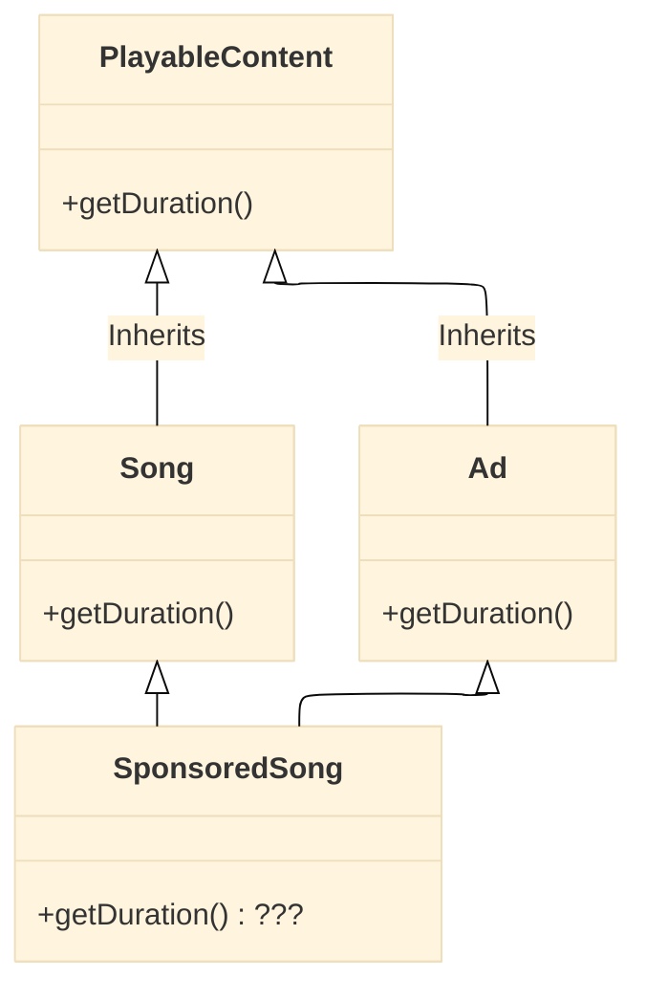
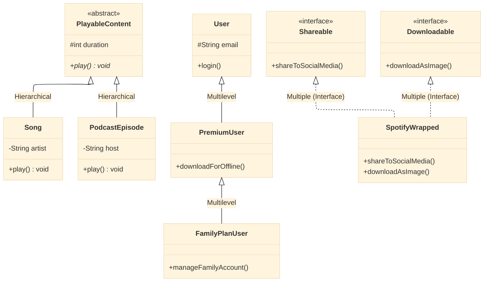
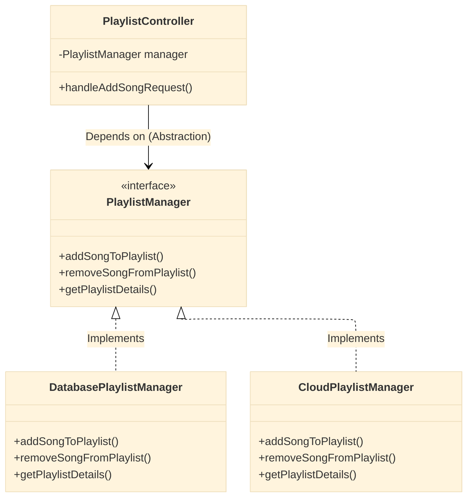

# Redefining OOPs: Beyond the Car and Animal Analogy

If you have ever prepared for a technical interview or sat through a college lecture on Object-Oriented Programming (OOPs), you have likely encountered the same tired analogies:

- **The Car:** "A Car is an Object. It has state (color, model) and behavior (start, stop)."
- **The Animal Kingdom:** "A Dog inherits from an Animal. It overrides the `makeSound()` method to bark."

While technically correct, these analogies have done us a disservice. They teach us the *syntax* but not the *architecture*. They help us pass a multiple-choice question on "What is Polymorphism?" but fail us when we are staring at a blank screen, trying to build a scalable e-commerce platform.

Let's redefine the four pillars of OOPs. Let's move from the textbook to the real world.

---

## The Grand Misunderstanding: Why the Legacy View Fails

**The Legacy Way:** We view OOPs as four separate boxes to check off: Encapsulation, Inheritance, Polymorphism, and Abstraction.

**The Redefined Way:** We must view OOPs as a cohesive survival strategy for software. It is not just about writing code; it is about managing **complexity**. As your application grows from 1,000 lines to 100,000 lines, OOPs is the discipline that prevents it from collapsing into a pile of spaghetti code.

Let's build a hypothetical product to illustrate this: **Spotify (or any Music Streaming Service).**

We will design the backend logic for handling a `User`, a `Playlist`, and `AudioContent`.

---

### Pillar 1: Encapsulation (Not Just Privacy, But Safety)

**The Legacy View:**
"Encapsulation is binding data and methods together and hiding data using `private` keywords. It's like a capsule."

**The Problem:**
This makes Encapsulation sound like a bureaucratic rule. "Make it private because the textbook said so." It ignores the *why*.

**The Redefined View:**
Encapsulation is **Safety**. It is the principle of protecting an object's integrity. It ensures that an object cannot be broken by external code.

**Real-World Practical Example (Spotify):**
Imagine a `UserProfile` object. It has a property called `listeningHistory`. If any part of the code could directly manipulate this history (e.g., `user.listeningHistory.clear()`), it would break Spotify's recommendation algorithm. It would also allow malicious code to wipe a user's data.

**The Code Snippet (The Wrong Way):**
```java
// Legacy Thinking: Just a data structure (Anti-pattern)
public class UserProfile {
    public List<String> listeningHistory; // Anyone can touch this!
    public int age;
}
```

**The Code Snippet (The OOP Way - Encapsulation):**
```java
public class UserProfile {
    private List<String> listeningHistory = new ArrayList<>();
    private int age;

    // Controlled access - only adding, never direct clearing/modification
    public void addSongToHistory(String songId) {
        // Business Logic: We can validate or transform data here
        if (songId != null && !songId.isEmpty()) {
            this.listeningHistory.add(songId);
            // Trigger a background job to update recommendations
            triggerRecommendationUpdate();
        }
    }

    public List<String> getListeningHistory() {
        // Return a copy to prevent external modification
        return new ArrayList<>(this.listeningHistory);
    }

    private void triggerRecommendationUpdate() {
        // Internal logic - the outside world doesn't need to know this exists
        System.out.println("Updating recommendations...");
    }
}
```

**Why this is better:**
The `UserProfile` object is now the **gatekeeper** of its own data. If a bug tries to wipe the history, it can't. The object remains in a valid state. Encapsulation is the **bouncer at the club door**, not just a privacy setting.

---

### Pillar 2: Inheritance (Not for Code Reuse, But for Sub-typing)

**The Legacy View:**
"Inheritance is code reuse. You write code in a parent class and child classes inherit it."

**The Problem:**
This leads to the dreaded "God Object" and deep inheritance trees that collapse under their own weight (the "Fragile Base Class Problem"). You end up with a class `Animal` with a method `fly()`, and then you have to override it for `Dog` to do nothing.

**The Redefined View:**
Inheritance is **Sub-typing**. It is not about reusing code; it is about defining an **"IS-A"** relationship that the rest of your code can rely on.

However, in a complex system like Spotify, you need different *flavors* of inheritance to model reality accurately. Let's look at the different threads:

#### Thread 1: Single Inheritance (The Simple Chain)
This is the simplest form—one parent, one child.

**Real-World Practical Example (Spotify):**
A `PodcastEpisode` *is-a* `PlayableContent`.

#### Thread 2: Hierarchical Inheritance (One Parent, Many Children)
One parent class serves as the base for multiple siblings.

**Real-World Practical Example (Spotify):**
On Spotify, you have different types of playable content: **Songs** and **Podcast Episodes**. They are different, but the player should treat them the same way. They both have a `duration` and can be `played()`.

**The Code Snippet (Hierarchical Inheritance):**
```java
// The Parent defines the contract for the TYPE
public abstract class PlayableContent {
    private String title;
    protected int duration; // 'protected' for child access

    public PlayableContent(String title, int duration) {
        this.title = title;
        this.duration = duration;
    }

    public abstract void play(); // Force children to implement their own way
    public String getTitle() { return title; }
    public int getDuration() { return duration; }
}

// Child 1: A Song
public class Song extends PlayableContent {
    private String artist;

    public Song(String title, String artist, int duration) {
        super(title, duration);
        this.artist = artist;
    }

    @Override
    public void play() {
        // Logic to stream a high-quality MP3 file
        System.out.println("Streaming song: " + getTitle() + " by " + artist);
    }
}

// Child 2: A Podcast Episode
public class PodcastEpisode extends PlayableContent {
    private String host;

    public PodcastEpisode(String title, String host, int duration) {
        super(title, duration);
        this.host = host;
    }

    @Override
    public void play() {
        // Logic to stream a spoken-word audio file, maybe at 1.5x speed
        System.out.println("Playing podcast: " + getTitle() + " hosted by " + host);
    }
}
```

#### Thread 3: Multilevel Inheritance (Grandparent -> Parent -> Child)
This is a chain of inheritance. A class inherits from a child, which inherits from a parent.

**Real-World Practical Example (Spotify):**
Spotify has different tiers of users. Perhaps a `User` has basic properties. A `PremiumUser` inherits from `User` (adding ad-free listening). Then, a `FamilyPlanUser` inherits from `PremiumUser` (adding family management features).

**The Code Snippet (Multilevel Inheritance):**
```java
// Level 1: Grandparent
public class User {
    protected String email;
    protected String username;

    public void login() { System.out.println("Logging in..."); }
}

// Level 2: Parent
public class PremiumUser extends User {
    protected boolean adFree = true;

    public void downloadForOffline() { System.out.println("Downloading song..."); }
}

// Level 3: Child
public class FamilyPlanUser extends PremiumUser {
    private List<String> familyMembers;

    public void manageFamilyAccount() { System.out.println("Managing family..."); }
}
```

#### Thread 4: Multiple Inheritance (via Interfaces)
Java/C# don't allow multiple inheritance of classes (the "Diamond Problem"), but they allow a class to implement multiple interfaces. This is a form of multiple inheritance of *type*.

**Real-World Practical Example (Spotify):**
A `SpotifyWrapped` report might be both `Shareable` (can be posted to Instagram) and `Downloadable` (can be saved as an image).

**The Code Snippet (Multiple Inheritance via Interfaces):**
```java
public interface Shareable {
    void shareToSocialMedia(String platform);
}

public interface Downloadable {
    void downloadAsImage();
}

// The class inherits the contract from multiple sources
public class SpotifyWrapped implements Shareable, Downloadable {
    private String year;

    @Override
    public void shareToSocialMedia(String platform) {
        System.out.println("Sharing Wrapped to " + platform);
    }

    @Override
    public void downloadAsImage() {
        System.out.println("Downloading Wrapped as PNG");
    }
}
```

#### The "Diamond Problem" (Hybrid Inheritance)
This is the reason modern languages avoid multiple inheritance of classes. Imagine if `PlayableContent` had a method `getDuration()`, and both `Song` and `Ad` (which you hear between songs) inherited from it. If you had a class `SponsoredSong` that tried to inherit from both `Song` and `Ad`, which `getDuration()` would it use? This ambiguity is the Diamond Problem.

**The Mermaid Diagram (The Diamond Problem):**



**The Mermaid Diagram (Healthy Relationships):**
This shows the relationships we just discussed, including Interfaces.



**Why this is better:**
Now, the `MusicPlayer` class can be written once:

```java
public class MusicPlayer {
    public void playThis(PlayableContent content) {
        // It doesn't care if it's a Song or Podcast!
        content.play(); // Polymorphism at work
    }
}
```

We used inheritance not to steal the `play()` method (which we made abstract anyway), but to tell the compiler that `Song` *is a* `PlayableContent`.

---

### Pillar 3: Polymorphism (The Chameleon Effect)

**The Legacy View:**
"Polymorphism means many forms. Overloading (compile-time) and Overriding (runtime)."

**The Problem:**
This is a technical definition that sounds like a dictionary entry. It lacks soul.

**The Redefined View:**
Polymorphism is **Context Awareness**. It is the ability of different objects to respond to the same message (method call) in ways that are appropriate to their own internal structure.

#### Thread 1: Overriding (Runtime Polymorphism)

We already saw this above. The `play()` method took many forms (Song form vs. Podcast form). The system doesn't decide *how* to play until the moment the code runs (runtime).

#### Thread 2: Overloading (Compile-time Polymorphism)

**Real-World Practical Example:**
Think of the Spotify **Search Bar**.

**The Code Snippet:**
```java
public class SearchEngine {

    // Overloaded methods: Same method name, different parameters.

    // Search by Song name
    public List<Song> search(String songName) {
        System.out.println("Searching for song by name: " + songName);
        // ... database query for songs
        return new ArrayList<>();
    }

    // Search by Artist name AND Album year
    public List<Song> search(String artistName, int year) {
        System.out.println("Searching for songs by artist: " + artistName + " in year: " + year);
        // ... more complex query
        return new ArrayList<>();
    }

    // Search by a Podcast host name
    public List<PodcastEpisode> search(PodcastHost host) {
        System.out.println("Searching for podcasts by host: " + host.getName());
        // ... podcast specific query
        return new ArrayList<>();
    }
}
```

**Why this is useful:**
To the developer using the `SearchEngine`, the interface is simple and intuitive: "I just call `search()` with whatever I have." The engine figures out the rest based on the *context* of the input. It is compile-time safety.

---

### Pillar 4: Abstraction (The Remote Control)

**The Legacy View:**
"Abstraction hides complex implementation details and shows only the necessary features. Abstract classes vs. Interfaces."

**The Problem:**
It gets tangled up with technical jargon about abstract methods and default interfaces, losing the core philosophical meaning.

**The Redefined View:**
Abstraction is **Reduction of Cognitive Load**. It is the principle of separating *what* something does from *how* it does it. It's the ultimate tool for managing complexity. But to master it, we must understand when to use an *Abstract Class* (partial abstraction) versus an *Interface* (full abstraction).

#### Thread 1: Abstract Classes (Partial Abstraction)
Use this when you have a base type that should provide some *default* behavior to its children, but cannot be fully instantiated on its own.

**Real-World Practical Example (Spotify):**
Our `PlayableContent` from earlier is perfect. We know every playable item should have a title and duration (concrete fields), and we can provide a default implementation for `getDuration()`, but we *force* the children to implement their own `play()` logic.

#### Thread 2: Interfaces (Full Abstraction)
Use this to define a contract or a capability that can be added to any class, regardless of where it sits in the inheritance hierarchy.

**Real-World Practical Example (Spotify):**
Think about the "Add to Playlist" feature.

- **The Complex "How":** Checking user permissions, updating a database index, invalidating a cache, re-calculating playlist duration, sending a WebSocket update to the UI.
- **The Simple "What":** `addSongToPlaylist(songId, playlistId);`

**The Code Snippet (Using Interfaces - Full Abstraction):**

```java
// The "WHAT" - The Interface (The Remote Control)
public interface PlaylistManager {
    void addSongToPlaylist(String songId, String playlistId);
    void removeSongFromPlaylist(String songId, String playlistId);
    Playlist getPlaylistDetails(String playlistId);
}

// The "HOW" - The Concrete Implementation (The TV Internals)
public class DatabasePlaylistManager implements PlaylistManager {

    @Override
    public void addSongToPlaylist(String songId, String playlistId) {
        // 1. Check if user owns playlist (Security)
        // 2. Open database connection
        // 3. Run INSERT query
        // 4. Handle potential foreign key constraints
        // 5. Close connection
        // 6. Clear cache for this playlist
        System.out.println("ADDING: Song " + songId + " to DB Playlist " + playlistId);
    }

    @Override
    public void removeSongFromPlaylist(String songId, String playlistId) {
        // ... complex DB logic ...
        System.out.println("REMOVING: Song " + songId + " from DB Playlist " + playlistId);
    }

    @Override
    public Playlist getPlaylistDetails(String playlistId) {
        // ... complex DB logic with joins ...
        System.out.println("FETCHING: Details for " + playlistId);
        return new Playlist();
    }
}

// The client (e.g., a REST Controller) only sees the Interface!
public class PlaylistController {
    private PlaylistManager playlistManager; // We don't know if it's DB, File, or Cloud!

    public PlaylistController(PlaylistManager playlistManager) {
        this.playlistManager = playlistManager; // This is Dependency Injection
    }

    public void handleAddSongRequest(String songId, String playlistId) {
        // We just call the WHAT, we don't care about the HOW.
        playlistManager.addSongToPlaylist(songId, playlistId);
    }
}
```

**The Mermaid Diagram (Abstraction in Action):**



**Why this is powerful:**
If Spotify decides to move from a SQL database to a NoSQL database, or to a microservice, we don't have to rewrite the `PlaylistController`. We just create a new class called `NoSqlPlaylistManager` that implements the same `PlaylistManager` interface. The controller remains blissfully unaware. Abstraction is what allows giant systems to be refactored without global chaos.

---

## Conclusion: The Unified Theory of OOPs

So, the next time you sit down to design a system, don't ask yourself, "Have I used the four pillars?"

Instead, ask:

1.  **Encapsulation:** Are my objects protecting their own integrity, or can anyone reach in and mess them up?
2.  **Inheritance:** Am I using inheritance to create a sensible type hierarchy (Single, Hierarchical, Multilevel), or am I just too lazy to rewrite three lines of code? And if I need multiple behaviors, am I using Interfaces correctly? (Avoiding the Diamond Problem!)
3.  **Polymorphism:** Is my code flexible enough to handle new, unforeseen types without being rewritten (Overriding)? Is my API intuitive for other developers (Overloading)?
4.  **Abstraction:** Have I built clean interfaces that hide the messy details from the rest of my application, using Abstract Classes for shared state and Interfaces for shared capabilities?

OOPs is not about writing code for the computer to execute. It is about writing code for **humans** to manage. It is the art of drawing boundaries. Master the boundaries, and you master the complexity.

Questions? Feedback? Comment? leave a response below. If you're implementing something similar and want to discuss architectural tradeoffs, I'm always happy to connect with fellow engineers tackling these challenges.