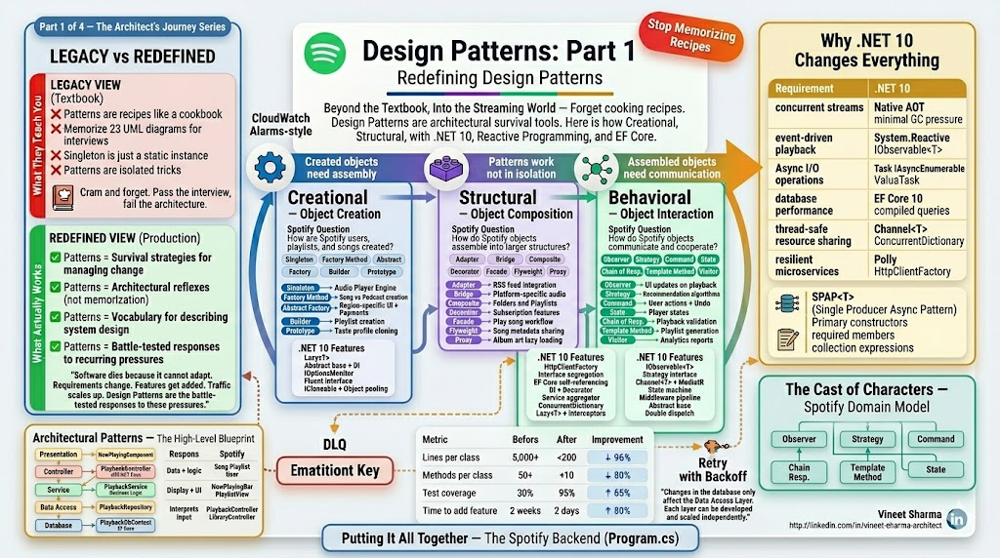
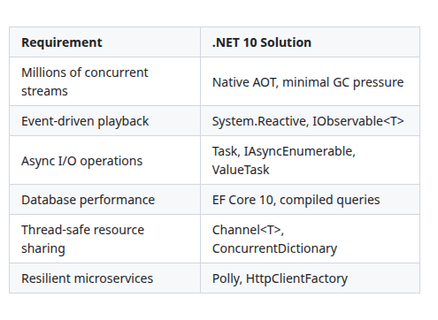
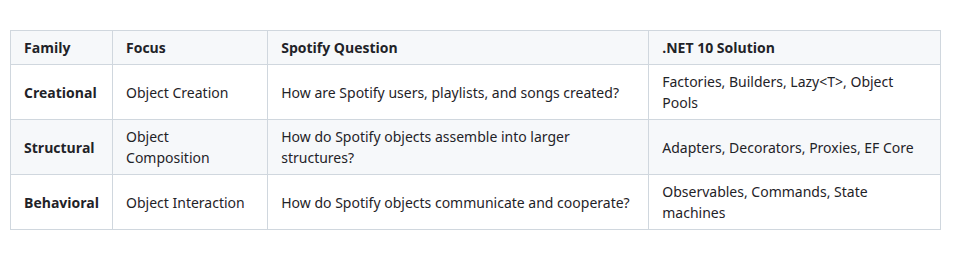
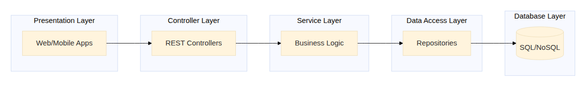
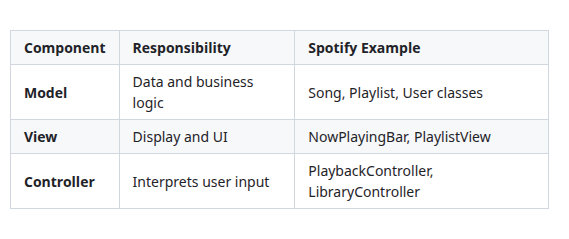
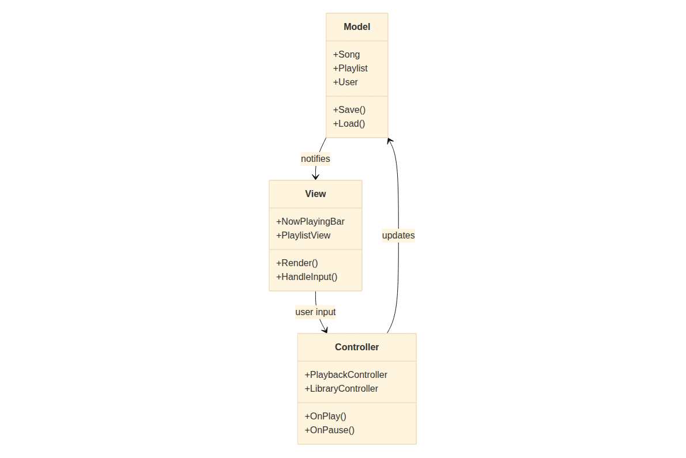
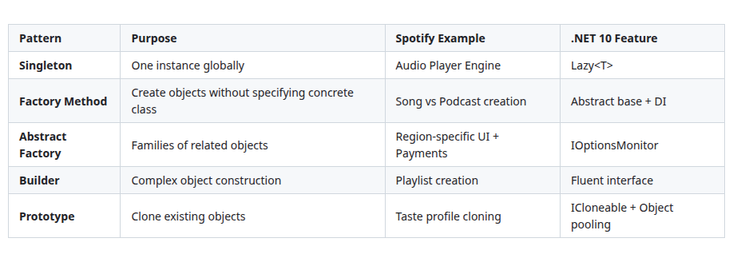
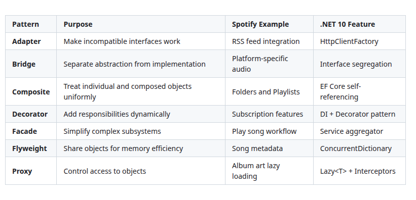
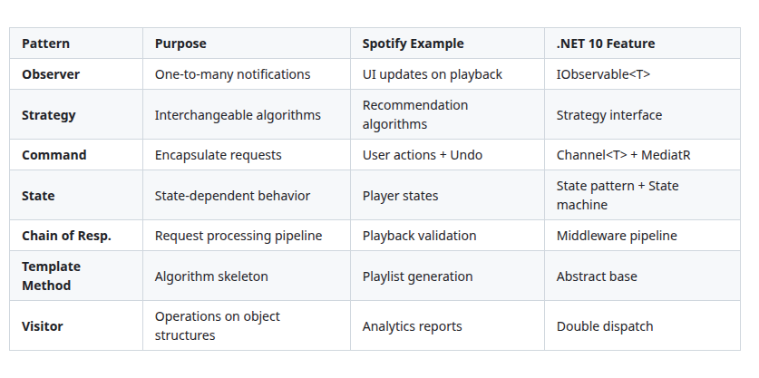
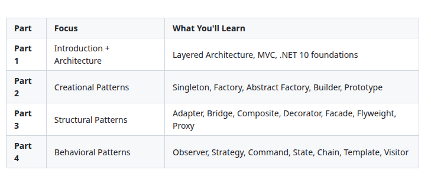

# Design Patterns: Part 1 - Redefining Design Patterns

### Forget cooking recipes—Design Patterns are architectural survival tools. Here is how Creational, Structural, and Behavioral patterns map directly to building Spotify with .NET 10, Reactive Programming, and EF Core.

**Keywords:**
Design Patterns, .NET 10, C# 13, Reactive Programming, Entity Framework Core, SPAP<T>, Creational Patterns, Structural Patterns, Behavioral Patterns, Architectural Patterns, MVC, Layered Architecture, Spotify system design



## Introduction: Why .NET 10 Changes Everything

**The Legacy Way:**
Most design pattern examples use Java 8 or C# 6 with console output. They ignore modern language features, asynchronous programming, and the reactive paradigms that power real streaming services.

**The .NET 10 Way:**
Spotify's backend, if built today on Microsoft stack, would leverage .NET 10's cutting-edge features:

- **Native AOT compilation** for microservices that start in milliseconds
- **Reactive Extensions (System.Reactive)** for event-driven architectures
- **Entity Framework Core 10** with complex type support and raw SQL queries
- **SPAP<T> (Single Producer Async Pattern)** for thread-safe, high-performance object pools
- **Primary constructors, required members, and collection expressions** for cleaner code
- **IAsyncEnumerable** for streaming data efficiently
- **Channel<T>** for producer-consumer patterns
- **Polly** for resilience and retry policies

**Why .NET 10 for Spotify?**



[View Source](https://github.com/Vineet-Sharma-Medium-Stories/Medium-Assets/blob/main/design-patterns-part-1----redefining-design-patterns/table_01_why-net-10-for-spotify.md)


---

## The Grand Misunderstanding: Why the Legacy View Fails

**The Legacy Way:**
Design Patterns are treated like a cookbook. "Here are 23 recipes. Memorize the ingredients (classes) and steps (methods)." Developers study them for interviews, cramming UML diagrams, only to forget them the moment they start coding.

**The Redefined Way:**
Design Patterns are not recipes—they are **survival strategies** for managing change. Software dies because it cannot adapt. Requirements change. Features get added. Traffic scales up. Design Patterns are the battle-tested responses to these pressures.

Think of them as **architectural reflexes**. When you see a problem, you don't think "Which pattern matches this diagram?" You think "I need to control how objects are created" (Creational), or "I need to compose objects flexibly" (Structural), or "I need to manage communication" (Behavioral).

---

## The Three Families of Design Patterns

Before we dive into the examples, understand the three families of design patterns:



[View Source](https://github.com/Vineet-Sharma-Medium-Stories/Medium-Assets/blob/main/design-patterns-part-1----redefining-design-patterns/table_02_before-we-dive-into-the-examples-understand-the-t-ca28.md)


Let's continue building **Spotify** and see where these patterns emerge naturally.

**Coming Up in Part 2**: Creational *Patterns Deep Dive: How Spotify Creates Its Universe (Singleton, Factory, Abstract Factory, Builder, Prototype) with .NET 10*

**Coming Up in Part 3**: *Structural Patterns Deep Dive: How Spotify Composes Its Features (Adapter, Bridge, Composite, Decorator, Facade, Flyweight, Proxy) with .NET 10*

**Coming Up in Part 4**: *Behavioral Patterns Deep Dive: How Spotify's Objects Communicate (Observer, Strategy, Command, State, Chain of Responsibility, Template Method, Visitor) with .NET 10*


## The .NET 10 Toolbox for Design Patterns

Throughout this series, we'll use these .NET 10 features extensively:

### 1. Reactive Programming with System.Reactive

```csharp
// WHY .NET 10: IObservable<T> enables event-driven architectures
public class PlaybackService
{
    private readonly Subject<PlaybackEvent> _eventSubject = new();
    
    // Expose as observable to prevent external OnNext calls
    public IObservable<PlaybackEvent> PlaybackEvents => _eventSubject.AsObservable();
    
    public void TrackPlayback(string songId)
    {
        _eventSubject.OnNext(new PlaybackEvent(songId));
    }
}

// Subscribe with LINQ operators
var subscription = playbackService.PlaybackEvents
    .Where(e => e.Type == EventType.SongStarted)
    .Throttle(TimeSpan.FromSeconds(1))
    .ObserveOn(SynchronizationContext.Current)
    .Subscribe(UpdateUI);
```

### 2. Async Streaming with IAsyncEnumerable

```csharp
// WHY .NET 10: IAsyncEnumerable streams data without blocking
public async IAsyncEnumerable<Song> GetUserLibraryAsync(
    string userId,
    [EnumeratorCancellation] CancellationToken cancellationToken = default)
{
    await foreach (var song in _dbContext.Songs
        .Where(s => s.UserId == userId)
        .AsAsyncEnumerable()
        .WithCancellation(cancellationToken))
    {
        yield return song;
    }
}
```

### 3. SPAP<T> with Channel<T>

```csharp
// WHY .NET 10: Channel<T> provides thread-safe producer-consumer queues
public class ObjectPool<T> where T : class
{
    private readonly Channel<T> _pool;
    private readonly Func<T> _factory;
    
    public ObjectPool(Func<T> factory, int size)
    {
        _factory = factory;
        _pool = Channel.CreateBounded<T>(new BoundedChannelOptions(size)
        {
            FullMode = BoundedChannelFullMode.Wait,
            SingleWriter = true, // SPAP - Single Producer
            SingleReader = false
        });
        
        // Pre-populate pool
        for (int i = 0; i < size; i++)
        {
            _pool.Writer.TryWrite(_factory());
        }
    }
    
    public async ValueTask<PooledObject<T>> RentAsync(CancellationToken ct = default)
    {
        var item = await _pool.Reader.ReadAsync(ct);
        return new PooledObject<T>(this, item);
    }
    
    private void Return(T item) => _pool.Writer.TryWrite(item);
}
```

### 4. EF Core 10 with Complex Types

```csharp
public class SongConfiguration : IEntityTypeConfiguration<Song>
{
    public void Configure(EntityTypeBuilder<Song> builder)
    {
        builder.HasKey(s => s.Id);
        
        // JSON column for flexible metadata
        builder.Property(s => s.Metadata)
            .HasColumnType("jsonb");
        
        // Complex type for value objects
        builder.ComplexProperty(s => s.Duration, duration =>
        {
            duration.Property(d => d.Ticks).HasColumnName("DurationTicks");
        });
        
        // Owned collections
        builder.OwnsMany(s => s.Genres, genre =>
        {
            genre.Property(g => g.Name).HasColumnName("GenreName");
        });
    }
}
```

---

## Architectural Patterns: The High-Level Blueprint

Before diving into the 23 design patterns, we need to understand where they live. Architectural patterns define the overall structure of the application.

### 1. Layered Architecture (N-Tier)

**What it does:** Separates concerns into horizontal layers. Each layer has a specific responsibility and communicates only with the layer directly below it.

**The Structure:**

```mermaid
```



[View Source](https://github.com/Vineet-Sharma-Medium-Stories/Medium-Assets/blob/main/design-patterns-part-1----redefining-design-patterns/diagram_01_the-structure.md)


**Spotify Example:**
Spotify's backend follows classic Layered Architecture:

```csharp
// Presentation Layer (Blazor/MAUI)
public class NowPlayingComponent
{
    private readonly IPlaybackController _controller;
    
    public async Task OnPlayClick(string songId)
    {
        await _controller.PlaySongAsync(songId);
    }
}

// Controller Layer (ASP.NET Core)
[ApiController]
[Route("api/[controller]")]
public class PlaybackController : IPlaybackController
{
    private readonly IPlaybackService _playbackService;
    
    public PlaybackController(IPlaybackService playbackService)
    {
        _playbackService = playbackService;
    }
    
    [HttpPost("play/{songId}")]
    public async Task<ActionResult> PlaySongAsync(string songId)
    {
        var result = await _playbackService.PlaySongAsync(songId);
        return Ok(result);
    }
}

// Service Layer (Business Logic)
public class PlaybackService : IPlaybackService
{
    private readonly IPlaybackRepository _repository;
    private readonly IStreamingService _streaming;
    
    public async Task<PlaybackResult> PlaySongAsync(string songId)
    {
        var song = await _repository.GetSongAsync(songId);
        var stream = await _streaming.GetStreamAsync(song.Url);
        return new PlaybackResult(song, stream);
    }
}

// Data Access Layer
public class PlaybackRepository : IPlaybackRepository
{
    private readonly PlaybackDbContext _context;
    
    public async Task<Song> GetSongAsync(string songId)
    {
        return await _context.Songs
            .AsNoTracking()
            .FirstOrDefaultAsync(s => s.Id == songId);
    }
}

// Database Layer (EF Core)
public class PlaybackDbContext : DbContext
{
    public DbSet<Song> Songs => Set<Song>();
    
    protected override void OnConfiguring(DbContextOptionsBuilder options)
    {
        options.UseSqlServer("connection_string");
    }
}
```

**Why it works:** Changes in the database only affect the Data Access Layer. Each layer can be developed and scaled independently.

### 2. Model-View-Controller (MVC)

**What it does:** Separates an application into three interconnected components:



[View Source](https://github.com/Vineet-Sharma-Medium-Stories/Medium-Assets/blob/main/design-patterns-part-1----redefining-design-patterns/table_03_what-it-does-separates-an-application-into-th-4097.md)


**The Structure:**

```mermaid
```



[View Source](https://github.com/Vineet-Sharma-Medium-Stories/Medium-Assets/blob/main/design-patterns-part-1----redefining-design-patterns/diagram_02_the-structure.md)


**Spotify Example (Blazor):**

```csharp
// Model
public class PlaybackModel
{
    public Song? CurrentSong { get; set; }
    public TimeSpan Position { get; set; }
    public bool IsPlaying { get; set; }
    
    public async Task PlayAsync(string songId)
    {
        // Business logic
        CurrentSong = await _service.GetSongAsync(songId);
        IsPlaying = true;
    }
}

// View (Blazor Component)
@implements IDisposable
@inject PlaybackController Controller

<div class="now-playing-bar">
    @if (Model?.CurrentSong != null)
    {
        <div class="song-info">
            <span>@Model.CurrentSong.Title</span>
            <span>@Model.CurrentSong.Artist</span>
        </div>
        <div class="controls">
            <button @onclick="OnPlayPause">
                @(Model.IsPlaying ? "Pause" : "Play")
            </button>
        </div>
    }
</div>

@code {
    private PlaybackModel Model => Controller.Model;
    private IDisposable? _subscription;
    
    protected override void OnInitialized()
    {
        // Reactive subscription to model changes
        _subscription = Controller.ModelChanged.Subscribe(_ => StateHasChanged());
    }
    
    private async Task OnPlayPause()
    {
        if (Model.IsPlaying)
            await Controller.PauseAsync();
        else
            await Controller.PlayAsync();
    }
}

// Controller
public class PlaybackController
{
    private readonly PlaybackModel _model;
    private readonly Subject<Unit> _modelChanged = new();
    
    public IObservable<Unit> ModelChanged => _modelChanged.AsObservable();
    public PlaybackModel Model => _model;
    
    public async Task PlayAsync(string? songId = null)
    {
        if (songId != null)
            await _model.PlayAsync(songId);
        else
            _model.IsPlaying = true;
            
        _modelChanged.OnNext(Unit.Default);
    }
    
    public async Task PauseAsync()
    {
        _model.IsPlaying = false;
        _modelChanged.OnNext(Unit.Default);
    }
}
```

**Why it works:** You can completely redesign the Spotify UI without touching the playback logic.

---

## Overview of Design Pattern Categories

Now that we understand the architectural context, let's preview the 23 design patterns we'll cover in this series:

### Creational Patterns (Object Creation)



[View Source](https://github.com/Vineet-Sharma-Medium-Stories/Medium-Assets/blob/main/design-patterns-part-1----redefining-design-patterns/table_04_creational-patterns-object-creation-38b9.md)


### Structural Patterns (Object Composition)



[View Source](https://github.com/Vineet-Sharma-Medium-Stories/Medium-Assets/blob/main/design-patterns-part-1----redefining-design-patterns/table_05_structural-patterns-object-composition-b4b7.md)


### Behavioral Patterns (Object Interaction)



[View Source](https://github.com/Vineet-Sharma-Medium-Stories/Medium-Assets/blob/main/design-patterns-part-1----redefining-design-patterns/table_06_behavioral-patterns-object-interaction-ecad.md)


---

## The Spotify Domain Model

Throughout this series, we'll use these domain models:

```csharp
// ========== Core Domain ==========

public record User
{
    public required string Id { get; init; }
    public required string Email { get; init; }
    public required string DisplayName { get; init; }
    public SubscriptionTier Tier { get; init; }
    public DateTime CreatedAt { get; init; }
    public Dictionary<string, object> Preferences { get; init; } = new();
}

public enum SubscriptionTier
{
    Free,
    Premium,
    Family,
    Student
}

public abstract record PlayableContent
{
    public required string Id { get; init; }
    public required string Title { get; init; }
    public TimeSpan Duration { get; init; }
    public abstract string ContentType { get; }
}

public record Song : PlayableContent
{
    public required string Artist { get; init; }
    public required string Album { get; init; }
    public int TrackNumber { get; init; }
    public List<string> Genres { get; init; } = new();
    public override string ContentType => "song";
}

public record PodcastEpisode : PlayableContent
{
    public required string ShowName { get; init; }
    public required string Host { get; init; }
    public int EpisodeNumber { get; init; }
    public override string ContentType => "podcast";
}

public record Playlist
{
    public required string Id { get; init; }
    public required string Name { get; init; }
    public string? Description { get; init; }
    public required string OwnerId { get; init; }
    public List<string> SongIds { get; init; } = new();
    public bool IsCollaborative { get; init; }
    public DateTime CreatedAt { get; init; }
}

// ========== EF Core Configuration ==========

public class SpotifyDbContext : DbContext
{
    public DbSet<User> Users => Set<User>();
    public DbSet<Song> Songs => Set<Song>();
    public DbSet<PodcastEpisode> PodcastEpisodes => Set<PodcastEpisode>();
    public DbSet<Playlist> Playlists => Set<Playlist>();
    
    protected override void OnModelCreating(ModelBuilder modelBuilder)
    {
        // TPT inheritance for PlayableContent
        modelBuilder.Entity<PlayableContent>(entity =>
        {
            entity.ToTable("Contents");
            entity.HasKey(e => e.Id);
            entity.Property(e => e.Duration).HasConversion<long>();
        });
        
        modelBuilder.Entity<Song>(entity =>
        {
            entity.ToTable("Songs");
            entity.Property(e => e.Genres).HasColumnType("jsonb");
        });
        
        modelBuilder.Entity<PodcastEpisode>(entity =>
        {
            entity.ToTable("PodcastEpisodes");
        });
        
        modelBuilder.Entity<User>(entity =>
        {
            entity.HasKey(e => e.Id);
            entity.Property(e => e.Preferences).HasColumnType("jsonb");
        });
    }
}
```

---

## Putting It All Together: The Spotify Backend

Here's how all these patterns and architectural decisions come together in a real .NET 10 application:

```csharp
// Program.cs - .NET 10 Application Setup
var builder = WebApplication.CreateSlimBuilder(args); // Native AOT ready

// Add services
builder.Services.AddDbContext<SpotifyDbContext>(options =>
    options.UseSqlServer(builder.Configuration.GetConnectionString("SpotifyDb")));

// Add HttpClient factories for external APIs
builder.Services.AddHttpClient("SpotifyCDN", client =>
{
    client.BaseAddress = new Uri("https://cdn.spotify.com/");
    client.DefaultRequestHeaders.Add("User-Agent", "Spotify/1.0");
}).AddPolicyHandler(GetRetryPolicy());

// Add memory cache for flyweights
builder.Services.AddMemoryCache();

// Add reactive services
builder.Services.AddSingleton<PlaybackEventBus>(); // Observer pattern

// Register all repositories
builder.Services.AddScoped<IUserRepository, UserRepository>();
builder.Services.AddScoped<IContentRepository, ContentRepository>();
builder.Services.AddScoped<IPlaylistRepository, PlaylistRepository>();

// Register all services
builder.Services.AddScoped<IPlaybackService, PlaybackService>();
builder.Services.AddScoped<IRecommendationService, RecommendationService>();
builder.Services.AddScoped<ISearchService, SearchService>();

// Register factories (Creational patterns)
builder.Services.AddSingleton<ContentFactory>();
builder.Services.AddSingleton<PlaylistBuilderFactory>();

// Register strategies (Behavioral patterns)
builder.Services.AddSingleton<IRecommendationStrategy, PopularityStrategy>();
builder.Services.AddSingleton<IRecommendationStrategy, CollaborativeStrategy>();
builder.Services.AddSingleton<IRecommendationStrategy, NeuralNetworkStrategy>();

// Add controllers
builder.Services.AddControllers();

// Add OpenAPI
builder.Services.AddOpenApi();

var app = builder.Build();

// Configure pipeline
if (app.Environment.IsDevelopment())
{
    app.MapOpenApi();
}

app.UseHttpsRedirection();
app.MapControllers();

// Initialize background services
app.Services.GetRequiredService<PlaybackEventBus>(); // Start observer

app.Run();

// Resilience policy
static IAsyncPolicy<HttpResponseMessage> GetRetryPolicy()
{
    return HttpPolicyExtensions
        .HandleTransientHttpError()
        .WaitAndRetryAsync(3, retryAttempt => 
            TimeSpan.FromSeconds(Math.Pow(2, retryAttempt)));
}
```

---

## The Road Ahead: Four-Part Series

Over this series, we'll explore each pattern family in depth:



[View Source](https://github.com/Vineet-Sharma-Medium-Stories/Medium-Assets/blob/main/design-patterns-part-1----redefining-design-patterns/table_07_over-this-series-well-explore-each-pattern-famil-c329.md)


Each part includes:
- Real Spotify examples with production-ready .NET 10 code
- Mermaid diagrams for visual understanding
- SPAP<T> implementations where applicable
- EF Core 10 integration
- Reactive programming with System.Reactive
- Performance considerations and best practices

---

## Conclusion: The Unified Theory of Design Patterns

Patterns are not isolated tricks. They work together:

- A **Singleton** controls access to the audio hardware
- A **Factory** creates the appropriate content objects
- A **Proxy** loads album art lazily
- An **Observer** updates the UI when the song changes
- A **Command** queues offline actions
- The whole system sits inside a **Layered Architecture** with **MVC** at the presentation level

**The Final Redefinition:**
Stop memorizing patterns. Start recognizing **pressures**:
- Pressure to control object creation? → **Creational**
- Pressure to compose objects flexibly? → **Structural**
- Pressure to manage communication? → **Behavioral**

Design Patterns are your vocabulary for describing architecture. Master them, and you stop writing code—you start designing systems.

---

## What's Next

In **Part 2: Creational Patterns Deep Dive**, we'll explore:

- **Singleton Pattern:** Audio Player Engine with Lazy<T>
- **Factory Method Pattern:** Creating Songs vs Podcasts with EF Core
- **Abstract Factory Pattern:** Region-specific UI families with IOptionsMonitor
- **Builder Pattern:** Building Playlists with fluent interfaces
- **Prototype Pattern:** Cloning User Taste Profiles with object pooling

All implemented with .NET 10's latest features, reactive programming, and production-ready code.

---

**Coming Up in Part 2:**
*Creational Patterns Deep Dive: How Spotify Creates Its Universe (Singleton, Factory, Abstract Factory, Builder, Prototype) with .NET 10*

**Coming Up in Part 3:**
*Structural Patterns Deep Dive: How Spotify Composes Its Features (Adapter, Bridge, Composite, Decorator, Facade, Flyweight, Proxy) with .NET 10*

**Coming Up in Part 4:**
*Behavioral Patterns Deep Dive: How Spotify's Objects Communicate (Observer, Strategy, Command, State, Chain of Responsibility, Template Method, Visitor) with .NET 10*

---