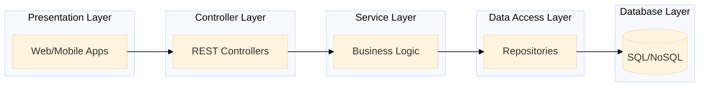

# **The Structure:**

```mermaid
---
config:
  theme: base
  layout: elk
---
graph LR
    subgraph "Presentation Layer"
        UI[Web/Mobile Apps]
    end
    
    subgraph "Controller Layer"
        API[REST Controllers]
    end
    
    subgraph "Service Layer"
        Services[Business Logic]
    end
    
    subgraph "Data Access Layer"
        Repo[Repositories]
    end
    
    subgraph "Database Layer"
        DB[(SQL/NoSQL)]
    end
    
    UI --> API
    API --> Services
    Services --> Repo
    Repo --> DB
```
