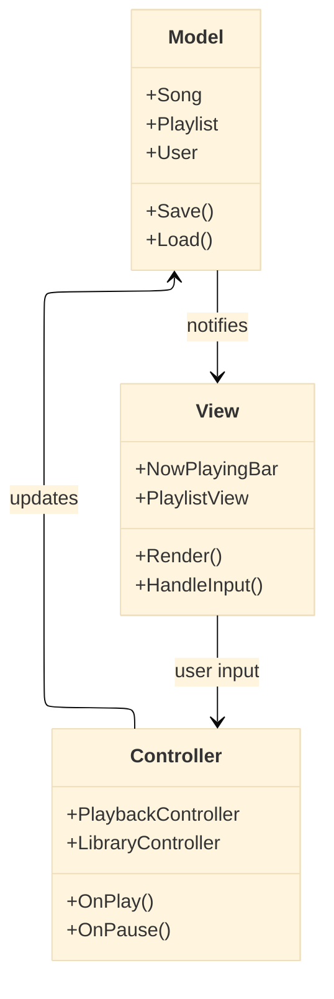

# **The Structure:**

```mermaid
---
config:
  theme: base
  layout: elk
---
classDiagram
    class Model {
        +Song
        +Playlist
        +User
        +Save()
        +Load()
    }
    
    class View {
        +NowPlayingBar
        +PlaylistView
        +Render()
        +HandleInput()
    }
    
    class Controller {
        +PlaybackController
        +LibraryController
        +OnPlay()
        +OnPause()
    }
    
    View --> Controller : user input
    Controller --> Model : updates
    Model --> View : notifies
```
