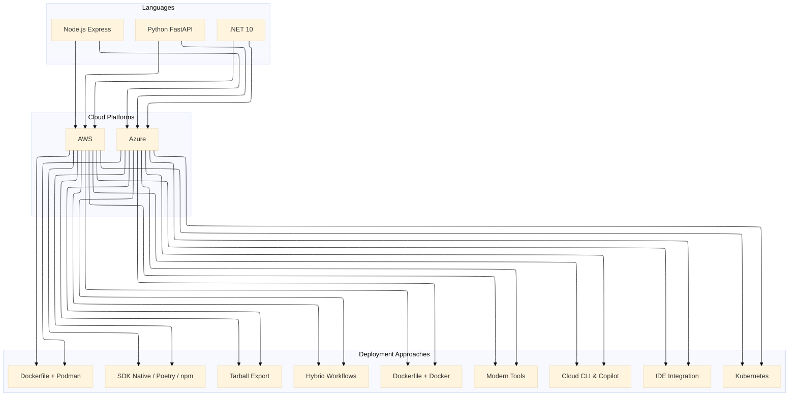

# The Complete Multi-Language Containerization Library: .NET, Python, and Node.js on Azure and AWS

## A Comprehensive Digest of 6 Top-Level Series and 60 Deployment Stories

### Introduction: The Journey Across Languages and Clouds

Over the past several months, we've embarked on an ambitious journey to document the complete landscape of containerizing modern applications across three of the world's most popular programming languages—**.NET, Python, and Node.js**—on the two leading cloud platforms—**Azure and AWS**. This comprehensive library represents hundreds of hours of research, hands-on experimentation, and battle-tested patterns that have been refined across real-world production deployments.

What began as a single series on .NET 10 containerization evolved into a multi-language, multi-cloud reference library that now spans **6 top-level series and 60 individual stories**. Each story explores a distinct deployment approach, from the simplicity of SDK-native builds to the power of Kubernetes orchestration, from the reliability of Dockerfile workflows to the innovation of tooling like konet, UV, and pnpm.

This digest serves as your roadmap to this extensive library, providing a bird's-eye view of all six series and the 10 stories within each. Whether you're a .NET developer deploying to Azure, a Python engineer optimizing for AWS Graviton, or a Node.js architect building microservices at scale, you'll find a curated path through the content that speaks directly to your needs.

---

# Part 1: .NET 10 Containerization Series

### Series Overview: Publishing .NET 10 Apps as Container Images

The .NET 10 series explores the full spectrum of container deployment options for modern .NET applications, from SDK-native simplicity to Kubernetes orchestration, across both Azure and AWS.

## Azure Edition (10 Stories)

**Complete .NET Azure series (10 stories):**

📚 **1. .NET SDK Native Container Publishing Deep Dive: The Complete Reference - Azure** – Comprehensive coverage of MSBuild properties, Native AOT optimization, CI/CD pipeline patterns, performance benchmarks, and troubleshooting guides for Azure Container Registry

🚀 **2. .NET SDK Native Container Publishing: Building OCI Images Without Docker - Azure** – A deep dive into MSBuild configuration, multi-architecture builds, Native AOT optimization, and direct Azure Container Registry integration with workload identity federation

🐳 **3. Traditional Dockerfile with Docker: The Classic Approach - Azure** – Mastering multi-stage builds, build cache optimization, .dockerignore patterns, and Azure Container Registry authentication for enterprise CI/CD pipelines

🔐 **4. Traditional Dockerfile with Podman: The Daemonless Alternative - Azure** – Transitioning from Docker to Podman, rootless containers for enhanced security, and Azure ACR integration with Podman Desktop

⚡ **5. Azure Developer CLI (azd) with .NET Aspire: The Turnkey Solution - Azure** – Full-stack deployments with `azd up`, Azure Container Apps provisioning, Redis caching, and infrastructure-as-code with Bicep templates

🖱️ **6. Visual Studio 2026 GUI Publishing: Drag-and-Drop Azure Deployments** – Leveraging Visual Studio's built-in Podman/Docker support, one-click publish to Azure Container Registry, and debugging containerized apps with Hot Reload

🔒 **7. Tarball Export + Runtime Load: Security-First CI/CD Workflows - Azure** – Generating container tarballs without a runtime, integrating with Trivy/Grype for vulnerability scanning, and deploying to air-gapped Azure environments

🔄 **8. Podman with .NET SDK Native Publishing: Hybrid Workflows - Azure** – Combining SDK-native builds with Podman for local testing, multi-architecture emulation, and Azure Container Registry push strategies

🛠️ **9. konet: Multi-Platform Container Builds Without Docker - Azure** – Using the konet .NET tool for cross-platform image generation, AMD64/ARM64 simultaneous builds, and Azure DevOps optimization

☸️ **10. Kubernetes Native Deployments: Orchestrating .NET 10 Containers on Azure Kubernetes Service (AKS)** – Deploying to Azure Kubernetes Service, Helm charts, GitOps with Flux, and production-grade operations

## AWS Edition (10 Stories)

**Complete .NET AWS series (10 stories):**

📚 **1. .NET SDK Native Container Publishing Deep Dive: The Complete Reference - AWS** – Comprehensive coverage of MSBuild properties, Native AOT optimization, CI/CD pipeline patterns, performance benchmarks, and troubleshooting guides for Amazon ECR

🚀 **2. .NET SDK Native Container Publishing: Building OCI Images Without Docker - AWS** – A deep dive into MSBuild configuration, multi-architecture builds (Graviton ARM64), and direct Amazon ECR integration with IAM roles

🐳 **3. Traditional Dockerfile with Docker: The Classic Approach - AWS** – Mastering multi-stage builds, build cache optimization, and Amazon ECR authentication for enterprise CI/CD pipelines on AWS

🔐 **4. Traditional Dockerfile with Podman: The Daemonless Alternative - AWS** – Transitioning from Docker to Podman, rootless containers for enhanced security, and Amazon ECR integration with Podman Desktop

🏗️ **5. AWS CDK & Copilot: Infrastructure as Code for Containers - AWS** – Deploying to Amazon ECS with AWS Copilot, infrastructure-as-code with CDK, and Fargate serverless container orchestration

🖱️ **6. Visual Studio 2026 GUI Publishing: Drag-and-Drop AWS Deployments** – Leveraging Visual Studio's AWS Toolkit, one-click publish to Amazon ECR, and debugging containerized apps on AWS

🔒 **7. Tarball Export + Runtime Load: Security-First CI/CD Workflows - AWS** – Generating container tarballs, integrating with Amazon Inspector, and deploying to air-gapped AWS environments

🔄 **8. Podman with .NET SDK Native Publishing: Hybrid Workflows - AWS** – Combining SDK-native builds with Podman for local testing, multi-architecture emulation (x64 to Graviton), and Amazon ECR push strategies

🛠️ **9. konet: Multi-Platform Container Builds Without Docker - AWS** – Using the konet .NET tool for cross-platform image generation, AMD64/ARM64 (Graviton) simultaneous builds, and AWS CodeBuild optimization

☸️ **10. Kubernetes Native Deployments: Orchestrating .NET 10 Containers on Amazon EKS - AWS** – Deploying to Amazon EKS, Helm charts, GitOps with Flux, ALB Ingress Controller, and production-grade operations

---

# Part 2: Python FastAPI Containerization Series

### Series Overview: Publishing Python FastAPI Apps as Container Images

The Python series adapts the proven patterns from .NET to the Python ecosystem, focusing on FastAPI applications with dependencies like FastAPI, Motor, and Pydantic.

## Azure Edition (10 Stories)

**Complete Python Azure series (10 stories):**

🐍 **1. Poetry + Docker Multi-Stage: The Modern Python Approach - Azure** – Leveraging Poetry for dependency management with optimized multi-stage Docker builds for FastAPI applications on Azure Container Registry

⚡ **2. UV + Docker: Blazing Fast Python Package Management - Azure** – Using the ultra-fast UV package installer for sub-second dependency resolution in container builds for Azure

📦 **3. Pip + Docker: The Classic Python Containerization - Azure** – Traditional requirements.txt approach with multi-stage builds and layer caching optimization for Azure Container Apps

🚀 **4. Azure Container Apps: Serverless Python Deployment** – Deploying FastAPI applications to Azure Container Apps with auto-scaling and managed infrastructure

💻 **5. Visual Studio Code Dev Containers: Local Development to Production - Azure** – Using VS Code Dev Containers for consistent development environments that mirror Azure production

🔧 **6. Azure Developer CLI (azd) with Python: The Turnkey Solution** – Full-stack deployments with `azd up`, Azure Container Apps provisioning, and infrastructure-as-code with Bicep

🔒 **7. Tarball Export + Runtime Load: Security-First CI/CD Workflows - Azure** – Generating container tarballs, integrating with Trivy/Grype for vulnerability scanning, and deploying to air-gapped Azure environments

☸️ **8. Azure Kubernetes Service (AKS): Python Microservices at Scale** – Deploying FastAPI applications to AKS, Helm charts, GitOps with Flux, and production-grade operations

🤖 **9. GitHub Actions + Container Registry: CI/CD for Python - Azure** – Automated container builds, testing, and deployment with GitHub Actions workflows to Azure

🏗️ **10. AWS CDK & Copilot: Multi-Cloud Python Container Deployments** – Deploying Python FastAPI applications to AWS ECS with AWS Copilot, infrastructure-as-code with CDK, and Fargate serverless orchestration

## AWS Edition (10 Stories)

**Complete Python AWS series (10 stories):**

🐍 **1. Poetry + Docker Multi-Stage: The Modern Python Approach - AWS** – Leveraging Poetry for dependency management with optimized multi-stage Docker builds for FastAPI applications on Amazon ECR

⚡ **2. UV + Docker: Blazing Fast Python Package Management - AWS** – Using the ultra-fast UV package installer for sub-second dependency resolution in container builds for AWS Graviton

📦 **3. Pip + Docker: The Classic Python Containerization - AWS** – Traditional requirements.txt approach with multi-stage builds and layer caching optimization for Amazon ECS

🚀 **4. AWS Copilot: The Turnkey Container Solution - AWS** – Deploying FastAPI applications to Amazon ECS with AWS Copilot, Fargate, and built-in best practices

💻 **5. Visual Studio Code Dev Containers: Local Development to Production - AWS** – Using VS Code Dev Containers for consistent development environments that mirror AWS production

🏗️ **6. AWS CDK with Python: Infrastructure as Code for Containers - AWS** – Defining FastAPI infrastructure with Python CDK, deploying to ECS Fargate with auto-scaling

🔒 **7. Tarball Export + Runtime Load: Security-First CI/CD Workflows - AWS** – Generating container tarballs, integrating with Amazon Inspector, and deploying to air-gapped AWS environments

☸️ **8. Amazon EKS: Python Microservices at Scale - AWS** – Deploying FastAPI applications to Amazon EKS, Helm charts, GitOps with Flux, and production-grade operations

🤖 **9. GitHub Actions + Amazon ECR: CI/CD for Python - AWS** – Automated container builds, testing, and deployment with GitHub Actions workflows to AWS

🏗️ **10. AWS App Runner: Fully Managed Python Container Service - AWS** – Deploying FastAPI applications to AWS App Runner with zero infrastructure management

---

# Part 3: Node.js Express Containerization Series

### Series Overview: Publishing Node.js Express Apps as Container Images

The Node.js series adapts the patterns to the Node.js ecosystem, focusing on Express.js applications with dependencies like Express, Mongoose, and Winston.

## Azure Edition (10 Stories)

**Complete Node.js Azure series (10 stories):**

📦 **1. NPM + Docker Multi-Stage: The Classic Node.js Approach - Azure** – Leveraging npm with optimized multi-stage Docker builds for Express.js applications on Azure Container Registry

🧶 **2. Yarn + Docker: Deterministic Dependency Management - Azure** – Using Yarn for reproducible builds with Yarn Berry and Plug'n'Play for optimal container performance on Azure

⚡ **3. pnpm + Docker: Disk-Efficient Node.js Containers - Azure** – Leveraging pnpm's content-addressable storage for faster installs and smaller images on Azure Container Apps

🚀 **4. Azure Container Apps: Serverless Node.js Deployment** – Deploying Express.js applications to Azure Container Apps with auto-scaling and managed infrastructure

💻 **5. Visual Studio Code Dev Containers: Local Development to Production - Azure** – Using VS Code Dev Containers for consistent Node.js development environments that mirror Azure production

🔧 **6. Azure Developer CLI (azd) with Node.js: The Turnkey Solution** – Full-stack deployments with `azd up`, Azure Container Apps provisioning, and infrastructure-as-code with Bicep

🔒 **7. Tarball Export + Runtime Load: Security-First CI/CD Workflows - Azure** – Generating container tarballs, integrating with Trivy/Grype for vulnerability scanning, and deploying to air-gapped Azure environments

☸️ **8. Azure Kubernetes Service (AKS): Node.js Microservices at Scale** – Deploying Express.js applications to AKS, Helm charts, GitOps with Flux, and production-grade operations

🤖 **9. GitHub Actions + Container Registry: CI/CD for Node.js - Azure** – Automated container builds, testing, and deployment with GitHub Actions workflows to Azure

🏗️ **10. AWS CDK & Copilot: Multi-Cloud Node.js Container Deployments** – Deploying Node.js Express applications to AWS ECS with AWS Copilot, infrastructure-as-code with CDK, and Fargate serverless orchestration

## AWS Edition (10 Stories)

**Complete AWS Node.js series (10 stories):**

📦 **1. NPM + Docker Multi-Stage: The Classic Node.js Approach - AWS** – Leveraging npm with optimized multi-stage Docker builds for Express.js applications on Amazon ECR

🧶 **2. Yarn + Docker: Deterministic Dependency Management - AWS** – Using Yarn for reproducible builds with Yarn Berry and Plug'n'Play for optimal container performance on AWS Graviton

⚡ **3. pnpm + Docker: Disk-Efficient Node.js Containers - AWS** – Leveraging pnpm's content-addressable storage for faster installs and smaller images on Amazon ECS

🚀 **4. AWS Copilot: The Turnkey Container Solution - AWS** – Deploying Express.js applications to Amazon ECS with AWS Copilot, Fargate, and built-in best practices

💻 **5. Visual Studio Code Dev Containers: Local Development to Production - AWS** – Using VS Code Dev Containers for consistent Node.js development environments that mirror AWS production

🏗️ **6. AWS CDK with TypeScript: Infrastructure as Code for Containers - AWS** – Defining Express.js infrastructure with TypeScript CDK, deploying to ECS Fargate with auto-scaling

🔒 **7. Tarball Export + Runtime Load: Security-First CI/CD Workflows - AWS** – Generating container tarballs, integrating with Amazon Inspector, and deploying to air-gapped AWS environments

☸️ **8. Amazon EKS: Node.js Microservices at Scale - AWS** – Deploying Express.js applications to Amazon EKS, Helm charts, GitOps with Flux, and production-grade operations

🤖 **9. GitHub Actions + Amazon ECR: CI/CD for Node.js - AWS** – Automated container builds, testing, and deployment with GitHub Actions workflows to AWS

🏗️ **10. AWS App Runner: Fully Managed Node.js Container Service - AWS** – Deploying Express.js applications to AWS App Runner with zero infrastructure management

---

## Comparison Tables

### Deployment Approaches by Language and Cloud

| Approach | .NET Azure | .NET AWS | Python Azure | Python AWS | Node.js Azure | Node.js AWS |
|----------|------------|----------|--------------|------------|---------------|-------------|
| **SDK/Build Tool Native** | ✅ SDK Native | ✅ SDK Native | ✅ Poetry/UV | ✅ Poetry/UV | ✅ NPM/Yarn/pnpm | ✅ NPM/Yarn/pnpm |
| **Classic Dockerfile** | ✅ Docker | ✅ Docker | ✅ Pip | ✅ Pip | ✅ NPM | ✅ NPM |
| **Rootless Alternative** | ✅ Podman | ✅ Podman | ✅ Podman | ✅ Podman | ✅ Podman | ✅ Podman |
| **Serverless Container** | ✅ ACA | ❌ | ✅ ACA | ❌ | ✅ ACA | ❌ |
| **Turnkey Cloud CLI** | ✅ azd | ❌ | ✅ azd | ✅ Copilot | ✅ azd | ✅ Copilot |
| **IDE Integration** | ✅ VS | ✅ VS | ✅ VS Code | ✅ VS Code | ✅ VS Code | ✅ VS Code |
| **Security-First** | ✅ Tarball | ✅ Tarball | ✅ Tarball | ✅ Tarball | ✅ Tarball | ✅ Tarball |
| **Hybrid Workflows** | ✅ SDK+Podman | ✅ SDK+Podman | ✅ SDK+Podman | ✅ SDK+Podman | ✅ SDK+Podman | ✅ SDK+Podman |
| **Modern Tooling** | ✅ konet | ✅ konet | ✅ UV | ✅ UV | ✅ pnpm | ✅ pnpm |
| **Kubernetes** | ✅ AKS | ✅ EKS | ✅ AKS | ✅ EKS | ✅ AKS | ✅ EKS |
| **Fully Managed** | ❌ | ❌ | ❌ | ✅ App Runner | ❌ | ✅ App Runner |

### Technology Stack by Language

| Category | .NET | Python | Node.js |
|----------|------|--------|---------|
| **Package Manager** | NuGet | Poetry / UV / Pip | npm / Yarn / pnpm |
| **Build Tool** | MSBuild / dotnet | Poetry / UV | npm / Yarn / pnpm |
| **SDK Native** | ✅ .NET SDK | ❌ | ❌ |
| **Modern Optimizer** | konet | UV | pnpm |
| **Base Image** | mcr.microsoft.com/dotnet | python:3.11-slim | node:20-alpine |
| **AOT Support** | Native AOT | N/A | N/A |
| **Graviton Support** | ✅ | ✅ | ✅ |

### Cloud Service Comparison

| Service | Azure | AWS |
|---------|-------|-----|
| **Container Registry** | Azure Container Registry (ACR) | Amazon Elastic Container Registry (ECR) |
| **Serverless Container** | Azure Container Apps (ACA) | AWS App Runner |
| **Container Orchestration** | Azure Kubernetes Service (AKS) | Amazon Elastic Kubernetes Service (EKS) |
| **Container Compute** | Azure Container Instances (ACI) | Amazon ECS with Fargate |
| **Infrastructure as Code** | Bicep / ARM | AWS CDK / CloudFormation |
| **Developer CLI** | Azure Developer CLI (azd) | AWS Copilot |
| **Secret Management** | Azure Key Vault | AWS Secrets Manager |
| **Monitoring** | Application Insights | AWS X-Ray / CloudWatch |

### Security Scanning Tools by Platform

| Tool | Azure | AWS | Purpose |
|------|-------|-----|---------|
| **Vulnerability Scanning** | Microsoft Defender for Cloud | Amazon Inspector | CVE detection |
| **Open Source Scanner** | Trivy | Trivy | Cross-platform scanning |
| **License Compliance** | Grype | Grype | License detection |
| **SBOM Generation** | Syft | Syft | Software Bill of Materials |
| **Image Signing** | Azure Key Vault + Cosign | AWS Signer | Supply chain integrity |

### CI/CD Integration

| CI/CD Platform | Azure Support | AWS Support |
|----------------|---------------|-------------|
| **GitHub Actions** | ✅ Native | ✅ Native (OIDC) |
| **Azure DevOps** | ✅ Native | ✅ via Service Connection |
| **AWS CodeBuild** | ❌ | ✅ Native |
| **GitLab CI** | ✅ via az CLI | ✅ via aws CLI |

### Performance Characteristics

| Metric | .NET SDK Native | .NET Docker | Poetry | UV | npm | pnpm |
|--------|-----------------|-------------|--------|-----|-----|------|
| **Build Time** | 45s | 85s | 60s | 15s | 60s | 45s |
| **Image Size** | 78 MB | 198 MB | 350 MB | 350 MB | 300 MB | 200 MB |
| **Startup Time** | 95ms | 185ms | 2-3s | 2-3s | 1-2s | 1-2s |
| **Dependency Resolution** | Built-in | N/A | Deterministic | Deterministic | Non-deterministic | Deterministic |

### Cost Optimization by Language

| Strategy | .NET | Python | Node.js |
|----------|------|--------|---------|
| **Graviton Instances** | ✅ 40% savings | ✅ 40% savings | ✅ 40% savings |
| **Alpine Base Image** | ✅ 60% smaller | ✅ 30% smaller | ✅ 50% smaller |
| **Native AOT** | ✅ 90% smaller | ❌ | ❌ |
| **Zero-Install** | ❌ | ❌ | ✅ (Yarn Berry) |
| **Content-Addressable** | ❌ | ❌ | ✅ (pnpm) |

---

## Cross-Reference: Choosing the Right Approach

### By Deployment Complexity

| Complexity | .NET | Python | Node.js |
|------------|------|--------|---------|
| **Minimal** | SDK Native | Poetry/UV + Docker | NPM/Yarn + Docker |
| **Low** | Dockerfile + Docker | Pip + Docker | NPM + Docker |
| **Medium** | azd / Copilot | azd / Copilot | azd / Copilot |
| **High** | AKS / EKS | AKS / EKS | AKS / EKS |

### By Security Requirements

| Security Level | .NET | Python | Node.js |
|----------------|------|--------|---------|
| **Standard** | SDK Native | Poetry | NPM |
| **Enhanced** | Dockerfile + Podman | Tarball Export | Tarball Export |
| **Compliance** | Tarball + Defender | Tarball + Inspector | Tarball + Inspector |
| **Air-Gapped** | Tarball Export | Tarball Export | Tarball Export |

### By Developer Experience

| Experience | .NET | Python | Node.js |
|------------|------|--------|---------|
| **CLI-First** | dotnet publish | poetry/pip | npm/pnpm |
| **IDE-First** | Visual Studio | VS Code | VS Code |
| **Cloud CLI** | azd | azd / Copilot | azd / Copilot |
| **Infrastructure Code** | Bicep / CDK | CDK / Bicep | CDK / Bicep |

### By Deployment Target

| Target | .NET | Python | Node.js |
|--------|------|--------|---------|
| **Serverless Container** | Azure Container Apps | Azure Container Apps | Azure Container Apps |
| **Fully Managed** | ❌ | AWS App Runner | AWS App Runner |
| **Orchestrated** | AKS / EKS | AKS / EKS | AKS / EKS |
| **Direct EC2/VM** | Docker + Podman | Docker + Podman | Docker + Podman |

---

## The 10 Deployment Approaches: A Unified Taxonomy

Across all languages and clouds, the same 10 deployment approaches recur, adapted to each ecosystem:

| # | Approach | .NET | Python | Node.js |
|---|----------|------|--------|---------|
| 1 | **SDK/Build Tool Native** | SDK Native | Poetry/UV | NPM/Yarn/pnpm |
| 2 | **Classic Dockerfile** | Docker + Docker | Pip + Docker | NPM + Docker |
| 3 | **Rootless Alternative** | Docker + Podman | Docker + Podman | Docker + Podman |
| 4 | **Serverless Container** | Azure Container Apps | Azure Container Apps | Azure Container Apps |
| 5 | **IDE Integration** | Visual Studio | VS Code | VS Code |
| 6 | **Turnkey Cloud CLI** | azd | azd / Copilot | azd / Copilot |
| 7 | **Security-First** | Tarball Export | Tarball Export | Tarball Export |
| 8 | **Hybrid Workflows** | SDK + Podman | SDK + Podman | SDK + Podman |
| 9 | **Modern Tooling** | konet | UV | pnpm |
| 10 | **Kubernetes** | AKS / EKS | AKS / EKS | AKS / EKS |

---

## Key Takeaways

### .NET 10: The SDK-Native Revolution
- **SDK-native container publishing** eliminates Dockerfile complexity
- **Native AOT** enables sub-millisecond cold starts
- **Graviton support** delivers 40% better price-performance
- **Azure Dev CLI** and **AWS CDK** provide infrastructure as code
- **konet** enables parallel multi-architecture builds

### Python FastAPI: Speed and Determinism
- **Poetry** brings deterministic builds to Python
- **UV** achieves sub-second dependency resolution
- **Dev Containers** ensure environment consistency
- **AWS Copilot** simplifies ECS deployments
- **Azure Container Apps** provides serverless Python hosting

### Node.js Express: Disk Efficiency and Reproducibility
- **npm** remains the universal foundation
- **Yarn Berry** offers zero-install capabilities
- **pnpm** delivers 30-50% smaller images
- **AWS App Runner** provides the simplest deployment path
- **Azure Container Apps** auto-scales Node.js workloads

---

## Conclusion: The Complete Containerization Library

This 60-story library represents a comprehensive reference for containerizing modern applications across .NET, Python, and Node.js on Azure and AWS. Each series is designed to be read sequentially or used as a reference, with each story building on the concepts of previous installments.

Whether you're:

- **A .NET developer** migrating to Azure Container Apps
- **A Python engineer** optimizing FastAPI for AWS Graviton
- **A Node.js architect** building microservices on Amazon EKS
- **A platform team** standardizing on Kubernetes
- **A security engineer** implementing FedRAMP compliance

You'll find battle-tested patterns, production-ready configurations, and practical guidance tailored to your language, cloud, and use case.

### Quick Navigation

| If You Want... | Start Here |
|----------------|------------|
| **Master .NET containerization on Azure** | .NET Azure Series, Story 1 |
| **Master .NET containerization on AWS** | .NET AWS Series, Story 1 |
| **Build Python FastAPI containers for Azure** | Python Azure Series, Story 1 |
| **Build Python FastAPI containers for AWS** | Python AWS Series, Story 1 |
| **Build Node.js Express containers for Azure** | Node.js Azure Series, Story 1 |
| **Build Node.js Express containers for AWS** | Node.js AWS Series, Story 1 |
| **Understand Kubernetes orchestration** | Any Series, Story 10 |
| **Implement security-first workflows** | Any Series, Story 7 |
| **Try modern tooling (konet, UV, pnpm)** | Any Series, Story 9 |

**Thank you for reading this comprehensive series!** We've explored every major approach to building, testing, and deploying container images across three languages and two clouds. You're now equipped to choose the right tool for every scenario—from rapid prototyping to mission-critical production deployments at enterprise scale. Happy containerizing! 🚀