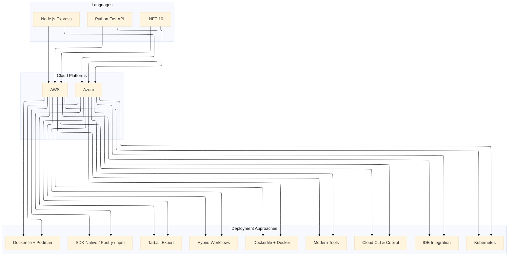

# This digest serves as your roadmap to this extensi

```mermaid
---
config:
  theme: base
  layout: elk
---
graph TD
    subgraph "Languages"
        A[.NET 10]
        B[Python FastAPI]
        C[Node.js Express]
    end
    
    subgraph "Cloud Platforms"
        D[Azure]
        E[AWS]
    end
    
    subgraph "Deployment Approaches"
        F[SDK Native / Poetry / npm]
        G[Dockerfile + Docker]
        H[Dockerfile + Podman]
        I[Cloud CLI & Copilot]
        J[IDE Integration]
        K[Tarball Export]
        L[Hybrid Workflows]
        M[Modern Tools]
        N[Kubernetes]
    end
    
    A --> D
    A --> E
    B --> D
    B --> E
    C --> D
    C --> E
    
    D --> F
    D --> G
    D --> H
    D --> I
    D --> J
    D --> K
    D --> L
    D --> M
    D --> N
    
    E --> F
    E --> G
    E --> H
    E --> I
    E --> J
    E --> K
    E --> L
    E --> M
    E --> N
```
