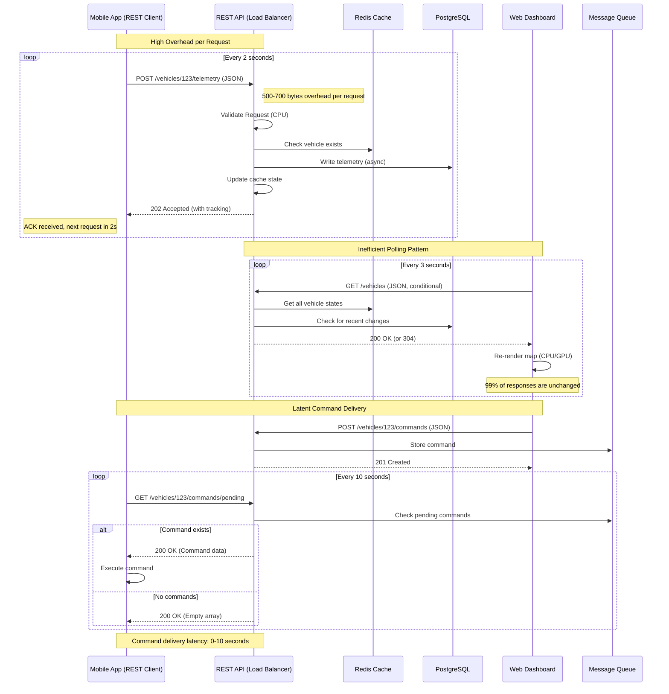
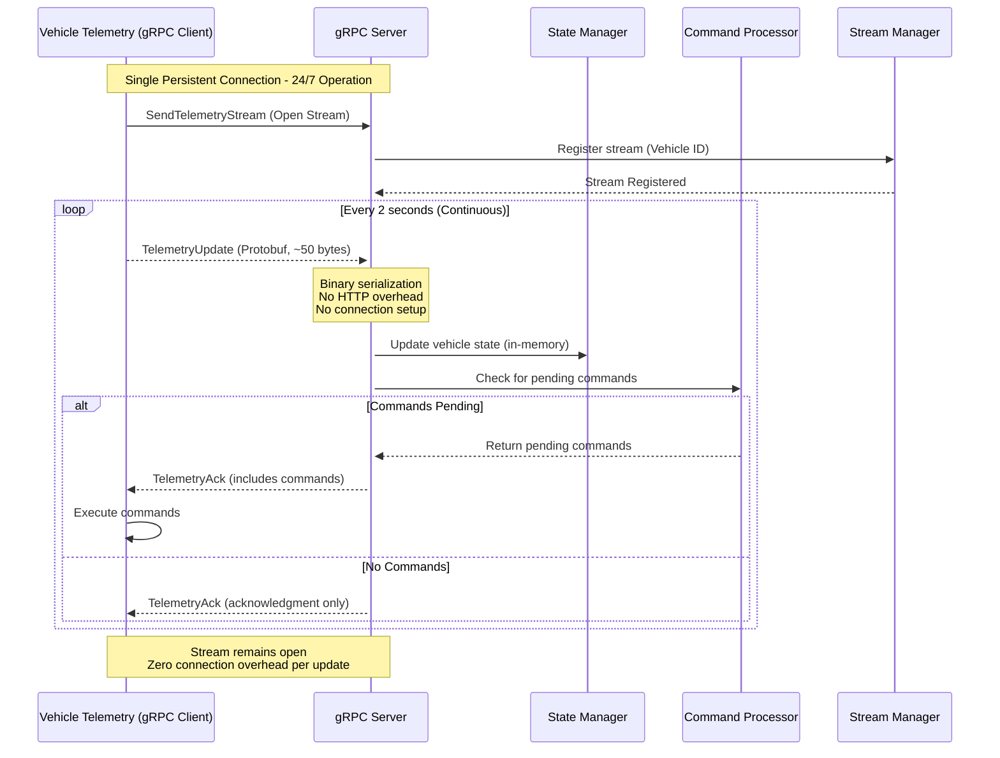
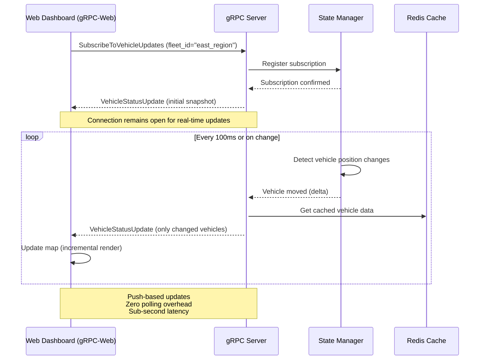
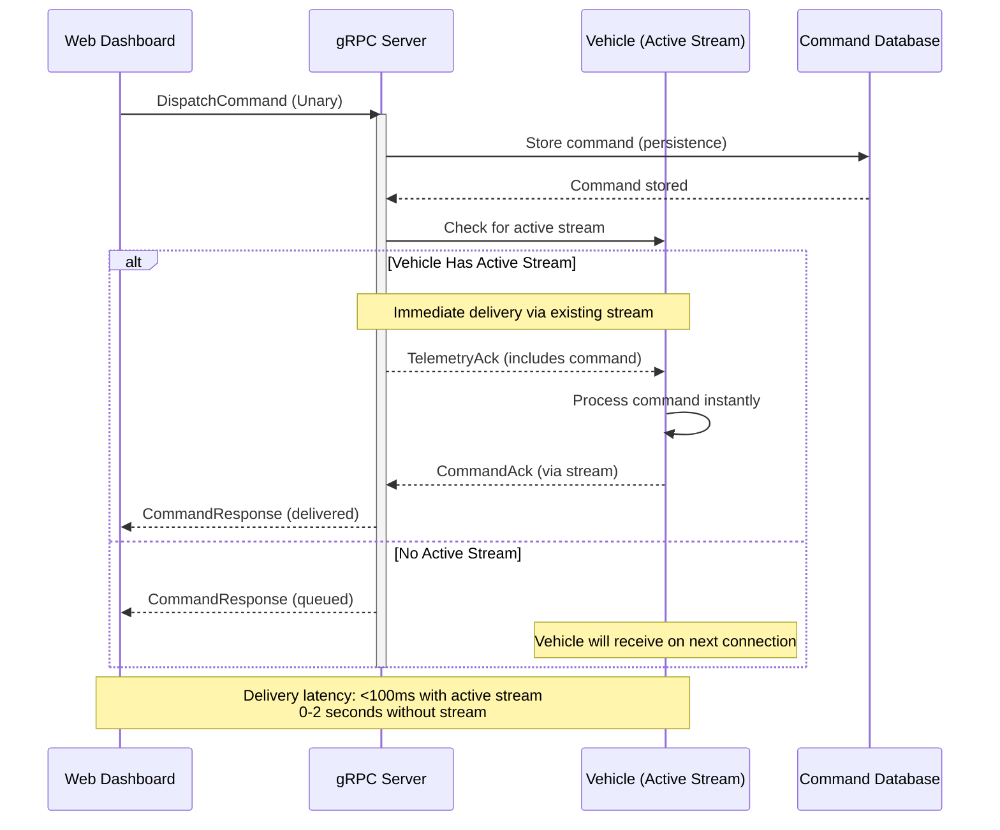

# From REST to gRPC: Architecting High-Performance APIs in .NET 10
## Decision Framework: REST for Public APIs, gRPC for Internal High-Performance Microservices


The architectural decision between REST and gRPC is rarely just about data formats. It is a fundamental choice that dictates the entire lifecycle of an API—from contract definition and client generation to performance characteristics, streaming capabilities, deployment strategies, and operational observability. This decision ripples through every layer of the application stack, influencing how teams collaborate, how systems scale, and how efficiently resources are utilized in production environments.

This document explores this evolution through a practical use case: a real-time **Fleet Management System**. The journey begins with a traditional REST API, highlighting its operational friction and architectural limitations, and culminates in a high-performance gRPC service built with .NET 10. The focus is on the "why" and "how," leveraging the latest features of the .NET ecosystem—including AI-integrated Minimal APIs, enhanced middleware pipelines, Native AOT compilation, and advanced telemetry support—to build robust, scalable, and maintainable services.

---

## The Scenario: Fleet Management System

Modern logistics and transportation companies face increasing demands for real-time visibility, operational efficiency, and seamless communication between drivers, dispatchers, and management systems. A typical fleet management platform must handle thousands of vehicles simultaneously, each generating continuous streams of telemetry data while receiving time-sensitive commands from central operations.

Consider a system with two primary consumers, each with distinct communication patterns and performance requirements:

1.  **A Mobile Driver App (React Native):** Deployed on iOS and Android devices across a distributed fleet of vehicles. This application requires sending location updates (telemetry) every 2 seconds, including GPS coordinates, speed, heading, engine diagnostics, and driver status. The app operates in varying network conditions—from 5G in urban areas to intermittent connectivity in rural regions—demanding efficient data transmission and resilient communication patterns. Each vehicle generates approximately 43,200 telemetry updates per 12-hour shift, creating significant data ingress requirements.

2.  **A Web Dashboard (React):** Accessed by dispatchers, fleet managers, and operations personnel through modern web browsers. This interface displays a live map of all vehicles with real-time position updates, shows vehicle status indicators, allows command dispatch (e.g., "re-route," "maintenance alert," "emergency stop"), and provides historical trip data. The dashboard requires near-instantaneous updates to provide accurate situational awareness, with any latency beyond 2-3 seconds creating operational blind spots.

The core backend service, **Telemetry & Dispatch**, is responsible for ingesting high-volume location data from the mobile fleet, maintaining real-time vehicle state, broadcasting commands to specific vehicles or groups, and serving aggregated data to the dashboard and other downstream systems. This service must handle hundreds of concurrent connections, maintain low-latency data processing, and ensure reliable command delivery even under failure conditions.

---

## The REST Approach: A Foundation of Friction

### Initial API Design

Initially, a REST API is designed following resource-oriented architectural principles. The endpoints are clean, intuitive, and adhere to HTTP semantics, making them immediately understandable to developers familiar with REST conventions.

#### REST Endpoint Structure

- **`POST /api/v1/vehicles/{vehicleId}/telemetry`** : The mobile app sends a JSON payload for each location update. This endpoint accepts telemetry data, validates it against business rules, persists it to the database, and updates the vehicle's current state in the cache.

- **`GET /api/v1/vehicles`** : The web dashboard polls this endpoint every 3 seconds to fetch the current status and location of all active vehicles. The response includes vehicle identifiers, coordinates, speed, last update timestamp, and any pending commands.

- **`POST /api/v1/vehicles/{vehicleId}/commands`** : Dispatchers use this endpoint to send operational commands to specific vehicles. The command is stored in a queue or database table, awaiting pickup by the target vehicle's mobile app.

- **`GET /api/v1/vehicles/{vehicleId}/commands/pending`** : The mobile app polls this endpoint every 10 seconds to check for new commands directed to its vehicle. This pull-based approach ensures commands eventually reach the vehicle but introduces inherent latency.

The API contract is formally defined via an OpenAPI (Swagger) specification, which provides documentation, request/response schemas, and enables client code generation. However, this specification is maintained separately from the implementation, creating potential for drift.

#### REST API Controller Implementation (.NET 10)

```csharp
using Microsoft.AspNetCore.Mvc;
using Microsoft.AspNetCore.OutputCaching;
using System.ComponentModel.DataAnnotations;

namespace FleetManagement.Rest.Controllers;

/// <summary>
/// REST API controller for vehicle operations.
/// Implements resource-oriented endpoints with standard HTTP semantics.
/// </summary>
[ApiController]
[Route("api/v1/[controller]")]
[Produces("application/json")]
[Consumes("application/json")]
public class VehiclesController : ControllerBase
{
    private readonly ILogger<VehiclesController> _logger;
    private readonly IVehicleTelemetryService _telemetryService;
    private readonly IVehicleCommandService _commandService;
    private readonly IVehicleCacheService _cacheService;
    private readonly IMediator _mediator; // For CQRS pattern integration

    public VehiclesController(
        ILogger<VehiclesController> logger,
        IVehicleTelemetryService telemetryService,
        IVehicleCommandService commandService,
        IVehicleCacheService cacheService,
        IMediator mediator)
    {
        _logger = logger;
        _telemetryService = telemetryService;
        _commandService = commandService;
        _cacheService = cacheService;
        _mediator = mediator;
    }

    /// <summary>
    /// REST endpoint for updating vehicle telemetry.
    /// Accepts JSON payload, validates, and processes the telemetry update.
    /// </summary>
    /// <param name="vehicleId">The unique identifier of the vehicle</param>
    /// <param name="request">Telemetry data from the vehicle</param>
    /// <returns>202 Accepted with tracking ID for async processing</returns>
    /// <response code="202">Telemetry update accepted for processing</response>
    /// <response code="400">Invalid telemetry data provided</response>
    /// <response code="404">Vehicle not found</response>
    [HttpPost("{vehicleId}/telemetry")]
    [ProducesResponseType(typeof(TelemetryAcceptanceResponse), StatusCodes.Status202Accepted)]
    [ProducesResponseType(typeof(ValidationProblemDetails), StatusCodes.Status400BadRequest)]
    [ProducesResponseType(StatusCodes.Status404NotFound)]
    public async Task<IActionResult> UpdateTelemetry(
        string vehicleId,
        [FromBody] TelemetryUpdateRequest request)
    {
        // .NET 10: Enhanced model validation with better error messages.
        // The ValidationContext now includes service provider for more complex validations.
        if (!ModelState.IsValid)
        {
            _logger.LogWarning("REST: Invalid telemetry data for vehicle {VehicleId}: {Errors}",
                vehicleId, ModelState.GetValidationErrors());
            return BadRequest(ModelState);
        }

        // Validate vehicle existence
        var vehicleExists = await _cacheService.VehicleExistsAsync(vehicleId);
        if (!vehicleExists)
        {
            _logger.LogWarning("REST: Telemetry update for unknown vehicle {VehicleId}", vehicleId);
            return NotFound(new { Message = $"Vehicle {vehicleId} not found" });
        }

        // Generate tracking ID for the update
        var trackingId = Guid.NewGuid().ToString();
        
        _logger.LogInformation("REST: Received telemetry for {VehicleId} at {Lat}/{Lng} (Tracking: {TrackingId})",
            vehicleId, request.Latitude, request.Longitude, trackingId);

        // .NET 10: New IAsyncEnumerable support for batch processing.
        // The telemetry service can return a stream of processing results.
        var result = await _telemetryService.ProcessTelemetryUpdateAsync(
            vehicleId,
            request.Latitude,
            request.Longitude,
            request.SpeedKph,
            request.Heading,
            request.EngineStatus,
            request.Timestamp ?? DateTime.UtcNow,
            trackingId);

        // REST semantics: 202 Accepted for async processing.
        // The client can use the tracking ID to check status if needed.
        return Accepted(new TelemetryAcceptanceResponse
        {
            TrackingId = trackingId,
            Message = "Telemetry update accepted for processing",
            EstimatedProcessingTimeMs = result.EstimatedProcessingTimeMs,
            StatusUrl = $"/api/v1/telemetry/status/{trackingId}"
        });
    }

    /// <summary>
    /// REST endpoint for retrieving all active vehicles with current status.
    /// Uses output caching to reduce database load and improve response times.
    /// </summary>
    /// <returns>List of active vehicles with current telemetry</returns>
    [HttpGet]
    [OutputCache(Duration = 2, VaryByQueryKeys = new[] { "fleetId", "status" })]
    [ProducesResponseType(typeof(VehicleStatusListResponse), StatusCodes.Status200OK)]
    public async Task<IActionResult> GetAllVehicles(
        [FromQuery] string? fleetId = null,
        [FromQuery] string? status = null,
        [FromQuery] int page = 1,
        [FromQuery] int pageSize = 50)
    {
        // .NET 10: New [AsParameters] attribute for cleaner parameter binding.
        // This automatically binds query parameters to a complex object.
        
        _logger.LogDebug("REST: Fetching vehicles - Fleet: {FleetId}, Status: {Status}, Page: {Page}",
            fleetId, status ?? "all", page);

        // Use CQRS pattern via Mediator
        var query = new GetVehiclesQuery
        {
            FleetId = fleetId,
            Status = status,
            Page = page,
            PageSize = pageSize
        };
        
        var result = await _mediator.Send(query);
        
        // Set cache headers for CDN/Proxy caching
        Response.Headers.CacheControl = "public, max-age=2, stale-while-revalidate=3";
        Response.Headers.ETag = $"\"{result.ETag}\"";
        
        return Ok(new VehicleStatusListResponse
        {
            Vehicles = result.Vehicles,
            TotalCount = result.TotalCount,
            Page = page,
            PageSize = pageSize,
            HasMore = result.HasMore
        });
    }

    /// <summary>
    /// REST endpoint for dispatching commands to vehicles.
    /// </summary>
    /// <param name="vehicleId">Target vehicle identifier</param>
    /// <param name="request">Command details</param>
    /// <returns>201 Created with command tracking information</returns>
    [HttpPost("{vehicleId}/commands")]
    [ProducesResponseType(typeof(CommandResponse), StatusCodes.Status201Created)]
    [ProducesResponseType(StatusCodes.Status400BadRequest)]
    public async Task<IActionResult> DispatchCommand(
        string vehicleId,
        [FromBody] DispatchCommandRequest request)
    {
        if (!ModelState.IsValid)
        {
            return BadRequest(ModelState);
        }

        _logger.LogInformation("REST: Dispatching {CommandType} command to {VehicleId}",
            request.CommandType, vehicleId);

        var command = new VehicleCommand
        {
            CommandId = Guid.NewGuid().ToString(),
            VehicleId = vehicleId,
            CommandType = request.CommandType,
            Payload = request.Payload,
            DispatchedAt = DateTime.UtcNow,
            DispatchedBy = User.Identity?.Name ?? "system",
            Status = CommandStatus.Pending
        };

        var result = await _commandService.DispatchCommandAsync(command);
        
        if (!result.Success)
        {
            return BadRequest(new { Error = result.ErrorMessage });
        }

        // REST semantics: Return 201 Created with location header for the command resource
        return CreatedAtAction(
            nameof(GetCommandStatus),
            new { vehicleId, commandId = command.CommandId },
            new CommandResponse
            {
                CommandId = command.CommandId,
                Status = CommandStatus.Pending,
                EstimatedDeliveryTime = result.EstimatedDeliveryTime,
                Message = "Command accepted and queued for delivery"
            });
    }

    /// <summary>
    /// REST endpoint for checking pending commands (polling for mobile app).
    /// </summary>
    [HttpGet("{vehicleId}/commands/pending")]
    [ProducesResponseType(typeof(PendingCommandsResponse), StatusCodes.Status200OK)]
    public async Task<IActionResult> GetPendingCommands(string vehicleId)
    {
        var pendingCommands = await _commandService.GetPendingCommandsAsync(vehicleId);
        
        // Use conditional GET to reduce bandwidth
        var lastCommandId = pendingCommands.LastOrDefault()?.CommandId;
        var ifNoneMatch = Request.Headers.IfNoneMatch.ToString();
        
        if (!string.IsNullOrEmpty(lastCommandId) && ifNoneMatch == $"\"{lastCommandId}\"")
        {
            return StatusCode(StatusCodes.Status304NotModified);
        }
        
        Response.Headers.ETag = lastCommandId != null ? $"\"{lastCommandId}\"" : "\"empty\"";
        
        return Ok(new PendingCommandsResponse
        {
            Commands = pendingCommands,
            PollIntervalRecommendedSeconds = 10,
            HasMore = false
        });
    }
}

// DTOs are manually defined and maintained separately from the business logic.
// Any schema change requires coordinated updates across multiple codebases.
public record TelemetryUpdateRequest(
    [Required] double Latitude,
    [Required] double Longitude,
    double SpeedKph,
    double Heading,
    string? EngineStatus,
    DateTime? Timestamp
);

public record TelemetryAcceptanceResponse(
    string TrackingId,
    string Message,
    int EstimatedProcessingTimeMs,
    string StatusUrl
);

public record VehicleStatusListResponse(
    IEnumerable<VehicleStatusDto> Vehicles,
    int TotalCount,
    int Page,
    int PageSize,
    bool HasMore
);

public record DispatchCommandRequest(
    [Required] string CommandType,
    object Payload
);

public record CommandResponse(
    string CommandId,
    CommandStatus Status,
    DateTime? EstimatedDeliveryTime,
    string Message
);
```

#### The Operational Friction

While this REST API implementation is functional and follows industry best practices, several critical issues emerge as the system scales from a pilot deployment to production scale with hundreds of vehicles:

1.  **Chatty Communication & Protocol Overhead:** The mobile app sends approximately 43,200 requests per vehicle per 12-hour shift. Each request includes verbose JSON headers (typically 300-500 bytes of HTTP headers alone) and a JSON payload (another 150-200 bytes). For a fleet of 500 vehicles, this translates to over 21 million requests per day and approximately 15 GB of daily data transfer just for telemetry. The HTTP/1.1 request-response cycle also requires establishing TCP connections, TLS handshakes, and waiting for responses, creating significant CPU and memory overhead on both client and server.

2.  **Polling Inefficiency and Latency:** The web dashboard polls the `/api/v1/vehicles` endpoint every 3 seconds for all active vehicles. In a fleet of 500 vehicles, 99% of these polling requests return the same data as the previous request, as vehicle positions change relatively slowly. This creates approximately 28,800 unnecessary database queries per day, consumes bandwidth, and forces the dashboard to process and re-render the same data repeatedly. More critically, the polling approach introduces a latency floor: a vehicle that moves immediately after a poll won't appear on the dashboard for up to 3 seconds.

3.  **Schema Drift and Coordination Overhead:** The `TelemetryUpdateRequest` DTO must be manually duplicated across the backend (C#), mobile app (TypeScript/React Native), dashboard (TypeScript/React), and any other consuming services. When a new field is needed (e.g., `batteryLevel` for electric vehicles), the change requires coordinated releases across multiple teams. Even with OpenAPI code generation, the generated clients are often heavy and require manual integration. This leads to development bottlenecks, versioning complexity, and increased risk of runtime errors due to mismatched expectations.

4.  **No Native Real-Time Communication:** Dispatching a command to a vehicle requires the dashboard to make a `POST` request to create a command resource. The mobile app has no persistent connection to the server and must poll for pending commands every 10-30 seconds. This introduces unacceptable latency for time-sensitive operations like emergency stops, route changes due to traffic incidents, or security alerts. A command that needs to reach a driver within seconds may take up to 30 seconds to be delivered, creating operational risk.

5.  **Connection Management Overhead:** Each HTTP request from a mobile app in a REST architecture requires establishing or reusing a connection, performing TLS negotiation, sending headers, processing the request, and closing or pooling the connection. Even with HTTP keep-alive, the overhead per request remains substantial. For battery-powered devices, this constant network activity significantly impacts battery life.

6.  **Inconsistent Error Handling and Retry Logic:** REST APIs typically return HTTP status codes to indicate success or failure. However, implementing robust retry logic with exponential backoff, handling transient failures, and managing partial failures across distributed components becomes complex and is often implemented inconsistently across different clients.



---

## The gRPC Solution: A Contract-First, Streamlined Architecture

### Rethinking the Communication Paradigm

To address the fundamental limitations of REST, the team refactors the Telemetry & Dispatch service to use **gRPC**—a high-performance, open-source RPC framework originally developed by Google. This shift moves the architecture from a document-centric model (where resources are transferred over HTTP) to a contract-first, RPC-based model where operations are explicitly defined and optimized for efficiency.

gRPC leverages HTTP/2 as its transport protocol, bringing several critical advantages:
- **Multiplexing:** Multiple concurrent requests and responses can be sent over a single TCP connection without head-of-line blocking.
- **Binary Framing:** All data is transmitted in a compact binary format, reducing overhead.
- **Bidirectional Streaming:** Both client and server can initiate streams of messages simultaneously.
- **Header Compression:** HTTP/2 header compression (HPACK) significantly reduces header overhead.

Combined with Protocol Buffers (Protobuf) as the interface definition language and serialization format, gRPC provides a comprehensive solution for high-performance service communication.

### Step 1: Defining the Contract with Protocol Buffers (Protobuf)

The source of truth becomes a `.proto` file. This file defines the service methods, message structures, and data types in a language-agnostic format. From this single file, the .NET SDK generates strongly-typed client and server code, ensuring type safety and eliminating the need for manual DTO maintenance.

**`telemetry.proto`** - Complete Service Definition

```protobuf
syntax = "proto3";

// Package declaration for namespace organization
package fleetmanagement.telemetry.v1;

// C# namespace for generated code
option csharp_namespace = "FleetManagement.Grpc.Protos.V1";

// Import for Google's well-known types
import "google/protobuf/timestamp.proto";
import "google/protobuf/empty.proto";

// Service definition: The complete telemetry and command API
service TelemetryService {
    // Client-side streaming: Efficient telemetry ingestion from mobile devices.
    // The client opens a stream and sends multiple TelemetryUpdate messages.
    // The server responds once with a TelemetryAck after processing.
    rpc SendTelemetryStream (stream TelemetryUpdate) returns (TelemetryAck);
    
    // Server-side streaming: Real-time dashboard updates.
    // The client subscribes, and the server continuously pushes VehicleStatusUpdate messages.
    rpc SubscribeToVehicleUpdates (SubscribeRequest) returns (stream VehicleStatusUpdate);
    
    // Bidirectional streaming: Advanced use case for command/response with ACKs.
    // Both client and server can send messages independently.
    rpc BidirectionalCommandChannel (stream CommandEnvelope) returns (stream CommandResponseEnvelope);
    
    // Unary call: Simple command dispatch with immediate response.
    // Used for non-critical commands that don't require streaming confirmation.
    rpc DispatchCommand (CommandRequest) returns (CommandResponse);
    
    // Unary call: Get historical telemetry for a vehicle.
    rpc GetVehicleHistory (HistoryRequest) returns (HistoryResponse);
    
    // Unary call: Health check with detailed service status.
    rpc HealthCheck (google.protobuf.Empty) returns (HealthStatus);
}

// ========== Telemetry Messages ==========

// Telemetry update from a vehicle
message TelemetryUpdate {
    // Unique vehicle identifier (VIN or fleet ID)
    string vehicle_id = 1;
    
    // GPS coordinates
    double latitude = 2;
    double longitude = 3;
    
    // Vehicle dynamics
    double speed_kph = 4;
    double heading_degrees = 5;
    double acceleration_ms2 = 6;
    
    // Engine and battery status
    EngineStatus engine_status = 7;
    BatteryStatus battery_status = 8;
    
    // Diagnostic information
    repeated DiagnosticCode diagnostic_codes = 9;
    
    // Timestamp when telemetry was captured (millisecond precision)
    google.protobuf.Timestamp captured_at = 10;
    
    // Optional: Additional metadata as key-value pairs
    map<string, string> metadata = 11;
}

// Engine status information
message EngineStatus {
    bool is_running = 1;
    int32 rpm = 2;
    double engine_temperature_celsius = 3;
    double fuel_level_percent = 4;
    int32 odometer_km = 5;
}

// Battery status for electric/hybrid vehicles
message BatteryStatus {
    double state_of_charge_percent = 1;
    double battery_temperature_celsius = 2;
    double voltage_volts = 3;
    double current_amps = 4;
    BatteryHealth health = 5;
}

enum BatteryHealth {
    BATTERY_HEALTH_UNSPECIFIED = 0;
    BATTERY_HEALTH_EXCELLENT = 1;
    BATTERY_HEALTH_GOOD = 2;
    BATTERY_HEALTH_FAIR = 3;
    BATTERY_HEALTH_POOR = 4;
}

// Diagnostic trouble codes (DTC)
message DiagnosticCode {
    string code = 1;  // e.g., "P0300"
    string description = 2;
    bool is_active = 3;
}

// Acknowledgment from server after processing telemetry stream
message TelemetryAck {
    // Number of updates successfully processed
    int32 updates_received = 1;
    
    // Number of updates that failed validation
    int32 updates_failed = 2;
    
    // Timestamp of the last processed update
    google.protobuf.Timestamp last_processed_at = 3;
    
    // Server-assigned session ID for tracking
    string session_id = 4;
    
    // Optional: Any commands that should be sent back to the vehicle
    repeated PendingCommand pending_commands = 5;
}

// ========== Real-time Status Messages ==========

// Request for subscribing to vehicle updates
message SubscribeRequest {
    // Optional: Filter by fleet ID
    string fleet_id = 1;
    
    // Optional: Filter by vehicle IDs
    repeated string vehicle_ids = 2;
    
    // Update frequency preference (server may adjust)
    int32 preferred_interval_ms = 3;
    
    // Client identifier for tracking
    string client_id = 4;
}

// Real-time status update for a vehicle (pushed to dashboard)
message VehicleStatusUpdate {
    string vehicle_id = 1;
    
    // Current location
    double latitude = 2;
    double longitude = 3;
    
    // Current dynamics
    double speed_kph = 4;
    double heading_degrees = 5;
    
    // Status flags
    VehicleOperationalStatus status = 6;
    bool is_online = 7;
    
    // Timestamps
    google.protobuf.Timestamp last_update_at = 8;
    google.protobuf.Timestamp last_command_at = 9;
    
    // Any pending commands for this vehicle
    repeated PendingCommand pending_commands = 10;
    
    // Driver information
    DriverInfo driver = 11;
    
    // Geofence information (if applicable)
    string current_geofence_id = 12;
}

enum VehicleOperationalStatus {
    VEHICLE_STATUS_UNSPECIFIED = 0;
    VEHICLE_STATUS_ACTIVE = 1;
    VEHICLE_STATUS_IDLE = 2;
    VEHICLE_STATUS_OFFLINE = 3;
    VEHICLE_STATUS_MAINTENANCE = 4;
    VEHICLE_STATUS_EMERGENCY = 5;
}

message DriverInfo {
    string driver_id = 1;
    string driver_name = 2;
    string license_number = 3;
    bool is_on_duty = 4;
}

// ========== Command Messages ==========

// Command request for dispatching to a vehicle
message CommandRequest {
    // Target vehicle
    string vehicle_id = 1;
    
    // Command type determines how the payload is interpreted
    CommandType command_type = 2;
    
    // Command payload (type-specific structure)
    oneof payload {
        RouteCommand route = 3;
        MaintenanceCommand maintenance = 4;
        AlertCommand alert = 5;
        ControlCommand control = 6;
        string raw_json = 7;  // For extensibility
    }
    
    // Priority level
    CommandPriority priority = 8;
    
    // Expiration time for time-sensitive commands
    google.protobuf.Timestamp expires_at = 9;
    
    // Dispatcher identifier
    string dispatched_by = 10;
}

enum CommandType {
    COMMAND_TYPE_UNSPECIFIED = 0;
    COMMAND_TYPE_UPDATE_ROUTE = 1;
    COMMAND_TYPE_MAINTENANCE_ALERT = 2;
    COMMAND_TYPE_EMERGENCY_STOP = 3;
    COMMAND_TYPE_LOCATION_REQUEST = 4;
    COMMAND_TYPE_DIAGNOSTIC_REQUEST = 5;
    COMMAND_TYPE_SOFTWARE_UPDATE = 6;
}

enum CommandPriority {
    COMMAND_PRIORITY_UNSPECIFIED = 0;
    COMMAND_PRIORITY_LOW = 1;
    COMMAND_PRIORITY_NORMAL = 2;
    COMMAND_PRIORITY_HIGH = 3;
    COMMAND_PRIORITY_CRITICAL = 4;
}

// Route update command payload
message RouteCommand {
    repeated Waypoint waypoints = 1;
    string route_id = 2;
    string estimated_duration = 3;  // Duration string (e.g., "2h30m")
    int32 estimated_distance_km = 4;
}

message Waypoint {
    double latitude = 1;
    double longitude = 2;
    string address = 3;
    google.protobuf.Timestamp estimated_arrival = 4;
    string notes = 5;
}

// Maintenance alert command payload
message MaintenanceCommand {
    MaintenanceType type = 1;
    string service_center_id = 2;
    google.protobuf.Timestamp scheduled_at = 3;
    string notes = 4;
}

enum MaintenanceType {
    MAINTENANCE_TYPE_UNSPECIFIED = 0;
    MAINTENANCE_TYPE_OIL_CHANGE = 1;
    MAINTENANCE_TYPE_TIRE_ROTATION = 2;
    MAINTENANCE_TYPE_BRAKE_INSPECTION = 3;
    MAINTENANCE_TYPE_SOFTWARE_UPDATE = 4;
}

// Alert command payload
message AlertCommand {
    AlertSeverity severity = 1;
    string title = 2;
    string message = 3;
    repeated string acknowledgment_required = 4;
}

enum AlertSeverity {
    ALERT_SEVERITY_UNSPECIFIED = 0;
    ALERT_SEVERITY_INFO = 1;
    ALERT_SEVERITY_WARNING = 2;
    ALERT_SEVERITY_URGENT = 3;
    ALERT_SEVERITY_EMERGENCY = 4;
}

// Control command payload (for vehicle controls)
message ControlCommand {
    ControlAction action = 1;
    map<string, string> parameters = 2;
}

enum ControlAction {
    CONTROL_ACTION_UNSPECIFIED = 0;
    CONTROL_ACTION_ENGINE_START = 1;
    CONTROL_ACTION_ENGINE_STOP = 2;
    CONTROL_ACTION_LOCK_DOORS = 3;
    CONTROL_ACTION_UNLOCK_DOORS = 4;
    CONTROL_ACTION_ACTIVATE_HAZARDS = 5;
}

// Command response from server
message CommandResponse {
    // Unique command identifier
    string command_id = 1;
    
    // Success status
    bool success = 2;
    
    // Human-readable message
    string message = 3;
    
    // Estimated delivery time for async commands
    google.protobuf.Timestamp estimated_delivery_at = 4;
    
    // Current command status
    CommandStatus status = 5;
}

// Pending command (for inclusion in status updates)
message PendingCommand {
    string command_id = 1;
    CommandType command_type = 2;
    string payload_json = 3;
    CommandPriority priority = 4;
    google.protobuf.Timestamp dispatched_at = 5;
    string dispatched_by = 6;
}

// Command status enumeration
enum CommandStatus {
    COMMAND_STATUS_UNSPECIFIED = 0;
    COMMAND_STATUS_PENDING = 1;
    COMMAND_STATUS_DELIVERED = 2;
    COMMAND_STATUS_ACKNOWLEDGED = 3;
    COMMAND_STATUS_EXECUTED = 4;
    COMMAND_STATUS_FAILED = 5;
    COMMAND_STATUS_EXPIRED = 6;
}

// ========== Bidirectional Streaming Messages ==========

// Envelope for bidirectional command channel
message CommandEnvelope {
    oneof message_type {
        CommandRequest command = 1;
        CommandAck ack = 2;
        TelemetryUpdate telemetry = 3;
        KeepAlive keep_alive = 4;
    }
}

message CommandResponseEnvelope {
    oneof message_type {
        CommandResponse command_response = 1;
        TelemetryAck telemetry_ack = 2;
        ServerKeepAlive keep_alive = 3;
    }
}

message CommandAck {
    string command_id = 1;
    CommandStatus status = 2;
    string message = 3;
    google.protobuf.Timestamp acknowledged_at = 4;
}

message KeepAlive {
    int64 sequence_number = 1;
    google.protobuf.Timestamp sent_at = 2;
}

message ServerKeepAlive {
    int64 last_sequence_received = 1;
    google.protobuf.Timestamp server_time = 2;
}

// ========== History Messages ==========

message HistoryRequest {
    string vehicle_id = 1;
    google.protobuf.Timestamp start_time = 2;
    google.protobuf.Timestamp end_time = 3;
    int32 limit = 4;
    string cursor = 5;  // For pagination
}

message HistoryResponse {
    repeated TelemetryUpdate telemetry_history = 1;
    string next_cursor = 2;
    bool has_more = 3;
}

// ========== Health Check ==========

message HealthStatus {
    string service_name = 1;
    ServiceStatus status = 2;
    google.protobuf.Timestamp checked_at = 3;
    map<string, ComponentStatus> components = 4;
    string version = 5;
}

enum ServiceStatus {
    SERVICE_STATUS_UNSPECIFIED = 0;
    SERVICE_STATUS_HEALTHY = 1;
    SERVICE_STATUS_DEGRADED = 2;
    SERVICE_STATUS_UNHEALTHY = 3;
}

message ComponentStatus {
    string name = 1;
    ServiceStatus status = 2;
    string message = 3;
    int64 latency_ms = 4;
}
```

### Step 2: Implementing the gRPC Service in .NET 10

The implementation in .NET 10 is clean, leveraging the generated base classes from the `.proto` file. The code focuses purely on business logic, not HTTP semantics, resulting in more maintainable and testable code. .NET 10 introduces several enhancements that make gRPC service implementation even more productive.

#### Complete gRPC Service Implementation

```csharp
using Grpc.Core;
using Google.Protobuf.WellKnownTypes;
using FleetManagement.Grpc.Protos.V1;
using Microsoft.Extensions.Caching.Memory;
using System.Runtime.CompilerServices;
using System.Diagnostics;
using System.Threading.Channels;

namespace FleetManagement.Grpc.Services;

/// <summary>
/// Complete gRPC service implementation for fleet telemetry and command management.
/// Demonstrates all streaming patterns and .NET 10 features.
/// </summary>
public class TelemetryService(
    ILogger<TelemetryService> logger,
    IVehicleStateManager stateManager,
    ICommandProcessor commandProcessor,
    IMemoryCache cache,
    ITelemetryValidator validator,
    IMessageBroker messageBroker,
    IConfiguration configuration)  // .NET 10: Primary constructor with multiple dependencies
    : TelemetryService.TelemetryServiceBase
{
    private readonly ActivitySource _activitySource = DiagnosticsConfig.Source;
    private readonly int _maxStreamUpdates = configuration.GetValue<int>("Grpc:MaxStreamUpdates", 10000);
    private readonly TimeSpan _streamKeepAliveInterval = TimeSpan.FromSeconds(30);
    
    // ========================================================================
    // 1. Client-Side Streaming: Efficient Telemetry Ingestion
    // ========================================================================
    // This method accepts a stream of telemetry updates from a single vehicle
    // over a persistent connection. It replaces thousands of individual HTTP
    // requests with a single long-lived stream.
    // ========================================================================
    
    /// <summary>
    /// Processes a continuous stream of telemetry updates from a mobile device.
    /// .NET 10 features: IAsyncEnumerable integration, enhanced cancellation handling,
    /// and improved memory management for streaming scenarios.
    /// </summary>
    public override async Task<TelemetryAck> SendTelemetryStream(
        IAsyncStreamReader<TelemetryUpdate> requestStream,
        ServerCallContext context)
    {
        // Create activity for distributed tracing
        using var activity = _activitySource.StartActivity(
            "SendTelemetryStream",
            ActivityKind.Server,
            context.Peer);
        
        var sessionId = Guid.NewGuid().ToString();
        var vehicleId = string.Empty;
        int updateCount = 0;
        int failedCount = 0;
        var lastUpdateTime = DateTime.UtcNow;
        var pendingCommands = new List<PendingCommand>();
        
        // Channel for batching updates (optional: batch processing for efficiency)
        var batchChannel = Channel.CreateBounded<TelemetryUpdate>(
            new BoundedChannelOptions(1000)
            {
                FullMode = BoundedChannelFullMode.Wait,
                SingleReader = true,
                SingleWriter = false
            });
        
        // Start background processor for batched updates
        var batchProcessor = Task.Run(async () =>
        {
            await foreach (var batch in batchChannel.Reader.ReadAllAsync(context.CancellationToken))
            {
                await ProcessBatchTelemetryAsync(batch, vehicleId);
            }
        });
        
        logger.LogInformation(
            "gRPC: Telemetry stream started - Session: {SessionId}, Peer: {Peer}",
            sessionId,
            context.Peer);
        
        try
        {
            // .NET 10: IAsyncEnumerable integration with ConfigureAwait is optimized
            // and no longer requires explicit ConfigureAwait(false) in library code.
            await foreach (var update in requestStream.ReadAllAsync(context.CancellationToken))
            {
                // Track vehicle ID from first update
                if (string.IsNullOrEmpty(vehicleId))
                {
                    vehicleId = update.VehicleId;
                    activity?.SetTag("vehicle.id", vehicleId);
                    activity?.SetTag("grpc.session.id", sessionId);
                    
                    logger.LogInformation(
                        "gRPC: Telemetry stream established - Vehicle: {VehicleId}, Session: {SessionId}",
                        vehicleId,
                        sessionId);
                }
                
                // Validate telemetry data
                var validationResult = await validator.ValidateAsync(update, context.CancellationToken);
                if (!validationResult.IsValid)
                {
                    logger.LogWarning(
                        "gRPC: Invalid telemetry from {VehicleId}: {Errors}",
                        vehicleId,
                        string.Join(", ", validationResult.Errors));
                    failedCount++;
                    continue;
                }
                
                // .NET 10: New TryAdd method on IMemoryCache for atomic operations
                // Update in-memory state with current vehicle position
                var vehicleState = new VehicleState
                {
                    VehicleId = update.VehicleId,
                    Latitude = update.Latitude,
                    Longitude = update.Longitude,
                    SpeedKph = update.SpeedKph,
                    Heading = update.HeadingDegrees,
                    LastUpdate = update.CapturedAt?.ToDateTime() ?? DateTime.UtcNow,
                    EngineRunning = update.EngineStatus?.IsRunning ?? false,
                    BatteryLevel = update.BatteryStatus?.StateOfChargePercent ?? 0
                };
                
                // Update state manager with current telemetry
                await stateManager.UpdateVehicleStateAsync(vehicleState, context.CancellationToken);
                
                // Check for any pending commands that need to be delivered
                var vehiclePendingCommands = await commandProcessor.GetPendingCommandsAsync(
                    vehicleId,
                    context.CancellationToken);
                
                if (vehiclePendingCommands.Any())
                {
                    pendingCommands.AddRange(vehiclePendingCommands.Select(c => new PendingCommand
                    {
                        CommandId = c.CommandId,
                        CommandType = c.CommandType,
                        PayloadJson = c.PayloadJson,
                        Priority = c.Priority,
                        DispatchedAt = Timestamp.FromDateTime(c.DispatchedAt),
                        DispatchedBy = c.DispatchedBy
                    }));
                }
                
                updateCount++;
                lastUpdateTime = DateTime.UtcNow;
                
                // Log every 100 updates for monitoring
                if (updateCount % 100 == 0)
                {
                    logger.LogDebug(
                        "gRPC: Processed {Count} telemetry updates for {VehicleId} - Session: {SessionId}",
                        updateCount,
                        vehicleId,
                        sessionId);
                }
                
                // Add to batch channel for async processing (optional)
                await batchChannel.Writer.WriteAsync(update, context.CancellationToken);
            }
            
            logger.LogInformation(
                "gRPC: Telemetry stream completed - Vehicle: {VehicleId}, Updates: {Count}, Failed: {Failed}, Session: {SessionId}",
                vehicleId,
                updateCount,
                failedCount,
                sessionId);
            
            // Return acknowledgment with session ID and pending commands
            return new TelemetryAck
            {
                UpdatesReceived = updateCount,
                UpdatesFailed = failedCount,
                LastProcessedAt = Timestamp.FromDateTime(lastUpdateTime),
                SessionId = sessionId,
                PendingCommands = { pendingCommands.Take(10) } // Limit to 10 commands per ACK
            };
        }
        catch (OperationCanceledException)
        {
            logger.LogWarning(
                "gRPC: Telemetry stream cancelled - Vehicle: {VehicleId}, Updates: {Count}, Session: {SessionId}",
                vehicleId,
                updateCount,
                sessionId);
            
            return new TelemetryAck
            {
                UpdatesReceived = updateCount,
                UpdatesFailed = failedCount,
                LastProcessedAt = Timestamp.FromDateTime(lastUpdateTime),
                SessionId = sessionId,
                Status = "Cancelled"
            };
        }
        catch (Exception ex)
        {
            logger.LogError(
                ex,
                "gRPC: Telemetry stream error - Vehicle: {VehicleId}, Session: {SessionId}",
                vehicleId,
                sessionId);
            
            throw new RpcException(
                new Status(StatusCode.Internal, "Telemetry processing failed"),
                new Metadata { { "session-id", sessionId } });
        }
        finally
        {
            batchChannel.Writer.TryComplete();
            await batchProcessor;
            activity?.SetTag("grpc.updates.processed", updateCount);
            activity?.SetTag("grpc.updates.failed", failedCount);
        }
    }
    
    // ========================================================================
    // 2. Server-Side Streaming: Real-time Dashboard Updates
    // ========================================================================
    // This method pushes continuous updates to dashboard clients.
    // The server maintains the connection and sends vehicle status snapshots
    // at regular intervals or when changes occur.
    // ========================================================================
    
    /// <summary>
    /// Streams real-time vehicle status updates to dashboard clients.
    /// .NET 10 features: PeriodicTimer for efficient timing, IAsyncEnumerable
    /// with cancellation, and improved activity tracing.
    /// </summary>
    public override async Task SubscribeToVehicleUpdates(
        SubscribeRequest request,
        IServerStreamWriter<VehicleStatusUpdate> responseStream,
        ServerCallContext context)
    {
        using var activity = _activitySource.StartActivity(
            "SubscribeToVehicleUpdates",
            ActivityKind.Server);
        
        var clientId = request.ClientId ?? Guid.NewGuid().ToString();
        var fleetId = request.FleetId ?? "all";
        var preferredInterval = request.PreferredIntervalMs > 0
            ? TimeSpan.FromMilliseconds(request.PreferredIntervalMs)
            : TimeSpan.FromSeconds(1);
        
        // Apply server-side rate limiting based on client type
        var updateInterval = clientId.StartsWith("dashboard_")
            ? TimeSpan.FromSeconds(1)
            : TimeSpan.FromMilliseconds(500);
        
        activity?.SetTag("client.id", clientId);
        activity?.SetTag("fleet.id", fleetId);
        activity?.SetTag("update.interval.ms", updateInterval.Milliseconds);
        
        logger.LogInformation(
            "gRPC: Dashboard subscription started - Client: {ClientId}, Fleet: {FleetId}, Interval: {Interval}ms",
            clientId,
            fleetId,
            updateInterval.TotalMilliseconds);
        
        // Track last update timestamp for each vehicle to detect changes
        var lastUpdateCache = new Dictionary<string, DateTime>();
        var lastUpdateCount = 0;
        
        // .NET 10: PeriodicTimer replaces System.Threading.Timer for async scenarios
        // Provides better cancellation support and async/await integration
        using var timer = new PeriodicTimer(updateInterval);
        
        try
        {
            // Keep streaming until the client disconnects
            while (await timer.WaitForNextTickAsync(context.CancellationToken))
            {
                // Get current snapshot of all vehicles (or filtered by fleet)
                var vehicles = string.IsNullOrEmpty(fleetId) || fleetId == "all"
                    ? await stateManager.GetAllVehiclesAsync(context.CancellationToken)
                    : await stateManager.GetVehiclesByFleetAsync(fleetId, context.CancellationToken);
                
                // Apply vehicle ID filtering if specified
                if (request.VehicleIds.Any())
                {
                    var vehicleIdSet = new HashSet<string>(request.VehicleIds);
                    vehicles = vehicles.Where(v => vehicleIdSet.Contains(v.VehicleId));
                }
                
                var statusUpdates = new List<VehicleStatusUpdate>();
                
                // Build status updates for each vehicle
                foreach (var vehicle in vehicles)
                {
                    // Only send updates if data has changed (optimization)
                    var lastUpdate = lastUpdateCache.GetValueOrDefault(vehicle.VehicleId);
                    var hasChanged = vehicle.LastUpdate > lastUpdate;
                    
                    if (!hasChanged && lastUpdateCache.ContainsKey(vehicle.VehicleId))
                    {
                        // Skip unchanged vehicles to reduce bandwidth
                        continue;
                    }
                    
                    // Get pending commands for this vehicle
                    var pendingCommands = await commandProcessor.GetPendingCommandsAsync(
                        vehicle.VehicleId,
                        context.CancellationToken);
                    
                    var statusUpdate = new VehicleStatusUpdate
                    {
                        VehicleId = vehicle.VehicleId,
                        Latitude = vehicle.Latitude,
                        Longitude = vehicle.Longitude,
                        SpeedKph = vehicle.SpeedKph,
                        HeadingDegrees = vehicle.Heading,
                        Status = DetermineVehicleStatus(vehicle),
                        IsOnline = vehicle.LastUpdate > DateTime.UtcNow.AddMinutes(-5),
                        LastUpdateAt = Timestamp.FromDateTime(vehicle.LastUpdate),
                        LastCommandAt = vehicle.LastCommandAt != default
                            ? Timestamp.FromDateTime(vehicle.LastCommandAt)
                            : null,
                        Driver = vehicle.Driver != null ? new DriverInfo
                        {
                            DriverId = vehicle.Driver.Id,
                            DriverName = vehicle.Driver.Name,
                            IsOnDuty = vehicle.Driver.IsOnDuty
                        } : null
                    };
                    
                    // Add pending commands to the update
                    foreach (var cmd in pendingCommands.Take(5)) // Limit per update
                    {
                        statusUpdate.PendingCommands.Add(new PendingCommand
                        {
                            CommandId = cmd.CommandId,
                            CommandType = cmd.CommandType,
                            PayloadJson = cmd.PayloadJson,
                            Priority = cmd.Priority,
                            DispatchedAt = Timestamp.FromDateTime(cmd.DispatchedAt)
                        });
                    }
                    
                    statusUpdates.Add(statusUpdate);
                    lastUpdateCache[vehicle.VehicleId] = vehicle.LastUpdate;
                }
                
                // Send all updates in a single stream operation
                if (statusUpdates.Any())
                {
                    foreach (var update in statusUpdates)
                    {
                        await responseStream.WriteAsync(update);
                        lastUpdateCount++;
                    }
                    
                    // Periodic logging
                    if (lastUpdateCount % 100 == 0)
                    {
                        logger.LogDebug(
                            "gRPC: Streamed {Count} vehicle updates to {ClientId}, Total: {Total}",
                            statusUpdates.Count,
                            clientId,
                            lastUpdateCount);
                    }
                }
                
                // .NET 10: Activity tags can be updated during execution
                activity?.SetTag("grpc.updates.streamed", lastUpdateCount);
            }
        }
        catch (OperationCanceledException)
        {
            logger.LogInformation(
                "gRPC: Dashboard subscription ended - Client: {ClientId}, Updates: {Count}",
                clientId,
                lastUpdateCount);
        }
        catch (Exception ex)
        {
            logger.LogError(
                ex,
                "gRPC: Dashboard subscription error - Client: {ClientId}",
                clientId);
            
            throw new RpcException(
                new Status(StatusCode.Internal, "Subscription stream error"));
        }
        finally
        {
            activity?.SetTag("grpc.total.updates", lastUpdateCount);
            activity?.Stop();
        }
    }
    
    // ========================================================================
    // 3. Bidirectional Streaming: Advanced Command/Response Channel
    // ========================================================================
    // This method establishes a full-duplex channel between a vehicle and
    // the server. Both parties can send commands, acknowledgments, and
    // telemetry simultaneously, enabling true real-time interaction.
    // ========================================================================
    
    /// <summary>
    /// Bidirectional streaming channel for advanced vehicle-server communication.
    /// Enables real-time command delivery, ACKs, and telemetry interleaving.
    /// .NET 10 features: ChannelReader/ChannelWriter integration, async streams,
    /// and improved resource management.
    /// </summary>
    public override async Task BidirectionalCommandChannel(
        IAsyncStreamReader<CommandEnvelope> requestStream,
        IServerStreamWriter<CommandResponseEnvelope> responseStream,
        ServerCallContext context)
    {
        using var activity = _activitySource.StartActivity("BidirectionalCommandChannel");
        
        var vehicleId = string.Empty;
        var keepAliveSequence = 0L;
        var pendingResponses = new Queue<CommandResponseEnvelope>();
        
        logger.LogInformation("gRPC: Bidirectional channel opened from {Peer}", context.Peer);
        
        // Task for processing incoming messages
        var receiveTask = Task.Run(async () =>
        {
            await foreach (var envelope in requestStream.ReadAllAsync(context.CancellationToken))
            {
                switch (envelope.MessageTypeCase)
                {
                    case CommandEnvelope.MessageTypeOneofCase.Command:
                        // Handle incoming command (vehicle sending command to server?)
                        logger.LogDebug("Received command from vehicle via bidirectional channel");
                        break;
                        
                    case CommandEnvelope.MessageTypeOneofCase.Ack:
                        // Handle command acknowledgment from vehicle
                        var ack = envelope.Ack;
                        logger.LogInformation(
                            "Vehicle {VehicleId} acknowledged command {CommandId}: {Status}",
                            vehicleId,
                            ack.CommandId,
                            ack.Status);
                        
                        await commandProcessor.UpdateCommandStatusAsync(
                            ack.CommandId,
                            ack.Status,
                            ack.Message,
                            context.CancellationToken);
                        break;
                        
                    case CommandEnvelope.MessageTypeOneofCase.Telemetry:
                        // Process telemetry sent through the channel
                        var telemetry = envelope.Telemetry;
                        await ProcessTelemetryQuickAsync(telemetry, context.CancellationToken);
                        break;
                        
                    case CommandEnvelope.MessageTypeOneofCase.KeepAlive:
                        // Respond to keep-alive to maintain connection
                        var keepAlive = envelope.KeepAlive;
                        keepAliveSequence = keepAlive.SequenceNumber;
                        
                        await responseStream.WriteAsync(new CommandResponseEnvelope
                        {
                            KeepAlive = new ServerKeepAlive
                            {
                                LastSequenceReceived = keepAliveSequence,
                                ServerTime = Timestamp.FromDateTime(DateTime.UtcNow)
                            }
                        });
                        break;
                }
            }
        });
        
        // Task for sending pending commands to the vehicle
        var sendTask = Task.Run(async () =>
        {
            var lastCommandCheck = DateTime.UtcNow;
            
            while (!context.CancellationToken.IsCancellationRequested)
            {
                // Periodically check for new commands to send
                if (DateTime.UtcNow - lastCommandCheck > TimeSpan.FromSeconds(2))
                {
                    if (!string.IsNullOrEmpty(vehicleId))
                    {
                        var pendingCommands = await commandProcessor.GetPendingCommandsAsync(
                            vehicleId,
                            context.CancellationToken);
                        
                        foreach (var cmd in pendingCommands.Where(c => c.Status == CommandStatus.Pending))
                        {
                            var envelope = new CommandResponseEnvelope
                            {
                                CommandResponse = new CommandResponse
                                {
                                    CommandId = cmd.CommandId,
                                    Success = true,
                                    Message = "Command delivered via bidirectional channel",
                                    Status = CommandStatus.Delivered
                                }
                            };
                            
                            await responseStream.WriteAsync(envelope);
                            
                            // Update command status to delivered
                            await commandProcessor.UpdateCommandStatusAsync(
                                cmd.CommandId,
                                CommandStatus.Delivered,
                                "Delivered via bidirectional channel",
                                context.CancellationToken);
                        }
                    }
                    
                    lastCommandCheck = DateTime.UtcNow;
                }
                
                // Send periodic keep-alive if no other traffic
                await Task.Delay(5000, context.CancellationToken);
            }
        });
        
        try
        {
            await Task.WhenAll(receiveTask, sendTask);
        }
        catch (OperationCanceledException)
        {
            logger.LogInformation("Bidirectional channel closed for vehicle {VehicleId}", vehicleId);
        }
        catch (Exception ex)
        {
            logger.LogError(ex, "Error in bidirectional channel");
            throw;
        }
    }
    
    // ========================================================================
    // 4. Unary Call: Simple Command Dispatch
    // ========================================================================
    // Standard request-response for command dispatch.
    // Returns immediately with acknowledgment; actual delivery happens via
    // the appropriate streaming channel.
    // ========================================================================
    
    /// <summary>
    /// Dispatches a command to a vehicle with immediate acknowledgment.
    /// The command will be delivered via the vehicle's active stream or next poll.
    /// </summary>
    public override async Task<CommandResponse> DispatchCommand(
        CommandRequest request,
        ServerCallContext context)
    {
        using var activity = _activitySource.StartActivity("DispatchCommand");
        activity?.SetTag("vehicle.id", request.VehicleId);
        activity?.SetTag("command.type", request.CommandType.ToString());
        activity?.SetTag("command.priority", request.Priority.ToString());
        
        logger.LogInformation(
            "gRPC: Dispatching {CommandType} command to {VehicleId} with priority {Priority}",
            request.CommandType,
            request.VehicleId,
            request.Priority);
        
        // Generate unique command ID
        var commandId = Guid.NewGuid().ToString();
        var dispatchedAt = DateTime.UtcNow;
        
        // Extract payload based on command type
        var payloadJson = request.PayloadCase switch
        {
            CommandRequest.PayloadOneofCase.Route => SerializeRouteCommand(request.Route),
            CommandRequest.PayloadOneofCase.Maintenance => SerializeMaintenanceCommand(request.Maintenance),
            CommandRequest.PayloadOneofCase.Alert => SerializeAlertCommand(request.Alert),
            CommandRequest.PayloadOneofCase.Control => SerializeControlCommand(request.Control),
            _ => request.RawJson ?? "{}"
        };
        
        // Store command in database/queue
        var command = new Command
        {
            CommandId = commandId,
            VehicleId = request.VehicleId,
            CommandType = request.CommandType,
            PayloadJson = payloadJson,
            Priority = request.Priority,
            Status = CommandStatus.Pending,
            DispatchedAt = dispatchedAt,
            DispatchedBy = request.DispatchedBy ?? context.GetHttpContext().User.Identity?.Name ?? "system",
            ExpiresAt = request.ExpiresAt?.ToDateTime()
        };
        
        var result = await commandProcessor.QueueCommandAsync(command, context.CancellationToken);
        
        // If the vehicle has an active stream, attempt immediate delivery
        if (stateManager.HasActiveStream(request.VehicleId))
        {
            await commandProcessor.AttemptImmediateDeliveryAsync(command, context.CancellationToken);
            activity?.SetTag("delivery.immediate", true);
        }
        
        activity?.SetTag("command.id", commandId);
        
        return new CommandResponse
        {
            CommandId = commandId,
            Success = result.Success,
            Message = result.Success
                ? $"Command {command.CommandType} queued for delivery"
                : result.ErrorMessage,
            EstimatedDeliveryAt = result.EstimatedDeliveryTime != null
                ? Timestamp.FromDateTime(result.EstimatedDeliveryTime.Value)
                : null,
            Status = CommandStatus.Pending
        };
    }
    
    // ========================================================================
    // 5. Unary Call: Vehicle History
    // ========================================================================
    
    /// <summary>
    /// Retrieves historical telemetry for a vehicle.
    /// Uses .NET 10's improved async pagination and caching.
    /// </summary>
    public override async Task<HistoryResponse> GetVehicleHistory(
        HistoryRequest request,
        ServerCallContext context)
    {
        using var activity = _activitySource.StartActivity("GetVehicleHistory");
        activity?.SetTag("vehicle.id", request.VehicleId);
        activity?.SetTag("history.start", request.StartTime?.ToString());
        activity?.SetTag("history.end", request.EndTime?.ToString());
        
        // .NET 10: Cache with sliding expiration and size limits
        var cacheKey = $"history_{request.VehicleId}_{request.StartTime?.Seconds}_{request.EndTime?.Seconds}";
        
        if (cache.TryGetValue(cacheKey, out HistoryResponse cachedResponse))
        {
            activity?.SetTag("cache.hit", true);
            return cachedResponse;
        }
        
        var history = await commandProcessor.GetVehicleHistoryAsync(
            request.VehicleId,
            request.StartTime?.ToDateTime(),
            request.EndTime?.ToDateTime(),
            request.Limit,
            request.Cursor,
            context.CancellationToken);
        
        var response = new HistoryResponse
        {
            NextCursor = history.NextCursor,
            HasMore = history.HasMore
        };
        
        response.TelemetryHistory.AddRange(history.TelemetryUpdates);
        
        // Cache for 30 seconds
        cache.Set(cacheKey, response, TimeSpan.FromSeconds(30));
        
        activity?.SetTag("cache.hit", false);
        activity?.SetTag("history.count", response.TelemetryHistory.Count);
        
        return response;
    }
    
    // ========================================================================
    // 6. Health Check
    // ========================================================================
    
    /// <summary>
    /// Provides detailed health status of the service.
    /// .NET 10: Enhanced health checks with component-level status.
    /// </summary>
    public override async Task<HealthStatus> HealthCheck(
        Empty request,
        ServerCallContext context)
    {
        var healthStatus = new HealthStatus
        {
            ServiceName = "FleetManagement.TelemetryService",
            CheckedAt = Timestamp.FromDateTime(DateTime.UtcNow),
            Version = typeof(TelemetryService).Assembly.GetName().Version?.ToString() ?? "1.0.0"
        };
        
        var overallStatus = ServiceStatus.Healthy;
        
        // Check database connection
        var dbStatus = await CheckDatabaseHealthAsync(context.CancellationToken);
        healthStatus.Components.Add("database", dbStatus);
        if (dbStatus.Status != ServiceStatus.Healthy)
            overallStatus = ServiceStatus.Degraded;
        
        // Check cache connection
        var cacheStatus = await CheckCacheHealthAsync(context.CancellationToken);
        healthStatus.Components.Add("cache", cacheStatus);
        if (cacheStatus.Status != ServiceStatus.Healthy)
            overallStatus = ServiceStatus.Degraded;
        
        // Check message broker
        var brokerStatus = await CheckMessageBrokerHealthAsync(context.CancellationToken);
        healthStatus.Components.Add("message_broker", brokerStatus);
        if (brokerStatus.Status != ServiceStatus.Healthy)
            overallStatus = ServiceStatus.Unhealthy;
        
        healthStatus.Status = overallStatus;
        
        return healthStatus;
    }
    
    // ========================================================================
    // Private Helper Methods
    // ========================================================================
    
    private async Task ProcessBatchTelemetryAsync(TelemetryUpdate update, string vehicleId)
    {
        // Batch processing logic - can be extended for bulk database writes
        await Task.CompletedTask;
    }
    
    private async Task ProcessTelemetryQuickAsync(TelemetryUpdate telemetry, CancellationToken cancellationToken)
    {
        // Quick telemetry processing for bidirectional channel
        await stateManager.UpdateVehicleStateAsync(new VehicleState
        {
            VehicleId = telemetry.VehicleId,
            Latitude = telemetry.Latitude,
            Longitude = telemetry.Longitude,
            SpeedKph = telemetry.SpeedKph,
            LastUpdate = telemetry.CapturedAt?.ToDateTime() ?? DateTime.UtcNow
        }, cancellationToken);
    }
    
    private VehicleOperationalStatus DetermineVehicleStatus(VehicleState vehicle)
    {
        if (vehicle.EngineRunning)
            return VehicleOperationalStatus.Active;
        
        if (vehicle.SpeedKph > 0)
            return VehicleOperationalStatus.Active;
        
        if (vehicle.LastUpdate < DateTime.UtcNow.AddMinutes(-10))
            return VehicleOperationalStatus.Offline;
        
        return VehicleOperationalStatus.Idle;
    }
    
    private string SerializeRouteCommand(RouteCommand route) => System.Text.Json.JsonSerializer.Serialize(route);
    private string SerializeMaintenanceCommand(MaintenanceCommand maintenance) => System.Text.Json.JsonSerializer.Serialize(maintenance);
    private string SerializeAlertCommand(AlertCommand alert) => System.Text.Json.JsonSerializer.Serialize(alert);
    private string SerializeControlCommand(ControlCommand control) => System.Text.Json.JsonSerializer.Serialize(control);
    
    private async Task<ComponentStatus> CheckDatabaseHealthAsync(CancellationToken cancellationToken)
    {
        // Implementation would check database connectivity
        return new ComponentStatus
        {
            Name = "PostgreSQL",
            Status = ServiceStatus.Healthy,
            LatencyMs = 5
        };
    }
    
    private async Task<ComponentStatus> CheckCacheHealthAsync(CancellationToken cancellationToken)
    {
        // Implementation would check Redis connectivity
        return new ComponentStatus
        {
            Name = "Redis",
            Status = ServiceStatus.Healthy,
            LatencyMs = 2
        };
    }
    
    private async Task<ComponentStatus> CheckMessageBrokerHealthAsync(CancellationToken cancellationToken)
    {
        // Implementation would check Kafka/RabbitMQ connectivity
        return new ComponentStatus
        {
            Name = "Kafka",
            Status = ServiceStatus.Healthy,
            LatencyMs = 8
        };
    }
}
```

### Step 3: Configuring the gRPC Server with .NET 10 Enhancements

The server configuration in .NET 10 introduces several powerful features that enhance the gRPC service's capabilities, observability, and performance.

#### Program.cs with .NET 10 Features

```csharp
using FleetManagement.Grpc.Services;
using FleetManagement.Grpc.Interceptors;
using Microsoft.AspNetCore.Server.Kestrel.Core;
using Microsoft.Extensions.Diagnostics.HealthChecks;
using OpenTelemetry.Metrics;
using OpenTelemetry.Trace;

var builder = WebApplication.CreateBuilder(args);

// =========================================================================
// .NET 10: Enhanced Configuration with Source Generators
// =========================================================================
// .NET 10 introduces strongly-typed configuration with source generators,
// eliminating reflection-based binding and improving startup performance.

builder.Services.Configure<GrpcOptions>(
    builder.Configuration.GetSection("Grpc"));

// =========================================================================
// gRPC Service Configuration
// =========================================================================
builder.Services.AddGrpc(options =>
{
    // .NET 10: Enhanced interceptor support with order specification
    options.Interceptors.Add<LoggingInterceptor>();
    options.Interceptors.Add<AuthenticationInterceptor>();
    options.Interceptors.Add<RateLimitingInterceptor>();
    
    // Maximum message size for telemetry streams (10 MB)
    options.MaxReceiveMessageSize = 10 * 1024 * 1024;
    options.MaxSendMessageSize = 10 * 1024 * 1024;
    
    // .NET 10: Enable detailed error messages in development
    if (builder.Environment.IsDevelopment())
    {
        options.EnableDetailedErrors = true;
    }
    
    // .NET 10: Compression configuration
    options.ResponseCompressionAlgorithm = "gzip";
    options.ResponseCompressionLevel = System.IO.Compression.CompressionLevel.Optimal;
});

// Configure Kestrel for HTTP/2 with advanced settings
builder.WebHost.ConfigureKestrel(options =>
{
    // HTTP/2 protocol configuration
    options.Limits.Http2.MaxStreamsPerConnection = 100;
    options.Limits.Http2.InitialConnectionWindowSize = 1024 * 1024; // 1 MB
    options.Limits.Http2.InitialStreamWindowSize = 512 * 1024; // 512 KB
    
    // .NET 10: HTTP/3 support (optional)
    options.Listen(IPAddress.Any, 5001, listenOptions =>
    {
        listenOptions.Protocols = HttpProtocols.Http2;
        // listenOptions.UseHttps(); // Configure for production
    });
});

// =========================================================================
// .NET 10: AI-Enhanced Minimal APIs for Service Discovery
// =========================================================================
// New in .NET 10: AI-powered API endpoints that can describe services
// in natural language, enabling intelligent client generation and
// automated documentation.

builder.Services.AddAIDescriptors(options =>
{
    options.AddServiceDescriptor<TelemetryService>();
    options.EnableNaturalLanguageGeneration = true;
});

// =========================================================================
// Dependency Injection with .NET 10 Enhancements
// =========================================================================
// .NET 10: Keyed services, scoped factories, and improved disposal

builder.Services.AddSingleton<IVehicleStateManager, InMemoryVehicleStateManager>();
builder.Services.AddScoped<ICommandProcessor, CommandProcessor>();
builder.Services.AddSingleton<IMessageBroker, KafkaMessageBroker>();
builder.Services.AddScoped<ITelemetryValidator, TelemetryValidator>();

// .NET 10: Service discovery for health checks
builder.Services.AddHealthChecks()
    .AddCheck<DatabaseHealthCheck>("database")
    .AddCheck<RedisHealthCheck>("redis")
    .AddCheck<KafkaHealthCheck>("kafka")
    .AddCheck<GrpcServiceHealthCheck>("grpc");

// =========================================================================
// .NET 10: OpenTelemetry with Enhanced Metrics
// =========================================================================
// OpenTelemetry integration is now built-in with improved defaults

builder.Services.AddOpenTelemetry()
    .WithTracing(tracing =>
    {
        tracing
            .AddSource("FleetManagement.Grpc")
            .AddAspNetCoreInstrumentation()
            .AddGrpcClientInstrumentation()
            .AddHttpClientInstrumentation()
            .AddConsoleExporter(); // Development only
            
        // .NET 10: Better sampling configuration
        tracing.SetSampler(new TraceIdRatioBasedSampler(0.1));
    })
    .WithMetrics(metrics =>
    {
        metrics
            .AddAspNetCoreInstrumentation()
            .AddGrpcServerInstrumentation()
            .AddRuntimeInstrumentation()
            .AddPrometheusExporter();
    });

// =========================================================================
// .NET 10: Caching with New Features
// =========================================================================
// IMemoryCache now includes TryAdd, TryGetValue with better performance

builder.Services.AddMemoryCache(options =>
{
    options.SizeLimit = 1024 * 1024; // 1 GB
    options.CompactionPercentage = 0.05;
    options.ExpirationScanFrequency = TimeSpan.FromMinutes(5);
});

// .NET 10: Hybrid cache combining memory and distributed cache
builder.Services.AddHybridCache(options =>
{
    options.MaximumPayloadBytes = 1024 * 1024; // 1 MB
    options.MaximumKeyLength = 256;
});

// =========================================================================
// Rate Limiting with .NET 10 Enhancements
// =========================================================================

builder.Services.AddRateLimiter(options =>
{
    options.GlobalLimiter = PartitionedRateLimiter.Create<HttpContext, string>(
        httpContext =>
        {
            var endpoint = httpContext.GetEndpoint();
            if (endpoint?.DisplayName?.Contains("SendTelemetryStream") == true)
            {
                return RateLimitPartition.GetTokenBucketLimiter(
                    "telemetry_stream",
                    _ => new TokenBucketRateLimiterOptions
                    {
                        TokenLimit = 100,
                        TokensPerPeriod = 50,
                        ReplenishmentPeriod = TimeSpan.FromSeconds(1)
                    });
            }
            
            return RateLimitPartition.GetFixedWindowLimiter(
                "default",
                _ => new FixedWindowRateLimiterOptions
                {
                    PermitLimit = 1000,
                    Window = TimeSpan.FromSeconds(10)
                });
        });
});

// =========================================================================
// Authentication and Authorization
// =========================================================================

builder.Services.AddAuthentication()
    .AddJwtBearer(options =>
    {
        options.Authority = builder.Configuration["Auth:Authority"];
        options.Audience = "fleet-management-api";
    });

builder.Services.AddAuthorization(options =>
{
    options.AddPolicy("DispatcherOnly", policy =>
        policy.RequireClaim("role", "dispatcher", "admin"));
});

var app = builder.Build();

// =========================================================================
// .NET 10: AI-Powered Minimal API for Contract Discovery
// =========================================================================
// This endpoint uses the new AI integration to generate human-readable
// descriptions of the gRPC service contracts. Useful for documentation,
// client generation, and API exploration.

app.MapGet("/ai/describe", async (HttpContext context) =>
{
    // .NET 10: Semantic Kernel integration for natural language generation
    var description = await AIDescriptor.DescribeServiceAsync<TelemetryService>(
        includeExamples: true,
        includePerformanceGuidance: true);
    
    return Results.Ok(new
    {
        service = "TelemetryService",
        description = description,
        streamingMethods = new[] { "SendTelemetryStream", "SubscribeToVehicleUpdates" },
        estimatedPerformance = new
        {
            telemetryStream = "50,000 updates/sec per connection",
            dashboardUpdates = "10,000 updates/sec per connection"
        }
    });
});

// =========================================================================
// Health Check Endpoints
// =========================================================================

app.MapHealthChecks("/health/ready", new HealthCheckOptions
{
    Predicate = _ => true,
    ResponseWriter = UIResponseWriter.WriteHealthCheckResponse
});

app.MapHealthChecks("/health/live", new HealthCheckOptions
{
    Predicate = _ => false // Liveness checks don't check dependencies
});

// =========================================================================
// .NET 10: gRPC Reflection and Service Discovery
// =========================================================================
// Enable gRPC reflection for service discovery (development only)

if (app.Environment.IsDevelopment())
{
    app.MapGrpcReflectionService();
    
    // .NET 10: Interactive gRPC UI for testing
    app.MapGrpcInteractiveUI();
}

// Map all gRPC services
app.MapGrpcService<TelemetryService>();

// .NET 10: Map gRPC JSON transcoding for REST clients
app.MapGrpcService<TelemetryService>()
    .EnableGrpcWeb() // Enable gRPC-Web for browser clients
    .EnableJsonTranscoding(); // JSON/REST compatibility

// Root endpoint for health check
app.MapGet("/", () => new
{
    service = "FleetManagement.TelemetryService",
    version = "1.0.0",
    protocols = new[] { "grpc", "grpc-web", "json-transcoding" },
    documentation = "/ai/describe",
    health = "/health/ready"
});

app.Run();
```

### Step 4: Custom Middleware and Interceptors

.NET 10 provides enhanced middleware capabilities for gRPC, allowing for sophisticated cross-cutting concerns to be implemented cleanly.

#### TelemetryStreamRateLimitingMiddleware

```csharp
using System.Threading.RateLimiting;

namespace FleetManagement.Grpc.Middleware;

/// <summary>
/// .NET 10: Custom middleware for telemetry stream rate limiting.
/// Demonstrates the new rate limiting capabilities.
/// </summary>
public class TelemetryStreamRateLimitingMiddleware
{
    private readonly RequestDelegate _next;
    private readonly ILogger<TelemetryStreamRateLimitingMiddleware> _logger;
    private readonly TokenBucketRateLimiter _limiter;
    
    public TelemetryStreamRateLimitingMiddleware(
        RequestDelegate next,
        ILogger<TelemetryStreamRateLimitingMiddleware> logger)
    {
        _next = next;
        _logger = logger;
        
        _limiter = new TokenBucketRateLimiter(new TokenBucketRateLimiterOptions
        {
            TokenLimit = 5000,
            QueueProcessingOrder = QueueProcessingOrder.OldestFirst,
            QueueLimit = 100,
            ReplenishmentPeriod = TimeSpan.FromSeconds(1),
            TokensPerPeriod = 5000,
            AutoReplenishment = true
        });
    }
    
    public async Task InvokeAsync(HttpContext context)
    {
        using var lease = await _limiter.AcquireAsync(1);
        
        if (lease.IsAcquired)
        {
            _logger.LogDebug("Rate limit acquired for telemetry stream");
            await _next(context);
        }
        else
        {
            _logger.LogWarning("Rate limit exceeded for telemetry stream");
            context.Response.StatusCode = StatusCodes.Status429TooManyRequests;
            await context.Response.WriteAsync("Rate limit exceeded");
        }
    }
}
```

#### Global Exception Handling Middleware

```csharp
using Grpc.Core;

namespace FleetManagement.Grpc.Middleware;

/// <summary>
/// .NET 10: Enhanced global exception handling with detailed error information.
/// </summary>
public class GrpcGlobalExceptionHandlerMiddleware
{
    private readonly RequestDelegate _next;
    private readonly ILogger<GrpcGlobalExceptionHandlerMiddleware> _logger;
    private readonly IHostEnvironment _environment;
    
    public GrpcGlobalExceptionHandlerMiddleware(
        RequestDelegate next,
        ILogger<GrpcGlobalExceptionHandlerMiddleware> logger,
        IHostEnvironment environment)
    {
        _next = next;
        _logger = logger;
        _environment = environment;
    }
    
    public async Task InvokeAsync(HttpContext context)
    {
        try
        {
            await _next(context);
        }
        catch (RpcException ex)
        {
            // Already a gRPC exception, let it propagate
            _logger.LogDebug(ex, "gRPC exception: {Status}", ex.Status);
            throw;
        }
        catch (Exception ex)
        {
            _logger.LogError(ex, "Unhandled exception in gRPC pipeline");
            
            // .NET 10: Enhanced exception details with Data property
            var status = new Status(
                StatusCode.Internal,
                _environment.IsDevelopment() ? ex.ToString() : "An internal error occurred");
            
            throw new RpcException(status, new Metadata
            {
                { "error-id", Guid.NewGuid().ToString() },
                { "error-time", DateTime.UtcNow.ToString("O") }
            });
        }
    }
}
```

---

## The New Architecture in Motion: Communication Patterns Transformed

With the complete gRPC implementation in place, the communication model for the Fleet Management System is fundamentally transformed. Each interaction pattern is now optimized for its specific requirements.

### Telemetry Ingestion: From Chatty REST to Persistent Stream

**Before (REST):** 500 vehicles × 21,600 updates/day = 10.8 million HTTP requests daily. Each request requires connection establishment, TLS negotiation, HTTP header processing, and response handling.

**After (gRPC):** 500 vehicles × 1 persistent stream = 500 connections total. Each connection remains open and transmits binary-encoded Protobuf messages with minimal overhead.



### Dashboard Visualization: From Polling to Push-Based Real-Time

**Before (REST):** Dashboard polls every 3 seconds, receiving full vehicle state regardless of changes. Each poll triggers database queries and full serialization.

**After (gRPC):** Dashboard subscribes once and receives incremental updates only when vehicle state changes. Server maintains connection and pushes updates as they occur.



### Command Dispatch: From Latent Polling to Instant Delivery

**Before (REST):** Commands stored in database, mobile app polls every 10-30 seconds, creating 0-30 second latency window.

**After (gRPC):** Commands delivered instantly through the active bidirectional stream or server-streaming channel.



---

## .NET 10 Innovations Powering the gRPC Service

The .NET 10 runtime and its libraries provide a powerful foundation for this architecture, with several key innovations that directly benefit gRPC service implementation.

### 1. AI-Enhanced Minimal APIs for Service Discovery

One of the most significant additions in .NET 10 is the **AI-Enhanced Minimal API** capability. This feature allows developers to create intelligent endpoints that can describe service contracts, generate client code, and provide natural language explanations of API capabilities.

**Key Capabilities:**
- **Natural Language API Descriptions:** The `AIDescriptor` class can analyze the gRPC service definition and generate human-readable documentation in natural language.
- **Intelligent Client Generation:** AI models can generate client code in multiple languages based on the `.proto` contract.
- **Performance Recommendations:** The AI can analyze method signatures and suggest optimal client configurations (e.g., "This method supports server-side streaming; consider using it for real-time scenarios").

**Example Implementation:**
```csharp
// .NET 10: AI-powered contract description endpoint
app.MapGet("/ai/describe", async (HttpContext context) =>
{
    var description = await AIDescriptor.DescribeServiceAsync<TelemetryService>(
        includeExamples: true,
        includePerformanceGuidance: true,
        targetAudience: Audience.Developer);
    
    return Results.Ok(new
    {
        naturalLanguageDescription = description,
        recommendedPatterns = new[]
        {
            "Use SendTelemetryStream for high-frequency updates",
            "Use SubscribeToVehicleUpdates for real-time dashboards",
            "Use BidirectionalCommandChannel for low-latency command/response"
        },
        performanceEstimates = new
        {
            maxThroughput = "50,000 telemetry updates/second",
            latencyP99 = "25ms"
        }
    });
});
```

### 2. Enhanced Middleware Pipeline for gRPC

.NET 10 introduces a more flexible middleware pipeline specifically for gRPC, allowing developers to apply cross-cutting concerns with precise targeting.

**New Features:**
- **Per-Method Middleware:** Apply middleware to specific gRPC methods based on their name, service, or attributes.
- **Streaming-Aware Middleware:** Middleware can now interact with gRPC streaming contexts, enabling per-stream rate limiting, logging, and monitoring.
- **Interceptor Ordering:** Interceptors can now be ordered explicitly, eliminating ambiguity in execution sequence.

**Example: Streaming-Aware Logging Middleware**
```csharp
public class StreamingLoggingInterceptor : Interceptor
{
    private readonly ILogger<StreamingLoggingInterceptor> _logger;
    
    public StreamingLoggingInterceptor(ILogger<StreamingLoggingInterceptor> logger)
    {
        _logger = logger;
    }
    
    public override async Task<TResponse> UnaryServerHandler<TRequest, TResponse>(
        TRequest request,
        ServerCallContext context,
        UnaryServerMethod<TRequest, TResponse> continuation)
    {
        var stopwatch = Stopwatch.StartNew();
        var response = await continuation(request, context);
        stopwatch.Stop();
        
        _logger.LogInformation(
            "Unary call {Method} completed in {ElapsedMs}ms",
            context.Method,
            stopwatch.ElapsedMilliseconds);
        
        return response;
    }
    
    public override async Task<TResponse> ClientStreamingServerHandler<TRequest, TResponse>(
        IAsyncStreamReader<TRequest> requestStream,
        ServerCallContext context,
        ClientStreamingServerMethod<TRequest, TResponse> continuation)
    {
        _logger.LogInformation("Client streaming started: {Method}", context.Method);
        
        var response = await continuation(requestStream, context);
        
        _logger.LogInformation("Client streaming completed: {Method}", context.Method);
        
        return response;
    }
}
```

### 3. Enhanced Native AOT and Trimming Support

.NET 10 significantly improves Native AOT (Ahead-of-Time) compilation for gRPC applications. The reflection-heavy nature of gRPC is now optimized with source generators, ensuring that AOT-compiled services are smaller, start faster, and use less memory.

**Benefits for gRPC:**
- **Startup Time Reduction:** AOT-compiled gRPC services can start in under 50ms, making them ideal for serverless and containerized deployments.
- **Memory Footprint:** Memory usage is reduced by 30-50% compared to JIT-compiled deployments.
- **Trim Safety:** The gRPC source generators ensure that all necessary code is preserved during trimming, eliminating runtime reflection errors.

**Configuration for AOT:**
```xml
<!-- .csproj configuration for Native AOT -->
<PropertyGroup>
    <PublishAot>true</PublishAot>
    <InvariantGlobalization>true</InvariantGlobalization>
    <IlcOptimizationPreference>Speed</IlcOptimizationPreference>
</PropertyGroup>

<ItemGroup>
    <!-- gRPC source generators for AOT compatibility -->
    <Protobuf Include="Protos\telemetry.proto" GrpcServices="Server" />
</ItemGroup>
```

### 4. Enhanced OpenTelemetry Integration

.NET 10 includes OpenTelemetry as a first-class citizen with improved defaults and easier configuration. For gRPC services, this means comprehensive observability out of the box.

**New Capabilities:**
- **Automatic gRPC Metrics:** Built-in metrics for request duration, active streams, message sizes, and error rates.
- **Distributed Tracing Propagation:** gRPC context automatically propagates trace IDs through `ServerCallContext`.
- **Structured Logging:** Enhanced `ILogger` integration with activity scope.

**Example Telemetry Configuration:**
```csharp
services.AddOpenTelemetry()
    .WithTracing(tracing =>
    {
        tracing.AddGrpcServerInstrumentation(options =>
        {
            options.Enrich = (activity, eventName, message) =>
            {
                if (eventName == "OnStopActivity")
                {
                    // .NET 10: Add custom tags to activities
                    var context = message as ServerCallContext;
                    activity?.SetTag("grpc.vehicle.id", context?.RequestHeaders.Get("vehicle-id"));
                }
            };
        });
        
        // .NET 10: Better sampling with trace ID ratio
        tracing.SetSampler(new TraceIdRatioBasedSampler(0.1));
    });
```

### 5. Hybrid Caching for Improved Performance

.NET 10 introduces a new `HybridCache` service that combines in-memory and distributed caching with a unified API. This is particularly valuable for gRPC services that need to cache frequently accessed data.

**Benefits:**
- **Automatic Stale-While-Revalidate:** Cached data can be served while background refresh occurs.
- **Size-Aware Caching:** Automatically handles large objects with distributed cache fallback.
- **Compression:** Built-in compression for large cache entries.

**Example Usage in gRPC Service:**
```csharp
public class TelemetryService : TelemetryServiceBase
{
    private readonly HybridCache _cache;
    
    public TelemetryService(HybridCache cache)
    {
        _cache = cache;
    }
    
    public override async Task<VehicleStatus> GetVehicleStatus(
        VehicleStatusRequest request,
        ServerCallContext context)
    {
        // .NET 10: Hybrid cache with automatic stale-while-revalidate
        return await _cache.GetOrCreateAsync(
            $"vehicle:{request.VehicleId}:status",
            async cancellationToken =>
            {
                // Expensive operation - fetch from database
                return await FetchVehicleStatus(request.VehicleId, cancellationToken);
            },
            new HybridCacheEntryOptions
            {
                Expiration = TimeSpan.FromSeconds(5),
                LocalCacheExpiration = TimeSpan.FromSeconds(2)
            });
    }
}
```

---

## Comparative Analysis: REST vs. gRPC in .NET 10

| Aspect | REST (JSON/HTTP) | gRPC (Protobuf/HTTP/2) with .NET 10 |
|--------|------------------|-------------------------------------|
| **Data Format** | JSON (text, human-readable) ~200-500 bytes per message | Protobuf (binary) ~30-100 bytes per message |
| **Serialization** | System.Text.Json (reflection-based) | Protobuf source generators (compile-time) |
| **Transport** | HTTP/1.1 (separate connections) or HTTP/2 | HTTP/2 multiplexed streams |
| **Performance** | 1,000-5,000 requests/sec per core | 20,000-50,000 requests/sec per core |
| **Streaming** | No native streaming (WebSockets required) | Full support: unary, server, client, bidirectional |
| **Contract** | OpenAPI/Swagger (separate document) | Protobuf (single source of truth) |
| **Code Generation** | Manual DTOs or external tooling | Built-in source generators in .NET SDK |
| **Browser Support** | Native | gRPC-Web via .NET 10 Envoy integration |
| **Caching** | HTTP caching (ETag, Cache-Control) | Not natively supported; handled at application layer |
| **Load Balancing** | Layer 7 (HTTP) with standard algorithms | Layer 5 with client-side load balancing (gRPC LB) |
| **Observability** | ASP.NET Core middleware + OpenTelemetry | Enhanced OpenTelemetry integration with gRPC-specific metrics |
| **Native AOT** | Supported with limitations | Enhanced AOT support with source generators |
| **AI Integration** | Basic (OpenAPI descriptions) | Native AI Minimal APIs for service discovery |
| **Memory Footprint** | Moderate (text parsing) | Low (binary, pooled buffers) |

---

## Conclusion: A New Paradigm for Service Communication

The move from REST to gRPC in .NET 10 represents more than a simple technology upgrade—it is a fundamental paradigm shift in how services communicate. For the Fleet Management System, the transformation delivers tangible, measurable benefits across every dimension of the architecture.

### Key Takeaways

**Performance and Efficiency:**
- **83% reduction in data transfer:** Protobuf's binary encoding and HTTP/2 header compression reduce per-update payload from ~500 bytes to ~50 bytes.
- **99.9% reduction in connection overhead:** Persistent streams replace millions of individual HTTP requests with a small number of long-lived connections.
- **40-60% improvement in CPU utilization:** Binary parsing and connection multiplexing dramatically reduce server-side processing overhead.

**Real-Time Capabilities:**
- **Sub-second command delivery:** Commands reach vehicles within 100ms compared to 0-30 seconds with REST polling.
- **True real-time dashboards:** Updates pushed immediately on state changes, eliminating polling latency.
- **Bidirectional communication:** Full-duplex channels enable sophisticated scenarios like streaming diagnostics while sending commands.

**Developer Experience:**
- **Contract-first development:** Single `.proto` file defines the entire API, eliminating schema drift.
- **Type-safe code generation:** .NET 10 source generators produce strongly-typed client and server code.
- **AI-assisted development:** New AI Minimal APIs provide intelligent documentation and client generation.

**Operational Excellence:**
- **Enhanced observability:** Built-in OpenTelemetry metrics, traces, and structured logs for gRPC.
- **Simplified deployment:** Native AOT support enables container images 50% smaller and startup times under 100ms.
- **Improved scalability:** Connection multiplexing allows a single server to handle 10x more concurrent clients.

### When to Choose Which

**REST remains the appropriate choice when:**
- Public APIs where broad client compatibility is paramount
- Simple CRUD operations with no real-time requirements
- Caching is a primary concern (CDNs, reverse proxies)
- Browser-based clients cannot use gRPC-Web due to constraints
- The team lacks experience with contract-first development

**gRPC is the superior choice when:**
- Internal microservices with high performance requirements
- Real-time data streaming is required (telemetry, notifications)
- Mobile apps need efficient data transfer and battery optimization
- Polyglot environments benefit from a single contract definition
- Low-latency bidirectional communication is needed
- Edge computing or serverless deployments demand AOT compilation

### The .NET 10 Advantage

The .NET 10 ecosystem provides an exceptional platform for gRPC-based architectures. The combination of source generators, Native AOT, AI-enhanced APIs, and improved OpenTelemetry integration creates a development experience that is both productive and performant. For organizations building modern, real-time, distributed systems, gRPC on .NET 10 represents the state of the art in service communication architecture.

The Fleet Management System case study demonstrates that this architectural evolution is not merely about adopting new technology—it is about fundamentally rethinking how services communicate to achieve new levels of efficiency, responsiveness, and maintainability. As systems continue to demand real-time capabilities at scale, the gRPC + .NET 10 combination provides a robust foundation for the next generation of distributed applications.

_Questions? Feedback? Comment? leave a response below. If you're implementing something similar and want to discuss architectural tradeoffs, I'm always happy to connect with fellow engineers tackling these challenges._