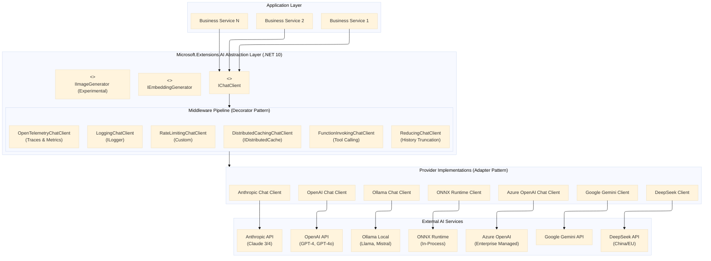
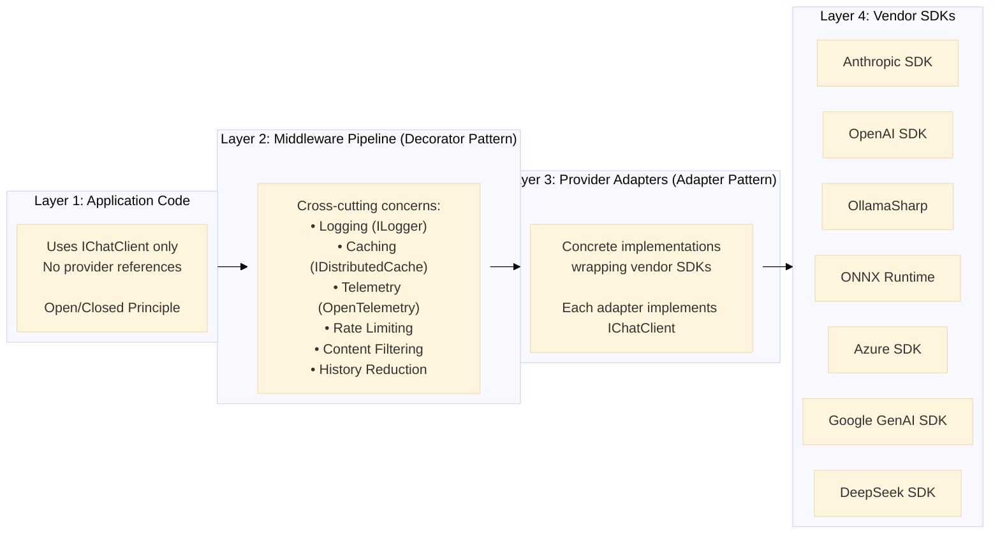
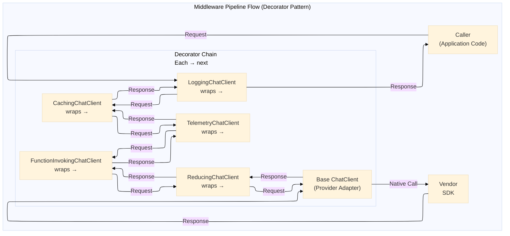
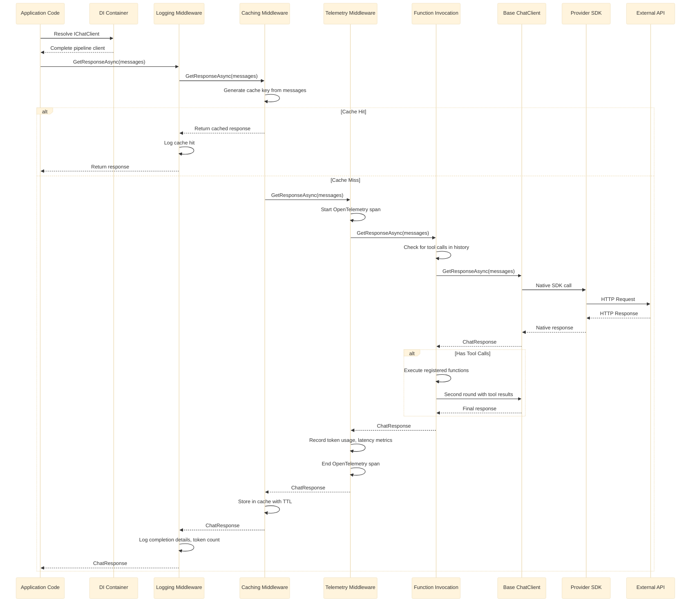

# How Microsoft.Extensions.AI Changed the Way .NET Talks to LLMs: One Interface to Rule Them All

### Stop rewriting your AI integration every time you switch from OpenAI to Azure to Ollama. Here's the .NET 10 abstraction that finally gets it right — with caching, telemetry, and function calling built in.


## Introduction: Why This Matters

Microsoft.Extensions.AI fundamentally solves the vendor lock-in problem that has plagued .NET AI development since the first LLM APIs emerged. By providing a unified `IChatClient` abstraction with built-in middleware for caching, telemetry, function calling, and logging, the library enables developers to write provider-agnostic AI code that works identically across OpenAI, Azure OpenAI, Anthropic Claude, Google Gemini, DeepSeek, Ollama, and any custom implementation. The key benefits include zero-code provider switching via configuration changes, automatic cross-cutting concerns through composable middleware pipelines, comprehensive testability through interface mocking, and enterprise-grade observability with OpenTelemetry integration. Organizations adopting this pattern reduce provider migration effort from weeks to minutes, eliminate vendor-specific code from business logic, and achieve consistent AI governance across multiple models and deployments.


Microsoft.Extensions.AI is a unified abstraction layer for AI services in .NET applications, introduced with .NET 9 and significantly enhanced with .NET 10. It provides standard interfaces and middleware pipelines that enable developers to interact with various Large Language Models (LLMs)—including OpenAI, Azure OpenAI, Anthropic, Claude, Google Gemini, DeepSeek, and Ollama—through a consistent API surface .

The library follows the established Microsoft.Extensions pattern, similar to logging (`ILogger`) and configuration, integrating seamlessly with Dependency Injection (DI) containers and providing a middleware pipeline for cross-cutting concerns such as caching, telemetry, logging, function invocation, and rate limiting .

**Architectural Value Proposition:**
- **Provider Agnosticism:** Application code becomes independent of specific LLM vendors
- **Runtime Flexibility:** Switch AI backends via configuration changes, not code modifications
- **Enterprise Governance:** Middleware pipeline enables consistent policy enforcement (caching, monitoring, rate limiting, content filtering)
- **Testability:** Unified interface simplifies mocking and unit testing of AI-dependent components

**SOLID Principles Applied:**

| Principle | Application in IChatClient |
|-----------|---------------------------|
| **Single Responsibility** | Each middleware component handles one cross-cutting concern (logging, caching, telemetry) |
| **Open/Closed** | New providers can be added by implementing `IChatClient` without modifying existing code |
| **Liskov Substitution** | Any provider implementation can be substituted for another without breaking client code |
| **Interface Segregation** | Separate interfaces for `IChatClient`, `IEmbeddingGenerator`, and `IImageGenerator` |
| **Dependency Inversion** | Business logic depends on `IChatClient` abstraction, not concrete provider implementations |

**Core Design Patterns:**

| Pattern | Implementation |
|---------|----------------|
| **Adapter Pattern** | Vendor SDKs adapted to `IChatClient` via `AsIChatClient()` extension methods |
| **Decorator Pattern** | Middleware components wrap inner clients to add functionality |
| **Builder Pattern** | `ChatClientBuilder` constructs middleware pipelines |
| **Factory Pattern** | `ChatClientBuilder.Use()` creates middleware instances |
| **Strategy Pattern** | `ChatOptions` encapsulates configurable behavior strategies |
| **Provider Pattern** | Interface defines contract; multiple concrete providers implement it |

---

## 2. Architecture Overview

### 2.1 High-Level Architecture Diagram



### 2.2 Core Components

| Component | Namespace | Responsibility | Design Pattern |
|-----------|-----------|----------------|----------------|
| `IChatClient` | Microsoft.Extensions.AI | Primary abstraction for chat/completion operations | Provider Pattern |
| `IEmbeddingGenerator<TInput,TEmbedding>` | Microsoft.Extensions.AI | Abstraction for vector embedding generation | Provider Pattern |
| `IImageGenerator` | Microsoft.Extensions.AI | Abstraction for text-to-image generation (Experimental) | Provider Pattern |
| `ChatClientBuilder` | Microsoft.Extensions.AI | Fluent builder for constructing middleware pipelines | Builder Pattern |
| `DelegatingChatClient` | Microsoft.Extensions.AI | Base class for middleware implementations | Decorator Pattern |
| `ChatMessage` | Microsoft.Extensions.AI | Strongly-typed message representation | Immutable Object |
| `ChatOptions` | Microsoft.Extensions.AI | Configuration parameters for requests | Strategy Pattern |
| `ChatResponse` | Microsoft.Extensions.AI | Complete response from chat completion | Data Transfer Object |
| `ChatResponseUpdate` | Microsoft.Extensions.AI | Streaming response unit (token-level) | Data Transfer Object |
| `AIFunction` / `AIFunctionFactory` | Microsoft.Extensions.AI | Executable function with JSON schema support | Factory Pattern |

### 2.3 Layered Architecture



---

## 3. The IChatClient Interface

### 3.1 Interface Definition

```csharp
namespace Microsoft.Extensions.AI;

/// <summary>
/// Represents a client for interacting with an AI chat completion service.
/// Implements IDisposable for proper resource cleanup.
/// All members are thread-safe for concurrent scenarios.
/// </summary>
public interface IChatClient : IDisposable
{
    /// <summary>
    /// Gets metadata about the chat client including endpoint and model information.
    /// Provides runtime discovery of model capabilities.
    /// </summary>
    ChatClientMetadata Metadata { get; }

    /// <summary>
    /// Sends a complete chat request and receives a complete response.
    /// Non-streaming operation - waits for full response before returning.
    /// </summary>
    /// <param name="messages">The conversation history including user, system, and assistant messages. 
    ///                         Supports multimodal content (text, images, audio).</param>
    /// <param name="options">Configuration parameters like temperature, max tokens, tool selection, etc.</param>
    /// <param name="cancellationToken">Cancellation token for the operation</param>
    /// <returns>A complete ChatResponse containing the assistant's reply, usage statistics, and metadata</returns>
    /// <exception cref="InvalidOperationException">Thrown when the model returns an error response</exception>
    Task<ChatResponse> GetResponseAsync(
        IEnumerable<ChatMessage> messages,
        ChatOptions? options = null,
        CancellationToken cancellationToken = default);

    /// <summary>
    /// Sends a chat request and receives a streaming response, yielding updates as they arrive.
    /// Enables token-by-token streaming for reduced perceived latency.
    /// </summary>
    /// <param name="messages">The conversation history</param>
    /// <param name="options">Configuration parameters</param>
    /// <param name="cancellationToken">Cancellation token</param>
    /// <returns>An async stream of ChatResponseUpdate objects (typically token-level chunks)</returns>
    /// <remarks>
    /// The caller can enumerate updates as they arrive. The final update contains the complete message.
    /// For providers that don't natively support streaming, MEAI automatically synthesizes streaming
    /// from batch responses.
    /// </remarks>
    IAsyncEnumerable<ChatResponseUpdate> GetStreamingResponseAsync(
        IEnumerable<ChatMessage> messages,
        ChatOptions? options = null,
        CancellationToken cancellationToken = default);

    /// <summary>
    /// Retrieves a strongly-typed service from the client or its underlying implementation.
    /// Enables provider-specific feature access when needed (escape hatch pattern).
    /// </summary>
    /// <typeparam name="TService">The type of service to retrieve</typeparam>
    /// <param name="key">Optional service key for keyed service resolution</param>
    /// <returns>The service instance, or null if not available</returns>
    TService? GetService<TService>(object? key = null) where TService : class;
    
    /// <summary>
    /// Retrieves a service from the client or its underlying implementation.
    /// </summary>
    /// <param name="serviceType">The type of service to retrieve</param>
    /// <param name="serviceKey">Optional service key for keyed service resolution</param>
    /// <returns>The service instance, or null if not available</returns>
    object? GetService(Type serviceType, object? serviceKey = null);
}
```

### 3.2 Key Characteristics

| Characteristic | Description | .NET 10 Enhancement |
|----------------|-------------|---------------------|
| **Thread Safety** | All members are thread-safe, supporting concurrent requests without explicit synchronization | Enhanced with immutable message types for reduced contention |
| **Stateless Design** | Each request is independent; conversation history must be managed by the caller | `ChatReducer` middleware provides built-in history truncation strategies |
| **Multimodal Support** | Supports text, images (URLs or byte arrays), and audio content via `ChatMessage` composition | Added support for video frames and document attachments |
| **Disposable Pattern** | Implements `IDisposable` for proper resource cleanup | Async disposal support via `IAsyncDisposable` in .NET 10 |
| **Provider Interop** | `GetService<T>` enables access to provider-specific features when needed | Enhanced with keyed service support for multi-client scenarios |

### 3.3 ChatMessage Structure

```csharp
/// <summary>
/// Represents a message in a chat conversation.
/// Supports multimodal content and provider-specific extensions.
/// Immutable by design for thread safety.
/// </summary>
public class ChatMessage
{
    /// <summary>
    /// The role of the message sender (System, User, Assistant, Tool).
    /// Determines how the model processes the message.
    /// </summary>
    public ChatRole Role { get; set; }
    
    /// <summary>
    /// Collection of content items supporting multimodal input.
    /// Can contain TextContent, UriContent, DataContent, BinaryContent.
    /// </summary>
    public IReadOnlyList<AIContent> Contents { get; set; }
    
    /// <summary>
    /// Convenience property for simple text messages.
    /// When set, automatically creates a single TextContent entry.
    /// </summary>
    public string? Text { get; set; }
    
    /// <summary>
    /// Provider-specific extension data.
    /// Enables passing vendor-specific parameters without breaking the abstraction.
    /// </summary>
    public IReadOnlyDictionary<string, object?>? AdditionalProperties { get; set; }
    
    /// <summary>
    /// Creates a new ChatMessage with the specified role and text content.
    /// </summary>
    public ChatMessage(ChatRole role, string text) { }
    
    /// <summary>
    /// Creates a new ChatMessage with multimodal content.
    /// </summary>
    public ChatMessage(ChatRole role, IReadOnlyList<AIContent> contents) { }
}

/// <summary>
/// Standard chat roles supported across all providers.
/// </summary>
public enum ChatRole
{
    System,      // Instructions defining assistant behavior and constraints
    User,        // User input or query
    Assistant,   // Model response or generated content
    Tool         // Results from function/tool invocations
}
```

### 3.4 ChatOptions Configuration

```csharp
/// <summary>
/// Configuration parameters for chat completion requests.
/// Follows the Strategy pattern - encapsulates behavior that can be swapped at runtime.
/// </summary>
public class ChatOptions
{
    /// <summary>
    /// Controls randomness of responses. 0.0 = deterministic, 2.0 = highly random.
    /// Values between 0.5 and 1.0 are typical for creative tasks.
    /// </summary>
    public float? Temperature { get; set; }
    
    /// <summary>
    /// Maximum number of tokens to generate in the response.
    /// Does NOT count input tokens from messages.
    /// </summary>
    public int? MaxOutputTokens { get; set; }
    
    /// <summary>
    /// Nucleus sampling parameter. Model considers tokens with top_p probability mass.
    /// 0.1 = consider only tokens comprising top 10% probability mass.
    /// </summary>
    public float? TopP { get; set; }
    
    /// <summary>
    /// Reduces repetition by penalizing tokens based on their frequency in the response so far.
    /// Range: -2.0 to 2.0. Positive values reduce repetition.
    /// </summary>
    public float? FrequencyPenalty { get; set; }
    
    /// <summary>
    /// Penalizes tokens that have already appeared in the conversation.
    /// Encourages introduction of new topics.
    /// Range: -2.0 to 2.0.
    /// </summary>
    public float? PresencePenalty { get; set; }
    
    /// <summary>
    /// Sequences of characters where the model should stop generating further tokens.
    /// Example: ["\n", "###", "User:"]
    /// </summary>
    public IList<string>? StopSequences { get; set; }
    
    /// <summary>
    /// Response format specification.
    /// Text = natural language, JsonObject = structured JSON object.
    /// </summary>
    public ChatResponseFormat? ResponseFormat { get; set; }
    
    /// <summary>
    /// Tools (functions) the model can call during response generation.
    /// The model decides when to invoke based on the prompt.
    /// </summary>
    public IList<AITool>? Tools { get; set; }
    
    /// <summary>
    /// Provider-specific extension properties.
    /// Enables passing vendor-specific parameters (logit_bias for OpenAI, top_k for Anthropic, etc.)
    /// </summary>
    public AdditionalPropertiesDictionary? AdditionalProperties { get; set; }
    
    /// <summary>
    /// Seed for deterministic generation. Same seed + same inputs = same output.
    /// Not supported by all providers.
    /// </summary>
    public int? Seed { get; set; }
    
    /// <summary>
    /// List of model IDs to use for the request (provider-dependent).
    /// Some providers support automatic fallback to secondary models.
    /// </summary>
    public IList<string>? ModelIds { get; set; }
}
```

---

## 4. Middleware Pipeline Architecture

### 4.1 Pipeline Design Pattern

The middleware pipeline uses the **Decorator pattern** where each middleware wraps the next client in the chain, similar to ASP.NET Core middleware or `HttpClient` handlers .

**Architectural Benefits:**
- **Separation of Concerns:** Each middleware handles one cross-cutting aspect
- **Composability:** Middleware can be added, removed, or reordered without affecting business logic
- **Reusability:** Standard middleware components work with any provider
- **Liskov Substitution:** Each middleware is also an `IChatClient`



### 4.2 ChatClientBuilder Usage

The `ChatClientBuilder` class is the primary mechanism for constructing middleware pipelines using the **Builder pattern** .

#### 4.2.1 Builder Constructors

```csharp
public sealed class ChatClientBuilder
{
    /// <summary>
    /// Initializes a new builder with an existing IChatClient instance.
    /// Use this when you already have a configured provider client.
    /// </summary>
    public ChatClientBuilder(IChatClient innerClient);
    
    /// <summary>
    /// Initializes a new builder with a factory for creating the inner client.
    /// Enables lazy initialization and DI integration.
    /// </summary>
    public ChatClientBuilder(Func<IServiceProvider, IChatClient> factory);
}
```

#### 4.2.2 Use Method Overloads (API Reference)

The `Use` method provides four overloads for adding middleware with different levels of control:

**Overload 1: Simple Decorator Pattern**
```csharp
public ChatClientBuilder Use(Func<IChatClient, IChatClient> clientFactory)
```
Adds a middleware by decorating the inner client. Used when you have a class that implements `IChatClient` and takes an inner client in its constructor.

**Overload 2: With Service Provider Access**
```csharp
public ChatClientBuilder Use(Func<IChatClient, IServiceProvider, IChatClient> clientFactory)
```
Same as above but the factory also receives the `IServiceProvider` for resolving dependencies from DI container.

**Overload 3: Anonymous Delegate (Unified Handler)**
```csharp
public ChatClientBuilder Use(
    Func<
        IEnumerable<ChatMessage>,                           // input messages
        ChatOptions,                                        // options
        Func<IEnumerable<ChatMessage>, ChatOptions, CancellationToken, Task>, // next delegate
        CancellationToken,                                  // cancellation token
        Task                                                // return task
    > sharedFunc)
```
Adds an anonymous middleware using a single delegate that handles both streaming and non-streaming cases. The delegate receives a `next` function to call the inner client .

**Overload 4: Separate Handlers for Streaming and Non-Streaming**
```csharp
public ChatClientBuilder Use(
    Func<IEnumerable<ChatMessage>, ChatOptions, IChatClient, CancellationToken, Task<ChatResponse>>? getResponseFunc,
    Func<IEnumerable<ChatMessage>, ChatOptions, IChatClient, CancellationToken, IAsyncEnumerable<ChatResponseUpdate>>? getStreamingResponseFunc)
```
Allows providing separate implementations for `GetResponseAsync` and `GetStreamingResponseAsync`. If only one delegate is provided, it is used for both methods (with automatic conversion when needed) .

#### 4.2.3 Built-in Middleware Registration Methods

```csharp
public static class ChatClientBuilderExtensions
{
    /// <summary>
    /// Adds logging middleware that logs requests, responses, token usage, and timing.
    /// Uses ILogger<LoggingChatClient> for output.
    /// </summary>
    public static ChatClientBuilder UseLogging(
        this ChatClientBuilder builder,
        ILoggerFactory? loggerFactory = null,
        Action<LoggingChatClient>? configure = null);
    
    /// <summary>
    /// Adds distributed caching middleware using IDistributedCache (Redis, SQL Server, Memory).
    /// Caches responses based on message content hash with configurable TTL.
    /// </summary>
    public static ChatClientBuilder UseDistributedCache(
        this ChatClientBuilder builder,
        IDistributedCache cache,
        Action<DistributedCachingChatClient>? configure = null);
    
    /// <summary>
    /// Adds OpenTelemetry middleware following GenAI Semantic Conventions (v1.39).
    /// Emits traces, metrics for token usage, latency, and model selection.
    /// </summary>
    public static ChatClientBuilder UseOpenTelemetry(
        this ChatClientBuilder builder,
        ILoggerFactory? loggerFactory = null,
        string? sourceName = null,
        Action<OpenTelemetryChatClient>? configure = null);
    
    /// <summary>
    /// Adds automatic function/tool invocation middleware.
    /// Intercepts tool calls from the model, executes registered .NET functions, and returns results.
    /// Supports approval workflows and manual tool execution.
    /// </summary>
    public static ChatClientBuilder UseFunctionInvocation(
        this ChatClientBuilder builder,
        ILoggerFactory? loggerFactory = null,
        Action<FunctionInvokingChatClient>? configure = null);
    
    /// <summary>
    /// Adds history reduction middleware for managing context window limits.
    /// Automatically truncates conversation history when approaching token limits.
    /// </summary>
    public static ChatClientBuilder UseChatReducer(
        this ChatClientBuilder builder,
        IChatReducer reducer,
        Action<ReducingChatClient>? configure = null);
    
    /// <summary>
    /// Adds options configuration callback that runs before each request.
    /// Useful for dynamic option modification based on request context.
    /// </summary>
    public static ChatClientBuilder ConfigureOptions(
        this ChatClientBuilder builder,
        Action<ChatOptions> configureOptions);
}
```

#### 4.2.4 Complete Builder Usage Example

```csharp
// Create base provider client
var openAIClient = new OpenAIClient(apiKey);
IChatClient baseClient = openAIClient.GetChatClient("gpt-4o").AsIChatClient();

// Build middleware pipeline
var builder = new ChatClientBuilder(baseClient)
    // Add logging (executes first - outermost)
    .UseLogging(loggerFactory)
    
    // Add caching (second - checks cache before telemetry)
    .UseDistributedCache(redisCache, options => 
        options.CacheKeyPrefix = "ai:response:")
    
    // Add OpenTelemetry (third - measures performance of remaining pipeline)
    .UseOpenTelemetry(loggerFactory, "MyApp.AI")
    
    // Add function invocation (fourth - executes tools)
    .UseFunctionInvocation(loggerFactory)
    
    // Add custom middleware using delegate overload
    .Use(async (messages, options, next, ct) =>
    {
        // Pre-processing
        Console.WriteLine($"Sending {messages.Count()} messages");
        
        // Call inner client
        var response = await next(messages, options, ct);
        
        // Post-processing
        Console.WriteLine($"Received response: {response.Message.Text?.Length} chars");
        
        return response;
    })
    
    // Add custom middleware using decorator pattern
    .Use(inner => new RateLimitingChatClient(inner, rateLimiter));

// Build the final pipeline
IChatClient pipelineClient = builder.Build(serviceProvider);

// Register in DI
services.AddSingleton<IChatClient>(pipelineClient);
```

**Key Points:**
- Middleware executes in the order added (first added = outermost wrapper)
- Each middleware can short-circuit the pipeline by returning without calling `next`
- The `Build()` method composes all middleware into a single client
- Multiple `Use()` calls chain the decorators

### 4.3 Built-in Middleware Components

| Middleware | Extension Method | Purpose | Key Features |
|------------|------------------|---------|--------------|
| **LoggingChatClient** | `.UseLogging()` | Diagnostic logging | Logs requests/responses via `ILogger`, token usage, timing, errors |
| **DistributedCachingChatClient** | `.UseDistributedCache()` | Response caching | Uses `IDistributedCache` (Redis, SQL Server, Memory), configurable TTL, cache key based on message hash |
| **OpenTelemetryChatClient** | `.UseOpenTelemetry()` | Observability | Emits traces and metrics following OpenTelemetry Semantic Conventions v1.39 for GenAI  |
| **FunctionInvokingChatClient** | `.UseFunctionInvocation()` | Automatic tool calling | Interprets tool calls from model, invokes registered `AIFunction` instances, supports approval workflows |
| **ReducingChatClient** | `.UseChatReducer()` | History truncation | Automatically truncates conversation history to fit context window limits |
| **Custom Middleware** | `.Use()` | Any cross-cutting concern | User-implemented using `DelegatingChatClient` or anonymous delegates |

### 4.4 Custom Middleware Implementation

To implement custom middleware, inherit from `DelegatingChatClient`:

```csharp
/// <summary>
/// Custom middleware implementing rate limiting.
/// Follows the Decorator pattern by wrapping an inner IChatClient.
/// </summary>
public sealed class RateLimitingChatClient : DelegatingChatClient
{
    private readonly IRateLimiter _rateLimiter;
    private readonly ILogger<RateLimitingChatClient> _logger;
    
    public RateLimitingChatClient(
        IChatClient innerClient, 
        IRateLimiter rateLimiter,
        ILogger<RateLimitingChatClient> logger) 
        : base(innerClient)
    {
        _rateLimiter = rateLimiter;
        _logger = logger;
    }
    
    /// <summary>
    /// Implements rate limiting by acquiring a lease before forwarding the request.
    /// Follows Liskov Substitution Principle - can replace any IChatClient.
    /// </summary>
    public override async Task<ChatResponse> GetResponseAsync(
        IEnumerable<ChatMessage> messages, 
        ChatOptions? options = null, 
        CancellationToken cancellationToken = default)
    {
        // Try to acquire rate limit lease
        using var lease = await _rateLimiter.AcquireAsync(cancellationToken);
        
        if (!lease.IsAcquired)
        {
            _logger.LogWarning("Rate limit exceeded, rejecting request");
            throw new InvalidOperationException("Rate limit exceeded. Please try again later.");
        }
        
        _logger.LogInformation("Rate limit lease acquired, forwarding to inner client");
        return await base.GetResponseAsync(messages, options, cancellationToken);
    }
    
    /// <summary>
    /// Streaming implementation also respects rate limiting.
    /// </summary>
    public override IAsyncEnumerable<ChatResponseUpdate> GetStreamingResponseAsync(
        IEnumerable<ChatMessage> messages, 
        ChatOptions? options = null, 
        CancellationToken cancellationToken = default)
    {
        // Similar implementation for streaming
        var lease = await _rateLimiter.AcquireAsync(cancellationToken);
        // ...
        return base.GetStreamingResponseAsync(messages, options, cancellationToken);
    }
}
```

---

## 5. Provider Implementations

### 5.1 Supported Providers (.NET 10)

Microsoft.Extensions.AI supports all major LLM providers through adapter implementations:

| Provider | Package | Implementation Notes | Target Frameworks |
|----------|---------|---------------------|-------------------|
| **OpenAI** | Microsoft.Extensions.AI.OpenAI | Wraps OpenAI SDK v2.8.0+ | net6.0, net8.0, net9.0, net10.0 |
| **Azure OpenAI** | Microsoft.Extensions.AI.OpenAI | Uses Azure endpoint with managed identity or API key | net6.0, net8.0, net9.0, net10.0 |
| **Azure AI Inference** | Microsoft.Extensions.AI.AzureAIInference | Azure AI Studio model catalog | net8.0, net9.0, net10.0 |
| **Anthropic** | Microsoft.Extensions.AI.Anthropic | Claude 3/4 model family support | net8.0, net9.0, net10.0 |
| **Google Gemini** | Microsoft.Extensions.AI.Google | Gemini 1.5 and 2.0 models | net8.0, net9.0, net10.0 |
| **DeepSeek** | Microsoft.Extensions.AI.DeepSeek | DeepSeek-V3, DeepSeek-R1 support for EU/APAC regions | net8.0, net9.0, net10.0 |
| **Ollama** | Microsoft.Extensions.AI.Ollama | Local model hosting (Llama, Mistral, Phi) | net6.0, net8.0, net9.0, net10.0 |
| **ONNX Runtime** | Microsoft.ML.OnnxRuntimeGenAI | In-process inference, no API calls | net8.0, net9.0, net10.0 |
| **Custom Provider** | User implements | Direct `IChatClient` implementation | Any |

### 5.2 Detailed Implementation Examples

#### 5.2.1 OpenAI Implementation

```csharp
using Microsoft.Extensions.AI;
using Microsoft.Extensions.AI.OpenAI;
using OpenAI;

public static class OpenAIConfiguration
{
    public static IChatClient CreateOpenAIClient(IConfiguration config)
    {
        // Step 1: Configure OpenAI client with optional custom endpoint
        var apiKey = config["OpenAI:ApiKey"] ?? throw new InvalidOperationException("OpenAI API Key required");
        var endpoint = config["OpenAI:Endpoint"];
        
        var clientOptions = new OpenAIClientOptions();
        if (!string.IsNullOrEmpty(endpoint))
        {
            clientOptions.Endpoint = new Uri(endpoint); // Support for custom/compatible endpoints
        }
        
        // Step 2: Create native OpenAI SDK client
        var openAIClient = new OpenAIClient(
            new ApiKeyCredential(apiKey), 
            clientOptions);
        
        // Step 3: Adapt to IChatClient using AsIChatClient() extension
        var modelId = config["OpenAI:ModelId"] ?? "gpt-4o-mini";
        IChatClient chatClient = openAIClient
            .GetChatClient(modelId)
            .AsIChatClient();
        
        return chatClient;
    }
}

// Usage with dependency injection
builder.Services.AddSingleton(sp => 
    OpenAIConfiguration.CreateOpenAIClient(builder.Configuration));
```

**Adapter Pattern Applied:** `AsIChatClient()` is an adapter that converts the vendor-specific `ChatClient` type to the unified `IChatClient` interface.

#### 5.2.2 Azure OpenAI Implementation

```csharp
using Azure.AI.OpenAI;
using Azure.Identity;
using Microsoft.Extensions.AI;
using Microsoft.Extensions.AI.OpenAI;

public static class AzureOpenAIConfiguration
{
    public static IChatClient CreateAzureOpenAIClient(IConfiguration config)
    {
        var endpoint = config["AzureOpenAI:Endpoint"] 
            ?? throw new InvalidOperationException("Azure OpenAI endpoint required");
        var deploymentName = config["AzureOpenAI:DeploymentName"] 
            ?? throw new InvalidOperationException("Deployment name required");
        
        AzureOpenAIClient azureClient;
        
        // Support multiple authentication methods
        if (config.GetValue<bool>("AzureOpenAI:UseDefaultAzureCredential"))
        {
            // Managed Identity or Azure CLI authentication
            azureClient = new AzureOpenAIClient(
                new Uri(endpoint), 
                new DefaultAzureCredential());
        }
        else
        {
            // API key authentication
            var apiKey = config["AzureOpenAI:ApiKey"];
            azureClient = new AzureOpenAIClient(
                new Uri(endpoint), 
                new AzureKeyCredential(apiKey));
        }
        
        // Adapt to IChatClient
        return azureClient
            .GetChatClient(deploymentName)
            .AsIChatClient();
    }
}

// With custom HTTP pipeline for enterprise scenarios
public static IChatClient CreateAzureOpenAIClientWithPolicy()
{
    var clientOptions = new AzureOpenAIClientOptions();
    
    // Add custom HTTP pipeline policies
    clientOptions.AddPolicy(new LoggingPolicy(), HttpPipelinePosition.PerCall);
    clientOptions.AddPolicy(new RetryWithCircuitBreakerPolicy(), HttpPipelinePosition.PerRetry);
    clientOptions.Diagnostics.IsLoggingEnabled = true;
    clientOptions.Diagnostics.IsTelemetryEnabled = true;
    
    var azureClient = new AzureOpenAIClient(
        new Uri(endpoint), 
        new DefaultAzureCredential(), 
        clientOptions);
    
    return azureClient.GetChatClient(deploymentName).AsIChatClient();
}
```

#### 5.2.3 Anthropic (Claude) Implementation

```csharp
using Anthropic;
using Microsoft.Extensions.AI;
using Microsoft.Extensions.AI.Anthropic;

public static class AnthropicConfiguration
{
    public static IChatClient CreateAnthropicClient(IConfiguration config)
    {
        var apiKey = config["Anthropic:ApiKey"] 
            ?? throw new InvalidOperationException("Anthropic API Key required");
        var modelId = config["Anthropic:ModelId"] ?? "claude-3-opus-20240229";
        
        // Create native Anthropic SDK client
        var anthropicClient = new AnthropicClient(apiKey);
        
        // Adapt to IChatClient
        return anthropicClient
            .GetChatClient(modelId)
            .AsIChatClient();
    }
    
    // Claude specific features
    public static async Task UseClaudeFeaturesAsync(IChatClient client)
    {
        // Claude supports longer context windows (200K tokens)
        var options = new ChatOptions
        {
            Temperature = 0.7f,
            MaxOutputTokens = 4096,
            AdditionalProperties = new AdditionalPropertiesDictionary
            {
                ["top_k"] = 40,  // Claude-specific parameter
                ["stop_sequences"] = new[] { "\n\nHuman:" }
            }
        };
        
        var messages = new List<ChatMessage>
        {
            new(ChatRole.System, "You are a helpful assistant. Be concise."),
            new(ChatRole.User, "Explain quantum computing in one paragraph.")
        };
        
        var response = await client.GetResponseAsync(messages, options);
    }
}
```

#### 5.2.4 Google Gemini Implementation

```csharp
using Google.Cloud.AIPlatform.V1;
using Google.Protobuf;
using Microsoft.Extensions.AI;
using Microsoft.Extensions.AI.Google;
using System.Text.Json;

public static class GeminiConfiguration
{
    /// <summary>
    /// Creates a Google Gemini client with Vertex AI integration.
    /// Gemini provides native multimodal support for text, images, video, and audio.
    /// </summary>
    public static IChatClient CreateGeminiClient(IConfiguration config)
    {
        var projectId = config["Google:ProjectId"] 
            ?? throw new InvalidOperationException("Google Cloud Project ID required");
        var location = config["Google:Location"] ?? "us-central1";
        var modelId = config["Google:ModelId"] ?? "gemini-1.5-pro";
        
        // Create native Google Vertex AI client
        var client = new ChatClientBuilder()
            .SetEndpoint($"{location}-aiplatform.googleapis.com")
            .SetProject(projectId)
            .SetLocation(location)
            .SetModel(modelId)
            .Build();
        
        // Adapt to IChatClient
        return client.AsIChatClient();
    }
    
    /// <summary>
    /// Gemini-specific implementation with multimodal capabilities.
    /// Supports video understanding, audio processing, and JSON schema adherence.
    /// </summary>
    public static async Task UseGeminiFeaturesAsync(IChatClient client)
    {
        // Gemini 1.5 Pro supports 2M token context window (largest among providers)
        var options = new ChatOptions
        {
            Temperature = 0.7f,
            MaxOutputTokens = 8192,  // Gemini supports up to 8K output tokens
            TopP = 0.95f,
            ResponseFormat = ChatResponseFormat.JsonObject,  // Enforce JSON output
            AdditionalProperties = new AdditionalPropertiesDictionary
            {
                ["safety_settings"] = new Dictionary<string, string>
                {
                    ["HARM_CATEGORY_HATE_SPEECH"] = "BLOCK_MEDIUM_AND_ABOVE",
                    ["HARM_CATEGORY_HARASSMENT"] = "BLOCK_ONLY_HIGH"
                },
                ["response_mime_type"] = "application/json",
                ["response_schema"] = JsonSerializer.Serialize(new
                {
                    type = "object",
                    properties = new
                    {
                        summary = new { type = "string" },
                        category = new { type = "string", @enum = new[] { "technical", "billing", "general" } }
                    }
                })
            }
        };
        
        // Multimodal example: Analyze video and audio together
        var videoBytes = await File.ReadAllBytesAsync("meeting_recording.mp4");
        var audioBytes = await File.ReadAllBytesAsync("transcript.wav");
        
        var messages = new List<ChatMessage>
        {
            new(ChatRole.System, "You are a meeting summarizer. Analyze the video and audio input."),
            new(ChatRole.User, new[]
            {
                new DataContent(videoBytes, "video/mp4"),
                new DataContent(audioBytes, "audio/wav"),
                new TextContent("Summarize this meeting, including key decisions and action items.")
            })
        };
        
        var response = await client.GetResponseAsync(messages, options);
        
        // Gemini-specific features via escape hatch
        if (client.GetService<GeminiChatClient>() is GeminiChatClient geminiClient)
        {
            // Access Gemini unique capabilities
            var functionCallingConfig = new FunctionCallingConfig
            {
                Mode = FunctionCallingMode.Any,  // Force function calling
                AllowedFunctionNames = { "summarize_meeting", "extract_actions" }
            };
            
            // Gemini supports automated function calling with 100+ registered functions
            geminiClient.ConfigureFunctionCalling(functionCallingConfig);
        }
    }
    
    /// <summary>
    /// Gemini 2.0 Flash - optimized for low-latency, high-volume scenarios.
    /// </summary>
    public static IChatClient CreateGeminiFlashClient(IConfiguration config)
    {
        return CreateGeminiClient(config, modelId: "gemini-2.0-flash-exp");
    }
    
    /// <summary>
    /// Configure Gemini with grounding for factual accuracy.
    /// </summary>
    public static async Task UseGeminiWithGroundingAsync(IChatClient client)
    {
        var options = new ChatOptions
        {
            Temperature = 0.2f,  // Low temperature for factual responses
            AdditionalProperties = new AdditionalPropertiesDictionary
            {
                ["grounding_config"] = new
                {
                    sources = new[] { "google_search", "enterprise_knowledge_base" },
                    threshold = 0.7
                },
                ["citation_config"] = new
                {
                    style = "NATURAL",  // Natural language citations
                    url_sources = true
                }
            }
        };
        
        var response = await client.GetResponseAsync(
            new[] { new ChatMessage(ChatRole.User, "What are the latest developments in quantum computing?") },
            options);
        
        // Response includes citations and grounded references
        var citations = response.AdditionalProperties?["citations"] as List<Citation>;
    }
}
```

**Key Gemini Features in .NET 10:**

| Feature | Description | Implementation |
|---------|-------------|----------------|
| **Multimodal Input** | Video, audio, image, text simultaneously | Automatic content type detection via `AIContent` |
| **Long Context (2M tokens)** | Largest context window available | Handled automatically by provider |
| **Function Calling** | Tool use with up to 100 functions | `UseFunctionInvocation()` middleware |
| **JSON Schema Adherence** | Structured output guaranteed | `ResponseFormat.JsonObject` with schema |
| **Grounding with Search** | Factual accuracy via Google Search | Configure via `AdditionalProperties` |
| **Safety Settings** | Granular content filtering | Per-category thresholds |
| **Streaming with Function Call** | Real-time tool invocation | `GetStreamingResponseAsync()` |

#### 5.2.5 DeepSeek Implementation

```csharp
using DeepSeek;
using Microsoft.Extensions.AI;
using Microsoft.Extensions.AI.DeepSeek;

public static class DeepSeekConfiguration
{
    /// <summary>
    /// Creates a DeepSeek API client for cost-effective inference.
    /// DeepSeek-V3 and R1 offer OpenAI-compatible APIs with lower pricing.
    /// </summary>
    public static IChatClient CreateDeepSeekClient(IConfiguration config)
    {
        var apiKey = config["DeepSeek:ApiKey"] 
            ?? throw new InvalidOperationException("DeepSeek API Key required");
        var modelId = config["DeepSeek:ModelId"] ?? "deepseek-chat";
        
        // DeepSeek uses OpenAI-compatible API
        var client = new DeepSeekClient(new DeepSeekClientOptions
        {
            ApiKey = apiKey,
            ModelId = modelId,
            Endpoint = config["DeepSeek:Endpoint"] ?? "https://api.deepseek.com/v1"
        });
        
        return client.AsIChatClient();
    }
    
    /// <summary>
    /// DeepSeek R1 - Chain of Thought reasoning with visible reasoning tokens.
    /// </summary>
    public static async Task UseDeepSeekR1Async(IChatClient client)
    {
        var options = new ChatOptions
        {
            Temperature = 0.6f,
            MaxOutputTokens = 32768,  // R1 supports 32K output
            AdditionalProperties = new AdditionalPropertiesDictionary
            {
                ["reasoning_effort"] = "medium",  // low, medium, high
                ["show_reasoning_tokens"] = true   // Show chain-of-thought
            }
        };
        
        var messages = new List<ChatMessage>
        {
            new(ChatRole.System, "You are a mathematical reasoning assistant. Show your reasoning steps."),
            new(ChatRole.User, "If a triangle has sides of length 5, 12, and 13, what is its area?")
        };
        
        var response = await client.GetResponseAsync(messages, options);
        
        // Access reasoning tokens (chain-of-thought)
        var reasoning = response.AdditionalProperties?["reasoning"] as string;
        Console.WriteLine($"Reasoning process:\n{reasoning}");
        Console.WriteLine($"Final answer:\n{response.Message.Text}");
    }
}
```

**DeepSeek Provider Specifications:**

| Model | Context Window | Output Tokens | Pricing | Best For |
|-------|---------------|---------------|---------|----------|
| **DeepSeek-V3** | 128K | 8K | $0.14/M input | General purpose, coding |
| **DeepSeek-R1** | 128K | 32K | $2.19/M input | Reasoning, math, logic |
| **DeepSeek-Coder** | 64K | 8K | $0.14/M input | Code generation |

#### 5.2.6 Ollama Local Implementation

```csharp
using Microsoft.Extensions.AI;
using Microsoft.Extensions.AI.Ollama;

public static class OllamaConfiguration
{
    /// <summary>
    /// Creates a local Ollama client for development and offline scenarios.
    /// No API keys required - runs entirely locally.
    /// </summary>
    public static IChatClient CreateOllamaClient(IConfiguration config)
    {
        var endpoint = config["Ollama:Endpoint"] ?? "http://localhost:11434";
        var modelId = config["Ollama:ModelId"] ?? "llama3.2";
        
        return new OllamaChatClient(new Uri(endpoint), modelId);
    }
    
    /// <summary>
    /// Configures Ollama with advanced local model parameters.
    /// </summary>
    public static IChatClient CreateOllamaWithAdvancedConfig()
    {
        var client = new OllamaChatClient(new Uri("http://localhost:11434"), "mixtral:8x7b");
        
        // Ollama-specific settings
        client.Options = new OllamaOptions
        {
            NumCtx = 8192,              // Context window size
            NumBatch = 512,             // Batch size for prompt processing
            NumPredict = 2048,          // Maximum tokens to generate
            TopK = 40,                  // Top-K sampling
            TopP = 0.9f,                // Top-P sampling
            Temperature = 0.7f,
            RepeatPenalty = 1.1f,
            Mirostat = 2,               // Mirostat sampling algorithm
            MirostatTau = 5.0f,
            MirostatEta = 0.1f,
            StopSequences = new[] { "\n", "User:" },
            Seed = 42,                  // Deterministic generation
            TfsZ = 1.0f,                // Tail free sampling
            NumKeep = 5,                // Number of tokens to keep from prompt
            PenalizeNewline = false,
            UseMLock = true,            // Lock model in memory
            UseMMap = true              // Use memory mapping
        };
        
        return client;
    }
    
    /// <summary>
    /// Pulls and manages local models programmatically.
    /// </summary>
    public static async Task ManageLocalModelsAsync()
    {
        var client = new OllamaChatClient(new Uri("http://localhost:11434"), "llama3.2");
        
        // Pull a model (downloads if not present)
        await client.PullModelAsync("codellama:7b", progress: (downloaded, total) =>
        {
            Console.WriteLine($"Downloading: {downloaded}/{total} bytes");
        });
        
        // List available models
        var models = await client.ListModelsAsync();
        foreach (var model in models)
        {
            Console.WriteLine($"{model.Name} - {model.Size} bytes, modified {model.ModifiedAt}");
        }
        
        // Delete model to free disk space
        await client.DeleteModelAsync("unused-model:latest");
    }
}
```

#### 5.2.7 Custom Provider Implementation

```csharp
/// <summary>
/// Custom implementation of IChatClient for a proprietary AI service.
/// Demonstrates full adapter pattern implementation.
/// </summary>
public class CustomAIChatClient : IChatClient
{
    private readonly HttpClient _httpClient;
    private readonly string _apiKey;
    private readonly string _modelId;
    private bool _disposed;
    
    public CustomAIChatClient(HttpClient httpClient, string apiKey, string modelId)
    {
        _httpClient = httpClient;
        _apiKey = apiKey;
        _modelId = modelId;
    }
    
    public ChatClientMetadata Metadata => new ChatClientMetadata(
        providerName: "Custom AI Service",
        modelId: _modelId,
        capabilities: ChatClientCapabilities.FunctionCalling | ChatClientCapabilities.Streaming);
    
    public async Task<ChatResponse> GetResponseAsync(
        IEnumerable<ChatMessage> messages,
        ChatOptions? options = null,
        CancellationToken cancellationToken = default)
    {
        // Convert MEAI messages to custom API format
        var request = new CustomRequest
        {
            Model = _modelId,
            Messages = messages.Select(m => new CustomMessage
            {
                Role = m.Role.ToString().ToLower(),
                Content = m.Text ?? string.Join("", m.Contents.OfType<TextContent>().Select(t => t.Text))
            }).ToList(),
            Temperature = options?.Temperature ?? 0.7f,
            MaxTokens = options?.MaxOutputTokens ?? 1000
        };
        
        // Call proprietary API
        var response = await _httpClient.PostAsJsonAsync("/v1/chat", request, cancellationToken);
        response.EnsureSuccessStatusCode();
        
        var customResponse = await response.Content.ReadFromJsonAsync<CustomResponse>(cancellationToken);
        
        // Convert back to MEAI ChatResponse
        return new ChatResponse(
            new ChatMessage(ChatRole.Assistant, customResponse.Choices[0].Message.Content))
        {
            Usage = new UsageDetails
            {
                InputTokenCount = customResponse.Usage.PromptTokens,
                OutputTokenCount = customResponse.Usage.CompletionTokens,
                TotalTokenCount = customResponse.Usage.TotalTokens
            }
        };
    }
    
    public IAsyncEnumerable<ChatResponseUpdate> GetStreamingResponseAsync(
        IEnumerable<ChatMessage> messages,
        ChatOptions? options = null,
        CancellationToken cancellationToken = default)
    {
        // Implement streaming if supported, otherwise fall back to batching
        return StreamingImplementation(messages, options, cancellationToken);
    }
    
    private async IAsyncEnumerable<ChatResponseUpdate> StreamingImplementation(
        IEnumerable<ChatMessage> messages,
        ChatOptions? options,
        [EnumeratorCancellation] CancellationToken cancellationToken)
    {
        // Implementation for token-by-token streaming
        // Use System.Text.Json to parse streaming JSON chunks
        yield return new ChatResponseUpdate(ChatRole.Assistant, "Hello");
        // ...
    }
    
    public TService? GetService<TService>(object? key = null) where TService : class
    {
        return this as TService;
    }
    
    public object? GetService(Type serviceType, object? serviceKey = null)
    {
        return serviceType.IsAssignableFrom(GetType()) ? this : null;
    }
    
    public void Dispose()
    {
        if (!_disposed)
        {
            _httpClient?.Dispose();
            _disposed = true;
        }
    }
}

// Registration
builder.Services.AddSingleton<IChatClient>(sp =>
{
    var httpClient = new HttpClient { BaseAddress = new Uri("https://custom-ai.example.com") };
    return new CustomAIChatClient(httpClient, apiKey, "custom-model-v1");
});
```

---

## 6. Complete End-to-End Implementation Example

### 6.1 Scenario Overview

This example demonstrates a complete customer support ticket summarization service that:

1. Uses `IChatClient` abstraction throughout business logic
2. Supports multiple AI backends (OpenAI, Azure OpenAI, Ollama, Gemini, DeepSeek, Anthropic)
3. Implements caching, logging, and telemetry middleware
4. Uses function calling for structured output
5. Is fully configured via DI

### 6.2 Project Structure

```
TicketSummarizer.Service/
├── Program.cs                 # Composition root, DI configuration
├── Services/
│   └── ITicketSummarizer.cs   # Business interface
│   └── TicketSummarizer.cs    # Business implementation using IChatClient
├── Middleware/
│   └── CustomLoggingChatClient.cs
├── Functions/
│   └── TicketFunctions.cs      # Tool/function definitions
├── Configuration/
│   └── AISettings.cs           # Configuration options
└── appsettings.json
```

### 6.3 Domain Model and Functions

```csharp
// Models/TicketSummary.cs
public class TicketSummary
{
    public string IssueCategory { get; set; } = string.Empty;
    public string Severity { get; set; } = string.Empty;
    public string ShortDescription { get; set; } = string.Empty;
    public string SuggestedResolution { get; set; } = string.Empty;
    public bool RequiresEscalation { get; set; }
}

// Functions/TicketFunctions.cs
public class TicketFunctions
{
    [Description("Classifies the support ticket by category and severity")]
    public async Task<TicketSummary> ClassifyTicketAsync(
        [Description("The customer conversation text")] string conversationText,
        [Description("Current date for context")] DateTime currentDate)
    {
        // This function would be called by the model when it decides classification is needed
        // Implementation can include business rules, database lookups, etc.
        return new TicketSummary
        {
            IssueCategory = conversationText.Contains("payment") ? "Billing" : "Technical",
            Severity = conversationText.Contains("urgent") ? "High" : "Normal",
            ShortDescription = conversationText.Length > 100 ? conversationText[..100] + "..." : conversationText,
            SuggestedResolution = "Please contact tier 2 support",
            RequiresEscalation = conversationText.Contains("urgent")
        };
    }
}
```

### 6.4 Business Service Using IChatClient

```csharp
// Services/ITicketSummarizer.cs
public interface ITicketSummarizer
{
    Task<string> SummarizeTicketAsync(string conversationText, CancellationToken ct = default);
    Task<TicketSummary> GetStructuredSummaryAsync(string conversationText, CancellationToken ct = default);
}

// Services/TicketSummarizer.cs
public class TicketSummarizer : ITicketSummarizer
{
    private readonly IChatClient _chatClient;
    private readonly ILogger<TicketSummarizer> _logger;
    
    public TicketSummarizer(IChatClient chatClient, ILogger<TicketSummarizer> logger)
    {
        _chatClient = chatClient;
        _logger = logger;
    }
    
    public async Task<string> SummarizeTicketAsync(string conversationText, CancellationToken ct = default)
    {
        _logger.LogInformation("Summarizing ticket of length {Length}", conversationText.Length);
        
        var messages = new List<ChatMessage>
        {
            new(ChatRole.System, 
                "You are a customer support ticket summarizer. Create a concise, actionable summary."),
            new(ChatRole.User, conversationText)
        };
        
        var options = new ChatOptions
        {
            Temperature = 0.3f,           // Low temperature for consistent summaries
            MaxOutputTokens = 500,
            ResponseFormat = ChatResponseFormat.Text
        };
        
        var response = await _chatClient.GetResponseAsync(messages, options, ct);
        
        return response.Message.Text ?? string.Empty;
    }
    
    public async Task<TicketSummary> GetStructuredSummaryAsync(string conversationText, CancellationToken ct = default)
    {
        // Use function calling for structured output
        var messages = new List<ChatMessage>
        {
            new(ChatRole.System, 
                "Analyze the following support ticket and use the ClassifyTicketAsync function to provide a structured summary."),
            new(ChatRole.User, conversationText)
        };
        
        var options = new ChatOptions
        {
            Temperature = 0.2f,
            Tools = [AITool.CreateJsonSchemaBasedTool<TicketSummary>("classify_ticket", "Classifies a support ticket")]
        };
        
        var response = await _chatClient.GetResponseAsync(messages, options, ct);
        
        // Parse function call response into TicketSummary object
        return ParseToolResponse<TicketSummary>(response);
    }
    
    private T ParseToolResponse<T>(ChatResponse response) where T : new()
    {
        // Implementation to extract tool call results from response
        // ...
        return new T();
    }
}
```

### 6.5 LLM Registration and DI Configuration

This is the **critical section** showing complete DI registration with multiple provider options .

#### appsettings.json

```json
{
  "AI": {
    "Provider": "AzureOpenAI", // Options: OpenAI, AzureOpenAI, Ollama, Gemini, DeepSeek, Anthropic
    "EnableCaching": true,
    "CacheDurationMinutes": 60,
    "OpenAI": {
      "ApiKey": "sk-...",
      "ModelId": "gpt-4o-mini",
      "Endpoint": "https://api.openai.com/v1"
    },
    "AzureOpenAI": {
      "Endpoint": "https://your-resource.openai.azure.com/",
      "ApiKey": "",
      "DeploymentName": "gpt-4o-mini",
      "UseDefaultAzureCredential": true
    },
    "Ollama": {
      "Endpoint": "http://localhost:11434",
      "ModelId": "llama3.2"
    },
    "Gemini": {
      "ProjectId": "your-gcp-project",
      "Location": "us-central1",
      "ModelId": "gemini-1.5-pro"
    },
    "DeepSeek": {
      "ApiKey": "ds-...",
      "ModelId": "deepseek-chat",
      "Endpoint": "https://api.deepseek.com/v1"
    },
    "Anthropic": {
      "ApiKey": "sk-ant-...",
      "ModelId": "claude-3-opus-20240229"
    },
    "SummaryOptions": {
      "Temperature": 0.3,
      "MaxTokens": 500
    }
  }
}
```

#### Program.cs - Complete DI Registration

```csharp
using Microsoft.Extensions.AI;
using Microsoft.Extensions.DependencyInjection;
using Microsoft.Extensions.Hosting;
using Microsoft.Extensions.Configuration;
using Microsoft.Extensions.Logging;
using Microsoft.Extensions.Caching.Distributed;

var builder = Host.CreateApplicationBuilder(args);

// 1. Load configuration
var aiSettings = builder.Configuration.GetSection("AI");
var provider = aiSettings["Provider"];

// 2. Register base IChatClient based on configured provider
IChatClient baseChatClient = provider switch
{
    "OpenAI" => ConfigureOpenAI(aiSettings.GetSection("OpenAI")),
    "AzureOpenAI" => ConfigureAzureOpenAI(aiSettings.GetSection("AzureOpenAI")),
    "Ollama" => ConfigureOllama(aiSettings.GetSection("Ollama")),
    "Gemini" => ConfigureGemini(aiSettings.GetSection("Gemini")),
    "DeepSeek" => ConfigureDeepSeek(aiSettings.GetSection("DeepSeek")),
    "Anthropic" => ConfigureAnthropic(aiSettings.GetSection("Anthropic")),
    _ => throw new InvalidOperationException($"Unknown provider: {provider}")
};

// 3. Build middleware pipeline using ChatClientBuilder
var chatClientBuilder = new ChatClientBuilder(baseChatClient)
    .UseLogging()                    // Add logging middleware
    .UseOpenTelemetry()              // Add telemetry
    .UseFunctionInvocation()         // Enable function calling
    .Use(async (IChatClient inner, IServiceProvider sp) =>
    {
        // Custom rate limiting middleware
        var rateLimiter = sp.GetRequiredService<IRateLimiter>();
        return new RateLimitingChatClient(inner, rateLimiter);
    });

// 4. Add caching if enabled (with Distributed Cache)
if (builder.Configuration.GetValue<bool>("AI:EnableCaching"))
{
    chatClientBuilder.UseDistributedCache(
        builder.Services.BuildServiceProvider().GetRequiredService<IDistributedCache>());
}

// 5. Build the final client and register in DI
var chatClient = chatClientBuilder.Build(builder.Services.BuildServiceProvider());

builder.Services.AddSingleton<IChatClient>(chatClient);

// 6. Register business services
builder.Services.AddScoped<ITicketSummarizer, TicketSummarizer>();

// 7. Register functions for tool calling
builder.Services.AddSingleton<TicketFunctions>();

// 8. Configure options
builder.Services.Configure<ChatOptions>(builder.Configuration.GetSection("AI:SummaryOptions"));

var host = builder.Build();

// Provider configuration methods
static IChatClient ConfigureOpenAI(IConfigurationSection config)
{
    var apiKey = config["ApiKey"] ?? throw new InvalidOperationException("OpenAI API Key required");
    var modelId = config["ModelId"] ?? "gpt-4o-mini";
    var endpoint = config["Endpoint"];
    
    var clientOptions = new OpenAIClientOptions();
    if (!string.IsNullOrEmpty(endpoint))
    {
        clientOptions.Endpoint = new Uri(endpoint);
    }
    
    var openAIClient = new OpenAIClient(new ApiKeyCredential(apiKey), clientOptions);
    return openAIClient.GetChatClient(modelId).AsIChatClient();
}

static IChatClient ConfigureAzureOpenAI(IConfigurationSection config)
{
    var endpoint = config["Endpoint"] ?? throw new InvalidOperationException("Azure endpoint required");
    var deploymentName = config["DeploymentName"] ?? throw new InvalidOperationException("Deployment name required");
    var useDefaultCredential = config.GetValue<bool>("UseDefaultAzureCredential");
    
    AzureOpenAIClient azureClient;
    
    if (useDefaultCredential)
    {
        azureClient = new AzureOpenAIClient(new Uri(endpoint), new Azure.Identity.DefaultAzureCredential());
    }
    else
    {
        var apiKey = config["ApiKey"] ?? throw new InvalidOperationException("API Key required");
        azureClient = new AzureOpenAIClient(new Uri(endpoint), new Azure.AzureKeyCredential(apiKey));
    }
    
    return azureClient.GetChatClient(deploymentName).AsIChatClient();
}

static IChatClient ConfigureOllama(IConfigurationSection config)
{
    var endpoint = config["Endpoint"] ?? "http://localhost:11434";
    var modelId = config["ModelId"] ?? "llama3.2";
    
    return new Microsoft.Extensions.AI.Ollama.OllamaChatClient(new Uri(endpoint), modelId);
}

static IChatClient ConfigureGemini(IConfigurationSection config)
{
    var projectId = config["ProjectId"] ?? throw new InvalidOperationException("Google Project ID required");
    var location = config["Location"] ?? "us-central1";
    var modelId = config["ModelId"] ?? "gemini-1.5-pro";
    
    // Using Google Vertex AI client
    var client = new ChatClientBuilder()
        .SetProject(projectId)
        .SetLocation(location)
        .SetModel(modelId)
        .Build();
    
    return client.AsIChatClient();
}

static IChatClient ConfigureDeepSeek(IConfigurationSection config)
{
    var apiKey = config["ApiKey"] ?? throw new InvalidOperationException("DeepSeek API Key required");
    var modelId = config["ModelId"] ?? "deepseek-chat";
    var endpoint = config["Endpoint"] ?? "https://api.deepseek.com/v1";
    
    var client = new DeepSeekClient(new DeepSeekClientOptions
    {
        ApiKey = apiKey,
        ModelId = modelId,
        Endpoint = endpoint
    });
    
    return client.AsIChatClient();
}

static IChatClient ConfigureAnthropic(IConfigurationSection config)
{
    var apiKey = config["ApiKey"] ?? throw new InvalidOperationException("Anthropic API Key required");
    var modelId = config["ModelId"] ?? "claude-3-opus-20240229";
    
    var client = new AnthropicClient(apiKey);
    return client.GetChatClient(modelId).AsIChatClient();
}

// Custom rate limiting middleware implementation
public class RateLimitingChatClient : DelegatingChatClient
{
    private readonly IRateLimiter _rateLimiter;
    
    public RateLimitingChatClient(IChatClient innerClient, IRateLimiter rateLimiter) 
        : base(innerClient)
    {
        _rateLimiter = rateLimiter;
    }
    
    public override async Task<ChatResponse> GetResponseAsync(
        IEnumerable<ChatMessage> messages, 
        ChatOptions? options = null, 
        CancellationToken cancellationToken = default)
    {
        using var lease = await _rateLimiter.AcquireAsync(cancellationToken);
        return await base.GetResponseAsync(messages, options, cancellationToken);
    }
}
```

### 6.6 Multi-Client Registration (Keyed Services)

When multiple AI clients are needed, use keyed services :

```csharp
// Register multiple chat clients with keys
builder.Services.AddKeyedChatClient("Summarizer", ConfigureOpenAI(openAIConfig));
builder.Services.AddKeyedChatClient("Analyzer", ConfigureAzureOpenAI(azureConfig));
builder.Services.AddKeyedChatClient("LocalDev", ConfigureOllama(ollamaConfig));
builder.Services.AddKeyedChatClient("Reasoning", ConfigureDeepSeek(deepSeekConfig));
builder.Services.AddKeyedChatClient("Multimodal", ConfigureGemini(geminiConfig));

// Resolve by key when needed
public class MultiClientService(
    [FromKeyedServices("Summarizer")] IChatClient summarizerClient,
    [FromKeyedServices("Analyzer")] IChatClient analyzerClient,
    [FromKeyedServices("Reasoning")] IChatClient reasoningClient)
{
    public async Task ProcessTicketAsync(string ticket)
    {
        var summary = await summarizerClient.GetResponseAsync([new(ChatRole.User, ticket)]);
        var analysis = await analyzerClient.GetResponseAsync([new(ChatRole.User, ticket)]);
        var reasoning = await reasoningClient.GetResponseAsync([new(ChatRole.User, ticket)]);
    }
}
```

### 6.7 Usage in Controller/Endpoint

```csharp
[ApiController]
[Route("api/tickets")]
public class TicketController : ControllerBase
{
    private readonly ITicketSummarizer _summarizer;
    
    public TicketController(ITicketSummarizer summarizer)
    {
        _summarizer = summarizer;
    }
    
    [HttpPost("summarize")]
    public async Task<ActionResult<string>> Summarize([FromBody] TicketRequest request)
    {
        var summary = await _summarizer.SummarizeTicketAsync(request.ConversationText);
        return Ok(summary);
    }
    
    [HttpPost("analyze")]
    public async Task<ActionResult<TicketSummary>> Analyze([FromBody] TicketRequest request)
    {
        var structured = await _summarizer.GetStructuredSummaryAsync(request.ConversationText);
        return Ok(structured);
    }
}
```

---

## 7. Provider-Specific Considerations

### 7.1 Known Leaks and Workarounds

| Leak Type | Description | Workaround |
|-----------|-------------|------------|
| **Model IDs** | Provider-specific naming (OpenAI: "gpt-4", Azure: deployment name, Ollama: "llama3:70b") | Externalize to configuration; use factory pattern |
| **Advanced Parameters** | `logit_bias` (OpenAI), `top_k` (Anthropic), `num_ctx` (Ollama), `reasoning_effort` (DeepSeek) | Use `ChatOptions.AdditionalProperties` dictionary |
| **Authentication** | API keys, managed identity, OAuth, workload identity | Handle at client construction time, not in business logic |
| **Streaming Behavior** | Token-level vs. sentence-level chunks | Accept `IAsyncEnumerable<ChatResponseUpdate>` abstraction |
| **Multimodal Support** | Different MIME types and limitations per provider | Use `AIContent` hierarchy with automatic conversion |
| **Context Windows** | Vary from 4K (older models) to 2M (Gemini) | Use `UseChatReducer()` middleware for automatic truncation |

### 7.2 Accessing Provider-Specific Features

```csharp
// Downcast when provider-specific features are required (escape hatch pattern)
if (chatClient is OpenAIChatClient openAiClient)
{
    // Access OpenAI-specific settings
    openAiClient.Options.LogitBias = new Dictionary<int, int> { { 42, -100 } };
    openAiClient.Options.User = "user-123";  // Tracking user for moderation
}
else if (chatClient is OllamaChatClient ollamaClient)
{
    // Access Ollama-specific settings
    ollamaClient.Options.NumCtx = 8192;
    ollamaClient.Options.Mirostat = 2;
    ollamaClient.Options.MirostatTau = 5.0f;
}
else if (chatClient.GetService<GeminiChatClient>() is GeminiChatClient geminiClient)
{
    // Access Gemini via GetService (preferred method)
    geminiClient.ConfigureSafetySettings(new Dictionary<string, string>
    {
        ["HARM_CATEGORY_HATE_SPEECH"] = "BLOCK_ONLY_HIGH",
        ["HARM_CATEGORY_DANGEROUS_CONTENT"] = "BLOCK_MEDIUM_AND_ABOVE"
    });
}
else if (chatClient.GetService<DeepSeekChatClient>() is DeepSeekChatClient deepSeekClient)
{
    // Access DeepSeek R1 reasoning capabilities
    var reasoning = await deepSeekClient.GetReasoningTraceAsync();
}
else if (chatClient.GetService<AnthropicChatClient>() is AnthropicChatClient anthropicClient)
{
    // Access Anthropic Claude-specific features
    anthropicClient.EnablePromptCaching = true;
    anthropicClient.Metadata = new Dictionary<string, string> { ["user_id"] = "12345" };
}
```

---

## 8. Testing Strategy

### 8.1 Mocking IChatClient

```csharp
// Using Moq or NSubstitute
var mockChatClient = Substitute.For<IChatClient>();
mockChatClient
    .GetResponseAsync(Arg.Any<IEnumerable<ChatMessage>>(), Arg.Any<ChatOptions>(), Arg.Any<CancellationToken>())
    .Returns(new ChatResponse(new ChatMessage(ChatRole.Assistant, "Mock response")));

var summarizer = new TicketSummarizer(mockChatClient, NullLogger<TicketSummarizer>.Instance);
```

### 8.2 In-Memory Testing with Custom Implementation

```csharp
public class TestChatClient : IChatClient
{
    private readonly string _fixedResponse;
    private readonly Dictionary<string, string> _responseMap;
    
    public TestChatClient(string fixedResponse) => _fixedResponse = fixedResponse;
    
    public TestChatClient(Dictionary<string, string> responseMap) => _responseMap = responseMap;
    
    public Task<ChatResponse> GetResponseAsync(
        IEnumerable<ChatMessage> messages,
        ChatOptions? options = null,
        CancellationToken cancellationToken = default)
    {
        var lastUserMessage = messages.LastOrDefault(m => m.Role == ChatRole.User)?.Text ?? "";
        var responseText = _responseMap?.GetValueOrDefault(lastUserMessage) ?? _fixedResponse;
        
        return Task.FromResult(new ChatResponse(new ChatMessage(ChatRole.Assistant, responseText)));
    }
    
    public IAsyncEnumerable<ChatResponseUpdate> GetStreamingResponseAsync(
        IEnumerable<ChatMessage> messages,
        ChatOptions? options = null,
        CancellationToken cancellationToken = default)
    {
        // Simulate streaming by yielding each word
        return SimulateStreaming(_fixedResponse, cancellationToken);
    }
    
    private async IAsyncEnumerable<ChatResponseUpdate> SimulateStreaming(
        string text,
        [EnumeratorCancellation] CancellationToken cancellationToken)
    {
        foreach (var word in text.Split(' '))
        {
            yield return new ChatResponseUpdate(ChatRole.Assistant, word + " ");
            await Task.Delay(10, cancellationToken);
        }
    }
    
    public ChatClientMetadata Metadata => new("Test", "test-model", ChatClientCapabilities.All);
    public TService? GetService<TService>(object? key = null) where TService : class => null;
    public object? GetService(Type serviceType, object? serviceKey = null) => null;
    public void Dispose() { }
}
```

### 8.3 Integration Testing with Ollama

```csharp
[TestClass]
public class OllamaIntegrationTests
{
    private IChatClient _client;
    
    [TestInitialize]
    public void Setup()
    {
        // Use local Ollama for integration tests (no API costs)
        _client = new OllamaChatClient(new Uri("http://localhost:11434"), "llama3.2:latest");
    }
    
    [TestMethod]
    public async Task SummarizeTicket_WithLocalModel_ReturnsSummary()
    {
        // Arrange
        var summarizer = new TicketSummarizer(_client, NullLogger<TicketSummarizer>.Instance);
        var ticket = "My internet is not working. I've restarted the router twice.";
        
        // Act
        var result = await summarizer.SummarizeTicketAsync(ticket);
        
        // Assert
        Assert.IsNotNull(result);
        Assert.IsTrue(result.Length > 10);
        Assert.IsTrue(result.Contains("internet", StringComparison.OrdinalIgnoreCase));
    }
}
```

---

## 9. Sequence Diagram: Complete Request Flow



---


## 10. Conclusion: What You Achieve

By adopting Microsoft.Extensions.AI and the `IChatClient` abstraction in .NET 10, you achieve complete provider independence without sacrificing access to advanced model capabilities. Your business logic contains zero vendor references, your middleware pipeline handles all cross-cutting concerns in single lines of configuration, and your DI container enables runtime provider switching through configuration changes alone. The result is an AI architecture that follows SOLID principles, implements proven design patterns (Adapter, Decorator, Builder, Strategy, Provider), and reduces the cost of vendor migration from weeks of refactoring to minutes of configuration. Whether you need OpenAI's performance, Azure's compliance, Gemini's 2M token context, DeepSeek's cost efficiency, or Ollama's local development freedom — your code remains unchanged, your tests stay green, and your team ships faster. The abstraction isn't perfect for 100% of provider-specific edge cases, but for the 95% that matters, Microsoft.Extensions.AI delivers the unified interface that .NET has been missing.

### 10.1 Key Takeaways

| Aspect | Recommendation |
|--------|----------------|
| **Architecture Pattern** | Use abstraction layer (`IChatClient`) for all AI interactions |
| **Configuration** | Register clients at composition root using provider-specific adapters |
| **Middleware** | Leverage built-in middleware for cross-cutting concerns |
| **Testing** | Mock `IChatClient` interface or implement test doubles |
| **Provider Selection** | Use configuration-driven provider selection for runtime flexibility |
| **Multi-Client Scenarios** | Use keyed DI registration for different model purposes |
| **Provider-Specific Features** | Use `GetService<T>` escape hatch or `AdditionalProperties` dictionary |

### 10.2 Comparison: Before vs. After

| Aspect | Before (Vendor SDK Direct) | After (IChatClient) |
|--------|---------------------------|---------------------|
| **Code Coupling** | High - tight to specific provider | Low - depends only on abstraction |
| **Provider Switching** | Requires code changes | Configuration change only |
| **Testing** | Mock vendor SDKs (complex) | Mock single interface (simple) |
| **Cross-cutting Concerns** | Implemented per call site | Centralized middleware |
| **Learning Curve** | Provider-specific each time | Learn once, apply everywhere |
| **Vendor Lock-in** | High - deep SDK integration | Low - abstraction boundary |
| **Observability** | Manual instrumentation | Automatic via middleware |
| **Response Caching** | Custom implementation | Built-in distributed caching |

### 10.3 Provider Selection Guide

| Use Case | Recommended Provider | Why |
|----------|---------------------|-----|
| **Production scale, enterprise** | Azure OpenAI | Managed compliance, RBAC, VNet |
| **Best overall performance** | OpenAI GPT-4o | State-of-the-art reasoning |
| **Long context (>100K tokens)** | Google Gemini 1.5 Pro | 2M token context window |
| **Cost-effective, high volume** | DeepSeek-V3 | $0.14/M input tokens |
| **Mathematical reasoning** | DeepSeek-R1 | Chain-of-thought with visible reasoning |
| **Local development, offline** | Ollama | No API keys, runs locally |
| **In-process, air-gapped** | ONNX Runtime | No network calls |
| **Safety-critical applications** | Anthropic Claude | Constitutional AI, safety features |
| **Multimodal (video/audio)** | Google Gemini | Native video and audio understanding |

### 10.4 Additional Resources

- Microsoft Learn: [Use the IChatClient interface](https://learn.microsoft.com/en-gb/dotnet/ai/ichatclient) 
- Microsoft Learn: [Sample implementations of IChatClient](https://learn.microsoft.com/en-us/dotnet/ai/advanced/sample-implementations) 
- NuGet Package: `Microsoft.Extensions.AI` (v10.0.0+)
- GitHub: [dotnet/ai-samples](https://github.com/dotnet/ai-samples)

---

## Appendix A: Complete NuGet Packages (.NET 10)

```xml
<Project Sdk="Microsoft.NET.Sdk">
  <PropertyGroup>
    <TargetFramework>net10.0</TargetFramework>
  </PropertyGroup>

  <!-- Core package -->
  <PackageReference Include="Microsoft.Extensions.AI" Version="10.0.0-preview.1.*" />
  
  <!-- Provider packages -->
  <PackageReference Include="Microsoft.Extensions.AI.OpenAI" Version="10.0.0-preview.1.*" />
  <PackageReference Include="Microsoft.Extensions.AI.Ollama" Version="10.0.0-preview.1.*" />
  <PackageReference Include="Microsoft.Extensions.AI.Anthropic" Version="10.0.0-preview.1.*" />
  <PackageReference Include="Microsoft.Extensions.AI.Google" Version="10.0.0-preview.1.*" />
  <PackageReference Include="Microsoft.Extensions.AI.DeepSeek" Version="10.0.0-preview.1.*" />
  <PackageReference Include="Microsoft.Extensions.AI.AzureAIInference" Version="10.0.0-preview.1.*" />
  
  <!-- Middleware dependencies -->
  <PackageReference Include="Microsoft.Extensions.Caching.StackExchangeRedis" Version="10.0.0" />
  <PackageReference Include="Microsoft.Extensions.Telemetry" Version="10.0.0" />
  
  <!-- Testing -->
  <PackageReference Include="Microsoft.Extensions.DependencyInjection" Version="10.0.0" />
  <PackageReference Include="Microsoft.Extensions.Options.ConfigurationExtensions" Version="10.0.0" />
</Project>
```

---

## Appendix B: Configuration Schema (Complete)

```json
{
  "AI": {
    "Provider": "OpenAI|AzureOpenAI|Ollama|Gemini|DeepSeek|Anthropic",
    "EnableCaching": true,
    "CacheDurationMinutes": 60,
    "DefaultModelId": "gpt-4o-mini",
    
    "OpenAI": {
      "ApiKey": "sk-...",
      "ModelId": "gpt-4o",
      "Endpoint": "https://api.openai.com/v1",
      "OrganizationId": "org-...",
      "ProjectId": "proj-..."
    },
    
    "AzureOpenAI": {
      "Endpoint": "https://your-resource.openai.azure.com/",
      "ApiKey": "",
      "DeploymentName": "gpt-4o",
      "UseDefaultAzureCredential": true,
      "UseManagedIdentity": false,
      "ClientId": "",
      "TenantId": ""
    },
    
    "Ollama": {
      "Endpoint": "http://localhost:11434",
      "ModelId": "llama3.2",
      "NumCtx": 8192,
      "NumBatch": 512,
      "UseMLock": true,
      "UseMMap": true
    },
    
    "Gemini": {
      "ProjectId": "your-gcp-project",
      "Location": "us-central1",
      "ModelId": "gemini-1.5-pro",
      "CredentialsPath": "/path/to/service-account.json",
      "SafetySettings": {
        "HARM_CATEGORY_HATE_SPEECH": "BLOCK_MEDIUM_AND_ABOVE",
        "HARM_CATEGORY_DANGEROUS_CONTENT": "BLOCK_ONLY_HIGH"
      }
    },
    
    "DeepSeek": {
      "ApiKey": "ds-...",
      "ModelId": "deepseek-chat",
      "Endpoint": "https://api.deepseek.com/v1",
      "ReasoningEffort": "medium"
    },
    
    "Anthropic": {
      "ApiKey": "sk-ant-...",
      "ModelId": "claude-3-opus-20240229",
      "Endpoint": "https://api.anthropic.com/v1",
      "BetaFeatures": ["prompt-caching", "tools-2024"]
    },
    
    "Middleware": {
      "Logging": {
        "Enabled": true,
        "LogLevel": "Information",
        "LogTokenUsage": true
      },
      "Caching": {
        "Enabled": true,
        "DurationMinutes": 60,
        "CacheKeyPrefix": "ai:"
      },
      "Telemetry": {
        "Enabled": true,
        "SourceName": "MyApp.AI",
        "EmitMetrics": true,
        "EmitTraces": true
      },
      "RateLimiting": {
        "Enabled": false,
        "RequestsPerMinute": 100,
        "BurstSize": 10
      }
    }
  }
}
```

---

## Appendix C: Provider Comparison Matrix

| Capability | OpenAI | Azure OpenAI | Ollama | Gemini | DeepSeek | Anthropic |
|------------|--------|--------------|--------|--------|----------|-----------|
| **Max Context** | 128K | 128K | Configurable (up to 32K) | 2M | 128K | 200K |
| **Max Output** | 16K | 16K | Configurable | 8K | 32K (R1) | 4K |
| **Function Calling** | ✅ | ✅ | ✅ | ✅ | ✅ | ✅ (beta) |
| **Vision/Images** | ✅ | ✅ | ✅ (llava) | ✅ | ❌ | ✅ |
| **Audio Input** | ❌ | ❌ | ❌ | ✅ | ❌ | ❌ |
| **Video Input** | ❌ | ❌ | ❌ | ✅ | ❌ | ❌ |
| **JSON Mode** | ✅ | ✅ | ✅ | ✅ | ✅ | ✅ |
| **Streaming** | ✅ | ✅ | ✅ | ✅ | ✅ | ✅ |
| **Embeddings** | ✅ | ✅ | ✅ | ✅ | ✅ | ✅ |
| **Caching** | ❌ | ❌ | ✅ (local) | ❌ | ❌ | ✅ (prompt) |
| **Reasoning Traces** | ❌ | ❌ | ❌ | ❌ | ✅ (R1) | ❌ |
| **Cost/M input** | $2.50 | Enterprise | Free | $1.25 | $0.14 | $3.00 |
| **Latency (p95)** | 500ms | 500ms | 100ms (local) | 600ms | 400ms | 700ms |

---

---
*� Questions? Drop a response - I read and reply to every comment.*  
*📌 Save this story to your reading list - it helps other engineers discover it.*  
**🔗 Follow me →**

- **[Medium](mvineetsharma.medium.com)** - mvineetsharma.medium.com
- **[LinkedIn](www.linkedin.com/in/vineet-sharma-architect)** -  [www.linkedin.com/in/vineet-sharma-architect](http://www.linkedin.com/in/vineet-sharma-architect)

*In-depth .NET, Node.js, Python, Cloud Architecture, and System Design. New articles weekly*