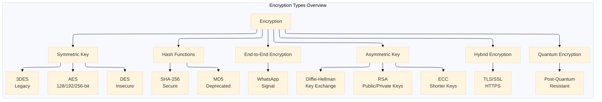

# Encryption is a process of converting information 

```mermaid
---
config:
  theme: base
  layout: elk
---
graph TB
    subgraph "Encryption Types Overview"
        A[Encryption] --> B[Symmetric Key]
        A --> C[Asymmetric Key]
        A --> D[Hash Functions]
        A --> E[Hybrid Encryption]
        A --> F[End-to-End Encryption]
        A --> G[Quantum Encryption]
        
        B --> B1[AES<br/>128/192/256-bit]
        B --> B2[DES<br/>Insecure]
        B --> B3[3DES<br/>Legacy]
        
        C --> C1[RSA<br/>Public/Private Keys]
        C --> C2[ECC<br/>Shorter Keys]
        C --> C3[Diffie-Hellman<br/>Key Exchange]
        
        D --> D1[SHA-256<br/>Secure]
        D --> D2[MD5<br/>Deprecated]
        
        E --> E1[TLS/SSL<br/>HTTPS]
        F --> F1[WhatsApp<br/>Signal]
        G --> G1[Post-Quantum<br/>Resistant]
    end
```
