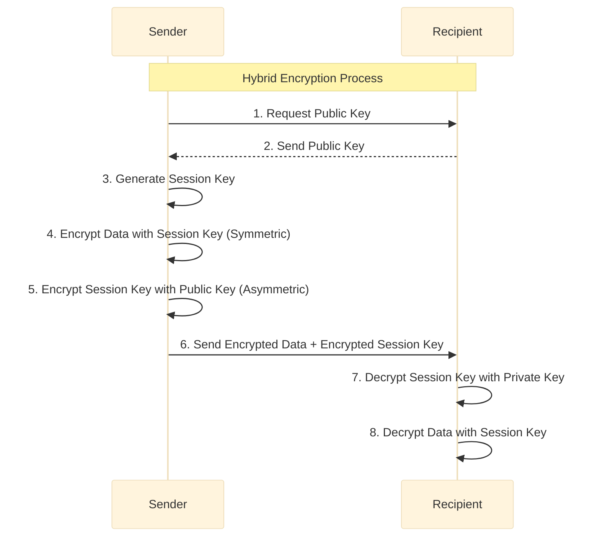

# - Combining both symmetric and asymmetric encrypti

```mermaid
---
config:
  theme: base
  layout: elk
---
sequenceDiagram
    participant Sender as Sender
    participant Recipient as Recipient
    Note over Sender,Recipient: Hybrid Encryption Process
    Sender->>Recipient: 1. Request Public Key
    Recipient-->>Sender: 2. Send Public Key
    Sender->>Sender: 3. Generate Session Key
    Sender->>Sender: 4. Encrypt Data with Session Key (Symmetric)
    Sender->>Sender: 5. Encrypt Session Key with Public Key (Asymmetric)
    Sender->>Recipient: 6. Send Encrypted Data + Encrypted Session Key
    Recipient->>Recipient: 7. Decrypt Session Key with Private Key
    Recipient->>Recipient: 8. Decrypt Data with Session Key
```
