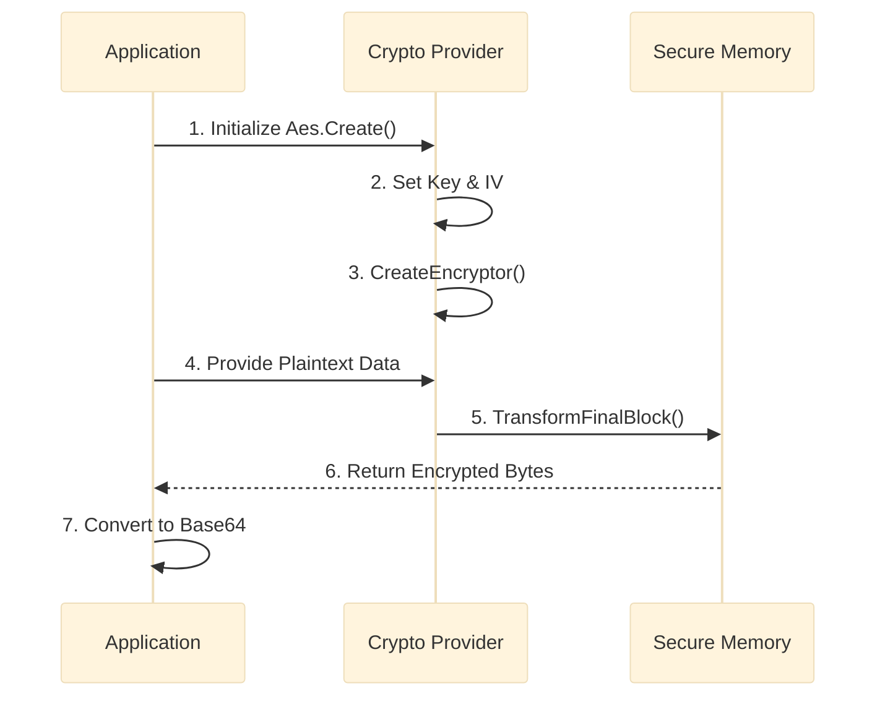

# ```


```mermaid
---
config:
  theme: base
  layout: elk
---
sequenceDiagram
    participant App as Application
    participant Crypto as Crypto Provider
    participant Memory as Secure Memory
    
    App->>Crypto: 1. Initialize Aes.Create()
    Crypto->>Crypto: 2. Set Key & IV
    Crypto->>Crypto: 3. CreateEncryptor()
    App->>Crypto: 4. Provide Plaintext Data
    Crypto->>Memory: 5. TransformFinalBlock()
    Memory-->>App: 6. Return Encrypted Bytes
    App->>App: 7. Convert to Base64
```
