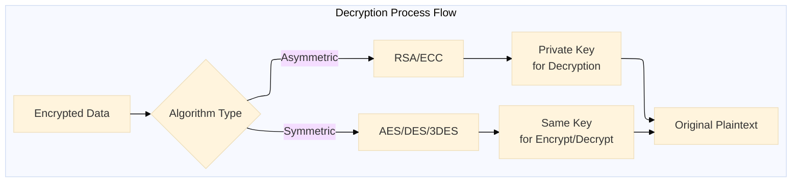

# On the other hand, Decryption in .NET involves the

```mermaid
---
config:
  theme: base
  layout: elk
---
flowchart LR
    subgraph "Decryption Process Flow"
        A[Encrypted Data] --> B{Algorithm Type}
        B -->|Symmetric| C[AES/DES/3DES]
        B -->|Asymmetric| D[RSA/ECC]
        
        C --> C1[Same Key<br/>for Encrypt/Decrypt]
        D --> D1[Private Key<br/>for Decryption]
        
        C1 --> E[Original Plaintext]
        D1 --> E
    end
```
